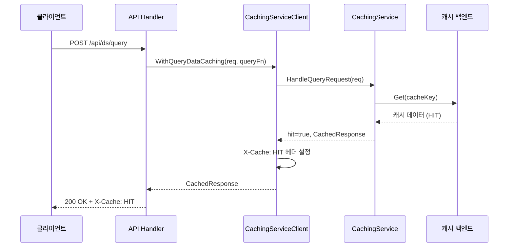
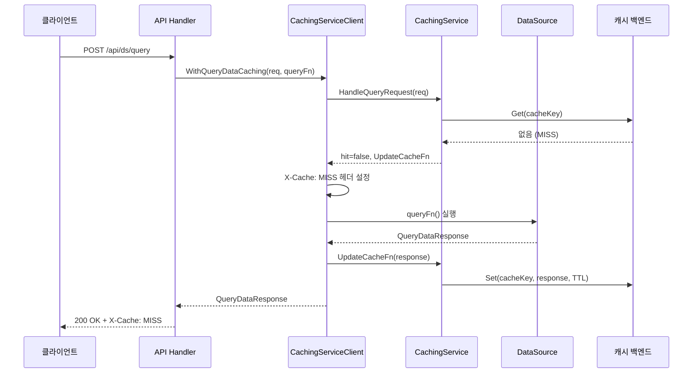

# 21. 캐싱(Caching) 시스템 Deep-Dive

## 1. 개요

### 캐싱이란?

Grafana의 캐싱 시스템은 데이터소스 쿼리 결과, 리소스 요청 응답, 세션 정보 등을 임시 저장하여 반복 요청 시 원본 데이터소스에 접근하지 않고 빠르게 응답하는 메커니즘이다.

### 왜(Why) 캐싱이 필요한가?

1. **성능 향상**: 동일 대시보드를 여러 사용자가 동시에 조회할 때 데이터소스 쿼리를 반복 실행하면 비효율적이다
2. **데이터소스 부하 감소**: Prometheus, Elasticsearch 등 백엔드 시스템에 과도한 쿼리를 보내면 성능 저하가 발생한다
3. **비용 절감**: CloudWatch, BigQuery 등 쿼리 과금형 데이터소스에서 캐싱은 직접적인 비용 절감 효과가 있다
4. **가용성**: 데이터소스가 일시적으로 불가용할 때 캐시된 결과를 보여줄 수 있다

## 2. 캐싱 아키텍처

### 2.1 전체 구조

```
┌─────────────────────────────────────────────────────────────┐
│                    Grafana Server                            │
│                                                              │
│  ┌──────────────┐    ┌───────────────────────────────────┐  │
│  │  API Handler  │───>│  CachingServiceClient              │  │
│  └──────────────┘    │  (pkg/services/caching/service.go)  │  │
│                       │                                     │  │
│                       │  WithQueryDataCaching()             │  │
│                       │  WithCallResourceCaching()          │  │
│                       └───────────┬───────────────────────┘  │
│                                   │                          │
│                       ┌───────────┴───────────────────────┐  │
│                       │  CachingService (Interface)        │  │
│                       │                                     │  │
│                       │  HandleQueryRequest()              │  │
│                       │  HandleResourceRequest()           │  │
│                       └───────────┬───────────────────────┘  │
│                                   │                          │
│           ┌───────────────────────┼───────────────────┐      │
│           │                       │                   │      │
│  ┌────────┴────────┐  ┌──────────┴───────┐  ┌────────┴───┐  │
│  │  OSSCachingService│  │  (Enterprise)    │  │  (Custom)  │  │
│  │  (no-op)          │  │  Redis/Memcache  │  │            │  │
│  └───────────────────┘  └──────────────────┘  └────────────┘  │
│                                                              │
│  ┌──────────────────────────────────────────────────────┐    │
│  │              인프라 캐시 계층                           │    │
│  │  ┌─────────────┐  ┌──────────────┐  ┌─────────────┐ │    │
│  │  │ LocalCache   │  │ RemoteCache   │  │ Encrypted   │ │    │
│  │  │ (in-memory)  │  │ (Redis/MC/DB) │  │ Cache       │ │    │
│  │  └─────────────┘  └──────────────┘  └─────────────┘ │    │
│  └──────────────────────────────────────────────────────┘    │
└─────────────────────────────────────────────────────────────┘
```

### 2.2 캐시 계층

Grafana는 3단계 캐시 계층을 가진다:

| 계층 | 구현 | 용도 | 유효 기간 |
|------|------|------|----------|
| L1: LocalCache | `pkg/infra/localcache/cache.go` | 프로세스 내 메모리 캐시 | 5분 기본 |
| L2: RemoteCache | `pkg/infra/remotecache/remotecache.go` | Redis/Memcached/DB | 24시간 기본 |
| L3: Query Cache | `pkg/services/caching/service.go` | 쿼리 결과 캐시 | 설정 의존 |

## 3. 쿼리 캐싱 (Query Caching)

### 3.1 CachingService 인터페이스

**파일 위치**: `pkg/services/caching/service.go`

```go
// pkg/services/caching/service.go
type CachingService interface {
    // HandleQueryRequest는 쿼리 요청에 대한 캐시를 확인한다.
    // 캐시 히트 시 true를 반환하고, 미스 시 UpdateCacheFn으로 결과를 캐시할 수 있다.
    HandleQueryRequest(ctx context.Context, req *backend.QueryDataRequest) (bool, CachedQueryDataResponse, CacheStatus)
    // HandleResourceRequest는 리소스 요청에 대한 캐시를 확인한다.
    HandleResourceRequest(ctx context.Context, req *backend.CallResourceRequest) (bool, CachedResourceDataResponse, CacheStatus)
}
```

### 3.2 캐시 상태

```go
// pkg/services/caching/service.go
type CacheStatus string

const (
    XCacheHeader               = "X-Cache"
    StatusHit      CacheStatus = "HIT"
    StatusMiss     CacheStatus = "MISS"
    StatusBypass   CacheStatus = "BYPASS"
    StatusError    CacheStatus = "ERROR"
    StatusDisabled CacheStatus = "DISABLED"
)
```

| 상태 | 설명 |
|------|------|
| `HIT` | 캐시에서 결과를 찾음 |
| `MISS` | 캐시에 결과가 없음 → 원본 쿼리 실행 후 캐시 업데이트 |
| `BYPASS` | 캐시를 우회함 (강제 새로고침 등) |
| `ERROR` | 캐시 처리 중 오류 발생 |
| `DISABLED` | 캐싱이 비활성화됨 |

### 3.3 OSS vs Enterprise 캐싱

OSS 버전의 Grafana에서는 쿼리 캐싱이 **no-op**으로 구현된다:

```go
// pkg/services/caching/service.go
type OSSCachingService struct{}

func (s *OSSCachingService) HandleQueryRequest(ctx context.Context, req *backend.QueryDataRequest) (bool, CachedQueryDataResponse, CacheStatus) {
    return false, CachedQueryDataResponse{}, ""
}

func (s *OSSCachingService) HandleResourceRequest(ctx context.Context, req *backend.CallResourceRequest) (bool, CachedResourceDataResponse, CacheStatus) {
    return false, CachedResourceDataResponse{}, ""
}
```

Enterprise 버전에서는 Redis/Memcached를 백엔드로 사용하여 실제 캐싱을 수행한다.

### 3.4 CachingServiceClient

**파일 위치**: `pkg/services/caching/service.go`

CachingServiceClient는 실제 캐싱 로직을 캡슐화하는 래퍼이다:

```go
// pkg/services/caching/service.go
type CachingServiceClient struct {
    cachingService CachingService
    features       featuremgmt.FeatureToggles
}
```

#### 쿼리 데이터 캐싱

```go
// pkg/services/caching/service.go
func (c *CachingServiceClient) WithQueryDataCaching(
    ctx context.Context,
    req *backend.QueryDataRequest,
    f func() (*backend.QueryDataResponse, error),
) (*backend.QueryDataResponse, error) {
    if c == nil || req == nil {
        return f()
    }

    start := time.Now()

    // 1. 캐시 확인
    hit, cr, status := c.cachingService.HandleQueryRequest(ctx, req)

    // 2. X-Cache 헤더 설정
    reqCtx := contexthandler.FromContext(ctx)
    if reqCtx != nil {
        reqCtx.Resp.Header().Set(XCacheHeader, string(status))
    }

    // 3. 캐시 히트 → 즉시 반환
    if hit {
        return cr.Response, nil
    }

    // 4. 캐시 미스 → 실제 쿼리 실행
    resp, err := f()

    // 5. 결과 캐싱
    if err == nil && cr.UpdateCacheFn != nil {
        cr.UpdateCacheFn(ctx, resp)
    }

    return resp, err
}
```

#### 리소스 요청 캐싱

```go
// pkg/services/caching/service.go
func (c *CachingServiceClient) WithCallResourceCaching(
    ctx context.Context,
    req *backend.CallResourceRequest,
    sender backend.CallResourceResponseSender,
    f func(backend.CallResourceResponseSender) error,
) error {
    // 1. 캐시 확인
    hit, cr, status := c.cachingService.HandleResourceRequest(ctx, req)

    // 2. 캐시 히트 → 캐시된 응답 전송
    if hit {
        return sender.Send(cr.Response)
    }

    // 3. 캐시 미스 → 래핑된 sender로 실행 (응답을 가로채어 캐시에 저장)
    if cr.UpdateCacheFn == nil {
        return f(sender)
    }
    cacheSender := backend.CallResourceResponseSenderFunc(func(res *backend.CallResourceResponse) error {
        cr.UpdateCacheFn(ctx, res)
        return sender.Send(res)
    })

    return f(cacheSender)
}
```

### 3.5 캐시된 응답 모델

```go
// pkg/services/caching/service.go
type CachedQueryDataResponse struct {
    Response      *backend.QueryDataResponse
    UpdateCacheFn CacheQueryResponseFn
}

type CachedResourceDataResponse struct {
    Response      *backend.CallResourceResponse
    UpdateCacheFn CacheResourceResponseFn
}
```

## 4. 캐시 키 생성

### 4.1 SHA256 기반 키

**파일 위치**: `pkg/services/caching/service.go`

```go
// pkg/services/caching/service.go
func GetKey(namespace, prefix string, query interface{}) (string, error) {
    keybuf := bytes.NewBuffer(nil)
    encoder := &JSONEncoder{}

    if err := encoder.Encode(keybuf, query); err != nil {
        return "", err
    }

    key, err := SHA256KeyFunc(keybuf)
    if err != nil {
        return "", err
    }

    if namespace != "" {
        return strings.Join([]string{namespace, prefix, key}, ":"), nil
    }
    return strings.Join([]string{prefix, key}, ":"), nil
}

func SHA256KeyFunc(r io.Reader) (string, error) {
    hash := sha256.New()
    if _, err := io.Copy(hash, r); err != nil {
        return "", err
    }
    return hex.EncodeToString(hash.Sum(nil)), nil
}
```

**키 생성 과정**:

```
쿼리 객체 → JSON 직렬화 → SHA256 해시 → hex 인코딩 → "namespace:prefix:hash"

예시:
  쿼리: {"expr": "rate(http_requests_total[5m])"}
  키: "org1:query:a3b4c5d6e7f8....(64자 hex)"
```

### 4.2 JSON 인코더

```go
// pkg/services/caching/service.go
type JSONEncoder struct{}

func (e *JSONEncoder) Encode(w io.Writer, v interface{}) error {
    return json.NewEncoder(w).Encode(v)
}

func (e *JSONEncoder) Decode(r io.Reader, v interface{}) error {
    return json.NewDecoder(r).Decode(v)
}
```

## 5. 인프라 캐시 계층

### 5.1 LocalCache (인메모리)

**파일 위치**: `pkg/infra/localcache/cache.go`

```go
// pkg/infra/localcache/cache.go
type CacheService struct {
    *gocache.Cache

    mu    sync.Mutex
    locks map[string]*lockableEntry
}

func ProvideService() *CacheService {
    return New(5*time.Minute, 10*time.Minute)
}
```

특징:
- `go-cache` 라이브러리 기반
- 기본 TTL: 5분, 정리 주기: 10분
- 프로세스 내 메모리 사용 (서버 재시작 시 소멸)
- **Exclusive Lock** 지원으로 동시 쓰기 방지

```go
// pkg/infra/localcache/cache.go
func (s *CacheService) ExclusiveSet(key string, getValue func() (any, error), dur time.Duration) error {
    unlock := s.Lock(key)
    defer unlock()

    v, err := getValue()
    if err != nil {
        return err
    }

    s.Set(key, v, dur)
    return nil
}

func (s *CacheService) Lock(key string) func() {
    s.mu.Lock()
    entry, ok := s.locks[key]
    if !ok {
        entry = &lockableEntry{}
        s.locks[key] = entry
    }
    entry.holds += 1
    s.mu.Unlock()

    entry.Lock()

    return func() {
        entry.Unlock()
        s.mu.Lock()
        entry.holds -= 1
        if entry.holds == 0 {
            delete(s.locks, key)
        }
        s.mu.Unlock()
    }
}
```

**Lock 메커니즘**:

```
Thread A: Lock("key1") → 획득 → 작업 중...
Thread B: Lock("key1") → 대기 (Thread A가 해제할 때까지)
Thread C: Lock("key2") → 즉시 획득 (다른 키)
Thread A: Unlock() → Thread B가 "key1" 획득
```

### 5.2 RemoteCache (분산 캐시)

**파일 위치**: `pkg/infra/remotecache/remotecache.go`

```go
// pkg/infra/remotecache/remotecache.go
type CacheStorage interface {
    Get(ctx context.Context, key string) ([]byte, error)
    Set(ctx context.Context, key string, value []byte, expire time.Duration) error
    Delete(ctx context.Context, key string) error
}

type RemoteCache struct {
    client   CacheStorage
    SQLStore db.DB
    Cfg      *setting.Cfg
}
```

#### 지원 백엔드

```go
// pkg/infra/remotecache/remotecache.go
func createClient(opts *setting.RemoteCacheSettings, sqlstore db.DB, secretsService secrets.Service) (cache CacheStorage, err error) {
    switch opts.Name {
    case redisCacheType:
        cache, err = newRedisStorage(opts)
    case memcachedCacheType:
        cache = newMemcachedStorage(opts)
    case databaseCacheType:
        cache = newDatabaseCache(sqlstore)
    default:
        return nil, ErrInvalidCacheType
    }
    // ...
}
```

| 백엔드 | 파일 | 특징 |
|--------|------|------|
| Redis | `redis_storage.go` | 고성능, 분산 환경 지원, TTL 기본 지원 |
| Memcached | `memcached_storage.go` | 단순 키-값, 대규모 캐시에 적합 |
| Database | `database_storage.go` | SQLite/PostgreSQL, 추가 인프라 불필요 |

### 5.3 캐시 데코레이터 패턴

```go
// pkg/infra/remotecache/remotecache.go
// 접두사 캐시: 모든 키에 접두사 추가
type prefixCacheStorage struct {
    cache  CacheStorage
    prefix string
}

// 암호화 캐시: 저장/조회 시 암/복호화
type encryptedCacheStorage struct {
    cache          CacheStorage
    secretsService encryptionService
}
```

**데코레이터 체인**:

```
원본 캐시 (Redis)
  └── prefixCacheStorage (접두사 추가: "grafana:")
       └── encryptedCacheStorage (AES 암호화)
            └── 최종 사용
```

## 6. 캐싱 메트릭

**파일 위치**: `pkg/services/caching/metrics.go`

```go
// pkg/services/caching/metrics.go
var QueryCachingRequestHistogram = prometheus.NewHistogramVec(prometheus.HistogramOpts{
    Namespace: metrics.ExporterName,
    Subsystem: "caching",
    Name:      "query_caching_request_duration_seconds",
    Help:      "histogram of grafana query endpoint requests in seconds",
    Buckets:   []float64{.005, .01, .025, .05, .1, .25, .5, 1, 2.5, 5, 10, 25, 50, 100},
}, []string{"datasource_type", "cache", "query_type"})

var ResourceCachingRequestHistogram = prometheus.NewHistogramVec(prometheus.HistogramOpts{
    Namespace: metrics.ExporterName,
    Subsystem: "caching",
    Name:      "resource_caching_request_duration_seconds",
    Help:      "histogram of grafana resource endpoint requests in seconds",
    Buckets:   []float64{.005, .01, .025, .05, .1, .25, .5, 1, 2.5, 5, 10, 25, 50, 100},
}, []string{"plugin_id", "cache"})
```

모니터링 가능한 메트릭:

| 메트릭 | 라벨 | 설명 |
|--------|------|------|
| `query_caching_request_duration_seconds` | datasource_type, cache, query_type | 쿼리 요청 처리 시간 (HIT/MISS 구분) |
| `resource_caching_request_duration_seconds` | plugin_id, cache | 리소스 요청 처리 시간 |
| `should_cache_query_request_duration_seconds` | datasource_type, cache, shouldCache | AWS 비동기 캐싱 판단 시간 |

## 7. 쿼리 데이터 캐싱 흐름

### 7.1 캐시 히트 흐름



### 7.2 캐시 미스 흐름



## 8. AWS 비동기 쿼리 캐싱

**파일 위치**: `pkg/services/caching/service.go`

```go
// pkg/services/caching/service.go
// AWS 비동기 쿼리 (CloudWatch 등)의 특수 캐싱 로직
if c.features == nil || !c.features.IsEnabled(ctx, featuremgmt.FlagAwsAsyncQueryCaching) {
    cr.UpdateCacheFn(ctx, resp)
} else if reqCtx != nil {
    shouldCache := ShouldCacheQuery(resp)
    if shouldCache {
        cr.UpdateCacheFn(ctx, resp)
    }
}
```

AWS CloudWatch 쿼리는 비동기적으로 실행될 수 있다:
- 쿼리 실행 중(running) 상태의 응답은 캐싱하면 안 된다
- `ShouldCacheQuery()` 함수가 응답을 검사하여 완료된 결과만 캐싱한다

## 9. 설정

### 9.1 RemoteCache 설정

```ini
[remote_cache]
# 캐시 백엔드 유형
type = redis  # redis, memcached, database

# Redis 설정
connstr = addr=127.0.0.1:6379,pool_size=100,db=0

# 키 접두사
prefix = grafana

# 암호화 활성화
encryption = true
```

### 9.2 쿼리 캐싱 설정 (Enterprise)

```ini
[caching]
enabled = true
# 기본 TTL (초)
ttl = 60
# 최대 TTL (초)
max_ttl = 300
# 백엔드
backend = redis
```

## 10. 캐시 무효화 전략

### 10.1 TTL 기반 만료

- 각 캐시 항목에 TTL(Time-To-Live) 설정
- 만료 시 자동 제거
- 기본 TTL: LocalCache 5분, RemoteCache 24시간

### 10.2 명시적 삭제

```go
// pkg/infra/remotecache/remotecache.go
func (ds *RemoteCache) Delete(ctx context.Context, key string) error {
    return ds.client.Delete(ctx, key)
}
```

### 10.3 백그라운드 정리

```go
// pkg/infra/remotecache/remotecache.go
func (ds *RemoteCache) Run(ctx context.Context) error {
    backgroundjob, ok := ds.client.(registry.BackgroundService)
    if ok {
        return backgroundjob.Run(ctx)
    }
    <-ctx.Done()
    return ctx.Err()
}
```

Database 캐시 백엔드는 백그라운드 작업으로 만료된 항목을 정리한다.

## 11. 보안 고려사항

### 11.1 캐시 키 충돌 방지

SHA256 해시를 사용하여 쿼리 내용이 다르면 다른 키가 생성된다:

```
Query A: rate(http_requests[5m]) → SHA256 → key_A
Query B: rate(http_requests[1m]) → SHA256 → key_B
```

### 11.2 암호화

```go
// pkg/infra/remotecache/remotecache.go
type encryptedCacheStorage struct {
    cache          CacheStorage
    secretsService encryptionService
}

func (pcs *encryptedCacheStorage) Set(ctx context.Context, key string, value []byte, expire time.Duration) error {
    encrypted, err := pcs.secretsService.Encrypt(ctx, value, secrets.WithoutScope())
    if err != nil {
        return err
    }
    return pcs.cache.Set(ctx, key, encrypted, expire)
}
```

- 민감한 쿼리 결과가 Redis/Memcached에 평문으로 저장되는 것을 방지
- AES 암호화를 사용하여 저장 전 암호화, 조회 시 복호화

### 11.3 조직 격리

캐시 키에 namespace(조직 ID)를 포함하여 조직 간 캐시 데이터 유출을 방지:

```
Org 1의 쿼리: "org1:query:hash_abc"
Org 2의 동일 쿼리: "org2:query:hash_abc"
→ 같은 쿼리라도 다른 캐시 키
```

## 12. 정리

| 항목 | 내용 |
|------|------|
| 쿼리 캐싱 인터페이스 | `pkg/services/caching/service.go` (CachingService) |
| OSS 구현 | no-op (Enterprise에서 실제 캐싱) |
| LocalCache | `pkg/infra/localcache/cache.go` (인메모리, 5분 TTL) |
| RemoteCache | `pkg/infra/remotecache/remotecache.go` (Redis/MC/DB) |
| 캐시 키 | SHA256(JSON(query)) |
| 메트릭 | `pkg/services/caching/metrics.go` (Prometheus 히스토그램) |
| 데코레이터 | prefix, encrypted 래핑 가능 |
| 캐시 상태 | HIT, MISS, BYPASS, ERROR, DISABLED |
| X-Cache 헤더 | 응답에 캐시 상태 포함 |

Grafana의 캐싱 시스템은 **인터페이스 기반 플러그인 아키텍처**를 채택하여, OSS 버전은 no-op으로 동작하고 Enterprise 버전에서 실제 캐싱을 활성화한다. 이는 코드 복잡도를 낮추면서 상업적 차별화를 가능하게 하는 설계이다. 인프라 계층의 LocalCache와 RemoteCache는 모든 버전에서 사용 가능하며, 세션 관리, 권한 캐시 등 다양한 내부 용도로 활용된다.
