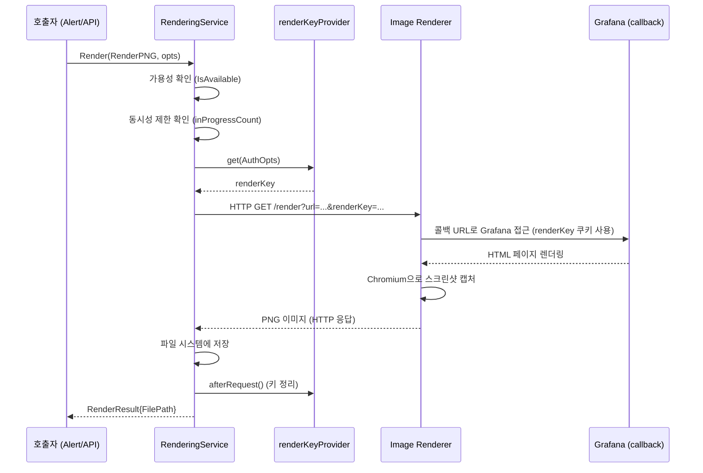

# 22. 렌더링(Rendering) 시스템 Deep-Dive

## 1. 개요

### 렌더링이란?

Grafana의 렌더링 시스템은 대시보드 패널이나 전체 대시보드를 **PNG 이미지, PDF 파일, CSV 데이터**로 변환하는 서버사이드 프로세스이다. 브라우저 없이도 Grafana 시각화를 정적 파일로 출력할 수 있다.

### 왜(Why) 서버사이드 렌더링이 필요한가?

1. **알림 첨부**: 알림 발생 시 관련 그래프 이미지를 Slack, Email에 첨부해야 한다
2. **리포트 생성**: 주간/월간 리포트를 PDF로 자동 생성하여 이메일 발송
3. **외부 공유**: Grafana 접근 권한이 없는 사람에게 시각화를 공유
4. **스크린샷 자동화**: CI/CD 파이프라인에서 대시보드 상태를 기록

## 2. 아키텍처

### 2.1 전체 구조

```
┌─────────────────────────────────────────────────────────────┐
│                     Grafana Server                           │
│                                                              │
│  ┌──────────────────┐                                        │
│  │  Alert Manager   │──┐                                     │
│  │  (스크린샷 요청)  │  │                                     │
│  └──────────────────┘  │                                     │
│                         │    ┌────────────────────────────┐   │
│  ┌──────────────────┐  ├──>│  RenderingService            │   │
│  │  API Handler     │──┤   │  (pkg/services/rendering/)   │   │
│  │  (이미지/PDF)    │  │   │                              │   │
│  └──────────────────┘  │   │  ┌────────────────────────┐ │   │
│                         │   │  │  renderKeyProvider     │ │   │
│  ┌──────────────────┐  │   │  │  (인증 토큰 관리)      │ │   │
│  │  Report Service  │──┘   │  └────────────────────────┘ │   │
│  │  (리포트 생성)   │      │                              │   │
│  └──────────────────┘      │  ┌────────────────────────┐ │   │
│                             │  │  Capability Check      │ │   │
│                             │  │  (버전별 기능 확인)    │ │   │
│                             │  └────────────────────────┘ │   │
│                             └──────────┬─────────────────┘   │
│                                        │                      │
└────────────────────────────────────────┼──────────────────────┘
                                         │ HTTP/gRPC
                    ┌────────────────────┴──────────────────────┐
                    │          Image Renderer Service            │
                    │  (grafana-image-renderer 플러그인)          │
                    │                                            │
                    │  ┌──────────────┐  ┌──────────────────┐   │
                    │  │  Chromium     │  │  Headless Mode   │   │
                    │  │  Browser      │  │  (--headless)    │   │
                    │  └──────────────┘  └──────────────────┘   │
                    │                                            │
                    │  URL로 Grafana 접근 → 페이지 렌더링         │
                    │  → 스크린샷/PDF 캡처 → 결과 반환             │
                    └───────────────────────────────────────────┘
```

### 2.2 렌더링 모드

Grafana는 하나의 렌더링 모드를 지원한다:

| 모드 | 설명 |
|------|------|
| HTTP 모드 | 외부 Image Renderer 서비스에 HTTP 요청 |

`RendererServerUrl` 설정으로 외부 렌더링 서비스의 URL을 지정한다.

## 3. 핵심 소스코드 분석

### 3.1 Service 인터페이스

**파일 위치**: `pkg/services/rendering/interface.go`

```go
// pkg/services/rendering/interface.go
type Service interface {
    IsAvailable(ctx context.Context) bool
    Version() string
    Render(ctx context.Context, renderType RenderType, opts Opts, session Session) (*RenderResult, error)
    RenderCSV(ctx context.Context, opts CSVOpts, session Session) (*RenderCSVResult, error)
    RenderErrorImage(theme models.Theme, err error) (*RenderResult, error)
    GetRenderUser(ctx context.Context, key string) (*RenderUser, bool)
    HasCapability(ctx context.Context, capability CapabilityName) (CapabilitySupportRequestResult, error)
    IsCapabilitySupported(ctx context.Context, capability CapabilityName) error
    CreateRenderingSession(ctx context.Context, authOpts AuthOpts, sessionOpts SessionOpts) (Session, error)
}
```

### 3.2 렌더링 타입

```go
// pkg/services/rendering/interface.go
type RenderType string

const (
    RenderCSV RenderType = "csv"
    RenderPNG RenderType = "png"
    RenderPDF RenderType = "pdf"
)
```

### 3.3 렌더링 옵션

```go
// pkg/services/rendering/interface.go
type CommonOpts struct {
    TimeoutOpts
    AuthOpts
    Path            string              // 렌더링할 Grafana 경로
    Timezone        string              // 타임존
    ConcurrentLimit int                 // 동시 렌더링 제한
    Headers         map[string][]string // 추가 HTTP 헤더
}

type Opts struct {
    CommonOpts
    ErrorOpts
    Width             int          // 이미지 너비 (px)
    Height            int          // 이미지 높이 (px)
    DeviceScaleFactor float64      // 해상도 배율 (1x, 2x 등)
    Theme             models.Theme // 테마 (dark/light)
}

type TimeoutOpts struct {
    Timeout                  time.Duration // 렌더링 타임아웃
    RequestTimeoutMultiplier time.Duration // HTTP 요청 타임아웃 배수
}

type AuthOpts struct {
    OrgID   int64        // 조직 ID
    UserID  int64        // 사용자 ID
    OrgRole org.RoleType // 조직 역할
}
```

### 3.4 RenderingService 구현

**파일 위치**: `pkg/services/rendering/rendering.go`

```go
// pkg/services/rendering/rendering.go
type RenderingService struct {
    log                 log.Logger
    renderAction        renderFunc
    renderCSVAction     renderCSVFunc
    domain              string
    inProgressCount     atomic.Int32        // 진행 중 렌더링 수
    version             string
    versionMutex        sync.RWMutex
    capabilities        []Capability
    rendererCallbackURL string
    netClient           *http.Client

    perRequestRenderKeyProvider renderKeyProvider
    Cfg                         *setting.Cfg
    features                    featuremgmt.FeatureToggles
    RemoteCacheService          *remotecache.RemoteCache
    RendererPluginManager       PluginManager
}
```

### 3.5 서비스 초기화

```go
// pkg/services/rendering/rendering.go
func ProvideService(cfg *setting.Cfg, features featuremgmt.FeatureToggles,
    remoteCache *remotecache.RemoteCache, rm PluginManager) (*RenderingService, error) {

    // 1. 출력 디렉토리 생성
    folders := []string{cfg.ImagesDir, cfg.CSVsDir, cfg.PDFsDir}
    for _, f := range folders {
        err := os.MkdirAll(f, 0700)
        // ...
    }

    // 2. 콜백 URL 설정 (이미지 렌더러가 Grafana에 접근할 URL)
    rendererCallbackURL := cfg.RendererCallbackUrl
    if cfg.RendererServerUrl != "" && rendererCallbackURL == "" {
        rendererCallbackURL = cfg.AppURL
    }

    // 3. 인증 방식 선택 (JWT 또는 캐시 기반)
    var renderKeyProvider renderKeyProvider
    if features.IsEnabledGlobally(featuremgmt.FlagRenderAuthJWT) {
        renderKeyProvider = &jwtRenderKeyProvider{...}
    } else {
        renderKeyProvider = &perRequestRenderKeyProvider{...}
    }

    // 4. 기능(Capability) 등록
    s := &RenderingService{
        capabilities: []Capability{
            {name: FullHeightImages, semverConstraint: ">= 3.4.0"},
            {name: ScalingDownImages, semverConstraint: ">= 3.4.0"},
            {name: PDFRendering, semverConstraint: ">= 3.10.0"},
        },
        // ...
    }

    return s, nil
}
```

## 4. 렌더링 흐름

### 4.1 PNG 렌더링 흐름



### 4.2 동시성 제어

```go
// pkg/services/rendering/rendering.go
func (rs *RenderingService) render(ctx context.Context, renderType RenderType,
    opts Opts, renderKeyProvider renderKeyProvider) (*RenderResult, error) {

    // 동시 렌더링 수 증가
    newInProgressCount := rs.inProgressCount.Add(1)

    defer func() {
        metrics.MRenderingQueue.Set(float64(rs.inProgressCount.Add(-1)))
    }()
    metrics.MRenderingQueue.Set(float64(newInProgressCount))

    // 동시성 제한 초과 시 에러 이미지 반환
    if opts.ConcurrentLimit > 0 && int(newInProgressCount) > opts.ConcurrentLimit {
        if opts.ErrorConcurrentLimitReached {
            return nil, ErrConcurrentLimitReached
        }
        filePath := fmt.Sprintf("public/img/rendering_limit_%s.png", theme)
        return &RenderResult{FilePath: filepath.Join(rs.Cfg.HomePath, filePath)}, nil
    }

    // ...
}
```

**동시성 제어 메커니즘**:

```
┌──────────────────────────────────────────┐
│          inProgressCount (atomic.Int32)   │
│                                          │
│  요청 1 시작 → count: 1 ✓               │
│  요청 2 시작 → count: 2 ✓               │
│  요청 3 시작 → count: 3 ✓               │
│  요청 4 시작 → count: 4 > limit(3)      │
│                → 에러 이미지 반환! ✗      │
│  요청 1 완료 → count: 3                  │
│  요청 5 시작 → count: 4 > limit(3)      │
│                → 에러 이미지 반환! ✗      │
│  요청 2 완료 → count: 3                  │
│  요청 3 완료 → count: 2                  │
│  요청 6 시작 → count: 3 ✓               │
└──────────────────────────────────────────┘
```

## 5. 인증 시스템

### 5.1 renderKey 인증

**파일 위치**: `pkg/services/rendering/auth.go`

Image Renderer가 Grafana에 콜백할 때 사용자 컨텍스트를 전달하기 위해 renderKey를 사용한다:

```go
// pkg/services/rendering/auth.go
type RenderUser struct {
    OrgID   int64  `json:"org_id"`
    UserID  int64  `json:"user_id"`
    OrgRole string `json:"org_role"`
}

const renderKeyPrefix = "render-%s"
```

### 5.2 두 가지 인증 방식

#### (A) 캐시 기반 renderKey

```go
// pkg/services/rendering/auth.go
type perRequestRenderKeyProvider struct {
    cache     *remotecache.RemoteCache
    log       log.Logger
    keyExpiry time.Duration
}

func (r *perRequestRenderKeyProvider) get(ctx context.Context, opts AuthOpts) (string, error) {
    return generateAndSetRenderKey(r.cache, ctx, opts, r.keyExpiry)
}

func (r *perRequestRenderKeyProvider) afterRequest(ctx context.Context, _ AuthOpts, renderKey string) {
    deleteRenderKey(r.cache, r.log, ctx, renderKey)
}
```

동작 원리:
1. 렌더링 요청 시 랜덤 renderKey 생성
2. `RemoteCache`에 renderKey → RenderUser 매핑 저장
3. Image Renderer가 콜백 시 renderKey를 제시
4. Grafana가 캐시에서 RenderUser 조회하여 인증
5. 렌더링 완료 후 캐시에서 renderKey 삭제

#### (B) JWT 기반 renderKey

```go
// pkg/services/rendering/auth.go
type jwtRenderKeyProvider struct {
    log       log.Logger
    authToken []byte
    keyExpiry time.Duration
}

func (j *jwtRenderKeyProvider) get(_ context.Context, opts AuthOpts) (string, error) {
    token := jwt.NewWithClaims(jwt.SigningMethodHS512, j.buildJWTClaims(opts))
    return token.SignedString(j.authToken)
}

func (j *jwtRenderKeyProvider) afterRequest(_ context.Context, _ AuthOpts, _ string) {
    // JWT는 만료 시간이 내장되어 있으므로 별도 정리 불필요
}
```

JWT 방식의 장점:
- 캐시 접근 불필요 → 지연 시간 감소
- 자체 만료 → afterRequest에서 정리 불필요
- stateless → 수평 확장 용이

### 5.3 세션 기반 렌더링

```go
// pkg/services/rendering/auth.go
type longLivedRenderKeyProvider struct {
    cache       *remotecache.RemoteCache
    log         log.Logger
    renderKey   string
    authOpts    AuthOpts
    sessionOpts SessionOpts
}

func (rs *RenderingService) CreateRenderingSession(ctx context.Context,
    opts AuthOpts, sessionOpts SessionOpts) (Session, error) {

    renderKey, err := generateAndSetRenderKey(rs.RemoteCacheService, ctx, opts, sessionOpts.Expiry)
    if err != nil {
        return nil, err
    }

    return &longLivedRenderKeyProvider{
        renderKey:   renderKey,
        cache:       rs.RemoteCacheService,
        authOpts:    opts,
        sessionOpts: sessionOpts,
    }, nil
}
```

세션은 여러 렌더링 요청에 걸쳐 동일한 renderKey를 재사용한다:
- 리포트 생성 시 여러 패널을 연속으로 렌더링할 때 효율적
- `RefreshExpiryOnEachRequest` 옵션으로 매 요청마다 TTL 갱신 가능
- `Dispose()`로 명시적 세션 종료

## 6. HTTP 모드 상세

### 6.1 URL 생성

**파일 위치**: `pkg/services/rendering/http_mode.go`

```go
// pkg/services/rendering/http_mode.go
func (rs *RenderingService) generateImageRendererURL(renderType RenderType,
    opts Opts, renderKey string) (*url.URL, error) {

    rendererUrl := rs.Cfg.RendererServerUrl
    if renderType == RenderCSV {
        rendererUrl += "/csv"
    }

    imageRendererURL, _ := url.Parse(rendererUrl)

    queryParams := imageRendererURL.Query()
    queryParams.Add("url", rs.getGrafanaCallbackURL(opts.Path))
    queryParams.Add("renderKey", renderKey)
    queryParams.Add("domain", rs.domain)
    queryParams.Add("timezone", isoTimeOffsetToPosixTz(opts.Timezone))
    queryParams.Add("encoding", string(renderType))
    queryParams.Add("timeout", strconv.Itoa(int(opts.Timeout.Seconds())))

    if renderType == RenderPNG {
        queryParams.Add("width", strconv.Itoa(opts.Width))
        queryParams.Add("height", strconv.Itoa(opts.Height))
    }

    if renderType != RenderCSV {
        queryParams.Add("deviceScaleFactor", fmt.Sprintf("%f", opts.DeviceScaleFactor))
    }

    imageRendererURL.RawQuery = queryParams.Encode()
    return imageRendererURL, nil
}
```

### 6.2 콜백 URL 생성

```go
// pkg/services/rendering/rendering.go
func (rs *RenderingService) getGrafanaCallbackURL(path string) string {
    if rs.rendererCallbackURL != "" {
        return fmt.Sprintf("%s%s&render=1", rs.rendererCallbackURL, path)
    }
    // ...
    return fmt.Sprintf("%s://%s:%s%s/%s&render=1", protocol, rs.domain, rs.Cfg.HTTPPort, subPath, path)
}
```

`&render=1` 파라미터는 Grafana가 이 요청이 렌더링 콜백임을 인식하는 신호이다.

### 6.3 HTTP 요청 및 파일 저장

```go
// pkg/services/rendering/http_mode.go
func (rs *RenderingService) doRequestAndWriteToFile(ctx context.Context, renderType RenderType,
    rendererURL *url.URL, timeoutOpts TimeoutOpts, headers map[string][]string) (*Result, error) {

    filePath, _ := rs.getNewFilePath(renderType)

    reqContext, cancel := context.WithTimeout(ctx, getRequestTimeout(timeoutOpts))
    defer cancel()

    resp, err := rs.doRequest(reqContext, rendererURL, headers)
    // ...

    err = rs.writeResponseToFile(reqContext, resp, filePath)
    // ...

    return &Result{FilePath: filePath, FileName: downloadFileName}, nil
}
```

## 7. Capability 시스템

**파일 위치**: `pkg/services/rendering/capabilities.go`

```go
// pkg/services/rendering/capabilities.go
type CapabilityName string

const (
    ScalingDownImages CapabilityName = "ScalingDownImages"
    FullHeightImages  CapabilityName = "FullHeightImages"
    PDFRendering      CapabilityName = "PdfRendering"
)
```

이미지 렌더러의 버전에 따라 사용 가능한 기능이 다르다:

| 기능 | 최소 버전 | 설명 |
|------|----------|------|
| FullHeightImages | >= 3.4.0 | 전체 높이 이미지 |
| ScalingDownImages | >= 3.4.0 | 이미지 축소 |
| PDFRendering | >= 3.10.0 | PDF 렌더링 |

### 7.1 기능 확인

```go
// pkg/services/rendering/capabilities.go
func (rs *RenderingService) HasCapability(ctx context.Context, capability CapabilityName) (CapabilitySupportRequestResult, error) {
    // ...
    compiledSemverConstraint, _ := semver.NewConstraint(semverConstraint)
    compiledImageRendererVersion, _ := semver.NewVersion(imageRendererVersion)

    return CapabilitySupportRequestResult{
        IsSupported: compiledSemverConstraint.Check(compiledImageRendererVersion),
        SemverConstraint: semverConstraint,
    }, nil
}
```

## 8. 에러 처리

### 8.1 에러 유형

```go
// pkg/services/rendering/interface.go
var ErrTimeout = errors.New("timeout error")
var ErrConcurrentLimitReached = errors.New("rendering concurrent limit reached")
var ErrRenderUnavailable = errors.New("rendering plugin not available")
var ErrServerTimeout = errutil.NewBase(errutil.StatusUnknown, "rendering.serverTimeout")
var ErrTooManyRequests = errutil.NewBase(errutil.StatusTooManyRequests, "rendering.tooManyRequests")
```

### 8.2 에러 이미지

```go
// pkg/services/rendering/rendering.go
func (rs *RenderingService) RenderErrorImage(theme models.Theme, err error) (*RenderResult, error) {
    imgUrl := "public/img/rendering_%s_%s.png"
    if errors.Is(err, ErrTimeout) || errors.Is(err, ErrServerTimeout) {
        imgUrl = fmt.Sprintf(imgUrl, "timeout", theme)
    } else {
        imgUrl = fmt.Sprintf(imgUrl, "error", theme)
    }

    imgPath := filepath.Join(rs.Cfg.HomePath, imgUrl)
    return &RenderResult{FilePath: imgPath}, nil
}
```

에러 발생 시 에러 유형에 맞는 정적 이미지를 반환:
- `rendering_timeout_dark.png` / `rendering_timeout_light.png`
- `rendering_error_dark.png` / `rendering_error_light.png`
- `rendering_limit_dark.png` / `rendering_limit_light.png`
- `rendering_plugin_not_installed.png`

## 9. 메트릭

```go
// pkg/services/rendering/rendering.go
func saveMetrics(elapsedTime int64, err error, renderType RenderType) {
    if err == nil {
        metrics.MRenderingRequestTotal.WithLabelValues("success", string(renderType)).Inc()
        metrics.MRenderingSummary.WithLabelValues("success", string(renderType)).Observe(float64(elapsedTime))
        return
    }

    if errors.Is(err, ErrTimeout) {
        metrics.MRenderingRequestTotal.WithLabelValues("timeout", string(renderType)).Inc()
    } else {
        metrics.MRenderingRequestTotal.WithLabelValues("failure", string(renderType)).Inc()
    }
}
```

| 메트릭 | 라벨 | 설명 |
|--------|------|------|
| `grafana_rendering_request_total` | status, type | 렌더링 요청 총 수 |
| `grafana_rendering_summary` | status, type | 렌더링 시간 분포 |
| `grafana_rendering_queue` | - | 현재 진행 중인 렌더링 수 |

## 10. 렌더러 버전 관리

**파일 위치**: `pkg/services/rendering/http_mode.go`

```go
// pkg/services/rendering/http_mode.go
func (rs *RenderingService) Run(ctx context.Context) error {
    if rs.remoteAvailable() {
        // 버전 가져오기 (재시도 포함)
        rs.getRemotePluginVersionWithRetry(func(version string, err error) {
            rs.version = version
        })

        rs.renderAction = rs.renderViaHTTP
        rs.renderCSVAction = rs.renderCSVViaHTTP

        // 15분마다 버전 갱신
        refreshTicker := time.NewTicker(remoteVersionRefreshInterval)
        for {
            select {
            case <-refreshTicker.C:
                go rs.refreshRemotePluginVersion()
            case <-ctx.Done():
                refreshTicker.Stop()
                return nil
            }
        }
    }
    // ...
}
```

## 11. 설정

```ini
[rendering]
# 외부 렌더링 서비스 URL
server_url = http://renderer:8081/render
# 콜백 URL (렌더러가 Grafana에 접근할 URL)
callback_url = http://grafana:3000/
# 인증 토큰
renderer_token = secret-token
# 동시 렌더링 제한
concurrent_render_limit = 30
# 렌더링 타임아웃
rendering_timeout = 30
# CA 인증서 (TLS)
renderer_ca_cert =
# JWT 인증 사용
render_auth_jwt = false
```

## 12. 보안 고려사항

### 12.1 renderKey 보안

- renderKey는 32바이트 랜덤 문자열 또는 JWT
- 요청 완료 후 즉시 삭제 (per-request 모드)
- TTL 설정으로 미사용 키 자동 만료

### 12.2 네트워크 보안

```go
// pkg/services/rendering/rendering.go
// TLS CA 인증서 설정
if cfg.RendererCACert != "" {
    caCert, _ := os.ReadFile(cfg.RendererCACert)
    caCertPool := x509.NewCertPool()
    caCertPool.AppendCertsFromPEM(caCert)
    netTransport.TLSClientConfig = &tls.Config{
        RootCAs: caCertPool,
    }
}
```

### 12.3 인증 토큰

```go
// pkg/services/rendering/http_mode.go
const authTokenHeader = "X-Auth-Token"

func (rs *RenderingService) doRequest(ctx context.Context, u *url.URL, headers map[string][]string) (*http.Response, error) {
    req, _ := http.NewRequestWithContext(ctx, "GET", u.String(), nil)
    req.Header.Set(authTokenHeader, rs.Cfg.RendererAuthToken)
    req.Header.Set("User-Agent", fmt.Sprintf("Grafana/%s", rs.Cfg.BuildVersion))
    // ...
}
```

## 13. 파일 관리

```go
// pkg/services/rendering/rendering.go
func (rs *RenderingService) getNewFilePath(rt RenderType) (string, error) {
    rand, _ := util.GetRandomString(20)

    var ext, folder string
    switch rt {
    case RenderCSV:
        ext, folder = "csv", rs.Cfg.CSVsDir
    case RenderPDF:
        ext, folder = "pdf", rs.Cfg.PDFsDir
    default:
        ext, folder = "png", rs.Cfg.ImagesDir
    }

    return filepath.Abs(filepath.Join(folder, fmt.Sprintf("%s.%s", rand, ext)))
}
```

렌더링 결과는 랜덤 파일명으로 저장:
- PNG: `data/png/{random20}.png`
- PDF: `data/pdf/{random20}.pdf`
- CSV: `data/csv/{random20}.csv`

## 14. 정리

| 항목 | 내용 |
|------|------|
| Service 인터페이스 | `pkg/services/rendering/interface.go` |
| 구현 | `pkg/services/rendering/rendering.go` |
| HTTP 모드 | `pkg/services/rendering/http_mode.go` |
| 인증 | `pkg/services/rendering/auth.go` |
| 기능 확인 | `pkg/services/rendering/capabilities.go` |
| 렌더링 타입 | PNG, PDF, CSV |
| 인증 방식 | renderKey (캐시/JWT) |
| 동시성 제어 | atomic.Int32 카운터 |
| 에러 처리 | 에러 유형별 정적 이미지 반환 |
| 메트릭 | request_total, summary, queue |

Grafana의 렌더링 시스템은 **관심사 분리** 원칙을 철저히 따른다. Grafana 서버는 렌더링을 직접 수행하지 않고, 외부 Image Renderer 서비스에 위임한다. 이 설계는 브라우저 엔진(Chromium)의 무거운 의존성을 Grafana 코어에서 분리하여 배포/운영의 유연성을 확보하면서도, renderKey 기반 인증과 Capability 시스템으로 보안과 호환성을 보장한다.
