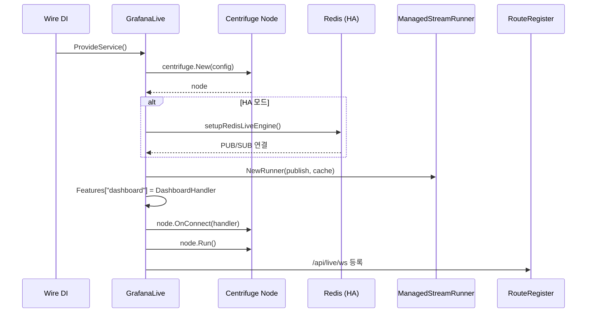

# 27. 라이브 채널 (WebSocket) & 라이브러리 패널 심층 분석

> Grafana 소스 기준: `pkg/services/live/`, `pkg/services/libraryelements/`
> 작성일: 2026-03-08

---

## 목차
1. [개요](#1-개요)
2. [Part A: Grafana Live — 실시간 WebSocket 아키텍처](#2-part-a-grafana-live--실시간-websocket-아키텍처)
3. [GrafanaLive 서비스 초기화](#3-grafanalive-서비스-초기화)
4. [Centrifuge 노드와 연결 관리](#4-centrifuge-노드와-연결-관리)
5. [채널 핸들러 시스템](#5-채널-핸들러-시스템)
6. [Pipeline: 규칙 기반 데이터 처리](#6-pipeline-규칙-기반-데이터-처리)
7. [고가용성 (HA) — Redis 기반 확장](#7-고가용성-ha--redis-기반-확장)
8. [ManagedStream과 Push WebSocket](#8-managedstream과-push-websocket)
9. [Part B: 라이브러리 패널 (Library Elements)](#9-part-b-라이브러리-패널-library-elements)
10. [데이터 모델과 연결(Connection) 시스템](#10-데이터-모델과-연결connection-시스템)
11. [CRUD 흐름 상세 분석](#11-crud-흐름-상세-분석)
12. [검색과 폴더 트리 캐시](#12-검색과-폴더-트리-캐시)
13. [Kubernetes 통합 (K8s Handler)](#13-kubernetes-통합-k8s-handler)
14. [설계 결정과 교훈](#14-설계-결정과-교훈)

---

## 1. 개요

이 문서는 Grafana의 **실시간 통신 시스템(Grafana Live)**과 **재사용 가능한 패널 시스템(Library Panels)**을 심층 분석한다.

- **Grafana Live**: WebSocket 기반 실시간 데이터 스트리밍. 대시보드 변경 알림, 플러그인 데이터 스트림, 커스텀 데이터 파이프라인 처리
- **Library Panels**: 대시보드 간 공유 가능한 재사용 패널. 한 번 수정하면 연결된 모든 대시보드에 반영

### 왜 이 두 기능을 함께 분석하는가?

1. **대시보드 경험의 양대 축**: Live는 "실시간 업데이트", Library Panel은 "일관된 재사용"으로 대시보드 UX의 핵심
2. **Wire 프로토콜과 Storage의 대비**: Live는 무상태 WebSocket 채널, Library Panel은 DB 기반 상태 관리로 대조적 설계
3. **공통 ProvideService 패턴**: 둘 다 Grafana의 의존성 주입(Wire) 패턴으로 초기화되며, AccessControl과 연동

### 소스 경로

```
pkg/services/live/
├── live.go                 # GrafanaLive 서비스 (1400줄+)
├── model/model.go          # ChannelHandler, SubscribeEvent 등 핵심 모델
├── pipeline/pipeline.go    # Pipeline 처리 엔진
├── features/               # 대시보드 핸들러 등 내장 기능
├── managedstream/          # ManagedStream 러너
├── runstream/              # RunStream 매니저
├── pushws/                 # Push WebSocket 핸들러
├── orgchannel/             # 조직별 채널 분리
├── liveplugin/             # 플러그인 연동
├── livecontext/            # 컨텍스트 유틸리티
└── survey/                 # 노드 간 서베이 메커니즘

pkg/services/libraryelements/
├── libraryelements.go      # Service 인터페이스 및 초기화
├── api.go                  # REST API 핸들러 + K8s 핸들러
├── database.go             # DB CRUD 로직
├── model/model.go          # 데이터 모델 (LibraryElement, Connection)
├── cache.go                # 폴더 트리 캐시
├── accesscontrol.go        # RBAC 스코프 리졸버
└── conversions.go          # DTO 변환 로직
```

---

## 2. Part A: Grafana Live — 실시간 WebSocket 아키텍처

### 전체 아키텍처

```
┌────────────────────────────────────────────────────────────────────────┐
│                        Grafana Live 아키텍처                            │
│                                                                        │
│  ┌──────────┐   WebSocket    ┌───────────────────────────────────┐     │
│  │ 브라우저   │─── /api/live/ws ──→│      GrafanaLive 서비스          │     │
│  │ (클라이언트)│               │  ┌─────────────────────────────┐  │     │
│  └──────────┘               │  │    Centrifuge Node          │  │     │
│                             │  │  ┌─────┐  ┌─────┐ ┌──────┐ │  │     │
│  ┌──────────┐               │  │  │ Hub │  │Broker│ │Engine│ │  │     │
│  │ 플러그인   │── Push WS ──→│  │  └──┬──┘  └──┬──┘ └──┬───┘ │  │     │
│  └──────────┘               │  │     │        │       │     │  │     │
│                             │  └─────┼────────┼───────┼─────┘  │     │
│  ┌──────────┐               │        │        │       │        │     │
│  │ HTTP Push│── /push/:id ──→│  ChannelHandler ← 채널 라우팅     │     │
│  └──────────┘               │                                   │     │
│                             │  ┌───────────────────────────┐    │     │
│      HA 모드 시:             │  │  Pipeline (규칙 기반 처리)  │    │     │
│  ┌──────────┐               │  │  Data → Convert → Process  │    │     │
│  │ Redis    │←── PUB/SUB ──→│  │  → Output                  │    │     │
│  │ (HA)     │               │  └───────────────────────────┘    │     │
│  └──────────┘               └───────────────────────────────────┘     │
└────────────────────────────────────────────────────────────────────────┘
```

### 왜 WebSocket인가?

| 비교 항목 | HTTP Polling | Server-Sent Events | WebSocket |
|-----------|-------------|-------------------|-----------|
| 방향 | 클라이언트→서버 | 서버→클라이언트 | 양방향 |
| 지연시간 | 폴링 주기에 의존 | 낮음 | 매우 낮음 |
| 서버 부하 | 높음 (반복 요청) | 중간 | 낮음 |
| 데이터 발행 | 불가 | 불가 | 가능 |
| Grafana 선택 이유 | - | - | **양방향 + 낮은 지연** |

Grafana가 WebSocket을 선택한 핵심 이유는 **대시보드 패널이 서버에 데이터를 발행(Publish)**할 수 있어야 하고, **동시에 여러 채널의 실시간 업데이트를 수신**해야 하기 때문이다.

---

## 3. GrafanaLive 서비스 초기화

### ProvideService 함수 분석

```go
// 소스: pkg/services/live/live.go (72-398행)
func ProvideService(cfg *setting.Cfg, routeRegister routing.RouteRegister,
    plugCtxProvider *plugincontext.Provider, ...) (*GrafanaLive, error) {

    g := &GrafanaLive{
        Cfg:      cfg,
        Features: toggles,
        channels: make(map[string]model.ChannelHandler),  // 채널 핸들러 맵
        GrafanaScope: CoreGrafanaScope{
            Features: make(map[string]model.ChannelHandlerFactory),
        },
        keyPrefix: "gf_live",  // Redis HA 키 접두사
    }

    // 1. Centrifuge 노드 생성 — 실시간 메시징의 핵심
    node, err := centrifuge.New(centrifuge.Config{
        LogLevel:           centrifuge.LogLevelError,
        ClientQueueMaxSize: cfg.LiveClientQueueMaxSize,
        HistoryMetaTTL:     7 * 24 * time.Hour,  // 스트림 메타 TTL
    })

    // 2. HA 모드 시 Redis 엔진 설정
    if g.IsHA() {
        err := setupRedisLiveEngine(g, node)
        // Redis PUB/SUB로 노드 간 메시지 동기화
    }

    // 3. ManagedStream Runner 초기화
    managedStreamRunner = managedstream.NewRunner(
        g.Publish,
        channelLocalPublisher,
        managedstream.NewMemoryFrameCache(),  // 또는 Redis 캐시
    )

    // 4. 핵심 기능 등록
    dash := &features.DashboardHandler{...}
    g.GrafanaScope.Features["dashboard"] = dash

    // 5. WebSocket 라우트 등록
    routeRegister.Group("/api/live", func(group routing.RouteRegister) {
        group.Get("/ws", g.websocketHandler)
    })

    return g, nil
}
```

### 초기화 시퀀스 다이어그램



---

## 4. Centrifuge 노드와 연결 관리

### 연결 수 제한

```go
// 소스: pkg/services/live/live.go (189-206행)
node.OnConnect(func(client *centrifuge.Client) {
    numConnections := g.node.Hub().NumClients()
    if g.Cfg.LiveMaxConnections >= 0 && numConnections > g.Cfg.LiveMaxConnections {
        logger.Warn("Max number of Live connections reached")
        client.Disconnect(centrifuge.DisconnectConnectionLimit)
        return
    }

    // 동시성 세마포어 (클라이언트당 동시 처리 제한)
    var semaphore chan struct{}
    if clientConcurrency > 1 {
        semaphore = make(chan struct{}, clientConcurrency)
    }
})
```

### 왜 연결 수를 제한하는가?

각 WebSocket 연결은 서버 메모리와 고루틴을 소모한다. Centrifuge 라이브러리의 Hub가 모든 연결을 인메모리로 추적하므로, 무제한 연결은 OOM을 유발할 수 있다. `LiveMaxConnections` 설정으로 운영자가 서버 용량에 맞게 제한한다.

### 이벤트 핸들러 체인

```
OnConnect
  ├── OnRPC           — RPC 요청 (비동기 요청/응답)
  ├── OnSubscribe     — 채널 구독
  ├── OnPublish       — 채널에 메시지 발행
  ├── OnUnsubscribe   — 구독 해제
  └── OnDisconnect    — 연결 종료
```

각 핸들러는 OpenTelemetry 트레이싱으로 계측되며, `semaphore` 채널을 통해 클라이언트당 동시 처리 수를 제어한다:

```go
// 소스: pkg/services/live/live.go (215-241행)
client.OnRPC(func(e centrifuge.RPCEvent, cb centrifuge.RPCCallback) {
    ctx, span := tracer.Start(client.Context(), "live.OnRPC")
    span.SetAttributes(
        attribute.String("method", e.Method),
        attribute.String("data", string(e.Data)),
    )

    err := runConcurrentlyIfNeeded(ctx, semaphore, func() {
        cbWithSpan(g.handleOnRPC(ctx, client, e))
    })
})
```

---

## 5. 채널 핸들러 시스템

### 채널 주소 구조

Grafana Live의 모든 채널은 **3-tier 주소 체계**를 따른다:

```
{scope}/{namespace}/{path}
  │         │         │
  │         │         └── 구체적 경로 (예: "uid/abc123")
  │         └── 네임스페이스 (예: "dashboard")
  └── 스코프 (grafana | ds | plugin | stream)
```

### ChannelHandler 인터페이스

```go
// 소스: pkg/services/live/model/model.go (55-68행)
type ChannelHandler interface {
    // 클라이언트가 채널을 구독할 때 호출
    OnSubscribe(ctx context.Context, user identity.Requester,
        e SubscribeEvent) (SubscribeReply, backend.SubscribeStreamStatus, error)

    // 클라이언트가 채널에 메시지를 발행할 때 호출
    OnPublish(ctx context.Context, user identity.Requester,
        e PublishEvent) (PublishReply, backend.PublishStreamStatus, error)
}

type ChannelHandlerFactory interface {
    GetHandlerForPath(path string) (ChannelHandler, error)
}
```

### 채널 라우팅 흐름

```
클라이언트 구독 요청: "grafana/dashboard/uid/abc123"
         │
         ▼
  ┌─ 스코프 파싱 ──┐
  │ scope = "grafana"    │
  │ ns    = "dashboard"  │
  │ path  = "uid/abc123" │
  └──────────────────────┘
         │
         ▼
  GrafanaScope.Features["dashboard"]
         │
         ▼
  DashboardHandler.GetHandlerForPath("uid/abc123")
         │
         ▼
  handler.OnSubscribe(ctx, user, event)
```

### 스코프별 동작

| 스코프 | 네임스페이스 예 | 설명 |
|--------|--------------|------|
| `grafana` | `dashboard` | Grafana 내장 기능 (대시보드 변경 알림) |
| `ds` | `{datasource-uid}` | 데이터소스 플러그인 스트리밍 |
| `plugin` | `{plugin-id}` | 앱 플러그인 채널 |
| `stream` | `{stream-id}` | ManagedStream (Push 데이터) |

---

## 6. Pipeline: 규칙 기반 데이터 처리

### Pipeline 아키텍처

Pipeline은 사용자 정의 규칙에 따라 입력 데이터를 변환하고 출력하는 **스트리밍 데이터 처리 엔진**이다.

```
입력 데이터 (raw bytes)
    │
    ▼
┌────────────────┐
│ DataOutputters  │ ← 원시 데이터를 다른 채널로 라우팅
└───────┬────────┘
        │
        ▼
┌────────────────┐
│   Converter    │ ← 원시 데이터 → data.Frame 변환
└───────┬────────┘
        │
        ▼
┌────────────────┐
│ FrameProcessors│ ← Frame 가공 (필드 추가/제거, 집계)
└───────┬────────┘
        │
        ▼
┌────────────────┐
│ FrameOutputters│ ← 최종 출력 (채널 발행, 저장 등)
└────────────────┘
```

### LiveChannelRule 구조

```go
// 소스: pkg/services/live/pipeline/pipeline.go (126-166행)
type LiveChannelRule struct {
    Namespace string      // 규칙이 속한 K8s 네임스페이스
    Pattern   string      // 채널 패턴 (HTTP 라우터와 유사)

    SubscribeAuth SubscribeAuthChecker    // 구독 인가
    Subscribers   []Subscriber            // 구독 시 추가 로직

    PublishAuth    PublishAuthChecker      // 발행 인가
    DataOutputters []DataOutputter         // 원시 데이터 출력기
    Converter      Converter              // 데이터 → Frame 변환기
    FrameProcessors []FrameProcessor      // Frame 가공기
    FrameOutputters []FrameOutputter      // Frame 출력기
}
```

### 재귀 방지 메커니즘

Pipeline은 채널 라우팅을 지원하므로, A → B → A 같은 무한 재귀를 방지해야 한다:

```go
// 소스: pkg/services/live/pipeline/pipeline.go (315-341행)
var errChannelRecursion = errors.New("channel recursion")

func (p *Pipeline) processChannelDataList(ctx context.Context, ns string,
    channelID string, channelDataList []*ChannelData,
    visitedChannels map[string]struct{}) error {

    for _, channelData := range channelDataList {
        nextChannel := channelID
        if channelData.Channel != "" {
            nextChannel = channelData.Channel
        }
        // 이미 방문한 채널이면 재귀 에러
        if _, ok := visitedChannels[nextChannel]; ok {
            return fmt.Errorf("%w: %s", errChannelRecursion, nextChannel)
        }
        visitedChannels[nextChannel] = struct{}{}
        // 새 채널의 데이터 처리 계속
        newList, err := p.processData(ctx, ns, nextChannel, channelData.Data)
        ...
    }
}
```

### 왜 visitedChannels로 재귀를 방지하는가?

Pipeline 규칙은 데이터를 다른 채널로 전달할 수 있다. 예를 들어 `sensor/temp` → `alert/temp` → `sensor/temp`로 순환하면 무한 루프가 된다. `visitedChannels` 맵은 현재 처리 체인에서 이미 방문한 채널을 추적하여, O(1)으로 순환을 감지한다. 이는 그래프의 사이클 감지 알고리즘과 동일한 원리다.

---

## 7. 고가용성 (HA) — Redis 기반 확장

### 단일 노드 vs HA

```
단일 노드:
  Client A ──→ Grafana 1 ──→ 메모리 Hub
  Client B ──→ Grafana 1 ──→ (같은 Hub에서 메시지 전달)

HA 모드 (2+ 노드):
  Client A ──→ Grafana 1 ─┐
                           ├── Redis PUB/SUB ──→ 메시지 동기화
  Client B ──→ Grafana 2 ─┘
```

### Redis 연결 설정

```go
// 소스: pkg/services/live/live.go (119-160행)
if g.IsHA() {
    // Redis 엔진으로 Centrifuge 노드 간 동기화
    err := setupRedisLiveEngine(g, node)

    // ManagedStream도 Redis 캐시 사용
    redisClient = redis.NewClient(&redis.Options{
        Addr:     g.Cfg.LiveHAEngineAddress,
        Password: g.Cfg.LiveHAEnginePassword,
    })

    managedStreamRunner = managedstream.NewRunner(
        g.Publish,
        channelLocalPublisher,
        managedstream.NewRedisFrameCache(redisClient, g.keyPrefix),
    )
} else {
    // 단일 노드: 인메모리 캐시
    managedStreamRunner = managedstream.NewRunner(
        g.Publish,
        channelLocalPublisher,
        managedstream.NewMemoryFrameCache(),
    )
}
```

### 키 접두사 네이밍

```go
g.keyPrefix = "gf_live"
if cfg.LiveHAPrefix != "" {
    g.keyPrefix = cfg.LiveHAPrefix + ".gf_live"
}
```

접두사를 사용하면 동일 Redis에 여러 Grafana 클러스터가 공존할 수 있다.

---

## 8. ManagedStream과 Push WebSocket

### Push WebSocket 엔드포인트

Grafana Live는 데이터 수집을 위한 별도 Push 엔드포인트를 제공한다:

| 엔드포인트 | 용도 | 권한 |
|-----------|------|------|
| `/api/live/ws` | 일반 WebSocket (구독/발행) | SignedIn |
| `/api/live/push/:streamId` | ManagedStream Push | OrgAdmin |
| `/api/live/pipeline/push/*` | Pipeline Push | OrgAdmin |

```go
// 소스: pkg/services/live/live.go (387-394행)
routeRegister.Group("/api/live", func(group routing.RouteRegister) {
    group.Get("/ws", g.websocketHandler)
}, middleware.ReqSignedIn)

routeRegister.Group("/api/live", func(group routing.RouteRegister) {
    group.Get("/push/:streamId", g.pushWebsocketHandler)
    group.Get("/pipeline/push/*", g.pushPipelineWebsocketHandler)
}, middleware.ReqOrgAdmin)
```

### 왜 Push 엔드포인트를 분리하는가?

1. **보안**: 일반 사용자는 데이터를 읽기만 하고, Push는 OrgAdmin만 가능
2. **라우팅 최적화**: Push 데이터는 ManagedStream이나 Pipeline으로 직접 전달되어, 일반 채널 핸들러를 거치지 않음
3. **배압(Backpressure)**: Push 연결과 구독 연결을 분리하여, 느린 구독자가 Push 속도에 영향을 주지 않음

---

## 9. Part B: 라이브러리 패널 (Library Elements)

### Library Panel이란?

Library Panel은 **대시보드 간 공유할 수 있는 재사용 가능한 패널**이다. 하나의 Library Panel을 수정하면, 이를 참조하는 모든 대시보드에 변경이 반영된다.

```
┌──────────────────────────────────────────────────────────────┐
│                Library Panel 개념도                            │
│                                                               │
│  ┌─────────────────┐        ┌─────────────────┐              │
│  │ Dashboard A      │        │ Dashboard B      │              │
│  │ ┌─────┐┌─────┐  │        │ ┌─────┐┌─────┐  │              │
│  │ │Panel│ │ LP  │──┤────┐   │ │Panel│ │ LP  │──┤────┐        │
│  │ └─────┘└─────┘  │    │   │ └─────┘└─────┘  │    │        │
│  └─────────────────┘    │   └─────────────────┘    │        │
│                         │                          │        │
│                    ┌────▼──────────────────────────▼──┐      │
│                    │    Library Element (DB 레코드)     │      │
│                    │  uid: "abc123"                    │      │
│                    │  name: "CPU Usage Panel"          │      │
│                    │  model: { type: "timeseries", ... }│      │
│                    │  version: 3                        │      │
│                    └──────────────────────────────────┘      │
│                                                               │
│  수정 시 → Library Element의 model 변경                        │
│         → Dashboard A, B 모두 자동 반영                        │
└──────────────────────────────────────────────────────────────┘
```

### 서비스 인터페이스

```go
// 소스: pkg/services/libraryelements/libraryelements.go (42-52행)
type Service interface {
    CreateElement(c context.Context, signedInUser identity.Requester,
        cmd model.CreateLibraryElementCommand) (model.LibraryElementDTO, error)
    PatchLibraryElement(c context.Context, signedInUser identity.Requester,
        cmd model.PatchLibraryElementCommand, uid string) (model.LibraryElementDTO, error)
    DeleteLibraryElement(c context.Context, signedInUser identity.Requester,
        uid string) (int64, error)
    GetElement(c context.Context, signedInUser identity.Requester,
        cmd model.GetLibraryElementCommand) (model.LibraryElementDTO, error)
    GetElementsForDashboard(c context.Context, dashboardID int64) (map[string]model.LibraryElementDTO, error)
    ConnectElementsToDashboard(c context.Context, signedInUser identity.Requester,
        elementUIDs []string, dashboardID int64) error
    DisconnectElementsFromDashboard(c context.Context, dashboardID int64) error
    DeleteLibraryElementsInFolder(c context.Context, signedInUser identity.Requester,
        folderUID string) error
    GetAllElements(c context.Context, signedInUser identity.Requester,
        query model.SearchLibraryElementsQuery) (model.LibraryElementSearchResult, error)
}
```

---

## 10. 데이터 모델과 연결(Connection) 시스템

### 핵심 엔터티

```
┌──────────────────────────────────────────────────────────────┐
│                      DB 스키마                                │
│                                                               │
│  library_element                  library_element_connection  │
│  ┌────────────────────┐          ┌────────────────────┐      │
│  │ id (PK)            │          │ id (PK)            │      │
│  │ org_id             │◄─────────│ element_id (FK)    │      │
│  │ folder_uid         │          │ kind (1=Dashboard) │      │
│  │ uid (UNIQUE)       │          │ connection_id (FK) │──→ Dashboard ID │
│  │ name               │          │ created            │      │
│  │ kind (1=Panel)     │          │ created_by         │      │
│  │ type (패널 타입)    │          └────────────────────┘      │
│  │ description        │                                       │
│  │ model (JSON TEXT)  │  Connection은 어떤 대시보드가           │
│  │ version            │  이 Library Panel을 사용하는지 추적     │
│  │ created/updated    │                                       │
│  │ created_by/updated │                                       │
│  └────────────────────┘                                       │
└──────────────────────────────────────────────────────────────┘
```

### 데이터 모델 상세

```go
// 소스: pkg/services/libraryelements/model/model.go (16-35행)
type LibraryElement struct {
    ID        int64           `xorm:"pk autoincr 'id'"`
    OrgID     int64           `xorm:"org_id"`
    FolderUID string          `xorm:"folder_uid"`
    UID       string          `xorm:"uid"`
    Name      string
    Kind      int64           // 1 = PanelElement
    Type      string          // "timeseries", "gauge" 등
    Description string
    Model     json.RawMessage `xorm:"TEXT"`  // 패널 JSON 설정 전체
    Version   int64
    Created   time.Time
    Updated   time.Time
    CreatedBy int64
    UpdatedBy int64
}
```

### Connection 시스템의 설계 의도

| 질문 | 답변 |
|------|------|
| 왜 Connection 테이블이 필요한가? | 대시보드 저장 시 어떤 Library Panel을 참조하는지 추적. 삭제 보호에 필수 |
| kind 필드는 왜 있는가? | 향후 Dashboard 외 다른 리소스(Variable 등) 연결 확장 대비 |
| 왜 Library Element 삭제 시 Connection을 확인하는가? | 연결된 대시보드가 있으면 삭제를 거부하여 참조 무결성 보장 |

---

## 11. CRUD 흐름 상세 분석

### Create 흐름

```go
// 소스: pkg/services/libraryelements/database.go (114-231행)
func (l *LibraryElementService) CreateElement(c context.Context,
    signedInUser identity.Requester,
    cmd model.CreateLibraryElementCommand) (model.LibraryElementDTO, error) {

    // 1. Kind 유효성 검사 (현재 PanelElement만 지원)
    if err := l.requireSupportedElementKind(cmd.Kind); err != nil {
        return model.LibraryElementDTO{}, err
    }

    // 2. UID 생성 또는 유효성 검사
    createUID := cmd.UID
    if len(createUID) == 0 {
        createUID = util.GenerateShortUID()
    } else {
        if !util.IsValidShortUID(createUID) {
            return ..., model.ErrLibraryElementInvalidUID
        }
    }

    // 3. Provisioned 폴더 체크
    if cmd.FolderUID != nil {
        f, _ := l.folderService.Get(c, &folder.GetFolderQuery{...})
        if f.ManagedBy == utils.ManagerKindRepo {
            return ..., model.ErrLibraryElementProvisionedFolder
        }
    }

    // 4. Model에 UID 주입 (패널 타입인 경우)
    if cmd.Kind == int64(model.PanelElement) {
        updatedModel, _ = l.addUidToLibraryPanel(cmd.Model, createUID)
    }

    // 5. 트랜잭션 내에서 권한 검사 + DB 삽입
    err = l.SQLStore.WithTransactionalDbSession(c, func(session *db.Session) error {
        allowed, _ := l.AccessControl.Evaluate(c, signedInUser,
            ac.EvalPermission(ActionLibraryPanelsCreate,
                dashboards.ScopeFoldersProvider.GetResourceScopeUID(folderUID)))
        if !allowed {
            return fmt.Errorf("insufficient permissions...")
        }
        _, err := session.Insert(&element)
        if l.SQLStore.GetDialect().IsUniqueConstraintViolation(err) {
            return model.ErrLibraryElementAlreadyExists
        }
        return err
    })

    return dto, err
}
```

### Delete 흐름 — 연결 보호 로직

```go
// 소스: pkg/services/libraryelements/database.go (234-302행)
func (l *LibraryElementService) DeleteLibraryElement(c context.Context,
    signedInUser identity.Requester, uid string) (int64, error) {

    err := l.SQLStore.WithTransactionalDbSession(c, func(session *db.Session) error {
        element, _ := l.GetLibraryElement(c, signedInUser, session, uid)

        // 1. 고아(orphaned) 연결 정리
        // 삭제된 대시보드의 연결을 먼저 제거
        dashs, _ := l.dashboardsService.FindDashboards(serviceCtx, &query)
        session.Table("library_element_connection").
            Where("element_id = ?", element.ID).
            NotIn("connection_id", foundDashes).
            Delete(model.LibraryElementConnectionWithMeta{})

        // 2. 남은 연결이 있는지 확인
        var connectionIDs []struct{ ConnectionID int64 }
        session.SQL("SELECT connection_id FROM library_element_connection WHERE element_id=?", element.ID).
            Find(&connectionIDs)

        if len(connectionIDs) > 0 {
            return model.ErrLibraryElementHasConnections  // 삭제 거부!
        }

        // 3. 연결이 없으면 삭제 진행
        session.Exec("DELETE FROM library_element WHERE id=?", element.ID)
        return nil
    })
}
```

### Patch (업데이트) — 낙관적 잠금

```go
// 소스: pkg/services/libraryelements/database.go (619-741행)
// Version 필드를 사용한 낙관적 동시성 제어
if elementInDB.Version != cmd.Version {
    return model.ErrLibraryElementVersionMismatch
}
libraryElement.Version = elementInDB.Version + 1
```

---

## 12. 검색과 폴더 트리 캐시

### 검색 쿼리 파라미터

```go
// 소스: pkg/services/libraryelements/model/model.go (226-237행)
type SearchLibraryElementsQuery struct {
    PerPage       int       // 페이지당 결과 수 (기본 100)
    Page          int       // 페이지 번호 (기본 1)
    SearchString  string    // 이름/설명 검색
    SortDirection string    // alpha-asc | alpha-desc
    Kind          int       // 1 = Panel
    TypeFilter    string    // 패널 타입 필터 (쉼표 구분)
    ExcludeUID    string    // 제외할 UID
    FolderFilterUIDs string // 폴더 UID 필터
}
```

### 폴더 트리 캐시

검색 결과에 폴더 이름을 포함해야 하므로, 매 요청마다 폴더 서비스를 호출하면 성능이 저하된다. 이를 해결하기 위해 **요청 컨텍스트 기반 캐시**를 사용한다:

```go
// 소스: pkg/services/libraryelements/database.go (501-505행)
// 사용자별, 요청별로 폴더 트리를 캐시
folderTree, err := l.treeCache.get(c, signedInUser)

// 캐시를 사용한 폴더 권한 필터링
for _, element := range elements {
    if !signedInUser.HasRole(org.RoleAdmin) {
        if !folderTree.Contains(element.FolderUID) {
            continue  // 접근 권한 없는 폴더의 요소는 건너뜀
        }
    }
    title := folderTree.GetTitle(element.FolderUID)
    // DTO에 폴더 정보 첨부
}
```

### UNION 쿼리 전략

General 폴더(folder_id=0)와 일반 폴더(folder_id<>0)를 UNION으로 처리하는 이유:

```
General 폴더:  folder_uid = ''  (레거시, folder_id = 0)
일반 폴더:     folder_uid = 'abc123' (folder_id > 0)

→ 두 케이스를 UNION DISTINCT로 합쳐서 하나의 결과셋 반환
```

이는 레거시 "General" 폴더(ID=0)와 UID 기반 폴더 시스템이 공존하기 때문이다.

---

## 13. Kubernetes 통합 (K8s Handler)

### K8s 핸들러 아키텍처

Grafana는 Library Panel을 Kubernetes Custom Resource로도 저장할 수 있다:

```go
// 소스: pkg/services/libraryelements/api.go (573-598행)
type libraryElementsK8sHandler struct {
    cfg                  *setting.Cfg
    namespacer           request.NamespaceMapper  // OrgID → K8s 네임스페이스
    gvr                  schema.GroupVersionResource
    clientConfigProvider grafanaapiserver.DirectRestConfigProvider
    folderService        folder.Service
    dashboardsService    dashboards.DashboardService
    userService          user.Service
}

func newLibraryElementsK8sHandler(...) *libraryElementsK8sHandler {
    gvr := schema.GroupVersionResource{
        Group:    dashboardV0.APIGroup,
        Version:  dashboardV0.APIVersion,
        Resource: dashboardV0.LIBRARY_PANEL_RESOURCE,
    }
    return &libraryElementsK8sHandler{...}
}
```

### Feature Toggle로 전환

```go
// 소스: pkg/services/libraryelements/api.go (151-155행)
func (l *LibraryElementService) getHandler(c *contextmodel.ReqContext) response.Response {
    if l.features.IsEnabled(c.Req.Context(), featuremgmt.FlagKubernetesLibraryPanels) {
        l.k8sHandler.getK8sLibraryElement(c)
        return nil  // K8s 핸들러가 직접 응답
    }
    // 기존 DB 기반 조회
    ...
}
```

### K8s → Legacy DTO 변환

```go
// 소스: pkg/services/libraryelements/api.go (620-690행)
func (lk8s *libraryElementsK8sHandler) unstructuredToLegacyLibraryPanelDTO(
    c *contextmodel.ReqContext, item unstructured.Unstructured) (*model.LibraryElementDTO, error) {

    spec := item.Object["spec"].(map[string]interface{})
    meta, _ := utils.MetaAccessor(&item)

    // K8s spec → legacy model 재구성
    legacyModel := map[string]any{
        "datasource":    libraryPanelSpec.Datasource,
        "description":   libraryPanelSpec.Description,
        "fieldConfig":   libraryPanelSpec.FieldConfig.Object,
        "type":          libraryPanelSpec.Type,
        "libraryPanel": map[string]string{
            "name": libraryPanelSpec.Title,
            "uid":  item.GetName(),
        },
    }

    dto := &model.LibraryElementDTO{
        ID:      meta.GetDeprecatedInternalID(),
        UID:     item.GetName(),
        Version: item.GetGeneration(),
        ...
    }
    return dto, nil
}
```

---

## 14. 설계 결정과 교훈

### Grafana Live

| 설계 결정 | 이유 | 대안 대비 장점 |
|-----------|------|---------------|
| Centrifuge 라이브러리 채택 | 검증된 실시간 메시징 라이브러리, Redis HA 지원 내장 | 자체 구현 대비 안정성, 기능 완성도 |
| 채널 3-tier 주소 체계 | 스코프별 격리로 보안과 라우팅 분리 | 단일 네임스페이스 대비 충돌 방지 |
| Pipeline의 방문 채널 추적 | O(1) 순환 감지로 무한 루프 방지 | 깊이 제한 방식 대비 정확성 |
| Push WS를 별도 엔드포인트로 분리 | 발행자와 구독자 격리, 권한 분리 | 단일 엔드포인트 대비 보안성, 배압 제어 |
| HA 시 Redis PUB/SUB | Centrifuge와 자연스럽게 통합, 추가 인프라 최소화 | Kafka 등 대비 운영 부담 감소 |

### Library Panels

| 설계 결정 | 이유 | 대안 대비 장점 |
|-----------|------|---------------|
| Connection 테이블로 참조 추적 | 대시보드-패널 관계 명시적 추적, 삭제 보호 | 역참조 스캔 대비 O(1) 조회 |
| Version 필드 낙관적 잠금 | 동시 편집 충돌 감지, 비관적 잠금 없이 성능 유지 | DB 행 잠금 대비 동시성 높음 |
| Model 필드 JSON TEXT 저장 | 패널 설정의 유연성 보장, 스키마 변경 불필요 | 정규화된 컬럼 대비 확장성 |
| K8s 통합 via Feature Toggle | 점진적 마이그레이션, 안정성 확보 | Big-bang 대비 위험 감소 |
| 폴더 트리 캐시 (요청 범위) | N+1 쿼리 문제 해결, 권한 필터링 성능 | 글로벌 캐시 대비 일관성 보장 |
| General 폴더 UNION 전략 | 레거시 호환 (folder_id=0) + 신규 UID 시스템 공존 | 마이그레이션 강제 대비 하위 호환 |

### 핵심 교훈

1. **실시간 시스템에서의 연결 제한**: `LiveMaxConnections`는 단순한 설정이 아니라 서버 안정성의 핵심. WebSocket 연결은 HTTP 요청과 달리 지속적으로 리소스를 점유한다.

2. **재사용 패턴의 참조 무결성**: Library Panel의 Connection 시스템은 "삭제 시 연결 확인"이라는 단순한 규칙으로 데이터 일관성을 보장한다. 이는 가비지 컬렉션 참조 카운팅과 유사한 패턴이다.

3. **점진적 마이그레이션의 가치**: Feature Toggle로 DB 기반 → K8s 기반 전환을 제어하는 것은, 대규모 시스템에서 안전한 마이그레이션의 모범 사례다.

4. **Pipeline의 방문 추적 패턴**: 규칙 기반 라우팅에서 `visitedChannels` 맵으로 순환을 방지하는 것은, 이벤트 드리븐 아키텍처에서 메시지 루프를 방지하는 일반적인 패턴이다.
