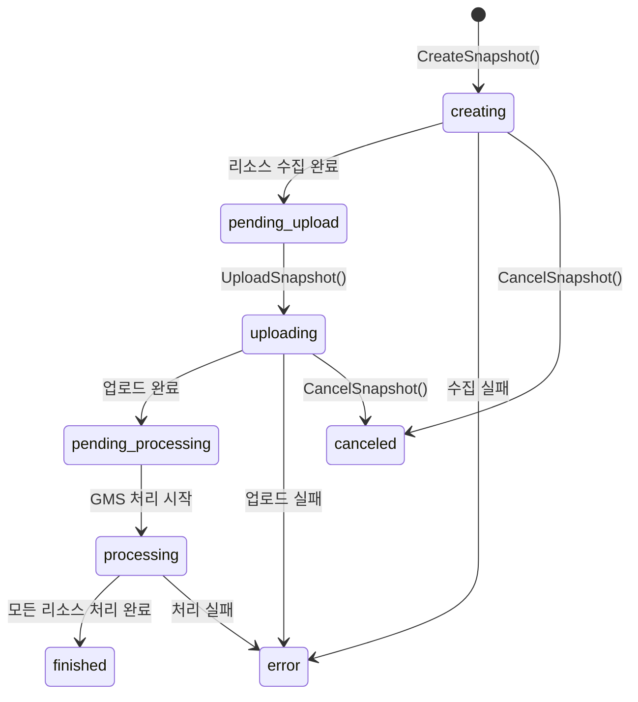

# 28. 보안 인프라 심층 분석: 암호화, SSO 설정, 클라우드 마이그레이션

> Grafana 소스 기준: `pkg/services/encryption/`, `pkg/services/secrets/`, `pkg/services/ssosettings/`, `pkg/services/cloudmigration/`
> 작성일: 2026-03-08

---

## 목차
1. [개요](#1-개요)
2. [Part A: 암호화 서비스 (Encryption)](#2-part-a-암호화-서비스-encryption)
3. [봉투 암호화 (Envelope Encryption)](#3-봉투-암호화-envelope-encryption)
4. [Secrets Manager 심층 분석](#4-secrets-manager-심층-분석)
5. [Data Key 캐시와 회전](#5-data-key-캐시와-회전)
6. [Part B: SSO Settings 서비스](#6-part-b-sso-settings-서비스)
7. [SSO Fallback 전략 패턴](#7-sso-fallback-전략-패턴)
8. [SSO 설정 캐시와 핫 리로드](#8-sso-설정-캐시와-핫-리로드)
9. [Part C: Cloud Migration 서비스](#9-part-c-cloud-migration-서비스)
10. [스냅샷 기반 마이그레이션 흐름](#10-스냅샷-기반-마이그레이션-흐름)
11. [리소스 의존성 분석](#11-리소스-의존성-분석)
12. [설계 결정과 교훈](#12-설계-결정과-교훈)

---

## 1. 개요

이 문서는 Grafana의 **보안 및 인프라** 서브시스템 세 가지를 심층 분석한다:

- **Encryption / Secrets**: 데이터 암호화의 2계층 구조 (내부 암호화 + 봉투 암호화)
- **SSO Settings**: OAuth/SAML/LDAP 설정을 DB와 설정 파일에서 통합 관리
- **Cloud Migration**: 온프레미스 Grafana → Grafana Cloud로의 마이그레이션 지원

### 왜 이 세 기능을 함께 분석하는가?

```
┌─────────────────────────────────────────────────────────┐
│               Grafana 보안 인프라 계층도                   │
│                                                          │
│  Cloud Migration ─── 토큰/시크릿 ──→ Secrets Service     │
│       │                                    │             │
│       └─── SSO 설정 이전 ──→ SSO Settings ─┘             │
│                                    │                     │
│                             Encryption Service           │
│                          (AES-CFB/AES-GCM 암호화)        │
└─────────────────────────────────────────────────────────┘
```

세 서비스는 **암호화를 공통 기반**으로 사용한다. SSO 설정의 시크릿은 Secrets Service로 암호화되고, Cloud Migration은 토큰과 시크릿을 안전하게 전송하기 위해 두 서비스를 모두 사용한다.

### 소스 경로

```
pkg/services/encryption/
├── encryption.go              # Internal 인터페이스, Cipher/Decipher
├── provider/                  # AES-CFB, AES-GCM 프로바이더
└── service/service.go         # Encryption Service 구현 (251줄)

pkg/services/secrets/
├── secrets.go                 # Service 인터페이스 (봉투 암호화)
├── types.go                   # DataKey, EncryptionOptions
├── manager/manager.go         # SecretsService 구현 (300줄+)
├── kvstore/                   # 시크릿 키-값 저장소
├── database/                  # DB 스토어
├── migrator/                  # 시크릿 마이그레이터
└── fakes/                     # 테스트 목(mock)

pkg/services/ssosettings/
├── ssosettings.go             # Service 인터페이스
├── ssosettingsimpl/service.go # 서비스 구현
├── strategies/                # Fallback 전략 (OAuth, LDAP, SAML)
├── database/                  # DB 스토어
├── models/                    # SSOSettings 모델
├── api/                       # REST API
└── validation/                # 유효성 검사

pkg/services/cloudmigration/
├── cloudmigration.go          # Service 인터페이스
├── model.go                   # Session, Snapshot, Resource 모델
├── cloudmigrationimpl/        # 서비스 구현
├── gmsclient/                 # GMS (Grafana Migration Service) 클라이언트
├── api/                       # REST API
└── resource_dependency.go     # 리소스 의존성 분석
```

---

## 2. Part A: 암호화 서비스 (Encryption)

### 2계층 암호화 아키텍처

Grafana는 **2계층 암호화 구조**를 사용한다:

```
┌────────────────────────────────────────────────────────────────┐
│                    Grafana 암호화 2계층 구조                     │
│                                                                 │
│  Layer 1: Encryption Service (내부 / 레거시)                     │
│  ┌─────────────────────────────────────────┐                   │
│  │  평문 ──→ AES-CFB/GCM 암호화 ──→ 암호문   │                   │
│  │  키: Grafana secret_key (설정 파일)       │                   │
│  │  용도: 레거시 암호화, Envelope의 내부 암호화  │                   │
│  └─────────────────────────────────────────┘                   │
│                                                                 │
│  Layer 2: Secrets Service (봉투 암호화 / Envelope Encryption)    │
│  ┌─────────────────────────────────────────┐                   │
│  │  평문 ──→ Data Key(DEK)로 암호화 ──→ 암호문 │                   │
│  │  DEK ──→ KEK(KMS Provider)로 암호화       │                   │
│  │  용도: 모든 새 시크릿 암호화의 표준          │                   │
│  └─────────────────────────────────────────┘                   │
│                                                                 │
│  ※ Encryption Service는 직접 사용 금지 (Internal 경고)            │
│     반드시 Secrets Service를 통해 암호화할 것                      │
└────────────────────────────────────────────────────────────────┘
```

### Encryption 인터페이스

```go
// 소스: pkg/services/encryption/encryption.go (21-42행)
// Internal must not be used for general purpose encryption.
// This service is used as an internal component for envelope encryption
// and for very specific few use cases that still require legacy encryption.
//
// Unless there is any specific reason, you must use secrets.Service instead.
type Internal interface {
    Cipher
    Decipher
    EncryptJsonData(ctx context.Context, kv map[string]string, secret string) (map[string][]byte, error)
    DecryptJsonData(ctx context.Context, sjd map[string][]byte, secret string) (map[string]string, error)
    GetDecryptedValue(ctx context.Context, sjd map[string][]byte, key string, fallback string, secret string) string
}

type Cipher interface {
    Encrypt(ctx context.Context, payload []byte, secret string) ([]byte, error)
}

type Decipher interface {
    Decrypt(ctx context.Context, payload []byte, secret string) ([]byte, error)
}

type Provider interface {
    ProvideCiphers() map[string]Cipher
    ProvideDeciphers() map[string]Decipher
}
```

### 키 파생 (PBKDF2)

```go
// 소스: pkg/services/encryption/encryption.go (45-47행)
// KeyToBytes key length needs to be 32 bytes
func KeyToBytes(secret, salt string) ([]byte, error) {
    return pbkdf2.Key(sha256.New, secret, []byte(salt), 10000, 32)
}
```

왜 PBKDF2를 사용하는가? Grafana의 `secret_key` 설정은 사용자가 입력한 문자열이라 엔트로피가 낮을 수 있다. PBKDF2는 10,000번 반복으로 **키 스트레칭**을 수행하여 무차별 대입 공격을 어렵게 만든다.

---

## 3. 봉투 암호화 (Envelope Encryption)

### 봉투 암호화란?

```
┌─────────────────────────────────────────────────────────┐
│            봉투 암호화 (Envelope Encryption)               │
│                                                          │
│  1. Data Key (DEK) 생성 (랜덤 32바이트)                   │
│  ┌──────────┐                                            │
│  │ DEK (평문)│──── 평문 데이터 암호화 ──→ 암호문           │
│  └────┬─────┘                                            │
│       │                                                  │
│  2. DEK 자체를 KEK(Key Encryption Key)로 암호화            │
│  ┌────▼──────┐    ┌──────────┐                           │
│  │ DEK (평문) │──→│ KMS Provider│──→ 암호화된 DEK          │
│  └───────────┘    │ (Grafana,   │                         │
│                   │  AWS KMS,   │                         │
│                   │  Azure, ...)│                         │
│                   └──────────┘                           │
│                                                          │
│  3. 저장: [암호화된 DEK] + [암호문]                         │
│     DEK 평문은 메모리에서 즉시 삭제                          │
└─────────────────────────────────────────────────────────┘
```

### 왜 봉투 암호화를 사용하는가?

| 비교 항목 | 직접 암호화 | 봉투 암호화 |
|-----------|-----------|-----------|
| 키 회전 | 모든 데이터 재암호화 필요 | DEK만 재암호화 (데이터 불변) |
| KMS 호출 | 매 암호화마다 | DEK 생성/조회 시만 |
| 키 범위 | 전역 단일 키 | 스코프별 DEK (user:10, org:1) |
| KMS 종속성 | 없음 | 있으나 캐싱으로 최소화 |

---

## 4. Secrets Manager 심층 분석

### SecretsService 구조

```go
// 소스: pkg/services/secrets/manager/manager.go (38-56행)
type SecretsService struct {
    tracer     tracing.Tracer
    store      secrets.Store       // Data Key DB 저장소
    enc        encryption.Internal // 내부 암호화 (AES)
    cfg        *setting.Cfg
    features   featuremgmt.FeatureToggles
    usageStats usagestats.Service

    mtx          sync.Mutex        // Data Key 동시 생성 방지
    dataKeyCache *dataKeyCache     // DEK 인메모리 캐시

    pOnce               sync.Once
    providers           map[secrets.ProviderID]secrets.Provider
    kmsProvidersService kmsproviders.Service

    currentProviderID secrets.ProviderID
    log log.Logger
}
```

### 암호화 흐름

```go
// 소스: pkg/services/secrets/manager/manager.go (146-187행)
func (s *SecretsService) Encrypt(ctx context.Context, payload []byte,
    opt secrets.EncryptionOptions) ([]byte, error) {

    // 1. 스코프 결정 (root, user:10, org:1 등)
    scope := opt()
    label := secrets.KeyLabel(scope, s.currentProviderID)

    // 2. 현재 Data Key 가져오기 (캐시 → DB → 새로 생성)
    id, dataKey, err := s.currentDataKey(ctx, label, scope)

    // 3. Data Key로 실제 암호화 (AES)
    encrypted, err := s.enc.Encrypt(ctx, payload, string(dataKey))

    // 4. Data Key ID를 접두사로 붙임
    // 형식: #<base64(keyId)>#<encrypted>
    prefix := make([]byte, b64.EncodedLen(len(id))+2)
    b64.Encode(prefix[1:], []byte(id))
    prefix[0] = keyIdDelimiter   // '#'
    prefix[len(prefix)-1] = keyIdDelimiter

    blob := make([]byte, len(prefix)+len(encrypted))
    copy(blob, prefix)
    copy(blob[len(prefix):], encrypted)

    return blob, nil
}
```

### 암호문 형식

```
#<base64 encoded Data Key ID>#<AES encrypted data>
│                              │
│ keyIdDelimiter = '#'         │
│                              │
└── 복호화 시 이 ID로           └── AES-CFB/GCM 암호문
    Data Key를 조회
```

### 봉투 암호화 감지

```go
// 소스: pkg/services/secrets/manager/manager.go (140-142행)
func (s *SecretsService) encryptedWithEnvelopeEncryption(payload []byte) bool {
    return len(payload) > 0 && payload[0] == keyIdDelimiter  // '#'
}
```

첫 바이트가 `#`이면 봉투 암호화, 아니면 레거시 암호화로 판단한다. 이 단순한 마커로 이전 버전과의 하위 호환성을 유지한다.

---

## 5. Data Key 캐시와 회전

### Data Key 캐시 동작

```go
// 소스: pkg/services/secrets/manager/manager.go (192-200행)
func (s *SecretsService) currentDataKey(ctx context.Context,
    label string, scope string) (string, []byte, error) {
    // 뮤텍스로 동시 접근 방지
    // → 여러 요청이 동시에 Data Key를 요청하면, 하나만 생성
    s.mtx.Lock()
    defer s.mtx.Unlock()

    // 캐시 → DB → 새로 생성 순서로 조회
    id, dataKey, err := s.dataKeyByLabel(ctx, label)
    if err != nil {
        // Data Key가 없으면 새로 생성
        return s.newDataKey(ctx, label, scope)
    }
    return id, dataKey, nil
}
```

### EncryptionOptions: 스코프 지정

```go
// 소스: pkg/services/secrets/types.go (23-37행)
// 루트 레벨 DEK (전역)
func WithoutScope() EncryptionOptions {
    return func() string { return "root" }
}

// 특정 스코프에 바인딩된 DEK
func WithScope(scope string) EncryptionOptions {
    return func() string { return scope }  // "user:10", "org:1"
}
```

### Data Key 회전

```go
// 소스: pkg/services/secrets/secrets.go (34-35행)
type Service interface {
    ...
    RotateDataKeys(ctx context.Context) error     // DEK 순환
    ReEncryptDataKeys(ctx context.Context) error  // KEK 변경 시 DEK 재암호화
}
```

회전 시나리오:
1. **DEK 회전**: 기존 DEK를 비활성화, 새 DEK 생성. 기존 암호문은 복호화 시 이전 DEK 사용
2. **KEK 회전**: KMS Provider 키 변경 시, 모든 DEK를 새 KEK로 재암호화

---

## 6. Part B: SSO Settings 서비스

### SSO Settings 아키텍처

```
┌───────────────────────────────────────────────────────────────┐
│                   SSO Settings 아키텍처                         │
│                                                                │
│  ┌──────────────┐   ┌──────────────┐   ┌──────────────┐       │
│  │ grafana.ini   │   │   DB Store   │   │ 환경 변수     │       │
│  │ (OAuth 설정)  │   │ (sso_setting │   │ (GF_AUTH_*)  │       │
│  └──────┬───────┘   │  테이블)      │   └──────┬───────┘       │
│         │           └──────┬───────┘          │               │
│         │                  │                  │               │
│  ┌──────▼──────────────────▼──────────────────▼──────┐        │
│  │           SSO Settings Service                     │        │
│  │                                                     │        │
│  │  ┌──────────────────┐  ┌──────────────────┐        │        │
│  │  │ FallbackStrategy │  │ Secrets Service   │        │        │
│  │  │ (OAuth, LDAP,    │  │ (시크릿 암호화)    │        │        │
│  │  │  SAML)           │  └──────────────────┘        │        │
│  │  └──────────────────┘                               │        │
│  │                                                     │        │
│  │  캐시 ← Reloadable 인터페이스 ← 핫 리로드            │        │
│  └─────────────────────────────────────────────────────┘        │
│                                                                │
│  지원 프로바이더:                                                │
│  GitHub, GitLab, Google, AzureAD, Okta, GrafanaCom,           │
│  Generic OAuth, LDAP, SAML                                     │
└───────────────────────────────────────────────────────────────┘
```

### Service 인터페이스

```go
// 소스: pkg/services/ssosettings/ssosettings.go (18-39행)
type Service interface {
    // 모든 SSO 설정 조회 (DB + 설정 파일 통합)
    List(ctx context.Context) ([]*models.SSOSettings, error)
    // 시크릿 값을 마스킹한 버전
    ListWithRedactedSecrets(ctx context.Context) ([]*models.SSOSettings, error)
    // 특정 프로바이더의 설정 조회
    GetForProvider(ctx context.Context, provider string) (*models.SSOSettings, error)
    // 캐시에서 조회 (빠른 경로)
    GetForProviderFromCache(ctx context.Context, provider string) (*models.SSOSettings, error)
    // 생성 또는 수정
    Upsert(ctx context.Context, settings *models.SSOSettings,
        requester identity.Requester) error
    // 삭제 (소프트 삭제)
    Delete(ctx context.Context, provider string) error
    // 부분 업데이트
    Patch(ctx context.Context, provider string, data map[string]any,
        requester identity.Requester) error
    // Reloadable 등록 (핫 리로드)
    RegisterReloadable(provider string, reloadable Reloadable)
    // 수동 리로드 트리거
    Reload(ctx context.Context, provider string)
}
```

### 지원 프로바이더 목록

```go
// 소스: pkg/services/ssosettings/ssosettings.go (12행)
var AllOAuthProviders = []string{
    social.GitHubProviderName,
    social.GitlabProviderName,
    social.GoogleProviderName,
    social.GenericOAuthProviderName,
    social.GrafanaComProviderName,
    social.AzureADProviderName,
    social.OktaProviderName,
}
// + LDAP, SAML (라이선스 필요)
```

---

## 7. SSO Fallback 전략 패턴

### FallbackStrategy 인터페이스

```go
// 소스: pkg/services/ssosettings/ssosettings.go (52-56행)
type FallbackStrategy interface {
    IsMatch(provider string) bool
    GetProviderConfig(ctx context.Context, provider string) (map[string]any, error)
}
```

### 전략 패턴 적용

```go
// 소스: pkg/services/ssosettings/ssosettingsimpl/service.go (56-73행)
func ProvideService(...) *Service {
    fbStrategies := []ssosettings.FallbackStrategy{
        strategies.NewOAuthStrategy(cfg),      // grafana.ini OAuth 설정
        strategies.NewLDAPStrategy(cfg),       // LDAP 설정
    }

    if licensing.FeatureEnabled(social.SAMLProviderName) {
        fbStrategies = append(fbStrategies,
            strategies.NewSAMLStrategy(settingsProvider))  // SAML (엔터프라이즈)
    }
}
```

### 설정 우선순위

```
1. DB Store (sso_setting 테이블)     ← 최우선
2. FallbackStrategy 결과              ← DB에 없을 때
   ├── OAuthStrategy (grafana.ini)
   ├── LDAPStrategy (ldap.toml)
   └── SAMLStrategy (설정 프로바이더)
3. 기본값                              ← 어디에도 없을 때
```

### 왜 Fallback 전략이 필요한가?

기존 Grafana 사용자들은 `grafana.ini`에 OAuth 설정을 작성해왔다. SSO Settings 서비스 도입 후에도 **기존 설정 파일이 동작해야** 한다. DB에 명시적으로 저장된 설정이 없으면 설정 파일에서 읽어오는 Fallback 전략으로 하위 호환성을 보장한다.

---

## 8. SSO 설정 캐시와 핫 리로드

### Reloadable 인터페이스

```go
// 소스: pkg/services/ssosettings/ssosettings.go (44-47행)
type Reloadable interface {
    Reload(ctx context.Context, settings models.SSOSettings) error
    Validate(ctx context.Context, settings models.SSOSettings,
        oldSettings models.SSOSettings, requester identity.Requester) error
}
```

### 핫 리로드 메커니즘

```
1. 관리자가 SSO 설정 변경 (API)
      │
      ▼
2. Service.Upsert() → DB 저장
      │
      ▼
3. Service.Reload(provider)
      │
      ▼
4. Reloadable.Validate(newSettings, oldSettings)
      │ 실패 시 변경 롤백
      ▼
5. Reloadable.Reload(newSettings)
      │
      ▼
6. 캐시 업데이트 → 즉시 적용 (서버 재시작 불필요)
```

### 인메모리 캐시 구조

```go
// 소스: pkg/services/ssosettings/ssosettingsimpl/service.go (35-50행)
type Service struct {
    ...
    reloadables       map[string]ssosettings.Reloadable  // 프로바이더별 리로더
    cachedSSOSettings []*models.SSOSettings              // 캐시
    cacheMutex        sync.RWMutex                       // 동시성 제어
}
```

---

## 9. Part C: Cloud Migration 서비스

### Cloud Migration이란?

**온프레미스(Self-Managed) Grafana → Grafana Cloud**로 대시보드, 데이터소스, 알림 규칙 등을 마이그레이션하는 기능이다.

```
┌───────────────────────────────────────────────────────────┐
│           Cloud Migration 전체 흐름                         │
│                                                            │
│  온프레미스 Grafana                 Grafana Cloud           │
│  ┌──────────────────┐            ┌──────────────────┐     │
│  │ 1. 토큰 생성      │            │                  │     │
│  │ 2. 세션 생성      │── 토큰 ──→│ GMS (Migration   │     │
│  │ 3. 스냅샷 생성    │            │  Service)        │     │
│  │  ├ 리소스 수집     │            │                  │     │
│  │  ├ 암호화          │            │ 4. 스냅샷 처리   │     │
│  │  └ 업로드         │── 스냅샷 ─→│  ├ 복호화         │     │
│  │                   │            │  ├ 리소스 생성    │     │
│  │ 5. 결과 확인      │←── 상태 ──│  └ 상태 보고      │     │
│  └──────────────────┘            └──────────────────┘     │
└───────────────────────────────────────────────────────────┘
```

### Service 인터페이스

```go
// 소스: pkg/services/cloudmigration/cloudmigration.go (15-34행)
type Service interface {
    // 토큰 관리
    GetToken(ctx context.Context) (authapi.TokenView, error)
    CreateToken(ctx context.Context) (CreateAccessTokenResponse, error)
    ValidateToken(ctx context.Context, mig CloudMigrationSession) error
    DeleteToken(ctx context.Context, uid string) error

    // 세션 관리
    CreateSession(ctx context.Context, signedInUser *user.SignedInUser,
        req CloudMigrationSessionRequest) (*CloudMigrationSessionResponse, error)
    GetSession(ctx context.Context, orgID int64, migUID string) (*CloudMigrationSession, error)
    DeleteSession(ctx context.Context, orgID int64, signedInUser *user.SignedInUser,
        migUID string) (*CloudMigrationSession, error)

    // 스냅샷 관리
    CreateSnapshot(ctx context.Context, signedInUser *user.SignedInUser,
        cmd CreateSnapshotCommand) (*CloudMigrationSnapshot, error)
    UploadSnapshot(ctx context.Context, orgID int64, signedInUser *user.SignedInUser,
        sessionUid string, snapshotUid string) error
    CancelSnapshot(ctx context.Context, sessionUid string, snapshotUid string) error
}
```

---

## 10. 스냅샷 기반 마이그레이션 흐름

### 스냅샷 상태 머신

```go
// 소스: pkg/services/cloudmigration/model.go (76-85행)
type SnapshotStatus string
const (
    SnapshotStatusCreating          SnapshotStatus = "creating"
    SnapshotStatusPendingUpload     SnapshotStatus = "pending_upload"
    SnapshotStatusUploading         SnapshotStatus = "uploading"
    SnapshotStatusPendingProcessing SnapshotStatus = "pending_processing"
    SnapshotStatusProcessing        SnapshotStatus = "processing"
    SnapshotStatusFinished          SnapshotStatus = "finished"
    SnapshotStatusCanceled          SnapshotStatus = "canceled"
    SnapshotStatusError             SnapshotStatus = "error"
)
```



### 스냅샷 데이터 모델

```go
// 소스: pkg/services/cloudmigration/model.go (37-58행)
type CloudMigrationSnapshot struct {
    ID                  int64  `xorm:"pk autoincr 'id'"`
    UID                 string `xorm:"uid"`
    SessionUID          string `xorm:"session_uid"`
    Status              SnapshotStatus
    GMSPublicKey        []byte `xorm:"-"`          // 통합 시크릿에 별도 저장
    PublicKey           []byte `xorm:"public_key"`  // 로컬 공개키
    LocalDir            string `xorm:"local_directory"`
    GMSSnapshotUID      string `xorm:"gms_snapshot_uid"`
    ErrorString         string `xorm:"error_string"`
    ResourceStorageType string `xorm:"resource_storage_type"` // "fs" | "db"
    EncryptionAlgo      string `xorm:"encryption_algo"`
    Metadata            []byte `xorm:"'metadata'"`
    Created             time.Time
    Updated             time.Time
    Finished            time.Time

    // cloud_migration_resource 테이블에 저장
    Resources   []CloudMigrationResource `xorm:"-"`
    StatsRollup SnapshotResourceStats    `xorm:"-"`
}
```

### 세션 (CloudMigrationSession)

```go
// 소스: pkg/services/cloudmigration/model.go (23-34행)
type CloudMigrationSession struct {
    ID          int64  `xorm:"pk autoincr 'id'"`
    OrgID       int64  `xorm:"org_id"`
    UID         string `xorm:"uid"`
    AuthToken   string               // GMS 인증 토큰
    Slug        string               // Grafana Cloud 스택 슬러그
    StackID     int    `xorm:"stack_id"`
    RegionSlug  string               // 클라우드 리전
    ClusterSlug string               // 클러스터
    Created     time.Time
    Updated     time.Time
}
```

### 리소스 스토리지 타입

```go
// 소스: pkg/services/cloudmigration/cloudmigration.go (10-12행)
const (
    ResourceStorageTypeFs = "fs"  // 파일 시스템
    ResourceStorageTypeDb = "db"  // 데이터베이스
)
```

---

## 11. 리소스 의존성 분석

### Cloud Migration 리소스 모델

```go
// 소스: pkg/services/cloudmigration/model.go (87-100행)
type CloudMigrationResource struct {
    ID        int64           `xorm:"pk autoincr 'id'"`
    UID       string          `xorm:"uid" json:"uid"`
    Name      string          `xorm:"name" json:"name"`
    Type      MigrateDataType `xorm:"resource_type" json:"type"`
    RefID     string          `xorm:"resource_uid" json:"refId"`
    Status    ItemStatus      `xorm:"status" json:"status"`
    Error     string          `xorm:"error_string" json:"error"`
    ErrorCode ResourceErrorCode `xorm:"error_code" json:"error_code"`
    SnapshotUID string `xorm:"snapshot_uid"`
    ParentName  string `xorm:"parent_name" json:"parentName"`
}
```

### 의존성 그래프

마이그레이션 시 리소스 간 의존성이 존재한다:

```
데이터소스
    │
    ▼
대시보드 ←── 라이브러리 패널
    │
    ▼
알림 규칙 ←── 연락처 (Contact Point)
    │
    ▼
알림 정책 (Notification Policy)
```

- **대시보드**는 데이터소스를 참조하므로, 데이터소스를 먼저 마이그레이션해야 함
- **알림 규칙**은 대시보드와 연락처를 참조
- `resource_dependency.go`에서 이 순서를 정의

---

## 12. 설계 결정과 교훈

### Encryption / Secrets

| 설계 결정 | 이유 |
|-----------|------|
| 2계층 암호화 (Internal + Envelope) | 레거시 호환 유지하면서 보안 강화 |
| `#` 마커로 봉투 암호화 감지 | 기존 암호문과 새 암호문 구분, 점진적 마이그레이션 |
| DEK 스코프 (user, org, root) | 키 범위 분리로 보안 강화, 격리된 키 회전 |
| PBKDF2 10,000 반복 | 낮은 엔트로피 키에서 충분한 보안 확보 |
| 뮤텍스로 DEK 동시 생성 방지 | 중복 DEK 생성 방지, DB 일관성 보장 |

### SSO Settings

| 설계 결정 | 이유 |
|-----------|------|
| DB + 설정 파일 통합 (Fallback Strategy) | 기존 grafana.ini 사용자 하위 호환 |
| Reloadable 인터페이스 | 서버 재시작 없이 SSO 설정 적용 |
| RWMutex로 캐시 보호 | 읽기가 잦고 쓰기가 드문 패턴에 최적 |
| 프로바이더별 Reloadable 등록 | 각 프로바이더가 자체 유효성 검사/적용 로직 보유 |

### Cloud Migration

| 설계 결정 | 이유 |
|-----------|------|
| 스냅샷 기반 마이그레이션 | 원자적 전송, 실패 시 재시도 가능, 진행 상황 추적 |
| 8단계 상태 머신 | 각 단계에서 실패 감지, 사용자에게 진행 상황 보고 |
| 리소스 의존성 순서 보장 | 참조 무결성 (데이터소스 → 대시보드 → 알림) |
| fs/db 이중 스토리지 | 환경에 따라 파일 시스템 또는 DB 기반 저장 선택 |
| GMS 공개키로 암호화 | 전송 중 데이터 보호, 수신 측만 복호화 가능 |

### 핵심 교훈

1. **마커 기반 버전 감지**: `#` 한 바이트로 봉투 암호화 여부를 판단하는 것은, 데이터 포맷 진화에서 매우 효율적인 패턴이다. Magic byte는 파일 포맷(PNG의 `\x89PNG`)에서도 동일하게 사용된다.

2. **Fallback 전략 패턴의 하위 호환**: 설정 시스템을 DB로 마이그레이션할 때, 기존 설정 파일을 Fallback으로 유지하면 사용자 마이그레이션 부담을 제거할 수 있다.

3. **스냅샷 패턴의 안정성**: 클라우드 마이그레이션에서 "스냅샷 생성 → 업로드 → 처리"의 3단계는 각 단계가 독립적으로 실패/재시도할 수 있어, 네트워크 불안정 환경에서도 안정적이다.

4. **뮤텍스의 전략적 사용**: `SecretsService.mtx`는 DEK 생성에만 사용하여 경합을 최소화한다. 읽기(복호화)는 캐시에서 잠금 없이 수행되므로, 성능에 미치는 영향이 최소화된다.

5. **Reloadable 인터페이스의 유연성**: SSO 프로바이더마다 유효성 검사 로직이 다르므로, 인터페이스로 추상화하여 각 프로바이더가 자체 검증/적용 로직을 구현한다. 이는 Strategy 패턴의 전형적인 활용이다.
