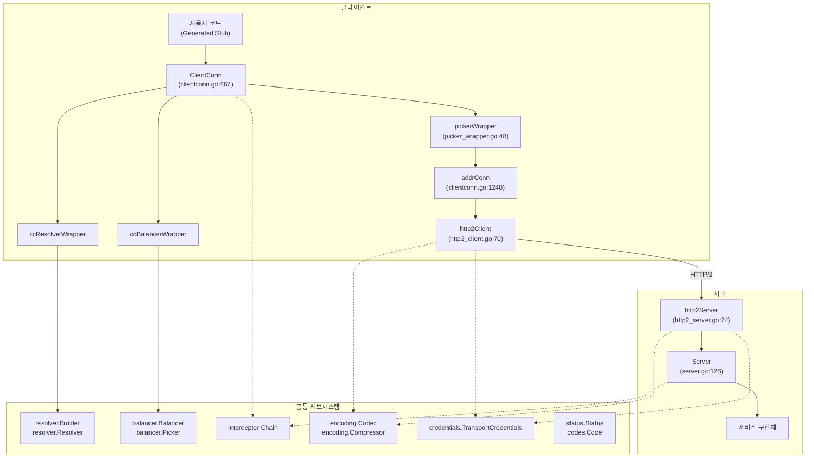
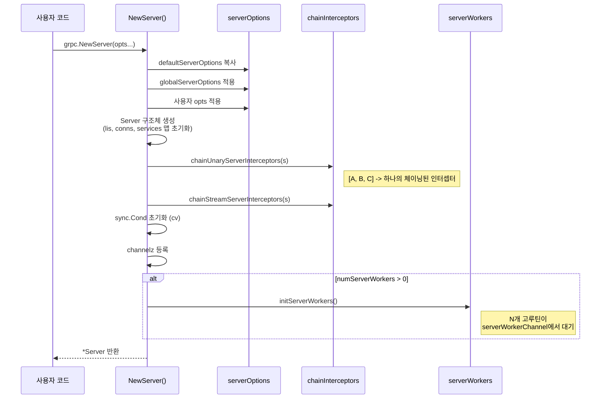
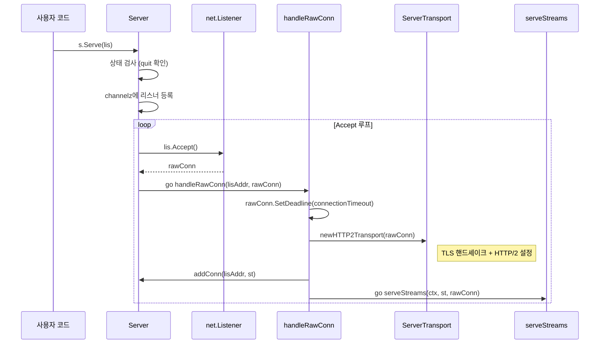
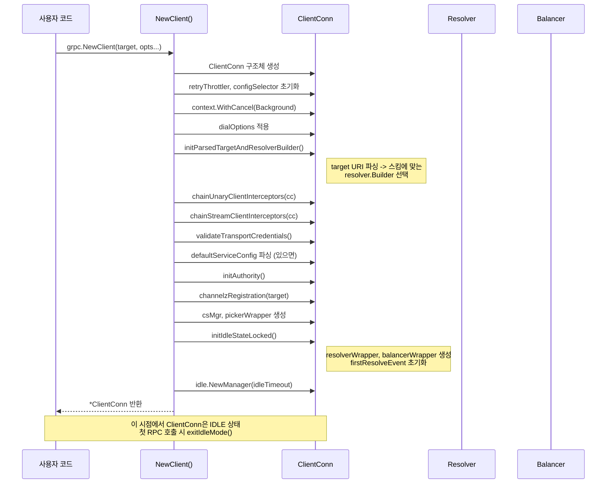
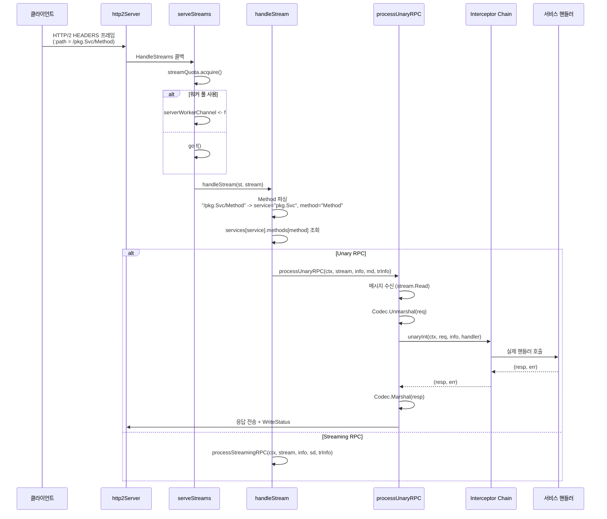
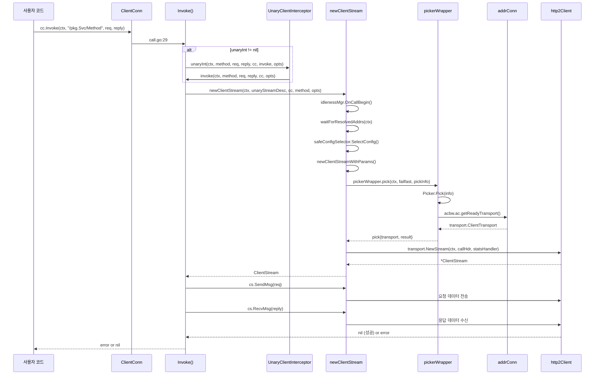

# 01. gRPC-Go 아키텍처

## 목차
1. [개요](#1-개요)
2. [전체 아키텍처 다이어그램](#2-전체-아키텍처-다이어그램)
3. [핵심 컴포넌트 관계](#3-핵심-컴포넌트-관계)
4. [서버 아키텍처](#4-서버-아키텍처)
5. [클라이언트 아키텍처](#5-클라이언트-아키텍처)
6. [Transport 계층](#6-transport-계층)
7. [서브시스템 개요](#7-서브시스템-개요)
8. [서버 초기화 흐름](#8-서버-초기화-흐름)
9. [클라이언트 초기화 흐름](#9-클라이언트-초기화-흐름)
10. [서버 요청 처리 흐름](#10-서버-요청-처리-흐름)
11. [클라이언트 RPC 호출 흐름](#11-클라이언트-rpc-호출-흐름)
12. [설계 철학: 왜 이렇게 만들었는가](#12-설계-철학-왜-이렇게-만들었는가)
13. [핵심 인터페이스 요약](#13-핵심-인터페이스-요약)

---

## 1. 개요

gRPC-Go는 Google이 설계한 고성능 RPC 프레임워크 gRPC의 Go 언어 구현체다. HTTP/2를 전송 프로토콜로 사용하고, Protocol Buffers를 기본 직렬화 포맷으로 채택한다.

**핵심 설계 원칙:**
- **플러그인 아키텍처**: Resolver, Balancer, Interceptor, Codec, Compressor, Credentials 등 거의 모든 컴포넌트가 인터페이스로 추상화되어 교체 가능
- **HTTP/2 기반**: 단일 TCP 연결에서 다수의 스트림을 멀티플렉싱하여 효율적인 양방향 통신 지원
- **코드 생성**: `.proto` 파일로부터 서버/클라이언트 스텁 코드를 자동 생성하여 타입 안전성 확보
- **연결 관리 자동화**: 이름 해석(Name Resolution), 로드 밸런싱, 재연결, 유휴 관리를 프레임워크가 처리

**소스코드 기준:**
- 서버 진입점: `server.go` (Server 구조체, line 126)
- 클라이언트 진입점: `clientconn.go` (ClientConn 구조체, line 667)
- Transport 계층: `internal/transport/` (http2Server, http2Client)
- 인터셉터: `interceptor.go` (4가지 인터셉터 타입 정의)

---

## 2. 전체 아키텍처 다이어그램

```
+===========================================================================+
|                          gRPC-Go 전체 아키텍처                              |
+===========================================================================+
|                                                                           |
|  클라이언트 (Client)                      서버 (Server)                     |
|  +---------------------------------+     +---------------------------------+
|  |  사용자 코드 (Generated Stub)    |     |  사용자 코드 (Service Impl)      |
|  |  cc.Invoke() / cc.NewStream()   |     |  RegisterService(desc, impl)    |
|  +---------+-----------------------+     +---------+-----------------------+
|            |                                       |
|  +---------v-----------------------+     +---------v-----------------------+
|  |        Interceptor Chain        |     |        Interceptor Chain        |
|  |  UnaryClientInterceptor        |     |  UnaryServerInterceptor         |
|  |  StreamClientInterceptor       |     |  StreamServerInterceptor        |
|  +---------+-----------------------+     +---------+-----------------------+
|            |                                       |
|  +---------v-----------------------+     +---------v-----------------------+
|  |       ClientConn               |     |          Server                 |
|  |  - pickerWrapper               |     |  - services map                 |
|  |  - resolverWrapper             |     |  - conns map                    |
|  |  - balancerWrapper             |     |  - serverWorkerChannel          |
|  |  - idlenessMgr                 |     |  - opts (serverOptions)         |
|  +---------+-----------------------+     +---------+-----------------------+
|            |                                       |
|  +---------v---------+   +--------+     +---------v-----------------------+
|  | Resolver          |   |Balancer|     |      serveStreams()             |
|  | (dns/passthrough) |-->|+Picker |     |  HandleStreams -> handleStream  |
|  +-------------------+   +---+----+     +---------+-----------------------+
|                              |                     |
|  +---------------------------v-----+     +---------v-----------------------+
|  |        addrConn (SubConn)       |     |  processUnaryRPC()             |
|  |  - transport (ClientTransport)  |     |  processStreamingRPC()         |
|  +----------+----------------------+     +----------+----------------------+
|             |                                       |
|  +----------v----------------------+     +----------v----------------------+
|  |      http2Client                |     |      http2Server                |
|  |  - conn (net.Conn)             |     |  - conn (net.Conn)             |
|  |  - framer                      |     |  - framer                      |
|  |  - loopy (loopyWriter)         |     |  - loopy (loopyWriter)         |
|  |  - controlBuf                  |     |  - controlBuf                  |
|  |  - activeStreams               |     |  - activeStreams               |
|  +----------+----------------------+     +----------+----------------------+
|             |                                       |
|  +----------v---------------------------------------v----------------------+
|  |                          HTTP/2 (TCP)                                   |
|  |             HPACK 헤더 압축 | 스트림 멀티플렉싱 | 흐름 제어              |
|  +------------------------------------------------------------------------|
|                                                                           |
+===========================================================================+
```

---

## 3. 핵심 컴포넌트 관계



---

## 4. 서버 아키텍처

### 4.1 Server 구조체

`server.go:126`에 정의된 `Server` 구조체는 gRPC 서버의 핵심이다.

```go
// server.go:126
type Server struct {
    opts         serverOptions
    statsHandler stats.Handler

    mu  sync.Mutex
    lis map[net.Listener]bool
    // 리스너 주소별 활성 transport를 관리하는 이중 맵
    conns    map[string]map[transport.ServerTransport]bool
    serve    bool
    drain    bool
    cv       *sync.Cond              // GracefulStop 시 연결 종료 대기
    services map[string]*serviceInfo // 서비스명 -> 서비스 정보

    quit *grpcsync.Event  // Stop/GracefulStop 신호
    done *grpcsync.Event  // 완전히 종료됨 신호
    serveWG    sync.WaitGroup  // 활성 Serve 고루틴 카운트
    handlersWG sync.WaitGroup  // 활성 핸들러 고루틴 카운트

    channelz *channelz.Server

    serverWorkerChannel      chan func()   // 워커 풀 작업 채널
    serverWorkerChannelClose func()
}
```

**왜 `conns`가 이중 맵인가?**
`conns`의 타입은 `map[string]map[transport.ServerTransport]bool`이다. 외부 키는 리스너 주소이고, 내부 맵은 해당 리스너를 통해 들어온 활성 transport 집합이다. 하나의 서버가 여러 리스너에서 동시에 `Serve()`를 호출할 수 있기 때문에, 리스너별로 transport를 그룹화하여 특정 리스너의 연결만 선택적으로 관리할 수 있다.

**왜 `quit`과 `done` 두 개의 Event가 필요한가?**
`quit`은 "종료 시작" 신호이고, `done`은 "종료 완료" 신호다. GracefulStop의 경우 `quit`을 발생시킨 후 기존 스트림이 모두 끝날 때까지 대기하고, 모든 정리가 끝나면 `done`을 발생시킨다. 이 두 단계 분리 덕분에 새 연결 수락은 즉시 중단하면서도 기존 처리는 안전하게 완료할 수 있다.

### 4.2 serverOptions 구조체

`server.go:154`에 정의된 서버 옵션은 서버의 모든 설정을 담는다.

| 필드 | 타입 | 설명 |
|------|------|------|
| `creds` | `credentials.TransportCredentials` | TLS 등 전송 보안 |
| `unaryInt` | `UnaryServerInterceptor` | 체이닝된 단일 Unary 인터셉터 |
| `streamInt` | `StreamServerInterceptor` | 체이닝된 단일 Stream 인터셉터 |
| `chainUnaryInts` | `[]UnaryServerInterceptor` | Unary 인터셉터 목록 |
| `chainStreamInts` | `[]StreamServerInterceptor` | Stream 인터셉터 목록 |
| `maxConcurrentStreams` | `uint32` | 연결당 최대 동시 스트림 수 |
| `maxReceiveMessageSize` | `int` | 수신 메시지 최대 크기 (기본 4MB) |
| `maxSendMessageSize` | `int` | 송신 메시지 최대 크기 (기본 MaxInt32) |
| `keepaliveParams` | `keepalive.ServerParameters` | Keepalive 파라미터 |
| `keepalivePolicy` | `keepalive.EnforcementPolicy` | Keepalive 정책 강제 |
| `numServerWorkers` | `uint32` | 서버 워커 풀 크기 |
| `connectionTimeout` | `time.Duration` | 연결 핸드셰이크 타임아웃 (기본 120초) |
| `bufferPool` | `mem.BufferPool` | 메모리 버퍼 풀 |
| `inTapHandle` | `tap.ServerInHandle` | 요청 전처리 TAP 핸들러 |

### 4.3 서비스 등록 구조

gRPC 서버에서 서비스를 등록하는 구조는 다음과 같다.

```go
// server.go:105
type ServiceDesc struct {
    ServiceName string
    HandlerType any           // 서비스 인터페이스 타입 (타입 검사용)
    Methods     []MethodDesc  // Unary RPC 목록
    Streams     []StreamDesc  // Streaming RPC 목록
    Metadata    any
}

// server.go:99
type MethodDesc struct {
    MethodName string
    Handler    MethodHandler  // 실제 핸들러 함수
}

// stream.go:67
type StreamDesc struct {
    StreamName    string
    Handler       StreamHandler
    ServerStreams  bool  // 서버가 스트리밍 전송 가능
    ClientStreams  bool  // 클라이언트가 스트리밍 전송 가능
}
```

```
ServiceDesc ("helloworld.Greeter")
    |
    +-- Methods: []*MethodDesc
    |       +-- MethodDesc {Name: "SayHello", Handler: _Greeter_SayHello_Handler}
    |
    +-- Streams: []*StreamDesc
            +-- StreamDesc {Name: "SayHelloStream", Handler: ..., ServerStreams: true}

     RegisterService() (server.go:753)
            |
            v
    Server.services["helloworld.Greeter"] = &serviceInfo{
        methods: {"SayHello": &MethodDesc{...}},
        streams: {"SayHelloStream": &StreamDesc{...}},
    }
```

**왜 protoc 코드 생성이 `ServiceDesc`를 만드는가?**
`.proto` 파일에서 protoc-gen-go-grpc 플러그인이 `ServiceDesc`를 자동 생성한다. 이렇게 하면 서비스 이름, 메서드 이름, 핸들러 함수가 컴파일 타임에 결정되어 런타임 리플렉션 비용이 없다. `HandlerType` 필드를 통해 사용자가 제공한 구현체가 올바른 인터페이스를 만족하는지 `RegisterService()` 시점에 검사한다.

### 4.4 서버 워커 풀

```go
// server.go:150
serverWorkerChannel      chan func()
serverWorkerChannelClose func()
```

`NewServer()`에서 `numServerWorkers > 0`이면 `initServerWorkers()`를 호출하여 고정 크기의 고루틴 풀을 생성한다. 각 워커는 `serverWorkerChannel`에서 함수를 꺼내 실행한다.

**왜 워커 풀이 필요한가?**
기본적으로 gRPC 서버는 스트림마다 새 고루틴을 생성한다(`serveStreams()`의 `go f()`, server.go:1072). 고빈도 요청 환경에서는 고루틴 생성/해제 비용이 누적된다. 워커 풀은 미리 생성된 고루틴을 재사용하여 이 비용을 줄인다. 채널이 가득 차면 폴백으로 새 고루틴을 생성하므로(server.go:1064-1071), 워커 수 설정이 잘못되어도 요청이 유실되지 않는다.

---

## 5. 클라이언트 아키텍처

### 5.1 ClientConn 구조체

`clientconn.go:667`에 정의된 `ClientConn`은 gRPC 클라이언트의 핵심이다.

```go
// clientconn.go:667
type ClientConn struct {
    ctx    context.Context
    cancel context.CancelFunc

    // 다이얼 타임에 초기화, 이후 읽기 전용
    target              string            // 사용자가 제공한 다이얼 타겟
    parsedTarget        resolver.Target   // 파싱된 타겟
    authority           string            // :authority 헤더 값
    dopts               dialOptions       // 다이얼 옵션
    channelz            *channelz.Channel
    resolverBuilder     resolver.Builder  // 타겟 스킴에 맞는 Resolver Builder
    idlenessMgr         *idle.Manager

    // 자체 동기화를 제공하는 필드들
    csMgr              *connectivityStateManager
    pickerWrapper      *pickerWrapper
    safeConfigSelector iresolver.SafeConfigSelector
    retryThrottler     atomic.Value

    // mu로 보호되는 필드들
    mu              sync.RWMutex
    resolverWrapper *ccResolverWrapper    // Resolver 래퍼 (유휴 진입 시 재생성)
    balancerWrapper *ccBalancerWrapper    // Balancer 래퍼 (유휴 진입 시 재생성)
    sc              *ServiceConfig
    conns           map[*addrConn]struct{} // 활성 SubConn 집합
    keepaliveParams keepalive.ClientParameters
    firstResolveEvent *grpcsync.Event    // 최초 Resolve 완료 대기
}
```

**왜 `resolverWrapper`와 `balancerWrapper`를 유휴 진입 시 매번 재생성하는가?**
유휴 모드에 들어가면 Resolver와 Balancer를 닫고 모든 SubConn을 끊는다(`enterIdleMode()`, clientconn.go:437). 이때 래퍼를 재생성하면 `Close()` 로직이 단순해진다. 래퍼 상태를 리셋하는 것보다 새 인스턴스를 만드는 것이 더 안전하고 코드가 깔끔하다.

### 5.2 addrConn (SubConn)

`clientconn.go:1240`에 정의된 `addrConn`은 하나의 백엔드 주소에 대한 실제 연결을 관리한다.

```go
// clientconn.go:1240
type addrConn struct {
    ctx    context.Context
    cancel context.CancelFunc

    cc     *ClientConn       // 부모 ClientConn
    dopts  dialOptions
    acbw   *acBalancerWrapper

    transport transport.ClientTransport  // 현재 활성 transport

    mu      sync.Mutex
    curAddr resolver.Address   // 현재 연결된 주소
    addrs   []resolver.Address // Resolver가 반환한 주소 목록

    state connectivity.State   // IDLE, CONNECTING, READY, TRANSIENT_FAILURE, SHUTDOWN

    backoffIdx   int           // 재연결 백오프 인덱스
    resetBackoff chan struct{}
}
```

**왜 `addrConn`이 `ClientConn`과 별도로 존재하는가?**
gRPC의 "채널(Channel)" 개념에서 하나의 채널은 여러 백엔드 서버에 연결할 수 있다. `ClientConn`이 채널 수준의 관리(Resolver, Balancer, 서비스 설정)를 담당하고, `addrConn`이 개별 서버 연결의 생명주기(연결, 재연결, 백오프)를 담당하는 것이 관심사의 분리다. Balancer가 여러 `addrConn`(SubConn) 중 하나를 골라 RPC를 라우팅한다.

### 5.3 pickerWrapper

`picker_wrapper.go:48`에 정의된 `pickerWrapper`는 Balancer의 Picker를 래핑하여 RPC 호출 시 적절한 SubConn을 선택한다.

```go
// picker_wrapper.go:48
type pickerWrapper struct {
    pickerGen atomic.Pointer[pickerGeneration]
}

type pickerGeneration struct {
    picker     balancer.Picker
    blockingCh chan struct{}  // Picker가 없을 때 블로킹용
}
```

`pick()` 메서드(picker_wrapper.go:105)는 다음 규칙으로 동작한다:
1. Picker가 없으면 `blockingCh`에서 대기
2. `Picker.Pick()` 호출
3. `ErrNoSubConnAvailable` 반환 시 새 Picker가 설정될 때까지 대기
4. SubConn의 `getReadyTransport()`로 실제 transport 획득
5. transport가 없으면(SubConn이 아직 READY가 아니면) 다시 대기

**왜 lock-free 방식(atomic.Pointer)을 사용하는가?**
`pick()`은 모든 RPC의 핫 패스(hot path)에서 호출된다. mutex를 사용하면 고빈도 RPC에서 경합이 발생한다. `atomic.Pointer`로 현재 Picker 세대를 원자적으로 교체하면 읽기 측(RPC 호출)과 쓰기 측(Balancer 상태 업데이트)이 lock 없이 동작한다.

---

## 6. Transport 계층

### 6.1 Transport 인터페이스

Transport 계층은 `internal/transport/transport.go`에 정의된 두 개의 핵심 인터페이스로 구성된다.

```go
// internal/transport/transport.go:606
type ClientTransport interface {
    Close(err error)
    GracefulClose()
    NewStream(ctx context.Context, callHdr *CallHdr, handler stats.Handler) (*ClientStream, error)
    Error() <-chan struct{}
    GoAway() <-chan struct{}
    GetGoAwayReason() (GoAwayReason, string)
    Peer() *peer.Peer
}

// internal/transport/transport.go:648
type ServerTransport interface {
    HandleStreams(context.Context, func(*ServerStream))
    Close(err error)
    Peer() *peer.Peer
    Drain(debugData string)
}
```

**왜 `ClientTransport`와 `ServerTransport`의 인터페이스가 비대칭인가?**
클라이언트와 서버의 역할이 근본적으로 다르기 때문이다:
- **클라이언트**: 스트림을 능동적으로 생성(`NewStream`), GoAway 수신 처리, 재연결 판단을 위한 에러 채널
- **서버**: 스트림 수신을 수동적으로 처리(`HandleStreams` 콜백), Drain으로 우아한 종료 시작

### 6.2 http2Server

`internal/transport/http2_server.go:74`에 정의된 `http2Server`는 서버 측 HTTP/2 transport 구현이다.

```
http2Server (http2_server.go:74)
+--------------------------------------------------+
|  conn       net.Conn       -- 기반 TCP 연결       |
|  framer     *framer        -- HTTP/2 프레임 읽기/쓰기 |
|  loopy      *loopyWriter   -- 비동기 프레임 쓰기   |
|  controlBuf *controlBuffer -- 제어 메시지 큐       |
|  fc         *trInFlow      -- 전송 수준 흐름 제어  |
|  bdpEst     *bdpEstimator  -- BDP 추정기           |
|  kp         keepalive.ServerParameters             |
|  kep        keepalive.EnforcementPolicy            |
|  maxStreams  uint32         -- 최대 동시 스트림     |
|  activeStreams map[uint32]*ServerStream             |
+--------------------------------------------------+
```

### 6.3 http2Client

`internal/transport/http2_client.go:70`에 정의된 `http2Client`는 클라이언트 측 HTTP/2 transport 구현이다.

```
http2Client (http2_client.go:70)
+--------------------------------------------------+
|  conn       net.Conn       -- 기반 TCP 연결       |
|  framer     *framer        -- HTTP/2 프레임 읽기/쓰기 |
|  loopy      *loopyWriter   -- 비동기 프레임 쓰기   |
|  controlBuf *controlBuffer -- 제어 메시지 큐       |
|  fc         *trInFlow      -- 전송 수준 흐름 제어  |
|  bdpEst     *bdpEstimator  -- BDP 추정기           |
|  kp         keepalive.ClientParameters             |
|  goAway     chan struct{}   -- GoAway 수신 알림    |
|  scheme     string          -- "http" 또는 "https" |
|  activeStreams map[uint32]*ClientStream             |
|  nextID     uint32          -- 다음 스트림 ID      |
|  streamQuota int64          -- 동시 스트림 쿼타    |
+--------------------------------------------------+
```

### 6.4 loopyWriter와 controlBuffer

`loopyWriter`(`internal/transport/controlbuf.go:513`)는 클라이언트와 서버 양쪽에서 사용되는 **비동기 프레임 쓰기 엔진**이다.

```go
// internal/transport/controlbuf.go:513
type loopyWriter struct {
    side          side           // 클라이언트 또는 서버
    cbuf          *controlBuffer // 제어 버퍼 (입력 큐)
    sendQuota     uint32         // 연결 수준 전송 쿼타
    oiws          uint32         // outbound initial window size
    estdStreams   map[uint32]*outStream  // 확립된 스트림
    activeStreams *outStreamList         // 데이터 전송 대기 스트림 (연결 리스트)
    framer        *framer
    hBuf          *bytes.Buffer          // HPACK 인코딩 버퍼
    hEnc          *hpack.Encoder
    bdpEst        *bdpEstimator
    draining      bool
    conn          net.Conn
}
```

**왜 loopyWriter가 필요한가?**
HTTP/2는 데이터 프레임, 헤더 프레임, SETTINGS, WINDOW_UPDATE, PING, GOAWAY 등 다양한 프레임 타입을 동일한 연결에서 인터리빙한다. 이 프레임들의 전송 순서와 흐름 제어를 하나의 고루틴에서 직렬화하여 처리하면:
1. **연결 수준 흐름 제어**: `sendQuota`를 하나의 쓰기 루프에서 관리하므로 정확한 윈도우 추적이 가능
2. **프레임 우선순위**: 제어 프레임(SETTINGS, PING 등)을 데이터보다 먼저 전송
3. **쓰기 직렬화**: `net.Conn.Write()`를 단일 고루틴에서 호출하므로 별도의 쓰기 mutex 불필요
4. **배치 쓰기**: 여러 프레임을 모아서 한 번에 전송하여 syscall 횟수 절감

`controlBuffer`는 다른 고루틴에서 loopyWriter로 작업을 전달하는 FIFO 큐다. 윈도우 업데이트, 스트림 리셋, 헤더/데이터 전송 요청 등이 이 큐를 통해 전달된다.

---

## 7. 서브시스템 개요

gRPC-Go는 플러그인 아키텍처를 통해 핵심 기능을 독립적인 서브시스템으로 분리한다.

### 7.1 Resolver (이름 해석)

```go
// resolver/resolver.go:301
type Builder interface {
    Build(target Target, cc ClientConn, opts BuildOptions) (Resolver, error)
    Scheme() string
}

// resolver/resolver.go:319
type Resolver interface {
    ResolveNow(ResolveNowOptions)
    Close()
}
```

**빌트인 Resolver:**
| 스킴 | 위치 | 설명 |
|------|------|------|
| `dns` | `resolver/dns/` | DNS SRV/A 레코드 조회 (기본) |
| `passthrough` | `internal/resolver/passthrough/` | 타겟 주소를 그대로 전달 |
| `unix` | `internal/resolver/unix/` | Unix 도메인 소켓 |

**왜 Resolver와 Balancer를 분리하는가?**
"어디에 있는가"(Resolver)와 "어디로 보낼 것인가"(Balancer)는 별개의 관심사다. DNS로 주소를 찾되 라운드로빈으로 분배하거나, xDS로 주소를 찾되 가중치 기반으로 분배하는 등 조합이 자유롭다.

### 7.2 Balancer (로드 밸런싱)

```go
// balancer/balancer.go:344
type Balancer interface {
    UpdateClientConnState(ClientConnState) error
    ResolverError(error)
    UpdateSubConnState(SubConn, SubConnState)
    Close()
    ExitIdle()
}

// balancer/balancer.go:313
type Picker interface {
    Pick(info PickInfo) (PickResult, error)
}
```

**핵심 Balancer 흐름:**
```
Resolver.UpdateState()
    |
    v
ccBalancerWrapper.updateClientConnState()
    |
    v
Balancer.UpdateClientConnState(addrs, config)
    |
    +-- SubConn 생성/삭제
    +-- Picker 업데이트 -> pickerWrapper.updatePicker()
```

**빌트인 Balancer:**
| 이름 | 위치 | 설명 |
|------|------|------|
| `pick_first` | `balancer/pickfirst/` | 첫 번째 사용 가능한 주소 선택 (기본) |
| `round_robin` | `balancer/roundrobin/` | 라운드로빈 |

### 7.3 Interceptor (미들웨어)

`interceptor.go`에 정의된 4가지 인터셉터 타입:

```go
// interceptor.go:43  - 클라이언트 Unary
type UnaryClientInterceptor func(
    ctx context.Context, method string, req, reply any,
    cc *ClientConn, invoker UnaryInvoker, opts ...CallOption,
) error

// interceptor.go:63  - 클라이언트 Streaming
type StreamClientInterceptor func(
    ctx context.Context, desc *StreamDesc, cc *ClientConn,
    method string, streamer Streamer, opts ...CallOption,
) (ClientStream, error)

// interceptor.go:87  - 서버 Unary
type UnaryServerInterceptor func(
    ctx context.Context, req any, info *UnaryServerInfo,
    handler UnaryHandler,
) (resp any, err error)

// interceptor.go:108 - 서버 Streaming
type StreamServerInterceptor func(
    srv any, ss ServerStream, info *StreamServerInfo,
    handler StreamHandler,
) error
```

**인터셉터 체이닝 메커니즘** (`server.go:1208`):

```go
func chainUnaryServerInterceptors(s *Server) {
    interceptors := s.opts.chainUnaryInts
    if s.opts.unaryInt != nil {
        interceptors = append([]UnaryServerInterceptor{s.opts.unaryInt}, s.opts.chainUnaryInts...)
    }
    // ...
    s.opts.unaryInt = chainedInt  // 하나의 인터셉터로 합성
}
```

체이닝은 재귀적 `UnaryHandler` 생성으로 구현된다(`getChainUnaryHandler`, server.go:1234). 인터셉터 [A, B, C]가 있으면 실행 순서는 `A -> B -> C -> 실제 핸들러`가 된다.

```
요청 -->  [Interceptor A]
               |
               v
          [Interceptor B]
               |
               v
          [Interceptor C]
               |
               v
          [실제 핸들러]
               |
               v
          [Interceptor C 후처리]
               |
               v
          [Interceptor B 후처리]
               |
               v
응답 <--  [Interceptor A 후처리]
```

**왜 인터셉터를 함수 타입으로 정의하는가?**
Go의 함수는 일급 시민이므로 인터페이스보다 가볍다. 인터셉터는 상태를 가질 필요가 없는 경우가 많고(로깅, 메트릭, 인증 등), 클로저로 충분하다. 또한 함수 체이닝이 인터페이스 체이닝보다 코드가 간결하다.

### 7.4 Encoding (직렬화/압축)

```go
// encoding/encoding.go:102
type Codec interface {
    Marshal(v any) ([]byte, error)
    Unmarshal(data []byte, v any) error
    Name() string
}

// encoding/encoding.go:61
type Compressor interface {
    Compress(w io.Writer) (io.WriteCloser, error)
    Decompress(r io.Reader) (io.Reader, error)
    Name() string
}
```

Codec과 Compressor는 모두 **글로벌 레지스트리**에 등록된다:
- `encoding.RegisterCodec()` -> `registeredCodecs` 맵 (`encoding/encoding.go:113`)
- `encoding.RegisterCompressor()` -> `registeredCompressor` 맵 (`encoding/encoding.go:76`)

기본 Codec은 `encoding/proto/` 패키지의 Protocol Buffers 구현이다.

### 7.5 Credentials (인증/보안)

```go
// credentials/credentials.go:152
type TransportCredentials interface {
    ClientHandshake(context.Context, string, net.Conn) (net.Conn, AuthInfo, error)
    ServerHandshake(net.Conn) (net.Conn, AuthInfo, error)
    Info() ProtocolInfo
    Clone() TransportCredentials
    OverrideServerName(string) error  // Deprecated
}

// credentials/credentials.go:38
type PerRPCCredentials interface {
    GetRequestMetadata(ctx context.Context, uri ...string) (map[string]string, error)
    RequireTransportSecurity() bool
}
```

**두 수준의 인증 분리:**
- `TransportCredentials`: 연결 수준 보안 (TLS 핸드셰이크). `handleRawConn()`에서 transport 생성 전에 수행
- `PerRPCCredentials`: RPC 수준 인증 (OAuth 토큰 등). 매 RPC마다 메타데이터에 주입

### 7.6 Status/Codes (에러 처리)

gRPC는 HTTP 상태 코드 대신 자체 상태 코드 체계를 사용한다:

| 코드 | 번호 | 설명 |
|------|------|------|
| `OK` | 0 | 성공 |
| `Canceled` | 1 | 취소됨 |
| `Unknown` | 2 | 알 수 없는 에러 |
| `InvalidArgument` | 3 | 잘못된 인자 |
| `DeadlineExceeded` | 4 | 타임아웃 |
| `NotFound` | 5 | 리소스 없음 |
| `AlreadyExists` | 6 | 이미 존재 |
| `PermissionDenied` | 7 | 권한 부족 |
| `ResourceExhausted` | 8 | 리소스 고갈 |
| `FailedPrecondition` | 9 | 사전 조건 실패 |
| `Aborted` | 10 | 중단됨 |
| `OutOfRange` | 11 | 범위 초과 |
| `Unimplemented` | 12 | 미구현 |
| `Internal` | 13 | 내부 에러 |
| `Unavailable` | 14 | 서비스 불가 |
| `DataLoss` | 15 | 데이터 손실 |
| `Unauthenticated` | 16 | 인증 실패 |

`status.Status`는 `(Code, Message, Details)` 삼중 구조로, `Details`에 protobuf Any 메시지를 담아 구조화된 에러 정보를 전달할 수 있다.

---

## 8. 서버 초기화 흐름

### 8.1 NewServer()



소스코드 참조: `server.go:687` `NewServer()`

핵심 동작:
1. `defaultServerOptions`(`server.go:186`)를 복사하여 기본값 설정
2. 글로벌 옵션과 사용자 옵션을 순서대로 적용
3. `chainUnaryServerInterceptors()`(`server.go:1208`)에서 여러 인터셉터를 하나로 합성
4. `numServerWorkers > 0`이면 워커 풀 초기화

### 8.2 Serve()



소스코드 참조: `server.go:871` `Serve()`, `server.go:965` `handleRawConn()`

**Serve() 흐름 (server.go:871):**
1. Serve 상태 설정 후 `serveWG.Add(1)`
2. channelz에 리스너 소켓 등록
3. 무한 루프에서 `lis.Accept()` 호출
4. 임시 에러 시 지수 백오프(5ms ~ 1s)로 재시도
5. 각 새 연결을 `go handleRawConn()`으로 별도 고루틴에서 처리

**handleRawConn() 흐름 (server.go:965):**
1. 연결 타임아웃 설정 (`connectionTimeout`, 기본 120초)
2. `newHTTP2Transport()`(`server.go:996`)로 HTTP/2 transport 생성 (TLS 핸드셰이크 포함)
3. 타임아웃 해제
4. `addConn()`으로 transport를 `conns` 맵에 등록
5. `go serveStreams()`로 스트림 처리 시작

---

## 9. 클라이언트 초기화 흐름

### 9.1 NewClient()



소스코드 참조: `clientconn.go:183` `NewClient()`

**왜 NewClient()는 즉시 연결하지 않는가?**
gRPC-Go 1.x에서는 `Dial()`/`DialContext()`가 즉시 연결을 시도했다(deprecated). `NewClient()`는 "lazy connection" 패턴을 채택하여 첫 RPC가 호출될 때까지 유휴(IDLE) 상태를 유지한다. 이렇게 하면:
1. 애플리케이션 시작 시 불필요한 연결 오버헤드 제거
2. 서버가 아직 준비되지 않아도 클라이언트 생성이 실패하지 않음
3. 유휴 채널의 리소스 소비 최소화

### 9.2 exitIdleMode()

첫 RPC가 호출되면 `idlenessMgr`가 `exitIdleMode()`(`clientconn.go:392`)를 트리거한다.

```
exitIdleMode() (clientconn.go:392)
    |
    +-- csMgr.updateState(CONNECTING)
    |
    +-- resolverWrapper.start()
    |       |
    |       +-- resolver.Builder.Build()  -- 이름 해석 시작
    |       |       |
    |       |       +-- DNS 조회 or passthrough
    |       |       |
    |       |       +-- cc.UpdateState(resolver.State{Addresses: [...]})
    |       |
    |       +-- Resolver -> ccResolverWrapper -> ccBalancerWrapper
    |                                                |
    |                                                +-- Balancer.UpdateClientConnState()
    |                                                |       |
    |                                                |       +-- SubConn 생성 (addrConn)
    |                                                |       +-- addrConn.connect()
    |                                                |
    |                                                +-- cc.UpdateState(Picker)
    |                                                        |
    |                                                        +-- pickerWrapper.updatePicker()
    |
    +-- addTraceEvent("exiting idle mode")
```

---

## 10. 서버 요청 처리 흐름

### 10.1 전체 흐름



### 10.2 handleStream 상세

`server.go:1765` `handleStream()`의 핵심 로직:

```go
// server.go:1784-1808
sm := stream.Method()                    // 예: "/helloworld.Greeter/SayHello"
if sm != "" && sm[0] == '/' {
    sm = sm[1:]                           // "helloworld.Greeter/SayHello"
}
pos := strings.LastIndex(sm, "/")
service := sm[:pos]                       // "helloworld.Greeter"
method := sm[pos+1:]                      // "SayHello"

// server.go:1827-1841
srv, knownService := s.services[service]
if knownService {
    if md, ok := srv.methods[method]; ok {
        s.processUnaryRPC(ctx, stream, srv, md, ti)  // Unary RPC
        return
    }
    if sd, ok := srv.streams[method]; ok {
        s.processStreamingRPC(ctx, stream, srv, sd, ti)  // Streaming RPC
        return
    }
}
// 알 수 없는 서비스/메서드 -> Unimplemented 에러
```

**왜 `LastIndex`로 메서드 이름을 파싱하는가?**
gRPC 메서드 경로의 형식은 `/패키지.서비스/메서드`다. 서비스 이름에 `.`이 포함되므로 마지막 `/`를 기준으로 분할해야 정확하다. 예를 들어 `/com.example.v1.Greeter/SayHello`에서 서비스는 `com.example.v1.Greeter`, 메서드는 `SayHello`다.

### 10.3 serveStreams의 동시성 제어

```go
// server.go:1054-1073
streamQuota := newHandlerQuota(s.opts.maxConcurrentStreams)
st.HandleStreams(ctx, func(stream *transport.ServerStream) {
    s.handlersWG.Add(1)
    streamQuota.acquire()        // 동시 스트림 제한
    f := func() {
        defer streamQuota.release()
        defer s.handlersWG.Done()
        s.handleStream(st, stream)
    }

    if s.opts.numServerWorkers > 0 {
        select {
        case s.serverWorkerChannel <- f:  // 워커 풀에 작업 전달
            return
        default:                           // 워커 풀 가득 차면 폴백
        }
    }
    go f()                                // 새 고루틴 생성
})
```

**동시성 제어 계층:**

```
                    +-----------------------+
                    | maxConcurrentStreams   |  <-- HTTP/2 SETTINGS
                    | (HTTP/2 프레임 수준)   |
                    +-----------+-----------+
                                |
                    +-----------v-----------+
                    | streamQuota           |  <-- gRPC 서버 수준
                    | (핸들러 동시성 제한)    |
                    +-----------+-----------+
                                |
              +-----------------+------------------+
              |                                    |
    +---------v---------+             +-----------v-----------+
    | serverWorkerChannel|            | go f() (폴백)          |
    | (워커 풀, 고정 크기) |            | (새 고루틴)            |
    +-------------------+             +-----------------------+
```

---

## 11. 클라이언트 RPC 호출 흐름

### 11.1 Unary RPC 전체 흐름



### 11.2 Invoke() 상세

`call.go:29`의 `Invoke()`:

```go
// call.go:29
func (cc *ClientConn) Invoke(ctx context.Context, method string, args, reply any, opts ...CallOption) error {
    opts = combine(cc.dopts.callOptions, opts)
    if cc.dopts.unaryInt != nil {
        return cc.dopts.unaryInt(ctx, method, args, reply, cc, invoke, opts...)
    }
    return invoke(ctx, method, args, reply, cc, opts...)
}

// call.go:65
func invoke(ctx context.Context, method string, req, reply any, cc *ClientConn, opts ...CallOption) error {
    cs, err := newClientStream(ctx, unaryStreamDesc, cc, method, opts...)
    if err != nil {
        return err
    }
    if err := cs.SendMsg(req); err != nil {
        return err
    }
    return cs.RecvMsg(reply)
}
```

**왜 Unary RPC도 Stream으로 처리하는가?**
gRPC에서 Unary RPC는 "요청 1개 -> 응답 1개"인 특수한 스트림이다. `invoke()`는 `newClientStream()`으로 스트림을 만들고, `SendMsg()` 한 번 + `RecvMsg()` 한 번을 호출한다. 이 설계 덕분에:
1. Unary와 Streaming이 동일한 transport 경로를 공유하여 코드 중복 제거
2. 재시도, 인터셉터, 통계 등 횡단 관심사를 한 곳에서 처리
3. `unaryStreamDesc`(`call.go:63`)는 `ServerStreams: false, ClientStreams: false`로 Unary임을 표시

### 11.3 pick() 상세

`picker_wrapper.go:105`의 `pick()`:

```
pick() 루프:
    |
    +-- pickerGen.Load() -- 현재 Picker 세대 로드 (lock-free)
    |
    +-- Picker가 nil이면 -> blockingCh에서 대기
    |       (Balancer가 아직 Picker를 제공하지 않음)
    |
    +-- Picker.Pick(info)
    |       |
    |       +-- ErrNoSubConnAvailable -> continue (새 Picker 대기)
    |       |
    |       +-- status error -> RPC 즉시 실패
    |       |
    |       +-- 기타 에러:
    |       |       failfast=true  -> Unavailable로 RPC 실패
    |       |       failfast=false -> continue (재시도)
    |       |
    |       +-- 성공 -> PickResult (SubConn, Metadata, Done)
    |
    +-- SubConn.getReadyTransport()
    |       |
    |       +-- transport != nil -> 반환 (성공!)
    |       |
    |       +-- transport == nil -> continue (SubConn이 아직 Ready가 아님)
    |
    +-- doneChannelzWrapper()로 channelz 메트릭 래핑
    |
    +-- pick{transport, result} 반환
```

---

## 12. 설계 철학: 왜 이렇게 만들었는가

### 12.1 플러그인 아키텍처의 이유

gRPC-Go의 거의 모든 컴포넌트가 인터페이스로 추상화되어 있다. 이는 gRPC가 Google 내부에서 다양한 환경(베어메탈, Kubernetes, Cloud Run 등)에서 사용되기 때문이다.

```
+----------------------------+
|       사용자 코드           |
+-------------+--------------+
              |
+-------------v--------------+
|      gRPC 코어             |
|  (server.go, clientconn.go)|
+----+---+---+---+---+------+
     |   |   |   |   |
     v   v   v   v   v
  [Res][Bal][Int][Enc][Cred]   <-- 모두 인터페이스
     |   |   |   |   |
     v   v   v   v   v
  [dns][pf][log][pb][tls]      <-- 기본 구현
  [xds][rr][auth][json][alts]  <-- 대체 구현
```

예를 들어:
- Google Cloud 환경에서는 xDS Resolver + 가중치 Balancer + ALTS Credentials 조합
- 단순 환경에서는 passthrough Resolver + pick_first Balancer + insecure Credentials 조합

### 12.2 유휴(Idle) 관리의 이유

`ClientConn`은 일정 시간 RPC가 없으면 자동으로 유휴 모드에 진입한다(`enterIdleMode()`, clientconn.go:437). 유휴 모드에서는:
- Resolver 종료 (DNS 조회 중단)
- Balancer 종료
- 모든 SubConn(addrConn) 해제 (TCP 연결 종료)
- 연결 상태 IDLE로 전환

다시 RPC가 호출되면 `exitIdleMode()`로 모든 것을 재초기화한다.

**왜 유휴 관리가 중요한가?**
마이크로서비스 환경에서 하나의 서비스가 수십 개의 다른 서비스에 gRPC 채널을 유지할 수 있다. 모든 채널이 항상 연결을 유지하면 TCP 연결 수가 폭발적으로 증가한다. 유휴 관리는 실제로 사용되지 않는 채널의 리소스를 자동으로 해제하여 이 문제를 해결한다.

### 12.3 스트림 기반 설계의 이유

gRPC의 4가지 RPC 패턴은 모두 HTTP/2 스트림으로 구현된다:

| 패턴 | 클라이언트 메시지 | 서버 메시지 | 구현 |
|------|-------------------|-------------|------|
| Unary | 1 | 1 | `SendMsg` + `RecvMsg` |
| Server Streaming | 1 | N | `SendMsg` + `RecvMsg` 루프 |
| Client Streaming | N | 1 | `SendMsg` 루프 + `CloseAndRecv` |
| Bidirectional | N | N | 양방향 `SendMsg`/`RecvMsg` |

모든 패턴이 동일한 `ClientStream`/`ServerStream` 인터페이스를 통해 처리되므로, transport 계층, 인터셉터, 통계 수집 등이 패턴에 관계없이 동일하게 동작한다.

### 12.4 HTTP/2 선택의 이유

gRPC가 HTTP/2를 선택한 핵심 이유:

1. **스트림 멀티플렉싱**: 하나의 TCP 연결에서 수천 개의 동시 RPC를 처리. HTTP/1.1의 Head-of-Line Blocking 문제 해결
2. **HPACK 헤더 압축**: 반복되는 gRPC 메타데이터(Content-Type, User-Agent 등)를 효율적으로 압축
3. **흐름 제어**: 스트림 수준과 연결 수준의 이중 흐름 제어로 느린 소비자가 빠른 생산자를 throttle 가능
4. **서버 푸시 (GOAWAY)**: 서버가 클라이언트에게 "새 RPC를 이 연결로 보내지 말라"는 신호를 보내 우아한 연결 이전 가능
5. **프로토콜 표준**: 기존 HTTP 인프라(프록시, 로드밸런서)와의 호환성

---

## 13. 핵심 인터페이스 요약

| 인터페이스 | 파일 위치 | 역할 | 주요 메서드 |
|-----------|-----------|------|------------|
| `ServerTransport` | `internal/transport/transport.go:648` | 서버 측 HTTP/2 전송 | `HandleStreams()`, `Close()`, `Drain()` |
| `ClientTransport` | `internal/transport/transport.go:606` | 클라이언트 측 HTTP/2 전송 | `NewStream()`, `Close()`, `GoAway()` |
| `resolver.Builder` | `resolver/resolver.go:301` | Resolver 팩토리 | `Build()`, `Scheme()` |
| `resolver.Resolver` | `resolver/resolver.go:319` | 이름 해석기 | `ResolveNow()`, `Close()` |
| `balancer.Balancer` | `balancer/balancer.go:344` | 로드 밸런서 | `UpdateClientConnState()`, `Close()` |
| `balancer.Picker` | `balancer/balancer.go:313` | SubConn 선택기 | `Pick()` |
| `UnaryClientInterceptor` | `interceptor.go:43` | 클라이언트 Unary 미들웨어 | 함수 타입 |
| `StreamClientInterceptor` | `interceptor.go:63` | 클라이언트 Stream 미들웨어 | 함수 타입 |
| `UnaryServerInterceptor` | `interceptor.go:87` | 서버 Unary 미들웨어 | 함수 타입 |
| `StreamServerInterceptor` | `interceptor.go:108` | 서버 Stream 미들웨어 | 함수 타입 |
| `encoding.Codec` | `encoding/encoding.go:102` | 직렬화/역직렬화 | `Marshal()`, `Unmarshal()`, `Name()` |
| `encoding.Compressor` | `encoding/encoding.go:61` | 압축/해제 | `Compress()`, `Decompress()`, `Name()` |
| `TransportCredentials` | `credentials/credentials.go:152` | 연결 수준 보안 | `ClientHandshake()`, `ServerHandshake()` |
| `PerRPCCredentials` | `credentials/credentials.go:38` | RPC 수준 인증 | `GetRequestMetadata()` |
| `ServiceRegistrar` | `server.go:740` | 서비스 등록 추상화 | `RegisterService()` |
| `stats.Handler` | `stats/stats.go` | 통계 수집 핸들러 | `TagRPC()`, `HandleRPC()`, `TagConn()`, `HandleConn()` |

---

## 참고: 소스코드 파일 맵

```
grpc-go/
├── server.go              -- Server 구조체 (L126), NewServer (L687), Serve (L871),
│                             handleRawConn (L965), serveStreams (L1036),
│                             handleStream (L1765), processUnaryRPC (L1243),
│                             processStreamingRPC (L1573), ServiceDesc (L105)
├── clientconn.go          -- ClientConn (L667), NewClient (L183), exitIdleMode (L392),
│                             addrConn (L1240)
├── call.go                -- Invoke (L29), invoke (L65)
├── stream.go              -- ClientStream, StreamDesc (L67), newClientStream (L203)
├── interceptor.go         -- 4가지 인터셉터 타입 정의
├── picker_wrapper.go      -- pickerWrapper (L48), pick (L105)
├── dialoptions.go         -- DialOption, dialOptions
├── server_options.go      -- ServerOption 함수들
│
├── internal/transport/
│   ├── transport.go       -- ClientTransport (L606), ServerTransport (L648)
│   ├── http2_server.go    -- http2Server (L74)
│   ├── http2_client.go    -- http2Client (L70)
│   └── controlbuf.go      -- loopyWriter (L513), controlBuffer
│
├── resolver/
│   └── resolver.go        -- Builder (L301), Resolver (L319)
├── balancer/
│   └── balancer.go        -- Balancer (L344), Picker (L313)
├── encoding/
│   └── encoding.go        -- Codec (L102), Compressor (L61)
├── credentials/
│   └── credentials.go     -- TransportCredentials (L152), PerRPCCredentials (L38)
├── codes/
│   └── codes.go           -- Code 타입, 17개 상태 코드
├── status/
│   └── status.go          -- Status 타입 (Code + Message + Details)
└── keepalive/
    └── keepalive.go       -- ClientParameters, ServerParameters, EnforcementPolicy
```
