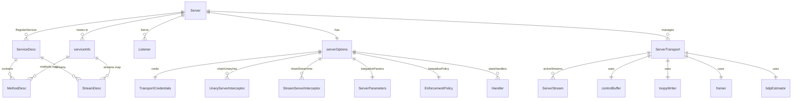
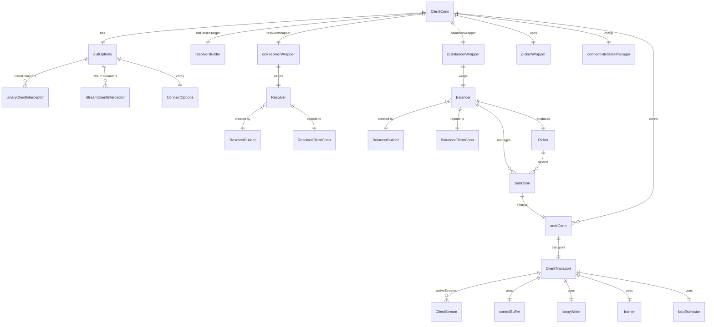
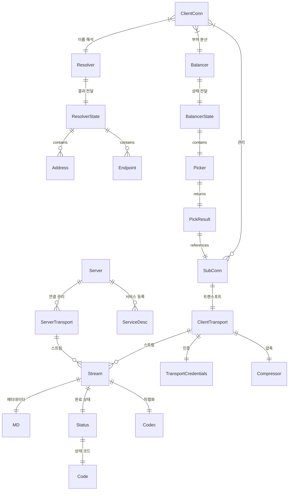

# gRPC-Go 데이터 모델

## 목차

1. [개요](#1-개요)
2. [서비스 정의 모델](#2-서비스-정의-모델)
3. [서버 데이터 모델](#3-서버-데이터-모델)
4. [클라이언트 데이터 모델](#4-클라이언트-데이터-모델)
5. [트랜스포트 계층 모델](#5-트랜스포트-계층-모델)
6. [스트림 데이터 모델](#6-스트림-데이터-모델)
7. [밸런서 데이터 모델](#7-밸런서-데이터-모델)
8. [리졸버 데이터 모델](#8-리졸버-데이터-모델)
9. [인터셉터 모델](#9-인터셉터-모델)
10. [인코딩 모델](#10-인코딩-모델)
11. [인증 모델](#11-인증-모델)
12. [상태 코드와 에러 모델](#12-상태-코드와-에러-모델)
13. [메타데이터 모델](#13-메타데이터-모델)
14. [Keepalive 모델](#14-keepalive-모델)
15. [통계(Stats) 모델](#15-통계stats-모델)
16. [연결 상태 모델](#16-연결-상태-모델)
17. [데이터 흐름 다이어그램](#17-데이터-흐름-다이어그램)
18. [ER 다이어그램](#18-er-다이어그램)

---

## 1. 개요

gRPC-Go의 데이터 모델은 크게 다음 계층으로 나뉜다:

```
+--------------------------------------------------------------+
|                    애플리케이션 계층                            |
|  ServiceDesc / MethodDesc / StreamDesc                       |
+--------------------------------------------------------------+
|                    채널 계층 (Channel Layer)                   |
|  ClientConn / Server / Interceptor / CallOption              |
+--------------------------------------------------------------+
|                    이름 해석 & 부하 분산                        |
|  resolver.Builder / resolver.Resolver / resolver.State       |
|  balancer.Builder / balancer.Balancer / balancer.Picker      |
+--------------------------------------------------------------+
|                    트랜스포트 계층                              |
|  ClientTransport / ServerTransport / Stream                  |
|  http2Client / http2Server                                   |
+--------------------------------------------------------------+
|                    와이어 프로토콜                              |
|  encoding.Codec / encoding.Compressor / metadata.MD          |
|  codes.Code / status.Status                                  |
+--------------------------------------------------------------+
```

이 문서에서는 각 계층의 핵심 struct, interface, type을 소스코드 경로와 라인 번호를 인용하며 상세히 설명한다.

---

## 2. 서비스 정의 모델

gRPC 서비스를 서버에 등록하기 위한 기본 데이터 구조다. protoc 코드 생성기가 이 구조체들을 자동 생성한다.

### 2.1 ServiceDesc

> 소스: `server.go:104-113`

```go
// ServiceDesc represents an RPC service's specification.
type ServiceDesc struct {
    ServiceName string        // 서비스 전체 이름 (package.ServiceName)
    HandlerType any           // 서비스 인터페이스 포인터 (구현 검증용)
    Methods     []MethodDesc  // Unary RPC 메서드 목록
    Streams     []StreamDesc  // Streaming RPC 메서드 목록
    Metadata    any           // 서비스 메타데이터 (보통 proto 파일명)
}
```

| 필드 | 타입 | 역할 |
|------|------|------|
| `ServiceName` | `string` | protobuf에서 정의한 서비스 전체 이름. `/package.ServiceName/Method` 형태로 라우팅에 사용 |
| `HandlerType` | `any` | 서비스 인터페이스의 포인터. `RegisterService` 시 사용자 구현이 인터페이스를 만족하는지 reflect로 검증 |
| `Methods` | `[]MethodDesc` | Unary RPC 메서드 목록. 각 메서드마다 이름과 핸들러 함수 쌍 |
| `Streams` | `[]StreamDesc` | Streaming RPC 메서드 목록. 서버/클라이언트 스트리밍 방향 포함 |
| `Metadata` | `any` | 보통 proto 파일명 문자열. 리플렉션 등에서 활용 |

**왜 이런 설계인가?** gRPC는 언어 독립적 IDL(protobuf)에서 코드를 생성한다. `ServiceDesc`는 생성된 코드와 런타임 사이의 계약(contract)이다. 서버는 이 구조체를 받아 내부 `serviceInfo`로 변환하여 O(1) 라우팅을 수행한다.

### 2.2 MethodDesc와 MethodHandler

> 소스: `server.go:95-102`

```go
// MethodHandler is a function type that processes a unary RPC method call.
type MethodHandler func(srv any, ctx context.Context, dec func(any) error,
    interceptor UnaryServerInterceptor) (any, error)

// MethodDesc represents an RPC service's method specification.
type MethodDesc struct {
    MethodName string        // 메서드 이름 (서비스명 제외)
    Handler    MethodHandler // 실제 핸들러 함수
}
```

`MethodHandler`의 시그니처가 복잡한 이유:
- `srv any`: 서비스 구현 인스턴스를 제네릭하게 전달
- `dec func(any) error`: 요청 메시지 디코딩 함수. lazy decoding으로 인터셉터가 디코딩 전에 먼저 실행 가능
- `interceptor UnaryServerInterceptor`: 체인된 인터셉터. nil이면 직접 호출

### 2.3 StreamDesc와 StreamHandler

> 소스: `stream.go:54-78`

```go
// StreamHandler defines the handler called by gRPC server to complete the
// execution of a streaming RPC.
type StreamHandler func(srv any, stream ServerStream) error

// StreamDesc represents a streaming RPC service's method specification.
type StreamDesc struct {
    StreamName    string        // 메서드 이름
    Handler       StreamHandler // 스트리밍 핸들러
    ServerStreams  bool         // 서버가 스트리밍 전송 가능 여부
    ClientStreams  bool         // 클라이언트가 스트리밍 전송 가능 여부
}
```

`ServerStreams`와 `ClientStreams` 조합으로 4가지 RPC 유형을 표현한다:

| ServerStreams | ClientStreams | RPC 유형 |
|:---:|:---:|:---|
| false | false | Unary (MethodDesc로 등록) |
| true | false | Server Streaming |
| false | true | Client Streaming |
| true | true | Bidirectional Streaming |

### 2.4 serviceInfo (내부)

> 소스: `server.go:117-123`

```go
type serviceInfo struct {
    serviceImpl any                      // 서비스 구현체
    methods     map[string]*MethodDesc   // 메서드명 -> MethodDesc
    streams     map[string]*StreamDesc   // 스트림명 -> StreamDesc
    mdata       any                      // 메타데이터
}
```

`ServiceDesc`가 외부 인터페이스라면, `serviceInfo`는 내부 최적화 구조체다. 슬라이스를 맵으로 변환하여 O(1) 라우팅을 가능하게 한다. 서버의 `services map[string]*serviceInfo`에 서비스명을 키로 저장되며, RPC 요청이 들어오면 `/:method` 경로에서 서비스명과 메서드명을 분리하여 이중 맵 룩업으로 핸들러를 찾는다.

---

## 3. 서버 데이터 모델

### 3.1 Server

> 소스: `server.go:126-152`

```go
type Server struct {
    opts         serverOptions
    statsHandler stats.Handler

    mu   sync.Mutex
    lis  map[net.Listener]bool
    conns map[string]map[transport.ServerTransport]bool
    serve bool
    drain bool
    cv    *sync.Cond

    services map[string]*serviceInfo  // service name -> service info
    events   traceEventLog

    quit               *grpcsync.Event
    done               *grpcsync.Event
    channelzRemoveOnce sync.Once
    serveWG            sync.WaitGroup  // Serve 고루틴 카운트
    handlersWG         sync.WaitGroup  // 메서드 핸들러 고루틴 카운트

    channelz *channelz.Server

    serverWorkerChannel      chan func()
    serverWorkerChannelClose func()
}
```

**핵심 필드 설명:**

| 필드 | 타입 | 역할 |
|------|------|------|
| `opts` | `serverOptions` | 서버 설정 (인터셉터, 크레덴셜, 크기 제한 등) |
| `mu` | `sync.Mutex` | 아래 필드들의 동시 접근 보호 |
| `lis` | `map[net.Listener]bool` | 활성 리스너 집합. 다중 포트 리스닝 지원 |
| `conns` | `map[string]map[transport.ServerTransport]bool` | 리스너 주소별 활성 트랜스포트 집합 |
| `services` | `map[string]*serviceInfo` | 서비스명 -> 서비스 정보. RPC 라우팅의 핵심 |
| `quit` / `done` | `*grpcsync.Event` | Graceful Shutdown 시그널링. quit은 중단 시작, done은 완료 |
| `serveWG` / `handlersWG` | `sync.WaitGroup` | Serve 고루틴과 핸들러 고루틴의 종료 대기 |
| `serverWorkerChannel` | `chan func()` | 서버 워커 풀. 고루틴 생성 비용 절감 |

**왜 `conns`가 이중 맵인가?** 첫 번째 키는 리스너 주소 문자열, 두 번째 키는 해당 리스너로 들어온 `ServerTransport`다. GracefulStop 시 특정 리스너의 모든 연결만 드레인할 수 있고, 전체 연결 수 추적도 가능하다.

### 3.2 serverOptions

> 소스: `server.go:154-184`

```go
type serverOptions struct {
    creds                 credentials.TransportCredentials
    codec                 baseCodec
    cp                    Compressor
    dc                    Decompressor
    unaryInt              UnaryServerInterceptor
    streamInt             StreamServerInterceptor
    chainUnaryInts        []UnaryServerInterceptor
    chainStreamInts       []StreamServerInterceptor
    binaryLogger          binarylog.Logger
    inTapHandle           tap.ServerInHandle
    statsHandlers         []stats.Handler
    maxConcurrentStreams  uint32
    maxReceiveMessageSize int
    maxSendMessageSize    int
    unknownStreamDesc     *StreamDesc
    keepaliveParams       keepalive.ServerParameters
    keepalivePolicy       keepalive.EnforcementPolicy
    initialWindowSize     int32
    initialConnWindowSize int32
    writeBufferSize       int
    readBufferSize        int
    sharedWriteBuffer     bool
    connectionTimeout     time.Duration
    maxHeaderListSize     *uint32
    headerTableSize       *uint32
    numServerWorkers      uint32
    bufferPool            mem.BufferPool
    waitForHandlers       bool
    staticWindowSize      bool
}
```

기본값은 다음과 같다 (`server.go:186-194`):

```go
var defaultServerOptions = serverOptions{
    maxConcurrentStreams:  math.MaxUint32,
    maxReceiveMessageSize: defaultServerMaxReceiveMessageSize,  // 4MB
    maxSendMessageSize:    defaultServerMaxSendMessageSize,     // math.MaxInt32
    connectionTimeout:     120 * time.Second,
    writeBufferSize:       defaultWriteBufSize,                 // 32KB
    readBufferSize:        defaultReadBufSize,                  // 32KB
    bufferPool:            mem.DefaultBufferPool(),
}
```

### 3.3 ServerOption 인터페이스

> 소스: `server.go:197-198`

```go
type ServerOption interface {
    apply(*serverOptions)
}
```

함수형 옵션 패턴(Functional Options Pattern)으로 구현되어 있다. `WithMaxConcurrentStreams()`, `Creds()` 등의 팩토리 함수가 `ServerOption`을 반환하며, 이 옵션들은 `NewServer()` 호출 시 `serverOptions`에 적용된다.

---

## 4. 클라이언트 데이터 모델

### 4.1 ClientConn

> 소스: `clientconn.go:667-706`

```go
type ClientConn struct {
    ctx    context.Context
    cancel context.CancelFunc

    // 다이얼 시 초기화, 이후 읽기 전용
    target              string              // 사용자의 다이얼 타겟
    parsedTarget        resolver.Target     // 파싱된 타겟
    authority           string              // :authority 헤더 값
    dopts               dialOptions         // 다이얼 옵션
    channelz            *channelz.Channel
    resolverBuilder     resolver.Builder    // 리졸버 빌더
    idlenessMgr         *idle.Manager
    metricsRecorderList *istats.MetricsRecorderList
    statsHandler        stats.Handler

    // 자체 동기화 제공
    csMgr              *connectivityStateManager
    pickerWrapper      *pickerWrapper
    safeConfigSelector iresolver.SafeConfigSelector
    retryThrottler     atomic.Value

    // mu로 보호되는 필드
    mu              sync.RWMutex
    resolverWrapper *ccResolverWrapper
    balancerWrapper *ccBalancerWrapper
    sc              *ServiceConfig
    conns           map[*addrConn]struct{}   // 주소별 연결 집합
    keepaliveParams keepalive.ClientParameters
    firstResolveEvent *grpcsync.Event

    lceMu               sync.Mutex
    lastConnectionError error
}
```

**핵심 필드 설명:**

| 필드 | 타입 | 역할 |
|------|------|------|
| `target` | `string` | 사용자가 지정한 원본 다이얼 타겟 문자열 |
| `parsedTarget` | `resolver.Target` | scheme://authority/endpoint 형태로 파싱된 타겟 |
| `dopts` | `dialOptions` | 다이얼 옵션 (인터셉터, 크레덴셜, 백오프 등) |
| `resolverBuilder` | `resolver.Builder` | 이름 해석을 수행할 리졸버 빌더 |
| `csMgr` | `*connectivityStateManager` | 연결 상태(IDLE/CONNECTING/READY 등) 관리 |
| `pickerWrapper` | `*pickerWrapper` | 밸런서의 Picker를 래핑. RPC마다 SubConn 선택 |
| `resolverWrapper` | `*ccResolverWrapper` | 리졸버를 래핑하여 ClientConn과 연결 |
| `balancerWrapper` | `*ccBalancerWrapper` | 밸런서를 래핑하여 ClientConn과 연결 |
| `conns` | `map[*addrConn]struct{}` | 활성 주소 연결(addrConn) 집합 |
| `firstResolveEvent` | `*grpcsync.Event` | 첫 번째 이름 해석 완료 신호. RPC는 이 이벤트까지 블록 |

**왜 `conns`가 `addrConn` 포인터의 집합인가?** `addrConn`은 하나의 주소(endpoint)에 대한 TCP 연결을 관리하는 단위다. 밸런서가 SubConn(내부적으로 addrConn)을 생성/제거할 때마다 이 맵이 업데이트된다. 포인터를 키로 사용하여 맵 연산이 O(1)이다.

### 4.2 dialOptions

> 소스: `dialoptions.go:69-99`

```go
type dialOptions struct {
    unaryInt            UnaryClientInterceptor
    streamInt           StreamClientInterceptor
    chainUnaryInts      []UnaryClientInterceptor
    chainStreamInts     []StreamClientInterceptor
    compressorV0        Compressor
    dc                  Decompressor
    bs                  internalbackoff.Strategy
    block               bool
    returnLastError     bool
    timeout             time.Duration
    authority           string
    binaryLogger        binarylog.Logger
    copts               transport.ConnectOptions
    callOptions         []CallOption
    channelzParent      channelz.Identifier
    disableServiceConfig bool
    disableRetry        bool
    disableHealthCheck  bool
    minConnectTimeout   func() time.Duration
    defaultServiceConfig        *ServiceConfig
    defaultServiceConfigRawJSON *string
    resolvers           []resolver.Builder
    idleTimeout         time.Duration
    defaultScheme       string
    maxCallAttempts     int
    enableLocalDNSResolution bool
    useProxy            bool
}
```

| 주요 필드 | 역할 |
|-----------|------|
| `unaryInt` / `streamInt` | 단일 인터셉터 (deprecated, 체인 사용 권장) |
| `chainUnaryInts` / `chainStreamInts` | 체인 인터셉터 슬라이스 |
| `copts` | 트랜스포트 레벨 연결 옵션 (`transport.ConnectOptions`) |
| `bs` | 백오프 전략 (지수 백오프) |
| `maxCallAttempts` | 최대 재시도 횟수 (기본 5, `defaultMaxCallAttempts`) |
| `idleTimeout` | 유휴 상태 타임아웃 |
| `defaultServiceConfig` | 리졸버가 서비스 설정을 제공하지 않을 때 사용할 기본값 |

### 4.3 DialOption 인터페이스

> 소스: `dialoptions.go:101-104`

```go
type DialOption interface {
    apply(*dialOptions)
}
```

서버와 동일한 함수형 옵션 패턴이다. `WithTransportCredentials()`, `WithUnaryInterceptor()` 등이 `DialOption`을 반환한다.

---

## 5. 트랜스포트 계층 모델

트랜스포트 계층은 `internal/transport/` 패키지에 위치하며, HTTP/2 프레임 수준의 연결 관리를 담당한다.

### 5.1 Stream (트랜스포트 레벨)

> 소스: `internal/transport/transport.go:288-309`

```go
type Stream struct {
    ctx            context.Context   // 스트림 컨텍스트
    method         string            // RPC 메서드 이름
    recvCompress   string            // 수신 압축 알고리즘
    sendCompress   string            // 송신 압축 알고리즘
    readRequester  readRequester     // 흐름 제어 읽기 요청자
    contentSubtype string            // 콘텐츠 서브타입
    trailer        metadata.MD       // 트레일러 메타데이터

    state      streamState           // 스트림 상태 (active/writeDone/readDone/done)
    id         uint32                // HTTP/2 스트림 ID
    buf        recvBuffer            // 수신 버퍼
    trReader   transportReader       // 트랜스포트 리더
    fc         inFlow                // 인바운드 흐름 제어
    wq         writeQuota            // 쓰기 쿼타
}
```

스트림 상태 전이 (`internal/transport/transport.go:280-285`):

```
streamActive ──→ streamWriteDone ──→ streamDone
     │                                    ↑
     └──→ streamReadDone ─────────────────┘
```

| 상태 | 의미 |
|------|------|
| `streamActive` | 스트림 활성 상태. 읽기/쓰기 모두 가능 |
| `streamWriteDone` | EndStream 전송됨. 쓰기 종료, 읽기는 가능 |
| `streamReadDone` | EndStream 수신됨. 읽기 종료, 쓰기는 가능 |
| `streamDone` | 양방향 모두 종료 |

### 5.2 ClientTransport 인터페이스

> 소스: `internal/transport/transport.go:604-641`

```go
type ClientTransport interface {
    Close(err error)
    GracefulClose()
    NewStream(ctx context.Context, callHdr *CallHdr,
        handler stats.Handler) (*ClientStream, error)
    Error() <-chan struct{}
    GoAway() <-chan struct{}
    GetGoAwayReason() (GoAwayReason, string)
    Peer() *peer.Peer
}
```

| 메서드 | 역할 |
|--------|------|
| `Close` | 즉시 종료. 모든 활성 스트림 중단 |
| `GracefulClose` | 새 RPC 거부, 기존 스트림 완료 후 종료 |
| `NewStream` | 새 RPC 스트림 생성 |
| `Error` | I/O 에러 발생 시 닫히는 채널. 모니터링 고루틴이 감시 |
| `GoAway` | 서버 GOAWAY 프레임 수신 시 닫히는 채널 |
| `Peer` | 피어 정보 (주소, 인증 정보) 반환 |

### 5.3 ServerTransport 인터페이스

> 소스: `internal/transport/transport.go:648-662`

```go
type ServerTransport interface {
    HandleStreams(context.Context, func(*ServerStream))
    Close(err error)
    Peer() *peer.Peer
    Drain(debugData string)
}
```

| 메서드 | 역할 |
|--------|------|
| `HandleStreams` | 수신 스트림을 콜백 핸들러로 전달. 서버의 메인 루프 |
| `Close` | 트랜스포트 종료 |
| `Peer` | 피어 정보 반환 |
| `Drain` | GOAWAY 프레임 전송하여 클라이언트에게 드레인 알림 |

### 5.4 http2Server

> 소스: `internal/transport/http2_server.go:74-140`

```go
type http2Server struct {
    lastRead        int64              // 원자적 접근. 마지막 읽기 시각
    done            chan struct{}
    conn            net.Conn           // 기본 TCP 연결
    loopy           *loopyWriter       // 비동기 프레임 쓰기 담당
    readerDone      chan struct{}
    loopyWriterDone chan struct{}
    peer            peer.Peer
    inTapHandle     tap.ServerInHandle
    framer          *framer            // HTTP/2 프레임 읽기/쓰기
    maxStreams       uint32            // 최대 동시 스트림 수
    controlBuf      *controlBuffer     // 제어 작업 큐
    fc              *trInFlow          // 트랜스포트 레벨 인바운드 흐름 제어
    stats           stats.Handler
    kp              keepalive.ServerParameters
    kep             keepalive.EnforcementPolicy
    lastPingAt      time.Time
    pingStrikes     uint8
    resetPingStrikes      uint32       // 원자적. 핑 위반 카운터 리셋
    initialWindowSize     int32
    bdpEst                *bdpEstimator  // 대역폭 지연 곱 추정기
    maxSendHeaderListSize *uint32

    mu              sync.Mutex
    drainEvent      *grpcsync.Event
    state           transportState     // reachable / closing / draining
    activeStreams   map[uint32]*ServerStream  // 스트림 ID -> 서버 스트림
    idle            time.Time

    channelz      *channelz.Socket
    bufferPool    mem.BufferPool
    connectionID  uint64
    maxStreamMu   sync.Mutex
    maxStreamID   uint32
    logger        *grpclog.PrefixLogger
    setResetPingStrikes func()
}
```

**왜 `controlBuf`를 사용하는가?** HTTP/2에서 WINDOW_UPDATE, RST_STREAM, SETTINGS 같은 제어 프레임을 즉시 전송하면 쓰기 경합이 발생한다. `controlBuf`는 이런 제어 작업들을 큐잉하여 `loopyWriter` 고루틴이 직렬화해서 전송하도록 한다.

### 5.5 http2Client

> 소스: `internal/transport/http2_client.go:70-140`

```go
type http2Client struct {
    lastRead     int64              // 원자적 접근
    ctx          context.Context
    cancel       context.CancelFunc
    ctxDone      <-chan struct{}
    userAgent    string
    address      resolver.Address
    md           metadata.MD
    conn         net.Conn           // 기본 TCP 연결
    loopy        *loopyWriter       // 비동기 프레임 쓰기
    remoteAddr   net.Addr
    localAddr    net.Addr
    authInfo     credentials.AuthInfo

    readerDone    chan struct{}
    writerDone    chan struct{}
    goAway        chan struct{}      // 서버 GOAWAY 수신 알림
    keepaliveDone chan struct{}
    framer        *framer
    controlBuf    *controlBuffer
    fc            *trInFlow
    scheme        string            // "https" 또는 "http"
    isSecure      bool
    perRPCCreds   []credentials.PerRPCCredentials
    kp            keepalive.ClientParameters
    keepaliveEnabled bool
    statsHandler  stats.Handler
    initialWindowSize int32
    maxSendHeaderListSize *uint32
    bdpEst        *bdpEstimator
    maxConcurrentStreams  uint32
    streamQuota          int64
    streamsQuotaAvailable chan struct{}
    waitingStreams       uint32
    registeredCompressors string

    mu            sync.Mutex
    nextID        uint32             // 다음 스트림 ID (클라이언트는 홀수)
    state         transportState
    activeStreams  map[uint32]*ClientStream  // 스트림 ID -> 클라이언트 스트림
    prevGoAwayID  uint32
    goAwayReason  GoAwayReason
    goAwayDebugMessage string
}
```

`http2Client`와 `http2Server`의 공통 패턴:
- **`loopyWriter`**: 단일 고루틴에서 모든 프레임 쓰기를 처리하여 동기화 오버헤드 제거
- **`controlBuf`**: 제어 프레임을 큐잉하여 loopyWriter로 전달
- **`activeStreams`**: 스트림 ID로 인덱싱된 활성 스트림 맵
- **`bdpEst`**: 대역폭 지연 곱(Bandwidth Delay Product) 추정기로 동적 윈도우 크기 조절
- **`framer`**: HTTP/2 프레임 인코딩/디코딩

### 5.6 CallHdr

> 소스: `internal/transport/transport.go:560-602`

```go
type CallHdr struct {
    Host              string   // 피어 호스트
    Method            string   // RPC 메서드명
    SendCompress      string   // 압축 알고리즘
    AcceptedCompressors *string // 수용 가능한 압축 목록
    Creds             credentials.PerRPCCredentials
    ContentSubtype    string   // 콘텐츠 서브타입
    PreviousAttempts  int      // 이전 시도 횟수 (재시도용)
    DoneFunc          func()   // 스트림 완료 콜백
    Authority         string   // :authority 헤더 오버라이드
}
```

### 5.7 ServerConfig과 ConnectOptions

> 소스: `internal/transport/transport.go:491-550`

```go
// ServerConfig -- 서버 트랜스포트 설정
type ServerConfig struct {
    MaxStreams            uint32
    ConnectionTimeout     time.Duration
    Credentials           credentials.TransportCredentials
    InTapHandle           tap.ServerInHandle
    StatsHandler          stats.Handler
    KeepaliveParams       keepalive.ServerParameters
    KeepalivePolicy       keepalive.EnforcementPolicy
    InitialWindowSize     int32
    InitialConnWindowSize int32
    WriteBufferSize       int
    ReadBufferSize        int
    SharedWriteBuffer     bool
    ChannelzParent        *channelz.Server
    MaxHeaderListSize     *uint32
    HeaderTableSize       *uint32
    BufferPool            mem.BufferPool
    StaticWindowSize      bool
}

// ConnectOptions -- 클라이언트 트랜스포트 연결 옵션
type ConnectOptions struct {
    UserAgent           string
    Dialer              func(context.Context, string) (net.Conn, error)
    FailOnNonTempDialError bool
    PerRPCCredentials   []credentials.PerRPCCredentials
    TransportCredentials credentials.TransportCredentials
    CredsBundle          credentials.Bundle
    KeepaliveParams      keepalive.ClientParameters
    StatsHandlers        []stats.Handler
    InitialWindowSize    int32
    InitialConnWindowSize int32
    WriteBufferSize      int
    ReadBufferSize       int
    SharedWriteBuffer    bool
    ChannelzParent       *channelz.SubChannel
    MaxHeaderListSize    *uint32
    BufferPool           mem.BufferPool
    StaticWindowSize     bool
}
```

### 5.8 recvBuffer (내부 수신 버퍼)

> 소스: `internal/transport/transport.go:64-69`

```go
type recvBuffer struct {
    c       chan recvMsg    // 메시지 전달 채널 (용량 1)
    mu      sync.Mutex
    backlog []recvMsg      // 백로그 슬라이스
    err     error
}
```

**왜 채널 용량이 1인가?** `recvBuffer`는 무한 버퍼(unbounded channel)를 구현한다. 채널에 하나의 메시지만 넣고, 나머지는 `backlog` 슬라이스에 축적한다. 소비자가 채널에서 메시지를 꺼내면(`get()`), `load()`가 백로그의 다음 메시지를 채널에 넣는다. 이 설계는 채널의 select 가능한 특성과 슬라이스의 무한 확장을 결합한다.

---

## 6. 스트림 데이터 모델

### 6.1 ClientStream 인터페이스

> 소스: `stream.go:93-148`

```go
type ClientStream interface {
    Header() (metadata.MD, error)  // 서버 헤더 메타데이터 (블로킹)
    Trailer() metadata.MD          // 서버 트레일러 메타데이터
    CloseSend() error              // 클라이언트 송신 종료
    Context() context.Context      // 스트림 컨텍스트
    SendMsg(m any) error           // 메시지 전송
    RecvMsg(m any) error           // 메시지 수신
}
```

| 메서드 | 동작 |
|--------|------|
| `Header()` | 서버가 헤더를 보낼 때까지 블록. 첫 번째 `RecvMsg` 전에도 호출 가능 |
| `Trailer()` | `RecvMsg`가 non-nil 에러를 반환한 후에만 유효 |
| `CloseSend()` | END_STREAM 플래그를 보내 클라이언트 측 스트림 종료 |
| `SendMsg(m)` | 흐름 제어에 의해 블록될 수 있음. 메시지는 수신 확인 없이 전송 |
| `RecvMsg(m)` | io.EOF이면 정상 종료. 다른 에러는 status 패키지와 호환 |

### 6.2 ServerStream 인터페이스

> 소스: `stream.go` (ServerStream은 같은 파일에 정의)

```go
type ServerStream interface {
    SetHeader(metadata.MD) error   // 헤더 메타데이터 설정 (전송 전)
    SendHeader(metadata.MD) error  // 헤더 메타데이터 즉시 전송
    SetTrailer(metadata.MD)        // 트레일러 메타데이터 설정
    Context() context.Context      // 스트림 컨텍스트
    SendMsg(m any) error           // 메시지 전송
    RecvMsg(m any) error           // 메시지 수신
}
```

| 메서드 | 동작 |
|--------|------|
| `SetHeader` | 아직 전송되지 않은 헤더에 메타데이터 추가 |
| `SendHeader` | 헤더를 즉시 클라이언트에 전송. `SendMsg` 전에 호출해야 함 |
| `SetTrailer` | RPC 완료 시 함께 보낼 트레일러 설정 |
| `SendMsg` / `RecvMsg` | ClientStream과 동일 |

### 6.3 제네릭 스트림 인터페이스

> 소스: `stream_interfaces.go:24-148`

gRPC-Go는 Go 제네릭을 활용한 타입 안전 스트림 인터페이스를 제공한다:

```go
// Server Streaming (1 요청, N 응답)
type ServerStreamingClient[Res any] interface {
    Recv() (*Res, error)
    ClientStream
}

type ServerStreamingServer[Res any] interface {
    Send(*Res) error
    ServerStream
}

// Client Streaming (N 요청, 1 응답)
type ClientStreamingClient[Req any, Res any] interface {
    Send(*Req) error
    CloseAndRecv() (*Res, error)
    ClientStream
}

type ClientStreamingServer[Req any, Res any] interface {
    Recv() (*Req, error)
    SendAndClose(*Res) error
    ServerStream
}

// Bidirectional Streaming (N 요청, N 응답)
type BidiStreamingClient[Req any, Res any] interface {
    Send(*Req) error
    Recv() (*Res, error)
    ClientStream
}

type BidiStreamingServer[Req any, Res any] interface {
    Recv() (*Req, error)
    Send(*Res) error
    ServerStream
}
```

**왜 제네릭 인터페이스인가?** protoc-gen-go-grpc 코드 생성기가 이 인터페이스를 사용하여 타입 안전한 스트림 래퍼를 생성한다. `any` 타입 대신 구체적인 메시지 타입을 사용하므로 컴파일 타임에 타입 오류를 잡을 수 있다.

---

## 7. 밸런서 데이터 모델

### 7.1 Builder 인터페이스

> 소스: `balancer/balancer.go:222-228`

```go
type Builder interface {
    Build(cc ClientConn, opts BuildOptions) Balancer
    Name() string
}
```

밸런서는 이름 기반 레지스트리로 관리된다 (`balancer/balancer.go:44`):

```go
var m = make(map[string]Builder)
```

`Register(b Builder)`로 등록하고 `Get(name string)`으로 조회한다. 서비스 설정의 `loadBalancingPolicy` 필드에 밸런서 이름을 지정하면 해당 빌더가 사용된다.

### 7.2 Balancer 인터페이스

> 소스: `balancer/balancer.go:344-367`

```go
type Balancer interface {
    UpdateClientConnState(ClientConnState) error  // 리졸버 상태 업데이트 수신
    ResolverError(error)                          // 리졸버 에러 수신
    UpdateSubConnState(SubConn, SubConnState)     // (deprecated) SubConn 상태 변경
    Close()                                       // 밸런서 종료
    ExitIdle()                                    // IDLE 상태 탈출
}
```

### 7.3 ClientConnState

> 소스: `balancer/balancer.go:385-390`

```go
type ClientConnState struct {
    ResolverState  resolver.State                       // 리졸버가 보낸 상태
    BalancerConfig serviceconfig.LoadBalancingConfig     // 파싱된 밸런서 설정
}
```

이 구조체는 리졸버 -> 밸런서로 전달되는 데이터 패킷이다. 리졸버가 주소 목록을 업데이트하면 gRPC가 이를 `ClientConnState`로 포장하여 `Balancer.UpdateClientConnState()`를 호출한다.

### 7.4 Picker 인터페이스

> 소스: `balancer/balancer.go:313-334`

```go
type Picker interface {
    Pick(info PickInfo) (PickResult, error)
}
```

### 7.5 PickInfo와 PickResult

> 소스: `balancer/balancer.go:238-299`

```go
type PickInfo struct {
    FullMethodName string            // /service/Method 형태
    Ctx            context.Context   // RPC 컨텍스트
}

type PickResult struct {
    SubConn  SubConn             // 선택된 연결
    Done     func(DoneInfo)      // RPC 완료 콜백
    Metadata metadata.MD         // LB 정책이 주입하는 메타데이터
}

type DoneInfo struct {
    Err           error           // RPC 에러
    Trailer       metadata.MD    // 트레일러 메타데이터
    BytesSent     bool           // 데이터 전송 여부
    BytesReceived bool           // 데이터 수신 여부
    ServerLoad    any            // 서버 부하 정보 (ORCA)
}
```

**Pick의 에러 처리 흐름:**
- `ErrNoSubConnAvailable` -> gRPC가 새 Picker가 나올 때까지 블록
- status 에러 -> 해당 코드/메시지로 RPC 즉시 종료
- 기타 에러 -> wait-for-ready는 블록, non-wait-for-ready는 Unavailable로 종료

### 7.6 State (밸런서 상태)

> 소스: `balancer/balancer.go:117-124`

```go
type State struct {
    ConnectivityState connectivity.State  // 연결 상태
    Picker            Picker              // 현재 Picker
}
```

밸런서는 내부 상태가 변경될 때마다 `ClientConn.UpdateState(State)`를 호출하여 새 Picker를 gRPC에 전달한다. 이것이 밸런서 -> gRPC 방향의 주요 통신 채널이다.

### 7.7 SubConn 인터페이스

> 소스: `balancer/subconn.go:51-92`

```go
type SubConn interface {
    UpdateAddresses([]resolver.Address)     // (deprecated) 주소 업데이트
    Connect()                               // 연결 시도 시작
    GetOrBuildProducer(ProducerBuilder) (p Producer, close func())
    Shutdown()                              // 정상 종료
    RegisterHealthListener(func(SubConnState))  // 헬스 리스너 등록
    internal.EnforceSubConnEmbedding
}
```

SubConn 상태 전이:

```
         Connect()
  IDLE ──────────→ CONNECTING
   ↑                    │
   │            성공 ────┼────→ READY ──→ IDLE (연결 끊김)
   │                    │
   └── 백오프 후 ←──── TRANSIENT_FAILURE
                                           Shutdown()
                    모든 상태 ──────────→ SHUTDOWN
```

### 7.8 SubConnState

> 소스: `balancer/subconn.go:107-114`

```go
type SubConnState struct {
    ConnectivityState connectivity.State  // 현재 연결 상태
    ConnectionError   error              // TransientFailure일 때만 non-nil
}
```

### 7.9 balancer.ClientConn 인터페이스

> 소스: `balancer/balancer.go:139-188`

```go
type ClientConn interface {
    NewSubConn([]resolver.Address, NewSubConnOptions) (SubConn, error)
    RemoveSubConn(SubConn)                     // (deprecated)
    UpdateAddresses(SubConn, []resolver.Address) // (deprecated)
    UpdateState(State)                          // 밸런서 상태 업데이트
    ResolveNow(resolver.ResolveNowOptions)     // 즉시 이름 해석 요청
    Target() string                            // (deprecated)
    MetricsRecorder() estats.MetricsRecorder   // 메트릭 레코더
    internal.EnforceClientConnEmbedding
}
```

**주의:** 이 `balancer.ClientConn`은 최상위 `grpc.ClientConn`과 다른 인터페이스다. 밸런서가 gRPC 프레임워크와 소통하기 위한 콜백 인터페이스로, gRPC 내부에서 구현한다.

---

## 8. 리졸버 데이터 모델

### 8.1 Target

> 소스: `resolver/resolver.go:269-275`

```go
type Target struct {
    URL url.URL   // 파싱된 다이얼 타겟 URL
}
```

`Endpoint()` 메서드로 URL의 Path 또는 Opaque에서 엔드포인트를 추출한다. 예: `dns:///my-service:8080`에서 `my-service:8080`을 반환한다.

### 8.2 Address

> 소스: `resolver/resolver.go:91-122`

```go
type Address struct {
    Addr               string                 // 서버 주소 ("host:port")
    ServerName         string                 // TLS 인증용 서버명
    Attributes         *attributes.Attributes // SubConn용 임의 데이터
    BalancerAttributes *attributes.Attributes // (deprecated) LB 정책용 데이터
    Metadata           any                    // (deprecated) 부하 분산 결정용
}
```

### 8.3 Endpoint

> 소스: `resolver/resolver.go:186-193`

```go
type Endpoint struct {
    Addresses  []Address                // 이 엔드포인트에 접근 가능한 주소 목록
    Attributes *attributes.Attributes   // LB 정책용 임의 데이터
}
```

**왜 Address와 Endpoint가 분리되어 있는가?** 하나의 논리 서버(Endpoint)가 여러 물리 주소를 가질 수 있다 (예: IPv4 + IPv6, 여러 IP). `Endpoint`는 이 관계를 표현하며, 미래에 `Address`를 대체할 예정이다.

### 8.4 resolver.State

> 소스: `resolver/resolver.go:196-223`

```go
type State struct {
    Addresses     []Address                          // 주소 목록 (deprecated 예정)
    Endpoints     []Endpoint                         // 엔드포인트 목록
    ServiceConfig *serviceconfig.ParseResult         // 파싱된 서비스 설정
    Attributes    *attributes.Attributes             // LB 정책용 임의 데이터
}
```

리졸버는 이름 해석 결과를 `State`에 담아 `resolver.ClientConn.UpdateState()`로 전달한다. `Addresses`와 `Endpoints`가 공존하는 이유는 하위 호환성 때문이다.

### 8.5 Builder 인터페이스

> 소스: `resolver/resolver.go:300-312`

```go
type Builder interface {
    Build(target Target, cc ClientConn, opts BuildOptions) (Resolver, error)
    Scheme() string   // 지원하는 URL scheme (예: "dns", "passthrough", "unix")
}
```

### 8.6 Resolver 인터페이스

> 소스: `resolver/resolver.go:319-327`

```go
type Resolver interface {
    ResolveNow(ResolveNowOptions)   // 즉시 재해석 힌트 (무시 가능)
    Close()                          // 리졸버 종료
}
```

### 8.7 resolver.ClientConn 인터페이스

> 소스: `resolver/resolver.go:232-257`

```go
type ClientConn interface {
    UpdateState(State) error                              // 상태 업데이트
    ReportError(error)                                    // 에러 보고
    NewAddress(addresses []Address)                       // (deprecated)
    ParseServiceConfig(serviceConfigJSON string) *serviceconfig.ParseResult
}
```

이 인터페이스도 `grpc.ClientConn`과 다르다. 리졸버가 gRPC 프레임워크에 결과를 전달하기 위한 콜백 인터페이스다.

### 8.8 리졸버 레지스트리

리졸버도 scheme 기반 레지스트리로 관리된다 (`resolver/resolver.go:40-42`):

```go
var (
    m             = make(map[string]Builder)  // scheme -> Builder
    defaultScheme = "passthrough"
)
```

기본 scheme은 `"passthrough"`이며, `grpc.NewClient()`는 `"dns"`를 기본으로 사용한다.

---

## 9. 인터셉터 모델

> 소스: `interceptor.go:19-108`

### 9.1 클라이언트 인터셉터

```go
// Unary RPC 호출 완료 함수
type UnaryInvoker func(ctx context.Context, method string,
    req, reply any, cc *ClientConn, opts ...CallOption) error

// Unary 클라이언트 인터셉터
type UnaryClientInterceptor func(ctx context.Context, method string,
    req, reply any, cc *ClientConn,
    invoker UnaryInvoker, opts ...CallOption) error

// 스트림 생성 함수
type Streamer func(ctx context.Context, desc *StreamDesc,
    cc *ClientConn, method string, opts ...CallOption) (ClientStream, error)

// 스트림 클라이언트 인터셉터
type StreamClientInterceptor func(ctx context.Context, desc *StreamDesc,
    cc *ClientConn, method string,
    streamer Streamer, opts ...CallOption) (ClientStream, error)
```

### 9.2 서버 인터셉터

```go
// Unary 핸들러
type UnaryHandler func(ctx context.Context, req any) (any, error)

// Unary 서버 인터셉터
type UnaryServerInterceptor func(ctx context.Context, req any,
    info *UnaryServerInfo, handler UnaryHandler) (resp any, err error)

// 스트림 서버 인터셉터
type StreamServerInterceptor func(srv any, ss ServerStream,
    info *StreamServerInfo, handler StreamHandler) error
```

### 9.3 인터셉터 정보 구조체

```go
// interceptor.go:67-72
type UnaryServerInfo struct {
    Server     any      // 서비스 구현체 (읽기 전용)
    FullMethod string   // /package.service/method
}

// interceptor.go:91-98
type StreamServerInfo struct {
    FullMethod     string
    IsClientStream bool
    IsServerStream bool
}
```

**인터셉터 체인 동작 원리:**

```
클라이언트 요청
  → chainUnaryInts[0](ctx, req, ..., invoker1)
    → chainUnaryInts[1](ctx, req, ..., invoker2)
      → ... → chainUnaryInts[N](ctx, req, ..., realInvoker)
                → 실제 RPC 호출
```

각 인터셉터는 `invoker`(다음 인터셉터 또는 실제 호출)를 받아 전/후처리를 추가한다. 이는 미들웨어 패턴(Middleware Pattern)의 구현이다.

---

## 10. 인코딩 모델

### 10.1 Codec 인터페이스

> 소스: `encoding/encoding.go:99-111`

```go
type Codec interface {
    Marshal(v any) ([]byte, error)    // 객체 -> 바이트 직렬화
    Unmarshal(data []byte, v any) error  // 바이트 -> 객체 역직렬화
    Name() string                     // 코덱 이름 (예: "proto")
}
```

기본 코덱은 protobuf다. `Name()`이 반환하는 문자열은 HTTP/2 `Content-Type` 헤더의 서브타입으로 사용된다: `application/grpc+proto`.

레지스트리: `encoding/encoding.go:113`

```go
var registeredCodecs = make(map[string]any)
```

### 10.2 Compressor 인터페이스

> 소스: `encoding/encoding.go:61-74`

```go
type Compressor interface {
    Compress(w io.Writer) (io.WriteCloser, error)   // 압축 스트림 래퍼
    Decompress(r io.Reader) (io.Reader, error)      // 해제 스트림 래퍼
    Name() string                                    // 압축 알고리즘 이름 (예: "gzip")
}
```

레지스트리: `encoding/encoding.go:76`

```go
var registeredCompressor = make(map[string]Compressor)
```

`RegisterCompressor(c Compressor)`로 등록하며 (`encoding/encoding.go:87-92`), 클라이언트는 `grpc.UseCompressor()`로 활성화하고, 서버는 요청의 `grpc-encoding` 헤더를 보고 자동으로 적용한다.

---

## 11. 인증 모델

### 11.1 TransportCredentials 인터페이스

> 소스: `credentials/credentials.go:150-197`

```go
type TransportCredentials interface {
    ClientHandshake(context.Context, string, net.Conn) (net.Conn, AuthInfo, error)
    ServerHandshake(net.Conn) (net.Conn, AuthInfo, error)
    Info() ProtocolInfo
    Clone() TransportCredentials
    OverrideServerName(string) error  // deprecated
}
```

| 메서드 | 역할 |
|--------|------|
| `ClientHandshake` | 클라이언트 TLS 핸드셰이크. 인증된 `net.Conn`과 `AuthInfo` 반환 |
| `ServerHandshake` | 서버 TLS 핸드셰이크 |
| `Info` | 프로토콜 정보 (보안 프로토콜명, 서버명 등) |
| `Clone` | 설정 복사 (안전한 복제) |

### 11.2 PerRPCCredentials 인터페이스

> 소스: `credentials/credentials.go:38-52`

```go
type PerRPCCredentials interface {
    GetRequestMetadata(ctx context.Context, uri ...string) (map[string]string, error)
    RequireTransportSecurity() bool
}
```

RPC마다 인증 토큰을 첨부한다. OAuth2 토큰, API 키 등에 사용한다. `GetRequestMetadata`가 반환하는 맵의 키-값은 HTTP/2 헤더로 전송된다.

### 11.3 AuthInfo 인터페이스

> 소스: `credentials/credentials.go:128-130`

```go
type AuthInfo interface {
    AuthType() string   // 인증 유형 (예: "tls", "ssl")
}
```

### 11.4 ProtocolInfo

> 소스: `credentials/credentials.go:98-123`

```go
type ProtocolInfo struct {
    ProtocolVersion  string  // (deprecated) gRPC 와이어 프로토콜 버전
    SecurityProtocol string  // 보안 프로토콜 (예: "tls")
    SecurityVersion  string  // (deprecated) 보안 프로토콜 버전
    ServerName       string  // (deprecated) 서버명
}
```

### 11.5 SecurityLevel

> 소스: `credentials/credentials.go:54-69`

```go
type SecurityLevel int

const (
    InvalidSecurityLevel SecurityLevel = iota
    NoSecurity                        // 비보안 연결
    IntegrityOnly                     // 무결성만 보장
    PrivacyAndIntegrity               // 기밀성 + 무결성
)
```

### 11.6 Bundle 인터페이스

> 소스: `credentials/credentials.go:208-226`

```go
type Bundle interface {
    TransportCredentials() TransportCredentials
    PerRPCCredentials() PerRPCCredentials
    NewWithMode(mode string) (Bundle, error)
}
```

`Bundle`은 `TransportCredentials`와 `PerRPCCredentials`를 하나로 묶는다. xDS에서 보안 모드를 동적으로 전환할 때 사용한다.

---

## 12. 상태 코드와 에러 모델

### 12.1 codes.Code

> 소스: `codes/codes.go:35-199`

```go
type Code uint32
```

| 코드 | 값 | 의미 |
|------|:---:|------|
| `OK` | 0 | 성공 |
| `Canceled` | 1 | 호출자에 의해 취소됨 |
| `Unknown` | 2 | 알 수 없는 에러 |
| `InvalidArgument` | 3 | 잘못된 인자 |
| `DeadlineExceeded` | 4 | 기한 초과 |
| `NotFound` | 5 | 리소스를 찾을 수 없음 |
| `AlreadyExists` | 6 | 이미 존재 |
| `PermissionDenied` | 7 | 권한 거부 |
| `ResourceExhausted` | 8 | 리소스 고갈 |
| `FailedPrecondition` | 9 | 전제 조건 실패 |
| `Aborted` | 10 | 중단됨 |
| `OutOfRange` | 11 | 범위 초과 |
| `Unimplemented` | 12 | 미구현 |
| `Internal` | 13 | 내부 에러 |
| `Unavailable` | 14 | 서비스 이용 불가 |
| `DataLoss` | 15 | 데이터 손실 |
| `Unauthenticated` | 16 | 인증 실패 |

gRPC 프레임워크가 자동 생성하는 코드와 애플리케이션이 사용해야 하는 코드가 구분된다:
- **프레임워크 생성**: `Canceled`, `Unknown`, `DeadlineExceeded`, `ResourceExhausted`, `Unimplemented`, `Internal`, `Unavailable`, `Unauthenticated`
- **애플리케이션 사용**: `InvalidArgument`, `NotFound`, `AlreadyExists`, `PermissionDenied`, `FailedPrecondition`, `Aborted`, `OutOfRange`, `DataLoss`

### 12.2 Status

> 소스: `internal/status/status.go:43-45`

```go
type Status struct {
    s *spb.Status   // google.rpc.Status protobuf
}
```

`spb.Status`는 `google/rpc/status.proto`에 정의된 protobuf 메시지다:

```protobuf
message Status {
    int32 code = 1;                        // gRPC 상태 코드
    string message = 2;                    // 에러 메시지
    repeated google.protobuf.Any details = 3;  // 상세 에러 정보
}
```

**`details` 필드의 의미:** `details`에 protobuf `Any` 메시지를 추가하여 구조화된 에러 정보를 전송할 수 있다. 예를 들어, 검증 에러의 경우 어떤 필드가 왜 잘못됐는지를 구조체로 전달할 수 있다. 와이어에서는 `grpc-status-details-bin` 헤더로 직렬화된다.

> 공개 API: `status/status.go:41-45`

```go
// Status references google.golang.org/grpc/internal/status.
type Status = status.Status
```

주요 팩토리/유틸 함수:

| 함수 | 역할 |
|------|------|
| `status.New(c, msg)` | 코드와 메시지로 Status 생성 |
| `status.Error(c, msg)` | Status를 error로 변환 (OK이면 nil) |
| `status.FromError(err)` | error를 Status로 변환 |
| `status.Convert(err)` | error를 Status로 변환 (항상 non-nil) |

---

## 13. 메타데이터 모델

### 13.1 MD 타입

> 소스: `metadata/metadata.go:45`

```go
type MD map[string][]string
```

HTTP/2 헤더와 동일한 키-값 쌍이다. 키는 항상 소문자로 정규화된다.

**키 규칙:**
- 허용 문자: `0-9`, `a-z`, `-`, `_`, `.`
- 대문자는 자동으로 소문자로 변환
- `grpc-` 접두사는 gRPC 내부 예약 (사용자 설정 시 에러)
- `-bin` 접미사를 가진 키는 바이너리 값을 base64 인코딩하여 전송

### 13.2 MD 생성 함수

> 소스: `metadata/metadata.go:59-91`

```go
// map[string]string에서 생성
func New(m map[string]string) MD

// 키-값 쌍에서 생성 (짝수 개의 인자)
func Pairs(kv ...string) MD
```

### 13.3 MD 조작 메서드

> 소스: `metadata/metadata.go:94-157`

```go
func (md MD) Len() int
func (md MD) Copy() MD
func (md MD) Get(k string) []string      // 키로 값 조회
func (md MD) Set(k string, vals ...string) // 키에 값 설정 (덮어쓰기)
func (md MD) Append(k string, vals ...string) // 키에 값 추가
func (md MD) Delete(k string)             // 키 삭제
func Join(mds ...MD) MD                   // 여러 MD 병합
```

### 13.4 컨텍스트 통합

> 소스: `metadata/metadata.go:162-211`

```go
// 수신 메타데이터를 컨텍스트에 저장
func NewIncomingContext(ctx context.Context, md MD) context.Context

// 발신 메타데이터를 컨텍스트에 저장
func NewOutgoingContext(ctx context.Context, md MD) context.Context

// 기존 발신 메타데이터에 키-값 추가
func AppendToOutgoingContext(ctx context.Context, kv ...string) context.Context

// 수신 메타데이터 추출
func FromIncomingContext(ctx context.Context) (MD, bool)

// 수신 메타데이터에서 특정 키 값 추출
func ValueFromIncomingContext(ctx context.Context, key string) []string
```

**메타데이터 전송 흐름:**

```
클라이언트                              서버
NewOutgoingContext(ctx, md)
AppendToOutgoingContext(ctx, k, v)
        ─── HTTP/2 HEADERS 프레임 ──→
                                    FromIncomingContext(ctx)
                                    ValueFromIncomingContext(ctx, key)

                                    SetHeader(md) / SendHeader(md)
        ←── HTTP/2 HEADERS 프레임 ───
Header() (metadata.MD, error)

                                    SetTrailer(md)
        ←── HTTP/2 HEADERS (END_STREAM) ───
Trailer() metadata.MD
```

---

## 14. Keepalive 모델

> 소스: `keepalive/keepalive.go`

### 14.1 ClientParameters

> 소스: `keepalive/keepalive.go:33-60`

```go
type ClientParameters struct {
    Time                time.Duration  // 활동 없을 때 핑 간격 (최소 10초)
    Timeout             time.Duration  // 핑 후 응답 대기 시간 (기본 20초)
    PermitWithoutStream bool           // 활성 스트림 없어도 핑 허용
}
```

### 14.2 ServerParameters

> 소스: `keepalive/keepalive.go:64-86`

```go
type ServerParameters struct {
    MaxConnectionIdle     time.Duration  // 유휴 연결 최대 시간 (기본 무한)
    MaxConnectionAge      time.Duration  // 연결 최대 수명 (기본 무한, 10% 지터)
    MaxConnectionAgeGrace time.Duration  // 수명 초과 후 유예 시간 (기본 무한)
    Time                  time.Duration  // 핑 간격 (기본 2시간)
    Timeout               time.Duration  // 핑 응답 대기 (기본 20초)
}
```

### 14.3 EnforcementPolicy

> 소스: `keepalive/keepalive.go:91-99`

```go
type EnforcementPolicy struct {
    MinTime             time.Duration  // 클라이언트 핑 최소 간격 (기본 5분)
    PermitWithoutStream bool           // 스트림 없는 핑 허용 (기본 false)
}
```

**Keepalive 동작 관계:**

```
┌──────────────────────────────────────────────────────────┐
│ 클라이언트 (ClientParameters)                             │
│   Time=30s, Timeout=20s, PermitWithoutStream=true        │
│                                                          │
│   30초마다 PING 전송 → 20초 내 ACK 없으면 연결 종료       │
└───────────────────────┬──────────────────────────────────┘
                        │ PING 프레임
                        ↓
┌──────────────────────────────────────────────────────────┐
│ 서버 (EnforcementPolicy)                                 │
│   MinTime=5m, PermitWithoutStream=false                  │
│                                                          │
│   5분보다 빈번한 PING → pingStrike 증가                   │
│   활성 스트림 없는 PING → pingStrike 증가                  │
│   pingStrike > 2 → GOAWAY 전송                           │
└──────────────────────────────────────────────────────────┘
```

클라이언트의 `Time`이 서버의 `MinTime`보다 작으면 서버가 연결을 끊을 수 있다. 이때 클라이언트는 `Time`을 자동으로 2배로 늘려 재연결한다.

---

## 15. 통계(Stats) 모델

### 15.1 Handler 인터페이스

> 소스: `stats/handlers.go:52-72`

```go
type Handler interface {
    TagRPC(context.Context, *RPCTagInfo) context.Context
    HandleRPC(context.Context, RPCStats)
    TagConn(context.Context, *ConnTagInfo) context.Context
    HandleConn(context.Context, ConnStats)
}
```

| 메서드 | 호출 시점 | 역할 |
|--------|----------|------|
| `TagRPC` | RPC 시작 전 | 컨텍스트에 태그 부착 (추적, 로깅 등) |
| `HandleRPC` | RPC 이벤트 발생 시 | RPC 통계 수집 |
| `TagConn` | 연결 수립 시 | 연결 컨텍스트에 태그 부착 |
| `HandleConn` | 연결 이벤트 발생 시 | 연결 통계 수집 |

### 15.2 RPCStats 이벤트 타입

> 소스: `stats/stats.go:32-249`

```go
type RPCStats interface {
    isRPCStats()
    IsClient() bool
}
```

RPC 생명주기에서 발생하는 이벤트들:

| 이벤트 | 필드 | 발생 시점 |
|--------|------|----------|
| `Begin` | Client, BeginTime, FailFast, IsClientStream, IsServerStream | RPC 시작 |
| `InHeader` | Client, WireLength, Compression, Header, FullMethod, RemoteAddr, LocalAddr | 헤더 수신 |
| `InPayload` | Client, Payload, Length, CompressedLength, WireLength, RecvTime | 페이로드 수신 |
| `InTrailer` | Client, WireLength, Trailer | 트레일러 수신 |
| `OutHeader` | Client, Compression, Header, FullMethod, RemoteAddr, LocalAddr | 헤더 전송 |
| `OutPayload` | Client, Payload, Length, CompressedLength, WireLength, SentTime | 페이로드 전송 |
| `OutTrailer` | Client, WireLength, Trailer | 트레일러 전송 |
| `End` | Client, BeginTime, EndTime, Trailer, Error | RPC 종료 |

**RPC 이벤트 순서 (서버 관점):**

```
InHeader → Begin → [InPayload]* → [OutHeader] → [OutPayload]* → OutTrailer → End
```

**RPC 이벤트 순서 (클라이언트 관점):**

```
Begin → OutHeader → [OutPayload]* → [InHeader] → [InPayload]* → [InTrailer] → End
```

### 15.3 ConnStats 이벤트

> 소스: `stats/stats.go:251-278`

```go
type ConnStats interface {
    isConnStats()
    IsClient() bool
}

type ConnBegin struct { Client bool }
type ConnEnd struct { Client bool }
```

### 15.4 태그 정보

> 소스: `stats/handlers.go:27-50`

```go
type ConnTagInfo struct {
    RemoteAddr net.Addr
    LocalAddr  net.Addr
}

type RPCTagInfo struct {
    FullMethodName      string   // /package.service/method
    FailFast            bool     // 클라이언트 전용
    NameResolutionDelay bool     // 클라이언트 전용. 이름 해석 지연 여부
}
```

---

## 16. 연결 상태 모델

### 16.1 connectivity.State

> 소스: `connectivity/connectivity.go:29-62`

```go
type State int

const (
    Idle             State = iota  // 연결 시도 전 / 연결이 끊어져 대기 중
    Connecting                     // 연결 시도 중
    Ready                          // 연결 완료, RPC 처리 가능
    TransientFailure               // 일시적 장애, 백오프 후 재시도
    Shutdown                       // 종료 중
)
```

**상태 전이 다이어그램:**

```
                NewClient()
                    │
                    ▼
              ┌──── IDLE ◄───────────────────────┐
              │     │ ▲                          │
              │     │ │ 연결 끊김                  │
              │     ▼ │                          │
              │  CONNECTING                      │
              │     │  │                         │
              │ 성공 │  │ 실패                     │
              │     ▼  ▼                         │
              │  READY  TRANSIENT_FAILURE ────────┘
              │                  │      백오프 후
              │                  │
              ▼                  ▼
           SHUTDOWN ◄────── (어느 상태에서든)
                    Close()
```

---

## 17. 데이터 흐름 다이어그램

### 17.1 클라이언트 측 RPC 흐름

```
┌─────────────────────────────────────────────────────────────────┐
│                        애플리케이션                               │
│   stub.SayHello(ctx, &pb.HelloRequest{Name: "world"})           │
└───────────────────────────────┬─────────────────────────────────┘
                                │
                                ▼
┌─────────────────────────────────────────────────────────────────┐
│                     인터셉터 체인                                │
│   chainUnaryInts[0] → chainUnaryInts[1] → ... → realInvoker    │
└───────────────────────────────┬─────────────────────────────────┘
                                │
                                ▼
┌─────────────────────────────────────────────────────────────────┐
│                     ClientConn.Invoke()                          │
│   1. Codec.Marshal(req) → 직렬화                                 │
│   2. Compressor.Compress() → 압축 (선택)                         │
│   3. pickerWrapper.pick() → SubConn 선택                         │
│      ├── Picker.Pick(PickInfo)                                   │
│      └── PickResult{SubConn, Done, Metadata}                    │
└───────────────────────────────┬─────────────────────────────────┘
                                │
                                ▼
┌─────────────────────────────────────────────────────────────────┐
│                     트랜스포트 (http2Client)                      │
│   1. NewStream(ctx, callHdr) → ClientStream                     │
│   2. Write(hdr + data) → HTTP/2 DATA 프레임 전송                 │
│   3. recvBuffer.get() → HTTP/2 DATA 프레임 수신                  │
│   4. Codec.Unmarshal(data) → 역직렬화                            │
└─────────────────────────────────────────────────────────────────┘
```

### 17.2 서버 측 RPC 흐름

```
┌─────────────────────────────────────────────────────────────────┐
│                     트랜스포트 (http2Server)                      │
│   HandleStreams(ctx, handler) → ServerStream 생성               │
└───────────────────────────────┬─────────────────────────────────┘
                                │
                                ▼
┌─────────────────────────────────────────────────────────────────┐
│                     Server.handleStream()                        │
│   1. /:service/:method 에서 서비스/메서드 분리                    │
│   2. services[serviceName] → serviceInfo 조회                    │
│   3. methods[methodName] / streams[streamName] 조회              │
└───────────────────────────────┬─────────────────────────────────┘
                                │
                        Unary   │   Streaming
                    ┌───────────┴───────────┐
                    ▼                       ▼
      processUnaryRPC()          processStreamingRPC()
      1. recvMsg → 디코딩         1. ServerStream 래핑
      2. 인터셉터 체인 실행        2. 인터셉터 체인 실행
      3. MethodHandler 호출       3. StreamHandler 호출
      4. sendResponse             4. 다중 sendMsg/recvMsg
      5. WriteStatus              5. WriteStatus
```

### 17.3 서비스 등록 -> 리졸버 -> 밸런서 -> 트랜스포트 전체 흐름

```
서비스 등록:
  Server.RegisterService(&ServiceDesc, impl)
    → serviceInfo{serviceImpl, methods, streams, mdata}
    → Server.services[ServiceName] = &serviceInfo

이름 해석:
  ClientConn.NewClient("dns:///my-service:8080")
    → resolver.Get("dns") → Builder
    → Builder.Build(target, cc, opts) → Resolver
    → Resolver ──(watch)──→ resolver.ClientConn.UpdateState(resolver.State)
                              Addresses: [{Addr: "10.0.0.1:8080"}, {Addr: "10.0.0.2:8080"}]
                              ServiceConfig: {loadBalancingPolicy: "round_robin"}

밸런서 연동:
  gRPC → Balancer.UpdateClientConnState(ClientConnState)
    → Balancer → cc.NewSubConn([Address], opts) → SubConn (×N)
    → SubConn.Connect() → CONNECTING → READY
    → Balancer → cc.UpdateState(State{
          ConnectivityState: Ready,
          Picker: roundRobinPicker{subConns: [SC1, SC2]},
      })

RPC 수행:
  ClientConn.Invoke(ctx, "/pkg.Svc/Method", req, reply)
    → pickerWrapper.pick() → Picker.Pick(PickInfo)
    → PickResult{SubConn: SC1}
    → SC1의 http2Client.NewStream() → ClientStream
    → http2Client.Write(data) → HTTP/2 프레임 전송
```

---

## 18. ER 다이어그램

### 18.1 서버 측 관계



### 18.2 클라이언트 측 관계



### 18.3 데이터 모델 전체 관계도



---

## 요약

gRPC-Go의 데이터 모델은 명확한 계층 분리와 인터페이스 기반 추상화로 설계되었다:

1. **서비스 등록**: `ServiceDesc` -> `serviceInfo` 변환으로 O(1) 라우팅
2. **이름 해석**: `resolver.Builder` -> `Resolver` -> `resolver.State` -> `balancer.ClientConnState`
3. **부하 분산**: `balancer.Builder` -> `Balancer` -> `Picker` -> `SubConn` 선택
4. **트랜스포트**: `http2Client`/`http2Server`가 HTTP/2 프레임 수준 관리
5. **와이어 형식**: `Codec`(직렬화) + `Compressor`(압축) + `metadata.MD`(헤더)
6. **에러 처리**: `codes.Code` + `status.Status`로 언어 독립적 에러 모델

각 계층은 인터페이스로 분리되어 있어, 리졸버/밸런서/코덱/압축기를 독립적으로 교체할 수 있다. 레지스트리 패턴(`Register`/`Get`)으로 플러그인 가능한 아키텍처를 구현한다.
