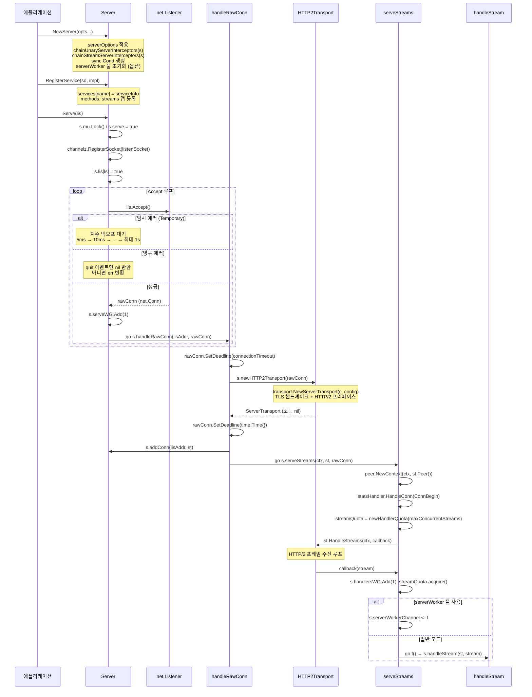
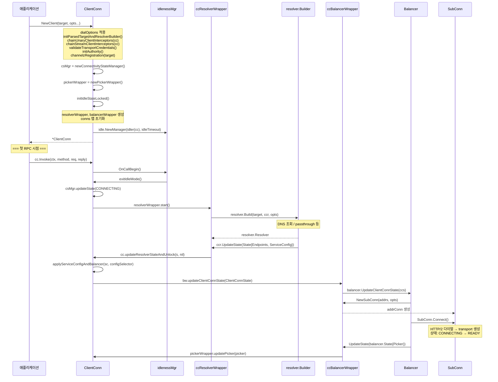
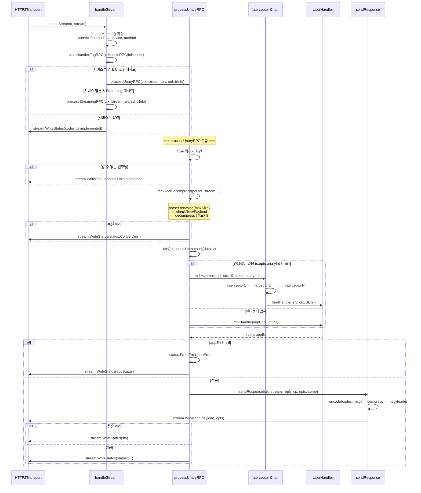
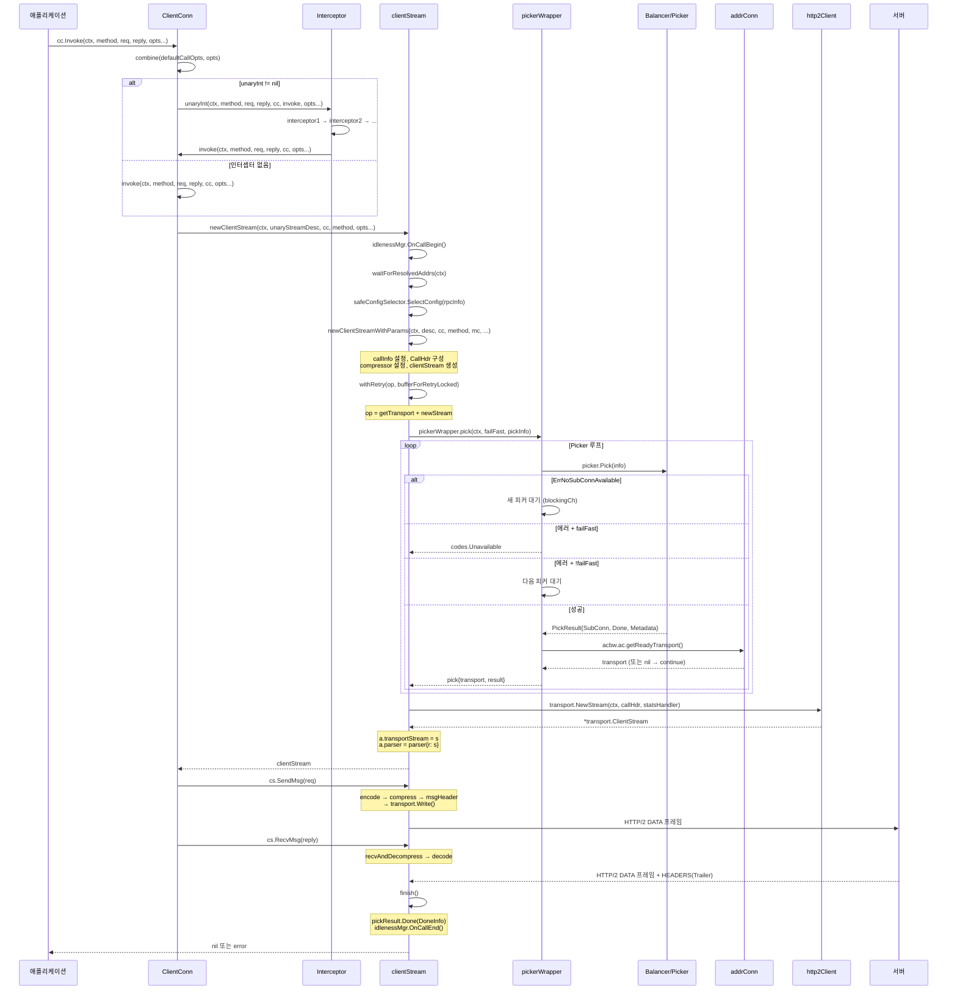
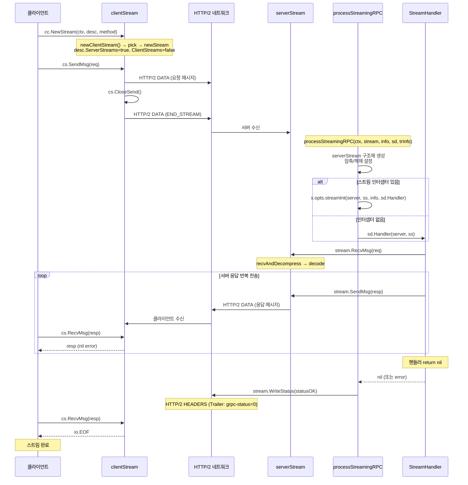
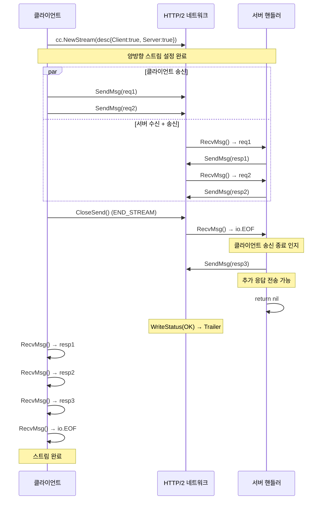
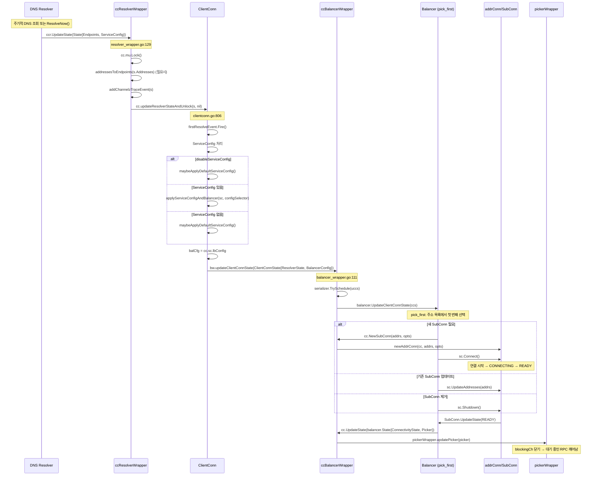
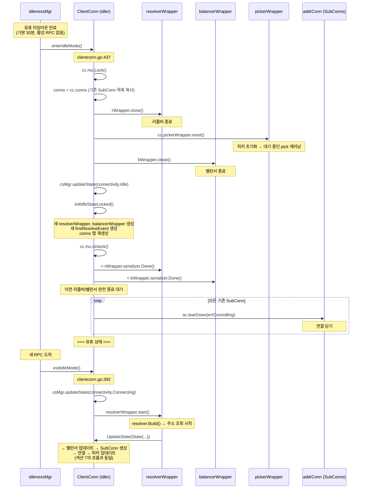
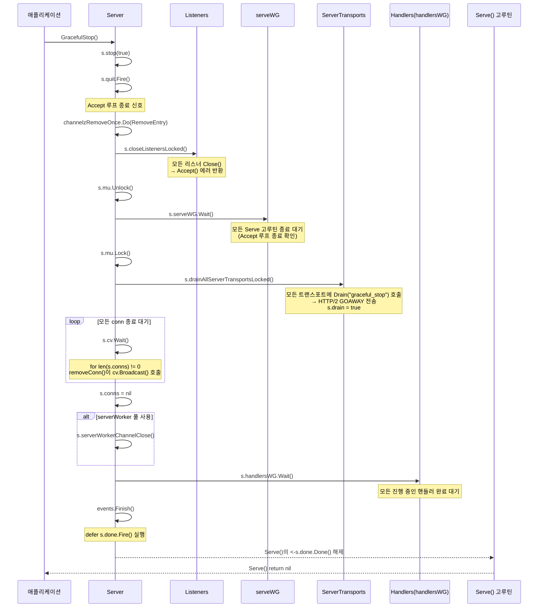

# 03. gRPC-Go 시퀀스 다이어그램

이 문서는 gRPC-Go의 주요 흐름을 시퀀스 다이어그램으로 상세히 분석한다. 각 흐름에서 호출되는 실제 함수명과 파일 경로를 인용하며, 에러 처리 경로와 설계 의도("왜 이런 순서인가")를 함께 설명한다.

---

## 목차

1. [서버 초기화 흐름](#1-서버-초기화-흐름)
2. [클라이언트 초기화 흐름](#2-클라이언트-초기화-흐름)
3. [Unary RPC 서버 처리 흐름](#3-unary-rpc-서버-처리-흐름)
4. [Unary RPC 클라이언트 호출 흐름](#4-unary-rpc-클라이언트-호출-흐름)
5. [Server Streaming RPC 흐름](#5-server-streaming-rpc-흐름)
6. [양방향 스트리밍 RPC 흐름](#6-양방향-스트리밍-rpc-흐름)
7. [Resolver-Balancer 업데이트 흐름](#7-resolver-balancer-업데이트-흐름)
8. [커넥션 유휴 관리 흐름](#8-커넥션-유휴-관리-흐름)
9. [Graceful Shutdown 흐름](#9-graceful-shutdown-흐름)

---

## 1. 서버 초기화 흐름

### 개요

gRPC 서버는 `NewServer()` 로 생성되고, `Serve(lis)` 로 클라이언트 연결을 수락하기 시작한다. 각 연결은 별도 고루틴에서 HTTP/2 트랜스포트로 변환되며, 스트림 단위로 RPC를 처리한다.

### 왜 이런 순서인가

1. **옵션 적용 후 인터셉터 체인 구성**: 인터셉터는 옵션으로 등록되므로 모든 옵션을 먼저 적용한 뒤 체인을 구성해야 한다.
2. **Accept 루프와 커넥션 처리 분리**: Accept 루프가 블로킹되지 않도록 각 연결을 별도 고루틴으로 넘긴다. 이렇게 해야 동시 연결을 처리할 수 있다.
3. **TLS 핸드셰이크 타임아웃**: `handleRawConn()`에서 `connectionTimeout`을 설정해 악의적인 연결이 서버를 무한 대기시키는 것을 방지한다.
4. **스트림 쿼터**: `maxConcurrentStreams`로 동시 스트림 수를 제한하여 리소스를 보호한다.

### Mermaid 시퀀스 다이어그램



### ASCII 흐름도

```
NewServer(opts...)
  |
  ├── serverOptions 적용 (globalServerOptions + 사용자 opts)
  ├── chainUnaryServerInterceptors(s)   ← server.go:705
  ├── chainStreamServerInterceptors(s)  ← server.go:706
  ├── s.cv = sync.NewCond(&s.mu)        ← server.go:707
  └── initServerWorkers() (옵션)        ← server.go:714

Serve(lis)                               ← server.go:871
  |
  ├── s.serve = true
  ├── channelz.RegisterSocket(listenSocket)
  └── for { Accept() }                  ← server.go:916-960
       |
       ├── 임시 에러 → 지수 백오프 (5ms ~ 1s)
       ├── 영구 에러 / quit → return
       └── 성공 → go handleRawConn(lisAddr, rawConn)
                    |
                    ├── SetDeadline(connectionTimeout)     ← server.go:970
                    ├── newHTTP2Transport(rawConn)          ← server.go:973
                    │    └── transport.NewServerTransport() ← server.go:1016
                    ├── SetDeadline(time.Time{})            ← server.go:974
                    ├── addConn(lisAddr, st)                ← server.go:985
                    └── go serveStreams(ctx, st, rawConn)   ← server.go:989
                         |
                         ├── peer.NewContext()              ← server.go:1038
                         ├── statsHandler.HandleConn(ConnBegin)
                         └── st.HandleStreams(ctx, callback)← server.go:1055
                              |
                              └── callback(stream):
                                   ├── handlersWG.Add(1)
                                   ├── streamQuota.acquire()
                                   └── handleStream(st, stream)
```

### 핵심 코드 경로

| 단계 | 함수 | 파일 위치 |
|------|------|----------|
| 서버 생성 | `NewServer(opt ...ServerOption)` | `server.go:687` |
| 인터셉터 체인 | `chainUnaryServerInterceptors(s)` | `server.go:1208` |
| 서비스 등록 | `RegisterService(sd, impl)` | `server.go` |
| 리슨 시작 | `Serve(lis net.Listener)` | `server.go:871` |
| 연결 수락 | `lis.Accept()` | `server.go:917` |
| 연결 처리 | `handleRawConn(lisAddr, rawConn)` | `server.go:965` |
| 트랜스포트 생성 | `newHTTP2Transport(c net.Conn)` | `server.go:996` |
| 스트림 서빙 | `serveStreams(ctx, st, rawConn)` | `server.go:1036` |
| 스트림 디스패치 | `handleStream(t, stream)` | `server.go:1765` |

### 에러 처리 경로

- **Accept 임시 에러**: 지수 백오프로 재시도 (5ms 시작, 최대 1s). `s.quit` 이벤트 발생 시 중단 (`server.go:920-938`).
- **newHTTP2Transport 실패**: `st == nil` 이면 `handleRawConn` 즉시 반환. `credentials.ErrConnDispatched`가 아닌 경우 연결 닫음 (`server.go:1017-1027`).
- **addConn 실패**: 서버가 이미 종료 중이면 트랜스포트 닫고 반환 (`server.go:985-987`).

---

## 2. 클라이언트 초기화 흐름

### 개요

`NewClient(target, opts...)`는 `ClientConn`을 생성하되 실제 연결은 시작하지 않는다. **첫 RPC가 발생할 때** `exitIdleMode()`를 통해 리졸버와 밸런서가 시작된다 (lazy initialization). 이를 통해 불필요한 연결을 방지하고 리소스를 절약한다.

### 왜 이런 순서인가

1. **Lazy Initialization**: 클라이언트 생성 시점에 연결하지 않는다. 서비스가 시작된 후 한참 뒤에 첫 RPC가 올 수 있으므로 불필요한 연결을 방지한다.
2. **리졸버 빌더 결정 우선**: 타겟 URI의 스킴(dns, unix, passthrough 등)에 따라 리졸버 빌더를 먼저 결정해야 이후 옵션 검증이 가능하다.
3. **인터셉터 체인 → 크레덴셜 검증 → authority 설정**: 이 순서는 의존성 그래프를 따른다. 인터셉터는 옵션에만 의존하고, 크레덴셜 검증은 인터셉터 설정 이후, authority는 크레덴셜/타겟에 의존한다.
4. **idlenessMgr 마지막 생성**: 유휴 관리자는 모든 다른 컴포넌트가 준비된 후에 생성되어야 한다.

### Mermaid 시퀀스 다이어그램



### ASCII 흐름도

```
NewClient(target, opts...)                    ← clientconn.go:183
  |
  ├── dialOptions 적용 (global + per-target + user)
  ├── initParsedTargetAndResolverBuilder()    ← clientconn.go:214
  │    └── 타겟 URI 파싱 → resolverBuilder 결정
  ├── chainUnaryClientInterceptors(cc)        ← clientconn.go:222
  ├── chainStreamClientInterceptors(cc)       ← clientconn.go:223
  ├── validateTransportCredentials()          ← clientconn.go:225
  ├── initAuthority()                         ← clientconn.go:238
  ├── channelzRegistration(target)            ← clientconn.go:244
  ├── csMgr = newConnectivityStateManager()   ← clientconn.go:248
  ├── pickerWrapper = newPickerWrapper()      ← clientconn.go:249
  ├── initIdleStateLocked()                   ← clientconn.go:254
  │    ├── resolverWrapper = newCCResolverWrapper(cc)
  │    ├── balancerWrapper = newCCBalancerWrapper(cc)
  │    └── firstResolveEvent = grpcsync.NewEvent()
  └── idlenessMgr = idle.NewManager(...)      ← clientconn.go:255

--- 첫 RPC 시 ---

exitIdleMode()                                ← clientconn.go:392
  |
  ├── csMgr.updateState(connectivity.Connecting)  ← clientconn.go:402
  ├── resolverWrapper.start()                      ← clientconn.go:407
  │    └── resolver.Build(target, ccr, opts)       ← resolver_wrapper.go:90
  │         └── DNS 조회 → UpdateState(State{...})
  │              └── cc.updateResolverStateAndUnlock()  ← clientconn.go:806
  │                   ├── applyServiceConfigAndBalancer()
  │                   └── bw.updateClientConnState()    ← clientconn.go:864
  │                        └── balancer.UpdateClientConnState()
  │                             ├── NewSubConn() → addrConn
  │                             ├── SubConn.Connect()
  │                             └── UpdateState(State{Picker})
  └── addTraceEvent("exiting idle mode")
```

### 핵심 코드 경로

| 단계 | 함수 | 파일 위치 |
|------|------|----------|
| 클라이언트 생성 | `NewClient(target, opts...)` | `clientconn.go:183` |
| 타겟/리졸버 결정 | `initParsedTargetAndResolverBuilder()` | `clientconn.go:214` |
| 인터셉터 체인 | `chainUnaryClientInterceptors(cc)` | `clientconn.go:518` |
| 크레덴셜 검증 | `validateTransportCredentials()` | `clientconn.go:225` |
| 유휴 상태 초기화 | `initIdleStateLocked()` | `clientconn.go:424` |
| 유휴 모드 해제 | `exitIdleMode()` | `clientconn.go:392` |
| 리졸버 시작 | `ccResolverWrapper.start()` | `resolver_wrapper.go:68` |
| 상태 업데이트 | `updateResolverStateAndUnlock()` | `clientconn.go:806` |
| 밸런서 업데이트 | `ccBalancerWrapper.updateClientConnState()` | `balancer_wrapper.go:111` |

### 에러 처리 경로

- **리졸버 빌더 실패**: `initParsedTargetAndResolverBuilder()` 에러 시 `NewClient`가 즉시 실패 반환 (`clientconn.go:214-216`).
- **크레덴셜 검증 실패**: `errNoTransportSecurity`, `errTransportCredsAndBundle` 등의 에러 반환 (`clientconn.go:225-227`).
- **리졸버 시작 실패**: `exitIdleMode()`에서 상태를 `TransientFailure`로 전환하고 에러 피커를 설정 (`clientconn.go:412-416`).

---

## 3. Unary RPC 서버 처리 흐름

### 개요

서버가 스트림을 수신하면 `handleStream()`에서 서비스/메서드를 찾아 `processUnaryRPC()` 또는 `processStreamingRPC()`로 디스패치한다. Unary RPC의 경우 메시지 수신 → 역직렬화 → 핸들러 호출 → 응답 전송 → 상태 전송의 순서로 처리된다.

### 왜 이런 순서인가

1. **서비스/메서드 파싱 먼저**: HTTP/2 스트림의 `:path` 헤더에서 `/service/method` 형식을 파싱한다. 서비스를 모르면 요청을 처리할 수 없으므로 가장 먼저 수행한다.
2. **압축 해제 확인 → 수신 → 역직렬화 순서**: 압축 방식을 모르면 메시지를 해석할 수 없다. 따라서 압축 해제기를 먼저 확인한 후 데이터를 수신하고, 마지막에 역직렬화한다.
3. **핸들러를 인터셉터 체인으로 감쌈**: `md.Handler()`는 인터셉터 체인의 가장 안쪽에서 호출된다. `s.opts.unaryInt`이 nil이 아니면 체인을 통과한 후 실제 핸들러가 호출된다 (`server.go:1426`).
4. **응답 후 상태 전송**: gRPC 프로토콜에서 응답 데이터와 상태(Trailer)는 별도 프레임이다. 응답 먼저 보내고 마지막에 OK 상태를 보낸다.

### Mermaid 시퀀스 다이어그램



### ASCII 흐름도

```
handleStream(t, stream)                         ← server.go:1765
  |
  ├── sm = stream.Method()                      ← server.go:1784
  │    └── "/service/method" → service, method  ← server.go:1807-1808
  ├── statsHandler.TagRPC() / HandleRPC(InHeader)
  │
  ├── [서비스 발견] srv, knownService := s.services[service]
  │    ├── [Unary] md, ok := srv.methods[method]
  │    │    └── processUnaryRPC(ctx, stream, srv, md, trInfo) ← server.go:1830
  │    ├── [Stream] sd, ok := srv.streams[method]
  │    │    └── processStreamingRPC(ctx, stream, srv, sd, trInfo) ← server.go:1834
  │    └── [Unknown Method] → codes.Unimplemented
  └── [서비스 미발견] → codes.Unimplemented

processUnaryRPC(ctx, stream, info, md, trInfo)  ← server.go:1243
  |
  ├── channelz 통계, stats Begin 기록
  ├── binarylog 설정
  ├── 압축/해제 설정                             ← server.go:1337-1374
  │    └── 미지원 인코딩 → codes.Unimplemented
  │
  ├── recvAndDecompress(parser, stream, ...)     ← rpc_util.go:930
  │    ├── parser.recvMsg(maxReceiveMessageSize)
  │    ├── checkRecvPayload(pf, recvCompress, ...)
  │    └── decompress() (필요시)
  │
  ├── df := func(v) { codec.Unmarshal(data, v) }
  │
  ├── md.Handler(info.serviceImpl, ctx, df, s.opts.unaryInt) ← server.go:1426
  │    └── 인터셉터 체인 → 사용자 핸들러
  │
  ├── [에러] → stream.WriteStatus(appStatus)     ← server.go:1439
  └── [성공] → sendResponse() → stream.WriteStatus(statusOK)
               |                                  ← server.go:1473, 1534
               ├── encode(codec, msg)             ← server.go:1172
               ├── compress(data, cp, comp, pool) ← server.go:1178
               ├── msgHeader(data, compData, pf)  ← server.go:1185
               └── stream.Write(hdr, payload, opts) ← server.go:1200
```

### 핵심 코드 경로

| 단계 | 함수 | 파일 위치 |
|------|------|----------|
| 스트림 디스패치 | `handleStream(t, stream)` | `server.go:1765` |
| 메서드 파싱 | `stream.Method()` + 문자열 분리 | `server.go:1784-1808` |
| Unary 처리 | `processUnaryRPC(ctx, stream, info, md, trInfo)` | `server.go:1243` |
| 메시지 수신/해제 | `recvAndDecompress(...)` | `rpc_util.go:930` |
| 역직렬화 | `codec.Unmarshal(data, v)` | `server.go:1399` |
| 핸들러 호출 | `md.Handler(impl, ctx, df, unaryInt)` | `server.go:1426` |
| 응답 전송 | `sendResponse(ctx, stream, reply, cp, opts, comp)` | `server.go:1171` |
| 인코딩 | `encode(codec, msg)` | `server.go:1172` |
| 상태 전송 | `stream.WriteStatus(statusOK)` | `server.go:1534` |

### 에러 처리 경로

- **메서드 이름 형식 오류**: `"/"` 없으면 `codes.Unimplemented` 반환 (`server.go:1789-1805`).
- **서비스/메서드 미등록**: `codes.Unimplemented` + 에러 메시지 (`server.go:1839-1854`).
- **지원하지 않는 압축**: `codes.Unimplemented` 반환 (`server.go:1349-1352`).
- **수신 에러**: `recvAndDecompress` 실패 시 `status.Convert(err)`로 상태 전송 (`server.go:1384-1388`).
- **핸들러 에러**: 비-status 에러를 `status.FromContextError`로 변환 후 전송 (`server.go:1427-1461`).
- **전송 에러**: `transport.ConnectionError`이면 무시, 그 외 panic (`server.go:1478-1488`).
- **메시지 크기 초과**: `codes.ResourceExhausted` 반환 (`server.go:1197-1198`).

---

## 4. Unary RPC 클라이언트 호출 흐름

### 개요

`cc.Invoke()`는 인터셉터 체인을 거쳐 `invoke()`를 호출한다. `invoke()`는 `newClientStream()`으로 스트림을 생성하고, `SendMsg(req)` → `RecvMsg(reply)` 순서로 요청/응답을 처리한다. 스트림 생성 과정에서 피커를 통해 SubConn을 선택하고, 해당 트랜스포트에 HTTP/2 스트림을 연다.

### 왜 이런 순서인가

1. **인터셉터 먼저**: 클라이언트 인터셉터는 요청 전/후에 로직(인증 토큰 추가, 로깅, 메트릭 등)을 삽입한다. 따라서 실제 전송 전에 인터셉터 체인을 먼저 통과해야 한다.
2. **idlenessMgr.OnCallBegin()**: RPC 시작을 추적하여 채널이 유휴 상태로 전환되지 않도록 한다.
3. **waitForResolvedAddrs**: 첫 RPC가 리졸버의 첫 번째 결과를 기다린다. 이것이 없으면 아직 주소가 없는 상태에서 Pick이 실패한다.
4. **Pick → Transport → NewStream**: 밸런서가 SubConn을 선택한 후에야 트랜스포트를 가져올 수 있고, 트랜스포트 위에 스트림을 열 수 있다. 이 순서는 논리적 의존성을 따른다.
5. **withRetry 감쌈**: 투명 재시도(transparent retry)가 가능한 경우 Pick + NewStream 과정을 재시도한다.

### Mermaid 시퀀스 다이어그램



### ASCII 흐름도

```
cc.Invoke(ctx, method, req, reply, opts...)      ← call.go:29
  |
  ├── combine(dopts.callOptions, opts)            ← call.go:32
  ├── [인터셉터 있으면] dopts.unaryInt(ctx, method, req, reply, cc, invoke, opts...)
  └── invoke(ctx, method, req, reply, cc, opts...) ← call.go:65
       |
       ├── newClientStream(ctx, unaryStreamDesc, cc, method, opts...)  ← call.go:66
       │    |                                           ← stream.go:203
       │    ├── idlenessMgr.OnCallBegin()                ← stream.go:217
       │    ├── waitForResolvedAddrs(ctx)                 ← stream.go:239
       │    ├── safeConfigSelector.SelectConfig(rpcInfo)  ← stream.go:251
       │    └── newClientStreamWithParams(...)             ← stream.go:285
       │         |
       │         ├── callInfo 설정, context 타임아웃       ← stream.go:286-301
       │         ├── CallHdr 구성 (Host, Method, ...)      ← stream.go:319
       │         ├── clientStream 구조체 생성               ← stream.go:353
       │         └── withRetry(op, bufferForRetryLocked)   ← stream.go:396
       │              |
       │              └── op(attempt):
       │                   ├── getTransport()              ← stream.go:499
       │                   │    └── pickerWrapper.pick()   ← picker_wrapper.go:105
       │                   │         └── picker.Pick(info)
       │                   │              → PickResult{SubConn}
       │                   │         └── acbw.ac.getReadyTransport()
       │                   └── newStream()                 ← stream.go:521
       │                        └── transport.NewStream(ctx, callHdr, sh)
       │                             → transportStream
       │
       ├── cs.SendMsg(req)                          ← call.go:70
       │    └── encode → compress → transport.Write
       └── cs.RecvMsg(reply)                        ← call.go:73
            └── recvAndDecompress → codec.Unmarshal
```

### 핵심 코드 경로

| 단계 | 함수 | 파일 위치 |
|------|------|----------|
| RPC 호출 | `ClientConn.Invoke(ctx, method, args, reply, opts...)` | `call.go:29` |
| 내부 호출 | `invoke(ctx, method, req, reply, cc, opts...)` | `call.go:65` |
| 스트림 생성 | `newClientStream(ctx, desc, cc, method, opts...)` | `stream.go:203` |
| 스트림 파라미터 설정 | `newClientStreamWithParams(...)` | `stream.go:285` |
| 트랜스포트 획득 | `csAttempt.getTransport()` | `stream.go:499` |
| SubConn 선택 | `pickerWrapper.pick(ctx, failFast, pickInfo)` | `picker_wrapper.go:105` |
| HTTP/2 스트림 생성 | `csAttempt.newStream()` | `stream.go:521` |
| 메시지 전송 | `clientStream.SendMsg(req)` | `stream.go` |
| 메시지 수신 | `clientStream.RecvMsg(reply)` | `stream.go` |

### 에러 처리 경로

- **메타데이터 검증 실패**: `codes.Internal` 반환 (`stream.go:225-235`).
- **주소 대기 타임아웃**: `waitForResolvedAddrs`에서 컨텍스트 만료 시 에러 반환 (`stream.go:239-241`).
- **피커 에러 + failFast**: `codes.Unavailable` 즉시 반환 (`picker_wrapper.go:176`).
- **피커 에러 + WaitForReady**: 새 피커를 기다리며 재시도 (`picker_wrapper.go:172-174`).
- **컨텍스트 만료**: `codes.DeadlineExceeded` 또는 `codes.Canceled` (`picker_wrapper.go:131-136`).
- **NewStream 실패 + 투명 재시도 가능**: `allowTransparentRetry = true`, `withRetry`가 재시도 (`stream.go:559-561`).
- **Drop 에러**: 밸런서가 의도적으로 RPC를 드롭, 재시도 불가 (`stream.go:506-509`).

---

## 5. Server Streaming RPC 흐름

### 개요

Server Streaming RPC에서 클라이언트는 하나의 요청을 보내고, 서버는 여러 응답을 스트림으로 보낸다. 클라이언트는 `RecvMsg()`를 반복 호출하여 응답을 수신하며, `io.EOF`를 받으면 스트림이 종료된 것이다.

### 왜 이런 순서인가

1. **클라이언트가 먼저 요청 전송**: gRPC 프로토콜에서 클라이언트가 요청을 보내야 서버가 처리를 시작할 수 있다.
2. **서버가 StreamHandler를 통해 반복 전송**: `processStreamingRPC()`는 `sd.Handler(server, ss)`를 호출하고, 이 핸들러 안에서 사용자 코드가 `stream.Send()`를 반복 호출한다.
3. **클라이언트의 RecvMsg 루프**: 서버가 언제 스트림을 닫을지 모르므로 클라이언트는 `io.EOF`가 올 때까지 반복 수신해야 한다.
4. **상태는 마지막에 전송**: 서버 핸들러가 반환한 후 `processStreamingRPC()`가 `WriteStatus()`를 호출한다. 모든 데이터 전송이 완료된 후에만 상태를 보낸다.

### Mermaid 시퀀스 다이어그램



### ASCII 흐름도

```
=== 클라이언트 측 ===

cc.NewStream(ctx, desc, method)                  ← stream.go:166
  |
  └── newClientStream(ctx, desc, cc, method, opts...)
       └── desc = StreamDesc{ServerStreams: true, ClientStreams: false}

cs.SendMsg(req)                 → HTTP/2 DATA (요청)
cs.CloseSend()                  → END_STREAM 플래그

cs.RecvMsg(resp) 반복 호출:
  ├── 데이터 수신 → decode → resp 반환
  ├── ...
  └── io.EOF 수신 → 스트림 완료


=== 서버 측 ===

processStreamingRPC(ctx, stream, info, sd, trInfo)  ← server.go:1573
  |
  ├── serverStream 구조체 생성                       ← server.go:1588
  ├── 압축/해제 설정                                 ← server.go:1667-1699
  │
  ├── [인터셉터 있으면]
  │    s.opts.streamInt(server, ss, info, sd.Handler) ← server.go:1719
  ├── [인터셉터 없으면]
  │    sd.Handler(server, ss)                         ← server.go:1712
  │    |
  │    ├── stream.RecvMsg(req)   ← 사용자 핸들러 내부
  │    ├── stream.SendMsg(resp1) ← 반복
  │    ├── stream.SendMsg(resp2)
  │    └── return nil
  │
  └── ss.s.WriteStatus(statusOK)                     ← server.go:1762
```

### 에러 처리 경로

- **서버 핸들러 에러 반환**: `status.FromError(appErr)` 변환 후 `WriteStatus(appStatus)` 전송 (`server.go:1721-1746`).
- **클라이언트 컨텍스트 취소**: 서버 측 `stream.Context().Done()` 채널이 닫히고, 다음 `SendMsg()`가 에러 반환.
- **전송 에러**: `SendMsg` 중 네트워크 에러 발생 시 `transport.ConnectionError` 반환.

---

## 6. 양방향 스트리밍 RPC 흐름

### 개요

양방향(Bidirectional) 스트리밍에서는 클라이언트와 서버가 각각 독립적으로 메시지를 주고받을 수 있다. 양쪽의 송신과 수신이 완전히 비동기적이며, 한쪽이 `CloseSend()`를 호출해도 다른 쪽의 수신은 계속된다.

### 왜 이런 순서인가

1. **독립적 송수신**: HTTP/2의 전이중(Full-Duplex) 특성을 활용한다. 클라이언트 송신 스트림과 수신 스트림이 독립적이므로 순서에 구애받지 않는다.
2. **CloseSend는 한쪽 방향만 닫음**: `CloseSend()`는 END_STREAM을 보내 "나는 더 보낼 것이 없다"를 알리지만, 상대방이 보내는 것을 계속 수신한다.
3. **서버 핸들러 반환 = 서버 쪽 종료**: 서버 핸들러가 `return`하면 `processStreamingRPC()`가 `WriteStatus()`를 보내 스트림을 종료한다.

### Mermaid 시퀀스 다이어그램



### ASCII 흐름도

```
=== 양방향 스트리밍 타임라인 ===

시간 →

클라이언트:  SendMsg(r1) ─── SendMsg(r2) ─── CloseSend() ─────── RecvMsg()=resp1 ─── RecvMsg()=resp3 ─── RecvMsg()=EOF
                 │                │                │                      ↑                    ↑                  ↑
                 ▼                ▼                ▼                      │                    │                  │
   HTTP/2:  DATA(r1) ──── DATA(r2) ──── DATA(END_STREAM)     DATA(resp1) ── DATA(resp3) ── HEADERS(Trailer)
                 │                │                │                ↑                ↑                ↑
                 ▼                ▼                ▼                │                │                │
서버:       RecvMsg()=r1 ── RecvMsg()=r2 ── RecvMsg()=EOF ── SendMsg(resp1) ─ SendMsg(resp3) ── return nil
                                                                                                     │
                                                                                                     ▼
                                                                                          WriteStatus(OK)

핵심 특성:
- SendMsg/RecvMsg는 양쪽에서 독립적으로 호출 가능
- CloseSend()는 클라이언트 → 서버 방향만 닫음 (END_STREAM 플래그)
- 서버 핸들러 return 시점에 WriteStatus()로 서버 → 클라이언트 방향 종료
- 클라이언트는 RecvMsg()가 io.EOF를 반환할 때까지 수신 계속
```

### 핵심 코드 경로

| 단계 | 함수 | 파일 위치 |
|------|------|----------|
| 클라이언트 스트림 생성 | `cc.NewStream(ctx, desc, method)` | `stream.go:166` |
| 인터셉터 디스패치 | `streamInt(ctx, desc, cc, method, newClientStream, opts...)` | `stream.go:172` |
| 서버 스트림 처리 | `processStreamingRPC(ctx, stream, info, sd, trInfo)` | `server.go:1573` |
| 핸들러 호출 | `sd.Handler(server, ss)` | `server.go:1712` |
| 인터셉터 호출 | `streamInt(server, ss, info, sd.Handler)` | `server.go:1719` |
| 상태 전송 | `ss.s.WriteStatus(statusOK)` | `server.go:1762` |

### StreamDesc 설정 비교

| RPC 유형 | `StreamDesc.ClientStreams` | `StreamDesc.ServerStreams` |
|----------|--------------------------|--------------------------|
| Unary | `false` | `false` |
| Server Streaming | `false` | `true` |
| Client Streaming | `true` | `false` |
| Bidirectional | `true` | `true` |

---

## 7. Resolver-Balancer 업데이트 흐름

### 개요

리졸버는 DNS 등으로 주소를 조회하고, 결과를 `UpdateState()`로 `ccResolverWrapper`에 전달한다. 이 래퍼가 `ClientConn`을 거쳐 밸런서에게 전달하면, 밸런서는 SubConn을 생성/제거하고 새 피커를 등록한다.

### 왜 이런 순서인가

1. **리졸버 → ClientConn → 밸런서**: 리졸버는 주소를 알지만 연결을 관리하지 않는다. 밸런서는 연결을 관리하지만 주소를 모른다. `ClientConn`이 둘을 연결하는 중재자 역할을 한다.
2. **ServiceConfig 우선 적용**: 리졸버 결과에 ServiceConfig가 포함되면 이를 먼저 적용해야 밸런서 설정이 결정된다 (어떤 LB 정책을 사용할지 등).
3. **Serializer 사용**: `ccResolverWrapper`는 `grpcsync.CallbackSerializer`를 사용하여 리졸버의 콜백을 직렬화한다. 이는 리졸버가 여러 고루틴에서 호출할 수 있기 때문이다.
4. **피커 비동기 업데이트**: 밸런서가 새 피커를 등록하면 `pickerWrapper`의 `blockingCh`가 닫혀서 대기 중인 RPC가 깨어난다.

### Mermaid 시퀀스 다이어그램



### ASCII 흐름도

```
Resolver (DNS 등)
  │
  │ UpdateState(State{Endpoints, ServiceConfig})
  ▼
ccResolverWrapper                           ← resolver_wrapper.go:129
  │
  │ cc.updateResolverStateAndUnlock(s, nil)
  ▼
ClientConn                                  ← clientconn.go:806
  │
  ├── firstResolveEvent.Fire()               ← 첫 RPC 대기 해제
  ├── ServiceConfig 파싱/적용
  │    ├── [비활성화] maybeApplyDefaultServiceConfig()
  │    ├── [유효] applyServiceConfigAndBalancer(sc, configSelector)
  │    └── [파싱 에러] applyFailingLBLocked(sc)
  │
  │ bw.updateClientConnState(ClientConnState)
  ▼
ccBalancerWrapper                            ← balancer_wrapper.go:111
  │
  │ balancer.UpdateClientConnState(ccs)
  ▼
Balancer (예: pick_first)
  │
  ├── NewSubConn(addrs, opts) → addrConn
  ├── SubConn.Connect() → 연결 시작
  │    └── IDLE → CONNECTING → READY
  │
  │ cc.UpdateState(State{Picker})
  ▼
ccBalancerWrapper
  │
  │ pickerWrapper.updatePicker(picker)
  ▼
pickerWrapper                                ← picker_wrapper.go
  └── blockingCh 닫기 → 대기 중인 pick() 깨어남
```

### 핵심 코드 경로

| 단계 | 함수 | 파일 위치 |
|------|------|----------|
| 리졸버 상태 업데이트 | `ccResolverWrapper.UpdateState(s)` | `resolver_wrapper.go:129` |
| 리졸버 에러 보고 | `ccResolverWrapper.ReportError(err)` | `resolver_wrapper.go:148` |
| CC 상태 업데이트 | `updateResolverStateAndUnlock(s, err)` | `clientconn.go:806` |
| 서비스 설정 적용 | `applyServiceConfigAndBalancer(sc, cs)` | `clientconn.go` |
| 밸런서 상태 전달 | `ccBalancerWrapper.updateClientConnState(ccs)` | `balancer_wrapper.go:111` |
| 피커 업데이트 | `pickerWrapper.updatePicker(picker)` | `picker_wrapper.go` |

### 에러 처리 경로

- **리졸버 에러**: `ccr.ReportError(err)` → `balancerWrapper.resolverError(err)` → 에러 피커 설정 (`resolver_wrapper.go:148-158`).
- **ServiceConfig 파싱 에러**: `applyFailingLBLocked(sc)` → 항상 `codes.Unavailable` 반환하는 피커 설정 (`clientconn.go:848-855`).
- **밸런서 업데이트 에러**: `balancer.UpdateClientConnState()` 에러 → `ErrBadResolverState` 반환 (`balancer_wrapper.go:123-127`).

---

## 8. 커넥션 유휴 관리 흐름

### 개요

gRPC-Go는 `idle.Manager`를 통해 채널의 유휴 상태를 관리한다. 일정 시간 동안 RPC가 없으면 채널을 유휴 모드로 전환하여 리졸버, 밸런서, SubConn을 모두 종료한다. 새 RPC가 도착하면 다시 활성화된다.

### 왜 이런 순서인가

1. **OnCallBegin/OnCallEnd로 추적**: RPC 시작/종료 시점에 카운터를 조정하여 활성 RPC가 있는지 추적한다.
2. **유휴 진입 시 리졸버/밸런서 먼저 종료**: SubConn을 닫기 전에 리졸버/밸런서를 종료해야 이들이 새 SubConn을 생성하지 않는다.
3. **initIdleStateLocked()로 상태 재초기화**: 유휴 진입 시 새 래퍼를 생성하여 이전 상태를 깨끗이 정리한다. 이전 래퍼의 완료를 기다린 후(`<-serializer.Done()`) SubConn을 닫는다.
4. **유휴 해제 시 CONNECTING부터**: `exitIdleMode()`에서 `CONNECTING` 상태로 전환한 후 리졸버를 시작한다. IDLE 상태에서 바로 RPC를 보내면 실패하므로 상태 전환이 먼저다.

### Mermaid 시퀀스 다이어그램



### ASCII 흐름도

```
=== 유휴 진입 ===

idlenessMgr: 유휴 타임아웃 만료
  |
  └── enterIdleMode()                       ← clientconn.go:437
       |
       ├── cc.mu.Lock()
       ├── conns = cc.conns (복사)
       ├── rWrapper.close()                  ← 리졸버 종료
       ├── pickerWrapper.reset()             ← 피커 초기화
       ├── bWrapper.close()                  ← 밸런서 종료
       ├── csMgr.updateState(Idle)
       ├── initIdleStateLocked()             ← 새 래퍼 생성
       ├── cc.mu.Unlock()
       ├── <-rWrapper.serializer.Done()      ← 이전 리졸버 완료 대기
       ├── <-bWrapper.serializer.Done()      ← 이전 밸런서 완료 대기
       └── for ac := range conns {
               ac.tearDown(errConnIdling)    ← SubConn 닫기
           }

=== 유휴 해제 ===

새 RPC → idlenessMgr.OnCallBegin()
  |
  └── exitIdleMode()                        ← clientconn.go:392
       |
       ├── csMgr.updateState(Connecting)     ← clientconn.go:402
       ├── resolverWrapper.start()           ← clientconn.go:407
       │    └── resolver.Build() → UpdateState()
       │         └── (섹션 7 흐름)
       └── addTraceEvent("exiting idle mode")
```

### 핵심 코드 경로

| 단계 | 함수 | 파일 위치 |
|------|------|----------|
| 유휴 매니저 생성 | `idle.NewManager(idler, timeout)` | `internal/idle/idle.go` |
| RPC 추적 시작 | `idlenessMgr.OnCallBegin()` | `internal/idle/idle.go` |
| RPC 추적 종료 | `idlenessMgr.OnCallEnd()` | `internal/idle/idle.go` |
| 유휴 진입 | `cc.enterIdleMode()` | `clientconn.go:437` |
| 상태 재초기화 | `cc.initIdleStateLocked()` | `clientconn.go:424` |
| SubConn 종료 | `ac.tearDown(errConnIdling)` | `clientconn.go` |
| 유휴 해제 | `cc.exitIdleMode()` | `clientconn.go:392` |

### 에러 처리 경로

- **유휴 해제 중 리졸버 시작 실패**: `TransientFailure` 상태 + 에러 피커 설정 (`clientconn.go:412-416`).
- **이미 닫힌 ClientConn**: `cc.conns == nil` 체크로 조기 반환 (`clientconn.go:393-397`).
- **errConnIdling**: SubConn 종료 시 사용되는 특수 에러로, "idle mode" 전환을 나타냄 (`clientconn.go:77`).

---

## 9. Graceful Shutdown 흐름

### 개요

`GracefulStop()`은 서버를 안전하게 종료한다. 새 연결을 거부하고, 기존 연결에 GOAWAY를 보내 드레인(drain)하며, 진행 중인 모든 RPC가 완료될 때까지 기다린다. 이를 통해 클라이언트는 에러 없이 현재 RPC를 완료할 수 있다.

### 왜 이런 순서인가

1. **quit 이벤트 먼저 발생**: `s.quit.Fire()`로 Accept 루프와 handleRawConn이 새 연결을 거부하도록 한다. 이것이 가장 먼저여야 "새 연결 수락 → 즉시 종료"의 낭비를 방지한다.
2. **리스너 닫기 → serveWG.Wait()**: 리스너를 닫아야 Accept()가 에러를 반환하고 Serve() 고루틴이 종료된다. `serveWG.Wait()`는 모든 Serve 고루틴이 종료될 때까지 기다린다. 이후에야 새 연결이 더 이상 생성되지 않음을 보장할 수 있다.
3. **Drain → conn 종료 대기**: GOAWAY를 보내 클라이언트에게 "새 스트림을 열지 마라"고 알린다. 기존 스트림이 완료되면 클라이언트가 연결을 닫는다.
4. **handlersWG.Wait() 마지막**: 모든 핸들러 고루틴이 완료될 때까지 기다린다. 이것이 마지막이어야 진행 중인 RPC가 응답을 보낼 수 있다.
5. **done.Fire() defer로**: 모든 정리가 끝난 후 `done.Fire()`가 호출되어, `Serve()`가 최종 반환할 수 있다.

### Mermaid 시퀀스 다이어그램



### ASCII 흐름도

```
GracefulStop()                                   ← server.go:1922
  └── stop(true)                                 ← server.go:1926

stop(graceful=true)
  |
  ├── s.quit.Fire()                              ← server.go:1927
  │    └── Accept 루프에서 quit 감지 → return nil
  │
  ├── defer s.done.Fire()                        ← server.go:1928
  │
  ├── channelzRemoveOnce.Do(RemoveEntry)         ← server.go:1930
  │
  ├── s.mu.Lock()
  ├── s.closeListenersLocked()                   ← server.go:1932, 1992
  │    └── 모든 lis.Close()
  ├── s.mu.Unlock()
  │
  ├── s.serveWG.Wait()                           ← server.go:1936
  │    └── Serve() 고루틴 종료 대기
  │
  ├── s.mu.Lock()
  │
  ├── [graceful=true]
  │    s.drainAllServerTransportsLocked()         ← server.go:1942, 1980
  │    └── for _, conns := range s.conns {
  │            for st := range conns {
  │                st.Drain("graceful_stop")      ← HTTP/2 GOAWAY 전송
  │            }
  │        }
  │        s.drain = true
  │
  ├── for len(s.conns) != 0 {                    ← server.go:1947
  │       s.cv.Wait()  ← removeConn()이 cv.Broadcast()
  │   }
  │
  ├── s.conns = nil                              ← server.go:1950
  │
  ├── [serverWorker 풀]
  │    s.serverWorkerChannelClose()               ← server.go:1957
  │
  ├── [graceful=true]
  │    s.handlersWG.Wait()                        ← server.go:1961
  │    └── 모든 핸들러 완료 대기
  │
  └── events.Finish()                            ← server.go:1965
```

### Stop() vs GracefulStop() 비교

```
                    Stop()                    GracefulStop()
                  (graceful=false)            (graceful=true)
                  ─────────────────           ──────────────────
quit.Fire()       ✓                           ✓
closeListeners    ✓                           ✓
serveWG.Wait()    ✓                           ✓
Transport 처리    closeServerTransports       drainAllServerTransports
                  Locked()                    Locked()
                  → 즉시 Close()             → Drain(GOAWAY) 전송
conn 대기         ✓ cv.Wait()                ✓ cv.Wait()
handlersWG        waitForHandlers 옵션만      항상 Wait()
done.Fire()       ✓ (defer)                  ✓ (defer)
```

### 핵심 코드 경로

| 단계 | 함수 | 파일 위치 |
|------|------|----------|
| Graceful 종료 | `GracefulStop()` | `server.go:1922` |
| 즉시 종료 | `Stop()` | `server.go:1915` |
| 공통 로직 | `stop(graceful bool)` | `server.go:1926` |
| 리스너 닫기 | `closeListenersLocked()` | `server.go:1992` |
| 드레인 | `drainAllServerTransportsLocked()` | `server.go:1980` |
| 즉시 닫기 | `closeServerTransportsLocked()` | `server.go:1971` |
| 종료 이벤트 | `quit.Fire()`, `done.Fire()` | `server.go:1927-1928` |

### 에러 처리 경로

- **이미 종료 중인 서버**: `Serve()`가 `s.quit.HasFired()` 확인 후 `<-s.done.Done()`을 기다린 뒤 nil 반환 (`server.go:885-888`).
- **GracefulStop 중 새 연결**: `handleRawConn()`이 `s.quit.HasFired()` 체크하여 rawConn 즉시 닫음 (`server.go:966-968`).
- **Drain 후 새 스트림 요청**: HTTP/2 GOAWAY를 받은 클라이언트는 새 스트림을 열지 않는다. 클라이언트가 무시하면 서버 트랜스포트가 거부한다.
- **핸들러 hang**: `handlersWG.Wait()`가 무한 대기할 수 있다. 이를 방지하려면 핸들러에서 컨텍스트 취소를 적절히 처리해야 한다.

---

## 전체 흐름 요약도

아래는 gRPC-Go의 주요 흐름을 하나의 개괄적 다이어그램으로 정리한 것이다.

```
                        ┌──────────────────────────────────────────────────┐
                        │              클라이언트 애플리케이션               │
                        │                                                  │
                        │  NewClient() ─────── Invoke()/NewStream() ──────>│
                        └───────┬──────────────────────┬───────────────────┘
                                │                      │
                          ┌─────▼─────┐          ┌─────▼──────┐
                          │ ClientConn │          │ clientStream│
                          │           │          │            │
                          │ - resolver │<────────│ - picker   │
                          │ - balancer │         │ - transport │
                          │ - idleMgr  │         │ - codec    │
                          └──────┬─────┘         └─────┬──────┘
                                 │                      │
                     ┌───────────┼───────────┐          │
                     │           │           │          │
               ┌─────▼──┐ ┌─────▼──┐ ┌──────▼─┐       │
               │Resolver │ │Balancer│ │SubConn │       │
               │(DNS,etc)│ │(PF,RR) │ │(addrCon│       │
               └─────────┘ └────────┘ └───┬────┘       │
                                           │            │
                                    ┌──────▼────────────▼──────┐
                                    │     http2Client           │
                                    │  (transport.ClientTransport)│
                                    └──────────────┬───────────┘
                                                   │
                                            HTTP/2 │ 네트워크
                                                   │
                                    ┌──────────────▼───────────┐
                                    │     http2Server           │
                                    │ (transport.ServerTransport)│
                                    └──────────────┬───────────┘
                                                   │
                          ┌────────────────────────┼──────────────────┐
                          │                        │                  │
                    ┌─────▼──────┐          ┌──────▼─────┐    ┌──────▼──────┐
                    │serveStreams │          │handleStream │    │processUnary/│
                    │            │──────────│             │───>│StreamingRPC │
                    └────────────┘          └────────────┘    └──────┬──────┘
                                                                     │
                                                              ┌──────▼──────┐
                                                              │ 사용자 핸들러 │
                                                              │ (인터셉터    │
                                                              │  체인 통과)  │
                                                              └─────────────┘
```

### 주요 파일 참조 테이블

| 파일 | 주요 내용 |
|------|----------|
| `server.go` | Server 구조체, NewServer, Serve, handleRawConn, handleStream, processUnaryRPC, processStreamingRPC, GracefulStop, Stop |
| `clientconn.go` | ClientConn 구조체, NewClient, exitIdleMode, enterIdleMode, updateResolverStateAndUnlock |
| `call.go` | Invoke, invoke (Unary RPC 진입점) |
| `stream.go` | NewStream, newClientStream, newClientStreamWithParams, csAttempt.getTransport, csAttempt.newStream |
| `picker_wrapper.go` | pickerWrapper.pick (SubConn 선택 루프) |
| `resolver_wrapper.go` | ccResolverWrapper, start, UpdateState, ReportError |
| `balancer_wrapper.go` | ccBalancerWrapper, updateClientConnState |
| `rpc_util.go` | recvAndDecompress, encode, compress, msgHeader |

---

## 참고: 인터셉터 체인 구조

인터셉터는 서버/클라이언트 양쪽 모두에서 Unary/Stream 타입별로 체인을 구성한다. 체인 구성 방식은 재귀적 래핑이다.

```
=== 서버 Unary 인터셉터 체인 ===

chainUnaryServerInterceptors(s)              ← server.go:1208
  │
  └── interceptors = [unaryInt] + chainUnaryInts
       │
       └── chainedInt = func(ctx, req, info, handler):
            interceptor[0](ctx, req, info,
              func(ctx, req):
                interceptor[1](ctx, req, info,
                  func(ctx, req):
                    interceptor[2](ctx, req, info,
                      finalHandler)))

호출 순서:
  interceptor[0] → interceptor[1] → ... → interceptor[N-1] → finalHandler


=== 클라이언트 Unary 인터셉터 체인 ===

chainUnaryClientInterceptors(cc)             ← clientconn.go:518
  │
  └── interceptors = [unaryInt] + chainUnaryInts
       │
       └── chainedInt = func(ctx, method, req, reply, cc, invoker, opts):
            interceptor[0](ctx, method, req, reply, cc,
              func(ctx, method, req, reply, cc, opts):
                interceptor[1](ctx, method, req, reply, cc,
                  ...
                    finalInvoker, opts...), opts...)

호출 순서:
  interceptor[0] → interceptor[1] → ... → interceptor[N-1] → invoke()
```

### 인터셉터 호출 시점

| 위치 | Unary | Stream |
|------|-------|--------|
| 서버 | `md.Handler(impl, ctx, df, s.opts.unaryInt)` (`server.go:1426`) | `s.opts.streamInt(server, ss, info, sd.Handler)` (`server.go:1719`) |
| 클라이언트 | `cc.dopts.unaryInt(ctx, method, args, reply, cc, invoke, opts...)` (`call.go:35`) | `cc.dopts.streamInt(ctx, desc, cc, method, newClientStream, opts...)` (`stream.go:172`) |
