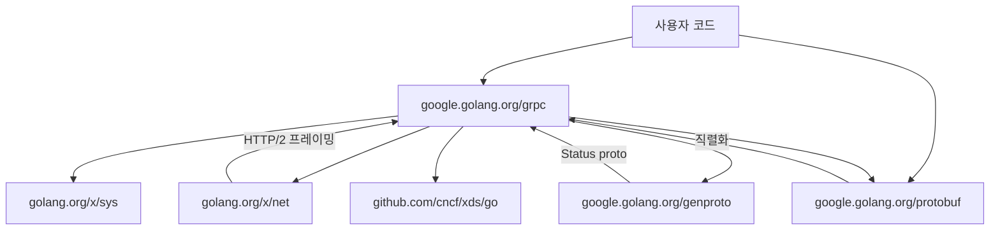

# 04. gRPC-Go 코드 구조

## 개요

gRPC-Go는 **멀티 모듈 모노레포** 구조를 채택한다. 루트 모듈 `google.golang.org/grpc`가 핵심 기능을 제공하고,
`xds/`, `gcp/`, `cmd/protoc-gen-go-grpc/` 등은 별도의 `go.mod`를 가진 독립 모듈이다.
이 설계는 핵심 gRPC 라이브러리의 의존성을 최소화하면서, 부가 기능은 별도 모듈로 분리하여
사용자가 필요한 것만 import할 수 있게 한다.

---

## 전체 디렉토리 구조

```
grpc-go/
├── server.go                  # Server 구현 (2200+ 줄)
├── clientconn.go              # ClientConn 구현 (1950+ 줄)
├── stream.go                  # ClientStream/ServerStream (1600+ 줄)
├── stream_interfaces.go       # Stream 인터페이스 정의
├── interceptor.go             # Interceptor 타입 정의
├── call.go                    # cc.Invoke() 진입점
├── rpc_util.go                # 직렬화/역직렬화 유틸리티
├── dialoptions.go             # DialOption 함수들
├── service_config.go          # ServiceConfig 파싱
├── codec.go                   # 레거시 Codec (deprecated)
├── backoff.go                 # 재연결 백오프 설정
├── picker_wrapper.go          # Picker 래퍼 (스레드 안전)
├── resolver_wrapper.go        # Resolver 래퍼
├── balancer_wrapper.go        # Balancer 래퍼
├── preloader.go               # 메시지 프리로딩
├── trace.go                   # 트레이스 이벤트
├── version.go                 # 버전 정보
├── doc.go                     # 패키지 문서
│
├── balancer/                  # 로드 밸런싱 서브시스템
│   ├── balancer.go            #   Balancer/Picker/SubConn 인터페이스
│   ├── base/                  #   baseBalancer 헬퍼
│   │   └── balancer.go        #     base.NewBalancerBuilder()
│   ├── pickfirst/             #   pick_first 밸런서
│   │   └── pickfirst.go       #     첫 번째 주소만 사용
│   ├── roundrobin/            #   round_robin 밸런서
│   │   └── roundrobin.go      #     순환 선택
│   ├── weightedroundrobin/    #   가중 라운드로빈
│   ├── leastrequest/          #   최소 요청 밸런서
│   ├── ringhash/              #   일관된 해싱
│   ├── weightedtarget/        #   가중 타겟
│   ├── endpointsharding/      #   엔드포인트 샤딩
│   ├── grpclb/                #   레거시 grpclb 프로토콜
│   ├── rls/                   #   Route Lookup Service
│   ├── lazy/                  #   지연 밸런서
│   └── randomsubsetting/      #   랜덤 서브셋팅
│
├── resolver/                  # 이름 해석 서브시스템
│   ├── resolver.go            #   Builder/Resolver/State 인터페이스
│   ├── dns/                   #   DNS 리졸버 (SRV/A/AAAA)
│   │   └── dns_resolver.go    #     기본 리졸버
│   └── manual/                #   테스트용 수동 리졸버
│       └── manual.go
│
├── credentials/               # 인증/보안 서브시스템
│   ├── credentials.go         #   TransportCredentials 인터페이스
│   ├── tls/                   #   TLS 구현
│   │   └── tls.go
│   ├── insecure/              #   비보안 (개발용)
│   │   └── insecure.go
│   ├── alts/                  #   Google ALTS
│   ├── google/                #   Google 기본 인증
│   ├── oauth/                 #   OAuth2 토큰
│   ├── jwt/                   #   JWT
│   ├── local/                 #   로컬 연결
│   ├── sts/                   #   STS 토큰 교환
│   └── xds/                   #   xDS 인증
│
├── encoding/                  # 직렬화/압축
│   ├── encoding.go            #   Codec/Compressor 인터페이스 + 레지스트리
│   ├── proto/                 #   Protocol Buffers 코덱
│   │   └── proto.go
│   ├── gzip/                  #   gzip 압축기
│   │   └── gzip.go
│   └── internal/              #   내부 유틸리티
│
├── codes/                     # gRPC 상태 코드
│   ├── codes.go               #   17개 코드 상수 (OK ~ Unauthenticated)
│   └── code_string.go         #   코드 → 문자열 변환
│
├── status/                    # gRPC 상태 타입
│   └── status.go              #   Status 생성/파싱/에러 변환
│
├── metadata/                  # 메타데이터 (HTTP/2 헤더)
│   └── metadata.go            #   MD 타입, 컨텍스트 통합
│
├── keepalive/                 # 커넥션 유지 관리
│   └── keepalive.go           #   Client/ServerParameters, EnforcementPolicy
│
├── connectivity/              # 연결 상태 정의
│   └── connectivity.go        #   State: Idle/Connecting/Ready/TransientFailure/Shutdown
│
├── stats/                     # 통계/메트릭 시스템
│   ├── stats.go               #   Handler 인터페이스, RPC/Conn 이벤트
│   └── handlers.go
│
├── tap/                       # Server-side Tap 인터페이스
│   └── tap.go                 #   ServerInHandle (연결 수락 전 처리)
│
├── peer/                      # 원격 피어 정보
│   └── peer.go                #   Peer struct (Addr, AuthInfo, LocalAddr)
│
├── attributes/                # 타입 안전 키-값 저장소
│   └── attributes.go          #   Attributes struct (immutable)
│
├── serviceconfig/             # 서비스 설정 인터페이스
│   └── serviceconfig.go       #   Config, ParseResult
│
├── internal/                  # 내부 패키지 (외부 import 불가)
│   ├── internal.go            #   내부 함수 레지스트리
│   ├── transport/             #   HTTP/2 트랜스포트 구현
│   │   ├── transport.go       #     ServerTransport/ClientTransport 인터페이스
│   │   ├── http2_server.go    #     http2Server 구현 (1500+ 줄)
│   │   ├── http2_client.go    #     http2Client 구현 (1850+ 줄)
│   │   ├── handler_server.go  #     Go http.Handler 어댑터
│   │   ├── controlbuf.go      #     제어 프레임 버퍼
│   │   ├── flowcontrol.go     #     흐름 제어
│   │   └── bdp_estimator.go   #     대역폭 추정
│   ├── channelz/              #   채널 관측성
│   │   ├── channel.go         #     Channel/SubChannel 메트릭
│   │   ├── server.go          #     Server 메트릭
│   │   ├── socket.go          #     Socket 통계
│   │   └── trace.go           #     이벤트 트레이스
│   ├── resolver/              #   내부 리졸버
│   │   ├── passthrough/       #     패스스루 (직접 주소)
│   │   ├── unix/              #     Unix 도메인 소켓
│   │   └── dns/               #     내부 DNS 유틸
│   ├── balancer/              #   내부 밸런서 유틸
│   ├── backoff/               #   지수 백오프 구현
│   ├── binarylog/             #   바이너리 로깅
│   ├── grpcsync/              #   Event, OnceFunc 동기화 도구
│   ├── grpcutil/              #   유틸리티 함수
│   ├── idle/                  #   유휴 상태 관리자
│   ├── stats/                 #   내부 메트릭 도구
│   └── metadata/              #   내부 메타데이터 유틸
│
├── channelz/                  # Channelz 공개 API
│   ├── service/               #   gRPC 서비스 구현
│   └── grpc_channelz_v1/      #   Protobuf 정의
│
├── health/                    # Health Check 프로토콜
│   ├── client.go              #   Health 클라이언트
│   ├── server.go              #   Health 서버
│   └── grpc_health_v1/        #   Protobuf 정의
│
├── reflection/                # 서버 리플렉션
│   └── serverreflection.go    #   서비스 검색 API
│
├── grpclog/                   # 로깅 시스템
│   ├── component.go           #   컴포넌트별 로거
│   └── grpclog.go             #   글로벌 로거
│
├── mem/                       # 메모리 관리
│   └── buffers.go             #   BufferPool 인터페이스
│
├── xds/                       # xDS 지원 (별도 모듈)
│   ├── go.mod                 #   독립 모듈
│   ├── bootstrap/             #   xDS 부트스트랩 설정
│   ├── csds/                  #   Client Status Discovery
│   ├── googledirectpath/      #   Google DirectPath
│   └── internal/              #   xDS 내부 구현
│
├── cmd/                       # CLI 도구
│   └── protoc-gen-go-grpc/    #   protoc 플러그인 (서비스 코드 생성)
│       └── main.go
│
├── examples/                  # 예제 코드
│   ├── helloworld/            #   기본 Unary RPC
│   ├── route_guide/           #   4가지 RPC 패턴
│   └── features/              #   기능별 예제
│
├── benchmark/                 # 벤치마크
│   ├── benchmain/             #   메인 벤치마크
│   ├── client/                #   벤치마크 클라이언트
│   └── server/                #   벤치마크 서버
│
├── interop/                   # 상호운용성 테스트
├── test/                      # 통합 테스트
├── testdata/                  # 테스트 데이터 (인증서 등)
├── profiling/                 # 프로파일링 도구
├── binarylog/                 # 바이너리 로그 공개 API
├── authz/                     # 인가 정책
│   └── audit/                 #   감사 로깅
├── security/                  # 보안 정책
├── admin/                     # 관리자 서비스 등록
├── experimental/              # 실험적 기능
│   ├── stats/                 #   메트릭 레지스트리
│   ├── opentelemetry/         #   OTel 통합
│   └── credentials/           #   실험적 인증
├── gcp/                       # GCP 통합 (별도 모듈)
│   └── observability/         #   GCP 관측성
│
├── scripts/                   # 빌드/린트 스크립트
│   ├── regenerate.sh          #   protobuf 코드 재생성
│   └── vet.sh                 #   정적 분석
│
├── Documentation/             # 기술 문서
├── go.mod                     # 루트 모듈 정의
├── go.sum                     # 의존성 체크섬
├── Makefile                   # 빌드 타겟
├── CONTRIBUTING.md            # 기여 가이드
└── README.md                  # 프로젝트 소개
```

---

## 모듈 구조

### 왜 멀티 모듈인가?

gRPC-Go의 루트 모듈(`google.golang.org/grpc`)은 **최소 의존성** 원칙을 따른다.
핵심 라이브러리는 Go 표준 라이브러리 + 소수의 필수 의존성만 사용하여,
gRPC를 import하는 모든 프로젝트의 의존성 트리를 가볍게 유지한다.

```
루트 모듈 (google.golang.org/grpc)
├── 의존: golang.org/x/net (HTTP/2)
├── 의존: golang.org/x/sys
├── 의존: google.golang.org/protobuf
├── 의존: google.golang.org/genproto/googleapis/rpc
└── 의존: github.com/cncf/xds/go (xDS protobuf 정의만)

별도 모듈 (google.golang.org/grpc/cmd/protoc-gen-go-grpc)
├── 추가 의존: google.golang.org/protobuf/compiler/protogen

별도 모듈 (google.golang.org/grpc/gcp/observability)
├── 추가 의존: cloud.google.com/go/*
├── 추가 의존: go.opentelemetry.io/otel/*

별도 모듈 (google.golang.org/grpc/stats/opentelemetry)
├── 추가 의존: go.opentelemetry.io/otel/*
```

| 모듈 | go.mod 위치 | 역할 |
|------|------------|------|
| `google.golang.org/grpc` | `go.mod` | 핵심 gRPC 라이브러리 |
| `cmd/protoc-gen-go-grpc` | `cmd/protoc-gen-go-grpc/go.mod` | protoc 코드 생성 플러그인 |
| `gcp/observability` | `gcp/observability/go.mod` | GCP 관측성 통합 |
| `stats/opentelemetry` | `stats/opentelemetry/go.mod` | OpenTelemetry 메트릭 |

---

## 핵심 파일 크기 분석

```
# 코어 파일 (루트 디렉토리)
server.go                  ~2,233 줄   # 서버 전체 구현
clientconn.go              ~1,951 줄   # 클라이언트 전체 구현
stream.go                  ~1,700 줄   # 스트림 구현
rpc_util.go                ~1,000 줄   # 직렬화/유틸
dialoptions.go             ~  700 줄   # Dial 옵션 정의
service_config.go          ~  500 줄   # ServiceConfig 파싱
balancer_wrapper.go        ~  400 줄   # 밸런서 래퍼
resolver_wrapper.go        ~  300 줄   # 리졸버 래퍼
picker_wrapper.go          ~  200 줄   # Picker 래퍼

# 트랜스포트 (internal/transport/)
http2_client.go            ~1,851 줄   # 클라이언트 HTTP/2
http2_server.go            ~1,502 줄   # 서버 HTTP/2
controlbuf.go              ~  900 줄   # 제어 프레임 버퍼
transport.go               ~  800 줄   # 인터페이스 정의
flowcontrol.go             ~  250 줄   # 흐름 제어
```

---

## 빌드 시스템

### go.mod (루트)

```go
module google.golang.org/grpc

go 1.22

require (
    github.com/cncf/xds/go               // xDS protobuf 정의
    golang.org/x/net                      // HTTP/2 지원
    golang.org/x/sys                      // 시스템 호출
    google.golang.org/genproto/googleapis/rpc  // RPC 상태 protobuf
    google.golang.org/protobuf            // Protobuf 라이브러리
)
```

### Makefile 주요 타겟

```makefile
all: vet test testrace      # 전체 빌드+테스트
vet:                          # go vet + staticcheck
    ./scripts/vet.sh
test:                         # 단위 테스트
    go test -cpu 1,4 -timeout 7m ./...
testrace:                     # 레이스 감지 테스트
    go test -race -cpu 1,4 -timeout 7m ./...
clean:                        # 정리
testdeps:                     # 테스트 의존성
proto:                        # protobuf 재생성
    ./scripts/regenerate.sh
```

### protoc-gen-go-grpc

```bash
# protobuf에서 gRPC 서비스 코드 생성
protoc --go_out=. --go-grpc_out=. helloworld.proto
```

생성되는 파일:
- `*_grpc.pb.go`: 서비스 인터페이스, 클라이언트 스텁, 서버 등록 코드

---

## 패키지 계층 구조

```
                    ┌─────────────────────┐
                    │     사용자 코드       │
                    │  (서비스 구현 + 클라)  │
                    └──────────┬──────────┘
                               │
          ┌────────────────────┼────────────────────┐
          │                    │                    │
    ┌─────┴─────┐       ┌─────┴─────┐       ┌─────┴─────┐
    │  server   │       │ clientconn│       │  stream   │
    │ (server.go│       │(clientconn│       │(stream.go)│
    │  Serve)   │       │  .go)     │       │           │
    └─────┬─────┘       └─────┬─────┘       └─────┬─────┘
          │                   │                    │
    ┌─────┼───────────────────┼────────────────────┤
    │     │                   │                    │
    │  ┌──┴──────┐   ┌───────┴────┐   ┌──────────┴──┐
    │  │balancer │   │  resolver  │   │ interceptor │
    │  │(picker) │   │  (dns,     │   │ (chain)     │
    │  │         │   │  passthru) │   │             │
    │  └────┬────┘   └──────┬────┘   └─────────────┘
    │       │               │
    │  ┌────┴───────────────┴────┐
    │  │    internal/transport   │
    │  │  (http2_server/client)  │
    │  └────────────┬────────────┘
    │               │
    │  ┌────────────┼────────────────┐
    │  │            │                │
    │  ▼            ▼                ▼
    │  encoding   credentials    keepalive
    │  (proto,    (TLS, ALTS,   (ping,
    │   gzip)     OAuth)        idle)
    │
    ├── status/codes  ── 에러 처리
    ├── metadata      ── HTTP/2 헤더
    ├── stats         ── 메트릭 수집
    └── channelz      ── 런타임 진단
```

---

## internal 패키지의 역할

Go의 `internal/` 패키지는 **외부에서 import할 수 없다**. gRPC-Go는 이를 활용하여
구현 세부사항을 숨기면서 패키지 간 공유가 필요한 코드를 격리한다.

### internal/internal.go — 함수 레지스트리 패턴

```go
// internal/internal.go (핵심 패턴)
var (
    GetServerCredentials   any // func(*Server) credentials.TransportCredentials
    IsRegisteredMethod     any // func(*Server, string) bool
    ServerFromContext       any // func(context.Context) *Server
    AddGlobalServerOptions any // func(...ServerOption)
    ...
)
```

**왜 이런 패턴을 쓰는가?**

Go에서 순환 import는 금지된다. `server.go`(루트 패키지)와 `internal/transport/`가 서로
참조해야 할 때, 직접 import하면 순환이 발생한다. `internal.go`에 `any` 타입 변수를 선언하고,
`server.go`의 `init()`에서 실제 함수를 할당하는 방식으로 우회한다.

```go
// server.go init()
func init() {
    internal.GetServerCredentials = func(srv *Server) credentials.TransportCredentials {
        return srv.opts.creds
    }
    internal.IsRegisteredMethod = func(srv *Server, method string) bool {
        return srv.isRegisteredMethod(method)
    }
}
```

### internal/transport/ — 가장 큰 내부 패키지

| 파일 | 줄 수 | 역할 |
|------|------|------|
| `http2_client.go` | ~1,851 | HTTP/2 클라이언트 트랜스포트 |
| `http2_server.go` | ~1,502 | HTTP/2 서버 트랜스포트 |
| `controlbuf.go` | ~900 | 제어 프레임 큐 (SETTINGS, PING, GOAWAY) |
| `transport.go` | ~800 | ServerTransport/ClientTransport 인터페이스 |
| `flowcontrol.go` | ~250 | 윈도우 기반 흐름 제어 |
| `bdp_estimator.go` | ~100 | 대역폭 지연 곱 추정 |
| `handler_server.go` | ~506 | Go http.Handler 어댑터 |

---

## 레지스트리 패턴

gRPC-Go는 여러 서브시스템에서 **init() 기반 자동 등록** 패턴을 사용한다.

### 밸런서 등록

```go
// balancer/roundrobin/roundrobin.go
func init() {
    balancer.Register(newBuilder())
}
```

### 리졸버 등록

```go
// resolver/dns/dns_resolver.go
func init() {
    resolver.Register(NewBuilder())
}
```

### 코덱 등록

```go
// encoding/proto/proto.go
func init() {
    encoding.RegisterCodecV2(&codecV2{})
}
```

### 클라이언트에서 사이드 이펙트 import

```go
// clientconn.go
import (
    _ "google.golang.org/grpc/balancer/roundrobin"           // round_robin 등록
    _ "google.golang.org/grpc/internal/resolver/passthrough" // passthrough 등록
    _ "google.golang.org/grpc/internal/resolver/unix"        // unix 등록
    _ "google.golang.org/grpc/resolver/dns"                  // dns 등록
)
```

**왜 이 패턴인가?**

사용자가 명시적으로 "dns 리졸버를 사용하겠다"고 코드에 쓸 필요 없이,
import만 하면 자동으로 등록된다. 이는 gRPC 스펙의 기본 동작을 보장하면서도
사용자가 커스텀 구현을 추가 등록할 수 있는 확장성을 제공한다.

---

## 코드 생성 파이프라인

```
  helloworld.proto
        │
        ▼
  protoc 컴파일러
        │
        ├── --go_out=.          → helloworld.pb.go
        │   (google.golang.org/    (메시지 타입)
        │    protobuf/cmd/
        │    protoc-gen-go)
        │
        └── --go-grpc_out=.     → helloworld_grpc.pb.go
            (cmd/protoc-gen-        (서비스 인터페이스,
             go-grpc)                클라이언트 스텁,
                                     서버 등록 코드)
```

### protoc-gen-go-grpc가 생성하는 코드

```go
// 서버 인터페이스
type GreeterServer interface {
    SayHello(context.Context, *HelloRequest) (*HelloReply, error)
    mustEmbedUnimplementedGreeterServer()
}

// 클라이언트 스텁
type GreeterClient interface {
    SayHello(ctx context.Context, in *HelloRequest, opts ...grpc.CallOption) (*HelloReply, error)
}

// 서비스 등록
func RegisterGreeterServer(s grpc.ServiceRegistrar, srv GreeterServer) {
    s.RegisterService(&Greeter_ServiceDesc, srv)
}

// ServiceDesc
var Greeter_ServiceDesc = grpc.ServiceDesc{
    ServiceName: "helloworld.Greeter",
    HandlerType: (*GreeterServer)(nil),
    Methods: []grpc.MethodDesc{
        {MethodName: "SayHello", Handler: _Greeter_SayHello_Handler},
    },
}
```

---

## 테스트 구조

```
grpc-go/
├── *_test.go              # 패키지 내 단위 테스트
├── *_ext_test.go          # 외부 패키지 테스트 (package grpc_test)
├── test/                  # 통합 테스트
│   ├── end2end_test.go    #   엔드투엔드 테스트
│   ├── balancer_test.go   #   밸런서 통합 테스트
│   └── ...
├── interop/               # 상호운용성 테스트
│   ├── client/            #   다른 언어 서버와 테스트
│   └── server/            #   다른 언어 클라이언트와 테스트
├── benchmark/             # 성능 벤치마크
│   ├── benchmain/         #   메인 벤치마크 실행기
│   ├── client/
│   ├── server/
│   ├── stats/
│   └── worker/
└── testdata/              # 테스트 데이터
    ├── ca.pem             #   CA 인증서
    ├── server1.key        #   서버 키
    └── server1.pem        #   서버 인증서
```

### 테스트 실행

```bash
# 기본 테스트
go test -cpu 1,4 -timeout 7m ./...

# 레이스 감지
go test -race -cpu 1,4 -timeout 7m ./...

# 정적 분석
./scripts/vet.sh

# 특정 패키지 테스트
go test ./balancer/roundrobin/...
go test ./internal/transport/...
```

---

## 의존성 그래프 (핵심)



---

## 핵심 설계 패턴 요약

| 패턴 | 적용 위치 | 설명 |
|------|----------|------|
| **Functional Options** | ServerOption, DialOption | `NewServer(opts ...ServerOption)` |
| **Registry** | balancer, resolver, encoding | `init()` 기반 자동 등록 |
| **Wrapper** | balancer_wrapper, resolver_wrapper | 내부 상태 관리 + 스레드 안전 |
| **Strategy** | Picker, Codec, Compressor | 런타임 알고리즘 교체 |
| **Observer** | stats.Handler | 이벤트 기반 메트릭 수집 |
| **Builder** | balancer.Builder, resolver.Builder | 팩토리 패턴으로 인스턴스 생성 |
| **Chain of Responsibility** | Interceptor chain | 미들웨어 체이닝 |
| **State Machine** | connectivity.State | Idle→Connecting→Ready→TransientFailure→Shutdown |
| **Event-driven** | grpcsync.Event, controlBuffer | 비동기 이벤트 처리 |
