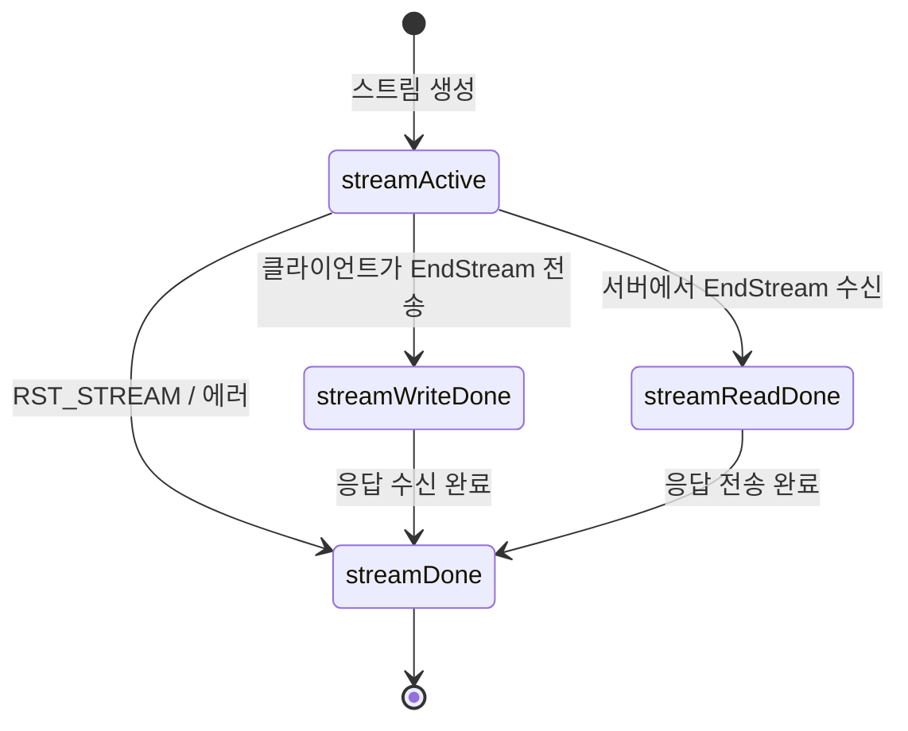
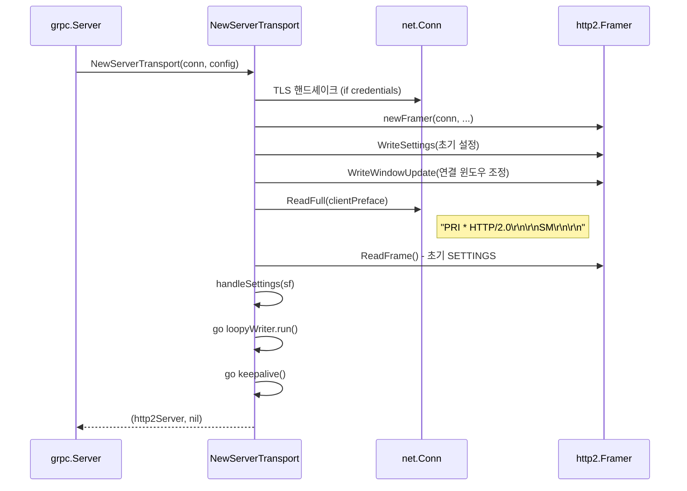
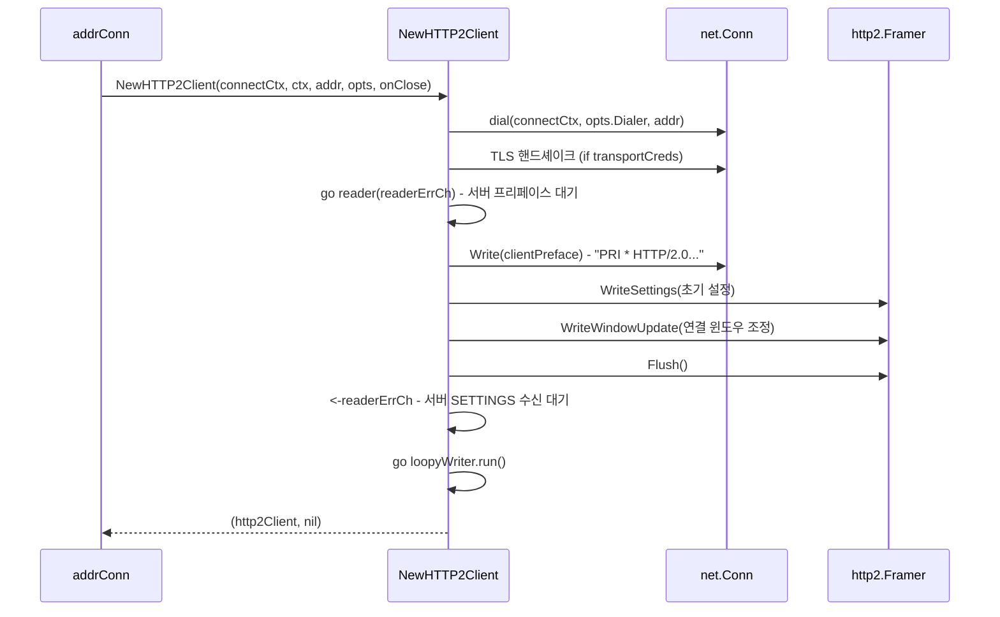
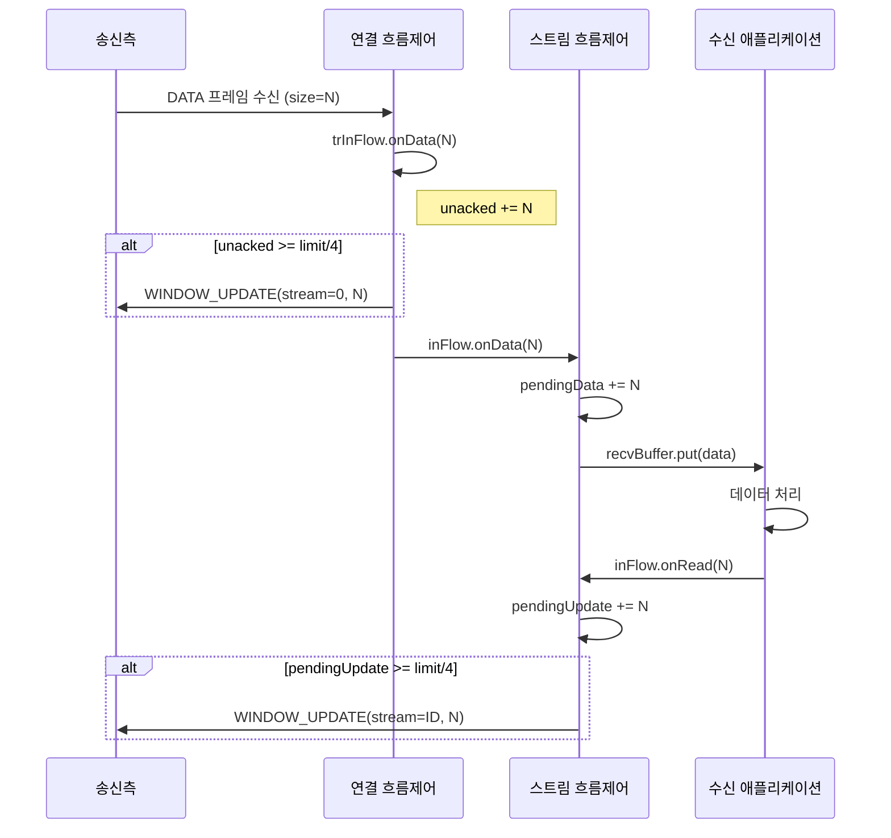
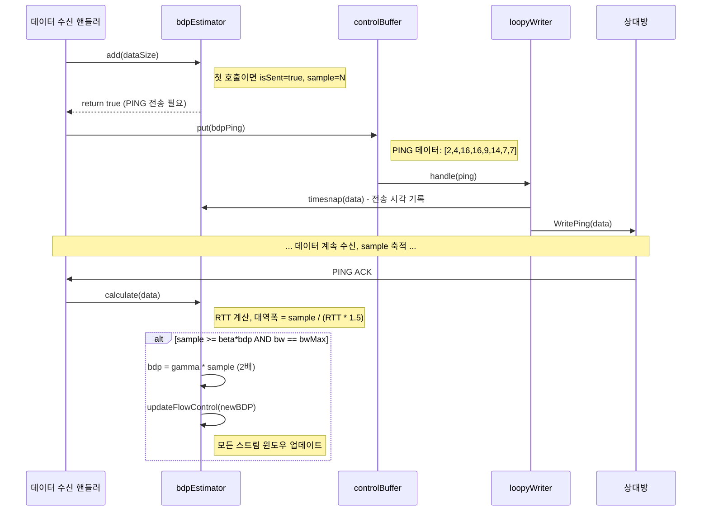
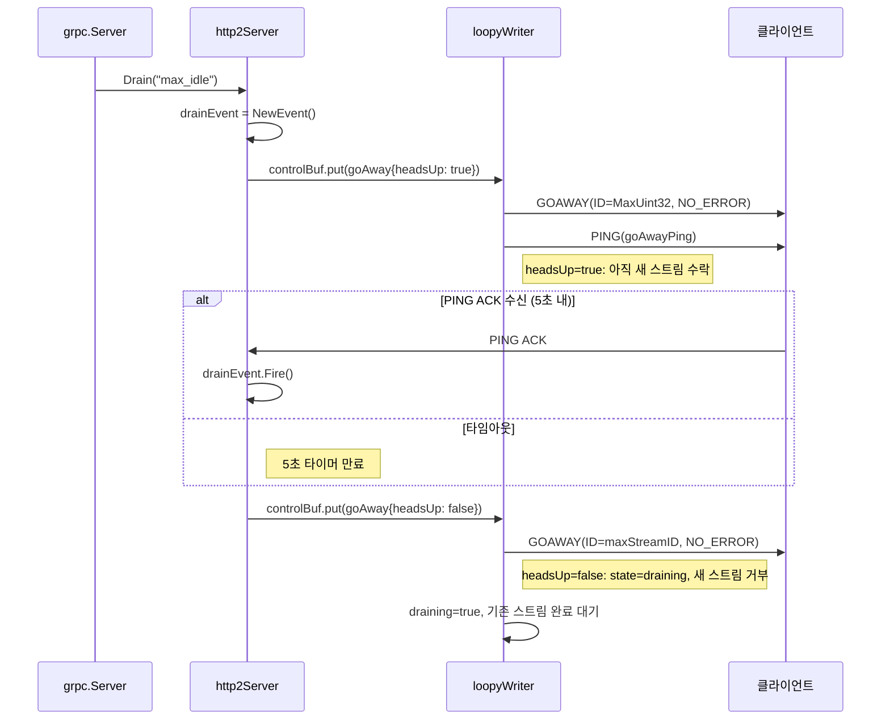

# 07. HTTP/2 트랜스포트 계층 심화 분석

## 목차

1. [개요](#1-개요)
2. [아키텍처 전체 구조](#2-아키텍처-전체-구조)
3. [핵심 인터페이스: ServerTransport와 ClientTransport](#3-핵심-인터페이스-servertransport와-clienttransport)
4. [Stream 구조체와 스트림 생명주기](#4-stream-구조체와-스트림-생명주기)
5. [http2Server 구현 상세](#5-http2server-구현-상세)
6. [http2Client 구현 상세](#6-http2client-구현-상세)
7. [controlBuffer와 loopyWriter](#7-controlbuffer와-loopywriter)
8. [흐름 제어 메커니즘](#8-흐름-제어-메커니즘)
9. [BDP 추정과 동적 윈도우 조정](#9-bdp-추정과-동적-윈도우-조정)
10. [handler_server: Go http.Handler 통합](#10-handler_server-go-httphandler-통합)
11. [프레임 타입별 처리](#11-프레임-타입별-처리)
12. [Keepalive와 연결 관리](#12-keepalive와-연결-관리)
13. [설계 결정과 Why](#13-설계-결정과-why)

---

## 1. 개요

gRPC-Go의 트랜스포트 계층은 `internal/transport` 패키지에 위치하며, HTTP/2 프로토콜 위에서 메시지 기반 통신 채널을 구현한다. 이 패키지는 gRPC 내부 전용이며 외부에서 직접 import하지 않는다.

> 소스코드: `internal/transport/transport.go:19-22`
> ```go
> // Package transport defines and implements message oriented communication
> // channel to complete various transactions (e.g., an RPC).  It is meant for
> // grpc-internal usage and is not intended to be imported directly by users.
> package transport
> ```

트랜스포트 계층이 담당하는 핵심 역할:

| 역할 | 설명 |
|------|------|
| HTTP/2 프레임 처리 | HEADERS, DATA, SETTINGS, PING, GOAWAY, RST_STREAM, WINDOW_UPDATE 프레임 송수신 |
| 스트림 관리 | 스트림 생성, 상태 전이, 정리 |
| 흐름 제어 | 연결/스트림 수준 윈도우 관리, BDP 기반 동적 조정 |
| 연결 생명주기 | 핸드셰이크, Keepalive, Graceful shutdown |
| 제어 프레임 큐잉 | controlBuffer를 통한 비동기 프레임 전송 |

### 핵심 파일 구성

| 파일 | 역할 | 줄 수 |
|------|------|-------|
| `transport.go` | 핵심 인터페이스, Stream, recvBuffer 정의 | ~755 |
| `http2_server.go` | 서버 측 HTTP/2 트랜스포트 구현 | ~1503 |
| `http2_client.go` | 클라이언트 측 HTTP/2 트랜스포트 구현 | ~1710+ |
| `controlbuf.go` | 제어 프레임 버퍼, loopyWriter | ~1058 |
| `flowcontrol.go` | 흐름 제어 (writeQuota, inFlow, trInFlow) | ~214 |
| `bdp_estimator.go` | BDP(대역폭-지연 곱) 추정 | ~142 |
| `handler_server.go` | Go http.Handler 기반 서버 어댑터 | ~507 |
| `defaults.go` | 상수 정의 | ~57 |
| `client_stream.go` | ClientStream 타입 | ~157 |
| `server_stream.go` | ServerStream 타입 | ~190 |

---

## 2. 아키텍처 전체 구조

### 트랜스포트 계층의 위치

```
+---------------------------+
|     gRPC Application      |
+---------------------------+
|     grpc.Server / Dial    |
+---------------------------+
|   Interceptors / Stats    |
+---------------------------+
|    internal/transport     |  <-- 이 문서의 분석 범위
|  +---------------------+ |
|  | ClientTransport     | |
|  | ServerTransport     | |
|  | controlBuffer       | |
|  | loopyWriter         | |
|  | flowcontrol         | |
|  | bdpEstimator        | |
|  +---------------------+ |
+---------------------------+
|   golang.org/x/net/http2  |
+---------------------------+
|        net.Conn (TCP)     |
+---------------------------+
```

### 고루틴 구조

서버와 클라이언트 모두 연결당 여러 고루틴이 협력한다.

```
서버 측 (http2Server):                     클라이언트 측 (http2Client):
+----------------------------+             +----------------------------+
| HandleStreams (reader)     |             | reader goroutine           |
|  - 프레임 읽기 루프         |             |  - 프레임 읽기 루프         |
|  - 프레임별 핸들러 디스패치  |             |  - 프레임별 핸들러 디스패치  |
+----------------------------+             +----------------------------+
| loopyWriter goroutine      |             | loopyWriter goroutine      |
|  - controlBuf에서 읽기     |             |  - controlBuf에서 읽기     |
|  - HTTP/2 프레임 쓰기      |             |  - HTTP/2 프레임 쓰기      |
+----------------------------+             +----------------------------+
| keepalive goroutine        |             | keepalive goroutine        |
|  - 유휴 연결 감지          |             |  - 서버 응답 감시          |
|  - PING 전송              |             |  - PING 전송              |
+----------------------------+             +----------------------------+
| stream handler goroutines  |             | per-RPC goroutines         |
|  - RPC별 요청 처리         |             |  - RPC별 송수신 처리       |
+----------------------------+             +----------------------------+
```

**왜(Why) 이렇게 분리했는가?** 읽기(reader)와 쓰기(loopyWriter)를 별도 고루틴으로 분리한 이유는 HTTP/2의 전이중(full-duplex) 특성을 활용하기 위함이다. 읽기와 쓰기가 독립적으로 동작하면 한쪽의 블로킹이 다른 쪽에 영향을 주지 않는다. 모든 쓰기 작업은 `controlBuffer`를 통해 직렬화되므로, 여러 스트림이 동시에 데이터를 전송해도 HTTP/2 프레임의 순서가 보장된다.

---

## 3. 핵심 인터페이스: ServerTransport와 ClientTransport

### 3.1 ClientTransport 인터페이스

> 소스코드: `internal/transport/transport.go:604-641`

```go
type ClientTransport interface {
    Close(err error)
    GracefulClose()
    NewStream(ctx context.Context, callHdr *CallHdr, handler stats.Handler) (*ClientStream, error)
    Error() <-chan struct{}
    GoAway() <-chan struct{}
    GetGoAwayReason() (GoAwayReason, string)
    Peer() *peer.Peer
}
```

| 메서드 | 설명 |
|--------|------|
| `Close(err error)` | 즉시 연결 종료. 한 번만 호출 가능 |
| `GracefulClose()` | 새 RPC 차단, 기존 스트림 완료 후 종료 |
| `NewStream(...)` | 새 RPC 스트림 생성 및 등록 |
| `Error()` | I/O 에러 발생 시 닫히는 채널 반환 |
| `GoAway()` | 서버로부터 GOAWAY 수신 시 닫히는 채널 |
| `GetGoAwayReason()` | GOAWAY 프레임의 에러 코드와 디버그 메시지 |
| `Peer()` | 피어 정보 (주소, 인증 정보) |

### 3.2 ServerTransport 인터페이스

> 소스코드: `internal/transport/transport.go:648-662`

```go
type ServerTransport interface {
    HandleStreams(context.Context, func(*ServerStream))
    Close(err error)
    Peer() *peer.Peer
    Drain(debugData string)
}
```

| 메서드 | 설명 |
|--------|------|
| `HandleStreams(ctx, handler)` | 수신 스트림 처리 루프 (블로킹) |
| `Close(err error)` | 트랜스포트 즉시 종료 |
| `Peer()` | 피어 정보 반환 |
| `Drain(debugData)` | 새 RPC 수신 중단 알림 (Graceful Shutdown) |

### 3.3 내부 서버 트랜스포트 인터페이스

> 소스코드: `internal/transport/transport.go:664-672`

```go
type internalServerTransport interface {
    ServerTransport
    writeHeader(s *ServerStream, md metadata.MD) error
    write(s *ServerStream, hdr []byte, data mem.BufferSlice, opts *WriteOptions) error
    writeStatus(s *ServerStream, st *status.Status) error
    incrMsgRecv()
    adjustWindow(s *ServerStream, n uint32)
    updateWindow(s *ServerStream, n uint32)
}
```

**왜(Why) 두 개의 인터페이스로 분리했는가?** `ServerTransport`는 공개(public) API로 서버 코어에서 사용하고, `internalServerTransport`는 `ServerStream`이 자신의 트랜스포트에 접근할 때 사용하는 내부 인터페이스다. 쓰기 관련 메서드(`writeHeader`, `write`, `writeStatus`)를 내부 인터페이스에 두어 외부 사용자가 직접 프레임을 조작하는 것을 방지한다.

### 3.4 설정 구조체

> 소스코드: `internal/transport/transport.go:492-550`

```go
type ServerConfig struct {
    MaxStreams            uint32
    ConnectionTimeout    time.Duration
    Credentials          credentials.TransportCredentials
    KeepaliveParams      keepalive.ServerParameters
    KeepalivePolicy      keepalive.EnforcementPolicy
    InitialWindowSize    int32
    InitialConnWindowSize int32
    WriteBufferSize      int
    ReadBufferSize       int
    StaticWindowSize     bool
    // ...
}

type ConnectOptions struct {
    UserAgent            string
    Dialer               func(context.Context, string) (net.Conn, error)
    TransportCredentials credentials.TransportCredentials
    KeepaliveParams      keepalive.ClientParameters
    InitialWindowSize    int32
    InitialConnWindowSize int32
    StaticWindowSize     bool
    // ...
}
```

### 3.5 기본 상수 값

> 소스코드: `internal/transport/defaults.go:26-56`

| 상수 | 값 | 설명 |
|------|-----|------|
| `defaultWindowSize` | 65,535 | HTTP/2 스펙 기본 흐름 제어 윈도우 |
| `initialWindowSize` | 65,535 | RPC 초기 윈도우 크기 |
| `maxWindowSize` | 2^31 - 1 | HTTP/2 스펙 최대 윈도우 |
| `defaultWriteQuota` | 65,536 (64KB) | 스트림별 쓰기 쿼타 |
| `defaultMaxStreamsClient` | 100 | 클라이언트 기본 동시 스트림 수 |
| `defaultServerKeepaliveTime` | 2시간 | 서버 keepalive 간격 |
| `defaultClientKeepaliveTimeout` | 20초 | 클라이언트 keepalive 타임아웃 |
| `MaxStreamID` | 2^31 * 3/4 | 스트림 ID 상한 (75% 도달 시 연결 갱신) |

---

## 4. Stream 구조체와 스트림 생명주기

### 4.1 Stream 기본 구조체

> 소스코드: `internal/transport/transport.go:288-309`

```go
type Stream struct {
    ctx          context.Context
    method       string
    recvCompress string
    sendCompress string
    readRequester readRequester
    contentSubtype string
    trailer      metadata.MD
    state        streamState  // atomic
    id           uint32
    buf          recvBuffer
    trReader     transportReader
    fc           inFlow
    wq           writeQuota
}
```

### 4.2 스트림 상태 전이

> 소스코드: `internal/transport/transport.go:278-285`

```go
const (
    streamActive    streamState = iota  // 스트림 활성
    streamWriteDone                      // EndStream 전송 완료
    streamReadDone                       // EndStream 수신 완료
    streamDone                           // 스트림 완전 종료
)
```



### 4.3 ClientStream과 ServerStream

> 소스코드: `internal/transport/client_stream.go:32-55`, `internal/transport/server_stream.go:34-53`

```
+------------------+       +------------------+
|   ClientStream   |       |   ServerStream   |
+------------------+       +------------------+
| Stream (embed)   |       | Stream (embed)   |
| ct *http2Client  |       | st internalST    |
| done chan struct{}|       | cancel func()    |
| headerChan       |       | header MD        |
| status *Status   |       | headerSent bool  |
| bytesReceived    |       | headerWireLength |
| unprocessed      |       | hdrMu sync.Mutex |
+------------------+       +------------------+
| Read(n) BuffSlice|       | Read(n) BuffSlice|
| Write(hdr,data)  |       | Write(hdr,data)  |
| Close(err)       |       | SendHeader(md)   |
| Header() MD      |       | WriteStatus(st)  |
| Status() *Status |       | SetHeader(md)    |
| Done() <-chan     |       | SetTrailer(md)   |
+------------------+       +------------------+
```

**왜(Why) Stream을 embed 방식으로 구현했는가?** 클라이언트와 서버 스트림은 공통 기능(버퍼 읽기, 흐름 제어, 상태 관리)을 공유하지만, 각각 고유한 동작(클라이언트: 헤더 대기, 서버: 헤더/트레일러 전송)을 가진다. Go의 구조체 임베딩으로 공통 코드를 `Stream`에 두고, 타입별 메서드를 각 구조체에 정의하여 코드 중복을 최소화한다.

### 4.4 recvBuffer: 수신 데이터 버퍼

> 소스코드: `internal/transport/transport.go:58-121`

```go
type recvBuffer struct {
    c       chan recvMsg    // 용량 1의 채널 (알림용)
    mu      sync.Mutex
    backlog []recvMsg      // 초과분 저장
    err     error
}
```

동작 원리:
1. `put()`: 새 메시지를 채널에 넣거나, 채널이 차면 backlog에 추가
2. `get()`: 채널에서 메시지 수신 (블로킹)
3. `load()`: backlog에서 채널로 메시지 이동

```
put(msg) ─────────────> [ chan (cap=1) ] ──> get() ──> load()
                              |                          |
                              v                          v
                        [ backlog[] ] <──────────────────┘
                        (오버플로우)     (backlog에서 chan으로)
```

**왜(Why) 채널 용량을 1로 제한하는가?** backlog 패턴을 사용하여 무한 버퍼링을 지원하면서도 고루틴 깨우기(wakeup)에는 용량 1 채널을 사용한다. 이렇게 하면 할당(allocation)이 최소화되고, 소비자가 준비되지 않았을 때도 생산자가 블로킹되지 않는다.

---

## 5. http2Server 구현 상세

### 5.1 구조체 정의

> 소스코드: `internal/transport/http2_server.go:74-140`

```go
type http2Server struct {
    lastRead        int64              // 마지막 읽기 시각 (atomic)
    done            chan struct{}       // 종료 신호
    conn            net.Conn           // TCP 연결
    loopy           *loopyWriter       // 쓰기 고루틴
    readerDone      chan struct{}       // reader 종료 동기화
    loopyWriterDone chan struct{}       // writer 종료 동기화
    peer            peer.Peer          // 피어 정보
    framer          *framer            // HTTP/2 프레이머
    maxStreams       uint32             // 최대 동시 스트림 수
    controlBuf      *controlBuffer     // 제어 프레임 큐
    fc              *trInFlow          // 연결 수준 흐름 제어
    kp              keepalive.ServerParameters
    kep             keepalive.EnforcementPolicy
    bdpEst          *bdpEstimator      // BDP 추정기
    initialWindowSize int32            // 초기 윈도우 크기

    mu              sync.Mutex
    drainEvent      *grpcsync.Event    // Drain 이벤트
    state           transportState     // reachable/closing/draining
    activeStreams    map[uint32]*ServerStream
    idle            time.Time          // 유휴 시작 시각

    maxStreamMu     sync.Mutex
    maxStreamID     uint32             // 수신한 최대 스트림 ID
}
```

### 5.2 서버 트랜스포트 생성 흐름

> 소스코드: `internal/transport/http2_server.go:149-365`



주요 초기화 단계:

1. **TLS 핸드셰이크**: `config.Credentials`가 설정되면 `ServerHandshake()` 수행
2. **초기 SETTINGS 전송**: `MaxFrameSize`, `MaxConcurrentStreams`, `InitialWindowSize` 등
3. **연결 윈도우 조정**: `initialConnWindowSize`가 기본값보다 크면 `WINDOW_UPDATE` 전송
4. **클라이언트 프리페이스 검증**: HTTP/2 매직 바이트 수신 확인
5. **loopyWriter 시작**: 별도 고루틴에서 프레임 쓰기 루프 실행
6. **keepalive 시작**: 유휴 연결 감지, 최대 연결 수명 관리

### 5.3 HandleStreams: 프레임 읽기 루프

> 소스코드: `internal/transport/http2_server.go:631-694`

```go
func (t *http2Server) HandleStreams(ctx context.Context, handle func(*ServerStream)) {
    defer func() {
        close(t.readerDone)
        <-t.loopyWriterDone
    }()
    for {
        t.controlBuf.throttle()
        frame, err := t.framer.readFrame()
        atomic.StoreInt64(&t.lastRead, time.Now().UnixNano())
        if err != nil {
            // StreamError: 해당 스트림만 닫기
            // 그 외: 연결 종료
        }
        switch frame := frame.(type) {
        case *http2.MetaHeadersFrame:
            t.operateHeaders(ctx, frame, handle)
        case *parsedDataFrame:
            t.handleData(frame)
        case *http2.RSTStreamFrame:
            t.handleRSTStream(frame)
        case *http2.SettingsFrame:
            t.handleSettings(frame)
        case *http2.PingFrame:
            t.handlePing(frame)
        case *http2.WindowUpdateFrame:
            t.handleWindowUpdate(frame)
        case *http2.GoAwayFrame:
            // TODO: Handle GoAway from the client
        }
    }
}
```

**왜(Why) `throttle()`을 호출하는가?** 악의적이거나 잘못 동작하는 클라이언트가 대량의 프레임을 보내면, 서버가 응답 프레임(SETTINGS ACK, RST_STREAM 등)을 큐에 쌓기만 하고 보내지 못하는 상황이 발생할 수 있다. `throttle()`은 응답 프레임이 `maxQueuedTransportResponseFrames`(50개)를 초과하면 읽기를 일시 중단하여 백프레셔(backpressure)를 적용한다.

### 5.4 operateHeaders: 새 스트림 처리

> 소스코드: `internal/transport/http2_server.go:369-626`

스트림 생성 시 수행하는 검증 단계:

```
수신 HEADERS 프레임
    |
    v
1. 헤더 크기 제한 확인 (frame.Truncated)
    |
    v
2. 스트림 ID 유효성 (홀수, 증가)
    |
    v
3. 헤더 필드 파싱
   - content-type: gRPC 여부 확인
   - grpc-encoding: 압축 알고리즘
   - grpc-timeout: 데드라인 설정
   - :method: POST 확인
   - :authority / host: A41 규격 준수
   - connection 헤더: 프로토콜 위반
    |
    v
4. 최대 동시 스트림 수 확인
    |
    v
5. InTapHandle 콜백 (요청 필터링)
    |
    v
6. activeStreams에 등록
    |
    v
7. writeQuota 초기화, controlBuf에 registerStream
    |
    v
8. handle(s) 호출 → RPC 처리 시작
```

### 5.5 writeStatus: 응답 상태 전송

> 소스코드: `internal/transport/http2_server.go:1071-1138`

```go
func (t *http2Server) writeStatus(s *ServerStream, st *status.Status) error {
    // 1. 헤더가 아직 안 보내졌으면:
    //    - header 메타데이터가 있으면 별도 HEADERS 프레임으로 전송
    //    - 없으면 trailer-only 응답 (:status + content-type 포함)
    // 2. grpc-status, grpc-message 헤더 필드 추가
    // 3. 에러 상세 정보(grpc-status-details-bin) 직렬화
    // 4. trailer 메타데이터 첨부
    // 5. endStream=true로 HEADERS 프레임 전송
    // 6. RST_STREAM (클라이언트가 아직 half-close 안 했으면)
}
```

**왜(Why) trailer-only 응답을 지원하는가?** 즉시 에러 응답(인증 실패, 메서드 미발견 등)에서 별도의 헤더 프레임 없이 트레일러만으로 응답할 수 있어 네트워크 왕복을 줄인다. gRPC 프로토콜 스펙의 `Trailers-Only` 응답에 해당한다.

---

## 6. http2Client 구현 상세

### 6.1 구조체 정의

> 소스코드: `internal/transport/http2_client.go:69-156`

```go
type http2Client struct {
    lastRead        int64              // 마지막 읽기 시각 (atomic)
    ctx             context.Context
    cancel          context.CancelFunc
    userAgent       string
    address         resolver.Address
    conn            net.Conn           // TCP 연결
    loopy           *loopyWriter
    goAway          chan struct{}       // GOAWAY 수신 알림
    keepaliveDone   chan struct{}
    framer          *framer
    controlBuf      *controlBuffer
    fc              *trInFlow          // 연결 수준 수신 흐름 제어

    kp              keepalive.ClientParameters
    keepaliveEnabled bool
    bdpEst          *bdpEstimator
    initialWindowSize int32

    maxConcurrentStreams  uint32        // 서버가 허용한 최대 스트림
    streamQuota          int64         // 남은 스트림 쿼타
    streamsQuotaAvailable chan struct{} // 스트림 쿼타 알림 채널
    waitingStreams        uint32        // 대기 중인 스트림 수

    mu              sync.Mutex
    nextID          uint32             // 다음 스트림 ID (홀수)
    state           transportState
    activeStreams    map[uint32]*ClientStream
    prevGoAwayID    uint32             // 이전 GOAWAY의 Last-Stream-ID
    goAwayReason    GoAwayReason
    goAwayDebugMessage string

    kpDormancyCond  *sync.Cond         // keepalive 휴면 조건변수
    kpDormant       bool               // keepalive 휴면 여부
    onClose         func(GoAwayReason) // 연결 종료 콜백
}
```

### 6.2 클라이언트 트랜스포트 생성 흐름

> 소스코드: `internal/transport/http2_client.go:207-479`



### 6.3 NewStream: RPC 스트림 생성

> 소스코드: `internal/transport/http2_client.go:748-935`

NewStream의 핵심 로직은 `controlBuffer.executeAndPut()`을 사용하여 두 가지 검증을 원자적으로 수행한다:

```go
for {
    success, err := t.controlBuf.executeAndPut(func() bool {
        return checkForHeaderListSize() && checkForStreamQuota()
    }, hdr)
    if success {
        break
    }
    // 쿼타 없으면 대기
    select {
    case <-ch:           // 스트림 쿼타 사용 가능
    case <-ctx.Done():   // 컨텍스트 취소
    case <-t.goAway:     // GOAWAY 수신
    case <-t.ctx.Done(): // 연결 종료
    }
}
```

**왜(Why) executeAndPut()으로 원자적 검증을 하는가?** 헤더 크기 확인과 스트림 쿼타 할당을 분리하면, 두 검사 사이에 다른 고루틴이 쿼타를 소진하거나 설정이 변경될 수 있다. `controlBuffer`의 뮤텍스를 잡은 상태에서 검증과 큐잉을 한 번에 수행하여 경쟁 조건을 방지한다.

### 6.4 GOAWAY 처리

> 소스코드: `internal/transport/http2_client.go:1332-1407`

gRPC-Go는 서버의 Graceful Shutdown을 위해 **두 번의 GOAWAY** 프로토콜을 구현한다:

```
시간 ──────────────────────────────────────────>

서버                                  클라이언트
  |                                      |
  |── GOAWAY(ID=MaxUint32) ──────────>   |  첫 번째: "곧 종료할 예정"
  |── PING ──────────────────────────>   |  RTT 측정용
  |                                      |
  |<─ PING ACK ──────────────────────    |  RTT 시간 확보
  |                                      |
  |── GOAWAY(ID=실제_마지막_ID) ─────>   |  두 번째: "이 ID 이후 미처리"
  |                                      |
  |  기존 스트림 완료 대기...             |  ID > 마지막ID 스트림 재시도
  |                                      |
  |── TCP FIN ──────────────────────>    |  연결 종료
```

클라이언트의 `handleGoAway()` 핵심 로직:

```go
func (t *http2Client) handleGoAway(f *http2.GoAwayFrame) error {
    // 1. "too_many_pings" 에러 코드 확인 → 로깅
    // 2. 첫 번째 GoAway: goAway 채널 닫기, state → draining
    // 3. 두 번째 GoAway: prevGoAwayID와 비교 검증
    // 4. ID > GoAwayID인 스트림들 → unprocessed로 표시, closeStream
    // 5. 활성 스트림 없으면 연결 종료
}
```

**왜(Why) 두 번의 GOAWAY를 사용하는가?** 첫 번째 GOAWAY(ID=MaxUint32) 전송과 클라이언트의 수신 사이에 클라이언트가 새 스트림을 생성할 수 있다. RTT만큼 대기 후 실제 Last-Stream-ID로 두 번째 GOAWAY를 보내면, 그 사이에 생성된 스트림도 안전하게 처리할 수 있다.

### 6.5 Close: 연결 종료

> 소스코드: `internal/transport/http2_client.go:1001-1072`

```go
func (t *http2Client) Close(err error) {
    // 1. 쓰기 데드라인 10초 설정
    // 2. 읽기 데드라인 1초 설정 (빠른 reader 종료)
    // 3. state → closing
    // 4. GOAWAY 프레임 전송 (controlBuf.put)
    // 5. loopyWriter 종료 대기 (5초 타임아웃)
    // 6. 컨텍스트 취소, 연결 닫기
    // 7. reader, keepalive 고루틴 종료 대기
    // 8. 모든 활성 스트림 closeStream() 호출
    // 9. statsHandler에 ConnEnd 이벤트 전달
}
```

---

## 7. controlBuffer와 loopyWriter

### 7.1 controlBuffer 구조

> 소스코드: `internal/transport/controlbuf.go:307-333`

```go
type controlBuffer struct {
    wakeupCh chan struct{}         // reader 깨우기 채널 (cap=1)
    done     <-chan struct{}       // 트랜스포트 종료 신호

    mu              sync.Mutex
    consumerWaiting bool            // reader 블로킹 여부
    closed          bool            // 종료 상태
    list            *itemList       // 큐잉된 제어 프레임 리스트

    transportResponseFrames int     // 응답 프레임 카운트
    trfChan     atomic.Pointer[chan struct{}]  // 쓰로틀링 채널
}
```

### 7.2 제어 프레임 타입들

> 소스코드: `internal/transport/controlbuf.go:99-228`

```
cbItem 인터페이스
    |
    +-- registerStream        : loopyWriter에 스트림 등록
    +-- headerFrame           : 헤더/트레일러 전송
    +-- cleanupStream         : 스트림 정리 + RST_STREAM
    +-- earlyAbortStream      : 조기 에러 응답
    +-- dataFrame             : DATA 프레임 전송
    +-- incomingWindowUpdate  : 수신한 WINDOW_UPDATE → sendQuota 업데이트
    +-- outgoingWindowUpdate  : 전송할 WINDOW_UPDATE
    +-- incomingSettings      : 수신한 SETTINGS → ACK 전송
    +-- outgoingSettings      : 전송할 SETTINGS
    +-- incomingGoAway        : GOAWAY 수신 처리
    +-- goAway                : GOAWAY 전송
    +-- ping                  : PING/PING ACK
    +-- outFlowControlSizeRequest : 흐름 제어 윈도우 조회
    +-- closeConnection       : 연결 종료 지시
```

각 타입에는 `isTransportResponseFrame() bool` 메서드가 있어, 쓰로틀링 대상 여부를 판별한다:

| 프레임 | isTransportResponseFrame | 이유 |
|--------|:------------------------:|------|
| `incomingSettings` | true | 서버가 ACK 응답 |
| `ping` (ACK) | true | PING에 대한 응답 |
| `cleanupStream` (RST) | true | RST_STREAM 응답 |
| `headerFrame` (cleanup+rst) | true | RST_STREAM 포함 |
| `dataFrame` | false | 애플리케이션 데이터 |
| `outgoingWindowUpdate` | false | 윈도우 업데이트는 쓰로틀 불필요 |
| `goAway` | false | 종료 시그널 |

### 7.3 executeAndPut: 원자적 검증+큐잉

> 소스코드: `internal/transport/controlbuf.go:360-398`

```go
func (c *controlBuffer) executeAndPut(f func() bool, it cbItem) (bool, error) {
    c.mu.Lock()
    defer c.mu.Unlock()

    if c.closed { return false, ErrConnClosing }
    if f != nil {
        if !f() { return false, nil }  // 검증 실패
    }
    if it == nil { return true, nil }

    // 소비자 깨우기
    if c.consumerWaiting {
        c.wakeupCh <- struct{}{}
        c.consumerWaiting = false
    }
    c.list.enqueue(it)
    // 응답 프레임 카운트 및 쓰로틀링 관리
    return true, nil
}
```

**왜(Why) 이 패턴이 중요한가?** `NewStream()`에서 스트림 쿼타 확인과 헤더 큐잉을 원자적으로 수행해야 한다. 또한 `writeStatus()`에서 헤더 크기 확인과 트레일러 전송도 마찬가지다. `executeAndPut()`은 이런 "확인 후 행동(check-then-act)" 패턴에서 발생하는 경쟁 조건을 해결한다.

### 7.4 loopyWriter: 프레임 쓰기 엔진

> 소스코드: `internal/transport/controlbuf.go:513-561`

```go
type loopyWriter struct {
    side          side           // clientSide or serverSide
    cbuf          *controlBuffer // 제어 프레임 소스
    sendQuota     uint32         // 연결 수준 전송 쿼타
    oiws          uint32         // 아웃바운드 초기 윈도우 크기
    estdStreams    map[uint32]*outStream  // 등록된 스트림
    activeStreams  *outStreamList        // 전송 대기 스트림 (라운드-로빈)
    framer        *framer
    hBuf          *bytes.Buffer
    hEnc          *hpack.Encoder
    bdpEst        *bdpEstimator
    draining      bool
    conn          net.Conn
}
```

### 7.5 loopyWriter.run(): 메인 루프

> 소스코드: `internal/transport/controlbuf.go:586-641`

```
┌─────────────────────────────────────────────────────────┐
│                  loopyWriter.run() 루프                   │
│                                                          │
│  1. controlBuf.get(block=true) → 제어 프레임 대기         │
│  2. handle(frame) → 프레임 타입별 처리                    │
│  3. processData() → activeStreams에서 데이터 전송          │
│  4. 내부 루프 (hasdata):                                  │
│     a. controlBuf.get(block=false) → 비차단 읽기          │
│     b. handle() + processData()                          │
│     c. activeStreams 비었으면:                             │
│        - 배치 크기 < 1000 → runtime.Gosched() 한 번      │
│        - Flush() → 배치 쓰기                             │
│        - break                                           │
└─────────────────────────────────────────────────────────┘
```

**왜(Why) `runtime.Gosched()`를 호출하는가?** 작은 배치로 자주 flush하면 시스템 콜 오버헤드가 증가한다. 쓰기 버퍼가 `minBatchSize`(1000 bytes) 미만이면 한 번 양보하여, 다른 스트림 고루틴이 데이터를 controlBuf에 넣을 기회를 준다. 이로써 배치 크기가 커지고 네트워크 효율이 향상된다.

### 7.6 processData: 라운드-로빈 데이터 전송

> 소스코드: `internal/transport/controlbuf.go:937-1057`

```go
func (l *loopyWriter) processData() (bool, error) {
    if l.sendQuota == 0 { return true, nil }  // 연결 쿼타 소진
    str := l.activeStreams.dequeue()           // 라운드-로빈
    if str == nil { return true, nil }         // 활성 스트림 없음

    // 전송 가능한 최대 크기 결정
    maxSize := http2MaxFrameLen               // 16KB
    strQuota := int(l.oiws) - str.bytesOutStanding
    if strQuota <= 0 { str.state = waitingOnStreamQuota; return false, nil }
    maxSize = min(maxSize, strQuota)          // 스트림 쿼타 적용
    maxSize = min(maxSize, int(l.sendQuota))  // 연결 쿼타 적용

    // 데이터 쓰기
    l.framer.writeData(...)

    // 쿼타 소비
    str.bytesOutStanding += size
    l.sendQuota -= uint32(size)

    // 스트림 상태 업데이트
    if str.itl.isEmpty() { str.state = empty }
    else if trailer found { write trailer + cleanup }
    else if strQuota exhausted { str.state = waitingOnStreamQuota }
    else { l.activeStreams.enqueue(str) }  // 재큐잉
}
```

라운드-로빈 스케줄링 다이어그램:

```
activeStreams (이중 연결 리스트):

  head ─── Stream A ─── Stream B ─── Stream C ─── tail
  (센티넬)                                        (센티넬)

processData() 한 번 호출:
  1. Stream A dequeue
  2. Stream A의 데이터 일부 전송 (최대 16KB, 쿼타 내에서)
  3. 데이터 남아있으면 → 리스트 끝에 다시 enqueue

  head ─── Stream B ─── Stream C ─── Stream A ─── tail
```

### 7.7 outStream 상태 전이

> 소스코드: `internal/transport/controlbuf.go:230-248`

```
                preprocessData()
  empty ──────────────────────> active ──────┐
    ^                             |          |
    |                             |          | processData()
    |     데이터 모두 전송         |          | (데이터 남음)
    +─────────────────────────────+          |
    |                             |          |
    |    스트림 쿼타 소진          v          |
    |                    waitingOnStreamQuota |
    |                             |          |
    |     WINDOW_UPDATE 수신      |          |
    +─────────────────────────────+──────────┘
```

---

## 8. 흐름 제어 메커니즘

### 8.1 이중 수준 흐름 제어

HTTP/2의 흐름 제어는 **연결 수준**과 **스트림 수준** 두 단계로 동작한다. gRPC-Go는 이를 각각 다른 구조체로 관리한다.

```
┌──────────────────────────────────────────────────────┐
│                    연결 수준                          │
│                                                      │
│  수신: trInFlow  (limit, unacked, effectiveWindowSize)│
│  송신: loopyWriter.sendQuota                         │
│                                                      │
│  ┌──────────────┐  ┌──────────────┐                  │
│  │  스트림 A     │  │  스트림 B     │  스트림 수준    │
│  │              │  │              │                  │
│  │ 수신: inFlow  │  │ 수신: inFlow  │                │
│  │ 송신: outStream│  │ 송신: outStream│               │
│  │  .bytesOut   │  │  .bytesOut   │                  │
│  │              │  │              │                  │
│  │ writeQuota   │  │ writeQuota   │  앱-트랜스포트   │
│  │ (앱→전송 쓰기│  │ (앱→전송 쓰기│  속도 조절      │
│  │  속도 제한)  │  │  속도 제한)  │                  │
│  └──────────────┘  └──────────────┘                  │
└──────────────────────────────────────────────────────┘
```

### 8.2 writeQuota: 애플리케이션-트랜스포트 간 속도 조절

> 소스코드: `internal/transport/flowcontrol.go:28-79`

```go
type writeQuota struct {
    ch        chan struct{}    // 쿼타 양수 → 쓰기 가능 알림
    done      <-chan struct{} // 스트림 종료 신호
    replenish func(n int)     // 쿼타 복원 콜백
    quota     int32           // 현재 쿼타 (atomic)
}
```

동작 흐름:

```
애플리케이션(Write)              loopyWriter(processData)
     |                                   |
     v                                   |
  wq.get(size)                           |
     |                                   |
  quota > 0? ──yes──> quota -= size      |
     |                    |              |
    no                    |              v
     |                    |      데이터를 와이어에 쓴 후
     v                    |      wq.replenish(size) 호출
  <-ch 대기 ──────────────+────> quota += size
     |                         quota가 0→양수: ch에 신호
     v
  쓰기 계속
```

**왜(Why) writeQuota를 두는가?** 연결/스트림의 HTTP/2 흐름 제어 윈도우가 가득 차면, loopyWriter가 데이터를 전송할 수 없다. 이때 애플리케이션이 계속 데이터를 쓰면 controlBuf에 무한히 쌓인다. writeQuota(기본 64KB)는 loopyWriter가 아직 소화하지 못한 데이터량을 제한하여 메모리 과다 사용을 방지한다.

### 8.3 inFlow: 스트림 수준 수신 흐름 제어

> 소스코드: `internal/transport/flowcontrol.go:120-213`

```go
type inFlow struct {
    mu            sync.Mutex
    limit         uint32     // 현재 윈도우 한도
    pendingData   uint32     // 수신했지만 앱이 아직 소비 안 한 데이터
    pendingUpdate uint32     // 앱이 소비했지만 WINDOW_UPDATE 안 보낸 양
    delta         uint32     // maybeAdjust()로 추가된 임시 윈도우
}
```

WINDOW_UPDATE 전송 최적화:

```go
func (f *inFlow) onRead(n uint32) uint32 {
    // pendingUpdate에 축적
    f.pendingUpdate += n
    // limit/4 (25%) 이상 축적되면 한꺼번에 전송
    if f.pendingUpdate >= f.limit/4 {
        wu := f.pendingUpdate
        f.pendingUpdate = 0
        return wu  // WINDOW_UPDATE로 전송할 값
    }
    return 0  // 아직 축적 중
}
```

**왜(Why) 25% 임계값을 사용하는가?** 데이터를 읽을 때마다 WINDOW_UPDATE를 보내면 프레임 오버헤드가 커진다. 윈도우의 25%만큼 소비가 축적되면 한 번에 업데이트하여, WINDOW_UPDATE 프레임 수를 줄이면서도 송신측이 윈도우 부족으로 대기하는 시간을 최소화한다.

### 8.4 trInFlow: 연결 수준 수신 흐름 제어

> 소스코드: `internal/transport/flowcontrol.go:81-116`

```go
type trInFlow struct {
    limit               uint32
    unacked             uint32   // 아직 WINDOW_UPDATE 안 보낸 양
    effectiveWindowSize uint32   // limit - unacked (atomic 읽기)
}
```

연결 수준 흐름 제어의 핵심 차이점:

> 소스코드: `internal/transport/http2_server.go:763-776` (handleData의 주석)

```go
// Decouple connection's flow control from application's read.
// An update on connection's flow control should not depend on
// whether user application has read the data or not. Such a
// restriction is already imposed on the stream's flow control,
// and therefore the sender will be blocked anyways.
// Decoupling the connection flow control will prevent other
// active(fast) streams from starving in presence of slow or
// inactive streams.
```

**왜(Why) 연결 흐름 제어를 앱 읽기에서 분리하는가?** 느린 스트림 A의 앱이 데이터를 읽지 않으면 연결 윈도우가 줄어들어, 다른 빠른 스트림 B도 데이터를 수신하지 못하게 된다. 연결 수준에서는 데이터를 수신하면 즉시 WINDOW_UPDATE를 보내고, 스트림 수준에서만 앱의 읽기 속도에 맞춘다.

### 8.5 흐름 제어 전체 동작 흐름



---

## 9. BDP 추정과 동적 윈도우 조정

### 9.1 BDP (Bandwidth-Delay Product)란?

BDP는 네트워크 대역폭(bandwidth)과 왕복 지연시간(RTT)의 곱으로, 네트워크 파이프라인에 동시에 존재할 수 있는 데이터 양을 나타낸다. 흐름 제어 윈도우를 BDP에 맞추면 최적의 처리량을 달성할 수 있다.

```
BDP = Bandwidth x RTT

예: 100 Mbps 링크, RTT 10ms
    BDP = 100,000,000 / 8 * 0.01 = 125,000 bytes (약 122KB)

기본 윈도우(65KB) < BDP(122KB)이면 → 대역폭 활용 부족
윈도우를 BDP 이상으로 올리면    → 대역폭 최대 활용
```

### 9.2 bdpEstimator 구조체

> 소스코드: `internal/transport/bdp_estimator.go:49-68`

```go
type bdpEstimator struct {
    sentAt          time.Time       // PING 전송 시각
    mu              sync.Mutex
    bdp             uint32          // 현재 BDP 추정값
    sample          uint32          // 현재 측정 주기의 수신 바이트
    bwMax           float64         // 관측된 최대 대역폭 (bytes/sec)
    isSent          bool            // PING 전송 여부
    updateFlowControl func(n uint32) // 윈도우 업데이트 콜백
    sampleCount     uint64          // 총 샘플 수
    rtt             float64         // 이동 평균 RTT (초)
}
```

### 9.3 상수 값

> 소스코드: `internal/transport/bdp_estimator.go:26-43`

| 상수 | 값 | 의미 |
|------|-----|------|
| `bdpLimit` | 16MB (1<<20 * 16) | 윈도우 최대값 (TCP 시스템 한도 고려) |
| `alpha` | 0.9 | RTT 이동 평균 가중치 |
| `beta` | 0.66 | BDP 증가 판단 임계값 (sample >= beta * bdp) |
| `gamma` | 2 | BDP 증가 배율 |

### 9.4 BDP 추정 알고리즘



### 9.5 calculate() 상세 로직

> 소스코드: `internal/transport/bdp_estimator.go:105-141`

```go
func (b *bdpEstimator) calculate(d [8]byte) {
    // 1. RTT 계산
    rttSample := time.Since(b.sentAt).Seconds()
    if b.sampleCount < 10 {
        // 초기 10회: 단순 평균
        b.rtt += (rttSample - b.rtt) / float64(b.sampleCount)
    } else {
        // 이후: EWMA (alpha=0.9, 최근 값에 높은 가중치)
        b.rtt += (rttSample - b.rtt) * float64(alpha)
    }

    // 2. 현재 대역폭 계산
    // sample은 실제 BDP의 최대 1.5배이므로 보정
    bwCurrent := float64(b.sample) / (b.rtt * 1.5)

    // 3. BDP 증가 조건 확인
    if float64(b.sample) >= beta*float64(b.bdp) &&
       bwCurrent == b.bwMax &&
       b.bdp != bdpLimit {
        b.bdp = uint32(gamma * float64(b.sample))
        // 4. 윈도우 업데이트 트리거
        b.updateFlowControl(b.bdp)
    }
}
```

**왜(Why) 이런 조건으로 윈도우를 증가시키는가?**

1. `sample >= beta * bdp` (현재 샘플이 추정 BDP의 66% 이상): 네트워크가 실제로 큰 윈도우를 활용하고 있다는 증거
2. `bwCurrent == bwMax` (현재 대역폭이 관측 최대값): 네트워크가 포화 상태이므로 윈도우를 늘려야 처리량이 증가
3. 두 조건을 모두 만족해야 윈도우를 증가시켜, 불필요한 메모리 사용 증가를 방지

### 9.6 updateFlowControl: 윈도우 적용

> 소스코드: `internal/transport/http2_server.go:735-755`

```go
func (t *http2Server) updateFlowControl(n uint32) {
    t.mu.Lock()
    for _, s := range t.activeStreams {
        s.fc.newLimit(n)  // 모든 스트림의 수신 윈도우 업데이트
    }
    t.initialWindowSize = int32(n)  // 새 스트림의 초기 윈도우도 업데이트
    t.mu.Unlock()

    // 연결 수준 WINDOW_UPDATE 전송
    t.controlBuf.put(&outgoingWindowUpdate{
        streamID:  0,
        increment: t.fc.newLimit(n),
    })
    // SETTINGS로 새 InitialWindowSize 알림
    t.controlBuf.put(&outgoingSettings{
        ss: []http2.Setting{{
            ID:  http2.SettingInitialWindowSize,
            Val: n,
        }},
    })
}
```

---

## 10. handler_server: Go http.Handler 통합

### 10.1 개요

`handler_server.go`는 표준 Go `net/http` 서버의 `http.Handler` 인터페이스를 통해 gRPC를 서빙할 수 있게 해주는 어댑터다. `grpc.Server.ServeHTTP()` 메서드가 이 구현을 사용한다.

> 소스코드: `internal/transport/handler_server.go:18-23`

```
// This file is the implementation of a gRPC server using HTTP/2 which
// uses the standard Go http2 Server implementation (via the
// http.Handler interface), rather than speaking low-level HTTP/2
// frames itself. It is the implementation of *grpc.Server.ServeHTTP.
```

### 10.2 serverHandlerTransport 구조체

> 소스코드: `internal/transport/handler_server.go:145-177`

```go
type serverHandlerTransport struct {
    rw             http.ResponseWriter  // 응답 작성기
    req            *http.Request        // HTTP 요청
    timeoutSet     bool
    timeout        time.Duration
    headerMD       metadata.MD          // 수신 헤더 메타데이터
    peer           peer.Peer
    closeOnce      sync.Once
    closedCh       chan struct{}        // 종료 신호
    writes         chan func()          // 직렬화된 쓰기 작업 채널
    writeStatusMu  sync.Mutex
    contentType    string
    contentSubtype string
    stats          stats.Handler
    bufferPool     mem.BufferPool
}
```

### 10.3 http2Server와의 차이점

| 기능 | http2Server | serverHandlerTransport |
|------|-------------|----------------------|
| 프레임 처리 | 직접 HTTP/2 프레이머 조작 | Go 표준 http2 서버에 위임 |
| 스트림 수 | 다중 스트림 (다중 RPC) | 정확히 1개 스트림 (1 HTTP 요청) |
| 흐름 제어 | 커스텀 구현 (inFlow, trInFlow) | Go http2 서버에 위임 |
| loopyWriter | 사용 | 사용하지 않음 (writes 채널) |
| controlBuffer | 사용 | 사용하지 않음 |
| BDP 추정 | 지원 | 미지원 |
| Drain() | 구현됨 | panic (미구현) |

### 10.4 HandleStreams 구현

> 소스코드: `internal/transport/handler_server.go:392-467`

```go
func (ht *serverHandlerTransport) HandleStreams(ctx context.Context, startStream func(*ServerStream)) {
    // 1. 타임아웃 설정 (grpc-timeout 헤더)
    if ht.timeoutSet {
        ctx, cancel = context.WithTimeout(ctx, ht.timeout)
    }

    // 2. 요청 완료 감시 고루틴
    go func() {
        select {
        case <-requestOver:      // WriteStatus 호출 후 닫힘
        case <-ht.closedCh:      // 트랜스포트 닫힘
        case <-ht.req.Context().Done():  // HTTP 요청 취소
        }
        cancel()
    }()

    // 3. 단일 ServerStream 생성
    s := &ServerStream{
        Stream: Stream{id: 0, ctx: ctx, method: req.URL.Path, ...},
        st:     ht,
    }

    // 4. Body 읽기 고루틴
    go func() {
        for {
            buf := ht.bufferPool.Get(http2MaxFrameLen)
            n, err := req.Body.Read(*buf)
            if n > 0 { s.buf.put(recvMsg{buffer: ...}) }
            if err != nil { s.buf.put(recvMsg{err: mapRecvMsgError(err)}); return }
        }
    }()

    // 5. 스트림 핸들러 시작
    startStream(s)

    // 6. 쓰기 루프 실행 (ServeHTTP 고루틴에서)
    ht.runStream()
}
```

### 10.5 writes 채널: 직렬화된 쓰기

> 소스코드: `internal/transport/handler_server.go:219-226`, `469-478`

```go
func (ht *serverHandlerTransport) do(fn func()) error {
    select {
    case <-ht.closedCh:
        return ErrConnClosing
    case ht.writes <- fn:
        return nil
    }
}

func (ht *serverHandlerTransport) runStream() {
    for {
        select {
        case fn := <-ht.writes:
            fn()
        case <-ht.closedCh:
            return
        }
    }
}
```

**왜(Why) writes 채널 패턴을 사용하는가?** Go의 `net/http` 서버에서 `http.ResponseWriter`는 스레드-안전하지 않으며, ServeHTTP를 호출한 고루틴에서만 사용해야 한다. RPC 핸들러는 별도 고루틴에서 실행되므로, 쓰기 작업을 클로저로 감싸 `writes` 채널을 통해 ServeHTTP 고루틴으로 전달한다.

---

## 11. 프레임 타입별 처리

### 11.1 프레임 처리 매핑

| HTTP/2 프레임 | 서버(수신 시) | 클라이언트(수신 시) |
|---------------|-------------|-------------------|
| HEADERS | `operateHeaders()` - 새 스트림 생성 | `operateHeaders()` - 헤더/트레일러 처리 |
| DATA | `handleData()` - 데이터 전달 + 흐름 제어 | `handleData()` - 데이터 전달 + 흐름 제어 |
| SETTINGS | `handleSettings()` - 설정 적용 + ACK | `handleSettings()` - maxStreams 업데이트 |
| PING | `handlePing()` - ACK 전송 + BDP/keepalive | `handlePing()` - ACK 전송 + BDP |
| GOAWAY | 미구현 (TODO) | `handleGoAway()` - 스트림 정리 |
| RST_STREAM | `handleRSTStream()` - 스트림 닫기 | `handleRSTStream()` - 스트림 닫기 |
| WINDOW_UPDATE | `handleWindowUpdate()` - 쿼타 갱신 | `handleWindowUpdate()` - 쿼타 갱신 |

### 11.2 DATA 프레임 처리 상세

> 소스코드: `internal/transport/http2_server.go:757-818` (서버)
> 소스코드: `internal/transport/http2_client.go:1181-1241` (클라이언트)

```
DATA 프레임 수신
    |
    v
[BDP 추정] bdpEst.add(size) → 첫 번째 DATA면 PING 전송
    |
    v
[연결 흐름제어] trInFlow.onData(size)
    |        → unacked가 limit/4 이상이면 WINDOW_UPDATE(stream=0)
    |
    v
[BDP PING] sendBDPPing이면 → 현재 윈도우 리셋 + bdpPing 전송
    |
    v
[스트림 조회] getStream(frame) → activeStreams에서 찾기
    |
    v
[스트림 흐름제어] s.fc.onData(size)
    |        → 윈도우 초과시 ERR_FLOW_CONTROL로 스트림 닫기
    |
    v
[패딩 처리] 패딩 바이트는 WINDOW_UPDATE에서 차감
    |
    v
[데이터 전달] s.write(recvMsg{buffer: data})
    |
    v
[스트림 종료] StreamEnded()면 → state=streamReadDone, EOF 전달
```

### 11.3 SETTINGS 프레임 처리

> 소스코드: `internal/transport/http2_server.go:835-861` (서버)
> 소스코드: `internal/transport/http2_client.go:1270-1317` (클라이언트)

서버측:
```go
func (t *http2Server) handleSettings(f *http2.SettingsFrame) {
    if f.IsAck() { return }
    // MaxHeaderListSize → t.maxSendHeaderListSize 업데이트
    // 나머지 설정 → controlBuf에 incomingSettings 전달
    //   → loopyWriter가 applySettings() + WriteSettingsAck()
}
```

클라이언트측:
```go
func (t *http2Client) handleSettings(f *http2.SettingsFrame, isFirst bool) {
    // MaxConcurrentStreams → streamQuota 업데이트
    //   대기 중인 스트림이 있으면 streamsQuotaAvailable 닫아서 깨움
    // MaxHeaderListSize → maxSendHeaderListSize 업데이트
    // 나머지 → incomingSettings로 loopyWriter에 전달
}
```

### 11.4 PING 프레임 처리

> 소스코드: `internal/transport/http2_server.go:868-915`

서버의 PING 처리에는 **keepalive 정책 적용**이 포함된다:

```go
func (t *http2Server) handlePing(f *http2.PingFrame) {
    if f.IsAck() {
        // 1. GoAway 확인 PING ACK → drainEvent.Fire()
        // 2. BDP PING ACK → bdpEst.calculate()
        return
    }
    // PING ACK 전송
    t.controlBuf.put(&ping{ack: true, data: f.Data})

    // Keepalive 정책 위반 확인
    if resetPingStrikes가 설정됨 { pingStrikes = 0; return }
    if 활성 스트림 없고 PermitWithoutStream=false {
        if 마지막 ping으로부터 2시간 안 지남 { pingStrikes++ }
    } else {
        if 마지막 ping으로부터 MinTime 안 지남 { pingStrikes++ }
    }
    if pingStrikes > 2 {
        // GOAWAY(ENHANCE_YOUR_CALM, "too_many_pings") 전송
    }
}
```

**왜(Why) `resetPingStrikes`를 사용하는가?** 데이터나 헤더 프레임을 전송하면(`setResetPingStrikes` 클로저 호출) PING strike 카운터를 리셋한다. 이는 활발하게 통신하는 연결에서 클라이언트의 keepalive PING이 정당한 것으로 간주되어야 하기 때문이다.

### 11.5 RST_STREAM 프레임 처리

> 소스코드: `internal/transport/http2_server.go:820-833` (서버)
> 소스코드: `internal/transport/http2_client.go:1243-1268` (클라이언트)

클라이언트 측에서의 특수 처리:
```go
func (t *http2Client) handleRSTStream(f *http2.RSTStreamFrame) {
    // ErrCodeRefusedStream → stream.unprocessed = true (투명 재시도 가능)
    // HTTP/2 에러 코드 → gRPC 상태 코드 매핑
    // Canceled + 데드라인 지남 → DeadlineExceeded로 변환
    t.closeStream(s, st.Err(), false, http2.ErrCodeNo, st, nil, false)
}
```

---

## 12. Keepalive와 연결 관리

### 12.1 서버 측 Keepalive

> 소스코드: `internal/transport/http2_server.go:1179-1268`

서버 keepalive는 세 가지 타이머를 사용한다:

```
┌─────────────────────────────────────────────┐
│            서버 Keepalive 고루틴             │
│                                             │
│  idleTimer ─── MaxConnectionIdle (기본: ∞)  │
│    → 유휴 연결 감지 → Drain()               │
│                                             │
│  ageTimer ── MaxConnectionAge (기본: ∞)     │
│    → 최대 연결 수명 → Drain() + Grace 대기  │
│    → Grace 만료 → closeConnection           │
│                                             │
│  kpTimer ── Time (기본: 2시간)              │
│    → 최근 읽기 확인                         │
│    → PING 전송 → Timeout 대기               │
│    → ACK 없으면 → Close()                   │
└─────────────────────────────────────────────┘
```

### 12.2 서버 Drain (Graceful Shutdown)

> 소스코드: `internal/transport/http2_server.go:1364-1432`



### 12.3 클라이언트 측 Keepalive

클라이언트의 keepalive는 조건 변수(kpDormancyCond)를 사용하여 활성 스트림이 없을 때 휴면한다:

```
클라이언트 Keepalive 고루틴:

활성 스트림 있음?
    |
   Yes ──> kp.Time 간격으로 PING 전송
    |       → lastRead 확인
    |       → 변화 없으면 PING 전송
    |       → kp.Timeout 내 ACK 없으면 Close()
    |
   No  ──> PermitWithoutStream?
            |
           Yes → PING 계속 전송
           No  → kpDormancyCond.Wait() (휴면)
                  → NewStream() 호출 시 kpDormancyCond.Signal()로 깨움
```

---

## 13. 설계 결정과 Why

### 13.1 왜 controlBuffer를 통한 간접 쓰기인가?

직접 framer에 쓰지 않고 controlBuffer를 경유하는 이유:

1. **직렬화**: 여러 스트림의 동시 쓰기를 안전하게 큐잉
2. **원자적 검증**: executeAndPut()으로 검증과 큐잉을 분리 없이 수행
3. **배치 최적화**: loopyWriter가 여러 프레임을 모아서 한 번에 flush
4. **쓰로틀링**: 응답 프레임 과다 축적 시 읽기 속도 제한
5. **우아한 종료**: finish()로 미처리 프레임 정리

### 13.2 왜 라운드-로빈 스케줄링인가?

loopyWriter의 processData()는 activeStreams에서 한 스트림씩 순서대로 처리한다:

- 공정성: 특정 스트림이 대역폭을 독점하지 못함
- 지연 시간 단축: 모든 스트림이 일정하게 진행
- 단순성: 우선순위 기반 스케줄링보다 구현이 단순하고 예측 가능

### 13.3 왜 BDP PING 전에 WINDOW_UPDATE를 보내는가?

> 소스코드: `internal/transport/http2_server.go:777-786`

```go
if sendBDPPing {
    // Avoid excessive ping detection (e.g. in an L7 proxy)
    // by sending a window update prior to the BDP ping.
    if w := t.fc.reset(); w > 0 {
        t.controlBuf.put(&outgoingWindowUpdate{streamID: 0, increment: w})
    }
    t.controlBuf.put(bdpPing)
}
```

L7 프록시(예: Envoy)가 중간에 있을 때, PING 직전에 WINDOW_UPDATE를 보내면 프록시가 "이 연결은 활발히 데이터를 처리하고 있다"고 인식하여 PING을 "과도한 ping"으로 오판하지 않게 된다.

### 13.4 왜 sync.Pool로 itemNode를 재사용하는가?

> 소스코드: `internal/transport/controlbuf.go:41-45`

```go
var itemNodePool = sync.Pool{
    New: func() any { return &itemNode{} },
}
```

controlBuffer의 enqueue/dequeue는 RPC당 여러 번 호출되는 고빈도 경로다. itemNode를 힙에 매번 할당하면 GC 부담이 커지므로, sync.Pool로 재사용하여 메모리 할당 빈도를 줄인다.

### 13.5 왜 연결 수준 흐름 제어를 앱 읽기에서 분리하는가?

스트림 수준 흐름 제어만으로는 느린 스트림이 다른 스트림을 기아(starvation) 상태로 만들 수 있다:

```
스트림 A (느린 앱): 데이터 수신 → 앱이 안 읽음 → 윈도우 소진
                                                    ↓
연결 흐름 제어가 결합되어 있으면: 연결 윈도우도 소진
                                                    ↓
스트림 B (빠른 앱): 데이터 수신 불가 ← 연결 윈도우 부족

해결: 연결 수준 → 데이터 수신 즉시 WINDOW_UPDATE
      스트림 수준 → 앱이 읽어야 WINDOW_UPDATE
```

### 13.6 왜 MaxStreamID에 75% 한도를 두는가?

> 소스코드: `internal/transport/defaults.go:52-56`

```go
var MaxStreamID = uint32(math.MaxInt32 * 3 / 4)
```

HTTP/2 스트림 ID는 31비트 양의 정수이고 홀수만 사용한다. ID 공간이 고갈되면 새 RPC를 생성할 수 없다. 75% 지점에서 미리 GracefulClose()를 호출하여 새 연결로 전환함으로써, ID 오버플로우를 사전에 방지한다.

---

## 부록: 패키지 파일 의존관계

```
transport.go (핵심 인터페이스, Stream)
    |
    +── defaults.go (상수)
    |
    +── flowcontrol.go (writeQuota, inFlow, trInFlow)
    |
    +── bdp_estimator.go (BDP 추정)
    |
    +── controlbuf.go (controlBuffer, loopyWriter, cbItem들)
    |
    +── http_util.go (framer, 인코딩 유틸리티)
    |
    +── http2_server.go (http2Server: ServerTransport 구현)
    |       |
    |       +── server_stream.go (ServerStream)
    |
    +── http2_client.go (http2Client: ClientTransport 구현)
    |       |
    |       +── client_stream.go (ClientStream)
    |
    +── handler_server.go (serverHandlerTransport: http.Handler 어댑터)
```

---

**참고 소스코드 경로**: `internal/transport/` 디렉토리 (grpc-go 루트 기준)

- `transport.go` - 핵심 인터페이스, Stream, recvBuffer, 설정 구조체
- `http2_server.go` - http2Server 구현 (1503줄)
- `http2_client.go` - http2Client 구현 (1710+줄)
- `controlbuf.go` - controlBuffer, loopyWriter, 제어 프레임 타입 (1058줄)
- `flowcontrol.go` - writeQuota, inFlow, trInFlow (214줄)
- `bdp_estimator.go` - BDP 추정 알고리즘 (142줄)
- `handler_server.go` - http.Handler 기반 서버 어댑터 (507줄)
- `defaults.go` - 상수 정의 (57줄)
- `client_stream.go` - ClientStream 타입 (157줄)
- `server_stream.go` - ServerStream 타입 (190줄)
