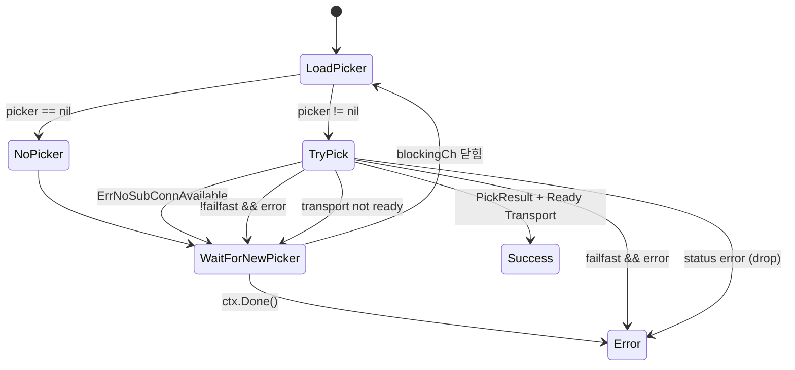
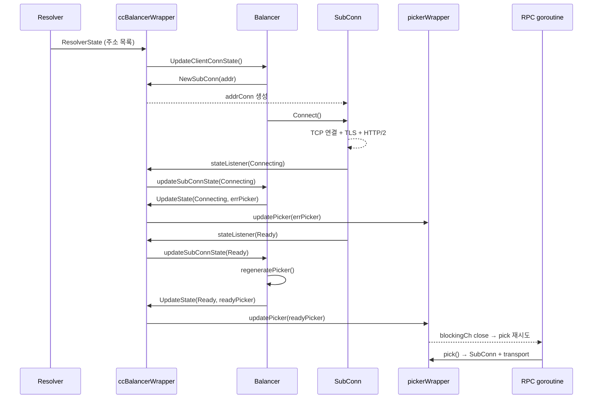
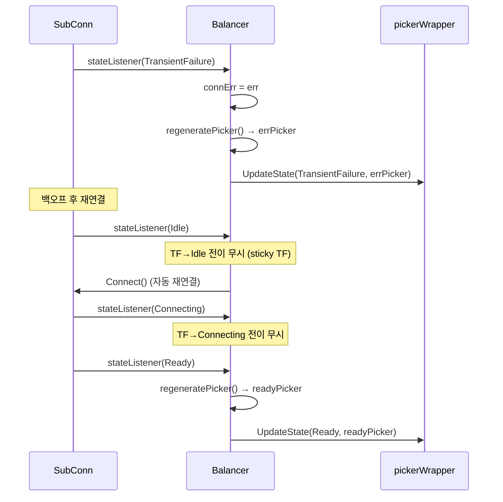

# 08. gRPC-Go 로드 밸런싱 서브시스템 심화 분석

## 개요

gRPC-Go의 로드 밸런싱 서브시스템은 **클라이언트 사이드 로드 밸런싱**을 구현한다.
서버 목록을 Resolver가 발견하면, Balancer가 각 서버와의 연결(SubConn)을 관리하고,
RPC마다 어떤 연결을 사용할지 Picker가 결정한다.

이 문서에서는 다음 핵심 소스 파일들을 분석한다:

| 파일 | 역할 |
|------|------|
| `balancer/balancer.go` | Builder, Balancer, Picker, SubConn 핵심 인터페이스 |
| `balancer/conn_state_evaluator.go` | 연결 상태 집계 로직 |
| `balancer/subconn.go` | SubConn 인터페이스 정의 |
| `balancer/base/base.go`, `balancer/base/balancer.go` | base 밸런서 빌더 및 구현 |
| `balancer/pickfirst/pickfirst.go` | pick_first 밸런서 |
| `balancer/roundrobin/roundrobin.go` | round_robin 밸런서 |
| `balancer/weightedroundrobin/balancer.go` | weighted_round_robin 밸런서 |
| `balancer/weightedroundrobin/scheduler.go` | WRR 스케줄러 (EDF/RR) |
| `balancer/endpointsharding/endpointsharding.go` | 엔드포인트 샤딩 밸런서 |
| `balancer_wrapper.go` | ccBalancerWrapper (ClientConn-Balancer 중개) |
| `picker_wrapper.go` | pickerWrapper (스레드 안전 Picker) |
| `internal/balancer/gracefulswitch/gracefulswitch.go` | 밸런서 전환 |

---

## 1. 전체 아키텍처: Resolver-Balancer-Picker 데이터 흐름

gRPC-Go의 로드 밸런싱은 3개의 계층으로 구성된다.

```
┌─────────────────────────────────────────────────────────────────────┐
│                         ClientConn                                  │
│                                                                     │
│  ┌───────────┐    ┌──────────────────┐    ┌────────────────────┐   │
│  │  Resolver  │───>│ ccBalancerWrapper │───>│   pickerWrapper    │   │
│  │            │    │                  │    │                    │   │
│  │ DNS/xDS/   │    │ ┌──────────────┐ │    │  ┌──────────────┐ │   │
│  │ passthru   │    │ │ graceful     │ │    │  │   Picker     │ │   │
│  │            │    │ │ switch       │ │    │  │  (from LB)   │ │   │
│  │ Addresses  │    │ │  ┌────────┐  │ │    │  └──────────────┘ │   │
│  │ Endpoints  │    │ │  │Balancer│  │ │    │                    │   │
│  │     │      │    │ │  │(LB pol)│  │ │    │  pick() ──> SubConn│   │
│  │     │      │    │ │  └────────┘  │ │    │                    │   │
│  └─────┼──────┘    │ └──────────────┘ │    └────────────────────┘   │
│        │           └──────────────────┘                             │
│        v                    │                        │              │
│  ResolverState         UpdateState()           RPC routing          │
│  (주소 목록)         (상태 + Picker)          (SubConn 선택)        │
└─────────────────────────────────────────────────────────────────────┘
```

### 데이터 흐름 단계

```
1. Resolver가 주소 목록(Endpoints/Addresses) 발견
       │
       v
2. ccBalancerWrapper가 serializer를 통해 순차 전달
       │
       v
3. gracefulswitch.Balancer가 적절한 자식 밸런서로 라우팅
       │
       v
4. Balancer(LB policy)가 SubConn 생성/삭제, 연결 관리
       │
       v
5. SubConn 상태 변화 시 Picker 재생성
       │
       v
6. pickerWrapper에 새 Picker 등록 → blocking RPC 해제
       │
       v
7. RPC 호출 시 Picker.Pick()으로 SubConn 선택 → 트랜스포트 획득
```

**왜 이렇게 3단계로 분리하는가?**

- **Resolver**와 **Balancer** 분리: 서비스 디스커버리 로직과 부하 분산 로직을 독립적으로 교체 가능
- **Balancer**와 **Picker** 분리: Balancer는 연결 관리에 집중하고, Picker는 RPC당 빠른 선택에 집중. Picker.Pick()은 lock-free로 동작 가능
- **불변 Picker 패턴**: 상태가 바뀔 때마다 새 Picker를 생성하여, Pick() 호출 시 lock 없이 스레드 안전성 확보

---

## 2. 핵심 인터페이스 상세

### 2.1 Builder 인터페이스

> 소스: `balancer/balancer.go:222-228`

```go
type Builder interface {
    Build(cc ClientConn, opts BuildOptions) Balancer
    Name() string
}
```

Builder는 팩토리 패턴이다. `Name()`이 반환하는 문자열로 등록/검색되며, `Build()`로 Balancer 인스턴스를 생성한다.

**등록/검색 메커니즘** (`balancer/balancer.go:42-96`):

```go
var m = make(map[string]Builder)  // 전역 레지스트리

func Register(b Builder) {        // init()에서 호출
    name := b.Name()
    m[name] = b
}

func Get(name string) Builder {   // 이름으로 검색
    if b, ok := m[name]; ok {
        return b
    }
    return nil
}
```

**왜 init() 시점에만 등록하는가?**
- 전역 map `m`에 대한 동시성 보호가 없다 (뮤텍스 없음)
- init() 시점은 단일 goroutine에서 실행되므로 안전
- 런타임에 밸런서를 동적으로 추가/삭제하는 유즈케이스는 테스트 외에 없음

### 2.2 Balancer 인터페이스

> 소스: `balancer/balancer.go:344-367`

```go
type Balancer interface {
    UpdateClientConnState(ClientConnState) error  // Resolver → 밸런서
    ResolverError(error)                          // 리졸버 에러 전달
    UpdateSubConnState(SubConn, SubConnState)     // Deprecated
    Close()                                       // 정리
    ExitIdle()                                    // IDLE 탈출
}
```

| 메서드 | 호출 주체 | 설명 |
|--------|----------|------|
| `UpdateClientConnState` | gRPC (ccBalancerWrapper) | 리졸버가 새 주소를 발견했을 때 |
| `ResolverError` | gRPC (ccBalancerWrapper) | 리졸버 오류 시 |
| `UpdateSubConnState` | gRPC (Deprecated) | SubConn 상태 변화 (StateListener로 대체) |
| `Close` | gRPC (ccBalancerWrapper) | 밸런서 종료 |
| `ExitIdle` | gRPC (ClientConn.Connect) | IDLE 상태 탈출 요청 |

**핵심 계약**: `UpdateClientConnState`, `ResolverError`, `UpdateSubConnState`, `Close`는 **동일한 goroutine에서 동기적으로** 호출된다. Picker.Pick()만 아무 goroutine에서 호출될 수 있다.

### 2.3 ClientConn 인터페이스 (밸런서용)

> 소스: `balancer/balancer.go:139-188`

```go
type ClientConn interface {
    NewSubConn([]resolver.Address, NewSubConnOptions) (SubConn, error)
    RemoveSubConn(SubConn)                    // Deprecated
    UpdateAddresses(SubConn, []resolver.Address) // Deprecated
    UpdateState(State)                        // 핵심: 상태 + Picker 전달
    ResolveNow(resolver.ResolveNowOptions)
    Target() string
    MetricsRecorder() estats.MetricsRecorder
}
```

이 인터페이스는 gRPC가 구현하고 Balancer에게 전달한다. Balancer는 이를 통해:

1. `NewSubConn()`: 새 서버 주소로 SubConn 생성
2. `UpdateState()`: 자신의 상태(Connectivity + Picker)를 ClientConn에 보고
3. `ResolveNow()`: 리졸버에게 즉시 재해석 요청

### 2.4 SubConn 인터페이스

> 소스: `balancer/subconn.go:51-91`

```go
type SubConn interface {
    UpdateAddresses([]resolver.Address)        // Deprecated
    Connect()                                  // 연결 시작
    GetOrBuildProducer(ProducerBuilder) (Producer, func())
    Shutdown()                                 // 종료
    RegisterHealthListener(func(SubConnState)) // 헬스 리스너
}
```

SubConn은 하나의 백엔드 서버와의 **논리적 연결**이다. 실제 구현은 `acBalancerWrapper`(`balancer_wrapper.go:269`)로, 내부에 `addrConn`을 감싼다.

**SubConn 생명주기 상태 전이**:

```
                    Connect()
    ┌──────┐      ┌───────────┐      ┌───────┐
    │ Idle │─────>│Connecting │─────>│ Ready │
    └──┬───┘      └─────┬─────┘      └───┬───┘
       ^                │                 │
       │                v                 │
       │         ┌──────────────┐         │
       └─────────│ Transient    │<────────┘
                 │ Failure      │  (연결 끊김)
                 └──────────────┘
                        │
                        v
                 ┌──────────────┐
                 │   Shutdown   │
                 └──────────────┘
```

### 2.5 Picker 인터페이스

> 소스: `balancer/balancer.go:313-334`

```go
type Picker interface {
    Pick(info PickInfo) (PickResult, error)
}
```

**Pick 결과 해석**:

| 반환 값 | 동작 |
|---------|------|
| `(PickResult, nil)` | SubConn으로 RPC 전송 |
| `(_, ErrNoSubConnAvailable)` | 새 Picker가 올 때까지 대기 |
| `(_, status error)` | 해당 status 코드로 RPC 종료 |
| `(_, 기타 error)` | fail-fast면 즉시 실패, wait-for-ready면 대기 |

```go
type PickResult struct {
    SubConn SubConn          // 선택된 연결
    Done    func(DoneInfo)   // RPC 완료 콜백 (가중치 피드백 등에 활용)
    Metadata metadata.MD     // LB 정책이 주입하는 메타데이터
}
```

**왜 Pick()은 non-blocking이어야 하는가?**
- Pick()은 모든 RPC의 핫 경로(hot path)에 있다
- 매 RPC마다 호출되므로 지연 시간 최소화 필수
- blocking이 필요하면 `ErrNoSubConnAvailable`을 반환하고, 밸런서가 새 Picker를 생성하면 자동으로 재시도

### 2.6 ConfigParser 인터페이스

> 소스: `balancer/balancer.go:231-236`

```go
type ConfigParser interface {
    ParseConfig(LoadBalancingConfigJSON json.RawMessage) (serviceconfig.LoadBalancingConfig, error)
}
```

Builder가 이 인터페이스를 추가 구현하면, 서비스 설정(JSON)에서 밸런서별 설정을 파싱할 수 있다. pick_first의 `ShuffleAddressList`, WRR의 `EnableOOBLoadReport` 등이 이를 통해 전달된다.

---

## 3. 밸런서 등록/선택 메커니즘

### 3.1 등록 흐름

```
init() 시점
    │
    ├─ pickfirst.init()   → balancer.Register(pickfirstBuilder{})
    ├─ roundrobin.init()  → balancer.Register(builder{})
    ├─ wrr.init()         → balancer.Register(bb{})
    └─ 사용자 정의        → balancer.Register(customBuilder)
```

### 3.2 선택 흐름

밸런서 선택은 서비스 설정(service config)을 통해 이루어진다:

```
1. Resolver가 ServiceConfig 반환 (JSON)
       │
       v
2. ClientConn이 ServiceConfig 파싱
   → loadBalancingConfig 필드에서 밸런서 이름 추출
       │
       v
3. balancer.Get(name)으로 Builder 검색
       │
       v
4. gracefulswitch.Balancer가 Builder.Build()로 밸런서 생성
```

기본 밸런서는 `pick_first`다. 서비스 설정이 없으면 pick_first가 사용된다.

---

## 4. ConnectivityStateEvaluator: 상태 집계

> 소스: `balancer/conn_state_evaluator.go:27-74`

여러 SubConn의 상태를 하나의 집계(aggregated) 상태로 변환한다.

```go
type ConnectivityStateEvaluator struct {
    numReady            uint64
    numConnecting       uint64
    numTransientFailure uint64
    numIdle             uint64
}
```

**집계 규칙** (우선순위 순):

```
1. numReady > 0           → Ready
2. numConnecting > 0      → Connecting
3. numIdle > 0            → Idle
4. 그 외 (또는 비어 있음)  → TransientFailure
```

```go
func (cse *ConnectivityStateEvaluator) CurrentState() connectivity.State {
    if cse.numReady > 0 {
        return connectivity.Ready
    }
    if cse.numConnecting > 0 {
        return connectivity.Connecting
    }
    if cse.numIdle > 0 {
        return connectivity.Idle
    }
    return connectivity.TransientFailure
}
```

**왜 이 우선순위인가?**
- 하나라도 Ready면 RPC를 보낼 수 있으므로 Ready
- Ready가 없어도 Connecting이면 곧 연결될 가능성이 있으므로 Connecting
- 모두 Idle이면 연결 시도조차 안 했으므로 Idle
- 나머지는 모두 실패 상태

---

## 5. base 밸런서: SubConn 관리의 기본 프레임워크

### 5.1 설계 의도

> 소스: `balancer/base/base.go:19-31`

base 패키지는 **모든 주소에 하나씩 SubConn을 만들고, READY인 것들만 Picker에 전달**하는 공통 로직을 추상화한다. 개발자는 `PickerBuilder` 인터페이스만 구현하면 자신만의 밸런서를 만들 수 있다.

```go
type PickerBuilder interface {
    Build(info PickerBuildInfo) balancer.Picker
}

type PickerBuildInfo struct {
    ReadySCs map[balancer.SubConn]SubConnInfo
}
```

### 5.2 baseBuilder와 baseBalancer

> 소스: `balancer/base/balancer.go:33-75`

```go
type baseBuilder struct {
    name          string
    pickerBuilder PickerBuilder
    config        Config
}

type baseBalancer struct {
    cc            balancer.ClientConn
    pickerBuilder PickerBuilder
    csEvltr       *balancer.ConnectivityStateEvaluator
    state         connectivity.State
    subConns      *resolver.AddressMapV2[balancer.SubConn]  // 주소 → SubConn
    scStates      map[balancer.SubConn]connectivity.State   // SubConn → 상태
    picker        balancer.Picker
    config        Config
    resolverErr   error
    connErr       error
}
```

**왜 두 개의 맵을 유지하는가?**
- `subConns` (주소 → SubConn): 리졸버 업데이트 시 주소 기반으로 SubConn 추가/삭제를 빠르게 처리
- `scStates` (SubConn → 상태): SubConn 상태 변경 콜백에서 빠르게 이전 상태를 조회

### 5.3 UpdateClientConnState: 주소 목록 동기화

> 소스: `balancer/base/balancer.go:95-145`

```go
func (b *baseBalancer) UpdateClientConnState(s balancer.ClientConnState) error {
    b.resolverErr = nil
    addrsSet := resolver.NewAddressMapV2[any]()

    // 1단계: 새 주소에 대해 SubConn 생성
    for _, a := range s.ResolverState.Addresses {
        addrsSet.Set(a, nil)
        if _, ok := b.subConns.Get(a); !ok {
            // 새 주소 → SubConn 생성 + Connect()
            sc, err := b.cc.NewSubConn([]resolver.Address{a}, opts)
            b.subConns.Set(a, sc)
            b.scStates[sc] = connectivity.Idle
            b.csEvltr.RecordTransition(connectivity.Shutdown, connectivity.Idle)
            sc.Connect()
        }
    }

    // 2단계: 사라진 주소의 SubConn 종료
    for a, sc := range b.subConns.All() {
        if _, ok := addrsSet.Get(a); !ok {
            sc.Shutdown()
            b.subConns.Delete(a)
        }
    }

    // 3단계: Picker 재생성 및 상태 보고
    b.regeneratePicker()
    b.cc.UpdateState(balancer.State{
        ConnectivityState: b.state,
        Picker:            b.picker,
    })
    return nil
}
```

이 로직의 핵심은 **기존 연결 재사용**이다. 이미 존재하는 주소의 SubConn은 유지하고, 새 주소만 추가하며, 사라진 주소만 제거한다.

### 5.4 regeneratePicker: Picker 재생성 로직

> 소스: `balancer/base/balancer.go:165-179`

```go
func (b *baseBalancer) regeneratePicker() {
    if b.state == connectivity.TransientFailure {
        b.picker = NewErrPicker(b.mergeErrors())
        return
    }
    readySCs := make(map[balancer.SubConn]SubConnInfo)
    for addr, sc := range b.subConns.All() {
        if st, ok := b.scStates[sc]; ok && st == connectivity.Ready {
            readySCs[sc] = SubConnInfo{Address: addr}
        }
    }
    b.picker = b.pickerBuilder.Build(PickerBuildInfo{ReadySCs: readySCs})
}
```

**Picker 재생성 조건** (`balancer/base/balancer.go:227-230`):
1. SubConn이 Ready 상태로 진입하거나 빠져나갈 때
2. 집계 상태가 TransientFailure일 때 (에러 메시지 갱신)

**왜 TransientFailure이면 errPicker를 사용하는가?**
- TransientFailure 상태에서는 READY SubConn이 없으므로 정상적인 Picker를 만들 수 없다
- 에러 Picker를 통해 wait-for-ready가 아닌 RPC를 즉시 실패시킬 수 있다

### 5.5 SubConn 상태 변경 처리

> 소스: `balancer/base/balancer.go:186-232`

```go
func (b *baseBalancer) updateSubConnState(sc balancer.SubConn, state balancer.SubConnState) {
    s := state.ConnectivityState
    oldS, ok := b.scStates[sc]

    // TransientFailure에서 Connecting/Idle로의 전이 무시
    if oldS == connectivity.TransientFailure &&
        (s == connectivity.Connecting || s == connectivity.Idle) {
        if s == connectivity.Idle {
            sc.Connect()  // 자동 재연결
        }
        return
    }

    b.scStates[sc] = s
    switch s {
    case connectivity.Idle:
        sc.Connect()  // Idle 상태면 즉시 Connect
    case connectivity.Shutdown:
        delete(b.scStates, sc)
    case connectivity.TransientFailure:
        b.connErr = state.ConnectionError
    }

    b.state = b.csEvltr.RecordTransition(oldS, s)
    // Ready 진입/탈출 또는 TransientFailure면 Picker 재생성
    if (s == connectivity.Ready) != (oldS == connectivity.Ready) ||
        b.state == connectivity.TransientFailure {
        b.regeneratePicker()
    }
    b.cc.UpdateState(balancer.State{ConnectivityState: b.state, Picker: b.picker})
}
```

**왜 TransientFailure → Connecting/Idle 전이를 무시하는가?**
> 다수의 백엔드가 모두 다운된 경우, 각 SubConn이 TransientFailure → Connecting을 반복하면 집계 상태가 계속 Connecting으로 보고된다. 이는 실제로 사용 가능한 연결이 없음에도 "연결 중"이라는 잘못된 상태를 전달하게 된다. TransientFailure를 "sticky"하게 유지함으로써, 실제 Ready가 될 때만 상태가 변경된다.

---

## 6. pick_first: 첫 번째 주소 선택과 Happy Eyeballs

### 6.1 설계 철학

> 소스: `balancer/pickfirst/pickfirst.go`

pick_first는 **가장 단순하면서도 가장 중요한 밸런서**다. 주소 목록에서 첫 번째 연결 가능한 서버를 찾아 모든 RPC를 해당 서버로 보낸다. gRPC-Go에서 **"universal leaf policy"**로 정의되며, 다른 밸런서(round_robin, WRR)의 하위 정책으로도 사용된다.

### 6.2 핵심 구조체

> 소스: `balancer/pickfirst/pickfirst.go:185-207`

```go
type pickfirstBalancer struct {
    cc              balancer.ClientConn
    target          string
    metricsRecorder expstats.MetricsRecorder

    mu                    sync.Mutex
    state                 connectivity.State
    subConns              *resolver.AddressMapV2[*scData]
    addressList           addressList        // 순서가 있는 주소 목록
    firstPass             bool               // 첫 번째 연결 시도 중 여부
    numTF                 int                // TransientFailure 카운터
    cancelConnectionTimer func()             // Happy Eyeballs 타이머
    healthCheckingEnabled bool
}
```

### 6.3 주소 처리: 중복 제거와 인터리빙

> 소스: `balancer/pickfirst/pickfirst.go:416-467`

```go
newAddrs = deDupAddresses(newAddrs)      // 중복 주소 제거
newAddrs = interleaveAddresses(newAddrs) // IPv4/IPv6 인터리빙
```

**인터리빙(Interleaving)은 왜 필요한가?** (RFC 8305 "Happy Eyeballs v2" 구현)

```
입력: [v6-1, v6-2, v6-3, v4-1, v4-2]
출력: [v6-1, v4-1, v6-2, v4-2, v6-3]
```

IPv6와 IPv4 주소를 번갈아 배치하여, IPv6 우선이면서도 IPv6 연결 실패 시 빠르게 IPv4로 전환할 수 있다.

### 6.4 Happy Eyeballs: 병렬 연결 시도

> 소스: `balancer/pickfirst/pickfirst.go:536-617`

```go
const connectionDelayInterval = 250 * time.Millisecond
```

```
requestConnectionLocked()
    │
    ├── 현재 주소의 SubConn이 Idle이면 → Connect() + 250ms 타이머 시작
    ├── 현재 주소의 SubConn이 Connecting이면 → 타이머만 시작
    ├── 현재 주소의 SubConn이 TransientFailure이면 → 다음 주소로 이동
    │
    └── 타이머 만료 시 → 다음 주소로 이동, requestConnectionLocked() 재귀

scheduleNextConnectionLocked()
    │
    └── 250ms 후 다음 주소로 increment → requestConnectionLocked()
```

**흐름도: Happy Eyeballs 연결 시도**

```
시간축 ──────────────────────────────────────────────>

주소 1 (v6): ├──── Connect ────── TF ─┐
             0ms                       │
주소 2 (v4): ├────── Connect ──── Ready! ──> 선택!
             250ms                     │
주소 3 (v6): ├──────── Connect ────── X │(Shutdown: 주소2가 Ready)
             500ms
```

### 6.5 SubConn Ready 시: 나머지 종료

> 소스: `balancer/pickfirst/pickfirst.go:521-530`

```go
func (b *pickfirstBalancer) shutdownRemainingLocked(selected *scData) {
    b.cancelConnectionTimer()
    for _, sd := range b.subConns.All() {
        if sd.subConn != selected.subConn {
            sd.subConn.Shutdown()
        }
    }
    b.subConns = resolver.NewAddressMapV2[*scData]()
    b.subConns.Set(selected.addr, selected)
}
```

하나의 SubConn이 Ready가 되면 **나머지 모든 SubConn을 Shutdown**하고, 오직 선택된 SubConn만 유지한다.

### 6.6 pick_first의 Picker

> 소스: `balancer/pickfirst/pickfirst.go:852-870`

```go
type picker struct {
    result balancer.PickResult
    err    error
}

func (p *picker) Pick(balancer.PickInfo) (balancer.PickResult, error) {
    return p.result, p.err
}
```

pick_first의 Picker는 극도로 단순하다. 항상 동일한 SubConn을 반환하거나, 에러를 반환한다.

**idlePicker**는 특별하다:

```go
type idlePicker struct {
    exitIdle func()
}

func (i *idlePicker) Pick(balancer.PickInfo) (balancer.PickResult, error) {
    i.exitIdle()  // 첫 RPC가 올 때 연결 시작
    return balancer.PickResult{}, balancer.ErrNoSubConnAvailable
}
```

**왜 idlePicker가 필요한가?**

Ready SubConn이 끊어지면 pick_first는 IDLE 상태로 돌아간다. 새 RPC가 오기 전까지 재연결을 시도하지 않음으로써, 백엔드가 한동안 없는 상황에서 불필요한 연결 시도를 방지한다. 첫 번째 RPC가 Pick()을 호출하면 그때 `ExitIdle()`을 트리거한다.

---

## 7. round_robin: 순환 선택과 endpointsharding

### 7.1 현재 구현 (endpointsharding 기반)

> 소스: `balancer/roundrobin/roundrobin.go:39-73`

```go
func init() {
    balancer.Register(builder{})
}

func (bb builder) Build(cc balancer.ClientConn, opts balancer.BuildOptions) balancer.Balancer {
    childBuilder := balancer.Get(pickfirst.Name).Build
    bal := &rrBalancer{
        cc:       cc,
        Balancer: endpointsharding.NewBalancer(cc, opts, childBuilder, endpointsharding.Options{}),
    }
    return bal
}
```

**핵심 설계**: round_robin은 직접 SubConn을 관리하지 않는다. 대신 `endpointsharding.NewBalancer`를 사용하여 각 엔드포인트마다 **pick_first 자식 밸런서**를 만든다.

```
round_robin (rrBalancer)
    │
    └── endpointsharding
            │
            ├── endpoint-1 → pick_first (SubConn 1개)
            ├── endpoint-2 → pick_first (SubConn 1개)
            └── endpoint-3 → pick_first (SubConn 1개)
```

### 7.2 endpointsharding의 라운드 로빈 Picker

> 소스: `balancer/endpointsharding/endpointsharding.go:306-319`

```go
type pickerWithChildStates struct {
    pickers     []balancer.Picker
    childStates []ChildState
    next        uint32
}

func (p *pickerWithChildStates) Pick(info balancer.PickInfo) (balancer.PickResult, error) {
    nextIndex := atomic.AddUint32(&p.next, 1)
    picker := p.pickers[nextIndex%uint32(len(p.pickers))]
    return picker.Pick(info)
}
```

`atomic.AddUint32`로 **lock-free 라운드 로빈**을 구현한다. 엄밀한 순환이 아닌 근사적 균등 분배(approximate fair distribution)를 제공하지만, 고성능이 요구되는 RPC 경로에서는 이 트레이드오프가 합리적이다.

### 7.3 endpointsharding의 상태 집계

> 소스: `balancer/endpointsharding/endpointsharding.go:245-304`

```go
func (es *endpointSharding) updateState() {
    var readyPickers, connectingPickers, idlePickers, transientFailurePickers []balancer.Picker

    // 자식들의 상태별로 Picker를 분류
    for _, child := range children.All() {
        switch childState.State.ConnectivityState {
        case connectivity.Ready:
            readyPickers = append(readyPickers, childPicker)
        case connectivity.Connecting:
            connectingPickers = append(connectingPickers, childPicker)
        case connectivity.Idle:
            idlePickers = append(idlePickers, childPicker)
        case connectivity.TransientFailure:
            transientFailurePickers = append(transientFailurePickers, childPicker)
        }
    }

    // 가장 높은 우선순위 상태의 Picker들만 사용
    if len(readyPickers) >= 1 {
        aggState = connectivity.Ready
        pickers = readyPickers
    } else if len(connectingPickers) >= 1 { ... }
    // ...
}
```

**왜 READY Picker들만 라운드 로빈하는가?**
- 여러 상태의 Picker를 섞으면, CONNECTING이나 IDLE SubConn으로 RPC를 보내려 시도하게 된다
- READY인 자식들만 선택함으로써, 항상 즉시 사용 가능한 연결로만 라우팅

### 7.4 과거 구현과의 비교 (base 밸런서 기반)

이전 round_robin은 `base.NewBalancerBuilder`를 사용했다:

```go
// 과거 구현 (참고용)
func init() {
    balancer.Register(base.NewBalancerBuilder(Name, &rrPickerBuilder{}, base.Config{}))
}
```

현재는 endpointsharding 기반으로 전환되었다. 이유:

1. **엔드포인트 단위 관리**: 하나의 엔드포인트에 여러 주소가 있을 때, pick_first가 Happy Eyeballs로 최적 주소를 선택
2. **헬스 체크 통합**: pick_first의 RegisterHealthListener를 활용하여 엔드포인트별 건강 상태 모니터링 가능
3. **outlier detection**: 엔드포인트 단위 장애 감지가 가능해짐

---

## 8. weighted_round_robin: 가중치 기반 선택과 ORCA 피드백

### 8.1 설계 원리

> 소스: `balancer/weightedroundrobin/balancer.go` (gRFC A58)

WRR(Weighted Round Robin)은 서버의 **실시간 부하 정보**를 기반으로 트래픽을 비례 분배한다. 서버가 자신의 CPU 사용률, QPS, 에러율을 보고하면, 클라이언트가 이를 가중치로 변환하여 분배 비율을 조정한다.

```
가중치 = QPS / (utilization + errorRate * errorUtilizationPenalty)

여기서:
  - utilization = application_utilization 또는 cpu_utilization
  - errorRate = EPS / QPS
  - errorUtilizationPenalty = 설정값 (기본 1.0)
```

### 8.2 설정 파라미터

> 소스: `balancer/weightedroundrobin/config.go:26-59`

```go
type lbConfig struct {
    EnableOOBLoadReport    bool              // OOB 보고 활성화 (기본: false)
    OOBReportingPeriod     Duration          // OOB 보고 주기 (기본: 10s)
    BlackoutPeriod         Duration          // 블랙아웃 기간 (기본: 10s)
    WeightExpirationPeriod Duration          // 가중치 만료 기간 (기본: 3분)
    WeightUpdatePeriod     Duration          // 스케줄러 갱신 주기 (기본: 1s)
    ErrorUtilizationPenalty float64          // 에러 패널티 계수 (기본: 1.0)
}
```

| 파라미터 | 기본값 | 설명 |
|----------|--------|------|
| `EnableOOBLoadReport` | false | true면 ORCA OOB 스트림으로 보고, false면 per-RPC 트레일러로 |
| `BlackoutPeriod` | 10s | 엔드포인트가 처음 연결된 후 이 기간 동안 가중치 무시 |
| `WeightExpirationPeriod` | 3min | 이 기간 이상 보고가 없으면 가중치 만료 |
| `WeightUpdatePeriod` | 1s | 스케줄러 가중치 재계산 주기 (최소 100ms) |
| `ErrorUtilizationPenalty` | 1.0 | 에러율에 대한 가중치 감소 계수 |

### 8.3 wrrBalancer 구조

> 소스: `balancer/weightedroundrobin/balancer.go:204-222`

```go
type wrrBalancer struct {
    child               balancer.Balancer       // endpointsharding
    balancer.ClientConn                          // 임베딩하여 NewSubConn 가로채기
    logger              *grpclog.PrefixLogger
    target              string
    metricsRecorder     estats.MetricsRecorder

    mu               sync.Mutex
    cfg              *lbConfig
    stopPicker       *grpcsync.Event
    addressWeights   *resolver.AddressMapV2[*endpointWeight]
    endpointToWeight *resolver.EndpointMap[*endpointWeight]
    scToWeight       map[balancer.SubConn]*endpointWeight
}
```

**아키텍처: round_robin과 유사하나 가중치 계층 추가**

```
weighted_round_robin (wrrBalancer)
    │
    ├── addressWeights / endpointToWeight   ← 가중치 추적
    │
    └── endpointsharding (child)
            │
            ├── endpoint-1 → pick_first + ORCA 리스너
            ├── endpoint-2 → pick_first + ORCA 리스너
            └── endpoint-3 → pick_first + ORCA 리스너
```

### 8.4 부하 보고 수신: per-RPC vs OOB

**per-RPC 보고** (기본값):

> 소스: `balancer/weightedroundrobin/balancer.go:456-479`

```go
func (p *picker) Pick(info balancer.PickInfo) (balancer.PickResult, error) {
    sched := *(*scheduler)(atomic.LoadPointer(&p.scheduler))
    pickedPicker := p.weightedPickers[sched.nextIndex()]
    pr, err := pickedPicker.picker.Pick(info)

    if !p.cfg.EnableOOBLoadReport {
        oldDone := pr.Done
        pr.Done = func(info balancer.DoneInfo) {
            if load, ok := info.ServerLoad.(*v3orcapb.OrcaLoadReport); ok && load != nil {
                pickedPicker.weightedEndpoint.OnLoadReport(load)
            }
            if oldDone != nil {
                oldDone(info)
            }
        }
    }
    return pr, nil
}
```

per-RPC 방식에서는 `Done` 콜백을 래핑하여, RPC 완료 시 서버가 트레일러로 보낸 ORCA 로드 리포트를 수신한다.

**OOB(Out-of-Band) 보고**:

> 소스: `balancer/weightedroundrobin/balancer.go:597-613`

```go
func (w *endpointWeight) updateORCAListener(cfg *lbConfig) {
    if w.stopORCAListener != nil {
        w.stopORCAListener()
    }
    if !cfg.EnableOOBLoadReport {
        w.stopORCAListener = nil
        return
    }
    opts := orca.OOBListenerOptions{ReportInterval: time.Duration(cfg.OOBReportingPeriod)}
    w.stopORCAListener = orca.RegisterOOBListener(w.pickedSC, w, opts)
}
```

OOB 방식에서는 별도의 ORCA gRPC 스트림을 통해 주기적으로 부하 보고를 수신한다.

**두 방식의 비교**:

| 특성 | per-RPC | OOB |
|------|---------|-----|
| 보고 시점 | 각 RPC 완료 시 | 설정된 주기마다 |
| 오버헤드 | RPC 트레일러에 포함 | 별도 gRPC 스트림 |
| 정확도 | RPC 빈도에 의존 | 일정한 주기로 안정적 |
| 설정 | 기본값 | `EnableOOBLoadReport: true` |

### 8.5 가중치 계산

> 소스: `balancer/weightedroundrobin/balancer.go:546-575`

```go
func (w *endpointWeight) OnLoadReport(load *v3orcapb.OrcaLoadReport) {
    utilization := load.ApplicationUtilization
    if utilization == 0 {
        utilization = load.CpuUtilization
    }
    if utilization == 0 || load.RpsFractional == 0 {
        return  // 유효하지 않은 보고 무시
    }

    errorRate := load.Eps / load.RpsFractional
    w.weightVal = load.RpsFractional / (utilization + errorRate*w.cfg.ErrorUtilizationPenalty)
    w.lastUpdated = internal.TimeNow()
    if w.nonEmptySince.Equal(time.Time{}) {
        w.nonEmptySince = w.lastUpdated
    }
}
```

**가중치 유효성 판정** (`weight()` 메서드, `balancer.go:620-657`):

```
                        블랙아웃 기간          유효 기간          만료
    ────┤──────────────────┤────────────────────────┤──────────────┤───>
   연결 시작           nonEmptySince                           lastUpdated
                                                            + expirationPeriod

    가중치 = 0          가중치 = 0              가중치 = weightVal     가중치 = 0
    (보고 없음)         (블랙아웃)              (사용 가능)            (만료)
```

### 8.6 스케줄러: EDF vs RR 폴백

> 소스: `balancer/weightedroundrobin/scheduler.go`

```go
type scheduler interface {
    nextIndex() int
}
```

스케줄러 선택 로직 (`newScheduler`, `scheduler.go:34-90`):

```
모든 가중치 수집
    │
    ├── 엔드포인트 1개 → rrScheduler (폴백)
    ├── n-1개 이상 가중치 0 → rrScheduler (폴백)
    ├── 모든 가중치 동일 → rrScheduler (폴백)
    └── 그 외 → edfScheduler (가중치 기반)
```

**EDF(Earliest Deadline First) 스케줄러**:

> 소스: `balancer/weightedroundrobin/scheduler.go:94-133`

```go
type edfScheduler struct {
    inc     func() uint32
    weights []uint16
}

func (s *edfScheduler) nextIndex() int {
    for {
        idx := uint64(s.inc())
        backendIndex := idx % uint64(len(s.weights))
        generation := idx / uint64(len(s.weights))
        weight := uint64(s.weights[backendIndex])

        mod := uint64(weight*generation + backendIndex*offset) % maxWeight
        if mod < maxWeight-weight {
            continue  // 이번 generation에서는 스킵
        }
        return int(backendIndex)
    }
}
```

이 알고리즘은 grpc-c++의 Static Stride Scheduler를 Go로 포팅한 것이다.

**동작 원리**:

```
가중치: [높음=80%, 중간=50%, 낮음=20%]

generation 0: [높음O, 중간O, 낮음X]
generation 1: [높음O, 중간X, 낮음X]
generation 2: [높음O, 중간O, 낮음O]
generation 3: [높음O, 중간X, 낮음X]
generation 4: [높음O, 중간O, 낮음X]
...

→ 높음에 ~80%, 중간에 ~50%, 낮음에 ~20% 비율로 선택
```

**RR 폴백 스케줄러**:

```go
type rrScheduler struct {
    inc    func() uint32
    numSCs uint32
}

func (s *rrScheduler) nextIndex() int {
    return int(s.inc() % s.numSCs)
}
```

가중치가 유효하지 않을 때 단순 라운드 로빈으로 폴백한다.

### 8.7 Picker의 주기적 스케줄러 갱신

> 소스: `balancer/weightedroundrobin/balancer.go:490-509`

```go
func (p *picker) start(stopPicker *grpcsync.Event) {
    p.regenerateScheduler()
    if len(p.weightedPickers) == 1 {
        return  // 엔드포인트 1개면 갱신 불필요
    }

    go func() {
        ticker := time.NewTicker(time.Duration(p.cfg.WeightUpdatePeriod))
        defer ticker.Stop()
        for {
            select {
            case <-stopPicker.Done():
                return
            case <-ticker.C:
                p.regenerateScheduler()  // 주기적으로 가중치 재계산
            }
        }
    }()
}
```

**왜 별도 goroutine에서 스케줄러를 갱신하는가?**
- 가중치 보고는 비동기적으로 도착하므로, Picker 생성 시점의 가중치가 이후 최적이 아닐 수 있다
- `WeightUpdatePeriod` (기본 1초)마다 최신 가중치로 스케줄러를 원자적(atomic)으로 교체
- `unsafe.Pointer`와 `atomic.StorePointer`로 lock-free 갱신

---

## 9. ccBalancerWrapper: ClientConn과 밸런서 간 중개

### 9.1 역할과 구조

> 소스: `balancer_wrapper.go:61-79`

```go
type ccBalancerWrapper struct {
    cc               *ClientConn
    opts             balancer.BuildOptions
    serializer       *grpcsync.CallbackSerializer  // 핵심: 직렬화
    serializerCancel context.CancelFunc

    curBalancerName string
    balancer        *gracefulswitch.Balancer

    mu     sync.Mutex
    closed bool
}
```

ccBalancerWrapper는 **이중 역할**을 수행한다:

1. **ClientConn → Balancer 방향**: ClientConn의 호출을 serializer를 통해 순차적으로 밸런서에 전달
2. **Balancer → ClientConn 방향**: `balancer.ClientConn` 인터페이스를 구현하여 밸런서가 SubConn 생성, 상태 업데이트 등을 할 수 있게 함

```
            ClientConn                ccBalancerWrapper              Balancer
    ┌─────────────────┐         ┌─────────────────────┐       ┌──────────────┐
    │                 │         │                     │       │              │
    │ updateClient ──>│ ──────> │ serializer.Schedule  │ ───> │ UpdateClient │
    │ ConnState()     │         │     (순차 실행)      │       │ ConnState()  │
    │                 │         │                     │       │              │
    │ resolverError ─>│ ──────> │ serializer.TrySchedule│ ──> │ ResolverError│
    │                 │         │                     │       │              │
    │                 │ <────── │ NewSubConn()        │ <──── │ NewSubConn() │
    │ newAddrConn()   │         │                     │       │              │
    │                 │ <────── │ UpdateState()       │ <──── │ UpdateState()│
    │ updatePicker()  │         │                     │       │              │
    │ updateState()   │         │                     │       │              │
    └─────────────────┘         └─────────────────────┘       └──────────────┘
```

### 9.2 직렬화 패턴 (CallbackSerializer)

> 소스: `balancer_wrapper.go:111-139`

```go
func (ccb *ccBalancerWrapper) updateClientConnState(ccs *balancer.ClientConnState) error {
    errCh := make(chan error)
    uccs := func(ctx context.Context) {
        defer close(errCh)
        if ctx.Err() != nil || ccb.balancer == nil {
            return
        }
        err := ccb.balancer.UpdateClientConnState(*ccs)
        errCh <- err
    }
    onFailure := func() { close(errCh) }
    ccb.serializer.ScheduleOr(uccs, onFailure)
    return <-errCh  // 동기 대기
}
```

**왜 serializer를 사용하는가?**
- ClientConn의 메서드(updateClientConnState, resolverError 등)는 **여러 goroutine에서 동시에** 호출될 수 있다
- 하지만 Balancer 인터페이스의 계약은 **동일 goroutine에서 순차 호출**을 보장한다
- CallbackSerializer가 이 중개 역할을 하여, 동시 호출을 단일 goroutine 큐로 변환

```
goroutine A ──> resolverError()  ──┐
                                    │    serializer 큐
goroutine B ──> updateClientConn ──┤──> [task1, task2, task3] ──> 단일 goroutine
                                    │        순차 실행
goroutine C ──> exitIdle() ────────┘
```

### 9.3 NewSubConn: SubConn 생성

> 소스: `balancer_wrapper.go:180-208`

```go
func (ccb *ccBalancerWrapper) NewSubConn(addrs []resolver.Address, opts balancer.NewSubConnOptions) (balancer.SubConn, error) {
    ccb.cc.mu.Lock()
    defer ccb.cc.mu.Unlock()

    ccb.mu.Lock()
    if ccb.closed {
        ccb.mu.Unlock()
        return nil, fmt.Errorf("balancer is being closed; no new SubConns allowed")
    }
    ccb.mu.Unlock()

    ac, err := ccb.cc.newAddrConnLocked(addrs, opts)
    acbw := &acBalancerWrapper{
        ccb:           ccb,
        ac:            ac,
        producers:     make(map[balancer.ProducerBuilder]*refCountedProducer),
        stateListener: opts.StateListener,
        healthData:    newHealthData(connectivity.Idle),
    }
    ac.acbw = acbw
    return acbw, nil
}
```

반환되는 `acBalancerWrapper`가 `balancer.SubConn` 인터페이스를 구현한다.

### 9.4 UpdateState: Picker와 상태 전파

> 소스: `balancer_wrapper.go:223-248`

```go
func (ccb *ccBalancerWrapper) UpdateState(s balancer.State) {
    ccb.cc.mu.Lock()
    defer ccb.cc.mu.Unlock()
    // ...
    // Picker를 먼저 업데이트하고, 그 다음 상태를 업데이트
    ccb.cc.pickerWrapper.updatePicker(s.Picker)
    ccb.cc.csMgr.updateState(s.ConnectivityState)
}
```

**왜 Picker를 상태보다 먼저 업데이트하는가?**
> 소스 주석: "Update picker before updating state. Even though the ordering here does not matter, it can lead to multiple calls of Pick in the common start-up case where we wait for ready and then perform an RPC."

시작 시 wait-for-ready RPC가 있을 때, 상태를 먼저 Ready로 바꾸면 아직 "connecting" picker가 남아있는 상태에서 Pick이 호출될 수 있다. Picker를 먼저 교체하면 이런 불필요한 재시도를 방지한다.

### 9.5 acBalancerWrapper: SubConn 구현체

> 소스: `balancer_wrapper.go:269-284`

```go
type acBalancerWrapper struct {
    ac            *addrConn          // 실제 네트워크 연결
    ccb           *ccBalancerWrapper // 소속 밸런서 래퍼
    stateListener func(balancer.SubConnState)

    producersMu sync.Mutex
    producers   map[balancer.ProducerBuilder]*refCountedProducer

    healthMu   sync.Mutex
    healthData *healthData
}
```

주요 메서드:

```go
func (acbw *acBalancerWrapper) Connect() {
    go acbw.ac.connect()  // 비동기 연결 시작
}

func (acbw *acBalancerWrapper) Shutdown() {
    acbw.closeProducers()
    acbw.ccb.cc.removeAddrConn(acbw.ac, errConnDrain)
}
```

**상태 변경 전파** (`balancer_wrapper.go:307-339`):

```go
func (acbw *acBalancerWrapper) updateState(s connectivity.State, err error) {
    acbw.ccb.serializer.TrySchedule(func(ctx context.Context) {
        // 1. 모든 Producer 무효화
        acbw.closeProducers()
        // 2. healthData 초기화 (헬스 리스너 무효화)
        acbw.healthData = newHealthData(scs.ConnectivityState)
        // 3. StateListener 콜백 호출
        acbw.stateListener(scs)
    })
}
```

**왜 상태 변경 시 Producer를 닫는가?**
- Producer(예: ORCA listener)는 활성 연결에 의존한다
- 연결 상태가 바뀌면(예: Ready → TransientFailure) 기존 Producer의 스트림이 무효화됨
- 새 연결이 Ready가 되면 필요에 따라 Producer가 다시 생성됨

---

## 10. pickerWrapper: 스레드 안전 Picker와 Blocking Pick

### 10.1 구조

> 소스: `picker_wrapper.go:36-59`

```go
type pickerGeneration struct {
    picker     balancer.Picker
    blockingCh chan struct{}  // 이 Picker가 무효화될 때 닫힘
}

type pickerWrapper struct {
    pickerGen atomic.Pointer[pickerGeneration]
}
```

**왜 atomic.Pointer를 사용하는가?**
- `pickerWrapper.pick()`은 모든 RPC goroutine에서 동시에 호출된다
- `updatePicker()`는 밸런서 goroutine에서 호출된다
- 뮤텍스 대신 원자적 포인터 교체로 **lock-free** 읽기/쓰기

### 10.2 updatePicker: Picker 교체

> 소스: `picker_wrapper.go:63-69`

```go
func (pw *pickerWrapper) updatePicker(p balancer.Picker) {
    old := pw.pickerGen.Swap(&pickerGeneration{
        picker:     p,
        blockingCh: make(chan struct{}),
    })
    close(old.blockingCh)  // 대기 중인 RPC 깨우기
}
```

`close(old.blockingCh)`가 핵심이다. 이전 Picker로 대기 중이던 모든 RPC goroutine이 깨어나서 새 Picker로 다시 Pick을 시도한다.

### 10.3 pick: Blocking Pick 루프

> 소스: `picker_wrapper.go:105-203`

```go
func (pw *pickerWrapper) pick(ctx context.Context, failfast bool, info balancer.PickInfo) (pick, error) {
    var ch chan struct{}
    var lastPickErr error

    for {
        pg := pw.pickerGen.Load()
        if pg == nil {
            return pick{}, ErrClientConnClosing
        }

        if pg.picker == nil {
            ch = pg.blockingCh  // Picker 없으면 대기
        }

        if ch == pg.blockingCh {
            select {
            case <-ctx.Done():         // 타임아웃/취소
                return pick{}, status.Error(codes.DeadlineExceeded, ...)
            case <-ch:                 // 새 Picker 도착
            }
            continue
        }

        // Pick 시도
        pickResult, err := p.Pick(info)
        if err != nil {
            if err == balancer.ErrNoSubConnAvailable {
                continue  // 새 Picker 대기
            }
            if st, ok := status.FromError(err); ok {
                return pick{}, dropError{error: err}  // 상태 에러 → RPC 종료
            }
            if !failfast {
                lastPickErr = err
                continue  // wait-for-ready → 대기
            }
            return pick{}, status.Error(codes.Unavailable, err.Error())
        }

        // SubConn이 Ready인지 확인
        acbw := pickResult.SubConn.(*acBalancerWrapper)
        if t := acbw.ac.getReadyTransport(); t != nil {
            return pick{transport: t, result: pickResult}, nil
        }
        // SubConn이 Ready가 아니면 루프 반복 (새 Picker 대기)
    }
}
```

**Blocking Pick의 상태 머신**:



### 10.4 close와 reset

```go
func (pw *pickerWrapper) close() {
    old := pw.pickerGen.Swap(nil)  // nil = 닫힘 상태
    close(old.blockingCh)
}

func (pw *pickerWrapper) reset() {
    old := pw.pickerGen.Swap(&pickerGeneration{blockingCh: make(chan struct{})})
    close(old.blockingCh)
}
```

- `close()`: ClientConn 종료 시. Swap(nil)로 이후 모든 pick()이 `ErrClientConnClosing` 반환
- `reset()`: IDLE 모드 진입 시. 새 빈 generation으로 교체하여 다시 대기 상태로

---

## 11. gracefulswitch.Balancer: 밸런서 전환

### 11.1 역할

> 소스: `internal/balancer/gracefulswitch/gracefulswitch.go`

서비스 설정이 바뀌어 다른 밸런서 정책으로 전환해야 할 때, 기존 연결을 즉시 끊지 않고 **새 밸런서가 Ready가 될 때까지 기존 밸런서를 유지**한다.

```go
type Balancer struct {
    cc    balancer.ClientConn
    bOpts balancer.BuildOptions

    mu              sync.Mutex
    balancerCurrent *balancerWrapper  // 현재 활성 밸런서
    balancerPending *balancerWrapper  // 대기 중인 밸런서
    closed          bool
}
```

### 11.2 전환 로직

> 소스: `internal/balancer/gracefulswitch/gracefulswitch.go:326-370`

```go
func (bw *balancerWrapper) UpdateState(state balancer.State) {
    bw.gsb.mu.Lock()
    defer bw.gsb.mu.Unlock()
    bw.lastState = state

    if bw == bw.gsb.balancerCurrent {
        // 현재 밸런서가 READY가 아니고, pending이 있으면 → swap
        if state.ConnectivityState != connectivity.Ready && bw.gsb.balancerPending != nil {
            bw.gsb.swap()
            return
        }
        bw.gsb.cc.UpdateState(state)
        return
    }

    // Pending 밸런서의 업데이트
    // pending이 Connecting이 아니거나, current가 Ready가 아니면 → swap
    if state.ConnectivityState != connectivity.Connecting ||
        bw.gsb.balancerCurrent.lastState.ConnectivityState != connectivity.Ready {
        bw.gsb.swap()
    }
}
```

**전환 시나리오**:

```
시나리오 1: current가 Ready, pending이 들어옴
    current(Ready)  ───────────────────────────────> Close
    pending         ──── Connecting ──── Ready ──── current로 승격
                                         ↑ swap()

시나리오 2: current가 TransientFailure, pending이 들어옴
    current(TF)     ──── Close (즉시)
    pending         ──── Connecting ──── current로 즉시 승격
                         ↑ swap()

시나리오 3: current가 Ready, pending이 Ready가 됨
    current(Ready)  ──── Ready ──── Close
    pending(Ready)  ──────────────── current로 승격
                                     ↑ swap()
```

**왜 이렇게 복잡한가?**
- current가 Ready이면 RPC가 정상적으로 처리되고 있다
- pending이 Ready가 되기 전에 current를 닫으면 RPC가 실패한다
- 반면 current가 이미 TransientFailure이면, pending이 Connecting이라도 교체가 낫다

---

## 12. 밸런서 상태 전이: 전체 흐름

### 12.1 SubConn 생성부터 Ready까지



### 12.2 연결 실패와 재연결



---

## 13. 요약: 밸런서별 비교

| 속성 | pick_first | round_robin | weighted_round_robin |
|------|-----------|-------------|---------------------|
| **구현 패턴** | 직접 구현 | endpointsharding + pick_first | endpointsharding + pick_first + 가중치 |
| **연결 수** | 1개 | 엔드포인트 수만큼 | 엔드포인트 수만큼 |
| **Picker 동작** | 항상 동일 SubConn | atomic 라운드 로빈 | EDF 또는 RR 폴백 |
| **서버 피드백** | 없음 | 없음 | ORCA (per-RPC/OOB) |
| **페일오버** | Happy Eyeballs (250ms) | 자동 (READY만 선택) | 자동 (READY만 선택) |
| **사용 사례** | 단일 서버, leaf policy | 균등 부하 분산 | 비균등 서버 능력 |
| **gRFC** | A62 | - | A58 |

---

## 14. 설계 철학 정리

### 14.1 불변 Picker 패턴

gRPC-Go는 상태가 바뀔 때마다 **새 Picker 객체를 생성**한다. Picker 내부에 모든 결정에 필요한 데이터를 스냅샷으로 가지고 있어, Pick() 호출 시 어떤 락도 필요 없다.

### 14.2 Serializer를 통한 동시성 관리

Balancer의 메서드들은 모두 단일 goroutine에서 순차 실행된다. 이는 Balancer 구현자가 동시성을 걱정할 필요가 없게 해준다. 반면 Picker.Pick()은 어떤 goroutine에서든 호출되므로, Picker만 스레드 안전하게 만들면 된다.

### 14.3 계층적 밸런서 조합

round_robin과 WRR은 pick_first를 leaf policy로 사용한다. endpointsharding이 중간 계층에서 엔드포인트별 자식 밸런서를 관리한다. 이 조합 패턴으로 코드 재사용과 관심사 분리를 달성한다.

```
          round_robin / WRR
                │
          endpointsharding
           ┌────┼────┐
         pick_first pick_first pick_first
           │         │         │
         SubConn   SubConn   SubConn
```

### 14.4 Graceful 전환

밸런서 정책이 바뀌어도 기존 READY 연결을 즉시 끊지 않는다. 새 밸런서가 READY가 될 때까지 기존 밸런서로 RPC를 계속 처리함으로써, 전환 중 서비스 중단을 방지한다.
