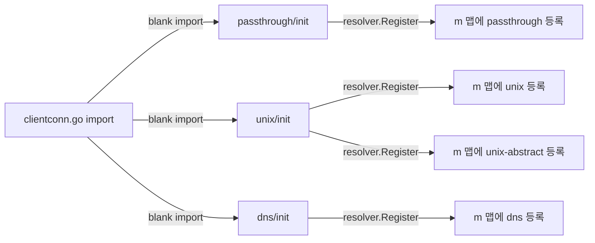
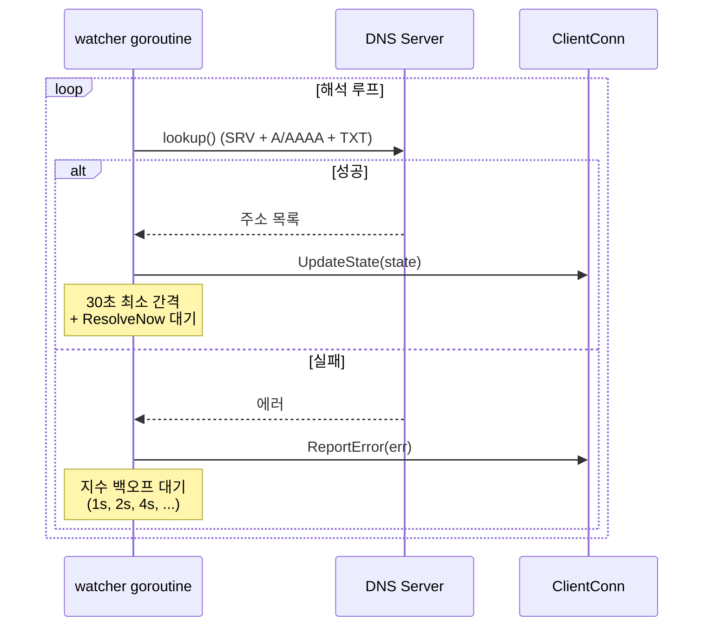
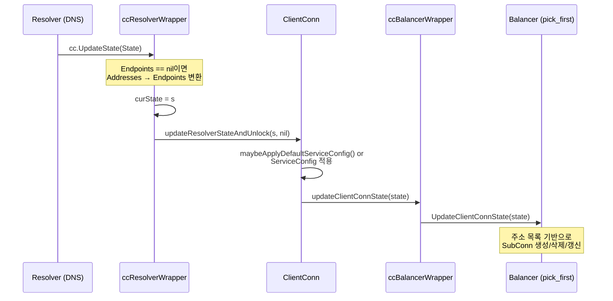
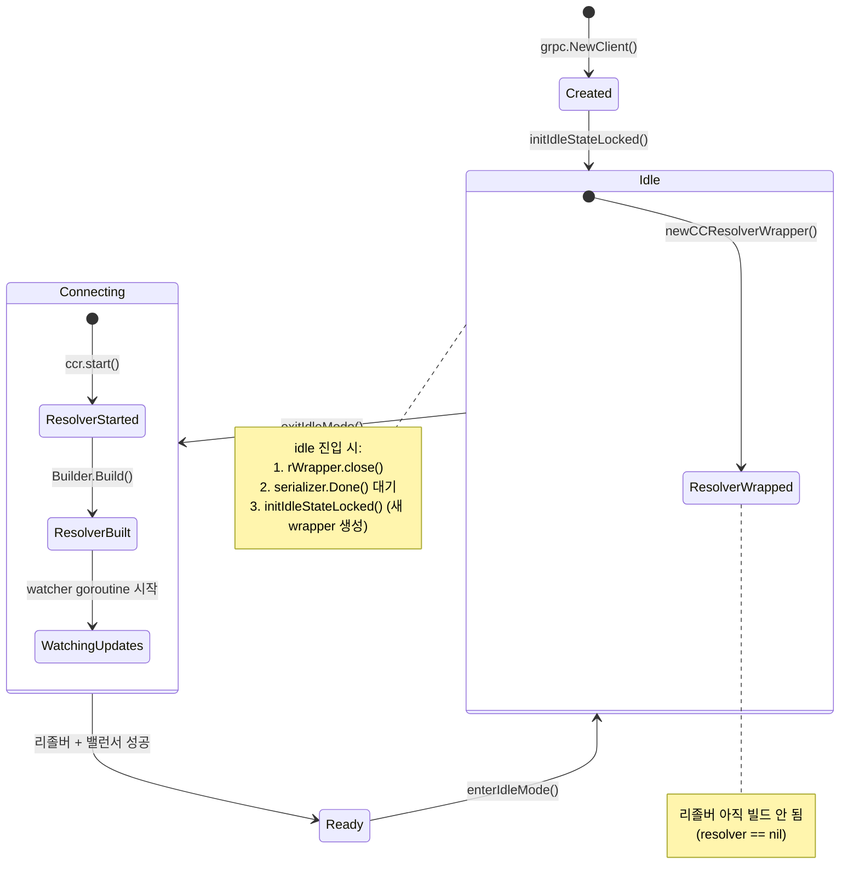

# 09. gRPC-Go 이름 해석(Name Resolution) 심화 분석

## 개요

gRPC에서 **이름 해석(Name Resolution)**은 클라이언트가 `grpc.NewClient("dns:///myservice.example.com")`과 같은
대상 문자열을 실제 네트워크 주소(`10.0.0.1:443`, `10.0.0.2:443`)로 변환하는 과정이다.

이 과정이 중요한 이유:
- **서비스 디스커버리의 핵심**: 서비스명 -> 실제 주소 매핑을 추상화
- **로드밸런싱의 전제조건**: 밸런서가 선택할 주소 목록을 리졸버가 제공
- **Service Config 전달**: DNS TXT 레코드를 통해 서비스 설정(LB 정책, 타임아웃 등)을 전파
- **확장 가능한 설계**: 커스텀 리졸버를 등록하여 Consul, etcd, ZooKeeper 등 연동 가능

```
┌─────────────────────────────────────────────────────────┐
│                    grpc.NewClient()                      │
│  target: "dns:///myservice.example.com:8080"             │
└──────────────────────┬──────────────────────────────────┘
                       │
                       ▼
┌──────────────────────────────────────────────────────────┐
│              Target 파싱 (url.Parse)                     │
│  scheme="dns"  authority=""  endpoint="myservice:8080"    │
└──────────────────────┬───────────────────────────────────┘
                       │
                       ▼
┌──────────────────────────────────────────────────────────┐
│          리졸버 레지스트리 조회 (resolver.Get)             │
│  m["dns"] → dnsBuilder                                   │
└──────────────────────┬───────────────────────────────────┘
                       │
                       ▼
┌──────────────────────────────────────────────────────────┐
│          Builder.Build() → dnsResolver                   │
│  DNS 조회 시작 → A/AAAA/SRV/TXT 레코드                    │
└──────────────────────┬───────────────────────────────────┘
                       │
                       ▼
┌──────────────────────────────────────────────────────────┐
│   resolver.State{                                        │
│     Addresses: [10.0.0.1:8080, 10.0.0.2:8080],          │
│     Endpoints: [{10.0.0.1:8080}, {10.0.0.2:8080}],      │
│     ServiceConfig: ...,                                  │
│   }                                                      │
└──────────────────────┬───────────────────────────────────┘
                       │  cc.UpdateState()
                       ▼
┌──────────────────────────────────────────────────────────┐
│            ccResolverWrapper → ClientConn                │
│            → Balancer에 주소 전달                          │
└──────────────────────────────────────────────────────────┘
```

---

## 1. 핵심 인터페이스 상세

리졸버 서브시스템은 3개의 핵심 인터페이스로 구성된다.

> 소스: `resolver/resolver.go`

### 1.1 Builder 인터페이스

```go
// resolver/resolver.go:300-312
type Builder interface {
    Build(target Target, cc ClientConn, opts BuildOptions) (Resolver, error)
    Scheme() string
}
```

| 메서드 | 역할 |
|--------|------|
| `Build()` | 주어진 Target에 대한 Resolver 인스턴스를 생성. gRPC가 동기적으로 호출하며, 에러 반환 시 Dial 실패 |
| `Scheme()` | 이 빌더가 처리하는 URI 스킴 반환 (예: `"dns"`, `"passthrough"`, `"unix"`) |

**왜 Builder/Resolver를 분리했나?**

Builder는 **팩토리 패턴**으로, 레지스트리에 한 번 등록되면 여러 ClientConn이 각각 독립된 Resolver를 생성할 수 있다.
만약 Builder 없이 Resolver만 있다면, 하나의 Resolver 인스턴스를 여러 ClientConn이 공유해야 하는 문제가 발생한다.

### 1.2 Resolver 인터페이스

```go
// resolver/resolver.go:319-327
type Resolver interface {
    ResolveNow(ResolveNowOptions)
    Close()
}
```

| 메서드 | 역할 |
|--------|------|
| `ResolveNow()` | gRPC가 즉시 재해석을 요청하는 **힌트**. 리졸버가 무시 가능. 동시에 여러 번 호출될 수 있음 |
| `Close()` | 리졸버를 종료하고 리소스 정리 |

**왜 ResolveNow는 "힌트"인가?**

DNS 리졸버의 경우, 최소 재해석 간격(`MinResolutionInterval = 30초`)이 있다. 매 RPC 실패마다 DNS 서버에
쿼리를 보내면 DNS 서버에 과부하를 줄 수 있기 때문이다. 따라서 `ResolveNow()`는 "가능하면 다시 해석해라"는
의미이며, 리졸버 구현체가 자체적으로 쓰로틀링을 적용한다.

### 1.3 ClientConn 인터페이스 (resolver 패키지)

```go
// resolver/resolver.go:232-257
type ClientConn interface {
    UpdateState(State) error
    ReportError(error)
    NewAddress(addresses []Address)        // Deprecated
    ParseServiceConfig(serviceConfigJSON string) *serviceconfig.ParseResult
}
```

| 메서드 | 역할 |
|--------|------|
| `UpdateState()` | 해석된 주소 + 서비스 설정을 gRPC에 전달. 에러 반환 시 재해석 권장 |
| `ReportError()` | 이름 해석 중 에러 발생을 gRPC에 알림 → 밸런서로 전파 |
| `ParseServiceConfig()` | JSON 형태의 서비스 설정을 파싱하여 반환 |

**왜 리졸버가 직접 ClientConn을 호출하나?**

리졸버는 **push 기반** 설계이다. DNS처럼 주기적으로 폴링하거나, etcd/ZooKeeper처럼 watch를 통해 변경 알림을
받으면 즉시 `UpdateState()`를 호출한다. Pull 기반이라면 gRPC가 주기적으로 폴링해야 하지만, push 기반이면
변경이 발생한 즉시 반영할 수 있어 더 효율적이다.

### 1.4 AuthorityOverrider 인터페이스

```go
// resolver/resolver.go:332-342
type AuthorityOverrider interface {
    OverrideAuthority(Target) string
}
```

Builder가 이 인터페이스를 구현하면 ClientConn의 authority를 커스텀할 수 있다.
Unix 소켓 리졸버가 이를 구현하여 항상 `"localhost"`를 authority로 반환한다.

```go
// internal/resolver/unix/unix.go:64-66
func (b *builder) OverrideAuthority(resolver.Target) string {
    return "localhost"
}
```

---

## 2. Target 파싱: scheme://authority/endpoint

### 2.1 Target 구조체

```go
// resolver/resolver.go:269-275
type Target struct {
    URL url.URL
}
```

gRPC는 [gRPC Naming 스펙](https://github.com/grpc/grpc/blob/master/doc/naming.md)에 따라
대상 문자열을 파싱한다. 내부적으로 Go 표준 라이브러리의 `url.Parse()`를 사용한다.

```go
// clientconn.go:1840-1846
func parseTarget(target string) (resolver.Target, error) {
    u, err := url.Parse(target)
    if err != nil {
        return resolver.Target{}, err
    }
    return resolver.Target{URL: *u}, nil
}
```

### 2.2 대상 문자열 파싱 규칙

```
scheme://authority/endpoint
  │         │         │
  │         │         └── 실제 서비스 주소 (host:port)
  │         └── DNS 서버 주소 (선택적, dns 리졸버에서만 사용)
  └── 리졸버 스킴 (dns, passthrough, unix 등)
```

| 대상 문자열 | scheme | authority | endpoint |
|------------|--------|-----------|----------|
| `dns:///foo.example.com:8080` | dns | (없음) | foo.example.com:8080 |
| `dns://8.8.8.8/foo.example.com` | dns | 8.8.8.8 | foo.example.com |
| `passthrough:///127.0.0.1:8080` | passthrough | (없음) | 127.0.0.1:8080 |
| `unix:///var/run/grpc.sock` | unix | (없음) | /var/run/grpc.sock |
| `foo.example.com:8080` | (없음 → 기본) | (없음) | foo.example.com:8080 |

### 2.3 Endpoint() 메서드의 선행 "/" 제거

```go
// resolver/resolver.go:279-293
func (t Target) Endpoint() string {
    endpoint := t.URL.Path
    if endpoint == "" {
        endpoint = t.URL.Opaque
    }
    return strings.TrimPrefix(endpoint, "/")
}
```

`url.Parse("dns:///foo")`는 Path를 `"/foo"`로 파싱한다. RFC 3986에 따르면 정확하지만, 기존 리졸버
구현들은 선행 "/" 없이 endpoint를 기대하므로, `Endpoint()` 메서드에서 이를 제거한다.

**왜 Unix 리졸버는 Endpoint()를 사용하지 않는가?**

`unix:///path/to/socket`의 경우 `Endpoint()`가 선행 "/"를 제거하면 `"path/to/socket"`이 되어
절대 경로가 깨진다. 따라서 Unix 리졸버는 `target.URL.Path`를 직접 사용한다.

```go
// internal/resolver/unix/unix.go:46-49
endpoint := target.URL.Path
if endpoint == "" {
    endpoint = target.URL.Opaque
}
```

### 2.4 스킴이 없는 대상 문자열의 처리

`clientconn.go:1798-1834`의 `initParsedTargetAndResolverBuilder()`에서 스킴이 없거나 등록되지 않은
스킴인 경우의 fallback 로직을 처리한다.

```
사용자 입력: "foo.example.com:8080"
       │
       ▼
  url.Parse() → scheme=""
       │
       ▼
  resolver.Get("") → nil (등록된 빌더 없음)
       │
       ▼
  기본 스킴으로 재시도: "dns:///foo.example.com:8080"
       │
       ▼
  resolver.Get("dns") → dnsBuilder (성공)
```

```go
// clientconn.go:1817-1833
defScheme := cc.dopts.defaultScheme
if internal.UserSetDefaultScheme {
    defScheme = resolver.GetDefaultScheme()
}
canonicalTarget := defScheme + ":///" + cc.target
```

**NewClient vs Dial의 기본 스킴 차이**:
- `grpc.NewClient()`: 기본 스킴 `"dns"` → DNS 해석 수행
- `grpc.Dial()` (deprecated): 기본 스킴 `"passthrough"` → 주소 직접 사용 (하위 호환)

---

## 3. 리졸버 레지스트리

### 3.1 전역 맵 기반 레지스트리

```go
// resolver/resolver.go:38-43
var (
    m = make(map[string]Builder)        // scheme → Builder 맵
    defaultScheme = "passthrough"       // 기본 스킴
)
```

리졸버 빌더는 전역 맵 `m`에 등록되며, 스킴 문자열을 키로 사용한다.

### 3.2 Register()

```go
// resolver/resolver.go:54-56
func Register(b Builder) {
    m[b.Scheme()] = b
}
```

**중요 제약사항**:
- `init()` 함수에서만 호출해야 함 (스레드 안전하지 않음)
- 동일 스킴을 여러 번 등록하면 마지막 등록이 우선
- 스킴에 대문자를 포함하면 안 됨 (RFC 3986 파싱 결과와 불일치)

### 3.3 Get()

```go
// resolver/resolver.go:61-66
func Get(scheme string) Builder {
    if b, ok := m[scheme]; ok {
        return b
    }
    return nil
}
```

### 3.4 SetDefaultScheme()

```go
// resolver/resolver.go:74-77
func SetDefaultScheme(scheme string) {
    defaultScheme = scheme
    internal.UserSetDefaultScheme = true
}
```

`UserSetDefaultScheme` 플래그는 사용자가 명시적으로 기본 스킴을 설정했는지 추적한다.
`NewClient()`는 이 플래그를 확인하여 사용자 설정을 존중한다.

### 3.5 내장 리졸버 등록

gRPC-Go는 `clientconn.go`에서 blank import로 4개의 내장 리졸버를 자동 등록한다.

```go
// clientconn.go:53-56
import (
    _ "google.golang.org/grpc/internal/resolver/passthrough" // passthrough 등록
    _ "google.golang.org/grpc/internal/resolver/unix"        // unix, unix-abstract 등록
    _ "google.golang.org/grpc/resolver/dns"                  // dns 등록
)
```



### 3.6 DialOption을 통한 리졸버 우선 조회

`ClientConn.getResolver()`는 DialOption으로 전달된 리졸버를 먼저 확인하고, 없으면 전역 레지스트리를 조회한다.

```go
// clientconn.go:1770-1777
func (cc *ClientConn) getResolver(scheme string) resolver.Builder {
    for _, rb := range cc.dopts.resolvers {
        if scheme == rb.Scheme() {
            return rb
        }
    }
    return resolver.Get(scheme)
}
```

**왜 이런 2단계 조회인가?**

테스트 시 전역 레지스트리를 오염시키지 않고 특정 ClientConn에만 커스텀 리졸버를 주입할 수 있다.

---

## 4. DNS 리졸버

DNS 리졸버는 gRPC-Go의 기본(default) 리졸버로, 가장 복잡한 구현체이다.

> 소스: `internal/resolver/dns/dns_resolver.go`

### 4.1 아키텍처 개요

```
┌─────────────────────────────────────────────────────────────┐
│                     dnsResolver                              │
│                                                              │
│  ┌──────────┐    ┌──────────────┐    ┌────────────────────┐ │
│  │ watcher  │───>│   lookup()   │───>│ net.Resolver       │ │
│  │ goroutine│    │              │    │ (LookupHost,       │ │
│  │          │    │  ┌─lookupSRV │    │  LookupSRV,        │ │
│  │          │    │  ├─lookupHost│    │  LookupTXT)        │ │
│  │          │    │  └─lookupTXT │    └────────────────────┘ │
│  └──────────┘    └──────┬───────┘                           │
│       ▲                 │                                    │
│       │ rn chan          │ UpdateState/ReportError            │
│  ResolveNow()           ▼                                    │
│                  ┌──────────────┐                            │
│                  │  ClientConn  │                            │
│                  └──────────────┘                            │
└─────────────────────────────────────────────────────────────┘
```

### 4.2 dnsResolver 구조체

```go
// internal/resolver/dns/dns_resolver.go:170-189
type dnsResolver struct {
    host     string
    port     string
    resolver internal.NetResolver   // net.Resolver 인터페이스
    ctx      context.Context
    cancel   context.CancelFunc
    cc       resolver.ClientConn
    rn       chan struct{}           // ResolveNow 신호 채널 (버퍼 1)
    wg       sync.WaitGroup         // Close()가 watcher 종료 대기
    enableServiceConfig bool
}
```

**왜 `rn` 채널의 버퍼 크기가 1인가?**

```go
// internal/resolver/dns/dns_resolver.go:137-143
d := &dnsResolver{
    ...
    rn: make(chan struct{}, 1),
    ...
}
```

버퍼 크기 1은 "최소 한 번은 재해석하라"는 의미이다. `ResolveNow()`가 여러 번 호출되어도 채널에는
최대 하나의 신호만 대기하므로, 불필요한 중복 해석을 방지한다.

```go
// internal/resolver/dns/dns_resolver.go:193-198
func (d *dnsResolver) ResolveNow(resolver.ResolveNowOptions) {
    select {
    case d.rn <- struct{}{}:   // 신호 전송 (이미 있으면 skip)
    default:                   // 채널이 차 있으면 무시
    }
}
```

### 4.3 Build 시 IP 주소 최적화

```go
// internal/resolver/dns/dns_resolver.go:119-133
func (b *dnsBuilder) Build(target resolver.Target, cc resolver.ClientConn, opts resolver.BuildOptions) (resolver.Resolver, error) {
    host, port, err := parseTarget(target.Endpoint(), defaultPort)
    if err != nil {
        return nil, err
    }

    // IP 주소인 경우: DNS 조회 없이 즉시 반환
    if ipAddr, err := formatIP(host); err == nil {
        addr := []resolver.Address{{Addr: ipAddr + ":" + port}}
        cc.UpdateState(resolver.State{
            Addresses: addr,
            Endpoints: []resolver.Endpoint{{Addresses: addr}},
        })
        return deadResolver{}, nil    // 아무것도 하지 않는 리졸버
    }
    // ... DNS 이름인 경우 watcher goroutine 시작
}
```

**왜 IP 주소를 특별 처리하는가?**

`dns:///10.0.0.1:8080`처럼 IP 주소를 직접 지정한 경우, DNS 조회가 불필요하다.
이때 `deadResolver`를 반환하여 불필요한 goroutine과 DNS 쿼리를 완전히 제거한다.

### 4.4 watcher goroutine — 해석 루프

```go
// internal/resolver/dns/dns_resolver.go:206-241
func (d *dnsResolver) watcher() {
    defer d.wg.Done()
    backoffIndex := 1
    for {
        state, err := d.lookup()
        if err != nil {
            d.cc.ReportError(err)         // 에러 보고
        } else {
            err = d.cc.UpdateState(*state) // 결과 전달
        }

        var nextResolutionTime time.Time
        if err == nil {
            // 성공: 다음 ResolveNow 대기 (최소 30초 간격)
            backoffIndex = 1
            nextResolutionTime = internal.TimeNowFunc().Add(MinResolutionInterval)
            select {
            case <-d.ctx.Done():
                return
            case <-d.rn:          // ResolveNow 신호 대기
            }
        } else {
            // 실패: 지수 백오프로 재시도
            nextResolutionTime = internal.TimeNowFunc().Add(
                backoff.DefaultExponential.Backoff(backoffIndex))
            backoffIndex++
        }
        // 최소 간격 대기
        select {
        case <-d.ctx.Done():
            return
        case <-internal.TimeAfterFunc(internal.TimeUntilFunc(nextResolutionTime)):
        }
    }
}
```

이 루프의 동작을 시퀀스 다이어그램으로 표현하면:



### 4.5 DNS 조회 상세: lookup()

```go
// internal/resolver/dns/dns_resolver.go:339-364
func (d *dnsResolver) lookup() (*resolver.State, error) {
    ctx, cancel := context.WithTimeout(d.ctx, ResolvingTimeout) // 30초 타임아웃
    defer cancel()
    srv, srvErr := d.lookupSRV(ctx)       // 1. SRV 레코드 (grpclb용)
    addrs, hostErr := d.lookupHost(ctx)    // 2. A/AAAA 레코드
    if hostErr != nil && (srvErr != nil || len(srv) == 0) {
        return nil, hostErr
    }

    eps := make([]resolver.Endpoint, 0, len(addrs))
    for _, addr := range addrs {
        eps = append(eps, resolver.Endpoint{Addresses: []resolver.Address{addr}})
    }

    state := resolver.State{
        Addresses: addrs,
        Endpoints: eps,
    }
    if len(srv) > 0 {
        state = grpclbstate.Set(state, &grpclbstate.State{BalancerAddresses: srv})
    }
    if d.enableServiceConfig {
        state.ServiceConfig = d.lookupTXT(ctx)  // 3. TXT 레코드 (Service Config)
    }
    return &state, nil
}
```

### 4.6 SRV 레코드 조회

SRV 레코드는 `_grpclb._tcp.<hostname>` 형식으로 gRPC LB 서버의 주소를 발견하는 데 사용된다.

```go
// internal/resolver/dns/dns_resolver.go:243-276
func (d *dnsResolver) lookupSRV(ctx context.Context) ([]resolver.Address, error) {
    if !EnableSRVLookups || d.host == "metadata.google.internal." {
        return nil, nil
    }
    var newAddrs []resolver.Address
    _, srvs, err := d.resolver.LookupSRV(ctx, "grpclb", "tcp", d.host)
    if err != nil {
        err = handleDNSError(err, "SRV")
        return nil, err
    }
    for _, s := range srvs {
        lbAddrs, err := d.resolver.LookupHost(ctx, s.Target)
        // SRV의 Target을 다시 A 레코드로 해석
        for _, a := range lbAddrs {
            ip, _ := formatIP(a)
            addr := ip + ":" + strconv.Itoa(int(s.Port))
            newAddrs = append(newAddrs, resolver.Address{
                Addr:       addr,
                ServerName: s.Target,
            })
        }
    }
    return newAddrs, nil
}
```

**왜 `metadata.google.internal.`을 건너뛰는가?**

일부 `systemd-resolved` 버전에서 이 호스트의 SRV 조회가 타임아웃되는 문제가 있어 명시적으로 제외한다.

### 4.7 A/AAAA 레코드 조회

```go
// internal/resolver/dns/dns_resolver.go:321-337
func (d *dnsResolver) lookupHost(ctx context.Context) ([]resolver.Address, error) {
    addrs, err := d.resolver.LookupHost(ctx, d.host)
    if err != nil {
        err = handleDNSError(err, "A")
        return nil, err
    }
    newAddrs := make([]resolver.Address, 0, len(addrs))
    for _, a := range addrs {
        ip, err := formatIP(a)
        if err != nil {
            return nil, fmt.Errorf("dns: error parsing A record IP address %v: %v", a, err)
        }
        addr := ip + ":" + d.port
        newAddrs = append(newAddrs, resolver.Address{Addr: addr})
    }
    return newAddrs, nil
}
```

`LookupHost()`는 Go의 `net.Resolver`를 통해 A(IPv4)와 AAAA(IPv6) 레코드를 모두 조회한다.
IPv6 주소는 `formatIP()`에서 `[::1]` 형식으로 대괄호가 추가된다.

### 4.8 TXT 레코드 — Service Config

DNS TXT 레코드를 통해 서비스 설정을 클라이언트에 전파할 수 있다.

```go
// internal/resolver/dns/dns_resolver.go:293-319
func (d *dnsResolver) lookupTXT(ctx context.Context) *serviceconfig.ParseResult {
    ss, err := d.resolver.LookupTXT(ctx, txtPrefix+d.host)  // "_grpc_config.<host>"
    // ... 에러 처리 ...
    var res string
    for _, s := range ss {
        res += s   // TXT 레코드 조각 합치기
    }
    if !strings.HasPrefix(res, txtAttribute) {  // "grpc_config=" 접두사 확인
        return nil
    }
    sc := canaryingSC(strings.TrimPrefix(res, txtAttribute))
    return d.cc.ParseServiceConfig(sc)
}
```

TXT 레코드 형식:
```
_grpc_config.myservice.example.com TXT "grpc_config=[{\"serviceConfig\":{\"loadBalancingPolicy\":\"round_robin\"}}]"
```

### 4.9 카나리(Canary) 서비스 설정

```go
// internal/resolver/dns/dns_resolver.go:445-472
func canaryingSC(js string) string {
    var rcs []rawChoice
    err := json.Unmarshal([]byte(js), &rcs)
    // ...
    cliHostname, _ := os.Hostname()
    for _, c := range rcs {
        if !containsString(c.ClientLanguage, golang) ||
            !chosenByPercentage(c.Percentage) ||
            !containsString(c.ClientHostName, cliHostname) ||
            c.ServiceConfig == nil {
            continue
        }
        sc = string(*c.ServiceConfig)
        break
    }
    return sc
}
```

카나리 메커니즘은 **언어**, **호스트명**, **비율** 기준으로 서비스 설정을 선택적으로 적용한다.
이를 통해 Go 클라이언트에만, 또는 특정 호스트의 10% 클라이언트에만 새 설정을 배포할 수 있다.

```go
// rawChoice 구조체
type rawChoice struct {
    ClientLanguage *[]string        `json:"clientLanguage,omitempty"`
    Percentage     *int             `json:"percentage,omitempty"`
    ClientHostName *[]string        `json:"clientHostName,omitempty"`
    ServiceConfig  *json.RawMessage `json:"serviceConfig,omitempty"`
}
```

### 4.10 DNS 에러 처리 전략

```go
// internal/resolver/dns/dns_resolver.go:278-291
func handleDNSError(err error, lookupType string) error {
    dnsErr, ok := err.(*net.DNSError)
    if ok && !dnsErr.IsTimeout && !dnsErr.IsTemporary {
        // 영구적 에러 (NXDOMAIN 등) → nil 반환 (무시)
        return nil
    }
    // 타임아웃/일시적 에러 → 에러 반환 (백오프 재시도)
    return fmt.Errorf("dns: %v record lookup error: %v", lookupType, err)
}
```

| 에러 종류 | 처리 방식 | 이유 |
|-----------|----------|------|
| NXDOMAIN (영구적) | `nil` 반환 (무시) | SRV/TXT 레코드가 없는 것은 정상 |
| 타임아웃 | 에러 반환 → 백오프 재시도 | 네트워크 문제일 수 있어 재시도 필요 |
| 일시적 에러 | 에러 반환 → 백오프 재시도 | DNS 서버 과부하일 수 있어 재시도 필요 |

### 4.11 커스텀 DNS 서버 사용

authority 부분에 DNS 서버 주소를 지정할 수 있다:

```
dns://8.8.8.8/foo.example.com:8080
      ^^^^^^^^ authority → 이 DNS 서버로 쿼리
```

```go
// internal/resolver/dns/dns_resolver.go:92-108
var newNetResolver = func(authority string) (internal.NetResolver, error) {
    if authority == "" {
        return net.DefaultResolver, nil    // 시스템 기본 DNS
    }
    host, port, err := parseTarget(authority, defaultDNSSvrPort)
    authorityWithPort := net.JoinHostPort(host, port)
    return &net.Resolver{
        PreferGo: true,          // Go 내장 DNS 리졸버 사용
        Dial:     internal.AddressDialer(authorityWithPort),
    }, nil
}
```

### 4.12 주요 설정값

| 설정 | 기본값 | 설명 |
|------|--------|------|
| `MinResolutionInterval` | 30초 | 최소 재해석 간격 |
| `ResolvingTimeout` | 30초 | DNS 조회 타임아웃 |
| `EnableSRVLookups` | false | SRV 레코드 조회 활성화 |
| `defaultPort` | "443" | 포트 미지정 시 기본 포트 |
| `txtPrefix` | "_grpc_config." | TXT 레코드 조회 접두사 |

---

## 5. Passthrough 리졸버

> 소스: `internal/resolver/passthrough/passthrough.go`

Passthrough 리졸버는 이름 해석을 수행하지 않고, 대상 문자열을 그대로 주소로 사용한다.

### 5.1 전체 구현

```go
// internal/resolver/passthrough/passthrough.go:31-64
type passthroughBuilder struct{}

func (*passthroughBuilder) Build(target resolver.Target, cc resolver.ClientConn, opts resolver.BuildOptions) (resolver.Resolver, error) {
    if target.Endpoint() == "" && opts.Dialer == nil {
        return nil, errors.New("passthrough: received empty target in Build()")
    }
    r := &passthroughResolver{target: target, cc: cc}
    r.start()
    return r, nil
}

func (*passthroughBuilder) Scheme() string { return "passthrough" }

type passthroughResolver struct {
    target resolver.Target
    cc     resolver.ClientConn
}

func (r *passthroughResolver) start() {
    r.cc.UpdateState(resolver.State{
        Addresses: []resolver.Address{{Addr: r.target.Endpoint()}},
    })
}

func (*passthroughResolver) ResolveNow(resolver.ResolveNowOptions) {}  // 아무것도 안 함
func (*passthroughResolver) Close() {}                                  // 아무것도 안 함
```

**왜 존재하는가?**

1. **개발/디버깅**: 특정 IP:Port로 직접 연결할 때 DNS 조회 오버헤드 제거
2. **하위 호환**: `grpc.Dial("127.0.0.1:8080")`처럼 스킴 없이 주소를 직접 전달하는 레거시 코드 지원
3. **커스텀 다이얼러**: `opts.Dialer != nil`이면 endpoint가 비어 있어도 허용 (다이얼러가 직접 주소 결정)

### 5.2 동작 특성

| 특성 | 값 |
|------|-----|
| DNS 조회 | 없음 |
| 재해석 | 없음 (ResolveNow 무시) |
| Service Config | 없음 |
| watcher goroutine | 없음 |
| 용도 | IP 직접 지정, 테스트, 레거시 호환 |

---

## 6. Unix 리졸버

> 소스: `internal/resolver/unix/unix.go`

Unix 도메인 소켓을 통한 프로세스 간 통신(IPC)을 지원한다.

### 6.1 구현 상세

```go
// internal/resolver/unix/unix.go:32-67
type builder struct {
    scheme string   // "unix" 또는 "unix-abstract"
}

func (b *builder) Build(target resolver.Target, cc resolver.ClientConn, _ resolver.BuildOptions) (resolver.Resolver, error) {
    if target.URL.Host != "" {
        return nil, fmt.Errorf("invalid (non-empty) authority: %v", target.URL.Host)
    }

    endpoint := target.URL.Path   // Endpoint() 대신 URL.Path 직접 사용
    if endpoint == "" {
        endpoint = target.URL.Opaque
    }
    addr := resolver.Address{Addr: endpoint}
    if b.scheme == unixAbstractScheme {
        addr.Addr = "@" + addr.Addr   // abstract 소켓: @ 접두사
    }
    cc.UpdateState(resolver.State{
        Addresses: []resolver.Address{networktype.Set(addr, "unix")},
    })
    return &nopResolver{}, nil
}
```

### 6.2 두 가지 스킴

```go
// internal/resolver/unix/unix.go:75-78
func init() {
    resolver.Register(&builder{scheme: "unix"})           // 파일시스템 소켓
    resolver.Register(&builder{scheme: "unix-abstract"})  // 추상 소켓 (Linux)
}
```

| 스킴 | 대상 문자열 예시 | 소켓 주소 |
|------|----------------|----------|
| `unix` | `unix:///var/run/grpc.sock` | `/var/run/grpc.sock` |
| `unix-abstract` | `unix-abstract:my-socket` | `@my-socket` |

### 6.3 networktype.Set()

`networktype.Set(addr, "unix")`은 주소의 Attributes에 네트워크 타입 `"unix"`을 설정한다.
이를 통해 하위 트랜스포트 계층에서 TCP 대신 Unix 도메인 소켓 연결을 생성한다.

### 6.4 AuthorityOverrider 구현

```go
// internal/resolver/unix/unix.go:64-66
func (b *builder) OverrideAuthority(resolver.Target) string {
    return "localhost"
}
```

Unix 소켓은 로컬 통신이므로 authority를 항상 `"localhost"`로 설정한다.
이는 TLS 인증서 검증 시 서버명으로 사용된다.

---

## 7. Manual 리졸버 — 테스트용

> 소스: `resolver/manual/manual.go`

Manual 리졸버는 프로그래밍 방식으로 주소를 주입할 수 있는 테스트 전용 리졸버이다.

### 7.1 구조체 — Builder이자 Resolver

```go
// resolver/manual/manual.go:44-69
type Resolver struct {
    BuildCallback       func(resolver.Target, resolver.ClientConn, resolver.BuildOptions)
    UpdateStateCallback func(err error)
    ResolveNowCallback  func(resolver.ResolveNowOptions)
    CloseCallback       func()
    scheme              string

    mu            sync.Mutex
    cc            resolver.ClientConn
    lastSeenState *resolver.State   // 채널 idle 복구를 위한 마지막 상태 저장
}
```

**왜 Builder와 Resolver를 하나의 구조체로 합쳤나?**

Manual 리졸버는 테스트에서 `Build()` 호출 후에도 외부에서 `UpdateState()`를 호출해야 한다.
별도의 Builder/Resolver로 분리하면 Build()의 반환값(Resolver)을 추적해야 하지만,
합치면 빌더 참조를 그대로 사용하여 상태를 갱신할 수 있다.

### 7.2 사용 패턴

```go
// 테스트 코드 예시
r := manual.NewBuilderWithScheme("test")
r.InitialState(resolver.State{
    Addresses: []resolver.Address{{Addr: "127.0.0.1:8080"}},
})

// ClientConn 생성 시 이 리졸버를 주입
conn, _ := grpc.NewClient("test:///service",
    grpc.WithResolvers(r),
    grpc.WithTransportCredentials(insecure.NewCredentials()),
)

// 나중에 주소 갱신
r.UpdateState(resolver.State{
    Addresses: []resolver.Address{
        {Addr: "127.0.0.1:8080"},
        {Addr: "127.0.0.1:8081"},  // 서버 추가
    },
})
```

### 7.3 InitialState와 Build의 상호작용

```go
// resolver/manual/manual.go:78-90
func (r *Resolver) Build(target resolver.Target, cc resolver.ClientConn, opts resolver.BuildOptions) (resolver.Resolver, error) {
    r.mu.Lock()
    defer r.mu.Unlock()
    r.BuildCallback(target, cc, opts)
    r.cc = cc
    if r.lastSeenState != nil {
        err := r.cc.UpdateState(*r.lastSeenState)
        go r.UpdateStateCallback(err)    // 비동기로 콜백 호출
    }
    return r, nil
}
```

`InitialState()`로 초기 상태를 설정해두면, `Build()` 시점에 즉시 해당 상태를 `ClientConn`에 전달한다.
이를 통해 `Dial()` 이후 명시적으로 `UpdateState()`를 호출하지 않아도 된다.

### 7.4 채널 Idle 복구

```go
// resolver/manual/manual.go:67-68
// Storing the most recent state update makes this resolver resilient to
// restarts, which is possible with channel idleness.
lastSeenState *resolver.State
```

gRPC 채널이 idle 모드에 진입하면 리졸버가 닫히고, 다시 활성화될 때 `Build()`가 재호출된다.
`lastSeenState`에 마지막 상태를 저장해두면 재시작 시 이전 상태를 자동 복원한다.

---

## 8. ccResolverWrapper — ClientConn과 리졸버 간 중개

> 소스: `resolver_wrapper.go`

### 8.1 구조체

```go
// resolver_wrapper.go:36-51
type ccResolverWrapper struct {
    cc                  *ClientConn
    ignoreServiceConfig bool
    serializer          *grpcsync.CallbackSerializer   // FIFO 콜백 직렬화
    serializerCancel    context.CancelFunc

    resolver resolver.Resolver   // serializer 안에서만 접근

    mu       sync.Mutex
    curState resolver.State
    closed   bool
}
```

### 8.2 왜 ccResolverWrapper가 필요한가?

```
┌────────────────┐     resolver.ClientConn     ┌──────────────┐
│   Resolver      │ ─────────────────────────>  │ ccResolver   │
│  (dns, etc.)    │   UpdateState()             │   Wrapper    │
│                 │   ReportError()             │              │
│                 │   ParseServiceConfig()      │              │
└────────────────┘                              └──────┬───────┘
                                                       │
                                                       │ cc.updateResolverStateAndUnlock()
                                                       ▼
                                                ┌──────────────┐
                                                │  ClientConn  │
                                                │              │
                                                │  → Balancer  │
                                                └──────────────┘
```

ccResolverWrapper의 역할:
1. **인터페이스 어댑터**: `resolver.ClientConn` 인터페이스를 구현하여 실제 `ClientConn`과 리졸버를 연결
2. **동시성 제어**: `CallbackSerializer`로 리졸버 호출을 직렬화
3. **수명 관리**: 리졸버의 빌드, ResolveNow, Close를 안전하게 중개
4. **상태 추적**: 현재 리졸버 상태(`curState`)를 보관하여 channelz 트레이스에 활용

### 8.3 CallbackSerializer를 통한 직렬화

```go
// resolver_wrapper.go:55-63
func newCCResolverWrapper(cc *ClientConn) *ccResolverWrapper {
    ctx, cancel := context.WithCancel(cc.ctx)
    return &ccResolverWrapper{
        cc:                  cc,
        ignoreServiceConfig: cc.dopts.disableServiceConfig,
        serializer:          grpcsync.NewCallbackSerializer(ctx),
        serializerCancel:    cancel,
    }
}
```

**왜 CallbackSerializer를 사용하는가?**

`CallbackSerializer`는 콜백을 FIFO 순서로 실행하는 직렬화 큐이다.

```go
// internal/grpcsync/callback_serializer.go:33-40
type CallbackSerializer struct {
    done      chan struct{}
    callbacks *buffer.Unbounded
}
```

리졸버의 `Build()`, `ResolveNow()`, `Close()`가 동시에 호출될 수 있으므로, 이들을
직렬화하여 리졸버 내부에서 동시성 문제가 발생하지 않도록 보장한다.

```go
// resolver_wrapper.go:68-97
func (ccr *ccResolverWrapper) start() error {
    errCh := make(chan error)
    ccr.serializer.TrySchedule(func(ctx context.Context) {
        if ctx.Err() != nil {
            errCh <- ctx.Err()
            return
        }
        opts := resolver.BuildOptions{
            DisableServiceConfig: ccr.cc.dopts.disableServiceConfig,
            DialCreds:            ccr.cc.dopts.copts.TransportCredentials,
            CredsBundle:          ccr.cc.dopts.copts.CredsBundle,
            Dialer:               ccr.cc.dopts.copts.Dialer,
            Authority:            ccr.cc.authority,
            MetricsRecorder:      ccr.cc.metricsRecorderList,
        }
        var err error
        if ccr.cc.dopts.copts.Dialer != nil || !ccr.cc.dopts.useProxy {
            ccr.resolver, err = ccr.cc.resolverBuilder.Build(ccr.cc.parsedTarget, ccr, opts)
        } else {
            ccr.resolver, err = delegatingresolver.New(...)
        }
        errCh <- err
    })
    return <-errCh
}
```

### 8.4 UpdateState — Addresses에서 Endpoints로의 변환

```go
// resolver_wrapper.go:129-144
func (ccr *ccResolverWrapper) UpdateState(s resolver.State) error {
    ccr.cc.mu.Lock()
    ccr.mu.Lock()
    if ccr.closed {
        ccr.mu.Unlock()
        ccr.cc.mu.Unlock()
        return nil
    }
    if s.Endpoints == nil {
        s.Endpoints = addressesToEndpoints(s.Addresses)   // 호환성 변환
    }
    ccr.addChannelzTraceEvent(s)
    ccr.curState = s
    ccr.mu.Unlock()
    return ccr.cc.updateResolverStateAndUnlock(s, nil)
}
```

**Addresses → Endpoints 자동 변환**:

```go
// resolver_wrapper.go:214-222
func addressesToEndpoints(addrs []resolver.Address) []resolver.Endpoint {
    endpoints := make([]resolver.Endpoint, 0, len(addrs))
    for _, a := range addrs {
        ep := resolver.Endpoint{
            Addresses:  []resolver.Address{a},
            Attributes: a.BalancerAttributes,
        }
        ep.Addresses[0].BalancerAttributes = nil
        endpoints = append(endpoints, ep)
    }
    return endpoints
}
```

**왜 Endpoint가 필요한가?**

Endpoint는 하나의 서버가 여러 주소(예: IPv4 + IPv6)를 가질 수 있는 dualstack 시나리오를 지원한다.
gRPC A61 제안에 따라, 기존 `Addresses`만 사용하던 방식에서 `Endpoints`로 전환 중이다.

### 8.5 close — 비동기 종료

```go
// resolver_wrapper.go:111-125
func (ccr *ccResolverWrapper) close() {
    ccr.mu.Lock()
    ccr.closed = true
    ccr.mu.Unlock()

    ccr.serializer.TrySchedule(func(context.Context) {
        if ccr.resolver == nil {
            return
        }
        ccr.resolver.Close()     // 리졸버 종료
        ccr.resolver = nil
    })
    ccr.serializerCancel()       // serializer 컨텍스트 취소
}
```

**왜 비동기 종료인가?**

`close()`는 `cc.mu`를 잡고 호출될 수 있다. 리졸버의 `Close()`가 내부적으로 `UpdateState()`를
호출하면(예: 마지막 상태 전달), `cc.mu`를 다시 잡으려 하여 데드락이 발생할 수 있다.
따라서 `Close()`를 serializer 큐에 예약하여 비동기로 실행한다.

호출자는 `ccr.serializer.Done()` 채널로 완전 종료를 대기할 수 있다:

```go
// clientconn.go:460-461 (enterIdleMode)
<-rWrapper.serializer.Done()
<-bWrapper.serializer.Done()
```

---

## 9. Resolver → Balancer 업데이트 흐름

리졸버가 새 주소를 발견하면 최종적으로 밸런서까지 전달되는 전체 흐름이다.



### 9.1 updateResolverStateAndUnlock 상세

```go
// clientconn.go:806-826
func (cc *ClientConn) updateResolverStateAndUnlock(s resolver.State, err error) error {
    defer cc.firstResolveEvent.Fire()  // 첫 해석 완료 알림

    if cc.conns == nil {
        cc.mu.Unlock()
        return nil
    }

    if err != nil {
        cc.maybeApplyDefaultServiceConfig()
        cc.balancerWrapper.resolverError(err)  // 밸런서에 에러 전파
        cc.mu.Unlock()
        return balancer.ErrBadResolverState
    }

    // ServiceConfig 처리 (disableServiceConfig, nil, 정상 3가지 분기)
    // ...
    // 최종적으로 밸런서에 상태 전달
}
```

### 9.2 핵심 데이터 구조체 관계

```
resolver.State
├── Addresses []Address           ── BalancerAttributes를 가진 평면 주소 목록
├── Endpoints []Endpoint          ── dualstack 지원, Address 그룹
│   └── Addresses []Address
│   └── Attributes *attributes.Attributes
├── ServiceConfig *ParseResult    ── LB 정책, 메서드 설정 등
└── Attributes *attributes.Attributes  ── 리졸버 메타데이터

     │
     │  ccResolverWrapper.UpdateState()
     ▼

balancer.ClientConnState
├── ResolverState resolver.State  ── 리졸버 상태 그대로 전달
├── BalancerConfig serviceconfig.LoadBalancingConfig
└── (밸런서가 SubConn 생성에 활용)
```

---

## 10. 커스텀 리졸버 작성 방법

### 10.1 구현 단계

커스텀 리졸버(예: Consul 기반)를 작성하는 단계:

**1단계: Builder 구현**

```go
package consulresolver

import (
    "google.golang.org/grpc/resolver"
)

const scheme = "consul"

type consulBuilder struct {
    consulAddr string
}

func (b *consulBuilder) Build(target resolver.Target, cc resolver.ClientConn, opts resolver.BuildOptions) (resolver.Resolver, error) {
    r := &consulResolver{
        target: target,
        cc:     cc,
        consul: newConsulClient(b.consulAddr),
    }
    go r.watch()
    return r, nil
}

func (b *consulBuilder) Scheme() string { return scheme }
```

**2단계: Resolver 구현**

```go
type consulResolver struct {
    target resolver.Target
    cc     resolver.ClientConn
    consul *consulClient
    cancel context.CancelFunc
}

func (r *consulResolver) watch() {
    // Consul watch API로 서비스 변경 감지
    for update := range r.consul.Watch(r.target.Endpoint()) {
        addrs := make([]resolver.Address, 0, len(update.Instances))
        for _, inst := range update.Instances {
            addrs = append(addrs, resolver.Address{
                Addr: fmt.Sprintf("%s:%d", inst.Host, inst.Port),
            })
        }
        r.cc.UpdateState(resolver.State{Addresses: addrs})
    }
}

func (r *consulResolver) ResolveNow(resolver.ResolveNowOptions) {
    // Consul watch 기반이므로 무시 가능
}

func (r *consulResolver) Close() {
    r.cancel()
}
```

**3단계: init()에서 등록**

```go
func init() {
    resolver.Register(&consulBuilder{consulAddr: "localhost:8500"})
}
```

**4단계: 사용**

```go
import _ "mypackage/consulresolver"

conn, _ := grpc.NewClient("consul:///my-grpc-service")
```

### 10.2 구현 시 주의사항

| 항목 | 주의사항 |
|------|---------|
| 스레드 안전 | `UpdateState()`, `ReportError()`는 동시 호출 가능하므로 내부 상태 보호 필요 |
| 블로킹 금지 | `Build()`는 동기 호출되므로 빠르게 반환해야 함. 긴 작업은 goroutine으로 |
| ResolveNow 쓰로틀링 | 동시에 여러 번 호출될 수 있으므로, DNS 리졸버처럼 버퍼 1 채널 패턴 권장 |
| Close 완전성 | goroutine 누수 방지를 위해 모든 watcher goroutine이 종료될 때까지 대기 |
| Scheme 소문자 | `Scheme()` 반환값에 대문자 포함 금지 (url.Parse가 소문자로 정규화) |
| Service Config | DNS 외에 다른 메커니즘(예: Consul KV)으로도 Service Config 전달 가능 |

### 10.3 DialOption을 통한 등록 (전역 레지스트리 대안)

```go
// 전역 레지스트리를 오염시키지 않고 특정 ClientConn에만 사용
conn, _ := grpc.NewClient("consul:///service",
    grpc.WithResolvers(&consulBuilder{consulAddr: "consul.prod:8500"}),
)
```

이 방식은 `clientconn.go:1770-1777`의 `getResolver()`에서 DialOption 리졸버를 우선 조회하므로,
같은 스킴의 전역 리졸버보다 우선한다.

---

## 11. Delegating Resolver — 프록시 지원

> 소스: `internal/resolver/delegatingresolver/delegatingresolver.go`

gRPC-Go 1.68+에서 추가된 `delegatingresolver`는 프록시 환경을 투명하게 지원한다.

```go
// resolver_wrapper.go:89-93 (start에서의 분기)
if ccr.cc.dopts.copts.Dialer != nil || !ccr.cc.dopts.useProxy {
    // 커스텀 다이얼러 또는 프록시 비활성화 → 직접 리졸버 사용
    ccr.resolver, err = ccr.cc.resolverBuilder.Build(...)
} else {
    // 프록시 활성화 → delegating resolver로 감싸기
    ccr.resolver, err = delegatingresolver.New(...)
}
```

Delegating resolver는 두 개의 자식 리졸버를 관리한다:
- **target resolver**: 실제 서비스의 주소 해석 (dns 등)
- **proxy resolver**: 프록시 서버의 주소 해석

---

## 12. 데이터 모델 상세

### 12.1 Address

```go
// resolver/resolver.go:91-122
type Address struct {
    Addr               string                // "10.0.0.1:8080"
    ServerName         string                // TLS 인증용 서버명 (SRV에서 사용)
    Attributes         *attributes.Attributes // SubConn용 메타데이터
    BalancerAttributes *attributes.Attributes // LB 정책용 (deprecated)
    Metadata           any                   // Deprecated
}
```

### 12.2 Endpoint

```go
// resolver/resolver.go:186-193
type Endpoint struct {
    Addresses  []Address                // 하나의 서버의 여러 주소 (IPv4 + IPv6)
    Attributes *attributes.Attributes   // LB 정책용 메타데이터
}
```

**Address vs Endpoint의 관계**:

```
Before (Addresses only):
  서버1-IPv4: 10.0.0.1:8080
  서버1-IPv6: [2001:db8::1]:8080
  서버2-IPv4: 10.0.0.2:8080
  → 3개의 독립된 Address (서버1의 두 주소가 같은 서버인지 알 수 없음)

After (Endpoints):
  Endpoint1: [10.0.0.1:8080, [2001:db8::1]:8080]  ← 하나의 서버
  Endpoint2: [10.0.0.2:8080]                        ← 다른 서버
  → 서버 단위 그룹핑 가능
```

### 12.3 State

```go
// resolver/resolver.go:196-223
type State struct {
    Addresses     []Address                  // 평면 주소 목록 (deprecated 예정)
    Endpoints     []Endpoint                 // 서버 단위 주소 그룹
    ServiceConfig *serviceconfig.ParseResult // 파싱된 서비스 설정
    Attributes    *attributes.Attributes     // 리졸버 메타데이터
}
```

### 12.4 BuildOptions

```go
// resolver/resolver.go:154-181
type BuildOptions struct {
    DisableServiceConfig bool                          // Service Config 조회 비활성화
    DialCreds            credentials.TransportCredentials // TLS 인증 정보
    CredsBundle          credentials.Bundle
    Dialer               func(context.Context, string) (net.Conn, error)
    Authority            string                          // ClientConn의 authority
    MetricsRecorder      stats.MetricsRecorder           // 메트릭 수집기
}
```

---

## 13. 리졸버와 채널 생명주기



### 13.1 채널 Idle ↔ Active 전환 시 리졸버 동작

| 이벤트 | 리졸버 동작 |
|--------|------------|
| `grpc.NewClient()` | `newCCResolverWrapper()` 생성, 리졸버 아직 빌드 안 됨 |
| 첫 RPC 또는 `Connect()` | `exitIdleMode()` → `ccr.start()` → `Builder.Build()` |
| 유휴 타임아웃 | `enterIdleMode()` → `ccr.close()` → `resolver.Close()` |
| 재활성화 | 새로운 `ccResolverWrapper` 생성 → 다시 `start()` |

**왜 Idle 시 리졸버를 닫는가?**

유휴 채널이 DNS watcher goroutine을 계속 유지하면, 수천 개의 유휴 채널이 있는 환경에서
불필요한 DNS 쿼리와 메모리 사용이 발생한다. Idle 시 리졸버를 완전히 종료하여 리소스를 해제한다.

---

## 14. ValidateEndpoints — 피티올 정책 검증

```go
// resolver/resolver.go:348-359
func ValidateEndpoints(endpoints []Endpoint) error {
    if len(endpoints) == 0 {
        return errors.New("endpoints list is empty")
    }
    for _, endpoint := range endpoints {
        for range endpoint.Addresses {
            return nil   // 하나라도 주소가 있으면 유효
        }
    }
    return errors.New("endpoints list contains no addresses")
}
```

gRPC A61 제안에 따라, 피티올(petiole) 정책(예: `weighted_target`)은 자식 정책에 전달하기 전에
이 함수로 endpoints를 검증해야 한다. 빈 endpoints 목록이나 주소 없는 endpoints는 거부된다.

---

## 15. 성능 및 운영 고려사항

### 15.1 DNS 리졸버 튜닝

```go
// resolver/dns/dns_resolver.go:42-44
func SetResolvingTimeout(timeout time.Duration) {
    dns.ResolvingTimeout = timeout
}

// resolver/dns/dns_resolver.go:58-60
func SetMinResolutionInterval(d time.Duration) {
    dns.MinResolutionInterval = d
}
```

| 시나리오 | 권장 설정 |
|---------|----------|
| 빈번한 서비스 변경 | `SetMinResolutionInterval(5 * time.Second)` |
| 느린 DNS 서버 | `SetResolvingTimeout(60 * time.Second)` |
| 대규모 서비스 | SRV 활성화: `dns.EnableSRVLookups = true` |
| DNS 불안정 환경 | 기본 백오프(지수)가 자동 처리 |

### 15.2 디버깅 팁

channelz를 통해 리졸버 상태를 모니터링할 수 있다:

```go
// resolver_wrapper.go:190-212 (addChannelzTraceEvent)
func (ccr *ccResolverWrapper) addChannelzTraceEvent(s resolver.State) {
    // 서비스 설정 변경, 주소 목록 변경 등을 로그로 기록
    channelz.Infof(logger, ccr.cc.channelz,
        "Resolver state updated: %s (%v)", pretty.ToJSON(s), ...)
}
```

환경 변수로 로깅 수준을 조절한다:
```bash
GRPC_GO_LOG_VERBOSITY_LEVEL=99 GRPC_GO_LOG_SEVERITY_LEVEL=info ./myservice
```

---

## 16. 전체 아키텍처 요약

```
┌──────────────────────────────────────────────────────────────────┐
│                        gRPC ClientConn                           │
│                                                                  │
│  ┌─────────────────────────────────────────────────────────────┐ │
│  │                   ccResolverWrapper                         │ │
│  │  ┌──────────────────────────────────────────────────────┐  │ │
│  │  │            CallbackSerializer (FIFO)                 │  │ │
│  │  │                                                      │  │ │
│  │  │  ┌──────────────────────────────────────────────┐   │  │ │
│  │  │  │            Resolver 구현체                     │   │  │ │
│  │  │  │                                              │   │  │ │
│  │  │  │  ┌────────────┬──────────┬────────────────┐ │   │  │ │
│  │  │  │  │ DNS        │Passthru  │ Unix           │ │   │  │ │
│  │  │  │  │ -SRV       │-직접주소  │ -소켓경로       │ │   │  │ │
│  │  │  │  │ -A/AAAA    │          │ -abstract소켓   │ │   │  │ │
│  │  │  │  │ -TXT(SC)   │          │                │ │   │  │ │
│  │  │  │  │ -30s 재조회 │          │                │ │   │  │ │
│  │  │  │  └────────────┴──────────┴────────────────┘ │   │  │ │
│  │  │  └──────────────────────────────────────────────┘   │  │ │
│  │  └──────────────────────────────────────────────────────┘  │ │
│  └────────────────────────────┬────────────────────────────────┘ │
│                               │ resolver.State                   │
│                               ▼                                  │
│  ┌─────────────────────────────────────────────────────────────┐ │
│  │              ccBalancerWrapper → Balancer                   │ │
│  └─────────────────────────────────────────────────────────────┘ │
└──────────────────────────────────────────────────────────────────┘
```

### 핵심 설계 원칙 요약

| 원칙 | 구현 |
|------|------|
| **플러그인 아키텍처** | Builder/Resolver 인터페이스 + 전역 레지스트리 |
| **Push 기반 업데이트** | Resolver → ClientConn 방향으로 비동기 상태 전달 |
| **동시성 안전** | CallbackSerializer로 리졸버 호출 직렬화 |
| **자원 효율** | Idle 시 리졸버 종료, IP 주소 시 deadResolver |
| **점진적 마이그레이션** | Addresses → Endpoints 자동 변환으로 하위 호환 |
| **확장성** | 커스텀 리졸버를 init() 또는 DialOption으로 등록 |
| **실패 복원력** | DNS 에러 종류별 처리, 지수 백오프, 최소 재해석 간격 |

---

## 참고 소스 파일 목록

| 파일 경로 | 역할 |
|-----------|------|
| `resolver/resolver.go` | 핵심 인터페이스 (Builder, Resolver, ClientConn, Target, State) |
| `internal/resolver/dns/dns_resolver.go` | DNS 리졸버 구현 (SRV/A/AAAA/TXT) |
| `internal/resolver/dns/internal/internal.go` | DNS 내부 인터페이스 (NetResolver, 테스트 훅) |
| `resolver/dns/dns_resolver.go` | DNS 리졸버 공개 API (SetResolvingTimeout 등) |
| `internal/resolver/passthrough/passthrough.go` | Passthrough 리졸버 (주소 직접 사용) |
| `internal/resolver/unix/unix.go` | Unix 도메인 소켓 리졸버 |
| `resolver/manual/manual.go` | 테스트용 수동 리졸버 |
| `resolver_wrapper.go` | ccResolverWrapper (ClientConn↔Resolver 중개) |
| `clientconn.go` | Target 파싱, 리졸버 빌더 선택, 상태 업데이트 |
| `internal/grpcsync/callback_serializer.go` | FIFO 콜백 직렬화 큐 |
| `internal/resolver/delegatingresolver/delegatingresolver.go` | 프록시 지원 위임 리졸버 |
