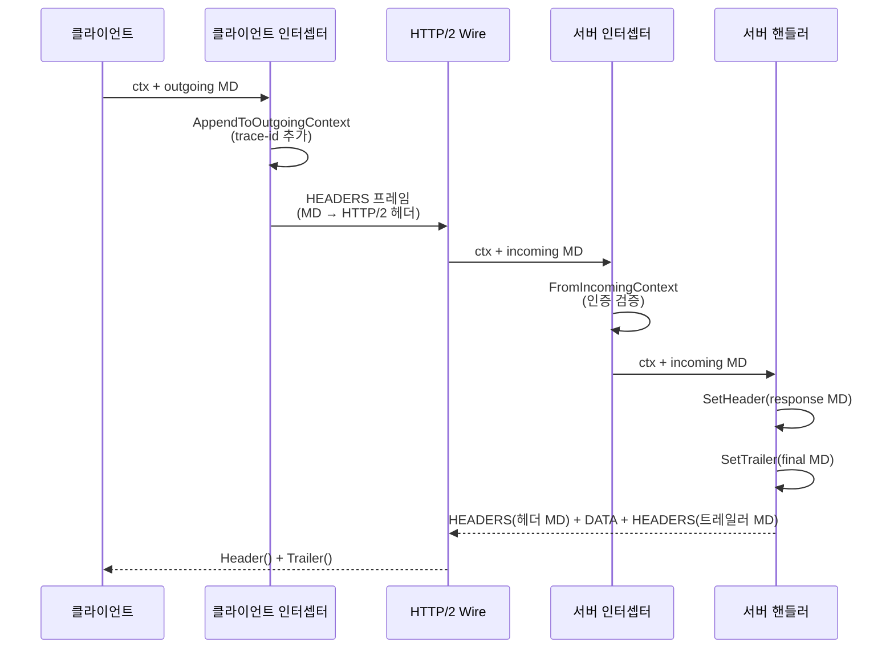

# 13. gRPC-Go 메타데이터 (Metadata) 심화

## 개요

gRPC 메타데이터는 RPC 호출에 첨부되는 **키-값 쌍** 정보이다.
HTTP/2 헤더로 전송되며, 인증 토큰, 추적 ID, 커스텀 정보 등을 전달하는 데 사용된다.
gRPC-Go에서 메타데이터는 `metadata.MD` 타입으로 표현되고,
Go의 `context.Context`를 통해 전파된다.

**소스코드**: `metadata/metadata.go`

---

## 1. MD 타입 정의

```go
// metadata/metadata.go:45
type MD map[string][]string
```

`MD`는 `map[string][]string`의 타입 앨리어스이다. 하나의 키에 여러 값을 가질 수 있다.

**왜 `[]string`인가?**

HTTP/2에서 동일한 헤더 키에 여러 값이 올 수 있다. 예를 들어 `set-cookie` 헤더는
여러 개가 올 수 있듯이, gRPC 메타데이터도 동일한 키에 여러 값을 허용한다.
이는 HTTP 스펙과의 호환성을 유지하면서 유연한 데이터 전달을 가능하게 한다.

---

## 2. MD 생성

### New — map에서 생성

```go
// metadata/metadata.go:59
func New(m map[string]string) MD {
    md := make(MD, len(m))
    for k, val := range m {
        key := strings.ToLower(k)    // 키 자동 소문자 변환
        md[key] = append(md[key], val)
    }
    return md
}
```

```go
// 사용 예
md := metadata.New(map[string]string{
    "Authorization": "Bearer token123",
    "X-Request-ID":  "req-001",
})
// 결과: {"authorization": ["Bearer token123"], "x-request-id": ["req-001"]}
```

### Pairs — 키-값 쌍으로 생성

```go
// metadata/metadata.go:81
func Pairs(kv ...string) MD {
    if len(kv)%2 == 1 {
        panic("metadata: Pairs got the odd number of input pairs")
    }
    md := make(MD, len(kv)/2)
    for i := 0; i < len(kv); i += 2 {
        key := strings.ToLower(kv[i])
        md[key] = append(md[key], kv[i+1])
    }
    return md
}
```

```go
// 동일한 키에 여러 값
md := metadata.Pairs(
    "authorization", "Bearer token123",
    "x-custom", "value1",
    "x-custom", "value2",   // 같은 키에 추가
)
// 결과: {"authorization": ["Bearer token123"], "x-custom": ["value1", "value2"]}
```

### Join — 여러 MD 병합

```go
// metadata/metadata.go:149
func Join(mds ...MD) MD {
    out := MD{}
    for _, md := range mds {
        for k, v := range md {
            out[k] = append(out[k], v...)
        }
    }
    return out
}
```

---

## 3. MD 조작

### Get — 값 조회

```go
// metadata/metadata.go:110
func (md MD) Get(k string) []string {
    k = strings.ToLower(k)   // 대소문자 무시
    return md[k]
}
```

### Set — 값 설정 (덮어쓰기)

```go
// metadata/metadata.go:118
func (md MD) Set(k string, vals ...string) {
    if len(vals) == 0 {
        return
    }
    k = strings.ToLower(k)
    md[k] = vals
}
```

### Append — 값 추가

```go
// metadata/metadata.go:130
func (md MD) Append(k string, vals ...string) {
    if len(vals) == 0 {
        return
    }
    k = strings.ToLower(k)
    md[k] = append(md[k], vals...)
}
```

### Delete — 키 삭제

```go
// metadata/metadata.go:140
func (md MD) Delete(k string) {
    k = strings.ToLower(k)
    delete(md, k)
}
```

### Copy — 깊은 복사

```go
// metadata/metadata.go:99
func (md MD) Copy() MD {
    out := make(MD, len(md))
    for k, v := range md {
        out[k] = copyOf(v)    // 슬라이스도 복사
    }
    return out
}
```

---

## 4. Context 통합

gRPC-Go에서 메타데이터는 **context.Context**에 저장되어 전파된다.
수신(incoming)과 발신(outgoing) 메타데이터는 별도의 키로 구분된다.

```
┌─────────────────────────────────────────────┐
│                context.Context               │
├─────────────────────────────────────────────┤
│  mdIncomingKey{} → MD                        │
│    서버가 클라이언트로부터 수신한 메타데이터    │
│                                              │
│  mdOutgoingKey{} → rawMD{md, added}          │
│    클라이언트가 서버에 발신할 메타데이터        │
└─────────────────────────────────────────────┘
```

### rawMD 구조 (최적화)

```go
// metadata/metadata.go:292
type rawMD struct {
    md    MD           // NewOutgoingContext에서 설정한 기본 MD
    added [][]string   // AppendToOutgoingContext에서 추가한 kv 쌍들
}
```

**왜 rawMD인가?**

`AppendToOutgoingContext`는 기존 MD를 복사하지 않고, 추가 kv만 별도 슬라이스에 저장한다.
이렇게 하면 반복적인 `AppendToOutgoingContext` 호출에서 MD 전체 복사를 피할 수 있다.
실제 전송 시점(`FromOutgoingContext` 호출)에서 한 번만 병합한다.

### 발신 메타데이터 설정

```go
// 방법 1: NewOutgoingContext (전체 교체)
md := metadata.Pairs("authorization", "Bearer token123")
ctx := metadata.NewOutgoingContext(ctx, md)

// 방법 2: AppendToOutgoingContext (추가, 복사 없음 — 성능 좋음)
ctx = metadata.AppendToOutgoingContext(ctx,
    "x-request-id", "req-001",
    "x-trace-id", "trace-abc",
)
```

### 수신 메타데이터 읽기

```go
// 서버 핸들러에서
md, ok := metadata.FromIncomingContext(ctx)
if ok {
    tokens := md.Get("authorization")
    if len(tokens) > 0 {
        // 인증 토큰 처리
    }
}

// 특정 키만 조회 (더 효율적)
values := metadata.ValueFromIncomingContext(ctx, "x-request-id")
```

### 발신 메타데이터 읽기

```go
// 인터셉터 등에서 발신 메타데이터 확인
md, ok := metadata.FromOutgoingContext(ctx)
```

---

## 5. 키 규칙

### ASCII 키

| 규칙 | 설명 |
|------|------|
| 허용 문자 | `0-9`, `a-z`, `A-Z` (자동 소문자 변환), `-`, `_`, `.` |
| 예약 접두사 | `grpc-` (gRPC 내부 사용) |
| 대소문자 | 자동 소문자 변환 |

### 바이너리 헤더 (`-bin` 접미사)

```
키 이름이 "-bin"으로 끝나면 → 바이너리 값
  → 전송 시: base64 인코딩
  → 수신 시: base64 디코딩
  → 임의의 바이트 시퀀스 전송 가능

키 이름이 "-bin"으로 끝나지 않으면 → ASCII 값
  → 인코딩 없이 그대로 전송
  → ASCII 문자만 허용
```

```go
// 바이너리 메타데이터 예시
md := metadata.Pairs(
    "x-trace-bin", string(binaryData),  // 자동 base64 인코딩
)
```

### 예약된 gRPC 헤더

| 헤더 | 용도 |
|------|------|
| `grpc-status` | gRPC 상태 코드 |
| `grpc-message` | 상태 메시지 |
| `grpc-encoding` | 압축 알고리즘 |
| `grpc-accept-encoding` | 수용 가능한 압축 |
| `grpc-timeout` | 데드라인 |
| `content-type` | `application/grpc+proto` 등 |
| `te` | `trailers` (HTTP/2 필수) |
| `:authority` | 서버 이름 |
| `:path` | RPC 메서드 경로 |

---

## 6. HTTP/2 매핑

### 클라이언트 → 서버

```
클라이언트 발신 메타데이터
    │
    ├── HTTP/2 HEADERS 프레임으로 전송
    │   :method: POST
    │   :path: /package.Service/Method
    │   :authority: server:8080
    │   :scheme: https
    │   content-type: application/grpc
    │   te: trailers
    │   grpc-encoding: gzip          (압축 사용 시)
    │   grpc-timeout: 5S             (데드라인)
    │   authorization: Bearer token  (사용자 메타데이터)
    │   x-request-id: req-001       (사용자 메타데이터)
    │
    ├── HTTP/2 DATA 프레임으로 메시지 전송
    │
    └── HTTP/2 HEADERS 프레임 (END_STREAM) 으로 종료
```

### 서버 → 클라이언트

```
서버 응답
    │
    ├── HTTP/2 HEADERS 프레임 (초기 메타데이터 = 헤더)
    │   :status: 200
    │   content-type: application/grpc
    │   grpc-encoding: gzip
    │   x-response-id: resp-001     (사용자 메타데이터)
    │
    ├── HTTP/2 DATA 프레임으로 응답 메시지 전송
    │
    └── HTTP/2 HEADERS 프레임 (트레일러)
        grpc-status: 0
        grpc-message: OK
        x-request-cost: 42ms        (사용자 메타데이터)
```

---

## 7. 헤더 vs 트레일러

gRPC에서 서버 메타데이터는 **헤더(header)**와 **트레일러(trailer)** 두 곳에 전송된다.

```
서버 응답 흐름:
┌──────────┐     ┌──────────┐     ┌──────────┐
│  헤더     │ ──▶ │  메시지   │ ──▶ │ 트레일러  │
│ (초기    │     │ (DATA    │     │ (종료    │
│  메타)   │     │  frames) │     │  메타)   │
└──────────┘     └──────────┘     └──────────┘
```

| 구분 | 전송 시점 | 용도 |
|------|----------|------|
| 헤더 (Header) | 첫 응답 메시지 전 | 인증 정보, 서버 식별, 초기 설정 |
| 트레일러 (Trailer) | 마지막 메시지 후 | 상태 코드, 에러 상세, 최종 통계 |

### 서버에서 헤더/트레일러 설정

```go
func (s *myServer) SayHello(ctx context.Context, req *pb.HelloRequest) (*pb.HelloReply, error) {
    // 헤더 설정 (첫 응답 전에 전송됨)
    header := metadata.Pairs("x-server-id", "server-01")
    grpc.SetHeader(ctx, header)
    // 또는 즉시 전송: grpc.SendHeader(ctx, header)

    // 트레일러 설정 (RPC 완료 시 전송됨)
    trailer := metadata.Pairs("x-request-cost", "42ms")
    grpc.SetTrailer(ctx, trailer)

    return &pb.HelloReply{Message: "Hello"}, nil
}
```

### 클라이언트에서 헤더/트레일러 수신

```go
// Unary RPC
var header, trailer metadata.MD
reply, err := client.SayHello(ctx, req,
    grpc.Header(&header),       // 헤더 수신
    grpc.Trailer(&trailer),     // 트레일러 수신
)
serverID := header.Get("x-server-id")
cost := trailer.Get("x-request-cost")

// Streaming RPC
stream, _ := client.ServerStream(ctx, req)
header, _ := stream.Header()   // 블로킹: 첫 메시지까지 대기
trailer := stream.Trailer()    // RPC 완료 후 조회
```

**왜 헤더와 트레일러를 분리하는가?**

스트리밍 RPC에서 응답 메시지가 여러 개인 경우, 상태 코드(grpc-status)는
모든 메시지를 보낸 후에야 결정할 수 있다. HTTP/2 트레일러는 정확히 이 목적에 맞는
기능이다 — 스트림 끝에 메타데이터를 보낼 수 있다.

---

## 8. 메타데이터 전파 흐름



---

## 9. 서버 내부 메타데이터 처리

### 수신 경로 (`server.go: processUnaryRPC`)

```
HTTP/2 HEADERS 프레임 수신
    │
    ├── internal/transport에서 HTTP/2 헤더 파싱
    │   → :path, content-type, grpc-encoding, grpc-timeout 등 추출
    │   → 사용자 정의 헤더를 metadata.MD로 변환
    │
    ├── metadata.NewIncomingContext(ctx, md)
    │   → ctx에 수신 메타데이터 저장
    │
    └── 핸들러에 ctx 전달
        → FromIncomingContext(ctx)로 접근 가능
```

### 발신 경로

```
핸들러에서 grpc.SetHeader(ctx, md) 호출
    │
    ├── serverStream.SetHeader(md)
    │   → 내부 헤더 버퍼에 저장
    │
    ├── 첫 응답 메시지 전송 시
    │   → 버퍼링된 헤더를 HTTP/2 HEADERS 프레임으로 전송
    │
    └── RPC 완료 시
        grpc.SetTrailer(ctx, md)
        → HTTP/2 트레일러 HEADERS 프레임으로 전송
        → grpc-status, grpc-message 포함
```

---

## 10. 성능 고려사항

### AppendToOutgoingContext vs NewOutgoingContext

```
NewOutgoingContext:
  - 매번 새 MD를 생성
  - 기존 MD를 덮어씀
  - 인터셉터 체인에서 비효율적 (매번 전체 복사)

AppendToOutgoingContext:
  - rawMD.added에 kv 슬라이스만 추가
  - 기존 MD 복사 없음
  - 지연 병합: 실제 전송 시 한 번만 병합
  - 인터셉터 체인에서 효율적
```

```go
// 비효율적 (매번 복사)
md, _ := metadata.FromOutgoingContext(ctx)
md = md.Copy()
md.Set("key", "value")
ctx = metadata.NewOutgoingContext(ctx, md)

// 효율적 (복사 없음)
ctx = metadata.AppendToOutgoingContext(ctx, "key", "value")
```

### ValueFromIncomingContext — 단일 키 조회

```go
// metadata/metadata.go:216
func ValueFromIncomingContext(ctx context.Context, key string) []string {
    md, ok := ctx.Value(mdIncomingKey{}).(MD)
    if !ok {
        return nil
    }
    if v, ok := md[key]; ok {
        return copyOf(v)       // 정확히 일치하면 바로 반환
    }
    for k, v := range md {    // 대소문자 무시 검색
        if strings.EqualFold(k, key) {
            return copyOf(v)
        }
    }
    return nil
}
```

**왜 copyOf()를 하는가?**

반환된 슬라이스를 수정해도 원본 MD에 영향을 주지 않도록 방어적 복사를 한다.
메타데이터는 여러 인터셉터/핸들러에서 공유될 수 있으므로 불변성을 보장한다.

---

## 11. 메타데이터 크기 제한

gRPC-Go는 HTTP/2의 `SETTINGS_MAX_HEADER_LIST_SIZE`를 통해
메타데이터 크기를 제한한다.

```go
// server.go: MaxHeaderListSize 옵션
func MaxHeaderListSize(s uint32) ServerOption {
    return newFuncServerOption(func(o *serverOptions) {
        o.maxHeaderListSize = &s
    })
}
```

| 설정 | 기본값 | 설명 |
|------|--------|------|
| `MaxHeaderListSize` (서버) | 무제한 | 수신 가능한 최대 헤더 크기 |
| HTTP/2 기본 | 16KB | HTTP/2 스펙 기본값 |

**대용량 메타데이터 주의:**

메타데이터는 모든 RPC마다 전송되므로, 큰 데이터는 메타데이터가 아닌
요청/응답 메시지 본문에 넣어야 한다. 인증 토큰, 추적 ID 등 소량의
제어 정보만 메타데이터로 전달하는 것이 적절하다.

---

## 12. 일반적인 사용 패턴

### 인증 토큰 전파

```go
// 클라이언트: 토큰 첨부
ctx = metadata.AppendToOutgoingContext(ctx, "authorization", "Bearer "+token)

// 서버: 토큰 추출
md, _ := metadata.FromIncomingContext(ctx)
tokens := md.Get("authorization")
```

### 분산 추적 (Trace Propagation)

```go
// 클라이언트 인터셉터: trace ID 주입
func tracingInterceptor(ctx context.Context, method string, req, reply any,
    cc *grpc.ClientConn, invoker grpc.UnaryInvoker, opts ...grpc.CallOption) error {

    traceID := generateTraceID()
    ctx = metadata.AppendToOutgoingContext(ctx, "x-trace-id", traceID)
    return invoker(ctx, method, req, reply, cc, opts...)
}

// 서버 인터셉터: trace ID 추출
func tracingServerInterceptor(ctx context.Context, req any,
    info *grpc.UnaryServerInfo, handler grpc.UnaryHandler) (any, error) {

    traceIDs := metadata.ValueFromIncomingContext(ctx, "x-trace-id")
    if len(traceIDs) > 0 {
        ctx = context.WithValue(ctx, traceKey{}, traceIDs[0])
    }
    return handler(ctx, req)
}
```

### 요청 ID 전파

```go
// 서비스 간 전파: 수신 메타데이터를 발신에 복사
md, _ := metadata.FromIncomingContext(ctx)
requestIDs := md.Get("x-request-id")
if len(requestIDs) > 0 {
    ctx = metadata.AppendToOutgoingContext(ctx, "x-request-id", requestIDs[0])
}
// 다른 서비스 호출
reply, err := otherClient.Call(ctx, req)
```

### Rate Limiting 정보

```go
// 서버: 남은 쿼터를 헤더로 전송
header := metadata.Pairs(
    "x-ratelimit-remaining", strconv.Itoa(remaining),
    "x-ratelimit-limit", strconv.Itoa(limit),
)
grpc.SetHeader(ctx, header)
```

---

## 13. 메타데이터 vs 다른 전달 방식

| 방식 | 전송 위치 | 용도 |
|------|----------|------|
| **메타데이터** | HTTP/2 헤더/트레일러 | 제어 정보 (인증, 추적, 라우팅) |
| **요청/응답 메시지** | HTTP/2 DATA 프레임 | 비즈니스 데이터 |
| **PerRPCCredentials** | HTTP/2 헤더 | 인증 전용 (자동 갱신) |
| **context.Value** | 프로세스 내부 | 프로세스 내 전파 (네트워크 전송 안됨) |

---

## 14. 종합 다이어그램

```
클라이언트                              서버
┌──────────────────┐            ┌──────────────────┐
│ ctx = AppendTo   │            │                  │
│ OutgoingContext  │            │                  │
│ (auth, trace-id) │            │                  │
│                  │            │                  │
│ Invoke(ctx, ...) │            │                  │
│       │          │            │                  │
│  ┌────▼────┐     │            │                  │
│  │인터셉터  │     │  HEADERS   │  ┌────────────┐ │
│  │(MD 추가) │────────────────────▶│ incoming   │ │
│  └─────────┘     │  프레임     │  │ context    │ │
│                  │            │  └──────┬─────┘ │
│                  │            │         │       │
│                  │            │  ┌──────▼─────┐ │
│                  │            │  │ 서버 핸들러 │ │
│                  │            │  │ SetHeader  │ │
│                  │            │  │ SetTrailer │ │
│                  │            │  └──────┬─────┘ │
│  ┌─────────┐     │  HEADERS   │         │       │
│  │ Header()│◀────────────────────────────┘       │
│  │Trailer()│     │  +TRAILER  │                  │
│  └─────────┘     │  프레임     │                  │
└──────────────────┘            └──────────────────┘
```
