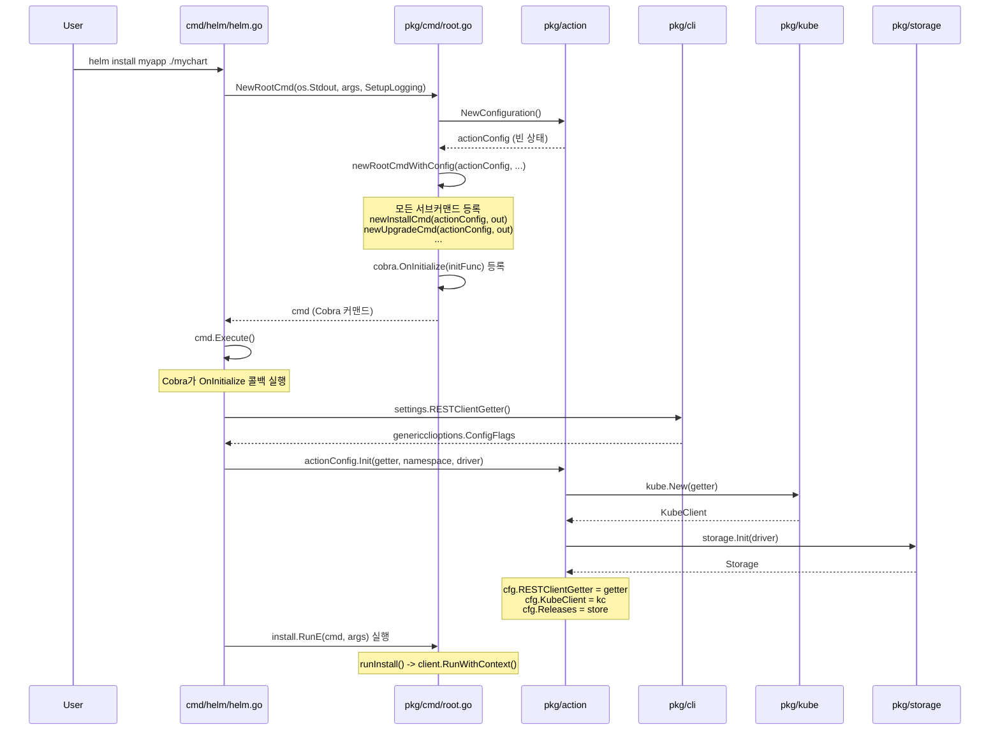

# Helm v4 아키텍처

## 1. 개요

Helm은 Kubernetes 패키지 매니저로, 차트(Chart)라는 패키지 형식을 사용하여 Kubernetes 애플리케이션을 정의, 설치, 업그레이드한다. Helm v4는 클라이언트 전용 아키텍처를 채택하여 Tiller 서버 없이 직접 Kubernetes API Server와 통신한다.

Helm v4의 핵심 설계 원칙:

- **클라이언트 전용(Client-Only)**: 모든 작업이 CLI 바이너리에서 직접 수행된다
- **의존성 주입(DI)**: `Configuration` 구조체가 모든 Action에 공유되는 의존성 컨테이너 역할을 한다
- **인터페이스 기반 추상화**: Storage Driver, KubeClient 등이 인터페이스로 추상화되어 교체 가능하다
- **Cobra 기반 CLI**: `spf13/cobra`를 사용하여 커맨드 트리를 구성한다

## 2. 전체 아키텍처 다이어그램

```
+------------------------------------------------------------------+
|                         Helm CLI (cmd/helm)                       |
|  main() -> NewRootCmd() -> cobra.Command.Execute()                |
+------------------------------------------------------------------+
           |                           |
           v                           v
+---------------------+    +-------------------------+
|  pkg/cmd (Commands)  |    |  pkg/cli (EnvSettings)  |
|  - newInstallCmd()   |    |  - Namespace            |
|  - newUpgradeCmd()   |    |  - KubeConfig           |
|  - newRollbackCmd()  |    |  - RESTClientGetter()   |
|  - newUninstallCmd() |    |  - RepositoryConfig     |
|  - newListCmd()      |    |  - RegistryConfig       |
|  - newPullCmd()      |    +-------------------------+
|  - newTemplateCmd()  |
+---------------------+
           |
           | actionConfig (공유)
           v
+------------------------------------------------------------------+
|              pkg/action (Configuration - 의존성 컨테이너)           |
|                                                                    |
|  +------------------+  +-----------+  +-----------+  +-----------+ |
|  | RESTClientGetter |  | KubeClient|  |  Releases |  | Registry  | |
|  | (K8s 클라이언트  |  | (kube.    |  |  (Storage)|  | Client    | |
|  |  팩토리)         |  | Interface)|  |           |  |           | |
|  +------------------+  +-----------+  +-----------+  +-----------+ |
|                                                                    |
|  +------------------+  +-----------+  +-----------+                |
|  | Capabilities     |  | CustomTpl |  | HookOutput|                |
|  | (K8s 버전/API)   |  | FuncMap   |  | Func      |                |
|  +------------------+  +-----------+  +-----------+                |
+------------------------------------------------------------------+
           |                    |                    |
           v                    v                    v
+------------------+  +------------------+  +------------------+
| pkg/engine       |  | pkg/storage      |  | pkg/kube         |
| (템플릿 렌더링)    |  | (릴리스 저장)     |  | (K8s 리소스 관리) |
|                  |  |                  |  |                  |
| Engine.Render()  |  | Storage.Create() |  | Client.Create()  |
| - Go templates   |  | Storage.Update() |  | Client.Update()  |
| - Sprig 함수     |  | Storage.Delete() |  | Client.Delete()  |
| - lookup 함수    |  | Storage.Get()    |  | Client.Build()   |
+------------------+  +------------------+  +------------------+
                              |
                              v
                    +------------------+
                    | Storage Drivers  |
                    |  - Secret (기본)  |
                    |  - ConfigMap     |
                    |  - Memory        |
                    |  - SQL           |
                    +------------------+
```

## 3. 핵심 계층 구조

Helm v4는 크게 4개의 계층으로 구성된다:

| 계층 | 패키지 | 역할 |
|------|--------|------|
| **CLI 계층** | `cmd/helm`, `pkg/cmd` | 사용자 입력 파싱, Cobra 커맨드 구성 |
| **Action 계층** | `pkg/action` | 비즈니스 로직 (Install, Upgrade, Rollback 등) |
| **서비스 계층** | `pkg/engine`, `pkg/storage`, `pkg/kube` | 템플릿 렌더링, 릴리스 저장, K8s 리소스 관리 |
| **드라이버 계층** | `pkg/storage/driver`, `pkg/kube/client.go` | 실제 백엔드 구현 (Secret, ConfigMap, Memory, SQL) |

### 왜 이 계층 구조인가?

1. **CLI와 비즈니스 로직 분리**: `pkg/cmd`는 Cobra 커맨드와 플래그만 처리하고, 실제 작업은 `pkg/action`에 위임한다. 이를 통해 Helm을 라이브러리로 사용하는 외부 프로젝트가 CLI 없이 Action만 호출할 수 있다.

2. **Configuration을 통한 의존성 주입**: 모든 Action이 `*Configuration`을 공유하므로 KubeClient, Storage, RegistryClient 등을 한 곳에서 초기화하고 모든 커맨드에서 재사용한다.

3. **인터페이스 기반 테스트**: `kube.Interface`, `driver.Driver` 등의 인터페이스를 통해 `kubefake.PrintingKubeClient`나 `driver.Memory` 같은 가짜 구현을 테스트에 주입할 수 있다.

## 4. 진입점과 초기화 흐름

### 4.1 main() 함수

소스 경로: `cmd/helm/helm.go`

```go
// cmd/helm/helm.go
func main() {
    kube.ManagedFieldsManager = "helm"

    cmd, err := helmcmd.NewRootCmd(os.Stdout, os.Args[1:], helmcmd.SetupLogging)
    if err != nil {
        slog.Warn("command failed", slog.Any("error", err))
        os.Exit(1)
    }

    if err := cmd.Execute(); err != nil {
        var cerr helmcmd.CommandError
        if errors.As(err, &cerr) {
            os.Exit(cerr.ExitCode)
        }
        os.Exit(1)
    }
}
```

`main()`은 세 가지 작업만 수행한다:

1. `kube.ManagedFieldsManager`를 "helm"으로 설정 (Server-Side Apply에서 필드 관리자 이름)
2. `NewRootCmd()`를 호출하여 Cobra 루트 커맨드를 생성
3. `cmd.Execute()`로 커맨드를 실행

### 4.2 NewRootCmd() - 루트 커맨드 생성

소스 경로: `pkg/cmd/root.go`

```go
// pkg/cmd/root.go
func NewRootCmd(out io.Writer, args []string, logSetup func(bool)) (*cobra.Command, error) {
    actionConfig := action.NewConfiguration()
    cmd, err := newRootCmdWithConfig(actionConfig, out, args, logSetup)
    if err != nil {
        return nil, err
    }
    cobra.OnInitialize(func() {
        helmDriver := os.Getenv("HELM_DRIVER")
        if err := actionConfig.Init(settings.RESTClientGetter(), settings.Namespace(), helmDriver); err != nil {
            log.Fatal(err)
        }
        if helmDriver == "memory" {
            loadReleasesInMemory(actionConfig)
        }
        actionConfig.SetHookOutputFunc(hookOutputWriter)
    })
    return cmd, nil
}
```

핵심 포인트:

1. `action.NewConfiguration()`으로 빈 Configuration을 생성한다
2. `newRootCmdWithConfig()`에서 모든 서브커맨드를 등록한다
3. `cobra.OnInitialize()` 콜백에서 **지연 초기화**를 수행한다 -- 이 콜백은 실제 커맨드 실행 직전에 호출된다

### 4.3 지연 초기화가 중요한 이유

`cobra.OnInitialize()`에 등록된 콜백은 `cmd.Execute()` 호출 시, 실제 커맨드의 `RunE` 함수가 실행되기 전에 호출된다. 이 지연 초기화 패턴을 사용하는 이유는:

- **플래그 파싱 완료 후 초기화**: `--namespace`, `--kubeconfig` 등의 플래그 값이 확정된 후에 K8s 클라이언트를 초기화해야 한다
- **환경 변수 반영**: `HELM_DRIVER`, `HELM_NAMESPACE` 등의 환경 변수를 초기화 시점에 읽는다
- **불필요한 초기화 방지**: `helm version` 같은 커맨드는 K8s 클라이언트가 필요 없지만, 초기화 자체는 항상 수행된다

### 4.4 Configuration.Init() - 핵심 의존성 초기화

소스 경로: `pkg/action/action.go`

```go
// pkg/action/action.go
func (cfg *Configuration) Init(getter genericclioptions.RESTClientGetter,
    namespace, helmDriver string) error {

    kc := kube.New(getter)
    kc.SetLogger(cfg.Logger().Handler())

    lazyClient := &lazyClient{
        namespace: namespace,
        clientFn:  kc.Factory.KubernetesClientSet,
    }

    var store *storage.Storage
    switch helmDriver {
    case "secret", "secrets", "":
        d := driver.NewSecrets(newSecretClient(lazyClient))
        d.SetLogger(cfg.Logger().Handler())
        store = storage.Init(d)
    case "configmap", "configmaps":
        d := driver.NewConfigMaps(newConfigMapClient(lazyClient))
        d.SetLogger(cfg.Logger().Handler())
        store = storage.Init(d)
    case "memory":
        // ...
        d = driver.NewMemory()
        // ...
        store = storage.Init(d)
    case "sql":
        d, err := driver.NewSQL(
            os.Getenv("HELM_DRIVER_SQL_CONNECTION_STRING"), namespace)
        // ...
        store = storage.Init(d)
    default:
        return fmt.Errorf("unknown driver %q", helmDriver)
    }

    cfg.RESTClientGetter = getter
    cfg.KubeClient = kc
    cfg.Releases = store
    cfg.HookOutputFunc = func(_, _, _ string) io.Writer { return io.Discard }

    return nil
}
```

초기화 순서:

```
Init()
  |
  +-> kube.New(getter)          -- KubeClient 생성
  |
  +-> lazyClient 생성            -- K8s ClientSet 지연 로딩
  |
  +-> Storage Driver 선택        -- HELM_DRIVER 환경 변수 기반
  |     - "secret" (기본)
  |     - "configmap"
  |     - "memory"
  |     - "sql"
  |
  +-> storage.Init(driver)       -- Storage 래퍼 생성
  |
  +-> cfg 필드 할당               -- RESTClientGetter, KubeClient, Releases
```

## 5. Configuration 구조체 - 의존성 주입 컨테이너

소스 경로: `pkg/action/action.go`

```go
// pkg/action/action.go
type Configuration struct {
    RESTClientGetter RESTClientGetter                          // K8s REST 클라이언트 팩토리
    Releases         *storage.Storage                          // 릴리스 저장소
    KubeClient       kube.Interface                            // K8s API 클라이언트
    RegistryClient   *registry.Client                          // OCI 레지스트리 클라이언트
    Capabilities     *common.Capabilities                      // K8s 클러스터 능력
    CustomTemplateFuncs template.FuncMap                       // 사용자 정의 템플릿 함수
    HookOutputFunc   func(namespace, pod, container string) io.Writer  // 훅 로그 출력
    mutex            sync.Mutex                                // 동시 접근 제어
    logging.LogHolder                                          // 로거
}
```

### Configuration이 모든 Action에 공유되는 패턴

```
NewRootCmd()
  |
  +-> actionConfig := action.NewConfiguration()  -- 한 번만 생성
  |
  +-> newInstallCmd(actionConfig, out)            -- 동일한 config 공유
  +-> newUpgradeCmd(actionConfig, out)            -- 동일한 config 공유
  +-> newRollbackCmd(actionConfig, out)           -- 동일한 config 공유
  +-> newUninstallCmd(actionConfig, out)          -- 동일한 config 공유
  +-> newListCmd(actionConfig, out)               -- 동일한 config 공유
  +-> newGetCmd(actionConfig, out)                -- 동일한 config 공유
  +-> ...
```

`pkg/cmd/root.go`의 `newRootCmdWithConfig()` 함수에서 모든 서브커맨드 생성 시 동일한 `actionConfig`를 전달한다:

```go
// pkg/cmd/root.go - newRootCmdWithConfig() 중
cmd.AddCommand(
    // chart commands
    newCreateCmd(out),
    newDependencyCmd(actionConfig, out),
    newPullCmd(actionConfig, out),
    newShowCmd(actionConfig, out),
    // ...
    // release commands
    newGetCmd(actionConfig, out),
    newHistoryCmd(actionConfig, out),
    newInstallCmd(actionConfig, out),
    newListCmd(actionConfig, out),
    newRollbackCmd(actionConfig, out),
    newUpgradeCmd(actionConfig, out),
    newUninstallCmd(actionConfig, out),
    // ...
)
```

### 왜 단일 Configuration을 공유하는가?

1. **리소스 효율성**: K8s 클라이언트, Storage 연결 등을 한 번만 초기화한다
2. **일관성**: 모든 Action이 동일한 네임스페이스, 동일한 Storage Driver를 사용한다
3. **테스트 용이성**: 테스트에서 `Configuration`만 교체하면 모든 Action의 동작을 제어할 수 있다

## 6. Cobra 기반 커맨드 구조

소스 경로: `pkg/cmd/root.go`

Helm v4의 커맨드 트리:

```
helm (root)
  |
  +-- [차트 관련]
  |   +-- create        -- 새 차트 스캐폴딩 생성
  |   +-- dependency    -- 차트 의존성 관리
  |   +-- pull (fetch)  -- 차트 다운로드
  |   +-- show          -- 차트 정보 표시
  |   +-- lint          -- 차트 검증
  |   +-- package       -- 차트 패키징
  |   +-- repo          -- 차트 저장소 관리
  |   +-- search        -- 차트 검색
  |   +-- verify        -- 차트 서명 검증
  |
  +-- [릴리스 관련]
  |   +-- install       -- 차트 설치
  |   +-- upgrade       -- 릴리스 업그레이드
  |   +-- rollback      -- 릴리스 롤백
  |   +-- uninstall     -- 릴리스 제거
  |   +-- list          -- 릴리스 목록
  |   +-- get           -- 릴리스 정보 조회
  |   +-- history       -- 릴리스 이력 조회
  |   +-- status        -- 릴리스 상태 조회
  |   +-- test          -- 릴리스 테스트 실행
  |   +-- template      -- 템플릿 렌더링 (dry-run)
  |
  +-- [기타]
      +-- completion    -- 셸 자동완성
      +-- env           -- 환경 변수 표시
      +-- plugin        -- 플러그인 관리
      +-- version       -- 버전 정보
      +-- registry      -- 레지스트리 관련
      +-- push          -- 차트 Push
```

### 커맨드 생성 패턴

각 커맨드는 동일한 패턴으로 생성된다. `newInstallCmd()`를 예로 들면:

```go
// pkg/cmd/install.go
func newInstallCmd(cfg *action.Configuration, out io.Writer) *cobra.Command {
    client := action.NewInstall(cfg)      // 1. Action 객체 생성
    valueOpts := &values.Options{}
    var outfmt output.Format

    cmd := &cobra.Command{
        Use:   "install [NAME] [CHART]",
        Short: "install a chart",
        RunE: func(cmd *cobra.Command, args []string) error {
            // 2. 플래그에서 설정 추출
            // 3. runInstall() 호출 -- 차트 로드, 값 병합, Action 실행
            rel, err := runInstall(args, client, valueOpts, out)
            // 4. 결과 출력
            return outfmt.Write(out, &statusPrinter{release: rel, ...})
        },
    }

    // 5. 플래그 등록
    addInstallFlags(cmd, f, client, valueOpts)
    return cmd
}
```

## 7. EnvSettings - 환경 설정 관리

소스 경로: `pkg/cli/environment.go`

```go
// pkg/cli/environment.go
type EnvSettings struct {
    namespace string
    config    *genericclioptions.ConfigFlags

    KubeConfig    string     // KUBECONFIG
    KubeContext   string     // HELM_KUBECONTEXT
    KubeToken     string     // HELM_KUBETOKEN
    KubeAsUser    string     // HELM_KUBEASUSER
    KubeAsGroups  []string   // HELM_KUBEASGROUPS
    KubeAPIServer string     // HELM_KUBEAPISERVER
    KubeCaFile    string     // HELM_KUBECAFILE
    // ...
    Debug            bool
    RegistryConfig   string    // HELM_REGISTRY_CONFIG
    RepositoryConfig string    // HELM_REPOSITORY_CONFIG
    RepositoryCache  string    // HELM_REPOSITORY_CACHE
    PluginsDirectory string    // HELM_PLUGINS
    MaxHistory       int       // HELM_MAX_HISTORY (기본값: 10)
    BurstLimit       int       // HELM_BURST_LIMIT (기본값: 100)
    QPS              float32   // HELM_QPS
    ColorMode        string    // HELM_COLOR (never/auto/always)
    ContentCache     string    // HELM_CONTENT_CACHE
}
```

`EnvSettings`는 모듈 수준 변수로 생성되어 전역적으로 사용된다:

```go
// pkg/cmd/root.go
var settings = cli.New()
```

설정 우선순위:

```
CLI 플래그 (--namespace, --kubeconfig 등)
  |
  v
환경 변수 (HELM_NAMESPACE, KUBECONFIG 등)
  |
  v
기본값 (default, ~/.kube/config 등)
```

### EnvSettings.RESTClientGetter()

```go
// pkg/cli/environment.go
func (s *EnvSettings) RESTClientGetter() genericclioptions.RESTClientGetter {
    return s.config
}
```

`config` 필드는 `genericclioptions.ConfigFlags` 타입으로, Kubernetes `client-go`의 표준 REST 클라이언트 팩토리이다. 이것이 `Configuration.Init()`에 전달되어 KubeClient를 초기화하는 데 사용된다.

## 8. Storage 드라이버 선택

소스 경로: `pkg/storage/storage.go`, `pkg/action/action.go`

Helm은 릴리스 메타데이터를 Kubernetes 클러스터 내에 저장한다. 저장 방식은 `HELM_DRIVER` 환경 변수로 선택할 수 있다:

| 드라이버 | 환경 변수 값 | Kubernetes 리소스 | 비고 |
|---------|------------|------------------|------|
| **Secret** (기본) | `secret`, `secrets`, `""` | `v1/Secret` | base64 인코딩, RBAC 제어 가능 |
| **ConfigMap** | `configmap`, `configmaps` | `v1/ConfigMap` | 평문 저장, 디버깅 용이 |
| **Memory** | `memory` | 없음 (인메모리) | 테스트/디버깅 전용 |
| **SQL** | `sql` | 외부 DB | PostgreSQL 등 사용 |

### Storage 키 형식

```go
// pkg/storage/storage.go
const HelmStorageType = "sh.helm.release.v1"

func makeKey(rlsname string, version int) string {
    return fmt.Sprintf("%s.%s.v%d", HelmStorageType, rlsname, version)
}
```

예시: `sh.helm.release.v1.my-app.v3` (my-app 릴리스의 3번째 리비전)

### Storage의 MaxHistory

```go
// pkg/storage/storage.go
type Storage struct {
    driver.Driver
    MaxHistory int               // 최대 보관 이력 수 (0: 무제한)
    logging.LogHolder
}
```

`Create()` 시 `MaxHistory`를 초과하면 `removeLeastRecent()`로 가장 오래된 릴리스를 자동 삭제한다. 단, 현재 배포 중인(deployed) 릴리스는 삭제하지 않는다.

## 9. 템플릿 엔진

소스 경로: `pkg/engine/engine.go`

```go
// pkg/engine/engine.go
type Engine struct {
    Strict             bool              // missingkey=error 모드
    LintMode           bool              // 린트 모드 (required 무시)
    clientProvider     *ClientProvider   // K8s API 클라이언트 (lookup 함수용)
    EnableDNS          bool              // DNS 조회 허용
    CustomTemplateFuncs template.FuncMap // 사용자 정의 함수
}
```

엔진의 렌더링 과정:

```
Engine.Render(chart, values)
  |
  +-> allTemplates(chart, values)   -- 차트/서브차트의 모든 템플릿 수집
  |     +-> recAllTpls()            -- 재귀적으로 서브차트 탐색
  |           - values 스코핑 (서브차트별 별도 Values)
  |           - .Chart, .Files, .Release, .Capabilities 설정
  |
  +-> e.render(tmap)                -- Go text/template 실행
        +-> template.New("gotpl")
        +-> initFunMap(t)           -- 템플릿 함수 등록
        |     - Sprig 함수
        |     - include, tpl
        |     - required, fail
        |     - lookup (K8s API 호출)
        |     - getHostByName (DNS)
        |
        +-> sortTemplates()         -- 파일 경로 깊이 순으로 정렬
        +-> t.New(filename).Parse() -- 각 템플릿 파싱
        +-> t.ExecuteTemplate()     -- 각 템플릿 실행
```

### 원격 클러스터 상호작용 여부

`Configuration.renderResources()`에서 `interactWithRemote` 플래그에 따라 엔진 생성 방식이 달라진다:

```go
// pkg/action/action.go - renderResources() 중
if interactWithRemote && cfg.RESTClientGetter != nil {
    restConfig, err := cfg.RESTClientGetter.ToRESTConfig()
    e := engine.New(restConfig)          // lookup 함수 활성화
    files, err2 = e.Render(ch, values)
} else {
    var e engine.Engine                  // lookup 함수 비활성화
    files, err2 = e.Render(ch, values)
}
```

- `helm install`, `helm upgrade`: 기본적으로 원격 클러스터와 상호작용 (`lookup` 함수 사용 가능)
- `helm template`: 원격 클러스터와 상호작용하지 않음 (`lookup` 함수는 빈 값 반환)
- `--dry-run=server`: 원격 클러스터와 상호작용

## 10. KubeClient - Kubernetes 리소스 관리

소스 경로: `pkg/kube/client.go`

`kube.Client`는 `kube.Interface`를 구현하며, Kubernetes 리소스의 CRUD 작업을 담당한다:

```
kube.Interface
  |
  +-- IsReachable() error                           -- 클러스터 접근 가능 여부
  +-- Create(ResourceList, ...Option) (ResourceList, error)  -- 리소스 생성
  +-- Update(old, new ResourceList, ...Option) (*Result, error) -- 리소스 업데이트
  +-- Delete(ResourceList, DeletionPropagation) (ResourceList, []error) -- 리소스 삭제
  +-- Build(io.Reader, bool) (ResourceList, error)   -- YAML -> ResourceList 파싱
  +-- GetWaiter(WaitStrategy) (Waiter, error)        -- Wait 전략 객체 획득
  +-- WatchUntilReady(ResourceList, Duration) error   -- 리소스 준비 대기
```

### Server-Side Apply (SSA) vs Client-Side Apply (CSA)

Helm v4는 기본적으로 Server-Side Apply를 사용한다 (`--server-side=true`가 기본값):

```go
// pkg/action/install.go
func NewInstall(cfg *Configuration) *Install {
    in := &Install{
        cfg:             cfg,
        ServerSideApply: true,   // 기본값: Server-Side Apply
        DryRunStrategy:  DryRunNone,
    }
    return in
}
```

Upgrade의 경우 `ServerSideApply` 필드가 `"auto"` 문자열이며, 이전 릴리스의 ApplyMethod에 따라 자동 결정된다:

```go
// pkg/action/upgrade.go
func NewUpgrade(cfg *Configuration) *Upgrade {
    up := &Upgrade{
        cfg:             cfg,
        ServerSideApply: "auto",   // 이전 릴리스 기반 자동 결정
        DryRunStrategy:  DryRunNone,
    }
    return up
}
```

## 11. 전체 초기화 시퀀스 다이어그램



## 12. DryRun 전략

소스 경로: `pkg/action/action.go`

```go
// pkg/action/action.go
type DryRunStrategy string

const (
    DryRunNone   DryRunStrategy = "none"     // 실제 설치 수행
    DryRunClient DryRunStrategy = "client"   // 클라이언트 측 dry-run (K8s 미접속)
    DryRunServer DryRunStrategy = "server"   // 서버 측 dry-run (K8s 접속, 변경 미적용)
)
```

| 전략 | K8s 접속 | 리소스 변경 | 용도 |
|------|---------|-----------|------|
| `none` | O | O | 실제 배포 |
| `client` | X | X | `helm template`, 오프라인 렌더링 |
| `server` | O | X | 서버 측 검증 (`--dry-run=server`) |

```go
// pkg/action/action.go
func isDryRun(strategy DryRunStrategy) bool {
    return strategy == DryRunClient || strategy == DryRunServer
}

func interactWithServer(strategy DryRunStrategy) bool {
    return strategy == DryRunNone || strategy == DryRunServer
}
```

## 13. 레지스트리 클라이언트

소스 경로: `pkg/cmd/root.go`

OCI 레지스트리 지원을 위해 `registry.Client`가 초기화된다:

```go
// pkg/cmd/root.go - newRootCmdWithConfig() 중
registryClient, err := newDefaultRegistryClient(false, "", "")
if err != nil {
    return nil, err
}
actionConfig.RegistryClient = registryClient
```

레지스트리 클라이언트는 다음 옵션으로 구성된다:

- `ClientOptDebug`: 디버그 모드
- `ClientOptEnableCache`: 캐싱 활성화
- `ClientOptCredentialsFile`: `~/.config/helm/registry/config.json`
- TLS 설정: `--cert-file`, `--key-file`, `--ca-file`

## 14. 정리

Helm v4의 아키텍처 핵심:

1. **main()은 얇다**: `NewRootCmd()` 호출과 `Execute()`만 수행한다
2. **Configuration이 중심**: 모든 의존성(KubeClient, Storage, Registry)이 하나의 Configuration에 집중된다
3. **지연 초기화**: `cobra.OnInitialize()`를 통해 플래그 파싱 후에 K8s 클라이언트를 초기화한다
4. **Storage 드라이버 교체 가능**: Secret(기본), ConfigMap, Memory, SQL 중 선택 가능하다
5. **Server-Side Apply 기본**: v4에서는 SSA가 기본값이며, Upgrade시 이전 릴리스의 ApplyMethod를 자동으로 따른다
6. **인터페이스 기반 설계**: `kube.Interface`, `driver.Driver` 등을 통해 테스트와 확장이 용이하다
