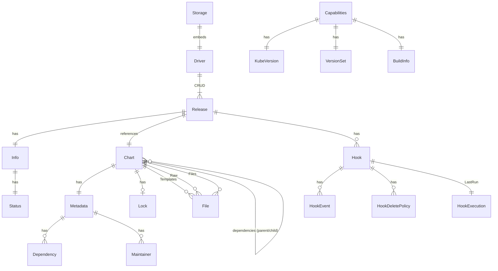
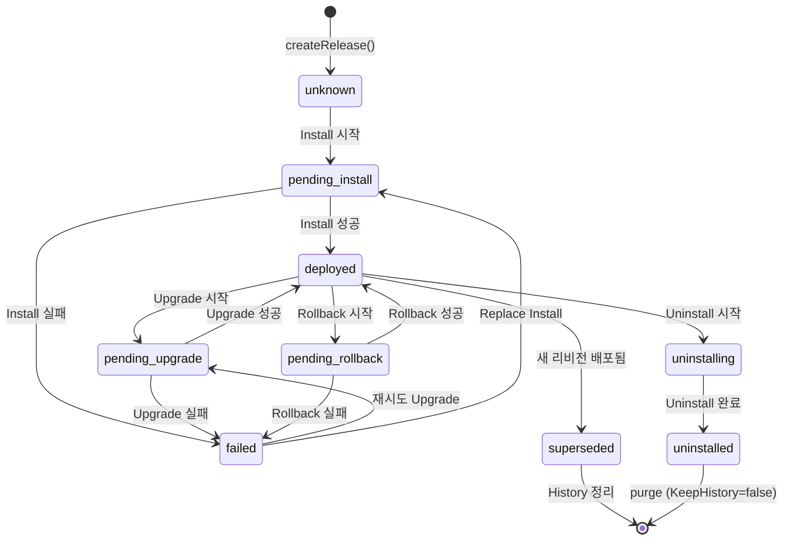

# Helm v4 데이터 모델

## 1. 개요

Helm v4의 데이터 모델은 크게 세 가지 핵심 도메인으로 구성된다:

- **Chart**: 패키지 정의 (템플릿, 메타데이터, 값, 의존성)
- **Release**: 배포 인스턴스 (차트 + 설정 + 상태 + 이력)
- **Storage Driver**: 릴리스 저장/조회 인터페이스

이 문서에서는 각 도메인의 구조체, 인터페이스, 데이터 흐름을 소스 코드 기반으로 분석한다.

## 2. ER 다이어그램



## 3. Chart 데이터 모델

### 3.1 Charter 인터페이스와 Accessor 인터페이스

소스 경로: `pkg/chart/interfaces.go`

```go
// pkg/chart/interfaces.go
type Charter any
type Dependency any

type Accessor interface {
    Name() string
    IsRoot() bool
    MetadataAsMap() map[string]any
    Files() []*common.File
    Templates() []*common.File
    ChartFullPath() string
    IsLibraryChart() bool
    Dependencies() []Charter
    MetaDependencies() []Dependency
    Values() map[string]any
    Schema() []byte
    Deprecated() bool
}

type DependencyAccessor interface {
    Name() string
    Alias() string
}
```

Helm v4에서 `Charter`는 `any` 타입으로 정의된다. 이는 차트 버전 간 호환성을 위한 설계로, 구체적인 구현은 `pkg/chart/v2` 패키지에 있다. `Accessor` 인터페이스를 통해 차트의 속성에 접근하며, 이를 통해 엔진이나 Action 코드가 특정 차트 버전에 종속되지 않는다.

### 3.2 Chart 구조체

소스 경로: `pkg/chart/v2/chart.go`

```go
// pkg/chart/v2/chart.go
type Chart struct {
    Raw           []*common.File   `json:"-"`               // 원본 파일 (helm show values에 사용)
    Metadata      *Metadata        `json:"metadata"`        // Chart.yaml 내용
    Lock          *Lock            `json:"lock"`             // Chart.lock 내용
    Templates     []*common.File   `json:"templates"`       // templates/ 디렉토리
    Values        map[string]any   `json:"values"`           // values.yaml 기본값
    Schema        []byte           `json:"schema"`           // values.schema.json
    SchemaModTime time.Time        `json:"schemamodtime"`
    Files         []*common.File   `json:"files"`            // 기타 파일 (README, LICENSE, crds/)
    ModTime       time.Time        `json:"modtime,omitzero"`

    parent       *Chart                                      // 부모 차트 (비공개)
    dependencies []*Chart                                    // 서브차트 (비공개)
}
```

차트의 파일 구조와 구조체 필드의 대응:

```
mychart/
  +-- Chart.yaml          -> Metadata
  +-- Chart.lock          -> Lock
  +-- values.yaml         -> Values
  +-- values.schema.json  -> Schema
  +-- templates/          -> Templates ([]*common.File)
  |   +-- deployment.yaml
  |   +-- service.yaml
  |   +-- _helpers.tpl
  |   +-- NOTES.txt
  +-- crds/               -> Files ([]*common.File, "crds/" 접두사로 필터)
  |   +-- crd.yaml
  +-- charts/             -> dependencies ([]*Chart, 비공개)
  |   +-- subchart1/
  |   +-- subchart2/
  +-- README.md           -> Files ([]*common.File)
  +-- LICENSE             -> Files
```

### 3.3 차트 트리 구조

차트는 `parent`/`dependencies` 포인터를 통해 트리 구조를 형성한다:

```
Root Chart (parent=nil)
  |
  +-- SubChart A (parent=Root)
  |     +-- SubChart A1 (parent=A)
  |     +-- SubChart A2 (parent=A)
  |
  +-- SubChart B (parent=Root)
```

관련 메서드:

```go
// pkg/chart/v2/chart.go
func (ch *Chart) IsRoot() bool { return ch.parent == nil }
func (ch *Chart) Parent() *Chart { return ch.parent }
func (ch *Chart) Dependencies() []*Chart { return ch.dependencies }
func (ch *Chart) Root() *Chart {
    if ch.IsRoot() { return ch }
    return ch.Parent().Root()
}

// ChartFullPath: "root/charts/subA/charts/subA1" 형태
func (ch *Chart) ChartFullPath() string {
    if !ch.IsRoot() {
        return ch.Parent().ChartFullPath() + "/charts/" + ch.Name()
    }
    return ch.Name()
}
```

### 3.4 CRD 객체

```go
// pkg/chart/v2/chart.go
type CRD struct {
    Name     string        // File.Name (crds/crd.yaml)
    Filename string        // ChartFullPath 포함 (mychart/crds/crd.yaml)
    File     *common.File  // 실제 파일 데이터
}

func (ch *Chart) CRDObjects() []CRD {
    crds := []CRD{}
    for _, f := range ch.Files {
        if strings.HasPrefix(f.Name, "crds/") && hasManifestExtension(f.Name) {
            mycrd := CRD{Name: f.Name, Filename: filepath.Join(ch.ChartFullPath(), f.Name), File: f}
            crds = append(crds, mycrd)
        }
    }
    // 서브차트의 CRD도 재귀적으로 수집
    for _, dep := range ch.Dependencies() {
        crds = append(crds, dep.CRDObjects()...)
    }
    return crds
}
```

CRD는 `crds/` 디렉토리에 위치하며, `.yaml`, `.yml`, `.json` 확장자를 가진 파일만 인식된다. CRD는 템플릿 엔진을 거치지 않고 직접 Kubernetes에 적용된다.

## 4. Metadata 구조체

소스 경로: `pkg/chart/v2/metadata.go`

```go
// pkg/chart/v2/metadata.go
type Metadata struct {
    Name          string              `json:"name,omitempty"`        // 차트 이름 (필수)
    Home          string              `json:"home,omitempty"`        // 프로젝트 홈페이지
    Sources       []string            `json:"sources,omitempty"`     // 소스 코드 URL
    Version       string              `json:"version,omitempty"`     // SemVer 버전 (필수)
    Description   string              `json:"description,omitempty"` // 한 줄 설명
    Keywords      []string            `json:"keywords,omitempty"`    // 검색 키워드
    Maintainers   []*Maintainer       `json:"maintainers,omitempty"` // 관리자 목록
    Icon          string              `json:"icon,omitempty"`        // 아이콘 URL
    APIVersion    string              `json:"apiVersion,omitempty"`  // 차트 API 버전 (필수)
    Condition     string              `json:"condition,omitempty"`   // 조건부 활성화 경로
    Tags          string              `json:"tags,omitempty"`        // 태그 기반 활성화
    AppVersion    string              `json:"appVersion,omitempty"`  // 애플리케이션 버전
    Deprecated    bool                `json:"deprecated,omitempty"`  // 폐기 여부
    Annotations   map[string]string   `json:"annotations,omitempty"` // 사용자 정의 어노테이션
    KubeVersion   string              `json:"kubeVersion,omitempty"` // K8s 버전 제약
    Dependencies  []*Dependency       `json:"dependencies,omitempty"`// 의존성 목록
    Type          string              `json:"type,omitempty"`        // application | library
}

type Maintainer struct {
    Name  string `json:"name,omitempty"`
    Email string `json:"email,omitempty"`
    URL   string `json:"url,omitempty"`
}
```

### Metadata 검증 규칙

`Metadata.Validate()` 메서드가 수행하는 검증:

| 규칙 | 설명 |
|------|------|
| `APIVersion` 필수 | `"v1"` 또는 `"v2"` |
| `Name` 필수 | 경로 탐색 문자 불허 (`filepath.Base(Name) == Name`) |
| `Version` 필수 | 유효한 SemVer 형식 |
| `Type` 검증 | `""`, `"application"`, `"library"` 중 하나 |
| 문자열 새니타이징 | 비출력 문자 제거, 공백 정규화 |
| 의존성 중복 검사 | `Name` 또는 `Alias` 기준으로 중복 불허 |

### 차트 타입

```go
// pkg/chart/v2/metadata.go
func isValidChartType(in string) bool {
    switch in {
    case "", "application", "library":
        return true
    }
    return false
}
```

- **application** (기본): 설치 가능한 차트. 리소스 오브젝트를 생성한다.
- **library**: 설치 불가. `_helpers.tpl` 같은 공유 템플릿만 제공한다. 라이브러리 차트의 템플릿 중 `_` 접두사가 없는 파일은 렌더링에서 제외된다.

## 5. Dependency 구조체

소스 경로: `pkg/chart/v2/dependency.go`

```go
// pkg/chart/v2/dependency.go
type Dependency struct {
    Name         string   `json:"name" yaml:"name"`                           // 의존 차트 이름
    Version      string   `json:"version,omitempty" yaml:"version,omitempty"` // SemVer 범위
    Repository   string   `json:"repository" yaml:"repository"`               // 저장소 URL
    Condition    string   `json:"condition,omitempty" yaml:"condition,omitempty"` // 활성화 조건 경로
    Tags         []string `json:"tags,omitempty" yaml:"tags,omitempty"`       // 활성화 태그
    Enabled      bool     `json:"enabled,omitempty" yaml:"enabled,omitempty"` // 활성화 여부
    ImportValues []any    `json:"import-values,omitempty" yaml:"import-values,omitempty"` // 값 가져오기
    Alias        string   `json:"alias,omitempty" yaml:"alias,omitempty"`     // 별칭
}
```

### Lock 구조체

```go
// pkg/chart/v2/dependency.go
type Lock struct {
    Generated    time.Time     `json:"generated"`     // 생성 시간
    Digest       string        `json:"digest"`        // Chart.yaml 의존성의 해시
    Dependencies []*Dependency `json:"dependencies"`  // 잠긴 의존성 목록
}
```

`Chart.lock`은 `helm dependency update` 실행 시 생성되며, 의존성의 정확한 버전을 고정한다. `Dependency.Version`이 SemVer 범위(예: `^2.0.0`)인 반면, Lock의 의존성은 정확한 버전(예: `2.3.1`)을 기록한다.

### Alias 기능

```go
// pkg/chart/v2/dependency.go
var aliasNameFormat = regexp.MustCompile("^[a-zA-Z0-9_-]+$")
```

Alias를 사용하면 같은 차트를 다른 이름으로 여러 번 의존할 수 있다:

```yaml
# Chart.yaml
dependencies:
  - name: mysql
    version: "5.x"
    repository: "https://charts.example.com"
    alias: primary-db
  - name: mysql
    version: "5.x"
    repository: "https://charts.example.com"
    alias: secondary-db
```

## 6. File 구조체

소스 경로: `pkg/chart/common/file.go`

```go
// pkg/chart/common/file.go
type File struct {
    Name    string    `json:"name"`               // 상대 경로 (예: "templates/deployment.yaml")
    Data    []byte    `json:"data"`               // 파일 내용
    ModTime time.Time `json:"modtime,omitzero"`   // 수정 시간
}
```

`File`은 차트 아카이브 내의 모든 파일을 표현하는 범용 구조체이다. `Name`은 차트 루트 기준 상대 경로이다.

## 7. Values 타입

소스 경로: `pkg/chart/common/values.go`

```go
// pkg/chart/common/values.go
type Values map[string]any

// GlobalKey는 글로벌 변수를 저장하는 Values 키 이름
const GlobalKey = "global"
```

### 핵심 메서드

```go
// 점(.) 구분 경로로 하위 테이블 접근
func (v Values) Table(name string) (Values, error) { ... }

// 점(.) 구분 경로로 값 접근
func (v Values) PathValue(path string) (any, error) { ... }

// YAML 직렬화
func (v Values) YAML() (string, error) { ... }

// nil 안전 맵 변환
func (v Values) AsMap() map[string]any { ... }

// YAML 바이트 파싱
func ReadValues(data []byte) (vals Values, err error) { ... }

// YAML 파일 파싱
func ReadValuesFile(filename string) (Values, error) { ... }
```

### Values 병합 체인

Helm에서 값은 여러 소스에서 병합된다. 우선순위는 다음과 같다 (높은 것이 우선):

```
사용자 지정 값 (--set, --values)
         |
         v
부모 차트의 서브차트 값 (values.yaml의 subchart 키)
         |
         v
차트 기본값 (values.yaml)
         |
         v
글로벌 값 (values.yaml의 "global" 키)
```

### ReleaseOptions

```go
// pkg/chart/common/values.go
type ReleaseOptions struct {
    Name      string   // 릴리스 이름
    Namespace string   // K8s 네임스페이스
    Revision  int      // 리비전 번호
    IsUpgrade bool     // 업그레이드 여부
    IsInstall bool     // 설치 여부
}
```

`ReleaseOptions`는 템플릿 렌더링 시 `.Release` 객체를 구성하는 데 사용된다:

```
{{ .Release.Name }}       -> ReleaseOptions.Name
{{ .Release.Namespace }}  -> ReleaseOptions.Namespace
{{ .Release.Revision }}   -> ReleaseOptions.Revision
{{ .Release.IsUpgrade }}  -> ReleaseOptions.IsUpgrade
{{ .Release.IsInstall }}  -> ReleaseOptions.IsInstall
```

## 8. Capabilities 구조체

소스 경로: `pkg/chart/common/capabilities.go`

```go
// pkg/chart/common/capabilities.go
type Capabilities struct {
    KubeVersion KubeVersion            // Kubernetes 버전 정보
    APIVersions VersionSet             // 지원하는 API 버전 목록
    HelmVersion helmversion.BuildInfo  // Helm 빌드 정보
}

type KubeVersion struct {
    Version           string   // 전체 버전 (예: v1.33.4-gke.1245000)
    normalizedVersion string   // 정규화된 버전 (예: v1.33.4) - 제약 조건 검사용
    Major             string   // 메이저 버전
    Minor             string   // 마이너 버전
}

type VersionSet []string

func (v VersionSet) Has(apiVersion string) bool {
    return slices.Contains(v, apiVersion)
}
```

### Capabilities의 역할

1. **KubeVersion 호환성 검사**: 차트의 `Metadata.KubeVersion` 필드와 실제 클러스터 버전을 비교한다.
2. **API 버전 검사**: 템플릿에서 `.Capabilities.APIVersions.Has "apps/v1"` 조건을 사용하여 특정 API가 클러스터에서 지원되는지 확인한다.
3. **Helm 버전 정보**: `.Capabilities.HelmVersion`으로 Helm 빌드 정보에 접근한다.

### Capabilities 획득 과정

```go
// pkg/action/action.go
func (cfg *Configuration) getCapabilities() (*common.Capabilities, error) {
    if cfg.Capabilities != nil {
        return cfg.Capabilities, nil   // 캐시된 값 반환
    }
    dc, err := cfg.RESTClientGetter.ToDiscoveryClient()
    // ...
    kubeVersion, err := dc.ServerVersion()
    apiVersions, err := GetVersionSet(dc)
    // ...
    cfg.Capabilities = &common.Capabilities{
        APIVersions: apiVersions,
        KubeVersion: common.KubeVersion{
            Version: kubeVersion.GitVersion,
            Major:   kubeVersion.Major,
            Minor:   kubeVersion.Minor,
        },
        HelmVersion: common.DefaultCapabilities.HelmVersion,
    }
    return cfg.Capabilities, nil
}
```

`helm template` (클라이언트 전용 모드)에서는 기본 Capabilities를 사용한다:

```go
// pkg/action/install.go - RunWithContext() 중
if !interactWithServer(i.DryRunStrategy) {
    i.cfg.Capabilities = common.DefaultCapabilities.Copy()
    if i.KubeVersion != nil {
        i.cfg.Capabilities.KubeVersion = *i.KubeVersion
    }
    // ...
}
```

## 9. Release 데이터 모델

### 9.1 Releaser 인터페이스와 Accessor 인터페이스

소스 경로: `pkg/release/interfaces.go`

```go
// pkg/release/interfaces.go
type Releaser any
type Hook any

type Accessor interface {
    Name() string
    Namespace() string
    Version() int
    Hooks() []Hook
    Manifest() string
    Notes() string
    Labels() map[string]string
    Chart() chart.Charter
    Status() string
    ApplyMethod() string
    DeployedAt() time.Time
}

type HookAccessor interface {
    Path() string
    Manifest() string
}
```

`Charter`와 마찬가지로 `Releaser`도 `any` 타입이다. 이는 릴리스 버전 간 호환성을 위한 설계이다.

### 9.2 Release 구조체

소스 경로: `pkg/release/v1/release.go`

```go
// pkg/release/v1/release.go
type Release struct {
    Name        string            `json:"name,omitempty"`         // 릴리스 이름
    Info        *Info             `json:"info,omitempty"`         // 릴리스 정보 (상태, 시간)
    Chart       *chart.Chart      `json:"chart,omitempty"`        // 설치에 사용된 차트
    Config      map[string]any    `json:"config,omitempty"`       // 사용자 오버라이드 값
    Manifest    string            `json:"manifest,omitempty"`     // 렌더링된 매니페스트
    Hooks       []*Hook           `json:"hooks,omitempty"`        // 훅 목록
    Version     int               `json:"version,omitempty"`      // 리비전 번호
    Namespace   string            `json:"namespace,omitempty"`    // K8s 네임스페이스
    Labels      map[string]string `json:"-"`                      // 레이블 (Storage 메타데이터)
    ApplyMethod string            `json:"apply_method,omitempty"` // "ssa" | "csa"
}

type ApplyMethod string

const ApplyMethodClientSideApply ApplyMethod = "csa"
const ApplyMethodServerSideApply ApplyMethod = "ssa"
```

### Release 구조체 상세 관계도

```
Release
  |
  +-- Name: "my-app"
  +-- Namespace: "default"
  +-- Version: 3 (리비전 번호)
  +-- ApplyMethod: "ssa"
  |
  +-- Info ----------------------+
  |     +-- FirstDeployed        |  릴리스 메타 정보
  |     +-- LastDeployed         |
  |     +-- Deleted              |
  |     +-- Description          |
  |     +-- Status: "deployed"   |
  |     +-- Notes: "..."         |
  |     +-- Resources            |
  |                              |
  +-- Chart --------------------+
  |     +-- Metadata             |  설치 시점의 차트 스냅샷
  |     +-- Templates            |
  |     +-- Values               |
  |     +-- Dependencies         |
  |                              |
  +-- Config -------------------+
  |     {                        |  사용자가 --set 또는 -f로 제공한 값
  |       "replicaCount": 3,     |
  |       "image.tag": "v2.0"    |
  |     }                        |
  |                              |
  +-- Manifest -----------------+
  |     "---\n# Source: ..."     |  렌더링된 전체 YAML
  |                              |
  +-- Hooks --------------------+
        []*Hook                  |  훅 리소스 목록
```

### 9.3 Info 구조체

소스 경로: `pkg/release/v1/info.go`

```go
// pkg/release/v1/info.go
type Info struct {
    FirstDeployed time.Time                  `json:"first_deployed,omitzero"` // 최초 배포 시간
    LastDeployed  time.Time                  `json:"last_deployed,omitzero"`  // 최근 배포 시간
    Deleted       time.Time                  `json:"deleted,omitzero"`        // 삭제 시간
    Description   string                     `json:"description,omitempty"`   // 상태 설명
    Status        common.Status              `json:"status,omitempty"`        // 현재 상태
    Notes         string                     `json:"notes,omitempty"`         // NOTES.txt 렌더링 결과
    Resources     map[string][]runtime.Object `json:"resources,omitempty"`    // 배포된 리소스 정보
}
```

### 9.4 Status 타입

소스 경로: `pkg/release/common/status.go`

```go
// pkg/release/common/status.go
type Status string

const (
    StatusUnknown         Status = "unknown"          // 불확실한 상태
    StatusDeployed        Status = "deployed"          // 배포 완료
    StatusUninstalled     Status = "uninstalled"       // 제거 완료
    StatusSuperseded      Status = "superseded"        // 다른 릴리스로 대체됨
    StatusFailed          Status = "failed"            // 배포 실패
    StatusUninstalling    Status = "uninstalling"      // 제거 진행 중
    StatusPendingInstall  Status = "pending-install"   // 설치 진행 중
    StatusPendingUpgrade  Status = "pending-upgrade"   // 업그레이드 진행 중
    StatusPendingRollback Status = "pending-rollback"  // 롤백 진행 중
)

func (x Status) IsPending() bool {
    return x == StatusPendingInstall || x == StatusPendingUpgrade || x == StatusPendingRollback
}
```

### 상태 전이 다이어그램



### Pending 상태의 의미

`IsPending()` 메서드는 다른 Helm 작업이 진행 중인지 확인하는 데 사용된다. Upgrade 시 마지막 릴리스가 pending 상태이면 `errPending` 에러를 반환하여 동시 실행을 방지한다:

```go
// pkg/action/upgrade.go - prepareUpgrade() 중
if lastRelease.Info.Status.IsPending() {
    return nil, nil, false, errPending
}
```

## 10. Hook 데이터 모델

소스 경로: `pkg/release/v1/hook.go`

### 10.1 Hook 구조체

```go
// pkg/release/v1/hook.go
type Hook struct {
    Name              string             `json:"name,omitempty"`              // 리소스 이름
    Kind              string             `json:"kind,omitempty"`              // K8s 리소스 종류
    Path              string             `json:"path,omitempty"`              // 차트 내 상대 경로
    Manifest          string             `json:"manifest,omitempty"`          // YAML 매니페스트
    Events            []HookEvent        `json:"events,omitempty"`            // 실행 이벤트 목록
    LastRun           HookExecution      `json:"last_run"`                    // 마지막 실행 정보
    Weight            int                `json:"weight,omitempty"`            // 실행 순서 (낮을수록 먼저)
    DeletePolicies    []HookDeletePolicy `json:"delete_policies,omitempty"`   // 삭제 정책
    OutputLogPolicies []HookOutputLogPolicy `json:"output_log_policies,omitempty"` // 로그 출력 정책
}
```

### 10.2 HookEvent 타입

```go
// pkg/release/v1/hook.go
type HookEvent string

const (
    HookPreInstall   HookEvent = "pre-install"    // 설치 전
    HookPostInstall  HookEvent = "post-install"   // 설치 후
    HookPreDelete    HookEvent = "pre-delete"     // 삭제 전
    HookPostDelete   HookEvent = "post-delete"    // 삭제 후
    HookPreUpgrade   HookEvent = "pre-upgrade"    // 업그레이드 전
    HookPostUpgrade  HookEvent = "post-upgrade"   // 업그레이드 후
    HookPreRollback  HookEvent = "pre-rollback"   // 롤백 전
    HookPostRollback HookEvent = "post-rollback"  // 롤백 후
    HookTest         HookEvent = "test"           // 테스트
)
```

### 10.3 HookDeletePolicy 타입

```go
// pkg/release/v1/hook.go
type HookDeletePolicy string

const (
    HookSucceeded          HookDeletePolicy = "hook-succeeded"          // 성공 시 삭제
    HookFailed             HookDeletePolicy = "hook-failed"             // 실패 시 삭제
    HookBeforeHookCreation HookDeletePolicy = "before-hook-creation"    // 재생성 전 기존 삭제 (기본값)
)
```

삭제 정책이 지정되지 않으면 기본값은 `before-hook-creation`이다:

```go
// pkg/action/hooks.go - hookSetDeletePolicy() 중
if len(h.DeletePolicies) == 0 {
    h.DeletePolicies = []release.HookDeletePolicy{release.HookBeforeHookCreation}
}
```

### 10.4 HookOutputLogPolicy 타입

```go
// pkg/release/v1/hook.go
type HookOutputLogPolicy string

const (
    HookOutputOnSucceeded HookOutputLogPolicy = "hook-succeeded"  // 성공 시 로그 출력
    HookOutputOnFailed    HookOutputLogPolicy = "hook-failed"     // 실패 시 로그 출력
)
```

### 10.5 HookExecution 구조체

```go
// pkg/release/v1/hook.go
type HookExecution struct {
    StartedAt   time.Time `json:"started_at,omitzero"`    // 실행 시작 시간
    CompletedAt time.Time `json:"completed_at,omitzero"`  // 실행 완료 시간
    Phase       HookPhase `json:"phase"`                   // 실행 상태
}

type HookPhase string

const (
    HookPhaseUnknown   HookPhase = "Unknown"    // 알 수 없음
    HookPhaseRunning   HookPhase = "Running"    // 실행 중
    HookPhaseSucceeded HookPhase = "Succeeded"  // 성공
    HookPhaseFailed    HookPhase = "Failed"     // 실패
)
```

### 10.6 Hook 어노테이션

훅은 Kubernetes 리소스의 어노테이션으로 정의된다:

```go
// pkg/release/v1/hook.go
const HookAnnotation         = "helm.sh/hook"                  // 훅 이벤트 지정
const HookWeightAnnotation   = "helm.sh/hook-weight"           // 실행 순서
const HookDeleteAnnotation   = "helm.sh/hook-delete-policy"    // 삭제 정책
const HookOutputLogAnnotation = "helm.sh/hook-output-log-policy" // 로그 출력 정책
```

예시 YAML:

```yaml
apiVersion: batch/v1
kind: Job
metadata:
  name: "{{ .Release.Name }}-db-migrate"
  annotations:
    "helm.sh/hook": pre-upgrade
    "helm.sh/hook-weight": "-5"
    "helm.sh/hook-delete-policy": before-hook-creation,hook-succeeded
    "helm.sh/hook-output-log-policy": hook-failed
spec:
  template:
    spec:
      containers:
      - name: migrate
        image: "{{ .Values.image.repository }}:{{ .Values.image.tag }}"
        command: ["./migrate.sh"]
      restartPolicy: Never
```

## 11. Storage Driver 인터페이스

소스 경로: `pkg/storage/driver/driver.go`

### 11.1 인터페이스 분해

```go
// pkg/storage/driver/driver.go

// 생성
type Creator interface {
    Create(key string, rls release.Releaser) error
}

// 수정
type Updator interface {
    Update(key string, rls release.Releaser) error
}

// 삭제
type Deletor interface {
    Delete(key string) (release.Releaser, error)
}

// 조회
type Queryor interface {
    Get(key string) (release.Releaser, error)
    List(filter func(release.Releaser) bool) ([]release.Releaser, error)
    Query(labels map[string]string) ([]release.Releaser, error)
}

// 전체 인터페이스
type Driver interface {
    Creator
    Updator
    Deletor
    Queryor
    Name() string
}
```

### 왜 인터페이스를 분리했는가?

`Driver` 인터페이스를 `Creator`, `Updator`, `Deletor`, `Queryor`로 세분화한 이유:

1. **인터페이스 분리 원칙(ISP)**: 각 역할을 독립적으로 정의하여 구현체가 필요한 부분만 채택할 수 있다
2. **테스트 용이성**: 특정 역할만 모킹할 수 있다
3. **문서화 효과**: 각 인터페이스에 고유한 문서를 달아 역할을 명확히 한다

### 11.2 에러 타입

```go
// pkg/storage/driver/driver.go
var (
    ErrReleaseNotFound    = errors.New("release: not found")
    ErrReleaseExists      = errors.New("release: already exists")
    ErrInvalidKey         = errors.New("release: invalid key")
    ErrNoDeployedReleases = errors.New("has no deployed releases")
)

type StorageDriverError struct {
    ReleaseName string
    Err         error
}
```

### 11.3 Storage 래퍼

```go
// pkg/storage/storage.go
type Storage struct {
    driver.Driver                // Driver 임베딩
    MaxHistory int               // 최대 이력 수
    logging.LogHolder            // 로거
}
```

`Storage`는 `Driver`를 임베딩하고 추가 기능을 제공한다:

| 메서드 | 설명 | 기본 Driver 메서드에 추가되는 로직 |
|--------|------|------|
| `Get(name, version)` | 특정 리비전 조회 | 키 생성 (`makeKey`) |
| `Create(rls)` | 릴리스 생성 | MaxHistory 초과 시 오래된 릴리스 자동 삭제 |
| `Update(rls)` | 릴리스 갱신 | 키 생성 |
| `Delete(name, version)` | 특정 리비전 삭제 | 키 생성 |
| `Last(name)` | 최신 리비전 조회 | History 조회 후 가장 높은 리비전 반환 |
| `Deployed(name)` | 배포 중인 릴리스 조회 | 여러 deployed 중 최신 반환 |
| `History(name)` | 전체 이력 조회 | Query로 owner=helm, name=이름 필터 |
| `ListReleases()` | 모든 릴리스 조회 | 필터 없이 전체 목록 |
| `ListDeployed()` | 배포 중인 릴리스 목록 | StatusDeployed 필터 |
| `ListUninstalled()` | 제거된 릴리스 목록 | StatusUninstalled 필터 |

### 11.4 키 생성 규칙

```go
// pkg/storage/storage.go
const HelmStorageType = "sh.helm.release.v1"

func makeKey(rlsname string, version int) string {
    return fmt.Sprintf("%s.%s.v%d", HelmStorageType, rlsname, version)
}
```

예시:

| 릴리스 이름 | 리비전 | 키 |
|------------|--------|-----|
| my-app | 1 | `sh.helm.release.v1.my-app.v1` |
| my-app | 2 | `sh.helm.release.v1.my-app.v2` |
| redis | 5 | `sh.helm.release.v1.redis.v5` |

이 키는 Kubernetes Secret/ConfigMap의 이름으로 사용되며, `HelmStorageType` 접두사를 통해 다른 리소스와의 충돌을 방지한다.

## 12. 템플릿 렌더링 시 사용 가능한 객체

엔진이 템플릿에 전달하는 최상위 객체:

```go
// pkg/engine/engine.go - recAllTpls() 중
next := map[string]any{
    "Chart":        chartMetaData,       // .Chart.*
    "Files":        newFiles(files),     // .Files.*
    "Release":      vals["Release"],     // .Release.*
    "Capabilities": vals["Capabilities"],// .Capabilities.*
    "Values":       make(common.Values), // .Values.*
    "Subcharts":    subCharts,           // .Subcharts.*
}
```

| 객체 | 소스 | 템플릿 사용 예시 |
|------|------|----------------|
| `.Chart` | `Metadata` 필드들 | `{{ .Chart.Name }}`, `{{ .Chart.Version }}` |
| `.Values` | 병합된 값 | `{{ .Values.replicaCount }}` |
| `.Release` | `ReleaseOptions` | `{{ .Release.Name }}`, `{{ .Release.Namespace }}` |
| `.Capabilities` | `Capabilities` | `{{ .Capabilities.KubeVersion.Version }}` |
| `.Files` | `[]*common.File` | `{{ .Files.Get "config.ini" }}` |
| `.Template` | 현재 템플릿 정보 | `{{ .Template.Name }}`, `{{ .Template.BasePath }}` |
| `.Subcharts` | 서브차트 참조 | 서브차트 간 데이터 전달 |

## 13. 정리

Helm v4 데이터 모델의 핵심:

| 도메인 | 핵심 타입 | 역할 |
|--------|----------|------|
| **Chart** | `Chart`, `Metadata`, `Dependency`, `File`, `Values` | 패키지 정의와 구조 |
| **Release** | `Release`, `Info`, `Status`, `Hook` | 배포 인스턴스와 상태 관리 |
| **Storage** | `Driver`, `Storage`, `Creator`, `Updator`, `Deletor`, `Queryor` | 릴리스 영속화 |
| **Runtime** | `Capabilities`, `KubeVersion`, `VersionSet` | 클러스터 환경 정보 |

1. **Charter/Releaser는 any 타입**: 버전 간 호환성을 위해 `any`로 정의하고 `Accessor` 인터페이스로 접근한다
2. **Release는 차트의 스냅샷을 보관**: 릴리스에 차트 전체가 포함되어 있어 언제든 이전 상태를 복원할 수 있다
3. **Storage 키는 릴리스 이름+버전으로 구성**: `sh.helm.release.v1.{name}.v{version}` 형태
4. **Values는 계층적으로 병합**: 글로벌 -> 차트 기본 -> 부모 차트 -> 사용자 값 순서
5. **Hook은 어노테이션 기반**: 별도의 설정 파일 없이 Kubernetes 리소스의 어노테이션으로 정의한다
6. **Status는 비관적 잠금 역할**: `IsPending()` 상태이면 동시 작업을 거부한다
