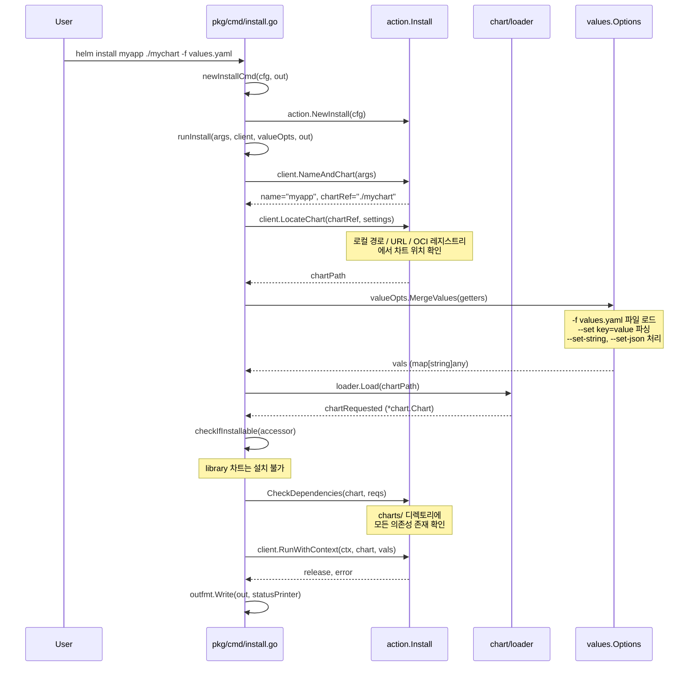
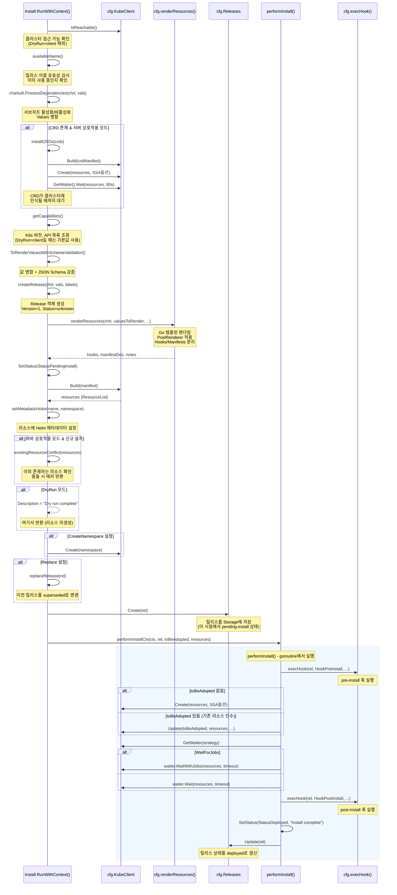
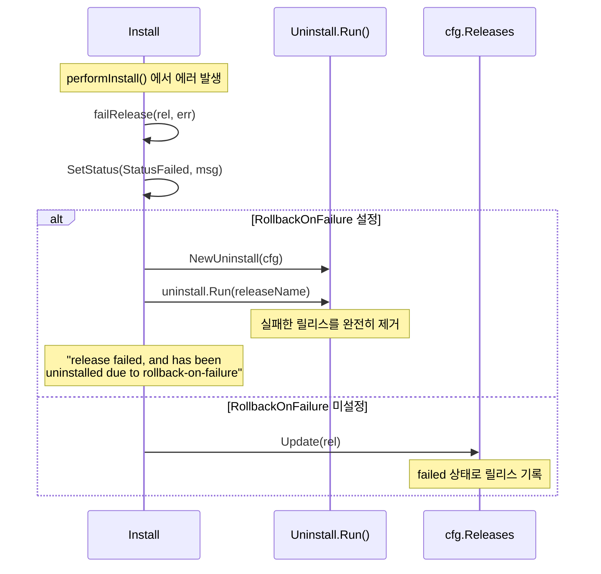
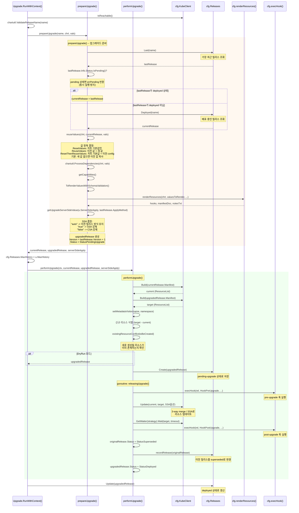
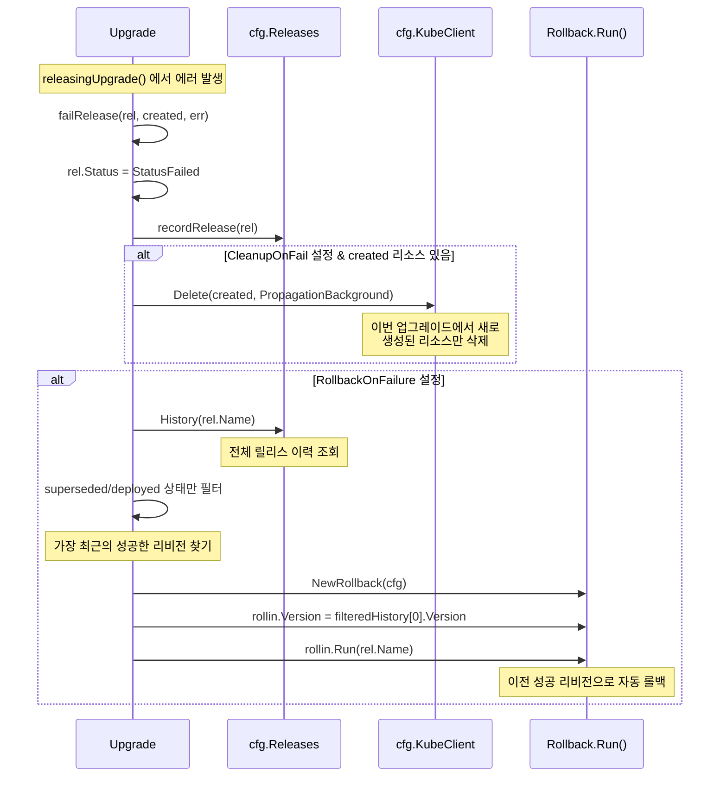
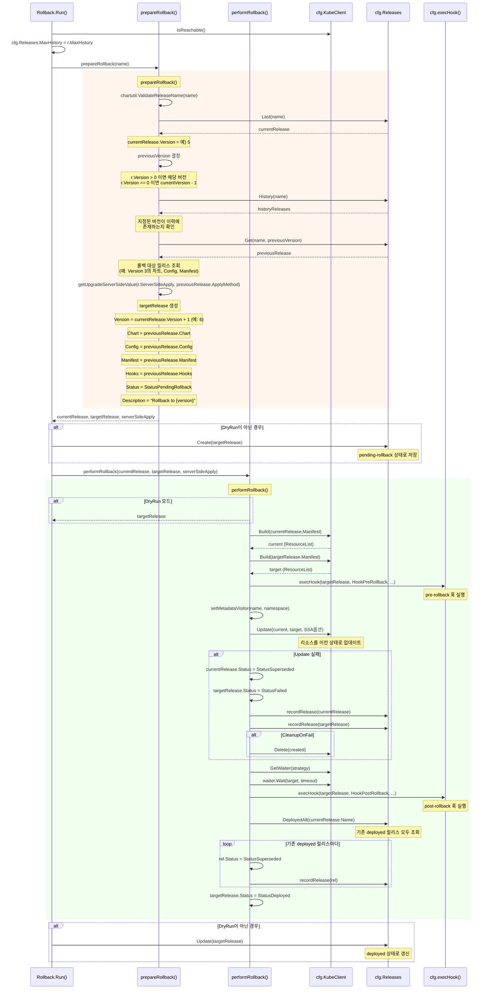
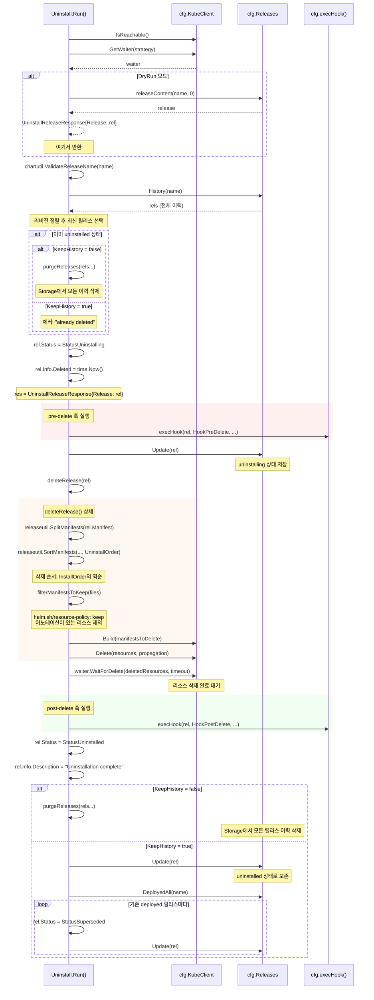
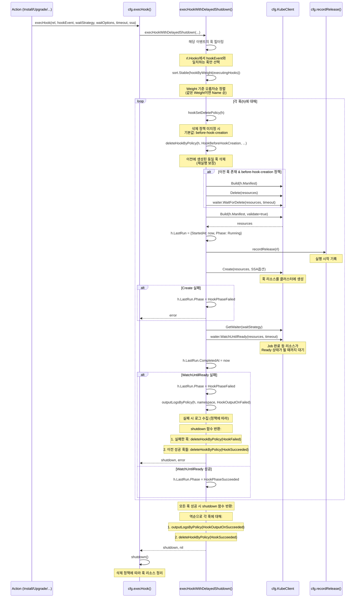

# Helm v4 시퀀스 다이어그램

## 1. 개요

이 문서는 Helm v4의 주요 작업 흐름을 소스 코드 기반으로 분석하고, Mermaid 시퀀스 다이어그램으로 시각화한다. 다루는 흐름은 다음과 같다:

1. `helm install` -- 차트 설치
2. `helm upgrade` -- 릴리스 업그레이드
3. `helm rollback` -- 릴리스 롤백
4. `helm uninstall` -- 릴리스 제거
5. Hook 실행 시퀀스 -- 공통 훅 실행 로직

각 다이어그램은 실제 소스 코드의 함수 호출 순서를 따른다.

## 2. helm install 흐름

소스 경로: `pkg/cmd/install.go`, `pkg/action/install.go`

### 2.1 CLI 계층 흐름

`helm install myapp ./mychart -f values.yaml --set key=value` 명령 실행 시:



### 2.2 Action 계층 흐름 (Install.RunWithContext)

소스 경로: `pkg/action/install.go` -- `RunWithContext()`, `performInstall()`



### 2.3 Install 실패 시 흐름

소스 경로: `pkg/action/install.go` -- `failRelease()`



## 3. helm upgrade 흐름

소스 경로: `pkg/action/upgrade.go`

### 3.1 전체 흐름 (Upgrade.RunWithContext)



### 3.2 Values 재사용 정책 상세

소스 경로: `pkg/action/upgrade.go` -- `reuseValues()`

```
+-----------------------+----------------------------------+
| 플래그                | 동작                              |
+-----------------------+----------------------------------+
| --reset-values        | 차트의 values.yaml만 사용         |
|                       | 이전 릴리스 Config 무시            |
+-----------------------+----------------------------------+
| --reuse-values        | 이전 릴리스의 병합된 값을 기반으로  |
|                       | 새 값을 위에 덮어쓴다              |
|                       | chart.Values = 이전 병합값         |
|                       | newVals = CoalesceTables(newVals,  |
|                       |           current.Config)          |
+-----------------------+----------------------------------+
| --reset-then-reuse    | 차트의 values.yaml을 기반으로      |
|                       | 이전 Config을 위에 병합             |
|                       | newVals = CoalesceTables(newVals,  |
|                       |           current.Config)          |
+-----------------------+----------------------------------+
| (기본)                | 새 값이 없으면 이전 Config 복사    |
|                       | if len(newVals)==0 &&              |
|                       |    len(current.Config)>0 {         |
|                       |    newVals = current.Config        |
|                       | }                                  |
+-----------------------+----------------------------------+
```

### 3.3 Upgrade 실패 시 흐름

소스 경로: `pkg/action/upgrade.go` -- `failRelease()`



## 4. helm rollback 흐름

소스 경로: `pkg/action/rollback.go`

### 4.1 전체 흐름 (Rollback.Run)



### 4.2 Rollback의 핵심 특성

롤백은 **새 리비전을 생성**한다. 이전 리비전의 차트, 설정, 매니페스트를 복사하여 새 리비전으로 만든다:

```
리비전 이력 예시:

v1 (deployed)  -> helm install
v2 (superseded)-> helm upgrade
v3 (failed)    -> helm upgrade (실패)
v4 (superseded)-> helm rollback 2 (v2의 내용을 복사하여 새 리비전 생성)
v5 (deployed)  -> helm upgrade (성공)
```

소스 코드에서 확인할 수 있듯이, `targetRelease.Version = currentRelease.Version + 1`이며, `targetRelease.Chart`, `Config`, `Manifest`, `Hooks`는 모두 `previousRelease`에서 복사된다:

```go
// pkg/action/rollback.go - prepareRollback() 중
targetRelease := &release.Release{
    Name:      name,
    Namespace: currentRelease.Namespace,
    Chart:     previousRelease.Chart,        // 이전 차트
    Config:    previousRelease.Config,       // 이전 설정
    Info: &release.Info{
        FirstDeployed: currentRelease.Info.FirstDeployed,
        LastDeployed:  time.Now(),
        Status:        common.StatusPendingRollback,
        Notes:         previousRelease.Info.Notes,
        Description:   fmt.Sprintf("Rollback to %d", previousVersion),
    },
    Version:     currentRelease.Version + 1,  // 새 리비전 번호
    Labels:      previousRelease.Labels,
    Manifest:    previousRelease.Manifest,    // 이전 매니페스트
    Hooks:       previousRelease.Hooks,       // 이전 훅
    ApplyMethod: string(determineReleaseSSApplyMethod(serverSideApply)),
}
```

## 5. helm uninstall 흐름

소스 경로: `pkg/action/uninstall.go`

### 5.1 전체 흐름 (Uninstall.Run)



### 5.2 리소스 삭제 순서

`deleteRelease()` 함수에서 `releaseutil.SortManifests()`는 `UninstallOrder`를 사용한다. 이는 `InstallOrder`의 역순으로, 의존하는 리소스부터 먼저 삭제한다:

```
설치 순서 (InstallOrder):
  Namespace -> ServiceAccount -> Role -> RoleBinding -> Service -> Deployment -> ...

삭제 순서 (UninstallOrder):
  ... -> Deployment -> Service -> RoleBinding -> Role -> ServiceAccount -> Namespace
```

### 5.3 리소스 보존 정책

`filterManifestsToKeep()` 함수는 `helm.sh/resource-policy: keep` 어노테이션이 있는 리소스를 삭제 대상에서 제외한다:

```yaml
apiVersion: v1
kind: PersistentVolumeClaim
metadata:
  name: data-volume
  annotations:
    "helm.sh/resource-policy": keep
spec:
  # ...
```

### 5.4 Deletion Propagation

소스 경로: `pkg/action/uninstall.go` -- `parseCascadingFlag()`

```go
// pkg/action/uninstall.go
func parseCascadingFlag(cascadingFlag string) v1.DeletionPropagation {
    switch cascadingFlag {
    case "orphan":
        return v1.DeletePropagationOrphan       // 자식 리소스 유지
    case "foreground":
        return v1.DeletePropagationForeground    // 자식 먼저 삭제
    case "background":
        return v1.DeletePropagationBackground    // 비동기 삭제 (기본)
    default:
        return v1.DeletePropagationBackground
    }
}
```

## 6. Hook 실행 시퀀스

소스 경로: `pkg/action/hooks.go`

### 6.1 execHook() 전체 흐름



### 6.2 Hook Weight 정렬

소스 경로: `pkg/action/hooks.go`

```go
// pkg/action/hooks.go
type hookByWeight []*release.Hook

func (x hookByWeight) Less(i, j int) bool {
    if x[i].Weight == x[j].Weight {
        return x[i].Name < x[j].Name   // 같은 weight면 이름순
    }
    return x[i].Weight < x[j].Weight    // 낮은 weight 먼저
}
```

`sort.Stable`을 사용하므로 동일 weight의 훅은 원래 순서(리소스 종류 순서)가 유지된다.

### 6.3 삭제 정책 처리

```
+----------------------------+--------------------------------------------------+
| 정책                        | 동작                                              |
+----------------------------+--------------------------------------------------+
| before-hook-creation (기본) | 훅 실행 전에 이전 훅 리소스 삭제                    |
|                            | -> 매번 깨끗한 상태에서 실행                        |
+----------------------------+--------------------------------------------------+
| hook-succeeded             | 훅 성공 후 리소스 삭제                              |
|                            | -> 성공한 Job 리소스 정리                           |
+----------------------------+--------------------------------------------------+
| hook-failed                | 훅 실패 후 리소스 삭제                              |
|                            | -> 실패한 리소스 정리                               |
+----------------------------+--------------------------------------------------+
```

### 6.4 CRD는 삭제하지 않음

```go
// pkg/action/hooks.go - deleteHookByPolicy() 중
func (cfg *Configuration) deleteHookByPolicy(h *release.Hook, policy release.HookDeletePolicy, ...) error {
    if h.Kind == "CustomResourceDefinition" {
        return nil  // CRD는 절대 삭제하지 않음
    }
    // ...
}
```

CRD를 삭제하면 해당 CRD로 생성된 모든 커스텀 리소스가 가비지 컬렉션되므로, 훅 삭제 정책과 무관하게 CRD는 보호된다.

### 6.5 Hook 로그 출력

소스 경로: `pkg/action/hooks.go` -- `outputLogsByPolicy()`

```go
// pkg/action/hooks.go
func (cfg *Configuration) outputLogsByPolicy(h *release.Hook, releaseNamespace string,
    policy release.HookOutputLogPolicy) error {

    if !hookHasOutputLogPolicy(h, policy) {
        return nil
    }
    namespace, err := cfg.deriveNamespace(h, releaseNamespace)
    // ...
    switch h.Kind {
    case "Job":
        return cfg.outputContainerLogsForListOptions(namespace,
            metav1.ListOptions{LabelSelector: fmt.Sprintf("job-name=%s", h.Name)})
    case "Pod":
        return cfg.outputContainerLogsForListOptions(namespace,
            metav1.ListOptions{FieldSelector: fmt.Sprintf("metadata.name=%s", h.Name)})
    default:
        return nil  // Job, Pod 외의 리소스는 로그 미출력
    }
}
```

`hook-output-log-policy` 어노테이션이 설정된 Job이나 Pod의 경우, 훅 성공/실패 시 컨테이너 로그를 자동으로 수집하여 출력한다. 이 로그는 `Configuration.HookOutputFunc`을 통해 지정된 Writer로 전달된다.

## 7. 공통 패턴 요약

### 7.1 각 Action의 훅 이벤트 쌍

| Action | Pre 훅 | Post 훅 |
|--------|--------|---------|
| Install | `pre-install` | `post-install` |
| Upgrade | `pre-upgrade` | `post-upgrade` |
| Rollback | `pre-rollback` | `post-rollback` |
| Uninstall | `pre-delete` | `post-delete` |
| Test | - | `test` |

### 7.2 상태 전이 패턴

모든 Action이 따르는 공통 상태 전이 패턴:

```
1. 릴리스 생성/조회
2. Status = Pending (pending-install / pending-upgrade / pending-rollback)
3. Storage에 저장 (낙관적 잠금 역할)
4. Pre 훅 실행
5. 리소스 생성/업데이트/삭제
6. 리소스 준비 대기 (Wait)
7. Post 훅 실행
8. Status = Deployed (성공) / Failed (실패)
9. Storage 갱신
```

### 7.3 Context 취소 처리

Install과 Upgrade는 `context.Context`를 사용하여 SIGTERM/SIGINT 처리를 지원한다:

```go
// pkg/cmd/install.go - runInstall() 중
ctx := context.Background()
ctx, cancel := context.WithCancel(ctx)

cSignal := make(chan os.Signal, 2)
signal.Notify(cSignal, os.Interrupt, syscall.SIGTERM)
go func() {
    <-cSignal
    fmt.Fprintf(out, "Release %s has been cancelled.\n", args[0])
    cancel()
}()

ri, err := client.RunWithContext(ctx, chartRequested, vals)
```

Install의 `performInstallCtx()`는 goroutine에서 실행되며, context 취소 시 goroutine은 백그라운드에서 계속 실행된다:

```go
// pkg/action/install.go - performInstallCtx() 중
go func() {
    rel, err := i.performInstall(rel, toBeAdopted, resources)
    resultChan <- Msg{rel, err}
}()
select {
case <-ctx.Done():
    return rel, ctx.Err()       // context 취소 -- 즉시 반환
case msg := <-resultChan:
    return msg.r, msg.e          // 정상 완료
}
```

### 7.4 Server-Side Apply 결정 로직

```go
// pkg/action/upgrade.go
func getUpgradeServerSideValue(serverSideOption string, releaseApplyMethod string) (bool, error) {
    switch serverSideOption {
    case "auto":
        return releaseApplyMethod == "ssa", nil  // 이전 릴리스 방식 유지
    case "false":
        return false, nil                         // CSA 강제
    case "true":
        return true, nil                          // SSA 강제
    default:
        return false, fmt.Errorf("invalid/unknown release server-side apply method: %s", serverSideOption)
    }
}
```

| 현재 `--server-side` | 이전 릴리스 ApplyMethod | 결과 |
|---|---|---|
| `auto` (기본) | `"ssa"` | SSA 사용 |
| `auto` (기본) | `"csa"` 또는 `""` | CSA 사용 |
| `true` | (무관) | SSA 강제 |
| `false` | (무관) | CSA 강제 |

Install의 경우 `ServerSideApply`가 `bool` 타입으로 기본값이 `true`이며, Upgrade와 Rollback은 `string` 타입으로 기본값이 `"auto"`이다. 이는 Install은 항상 새로운 릴리스이므로 이전 방식을 참조할 필요가 없고, Upgrade/Rollback은 기존 릴리스와의 호환성을 유지해야 하기 때문이다.
