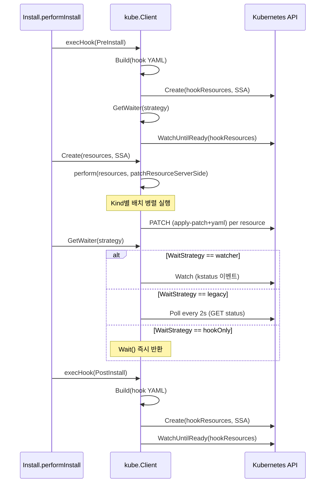

# 11. Kubernetes 클라이언트 (pkg/kube)

## 개요

Helm이 Kubernetes 클러스터와 통신하는 모든 작업은 `pkg/kube` 패키지를 통해 이루어진다.
이 패키지는 Kubernetes 리소스의 생성(Create), 업데이트(Update), 삭제(Delete),
빌드(Build), 대기(Wait) 등 릴리스 라이프사이클 전반에 걸친 API 호출을 추상화한다.

Helm v4에서 이 클라이언트 계층은 다음과 같은 핵심 변경을 포함한다:

- **Server-Side Apply(SSA) 기본화**: Create/Update가 기본적으로 SSA를 사용
- **WaitStrategy 도입**: watcher(kstatus), legacy(폴링), hookOnly 3가지 대기 전략
- **Factory 최소 인터페이스**: kubectl Factory의 최소 복사본으로 Kubernetes API 변경 영향 최소화
- **managedFields 관리**: CSA에서 SSA로의 마이그레이션 지원

## 아키텍처 전체 구조

```
+------------------------------------------------------------------+
|                        action.Configuration                       |
|  KubeClient kube.Interface ───────────────────────────────┐       |
+------------------------------------------------------------------+
                                                            |
                    ┌───────────────────────────────────────┘
                    v
  ┌─────────────────────────────────────────────────────────────┐
  │                      kube.Interface                          │
  │  ┌──────────────────────────────────────────────────────┐   │
  │  │  Get()    Create()    Update()    Delete()            │   │
  │  │  Build()  BuildTable()  IsReachable()                 │   │
  │  │  GetWaiter()  GetPodList()                            │   │
  │  └──────────────────────────────────────────────────────┘   │
  └────────────────────────┬────────────────────────────────────┘
                           │
            구현체: kube.Client
                           │
        ┌──────────────────┼──────────────────┐
        v                  v                  v
   kube.Factory       kube.Waiter        ResourceList
   (최소 kubectl       (대기 전략)        ([]*resource.Info)
    Factory 복사)
        │                  │
        v                  ├── statusWaiter (kstatus)
  ┌───────────┐            ├── legacyWaiter (폴링)
  │ REST      │            └── hookOnlyWaiter
  │ Config    │
  │ Dynamic   │
  │ Client    │
  │ Builder   │
  └───────────┘
```

## 핵심 인터페이스: kube.Interface

**소스**: `pkg/kube/interface.go`

`kube.Interface`는 Kubernetes API와 통신하는 클라이언트가 구현해야 하는 계약을 정의한다.
이 인터페이스는 **반드시 동시성 안전(concurrency safe)**해야 한다.

```go
// pkg/kube/interface.go
type Interface interface {
    Get(resources ResourceList, related bool) (map[string][]runtime.Object, error)
    Create(resources ResourceList, options ...ClientCreateOption) (*Result, error)
    Delete(resources ResourceList, policy metav1.DeletionPropagation) (*Result, []error)
    Update(original, target ResourceList, options ...ClientUpdateOption) (*Result, error)
    Build(reader io.Reader, validate bool) (ResourceList, error)
    IsReachable() error
    GetWaiter(ws WaitStrategy) (Waiter, error)
    GetPodList(namespace string, listOptions metav1.ListOptions) (*v1.PodList, error)
    OutputContainerLogsForPodList(podList *v1.PodList, namespace string,
        writerFunc func(namespace, pod, container string) io.Writer) error
    BuildTable(reader io.Reader, validate bool) (ResourceList, error)
}
```

### 왜 별도 인터페이스인가?

Kubernetes의 Go 클라이언트(client-go)는 마이너 버전마다 API가 변경될 수 있다.
직접 client-go를 노출하면 Helm의 하위 호환성을 보장할 수 없다.
따라서 Helm은 자체 인터페이스를 정의하여:

1. **Kubernetes API 변경 격리**: client-go가 바뀌어도 Interface 시그니처는 유지
2. **테스트 용이성**: fake 구현체로 완전한 단위 테스트 가능
3. **추상화**: Create/Update 내부의 SSA/CSA 전환을 호출자에게 숨김

### Waiter 인터페이스

```go
// pkg/kube/interface.go
type Waiter interface {
    Wait(resources ResourceList, timeout time.Duration) error
    WaitWithJobs(resources ResourceList, timeout time.Duration) error
    WaitForDelete(resources ResourceList, timeout time.Duration) error
    WatchUntilReady(resources ResourceList, timeout time.Duration) error
}
```

`Waiter`는 리소스가 원하는 상태에 도달할 때까지 대기하는 책임을 가진다.
`WatchUntilReady`는 주로 Hook 구현에서 사용되며, Kind에 따라 "ready"의 의미가 다르다:

| Kind | Ready 조건 |
|------|-----------|
| Job | 성공적으로 완료 (JobComplete 조건) |
| Pod | Phase가 Succeeded |
| 기타 | 생성 또는 수정 이벤트 발생 |

### InterfaceWaitOptions

```go
// pkg/kube/interface.go
type InterfaceWaitOptions interface {
    GetWaiterWithOptions(ws WaitStrategy, opts ...WaitOption) (Waiter, error)
}
```

Helm 5에서 `Interface`에 통합될 예정인 확장 인터페이스로,
`WaitOption`을 통해 대기 동작의 세밀한 제어를 가능하게 한다.

## Client 구조체

**소스**: `pkg/kube/client.go`

```go
// pkg/kube/client.go
type Client struct {
    Factory   Factory
    Namespace string
    WaitContext context.Context  // Deprecated: WaitOption 사용 권장
    Waiter
    kubeClient kubernetes.Interface
    logging.LogHolder
}

var _ Interface = (*Client)(nil)
```

### 왜 Factory를 직접 노출하는가?

```
Client.Factory는 pkg/kube/factory.go의 최소 Factory 인터페이스를 구현한다.
kubectl의 전체 Factory가 아닌 최소 복사본이다.

이유: Kubernetes Go API는 인터페이스를 포함하여 마이너 릴리스마다 변경될 수 있다.
전체 인터페이스를 노출하면 Helm이 사용하지 않는 함수의 변경에도 영향을 받는다.
최소 인터페이스는 Helm이 필요한 함수만 포함하여 노출 표면을 줄인다.
```

### Client 생성

```go
// pkg/kube/client.go
func New(getter genericclioptions.RESTClientGetter) *Client {
    if getter == nil {
        getter = genericclioptions.NewConfigFlags(true)
    }
    factory := cmdutil.NewFactory(getter)
    c := &Client{
        Factory: factory,
    }
    c.SetLogger(slog.Default().Handler())
    return c
}
```

`New` 함수는 `genericclioptions.RESTClientGetter`를 받아 kubectl의 `cmdutil.NewFactory`로
Factory를 생성한다. kubeconfig, 네임스페이스, 컨텍스트 등 모든 Kubernetes 접속 설정은
이 getter를 통해 주입된다.

## Factory 인터페이스

**소스**: `pkg/kube/factory.go`

```go
// pkg/kube/factory.go
type Factory interface {
    ToRESTConfig() (*rest.Config, error)
    ToRawKubeConfigLoader() clientcmd.ClientConfig
    DynamicClient() (dynamic.Interface, error)
    KubernetesClientSet() (*kubernetes.Clientset, error)
    NewBuilder() *resource.Builder
    Validator(validationDirective string) (validation.Schema, error)
}
```

### 각 메서드의 역할

| 메서드 | 용도 | 사용 위치 |
|--------|------|----------|
| `ToRESTConfig()` | REST 설정 반환 | statusWaiter 생성 시 DynamicClient/HTTPClient 생성 |
| `ToRawKubeConfigLoader()` | kubeconfig 로더 | 네임스페이스 결정 |
| `DynamicClient()` | 비구조화(unstructured) 리소스 접근 | statusWaiter에서 kstatus 사용 |
| `KubernetesClientSet()` | 타입 안전 Kubernetes 클라이언트 | legacyWaiter, 클러스터 연결 확인 |
| `NewBuilder()` | resource.Builder 생성 | YAML -> resource.Info 변환 |
| `Validator()` | OpenAPI 스키마 검증기 | Build() 시 YAML 검증 |

### 왜 최소 Factory인가?

```
kubectl의 전체 Factory 인터페이스:
  - ToRESTConfig, ToRawKubeConfigLoader, ToDiscoveryClient,
  - RESTClient, ClientForMapping, UnstructuredClientForMapping,
  - DynamicClient, KubernetesClientSet, NewBuilder, Validator,
  - OpenAPIGetter, ...

Helm의 최소 Factory:
  - ToRESTConfig, ToRawKubeConfigLoader,
  - DynamicClient, KubernetesClientSet,
  - NewBuilder, Validator

절반 이하의 메서드만 포함하여 Kubernetes API 변경 영향을 최소화한다.
```

## Create 동작: SSA vs CSA

**소스**: `pkg/kube/client.go` (라인 343~368)

```go
// pkg/kube/client.go
func (c *Client) Create(resources ResourceList, options ...ClientCreateOption) (*Result, error) {
    createOptions := clientCreateOptions{
        serverSideApply:          true, // 기본값: SSA
        fieldValidationDirective: FieldValidationDirectiveStrict,
    }
    // 옵션 적용
    for _, o := range options {
        errs = append(errs, o(&createOptions))
    }
    createApplyFunc := c.makeCreateApplyFunc(
        createOptions.serverSideApply,
        createOptions.forceConflicts,
        createOptions.dryRun,
        createOptions.fieldValidationDirective)
    if err := perform(resources, createApplyFunc); err != nil {
        return nil, err
    }
    return &Result{Created: resources}, nil
}
```

### SSA와 CSA 분기

```go
// pkg/kube/client.go
func (c *Client) makeCreateApplyFunc(serverSideApply, forceConflicts, dryRun bool,
    fieldValidationDirective FieldValidationDirective) CreateApplyFunc {
    if serverSideApply {
        return func(target *resource.Info) error {
            return patchResourceServerSide(target, dryRun, forceConflicts,
                fieldValidationDirective)
        }
    }
    return createResource  // CSA 경로
}
```

```
SSA 흐름:
  Client.Create() ──> patchResourceServerSide()
    └── PATCH 요청 (application/apply-patch+yaml)
        └── API 서버가 managedFields 자동 관리

CSA 흐름:
  Client.Create() ──> createResource()
    └── resource.NewHelper().Create()
        └── POST 요청
```

### 왜 SSA가 기본인가?

Helm v3까지는 CSA(Client-Side Apply)가 기본이었다. CSA의 문제점:

1. **3-way merge 복잡성**: 클라이언트가 원본/현재/목표 3개 상태를 비교해야 함
2. **managedFields 미지원**: 여러 도구가 같은 리소스를 관리할 때 충돌 발생
3. **CRD 패치 제한**: 비구조화 객체는 Strategic Merge Patch 불가, JSON Merge Patch만 가능

SSA는 이를 해결한다:
- API 서버가 managedFields를 자동 관리
- 충돌 감지 내장 (forceConflicts 옵션으로 재정의 가능)
- 모든 리소스 타입에 동일한 패치 방식 적용

## Update 동작: 3가지 전략

**소스**: `pkg/kube/client.go` (라인 799~898)

```go
// pkg/kube/client.go
func (c *Client) Update(originals, targets ResourceList,
    options ...ClientUpdateOption) (*Result, error) {
    updateOptions := clientUpdateOptions{
        serverSideApply:          true,
        fieldValidationDirective: FieldValidationDirectiveStrict,
    }
    // ...옵션 적용 및 검증...
}
```

Update는 3가지 상호 배타적 전략을 지원한다:

```
┌────────────────────────────────────────────────────────────┐
│                    Update 전략 결정                         │
│                                                            │
│  forceReplace?  ─── Yes ──> replaceResource()              │
│       │                     (DELETE + CREATE)               │
│       No                                                   │
│       │                                                    │
│  serverSideApply?  ── Yes ──> patchResourceServerSide()    │
│       │                       + upgradeClientSideFieldMgr  │
│       No                                                   │
│       │                                                    │
│  └──> patchResourceClientSide()                            │
│       (3-way merge patch)                                  │
└────────────────────────────────────────────────────────────┘
```

### ClientUpdateOption 종류

| 옵션 | 설명 | 상호 배타 |
|------|------|----------|
| `ClientUpdateOptionServerSideApply(true, force)` | SSA 사용 (기본) | threeWayMerge와 배타 |
| `ClientUpdateOptionThreeWayMergeForUnstructured(true)` | CRD 등에 3-way merge | SSA와 배타 |
| `ClientUpdateOptionForceReplace(true)` | DELETE+CREATE | SSA, forceConflicts와 배타 |
| `ClientUpdateOptionDryRun(true)` | 서버에 변경 없음 | - |
| `ClientUpdateOptionUpgradeClientSideFieldManager(true)` | CSA -> SSA 마이그레이션 | - |
| `ClientUpdateOptionFieldValidationDirective(...)` | 스키마 검증 수준 | - |

### CSA에서 SSA로 managedFields 업그레이드

```go
// pkg/kube/client.go
func upgradeClientSideFieldManager(info *resource.Info, dryRun bool,
    fieldValidationDirective FieldValidationDirective) (bool, error) {
    fieldManagerName := getManagedFieldsManager()
    // csaupgrade.UpgradeManagedFieldsPatch 사용
    patchData, err := csaupgrade.UpgradeManagedFieldsPatch(
        info.Object,
        sets.New(fieldManagerName),
        fieldManagerName)
    // JSON Patch로 managedFields 업데이트
    obj, err := helper.Patch(info.Namespace, info.Name,
        types.JSONPatchType, patchData, nil)
    // ...
}
```

이 함수는 기존에 CSA로 관리되던 리소스를 SSA로 전환할 때 사용된다.
Helm v3에서 v4로 업그레이드하는 차트가 SSA를 사용하려면 이 마이그레이션이 필요하다.

## update 내부 로직: 생성/수정/삭제

**소스**: `pkg/kube/client.go` (라인 566~697)

```go
func (c *Client) update(originals, targets ResourceList,
    createApplyFunc CreateApplyFunc, updateApplyFunc UpdateApplyFunc) (*Result, error) {
```

update 메서드의 동작 흐름:

```
targets 순회:
  ├── 서버에서 리소스 조회 (helper.Get)
  │   ├── NotFound ──> createApplyFunc(target)  → res.Created에 추가
  │   └── Found
  │       ├── originals에 있음 ──> updateApplyFunc(original, target)
  │       └── originals에 없음 ──> 클러스터 상태를 baseline으로 사용
  │                                 updateApplyFunc(clusterState, target)
  │                                 → res.Updated에 추가
  │
originals - targets 차집합 순회:
  ├── annotations에 "helm.sh/resource-policy: keep" ──> 삭제 건너뜀
  └── 그 외 ──> deleteResource() → res.Deleted에 추가
```

### ResourcePolicyAnno

```go
// pkg/kube/resource_policy.go
const ResourcePolicyAnno = "helm.sh/resource-policy"
const KeepPolicy = "keep"
```

`helm.sh/resource-policy: keep` 어노테이션이 있는 리소스는 릴리스 업그레이드/삭제 시에도
클러스터에 남아있는다. PersistentVolumeClaim 등 데이터 보존이 필요한 리소스에 유용하다.

## Delete 동작

**소스**: `pkg/kube/client.go` (라인 900~941)

```go
func (c *Client) Delete(resources ResourceList,
    policy metav1.DeletionPropagation) (*Result, []error) {
    var errs []error
    res := &Result{}
    mtx := sync.Mutex{}
    err := perform(resources, func(target *resource.Info) error {
        err := deleteResource(target, policy)
        if err == nil || apierrors.IsNotFound(err) {
            mtx.Lock()
            defer mtx.Unlock()
            res.Deleted = append(res.Deleted, target)
            return nil
        }
        mtx.Lock()
        defer mtx.Unlock()
        errs = append(errs, err)
        return nil
    })
    // ...
}
```

Delete의 특징:
- **모든 리소스에 대해 시도**: 하나가 실패해도 나머지 삭제를 계속 진행
- **NotFound는 성공으로 처리**: 이미 삭제된 리소스는 Deleted 목록에 포함
- **DeletionPropagation**: Background/Foreground/Orphan 중 선택
- **뮤텍스 보호**: `perform`이 동시 실행하므로 결과 수집에 뮤텍스 사용

## Build: YAML을 ResourceList로 변환

**소스**: `pkg/kube/client.go` (라인 523~564)

```go
func buildResourceList(f Factory, namespace string,
    validationDirective FieldValidationDirective,
    reader io.Reader, transformRequest resource.RequestTransform) (ResourceList, error) {
    schema, err := f.Validator(string(validationDirective))
    builder := f.NewBuilder().
        ContinueOnError().
        NamespaceParam(namespace).
        DefaultNamespace().
        Flatten().
        Unstructured().
        Schema(schema).
        Stream(reader, "")
    if transformRequest != nil {
        builder.TransformRequests(transformRequest)
    }
    result, err := builder.Do().Infos()
    return result, scrubValidationError(err)
}
```

```
YAML 입력 → resource.Builder
             ├── ContinueOnError: 하나의 문서 실패해도 계속 파싱
             ├── NamespaceParam: 기본 네임스페이스 설정
             ├── Flatten: 중첩 리소스 평탄화
             ├── Unstructured: 비구조화 객체로 파싱
             ├── Schema: OpenAPI 검증 적용
             └── Stream: io.Reader에서 YAML 읽기
             → []*resource.Info (ResourceList)
```

### Build vs BuildTable

- `Build`: 일반 리소스 객체 반환 (API 호출, 매니페스트 적용에 사용)
- `BuildTable`: Table 형식으로 반환 (helm status 등 표시용 커맨드에 사용)

BuildTable은 `transformRequests` 함수를 통해 Accept 헤더에 Table 형식을 요청한다:

```go
func transformRequests(req *rest.Request) {
    tableParam := strings.Join([]string{
        fmt.Sprintf("application/json;as=Table;v=%s;g=%s",
            metav1.SchemeGroupVersion.Version, metav1.GroupName),
        // ...
    }, ",")
    req.SetHeader("Accept", tableParam)
    req.Param("includeObject", "Object")
}
```

## perform: 병렬 실행 엔진

**소스**: `pkg/kube/client.go` (라인 974~1012)

```go
func perform(infos ResourceList, fn func(*resource.Info) error) error {
    if len(infos) == 0 {
        return ErrNoObjectsVisited
    }
    errs := make(chan error)
    go batchPerform(infos, fn, errs)
    for range infos {
        err := <-errs
        if err != nil {
            result = errors.Join(result, err)
        }
    }
    return result
}

func batchPerform(infos ResourceList, fn func(*resource.Info) error,
    errs chan<- error) {
    var kind string
    var wg sync.WaitGroup
    defer wg.Wait()
    for _, info := range infos {
        currentKind := info.Object.GetObjectKind().GroupVersionKind().Kind
        if kind != currentKind {
            wg.Wait()       // 이전 Kind의 모든 작업 완료 대기
            kind = currentKind
        }
        wg.Add(1)
        go func(info *resource.Info) {
            errs <- fn(info)
            wg.Done()
        }(info)
    }
}
```

### 왜 Kind 단위로 배치하는가?

```
ResourceList 순서: [Namespace, Namespace, ConfigMap, ConfigMap, Deployment, Deployment]

배치 실행:
  Batch 1: Namespace(병렬) ── 완료 대기
  Batch 2: ConfigMap(병렬)  ── 완료 대기
  Batch 3: Deployment(병렬) ── 완료 대기
```

같은 Kind의 리소스는 병렬로 생성하되, Kind가 바뀌면 이전 배치가 완료될 때까지 대기한다.
이유:
- **의존성 순서**: Namespace가 먼저 생성되어야 그 안에 ConfigMap을 만들 수 있다
- **Helm의 설치 순서**: `releaseutil.InstallOrder`에 따라 리소스가 정렬된 상태로 들어온다
- **병렬 최적화**: 같은 Kind 내에서는 독립적이므로 병렬 실행 가능

## ResourceList와 Result

### ResourceList

**소스**: `pkg/kube/resource.go`

```go
type ResourceList []*resource.Info
```

ResourceList는 `[]*resource.Info`의 타입 앨리어스로, 다음 편의 메서드를 제공한다:

| 메서드 | 설명 |
|--------|------|
| `Append(val)` | Info 추가 |
| `Visit(fn)` | resource.Visitor 패턴 구현, fn이 에러 반환 시 중단 |
| `Filter(fn)` | 조건에 맞는 Info만 새 목록으로 반환 |
| `Get(info)` | Name+Namespace+GroupKind가 일치하는 Info 반환 |
| `Contains(info)` | 포함 여부 확인 |
| `Difference(rs)` | 차집합 (이 목록에는 있지만 rs에는 없는 것) |
| `Intersect(rs)` | 교집합 |

### isMatchingInfo: 버전 무시 비교

```go
// pkg/kube/resource.go
func isMatchingInfo(a, b *resource.Info) bool {
    return a.Name == b.Name &&
        a.Namespace == b.Namespace &&
        a.Mapping.GroupVersionKind.GroupKind() == b.Mapping.GroupVersionKind.GroupKind()
}
```

**왜 Version을 비교에서 제외하는가?**

같은 CRD가 다른 API 버전(예: v2beta1, v2beta2)으로 서빙될 수 있다.
이들은 Kubernetes API 서버 내부에서 같은 스토리지를 공유한다.
Version까지 비교하면 `Difference()`가 버전 변경을 "리소스 삭제 + 추가"로 해석하여,
업그레이드 중 방금 생성한 리소스를 삭제하는 문제가 발생한다.

### Result

**소스**: `pkg/kube/result.go`

```go
type Result struct {
    Created ResourceList
    Updated ResourceList
    Deleted ResourceList
}
```

모든 CRUD 작업의 결과를 Created/Updated/Deleted로 분류하여 반환한다.

## WaitStrategy: 3가지 대기 전략

**소스**: `pkg/kube/client.go` (라인 103~120)

```go
type WaitStrategy string

const (
    StatusWatcherStrategy WaitStrategy = "watcher"
    LegacyStrategy        WaitStrategy = "legacy"
    HookOnlyStrategy      WaitStrategy = "hookOnly"
)
```

```
┌─────────────────────────────────────────────────────────────────┐
│                     WaitStrategy 선택 가이드                      │
├──────────────┬──────────────────────────────────────────────────┤
│ watcher      │ - kstatus 기반 이벤트 드리븐 대기                  │
│ (기본 --wait)│ - 가장 정확하고 반응성 좋음                         │
│              │ - CRD의 완전한 reconciliation 대기 가능             │
│              │ - 필요: list+watch RBAC, 0이 아닌 timeout          │
├──────────────┼──────────────────────────────────────────────────┤
│ legacy       │ - Helm 3 스타일 주기적 폴링                        │
│              │ - watch가 불가능한 환경에서 사용                     │
│              │ - 필요: list RBAC만                                │
├──────────────┼──────────────────────────────────────────────────┤
│ hookOnly     │ - Hook의 Pod/Job만 대기                            │
│ (기본)       │ - 일반 차트 리소스는 대기하지 않음                    │
│              │ - --wait 미사용 시 기본값                            │
└──────────────┴──────────────────────────────────────────────────┘
```

### GetWaiter / GetWaiterWithOptions

```go
// pkg/kube/client.go
func (c *Client) GetWaiterWithOptions(strategy WaitStrategy,
    opts ...WaitOption) (Waiter, error) {
    switch strategy {
    case LegacyStrategy:
        kc, _ := c.Factory.KubernetesClientSet()
        return &legacyWaiter{kubeClient: kc, ctx: c.WaitContext}, nil
    case StatusWatcherStrategy:
        return c.newStatusWatcher(opts...)
    case HookOnlyStrategy:
        sw, _ := c.newStatusWatcher(opts...)
        return &hookOnlyWaiter{sw: sw}, nil
    }
}
```

## statusWaiter: kstatus 기반 대기 (Helm v4 기본)

**소스**: `pkg/kube/statuswait.go`

```go
type statusWaiter struct {
    client             dynamic.Interface
    restMapper         meta.RESTMapper
    ctx                context.Context
    watchUntilReadyCtx context.Context
    waitCtx            context.Context
    waitWithJobsCtx    context.Context
    waitForDeleteCtx   context.Context
    readers            []engine.StatusReader
    logging.LogHolder
}

var DefaultStatusWatcherTimeout = 30 * time.Second
```

### 핵심 동작 흐름

```
statusWaiter.Wait(resources, timeout)
  │
  ├── 1. Paused Deployment 필터링 (대기 불필요)
  │
  ├── 2. resource.Info → object.ObjMetadata 변환
  │
  ├── 3. watcher.NewDefaultStatusWatcher(dynamicClient, restMapper)
  │      └── kstatus의 Watch 메커니즘 생성
  │
  ├── 4. sw.Watch(ctx, resources, Options{RESTScopeNamespace})
  │      └── 이벤트 채널 반환
  │
  ├── 5. collector.NewResourceStatusCollector(resources)
  │      └── 각 리소스의 상태를 수집
  │
  ├── 6. statusCollector.ListenWithObserver(eventCh, statusObserver)
  │      └── 모든 리소스가 Current 상태가 되면 cancel()
  │
  └── 7. 결과 확인
       └── Current가 아닌 리소스에 대해 에러 생성
```

### statusObserver

```go
// pkg/kube/statuswait.go
func statusObserver(cancel context.CancelFunc, desired status.Status,
    logger *slog.Logger) collector.ObserverFunc {
    return func(statusCollector *collector.ResourceStatusCollector, _ event.Event) {
        // Failed는 터미널 상태 → 더 이상 대기하지 않음
        if rs.Status == status.FailedStatus && desired == status.CurrentStatus {
            continue
        }
        if aggregator.AggregateStatus(rss, desired) == desired {
            cancel()  // 모든 리소스가 원하는 상태에 도달
            return
        }
    }
}
```

### WatchUntilReady (Hook 전용)

```go
func (w *statusWaiter) WatchUntilReady(resourceList ResourceList,
    timeout time.Duration) error {
    sw := watcher.NewDefaultStatusWatcher(w.client, w.restMapper)
    // Hook은 Job/Pod만 실제 대기, 나머지는 alwaysReady
    jobSR := helmStatusReaders.NewCustomJobStatusReader(w.restMapper)
    podSR := helmStatusReaders.NewCustomPodStatusReader(w.restMapper)
    genericSR := statusreaders.NewGenericStatusReader(w.restMapper, alwaysReady)
    sr := &statusreaders.DelegatingStatusReader{
        StatusReaders: append(w.readers, jobSR, podSR, genericSR),
    }
    sw.StatusReader = sr
    return w.wait(ctx, resourceList, sw)
}
```

## legacyWaiter: Helm 3 폴링 방식

**소스**: `pkg/kube/wait.go`

```go
type legacyWaiter struct {
    c          ReadyChecker
    kubeClient *kubernetes.Clientset
    ctx        context.Context
}
```

### 폴링 기반 waitForResources

```go
func (hw *legacyWaiter) waitForResources(created ResourceList,
    timeout time.Duration) error {
    return wait.PollUntilContextCancel(ctx, 2*time.Second, true,
        func(ctx context.Context) (bool, error) {
            for i, v := range created {
                ready, err := hw.c.IsReady(ctx, v)
                if hw.isRetryableError(err, v) {
                    numberOfErrors[i]++
                    if numberOfErrors[i] > 30 {  // 최대 30회 재시도
                        return false, err
                    }
                    return false, nil
                }
                if !ready {
                    return false, err
                }
            }
            return true, nil  // 모든 리소스 ready
        })
}
```

2초 간격으로 폴링하며, 재시도 가능한 에러(5xx, 429)는 최대 30회까지 재시도한다.

### hookOnlyWaiter

**소스**: `pkg/kube/statuswait.go` (라인 274~293)

```go
type hookOnlyWaiter struct {
    sw *statusWaiter
}

func (w *hookOnlyWaiter) WatchUntilReady(resourceList ResourceList,
    timeout time.Duration) error {
    return w.sw.WatchUntilReady(resourceList, timeout)
}
func (w *hookOnlyWaiter) Wait(_ ResourceList, _ time.Duration) error {
    return nil  // 일반 리소스는 대기하지 않음
}
func (w *hookOnlyWaiter) WaitWithJobs(_ ResourceList, _ time.Duration) error {
    return nil
}
func (w *hookOnlyWaiter) WaitForDelete(_ ResourceList, _ time.Duration) error {
    return nil
}
```

## ReadyChecker: 리소스별 Ready 판정

**소스**: `pkg/kube/ready.go`

```go
type ReadyChecker struct {
    client        kubernetes.Interface
    checkJobs     bool
    pausedAsReady bool
}
```

### 리소스 타입별 Ready 조건

| 리소스 타입 | Ready 조건 |
|------------|-----------|
| Pod | `PodReady` 조건이 `True` |
| Job | Succeeded >= Completions (checkJobs일 때만) |
| Deployment | ObservedGeneration == Generation, ReadyReplicas >= 최소 |
| StatefulSet | UpdatedReplicas >= expected, ReadyReplicas == replicas |
| DaemonSet | UpdatedNumberScheduled == DesiredNumberScheduled, NumberReady >= 최소 |
| Service | ClusterIP 비어있지 않음, LoadBalancer면 Ingress 존재 |
| PVC | Phase == Bound |
| CRD | Established 조건 True |
| ReplicationController | ObservedGeneration == Generation |
| ReplicaSet | ObservedGeneration == Generation, 관련 Pod Ready |

## WaitOption 시스템

**소스**: `pkg/kube/options.go`

```go
type WaitOption func(*waitOptions)

type waitOptions struct {
    ctx                context.Context
    watchUntilReadyCtx context.Context
    waitCtx            context.Context
    waitWithJobsCtx    context.Context
    waitForDeleteCtx   context.Context
    statusReaders      []engine.StatusReader
}
```

각 Waiter 메서드에 별도의 Context를 설정할 수 있다:

| 옵션 | 적용 대상 |
|------|----------|
| `WithWaitContext(ctx)` | 모든 대기 메서드의 기본 Context |
| `WithWatchUntilReadyMethodContext(ctx)` | WatchUntilReady 전용 |
| `WithWaitMethodContext(ctx)` | Wait 전용 |
| `WithWaitWithJobsMethodContext(ctx)` | WaitWithJobs 전용 |
| `WithWaitForDeleteMethodContext(ctx)` | WaitForDelete 전용 |
| `WithKStatusReaders(readers...)` | 커스텀 StatusReader 주입 |

## RetryingRoundTripper

**소스**: `pkg/kube/roundtripper.go`

```go
type RetryingRoundTripper struct {
    Wrapped http.RoundTripper
}
```

Kubernetes API 서버 앞의 etcd 리더 변경 같은 일시적 5xx 에러를 자동 재시도한다:

```go
func (rt *RetryingRoundTripper) roundTrip(req *http.Request, retry int,
    prevResp *http.Response) (*http.Response, error) {
    // 500 미만이면 즉시 반환
    // "etcdserver: leader changed" → 재시도
    // "raft proposal dropped" → 재시도
}
```

## Fake 클라이언트: 테스트 지원

**소스**: `pkg/kube/fake/printer.go`, `pkg/kube/fake/failing_kube_client.go`

### PrintingKubeClient

```go
type PrintingKubeClient struct {
    Out       io.Writer
    LogOutput io.Writer
}
```

모든 API 호출을 io.Writer에 출력만 하는 구현체. 실제 API 호출 없이
`helm template` 같은 클라이언트 전용 커맨드에서 사용된다.

### FailingKubeClient

```go
type FailingKubeClient struct {
    PrintingKubeClient
    CreateError            error
    GetError               error
    DeleteError            error
    UpdateError            error
    BuildError             error
    // ...
}
```

각 메서드별로 에러를 주입할 수 있는 테스트 전용 클라이언트.
액션 시스템의 에러 처리 경로를 검증하는 단위 테스트에서 사용된다.

## Converter: 객체 버전 변환

**소스**: `pkg/kube/converter.go`

```go
func AsVersioned(info *resource.Info) runtime.Object {
    return convertWithMapper(info.Object, info.Mapping)
}

func kubernetesNativeScheme() *runtime.Scheme {
    k8sNativeSchemeOnce.Do(func() {
        k8sNativeScheme = runtime.NewScheme()
        scheme.AddToScheme(k8sNativeScheme)
        apiextensionsv1beta1.AddToScheme(k8sNativeScheme)
        apiextensionsv1.AddToScheme(k8sNativeScheme)
    })
    return k8sNativeScheme
}
```

### 왜 별도 Scheme인가?

Helm이 라이브러리로 사용될 때, 호스트 애플리케이션이 `scheme.Scheme`에 커스텀 리소스를
추가할 수 있다. 이 경우 Kubernetes 네이티브가 아닌 리소스에 대해 Strategic Merge Patch를
시도하여 실패한다. 별도의 "깨끗한" Scheme을 사용하여 네이티브 리소스만 올바르게 변환한다.

## 종합 시퀀스: helm install의 kube 호출 흐름



## 핵심 설계 원칙 요약

| 원칙 | 구현 |
|------|------|
| **추상화로 격리** | kube.Interface로 Kubernetes API 변경 격리 |
| **기본값은 안전하게** | SSA 기본, Strict 검증 기본 |
| **선택의 자유** | WaitStrategy 3가지, Create/Update 옵션 패턴 |
| **테스트 가능성** | Printing/Failing fake 클라이언트 |
| **하위 호환성** | CSA->SSA 마이그레이션, Version 무시 비교 |
| **병렬 성능** | Kind 단위 배치 병렬 실행 |
| **회복 탄력성** | RetryingRoundTripper, 재시도 가능 에러 처리 |

## 관련 소스 파일 요약

| 파일 | 핵심 내용 |
|------|----------|
| `pkg/kube/interface.go` | Interface, Waiter, InterfaceWaitOptions 정의 |
| `pkg/kube/client.go` | Client 구조체, Create/Update/Delete/Build, perform 엔진 |
| `pkg/kube/factory.go` | Factory 최소 인터페이스 (kubectl Factory 부분 복사) |
| `pkg/kube/wait.go` | legacyWaiter (Helm 3 폴링), SelectorsForObject |
| `pkg/kube/statuswait.go` | statusWaiter (kstatus), hookOnlyWaiter |
| `pkg/kube/options.go` | WaitOption, waitOptions 구조체 |
| `pkg/kube/ready.go` | ReadyChecker, 리소스별 Ready 판정 로직 |
| `pkg/kube/resource.go` | ResourceList 타입, 집합 연산 (Difference, Intersect) |
| `pkg/kube/result.go` | Result 구조체 (Created/Updated/Deleted) |
| `pkg/kube/resource_policy.go` | ResourcePolicyAnno, KeepPolicy |
| `pkg/kube/converter.go` | AsVersioned, kubernetesNativeScheme |
| `pkg/kube/roundtripper.go` | RetryingRoundTripper (etcd 에러 재시도) |
| `pkg/kube/fake/printer.go` | PrintingKubeClient (테스트용) |
| `pkg/kube/fake/failing_kube_client.go` | FailingKubeClient (에러 주입 테스트) |
