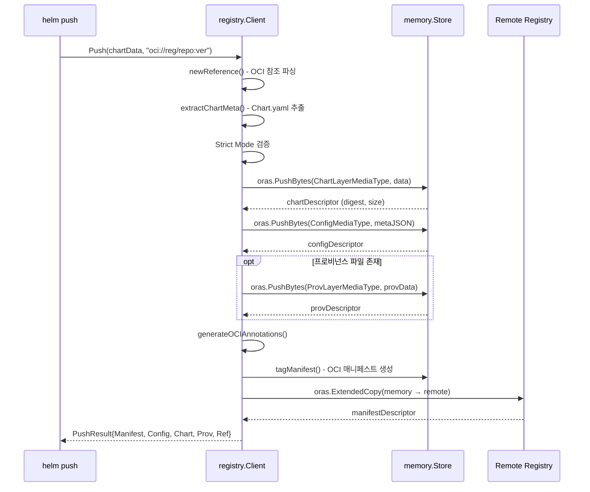
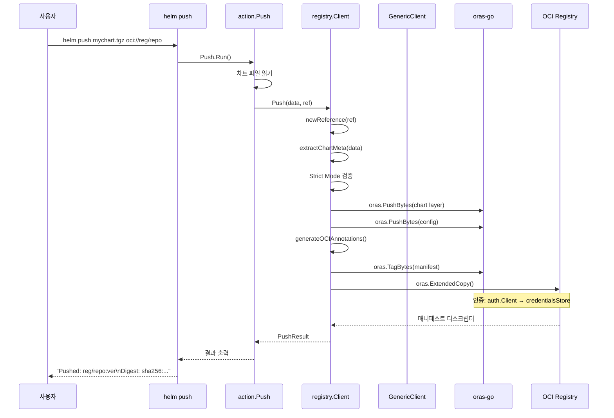

# 12. OCI 레지스트리 (pkg/registry)

## 개요

Helm v4는 차트를 OCI(Open Container Initiative) 호환 레지스트리에 저장하고 배포하는 것을
일급(first-class) 기능으로 지원한다. Docker Hub, GitHub Container Registry(GHCR),
Amazon ECR, Azure ACR, Google Artifact Registry 등 OCI 호환 레지스트리라면 어디든
Helm 차트를 저장할 수 있다.

이 기능의 핵심 구현은 `pkg/registry` 패키지에 있으며, 내부적으로
[oras-go v2](https://github.com/oras-project/oras-go) 라이브러리를 활용한다.

### 왜 OCI인가?

기존 Helm v2/v3의 Chart Repository 방식은 다음 한계가 있었다:

1. **별도 인프라 필요**: Chart Museum 같은 전용 서버 운영
2. **index.yaml 동기화**: 대규모 레포지토리에서 index.yaml이 거대해짐
3. **인증 불일치**: 컨테이너 이미지와 다른 인증 체계
4. **보안 취약**: 무결성 검증이 불완전

OCI 레지스트리를 사용하면:
- 컨테이너 이미지와 동일한 인프라와 인증 사용
- 콘텐츠 주소 기반(content-addressable) 저장으로 무결성 보장
- 기존 레지스트리 에코시스템(미러링, 스캐닝 등) 활용 가능

## 아키텍처 전체 구조

```
┌──────────────────────────────────────────────────────────┐
│                      Helm CLI                             │
│  helm push / pull / login / logout                        │
└───────────────────────┬──────────────────────────────────┘
                        │
                        v
┌──────────────────────────────────────────────────────────┐
│                   registry.Client                         │
│  ┌────────────┐  ┌────────────┐  ┌─────────────────┐     │
│  │ Push()     │  │ Pull()     │  │ Login()/Logout() │     │
│  │ Tags()     │  │ Resolve()  │  │ ValidateRef()    │     │
│  └─────┬──────┘  └─────┬──────┘  └────────┬────────┘     │
│        │               │                  │               │
│        v               v                  v               │
│  ┌─────────────────────────────────────────────────┐      │
│  │              GenericClient                       │      │
│  │  PullGeneric()   GetDescriptorData()             │      │
│  └──────────────────┬──────────────────────────────┘      │
│                     │                                     │
│  ┌──────────────────┼──────────────────────────────┐      │
│  │            oras-go v2                            │      │
│  │  oras.Copy()  oras.PushBytes()  oras.TagBytes()  │      │
│  │  oras.ExtendedCopy()                             │      │
│  └──────────────────┬──────────────────────────────┘      │
│                     │                                     │
│  ┌──────────────────┼──────────────────────────────┐      │
│  │         auth.Client (인증)                       │      │
│  │  credentials.Store (Helm + Docker fallback)      │      │
│  └──────────────────┬──────────────────────────────┘      │
└─────────────────────┼────────────────────────────────────┘
                      │
                      v
          ┌───────────────────────┐
          │   OCI Registry        │
          │   (Docker Hub, GHCR,  │
          │    ECR, ACR, ...)     │
          └───────────────────────┘
```

## OCI 미디어 타입과 상수

**소스**: `pkg/registry/constants.go`

```go
// pkg/registry/constants.go
const (
    OCIScheme                 = "oci"
    CredentialsFileBasename   = "registry/config.json"
    ConfigMediaType           = "application/vnd.cncf.helm.config.v1+json"
    ChartLayerMediaType       = "application/vnd.cncf.helm.chart.content.v1.tar+gzip"
    ProvLayerMediaType        = "application/vnd.cncf.helm.chart.provenance.v1.prov"
    LegacyChartLayerMediaType = "application/tar+gzip"
)
```

### OCI 매니페스트 구조

Helm 차트는 OCI 이미지 매니페스트로 저장된다:

```
OCI Image Manifest (application/vnd.oci.image.manifest.v1+json)
├── Config
│   └── application/vnd.cncf.helm.config.v1+json
│       (Chart.yaml 메타데이터의 JSON 직렬화)
│
├── Layers[0]
│   └── application/vnd.cncf.helm.chart.content.v1.tar+gzip
│       (차트 아카이브: .tgz 파일)
│
├── Layers[1] (선택)
│   └── application/vnd.cncf.helm.chart.provenance.v1.prov
│       (프로비넌스 파일)
│
└── Annotations
    ├── org.opencontainers.image.title: <chart-name>
    ├── org.opencontainers.image.version: <chart-version>
    ├── org.opencontainers.image.description: <description>
    ├── org.opencontainers.image.created: <timestamp>
    ├── org.opencontainers.image.url: <home>
    ├── org.opencontainers.image.source: <source>
    └── org.opencontainers.image.authors: <maintainers>
```

### 미디어 타입 상세

| 미디어 타입 | 역할 | 내용 |
|------------|------|------|
| `ConfigMediaType` | OCI Config | Chart.yaml의 JSON (chart.Metadata) |
| `ChartLayerMediaType` | 차트 레이어 | .tgz 아카이브 (templates, values.yaml 등) |
| `ProvLayerMediaType` | 프로비넌스 레이어 | GPG 서명 파일 |
| `LegacyChartLayerMediaType` | 레거시 차트 레이어 | Helm v3 초기 형식 (deprecated) |

### 왜 이런 미디어 타입 구조인가?

OCI 매니페스트에서 Config는 이미지의 메타데이터를 나타내고, Layers는 실제 콘텐츠를 나타낸다.
Helm은 이를 활용하여:

1. **Config = 메타데이터**: 차트를 풀지 않고도 Chart.yaml 정보를 조회 가능
2. **Layer[0] = 차트**: 실제 설치에 필요한 아카이브
3. **Layer[1] = 프로비넌스**: 선택적 보안 검증 파일

레지스트리 UI(Docker Hub 등)에서 Config를 읽어 차트 정보를 표시할 수 있다.

## Client 구조체

**소스**: `pkg/registry/client.go` (라인 57~85)

```go
// pkg/registry/client.go
type Client struct {
    debug              bool
    enableCache        bool
    credentialsFile    string
    username           string
    password           string
    out                io.Writer
    authorizer         *auth.Client
    registryAuthorizer RemoteClient
    credentialsStore   credentials.Store
    httpClient         *http.Client
    plainHTTP          bool
}

type ClientOption func(*Client)
```

### Client 생성

```go
func NewClient(options ...ClientOption) (*Client, error) {
    client := &Client{
        out: io.Discard,
    }
    for _, option := range options {
        option(client)
    }
    // 기본 자격 증명 파일 설정
    if client.credentialsFile == "" {
        client.credentialsFile = helmpath.ConfigPath(CredentialsFileBasename)
    }
    // 기본 HTTP 클라이언트
    if client.httpClient == nil {
        client.httpClient = &http.Client{
            Transport: NewTransport(client.debug),
        }
    }
    // 자격 증명 저장소 설정 (Helm + Docker fallback)
    store, _ := credentials.NewStore(client.credentialsFile, storeOptions)
    dockerStore, _ := credentials.NewStoreFromDocker(storeOptions)
    client.credentialsStore = credentials.NewStoreWithFallbacks(store, dockerStore)

    // 인증 클라이언트 설정
    if client.authorizer == nil {
        authorizer := auth.Client{Client: client.httpClient}
        authorizer.SetUserAgent(version.GetUserAgent())
        if client.username != "" && client.password != "" {
            authorizer.Credential = func(_ context.Context, _ string) (auth.Credential, error) {
                return auth.Credential{Username: client.username, Password: client.password}, nil
            }
        } else {
            authorizer.Credential = credentials.Credential(client.credentialsStore)
        }
        if client.enableCache {
            authorizer.Cache = auth.NewCache()
        }
        client.authorizer = &authorizer
    }
    return client, nil
}
```

### ClientOption 패턴

| 옵션 | 설명 | 기본값 |
|------|------|--------|
| `ClientOptDebug(true)` | HTTP 요청/응답 로깅 | false |
| `ClientOptEnableCache(true)` | 인증 토큰 캐시 | false |
| `ClientOptBasicAuth(user, pass)` | Basic 인증 | 없음 |
| `ClientOptWriter(w)` | 출력 대상 | io.Discard |
| `ClientOptAuthorizer(auth)` | 인증 클라이언트 재정의 | 자동 생성 |
| `ClientOptRegistryAuthorizer(c)` | 레지스트리 인증 재정의 | 없음 |
| `ClientOptCredentialsFile(path)` | 자격 증명 파일 경로 | ~/.config/helm/registry/config.json |
| `ClientOptHTTPClient(c)` | HTTP 클라이언트 재정의 | 기본 + 로깅 전송 |
| `ClientOptPlainHTTP()` | HTTP 허용 (비 HTTPS) | false |

### 자격 증명 저장소 체인

```
자격 증명 조회 순서:
  1. ClientOptBasicAuth로 직접 제공된 username/password
  2. Helm 자격 증명 파일 (~/.config/helm/registry/config.json)
  3. Docker 자격 증명 파일 (~/.docker/config.json) - fallback
```

이 체인은 `credentials.NewStoreWithFallbacks(helmStore, dockerStore)`로 구현된다.
Docker에 로그인해 놓은 레지스트리는 Helm에서도 자동으로 인증이 된다.

## Push 흐름

**소스**: `pkg/registry/client.go` (라인 644~754)

```go
func (c *Client) Push(data []byte, ref string,
    options ...PushOption) (*PushResult, error) {
    parsedRef, _ := newReference(ref)
    operation := &pushOperation{strictMode: true}
    for _, option := range options {
        option(operation)
    }
    // 1. 차트 메타데이터 추출
    meta, _ := extractChartMeta(data)

    // 2. Strict Mode 검증: ref가 <name>:<version> 형식인지
    if operation.strictMode {
        if !strings.HasSuffix(ref,
            fmt.Sprintf("/%s:%s", meta.Name, meta.Version)) {
            return nil, errors.New("strict mode: ref must match chart name and version")
        }
    }

    // 3. 메모리 저장소에 레이어 Push
    memoryStore := memory.New()
    chartDescriptor, _ := oras.PushBytes(ctx, memoryStore,
        ChartLayerMediaType, data)
    configData, _ := json.Marshal(meta)
    configDescriptor, _ := oras.PushBytes(ctx, memoryStore,
        ConfigMediaType, configData)

    // 4. 프로비넌스 레이어 (선택)
    layers := []ocispec.Descriptor{chartDescriptor}
    if operation.provData != nil {
        provDescriptor, _ := oras.PushBytes(ctx, memoryStore,
            ProvLayerMediaType, operation.provData)
        layers = append(layers, provDescriptor)
    }

    // 5. 레이어 정렬 (결정론적 순서)
    sort.Slice(layers, func(i, j int) bool {
        return layers[i].Digest < layers[j].Digest
    })

    // 6. OCI 어노테이션 생성
    ociAnnotations := generateOCIAnnotations(meta, operation.creationTime)

    // 7. 매니페스트 생성 및 태깅
    manifestDescriptor, _ := c.tagManifest(ctx, memoryStore,
        configDescriptor, layers, ociAnnotations, parsedRef)

    // 8. 리모트 레지스트리로 복사
    repository, _ := remote.NewRepository(parsedRef.String())
    repository.PlainHTTP = c.plainHTTP
    repository.Client = c.authorizer
    manifestDescriptor, _ = oras.ExtendedCopy(ctx, memoryStore,
        parsedRef.String(), repository, parsedRef.String(),
        oras.DefaultExtendedCopyOptions)

    return result, nil
}
```

### Push 시퀀스 다이어그램



### tagManifest 내부

```go
func (c *Client) tagManifest(ctx context.Context, memoryStore *memory.Store,
    configDescriptor ocispec.Descriptor, layers []ocispec.Descriptor,
    ociAnnotations map[string]string, parsedRef reference) (ocispec.Descriptor, error) {

    manifest := ocispec.Manifest{
        Versioned:   specs.Versioned{SchemaVersion: 2},
        Config:      configDescriptor,
        Layers:      layers,
        Annotations: ociAnnotations,
    }
    manifestData, _ := json.Marshal(manifest)
    return oras.TagBytes(ctx, memoryStore,
        ocispec.MediaTypeImageManifest, manifestData, parsedRef.String())
}
```

### PushOption

| 옵션 | 설명 |
|------|------|
| `PushOptProvData(data)` | 프로비넌스 파일 데이터 |
| `PushOptStrictMode(bool)` | ref가 chart name:version과 일치하는지 검증 (기본 true) |
| `PushOptCreationTime(str)` | OCI 어노테이션의 생성 시간 (재현 가능 빌드용) |

## Pull 흐름

**소스**: `pkg/registry/client.go` (라인 554~591)

```go
func (c *Client) Pull(ref string, options ...PullOption) (*PullResult, error) {
    operation := &pullOperation{withChart: true}
    for _, option := range options {
        option(operation)
    }
    if !operation.withChart && !operation.withProv {
        return nil, errors.New("must specify at least one layer to pull")
    }

    // 허용 미디어 타입 구성
    allowedMediaTypes := []string{
        ocispec.MediaTypeImageIndex,
        ocispec.MediaTypeImageManifest,
        ConfigMediaType,
    }
    if operation.withChart {
        allowedMediaTypes = append(allowedMediaTypes,
            ChartLayerMediaType, LegacyChartLayerMediaType)
    }
    if operation.withProv {
        allowedMediaTypes = append(allowedMediaTypes, ProvLayerMediaType)
    }

    // GenericClient로 Pull
    genericClient := c.Generic()
    genericResult, _ := genericClient.PullGeneric(ref, GenericPullOptions{
        AllowedMediaTypes: allowedMediaTypes,
    })

    // 차트 전용 후처리
    return c.processChartPull(genericResult, operation)
}
```

### 왜 GenericClient를 거치는가?

Pull은 2단계로 나뉜다:

1. **GenericClient.PullGeneric()**: OCI 레이어를 미디어 타입 필터링하며 다운로드
2. **Client.processChartPull()**: 다운로드된 레이어를 Helm 차트 구조로 해석

이 분리는 Helm 차트가 아닌 다른 OCI 아티팩트도 GenericClient로 처리할 수 있게 한다.

### processChartPull 로직

```go
func (c *Client) processChartPull(genericResult *GenericPullResult,
    operation *pullOperation) (*PullResult, error) {
    // 디스크립터에서 미디어 타입으로 분류
    for _, descriptor := range genericResult.Descriptors {
        switch d.MediaType {
        case ConfigMediaType:
            configDescriptor = &d
        case ChartLayerMediaType:
            chartDescriptor = &d
        case ProvLayerMediaType:
            provDescriptor = &d
        case LegacyChartLayerMediaType:
            chartDescriptor = &d
            // deprecated 경고 출력
        }
    }
    // Config에서 Chart.Metadata 추출
    json.Unmarshal(result.Config.Data, &result.Chart.Meta)
    // 각 디스크립터의 데이터를 memory store에서 가져옴
    result.Chart.Data, _ = genericClient.GetDescriptorData(
        genericResult.MemoryStore, *chartDescriptor)
    // ...
}
```

### PullOption

| 옵션 | 설명 |
|------|------|
| `PullOptWithChart(bool)` | 차트 레이어 다운로드 (기본 true) |
| `PullOptWithProv(bool)` | 프로비넌스 레이어 다운로드 |
| `PullOptIgnoreMissingProv(bool)` | 프로비넌스 없어도 에러 무시 |

## GenericClient: 저수준 OCI 작업

**소스**: `pkg/registry/generic.go`

```go
type GenericClient struct {
    debug              bool
    enableCache        bool
    credentialsFile    string
    username           string
    password           string
    out                io.Writer
    authorizer         *auth.Client
    registryAuthorizer RemoteClient
    credentialsStore   credentials.Store
    httpClient         *http.Client
    plainHTTP          bool
}
```

### GenericClient 생성

```go
func NewGenericClient(client *Client) *GenericClient {
    return &GenericClient{
        debug:              client.debug,
        enableCache:        client.enableCache,
        credentialsFile:    client.credentialsFile,
        // ... Client의 모든 필드를 복사
    }
}
```

Client에서 `c.Generic()`을 호출하면 GenericClient가 생성된다.
Client의 설정(인증, HTTP 클라이언트 등)을 그대로 공유한다.

### PullGeneric

```go
func (c *GenericClient) PullGeneric(ref string,
    options GenericPullOptions) (*GenericPullResult, error) {
    parsedRef, _ := newReference(ref)
    memoryStore := memory.New()
    var descriptors []ocispec.Descriptor

    repository, _ := remote.NewRepository(parsedRef.String())
    repository.PlainHTTP = c.plainHTTP
    repository.Client = c.authorizer

    var mu sync.Mutex
    manifest, _ := oras.Copy(ctx, repository, parsedRef.String(),
        memoryStore, "", oras.CopyOptions{
            CopyGraphOptions: oras.CopyGraphOptions{
                PreCopy: func(ctx context.Context, desc ocispec.Descriptor) error {
                    // 허용 미디어 타입 필터링
                    if len(allowedMediaTypes) > 0 {
                        if i := sort.SearchStrings(allowedMediaTypes, mediaType);
                            i >= len(allowedMediaTypes) || allowedMediaTypes[i] != mediaType {
                            return oras.SkipNode  // 불필요한 레이어 건너뜀
                        }
                    }
                    mu.Lock()
                    descriptors = append(descriptors, desc)
                    mu.Unlock()
                    return nil
                },
            },
        })
    return &GenericPullResult{
        Manifest: manifest, Descriptors: descriptors,
        MemoryStore: memoryStore, Ref: parsedRef.String(),
    }, nil
}
```

#### 왜 PreCopy 필터링을 사용하는가?

OCI 매니페스트에는 다양한 레이어가 포함될 수 있다. `oras.SkipNode`를 반환하면
불필요한 레이어를 다운로드하지 않아 네트워크 대역폭을 절약한다.
예를 들어 `--prov` 옵션 없이 pull하면 프로비넌스 레이어는 건너뛴다.

### GenericPullResult

```go
type GenericPullResult struct {
    Manifest    ocispec.Descriptor
    Descriptors []ocispec.Descriptor
    MemoryStore *memory.Store
    Ref         string
}
```

Pull 결과는 메모리 저장소에 캐시되며, `GetDescriptorData`로 필요한 레이어의
바이트 데이터를 가져올 수 있다:

```go
func (c *GenericClient) GetDescriptorData(store *memory.Store,
    desc ocispec.Descriptor) ([]byte, error) {
    return content.FetchAll(context.Background(), store, desc)
}
```

## reference: OCI 참조 파싱

**소스**: `pkg/registry/reference.go`

```go
type reference struct {
    orasReference registry.Reference
    Registry      string
    Repository    string
    Tag           string
    Digest        string
}
```

### newReference: 플러스(+) 기호 처리

```go
func newReference(raw string) (result reference, err error) {
    // oci:// 접두사 제거
    raw = strings.TrimPrefix(raw, OCIScheme+"://")

    // 다이제스트(@sha256:...) 분리
    lastIndex := strings.LastIndex(raw, "@")
    if lastIndex >= 0 {
        result.Digest = raw[(lastIndex + 1):]
        raw = raw[:lastIndex]
    }

    // 태그에서 '+' → '_' 변환
    parts := strings.Split(raw, ":")
    if len(parts) > 1 && !strings.Contains(parts[len(parts)-1], "/") {
        tag := parts[len(parts)-1]
        if tag != "" {
            newTag := strings.ReplaceAll(tag, "+", "_")
            raw = strings.ReplaceAll(raw, tag, newTag)
        }
    }

    result.orasReference, _ = registry.ParseReference(raw)
    result.Registry = result.orasReference.Registry
    result.Repository = result.orasReference.Repository
    result.Tag = result.orasReference.Reference
    return result, nil
}
```

### 왜 플러스를 언더스코어로 변환하는가?

```
문제: 시맨틱 버전 "1.2.3+build.42"의 '+' 기호는 OCI 태그에서 허용되지 않음
해결: Push 시 '+' → '_', Pull 시 '_' → '+' 로 변환

Push: oci://registry/chart:1.2.3+build.42
      → 내부 태그: 1.2.3_build.42

Pull: oci://registry/chart:1.2.3_build.42
      → 복원: 1.2.3+build.42
```

이 규칙은 [Helm 이슈 #10166](https://github.com/helm/helm/issues/10166)에서
커뮤니티 합의로 결정되었다.

### IsOCI 함수

```go
func IsOCI(url string) bool {
    return strings.HasPrefix(url, fmt.Sprintf("%s://", OCIScheme))
}
```

URL이 `oci://`로 시작하면 OCI 레지스트리 참조로 판단한다.

## Login / Logout

**소스**: `pkg/registry/client.go` (라인 240~402)

### Login

```go
func (c *Client) Login(host string, options ...LoginOption) error {
    for _, option := range options {
        option(&loginOperation{host, c})
    }
    warnIfHostHasPath(host)  // 경로 포함 시 경고

    reg, _ := remote.NewRegistry(host)
    reg.PlainHTTP = c.plainHTTP
    cred := auth.Credential{Username: c.username, Password: c.password}
    c.authorizer.ForceAttemptOAuth2 = true
    reg.Client = c.authorizer

    // OAuth2 시도 → 실패 시 Basic Auth로 폴백
    if err := reg.Ping(ctx); err != nil {
        c.authorizer.ForceAttemptOAuth2 = false
        if err := reg.Ping(ctx); err != nil {
            return fmt.Errorf("authenticating to %q: %w", host, err)
        }
    }
    c.authorizer.ForceAttemptOAuth2 = false

    // 자격 증명 저장
    key := credentials.ServerAddressFromRegistry(host)
    key = credentials.ServerAddressFromHostname(key)
    c.credentialsStore.Put(ctx, key, cred)

    fmt.Fprintln(c.out, "Login Succeeded")
    return nil
}
```

### LoginOption

| 옵션 | 설명 |
|------|------|
| `LoginOptBasicAuth(user, pass)` | 사용자명/비밀번호 |
| `LoginOptPlainText(bool)` | HTTP 허용 |
| `LoginOptInsecure(bool)` | TLS 검증 건너뜀 |
| `LoginOptTLSClientConfig(cert, key, ca)` | 클라이언트 TLS 인증서 |
| `LoginOptTLSClientConfigFromConfig(conf)` | 메모리 내 TLS 설정 |

### Logout

```go
func (c *Client) Logout(host string, opts ...LogoutOption) error {
    if err := credentials.Logout(context.Background(),
        c.credentialsStore, host); err != nil {
        return err
    }
    fmt.Fprintf(c.out, "Removing login credentials for %s\n", host)
    return nil
}
```

### 인증 흐름도

```
helm registry login myregistry.io
  │
  ├── 1. LoginOptBasicAuth(user, pass) 적용
  │
  ├── 2. ForceAttemptOAuth2 = true로 Ping 시도
  │   ├── 성공: OAuth2 토큰 기반 인증 확인
  │   └── 실패: ForceAttemptOAuth2 = false로 재시도
  │       ├── 성공: Basic Auth 확인
  │       └── 실패: "authenticating to..." 에러 반환
  │
  ├── 3. 자격 증명 저장
  │   └── credentialsStore.Put(key, credential)
  │       ├── Helm 자격 증명 파일에 기록
  │       └── (~/.config/helm/registry/config.json)
  │
  └── 4. "Login Succeeded" 출력
```

## Tags: 사용 가능 버전 조회

**소스**: `pkg/registry/client.go` (라인 778~820)

```go
func (c *Client) Tags(ref string) ([]string, error) {
    parsedReference, _ := registry.ParseReference(ref)
    repository, _ := remote.NewRepository(parsedReference.String())
    repository.PlainHTTP = c.plainHTTP
    repository.Client = c.authorizer

    var tagVersions []*semver.Version
    repository.Tags(ctx, "", func(tags []string) error {
        for _, tag := range tags {
            // '_' → '+' 복원 후 시맨틱 버전 파싱
            tagVersion, err := semver.StrictNewVersion(
                strings.ReplaceAll(tag, "_", "+"))
            if err == nil {
                tagVersions = append(tagVersions, tagVersion)
            }
        }
        return nil
    })

    // 역순 정렬 (최신 버전 먼저)
    sort.Sort(sort.Reverse(semver.Collection(tagVersions)))

    tags := make([]string, len(tagVersions))
    for i, tv := range tagVersions {
        tags[i] = tv.String()
    }
    return tags, nil
}
```

**특징**:
- 시맨틱 버전이 아닌 태그는 무시된다 (strict 파싱)
- 언더스코어를 플러스로 복원하여 원래의 시맨틱 버전으로 표시
- 최신 버전이 먼저 오도록 역순 정렬

## ValidateReference: 참조 검증

**소스**: `pkg/registry/client.go` (라인 842~907)

```go
func (c *Client) ValidateReference(ref, version string,
    u *url.URL) (string, *url.URL, error) {
    registryReference, _ := newReference(u.Host + u.Path)

    // 1. 다이제스트 참조 처리
    if registryReference.Digest != "" {
        if version == "" {
            return "", u, nil  // 다이제스트만으로 설치
        }
        // 태그의 다이제스트와 일치 확인
        desc, _ := c.Resolve(path)
        if desc.Digest.String() != registryReference.Digest {
            return "", nil, fmt.Errorf("digest mismatch")
        }
        return registryReference.Digest, u, nil
    }

    // 2. 명시적 버전 또는 제약 조건
    _, errSemVer := semver.NewVersion(version)
    if errSemVer == nil {
        tag = version  // 정확한 버전
    } else {
        tags, _ := c.Tags(...)
        tag, _ = GetTagMatchingVersionOrConstraint(tags, version)
    }

    u.Path = fmt.Sprintf("%s:%s", registryReference.Repository, tag)
    return "", u, nil
}
```

### 참조 해석 흐름

```
입력: oci://myregistry.io/charts/mychart:1.2.3

1. 정확한 버전 ──> 태그 직접 사용
   u.Path = "charts/mychart:1.2.3"

2. 버전 제약 (^1.0.0) ──> Tags() 조회 → 일치하는 최신 버전
   u.Path = "charts/mychart:1.2.5"

3. 다이제스트 참조 ──> 직접 사용
   u.Path = "charts/mychart@sha256:abc..."

4. 버전 미지정 ──> Tags() 조회 → 가장 높은 버전
   u.Path = "charts/mychart:2.0.0"
```

## Transport: HTTP 로깅

**소스**: `pkg/registry/transport.go`

```go
type LoggingTransport struct {
    http.RoundTripper
}

func NewTransport(debug bool) *retry.Transport {
    transport := http.DefaultTransport
    // http.DefaultTransport를 Clone하여 전역 상태 오염 방지
    if t, ok := transport.(cloner[*http.Transport]); ok {
        transport = t.Clone()
    }
    if debug {
        transport = &LoggingTransport{RoundTripper: transport}
    }
    return retry.NewTransport(transport)
}
```

### 로깅 보안

```go
var toScrub = []string{
    "Authorization",
    "Set-Cookie",
}

func logHeader(header http.Header) string {
    for k, v := range header {
        for _, h := range toScrub {
            if strings.EqualFold(k, h) {
                v = []string{"*****"}  // 민감 헤더 마스킹
            }
        }
    }
}

func containsCredentials(body string) bool {
    return strings.Contains(body, `"token"`) ||
        strings.Contains(body, `"access_token"`)
}
```

디버그 모드에서도:
- Authorization, Set-Cookie 헤더는 마스킹
- 토큰이 포함된 응답 본문은 "redacted" 표시
- 16KB 이상의 응답은 truncation

## OCI 어노테이션 생성

**소스**: `pkg/registry/chart.go`

```go
func generateOCIAnnotations(meta *chart.Metadata,
    creationTime string) map[string]string {
    ociAnnotations := generateChartOCIAnnotations(meta, creationTime)
    // 차트의 커스텀 어노테이션 복사
    // 단, Version과 Title은 덮어쓰기 불가 (immutable)
    for chartAnnotationKey, chartAnnotationValue := range meta.Annotations {
        for _, immutableOciKey := range immutableOciAnnotations {
            if immutableOciKey == chartAnnotationKey {
                continue annotations
            }
        }
        ociAnnotations[chartAnnotationKey] = chartAnnotationValue
    }
    return ociAnnotations
}
```

### Chart.yaml → OCI 어노테이션 매핑

| Chart.yaml 필드 | OCI 어노테이션 |
|-----------------|---------------|
| `name` | `org.opencontainers.image.title` |
| `version` | `org.opencontainers.image.version` |
| `description` | `org.opencontainers.image.description` |
| `home` | `org.opencontainers.image.url` |
| `sources[0]` | `org.opencontainers.image.source` |
| `maintainers` | `org.opencontainers.image.authors` |
| (자동 생성) | `org.opencontainers.image.created` |

### Immutable 어노테이션

```go
var immutableOciAnnotations = []string{
    ocispec.AnnotationVersion,  // org.opencontainers.image.version
    ocispec.AnnotationTitle,    // org.opencontainers.image.title
}
```

차트의 커스텀 어노테이션에 `org.opencontainers.image.version`이 있어도
Chart.yaml의 `version` 값으로 고정된다. 이는 태그와 메타데이터의 일관성을 보장한다.

## CLI에서의 Registry Client 생성

**소스**: `pkg/cmd/root.go` (라인 405~473)

```go
// 기본 레지스트리 클라이언트
func newDefaultRegistryClient(plainHTTP bool, username, password string) (*registry.Client, error) {
    opts := []registry.ClientOption{
        registry.ClientOptDebug(settings.Debug),
        registry.ClientOptEnableCache(true),
        registry.ClientOptWriter(os.Stderr),
        registry.ClientOptCredentialsFile(settings.RegistryConfig),
        registry.ClientOptBasicAuth(username, password),
    }
    if plainHTTP {
        opts = append(opts, registry.ClientOptPlainHTTP())
    }
    return registry.NewClient(opts...)
}

// TLS 인증서를 사용하는 레지스트리 클라이언트
func newRegistryClientWithTLS(certFile, keyFile, caFile string,
    insecureSkipTLSVerify bool, username, password string) (*registry.Client, error) {
    tlsConf, _ := tlsutil.NewTLSConfig(...)
    return registry.NewClient(
        registry.ClientOptHTTPClient(&http.Client{
            Transport: &http.Transport{
                TLSClientConfig: tlsConf,
                Proxy:           http.ProxyFromEnvironment,
            },
        }),
        // ...기타 옵션
    )
}
```

## 종합 흐름: helm push 전체 과정



## oras-go v2 활용 패턴

Helm은 oras-go v2를 다음과 같이 활용한다:

```
oras-go v2 API 사용:
├── oras.PushBytes()     → 개별 블롭(레이어, config)을 메모리에 저장
├── oras.TagBytes()      → 매니페스트 생성 및 태깅
├── oras.Copy()          → 리모트 → 로컬 복사 (Pull)
├── oras.ExtendedCopy()  → 로컬 → 리모트 복사 (Push)
│
├── memory.New()         → 인메모리 OCI 저장소 (중간 버퍼)
├── content.FetchAll()   → 저장소에서 블롭 데이터 가져오기
│
├── remote.NewRepository() → 리모트 레지스트리 연결
├── remote.NewRegistry()   → 레지스트리 연결 (login용)
│
├── auth.Client           → OAuth2/Basic 인증
├── credentials.Store     → 자격 증명 저장/조회
└── retry.Transport       → HTTP 재시도 전송
```

### 왜 oras-go v2인가?

oras-go v1에서 v2로의 주요 변화:
- **메모리 저장소**: `memory.New()`로 인메모리 작업 (파일 시스템 불필요)
- **스트리밍 복사**: `oras.Copy()`로 레지스트리 간 직접 복사
- **PreCopy 필터**: 불필요한 레이어 건너뛰기
- **ExtendedCopy**: 태그 참조를 포함한 전체 복사

## 핵심 설계 원칙 요약

| 원칙 | 구현 |
|------|------|
| **OCI 표준 준수** | CNCF 등록 미디어 타입, OCI 어노테이션 |
| **인증 통합** | Docker 자격 증명 fallback, OAuth2/Basic 자동 감지 |
| **보안 우선** | TLS 기본, 디버그에서도 토큰 마스킹 |
| **시맨틱 버전 호환** | +/_ 자동 변환, 시맨틱 버전 정렬 |
| **계층화된 API** | Client → GenericClient → oras-go 3계층 |
| **확장성** | GenericClient로 비-차트 OCI 아티팩트도 처리 가능 |

## 관련 소스 파일 요약

| 파일 | 핵심 내용 |
|------|----------|
| `pkg/registry/client.go` | Client 구조체, Push/Pull/Login/Logout/Tags/Resolve |
| `pkg/registry/generic.go` | GenericClient, PullGeneric, GetDescriptorData |
| `pkg/registry/constants.go` | OCIScheme, 미디어 타입 상수 |
| `pkg/registry/reference.go` | reference 파싱, +/_ 변환, IsOCI |
| `pkg/registry/chart.go` | extractChartMeta, generateOCIAnnotations |
| `pkg/registry/transport.go` | LoggingTransport, NewTransport, 보안 로깅 |
| `pkg/registry/tag.go` | GetTagMatchingVersionOrConstraint |
| `pkg/registry/plugin.go` | 레지스트리 플러그인 지원 |
| `pkg/cmd/root.go` | newDefaultRegistryClient, newRegistryClientWithTLS |
