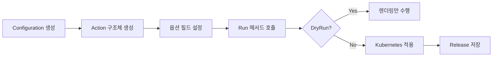
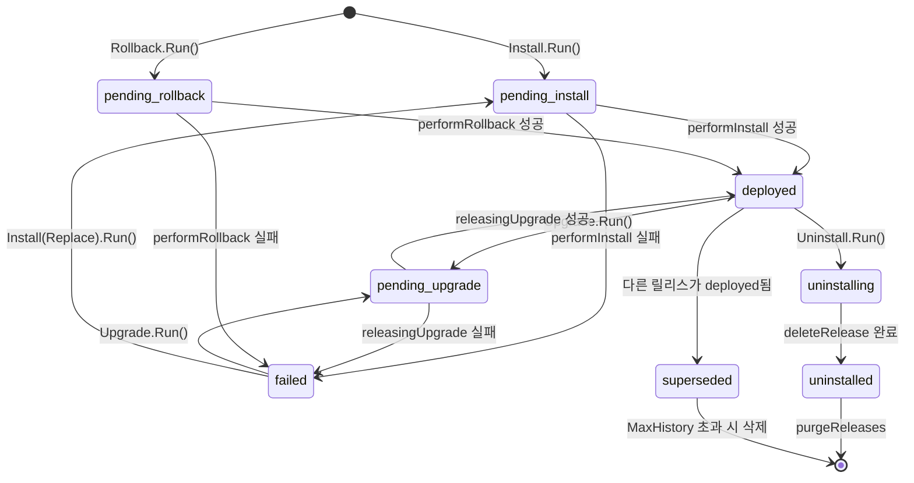

# 14. Action 시스템 Deep-Dive

## 목차
1. [개요](#1-개요)
2. [Action 패턴 아키텍처](#2-action-패턴-아키텍처)
3. [Configuration: 공유 의존성 컨테이너](#3-configuration-공유-의존성-컨테이너)
4. [Install Action 상세 흐름](#4-install-action-상세-흐름)
5. [Upgrade Action 상세 흐름](#5-upgrade-action-상세-흐름)
6. [Rollback Action 상세 흐름](#6-rollback-action-상세-흐름)
7. [Uninstall Action 상세 흐름](#7-uninstall-action-상세-흐름)
8. [renderResources: 공통 렌더링 파이프라인](#8-renderresources-공통-렌더링-파이프라인)
9. [Hook 실행 체계](#9-hook-실행-체계)
10. [List와 Status: 조회 Action](#10-list와-status-조회-action)
11. [DryRun 전략과 SSA/CSA 결정](#11-dryrun-전략과-ssacsa-결정)
12. [설계 원칙과 Why 분석](#12-설계-원칙과-why-분석)

---

## 1. 개요

Helm v4의 Action 시스템은 모든 릴리스 생명주기 명령(install, upgrade, rollback, uninstall, list, status 등)을 **일관된 패턴**으로 구현하는 핵심 아키텍처이다. CLI 계층(`pkg/cmd`)과 비즈니스 로직(`pkg/action`) 사이의 깔끔한 분리를 통해 Helm SDK로도 동일한 기능을 사용할 수 있게 설계되어 있다.

### 핵심 설계 원칙

| 원칙 | 설명 |
|------|------|
| **의존성 공유** | `Configuration` 구조체가 모든 Action에 공통 의존성을 주입 |
| **Action 독립성** | 각 Action은 독립적인 구조체로, 필요한 옵션만 필드로 보유 |
| **생성자 패턴** | `NewXxx(cfg)` 함수로 Action을 생성하고 `Run()`으로 실행 |
| **상태 머신** | Release는 명확한 상태 전이를 따름 (pending → deployed/failed) |

### 소스 위치

```
helm/pkg/action/
  action.go        -- Configuration, renderResources, RESTClientGetter
  install.go       -- Install Action (~990줄)
  upgrade.go       -- Upgrade Action (~676줄)
  rollback.go      -- Rollback Action (~307줄)
  uninstall.go     -- Uninstall Action (~304줄)
  hooks.go         -- Hook 실행 엔진 (~298줄)
  list.go          -- List Action (~335줄)
  status.go        -- Status Action (~84줄)
```

---

## 2. Action 패턴 아키텍처

### 전체 흐름 다이어그램

```
+------------------+     +-------------------+     +------------------+
|   CLI Layer      |     |   Action Layer    |     |   Infra Layer    |
|   (pkg/cmd)      |     |   (pkg/action)    |     |   (pkg/kube,     |
|                  |     |                   |     |    pkg/storage,  |
|  NewInstallCmd() |     |  Configuration    |     |    pkg/registry) |
|  - Cobra 설정     | --> |   +- KubeClient   | --> |                  |
|  - 플래그 파싱     |     |   +- Releases     |     |  kube.Interface  |
|  - RunE 호출      |     |   +- Registry     |     |  storage.Storage |
|                  |     |                   |     |  registry.Client |
+------------------+     +-------------------+     +------------------+
```

### Action 생명주기 패턴

모든 Action은 동일한 3단계 생명주기를 따른다.

```
[1단계: 생성]              [2단계: 설정]              [3단계: 실행]
NewInstall(cfg)     -->   i.Namespace = "ns"   -->   i.Run(chart, vals)
NewUpgrade(cfg)           i.Timeout = 5m             u.Run(name, chart, vals)
NewRollback(cfg)          i.WaitStrategy = ...       r.Run(name)
NewUninstall(cfg)         i.DryRunStrategy = ...     u.Run(name)
```



### 왜 Action 패턴인가?

Helm v3/v4가 Action 패턴을 채택한 핵심 이유:

1. **CLI와 SDK 분리**: `pkg/cmd`는 사용자 입력만 처리하고, `pkg/action`은 비즈니스 로직만 담당. 이를 통해 Helm을 Go 라이브러리로 임베딩할 때 CLI 없이도 동일한 기능을 사용할 수 있다.

2. **테스트 용이성**: 각 Action은 `Configuration`을 통해 모든 외부 의존성을 주입받으므로, Fake 구현체를 넣어 단위 테스트가 가능하다.

3. **상태 격리**: 각 Action 인스턴스가 독립적인 상태를 가지므로 동시에 여러 릴리스를 처리할 때 간섭이 없다.

---

## 3. Configuration: 공유 의존성 컨테이너

### 구조체 정의

`pkg/action/action.go`에 정의된 `Configuration`은 모든 Action의 공통 의존성을 보관한다.

```go
// pkg/action/action.go:91-118
type Configuration struct {
    RESTClientGetter RESTClientGetter      // Kubernetes 클라이언트 로더
    Releases         *storage.Storage      // 릴리스 저장소
    KubeClient       kube.Interface        // Kubernetes API 클라이언트
    RegistryClient   *registry.Client      // OCI 레지스트리 클라이언트
    Capabilities     *common.Capabilities  // 클러스터 기능 정보
    CustomTemplateFuncs template.FuncMap   // 사용자 정의 템플릿 함수
    HookOutputFunc   func(namespace, pod, container string) io.Writer  // Hook 로그 출력
    mutex            sync.Mutex            // 동시 접근 보호
    logging.LogHolder                      // 로거 기능 임베딩
}
```

### Init 메서드: 드라이버 선택

`Configuration.Init()`은 Helm의 릴리스 저장 백엔드를 선택한다.

```
Init(getter, namespace, helmDriver)
  |
  +-- helmDriver == "secret" (기본값)
  |     --> driver.NewSecrets() --> Secret에 릴리스 저장
  |
  +-- helmDriver == "configmap"
  |     --> driver.NewConfigMaps() --> ConfigMap에 릴리스 저장
  |
  +-- helmDriver == "memory"
  |     --> driver.NewMemory() --> 메모리에 릴리스 저장 (테스트용)
  |
  +-- helmDriver == "sql"
        --> driver.NewSQL() --> SQL DB에 릴리스 저장
```

실제 코드(`pkg/action/action.go:515-570`):

```go
func (cfg *Configuration) Init(getter genericclioptions.RESTClientGetter,
    namespace, helmDriver string) error {
    kc := kube.New(getter)
    kc.SetLogger(cfg.Logger().Handler())

    lazyClient := &lazyClient{
        namespace: namespace,
        clientFn:  kc.Factory.KubernetesClientSet,
    }

    var store *storage.Storage
    switch helmDriver {
    case "secret", "secrets", "":
        d := driver.NewSecrets(newSecretClient(lazyClient))
        store = storage.Init(d)
    case "configmap", "configmaps":
        d := driver.NewConfigMaps(newConfigMapClient(lazyClient))
        store = storage.Init(d)
    case "memory":
        d := driver.NewMemory()
        d.SetNamespace(namespace)
        store = storage.Init(d)
    case "sql":
        d, err := driver.NewSQL(
            os.Getenv("HELM_DRIVER_SQL_CONNECTION_STRING"), namespace)
        if err != nil {
            return fmt.Errorf("unable to instantiate SQL driver: %w", err)
        }
        store = storage.Init(d)
    }
    // ...
}
```

### 왜 Secret이 기본 드라이버인가?

| 저장소 | 장점 | 단점 |
|--------|------|------|
| Secret | RBAC 기반 접근 제어, base64 인코딩 | etcd 크기 제한 (1MB) |
| ConfigMap | 디버깅 용이 (평문) | 보안 취약 |
| Memory | 빠름, 테스트 적합 | 영속성 없음 |
| SQL | 대용량 릴리스 지원 | 외부 DB 의존 |

Secret을 기본으로 선택한 이유는 릴리스 데이터에 values가 포함될 수 있고, 이 values에 비밀번호 같은 민감 정보가 들어갈 수 있기 때문이다. Secret은 Kubernetes RBAC으로 접근을 제한할 수 있어 ConfigMap보다 안전하다.

### RESTClientGetter 인터페이스

```go
// pkg/action/action.go:376-380
type RESTClientGetter interface {
    ToRESTConfig() (*rest.Config, error)
    ToDiscoveryClient() (discovery.CachedDiscoveryInterface, error)
    ToRESTMapper() (meta.RESTMapper, error)
}
```

이 인터페이스는 `k8s.io/cli-runtime`의 `genericclioptions.RESTClientGetter`보다 의도적으로 **작은 범위**로 정의되어 있다. 실제로 Helm이 필요한 기능만 노출함으로써 Action 테스트에서 모킹해야 할 메서드를 최소화한다.

### getCapabilities: 클러스터 정보 수집

```go
// pkg/action/action.go:383-422
func (cfg *Configuration) getCapabilities() (*common.Capabilities, error) {
    if cfg.Capabilities != nil {
        return cfg.Capabilities, nil  // 캐시된 값 반환
    }
    dc, err := cfg.RESTClientGetter.ToDiscoveryClient()
    dc.Invalidate()  // 항상 최신 정보 가져오기
    kubeVersion, err := dc.ServerVersion()
    apiVersions, err := GetVersionSet(dc)
    cfg.Capabilities = &common.Capabilities{
        APIVersions: apiVersions,
        KubeVersion: common.KubeVersion{...},
        HelmVersion: common.DefaultCapabilities.HelmVersion,
    }
    return cfg.Capabilities, nil
}
```

**왜 `Invalidate()`를 호출하는가?** Discovery 캐시를 무효화하여 항상 서버의 최신 API 버전 목록을 가져온다. CRD가 동적으로 추가될 수 있으므로, 이전에 캐시된 정보가 오래될 수 있기 때문이다.

---

## 4. Install Action 상세 흐름

### Install 구조체

`pkg/action/install.go:74-136`에 정의된 `Install` 구조체는 약 30개의 설정 필드를 보유한다.

```go
type Install struct {
    cfg *Configuration
    ChartPathOptions              // 차트 경로/인증 관련 옵션 임베딩

    ForceReplace     bool         // 경고 무시하고 강제 설치
    ForceConflicts   bool         // SSA 충돌 시 강제 적용
    ServerSideApply  bool         // SSA 사용 여부 (기본: true)
    CreateNamespace  bool         // 네임스페이스 자동 생성
    DryRunStrategy   DryRunStrategy
    DisableHooks     bool
    Replace          bool         // 삭제된 릴리스 이름 재사용
    WaitStrategy     kube.WaitStrategy
    WaitOptions      []kube.WaitOption
    Timeout          time.Duration
    Namespace        string
    ReleaseName      string
    RollbackOnFailure bool        // 실패 시 자동 언인스톨
    PostRenderer     postrenderer.PostRenderer
    // ... 약 15개 추가 필드
}
```

### NewInstall: SSA가 기본값

```go
// pkg/action/install.go:159-168
func NewInstall(cfg *Configuration) *Install {
    in := &Install{
        cfg:             cfg,
        ServerSideApply: true,  // 반드시 CLI 기본값과 일치해야 함
        DryRunStrategy:  DryRunNone,
    }
    in.registryClient = cfg.RegistryClient
    return in
}
```

**Helm v4의 중요한 변경**: v3에서는 CSA(Client-Side Apply)가 기본이었지만, v4에서는 **SSA(Server-Side Apply)가 기본**이다. 주석 "Must always match the CLI default"는 `pkg/cmd/install.go`의 CLI 플래그 기본값과 이 값이 반드시 동기화되어야 함을 강조한다.

### RunWithContext 전체 흐름

```
RunWithContext(ctx, chart, vals)
  |
  [1] IsReachable 검사 (클러스터 접근 가능?)
  |
  [2] availableName 검사 (릴리스명 사용 가능?)
  |
  [3] ProcessDependencies (의존 차트 처리)
  |
  [4] CRD 설치 (crds/ 디렉토리 처리)
  |     +-- installCRDs → KubeClient.Create → Waiter.Wait
  |     +-- discovery 캐시 무효화
  |     +-- REST mapper 캐시 리셋
  |
  [5] DryRun 분기
  |     +-- client: Fake KubeClient 사용, 메모리 드라이버
  |     +-- server: 실제 서버에 dry-run 요청
  |
  [6] getCapabilities (클러스터 API 버전 수집)
  |
  [7] renderResources (템플릿 렌더링)
  |     +-- engine.Render → SortManifests → PostRenderer
  |
  [8] KubeClient.Build (매니페스트 → ResourceList 변환)
  |
  [9] 리소스 충돌 검사
  |     +-- existingResourceConflict (기존 리소스와 충돌?)
  |     +-- requireAdoption (TakeOwnership 모드)
  |
  [10] 네임스페이스 생성 (CreateNamespace 플래그)
  |
  [11] 릴리스 저장소에 릴리스 생성 (status: pending-install)
  |
  [12] performInstall
       +-- pre-install hooks 실행
       +-- KubeClient.Create 또는 Update (리소스 생성)
       +-- Waiter.Wait (리소스 준비 대기)
       +-- post-install hooks 실행
       +-- status: deployed 설정
       +-- 릴리스 저장소 업데이트
```

### CRD 설치 흐름

Install에서 CRD는 **차트 렌더링보다 먼저** 설치된다. 이유는 차트 템플릿이 CRD에서 정의한 커스텀 리소스를 참조할 수 있기 때문이다.

```go
// pkg/action/install.go:315-322
if crds := chrt.CRDObjects(); interactWithServer(i.DryRunStrategy) &&
    !i.SkipCRDs && len(crds) > 0 {
    if isDryRun(i.DryRunStrategy) {
        // DryRun에서는 CRD 설치를 건너뛰고 경고만 출력
        i.cfg.Logger().Warn("This chart contains CRDs. Rendering may fail.")
    } else if err := i.installCRDs(crds); err != nil {
        return nil, err
    }
}
```

`installCRDs()`는 CRD 설치 후 두 가지 캐시를 무효화한다:

```go
// pkg/action/install.go:238-261
// 1. Discovery 캐시 무효화 - 새 CRD의 API 그룹 인식
discoveryClient.Invalidate()
_, _ = discoveryClient.ServerGroups()

// 2. REST mapper 리셋 - GVK → GVR 매핑 갱신
if resettable, ok := restMapper.(meta.ResettableRESTMapper); ok {
    resettable.Reset()
}
```

### performInstall: 실제 리소스 생성

```go
// pkg/action/install.go:501-574
func (i *Install) performInstall(rel *release.Release,
    toBeAdopted kube.ResourceList, resources kube.ResourceList) (*release.Release, error) {

    // pre-install hooks
    if !i.DisableHooks {
        if err := i.cfg.execHook(rel, release.HookPreInstall, ...); err != nil {
            return rel, fmt.Errorf("failed pre-install: %w", err)
        }
    }

    // 리소스 생성: adoption 여부에 따라 Create 또는 Update
    if len(toBeAdopted) == 0 && len(resources) > 0 {
        _, err = i.cfg.KubeClient.Create(resources,
            kube.ClientCreateOptionServerSideApply(i.ServerSideApply, false))
    } else if len(resources) > 0 {
        _, err = i.cfg.KubeClient.Update(toBeAdopted, resources,
            kube.ClientUpdateOptionForceReplace(i.ForceReplace),
            kube.ClientUpdateOptionServerSideApply(i.ServerSideApply, i.ForceConflicts),
            ...)
    }

    // 리소스 준비 대기
    waiter, err = i.cfg.KubeClient.GetWaiter(i.WaitStrategy)
    if i.WaitForJobs {
        err = waiter.WaitWithJobs(resources, i.Timeout)
    } else {
        err = waiter.Wait(resources, i.Timeout)
    }

    // post-install hooks
    if !i.DisableHooks {
        if err := i.cfg.execHook(rel, release.HookPostInstall, ...); err != nil {
            return rel, fmt.Errorf("failed post-install: %w", err)
        }
    }

    rel.SetStatus(rcommon.StatusDeployed, "Install complete")
    return rel, nil
}
```

### RollbackOnFailure: 설치 실패 시 자동 복구

```go
// pkg/action/install.go:576-593
func (i *Install) failRelease(rel *release.Release, err error) (*release.Release, error) {
    rel.SetStatus(rcommon.StatusFailed, ...)
    if i.RollbackOnFailure {
        uninstall := NewUninstall(i.cfg)
        uninstall.DisableHooks = i.DisableHooks
        uninstall.KeepHistory = false
        uninstall.Timeout = i.Timeout
        if _, uninstallErr := uninstall.Run(i.ReleaseName); uninstallErr != nil {
            return rel, fmt.Errorf("install error: %w: %w", err, uninstallErr)
        }
        return rel, fmt.Errorf("release %s failed and uninstalled: %w", i.ReleaseName, err)
    }
    // ...
}
```

**왜 RollbackOnFailure가 WaitStrategy를 자동 설정하는가?**

```go
// pkg/action/install.go:343-345
if i.WaitStrategy == kube.HookOnlyStrategy && i.RollbackOnFailure {
    i.WaitStrategy = kube.StatusWatcherStrategy
}
```

Hook-only 대기 전략은 Hook만 감시하므로 리소스 실패를 감지할 수 없다. RollbackOnFailure를 의미 있게 동작시키려면 실제 리소스의 상태를 감시해야 하므로 자동으로 `StatusWatcherStrategy`로 전환한다.

### Context 기반 취소 처리

```go
// pkg/action/install.go:474-494
func (i *Install) performInstallCtx(ctx context.Context, ...) (*release.Release, error) {
    resultChan := make(chan Msg, 1)
    go func() {
        i.goroutineCount.Add(1)
        rel, err := i.performInstall(rel, toBeAdopted, resources)
        resultChan <- Msg{rel, err}
        i.goroutineCount.Add(-1)
    }()
    select {
    case <-ctx.Done():           // SIGINT/SIGTERM 수신
        return rel, ctx.Err()    // 즉시 반환, 백그라운드에서 계속 진행
    case msg := <-resultChan:    // 정상 완료
        return msg.r, msg.e
    }
}
```

**설계 의도**: `ctx.Done()` 수신 시 설치를 중단하지 않고, 사용자에게만 즉시 반환한다. 이미 Kubernetes에 요청이 전달된 상태에서 중간에 멈추면 불완전한 상태가 될 수 있기 때문이다. `goroutineCount`는 테스트에서 백그라운드 작업 완료를 확인하는 데 사용된다.

---

## 5. Upgrade Action 상세 흐름

### Upgrade 구조체의 핵심 차이점

```go
// pkg/action/upgrade.go:50-134
type Upgrade struct {
    cfg *Configuration
    ChartPathOptions

    Install         bool       // install-or-upgrade 모드 표시 (정보 전용)
    ServerSideApply string     // "true", "false", "auto" (Install과 다른 타입!)
    ResetValues     bool       // 차트 기본값으로 초기화
    ReuseValues     bool       // 이전 릴리스 값 재사용
    ResetThenReuseValues bool  // 기본값 + 이전 값 병합
    MaxHistory      int        // 릴리스 이력 최대 개수
    RollbackOnFailure bool     // 실패 시 자동 롤백
    CleanupOnFail   bool       // 실패 시 새로 생성된 리소스 삭제
    TakeOwnership   bool       // 기존 리소스 소유권 인수
    // ...
}
```

### ServerSideApply "auto" 전략

Upgrade에서 SSA 설정은 `string` 타입으로, Install의 `bool`과 다르다.

```go
// pkg/action/upgrade.go:142-151
func NewUpgrade(cfg *Configuration) *Upgrade {
    up := &Upgrade{
        cfg:             cfg,
        ServerSideApply: "auto",  // "true", "false", "auto" 가능
        DryRunStrategy:  DryRunNone,
    }
    return up
}
```

`"auto"` 모드의 동작:

```go
// pkg/action/upgrade.go:664-675
func getUpgradeServerSideValue(serverSideOption string,
    releaseApplyMethod string) (bool, error) {
    switch serverSideOption {
    case "auto":
        return releaseApplyMethod == "ssa", nil  // 이전 릴리스와 동일한 방식 사용
    case "false":
        return false, nil
    case "true":
        return true, nil
    }
}
```

**왜 "auto"가 기본인가?** Helm v3에서 v4로 마이그레이션하는 과정에서, 기존에 CSA로 설치된 릴리스를 갑자기 SSA로 업그레이드하면 field manager 충돌이 발생할 수 있다. `"auto"`는 이전 릴리스의 `ApplyMethod`을 따라가므로 안전한 전환을 보장한다.

### Upgrade 전체 흐름

```
RunWithContext(ctx, name, chart, vals)
  |
  [1] IsReachable 검사
  |
  [2] ValidateReleaseName 검사
  |
  [3] prepareUpgrade
  |     +-- Releases.Last(name) → 최신 릴리스 조회
  |     +-- pending 상태 확인 → errPending 반환 (낙관적 잠금)
  |     +-- reuseValues → 값 병합 전략 결정
  |     +-- ProcessDependencies
  |     +-- renderResources → 새 매니페스트 렌더링
  |     +-- getUpgradeServerSideValue → SSA/CSA 결정
  |     +-- upgradedRelease 생성 (status: pending-upgrade)
  |
  [4] performUpgrade
  |     +-- Build(currentManifest) → 현재 리소스 목록
  |     +-- Build(newManifest) → 새 리소스 목록
  |     +-- 새 리소스 중 기존에 없는 것 → 충돌 검사
  |     +-- Releases.Create(upgradedRelease)
  |     +-- releasingUpgrade (goroutine)
  |           +-- pre-upgrade hooks
  |           +-- KubeClient.Update(current, target)
  |           +-- Waiter.Wait(target)
  |           +-- post-upgrade hooks
  |           +-- originalRelease → superseded
  |           +-- upgradedRelease → deployed
  |
  [5] Releases.Update(upgradedRelease)
```

### Values 병합 전략

```
┌─────────────────────────────────────────────────────┐
│              Values 병합 전략 결정 트리               │
├─────────────────────────────────────────────────────┤
│                                                     │
│  ResetValues?  ─── Yes ──> 새 values만 사용          │
│       │                                             │
│      No                                             │
│       │                                             │
│  ReuseValues?  ─── Yes ──> 이전 릴리스의 coalesced   │
│       │                    values를 기반으로 새 값 병합│
│      No                                             │
│       │                                             │
│  ResetThenReuseValues? ── Yes ──> 차트 기본값 +      │
│       │                          이전 config 병합    │
│      No                                             │
│       │                                             │
│  newVals 비어있고 currentConfig 있으면?               │
│       Yes ──> 이전 config 복사                       │
│       No  ──> 새 values 그대로 사용                   │
└─────────────────────────────────────────────────────┘
```

### CSA → SSA 전환 시 Field Manager 마이그레이션

```go
// pkg/action/upgrade.go:465
upgradeClientSideFieldManager :=
    isReleaseApplyMethodClientSideApply(originalRelease.ApplyMethod) &&
    serverSideApply  // CSA→SSA 전환 시 true

results, err := u.cfg.KubeClient.Update(
    current, target,
    kube.ClientUpdateOptionForceReplace(u.ForceReplace),
    kube.ClientUpdateOptionServerSideApply(serverSideApply, u.ForceConflicts),
    kube.ClientUpdateOptionUpgradeClientSideFieldManager(upgradeClientSideFieldManager))
```

`upgradeClientSideFieldManager`가 `true`이면, `kube.Client`는 기존 CSA field manager의 `managedFields`를 SSA field manager로 마이그레이션한다. 이 과정이 없으면 SSA로 전환할 때 "field is owned by another manager" 충돌이 발생한다.

### Upgrade의 실패 처리와 롤백

```go
// pkg/action/upgrade.go:523-594
func (u *Upgrade) failRelease(rel *release.Release,
    created kube.ResourceList, err error) (*release.Release, error) {

    rel.Info.Status = rcommon.StatusFailed
    u.cfg.recordRelease(rel)

    // 1. CleanupOnFail: 새로 생성된 리소스 삭제
    if u.CleanupOnFail && len(created) > 0 {
        _, errs := u.cfg.KubeClient.Delete(created, ...)
    }

    // 2. RollbackOnFailure: 이전 성공 릴리스로 롤백
    if u.RollbackOnFailure {
        // 성공했던 릴리스 찾기 (superseded 또는 deployed 상태)
        filteredHistory := releaseutil.FilterFunc(func(r *release.Release) bool {
            return r.Info.Status == rcommon.StatusSuperseded ||
                   r.Info.Status == rcommon.StatusDeployed
        }).Filter(fullHistory)

        // 롤백 실행
        rollin := NewRollback(u.cfg)
        rollin.Version = filteredHistory[0].Version
        rollin.WaitStrategy = u.WaitStrategy
        // ... 나머지 옵션 복사
        if rollErr := rollin.Run(rel.Name); rollErr != nil {
            return rel, fmt.Errorf("upgrade error: %w: rollback error: %w", err, rollErr)
        }
    }
}
```

### 동시 업그레이드 방지

```go
// pkg/action/upgrade.go:242-244
if lastRelease.Info.Status.IsPending() {
    return nil, nil, false, errPending
}
```

동시에 두 개의 `helm upgrade`가 실행되면, 하나는 릴리스가 `pending-*` 상태임을 감지하고 `errPending`("another operation is in progress")을 반환한다. 이는 **낙관적 잠금** 패턴으로, 분산 환경에서도 정확히 동작한다.

---

## 6. Rollback Action 상세 흐름

### Rollback 구조체

```go
// pkg/action/rollback.go:37-62
type Rollback struct {
    cfg *Configuration

    Version         int               // 롤백 대상 버전 (0이면 이전 버전)
    Timeout         time.Duration
    WaitStrategy    kube.WaitStrategy
    WaitOptions     []kube.WaitOption
    DisableHooks    bool
    DryRunStrategy  DryRunStrategy
    ForceReplace    bool
    ForceConflicts  bool
    ServerSideApply string            // "auto" 기본값
    CleanupOnFail   bool
    MaxHistory      int
}
```

### Rollback 전체 흐름

```
Run(name)
  |
  [1] IsReachable 검사
  |
  [2] prepareRollback
  |     +-- Releases.Last(name) → 현재 릴리스
  |     +-- Version 결정 (0이면 current.Version - 1)
  |     +-- History에서 대상 버전 존재 여부 확인
  |     +-- Releases.Get(name, previousVersion)
  |     +-- getUpgradeServerSideValue → SSA/CSA 결정
  |     +-- targetRelease 생성
  |           - Chart: previousRelease.Chart (이전 차트)
  |           - Config: previousRelease.Config (이전 값)
  |           - Manifest: previousRelease.Manifest (이전 매니페스트)
  |           - Version: currentRelease.Version + 1 (새 리비전!)
  |           - Status: pending-rollback
  |
  [3] Releases.Create(targetRelease)  // 새 리비전으로 저장
  |
  [4] performRollback
  |     +-- Build(currentManifest) → 현재 리소스
  |     +-- Build(targetManifest) → 롤백 대상 리소스
  |     +-- pre-rollback hooks
  |     +-- KubeClient.Update(current, target) → 리소스 변경
  |     +-- Waiter.Wait(target) → 준비 대기
  |     +-- post-rollback hooks
  |     +-- 모든 이전 deployed 릴리스 → superseded
  |     +-- targetRelease → deployed
  |
  [5] Releases.Update(targetRelease)
```

### 왜 Rollback이 새 리비전을 생성하는가?

```go
// pkg/action/rollback.go:173-194
targetRelease := &release.Release{
    Name:      name,
    Namespace: currentRelease.Namespace,
    Chart:     previousRelease.Chart,     // 이전 차트 사용
    Config:    previousRelease.Config,     // 이전 값 사용
    Info: &release.Info{
        FirstDeployed: currentRelease.Info.FirstDeployed,
        LastDeployed:  time.Now(),         // 지금 시간
        Status:        common.StatusPendingRollback,
        Description:   fmt.Sprintf("Rollback to %d", previousVersion),
    },
    Version:  currentRelease.Version + 1,  // 새 리비전 번호!
    Manifest: previousRelease.Manifest,    // 이전 매니페스트 사용
    Hooks:    previousRelease.Hooks,       // 이전 훅 사용
}
```

롤백이 기존 리비전을 수정하지 않고 **새 리비전을 생성**하는 이유:

1. **감사 추적(Audit Trail)**: 누가 언제 롤백했는지 기록이 남는다
2. **다중 롤백 안전성**: 롤백 후 다시 롤백해도 이력이 일관적이다
3. **멱등성**: 같은 롤백을 반복해도 릴리스 이력이 꼬이지 않는다

### 모든 Deployed 릴리스 Supersede

```go
// pkg/action/rollback.go:288-301
deployed, err := r.cfg.Releases.DeployedAll(currentRelease.Name)
for _, reli := range deployed {
    rel, _ := releaserToV1Release(reli)
    rel.Info.Status = common.StatusSuperseded
    r.cfg.recordRelease(rel)
}
targetRelease.Info.Status = common.StatusDeployed
```

**왜 DeployedAll인가?** Helm의 저장소에는 동일 릴리스명으로 여러 `deployed` 상태 레코드가 남아있을 수 있다 (비정상 종료 등). 이 모든 레코드를 `superseded`로 변경하여 `deployed` 상태인 릴리스가 정확히 하나만 존재하도록 보장한다.

---

## 7. Uninstall Action 상세 흐름

### Uninstall 구조체

```go
// pkg/action/uninstall.go:40-52
type Uninstall struct {
    cfg *Configuration

    DisableHooks        bool
    DryRun              bool
    IgnoreNotFound      bool        // 릴리스 없으면 에러 대신 nil 반환
    KeepHistory         bool        // 릴리스 이력 보존
    WaitStrategy        kube.WaitStrategy
    DeletionPropagation string      // "background", "foreground", "orphan"
    Timeout             time.Duration
    Description         string
}
```

### Uninstall 전체 흐름

```
Run(name)
  |
  [1] IsReachable 검사
  |
  [2] DryRun 분기
  |     +-- true: releaseContent만 반환하고 종료
  |
  [3] Releases.History(name) → 릴리스 이력 조회
  |
  [4] 최신 릴리스가 이미 uninstalled?
  |     +-- KeepHistory=false: purge 후 반환
  |     +-- KeepHistory=true: "already deleted" 에러
  |
  [5] status → uninstalling
  |
  [6] pre-delete hooks 실행
  |
  [7] Releases.Update(rel) → uninstalling 상태 저장
  |
  [8] deleteRelease
  |     +-- SplitManifests → SortManifests(UninstallOrder)
  |     +-- filterManifestsToKeep (resource-policy=keep 확인)
  |     +-- KubeClient.Build → KubeClient.Delete
  |
  [9] Waiter.WaitForDelete (리소스 삭제 완료 대기)
  |
  [10] post-delete hooks 실행
  |
  [11] status → uninstalled
  |
  [12] KeepHistory 분기
       +-- false: purgeReleases (모든 이력 삭제)
       +-- true: Releases.Update + 이전 deployed 모두 supersede
```

### DeletionPropagation 선택

```go
// pkg/action/uninstall.go:291-303
func parseCascadingFlag(cascadingFlag string) v1.DeletionPropagation {
    switch cascadingFlag {
    case "orphan":       return v1.DeletePropagationOrphan
    case "foreground":   return v1.DeletePropagationForeground
    case "background":   return v1.DeletePropagationBackground
    default:             return v1.DeletePropagationBackground
    }
}
```

| 전파 방식 | 동작 | 사용 사례 |
|-----------|------|----------|
| background | 즉시 반환, 의존 리소스 비동기 삭제 | 기본값, 빠른 삭제 |
| foreground | 의존 리소스 먼저 삭제 후 부모 삭제 | 순서 보장 필요 시 |
| orphan | 부모만 삭제, 의존 리소스 유지 | 리소스 보존 필요 시 |

### Resource Policy "keep"

```go
// pkg/action/uninstall.go:270-274
filesToKeep, filesToDelete := filterManifestsToKeep(files)
var kept strings.Builder
for _, f := range filesToKeep {
    fmt.Fprintf(&kept, "[%s] %s\n", f.Head.Kind, f.Head.Metadata.Name)
}
```

`helm.sh/resource-policy: keep` 어노테이션이 있는 리소스는 삭제에서 제외된다. PVC(영구 볼륨 클레임) 같은 데이터가 포함된 리소스를 보호하는 데 사용된다.

### KeepHistory의 의미

```
KeepHistory = false (기본):
  릴리스 레코드 완전 삭제 → helm list에 표시되지 않음
  → 같은 이름으로 다시 install 가능

KeepHistory = true:
  릴리스 레코드 보존 (status: uninstalled)
  → helm list --uninstalled로 확인 가능
  → helm rollback으로 복구 가능
  → 같은 이름으로 install 불가 (--replace 필요)
```

---

## 8. renderResources: 공통 렌더링 파이프라인

### 함수 시그니처

```go
// pkg/action/action.go:222-373
func (cfg *Configuration) renderResources(
    ch *chart.Chart,
    values common.Values,
    releaseName, outputDir string,
    subNotes, useReleaseName, includeCrds bool,
    pr postrenderer.PostRenderer,
    interactWithRemote, enableDNS, hideSecret bool,
) ([]*release.Hook, *bytes.Buffer, string, error)
```

### 렌더링 파이프라인 단계

```
renderResources 파이프라인
  |
  [1] getCapabilities → kubeVersion 호환성 검사
  |     chart.Metadata.KubeVersion과 실제 클러스터 버전 비교
  |
  [2] engine.Render(chart, values)
  |     +-- interactWithRemote=true:
  |     |     engine.New(restConfig)  → lookup 함수 사용 가능
  |     +-- interactWithRemote=false:
  |           engine.Engine{}  → 오프라인 렌더링
  |
  [3] NOTES.txt 추출
  |     templates/NOTES.txt → 별도 문자열로 분리
  |     (Hook도 리소스도 아닌 특수 파일)
  |
  [4] PostRenderer 적용 (선택적)
  |     +-- annotateAndMerge → 파일명 어노테이션 추가 후 단일 스트림 병합
  |     +-- pr.Run(merged) → 외부 도구(Kustomize 등) 실행
  |     +-- splitAndDeannotate → 파일명별 분리 및 어노테이션 제거
  |
  [5] releaseutil.SortManifests
  |     Hook과 일반 매니페스트 분리
  |     InstallOrder에 따라 정렬
  |
  [6] 출력 생성
       +-- outputDir == "": 메모리 Buffer에 기록
       +-- outputDir != "": 파일로 기록 (helm template용)
```

### PostRenderer 어노테이션 메커니즘

PostRenderer는 단일 YAML 스트림을 받지만, Helm은 파일 단위로 매니페스트를 관리한다. 이 불일치를 해결하기 위한 어노테이션 기반 왕복(round-trip) 메커니즘:

```go
// pkg/action/action.go:147-179
const filenameAnnotation = "postrenderer.helm.sh/postrender-filename"

// 1단계: 파일명을 어노테이션으로 보존
func annotateAndMerge(files map[string]string) (string, error) {
    fnames := slices.Sorted(maps.Keys(files))  // 결정적 순서 보장
    for _, fname := range fnames {
        // 파셜(_로 시작)과 빈 파일은 건너뜀
        if strings.HasPrefix(path.Base(fname), "_") || strings.TrimSpace(content) == "" {
            continue
        }
        manifests, _ := kio.ParseAll(content)
        for _, manifest := range manifests {
            manifest.PipeE(kyaml.SetAnnotation(filenameAnnotation, fname))
        }
    }
    return kio.StringAll(combinedManifests)
}

// 2단계: PostRenderer 실행 후 어노테이션으로 파일 복원
func splitAndDeannotate(postrendered string) (map[string]string, error) {
    manifests, _ := kio.ParseAll(postrendered)
    manifestsByFilename := make(map[string][]*kyaml.RNode)
    for i, manifest := range manifests {
        meta, _ := manifest.GetMeta()
        fname := meta.Annotations[filenameAnnotation]
        if fname == "" {
            fname = fmt.Sprintf("generated-by-postrender-%d.yaml", i)  // PR이 추가한 리소스
        }
        manifest.PipeE(kyaml.ClearAnnotation(filenameAnnotation))  // 어노테이션 제거
        manifestsByFilename[fname] = append(manifestsByFilename[fname], manifest)
    }
    // ...
}
```

**왜 이 방식인가?** PostRenderer(Kustomize 등)가 새 리소스를 추가하거나 기존 리소스를 수정할 수 있다. 어노테이션 기반 왕복은:
- PostRenderer에 투명 (어노테이션을 건드릴 필요 없음)
- PostRenderer가 추가한 리소스를 자동 감지 (`generated-by-postrender-N.yaml`)
- 결정적 순서 보장 (`slices.Sorted`)

### Secret 숨김 처리

```go
// pkg/action/action.go:350-352
if hideSecret && m.Head.Kind == "Secret" && m.Head.Version == "v1" {
    fmt.Fprintf(b, "---\n# Source: %s\n# HIDDEN: The Secret output has been suppressed\n", m.Name)
}
```

`--hide-secret` 플래그는 DryRun 모드에서만 사용 가능하며, 렌더링된 Secret을 출력하지 않고 대신 "HIDDEN" 메시지를 표시한다. 이는 CI/CD 파이프라인에서 `helm template` 출력에 민감 정보가 노출되는 것을 방지한다.

---

## 9. Hook 실행 체계

### Hook 이벤트 타입

```
┌──────────────────────────────────────────────────────┐
│                  Hook 이벤트 매핑                      │
├──────────────────┬───────────────────────────────────┤
│ Action           │ Hook 이벤트                        │
├──────────────────┼───────────────────────────────────┤
│ Install          │ pre-install  →  post-install       │
│ Upgrade          │ pre-upgrade  →  post-upgrade       │
│ Rollback         │ pre-rollback →  post-rollback      │
│ Uninstall        │ pre-delete   →  post-delete        │
│ 테스트            │ test                               │
└──────────────────┴───────────────────────────────────┘
```

### execHook: 핵심 실행 로직

```go
// pkg/action/hooks.go:35-50
func (cfg *Configuration) execHook(rl *release.Release, hook release.HookEvent,
    waitStrategy kube.WaitStrategy, waitOptions []kube.WaitOption,
    timeout time.Duration, serverSideApply bool) error {

    shutdown, err := cfg.execHookWithDelayedShutdown(rl, hook, ...)
    if shutdown == nil {
        return err
    }
    if err != nil {
        if err := shutdown(); err != nil {  // 실패 시에도 shutdown 실행
            return err
        }
        return err
    }
    return shutdown()  // 성공 시 shutdown 실행
}
```

**왜 Delayed Shutdown 패턴인가?** Hook 실행과 Hook 삭제를 분리하여, Hook 실패 시에도 로그 출력과 리소스 정리를 올바른 순서로 수행할 수 있다. `shutdown` 함수는 클로저로 실행 컨텍스트를 캡처한다.

### Hook 실행 상세 흐름

```
execHookWithDelayedShutdown(release, hookEvent, ...)
  |
  [1] 해당 이벤트에 매칭되는 Hook 필터링
  |     for _, h := range rl.Hooks {
  |       for _, e := range h.Events {
  |         if e == hook { executingHooks = append(...) }
  |       }
  |     }
  |
  [2] hookByWeight 정렬 (Weight 오름차순, 동일 Weight는 Name 오름차순)
  |
  [3] 각 Hook에 대해:
  |     +-- hookSetDeletePolicy (기본값: before-hook-creation)
  |     +-- deleteHookByPolicy(BeforeHookCreation) → 이전 Hook 리소스 삭제
  |     +-- KubeClient.Build(hook.Manifest) → 리소스 빌드
  |     +-- h.LastRun = {StartedAt: now, Phase: Running}
  |     +-- recordRelease(rl) → 실행 상태 저장
  |     +-- KubeClient.Create(resources) → Hook 리소스 생성
  |     +-- Waiter.WatchUntilReady(resources) → 완료 대기
  |     +-- 성공: Phase = Succeeded
  |     +-- 실패:
  |           +-- Phase = Failed
  |           +-- outputLogsByPolicy(OnFailed) → 실패 로그 출력
  |           +-- return shutdown function (지연된 삭제)
  |
  [4] 모든 Hook 성공 시:
       return shutdown function:
         for each hook (역순):
           outputLogsByPolicy(OnSucceeded) → 성공 로그 출력
           deleteHookByPolicy(Succeeded) → 성공 시 삭제
```

### hookByWeight 정렬

```go
// pkg/action/hooks.go:168-177
type hookByWeight []*release.Hook

func (x hookByWeight) Less(i, j int) bool {
    if x[i].Weight == x[j].Weight {
        return x[i].Name < x[j].Name  // 같은 가중치면 이름순
    }
    return x[i].Weight < x[j].Weight  // 가중치 오름차순
}
```

`sort.Stable`을 사용하여 원래 Kind 기반 정렬 순서를 보존하면서 Weight로만 재정렬한다. 이는 같은 Weight의 Hook들이 Kind 순서(예: Namespace → ConfigMap → Deployment)를 유지하도록 보장한다.

### Delete Policy 체계

```
┌────────────────────────────────────────────────────────────┐
│                    Hook Delete Policy                       │
├──────────────────────────┬─────────────────────────────────┤
│ before-hook-creation     │ Hook 생성 전 이전 리소스 삭제     │
│                          │ (기본값)                         │
├──────────────────────────┼─────────────────────────────────┤
│ hook-succeeded           │ Hook 성공 시 리소스 삭제          │
├──────────────────────────┼─────────────────────────────────┤
│ hook-failed              │ Hook 실패 시 리소스 삭제          │
└──────────────────────────┴─────────────────────────────────┘
```

```go
// pkg/action/hooks.go:237-247
func (cfg *Configuration) hookSetDeletePolicy(h *release.Hook) {
    cfg.mutex.Lock()
    defer cfg.mutex.Unlock()
    if len(h.DeletePolicies) == 0 {
        // 기본 정책: before-hook-creation
        h.DeletePolicies = []release.HookDeletePolicy{release.HookBeforeHookCreation}
    }
}
```

**왜 before-hook-creation이 기본값인가?** Hook 리소스(주로 Job/Pod)는 재실행 시 이전 리소스가 남아있으면 이름 충돌이 발생한다. `before-hook-creation`은 새 Hook을 생성하기 전에 이전 것을 삭제하여 매번 깨끗한 상태에서 시작하게 한다.

### CRD Hook 보호

```go
// pkg/action/hooks.go:185-187
func (cfg *Configuration) deleteHookByPolicy(h *release.Hook, ...) error {
    // CRD는 절대 삭제하지 않음: cascading garbage collection 방지
    if h.Kind == "CustomResourceDefinition" {
        return nil
    }
    // ...
}
```

CRD를 삭제하면 해당 CRD에 의존하는 모든 커스텀 리소스가 **Kubernetes garbage collection에 의해 연쇄 삭제**된다. 이는 치명적인 데이터 손실을 초래할 수 있으므로, Hook 삭제 정책에 관계없이 CRD는 항상 보존한다.

### Output Log Policy

Hook 실행 결과에 따라 컨테이너 로그를 출력할 수 있다.

```go
// pkg/action/hooks.go:250-266
func (cfg *Configuration) outputLogsByPolicy(h *release.Hook,
    releaseNamespace string, policy release.HookOutputLogPolicy) error {
    if !hookHasOutputLogPolicy(h, policy) {
        return nil
    }
    namespace, err := cfg.deriveNamespace(h, releaseNamespace)
    switch h.Kind {
    case "Job":
        return cfg.outputContainerLogsForListOptions(namespace,
            metav1.ListOptions{LabelSelector: fmt.Sprintf("job-name=%s", h.Name)})
    case "Pod":
        return cfg.outputContainerLogsForListOptions(namespace,
            metav1.ListOptions{FieldSelector: fmt.Sprintf("metadata.name=%s", h.Name)})
    default:
        return nil  // Job/Pod 외에는 로그 없음
    }
}
```

| 정책 | 어노테이션 값 | 동작 |
|------|-------------|------|
| HookOutputOnFailed | `on-failed` | Hook 실패 시 로그 출력 |
| HookOutputOnSucceeded | `on-succeeded` | Hook 성공 시 로그 출력 |

이 기능은 `Configuration.HookOutputFunc`와 연동된다. 기본값은 `io.Discard`이지만, CLI는 이를 표준 출력으로 설정할 수 있다.

---

## 10. List와 Status: 조회 Action

### List Action

```go
// pkg/action/list.go:99-138
type List struct {
    cfg *Configuration

    All            bool          // 모든 네임스페이스 검색
    AllNamespaces  bool
    Sort           Sorter        // 정렬 기준
    StateMask      ListStates    // 상태 필터 (비트마스크)
    Limit          int           // 결과 제한
    Offset         int           // 시작 인덱스
    Filter         string        // 정규식 필터
    Selector       string        // 레이블 셀렉터
    // ...
}
```

### ListStates 비트마스크

```go
// pkg/action/list.go:34-55
type ListStates uint

const (
    ListDeployed       ListStates = 1 << iota  // 0b00000001
    ListUninstalled                             // 0b00000010
    ListUninstalling                            // 0b00000100
    ListPendingInstall                          // 0b00001000
    ListPendingUpgrade                          // 0b00010000
    ListPendingRollback                         // 0b00100000
    ListSuperseded                              // 0b01000000
    ListFailed                                  // 0b10000000
    ListUnknown
)

const ListAll = ListDeployed | ListUninstalled | ... | ListFailed
```

**왜 비트마스크인가?** 여러 상태를 OR 연산으로 조합할 수 있어 `--deployed --failed` 같은 복합 필터를 단일 정수로 표현한다. 상태 확인은 AND 연산으로 O(1)에 수행된다.

### List.Run() 실행 흐름

```
Run()
  |
  [1] Releases.List(filterFunc) → 정규식 필터 적용
  |
  [2] filterLatestReleases → 각 릴리스의 최신 리비전만 유지
  |     (StateMask가 ListSuperseded만이면 건너뜀)
  |
  [3] filterStateMask → 비트마스크 기반 상태 필터링
  |
  [4] filterSelector → 레이블 셀렉터 필터링
  |
  [5] sort → 정렬 (이름, 날짜 순/역순)
  |
  [6] Offset + Limit 적용 → 페이지네이션
```

### Status Action

```go
// pkg/action/status.go:29-37
type Status struct {
    cfg *Configuration

    Version            int   // 특정 리비전 조회 (0이면 최신)
    ShowResourcesTable bool  // 리소스를 Table 형식으로 조회
}
```

```go
// pkg/action/status.go:47-83
func (s *Status) Run(name string) (ri.Releaser, error) {
    reli, _ := s.cfg.releaseContent(name, s.Version)
    rel, _ := releaserToV1Release(reli)

    var resources kube.ResourceList
    if s.ShowResourcesTable {
        resources, _ = s.cfg.KubeClient.BuildTable(
            bytes.NewBufferString(rel.Manifest), false)
    } else {
        resources, _ = s.cfg.KubeClient.Build(
            bytes.NewBufferString(rel.Manifest), false)
    }

    resp, _ := s.cfg.KubeClient.Get(resources, true)
    rel.Info.Resources = resp
    return rel, nil
}
```

**Status의 동작 원리**: 저장된 매니페스트를 기반으로 `KubeClient.Build()`로 리소스 목록을 구성하고, `KubeClient.Get()`으로 클러스터에서 현재 상태를 조회한다. `BuildTable`은 `kubectl get`과 같은 테이블 형식 출력을 제공한다.

---

## 11. DryRun 전략과 SSA/CSA 결정

### DryRunStrategy 타입

```go
// pkg/action/action.go:75-88
type DryRunStrategy string

const (
    DryRunNone   DryRunStrategy = "none"    // 실제 적용
    DryRunClient DryRunStrategy = "client"  // 클라이언트 측 시뮬레이션
    DryRunServer DryRunStrategy = "server"  // 서버 측 시뮬레이션
)
```

### 각 전략별 동작 차이

```
┌─────────────┬───────────────────┬───────────────────┬───────────────────┐
│             │  DryRunNone       │  DryRunClient      │  DryRunServer     │
├─────────────┼───────────────────┼───────────────────┼───────────────────┤
│ 렌더링       │ engine.New(rest)  │ engine.Engine{}   │ engine.New(rest)  │
│ Build       │ 실제 서버 검증     │ Fake KubeClient   │ 실제 서버 검증     │
│ Create      │ 실제 적용         │ 건너뜀             │ dry-run 파라미터   │
│ 릴리스 저장  │ 실제 저장         │ 건너뜀             │ 건너뜀             │
│ Hook 실행    │ 실제 실행         │ 건너뜀             │ 건너뜀             │
│ lookup 함수  │ 사용 가능         │ 사용 불가          │ 사용 가능          │
│ 서버 연결    │ 필수             │ 불필요             │ 필수              │
└─────────────┴───────────────────┴───────────────────┴───────────────────┘
```

```go
// pkg/action/action.go:585-592
func isDryRun(strategy DryRunStrategy) bool {
    return strategy == DryRunClient || strategy == DryRunServer
}

func interactWithServer(strategy DryRunStrategy) bool {
    return strategy == DryRunNone || strategy == DryRunServer
}
```

### Client DryRun의 Fake 환경 구성

```go
// pkg/action/install.go:324-336
if !interactWithServer(i.DryRunStrategy) {
    // 서버와 통신하지 않으므로 Mock 환경 구성
    i.cfg.Capabilities = common.DefaultCapabilities.Copy()
    if i.KubeVersion != nil {
        i.cfg.Capabilities.KubeVersion = *i.KubeVersion  // 사용자 지정 K8s 버전
    }
    i.cfg.Capabilities.APIVersions = append(
        i.cfg.Capabilities.APIVersions, i.APIVersions...)  // 사용자 지정 API
    i.cfg.KubeClient = &kubefake.PrintingKubeClient{Out: io.Discard}

    mem := driver.NewMemory()
    mem.SetNamespace(i.Namespace)
    i.cfg.Releases = storage.Init(mem)
}
```

### SSA vs CSA 결정 매트릭스

```
┌──────────┬─────────────────────────────────────────────────┐
│ Action   │ SSA/CSA 결정 방식                                │
├──────────┼─────────────────────────────────────────────────┤
│ Install  │ ServerSideApply bool (기본: true)                │
│          │ → 항상 명시적                                     │
├──────────┼─────────────────────────────────────────────────┤
│ Upgrade  │ ServerSideApply string: "auto"|"true"|"false"   │
│          │ auto → 이전 릴리스의 ApplyMethod 따라감           │
│          │ 이전이 "ssa" → SSA, 아니면 → CSA                  │
├──────────┼─────────────────────────────────────────────────┤
│ Rollback │ ServerSideApply string: "auto" (기본)            │
│          │ auto → 롤백 대상 릴리스의 ApplyMethod 따라감       │
└──────────┴─────────────────────────────────────────────────┘
```

---

## 12. 설계 원칙과 Why 분석

### Release 상태 전이 다이어그램



### Action 간 공통 패턴 비교

| 단계 | Install | Upgrade | Rollback | Uninstall |
|------|---------|---------|----------|-----------|
| **클러스터 검사** | IsReachable | IsReachable | IsReachable | IsReachable |
| **이름 검증** | availableName | ValidateReleaseName | ValidateReleaseName | ValidateReleaseName |
| **이전 릴리스** | (없음) | Last → Deployed | Last → Get(version) | History → Last |
| **매니페스트 생성** | renderResources | renderResources | 이전 매니페스트 재사용 | (없음) |
| **초기 상태** | pending-install | pending-upgrade | pending-rollback | uninstalling |
| **Pre Hook** | pre-install | pre-upgrade | pre-rollback | pre-delete |
| **K8s 조작** | Create | Update | Update | Delete |
| **대기** | Wait | Wait | Wait | WaitForDelete |
| **Post Hook** | post-install | post-upgrade | post-rollback | post-delete |
| **최종 상태** | deployed | deployed | deployed | uninstalled |
| **이전 릴리스** | - | superseded | 모든 deployed → superseded | - |
| **실패 처리** | RollbackOnFailure → Uninstall | RollbackOnFailure → Rollback, CleanupOnFail | CleanupOnFail | 에러 수집 |

### 왜 Rollback은 renderResources를 호출하지 않는가?

Rollback은 이전 릴리스의 `Manifest`, `Hooks`, `Chart`, `Config`를 **그대로 복사**한다. 다시 렌더링하면:
1. 차트가 삭제되었을 수 있음 (OCI 레지스트리에서)
2. 렌더링 시점의 클러스터 상태가 달라져 다른 결과가 나올 수 있음
3. 커스텀 템플릿 함수가 변경되었을 수 있음

저장된 매니페스트를 그대로 사용함으로써, 롤백의 **결정론적(deterministic) 동작**을 보장한다.

### 왜 Configuration에 mutex가 있는가?

```go
// pkg/action/action.go:114
mutex sync.Mutex
```

이 mutex는 주로 Hook 시스템에서 사용된다:

```go
// pkg/action/hooks.go:229-233
func (cfg *Configuration) hookHasDeletePolicy(h *release.Hook, ...) bool {
    cfg.mutex.Lock()
    defer cfg.mutex.Unlock()
    return slices.Contains(h.DeletePolicies, policy)
}
```

Hook의 DeletePolicies를 읽고 설정하는 작업이 동시에 발생할 수 있으므로(예: Upgrade의 goroutine 기반 실행), mutex로 Hook 상태의 일관성을 보장한다.

### 왜 Timestamper가 전역 변수인가?

```go
// pkg/action/action.go:62
var Timestamper = time.Now
```

테스트에서 시간을 고정할 수 있도록 전역 함수 변수로 정의했다. `cfg.Now()`는 이 변수를 호출하므로, 테스트 코드에서 `action.Timestamper = func() time.Time { return fixedTime }`으로 설정하면 모든 릴리스의 타임스탬프가 예측 가능해진다.

### 에러 처리 철학

Helm Action의 에러 처리는 **부분 결과 반환** 원칙을 따른다:

```go
// pkg/action/install.go:374-383
rel.Hooks, manifestDoc, rel.Info.Notes, err = cfg.renderResources(...)
// 에러가 있어도 가능한 데이터는 릴리스에 첨부
if manifestDoc != nil {
    rel.Manifest = manifestDoc.String()
}
if err != nil {
    rel.SetStatus(rcommon.StatusFailed, ...)
    // 부분 데이터가 있는 릴리스를 반환 → 디버깅에 도움
    return rel, err
}
```

에러가 발생해도 릴리스 객체를 반환하여 사용자가 어디까지 진행되었는지 확인할 수 있게 한다. 이는 복잡한 차트의 디버깅에 매우 유용하다.

### Action 시스템의 확장성

새로운 Action을 추가하려면:

1. `pkg/action/` 디렉토리에 새 파일 생성
2. Configuration을 받는 구조체 정의
3. `NewXxx(cfg *Configuration)` 생성자 작성
4. `Run()` 메서드 구현
5. `pkg/cmd/`에서 Cobra 명령 연결

이 패턴은 Helm의 기존 Action들이 모두 따르고 있으며, Helm SDK 사용자도 동일한 패턴으로 커스텀 Action을 구현할 수 있다.

---

## 요약

Helm v4의 Action 시스템은 `Configuration` 기반 의존성 주입과 일관된 `New → 설정 → Run` 패턴으로, 릴리스 생명주기의 모든 명령을 체계적으로 구현한다.

| 구성 요소 | 역할 | 소스 파일 |
|-----------|------|----------|
| Configuration | 공유 의존성 컨테이너 | `pkg/action/action.go` |
| renderResources | 공통 렌더링 파이프라인 | `pkg/action/action.go` |
| Install | SSA 기본, CRD 선설치, RollbackOnFailure | `pkg/action/install.go` |
| Upgrade | SSA "auto", Values 병합, CSA→SSA 마이그레이션 | `pkg/action/upgrade.go` |
| Rollback | 이전 매니페스트 재사용, 새 리비전 생성 | `pkg/action/rollback.go` |
| Uninstall | Resource Policy, KeepHistory, DeletionPropagation | `pkg/action/uninstall.go` |
| Hook 엔진 | Weight 정렬, Delete/Output 정책, Delayed Shutdown | `pkg/action/hooks.go` |
| List | 비트마스크 필터, 레이블 셀렉터, 페이지네이션 | `pkg/action/list.go` |
| Status | 매니페스트 기반 현재 상태 조회, Table 출력 | `pkg/action/status.go` |
