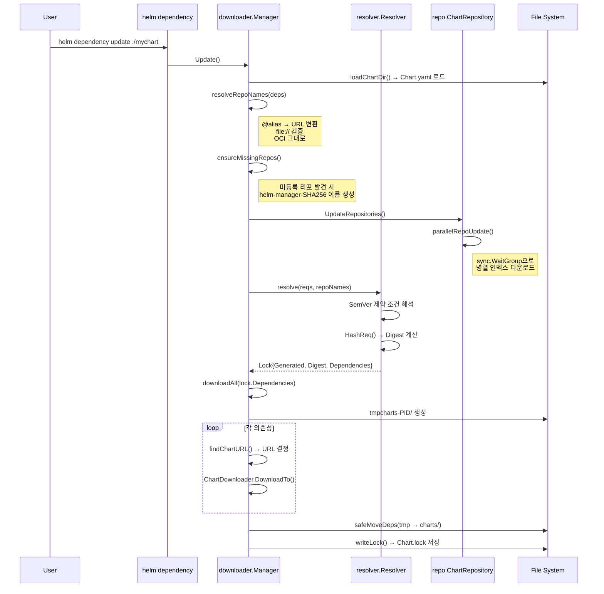

# 15. 의존성 관리 (Dependency Resolver)

## 개요

Helm의 의존성 관리 시스템은 차트가 다른 차트에 의존할 때 해당 의존성을 선언, 해석, 다운로드, 활성화/비활성화하는
전체 생명주기를 담당한다. Helm v4에서는 `Chart.yaml`의 `dependencies` 필드에 의존성을 선언하고,
`Chart.lock` 파일로 정확한 버전을 고정하며, `charts/` 디렉토리에 실제 차트 아카이브를 저장한다.

**왜 이 설계인가?**
패키지 매니저(npm, Go modules 등)와 유사하게, Helm은 "원하는 버전 범위"와 "실제 사용 버전"을
분리한다. `Chart.yaml`에는 SemVer 제약 조건(`^1.2.0`, `>=2.0.0`)을 명시하고,
`Chart.lock`에는 해석된 정확한 버전(`1.2.3`)을 기록한다. 이렇게 분리함으로써:
1. 차트 개발자는 유연한 버전 범위를 사용할 수 있고
2. 배포 환경에서는 재현 가능한(reproducible) 빌드를 보장받는다

## 핵심 소스 파일 구조

```
helm/
├── pkg/chart/v2/
│   ├── dependency.go          # Dependency, Lock 구조체 정의
│   ├── metadata.go            # Metadata 구조체 (Dependencies 필드 포함)
│   └── chart.go               # Chart 구조체 (Lock 필드 포함)
├── pkg/chart/v2/util/
│   └── dependencies.go        # ProcessDependencies, condition/tags 처리
├── internal/resolver/
│   └── resolver.go            # Resolver, Resolve(), HashReq()
├── pkg/downloader/
│   ├── manager.go             # Manager, Build(), Update(), downloadAll()
│   ├── chart_downloader.go    # ChartDownloader, DownloadTo(), ResolveChartVersion()
│   └── cache.go               # Cache 인터페이스, DiskCache 구현
└── pkg/action/
    └── dependency.go           # Dependency 액션 (List, dependencyStatus)
```

## 1. Dependency 구조체

### 1.1 선언부

`pkg/chart/v2/dependency.go`에 정의된 `Dependency` 구조체는 차트 의존성의 모든 메타데이터를 담는다:

```go
// pkg/chart/v2/dependency.go
type Dependency struct {
    Name         string   `json:"name" yaml:"name"`
    Version      string   `json:"version,omitempty" yaml:"version,omitempty"`
    Repository   string   `json:"repository" yaml:"repository"`
    Condition    string   `json:"condition,omitempty" yaml:"condition,omitempty"`
    Tags         []string `json:"tags,omitempty" yaml:"tags,omitempty"`
    Enabled      bool     `json:"enabled,omitempty" yaml:"enabled,omitempty"`
    ImportValues []any    `json:"import-values,omitempty" yaml:"import-values,omitempty"`
    Alias        string   `json:"alias,omitempty" yaml:"alias,omitempty"`
}
```

### 1.2 각 필드의 역할

| 필드 | 타입 | 역할 | 예시 |
|------|------|------|------|
| `Name` | string | 의존성 차트 이름 (Chart.yaml의 name과 일치해야 함) | `"postgresql"` |
| `Version` | string | SemVer 제약 조건 또는 Lock 파일에서는 정확한 버전 | `">=12.0.0"`, `"12.1.3"` |
| `Repository` | string | 차트 저장소 URL, 별칭(`@repo`), 로컬 경로(`file://`), OCI | `"https://charts.bitnami.com/bitnami"` |
| `Condition` | string | 쉼표 구분 YAML 경로. 값이 true/false인 경우 활성화/비활성화 | `"postgresql.enabled"` |
| `Tags` | []string | 그룹 태그. tags 섹션의 값으로 일괄 활성화/비활성화 | `["backend", "database"]` |
| `Enabled` | bool | 런타임에 condition/tags 평가 결과를 저장 | 내부 사용 |
| `ImportValues` | []any | 하위 차트 값을 상위 차트로 가져오는 매핑 | `[{"child":"data","parent":"mydata"}]` |
| `Alias` | string | 같은 차트를 다른 이름으로 두 번 사용할 때 별칭 | `"pg-primary"` |

### 1.3 Dependency 검증

```go
// pkg/chart/v2/dependency.go
func (d *Dependency) Validate() error {
    if d == nil {
        return ValidationError("dependencies must not contain empty or null nodes")
    }
    d.Name = sanitizeString(d.Name)
    d.Version = sanitizeString(d.Version)
    d.Repository = sanitizeString(d.Repository)
    d.Condition = sanitizeString(d.Condition)
    for i := range d.Tags {
        d.Tags[i] = sanitizeString(d.Tags[i])
    }
    if d.Alias != "" && !aliasNameFormat.MatchString(d.Alias) {
        return ValidationErrorf("dependency %q has disallowed characters in the alias", d.Name)
    }
    return nil
}
```

`aliasNameFormat`은 `regexp.MustCompile("^[a-zA-Z0-9_-]+$")`로 정의되어 있어,
별칭에는 영문자, 숫자, 밑줄, 하이픈만 허용된다. `sanitizeString`은 비출력 문자를 제거하고
공백 문자를 정규화한다.

**왜 이런 검증인가?**
별칭은 Kubernetes 리소스 이름의 일부로 사용될 수 있으므로, 특수 문자가 포함되면
템플릿 렌더링이나 리소스 생성 시 오류를 유발한다. 또한 `Metadata.Validate()`에서
중복 별칭도 검사한다:

```go
// pkg/chart/v2/metadata.go (Validate 메서드 내부)
dependencies := map[string]*Dependency{}
for _, dependency := range md.Dependencies {
    key := dependency.Name
    if dependency.Alias != "" {
        key = dependency.Alias
    }
    if dependencies[key] != nil {
        return ValidationErrorf("more than one dependency with name or alias %q", key)
    }
    dependencies[key] = dependency
}
```

## 2. Lock 파일 구조

### 2.1 Lock 구조체

```go
// pkg/chart/v2/dependency.go
type Lock struct {
    Generated    time.Time    `json:"generated"`
    Digest       string       `json:"digest"`
    Dependencies []*Dependency `json:"dependencies"`
}
```

| 필드 | 역할 |
|------|------|
| `Generated` | Lock 파일 생성 시각 |
| `Digest` | Chart.yaml의 dependencies와 Lock의 dependencies를 함께 해시한 SHA256 값 |
| `Dependencies` | 해석된 정확한 버전의 의존성 목록 |

### 2.2 Digest 생성 알고리즘

```go
// internal/resolver/resolver.go
func HashReq(req, lock []*chart.Dependency) (string, error) {
    data, err := json.Marshal([2][]*chart.Dependency{req, lock})
    if err != nil {
        return "", err
    }
    s, err := provenance.Digest(bytes.NewBuffer(data))
    return "sha256:" + s, err
}
```

**왜 req와 lock 모두를 해시에 포함하는가?**
`req`(Chart.yaml의 의존성)만 해시하면, lock의 실제 버전이 변경되어도 감지할 수 없다.
양쪽 모두를 포함시켜 Chart.yaml의 제약 조건이 변경되거나 lock의 해석 결과가 변경되면
즉시 불일치를 탐지한다.

### 2.3 Lock 파일 저장

```go
// pkg/downloader/manager.go
func writeLock(chartpath string, lock *chart.Lock, legacyLockfile bool) error {
    data, err := yaml.Marshal(lock)
    if err != nil {
        return err
    }
    lockfileName := "Chart.lock"
    if legacyLockfile {
        lockfileName = "requirements.lock"
    }
    dest := filepath.Join(chartpath, lockfileName)
    // 심볼릭 링크 보안 검사
    info, err := os.Lstat(dest)
    if err == nil {
        if info.Mode()&os.ModeSymlink != 0 {
            link, _ := os.Readlink(dest)
            return fmt.Errorf("the %s file is a symlink to %q", lockfileName, link)
        }
    }
    return os.WriteFile(dest, data, 0644)
}
```

**왜 심볼릭 링크 검사를 하는가?**
Lock 파일이 심볼릭 링크이면, 공격자가 임의 파일에 내용을 쓰도록 유도할 수 있다.
이는 보안 취약점(symlink attack)을 방지하기 위한 조치다.

## 3. Resolver: SemVer 제약 조건 해석

### 3.1 Resolver 구조체

```go
// internal/resolver/resolver.go
type Resolver struct {
    chartpath      string
    cachepath      string
    registryClient *registry.Client
}

func New(chartpath, cachepath string, registryClient *registry.Client) *Resolver {
    return &Resolver{
        chartpath:      chartpath,
        cachepath:      cachepath,
        registryClient: registryClient,
    }
}
```

### 3.2 Resolve() 흐름

`Resolve()` 메서드는 Chart.yaml의 의존성 목록을 받아 각각에 대해 정확한 버전을 결정한다.

```
                 Resolve(reqs, repoNames)
                          |
          +---------------+----------------+
          |               |                |
     로컬 차트       file:// 경로      원격 리포지토리
   (Repository="")  (file://...)    (http/https/oci)
          |               |                |
   charts/ 서브디렉토리    LoadDir()    인덱스/태그 조회
   경로 검증          버전 제약 검사    SemVer 매칭
          |               |                |
          +---------------+----------------+
                          |
                     Lock 생성
                   (HashReq → Digest)
```

### 3.3 해석 전략별 상세 동작

**전략 1: 로컬 차트 (Repository가 빈 문자열)**

```go
if d.Repository == "" {
    if _, err := GetLocalPath(filepath.Join("charts", d.Name), r.chartpath); err != nil {
        return nil, err
    }
    locked[i] = &chart.Dependency{
        Name:       d.Name,
        Repository: "",
        Version:    d.Version,
    }
    continue
}
```

`charts/` 디렉토리에 이미 존재하는 서브차트를 사용한다. 이 경우 버전 범위가 아닌
제약 조건 문자열을 그대로 보존한다.

**전략 2: file:// 로컬 경로**

```go
if strings.HasPrefix(d.Repository, "file://") {
    chartpath, err := GetLocalPath(d.Repository, r.chartpath)
    ch, err := loader.LoadDir(chartpath)
    v, err := semver.NewVersion(ch.Metadata.Version)
    if !constraint.Check(v) {
        missing = append(missing, ...)
        continue
    }
    locked[i] = &chart.Dependency{
        Name:       d.Name,
        Repository: d.Repository,
        Version:    ch.Metadata.Version,  // 실제 버전으로 고정
    }
}
```

로컬 파일시스템의 차트를 로드하여 실제 버전이 제약 조건을 만족하는지 확인한다.

**전략 3: 원격 리포지토리 (HTTP/HTTPS)**

```go
repoIndex, err := repo.LoadIndexFile(filepath.Join(r.cachepath, helmpath.CacheIndexFile(repoName)))
vs, ok = repoIndex.Entries[d.Name]
for _, ver := range vs {
    v, err := semver.NewVersion(ver.Version)
    if constraint.Check(v) {
        locked[i].Version = v.Original()
        break  // 정렬된 인덱스에서 첫 번째 매칭 사용
    }
}
```

캐시된 인덱스 파일에서 차트 버전 목록을 가져오고, SemVer 내림차순으로 정렬된 상태에서
제약 조건을 만족하는 첫 번째(가장 최신) 버전을 선택한다.

**전략 4: OCI 레지스트리**

```go
if registry.IsOCI(d.Repository) {
    _, err := semver.NewVersion(version)
    if err == nil {
        // 명시적 버전 → 직접 사용
        vs = []*repo.ChartVersion{{Metadata: &chart.Metadata{Version: version}}}
    } else {
        // 제약 조건 → 태그 목록 조회
        ref := fmt.Sprintf("%s/%s", strings.TrimPrefix(d.Repository, "oci://"), d.Name)
        tags, err := r.registryClient.Tags(ref)
        vs = make(repo.ChartVersions, len(tags))
        for ti, t := range tags {
            vs[ti] = &repo.ChartVersion{Metadata: &chart.Metadata{Version: t}}
        }
    }
}
```

OCI 레지스트리에서는 인덱스 파일 대신 태그 목록을 사용하여 버전을 해석한다.

### 3.4 GetLocalPath: file:// URL 해석

```go
// internal/resolver/resolver.go
func GetLocalPath(repo, chartpath string) (string, error) {
    p := strings.TrimPrefix(repo, "file://")
    if strings.HasPrefix(p, "/") {
        depPath, err = filepath.Abs(p)  // 절대 경로
    } else {
        depPath = filepath.Join(chartpath, p)  // 상대 경로
    }
    if _, err = os.Stat(depPath); errors.Is(err, fs.ErrNotExist) {
        return "", fmt.Errorf("directory %s not found", depPath)
    }
    return depPath, nil
}
```

## 4. Manager: Build와 Update

### 4.1 Manager 구조체

```go
// pkg/downloader/manager.go
type Manager struct {
    Out              io.Writer
    ChartPath        string
    Verify           VerificationStrategy
    Debug            bool
    Keyring          string
    SkipUpdate       bool
    Getters          []getter.Provider
    RegistryClient   *registry.Client
    RepositoryConfig string
    RepositoryCache  string
    ContentCache     string
}
```

### 4.2 Build vs Update 비교

```
┌─────────────────────────────────────────────────────────┐
│                    helm dependency build                  │
├─────────────────────────────────────────────────────────┤
│  1. Chart.yaml 로드                                     │
│  2. Chart.lock 존재?                                     │
│     ├── NO → Update() 호출 (아래 참조)                   │
│     └── YES                                              │
│         3. Digest 비교 (Chart.yaml vs Chart.lock)        │
│            └── 불일치 → 에러: "lock file out of sync"    │
│         4. hasAllRepos() → 모든 리포지토리 확인           │
│         5. UpdateRepositories() (SkipUpdate가 아닌 경우) │
│         6. downloadAll(lock.Dependencies)                │
└─────────────────────────────────────────────────────────┘

┌─────────────────────────────────────────────────────────┐
│                   helm dependency update                  │
├─────────────────────────────────────────────────────────┤
│  1. Chart.yaml 로드                                     │
│  2. resolveRepoNames() → 리포지토리 이름 매핑            │
│  3. ensureMissingRepos() → 알 수 없는 리포 자동 설정     │
│  4. UpdateRepositories() (SkipUpdate가 아닌 경우)        │
│  5. resolve() → SemVer 해석 → Lock 생성                 │
│  6. downloadAll(lock.Dependencies)                       │
│  7. 새 Digest 계산                                      │
│  8. Lock 파일이 변경된 경우만 writeLock()                │
└─────────────────────────────────────────────────────────┘
```

**왜 Build와 Update가 분리되어 있는가?**

| 관점 | Build | Update |
|------|-------|--------|
| 목적 | 기존 Lock 파일 기반으로 재현 가능한 빌드 | 새로운 의존성 해석 및 Lock 파일 갱신 |
| Lock 파일 | 필수 (없으면 Update 호출) | 새로 생성 또는 갱신 |
| 버전 결정 | Lock에 기록된 정확한 버전 사용 | Chart.yaml의 제약 조건에서 최신 매칭 |
| CI/CD 적합성 | 높음 (동일 결과 보장) | 낮음 (새 버전이 선택될 수 있음) |

### 4.3 resolveRepoNames: 리포지토리 이름 해석

```go
// pkg/downloader/manager.go
func (m *Manager) resolveRepoNames(deps []*chart.Dependency) (map[string]string, error) {
    // repositories.yaml 로드
    rf, err := loadRepoConfig(m.RepositoryConfig)
    repos := rf.Repositories

    for _, dd := range deps {
        // 1. 빈 리포지토리 → charts/ 디렉토리 사용, 스킵
        if dd.Repository == "" { continue }

        // 2. file:// → 로컬 경로 검증
        if strings.HasPrefix(dd.Repository, "file://") {
            reposMap[dd.Name] = dd.Repository
            continue
        }

        // 3. OCI → 그대로 사용
        if registry.IsOCI(dd.Repository) {
            reposMap[dd.Name] = dd.Repository
            continue
        }

        // 4. @별칭 또는 alias: 접두사 → 실제 URL로 변환
        for _, repo := range repos {
            if strings.HasPrefix(dd.Repository, "@") &&
               strings.TrimPrefix(dd.Repository, "@") == repo.Name {
                dd.Repository = repo.URL  // 별칭을 실제 URL로 교체!
                reposMap[dd.Name] = repo.Name
                break
            } else if urlutil.Equal(repo.URL, dd.Repository) {
                reposMap[dd.Name] = repo.Name
                break
            }
        }
    }
    return reposMap, nil
}
```

**왜 별칭(`@`)을 지원하는가?**
Chart.yaml에 `repository: "@bitnami"`와 같이 짧은 별칭을 사용하면, 실제 URL이 변경되어도
`repositories.yaml`만 업데이트하면 된다. 이는 조직 내에서 내부 미러를 사용할 때 특히 유용하다.

### 4.4 ensureMissingRepos: 미등록 리포지토리 자동 처리

```go
// pkg/downloader/manager.go
func (m *Manager) ensureMissingRepos(repoNames map[string]string, deps []*chart.Dependency) (map[string]string, error) {
    for _, dd := range deps {
        if _, ok := repoNames[dd.Name]; ok { continue }
        // SHA256 해시 기반 이름 생성
        rn, _ := key(dd.Repository)
        rn = managerKeyPrefix + rn  // "helm-manager-" + SHA256
        repoNames[dd.Name] = rn
        // 임시 Entry 생성
        ri := &repo.Entry{Name: rn, URL: dd.Repository}
        ru = append(ru, ri)
    }
    // 병렬로 인덱스 다운로드
    if !m.SkipUpdate && len(ru) > 0 {
        m.parallelRepoUpdate(ru)
    }
    return repoNames, nil
}
```

`key()` 함수는 URL의 SHA256 해시를 계산하여 파일시스템 안전한 캐시 키를 생성한다:

```go
func key(name string) (string, error) {
    in := strings.NewReader(name)
    hash := crypto.SHA256.New()
    io.Copy(hash, in)
    return hex.EncodeToString(hash.Sum(nil)), nil
}
```

### 4.5 downloadAll: 의존성 다운로드

```go
// pkg/downloader/manager.go
func (m *Manager) downloadAll(deps []*chart.Dependency) error {
    destPath := filepath.Join(m.ChartPath, "charts")
    tmpPath := filepath.Join(m.ChartPath, fmt.Sprintf("tmpcharts-%d", os.Getpid()))
    os.MkdirAll(destPath, 0755)
    os.MkdirAll(tmpPath, 0755)
    defer os.RemoveAll(tmpPath)

    for _, dep := range deps {
        // 케이스 1: 빈 리포지토리 → 로컬 검증만 수행
        if dep.Repository == "" {
            ch, _ := loader.LoadDir(filepath.Join(destPath, dep.Name))
            constraint, _ := semver.NewConstraint(dep.Version)
            v, _ := semver.NewVersion(ch.Metadata.Version)
            if !constraint.Check(v) { /* 에러 */ }
            continue
        }

        // 케이스 2: file:// → tarFromLocalDir()로 아카이브 생성
        if strings.HasPrefix(dep.Repository, "file://") {
            ver, _ := tarFromLocalDir(m.ChartPath, dep.Name, dep.Repository, dep.Version, tmpPath)
            dep.Version = ver
            continue
        }

        // 케이스 3: 원격 → ChartDownloader로 다운로드
        churl, username, password, ..., err := m.findChartURL(dep.Name, dep.Version, dep.Repository, repos)
        dl := ChartDownloader{
            Out: m.Out, Verify: m.Verify,
            Options: []getter.Option{
                getter.WithBasicAuth(username, password),
                // ...
            },
        }
        dl.DownloadTo(churl, version, tmpPath)
    }

    // 성공 시 tmpPath → destPath로 안전 이동
    m.safeMoveDeps(deps, tmpPath, destPath)
}
```

**왜 임시 디렉토리를 사용하는가?**
다운로드 도중 에러가 발생하면 `charts/` 디렉토리가 불완전한 상태가 될 수 있다.
임시 디렉토리에 먼저 다운로드하고, 모든 것이 성공한 후에 원자적으로(atomically)
이동함으로써 일관성을 보장한다. `tmpPath`에는 PID를 포함시켜 동시 실행 시 충돌을 방지한다.

### 4.6 safeMoveDeps: 안전한 파일 이동

```go
func (m *Manager) safeMoveDeps(deps []*chart.Dependency, source, dest string) error {
    existsInSourceDirectory := map[string]bool{}
    isLocalDependency := map[string]bool{}

    // 로컬 의존성 표시
    for _, dep := range deps {
        if dep.Repository == "" {
            isLocalDependency[dep.Name] = true
        }
    }

    // 소스 파일 → 대상으로 이동
    for _, file := range sourceFiles {
        if _, err := loader.LoadFile(sourcefile); err != nil {
            continue  // 차트가 아닌 파일 스킵
        }
        fs.RenameWithFallback(sourcefile, destfile)
    }

    // 대상에 있지만 소스에 없는 파일 삭제 (오래된 의존성)
    for _, file := range destFiles {
        if !existsInSourceDirectory[file.Name()] {
            ch, _ := loader.LoadFile(fname)
            if isLocalDependency[ch.Name()] { continue }  // 로컬 의존성 보존
            os.Remove(fname)
        }
    }
}
```

## 5. ChartDownloader: 개별 차트 다운로드

### 5.1 구조체와 검증 전략

```go
// pkg/downloader/chart_downloader.go
type ChartDownloader struct {
    Out              io.Writer
    Verify           VerificationStrategy
    Keyring          string
    Getters          getter.Providers
    Options          []getter.Option
    RegistryClient   *registry.Client
    RepositoryConfig string
    RepositoryCache  string
    ContentCache     string
    Cache            Cache
}
```

검증 전략(VerificationStrategy)은 4단계로 나뉜다:

| 전략 | 동작 |
|------|------|
| `VerifyNever` | 검증 없이 다운로드 |
| `VerifyIfPossible` | 검증 시도, 실패해도 계속 진행 |
| `VerifyAlways` | 검증 필수, 실패 시 에러 |
| `VerifyLater` | .prov 파일만 다운로드, 검증은 나중에 |

### 5.2 ResolveChartVersion: 차트 참조 해석

```
    ResolveChartVersion(ref, version)
              |
    +---------+---------+
    |                   |
  OCI 참조          HTTP/HTTPS URL
    |                   |
  registry.              |
  ValidateReference   +---------+---------+
    |                 |                   |
  (digest, url)    절대 URL?           상대 참조?
                    |                   |
                scanReposForURL      repo/chart 형식
                  (인증 정보 탐색)    pickChartRepositoryConfigByName
                    |                   |
                  (url)             LoadIndexFile → Get()
                                        |
                                    (digest, url)
```

### 5.3 Content Cache (DiskCache)

Helm v4에서는 차트 아카이브를 SHA256 기반 컨텐츠 캐시에 저장한다:

```go
// pkg/downloader/cache.go
type Cache interface {
    Get(key [sha256.Size]byte, cacheType string) (string, error)
    Put(key [sha256.Size]byte, data io.Reader, cacheType string) (string, error)
}

type DiskCache struct {
    Root string
}

func (c *DiskCache) fileName(id [sha256.Size]byte, cacheType string) string {
    return filepath.Join(c.Root, fmt.Sprintf("%02x", id[0]), fmt.Sprintf("%x", id)+cacheType)
}
```

**왜 SHA256 기반인가?**
같은 버전의 차트라도 리포지토리가 다르면 내용이 다를 수 있다.
SHA256 해시를 키로 사용하면 내용 기반 중복 제거(content-addressable deduplication)가 가능하고,
다운로드 시 인덱스 파일의 `digest` 필드와 대조하여 무결성을 검증할 수 있다.

## 6. Condition과 Tags: 의존성 활성화/비활성화

### 6.1 Condition 처리

```go
// pkg/chart/v2/util/dependencies.go
func processDependencyConditions(reqs []*chart.Dependency, cvals common.Values, cpath string) {
    for _, r := range reqs {
        for c := range strings.SplitSeq(strings.TrimSpace(r.Condition), ",") {
            if len(c) > 0 {
                vv, err := cvals.PathValue(cpath + c)
                if err == nil {
                    if bv, ok := vv.(bool); ok {
                        r.Enabled = bv
                        break  // 첫 번째 발견된 조건이 우선
                    }
                }
            }
        }
    }
}
```

Condition은 쉼표로 구분된 YAML 경로 목록이다. 첫 번째로 발견된(존재하는) 경로의 값이
`bool`이면 해당 값으로 Enabled를 설정하고 나머지는 무시한다.

```yaml
# Chart.yaml
dependencies:
  - name: postgresql
    condition: postgresql.enabled,global.postgresql.enabled
```

```yaml
# values.yaml
postgresql:
  enabled: false  # 이 값이 먼저 발견되어 false로 설정
```

### 6.2 Tags 처리

```go
// pkg/chart/v2/util/dependencies.go
func processDependencyTags(reqs []*chart.Dependency, cvals common.Values) {
    vt, err := cvals.Table("tags")
    if err != nil { return }
    for _, r := range reqs {
        var hasTrue, hasFalse bool
        for _, k := range r.Tags {
            if b, ok := vt[k]; ok {
                if bv, ok := b.(bool); ok {
                    if bv { hasTrue = true } else { hasFalse = true }
                }
            }
        }
        if !hasTrue && hasFalse {
            r.Enabled = false
        } else if hasTrue || !hasTrue && !hasFalse {
            r.Enabled = true
        }
    }
}
```

Tags는 `values.yaml`의 `tags` 섹션에서 일괄 제어한다:

```yaml
# values.yaml
tags:
  backend: true
  monitoring: false
```

**태그 논리 규칙:**
- 하나라도 `true`인 태그가 있으면 → 활성화
- 모든 태그가 `false`이고 `true`인 것이 없으면 → 비활성화
- 태그가 정의되지 않았으면 → 활성화 (기본값)

### 6.3 처리 순서: Condition이 Tags보다 우선

```go
// pkg/chart/v2/util/dependencies.go
func processDependencyEnabled(c *chart.Chart, v map[string]any, path string) error {
    // 1단계: 모든 의존성 활성화
    for _, lr := range c.Metadata.Dependencies {
        lr.Enabled = true
    }
    // 2단계: 값 병합
    cvals, _ := util.CoalesceValues(c, v)
    // 3단계: Tags로 그룹 제어 (먼저 적용)
    processDependencyTags(c.Metadata.Dependencies, cvals)
    // 4단계: Condition으로 개별 오버라이드 (Tags보다 우선)
    processDependencyConditions(c.Metadata.Dependencies, cvals, path)
    // 5단계: 비활성화된 차트 제거
    // 6단계: 재귀적으로 하위 의존성 처리
}
```

```
 모든 의존성 활성화
         │
    Tags 적용 ──── 그룹 단위 제어
         │
  Condition 적용 ── 개별 오버라이드 (최종 결정)
         │
   비활성화 차트 제거
         │
   재귀적 하위 처리
```

## 7. ImportValues: 하위 차트 값 가져오기

```go
// pkg/chart/v2/util/dependencies.go
func processImportValues(c *chart.Chart, merge bool) error {
    for _, r := range c.Metadata.Dependencies {
        for _, riv := range r.ImportValues {
            switch iv := riv.(type) {
            case map[string]any:
                // child/parent 매핑
                child := fmt.Sprintf("%v", iv["child"])
                parent := fmt.Sprintf("%v", iv["parent"])
                vv, _ := cvals.Table(r.Name + "." + child)
                b = util.CoalesceTables(b, pathToMap(parent, vv.AsMap()))
            case string:
                // exports 규약
                child := "exports." + iv
                vm, _ := cvals.Table(r.Name + "." + child)
                b = util.CoalesceTables(b, vm.AsMap())
            }
        }
    }
    // 부모 값이 우선: cvals를 b에 병합 (b의 기존 값이 우선)
    c.Values = util.CoalesceTables(cvals, b)
}
```

두 가지 형식을 지원한다:

```yaml
# 형식 1: child/parent 매핑
dependencies:
  - name: subchart
    import-values:
      - child: data.config
        parent: myconfig

# 형식 2: exports 규약
dependencies:
  - name: subchart
    import-values:
      - mydata  # → subchart.exports.mydata 를 루트로 가져옴
```

## 8. 의존성 상태 확인

### 8.1 Dependency 액션

```go
// pkg/action/dependency.go
type Dependency struct {
    Verify                bool
    Keyring               string
    SkipRefresh           bool
    ColumnWidth           uint
    // ...
}
```

### 8.2 의존성 상태 판별

`dependencyStatus()` 메서드는 각 의존성의 상태를 문자열로 반환한다:

| 상태 | 의미 |
|------|------|
| `"ok"` | tgz 파일이 존재하고 이름/버전이 일치 |
| `"unpacked"` | 언팩된 디렉토리로 존재하고 버전 일치 |
| `"missing"` | charts/ 디렉토리에 존재하지 않음 |
| `"wrong version"` | 존재하지만 버전 제약 불만족 |
| `"too many matches"` | 동일 이름의 tgz 파일이 여러 개 |
| `"corrupt"` | 파일이 있지만 로드 실패 |
| `"misnamed"` | 파일 내부 차트 이름이 불일치 |

## 9. 전체 의존성 해석 흐름도



## 10. SemVer 제약 조건 시스템

Helm은 `github.com/Masterminds/semver/v3` 라이브러리를 사용하여 SemVer 제약 조건을 처리한다.

### 10.1 지원되는 제약 조건 형식

| 형식 | 의미 | 예시 |
|------|------|------|
| `1.2.3` | 정확한 버전 | `1.2.3` |
| `>=1.2.3` | 이상 | `>=1.2.3` |
| `<=1.2.3` | 이하 | `<=1.2.3` |
| `~1.2.3` | 패치 범위 (1.2.x) | `>=1.2.3, <1.3.0` |
| `^1.2.3` | 호환 범위 (1.x.x) | `>=1.2.3, <2.0.0` |
| `1.2.x` | 와일드카드 | `>=1.2.0, <1.3.0` |
| `*` | 모든 버전 | 최신 안정 버전 |
| `>=1.2.3, <2.0.0` | 복합 조건 | AND 결합 |
| `1.2.3 \|\| >=2.0.0` | OR 조건 | OR 결합 |

### 10.2 버전 비교 흐름

```go
// internal/resolver/resolver.go (Resolve 내부)
constraint, err := semver.NewConstraint(d.Version)

// 인덱스의 버전은 내림차순 정렬됨
for _, ver := range vs {
    v, err := semver.NewVersion(ver.Version)
    if constraint.Check(v) {
        locked[i].Version = v.Original()  // 원본 문자열 보존
        break  // 첫 번째 매칭 = 최신 버전
    }
}
```

## 11. 병렬 리포지토리 업데이트

```go
// pkg/downloader/manager.go
func (m *Manager) parallelRepoUpdate(repos []*repo.Entry) error {
    var wg sync.WaitGroup
    localRepos := dedupeRepos(repos)  // URL 기준 중복 제거
    for _, c := range localRepos {
        r, _ := repo.NewChartRepository(c, m.Getters)
        r.CachePath = m.RepositoryCache
        wg.Add(1)
        go func(r *repo.ChartRepository) {
            if _, err := r.DownloadIndexFile(); err != nil {
                fmt.Fprintf(m.Out, "...Unable to get an update from %q\n", r.Config.URL)
            } else {
                fmt.Fprintf(m.Out, "...Successfully got an update from %q\n", r.Config.Name)
            }
            wg.Done()
        }(r)
    }
    wg.Wait()
    return nil
}
```

`dedupeRepos()`는 후행 슬래시를 제거하여 URL을 정규화한 후 중복을 제거한다.

**왜 병렬인가?**
여러 리포지토리의 인덱스를 순차적으로 다운로드하면 네트워크 지연이 누적된다.
`sync.WaitGroup`을 사용하여 모든 리포지토리를 동시에 업데이트함으로써
총 소요 시간을 단일 리포지토리 업데이트 시간 수준으로 줄인다.

## 12. Helm v2/v3 하위 호환성

### 12.1 API 버전에 따른 파일명

```go
// APIVersionV1 → requirements.yaml / requirements.lock
// APIVersionV2 → Chart.yaml / Chart.lock
if c.Metadata.APIVersion == chart.APIVersionV1 {
    lockfileName = "requirements.lock"
}
```

### 12.2 Helm v2 해시 호환

```go
// pkg/downloader/manager.go (Build 내부)
if c.Metadata.APIVersion == chart.APIVersionV1 {
    v2Sum, _ = resolver.HashV2Req(req)
}

// 먼저 v3/v4 해시 비교, 실패하면 v2 해시로 폴백
if sum != lock.Digest {
    if c.Metadata.APIVersion == chart.APIVersionV1 {
        if v2Sum != lock.Digest {
            return errors.New("the lock file is out of sync")
        }
    }
}
```

```go
// internal/resolver/resolver.go
func HashV2Req(req []*chart.Dependency) (string, error) {
    dep := make(map[string][]*chart.Dependency)
    dep["dependencies"] = req
    data, _ := json.Marshal(dep)
    s, _ := provenance.Digest(bytes.NewBuffer(data))
    return "sha256:" + s, err
}
```

Helm v2는 `{dependencies: [...]}`만 해시했지만, v3/v4는 `[req, lock]` 배열을 해시한다.
v1 API 차트가 v2에서 생성된 Lock 파일을 가질 수 있으므로, v4 해시가 불일치하면
v2 해시로 재시도하는 폴백 로직이 있다.

## 13. 에러 처리 패턴

### 13.1 ErrRepoNotFound

```go
type ErrRepoNotFound struct {
    Repos []string
}

func (e ErrRepoNotFound) Error() string {
    return fmt.Sprintf("no repository definition for %s", strings.Join(e.Repos, ", "))
}
```

### 13.2 사용자 안내 메시지

```go
// resolveRepoNames에서
if containsNonURL {
    errorMessage += `
Note that repositories must be URLs or aliases. For example, to refer to the "example"
repository, use "https://charts.example.com/" or "@example" instead of
"example". Don't forget to add the repo, too ('helm repo add').`
}
```

**왜 이런 상세한 에러 메시지인가?**
`stable`이나 `bitnami` 같은 이름을 직접 리포지토리로 지정하는 것은 흔한 실수다.
사용자에게 올바른 형식(`@alias` 또는 전체 URL)과 `helm repo add` 명령을 안내하여
자체 해결을 돕는다.

## 요약

Helm의 의존성 관리 시스템은 다음과 같은 계층 구조로 동작한다:

```
Chart.yaml (선언)
     │
     ▼
Resolver (SemVer 해석)
     │
     ▼
Chart.lock (버전 고정)
     │
     ▼
Manager (다운로드 조율)
     │
     ▼
ChartDownloader (개별 다운로드 + 캐시)
     │
     ▼
charts/ 디렉토리 (실제 차트 저장)
     │
     ▼
ProcessDependencies (condition/tags/import-values 처리)
```

각 계층이 명확한 책임을 갖고, SemVer 제약 조건 해석, 컨텐츠 캐싱, 보안 검증,
하위 호환성까지 체계적으로 관리한다. Build/Update 분리를 통해 개발 시에는 유연하게,
배포 시에는 재현 가능하게 의존성을 관리할 수 있다.
