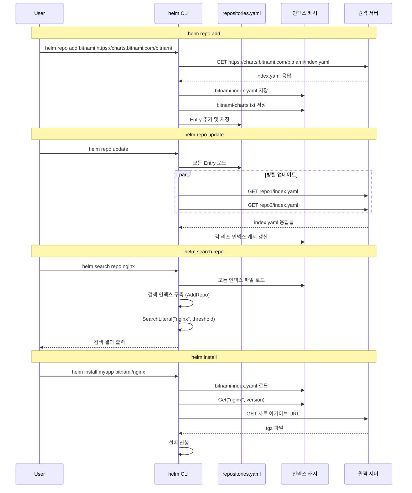

# 16. 리포지토리 시스템 (Repository System)

## 개요

Helm 리포지토리는 차트를 패키징하여 배포하는 분산 저장소 시스템이다. HTTP/HTTPS 기반의
클래식 리포지토리와 OCI(Open Container Initiative) 레지스트리 두 가지 방식을 지원한다.
클래식 리포지토리는 `index.yaml` 인덱스 파일을 통해 차트 목록과 버전을 관리하며,
Helm 클라이언트는 `repositories.yaml` 파일로 로컬에 등록된 리포지토리들을 추적한다.

**왜 리포지토리 시스템이 필요한가?**
차트는 Kubernetes 애플리케이션의 패키지이므로, 중앙 집중식 또는 분산식 배포 채널이 필요하다.
리포지토리 시스템을 통해:
1. 차트의 버전 관리와 검색이 가능하고
2. 인증/TLS를 통한 접근 제어가 가능하며
3. 인덱스 파일 캐싱으로 오프라인에서도 차트 정보를 조회할 수 있다

## 핵심 소스 파일 구조

```
helm/
├── pkg/repo/v1/
│   ├── chartrepo.go           # ChartRepository, Entry, NewChartRepository()
│   ├── index.go               # IndexFile, ChartVersion, loadIndex()
│   ├── repo.go                # File (repositories.yaml), LoadFile()
│   └── error.go               # ChartNotFoundError
├── pkg/cmd/
│   ├── repo_add.go            # helm repo add
│   ├── repo_update.go         # helm repo update
│   ├── repo_list.go           # helm repo list
│   ├── repo_remove.go         # helm repo remove
│   ├── repo_index.go          # helm repo index
│   ├── search_repo.go         # helm search repo
│   └── search_hub.go          # helm search hub
├── pkg/cmd/search/
│   └── search.go              # Index, Result, Search 엔진
└── internal/monocular/         # Artifact Hub API 클라이언트
```

## 1. Entry: 리포지토리 엔트리

### 1.1 구조체 정의

```go
// pkg/repo/v1/chartrepo.go
type Entry struct {
    Name                  string `json:"name"`
    URL                   string `json:"url"`
    Username              string `json:"username"`
    Password              string `json:"password"`
    CertFile              string `json:"certFile"`
    KeyFile               string `json:"keyFile"`
    CAFile                string `json:"caFile"`
    InsecureSkipTLSVerify bool   `json:"insecure_skip_tls_verify"`
    PassCredentialsAll    bool   `json:"pass_credentials_all"`
}
```

### 1.2 필드 설명

| 필드 | 타입 | 역할 |
|------|------|------|
| `Name` | string | 로컬에서 사용하는 리포지토리 별칭 (예: `"bitnami"`) |
| `URL` | string | 리포지토리 기본 URL (예: `"https://charts.bitnami.com/bitnami"`) |
| `Username` | string | HTTP Basic 인증 사용자명 |
| `Password` | string | HTTP Basic 인증 비밀번호 |
| `CertFile` | string | TLS 클라이언트 인증서 파일 경로 |
| `KeyFile` | string | TLS 클라이언트 키 파일 경로 |
| `CAFile` | string | CA 인증서 파일 경로 |
| `InsecureSkipTLSVerify` | bool | TLS 인증서 검증 비활성화 |
| `PassCredentialsAll` | bool | 리디렉션 시에도 인증 정보 전달 |

**왜 `PassCredentialsAll`이 필요한가?**
일부 리포지토리는 차트 다운로드 시 CDN으로 리디렉션한다. 기본적으로 Helm은 보안을 위해
리디렉션된 호스트에 인증 정보를 전달하지 않는다. 하지만 사설 리포지토리에서는
CDN에도 인증이 필요할 수 있어, 이 옵션으로 제어한다.

### 1.3 Entry 직렬화

```go
func (e *Entry) String() string {
    buf, err := json.Marshal(e)
    if err != nil {
        slog.Error("failed to marshal entry", slog.Any("error", err))
        panic(err)
    }
    return string(buf)
}
```

## 2. File: repositories.yaml

### 2.1 구조체 정의

```go
// pkg/repo/v1/repo.go
type File struct {
    APIVersion   string    `json:"apiVersion"`
    Generated    time.Time `json:"generated"`
    Repositories []*Entry  `json:"repositories"`
}
```

이 구조체는 `$HELM_CONFIG_HOME/repositories.yaml` 파일의 내용을 표현한다.

### 2.2 repositories.yaml 예시

```yaml
apiVersion: v1
generated: "2024-01-15T10:30:00Z"
repositories:
  - name: bitnami
    url: https://charts.bitnami.com/bitnami
  - name: my-private
    url: https://charts.internal.company.com
    username: deploy-bot
    password: s3cr3t
    certFile: /etc/helm/tls/client.crt
    keyFile: /etc/helm/tls/client.key
    caFile: /etc/helm/tls/ca.crt
```

### 2.3 CRUD 연산

```go
// pkg/repo/v1/repo.go

// 새 파일 생성
func NewFile() *File {
    return &File{
        APIVersion:   APIVersionV1,
        Generated:    time.Now(),
        Repositories: []*Entry{},
    }
}

// 로드
func LoadFile(path string) (*File, error) {
    b, err := os.ReadFile(path)
    r := new(File)
    err = yaml.Unmarshal(b, r)
    return r, err
}

// 추가
func (r *File) Add(re ...*Entry) {
    r.Repositories = append(r.Repositories, re...)
}

// 업데이트 (이름이 같으면 교체, 없으면 추가)
func (r *File) Update(re ...*Entry) {
    for _, target := range re {
        r.update(target)
    }
}

func (r *File) update(e *Entry) {
    for j, repo := range r.Repositories {
        if repo.Name == e.Name {
            r.Repositories[j] = e  // 교체
            return
        }
    }
    r.Add(e)  // 없으면 추가
}

// 검색
func (r *File) Has(name string) bool {
    return r.Get(name) != nil
}

func (r *File) Get(name string) *Entry {
    for _, entry := range r.Repositories {
        if entry.Name == name {
            return entry
        }
    }
    return nil
}

// 삭제
func (r *File) Remove(name string) bool {
    cp := []*Entry{}
    found := false
    for _, rf := range r.Repositories {
        if rf == nil { continue }
        if rf.Name == name {
            found = true
            continue  // 건너뛰어 삭제 효과
        }
        cp = append(cp, rf)
    }
    r.Repositories = cp
    return found
}

// 저장
func (r *File) WriteFile(path string, perm os.FileMode) error {
    data, _ := yaml.Marshal(r)
    os.MkdirAll(filepath.Dir(path), 0755)
    return os.WriteFile(path, data, perm)
}
```

**왜 `nil` 체크를 하는가?**
`Remove()` 메서드에서 `rf == nil` 체크는 YAML 파일이 수동 편집되어
`null` 엔트리가 삽입된 경우를 방어한다. Helm은 사용자가 직접 파일을 편집하는 경우도
고려해야 하므로 방어적 프로그래밍을 적용한다.

## 3. ChartRepository: 리포지토리 클라이언트

### 3.1 구조체 정의

```go
// pkg/repo/v1/chartrepo.go
type ChartRepository struct {
    Config    *Entry
    IndexFile *IndexFile
    Client    getter.Getter
    CachePath string
}
```

| 필드 | 역할 |
|------|------|
| `Config` | 리포지토리 설정 (Entry) |
| `IndexFile` | 다운로드/로드된 인덱스 파일 |
| `Client` | HTTP/HTTPS getter 클라이언트 |
| `CachePath` | 인덱스 캐시 디렉토리 |

### 3.2 생성자

```go
func NewChartRepository(cfg *Entry, getters getter.Providers) (*ChartRepository, error) {
    u, err := url.Parse(cfg.URL)
    if err != nil {
        return nil, fmt.Errorf("invalid chart URL format: %s", cfg.URL)
    }

    client, err := getters.ByScheme(u.Scheme)
    if err != nil {
        return nil, fmt.Errorf("could not find protocol handler for: %s", u.Scheme)
    }

    return &ChartRepository{
        Config:    cfg,
        IndexFile: NewIndexFile(),
        Client:    client,
        CachePath: helmpath.CachePath("repository"),
    }, nil
}
```

**왜 `getter.Providers`를 사용하는가?**
Getter 패턴은 프로토콜별 다운로드 로직을 추상화한다. `http`, `https`, `oci` 등의
스킴에 대해 각각 다른 Getter 구현체를 사용한다. 이는 플러그인 기반 getter도 지원할 수
있도록 확장 가능하게 설계되었다.

### 3.3 인덱스 다운로드

```go
// pkg/repo/v1/chartrepo.go
func (r *ChartRepository) DownloadIndexFile() (string, error) {
    // 1. index.yaml URL 생성
    indexURL, err := ResolveReferenceURL(r.Config.URL, "index.yaml")

    // 2. 인증 정보와 함께 다운로드
    resp, err := r.Client.Get(indexURL,
        getter.WithURL(r.Config.URL),
        getter.WithInsecureSkipVerifyTLS(r.Config.InsecureSkipTLSVerify),
        getter.WithTLSClientConfig(r.Config.CertFile, r.Config.KeyFile, r.Config.CAFile),
        getter.WithBasicAuth(r.Config.Username, r.Config.Password),
        getter.WithPassCredentialsAll(r.Config.PassCredentialsAll),
    )

    // 3. 인덱스 파싱 및 검증
    index, err := io.ReadAll(resp)
    indexFile, err := loadIndex(index, r.Config.URL)

    // 4. 차트 목록 파일 생성 (자동 완성용)
    var charts strings.Builder
    for name := range indexFile.Entries {
        fmt.Fprintln(&charts, name)
    }
    chartsFile := filepath.Join(r.CachePath, helmpath.CacheChartsFile(r.Config.Name))
    os.MkdirAll(filepath.Dir(chartsFile), 0755)
    fileutil.AtomicWriteFile(chartsFile, bytes.NewReader([]byte(charts.String())), 0644)

    // 5. 인덱스 파일 캐시에 저장
    fname := filepath.Join(r.CachePath, helmpath.CacheIndexFile(r.Config.Name))
    os.MkdirAll(filepath.Dir(fname), 0755)
    return fname, fileutil.AtomicWriteFile(fname, bytes.NewReader(index), 0644)
}
```

**왜 차트 목록 파일을 별도로 생성하는가?**
인덱스 파일은 수 MB에 달할 수 있지만, 쉘 자동 완성에서는 차트 이름만 필요하다.
경량의 차트 목록 파일을 별도로 생성하여 자동 완성 성능을 최적화한다.

```
인덱스 다운로드 흐름:

  helm repo update
       │
       ▼
  DownloadIndexFile()
       │
       ├──── index.yaml 다운로드 (GET {URL}/index.yaml)
       │
       ├──── loadIndex() 파싱 & 검증
       │       ├── JSON 또는 YAML 자동 감지
       │       ├── 항목별 Validate()
       │       └── SortEntries() (버전 내림차순)
       │
       ├──── {repo}-charts.txt 저장 (자동 완성용)
       │
       └──── {repo}-index.yaml 캐시 저장
```

### 3.4 URL 해석

```go
// pkg/repo/v1/chartrepo.go
func ResolveReferenceURL(baseURL, refURL string) (string, error) {
    parsedRefURL, err := url.Parse(refURL)
    if parsedRefURL.IsAbs() {
        return refURL, nil  // 절대 URL은 그대로 반환
    }
    parsedBaseURL, err := url.Parse(baseURL)
    // 후행 슬래시 보장
    parsedBaseURL.RawPath = strings.TrimSuffix(parsedBaseURL.RawPath, "/") + "/"
    parsedBaseURL.Path = strings.TrimSuffix(parsedBaseURL.Path, "/") + "/"
    resolvedURL := parsedBaseURL.ResolveReference(parsedRefURL)
    resolvedURL.RawQuery = parsedBaseURL.RawQuery
    return resolvedURL.String(), nil
}
```

**왜 후행 슬래시를 추가하는가?**
Go의 `url.ResolveReference`는 기본 URL에 후행 슬래시가 없으면 마지막 경로 세그먼트를
교체한다. 예를 들어:
- `https://example.com/charts` + `index.yaml` = `https://example.com/index.yaml` (잘못됨)
- `https://example.com/charts/` + `index.yaml` = `https://example.com/charts/index.yaml` (정확함)

## 4. IndexFile: 인덱스 파일

### 4.1 구조체 정의

```go
// pkg/repo/v1/index.go
type IndexFile struct {
    ServerInfo  map[string]any           `json:"serverInfo,omitempty"`
    APIVersion  string                   `json:"apiVersion"`
    Generated   time.Time                `json:"generated"`
    Entries     map[string]ChartVersions `json:"entries"`
    PublicKeys  []string                 `json:"publicKeys,omitempty"`
    Annotations map[string]string        `json:"annotations,omitempty"`
}
```

| 필드 | 역할 |
|------|------|
| `APIVersion` | 항상 `"v1"` |
| `Generated` | 인덱스 생성 시각 |
| `Entries` | 차트 이름 → 버전 목록 매핑 |
| `PublicKeys` | 서명 검증용 공개 키 |
| `Annotations` | 확장 메타데이터 |

### 4.2 ChartVersion: 차트 버전 엔트리

```go
// pkg/repo/v1/index.go
type ChartVersion struct {
    *chart.Metadata           // 임베디드: Name, Version, Description, Keywords 등
    URLs    []string  `json:"urls"`
    Created time.Time `json:"created"`
    Removed bool      `json:"removed,omitempty"`
    Digest  string    `json:"digest,omitempty"`

    // Deprecated fields (하위 호환)
    ChecksumDeprecated      string `json:"checksum,omitempty"`
    EngineDeprecated         string `json:"engine,omitempty"`
    TillerVersionDeprecated  string `json:"tillerVersion,omitempty"`
    URLDeprecated            string `json:"url,omitempty"`
}
```

**왜 deprecated 필드를 유지하는가?**
strict YAML 파서를 사용하면 알 수 없는 필드에서 에러가 발생한다. Helm 2 시절의
인덱스 파일과 호환성을 유지하기 위해 더 이상 사용하지 않는 필드도 구조체에 선언해두어
파싱 에러를 방지한다.

### 4.3 ChartVersions 정렬

```go
// pkg/repo/v1/index.go
type ChartVersions []*ChartVersion

func (c ChartVersions) Less(a, b int) bool {
    i, err := semver.NewVersion(c[a].Version)
    if err != nil { return true }   // 파싱 실패 → 뒤로
    j, err := semver.NewVersion(c[b].Version)
    if err != nil { return false }  // 파싱 실패 → 뒤로
    return i.LessThan(j)
}

func (i IndexFile) SortEntries() {
    for _, versions := range i.Entries {
        sort.Sort(sort.Reverse(versions))  // 내림차순 정렬
    }
}
```

`sort.Reverse`를 사용하여 최신 버전이 인덱스 0에 오도록 내림차순 정렬한다.
SemVer 파싱에 실패한 버전은 뒤로 밀린다.

### 4.4 인덱스 로딩

```go
// pkg/repo/v1/index.go
func loadIndex(data []byte, source string) (*IndexFile, error) {
    i := &IndexFile{}
    if len(data) == 0 {
        return i, ErrEmptyIndexYaml
    }

    // JSON/YAML 자동 감지
    if err := jsonOrYamlUnmarshal(data, i); err != nil {
        return i, err
    }

    // 각 엔트리 검증
    for name, cvs := range i.Entries {
        for idx := len(cvs) - 1; idx >= 0; idx-- {
            if cvs[idx] == nil {
                // 빈 엔트리 제거
                cvs = append(cvs[:idx], cvs[idx+1:]...)
                continue
            }
            if cvs[idx].Metadata == nil {
                cvs[idx].Metadata = &chart.Metadata{}
            }
            if cvs[idx].APIVersion == "" {
                cvs[idx].APIVersion = chart.APIVersionV1
            }
            if err := cvs[idx].Validate(); ignoreSkippableChartValidationError(err) != nil {
                // 유효하지 않은 엔트리 제거 (경고 로깅)
                cvs = append(cvs[:idx], cvs[idx+1:]...)
            }
        }
        i.Entries[name] = cvs
    }

    i.SortEntries()

    if i.APIVersion == "" {
        return i, ErrNoAPIVersion
    }
    return i, nil
}
```

**왜 역순으로 순회하며 제거하는가?**
슬라이스에서 요소를 제거할 때 순방향 순회를 하면 인덱스가 밀려 요소를 건너뛸 수 있다.
역순 순회(`len-1`부터 `0`까지)하면 제거해도 아직 처리하지 않은 요소의 인덱스에
영향을 주지 않는다.

### 4.5 JSON/YAML 자동 감지

```go
func jsonOrYamlUnmarshal(b []byte, i any) error {
    if json.Valid(b) {
        return json.Unmarshal(b, i)
    }
    return yaml.UnmarshalStrict(b, i)
}
```

**왜 JSON도 지원하는가?**
인덱스 파일의 표준 형식은 YAML이지만, 대규모 인덱스의 경우 JSON이 파싱 성능이 더 좋다.
`IndexFile.WriteJSONFile()` 메서드도 제공하여 JSON 형식의 인덱스를 생성할 수 있다.

### 4.6 차트 검색 (Get)

```go
// pkg/repo/v1/index.go
func (i IndexFile) Get(name, version string) (*ChartVersion, error) {
    vs, ok := i.Entries[name]
    if !ok { return nil, ErrNoChartName }
    if len(vs) == 0 { return nil, ErrNoChartVersion }

    var constraint *semver.Constraints
    if version == "" {
        constraint, _ = semver.NewConstraint("*")  // 모든 버전
    } else {
        constraint, _ = semver.NewConstraint(version)
    }

    // 정확한 버전 매칭 우선
    if len(version) != 0 {
        for _, ver := range vs {
            if version == ver.Version {
                return ver, nil
            }
        }
    }

    // SemVer 제약 조건 매칭 (내림차순이므로 첫 매칭 = 최신)
    for _, ver := range vs {
        test, err := semver.NewVersion(ver.Version)
        if err != nil { continue }
        if constraint.Check(test) {
            if len(version) != 0 {
                slog.Warn("unable to find exact version; falling back",
                    "chart", name, "requested", version, "selected", ver.Version)
            }
            return ver, nil
        }
    }
    return nil, fmt.Errorf("no chart version found for %s-%s", name, version)
}
```

**검색 우선순위:**
1. 정확한 문자열 매칭 (`version == ver.Version`)
2. SemVer 제약 조건 매칭 (최신 버전 우선)

### 4.7 인덱스 병합

```go
func (i *IndexFile) Merge(f *IndexFile) {
    for _, cvs := range f.Entries {
        for _, cv := range cvs {
            if !i.Has(cv.Name, cv.Version) {
                e := i.Entries[cv.Name]
                i.Entries[cv.Name] = append(e, cv)
            }
        }
    }
}
```

이미 존재하는 항목(이름+버전 동일)은 기존 레코드를 보존하고, 새로운 항목만 추가한다.

### 4.8 인덱스 생성 (helm repo index)

```go
// pkg/repo/v1/index.go
func IndexDirectory(dir, baseURL string) (*IndexFile, error) {
    // *.tgz 파일 탐색 (1단계 + 2단계 깊이)
    archives, _ := filepath.Glob(filepath.Join(dir, "*.tgz"))
    moreArchives, _ := filepath.Glob(filepath.Join(dir, "**/*.tgz"))
    archives = append(archives, moreArchives...)

    index := NewIndexFile()
    for _, arch := range archives {
        fname, _ := filepath.Rel(dir, arch)
        parentDir, fname := filepath.Split(fname)
        parentURL, _ := urlutil.URLJoin(baseURL, parentDir)
        c, _ := loader.Load(arch)
        hash, _ := provenance.DigestFile(arch)
        index.MustAdd(c.Metadata, fname, parentURL, hash)
    }
    return index, nil
}
```

```
 helm repo index ./charts --url https://example.com/charts
              │
              ▼
    IndexDirectory("./charts", "https://example.com/charts")
              │
              ├── *.tgz 파일 탐색
              │
              ├── 각 .tgz에 대해:
              │     ├── loader.Load() → Metadata 추출
              │     ├── provenance.DigestFile() → SHA256 해시
              │     └── MustAdd(metadata, filename, baseURL, hash)
              │
              └── index.yaml 생성
```

### 4.9 MustAdd: 인덱스에 차트 추가

```go
func (i IndexFile) MustAdd(md *chart.Metadata, filename, baseURL, digest string) error {
    if i.Entries == nil {
        return errors.New("entries not initialized")
    }
    if md.APIVersion == "" {
        md.APIVersion = chart.APIVersionV1
    }
    if err := md.Validate(); err != nil {
        return fmt.Errorf("validate failed for %s: %w", filename, err)
    }

    u := filename
    if baseURL != "" {
        _, file := filepath.Split(filename)
        u, _ = urlutil.URLJoin(baseURL, file)
    }

    cr := &ChartVersion{
        URLs:     []string{u},
        Metadata: md,
        Digest:   digest,
        Created:  time.Now(),
    }
    ee := i.Entries[md.Name]
    i.Entries[md.Name] = append(ee, cr)
    return nil
}
```

## 5. FindChartInRepoURL: 리포지토리에서 차트 직접 검색

```go
// pkg/repo/v1/chartrepo.go
func FindChartInRepoURL(repoURL string, chartName string, getters getter.Providers,
    options ...FindChartInRepoURLOption) (string, error) {

    // 옵션 패턴으로 인증 설정
    opts := findChartInRepoURLOptions{}
    for _, option := range options {
        option(&opts)
    }

    // 임시 리포지토리 생성 및 인덱스 다운로드
    buf := make([]byte, 20)
    rand.Read(buf)
    name := strings.ReplaceAll(base64.StdEncoding.EncodeToString(buf), "/", "-")

    c := Entry{Name: name, URL: repoURL, Username: opts.Username, ...}
    r, _ := NewChartRepository(&c, getters)
    idx, _ := r.DownloadIndexFile()
    defer func() {
        os.RemoveAll(filepath.Join(r.CachePath, helmpath.CacheChartsFile(r.Config.Name)))
        os.RemoveAll(filepath.Join(r.CachePath, helmpath.CacheIndexFile(r.Config.Name)))
    }()

    // 인덱스에서 차트 URL 검색
    repoIndex, _ := LoadIndexFile(idx)
    cv, err := repoIndex.Get(chartName, opts.ChartVersion)
    if err != nil {
        return "", ChartNotFoundError{Chart: errMsg, RepoURL: repoURL}
    }

    chartURL := cv.URLs[0]
    absoluteChartURL, _ := ResolveReferenceURL(repoURL, chartURL)
    return absoluteChartURL, nil
}
```

**왜 임시 이름에 랜덤 값을 사용하는가?**
이 함수는 리포지토리를 영구적으로 등록하지 않고 일회성으로 인덱스를 다운로드한다.
랜덤 이름은 동시에 실행되는 다른 Helm 프로세스의 캐시 파일과 충돌을 방지한다.
함수 종료 시 `defer`로 임시 캐시 파일을 정리한다.

## 6. 검색 엔진

### 6.1 검색 인덱스 구조

```go
// pkg/cmd/search/search.go
type Index struct {
    lines  map[string]string           // 검색 문자열
    charts map[string]*repo.ChartVersion  // 차트 데이터
}

type Result struct {
    Name  string
    Score int
    Chart *repo.ChartVersion
}
```

### 6.2 인덱스 구축

```go
func (i *Index) AddRepo(rname string, ind *repo.IndexFile, all bool) {
    ind.SortEntries()
    for name, ref := range ind.Entries {
        if len(ref) == 0 { continue }
        fname := path.Join(rname, name)
        if !all {
            // 최신 버전만 인덱싱
            i.lines[fname] = indstr(rname, ref[0])
            i.charts[fname] = ref[0]
            continue
        }
        // 모든 버전 인덱싱
        for _, rr := range ref {
            versionedName := fname + verSep + rr.Version
            i.lines[versionedName] = indstr(rname, rr)
            i.charts[versionedName] = rr
        }
    }
}
```

검색 문자열은 다음과 같이 구성된다:

```go
func indstr(name string, ref *repo.ChartVersion) string {
    return ref.Name + sep + name + "/" + ref.Name + sep +
           ref.Description + sep + strings.Join(ref.Keywords, " ")
}
```

```
구분자: \v (vertical tab)

 차트이름 \v 리포/차트이름 \v 설명 \v 키워드들
```

### 6.3 리터럴 검색

```go
func (i *Index) SearchLiteral(term string, threshold int) []*Result {
    term = strings.ToLower(term)
    buf := []*Result{}
    for k, v := range i.lines {
        lv := strings.ToLower(v)
        res := strings.Index(lv, term)
        if score := i.calcScore(res, lv); res != -1 && score < threshold {
            parts := strings.Split(k, verSep)
            buf = append(buf, &Result{Name: parts[0], Score: score, Chart: i.charts[k]})
        }
    }
    return buf
}
```

### 6.4 점수 계산 알고리즘

```go
func (i *Index) calcScore(index int, matchline string) int {
    splits := []int{}
    s := rune(sep[0])
    for i, ch := range matchline {
        if ch == s {
            splits = append(splits, i)
        }
    }
    for i, pos := range splits {
        if index > pos { continue }
        return i
    }
    return len(splits)
}
```

점수는 매칭된 위치가 어느 필드에 속하는지에 따라 결정된다:

| 점수 | 매칭 위치 | 의미 |
|------|-----------|------|
| 0 | 차트 이름 | 가장 관련성 높음 |
| 1 | 리포/차트 경로 | 높은 관련성 |
| 2 | 설명 | 중간 관련성 |
| 3 | 키워드 | 낮은 관련성 |
| 4+ | 범위 초과 | 관련성 없음 |

**왜 이런 점수 체계인가?**
사용자가 `nginx`를 검색하면, 차트 이름이 `nginx`인 것이 설명에 `nginx`가 포함된 것보다
더 관련성이 높다. 필드 위치 기반 점수를 사용하면 자연스러운 관련성 순서를 유지할 수 있다.

### 6.5 정규식 검색

```go
func (i *Index) SearchRegexp(re string, threshold int) ([]*Result, error) {
    matcher, err := regexp.Compile(re)
    buf := []*Result{}
    for k, v := range i.lines {
        ind := matcher.FindStringIndex(v)
        if len(ind) == 0 { continue }
        if score := i.calcScore(ind[0], v); ind[0] >= 0 && score < threshold {
            parts := strings.Split(k, verSep)
            buf = append(buf, &Result{Name: parts[0], Score: score, Chart: i.charts[k]})
        }
    }
    return buf, nil
}
```

### 6.6 결과 정렬

```go
// scoreSorter sorts results by score, and subsorts alphabetically
func (s scoreSorter) Less(a, b int) bool {
    first := s[a]
    second := s[b]
    if first.Score > second.Score { return false }
    if first.Score < second.Score { return true }
    if first.Name == second.Name {
        // 동일 이름이면 최신 버전 우선
        v1, _ := semver.NewVersion(first.Chart.Version)
        v2, _ := semver.NewVersion(second.Chart.Version)
        return v1.GreaterThan(v2)
    }
    return first.Name < second.Name
}
```

정렬 규칙:
1. 점수 오름차순 (낮을수록 관련성 높음)
2. 동일 이름이면 최신 버전 우선
3. 이름 알파벳 순

## 7. 캐싱 시스템

### 7.1 캐시 파일 구조

```
$HELM_CACHE_HOME/repository/
├── bitnami-index.yaml      # 인덱스 캐시
├── bitnami-charts.txt       # 차트 이름 목록 (자동 완성용)
├── stable-index.yaml
├── stable-charts.txt
└── ...
```

### 7.2 캐시 파일명 규칙

```go
// helmpath 패키지에서 정의
func CacheIndexFile(name string) string {
    return name + "-index.yaml"
}

func CacheChartsFile(name string) string {
    return name + "-charts.txt"
}
```

### 7.3 Atomic Write

인덱스 파일 저장 시 `fileutil.AtomicWriteFile`을 사용한다:

```go
// 캐시 파일 저장
fileutil.AtomicWriteFile(chartsFile, bytes.NewReader([]byte(charts.String())), 0644)
fileutil.AtomicWriteFile(fname, bytes.NewReader(index), 0644)
```

**왜 Atomic Write인가?**
여러 Helm 프로세스가 동시에 `helm repo update`를 실행할 수 있다.
일반 `os.WriteFile`은 쓰기 도중 다른 프로세스가 불완전한 파일을 읽을 수 있다.
Atomic Write는 임시 파일에 먼저 쓰고 `rename`으로 교체하여 항상 완전한 파일만
보이도록 보장한다.

## 8. 인덱스 검증 규칙

### 8.1 건너뛸 수 있는 검증 오류

```go
// pkg/repo/v1/index.go
func ignoreSkippableChartValidationError(err error) error {
    verr, ok := err.(chart.ValidationError)
    if !ok { return err }

    // JFrog 리포지토리가 alias 필드를 제거하는 알려진 문제
    if strings.HasPrefix(verr.Error(), "validation: more than one dependency with name or alias") {
        return nil
    }
    return err
}
```

**왜 일부 검증 오류를 무시하는가?**
서드파티 리포지토리 서버(ChartMuseum, JFrog Artifactory 등)가 인덱스를 생성할 때
일부 필드를 제거하거나 변형하는 경우가 있다. 인덱스 로딩에 영향을 주지 않는
검증 오류는 무시하여 호환성을 유지한다.

## 9. 전체 리포지토리 작업 흐름



## 10. 에러 타입

```go
// pkg/repo/v1/error.go (추정 구조)
type ChartNotFoundError struct {
    Chart   string
    RepoURL string
}

// pkg/repo/v1/index.go
var (
    ErrNoAPIVersion   = errors.New("no API version specified")
    ErrNoChartVersion = errors.New("no chart version found")
    ErrNoChartName    = errors.New("no chart name found")
    ErrEmptyIndexYaml = errors.New("empty index.yaml file")
)
```

## 11. 인덱스 파일 형식 상세

### 11.1 YAML 형식 예시

```yaml
apiVersion: v1
generated: "2024-01-15T10:30:00Z"
entries:
  nginx:
    - name: nginx
      version: 15.4.0
      apiVersion: v2
      appVersion: 1.25.3
      description: NGINX Open Source is a web server
      keywords:
        - nginx
        - http
        - web
      urls:
        - https://charts.bitnami.com/bitnami/nginx-15.4.0.tgz
      digest: sha256:abc123...
      created: "2024-01-10T00:00:00Z"
    - name: nginx
      version: 15.3.0
      # ...
  postgresql:
    - name: postgresql
      version: 12.1.0
      # ...
```

### 11.2 index.yaml 전체 구조 다이어그램

```
index.yaml
├── apiVersion: "v1"
├── generated: timestamp
├── publicKeys: [...]          (선택)
├── annotations: {...}          (선택)
└── entries:
    ├── chart-name-1:           # 차트 이름
    │   ├── [0]:                # 최신 버전 (SortEntries 후)
    │   │   ├── name
    │   │   ├── version
    │   │   ├── apiVersion
    │   │   ├── appVersion
    │   │   ├── description
    │   │   ├── keywords: [...]
    │   │   ├── urls: [...]     # 다운로드 URL (절대 또는 상대)
    │   │   ├── digest          # SHA256 해시
    │   │   ├── created
    │   │   ├── dependencies: [...]
    │   │   └── ...             # Metadata의 모든 필드
    │   └── [1]:                # 이전 버전
    │       └── ...
    └── chart-name-2:
        └── ...
```

## 12. OCI 레지스트리와의 관계

클래식 리포지토리와 OCI 레지스트리의 차이:

| 항목 | 클래식 리포지토리 | OCI 레지스트리 |
|------|-------------------|---------------|
| 인덱스 | `index.yaml` 파일 | 없음 (태그 목록 API) |
| 프로토콜 | HTTP/HTTPS | OCI (oci://) |
| 등록 | `helm repo add` 필요 | 불필요 |
| 검색 | 로컬 인덱스 검색 | `helm search hub` (Artifact Hub) |
| 인증 | Basic Auth / TLS | `helm registry login` |
| URL 형식 | `https://example.com/charts` | `oci://registry.example.com/charts` |

OCI 레지스트리에서는 `helm repo add`가 불필요하며, `helm pull oci://...` 또는
`helm install oci://...`로 직접 참조한다. 이 경우 리포지토리 시스템을 거치지 않고
`pkg/registry` 패키지가 직접 OCI 프로토콜을 처리한다.

## 요약

Helm의 리포지토리 시스템은 다음과 같은 계층으로 구성된다:

```
repositories.yaml (로컬 리포 등록)
       │
       ├── Entry (리포 설정: URL, 인증)
       │
       ▼
ChartRepository (리포 클라이언트)
       │
       ├── DownloadIndexFile() → 인덱스 다운로드
       │
       ▼
IndexFile (차트 카탈로그)
       │
       ├── ChartVersion → 차트 메타데이터 + URL
       ├── Get() → 버전 해석
       ├── SortEntries() → 최신 우선
       └── Merge() → 인덱스 병합
       │
       ▼
Search Index (클라이언트 사이드 검색)
       │
       ├── SearchLiteral() → 문자열 매칭
       ├── SearchRegexp() → 정규식 매칭
       └── calcScore() → 필드 위치 기반 점수
```

이 설계의 핵심은 **오프라인 우선(offline-first)** 접근이다. 인덱스를 로컬에 캐시하여
네트워크 없이도 검색과 버전 해석이 가능하고, `helm repo update`로 명시적으로
동기화한다. 이는 클라우드 환경보다 보안이 중요한 환경(에어갭 등)에서의 운영을 고려한 설계다.
