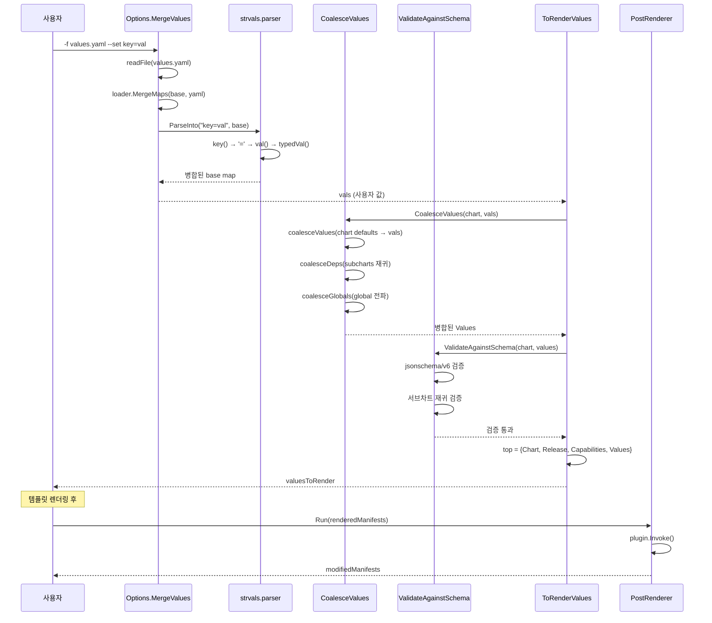

# 17. Values와 렌더링 파이프라인 Deep Dive

## 개요

Helm의 Values 시스템은 차트 템플릿에 주입되는 설정 데이터의 전체 생명주기를 관리한다.
단순한 key=value 저장소가 아니라, 다단계 병합(coalescing), 타입 추론, JSON Schema 검증,
그리고 PostRenderer를 통한 후처리까지 포함하는 완전한 파이프라인이다.

이 문서에서는 Helm v4 소스코드를 기반으로 Values가 사용자 입력에서 최종 렌더링 결과물까지
어떻게 흘러가는지를 추적한다.

**핵심 소스 파일:**

| 파일 경로 | 역할 |
|-----------|------|
| `pkg/chart/common/values.go` | Values 타입 정의, 경로 탐색 |
| `pkg/cli/values/options.go` | CLI 옵션 병합 (`--set`, `--values` 등) |
| `pkg/strvals/parser.go` | `--set` 문법 파서 |
| `pkg/strvals/literal_parser.go` | `--set-literal` 전용 파서 |
| `pkg/chart/common/util/coalesce.go` | 차트 계층 Values 병합 |
| `pkg/chart/common/util/values.go` | 렌더링용 최종 Values 구성 |
| `pkg/chart/common/util/jsonschema.go` | JSON Schema 검증 |
| `pkg/postrenderer/postrenderer.go` | PostRenderer 인터페이스 |

---

## 1. Values 타입 시스템

### 1.1 Values 기본 타입

```
파일: pkg/chart/common/values.go
```

Values는 Go의 `map[string]any` 위에 구축된 타입 별칭이다:

```go
// Values represents a collection of chart values.
type Values map[string]any
```

**왜 `map[string]any`인가?**

YAML의 유연한 구조를 그대로 수용하기 위해서다. YAML에서 값은 문자열, 숫자, 불리언,
리스트, 중첩된 맵 등 어떤 타입이든 될 수 있다. 정적 구조체로는 이 유연성을 표현할 수 없기
때문에, Helm은 동적 맵을 사용한다. 대신 JSON Schema로 런타임에 구조를 검증하는 전략을 취한다.

### 1.2 GlobalKey 상수

```go
const GlobalKey = "global"
```

`global` 키는 특별한 의미를 가진다. 이 키 아래의 모든 값은 부모 차트에서 서브차트로
자동으로 전파된다. 일반 값은 서브차트의 이름을 키로 하는 네임스페이스에 격리되지만,
`global`은 차트 계층 전체에서 공유된다.

### 1.3 경로 기반 접근

Values 타입은 dot-notation을 통한 중첩 접근을 지원한다:

```go
// Table gets a table (YAML subsection) from a Values object.
func (v Values) Table(name string) (Values, error) {
    table := v
    var err error
    for _, n := range parsePath(name) {
        if table, err = tableLookup(table, n); err != nil {
            break
        }
    }
    return table, err
}

func parsePath(key string) []string { return strings.Split(key, ".") }
```

`Table("foo.bar")`를 호출하면 `parsePath`가 `["foo", "bar"]`로 분리하고,
순차적으로 `tableLookup`을 호출하여 중첩된 맵을 탐색한다.

```
Values 구조:
{
  "foo": {           <-- tableLookup("foo") 결과
    "bar": {         <-- tableLookup("bar") 결과
      "baz": 42
    }
  }
}

v.Table("foo.bar") → {"baz": 42}
```

### 1.4 PathValue: 리프 값 접근

`Table()`이 맵(테이블)만 반환하는 것과 달리, `PathValue()`는 리프 값(스칼라)을 반환한다:

```go
func (v Values) PathValue(path string) (any, error) {
    if path == "" {
        return nil, errors.New("YAML path cannot be empty")
    }
    return v.pathValue(parsePath(path))
}

func (v Values) pathValue(path []string) (any, error) {
    if len(path) == 1 {
        if _, ok := v[path[0]]; ok && !istable(v[path[0]]) {
            return v[path[0]], nil
        }
        return nil, ErrNoValue{path[0]}
    }
    key, path := path[len(path)-1], path[:len(path)-1]
    t, err := v.Table(joinPath(path...))
    if err != nil {
        return nil, ErrNoValue{key}
    }
    if k, ok := t[key]; ok && !istable(k) {
        return k, nil
    }
    return nil, ErrNoValue{key}
}
```

흥미로운 점은 경로를 역순으로 처리한다는 것이다. 마지막 세그먼트를 `key`로 분리하고,
나머지를 `Table()`로 탐색한 후, 해당 테이블에서 `key`를 찾는다. 이렇게 하면 중간 경로는
테이블이어야 하고, 최종 값은 스칼라여야 한다는 제약이 자연스럽게 적용된다.

---

## 2. CLI 옵션과 Values 입력 경로

### 2.1 Options 구조체

```
파일: pkg/cli/values/options.go
```

Helm은 6가지 방법으로 값을 주입할 수 있다:

```go
type Options struct {
    ValueFiles    []string // -f/--values
    StringValues  []string // --set-string
    Values        []string // --set
    FileValues    []string // --set-file
    JSONValues    []string // --set-json
    LiteralValues []string // --set-literal
}
```

| 플래그 | 필드 | 용도 | 타입 변환 |
|--------|------|------|-----------|
| `-f` / `--values` | ValueFiles | YAML 파일에서 값 로드 | YAML 파서 사용 |
| `--set` | Values | key=value 형태로 값 설정 | 자동 타입 추론 |
| `--set-string` | StringValues | 값을 무조건 문자열로 처리 | 문자열 강제 |
| `--set-json` | JSONValues | JSON 형태로 값 설정 | JSON 파서 사용 |
| `--set-file` | FileValues | 파일 내용을 값으로 로드 | 파일 내용 → 문자열 |
| `--set-literal` | LiteralValues | 이스케이프 없이 그대로 사용 | 없음 (리터럴) |

### 2.2 MergeValues: 처리 순서

`MergeValues()` 메서드는 6가지 입력 소스를 **고정된 순서**로 처리한다:

```go
func (opts *Options) MergeValues(p getter.Providers) (map[string]any, error) {
    base := map[string]any{}

    // 1단계: -f/--values 파일들
    for _, filePath := range opts.ValueFiles {
        raw, err := readFile(filePath, p)
        // ...
        currentMap, err := loader.LoadValues(bytes.NewReader(raw))
        base = loader.MergeMaps(base, currentMap)
    }

    // 2단계: --set-json
    for _, value := range opts.JSONValues {
        // JSON 객체 또는 key=jsonval 형식 파싱
    }

    // 3단계: --set
    for _, value := range opts.Values {
        strvals.ParseInto(value, base)
    }

    // 4단계: --set-string
    for _, value := range opts.StringValues {
        strvals.ParseIntoString(value, base)
    }

    // 5단계: --set-file
    for _, value := range opts.FileValues {
        strvals.ParseIntoFile(value, base, reader)
    }

    // 6단계: --set-literal
    for _, value := range opts.LiteralValues {
        strvals.ParseLiteralInto(value, base)
    }

    return base, nil
}
```

**왜 이 순서인가?**

나중에 처리되는 값이 먼저 처리된 값을 덮어쓴다. 따라서 우선순위는:

```
--set-literal (최고)
    ↑
--set-file
    ↑
--set-string
    ↑
--set
    ↑
--set-json
    ↑
-f/--values (최저)
```

이 설계는 "더 구체적인 지정이 더 일반적인 지정을 이긴다"는 원칙을 따른다. YAML 파일은
기본값 역할을 하고, `--set` 계열 플래그는 개별 키를 정밀하게 오버라이드한다.

### 2.3 readFile: 다양한 소스 지원

```go
func readFile(filePath string, p getter.Providers) ([]byte, error) {
    if strings.TrimSpace(filePath) == "-" {
        return io.ReadAll(os.Stdin)     // stdin에서 읽기
    }
    u, err := url.Parse(filePath)
    g, err := p.ByScheme(u.Scheme)
    if err != nil {
        return os.ReadFile(filePath)     // 로컬 파일
    }
    data, err := g.Get(filePath, getter.WithURL(filePath))
    return data.Bytes(), nil             // 원격 URL (http/https/oci)
}
```

`-f` 플래그는 세 가지 소스를 지원한다:
- **stdin** (`-`): 파이프라인에서 값을 전달할 때
- **로컬 파일**: 일반적인 `values.yaml` 파일
- **원격 URL**: HTTP/HTTPS/OCI 프로토콜을 통한 원격 값 파일

---

## 3. strvals 파서: --set 문법 분석

### 3.1 파서 아키텍처

```
파일: pkg/strvals/parser.go
```

strvals 패키지는 Helm의 `--set` 계열 플래그가 사용하는 독자적인 문법을 파싱한다.
이 문법은 YAML이나 JSON이 아닌 Helm 고유의 미니 DSL이다.

```
문법 구조:
  key1=value1,key2=value2
  key1.nested=value
  key1[0]=value
  key1={a,b,c}
```

파서의 핵심 구조체:

```go
type parser struct {
    sc        *bytes.Buffer    // 입력 스캐너
    data      map[string]any   // 결과를 저장할 맵
    reader    RunesValueReader // 값 변환 함수
    isjsonval bool             // JSON 파싱 모드 여부
}
```

**왜 4가지 파서 변형이 존재하는가?**

| 팩토리 함수 | 값 변환 | 용도 |
|-------------|---------|------|
| `newParser(sc, data, false)` | `typedVal()` 자동 추론 | `--set` |
| `newParser(sc, data, true)` | 무조건 문자열 | `--set-string` |
| `newJSONParser(sc, data)` | Go JSON 디코더 | `--set-json` |
| `newFileParser(sc, data, reader)` | 파일 내용 읽기 | `--set-file` |

같은 `parser` 구조체를 재활용하면서, `reader` 함수와 `isjsonval` 플래그로
동작을 분기한다. 이는 파싱 로직(키 추출, 배열 인덱싱, 중첩 처리)을 공유하면서
값 해석 방식만 다르게 하는 전략 패턴이다.

### 3.2 핵심 파싱 루프

```go
func (t *parser) parse() error {
    for {
        err := t.key(t.data, 0)
        if err == nil {
            continue
        }
        if errors.Is(err, io.EOF) {
            return nil
        }
        return err
    }
}
```

`parse()`는 EOF까지 반복적으로 `key()`를 호출한다. `key()`는 입력을 한 문자씩
스캔하면서 구분자를 만나면 분기한다:

```go
func (t *parser) key(data map[string]any, nestedNameLevel int) (reterr error) {
    stop := runeSet([]rune{'=', '[', ',', '.'})
    for {
        switch k, last, err := runesUntil(t.sc, stop); {
        case last == '[':    // 배열 인덱싱: key[0]=value
            // ...
        case last == '=':    // 값 할당: key=value
            // ...
        case last == ',':    // 빈 값: key,
            // ...
        case last == '.':    // 중첩: key.sub=value
            nestedNameLevel++
            if nestedNameLevel > MaxNestedNameLevel {
                return fmt.Errorf(...)  // 최대 30단계
            }
            inner := map[string]any{}
            e := t.key(inner, nestedNameLevel)
            set(data, string(k), inner)
            return e
        }
    }
}
```

### 3.3 구분자별 처리 흐름

```
입력: "global.image.tag=latest,replicas=3"

파싱 과정:
┌──────────────────────────────────────────────────────────┐
│ "global.image.tag=latest,replicas=3"                     │
│                                                          │
│ key("global")  → last='.'  → 재귀                        │
│   key("image") → last='.'  → 재귀                        │
│     key("tag") → last='='  → val() → "latest"           │
│                                                          │
│ key("replicas") → last='=' → val() → typedVal → int64(3)│
└──────────────────────────────────────────────────────────┘

결과:
{
  "global": {
    "image": {
      "tag": "latest"
    }
  },
  "replicas": int64(3)
}
```

### 3.4 안전 제한

DoS 공격이나 실수로 인한 메모리 폭발을 방지하기 위한 제한이 있다:

```go
var MaxIndex = 65536           // 배열 최대 인덱스
var MaxNestedNameLevel = 30    // 키 중첩 최대 깊이
```

**왜 65536인가?** `1024 * 64`로 설정되어 있으며, 합리적인 YAML 배열 크기의 상한이다.
`key[99999999]=value` 같은 입력이 들어오면 `setIndex()`에서 거부된다:

```go
func setIndex(list []any, index int, val any) (l2 []any, err error) {
    defer func() {
        if r := recover(); r != nil {
            err = fmt.Errorf("error processing index %d: %s", index, r)
        }
    }()
    if index < 0 {
        return list, fmt.Errorf("negative %d index not allowed", index)
    }
    if index > MaxIndex {
        return list, fmt.Errorf("index of %d is greater than maximum...", index, MaxIndex)
    }
    // ...
}
```

### 3.5 typedVal: 자동 타입 추론

`--set`으로 전달된 값은 자동으로 타입이 추론된다:

```go
func typedVal(v []rune, st bool) any {
    val := string(v)
    if st {
        return val                           // --set-string: 무조건 문자열
    }
    if strings.EqualFold(val, "true") {
        return true                          // bool
    }
    if strings.EqualFold(val, "false") {
        return false                         // bool
    }
    if strings.EqualFold(val, "null") {
        return nil                           // nil (YAML null)
    }
    if strings.EqualFold(val, "0") {
        return int64(0)                      // 특수 케이스: "0"
    }
    if len(val) != 0 && val[0] != '0' {      // 0으로 시작하지 않으면
        if iv, err := strconv.ParseInt(val, 10, 64); err == nil {
            return iv                         // int64
        }
    }
    return val                               // 기본: 문자열
}
```

**왜 "0"을 특별 처리하는가?**

`val[0] != '0'` 조건은 "0123" 같은 8진수 표현이나 "007" 같은 문자열이 숫자로
변환되는 것을 방지한다. 하지만 "0" 자체는 숫자로 인식해야 하므로, 그 전에 명시적으로
`int64(0)`을 반환한다.

```
타입 추론 결과:
  "true"    → bool(true)
  "false"   → bool(false)
  "null"    → nil
  "0"       → int64(0)
  "42"      → int64(42)
  "0755"    → string("0755")    ← 0으로 시작, 숫자 변환 안 함
  "hello"   → string("hello")
  "3.14"    → string("3.14")   ← float 변환 안 함!
```

주목할 점: **float 변환은 하지 않는다.** `strconv.ParseInt`만 사용하기 때문에
"3.14"는 문자열로 남는다. YAML 파서를 통과하면 float가 되지만, `--set`으로는
문자열이 된다는 차이가 있다.

### 3.6 이스케이프 처리

`runesUntil()` 함수는 백슬래시 이스케이프를 지원한다:

```go
func runesUntil(in io.RuneReader, stop map[rune]bool) ([]rune, rune, error) {
    v := []rune{}
    for {
        switch r, _, e := in.ReadRune(); {
        case e != nil:
            return v, r, e
        case inMap(r, stop):
            return v, r, nil
        case r == '\\':              // 이스케이프 문자
            next, _, e := in.ReadRune()
            v = append(v, next)      // 다음 문자를 그대로 추가
        default:
            v = append(v, r)
        }
    }
}
```

이를 통해 `--set "key=value\,with\,commas"` 같은 입력이 가능하다. 쉼표가 구분자로
해석되지 않고 값의 일부가 된다.

### 3.7 literalParser: 이스케이프 없는 파서

```
파일: pkg/strvals/literal_parser.go
```

`--set-literal`은 완전히 다른 파서를 사용한다:

```go
func runesUntilLiteral(in io.RuneReader, stop map[rune]bool) ([]rune, rune, error) {
    v := []rune{}
    for {
        switch r, _, e := in.ReadRune(); {
        case e != nil:
            return v, r, e
        case inMap(r, stop):
            return v, r, nil
        default:
            v = append(v, r)    // 이스케이프 처리 없음!
        }
    }
}
```

핵심 차이점:
- `runesUntil()`은 `\\` 이스케이프를 처리한다
- `runesUntilLiteral()`은 이스케이프 없이 `=`까지의 모든 문자를 키로, 이후 모든 문자를 값으로 취한다
- `literalParser`의 `val()`은 빈 stop set을 사용하여 EOF까지 모든 문자를 값으로 읽는다

```go
func (t *literalParser) val() ([]rune, error) {
    stop := runeSet([]rune{})      // 빈 stop set → EOF까지 전부 읽음
    v, _, err := runesUntilLiteral(t.sc, stop)
    return v, err
}
```

**왜 `--set-literal`이 필요한가?**

비밀번호나 인증서 같은 값에는 `\`, `,`, `=` 등의 특수 문자가 포함될 수 있다.
일반 `--set`으로는 이스케이프가 필요하지만, `--set-literal`은 키 다음의 모든 것을
그대로 값으로 취급한다. 단, 쉼표로 구분된 여러 키=값 쌍은 지원하지 않는다.

---

## 4. Values 병합 (Coalescing)

### 4.1 CoalesceValues vs MergeValues

```
파일: pkg/chart/common/util/coalesce.go
```

Helm v4는 두 가지 병합 방식을 제공한다:

```go
// CoalesceValues: nil 값이 있으면 해당 키를 삭제
func CoalesceValues(chrt chart.Charter, vals map[string]any) (common.Values, error) {
    valsCopy, err := copyValues(vals)
    return coalesce(log.Printf, chrt, valsCopy, "", false)  // merge=false
}

// MergeValues: nil 값을 보존
func MergeValues(chrt chart.Charter, vals map[string]any) (common.Values, error) {
    valsCopy, err := copyValues(vals)
    return coalesce(log.Printf, chrt, valsCopy, "", true)   // merge=true
}
```

**두 함수의 유일한 차이는 `merge` 파라미터의 불리언 값이다.**

| 동작 | CoalesceValues (merge=false) | MergeValues (merge=true) |
|------|--------------------------|----------------------|
| `key: null` 처리 | 키 삭제 | nil 값 보존 |
| 사용 시점 | 최종 렌더링 전 | 중간 처리 과정 |
| 의미 | "이 키를 제거하겠다" | "아직 모르니 보존하자" |

**왜 두 가지가 필요한가?**

Helm의 install/upgrade 과정에서 Values는 여러 번 병합된다. 초기 단계에서 `null`을
만나면 "사용자가 의도적으로 이 값을 비우려 했다"는 정보를 보존해야 한다. 최종 단계에서야
비로소 `null`을 키 삭제로 해석한다. `MergeValues`는 초기 단계용, `CoalesceValues`는
최종 단계용이다.

### 4.2 copyValues: 딥 카피의 중요성

```go
func copyValues(vals map[string]any) (common.Values, error) {
    v, err := copystructure.Copy(vals)
    valsCopy := v.(map[string]any)
    if valsCopy == nil {
        valsCopy = make(map[string]any)
    }
    return valsCopy, nil
}
```

**왜 딥 카피가 필요한가?**

Go의 맵은 참조 타입이다. 병합 과정에서 원본 Values가 변경되면, 이후 단계에서
예상치 못한 부작용이 발생한다. 특히 `coalesceValues()`에서 차트의 기본값(`ch.Values()`)을
직접 수정하면 차트 객체 자체가 오염된다. `copystructure.Copy()`를 사용한 딥 카피로
이 문제를 방지한다.

### 4.3 coalesce: 메인 병합 함수

```go
func coalesce(printf printFn, ch chart.Charter, dest map[string]any,
              prefix string, merge bool) (map[string]any, error) {
    coalesceValues(printf, ch, dest, prefix, merge)
    return coalesceDeps(printf, ch, dest, prefix, merge)
}
```

병합은 두 단계로 진행된다:
1. **coalesceValues**: 현재 차트의 기본값과 사용자 값을 병합
2. **coalesceDeps**: 각 서브차트에 대해 재귀적으로 병합

```
병합 흐름도:

coalesce(parent-chart, user-vals)
│
├── coalesceValues(parent-chart, user-vals)
│   └── parent의 values.yaml 기본값을 user-vals에 병합
│       (user-vals이 우선)
│
└── coalesceDeps(parent-chart, user-vals)
    │
    ├── subchart-A:
    │   ├── coalesceGlobals(subchart-A-vals, user-vals)
    │   │   └── global 값을 parent에서 subchart-A로 복사
    │   └── coalesce(subchart-A, subchart-A-vals)  ← 재귀!
    │
    └── subchart-B:
        ├── coalesceGlobals(subchart-B-vals, user-vals)
        └── coalesce(subchart-B, subchart-B-vals)  ← 재귀!
```

### 4.4 coalesceValues: 차트 기본값 병합

```go
func coalesceValues(printf printFn, c chart.Charter, v map[string]any,
                    prefix string, merge bool) {
    // 차트의 기본값을 딥 카피
    valuesCopy, err := copystructure.Copy(ch.Values())
    vc := valuesCopy.(map[string]any)

    for key, val := range vc {
        if value, ok := v[key]; ok {
            if value == nil && !merge {
                // Coalesce 모드: null이면 키 삭제
                delete(v, key)
            } else if dest, ok := value.(map[string]any); ok {
                src, ok := val.(map[string]any)
                if ok {
                    merge := childChartMergeTrue(c, key, merge)
                    coalesceTablesFullKey(printf, dest, src, ...)
                }
            }
        } else {
            // 사용자가 지정하지 않은 키는 기본값 사용
            v[key] = val
        }
    }
}
```

핵심 규칙:
1. **사용자 값이 우선**: `v[key]`가 존재하면 차트 기본값을 무시
2. **null은 삭제 의도**: Coalesce 모드에서 `v[key] == nil`이면 키를 삭제
3. **테이블은 재귀 병합**: 양쪽이 모두 맵이면 깊은 병합 수행
4. **없는 키는 기본값**: 사용자가 지정하지 않은 키는 차트 기본값 채택

### 4.5 childChartMergeTrue: 서브차트 특수 처리

```go
func childChartMergeTrue(chrt chart.Charter, key string, merge bool) bool {
    for _, subchart := range ch.Dependencies() {
        sub, _ := chart.NewAccessor(subchart)
        if sub.Name() == key {
            return true   // 서브차트 키이면 항상 merge=true
        }
    }
    return merge
}
```

**왜 서브차트 키는 항상 merge=true인가?**

부모 차트에서 서브차트의 값을 `null`로 설정해서 서브차트 전체를 "삭제"하는 것은
의도치 않은 동작일 가능성이 높다. 서브차트의 값은 항상 nil을 보존하여 서브차트 자체의
Coalescing에서 처리하도록 맡기는 것이 안전하다.

### 4.6 coalesceGlobals: 전역 값 전파

```go
func coalesceGlobals(printf printFn, dest, src map[string]any,
                     prefix string, _ bool) {
    var dg, sg map[string]any

    // dest (서브차트)의 global 섹션
    if destglob, ok := dest[common.GlobalKey]; !ok {
        dg = make(map[string]any)
    } else {
        dg = destglob.(map[string]any)
    }

    // src (부모 차트)의 global 섹션
    if srcglob, ok := src[common.GlobalKey]; !ok {
        sg = make(map[string]any)
    } else {
        sg = srcglob.(map[string]any)
    }

    // 부모의 global 값을 서브차트의 global에 병합
    for key, val := range sg {
        if istable(val) {
            vv := copyMap(val.(map[string]any))
            if destv, ok := dg[key]; !ok {
                dg[key] = vv           // 서브차트에 없으면 추가
            } else {
                // 양쪽 다 테이블이면 병합 (부모가 기본, 서브차트가 우선)
                coalesceTablesFullKey(printf, vv, destvmap, ...)
                dg[key] = vv
            }
        } else {
            dg[key] = val
        }
    }
    dest[common.GlobalKey] = dg
}
```

전역 값 전파의 흥미로운 점은 **병합 방향이 반대**라는 것이다:

```
일반 병합:    사용자 값 > 차트 기본값
전역 병합:    부모 차트의 global > 서브차트의 global
```

부모의 `global` 값이 서브차트로 "하향 전파"되므로, 부모가 설정한 global이 서브차트의
local global보다 우선한다.

### 4.7 coalesceTablesFullKey: 재귀적 맵 병합

```go
func coalesceTablesFullKey(printf printFn, dst, src map[string]any,
                           prefix string, merge bool) map[string]any {
    if src == nil { return dst }
    if dst == nil { return src }

    // 원래 src에서 nil이 아닌 키를 추적
    srcOriginalNonNil := make(map[string]bool)
    for key, val := range src {
        if val != nil {
            srcOriginalNonNil[key] = true
        }
    }

    // dst의 nil 값을 src에 전파
    for key, val := range dst {
        if val == nil {
            src[key] = nil
        }
    }

    // src를 dst에 병합 (dst 우선)
    for key, val := range src {
        fullkey := concatPrefix(prefix, key)
        if dv, ok := dst[key]; ok && !merge && dv == nil && srcOriginalNonNil[key] {
            // 사용자가 의도적으로 null 설정 → 키 삭제
            delete(dst, key)
        } else if !ok {
            // dst에 없는 키 → src에서 복사
            dst[key] = val
        } else if istable(val) {
            if istable(dv) {
                // 양쪽 다 테이블 → 재귀 병합
                coalesceTablesFullKey(printf, dv.(map[string]any), val.(map[string]any), fullkey, merge)
            }
        }
    }
    return dst
}
```

이 함수에서 가장 미묘한 부분은 `srcOriginalNonNil` 추적이다:

```
시나리오: 사용자가 --set "key=null"로 차트 기본값을 명시적으로 제거

                    dst (사용자 값)         src (차트 기본값)
                    key: nil               key: "default-value"

src에서 key의 원래 값은 nil이 아님 (srcOriginalNonNil[key]=true)
dst에서 key의 값은 nil
→ 사용자가 의도적으로 null 설정 → delete(dst, key)

시나리오: src에도 nil이 있는 경우
                    dst (사용자 값)         src (차트 기본값)
                    key: nil               key: nil

srcOriginalNonNil[key]=false
→ 양쪽 다 nil이므로 삭제하지 않고 보존
```

---

## 5. 렌더링용 Values 구성

### 5.1 ToRenderValuesWithSchemaValidation

```
파일: pkg/chart/common/util/values.go
```

최종적으로 템플릿 엔진에 전달되는 Values는 `ToRenderValuesWithSchemaValidation()`에서
구성된다:

```go
func ToRenderValuesWithSchemaValidation(chrt chart.Charter, chrtVals map[string]any,
    options common.ReleaseOptions, caps *common.Capabilities,
    skipSchemaValidation bool) (common.Values, error) {

    // 1. 최상위 구조 생성
    top := map[string]any{
        "Chart":        accessor.MetadataAsMap(),
        "Capabilities": caps,
        "Release": map[string]any{
            "Name":      options.Name,
            "Namespace": options.Namespace,
            "IsUpgrade": options.IsUpgrade,
            "IsInstall": options.IsInstall,
            "Revision":  options.Revision,
            "Service":   "Helm",
        },
    }

    // 2. 차트 계층 전체의 Values 병합
    vals, err := CoalesceValues(chrt, chrtVals)

    // 3. JSON Schema 검증
    if !skipSchemaValidation {
        if err := ValidateAgainstSchema(chrt, vals); err != nil {
            return top, err
        }
    }

    // 4. 병합된 Values를 top에 추가
    top["Values"] = vals
    return top, nil
}
```

최종 결과는 템플릿에서 접근 가능한 4개의 최상위 객체가 된다:

```
┌─────────────────────────────────────────┐
│ 템플릿에서 접근 가능한 최상위 객체      │
├─────────────────────────────────────────┤
│ .Chart         │ Chart.yaml 메타데이터  │
│ .Capabilities  │ K8s 클러스터 정보      │
│ .Release       │ 릴리스 정보            │
│ .Values        │ 병합된 사용자 값       │
└─────────────────────────────────────────┘
```

### 5.2 Install.RunWithContext에서의 호출

```
파일: pkg/action/install.go
```

```go
func (i *Install) RunWithContext(ctx context.Context, ch ci.Charter,
                                  vals map[string]any) (ri.Releaser, error) {
    // 1. 의존성 처리 (condition/tags에 따라 서브차트 활성화/비활성화)
    chartutil.ProcessDependencies(chrt, vals)

    // 2. 릴리스 옵션 구성
    options := common.ReleaseOptions{
        Name:      i.ReleaseName,
        Namespace: i.Namespace,
        Revision:  1,
        IsInstall: !isUpgrade,
        IsUpgrade: isUpgrade,
    }

    // 3. Values 병합 + Schema 검증 + 렌더링용 구조 생성
    valuesToRender, err := util.ToRenderValuesWithSchemaValidation(
        chrt, vals, options, caps, i.SkipSchemaValidation)

    // 4. 템플릿 렌더링 + PostRenderer 적용
    rel.Hooks, manifestDoc, rel.Info.Notes, err = i.cfg.renderResources(
        chrt, valuesToRender, i.ReleaseName, i.OutputDir,
        i.SubNotes, i.UseReleaseName, i.IncludeCRDs,
        i.PostRenderer, ...)
}
```

---

## 6. JSON Schema 검증

### 6.1 ValidateAgainstSchema: 재귀 검증

```
파일: pkg/chart/common/util/jsonschema.go
```

```go
func ValidateAgainstSchema(ch chart.Charter, values map[string]any) error {
    chrt, _ := chart.NewAccessor(ch)
    var sb strings.Builder

    // 현재 차트의 스키마 검증
    if chrt.Schema() != nil {
        err := ValidateAgainstSingleSchema(values, chrt.Schema())
        if err != nil {
            fmt.Fprintf(&sb, "%s:\n", chrt.Name())
            sb.WriteString(err.Error())
        }
    }

    // 각 서브차트에 대해 재귀 검증
    for _, subchart := range chrt.Dependencies() {
        sub, _ := chart.NewAccessor(subchart)
        raw, exists := values[sub.Name()]
        if !exists || raw == nil {
            continue  // 값이 없으면 검증 스킵
        }
        subchartValues := raw.(map[string]any)
        if err := ValidateAgainstSchema(subchart, subchartValues); err != nil {
            sb.WriteString(err.Error())
        }
    }
    // ...
}
```

**왜 재귀 검증인가?**

각 서브차트는 자체 `values.schema.json`을 가질 수 있다. 부모 차트의 스키마는 서브차트의
값 구조를 모르므로, 각 차트가 자신의 네임스페이스에 해당하는 값만 자신의 스키마로 검증한다.

```
차트 계층과 스키마 검증:

parent-chart/
├── values.schema.json    ← {"replicas": 3} 검증
├── charts/
│   └── redis/
│       └── values.schema.json  ← {"port": 6379} 검증
│
Values:
{
  "replicas": 3,          ← parent의 스키마로 검증
  "redis": {
    "port": 6379          ← redis의 스키마로 검증
  }
}
```

### 6.2 ValidateAgainstSingleSchema

```go
func ValidateAgainstSingleSchema(values common.Values, schemaJSON []byte) (reterr error) {
    defer func() {
        if r := recover(); r != nil {
            reterr = fmt.Errorf("unable to validate schema: %s", r)
        }
    }()

    schema, err := jsonschema.UnmarshalJSON(bytes.NewReader(schemaJSON))

    // URL 스킴별 로더 설정
    loader := jsonschema.SchemeURLLoader{
        "file":  jsonschema.FileLoader{},
        "http":  newHTTPURLLoader(),
        "https": newHTTPURLLoader(),
        "urn":   urnLoader{},
    }

    compiler := jsonschema.NewCompiler()
    compiler.UseLoader(loader)
    compiler.AddResource("file:///values.schema.json", schema)
    validator, _ := compiler.Compile("file:///values.schema.json")
    err = validator.Validate(values.AsMap())
    // ...
}
```

Helm v4는 `santhosh-tekuri/jsonschema/v6` 라이브러리를 사용하여 JSON Schema Draft 6+를
지원한다.

**주요 설계 결정:**

1. **panic recovery**: JSON Schema 검증 라이브러리의 예기치 않은 panic을 안전하게 처리
2. **다중 URL 스킴**: 스키마 내 `$ref`가 file, http, https, urn 프로토콜을 참조할 수 있음
3. **URN 폴백**: 해결되지 않는 URN 참조는 경고만 출력하고 허용 스키마(`true`)로 대체

### 6.3 URN 로더와 호환성

```go
type urnLoader struct{}

var warnedURNs sync.Map

func (l urnLoader) Load(urlStr string) (any, error) {
    if doc, err := URNResolver(urlStr); err == nil && doc != nil {
        return doc, nil
    }
    // 해결 실패 시 경고만 출력하고 허용 스키마 반환
    if _, loaded := warnedURNs.LoadOrStore(urlStr, struct{}{}); !loaded {
        slog.Warn("unresolved URN reference ignored; using permissive schema", "urn", urlStr)
    }
    return jsonschema.UnmarshalJSON(strings.NewReader("true"))
}
```

`sync.Map`을 사용하여 같은 URN에 대한 경고를 한 번만 출력한다. 이는 대규모 차트에서
수백 개의 중복 경고가 발생하는 것을 방지한다.

### 6.4 HTTPURLLoader

```go
type HTTPURLLoader http.Client

func (l *HTTPURLLoader) Load(urlStr string) (any, error) {
    client := (*http.Client)(l)
    req, _ := http.NewRequest(http.MethodGet, urlStr, nil)
    req.Header.Set("User-Agent", version.GetUserAgent())
    resp, err := client.Do(req)
    // ...
    return jsonschema.UnmarshalJSON(resp.Body)
}

func newHTTPURLLoader() *HTTPURLLoader {
    httpLoader := HTTPURLLoader(http.Client{
        Timeout: 15 * time.Second,
        Transport: &http.Transport{
            Proxy:           http.ProxyFromEnvironment,
            TLSClientConfig: &tls.Config{},
        },
    })
    return &httpLoader
}
```

원격 스키마 참조를 위한 HTTP 로더는:
- **15초 타임아웃**: 원격 서버 응답 대기 제한
- **프록시 지원**: `http.ProxyFromEnvironment`로 환경 변수 프록시 설정 존중
- **User-Agent 헤더**: Helm 버전 정보를 포함한 UA 전송

---

## 7. PostRenderer: 렌더링 후처리

### 7.1 PostRenderer 인터페이스

```
파일: pkg/postrenderer/postrenderer.go
```

```go
type PostRenderer interface {
    Run(renderedManifests *bytes.Buffer) (modifiedManifests *bytes.Buffer, err error)
}
```

PostRenderer는 템플릿 렌더링이 완료된 후, 최종 매니페스트를 변형할 수 있는 확장 포인트다.
`bytes.Buffer`를 입력받아 변형된 `bytes.Buffer`를 반환하는 단순한 인터페이스다.

**왜 PostRenderer가 필요한가?**

Helm 템플릿만으로는 표현할 수 없는 변환이 있다:
- **Kustomize 적용**: 렌더링된 YAML에 patches, overlays 적용
- **라벨/어노테이션 주입**: 조직 정책에 따른 메타데이터 추가
- **이미지 태그 교체**: 레지스트리 미러링 정책 적용
- **보안 정책 적용**: PodSecurityPolicy, NetworkPolicy 자동 추가

### 7.2 플러그인 기반 PostRenderer

```go
func NewPostRendererPlugin(settings *cli.EnvSettings, pluginName string,
                           args ...string) (PostRenderer, error) {
    descriptor := plugin.Descriptor{
        Name: pluginName,
        Type: "postrenderer/v1",
    }
    p, err := plugin.FindPlugin(
        filepath.SplitList(settings.PluginsDirectory), descriptor)

    return &postRendererPlugin{
        plugin:   p,
        args:     args,
        settings: settings,
    }, nil
}
```

PostRenderer는 Helm 플러그인 시스템과 통합된다. `plugin.Descriptor`의 `Type`이
`"postrenderer/v1"`인 플러그인을 찾아서 사용한다.

### 7.3 실행 흐름

```go
func (r *postRendererPlugin) Run(renderedManifests *bytes.Buffer) (*bytes.Buffer, error) {
    input := &plugin.Input{
        Message: schema.InputMessagePostRendererV1{
            ExtraArgs: r.args,
            Manifests: renderedManifests,
        },
    }
    output, err := r.plugin.Invoke(context.Background(), input)

    outputMessage := output.Message.(schema.OutputMessagePostRendererV1)

    // 빈 출력 검사
    if len(bytes.TrimSpace(outputMessage.Manifests.Bytes())) == 0 {
        return nil, fmt.Errorf("post-renderer %q produced empty output",
            r.plugin.Metadata().Name)
    }

    return outputMessage.Manifests, nil
}
```

```
PostRenderer 실행 파이프라인:

┌──────────────┐     ┌──────────────┐     ┌──────────────┐
│  Helm 템플릿  │────▶│ PostRenderer │────▶│  K8s 적용    │
│   엔진       │     │  Plugin      │     │              │
└──────────────┘     └──────────────┘     └──────────────┘
     │                     │                     │
  values.yaml         renderedManifests    modifiedManifests
  + --set              (bytes.Buffer)       (bytes.Buffer)
  + templates/              │
                   ┌────────┴────────┐
                   │  빈 출력 검사   │
                   │  (안전 가드)    │
                   └─────────────────┘
```

빈 출력 검사는 중요한 안전 장치다. PostRenderer가 실패하면 빈 매니페스트가 반환될 수
있고, 이를 Kubernetes에 적용하면 기존 리소스가 삭제될 위험이 있다.

---

## 8. 전체 Values 파이프라인 흐름

### 8.1 End-to-End 흐름도

```
helm install myrelease ./mychart -f custom.yaml --set replicas=3

┌─────────────────────────────────────────────────────────────────┐
│ 1단계: CLI 입력 수집                                            │
│   Options.MergeValues()                                         │
│   ┌─────────────┐  ┌──────────┐  ┌──────────┐                 │
│   │ custom.yaml │─▶│ --set-json│─▶│  --set   │─▶ base map     │
│   │ (-f)        │  │          │  │replicas=3│                  │
│   └─────────────┘  └──────────┘  └──────────┘                 │
│           ↓              ↓             ↓                       │
│   loader.MergeMaps   ParseJSON   ParseInto(typedVal)           │
│                                  replicas → int64(3)           │
└────────────────────────────┬────────────────────────────────────┘
                             │ vals = {replicas: 3, ...}
                             ▼
┌─────────────────────────────────────────────────────────────────┐
│ 2단계: 의존성 처리                                              │
│   chartutil.ProcessDependencies(chrt, vals)                     │
│   - condition/tags에 따라 서브차트 활성화/비활성화              │
│   - importValues 처리                                           │
└────────────────────────────┬────────────────────────────────────┘
                             ▼
┌─────────────────────────────────────────────────────────────────┐
│ 3단계: Values 병합 (Coalescing)                                │
│   CoalesceValues(chrt, vals)                                    │
│                                                                 │
│   ┌─────────────────────────────────────────────────┐          │
│   │ coalesceValues: 차트 기본값 ←── 사용자 값       │          │
│   │   - 사용자 값 우선                               │          │
│   │   - null → 키 삭제 (merge=false)                │          │
│   │   - 테이블 → 재귀 병합                          │          │
│   └─────────────────────────────────────────────────┘          │
│   ┌─────────────────────────────────────────────────┐          │
│   │ coalesceDeps: 각 서브차트 재귀 처리              │          │
│   │   - coalesceGlobals: global 값 하향 전파         │          │
│   │   - coalesce: 서브차트별 재귀 병합               │          │
│   └─────────────────────────────────────────────────┘          │
└────────────────────────────┬────────────────────────────────────┘
                             ▼
┌─────────────────────────────────────────────────────────────────┐
│ 4단계: JSON Schema 검증                                        │
│   ValidateAgainstSchema(chrt, vals)                             │
│   - 현재 차트의 values.schema.json으로 검증                     │
│   - 각 서브차트의 값을 서브차트의 스키마로 재귀 검증            │
└────────────────────────────┬────────────────────────────────────┘
                             ▼
┌─────────────────────────────────────────────────────────────────┐
│ 5단계: 렌더링용 구조 구성                                       │
│   top = {                                                       │
│     "Chart":        {...},                                      │
│     "Capabilities": {...},                                      │
│     "Release":      {...},                                      │
│     "Values":       병합된_values,                              │
│   }                                                             │
└────────────────────────────┬────────────────────────────────────┘
                             ▼
┌─────────────────────────────────────────────────────────────────┐
│ 6단계: 템플릿 렌더링                                            │
│   renderResources(chrt, valuesToRender, ...)                    │
│   - Go text/template + sprig 함수                               │
│   - {{ .Values.replicas }} → 3                                 │
└────────────────────────────┬────────────────────────────────────┘
                             ▼
┌─────────────────────────────────────────────────────────────────┐
│ 7단계: PostRenderer (선택적)                                    │
│   PostRenderer.Run(renderedManifests)                            │
│   - 플러그인 또는 사용자 정의 후처리                            │
│   - 빈 출력 검사                                                │
└────────────────────────────┬────────────────────────────────────┘
                             ▼
                     최종 매니페스트
                  (Kubernetes에 적용)
```

### 8.2 Values 우선순위 종합

전체 파이프라인에서의 Values 우선순위 (높은 것이 낮은 것을 덮어씀):

```
우선순위 (높음 → 낮음)
━━━━━━━━━━━━━━━━━━━━━━━━━━━━━━━
1. --set-literal key=raw-value
2. --set-file key=filepath
3. --set-string key=string-value
4. --set key=typed-value
5. --set-json key=json-value
6. -f custom-values.yaml (뒤에 지정된 것이 우선)
7. 부모 차트의 values.yaml에서 서브차트 키
8. 서브차트 자체의 values.yaml 기본값
━━━━━━━━━━━━━━━━━━━━━━━━━━━━━━━

특별 규칙:
- global 값: 부모 → 서브차트 방향으로 전파
- null 값: CoalesceValues에서 키 삭제로 처리
- 테이블 vs 스칼라: 테이블을 스칼라로 덮어쓰기 불가 (경고)
```

---

## 9. 고급 시나리오

### 9.1 --set과 YAML의 타입 차이

```yaml
# values.yaml에서:
port: 8080        # int
enabled: true     # bool
version: "1.0"    # string

# --set에서:
port=8080         # int64 (strconv.ParseInt)
enabled=true      # bool (strings.EqualFold)
version=1.0       # string! (float 변환 안 함)
octal=0755        # string! (0으로 시작)
```

YAML 파서는 8080을 int, 0755를 8진수로 해석하지만, strvals의 `typedVal()`은
`ParseInt`만 사용하므로 동작이 다르다. 이는 의도적인 설계로, `--set`의 간단한 문법에서
정밀한 타입 제어가 필요하면 `--set-json`을 사용하도록 유도한다.

### 9.2 null을 이용한 값 제거

```bash
# 차트의 기본 values.yaml:
# logging:
#   level: info
#   format: json

# null로 logging 섹션 전체 제거:
helm install myapp ./mychart --set logging=null

# CoalesceValues 처리:
# 1. typedVal("null") → nil
# 2. v["logging"] = nil
# 3. coalesceValues에서 value == nil && !merge → delete(v, "logging")
# 4. 최종 Values에서 logging 키가 완전히 사라짐
```

### 9.3 --set에서 배열 처리

```bash
# 배열 설정:
helm install myapp ./mychart --set "servers[0].host=a,servers[0].port=80,servers[1].host=b"

# 파싱 과정:
# key("servers") → last='[' → keyIndex() → 0
# listItem([], 0) → last='.' → key("host") → last='=' → "a"
# → servers = [{host: "a"}]
#
# key("servers") → last='[' → keyIndex() → 0
# listItem([{host:"a"}], 0) → last='.' → key("port") → last='=' → typedVal("80") → 80
# → servers = [{host: "a", port: 80}]
#
# key("servers") → last='[' → keyIndex() → 1
# listItem([{host:"a",port:80}], 1) → last='.' → key("host") → last='=' → "b"
# → servers = [{host: "a", port: 80}, {host: "b"}]
```

### 9.4 --set-json으로 복잡한 구조 설정

```bash
# JSON 객체 직접 전달:
helm install myapp ./mychart --set-json '{"resources":{"limits":{"cpu":"500m","memory":"128Mi"}}}'

# key=jsonval 형식:
helm install myapp ./mychart --set-json 'tolerations=[{"key":"k","operator":"Exists"}]'

# MergeValues에서의 처리:
# 1. trimmedValue[0] == '{' → json.Unmarshal → map으로 파싱
#    → base = loader.MergeMaps(base, jsonMap)
#
# 또는:
# 2. key=jsonval 형식 → strvals.ParseJSON(value, base)
#    → JSON 디코더로 값 파싱
```

---

## 10. Mermaid: Values 파이프라인 시퀀스



---

## 11. 설계 원칙 정리

### 11.1 불변성 보장

Values 병합의 모든 단계에서 `copystructure.Copy()`를 통한 딥 카피가 사용된다.
Go의 맵이 참조 타입이기 때문에, 원본 수정을 방지하지 않으면 다음과 같은 문제가 발생한다:

- 차트 객체의 기본값이 오염되어 같은 차트를 다시 설치할 때 다른 결과가 나옴
- 병렬 처리 시 데이터 레이스 발생
- 디버깅 시 원본 값 확인 불가

### 11.2 선언적 null 처리

YAML에서 `null`은 "이 키를 명시적으로 비운다"는 선언적 의미를 가진다.
Helm은 이를 두 단계로 처리한다:

1. **MergeValues**: null을 보존 (중간 단계)
2. **CoalesceValues**: null을 키 삭제로 변환 (최종 단계)

이 두 단계 접근은 Helm의 복잡한 업그레이드 과정에서 `--reuse-values`와 함께
사용될 때 특히 중요하다. 이전 릴리스의 값과 새 차트의 기본값, 그리고 사용자가
명시적으로 null로 설정한 값이 올바르게 처리되어야 한다.

### 11.3 타입 안전성과 유연성의 균형

Helm은 `map[string]any`라는 완전히 동적인 타입을 사용하면서도, JSON Schema를 통해
런타임에 구조적 안전성을 확보한다. 이는:

- 차트 개발자: values.schema.json으로 허용되는 값의 구조를 정의
- 차트 사용자: --set으로 자유롭게 값을 오버라이드하면서도 스키마 위반 시 즉시 피드백

이 조합은 정적 타입 시스템의 안전성과 동적 시스템의 유연성을 모두 제공한다.

### 11.4 보안 경계

strvals 파서의 안전 제한(`MaxIndex`, `MaxNestedNameLevel`)은 외부 입력 처리에서
중요한 보안 경계다. CLI를 통해 들어오는 `--set` 값은 사용자 입력이므로,
악의적으로 거대한 배열이나 깊은 중첩을 시도할 수 있다. 이러한 제한은 DoS 공격을
방지하면서도 합리적인 사용을 허용한다.

---

## 12. 참고 자료

| 소스 파일 | 주요 함수/타입 |
|-----------|---------------|
| `pkg/chart/common/values.go` | `Values`, `Table()`, `PathValue()`, `parsePath()` |
| `pkg/cli/values/options.go` | `Options`, `MergeValues()`, `readFile()` |
| `pkg/strvals/parser.go` | `Parse()`, `ParseInto()`, `typedVal()`, `runesUntil()` |
| `pkg/strvals/literal_parser.go` | `ParseLiteralInto()`, `runesUntilLiteral()` |
| `pkg/chart/common/util/coalesce.go` | `CoalesceValues()`, `MergeValues()`, `coalesceGlobals()` |
| `pkg/chart/common/util/values.go` | `ToRenderValuesWithSchemaValidation()` |
| `pkg/chart/common/util/jsonschema.go` | `ValidateAgainstSchema()`, `ValidateAgainstSingleSchema()` |
| `pkg/postrenderer/postrenderer.go` | `PostRenderer`, `NewPostRendererPlugin()` |
| `pkg/action/install.go` | `Install.RunWithContext()` |
