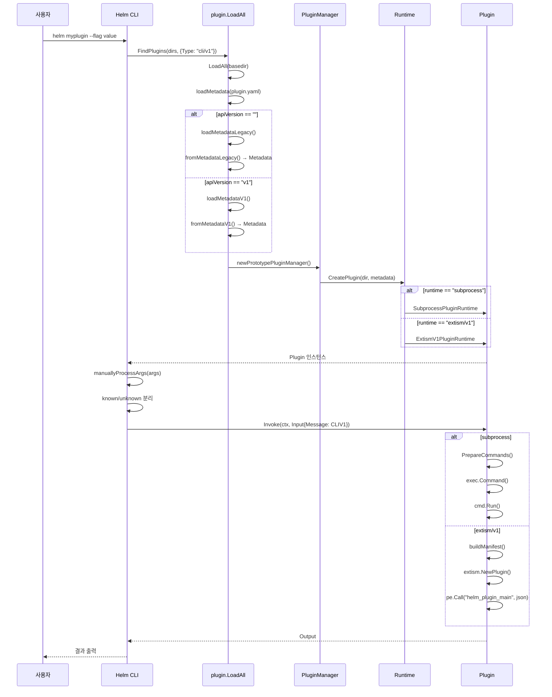

# 18. 플러그인 시스템 Deep Dive

## 개요

Helm v4의 플러그인 시스템은 Helm의 기능을 외부 프로그램으로 확장하는 메커니즘이다.
v3에서의 단순한 서브프로세스 실행 방식을 넘어, v4는 타입 기반 플러그인 레지스트리,
듀얼 런타임(서브프로세스 + WebAssembly), 구조화된 메타데이터 시스템을 도입했다.

이 문서에서는 플러그인의 로딩, 메타데이터 파싱, 런타임 디스패치, 설치, 그리고
Helm CLI 통합까지 전체 파이프라인을 소스코드 기반으로 분석한다.

**핵심 소스 파일:**

| 파일 경로 | 역할 |
|-----------|------|
| `internal/plugin/plugin.go` | Plugin 인터페이스 정의 |
| `internal/plugin/metadata.go` | Metadata 구조체, 레거시/v1 변환 |
| `internal/plugin/metadata_legacy.go` | 레거시 plugin.yaml 형식 |
| `internal/plugin/metadata_v1.go` | v1 API plugin.yaml 형식 |
| `internal/plugin/loader.go` | 플러그인 로딩, 검색, 매니저 |
| `internal/plugin/runtime.go` | Runtime 인터페이스 |
| `internal/plugin/runtime_subprocess.go` | 서브프로세스 런타임 |
| `internal/plugin/runtime_extismv1.go` | Extism/WASM 런타임 |
| `internal/plugin/subprocess_commands.go` | 플랫폼별 명령어 해석 |
| `internal/plugin/config.go` | Config 인터페이스, 역직렬화 |
| `internal/plugin/descriptor.go` | 플러그인 검색 디스크립터 |
| `internal/plugin/plugin_type_registry.go` | 타입 레지스트리 |
| `internal/plugin/schema/` | 타입별 입출력/설정 스키마 |
| `internal/plugin/installer/installer.go` | 설치 인터페이스 |
| `pkg/cmd/load_plugins.go` | CLI 플러그인 통합 |

---

## 1. 플러그인 아키텍처 개요

### 1.1 계층 구조

```
┌──────────────────────────────────────────────────────────────┐
│                      Helm CLI (cobra)                        │
│  ┌─────────────────────────────────────────────────────────┐ │
│  │ loadCLIPlugins()                                        │ │
│  │  - FindPlugins(dirs, Descriptor{Type: "cli/v1"})        │ │
│  │  - cobra.Command 생성 + Invoke() 연결                   │ │
│  └─────────────────────────────────────────────────────────┘ │
├──────────────────────────────────────────────────────────────┤
│                    Plugin Interface                           │
│  ┌──────────┐  ┌──────────┐  ┌──────────────┐              │
│  │ Dir()    │  │Metadata()│  │ Invoke(ctx,  │              │
│  │          │  │          │  │   input)     │              │
│  └──────────┘  └──────────┘  └──────┬───────┘              │
├──────────────────────────────────────┼───────────────────────┤
│                Runtime Layer         │                        │
│  ┌──────────────────┐  ┌────────────┴──────────┐           │
│  │ RuntimeSubprocess │  │ RuntimeExtismV1       │           │
│  │ (os/exec)         │  │ (WASM/extism-go-sdk)  │           │
│  └──────────────────┘  └───────────────────────┘           │
├──────────────────────────────────────────────────────────────┤
│                   Plugin Types                               │
│  ┌─────────┐  ┌──────────┐  ┌────────────────┐            │
│  │ cli/v1  │  │getter/v1 │  │postrenderer/v1 │            │
│  └─────────┘  └──────────┘  └────────────────┘            │
├──────────────────────────────────────────────────────────────┤
│                 Metadata Layer                               │
│  ┌──────────────┐  ┌────────────┐                          │
│  │MetadataLegacy│  │ MetadataV1 │ → Metadata (통합)        │
│  └──────────────┘  └────────────┘                          │
├──────────────────────────────────────────────────────────────┤
│                 Installer Layer                              │
│  ┌──────┐ ┌──────┐ ┌──────┐ ┌───────┐                     │
│  │ VCS  │ │ HTTP │ │ OCI  │ │ Local │                      │
│  └──────┘ └──────┘ └──────┘ └───────┘                      │
└──────────────────────────────────────────────────────────────┘
```

### 1.2 핵심 설계 원칙

1. **타입 안전 디스패치**: 플러그인 타입(`cli/v1`, `getter/v1`, `postrenderer/v1`)에 따라 입출력 메시지 스키마가 결정된다
2. **런타임 독립성**: 같은 플러그인 타입이 서브프로세스 또는 WASM으로 실행될 수 있다
3. **레거시 호환성**: v3 시절의 plugin.yaml을 자동으로 v4 형식으로 변환한다
4. **플랫폼 추상화**: OS/아키텍처별 명령어를 `PlatformCommand`로 선언적으로 정의한다

---

## 2. Plugin 인터페이스

### 2.1 핵심 인터페이스 정의

```
파일: internal/plugin/plugin.go
```

```go
const PluginFileName = "plugin.yaml"

type Plugin interface {
    Dir() string
    Metadata() Metadata
    Invoke(ctx context.Context, input *Input) (*Output, error)
}
```

**왜 이 세 메서드인가?**

- `Dir()`: 플러그인의 파일시스템 위치를 반환한다. 서브프로세스 런타임에서 실행 파일 경로를 결정하거나, 리소스 파일을 찾을 때 필요하다.
- `Metadata()`: 플러그인의 타입, 버전, 런타임 정보를 제공한다. 호출자가 플러그인의 특성을 사전에 파악할 수 있다.
- `Invoke()`: 실제 플러그인 실행이다. HTTP의 `RoundTripper`와 유사한 요청-응답 패턴이다.

### 2.2 Input/Output 구조

```go
type Input struct {
    Message any          // 타입별 입력 메시지 (JSON 직렬화 가능)
    Stdin   io.Reader    // 선택적: 플러그인의 stdin
    Stdout  io.Writer    // 선택적: 플러그인의 stdout
    Stderr  io.Writer    // 선택적: 플러그인의 stderr
    Env     []string     // 선택적: 환경 변수 ("KEY=value")
}

type Output struct {
    Message any          // 타입별 출력 메시지 (JSON 직렬화 가능)
}
```

`Message` 필드는 `any` 타입이지만, 실제로는 플러그인 타입에 따라 구체적인 구조체가
사용된다. 이 다형성은 `pluginTypesIndex` 레지스트리를 통해 타입 안전하게 관리된다.

### 2.3 PluginHook 인터페이스

```go
type PluginHook interface {
    InvokeHook(event string) error
}
```

플러그인 설치, 업그레이드 등의 생명주기 이벤트에 반응하는 훅이다. `SubprocessPluginRuntime`이
이 인터페이스를 구현한다.

### 2.4 InvokeExecError

```
파일: internal/plugin/error.go
```

```go
type InvokeExecError struct {
    ExitCode int
    Err      error
}
```

플러그인 실행이 비정상 종료 코드를 반환할 때 사용된다. 서브프로세스의 exit code와
WASM의 return code를 통일된 방식으로 표현한다.

### 2.5 플러그인 이름 검증

```go
var validPluginName = regexp.MustCompile("^[A-Za-z0-9_-]+$")
```

플러그인 이름은 영문 대소문자, 숫자, 언더스코어, 하이픈만 허용된다. 이는 파일시스템
경로와 환경 변수에서 안전하게 사용하기 위한 제약이다.

---

## 3. 메타데이터 시스템

### 3.1 Metadata 통합 구조체

```
파일: internal/plugin/metadata.go
```

```go
type Metadata struct {
    APIVersion    string        // 플러그인 API 버전
    Name          string        // 플러그인 이름
    Type          string        // 플러그인 타입 (cli/v1, getter/v1, postrenderer/v1)
    Runtime       string        // 런타임 타입 (subprocess, extism/v1)
    Version       string        // SemVer 2 버전
    SourceURL     string        // 소스 코드 URL
    Config        Config        // 타입별 설정
    RuntimeConfig RuntimeConfig // 런타임별 설정
}
```

`Metadata`는 on-disk 형식(`MetadataLegacy` 또는 `MetadataV1`)에서 변환된
인메모리 표현이다. 어떤 형식의 plugin.yaml이든 동일한 `Metadata` 구조체로 변환된다.

### 3.2 Validate: 종합 검증

```go
func (m Metadata) Validate() error {
    var errs []error
    if !validPluginName.MatchString(m.Name) {
        errs = append(errs, fmt.Errorf("invalid plugin name %q", m.Name))
    }
    if m.APIVersion == "" { errs = append(errs, errors.New("empty APIVersion")) }
    if m.Type == ""       { errs = append(errs, errors.New("empty type field")) }
    if m.Runtime == ""    { errs = append(errs, errors.New("empty runtime field")) }
    if m.Config == nil    { errs = append(errs, errors.New("missing config field")) }
    if m.RuntimeConfig == nil { errs = append(errs, errors.New("missing runtimeConfig field")) }

    // Config 자체 검증
    if m.Config != nil {
        if err := m.Config.Validate(); err != nil {
            errs = append(errs, fmt.Errorf("config validation failed: %w", err))
        }
    }
    // RuntimeConfig 자체 검증
    if m.RuntimeConfig != nil {
        if err := m.RuntimeConfig.Validate(); err != nil {
            errs = append(errs, fmt.Errorf("runtime config validation failed: %w", err))
        }
    }
    return errors.Join(errs...)
}
```

`errors.Join`을 사용하여 모든 검증 오류를 수집한 후 한 번에 반환한다. 이 패턴은
첫 번째 오류에서 중단하는 것보다 사용자에게 더 나은 피드백을 제공한다.

### 3.3 MetadataLegacy: v3 호환 형식

```
파일: internal/plugin/metadata_legacy.go
```

```go
type MetadataLegacy struct {
    Name            string            `yaml:"name"`
    Version         string            `yaml:"version"`
    Usage           string            `yaml:"usage"`
    Description     string            `yaml:"description"`
    PlatformCommand []PlatformCommand `yaml:"platformCommand"`
    Command         string            `yaml:"command"`          // DEPRECATED
    IgnoreFlags     bool              `yaml:"ignoreFlags"`
    PlatformHooks   PlatformHooks     `yaml:"platformHooks"`
    Hooks           Hooks             `yaml:"hooks"`            // DEPRECATED
    Downloaders     []Downloaders     `yaml:"downloaders"`
}
```

레거시 형식에는 `apiVersion` 필드가 없다. 이것이 레거시 여부를 판단하는 기준이 된다.

**호환성 검증:**

```go
func (m *MetadataLegacy) Validate() error {
    // PlatformCommand와 Command가 동시에 있으면 오류
    if len(m.PlatformCommand) > 0 && len(m.Command) > 0 {
        return errors.New("both platformCommand and command are set")
    }
    // PlatformHooks와 Hooks가 동시에 있으면 오류
    if len(m.PlatformHooks) > 0 && len(m.Hooks) > 0 {
        return errors.New("both platformHooks and hooks are set")
    }
    // ...
}
```

### 3.4 MetadataV1: 새로운 형식

```
파일: internal/plugin/metadata_v1.go
```

```go
type MetadataV1 struct {
    APIVersion    string         `yaml:"apiVersion"`
    Name          string         `yaml:"name"`
    Type          string         `yaml:"type"`          // 명시적 타입 선언
    Runtime       string         `yaml:"runtime"`       // 명시적 런타임 선언
    Version       string         `yaml:"version"`
    SourceURL     string         `yaml:"sourceURL,omitempty"`
    Config        map[string]any `yaml:"config"`
    RuntimeConfig map[string]any `yaml:"runtimeConfig"`
}
```

v1 형식의 핵심 변화:
- `type` 필드 추가: 레거시에서는 `downloaders` 유무로 추론했던 것을 명시적으로 선언
- `runtime` 필드 추가: 서브프로세스 외에 WASM 런타임을 지원
- `config`/`runtimeConfig`: 타입에 따라 다르게 해석되는 자유형 맵

### 3.5 레거시 → 통합 변환

```go
func fromMetadataLegacy(m MetadataLegacy) *Metadata {
    pluginType := "cli/v1"
    if len(m.Downloaders) > 0 {
        pluginType = "getter/v1"
    }

    return &Metadata{
        APIVersion:    "legacy",
        Name:          m.Name,
        Version:       m.Version,
        Type:          pluginType,
        Runtime:       "subprocess",        // 레거시는 항상 서브프로세스
        Config:        buildLegacyConfig(m, pluginType),
        RuntimeConfig: buildLegacyRuntimeConfig(m),
    }
}
```

**플러그인 타입 추론 로직:**

```
┌─────────────────────────────────────┐
│ MetadataLegacy 분석                 │
│                                     │
│ downloaders 필드가 있음?            │
│   ├── 예 → Type = "getter/v1"      │
│   └── 아니오 → Type = "cli/v1"     │
│                                     │
│ Runtime은 항상 "subprocess"         │
│ APIVersion은 "legacy"로 표시       │
└─────────────────────────────────────┘
```

### 3.6 레거시 Config 변환

```go
func buildLegacyConfig(m MetadataLegacy, pluginType string) Config {
    switch pluginType {
    case "getter/v1":
        var protocols []string
        for _, d := range m.Downloaders {
            protocols = append(protocols, d.Protocols...)
        }
        return &schema.ConfigGetterV1{Protocols: protocols}
    case "cli/v1":
        return &schema.ConfigCLIV1{
            Usage:       "",
            ShortHelp:   m.Usage,       // legacy usage → shortHelp
            LongHelp:    m.Description, // legacy description → longHelp
            IgnoreFlags: m.IgnoreFlags,
        }
    }
    return nil
}
```

레거시 `Usage` 필드가 v1의 `ShortHelp`로, `Description`이 `LongHelp`로 매핑된다.

### 3.7 레거시 RuntimeConfig 변환

```go
func buildLegacyRuntimeConfig(m MetadataLegacy) RuntimeConfig {
    // 1. Downloaders → ProtocolCommands 변환
    var protocolCommands []SubprocessProtocolCommand
    if len(m.Downloaders) > 0 {
        for _, d := range m.Downloaders {
            protocolCommands = append(protocolCommands, SubprocessProtocolCommand{
                Protocols:       d.Protocols,
                PlatformCommand: []PlatformCommand{{Command: d.Command}},
            })
        }
    }

    // 2. deprecated Command → PlatformCommand 변환
    platformCommand := m.PlatformCommand
    if len(platformCommand) == 0 && len(m.Command) > 0 {
        platformCommand = []PlatformCommand{{Command: m.Command}}
    }

    // 3. deprecated Hooks → PlatformHooks 변환
    platformHooks := m.PlatformHooks
    expandHookArgs := true
    if len(platformHooks) == 0 && len(m.Hooks) > 0 {
        platformHooks = make(PlatformHooks, len(m.Hooks))
        for hookName, hookCommand := range m.Hooks {
            platformHooks[hookName] = []PlatformCommand{
                {Command: "sh", Args: []string{"-c", hookCommand}},
            }
            expandHookArgs = false   // 레거시 훅은 인자 확장 안 함
        }
    }

    return &RuntimeConfigSubprocess{
        PlatformCommand:  platformCommand,
        PlatformHooks:    platformHooks,
        ProtocolCommands: protocolCommands,
        expandHookArgs:   expandHookArgs,
    }
}
```

레거시 `Hooks` (문자열 맵)를 `PlatformHooks`로 변환할 때 `sh -c` 래퍼를 사용한다.
이는 레거시 훅이 셸 명령어 문자열로 정의되었기 때문이다.

### 3.8 v1 → 통합 변환

```go
func fromMetadataV1(mv1 MetadataV1) (*Metadata, error) {
    config, err := unmarshalConfig(mv1.Type, mv1.Config)
    runtimeConfig, err := convertMetadataRuntimeConfig(mv1.Runtime, mv1.RuntimeConfig)

    return &Metadata{
        APIVersion:    mv1.APIVersion,
        Name:          mv1.Name,
        Type:          mv1.Type,
        Runtime:       mv1.Runtime,
        Version:       mv1.Version,
        SourceURL:     mv1.SourceURL,
        Config:        config,
        RuntimeConfig: runtimeConfig,
    }, nil
}
```

v1에서는 `Type`과 `Runtime`이 명시적이므로, 해당 타입의 Config와 RuntimeConfig로
직접 역직렬화한다.

### 3.9 RuntimeConfig 디스패치

```go
func convertMetadataRuntimeConfig(runtimeType string, runtimeConfigRaw map[string]any) (RuntimeConfig, error) {
    switch runtimeType {
    case "subprocess":
        return remarshalRuntimeConfig[*RuntimeConfigSubprocess](runtimeConfigRaw)
    case "extism/v1":
        return remarshalRuntimeConfig[*RuntimeConfigExtismV1](runtimeConfigRaw)
    default:
        return nil, fmt.Errorf("unsupported plugin runtime type: %q", runtimeType)
    }
}
```

제네릭 함수 `remarshalRuntimeConfig`를 사용하여 `map[string]any`를 구체적인
RuntimeConfig 타입으로 변환한다:

```go
func remarshalRuntimeConfig[T RuntimeConfig](runtimeData map[string]any) (RuntimeConfig, error) {
    data, _ := yaml.Marshal(runtimeData)  // map → YAML
    var config T
    yaml.Unmarshal(data, &config)          // YAML → 구체 타입
    return config, nil
}
```

**왜 marshal → unmarshal 왕복인가?** `map[string]any`에서 구조체로의 직접 변환은
Go에서 깔끔하게 처리하기 어렵다. YAML을 중간 형식으로 사용하면 필드 매핑, 기본값 처리,
타입 변환을 YAML 디코더에 위임할 수 있다.

---

## 4. 플러그인 타입 레지스트리

### 4.1 pluginTypesIndex

```
파일: internal/plugin/plugin_type_registry.go
```

```go
type pluginTypeMeta struct {
    pluginType string
    inputType  reflect.Type
    outputType reflect.Type
    configType reflect.Type
}

var pluginTypes = []pluginTypeMeta{
    {
        pluginType: "cli/v1",
        inputType:  reflect.TypeFor[schema.InputMessageCLIV1](),
        outputType: reflect.TypeFor[schema.OutputMessageCLIV1](),
        configType: reflect.TypeFor[schema.ConfigCLIV1](),
    },
    {
        pluginType: "getter/v1",
        inputType:  reflect.TypeFor[schema.InputMessageGetterV1](),
        outputType: reflect.TypeFor[schema.OutputMessageGetterV1](),
        configType: reflect.TypeFor[schema.ConfigGetterV1](),
    },
    {
        pluginType: "postrenderer/v1",
        inputType:  reflect.TypeFor[schema.InputMessagePostRendererV1](),
        outputType: reflect.TypeFor[schema.OutputMessagePostRendererV1](),
        configType: reflect.TypeFor[schema.ConfigPostRendererV1](),
    },
}

var pluginTypesIndex = func() map[string]*pluginTypeMeta {
    result := make(map[string]*pluginTypeMeta, len(pluginTypes))
    for _, m := range pluginTypes {
        result[m.pluginType] = &m
    }
    return result
}()
```

**왜 reflect를 사용하는가?**

플러그인 시스템은 다양한 타입의 입출력을 처리해야 한다. 런타임에 플러그인 타입 문자열
(`"cli/v1"`)로부터 해당하는 Go 타입을 찾아 인스턴스를 생성해야 하므로, 리플렉션이
필수적이다. 특히 WASM 런타임에서 JSON 출력을 역직렬화할 때 사용된다:

```go
// runtime_extismv1.go에서:
outputMessage := reflect.New(pluginTypesIndex[p.metadata.Type].outputType)
json.Unmarshal(outputData, outputMessage.Interface())
```

### 4.2 플러그인 타입별 스키마

```
파일: internal/plugin/schema/
```

각 플러그인 타입은 입력 메시지, 출력 메시지, Config를 정의한다:

| 타입 | Input | Output | Config |
|------|-------|--------|--------|
| `cli/v1` | `InputMessageCLIV1{ExtraArgs}` | `OutputMessageCLIV1{Data}` | `ConfigCLIV1{Usage, ShortHelp, LongHelp, IgnoreFlags}` |
| `getter/v1` | `InputMessageGetterV1{Href, Protocol, Options}` | `OutputMessageGetterV1{Data}` | `ConfigGetterV1{Protocols}` |
| `postrenderer/v1` | `InputMessagePostRendererV1{Manifests, ExtraArgs}` | `OutputMessagePostRendererV1{Manifests}` | `ConfigPostRendererV1{}` |

**CLI 플러그인 스키마:**

```go
type InputMessageCLIV1 struct {
    ExtraArgs []string `json:"extraArgs"`
}

type ConfigCLIV1 struct {
    Usage       string `yaml:"usage"`
    ShortHelp   string `yaml:"shortHelp"`
    LongHelp    string `yaml:"longHelp"`
    IgnoreFlags bool   `yaml:"ignoreFlags"`
}
```

**Getter 플러그인 스키마:**

```go
type InputMessageGetterV1 struct {
    Href     string          `json:"href"`
    Protocol string          `json:"protocol"`
    Options  GetterOptionsV1 `json:"options"`
}

type ConfigGetterV1 struct {
    Protocols []string `yaml:"protocols"`
}
```

**PostRenderer 플러그인 스키마:**

```go
type InputMessagePostRendererV1 struct {
    Manifests *bytes.Buffer `json:"manifests"`
    ExtraArgs []string      `json:"extraArgs"`
}

type OutputMessagePostRendererV1 struct {
    Manifests *bytes.Buffer `json:"manifests"`
}
```

---

## 5. 플러그인 로딩

### 5.1 loadMetadata: API 버전 감지

```
파일: internal/plugin/loader.go
```

```go
func loadMetadata(metadataData []byte) (*Metadata, error) {
    apiVersion, err := peekAPIVersion(bytes.NewReader(metadataData))
    switch apiVersion {
    case "":     // apiVersion 필드 없음 → 레거시
        return loadMetadataLegacy(metadataData)
    case "v1":
        return loadMetadataV1(metadataData)
    }
    return nil, fmt.Errorf("invalid plugin apiVersion: %q", apiVersion)
}

func peekAPIVersion(r io.Reader) (string, error) {
    type apiVersion struct {
        APIVersion string `yaml:"apiVersion"`
    }
    var v apiVersion
    d := yaml.NewDecoder(r)
    d.Decode(&v)
    return v.APIVersion, nil
}
```

`peekAPIVersion`은 YAML 파일에서 `apiVersion` 필드만 읽어서 형식을 판단한다.
나머지 필드는 무시한다. 이 "엿보기" 패턴은 불필요한 파싱을 방지한다.

```
plugin.yaml API 버전 감지:

┌─────────────────────┐
│ plugin.yaml 읽기    │
└─────────┬───────────┘
          ▼
┌─────────────────────┐
│ peekAPIVersion()    │
│ apiVersion 필드만   │
│ 추출                │
└─────────┬───────────┘
          ▼
    ┌─────┴──────┐
    │apiVersion? │
    └─────┬──────┘
    ┌─────┴──────────────────┐
    │ ""     │ "v1"   │ 기타 │
    ▼        ▼        ▼
 Legacy    V1      Error
```

### 5.2 레거시 vs v1 로딩 차이

```go
func loadMetadataLegacy(metadataData []byte) (*Metadata, error) {
    var ml MetadataLegacy
    d := yaml.NewDecoder(bytes.NewReader(metadataData))
    // 주의: strict 모드 아님 - 하위 호환성 유지
    d.Decode(&ml)
    ml.Validate()
    m := fromMetadataLegacy(ml)
    m.Validate()
    return m, nil
}

func loadMetadataV1(metadataData []byte) (*Metadata, error) {
    var mv1 MetadataV1
    d := yaml.NewDecoder(bytes.NewReader(metadataData))
    d.KnownFields(true)    // strict 모드: 알려지지 않은 필드 거부
    d.Decode(&mv1)
    mv1.Validate()
    m, _ := fromMetadataV1(mv1)
    m.Validate()
    return m, nil
}
```

**왜 레거시는 strict 모드가 아닌가?**

레거시 플러그인은 다양한 커스텀 필드를 가질 수 있다. strict 모드를 적용하면 기존
플러그인이 깨질 수 있다. v1은 스키마가 명확하므로 strict 모드로 잘못된 필드를
조기에 감지한다.

### 5.3 LoadDir: 단일 플러그인 로딩

```go
func LoadDir(dirname string) (Plugin, error) {
    // 1. plugin.yaml 읽기
    pluginfile := filepath.Join(dirname, PluginFileName)
    metadataData, err := os.ReadFile(pluginfile)

    // 2. 메타데이터 파싱 (레거시/v1 자동 감지)
    m, err := loadMetadata(metadataData)

    // 3. 플러그인 매니저 생성 (런타임 등록)
    pm, err := newPrototypePluginManager()

    // 4. 런타임에 따라 플러그인 인스턴스 생성
    return pm.CreatePlugin(dirname, m)
}
```

### 5.4 prototypePluginManager: 런타임 팩토리

```go
type prototypePluginManager struct {
    runtimes map[string]Runtime
}

func newPrototypePluginManager() (*prototypePluginManager, error) {
    cc, err := wazero.NewCompilationCacheWithDir(
        helmpath.CachePath("wazero-build"))

    return &prototypePluginManager{
        runtimes: map[string]Runtime{
            "subprocess": &RuntimeSubprocess{},
            "extism/v1": &RuntimeExtismV1{
                HostFunctions:    map[string]extism.HostFunction{},
                CompilationCache: cc,
            },
        },
    }, nil
}

func (pm *prototypePluginManager) CreatePlugin(pluginPath string,
    metadata *Metadata) (Plugin, error) {
    rt, ok := pm.runtimes[metadata.Runtime]
    return rt.CreatePlugin(pluginPath, metadata)
}
```

**왜 CompilationCache인가?** WASM 바이너리의 컴파일은 비용이 크다.
`wazero.CompilationCache`는 컴파일된 모듈을 디스크에 캐싱하여 재실행 시
컴파일 비용을 제거한다. 캐시 경로는 `~/.cache/helm/wazero-build/`이다.

### 5.5 LoadAll과 중복 감지

```go
func LoadAll(basedir string) ([]Plugin, error) {
    scanpath := filepath.Join(basedir, "*", PluginFileName)
    matches, _ := filepath.Glob(scanpath)

    var plugins []Plugin
    for _, yamlFile := range matches {
        dir := filepath.Dir(yamlFile)
        p, _ := LoadDir(dir)
        plugins = append(plugins, p)
    }
    return plugins, detectDuplicates(plugins)
}

func detectDuplicates(plugs []Plugin) error {
    names := map[string]string{}
    for _, plug := range plugs {
        if oldpath, ok := names[plug.Metadata().Name]; ok {
            return fmt.Errorf("two plugins claim the name %q at %q and %q",
                plug.Metadata().Name, oldpath, plug.Dir())
        }
        names[plug.Metadata().Name] = plug.Dir()
    }
    return nil
}
```

같은 이름의 플러그인이 두 경로에 존재하면 오류를 반환한다. 이는 ambiguous한
플러그인 해석을 방지한다.

### 5.6 FindPlugins: 디스크립터 기반 검색

```go
func FindPlugins(pluginsDirs []string, descriptor Descriptor) ([]Plugin, error) {
    return findPlugins(pluginsDirs, LoadAll, makeDescriptorFilter(descriptor))
}

func makeDescriptorFilter(descriptor Descriptor) filterFunc {
    return func(p Plugin) bool {
        if descriptor.Name != "" && p.Metadata().Name != descriptor.Name {
            return false
        }
        if descriptor.Type != "" && p.Metadata().Type != descriptor.Type {
            return false
        }
        return true
    }
}
```

`Descriptor`는 이름과 타입으로 플러그인을 검색하는 필터다:

```go
type Descriptor struct {
    Name string
    Type string
}
```

빈 필드는 "모든 값 허용"을 의미한다. `Descriptor{Type: "cli/v1"}`은 모든 CLI
플러그인을 반환한다.

---

## 6. 런타임 시스템

### 6.1 Runtime 인터페이스

```
파일: internal/plugin/runtime.go
```

```go
type Runtime interface {
    CreatePlugin(pluginDir string, metadata *Metadata) (Plugin, error)
}

type RuntimeConfig interface {
    Validate() error
}
```

`Runtime`은 플러그인 인스턴스를 생성하는 팩토리다. `RuntimeConfig`는 런타임별
설정을 검증하는 인터페이스다.

### 6.2 서브프로세스 런타임

```
파일: internal/plugin/runtime_subprocess.go
```

```go
type RuntimeConfigSubprocess struct {
    PlatformCommand  []PlatformCommand          `yaml:"platformCommand"`
    PlatformHooks    PlatformHooks              `yaml:"platformHooks"`
    ProtocolCommands []SubprocessProtocolCommand `yaml:"protocolCommands,omitempty"`
    expandHookArgs   bool
}

type SubprocessPluginRuntime struct {
    metadata      Metadata
    pluginDir     string
    RuntimeConfig RuntimeConfigSubprocess
    EnvVars       map[string]string
}
```

서브프로세스 런타임은 `os/exec`를 사용하여 외부 프로세스를 실행한다.

### 6.3 Invoke 디스패치

```go
func (r *SubprocessPluginRuntime) Invoke(_ context.Context,
    input *Input) (*Output, error) {
    switch input.Message.(type) {
    case schema.InputMessageCLIV1:
        return r.runCLI(input)
    case schema.InputMessageGetterV1:
        return r.runGetter(input)
    case schema.InputMessagePostRendererV1:
        return r.runPostrenderer(input)
    default:
        return nil, fmt.Errorf("unsupported subprocess plugin type %q",
            r.metadata.Type)
    }
}
```

`Message`의 구체적인 타입에 따라 적절한 실행 메서드로 디스패치한다. 이는 Go의
타입 스위치를 활용한 다형성 처리다.

### 6.4 runCLI: CLI 플러그인 실행

```go
func (r *SubprocessPluginRuntime) runCLI(input *Input) (*Output, error) {
    extraArgs := input.Message.(schema.InputMessageCLIV1).ExtraArgs
    cmds := r.RuntimeConfig.PlatformCommand

    // 환경 변수 구성
    env := ParseEnv(os.Environ())
    maps.Insert(env, maps.All(r.EnvVars))
    maps.Insert(env, maps.All(ParseEnv(input.Env)))
    env["HELM_PLUGIN_NAME"] = r.metadata.Name
    env["HELM_PLUGIN_DIR"] = r.pluginDir

    // 플랫폼 명령어 준비
    command, args, err := PrepareCommands(cmds, true, extraArgs, env)

    // 실행
    cmd := exec.Command(command, args...)
    cmd.Env = FormatEnv(env)
    cmd.Stdin = input.Stdin
    cmd.Stdout = input.Stdout
    cmd.Stderr = input.Stderr
    executeCmd(cmd, r.metadata.Name)

    return &Output{Message: schema.OutputMessageCLIV1{}}, nil
}
```

환경 변수의 병합 순서가 중요하다:

```
환경 변수 우선순위 (높음 → 낮음):
━━━━━━━━━━━━━━━━━━━━━━━━━━━━━
1. HELM_PLUGIN_NAME, HELM_PLUGIN_DIR (항상 설정)
2. input.Env (호출자가 지정)
3. r.EnvVars (런타임 환경)
4. os.Environ() (시스템 환경)
━━━━━━━━━━━━━━━━━━━━━━━━━━━━━
```

### 6.5 runPostrenderer: PostRenderer 실행

```go
func (r *SubprocessPluginRuntime) runPostrenderer(input *Input) (*Output, error) {
    msg := input.Message.(schema.InputMessagePostRendererV1)

    // stdin으로 매니페스트 전달
    stdin, _ := cmd.StdinPipe()
    go func() {
        defer stdin.Close()
        io.Copy(stdin, msg.Manifests)
    }()

    // stdout에서 결과 수집
    postRendered := &bytes.Buffer{}
    cmd.Stdout = postRendered

    executeCmd(cmd, r.metadata.Name)

    return &Output{
        Message: schema.OutputMessagePostRendererV1{
            Manifests: postRendered,
        },
    }, nil
}
```

PostRenderer는 stdin/stdout 파이프를 통해 매니페스트를 주고받는다:

```
┌──────────┐    stdin     ┌──────────────┐    stdout    ┌──────────┐
│ Helm     │──────────────▶│ PostRenderer │──────────────▶│ Helm     │
│ (렌더링  │   manifests  │ (외부 프로세스)│  modified   │ (결과)   │
│  완료)   │              │              │  manifests  │          │
└──────────┘              └──────────────┘              └──────────┘
```

stdin으로의 쓰기가 goroutine에서 수행되는 이유는 deadlock 방지다.
stdin에 데이터를 쓰는 동안 외부 프로세스가 stdout에 데이터를 쓸 수 있어야 한다.
동기적으로 stdin을 먼저 다 쓰면, 외부 프로세스의 stdout 버퍼가 가득 차서
양쪽이 모두 블로킹될 수 있다.

### 6.6 InvokeHook: 생명주기 훅

```go
func (r *SubprocessPluginRuntime) InvokeHook(event string) error {
    cmds := r.RuntimeConfig.PlatformHooks[event]
    if len(cmds) == 0 {
        return nil   // 훅이 없으면 성공으로 간주
    }

    env := ParseEnv(os.Environ())
    maps.Insert(env, maps.All(r.EnvVars))
    env["HELM_PLUGIN_NAME"] = r.metadata.Name
    env["HELM_PLUGIN_DIR"] = r.pluginDir

    main, argv, _ := PrepareCommands(cmds, r.RuntimeConfig.expandHookArgs,
                                      []string{}, env)
    cmd := exec.Command(main, argv...)
    cmd.Env = FormatEnv(env)
    cmd.Stdout = os.Stdout
    cmd.Stderr = os.Stderr
    cmd.Run()
    // ...
}
```

훅은 플러그인 설치/업데이트/삭제 시 실행되는 이벤트 핸들러다.
예를 들어 `install` 훅은 플러그인 설치 후 초기 설정을 수행할 수 있다.

---

## 7. PlatformCommand: 플랫폼 추상화

### 7.1 PlatformCommand 구조체

```
파일: internal/plugin/subprocess_commands.go
```

```go
type PlatformCommand struct {
    OperatingSystem string   `yaml:"os"`
    Architecture    string   `yaml:"arch"`
    Command         string   `yaml:"command"`
    Args            []string `yaml:"args"`
}
```

플러그인은 OS/아키텍처별로 다른 명령어를 지정할 수 있다:

```yaml
# plugin.yaml 예시
platformCommand:
  - os: linux
    arch: amd64
    command: ./bin/myplugin-linux-amd64
  - os: darwin
    arch: arm64
    command: ./bin/myplugin-darwin-arm64
  - os: windows
    command: ./bin/myplugin.exe
  - command: ./bin/myplugin   # 폴백 (OS/arch 미지정)
```

### 7.2 getPlatformCommand: 우선순위 기반 선택

```go
func getPlatformCommand(cmds []PlatformCommand) ([]string, []string) {
    var command, args []string
    found := false
    foundOs := false

    for _, c := range cmds {
        // 1순위: OS + Arch 정확히 일치
        if eq(c.OperatingSystem, runtime.GOOS) &&
           eq(c.Architecture, runtime.GOARCH) {
            return strings.Split(c.Command, " "), c.Args
        }

        // 2순위: OS만 일치 (Arch 미지정)
        if !foundOs && len(c.OperatingSystem) > 0 &&
           eq(c.OperatingSystem, runtime.GOOS) {
            command = strings.Split(c.Command, " ")
            args = c.Args
            found = true
            foundOs = true
        }

        // 3순위: 둘 다 미지정 (폴백)
        if !found && len(c.OperatingSystem) == 0 {
            command = strings.Split(c.Command, " ")
            args = c.Args
            found = true
        }
    }
    return command, args
}
```

매칭 우선순위:

```
1. OS + Arch 정확히 일치 → 즉시 반환 (early return)
2. OS만 일치, Arch 미지정 → 후보 등록 (foundOs=true)
3. 둘 다 미지정 → 폴백 후보 등록 (found=true)
4. 매칭 없음 → nil, nil 반환
```

### 7.3 PrepareCommands: 명령어 준비

```go
func PrepareCommands(cmds []PlatformCommand, expandArgs bool,
    extraArgs []string, env map[string]string) (string, []string, error) {
    cmdParts, args := getPlatformCommand(cmds)

    envMappingFunc := func(key string) string { return env[key] }
    main := os.Expand(cmdParts[0], envMappingFunc)

    baseArgs := []string{}
    for _, cmdPart := range cmdParts[1:] {
        if expandArgs {
            baseArgs = append(baseArgs, os.Expand(cmdPart, envMappingFunc))
        } else {
            baseArgs = append(baseArgs, cmdPart)
        }
    }
    for _, arg := range args {
        if expandArgs {
            baseArgs = append(baseArgs, os.Expand(arg, envMappingFunc))
        }
    }
    baseArgs = append(baseArgs, extraArgs...)

    return main, baseArgs, nil
}
```

`os.Expand`를 사용하여 명령어 경로와 인자에서 `$HELM_PLUGIN_DIR` 같은
환경 변수를 확장한다. `expandArgs` 플래그는 레거시 훅에서 인자 확장을
비활성화하기 위해 사용된다.

---

## 8. Extism/WASM 런타임

### 8.1 RuntimeConfigExtismV1

```
파일: internal/plugin/runtime_extismv1.go
```

```go
const ExtismV1WasmBinaryFilename = "plugin.wasm"

type RuntimeConfigExtismV1 struct {
    Memory        RuntimeConfigExtismV1Memory     `yaml:"memory"`
    Config        map[string]string               `yaml:"config,omitempty"`
    AllowedHosts  []string                         `yaml:"allowedHosts,omitempty"`
    FileSystem    RuntimeConfigExtismV1FileSystem  `yaml:"fileSystem,omitempty"`
    Timeout       uint64                           `yaml:"timeout,omitempty"`
    HostFunctions []string                         `yaml:"hostFunctions,omitempty"`
    EntryFuncName string                           `yaml:"entryFuncName,omitempty"`
}

type RuntimeConfigExtismV1Memory struct {
    MaxPages             uint32 `yaml:"maxPages,omitempty"`     // 기본 4 (256KiB)
    MaxHTTPResponseBytes int64  `yaml:"maxHttpResponseBytes,omitempty"` // 기본 4096
    MaxVarBytes          int64  `yaml:"maxVarBytes,omitempty"`  // 기본 4096
}
```

**왜 WASM을 지원하는가?**

1. **보안**: WASM은 샌드박스에서 실행되므로, 서브프로세스보다 격리가 강하다
2. **이식성**: 한 번 컴파일하면 모든 플랫폼에서 실행된다
3. **성능**: 네이티브에 가까운 실행 속도
4. **크기**: 서브프로세스 바이너리보다 작은 배포 크기

### 8.2 WASM 플러그인 생성

```go
func (r *RuntimeExtismV1) CreatePlugin(pluginDir string,
    metadata *Metadata) (Plugin, error) {
    rc := metadata.RuntimeConfig.(*RuntimeConfigExtismV1)

    // plugin.wasm 파일 존재 확인
    wasmFile := filepath.Join(pluginDir, ExtismV1WasmBinaryFilename)
    if _, err := os.Stat(wasmFile); err != nil {
        return nil, fmt.Errorf("wasm binary missing: %q", wasmFile)
    }

    return &ExtismV1PluginRuntime{
        metadata: *metadata,
        dir:      pluginDir,
        rc:       rc,
        r:        r,
    }, nil
}
```

서브프로세스 런타임과 달리, WASM 런타임은 `plugin.wasm` 파일의 존재를 미리 확인한다.

### 8.3 WASM Invoke

```go
func (p *ExtismV1PluginRuntime) Invoke(ctx context.Context,
    input *Input) (*Output, error) {

    // 1. 임시 디렉토리 생성 (필요시)
    if p.rc.FileSystem.CreateTempDir {
        tmpDir, _ := os.MkdirTemp(os.TempDir(), "helm-plugin-*")
        defer os.RemoveAll(tmpDir)
    }

    // 2. Extism 매니페스트 구성
    manifest, _ := buildManifest(p.dir, tmpDir, p.rc)

    // 3. 플러그인 설정
    config := buildPluginConfig(input, p.r)

    // 4. 호스트 함수 구성
    hostFunctions, _ := buildHostFunctions(p.r.HostFunctions, p.rc)

    // 5. Extism 플러그인 생성
    pe, _ := extism.NewPlugin(ctx, manifest, config, hostFunctions)

    // 6. 입력 JSON 직렬화
    inputData, _ := json.Marshal(input.Message)

    // 7. WASM 함수 호출
    entryFuncName := p.rc.EntryFuncName
    if entryFuncName == "" {
        entryFuncName = "helm_plugin_main"
    }
    exitCode, outputData, err := pe.Call(entryFuncName, inputData)

    // 8. 종료 코드 확인
    if exitCode != 0 {
        return nil, &InvokeExecError{ExitCode: int(exitCode)}
    }

    // 9. 출력 역직렬화 (리플렉션 사용)
    outputMessage := reflect.New(
        pluginTypesIndex[p.metadata.Type].outputType)
    json.Unmarshal(outputData, outputMessage.Interface())

    return &Output{Message: outputMessage.Elem().Interface()}, nil
}
```

WASM 실행 과정:

```
┌──────────┐    JSON       ┌───────────────┐    JSON       ┌──────────┐
│ Helm     │──────────────▶│  WASM Runtime │──────────────▶│ Helm     │
│ (호출자) │  inputData    │  (extism SDK) │  outputData  │ (결과)   │
│          │               │               │              │          │
│ Message  │  json.Marshal │ pe.Call(       │ json.Unmarshal│ Output  │
│ → JSON   │               │  "helm_plugin │               │ .Message│
│          │               │   _main",     │               │          │
│          │               │   inputData)  │               │          │
└──────────┘               └───────────────┘               └──────────┘
```

### 8.4 buildManifest: Extism 매니페스트

```go
func buildManifest(pluginDir string, tmpDir string,
    rc *RuntimeConfigExtismV1) (extism.Manifest, error) {
    wasmFile := filepath.Join(pluginDir, ExtismV1WasmBinaryFilename)

    allowedPaths := map[string]string{}
    if tmpDir != "" {
        allowedPaths[tmpDir] = "/tmp"  // 호스트 tmpDir → WASM /tmp
    }

    return extism.Manifest{
        Wasm: []extism.Wasm{
            extism.WasmFile{Path: wasmFile, Name: wasmFile},
        },
        Memory: &extism.ManifestMemory{
            MaxPages:             rc.Memory.MaxPages,
            MaxHttpResponseBytes: rc.Memory.MaxHTTPResponseBytes,
            MaxVarBytes:          rc.Memory.MaxVarBytes,
        },
        Config:       rc.Config,
        AllowedHosts: rc.AllowedHosts,
        AllowedPaths: allowedPaths,
        Timeout:      rc.Timeout,
    }, nil
}
```

WASM 플러그인의 보안 경계:
- **AllowedHosts**: HTTP 요청 가능한 호스트 목록 (기본: 없음)
- **AllowedPaths**: 파일시스템 접근 가능한 경로 (기본: 없음)
- **Memory.MaxPages**: 최대 메모리 사용량 (1 page = 64KiB)
- **Timeout**: 실행 제한 시간

### 8.5 buildPluginConfig

```go
func buildPluginConfig(input *Input, r *RuntimeExtismV1) extism.PluginConfig {
    mc := wazero.NewModuleConfig().WithSysWalltime()

    if input.Stdin != nil  { mc = mc.WithStdin(input.Stdin) }
    if input.Stdout != nil { mc = mc.WithStdout(input.Stdout) }
    if input.Stderr != nil { mc = mc.WithStderr(input.Stderr) }

    if len(input.Env) > 0 {
        env := ParseEnv(input.Env)
        for k, v := range env {
            mc = mc.WithEnv(k, v)
        }
    }

    return extism.PluginConfig{
        ModuleConfig: mc,
        RuntimeConfig: wazero.NewRuntimeConfigCompiler().
            WithCloseOnContextDone(true).
            WithCompilationCache(r.CompilationCache),
        EnableWasi:                true,
        EnableHttpResponseHeaders: true,
    }
}
```

주목할 점:
- `WithCloseOnContextDone(true)`: context 취소 시 WASM 실행도 중단
- `WithCompilationCache`: 캐시된 컴파일 결과 재사용
- `EnableWasi: true`: WASI(WebAssembly System Interface) 활성화

---

## 9. Config 시스템

### 9.1 Config 인터페이스

```
파일: internal/plugin/config.go
```

```go
type Config interface {
    Validate() error
}

func unmarshalConfig(pluginType string, configData map[string]any) (Config, error) {
    pluginTypeMeta, ok := pluginTypesIndex[pluginType]
    if !ok {
        return nil, fmt.Errorf("unknown plugin type %q", pluginType)
    }

    data, _ := yaml.Marshal(configData)
    config := reflect.New(pluginTypeMeta.configType)

    d := yaml.NewDecoder(bytes.NewReader(data))
    d.KnownFields(true)  // strict 모드
    d.Decode(config.Interface())

    return config.Interface().(Config), nil
}
```

`unmarshalConfig`는 플러그인 타입 문자열로부터 `pluginTypesIndex`를 조회하여
적절한 Config 타입을 리플렉션으로 생성하고, YAML을 역직렬화한다.

```
Config 역직렬화 흐름:

pluginType = "cli/v1"
    ↓
pluginTypesIndex["cli/v1"].configType = reflect.TypeFor[schema.ConfigCLIV1]()
    ↓
reflect.New(configType) → *schema.ConfigCLIV1
    ↓
yaml.Decode(configData) → ConfigCLIV1{Usage, ShortHelp, LongHelp, IgnoreFlags}
    ↓
config.Interface().(Config)
```

---

## 10. 플러그인 설치

### 10.1 Installer 인터페이스

```
파일: internal/plugin/installer/installer.go
```

```go
type Installer interface {
    Install() error
    Path() string
    Update() error
}

type Verifier interface {
    SupportsVerification() bool
    GetVerificationData() (archiveData, provData []byte, filename string, err error)
}
```

### 10.2 NewForSource: 소스 자동 감지

```go
func NewForSource(source, version string) (installer Installer, err error) {
    if strings.HasPrefix(source, registry.OCIScheme+"://") {
        installer, err = NewOCIInstaller(source)
    } else if isLocalReference(source) {
        installer, err = NewLocalInstaller(source)
    } else if isRemoteHTTPArchive(source) {
        installer, err = NewHTTPInstaller(source)
    } else {
        installer, err = NewVCSInstaller(source, version)
    }
    return
}
```

설치 소스 판별 흐름:

```
┌─────────────────────────────────────────────────┐
│ source 문자열 분석                               │
│                                                  │
│ "oci://" 접두사?                                 │
│   ├── 예 → OCI Installer (레지스트리)            │
│   └── 아니오 ↓                                   │
│                                                  │
│ 로컬 파일시스템에 존재?                          │
│   ├── 예 → Local Installer (심볼릭 링크)         │
│   └── 아니오 ↓                                   │
│                                                  │
│ HTTP(S) URL + 아카이브 확장자/Content-Type?       │
│   ├── 예 → HTTP Installer (다운로드 + 압축해제)  │
│   └── 아니오 ↓                                   │
│                                                  │
│ 기본 → VCS Installer (git clone)                 │
└─────────────────────────────────────────────────┘
```

### 10.3 isRemoteHTTPArchive: HTTP 아카이브 감지

```go
func isRemoteHTTPArchive(source string) bool {
    if strings.HasPrefix(source, "http://") || strings.HasPrefix(source, "https://") {
        // 1단계: URL 확장자 확인
        for suffix := range Extractors {
            if strings.HasSuffix(source, suffix) {
                return true
            }
        }
        // 2단계: HEAD 요청으로 Content-Type 확인
        res, err := http.Head(source)
        contentType := res.Header.Get("content-type")
        foundSuffix, ok := mediaTypeToExtension(contentType)
        // ...
    }
    return false
}
```

두 단계 감지 전략:
1. URL 확장자로 빠르게 판별 (`.tgz`, `.tar.gz` 등)
2. 확장자가 없으면 HEAD 요청으로 Content-Type 확인

### 10.4 InstallWithOptions: 검증 포함 설치

```go
func InstallWithOptions(i Installer, opts Options) (*VerificationResult, error) {
    os.MkdirAll(filepath.Dir(i.Path()), 0755)

    // 이미 설치되어 있는지 확인
    if _, pathErr := os.Stat(i.Path()); !os.IsNotExist(pathErr) {
        return nil, errors.New("plugin already exists")
    }

    // 서명 검증 (선택적)
    if opts.Verify {
        verifier, ok := i.(Verifier)
        if !ok || !verifier.SupportsVerification() {
            return nil, errors.New("--verify is only supported for plugin tarballs")
        }
        archiveData, provData, filename, _ := verifier.GetVerificationData()
        if len(provData) == 0 {
            // .prov 파일 없음 → 경고만 출력
            fmt.Fprintf(os.Stderr, "WARNING: No provenance file found...")
        } else {
            // 서명 검증 실행
            verification, _ := plugin.VerifyPlugin(archiveData, provData,
                                                    filename, opts.Keyring)
            // 검증 결과 수집
        }
    }

    i.Install()
    return result, nil
}
```

---

## 11. CLI 플러그인 통합

### 11.1 loadCLIPlugins

```
파일: pkg/cmd/load_plugins.go
```

```go
func loadCLIPlugins(baseCmd *cobra.Command, out io.Writer) {
    // 환경 변수로 플러그인 비활성화 가능
    if os.Getenv("HELM_NO_PLUGINS") == "1" {
        return
    }

    // 모든 cli/v1 타입 플러그인 검색
    dirs := filepath.SplitList(settings.PluginsDirectory)
    descriptor := plugin.Descriptor{Type: "cli/v1"}
    found, err := plugin.FindPlugins(dirs, descriptor)

    // 각 플러그인을 cobra 명령어로 등록
    for _, plug := range found {
        var use, short, long string
        var ignoreFlags bool
        if cliConfig, ok := plug.Metadata().Config.(*schema.ConfigCLIV1); ok {
            use = cliConfig.Usage
            short = cliConfig.ShortHelp
            long = cliConfig.LongHelp
            ignoreFlags = cliConfig.IgnoreFlags
        }

        c := &cobra.Command{
            Use:   use,
            Short: short,
            Long:  long,
            RunE: func(cmd *cobra.Command, args []string) error {
                // Helm 글로벌 플래그와 플러그인 인자 분리
                u, _ := processParent(cmd, args)
                extraArgs := []string{}
                if !ignoreFlags { extraArgs = u }

                // 환경 변수 준비
                env := os.Environ()
                for k, v := range settings.EnvVars() {
                    env = append(env, fmt.Sprintf("%s=%s", k, v))
                }

                // 플러그인 실행
                input := &plugin.Input{
                    Message: schema.InputMessageCLIV1{ExtraArgs: extraArgs},
                    Env:    env,
                    Stdin:  os.Stdin,
                    Stdout: out,
                    Stderr: os.Stderr,
                }
                _, err = plug.Invoke(context.Background(), input)
                // ...
            },
            DisableFlagParsing: true,
        }

        // 이름 충돌 확인
        for _, cmd := range baseCmd.Commands() {
            if cmd.Name() == c.Name() {
                slog.Error("name conflicts", slog.String("name", c.Name()))
                return
            }
        }
        baseCmd.AddCommand(c)
    }
}
```

**왜 `DisableFlagParsing: true`인가?**

Helm의 내장 플래그(`--namespace`, `--kube-context` 등)와 플러그인의 플래그가
충돌할 수 있다. `DisableFlagParsing`을 설정하면 cobra가 플래그를 파싱하지 않고,
모든 인자를 있는 그대로 `args`에 전달한다. 그런 다음 `manuallyProcessArgs`에서
Helm 글로벌 플래그만 선별적으로 추출한다.

### 11.2 manuallyProcessArgs: 플래그 분리

```go
func manuallyProcessArgs(args []string) ([]string, []string) {
    known := []string{}
    unknown := []string{}
    kvargs := []string{
        "--kube-context", "--namespace", "-n",
        "--kubeconfig", "--kube-apiserver",
        "--kube-token", "--kube-as-user", "--kube-as-group",
        "--kube-ca-file", "--registry-config",
        "--repository-cache", "--repository-config",
        "--kube-insecure-skip-tls-verify", "--kube-tls-server-name",
    }

    for i := 0; i < len(args); i++ {
        switch a := args[i]; a {
        case "--debug":
            known = append(known, a)
        case isKnown(a):
            known = append(known, a)
            i++  // 다음 인자(값)도 함께 소비
            if i < len(args) { known = append(known, args[i]) }
        default:
            if knownArg(a) {        // "--namespace=prod" 형태
                known = append(known, a)
                continue
            }
            unknown = append(unknown, a)
        }
    }
    return known, unknown
}
```

```
인자 분리 예시:

helm myplugin --namespace prod --custom-flag value subcmd

known:   ["--namespace", "prod"]           → Helm이 처리
unknown: ["--custom-flag", "value", "subcmd"] → 플러그인에 전달
```

### 11.3 쉘 자동완성

```go
func loadCompletionForPlugin(pluginCmd *cobra.Command, plug plugin.Plugin) {
    // 1. 정적 완성: completion.yaml 파일 파싱
    cmds, err := loadFile(filepath.Join(plug.Dir(), pluginStaticCompletionFile))

    // 2. 동적 완성: plugin.complete 실행 파일
    addPluginCommands(plug, pluginCmd, cmds)
}
```

플러그인 자동완성은 두 가지 메커니즘을 지원한다:

1. **정적 완성 (`completion.yaml`)**: 서브커맨드와 플래그를 YAML로 선언

```yaml
# completion.yaml 예시
name: myplugin
flags: ["verbose", "v", "output", "o"]
commands:
  - name: create
    flags: ["name", "n"]
    validArgs: ["deployment", "service"]
  - name: delete
```

2. **동적 완성 (`plugin.complete`)**: 실행 파일이 런타임에 완성 후보를 생성

```go
func pluginDynamicComp(plug plugin.Plugin, cmd *cobra.Command,
    args []string, toComplete string) ([]string, cobra.ShellCompDirective) {
    // subprocess 런타임에서만 지원
    subprocessPlug, ok := plug.(*plugin.SubprocessPluginRuntime)

    main := filepath.Join(plug.Dir(), pluginDynamicCompletionExecutable)
    argv := strings.Split(cmd.CommandPath(), " ")[2:]

    buf := new(bytes.Buffer)
    subprocessPlug.InvokeWithEnv(main, argv, env, nil, buf, buf)

    // 출력의 마지막 줄이 ":integer" 형식이면 ShellCompDirective
    var completions []string
    for comp := range strings.SplitSeq(buf.String(), "\n") {
        if len(comp) > 0 { completions = append(completions, comp) }
    }

    directive := cobra.ShellCompDirectiveDefault
    if len(completions) > 0 {
        lastLine := completions[len(completions)-1]
        if len(lastLine) > 1 && lastLine[0] == ':' {
            strInt, _ := strconv.Atoi(lastLine[1:])
            directive = cobra.ShellCompDirective(strInt)
            completions = completions[:len(completions)-1]
        }
    }
    return completions, directive
}
```

---

## 12. 환경 변수 관리

### 12.1 ParseEnv / FormatEnv

```
파일: internal/plugin/runtime.go
```

```go
func ParseEnv(env []string) map[string]string {
    result := make(map[string]string, len(env))
    for _, envVar := range env {
        parts := strings.SplitN(envVar, "=", 2)
        if len(parts) > 0 && parts[0] != "" {
            key := parts[0]
            var value string
            if len(parts) > 1 {
                value = parts[1]
            }
            result[key] = value
        }
    }
    return result
}

func FormatEnv(env map[string]string) []string {
    result := make([]string, 0, len(env))
    for key, value := range env {
        result = append(result, fmt.Sprintf("%s=%s", key, value))
    }
    return result
}
```

`ParseEnv`와 `FormatEnv`는 `os.Environ()` 형식(`[]string{"KEY=value"}`)과
맵 형식(`map[string]string{"KEY": "value"}`) 간의 변환을 담당한다.

`SplitN(envVar, "=", 2)`에서 `2`를 사용하는 이유: 값 자체에 `=`이 포함될 수 있기
때문이다. `PATH=/usr/bin:/usr/local/bin`에서 첫 번째 `=`만 구분자로 사용한다.

### 12.2 플러그인에 전달되는 환경 변수

```
서브프로세스 플러그인에 전달되는 주요 환경 변수:
━━━━━━━━━━━━━━━━━━━━━━━━━━━━━━━━━━━━━━━━━━━━━
| 변수                  | 설명                    |
|-----------------------|------------------------|
| HELM_PLUGIN_NAME      | 플러그인 이름           |
| HELM_PLUGIN_DIR       | 플러그인 디렉토리 경로   |
| HELM_NAMESPACE        | 현재 네임스페이스        |
| HELM_KUBECONTEXT      | 현재 kube context       |
| HELM_DEBUG            | 디버그 모드 여부        |
| HELM_PLUGINS          | 플러그인 디렉토리       |
| HELM_REGISTRY_CONFIG  | 레지스트리 설정 파일     |
| HELM_REPOSITORY_CACHE | 리포지토리 캐시 경로     |
| HELM_REPOSITORY_CONFIG| 리포지토리 설정 파일     |
━━━━━━━━━━━━━━━━━━━━━━━━━━━━━━━━━━━━━━━━━━━━━
```

---

## 13. Mermaid: 플러그인 실행 시퀀스



---

## 14. plugin.yaml 예시

### 14.1 레거시 형식 (CLI 플러그인)

```yaml
name: my-cli-plugin
version: 0.1.0
usage: "Run my custom command"
description: "A plugin that extends Helm with custom functionality"
ignoreFlags: false
platformCommand:
  - os: linux
    arch: amd64
    command: bin/plugin-linux-amd64
  - os: darwin
    arch: arm64
    command: bin/plugin-darwin-arm64
  - command: bin/plugin
platformHooks:
  install:
    - command: scripts/install.sh
  update:
    - command: scripts/update.sh
```

### 14.2 v1 형식 (CLI 플러그인, 서브프로세스)

```yaml
apiVersion: v1
name: my-cli-plugin
type: cli/v1
runtime: subprocess
version: 1.0.0
sourceURL: https://github.com/example/my-plugin
config:
  usage: "my-plugin [flags] <command>"
  shortHelp: "A modern Helm plugin"
  longHelp: "This plugin provides advanced chart management capabilities"
  ignoreFlags: false
runtimeConfig:
  platformCommand:
    - os: linux
      command: bin/plugin
    - os: darwin
      command: bin/plugin
    - os: windows
      command: bin/plugin.exe
  platformHooks:
    install:
      - command: scripts/setup.sh
```

### 14.3 v1 형식 (PostRenderer, WASM)

```yaml
apiVersion: v1
name: my-postrenderer
type: postrenderer/v1
runtime: extism/v1
version: 1.0.0
config: {}
runtimeConfig:
  memory:
    maxPages: 16
  timeout: 30000
  entryFuncName: helm_plugin_main
  allowedHosts:
    - "api.example.com"
  fileSystem:
    createTempDir: true
```

### 14.4 레거시 형식 (Getter 플러그인)

```yaml
name: s3
version: 0.5.0
usage: "Download charts from S3"
description: "Plugin for fetching charts stored in Amazon S3 buckets"
downloaders:
  - protocols:
      - s3
    command: bin/helm-s3
```

---

## 15. 설계 원칙 정리

### 15.1 타입과 런타임의 직교성

Helm v4 플러그인 시스템에서 가장 중요한 설계 결정은 플러그인 **타입**과 **런타임**을
독립적인 축으로 분리한 것이다:

```
          │ subprocess  │ extism/v1
──────────┼─────────────┼──────────────
cli/v1    │   지원      │   지원
getter/v1 │   지원      │   지원
postren.. │   지원      │   지원
```

이 직교성은 새로운 타입이나 런타임을 추가할 때 기존 코드 변경을 최소화한다.
새로운 타입은 `pluginTypesIndex`에 스키마를 등록하면 되고, 새로운 런타임은
`Runtime` 인터페이스를 구현하면 된다.

### 15.2 레거시 호환성의 비용

레거시 변환 코드(`fromMetadataLegacy`, `buildLegacyConfig`, `buildLegacyRuntimeConfig`)는
상당한 복잡도를 추가한다. 하지만 이는 v3 생태계의 수백 개 플러그인을 깨뜨리지 않기 위해
필수적인 투자다. `apiVersion` 필드의 유무로 간단하게 형식을 판별하는 것이
이 호환성의 핵심이다.

### 15.3 보안 모델

서브프로세스와 WASM은 보안 모델이 근본적으로 다르다:

| 측면 | 서브프로세스 | WASM (extism/v1) |
|------|-------------|------------------|
| 격리 수준 | OS 프로세스 격리 | WASM 샌드박스 |
| 파일시스템 | 전체 접근 | AllowedPaths만 |
| 네트워크 | 전체 접근 | AllowedHosts만 |
| 메모리 | OS 관리 | MaxPages 제한 |
| 환경 변수 | 전체 상속 | 명시적 전달만 |

WASM 런타임은 "기본적으로 거부, 명시적으로 허용" 원칙을 따른다.

### 15.4 Config 시스템의 이중 역직렬화

`map[string]any` → YAML → 구체 타입이라는 이중 역직렬화는 비효율적으로 보일 수 있다.
하지만 이 접근은 다음을 가능하게 한다:

1. plugin.yaml을 한 번에 파싱 (단일 YAML 디코딩)
2. 타입별 Config를 느리게 변환 (타입 확정 후 변환)
3. strict 모드 적용 (`KnownFields(true)`)

직접 변환보다 코드가 단순하고, Go의 YAML 라이브러리가 제공하는 기능(기본값, 태그,
중첩 구조체)을 그대로 활용할 수 있다.

---

## 16. 참고 자료

| 소스 파일 | 주요 함수/타입 |
|-----------|---------------|
| `internal/plugin/plugin.go` | `Plugin`, `Input`, `Output`, `PluginHook` |
| `internal/plugin/metadata.go` | `Metadata`, `fromMetadataLegacy()`, `fromMetadataV1()` |
| `internal/plugin/metadata_legacy.go` | `MetadataLegacy`, `Downloaders` |
| `internal/plugin/metadata_v1.go` | `MetadataV1` |
| `internal/plugin/loader.go` | `LoadDir()`, `LoadAll()`, `FindPlugins()`, `loadMetadata()` |
| `internal/plugin/runtime.go` | `Runtime`, `RuntimeConfig`, `ParseEnv()`, `FormatEnv()` |
| `internal/plugin/runtime_subprocess.go` | `SubprocessPluginRuntime`, `Invoke()`, `runCLI()` |
| `internal/plugin/runtime_extismv1.go` | `ExtismV1PluginRuntime`, `buildManifest()` |
| `internal/plugin/subprocess_commands.go` | `PlatformCommand`, `PrepareCommands()` |
| `internal/plugin/config.go` | `Config`, `unmarshalConfig()` |
| `internal/plugin/descriptor.go` | `Descriptor` |
| `internal/plugin/plugin_type_registry.go` | `pluginTypesIndex`, `pluginTypeMeta` |
| `internal/plugin/schema/cli.go` | `InputMessageCLIV1`, `ConfigCLIV1` |
| `internal/plugin/schema/getter.go` | `InputMessageGetterV1`, `ConfigGetterV1` |
| `internal/plugin/schema/postrenderer.go` | `InputMessagePostRendererV1` |
| `internal/plugin/error.go` | `InvokeExecError` |
| `internal/plugin/installer/installer.go` | `Installer`, `NewForSource()` |
| `pkg/cmd/load_plugins.go` | `loadCLIPlugins()`, `manuallyProcessArgs()` |
