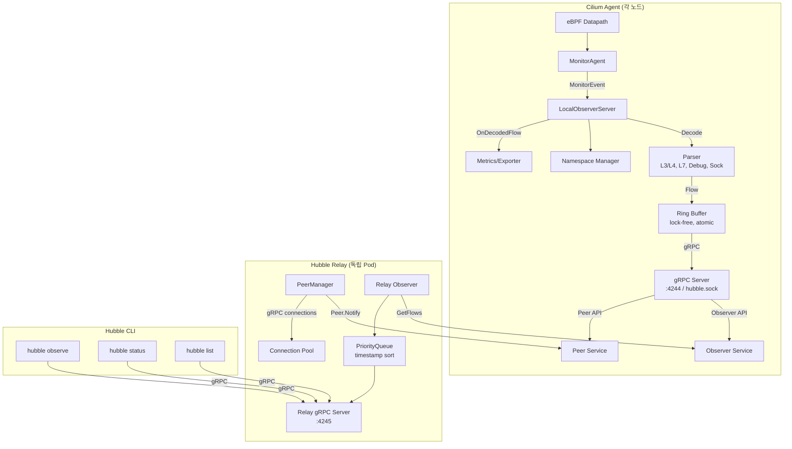

# 01. Hubble 아키텍처

## 개요

Hubble은 **CLI - Server(Observer) - Relay** 3계층 아키텍처로 구성된다.
각 Cilium 에이전트 노드에서 eBPF가 수집한 네트워크 이벤트를 Observer가 파싱하여 Ring Buffer에 저장하고,
gRPC 서비스를 통해 CLI와 Relay가 이를 소비한다.

## 3계층 아키텍처

```
+------------------------------------------------------------------+
|                        Hubble 3계층 구조                           |
+------------------------------------------------------------------+
|                                                                   |
|  [1계층] CLI (hubble 바이너리)                                     |
|  +---------------------------------------------------------+     |
|  | main.go -> cmd.Execute() -> cobra.Command               |     |
|  | Commands: observe, status, list, watch, record, config   |     |
|  | gRPC Client -> Hubble Server 또는 Relay에 연결             |     |
|  +---------------------------------------------------------+     |
|                          | gRPC (localhost:4245)                   |
|                          v                                        |
|  [2계층] Server (Cilium Agent 내장)                                |
|  +---------------------------------------------------------+     |
|  | LocalObserverServer                                      |     |
|  |   MonitorAgent -> events channel -> Parser -> Ring Buffer|     |
|  | gRPC Server (Observer + Peer 서비스)                      |     |
|  |   Unix Socket: /var/run/cilium/hubble.sock               |     |
|  |   TCP: 0.0.0.0:4244                                     |     |
|  +---------------------------------------------------------+     |
|                          | gRPC (peer:4244)                       |
|                          v                                        |
|  [3계층] Relay (독립 Pod)                                          |
|  +---------------------------------------------------------+     |
|  | PeerManager: 노드 발견, 연결 관리                          |     |
|  | Relay Observer: 다중노드 Flow 수집, PriorityQueue 정렬     |     |
|  | gRPC Server: 0.0.0.0:4245 (CLI 연결점)                   |     |
|  +---------------------------------------------------------+     |
|                                                                   |
+------------------------------------------------------------------+
```

## 1계층: CLI (Hubble 바이너리)

### 진입점

CLI는 독립 바이너리로, `main.go`에서 시작하여 Cobra 커맨드 트리를 실행한다.

```
// 소스: /Users/ywlee/hubble/main.go (Line 17-22)
func main() {
    if err := cmd.Execute(); err != nil {
        fmt.Fprintln(os.Stderr, err.Error())
        os.Exit(1)
    }
}
```

### 커맨드 트리 구성

`cmd.New()` 함수가 루트 커맨드를 생성하고, 하위 커맨드를 등록한다.

```
// 소스: hubble/cmd/root.go (Line 96-105)
rootCmd.AddCommand(
    cmdConfig.New(vp),     // config - 설정 관리
    list.New(vp),          // list - 노드/네임스페이스 목록
    observe.New(vp),       // observe - Flow 관찰 (핵심 커맨드)
    record.New(vp),        // record - Flow 녹화
    reflect.New(vp),       // reflect - gRPC 리플렉션
    status.New(vp),        // status - 서버 상태 조회
    version.New(),         // version - 버전 정보
    watch.New(vp),         // watch - 피어 상태 감시
)
```

### 초기화 흐름

```
main()
  -> cmd.Execute()
     -> cmd.New()
        -> NewWithViper(config.NewViper())
           1. cobra.OnInitialize: 설정 파일 로드, 로거 초기화, Basic Auth 설정
           2. PersistentPreRunE: 플래그 검증, conn.Init(gRPC 옵션 초기화)
           3. 하위 커맨드 등록 (observe, status, list, ...)
     -> rootCmd.Execute()
        -> 선택된 커맨드의 RunE 실행
           -> gRPC 연결 -> 서버 요청 -> 응답 출력
```

### gRPC 연결 설정

CLI는 `conn` 패키지를 통해 Hubble 서버에 연결한다. 기본 주소는 `localhost:4245` (Relay).

```
// 소스: hubble/cmd/common/conn/conn.go (Line 103-112)
func Init(vp *viper.Viper) error {
    for _, fn := range GRPCOptionFuncs {
        dialOpt, err := fn(vp)
        // ...
        grpcDialOptions = append(grpcDialOptions, dialOpt)
    }
    return nil
}
```

gRPC 옵션에는 TLS, Unary/Stream 인터셉터(타임아웃, 버전 검증), Basic Auth가 포함된다.

---

## 2계층: Server (Cilium Agent 내장)

### Hive Cell 통합

Hubble Server는 Cilium의 Hive 의존성 주입 프레임워크를 통해 시작된다.
`hubblecell.Cell`이 최상위 모듈이며, 여러 서브셀을 포함한다.

```
// 소스: cilium/pkg/hubble/cell/cell.go (Line 38-67)
var Cell = cell.Module(
    "hubble",
    "Exposes the Observer gRPC API and Hubble metrics",

    Core,               // HubbleIntegration (Observer 생성 및 실행)
    ConfigProviders,    // 설정 객체 제공
    certloaderGroup,    // TLS 인증서
    exportercell.Cell,  // Flow 로그 내보내기
    metricscell.Cell,   // Prometheus 메트릭
    dropeventemitter.Cell, // Drop 이벤트 emitter
    parsercell.Cell,    // Flow Parser
    namespace.Cell,     // 네임스페이스 모니터
    peercell.Cell,      // Peer 서비스
)
```

### HubbleIntegration

`hubbleParams` 구조체가 Hive DI를 통해 모든 의존성을 주입받는다.

```
// 소스: cilium/pkg/hubble/cell/cell.go (Line 77-109)
type hubbleParams struct {
    cell.In
    Logger             *slog.Logger
    JobGroup           job.Group
    IdentityAllocator  identitycell.CachingIdentityAllocator
    EndpointManager    endpointmanager.EndpointManager
    IPCache            *ipcache.IPCache
    MonitorAgent       monitorAgent.Agent
    PayloadParser      parser.Decoder
    NamespaceManager   namespace.Manager
    PeerService        *peer.Service
    // ...
}
```

`newHubbleIntegration` 함수가 `HubbleIntegration`을 생성하고, Hive Job으로 등록한다.

```
// 소스: cilium/pkg/hubble/cell/cell.go (Line 116-146)
func newHubbleIntegration(params hubbleParams) (HubbleIntegration, error) {
    h, err := createHubbleIntegration(...)
    params.JobGroup.Add(job.OneShot("hubble", func(ctx context.Context, _ cell.Health) error {
        return h.Launch(ctx)
    }))
    return h, nil
}
```

### LocalObserverServer

Observer는 Hubble의 핵심 컴포넌트로, MonitorEvent를 수신하여 파싱하고 Ring Buffer에 저장한다.

```
// 소스: cilium/pkg/hubble/observer/local_observer.go (Line 44-70)
type LocalObserverServer struct {
    ring             *container.Ring          // Flow를 저장하는 링 버퍼
    events           chan *observerTypes.MonitorEvent  // 이벤트 수신 채널
    stopped          chan struct{}
    payloadParser    parser.Decoder           // MonitorEvent -> Flow 변환
    opts             observeroption.Options   // Hook 함수 등 옵션
    numObservedFlows atomic.Uint64            // 관측된 Flow 수 카운터
    nsManager        namespace.Manager        // 네임스페이스 추적
}
```

### gRPC Server

gRPC Server가 Observer, Peer, Health 서비스를 등록하고 리스닝한다.

```
// 소스: cilium/pkg/hubble/server/server.go (Line 73-89)
func (s *Server) initGRPCServer() {
    srv := s.newGRPCServer()
    if s.opts.HealthService != nil {
        healthpb.RegisterHealthServer(srv, s.opts.HealthService)
    }
    if s.opts.ObserverService != nil {
        observerpb.RegisterObserverServer(srv, s.opts.ObserverService)
    }
    if s.opts.PeerService != nil {
        peerpb.RegisterPeerServer(srv, s.opts.PeerService)
    }
    reflection.Register(srv)
    s.srv = srv
}
```

---

## 3계층: Relay (독립 Pod)

### Relay Server 구조

Relay는 독립 Pod로 배포되며, 클러스터 내 모든 Hubble 노드의 Flow를 집계한다.

```
// 소스: cilium/pkg/hubble/relay/server/server.go (Line 52-59)
type Server struct {
    server           *grpc.Server       // CLI 대상 gRPC 서버
    grpcHealthServer *grpc.Server       // Health 전용 gRPC 서버
    pm               *pool.PeerManager  // 피어 연결 관리
    healthServer     *healthServer      // 헬스 체크
    metricsServer    *http.Server       // Prometheus 메트릭
    opts             options
}
```

### Relay 초기화 흐름

```
relay.New(options...)
  1. 옵션 적용 (TLS, 주소, gRPC 인터셉터 등)
  2. PeerManager 생성 (노드 발견/연결 관리)
  3. Relay Observer 생성 (다중노드 Flow 집계)
  4. gRPC 서버 설정
     - Observer 서비스 등록
     - Health 서비스 등록
     - gRPC 메트릭 등록
  5. 메트릭 서버 설정 (/metrics 엔드포인트)

relay.Serve()
  1. 메트릭 서버 시작 (HTTP)
  2. PeerManager 시작 (watchNotifications, manageConnections)
  3. Health 서버 시작
  4. gRPC 서버 시작 (TCP 리스닝)
```

```
// 소스: cilium/pkg/hubble/relay/server/server.go (Line 157-187)
func (s *Server) Serve() error {
    var eg errgroup.Group
    eg.Go(func() error { return s.metricsServer.ListenAndServe() })
    eg.Go(func() error {
        s.pm.Start()
        s.healthServer.start()
        socket, _ := net.Listen("tcp", s.opts.listenAddress)
        return s.server.Serve(socket)
    })
    eg.Go(func() error {
        socket, _ := net.Listen("tcp", s.opts.healthListenAddress)
        return s.grpcHealthServer.Serve(socket)
    })
    return eg.Wait()
}
```

---

## 컴포넌트 관계도



---

## Observer 이벤트 처리 루프

Observer의 `Start()` 메서드는 이벤트 처리의 핵심 루프이다.

```
// 소스: cilium/pkg/hubble/observer/local_observer.go (Line 116-197)
func (s *LocalObserverServer) Start() {
    ctx, cancel := context.WithCancel(context.Background())
    defer cancel()

nextEvent:
    for monitorEvent := range s.GetEventsChannel() {
        // 1. OnMonitorEvent Hook (전처리)
        for _, f := range s.opts.OnMonitorEvent {
            stop, err := f.OnMonitorEvent(ctx, monitorEvent)
            if stop { continue nextEvent }
        }

        // 2. 디코딩: MonitorEvent -> v1.Event (Flow/AgentEvent/DebugEvent)
        ev, err := s.payloadParser.Decode(monitorEvent)
        if err != nil { continue }

        // 3. Flow인 경우 네임스페이스 추적 + OnDecodedFlow Hook
        if flow, ok := ev.Event.(*flowpb.Flow); ok {
            s.trackNamespaces(flow)
            for _, f := range s.opts.OnDecodedFlow {
                stop, err := f.OnDecodedFlow(ctx, flow)
                if stop { continue nextEvent }
            }
            s.numObservedFlows.Add(1)
        }

        // 4. OnDecodedEvent Hook (메트릭, Export 등)
        for _, f := range s.opts.OnDecodedEvent {
            stop, err := f.OnDecodedEvent(ctx, ev)
            if stop { continue nextEvent }
        }

        // 5. Ring Buffer에 저장
        s.GetRingBuffer().Write(ev)
    }
    close(s.GetStopped())
}
```

### Hook 체인

Observer는 확장성을 위해 Hook 패턴을 사용한다.

| Hook | 시점 | 용도 |
|------|------|------|
| `OnMonitorEvent` | 디코딩 전 | 원시 이벤트 전처리 |
| `OnDecodedFlow` | Flow 디코딩 후 | 메트릭 수집, Drop 이벤트 emitter |
| `OnDecodedEvent` | 모든 이벤트 디코딩 후 | Flow Export, 로깅 |
| `OnFlowDelivery` | GetFlows 응답 시 | 전송 전 후처리 |
| `OnGetFlows` | GetFlows 요청 시 | 요청 컨텍스트 수정 |
| `OnBuildFilter` | 필터 빌드 시 | 커스텀 필터 추가 |
| `OnServerInit` | 서버 초기화 시 | 초기 설정 |

---

## 네트워크 통신 구조

### 프로토콜 및 포트

| 구간 | 프로토콜 | 주소 | 설명 |
|------|----------|------|------|
| CLI -> Relay | gRPC/TCP | `localhost:4245` | CLI 기본 연결 대상 |
| CLI -> Server | gRPC/Unix | `/var/run/cilium/hubble.sock` | 로컬 노드 직접 연결 |
| Relay -> Server | gRPC/TCP | `<node>:4244` | Relay가 각 노드에 연결 |
| Relay -> Peer Service | gRPC/Unix | `unix://...` (로컬) 또는 TCP | 피어 목록 조회 |

### TLS 설정

Hubble은 mTLS를 지원하며, 서버/클라이언트 모두 인증서를 사용할 수 있다.

```
Server TLS:
  - MinVersion: TLS 1.3
  - 서버 인증서 + CA

Client TLS (Relay -> Server):
  - ServerName: "<cluster>.<peer-service-name>.cilium.io"

CLI TLS:
  - --tls: TLS 활성화
  - --tls-ca-cert-files: CA 인증서
  - --tls-client-cert-file: 클라이언트 인증서
  - --tls-client-key-file: 클라이언트 키
  - --tls-server-name: 서버 이름 검증
```

---

## 왜 이런 아키텍처인가?

### 1. 왜 3계층으로 분리하는가?

- **로컬 성능**: Observer가 각 노드에 내장되어 eBPF 이벤트를 지연 없이 처리
- **확장성**: Relay가 노드 수에 관계없이 클러스터 전체 뷰 제공
- **유연성**: CLI가 직접 노드에 연결할 수도 있고, Relay를 통할 수도 있음

### 2. 왜 Cilium Agent에 내장하는가?

- eBPF MonitorAgent의 이벤트를 프로세스 내부 채널로 즉시 수신 (IPC 오버헤드 없음)
- Cilium의 Endpoint/Identity/IP Cache를 직접 참조하여 풍부한 메타데이터 부여
- Hive DI로 의존성을 깔끔하게 관리

### 3. 왜 Relay를 독립 Pod로 분리하는가?

- 다중노드 집계 로직이 Agent의 성능에 영향을 주지 않음
- Relay를 수평 확장 가능 (여러 Relay 인스턴스)
- CLI의 단일 진입점 제공 (포트 포워딩 또는 Ingress로 접근)

### 4. 왜 gRPC를 사용하는가?

- Protobuf로 구조화된 Flow 메시지를 효율적으로 직렬화/역직렬화
- 서버 스트리밍 RPC로 실시간 Flow 전달
- TLS/인터셉터/헬스체크 등 프로덕션 기능 내장
- 코드 생성으로 타입 안전성 확보
