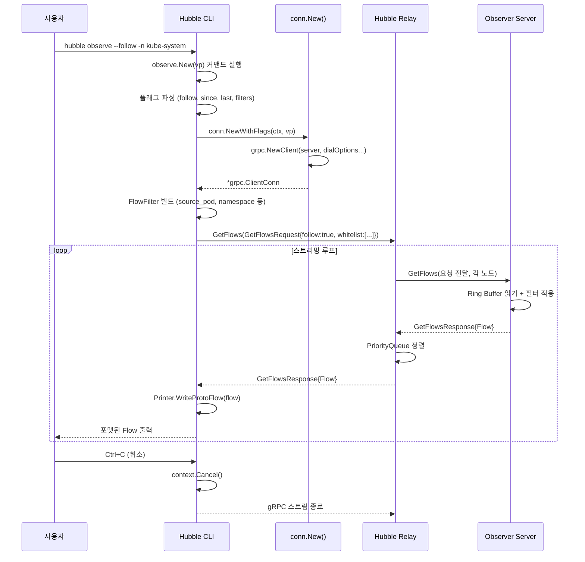
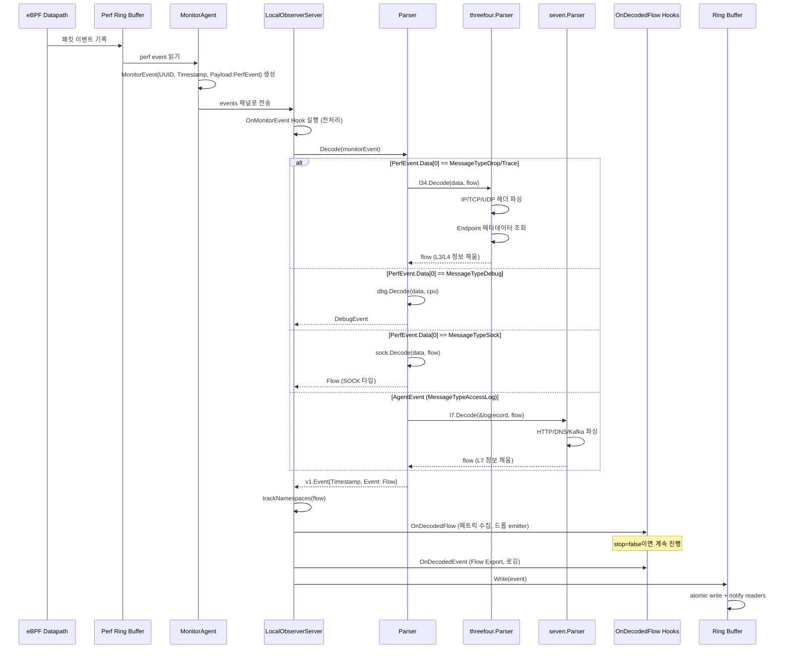
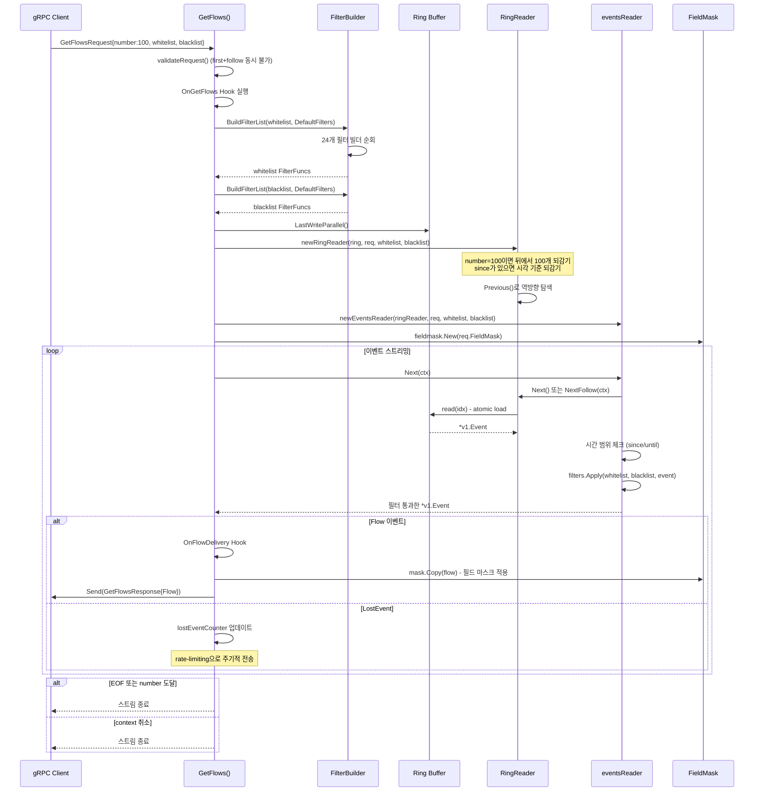
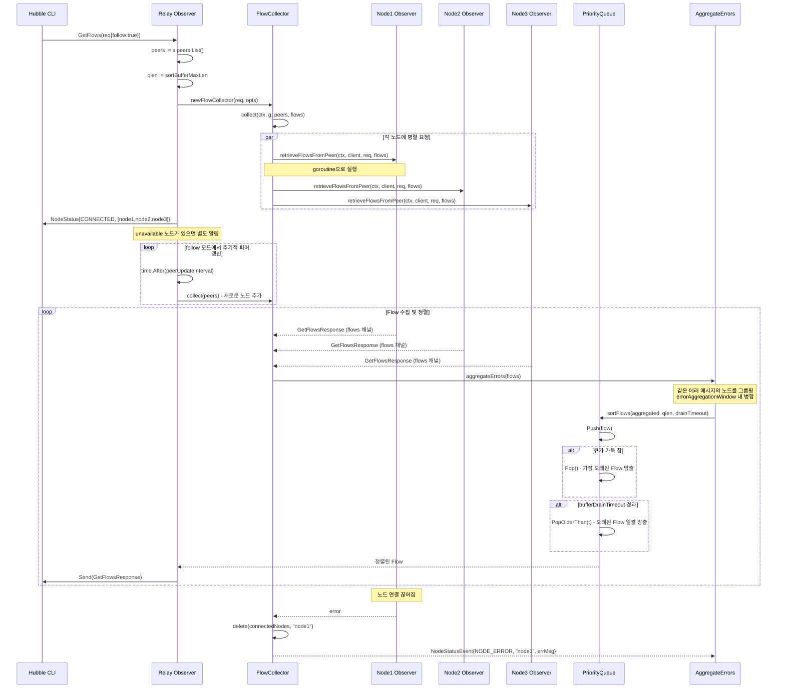
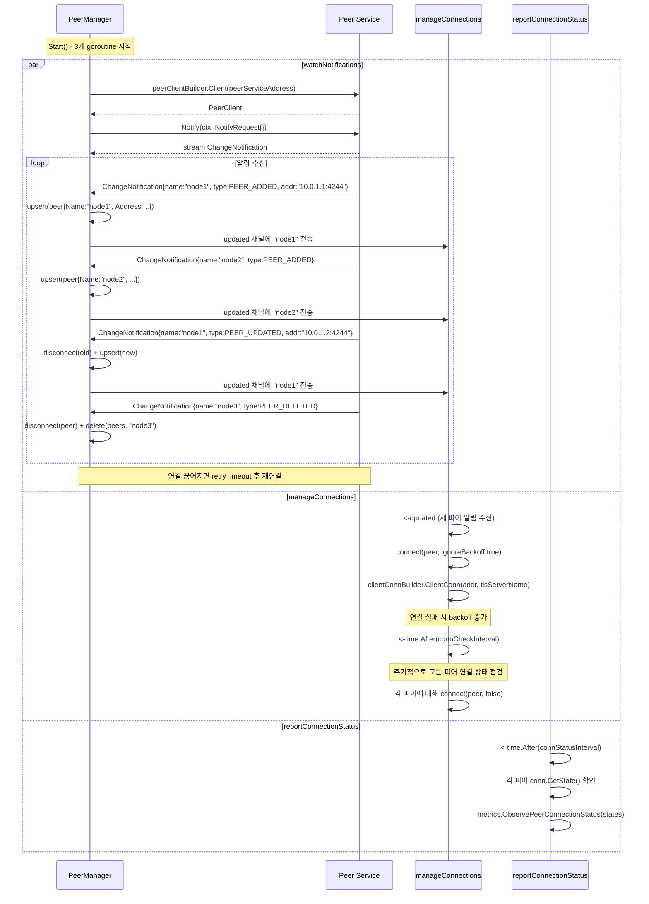
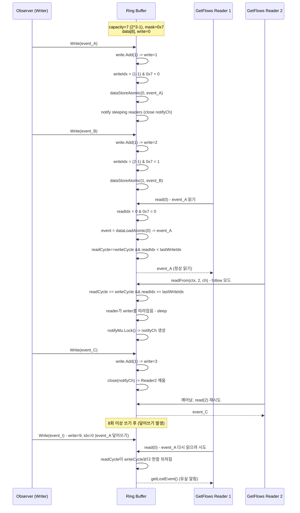
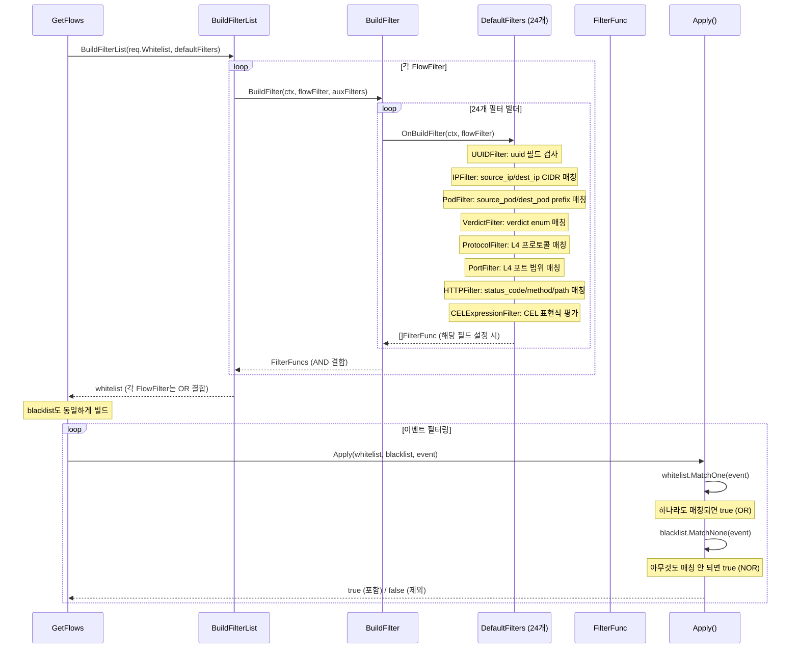
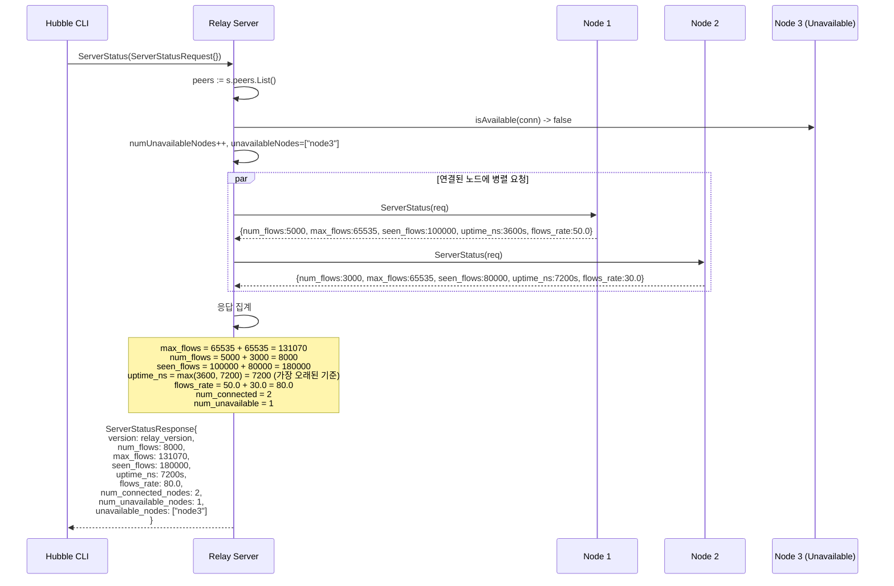
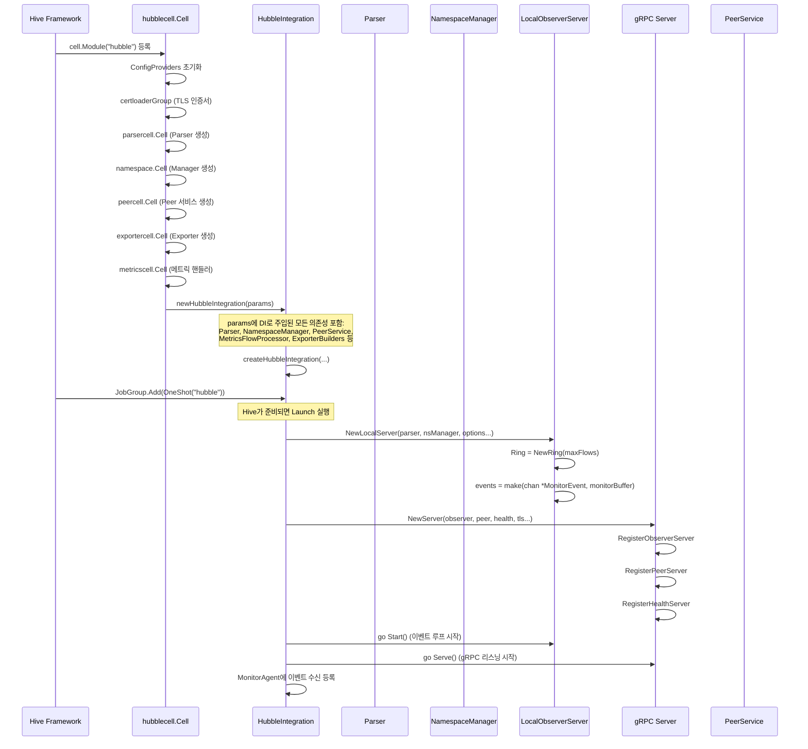

# 03. Hubble 시퀀스 다이어그램

## 개요

이 문서는 Hubble의 주요 유즈케이스를 Mermaid 시퀀스 다이어그램으로 표현한다.
실제 소스코드의 함수 호출 흐름을 기반으로 작성하였다.

---

## 1. hubble observe 요청 흐름

CLI에서 `hubble observe`를 실행하면 gRPC 스트리밍으로 Flow를 수신한다.



### 관련 소스

- CLI observe: `hubble/cmd/observe/observe.go`
- gRPC 연결: `hubble/cmd/common/conn/conn.go` (Line 114-122)
- GetFlows 서버: `cilium/pkg/hubble/observer/local_observer.go` (Line 260-428)

---

## 2. eBPF 이벤트 캡처 및 파싱

eBPF가 수집한 패킷 이벤트가 Observer를 거쳐 Ring Buffer에 저장되는 흐름.



### 관련 소스

- Observer Start: `cilium/pkg/hubble/observer/local_observer.go` (Line 116-197)
- Parser Decode: `cilium/pkg/hubble/parser/parser.go` (Line 100-204)
- Ring Write: `cilium/pkg/hubble/container/ring.go` (Line 168-190)

---

## 3. GetFlows 서버 측 처리

Observer가 GetFlows 요청을 받아 Ring Buffer에서 Flow를 읽어 스트리밍하는 상세 흐름.



### 관련 소스

- GetFlows: `cilium/pkg/hubble/observer/local_observer.go` (Line 260-428)
- eventsReader.Next: `cilium/pkg/hubble/observer/local_observer.go` (Line 648-701)
- newRingReader: `cilium/pkg/hubble/observer/local_observer.go` (Line 729-790)
- filters.Apply: `cilium/pkg/hubble/filters/filters.go` (Line 23-25)

---

## 4. Relay 다중노드 Flow 집계

Relay가 여러 노드에서 Flow를 수집하고, 타임스탬프 기반으로 정렬하여 클라이언트에 전달.



### 관련 소스

- Relay GetFlows: `cilium/pkg/hubble/relay/observer/server.go` (Line 62-125)
- flowCollector.collect: `cilium/pkg/hubble/relay/observer/observer.go` (Line 262-305)
- sortFlows: `cilium/pkg/hubble/relay/observer/observer.go` (Line 67-119)
- aggregateErrors: `cilium/pkg/hubble/relay/observer/observer.go` (Line 153-222)
- PriorityQueue: `cilium/pkg/hubble/relay/queue/priority_queue.go` (Line 19-105)

---

## 5. Peer Discovery (노드 발견)

PeerManager가 Peer 서비스를 통해 노드를 발견하고 gRPC 연결을 관리하는 흐름.



### 관련 소스

- PeerManager: `cilium/pkg/hubble/relay/pool/manager.go` (Line 32-68)
- watchNotifications: `cilium/pkg/hubble/relay/pool/manager.go` (Line 87-163)
- manageConnections: `cilium/pkg/hubble/relay/pool/manager.go` (Line 166-193)
- connect: `cilium/pkg/hubble/relay/pool/manager.go` (Line 311-349)

---

## 6. Ring Buffer 읽기/쓰기

Lock-free Ring Buffer의 동시 읽기/쓰기 시퀀스.



### 관련 소스

- Ring.Write: `cilium/pkg/hubble/container/ring.go` (Line 168-190)
- Ring.read: `cilium/pkg/hubble/container/ring.go` (Line 240-293)
- Ring.readFrom: `cilium/pkg/hubble/container/ring.go` (Line 297-398)
- RingReader.NextFollow: `cilium/pkg/hubble/container/ring_reader.go` (Line 76-122)

---

## 7. 필터 빌드 및 적용

GetFlows 요청의 whitelist/blacklist 필터가 빌드되고 적용되는 흐름.



### 필터 적용 로직

```
whitelist = [filter_A, filter_B]   // OR
blacklist = [filter_C]             // NOR

filter_A = {source_pod: "nginx", verdict: DROPPED}  // AND
  -> source_pod이 "nginx"이고 verdict가 DROPPED인 Flow

filter_B = {destination_ip: "10.0.0.0/8"}
  -> destination_ip가 10.0.0.0/8 대역인 Flow

결과: (filter_A 매칭 OR filter_B 매칭) AND (filter_C 비매칭)
```

### 관련 소스

- DefaultFilters: `cilium/pkg/hubble/filters/filters.go` (Line 127-155)
- BuildFilterList: `cilium/pkg/hubble/filters/filters.go` (Line 105-124)
- Apply: `cilium/pkg/hubble/filters/filters.go` (Line 23-25)
- MatchOne: `cilium/pkg/hubble/filters/filters.go` (Line 39-50)
- MatchNone: `cilium/pkg/hubble/filters/filters.go` (Line 54-65)

---

## 8. Relay ServerStatus 집계

Relay가 모든 노드의 ServerStatus를 수집하여 통합 응답을 반환하는 흐름.



### 관련 소스

- Relay ServerStatus: `cilium/pkg/hubble/relay/observer/server.go` (Line 247-336)

---

## 9. Hive Cell 초기화

Cilium Agent 시작 시 Hubble이 Hive Cell로 초기화되는 흐름.



### 관련 소스

- Cell 정의: `cilium/pkg/hubble/cell/cell.go` (Line 38-67)
- hubbleParams: `cilium/pkg/hubble/cell/cell.go` (Line 77-109)
- newHubbleIntegration: `cilium/pkg/hubble/cell/cell.go` (Line 116-146)
