# Istio 시퀀스 다이어그램 (Sequence Diagrams)

이 문서는 Istio의 핵심 동작 흐름을 시퀀스 다이어그램으로 상세히 분석한다. 각 흐름은 실제 소스코드의 함수 호출과 데이터 흐름을 기반으로 작성되었으며, 설계 결정의 "왜(Why)"를 함께 설명한다.

---

## 목차

1. [xDS 설정 푸시 흐름](#1-xds-설정-푸시-흐름)
2. [mTLS 핸드셰이크 흐름](#2-mtls-핸드셰이크-흐름)
3. [사이드카 인젝션 흐름](#3-사이드카-인젝션-흐름)
4. [서비스 디스커버리 흐름](#4-서비스-디스커버리-흐름)
5. [인증서 로테이션 흐름](#5-인증서-로테이션-흐름)
6. [Ambient 메시 트래픽 흐름](#6-ambient-메시-트래픽-흐름)

---

## 1. xDS 설정 푸시 흐름

Istiod(Pilot)가 설정 변경을 감지하고 연결된 모든 Envoy 프록시에 xDS 업데이트를 푸시하는 전체 흐름이다. 디바운싱 메커니즘을 통해 대규모 설정 변경 시 과도한 푸시를 방지한다.

### 소스 파일 참조

| 파일 | 역할 |
|------|------|
| `pilot/pkg/xds/discovery.go` | DiscoveryServer, 디바운스, Push 로직 |
| `pilot/pkg/xds/ads.go` | ADS 스트림, pushConnection, PushOrder |
| `pilot/pkg/features/tuning.go` | 디바운스 기본값 정의 |

### 1.1 전체 흐름 개요

```
설정 변경 → ConfigUpdate() → pushChannel → debounce() → Push() → PushContext 재빌드
    → AdsPushAll() → StartPush() → PushQueue → doSendPushes() → pushConnection()
    → watchedResourcesByOrder() → CDS→EDS→LDS→RDS→SDS 순서로 gRPC 스트림 전송
```

### 1.2 Mermaid 시퀀스 다이어그램

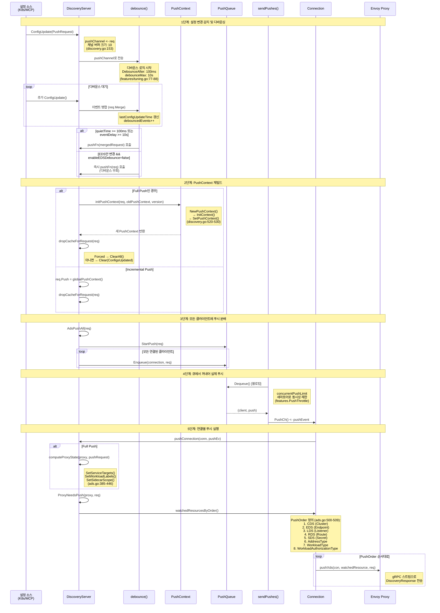

### 1.3 디바운스 메커니즘 상세

디바운스는 짧은 시간 내에 다수의 설정 변경이 발생할 때 이를 하나의 푸시로 합치는 핵심 최적화이다.

```
시간축 →

이벤트:  E1    E2  E3        E4
         │     │   │          │
         ▼     ▼   ▼          ▼
    ─────●─────●───●──────────●────────────────────────────
         │                    │
         │←─ DebounceAfter ──→│←─ DebounceAfter(100ms) ──→│
         │    (100ms)         │   조용한 시간 확보          │
         │                    │                            PUSH!
         │
         │←─────────── debounceMax (10s) ──────────────→│
                  최대 대기 시간 초과 시 강제 PUSH
```

**디바운스 상태 머신:**

```
                    ┌──────────────────────────┐
                    │                          │
                    ▼                          │
              ┌──────────┐    이벤트 수신     │
   이벤트 →   │   대기   │───────────────────┘
              │  (idle)  │    타이머 리셋
              └────┬─────┘
                   │
          timeChan │ 만료
                   │
              ┌────▼─────┐
              │ pushWorker│
              │  판단    │
              └────┬─────┘
                   │
          ┌────────┼────────┐
          │                 │
    quietTime >=       eventDelay >=
    DebounceAfter      debounceMax
          │                 │
          ▼                 ▼
    ┌───────────┐    ┌───────────┐
    │   PUSH    │    │ 강제 PUSH │
    │ (정상)    │    │ (타임아웃)│
    └───────────┘    └───────────┘
```

소스코드의 핵심 로직 (`discovery.go:364-388`):

```go
pushWorker := func() {
    eventDelay := time.Since(startDebounce)
    quietTime := time.Since(lastConfigUpdateTime)
    // 충분히 조용하거나 최대 대기 시간 초과
    if eventDelay >= opts.debounceMax || quietTime >= opts.DebounceAfter {
        if req != nil {
            free = false
            go push(req, debouncedEvents, startDebounce)
            req = nil
            debouncedEvents = 0
        }
    } else {
        timeChan = time.After(opts.DebounceAfter - quietTime)
    }
}
```

### 1.4 푸시 순서가 중요한 이유

`PushOrder`가 `CDS -> EDS -> LDS -> RDS -> SDS` 순서인 이유:

| 순서 | 타입 | 이유 |
|------|------|------|
| 1 | CDS (Cluster) | 업스트림 클러스터 정의가 먼저 있어야 함 |
| 2 | EDS (Endpoint) | 클러스터의 실제 엔드포인트 주소 |
| 3 | LDS (Listener) | 리스너가 클러스터를 참조 |
| 4 | RDS (Route) | 라우트가 리스너와 클러스터를 연결 |
| 5 | SDS (Secret) | TLS 인증서, 마지막에 적용해도 무방 |

이 순서를 지키지 않으면 Envoy가 아직 존재하지 않는 클러스터를 참조하는 리스너를 받게 되어 일시적으로 트래픽 라우팅이 실패할 수 있다.

### 1.5 동시성 제어

```
                    ┌─────────────────────────────┐
                    │  concurrentPushLimit         │
                    │  (semaphore channel)         │
                    │  크기: features.PushThrottle  │
                    └──────────┬──────────────────┘
                               │
               ┌───────────────┼───────────────┐
               │               │               │
          ┌────▼───┐     ┌────▼───┐     ┌────▼───┐
          │Push #1 │     │Push #2 │     │Push #3 │
          │(진행중)│     │(진행중)│     │(대기중)│
          └────┬───┘     └────┬───┘     └────────┘
               │               │
               ▼               ▼
          ┌────────┐     ┌────────┐
          │Envoy A │     │Envoy B │
          └────────┘     └────────┘
```

`doSendPushes()` 함수 (`discovery.go:469-513`)에서 세마포어 채널을 사용하여 동시 푸시 수를 제한한다. 푸시 완료 시 `doneFunc()`이 세마포어를 해제하고 `PushQueue.MarkDone()`을 호출한다.

---

## 2. mTLS 핸드셰이크 흐름

Istio 서비스 메시에서 두 워크로드 간 mTLS 통신이 성립되는 전체 흐름이다. iptables 투명 가로채기부터 SPIFFE 인증서 검증까지 포함한다.

### 소스 파일 참조

| 파일 | 역할 |
|------|------|
| `security/pkg/nodeagent/sds/sdsservice.go` | SDS 서비스, 인증서 스트리밍 |
| `security/pkg/nodeagent/cache/secretcache.go` | 인증서 캐시, CSR 생성 |
| `security/pkg/pki/ca/ca.go` | Istiod CA, 인증서 서명 |
| `security/pkg/nodeagent/caclient/providers/citadel/client.go` | CA 클라이언트 |

### 2.1 전체 통신 흐름

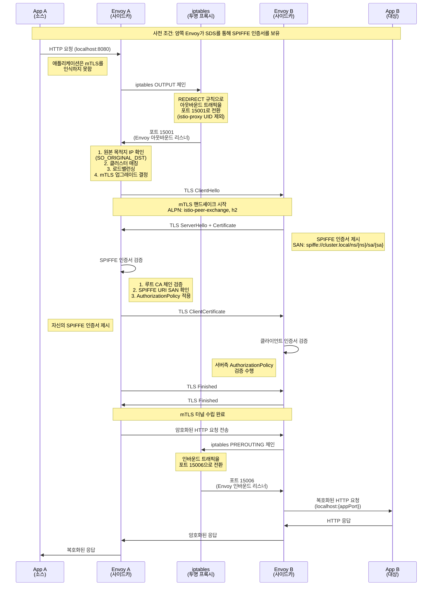

### 2.2 인증서 발급 흐름

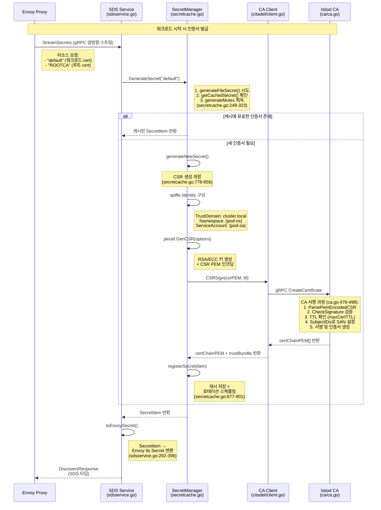

### 2.3 iptables 규칙 구조

```
                        ┌─────────────────────────────────────────┐
                        │              Pod Network Namespace       │
                        │                                         │
   Inbound Traffic      │    ┌──────────────────────────┐         │
  ────────────────────► │    │  PREROUTING (nat)         │         │
                        │    │                           │         │
                        │    │  ISTIO_INBOUND 체인       │         │
                        │    │  ┌───────────────────┐   │         │
                        │    │  │ 포트 15008 제외    │   │         │
                        │    │  │ 포트 15090 제외    │   │         │
                        │    │  │ 포트 15021 제외    │   │         │
                        │    │  │ 나머지 → 15006    │   │         │
                        │    │  └───────────────────┘   │         │
                        │    └──────────────────────────┘         │
                        │                                         │
                        │    ┌─────────┐     ┌──────────┐         │
                        │    │ Envoy   │     │  App     │         │
                        │    │ 15006   │────►│ :{port}  │         │
                        │    │ (인바운드)│     │          │         │
                        │    │         │     │          │         │
                        │    │ 15001   │◄────│          │         │
                        │    │(아웃바운드)│     │          │         │
                        │    └────┬────┘     └──────────┘         │
                        │         │                               │
                        │    ┌────▼─────────────────────┐         │
                        │    │  OUTPUT (nat)             │         │
                        │    │                           │         │
                        │    │  ISTIO_OUTPUT 체인        │         │
                        │    │  ┌───────────────────┐   │         │
                        │    │  │ istio-proxy UID    │   │         │
                        │    │  │ 에서 보낸 트래픽   │   │         │
                        │    │  │ → RETURN (우회)    │   │         │
                        │    │  │                   │   │         │
                        │    │  │ 나머지 앱 트래픽   │   │         │
                        │    │  │ → REDIRECT 15001  │   │         │
                        │    │  └───────────────────┘   │         │
                        │    └──────────────────────────┘         │
   Outbound Traffic     │                                         │
  ◄──────────────────── │                                         │
                        └─────────────────────────────────────────┘
```

### 2.4 SPIFFE 인증서 구조

```
X.509 Certificate:
├── Subject: O=<trust-domain>
├── Subject Alternative Name (SAN):
│   └── URI: spiffe://cluster.local/ns/default/sa/my-service
├── Key Usage: Digital Signature, Key Encipherment
├── Extended Key Usage: Server Auth, Client Auth
├── Issuer: Istiod CA (self-signed 또는 plugged-in)
└── Validity:
    ├── Not Before: <발급시간>
    └── Not After: <발급시간 + SecretTTL>
```

---

## 3. 사이드카 인젝션 흐름

Kubernetes의 Mutating Admission Webhook을 이용해 Pod 생성 시 자동으로 Envoy 사이드카 컨테이너를 주입하는 흐름이다.

### 소스 파일 참조

| 파일 | 역할 |
|------|------|
| `pkg/kube/inject/webhook.go` | Webhook 서버, inject(), injectPod(), createPatch() |
| `pkg/kube/inject/inject.go` | injectRequired(), RunTemplate() |

### 3.1 전체 인젝션 흐름

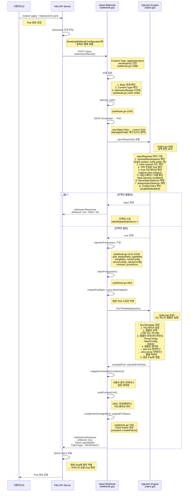

### 3.2 인젝션 결정 흐름도

```
                      Pod 생성 요청
                           │
                           ▼
                ┌─────────────────────┐
                │ IgnoredNamespaces?  │──── Yes ──→ SKIP
                │ (kube-system 등)    │
                └──────────┬──────────┘
                           │ No
                           ▼
                ┌─────────────────────┐
                │ Host Network 모드?  │──── Yes ──→ SKIP
                └──────────┬──────────┘
                           │ No
                           ▼
                ┌─────────────────────┐
                │ 이미 사이드카 존재? │──── Yes ──→ SKIP
                │ (istio-proxy 확인)  │
                └──────────┬──────────┘
                           │ No
                           ▼
                ┌─────────────────────┐
                │ Pod 어노테이션      │
                │ sidecar.istio.io/   │
                │ inject = "false"?   │──── Yes ──→ SKIP
                └──────────┬──────────┘
                           │ No/"true"/없음
                           ▼
                ┌─────────────────────┐
                │ NeverInjectSelector │──── 매칭 ──→ SKIP
                │ 라벨 매칭?          │
                └──────────┬──────────┘
                           │ 불일치
                           ▼
                ┌─────────────────────┐
                │ AlwaysInjectSelector│──── 매칭 ──→ INJECT
                │ 라벨 매칭?          │
                └──────────┬──────────┘
                           │ 불일치
                           ▼
                ┌─────────────────────┐
                │ Namespace 라벨      │
                │ istio-injection=    │
                │ enabled?            │──── Yes ──→ INJECT
                │ 또는 istio.io/rev   │
                │ 매칭?               │
                └──────────┬──────────┘
                           │ No
                           ▼
                ┌─────────────────────┐
                │ Config.Policy =     │──── Yes ──→ INJECT
                │ enabled?            │
                └──────────┬──────────┘
                           │ No
                           ▼
                         SKIP
```

### 3.3 주입되는 컨테이너 구조

```
Pod (인젝션 후)
├── initContainers:
│   └── istio-init                          ← iptables 규칙 설정
│       ├── image: proxyv2
│       ├── command: ["istio-iptables"]
│       └── securityContext:
│           └── capabilities: [NET_ADMIN, NET_RAW]
│
├── containers:
│   ├── {원본 앱 컨테이너}
│   └── istio-proxy                         ← Envoy 사이드카
│       ├── image: proxyv2
│       ├── ports: [15090(prometheus), 15021(healthz)]
│       ├── env: [ISTIO_META_*, POD_NAME, POD_NAMESPACE, ...]
│       ├── volumeMounts:
│       │   ├── istio-envoy (emptyDir)      ← Envoy 설정 + UDS
│       │   ├── istio-data (emptyDir)       ← 런타임 데이터
│       │   ├── istio-token (projected)     ← ServiceAccount 토큰
│       │   └── istiod-ca-cert (configMap)  ← CA 루트 인증서
│       └── readinessProbe: /healthz/ready:15021
│
└── volumes:
    ├── istio-envoy (emptyDir, medium: Memory)
    ├── istio-data (emptyDir)
    ├── istio-token (projected serviceAccountToken)
    └── istiod-ca-cert (configMap: istio-ca-root-cert)
```

### 3.4 JSON Patch 예시

`createPatch()` 함수 (`webhook.go:726-743`)가 생성하는 패치 형식:

```json
[
  {
    "op": "add",
    "path": "/spec/initContainers",
    "value": [{"name": "istio-init", ...}]
  },
  {
    "op": "add",
    "path": "/spec/containers/-",
    "value": {"name": "istio-proxy", ...}
  },
  {
    "op": "add",
    "path": "/spec/volumes/-",
    "value": {"name": "istio-envoy", ...}
  },
  {
    "op": "add",
    "path": "/metadata/labels/security.istio.io~1tlsMode",
    "value": "istio"
  },
  {
    "op": "add",
    "path": "/metadata/annotations/sidecar.istio.io~1status",
    "value": "{\"initContainers\":[\"istio-init\"],\"containers\":[\"istio-proxy\"],...}"
  }
]
```

---

## 4. 서비스 디스커버리 흐름

Kubernetes 서비스/엔드포인트 변경이 Informer를 통해 감지되고, Istio 내부 모델로 변환되어 xDS 푸시로 이어지는 흐름이다.

### 소스 파일 참조

| 파일 | 역할 |
|------|------|
| `pilot/pkg/serviceregistry/kube/controller/controller.go` | K8s 서비스 레지스트리 컨트롤러 |
| `pilot/pkg/serviceregistry/kube/conversion.go` | K8s 서비스 → Istio 모델 변환 |
| `pilot/pkg/xds/discovery.go` | ConfigUpdate 수신, xDS 푸시 트리거 |

### 4.1 서비스 이벤트 처리 흐름

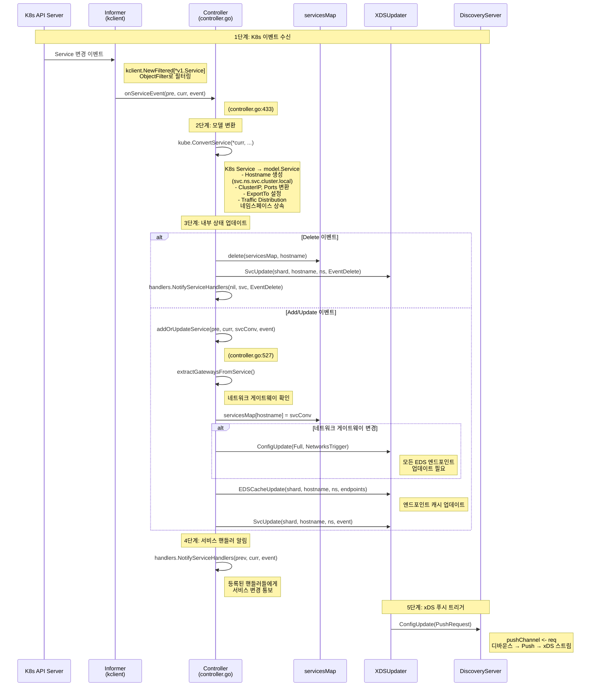

### 4.2 엔드포인트 변경 흐름

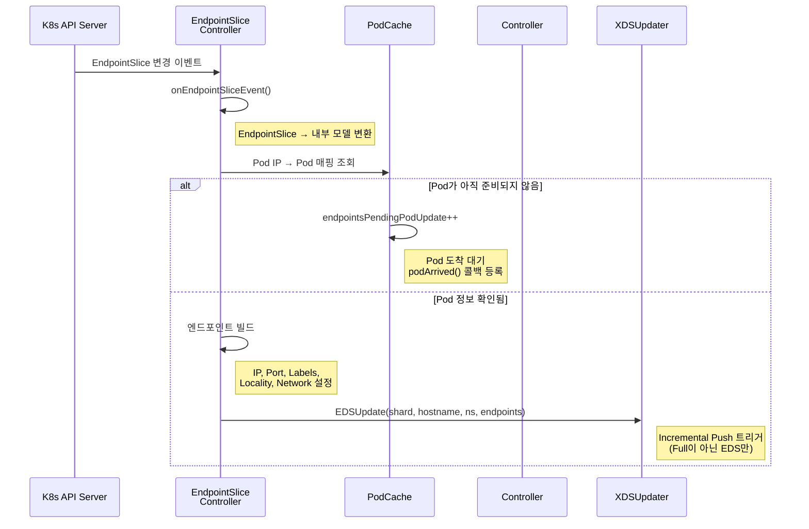

### 4.3 서비스 레지스트리 아키텍처

```
                     ┌─────────────────────────────┐
                     │     Aggregate Controller     │
                     │   (여러 레지스트리 통합)       │
                     └──────────┬──────────────────┘
                                │
              ┌─────────────────┼─────────────────┐
              │                 │                  │
     ┌────────▼──────┐  ┌──────▼──────┐   ┌──────▼──────┐
     │ K8s Controller │  │ K8s Controller│  │ServiceEntry │
     │ (Cluster A)   │  │ (Cluster B)  │  │ Controller  │
     └───────┬───────┘  └──────┬───────┘  └──────┬──────┘
             │                  │                  │
     ┌───────▼───────┐  ┌──────▼───────┐         │
     │  Informers    │  │  Informers   │         │
     │ ┌───────────┐ │  │ ┌───────────┐│         │
     │ │ Services  │ │  │ │ Services  ││         │
     │ │ Endpoints │ │  │ │ Endpoints ││         │
     │ │ Pods      │ │  │ │ Pods      ││         │
     │ │ Nodes     │ │  │ │ Nodes     ││         │
     │ └───────────┘ │  │ └───────────┘│         │
     └───────┬───────┘  └──────┬───────┘         │
             │                  │                  │
             ▼                  ▼                  ▼
     ┌─────────────────────────────────────────────┐
     │              servicesMap                     │
     │  map[host.Name]*model.Service               │
     │                                             │
     │  "svc-a.ns.svc.cluster.local" → Service{}   │
     │  "svc-b.ns.svc.cluster.local" → Service{}   │
     └─────────────────────────────────────────────┘
             │
             ▼
     ┌──────────────────┐
     │  XDSUpdater      │
     │  → ConfigUpdate  │
     │  → EDSUpdate     │
     │  → SvcUpdate     │
     └──────────────────┘
```

### 4.4 서비스 변환 테이블

K8s Service가 Istio 내부 모델로 변환되는 필드 매핑:

| K8s Service 필드 | Istio model.Service 필드 | 설명 |
|------------------|--------------------------|------|
| `metadata.name` + `metadata.namespace` | `Hostname` | `{name}.{ns}.svc.{domain}` 형식 |
| `spec.clusterIP` | `DefaultAddress` | 클러스터 IP |
| `spec.ports[]` | `Ports[]` | 포트, 프로토콜 변환 |
| `spec.type=LoadBalancer` | `ClusterExternalAddresses` | 외부 IP/호스트네임 |
| `spec.externalIPs` | `ClusterExternalAddresses` | 외부 IP 목록 |
| `metadata.labels` | `Attributes.Labels` | 서비스 라벨 |
| `metadata.annotations[networking.istio.io/exportTo]` | `Attributes.ExportTo` | 가시성 범위 |

---

## 5. 인증서 로테이션 흐름

워크로드 인증서의 만료 전 자동 갱신 메커니즘이다. Grace Period 비율과 Jitter를 활용하여 대규모 플릿에서 동시 갱신으로 인한 부하 집중을 방지한다.

### 소스 파일 참조

| 파일 | 역할 |
|------|------|
| `security/pkg/nodeagent/cache/secretcache.go` | 로테이션 타이밍, 캐시 관리 |
| `security/pkg/nodeagent/sds/sdsservice.go` | SDS 푸시 |
| `pilot/cmd/pilot-agent/options/options.go` | 로테이션 파라미터 기본값 |

### 5.1 인증서 로테이션 전체 흐름

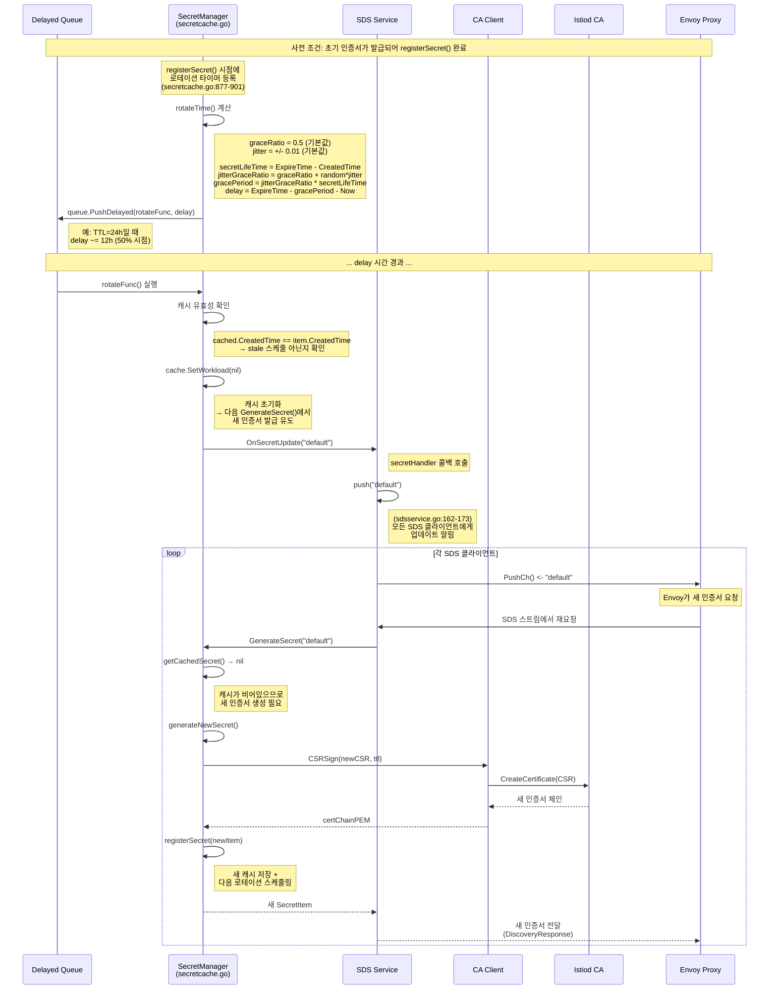

### 5.2 로테이션 타이밍 계산

`rotateTime()` 함수의 동작 (`secretcache.go:858-875`):

```
인증서 타임라인 (TTL = 24시간 기준, graceRatio = 0.5):

발급시간                                              만료시간
  │                                                      │
  ▼                                                      ▼
  ├──────────────────────────────────────────────────────┤
  │                    24시간 (TTL)                       │
  │                                                      │
  │              ┌──── Grace Period (12h) ───────────────┤
  │              │    (= TTL * graceRatio)               │
  │              │                                       │
  │◄─ delay ───►│                                       │
  │  (~12시간)   │                                       │
  │              │                                       │
  │         로테이션                                    만료
  │          시점                                       시점

  * jitter (+-0.01)로 실제 로테이션 시점은 약간씩 다름
  * 이를 통해 대규모 플릿에서 동시 갱신 방지
```

**Jitter 분포 예시 (1000개 워크로드):**

```
로테이션 시점 분포 (graceRatio=0.5, jitter=0.01):

빈도
  │
  │          ████
  │         ██████
  │        ████████
  │       ██████████
  │      ████████████
  │     ██████████████
  │    ████████████████
  │   ██████████████████
  │  ████████████████████
  └──┼────┼────┼────┼────┼── 시간
     49%  49.5% 50%  50.5% 51%
              TTL 경과 비율
```

### 5.3 로테이션 상태 머신

```
                    ┌───────────────────┐
                    │   VALID           │
                    │ (인증서 유효)      │
                    └────────┬──────────┘
                             │
                    delay 만료 (PushDelayed 트리거)
                             │
                    ┌────────▼──────────┐
                    │  ROTATING         │
                    │ cache.SetWorkload │
                    │     (nil)         │
                    └────────┬──────────┘
                             │
                    OnSecretUpdate("default")
                             │
                    ┌────────▼──────────┐
                    │  CSR_PENDING      │
                    │ generateNewSecret │
                    │ → CSRSign()       │
                    └────────┬──────────┘
                             │
                    ┌────────┼────────┐
                    │                 │
               성공 │            실패 │
                    │                 │
           ┌───────▼───────┐  ┌──────▼───────┐
           │ RENEWED        │  │ RETRY        │
           │ registerSecret │  │ backoff 후   │
           │ → 새 캐시 저장 │  │ 재시도       │
           │ → 새 타이머    │  └──────────────┘
           └───────┬───────┘
                   │
                   ▼
           ┌───────────────┐
           │   VALID       │ (순환 반복)
           └───────────────┘
```

### 5.4 파일 기반 인증서 감시

파일 마운트된 인증서의 경우 로테이션 대신 파일 변경 감시를 사용한다:

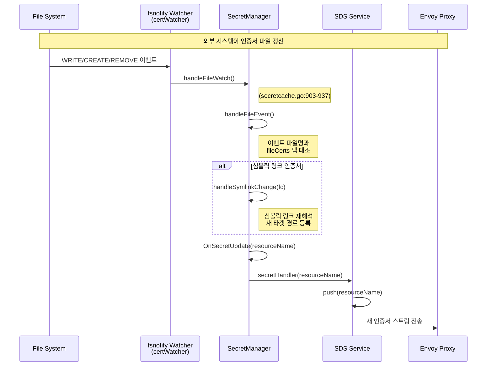

---

## 6. Ambient 메시 트래픽 흐름

Ambient 모드는 사이드카 없이 ztunnel(L4 프록시)과 선택적 waypoint 프록시(L7)를 사용하여 메시 기능을 제공한다.

### 소스 파일 참조

| 파일 | 역할 |
|------|------|
| `pilot/pkg/serviceregistry/kube/controller/controller.go` | Ambient 인덱스 초기화 |
| `pilot/pkg/serviceregistry/kube/controller/ambient/` | Ambient 워크로드/정책 인덱스 |
| `pilot/pkg/xds/ads.go` | WorkloadType, WorkloadAuthorizationType |

### 6.1 사이드카 모드 vs Ambient 모드 비교

```
사이드카 모드:                    Ambient 모드:

┌────────────────┐              ┌────────────────┐
│     Pod A      │              │     Pod A      │
│ ┌────────────┐ │              │ ┌────────────┐ │
│ │   App      │ │              │ │   App      │ │
│ └─────┬──────┘ │              │ └─────┬──────┘ │
│       │        │              │       │        │
│ ┌─────▼──────┐ │              └───────┼────────┘
│ │ Envoy      │ │                      │
│ │ (sidecar)  │ │              ┌───────▼────────┐
│ └─────┬──────┘ │              │   ztunnel      │
└───────┼────────┘              │  (노드 레벨    │
        │                       │   L4 프록시)   │
     mTLS                       └───────┬────────┘
        │                               │
┌───────▼────────┐              ┌───────▼────────┐
│     Pod B      │              │  HBONE 터널    │
│ ┌────────────┐ │              │  (mTLS over    │
│ │ Envoy      │ │              │   HTTP/2)      │
│ │ (sidecar)  │ │              │  포트: 15008   │
│ └─────┬──────┘ │              └───────┬────────┘
│       │        │                      │
│ ┌─────▼──────┐ │              ┌───────▼────────┐
│ │   App      │ │              │   ztunnel      │
│ └────────────┘ │              │  (대상 노드)    │
└────────────────┘              └───────┬────────┘
                                        │
                                ┌───────▼────────┐
                                │     Pod B      │
                                │ ┌────────────┐ │
                                │ │   App      │ │
                                │ └────────────┘ │
                                └────────────────┘
```

### 6.2 Ambient L4 전용 흐름 (ztunnel-to-ztunnel)

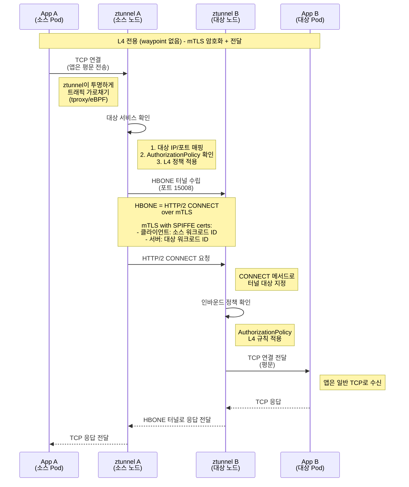

### 6.3 Ambient L7 흐름 (Waypoint 프록시 포함)

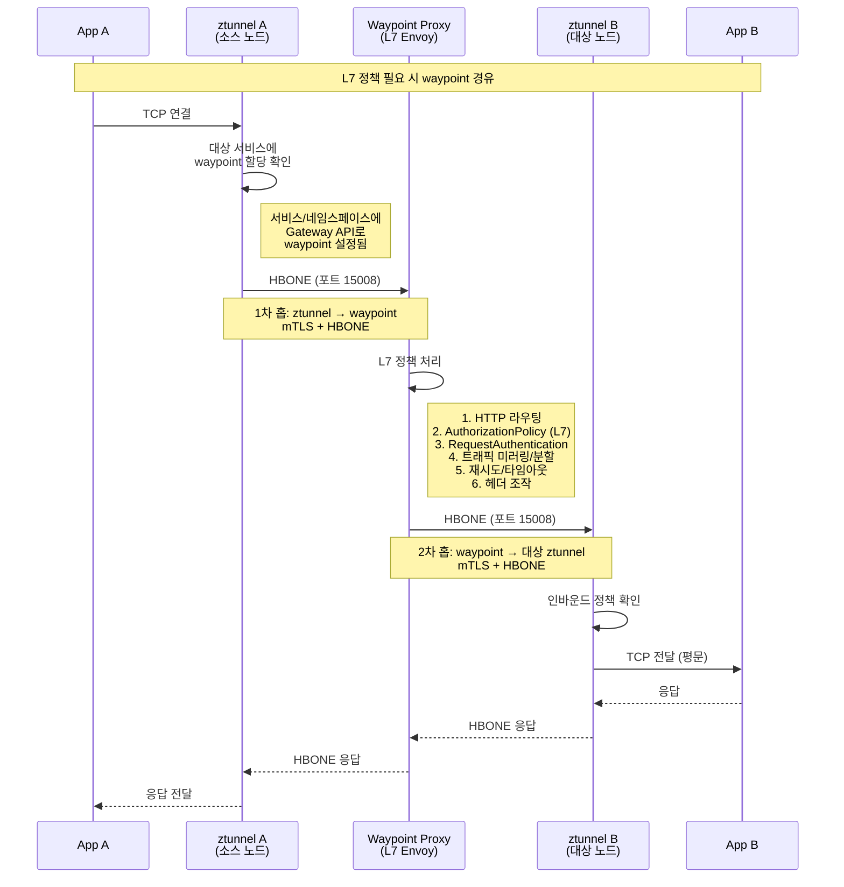

### 6.4 HBONE 터널 프로토콜 구조

```
┌──────────────────────────────────────────────┐
│                  TCP 연결                     │
│  ┌──────────────────────────────────────────┐│
│  │              TLS (mTLS)                  ││
│  │  SPIFFE 인증서 기반 상호 인증             ││
│  │  ┌──────────────────────────────────────┐││
│  │  │         HTTP/2 프레임                │││
│  │  │  ┌──────────────────────────────────┐│││
│  │  │  │    CONNECT 메서드                ││││
│  │  │  │    :authority = target:port      ││││
│  │  │  │    ┌────────────────────────────┐││││
│  │  │  │    │    원본 TCP 페이로드       │││││
│  │  │  │    │    (앱 데이터)             │││││
│  │  │  │    └────────────────────────────┘││││
│  │  │  └──────────────────────────────────┘│││
│  │  └──────────────────────────────────────┘││
│  └──────────────────────────────────────────┘│
└──────────────────────────────────────────────┘

포트 할당:
- 15001: ztunnel 아웃바운드 (소스측 트래픽 가로채기)
- 15008: HBONE 터널 수신 포트 (mTLS over HTTP/2 CONNECT)
- 15006: 인바운드 (사이드카 모드에서 사용)
```

### 6.5 ztunnel의 xDS 리소스

ztunnel은 사이드카 Envoy와 다른 xDS 리소스 타입을 사용한다:

```
사이드카 Envoy가 사용하는 xDS:     ztunnel이 사용하는 xDS:
┌──────────────────────┐         ┌──────────────────────────┐
│ CDS (Cluster)        │         │ AddressType              │
│ EDS (Endpoint)       │         │ - 서비스 VIP 매핑         │
│ LDS (Listener)       │         │                          │
│ RDS (Route)          │         │ WorkloadType             │
│ SDS (Secret)         │         │ - Pod/VM 워크로드 정보    │
│                      │         │ - UID, IP, waypoint 연결  │
│                      │         │                          │
│                      │         │ WorkloadAuthorizationType│
│                      │         │ - L4 인가 정책            │
│                      │         │                          │
│                      │         │ SDS (Secret)             │
│                      │         │ - mTLS 인증서             │
└──────────────────────┘         └──────────────────────────┘
```

`PushOrder` (`ads.go:500-509`)에서 이러한 리소스 타입들의 순서가 정의되어 있다:

```go
var PushOrder = []string{
    v3.ClusterType,               // CDS
    v3.EndpointType,              // EDS
    v3.ListenerType,              // LDS
    v3.RouteType,                 // RDS
    v3.SecretType,                // SDS
    v3.AddressType,               // Ambient: 주소 매핑
    v3.WorkloadType,              // Ambient: 워크로드 정보
    v3.WorkloadAuthorizationType, // Ambient: L4 인가 정책
}
```

### 6.6 Ambient 모드 활성화 흐름

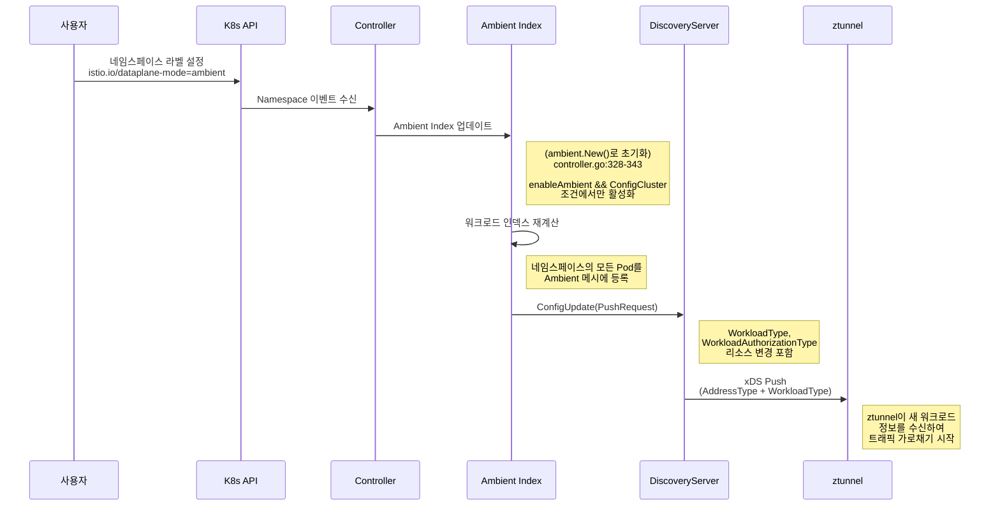

---

## 흐름 간 관계 요약

다음 ASCII 다이어그램은 6개 핵심 흐름이 어떻게 연결되는지 보여준다:

```
    ┌─────────────────────────────────────────────────────────────────┐
    │                        Istiod (Control Plane)                  │
    │                                                                │
    │  ┌──────────────┐  ┌──────────────┐  ┌──────────────────┐     │
    │  │  Webhook     │  │ Service      │  │  CA (Citadel)    │     │
    │  │  Injection   │  │ Discovery    │  │  인증서 서명      │     │
    │  │  [흐름 3]    │  │ [흐름 4]     │  │  [흐름 2,5]      │     │
    │  └──────┬───────┘  └──────┬───────┘  └────────┬─────────┘     │
    │         │                  │                    │               │
    │         │           ┌──────▼───────┐           │               │
    │         │           │ Discovery    │           │               │
    │         │           │ Server       │           │               │
    │         │           │ xDS Push     │           │               │
    │         │           │ [흐름 1]     │           │               │
    │         │           └──────┬───────┘           │               │
    └─────────┼──────────────────┼───────────────────┼───────────────┘
              │                  │                    │
              │          gRPC xDS 스트림              │ gRPC CSR
              │                  │                    │
    ┌─────────▼──────────────────▼───────────────────▼───────────────┐
    │                     Data Plane                                  │
    │                                                                │
    │  ┌─────────────────────────────────────────────────────────┐   │
    │  │  사이드카 모드                                           │   │
    │  │  ┌──────────┐  mTLS [흐름 2]  ┌──────────┐             │   │
    │  │  │ Envoy A  │◄──────────────►│ Envoy B  │             │   │
    │  │  │ SDS 수신 │  인증서 로테이션│ SDS 수신 │             │   │
    │  │  │ [흐름 5] │  [흐름 5]      │ [흐름 5] │             │   │
    │  │  └──────────┘                └──────────┘             │   │
    │  └─────────────────────────────────────────────────────────┘   │
    │                                                                │
    │  ┌─────────────────────────────────────────────────────────┐   │
    │  │  Ambient 모드                                           │   │
    │  │  ┌──────────┐  HBONE [흐름 6] ┌──────────┐            │   │
    │  │  │ztunnel A │◄──────────────►│ztunnel B │            │   │
    │  │  └──────────┘                └──────────┘            │   │
    │  │         │          선택적 L7          │               │   │
    │  │         └──────►┌──────────┐◄────────┘               │   │
    │  │                 │ Waypoint │                          │   │
    │  │                 │ (Envoy)  │                          │   │
    │  │                 └──────────┘                          │   │
    │  └─────────────────────────────────────────────────────────┘   │
    └────────────────────────────────────────────────────────────────┘
```

---

## 핵심 설계 원칙 요약

| 원칙 | 적용 사례 | 이유 |
|------|----------|------|
| **디바운싱** | xDS 푸시 (100ms quiet, 10s max) | 대규모 설정 변경 시 과도한 푸시 방지 |
| **순서 보장** | PushOrder (CDS→EDS→LDS→RDS→SDS) | 의존 관계 충족, 일시적 장애 방지 |
| **투명 가로채기** | iptables REDIRECT (15001/15006) | 애플리케이션 무수정으로 mTLS 적용 |
| **Jitter** | 인증서 로테이션 시 +/- 1% | 대규모 플릿의 동시 갱신 부하 분산 |
| **HBONE 터널** | Ambient 모드 (HTTP/2 CONNECT over mTLS) | 사이드카 없이 L4 보안 제공 |
| **Lazy 로딩** | SDS on-demand 인증서 발급 | 불필요한 인증서 생성 방지 |
| **캐시 무효화** | xDS 캐시 Clear/ClearAll | 설정 변경 시 stale 응답 방지 |
