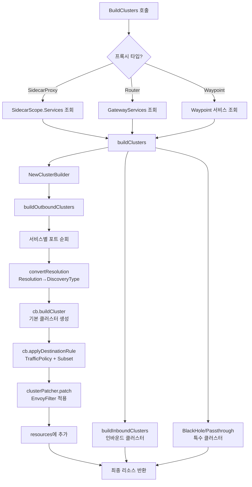
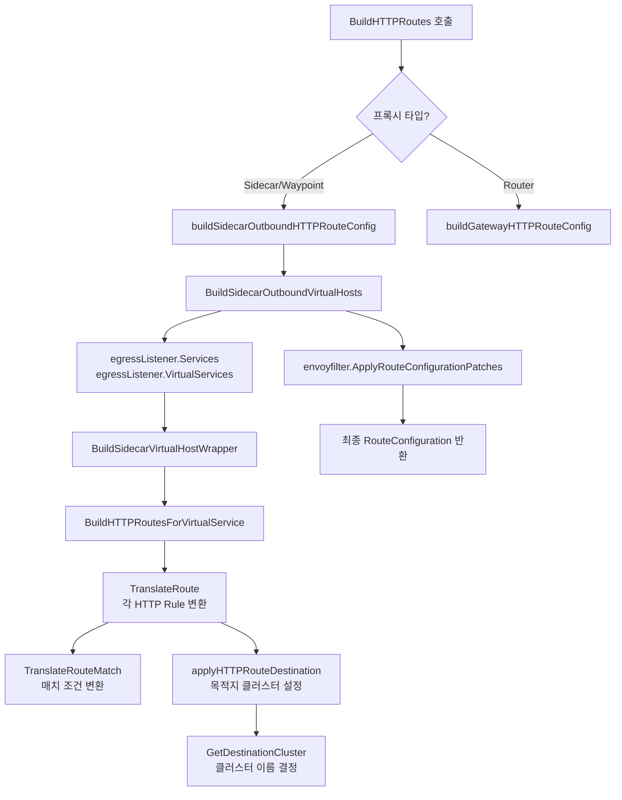
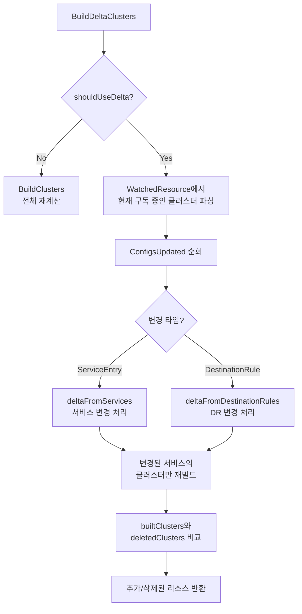

# 08. Envoy 설정 생성 파이프라인 (xDS Config Generation)

## 목차

1. [개요](#1-개요)
2. [ConfigGenerator 인터페이스와 ConfigGeneratorImpl](#2-configgenerator-인터페이스와-configgeneratorimpl)
3. [CDS 파이프라인: Service에서 Cluster로](#3-cds-파이프라인-service에서-cluster로)
4. [DestinationRule 적용](#4-destinationrule-적용)
5. [클러스터 이름 규칙](#5-클러스터-이름-규칙)
6. [RDS 파이프라인: VirtualService에서 Route로](#6-rds-파이프라인-virtualservice에서-route로)
7. [LDS 파이프라인: 인바운드/아웃바운드 리스너](#7-lds-파이프라인-인바운드아웃바운드-리스너)
8. [Delta CDS](#8-delta-cds)
9. [EnvoyFilter 패칭](#9-envoyfilter-패칭)
10. [라우트 캐싱](#10-라우트-캐싱)
11. [E2E 예제: VirtualService+DestinationRule의 전체 변환 과정](#11-e2e-예제)

---

## 1. 개요

Istio의 컨트롤 플레인(Pilot/istiod)은 Kubernetes API 서버에서 수집한 Service, VirtualService, DestinationRule 등의 설정을 Envoy 프록시가 이해할 수 있는 xDS(Cluster Discovery Service, Route Discovery Service, Listener Discovery Service, Endpoint Discovery Service) 리소스로 변환한다. 이 변환 과정을 **Envoy Config Generation Pipeline**이라 부른다.

```
+------------------+     +-------------------+     +------------------+
|  Kubernetes API  | --> |  Istio Config     | --> |  Envoy xDS       |
|  (Service, DR,   |     |  Translation      |     |  (CDS, RDS,      |
|   VS, SE, EF)    |     |  Pipeline         |     |   LDS, EDS)      |
+------------------+     +-------------------+     +------------------+
```

이 문서에서는 `pilot/pkg/networking/core/` 디렉토리에 위치한 핵심 코드를 중심으로, xDS 설정이 생성되는 전체 과정을 상세히 분석한다.

### 핵심 소스 파일

| 파일 | 역할 |
|------|------|
| `configgen.go` | ConfigGenerator 인터페이스 정의, ConfigGeneratorImpl 구현체 |
| `cluster.go` | BuildClusters, BuildDeltaClusters, buildOutboundClusters |
| `cluster_builder.go` | ClusterBuilder, buildCluster, applyDestinationRule, buildSubsetCluster |
| `cluster_traffic_policy.go` | applyTrafficPolicy, applyConnectionPool, applyLoadBalancer |
| `httproute.go` | BuildHTTPRoutes, buildSidecarOutboundHTTPRouteConfig |
| `route/route.go` | BuildHTTPRoutesForVirtualService, TranslateRoute, GetDestinationCluster |
| `route/route_cache.go` | Cache 구조체 (RDS 캐싱 키) |
| `listener.go` | BuildListeners, buildSidecarListeners |
| `listener_builder.go` | ListenerBuilder, patchListeners |
| `envoyfilter/cluster_patch.go` | ApplyClusterMerge, InsertedClusters |
| `envoyfilter/listener_patch.go` | ApplyListenerPatches |
| `envoyfilter/rc_patch.go` | ApplyRouteConfigurationPatches |

---

## 2. ConfigGenerator 인터페이스와 ConfigGeneratorImpl

### 2.1 인터페이스 정의

`ConfigGenerator`는 xDS 응답을 생성하는 코드가 구현해야 할 인터페이스다.

```
소스: pilot/pkg/networking/core/configgen.go
```

```go
type ConfigGenerator interface {
    // LDS 출력: 인바운드/아웃바운드 리스너 목록
    BuildListeners(node *model.Proxy, push *model.PushContext) []*listener.Listener

    // CDS 출력: 클러스터 목록
    BuildClusters(node *model.Proxy, req *model.PushRequest) ([]*discovery.Resource, model.XdsLogDetails)

    // Delta CDS 출력: 변경된 클러스터만 반환
    BuildDeltaClusters(proxy *model.Proxy, updates *model.PushRequest,
        watched *model.WatchedResource) ([]*discovery.Resource, []string, model.XdsLogDetails, bool)

    // RDS 출력: HTTP 라우트 목록
    BuildHTTPRoutes(node *model.Proxy, req *model.PushRequest,
        routeNames []string) ([]*discovery.Resource, model.XdsLogDetails)

    // DNS 테이블 생성
    BuildNameTable(node *model.Proxy, push *model.PushContext) *dnsProto.NameTable

    // ECDS 출력: 확장 설정
    BuildExtensionConfiguration(node *model.Proxy, push *model.PushContext,
        extensionConfigNames []string, pullSecrets map[string][]byte) []*core.TypedExtensionConfig

    // 메시 설정 변경 시 캐시 재구축
    MeshConfigChanged(mesh *meshconfig.MeshConfig)
}
```

### 2.2 ConfigGeneratorImpl

실제 구현체는 `ConfigGeneratorImpl`이며 `XdsCache`를 내장한다.

```go
type ConfigGeneratorImpl struct {
    Cache model.XdsCache
}

func NewConfigGenerator(cache model.XdsCache) *ConfigGeneratorImpl {
    return &ConfigGeneratorImpl{
        Cache: cache,
    }
}
```

`XdsCache`는 CDS와 RDS 결과를 캐싱하여 동일한 설정에 대해 반복 계산을 방지한다. 메시 설정이 변경되면 `MeshConfigChanged`가 호출되어 `accessLogBuilder`를 리셋한다.

### 2.3 프록시 타입별 분기

모든 Build 메서드는 `model.Proxy`의 `Type` 필드를 기준으로 분기한다:

```
+------------------+-------------------------------------------+
|  Proxy Type      |  설명                                      |
+------------------+-------------------------------------------+
|  SidecarProxy    |  워크로드 옆에 배치된 사이드카 프록시          |
|  Router          |  Ingress/Egress 게이트웨이                  |
|  Waypoint        |  Ambient 메시의 웨이포인트 프록시             |
+------------------+-------------------------------------------+
```

---

## 3. CDS 파이프라인: Service에서 Cluster로

CDS(Cluster Discovery Service)는 Envoy가 트래픽을 전송할 수 있는 업스트림 서비스 그룹(클러스터)을 정의한다. Istio는 Kubernetes Service, ServiceEntry 등을 Envoy Cluster로 변환한다.

### 3.1 전체 흐름



### 3.2 BuildClusters 진입점

```
소스: pilot/pkg/networking/core/cluster.go:57-67
```

```go
func (configgen *ConfigGeneratorImpl) BuildClusters(proxy *model.Proxy,
    req *model.PushRequest) ([]*discovery.Resource, model.XdsLogDetails) {
    envoyFilterPatches := req.Push.EnvoyFilters(proxy)
    var services []*model.Service
    if features.FilterGatewayClusterConfig && proxy.Type == model.Router {
        services = req.Push.GatewayServices(proxy, envoyFilterPatches)
    } else {
        services = proxy.SidecarScope.Services()
    }
    return configgen.buildClusters(proxy, req, services, envoyFilterPatches)
}
```

**핵심 로직:**
- 사이드카 프록시: `SidecarScope.Services()`로 해당 프록시에 관련된 서비스 목록을 조회
- 게이트웨이(Router): `FilterGatewayClusterConfig` 기능이 켜져 있으면 게이트웨이에 바인딩된 서비스만 조회
- 항상 해당 프록시에 적용되는 `EnvoyFilter` 패치 목록도 함께 조회

### 3.3 buildClusters 내부 구조

```
소스: pilot/pkg/networking/core/cluster.go:220-309
```

프록시 타입별로 서로 다른 클러스터를 생성한다:

```
+--------------------+----------------------------------------------+
|  프록시 타입        |  생성되는 클러스터                              |
+--------------------+----------------------------------------------+
|  SidecarProxy      |  아웃바운드 + BlackHole + Passthrough          |
|                    |  + 인바운드 + InboundPassthrough               |
+--------------------+----------------------------------------------+
|  Router            |  아웃바운드 + BlackHole                        |
|  (Gateway)         |  + SniDnat (AutoPassthrough 시)               |
+--------------------+----------------------------------------------+
|  Waypoint          |  아웃바운드(제한적) + 웨이포인트 인바운드         |
+--------------------+----------------------------------------------+
```

사이드카의 경우:
```go
case model.SidecarProxy:
    // 아웃바운드 클러스터
    outboundPatcher := clusterPatcher{efw: envoyFilterPatches, pctx: networking.EnvoyFilter_SIDECAR_OUTBOUND}
    ob, cs := configgen.buildOutboundClusters(cb, proxy, outboundPatcher, services)
    resources = append(resources, ob...)

    // BlackHole + Passthrough 클러스터
    clusters = outboundPatcher.conditionallyAppend(clusters, nil,
        cb.buildBlackHoleCluster(), cb.buildDefaultPassthroughCluster())

    // 인바운드 클러스터
    inboundPatcher := clusterPatcher{efw: envoyFilterPatches, pctx: networking.EnvoyFilter_SIDECAR_INBOUND}
    clusters = append(clusters, configgen.buildInboundClusters(cb, proxy, instances, inboundPatcher)...)
```

### 3.4 Resolution에서 DiscoveryType으로의 매핑

Istio의 서비스 Resolution 타입은 Envoy Cluster의 DiscoveryType으로 변환된다.

```
소스: pilot/pkg/networking/core/cluster.go:777-797
```

```go
func convertResolution(proxyType model.NodeType, service *model.Service) cluster.Cluster_DiscoveryType {
    switch service.Resolution {
    case model.ClientSideLB:
        return cluster.Cluster_EDS
    case model.DNSLB:
        return cluster.Cluster_STRICT_DNS
    case model.DNSRoundRobinLB:
        return cluster.Cluster_LOGICAL_DNS
    case model.Passthrough:
        if proxyType == model.Router {
            return cluster.Cluster_EDS  // 게이트웨이는 Passthrough 불가
        }
        if service.Attributes.ServiceRegistry == provider.Kubernetes &&
           features.EnableEDSForHeadless {
            return cluster.Cluster_EDS
        }
        return cluster.Cluster_ORIGINAL_DST
    default:
        return cluster.Cluster_EDS
    }
}
```

매핑 테이블:

```
+----------------------+----------------------------+---------------------------+
|  Istio Resolution    |  Envoy DiscoveryType       |  엔드포인트 제공 방식       |
+----------------------+----------------------------+---------------------------+
|  ClientSideLB        |  EDS                       |  Pilot이 EDS로 제공        |
|  DNSLB               |  STRICT_DNS                |  DNS 조회, 모든 결과 사용   |
|  DNSRoundRobinLB     |  LOGICAL_DNS               |  DNS 조회, 하나만 사용      |
|  Passthrough(사이드카)|  ORIGINAL_DST              |  원래 목적지 주소 사용       |
|  Passthrough(게이트웨이)|  EDS                      |  게이트웨이에서는 EDS 폴백   |
+----------------------+----------------------------+---------------------------+
```

### 3.5 buildCluster: 기본 클러스터 생성

```
소스: pilot/pkg/networking/core/cluster_builder.go:453-543
```

`buildCluster`는 Envoy `cluster.Cluster` 객체를 초기화한다:

```go
func (cb *ClusterBuilder) buildCluster(name string,
    discoveryType cluster.Cluster_DiscoveryType,
    localityLbEndpoints []*endpoint.LocalityLbEndpoints,
    direction model.TrafficDirection, port *model.Port,
    service *model.Service, inboundServices []model.ServiceTarget,
    subset string) *clusterWrapper {

    c := &cluster.Cluster{
        Name:                 name,
        ClusterDiscoveryType: &cluster.Cluster_Type{Type: discoveryType},
        CommonLbConfig:       &cluster.Cluster_CommonLbConfig{},
    }
    // ... DNS 설정, LoadAssignment, ORIGINAL_DST 설정 등
}
```

DiscoveryType에 따라 추가 설정이 달라진다:

- **STRICT_DNS / LOGICAL_DNS**: `DnsLookupFamily` 설정 (V4_ONLY, V6_ONLY, ALL), DNS 리졸버 설정, `DnsJitter`, `DnsRefreshRate` 적용
- **STATIC**: `LoadAssignment`에 `localityLbEndpoints` 직접 설정
- **ORIGINAL_DST**: `PassthroughTargetPorts`에 포트 오버라이드가 있으면 `OriginalDstLbConfig.UpstreamPortOverride` 설정

### 3.6 buildOutboundClusters: 아웃바운드 클러스터 루프

```
소스: pilot/pkg/networking/core/cluster.go:369-464
```

모든 서비스의 모든 포트를 순회하며 클러스터를 생성한다:

```go
func (configgen *ConfigGeneratorImpl) buildOutboundClusters(cb *ClusterBuilder,
    proxy *model.Proxy, cp clusterPatcher, services []*model.Service,
) ([]*discovery.Resource, cacheStats) {
    for _, service := range services {
        if service.Resolution == model.Alias || service.Resolution == model.DynamicDNS {
            continue  // Alias와 DynamicDNS는 건너뜀
        }
        for i, port := range service.Ports {
            if port.Protocol == protocol.UDP {
                continue  // UDP 포트는 건너뜀
            }

            // 캐시 조회
            clusterKey := buildClusterKey(service, port, cb, proxy, efKeys)
            cached, allFound := cb.getAllCachedSubsetClusters(clusterKey)
            if allFound {
                resources = append(resources, cached...)
                continue
            }

            // 기본 클러스터 생성
            discoveryType := convertResolution(cb.proxyType, service)
            defaultCluster := cb.buildCluster(clusterKey.clusterName, discoveryType, ...)

            // DestinationRule 적용 (subset 클러스터 포함)
            subsetClusters := cb.applyDestinationRule(defaultCluster, DefaultClusterMode,
                service, port, ...)

            // EnvoyFilter 패칭 후 리소스에 추가
            if patched := cp.patch(nil, defaultCluster.build()); patched != nil {
                resources = append(resources, patched)
            }
            for _, ss := range subsetClusters {
                if patched := cp.patch(nil, ss); patched != nil {
                    resources = append(resources, patched)
                }
            }
        }
    }
}
```

---

## 4. DestinationRule 적용

DestinationRule은 특정 서비스에 대한 트래픽 정책(ConnectionPool, OutlierDetection, LoadBalancer, TLS)과 서브셋을 정의한다. 이 정보는 클러스터 생성 시 적용된다.

### 4.1 applyDestinationRule 함수

```
소스: pilot/pkg/networking/core/cluster_builder.go:340-407
```

```go
func (cb *ClusterBuilder) applyDestinationRule(mc *clusterWrapper,
    clusterMode ClusterMode, service *model.Service, port *model.Port,
    eb *endpoints.EndpointBuilder, destRule *config.Config,
    serviceAccounts []string) []*cluster.Cluster {

    destinationRule := CastDestinationRule(destRule)
    // 포트 레벨 트래픽 정책 병합
    trafficPolicy, _ := util.GetPortLevelTrafficPolicy(
        destinationRule.GetTrafficPolicy(), port)

    opts := buildClusterOpts{
        mesh:        cb.req.Push.Mesh,
        mutable:     mc,
        policy:      trafficPolicy,
        port:        port,
        clusterMode: clusterMode,
        direction:   model.TrafficDirectionOutbound,
        // ...
    }

    // 기본 클러스터에 트래픽 정책 적용
    cb.applyTrafficPolicy(service, opts)

    // 각 subset에 대해 별도 클러스터 생성
    subsetClusters := make([]*cluster.Cluster, 0)
    for _, subset := range destinationRule.GetSubsets() {
        subsetCluster := cb.buildSubsetCluster(opts, destRule, subset, service, eb)
        if subsetCluster != nil {
            subsetClusters = append(subsetClusters, subsetCluster)
        }
    }
    return subsetClusters
}
```

### 4.2 applyTrafficPolicy: 트래픽 정책의 세부 적용

```
소스: pilot/pkg/networking/core/cluster_traffic_policy.go:43-69
```

`applyTrafficPolicy`는 DestinationRule의 `trafficPolicy`를 Envoy 클러스터 설정으로 변환한다:

```go
func (cb *ClusterBuilder) applyTrafficPolicy(service *model.Service,
    opts buildClusterOpts) {
    connectionPool, outlierDetection, loadBalancer, tls, proxyProtocol, retryBudget :=
        selectTrafficPolicyComponents(opts.policy)

    // 1. H2 업그레이드 (아웃바운드만)
    cb.applyH2Upgrade(opts.mutable, opts.port, opts.mesh, connectionPool)

    // 2. 커넥션 풀 설정 (인바운드/아웃바운드 공통)
    cb.applyConnectionPool(opts.mesh, opts.mutable, connectionPool, retryBudget)

    // 3. 아웃바운드 전용 설정
    if opts.direction != model.TrafficDirectionInbound {
        // Outlier Detection (이상치 감지)
        applyOutlierDetection(service, opts.mutable.cluster, outlierDetection)

        // Load Balancer (부하 분산 정책)
        applyLoadBalancer(service, opts.mutable.cluster, loadBalancer, ...)

        // Upstream TLS
        tls, mtlsCtxType := cb.buildUpstreamTLSSettings(tls, ...)
        cb.applyUpstreamTLSSettings(&opts, tls, mtlsCtxType)
    }
}
```

각 구성 요소가 Envoy 설정으로 매핑되는 관계:

```
+-------------------------------+------------------------------------------+
|  DestinationRule 필드          |  Envoy Cluster 설정                      |
+-------------------------------+------------------------------------------+
|  connectionPool.tcp           |  ConnectTimeout, MaxConnections,          |
|                               |  TcpKeepalive                            |
+-------------------------------+------------------------------------------+
|  connectionPool.http          |  CircuitBreakers.MaxRequests,             |
|                               |  MaxPendingRequests, MaxRetries,          |
|                               |  IdleTimeout, MaxRequestsPerConnection   |
+-------------------------------+------------------------------------------+
|  outlierDetection             |  OutlierDetection (Consecutive5xx,       |
|                               |  BaseEjectionTime, MaxEjectionPercent)   |
+-------------------------------+------------------------------------------+
|  loadBalancer.simple          |  LbPolicy (ROUND_ROBIN, LEAST_REQUEST,   |
|                               |  RANDOM, PASSTHROUGH)                    |
+-------------------------------+------------------------------------------+
|  loadBalancer.consistentHash  |  LbPolicy = RING_HASH 또는 MAGLEV       |
+-------------------------------+------------------------------------------+
|  tls                          |  TransportSocket (UpstreamTlsContext)    |
+-------------------------------+------------------------------------------+
|  retryBudget                  |  CircuitBreakers.RetryBudget             |
+-------------------------------+------------------------------------------+
```

### 4.3 ConnectionPool 적용 상세

```
소스: pilot/pkg/networking/core/cluster_traffic_policy.go:94-180
```

커넥션 풀 설정의 기본값은 `math.MaxUint32`로, 사실상 무제한이다:

```go
func getDefaultCircuitBreakerThresholds() *cluster.CircuitBreakers_Thresholds {
    return &cluster.CircuitBreakers_Thresholds{
        MaxRetries:         &wrapperspb.UInt32Value{Value: math.MaxUint32},
        MaxRequests:        &wrapperspb.UInt32Value{Value: math.MaxUint32},
        MaxConnections:     &wrapperspb.UInt32Value{Value: math.MaxUint32},
        MaxPendingRequests: &wrapperspb.UInt32Value{Value: math.MaxUint32},
        TrackRemaining:     !features.DisableTrackRemainingMetrics,
    }
}
```

**왜 기본값이 MaxUint32인가?** Envoy 기본값인 3(maxRetries)은 Pod 롤링 업데이트 시 여러 엔드포인트가 동시에 종료될 때 서킷 브레이커가 너무 빨리 작동하여 503 에러를 유발할 수 있기 때문이다.

### 4.4 LoadBalancer 정책 매핑

```
소스: pilot/pkg/networking/core/cluster_traffic_policy.go:259-308
```

```go
func applyLoadBalancer(svc *model.Service, c *cluster.Cluster,
    lb *networking.LoadBalancerSettings, ...) {
    switch lb.GetSimple() {
    case networking.LoadBalancerSettings_LEAST_CONN,
         networking.LoadBalancerSettings_LEAST_REQUEST:
        c.LbPolicy = cluster.Cluster_LEAST_REQUEST
    case networking.LoadBalancerSettings_RANDOM:
        c.LbPolicy = cluster.Cluster_RANDOM
    case networking.LoadBalancerSettings_ROUND_ROBIN:
        c.LbPolicy = cluster.Cluster_ROUND_ROBIN
    case networking.LoadBalancerSettings_PASSTHROUGH:
        c.LbPolicy = cluster.Cluster_CLUSTER_PROVIDED
        c.ClusterDiscoveryType = &cluster.Cluster_Type{Type: cluster.Cluster_ORIGINAL_DST}
    default:
        // 기본 알고리즘: LEAST_REQUEST
        c.LbPolicy = cluster.Cluster_LEAST_REQUEST
    }
    // ConsistentHash가 설정되어 있으면 RING_HASH 또는 MAGLEV로 오버라이드
    ApplyRingHashLoadBalancer(c, lb)
}
```

### 4.5 Subset 클러스터 생성

```
소스: pilot/pkg/networking/core/cluster_builder.go:280-336
```

각 DestinationRule subset은 별도의 Envoy 클러스터로 생성된다:

```go
func (cb *ClusterBuilder) buildSubsetCluster(opts buildClusterOpts,
    destRule *config.Config, subset *networking.Subset,
    service *model.Service, endpointBuilder *endpoints.EndpointBuilder,
) *cluster.Cluster {
    // subset 클러스터 이름 생성
    subsetClusterName := model.BuildSubsetKey(
        model.TrafficDirectionOutbound, subset.Name,
        service.Hostname, opts.port.Port)

    // subset 클러스터 생성
    subsetCluster := cb.buildCluster(subsetClusterName, clusterType, ...)

    // subset의 trafficPolicy를 기본 정책에 병합
    opts.policy = util.MergeSubsetTrafficPolicy(opts.policy, subset.TrafficPolicy, opts.port)

    // 병합된 정책 적용
    cb.applyTrafficPolicy(service, opts)

    return subsetCluster.build()
}
```

---

## 5. 클러스터 이름 규칙

### 5.1 이름 형식

```
소스: pilot/pkg/model/service.go:1613-1615
```

Istio는 클러스터 이름에 일관된 명명 규칙을 사용한다:

```go
func BuildSubsetKey(direction TrafficDirection, subsetName string,
    hostname host.Name, port int) string {
    return string(direction) + "|" + strconv.Itoa(port) + "|" + subsetName + "|" + string(hostname)
}
```

### 5.2 이름 형식 예시

```
아웃바운드 기본 클러스터:
  outbound|8080||reviews.default.svc.cluster.local

아웃바운드 subset 클러스터:
  outbound|8080|v2|reviews.default.svc.cluster.local

인바운드 클러스터:
  inbound|8080||

DNS SRV 형식 (SniDnat 용):
  outbound_.8080_.v2_.reviews.default.svc.cluster.local
```

### 5.3 이름 파싱

```go
func ParseSubsetKey(s string) (direction TrafficDirection, subsetName string,
    hostname host.Name, port int) {
    // "outbound|8080|v2|reviews.default.svc.cluster.local"
    // → direction=outbound, port=8080, subset=v2, hostname=reviews.default.svc.cluster.local
}
```

인바운드 클러스터는 `BuildInboundSubsetKey(port)`를 사용하며, hostname과 subset이 비어 있다:

```go
func BuildInboundSubsetKey(port int) string {
    return BuildSubsetKey(TrafficDirectionInbound, "", "", port)
    // 결과: "inbound|8080||"
}
```

### 5.4 특수 클러스터 이름

| 클러스터 이름 | 용도 |
|-------------|------|
| `BlackHoleCluster` | 알 수 없는 목적지 트래픽을 드롭 |
| `PassthroughCluster` | ALLOW_ANY 모드에서 원래 목적지로 전달 |
| `InboundPassthroughCluster` | 인바운드 패스스루 트래픽 |
| `connect_originate` | HBONE 터널 연결 |

---

## 6. RDS 파이프라인: VirtualService에서 Route로

RDS(Route Discovery Service)는 HTTP 리스너에 연결된 라우팅 규칙을 정의한다. Istio의 VirtualService를 Envoy의 `RouteConfiguration`으로 변환한다.

### 6.1 전체 흐름



### 6.2 BuildHTTPRoutes 진입점

```
소스: pilot/pkg/networking/core/httproute.go:55-110
```

```go
func (configgen *ConfigGeneratorImpl) BuildHTTPRoutes(
    node *model.Proxy, req *model.PushRequest, routeNames []string,
) ([]*discovery.Resource, model.XdsLogDetails) {
    efw := req.Push.EnvoyFilters(node)
    switch node.Type {
    case model.SidecarProxy, model.Waypoint:
        for _, routeName := range routeNames {
            rc, cached := configgen.buildSidecarOutboundHTTPRouteConfig(
                node, req, routeName, vHostCache, efw, envoyfilterKeys)
            routeConfigurations = append(routeConfigurations, rc)
        }
    case model.Router:
        for _, routeName := range routeNames {
            rc := configgen.buildGatewayHTTPRouteConfig(node, req.Push, routeName)
            rc = envoyfilter.ApplyRouteConfigurationPatches(
                networking.EnvoyFilter_GATEWAY, node, efw, rc)
            // ...
        }
    }
}
```

### 6.3 buildSidecarOutboundHTTPRouteConfig

```
소스: pilot/pkg/networking/core/httproute.go:136-215
```

이 함수는 사이드카의 아웃바운드 HTTP 라우트를 생성한다:

1. `routeName`에서 리스너 포트와 스니핑 여부를 추출
2. `BuildSidecarOutboundVirtualHosts`를 호출하여 VirtualHost 목록 생성
3. 스니핑 모드에서는 해당 서비스+포트에 매칭되는 VirtualHost만 필터링
4. 비스니핑 모드에서는 catch-all VirtualHost 추가
5. `envoyfilter.ApplyRouteConfigurationPatches`로 EnvoyFilter 패치 적용
6. 캐시에 저장 (EnableRDSCaching이 켜져 있을 때)

```go
out := &route.RouteConfiguration{
    Name:                           routeName,
    VirtualHosts:                   virtualHosts,
    ValidateClusters:               proto.BoolFalse,
    MaxDirectResponseBodySizeBytes: istio_route.DefaultMaxDirectResponseBodySizeBytes,
    IgnorePortInHostMatching:       true,
}
out = envoyfilter.ApplyRouteConfigurationPatches(
    networking.EnvoyFilter_SIDECAR_OUTBOUND, node, efw, out)
```

### 6.4 BuildHTTPRoutesForVirtualService

```
소스: pilot/pkg/networking/core/route/route.go:400-443
```

VirtualService 스펙을 Envoy Route 목록으로 변환한다:

```go
func BuildHTTPRoutesForVirtualService(
    node *model.Proxy, virtualService config.Config,
    listenPort int, gatewayNames sets.String, opts RouteOptions,
) ([]*route.Route, error) {
    vs := virtualService.Spec.(*networking.VirtualService)
    out := make([]*route.Route, 0, len(vs.Http))

    for _, http := range vs.Http {
        if len(http.Match) == 0 {
            // 매치 조건 없으면 catch-all
            if r := TranslateRoute(node, http, nil, listenPort, ...); r != nil {
                out = append(out, r)
            }
        } else {
            // 각 매치 조건별로 별도의 Route 생성
            for _, match := range http.Match {
                if r := TranslateRoute(node, http, match, listenPort, ...); r != nil {
                    out = append(out, r)
                    if IsCatchAllRoute(r) {
                        break  // catch-all 이후 라우트는 의미 없음
                    }
                }
            }
        }
    }
    return out, nil
}
```

### 6.5 TranslateRoute: HTTP Rule 변환

```
소스: pilot/pkg/networking/core/route/route.go:467-590
```

하나의 HTTPRoute 규칙과 하나의 Match 조건을 Envoy `route.Route`로 변환한다:

```go
func TranslateRoute(node *model.Proxy, in *networking.HTTPRoute,
    match *networking.HTTPMatchRequest, listenPort int,
    virtualService config.Config, gatewayNames sets.String,
    opts RouteOptions) *route.Route {

    // 포트 매칭 확인
    if match != nil && match.Port != 0 && match.Port != uint32(listenPort) {
        return nil
    }
    // 소스 라벨/게이트웨이 매칭
    if !sourceMatchHTTP(match, node.Labels, gatewayNames, ...) {
        return nil
    }

    out := &route.Route{
        Name:     routeName,
        Match:    TranslateRouteMatch(virtualService, match),  // 매치 조건 변환
        Metadata: util.BuildConfigInfoMetadata(virtualService.Meta),
    }

    // 헤더 조작 적용
    if in.Headers != nil {
        operations := TranslateHeadersOperations(in.Headers)
        out.RequestHeadersToAdd = operations.RequestHeadersToAdd
        // ...
    }

    // 라우트 액션 결정
    if in.Redirect != nil {
        ApplyRedirect(out, in.Redirect, ...)
    } else if in.DirectResponse != nil {
        ApplyDirectResponse(out, in.DirectResponse)
    } else {
        applyHTTPRouteDestination(out, node, virtualService, in, opts, ...)
    }

    return out
}
```

### 6.6 TranslateRouteMatch: HTTPMatch에서 RouteMatch로

```
소스: pilot/pkg/networking/core/route/route.go:1059-1138
```

VirtualService의 `HTTPMatchRequest`를 Envoy의 `RouteMatch`로 변환한다:

```
+----------------------------------+------------------------------------------+
|  VirtualService Match            |  Envoy RouteMatch                        |
+----------------------------------+------------------------------------------+
|  uri.exact: "/api"               |  PathSpecifier: Path{"/api"}             |
|  uri.prefix: "/api/"             |  PathSpecifier: Prefix{"/api/"}          |
|  uri.regex: "/api/v[0-9]+"       |  PathSpecifier: SafeRegex{...}           |
|  headers["x-req-id"]            |  Headers: HeaderMatcher{name, match}     |
|  method: "GET"                   |  Headers: HeaderMatcher{":method", ...}  |
|  authority: "*.example.com"      |  Headers: HeaderMatcher{":authority"...} |
|  queryParams["version"]         |  QueryParameters: QueryParameterMatcher  |
+----------------------------------+------------------------------------------+
```

Gateway API에서는 `PathSeparatedPrefix`가 사용되어, `/api`가 `/api/`와 `/api`에만 매칭되고 `/apiv2`에는 매칭되지 않는다.

### 6.7 GetDestinationCluster: 목적지 클러스터 이름 결정

```
소스: pilot/pkg/networking/core/route/route.go:351-376
```

```go
func GetDestinationCluster(destination *networking.Destination,
    service *model.Service, listenerPort int) string {
    h := host.Name(destination.Host)
    // Alias(ExternalName Service)인 경우 실제 서비스로 변환
    if service != nil && service.Attributes.K8sAttributes.ExternalName != "" {
        h = host.Name(service.Attributes.K8sAttributes.ExternalName)
    }
    port := listenerPort
    if destination.GetPort() != nil {
        port = int(destination.GetPort().GetNumber())
    } else if service != nil && len(service.Ports) == 1 {
        port = service.Ports[0].Port
    }
    return model.BuildSubsetKey(model.TrafficDirectionOutbound,
        destination.Subset, h, port)
}
```

결과 예시:
- `destination: {host: "reviews", subset: "v2", port: 8080}` -> `outbound|8080|v2|reviews.default.svc.cluster.local`
- `destination: {host: "reviews"}` (포트 하나) -> `outbound|9080||reviews.default.svc.cluster.local`

### 6.8 가중치 라우팅

VirtualService의 `route` 필드에 여러 destination이 있으면 가중치 라우팅이 적용된다:

```yaml
http:
- route:
  - destination:
      host: reviews
      subset: v1
    weight: 75
  - destination:
      host: reviews
      subset: v2
    weight: 25
```

이 설정은 Envoy의 `WeightedCluster`로 변환된다:

```
Route.Action = RouteAction{
    ClusterSpecifier: WeightedCluster{
        Clusters: [
            {Name: "outbound|8080|v1|reviews...", Weight: 75},
            {Name: "outbound|8080|v2|reviews...", Weight: 25}
        ]
    }
}
```

---

## 7. LDS 파이프라인: 인바운드/아웃바운드 리스너

LDS(Listener Discovery Service)는 Envoy가 트래픽을 수신할 리스너를 정의한다.

### 7.1 전체 흐름

```
소스: pilot/pkg/networking/core/listener.go:115-139
```

```go
func (configgen *ConfigGeneratorImpl) BuildListeners(node *model.Proxy,
    push *model.PushContext) []*listener.Listener {
    builder := NewListenerBuilder(node, push)
    switch node.Type {
    case model.SidecarProxy:
        builder = configgen.buildSidecarListeners(builder)
    case model.Waypoint:
        builder = configgen.buildWaypointListeners(builder)
    case model.Router:
        builder = configgen.buildGatewayListeners(builder)
    }
    builder.patchListeners()  // EnvoyFilter 패치 적용
    return builder.getListeners()
}
```

### 7.2 ListenerBuilder 구조

```
소스: pilot/pkg/networking/core/listener_builder.go:55-74
```

```go
type ListenerBuilder struct {
    node              *model.Proxy
    push              *model.PushContext
    gatewayListeners  []*listener.Listener     // Gateway용
    inboundListeners  []*listener.Listener     // 인바운드
    outboundListeners []*listener.Listener     // 아웃바운드
    httpProxyListener       *listener.Listener // HTTP 프록시 (mesh.proxyHttpPort)
    virtualOutboundListener *listener.Listener // 가상 아웃바운드 (:15001)
    virtualInboundListener  *listener.Listener // 가상 인바운드

    envoyFilterWrapper *model.MergedEnvoyFilterWrapper
    authnBuilder       *authn.Builder          // mTLS 설정
    authzBuilder       *authz.Builder          // AuthorizationPolicy
    authzCustomBuilder *authz.Builder          // Custom AuthZ
}
```

### 7.3 사이드카 리스너 빌드 순서

```
소스: pilot/pkg/networking/core/listener.go:252-261
```

```go
func (configgen *ConfigGeneratorImpl) buildSidecarListeners(
    builder *ListenerBuilder) *ListenerBuilder {
    if builder.push.Mesh.ProxyListenPort > 0 {
        builder.appendSidecarInboundListeners().   // 1. 인바운드 리스너
            appendSidecarOutboundListeners().       // 2. 아웃바운드 리스너
            buildHTTPProxyListener().               // 3. HTTP 프록시 리스너
            buildVirtualOutboundListener()          // 4. 가상 아웃바운드 리스너
    }
    return builder
}
```

### 7.4 리스너 구조

사이드카 프록시의 리스너 구조:

```
+--------------------------+     +---------------------------+
| Virtual Outbound (:15001)|     | Virtual Inbound (:15006)  |
| UseOriginalDst: true     |     | (인바운드 트래픽 캡처)      |
| FilterChains:            |     | FilterChains:              |
|   Catch-all (Passthrough |     |   포트별 인바운드 체인      |
|   또는 BlackHole)        |     |                            |
+--------------------------+     +---------------------------+
          |                                   |
          v                                   v
+-------------------+            +-------------------+
| Outbound Listener |            | Inbound Listener  |
| 0.0.0.0:8080      |            | 127.0.0.1:8080    |
| FilterChains:     |            | FilterChains:     |
|   HCM → RDS      |            |   HCM → 로컬 라우트|
+-------------------+            +-------------------+
```

**Virtual Outbound Listener (:15001)**
- `UseOriginalDst: true` 설정으로, iptables에 의해 리다이렉트된 트래픽의 원래 목적지를 보고 매칭되는 아웃바운드 리스너로 전달
- 매칭되는 리스너가 없으면 catch-all 필터 체인에서 PassthroughCluster 또는 BlackHoleCluster로 라우팅

**아웃바운드 리스너**
- 각 서비스 포트(0.0.0.0:port)에 대해 생성
- HTTP 포트: HCM(HttpConnectionManager) 필터 + RDS 연동
- TCP 포트: TCPProxy 필터 + 클러스터 직접 지정

**인바운드 리스너**
- 워크로드의 각 서비스 포트에 대해 생성
- 로컬 애플리케이션(127.0.0.1:port)으로 트래픽 전달
- mTLS 종단, AuthorizationPolicy 적용

### 7.5 필터 체인 구성

아웃바운드 HTTP 리스너의 필터 체인:

```
Listener (0.0.0.0:8080)
  └── FilterChain
       ├── ListenerFilter: TLS Inspector (프로토콜 탐지)
       ├── ListenerFilter: HTTP Inspector
       └── NetworkFilter
            └── HttpConnectionManager
                 ├── HttpFilter: envoy.filters.http.fault
                 ├── HttpFilter: envoy.filters.http.cors
                 ├── HttpFilter: istio.metadata_exchange
                 ├── HttpFilter: envoy.filters.http.router
                 └── RouteConfig: RDS (라우트 이름으로 RDS 조회)
```

---

## 8. Delta CDS

Delta CDS는 전체 클러스터를 다시 계산하지 않고, 변경된 클러스터만 증분 업데이트하는 최적화 메커니즘이다.

### 8.1 Delta 지원 범위

```
소스: pilot/pkg/networking/core/cluster.go:51
```

```go
var deltaConfigTypes = sets.New(
    kind.ServiceEntry.String(),
    kind.DestinationRule.String(),
)
```

**오직 ServiceEntry와 DestinationRule 변경만** Delta CDS를 지원한다. 다른 설정(Gateway, VirtualService, Sidecar 등) 변경 시에는 전체 재계산(SotW, State of the World)으로 폴백한다.

### 8.2 Delta 적용 조건

```
소스: pilot/pkg/networking/core/cluster.go:311-323
```

```go
func shouldUseDelta(updates *model.PushRequest) bool {
    return updates != nil &&
        !updates.Forced &&                        // 강제 푸시가 아닐 것
        deltaAwareConfigTypes(updates.ConfigsUpdated) // 모든 변경이 delta 지원 타입
}

func deltaAwareConfigTypes(cfgs sets.Set[model.ConfigKey]) bool {
    for k := range cfgs {
        if !deltaConfigTypes.Contains(k.Kind.String()) {
            return false  // 하나라도 delta 미지원 타입이면 SotW
        }
    }
    return true
}
```

### 8.3 BuildDeltaClusters 동작 과정

```
소스: pilot/pkg/networking/core/cluster.go:71-151
```



Delta 처리의 핵심은 `watched.ResourceNames`에서 현재 프록시가 구독 중인 클러스터 이름을 파싱하여 영향받는 서비스만 식별하는 것이다:

```go
for cluster := range watched.ResourceNames {
    dir, subset, svcHost, port := model.ParseSubsetKey(cluster)
    if dir == model.TrafficDirectionInbound {
        deletedClusters.Insert(cluster) // 인바운드는 항상 전체 재빌드
    } else {
        if subset == "" {
            sets.InsertOrNew(serviceClusters, string(svcHost), cluster)
        } else {
            sets.InsertOrNew(subsetClusters, string(svcHost), cluster)
        }
    }
}
```

### 8.4 ServiceEntry 변경 처리

```
소스: pilot/pkg/networking/core/cluster.go:154-177
```

```go
func (configgen *ConfigGeneratorImpl) deltaFromServices(key model.ConfigKey, ...) {
    service := push.ServiceForHostname(proxy, host.Name(key.Name))
    if service == nil {
        // 서비스가 삭제됨 → 해당 서비스의 모든 클러스터를 삭제 목록에 추가
        deletedClusters = append(deletedClusters, serviceClusters[key.Name].UnsortedList()...)
        deletedClusters = append(deletedClusters, subsetClusters[key.Name].UnsortedList()...)
    } else {
        // 서비스 업데이트 → 재빌드 대상에 추가
        services = append(services, service)
        // 제거된 포트의 클러스터를 삭제 목록에 추가
        for port, cluster := range servicePortClusters[service.Hostname.String()] {
            if _, exists := service.Ports.GetByPort(port); !exists {
                deletedClusters = append(deletedClusters, cluster)
            }
        }
    }
}
```

### 8.5 DestinationRule 변경 처리

```
소스: pilot/pkg/networking/core/cluster.go:180-217
```

DestinationRule이 변경되면 해당 DR이 적용되는 서비스를 찾아 클러스터를 재빌드한다:

```go
func (configgen *ConfigGeneratorImpl) deltaFromDestinationRules(updatedDr model.ConfigKey, ...) {
    cfg := proxy.SidecarScope.DestinationRuleByName(updatedDr.Name, updatedDr.Namespace)
    if cfg == nil {
        // DR 삭제됨 → 이전 DR에서 호스트를 찾아 서비스 재빌드
        prevCfg := proxy.PrevSidecarScope.DestinationRuleByName(...)
        dr := prevCfg.Spec.(*networking.DestinationRule)
        services = proxy.SidecarScope.ServicesForHostname(host.Name(dr.Host))
    } else {
        // DR 업데이트 → 현재+이전 호스트 모두 재빌드
        dr := cfg.Spec.(*networking.DestinationRule)
        services = proxy.SidecarScope.ServicesForHostname(host.Name(dr.Host))
        // 호스트가 변경된 경우 이전 호스트도 포함
    }
    // 영향받는 서비스의 모든 subset 클러스터를 삭제 후보에 추가
    for _, svc := range services {
        deletedClusters = append(deletedClusters, subsetClusters[svc.Hostname.String()]...)
    }
}
```

**삭제 판정 로직**: 재빌드 후 실제로 생성된 클러스터(`builtClusters`)와 삭제 후보(`deletedClusters`)를 비교하여, 재빌드되지 않은 것만 최종 삭제 대상이 된다:

```go
deletedClusters = deletedClusters.DifferenceInPlace(builtClusters)
```

---

## 9. EnvoyFilter 패칭

EnvoyFilter는 Istio가 생성한 xDS 설정을 사용자가 직접 수정할 수 있게 하는 고급 API다. 클러스터, 리스너, 라우트 각각에 대해 별도의 패칭 로직이 존재한다.

### 9.1 패칭 아키텍처

```
Istio Config Generation Pipeline:

  BuildClusters ──────► ClusterPatcher ──► ApplyClusterMerge / InsertedClusters
                                            ↑
                                        EnvoyFilter
                                        (CLUSTER patches)
                                            ↓
  BuildHTTPRoutes ────► ──────────────► ApplyRouteConfigurationPatches
                                            ↑
                                        EnvoyFilter
                                        (ROUTE_CONFIGURATION, VIRTUAL_HOST, HTTP_ROUTE patches)
                                            ↓
  BuildListeners ─────► patchListeners ► ApplyListenerPatches
                                            ↑
                                        EnvoyFilter
                                        (LISTENER, FILTER_CHAIN, NETWORK_FILTER, HTTP_FILTER patches)
```

### 9.2 Cluster Patch (cluster_patch.go)

```
소스: pilot/pkg/networking/core/envoyfilter/cluster_patch.go
```

클러스터 패칭은 세 가지 오퍼레이션을 지원한다:

**MERGE**: 기존 클러스터에 설정을 병합
```go
func ApplyClusterMerge(pctx networking.EnvoyFilter_PatchContext,
    efw *model.MergedEnvoyFilterWrapper, c *cluster.Cluster,
    hosts []host.Name) *cluster.Cluster {
    for _, cp := range efw.Patches[networking.EnvoyFilter_CLUSTER] {
        if cp.Operation == networking.EnvoyFilter_Patch_REMOVE &&
           commonConditionMatch(pctx, cp) && clusterMatch(c, cp, hosts) {
            return nil  // 클러스터 제거
        }
        if cp.Operation == networking.EnvoyFilter_Patch_MERGE {
            if commonConditionMatch(pctx, cp) && clusterMatch(c, cp, hosts) {
                merge.Merge(c, cp.Value)
            }
        }
    }
    return c
}
```

**ADD**: 새로운 클러스터 추가
```go
func InsertedClusters(pctx networking.EnvoyFilter_PatchContext,
    efw *model.MergedEnvoyFilterWrapper) []*cluster.Cluster {
    var result []*cluster.Cluster
    for _, cp := range efw.Patches[networking.EnvoyFilter_CLUSTER] {
        if cp.Operation == networking.EnvoyFilter_Patch_ADD {
            if commonConditionMatch(pctx, cp) {
                result = append(result, proto.Clone(cp.Value).(*cluster.Cluster))
            }
        }
    }
    return result
}
```

**REMOVE**: 매칭되는 클러스터 삭제 (ApplyClusterMerge에서 nil 반환)

클러스터 매칭 기준:
```go
func clusterMatch(cluster *cluster.Cluster, cp *model.EnvoyFilterConfigPatchWrapper,
    hosts []host.Name) bool {
    cMatch := cp.Match.GetCluster()
    // 매칭 기준: Name, Subset, Service(hostname), PortNumber
    if cMatch.Name != "" {
        return cMatch.Name == cluster.Name
    }
    direction, subset, hostname, port := model.ParseSubsetKey(cluster.Name)
    // subset, service, port 매칭 확인
}
```

### 9.3 Listener Patch (listener_patch.go)

```
소스: pilot/pkg/networking/core/envoyfilter/listener_patch.go
```

리스너 패칭은 계층적으로 적용된다:

```
Listener
  ├── MERGE/REMOVE/REPLACE (리스너 레벨)
  └── FilterChain
       ├── ADD/REMOVE/MERGE (필터 체인 레벨)
       └── NetworkFilter
            ├── ADD/REMOVE/MERGE (네트워크 필터 레벨)
            └── HttpFilter (HCM 내부)
                 └── ADD/REMOVE/MERGE (HTTP 필터 레벨)
```

```go
func ApplyListenerPatches(patchContext networking.EnvoyFilter_PatchContext,
    efw *model.MergedEnvoyFilterWrapper, lis []*listener.Listener,
    skipAdds bool) []*listener.Listener {
    return patchListeners(patchContext, efw, lis, skipAdds)
}

func patchListeners(patchContext networking.EnvoyFilter_PatchContext,
    efw *model.MergedEnvoyFilterWrapper, listeners []*listener.Listener,
    skipAdds bool) []*listener.Listener {
    // 1단계: MERGE/REMOVE 및 하위 객체 패칭
    for _, lis := range listeners {
        patchListener(patchContext, efw.Patches, lis)
    }
    // 2단계: ADD (skipAdds가 false일 때)
    if !skipAdds {
        for _, lp := range efw.Patches[networking.EnvoyFilter_LISTENER] {
            if lp.Operation == networking.EnvoyFilter_Patch_ADD {
                listeners = append(listeners, proto.Clone(lp.Value).(*listener.Listener))
            }
        }
    }
    // 3단계: 제거된 리스너 필터링
    return slices.FilterInPlace(listeners, func(l *listener.Listener) bool {
        return l.Name != ""
    })
}
```

`patchListeners`는 두 단계로 실행된다:
1. `patchOneListener`(skipAdds=true): VirtualOutbound, VirtualInbound, HttpProxy 리스너에 개별 적용
2. `ApplyListenerPatches`(skipAdds=false): inboundListeners, outboundListeners에 ADD 포함 적용

### 9.4 Route Configuration Patch (rc_patch.go)

```
소스: pilot/pkg/networking/core/envoyfilter/rc_patch.go
```

라우트 설정 패칭은 3단계 계층으로 적용된다:

```
RouteConfiguration
  ├── MERGE (ROUTE_CONFIGURATION 레벨)
  └── VirtualHost
       ├── ADD/REMOVE/MERGE/REPLACE (VIRTUAL_HOST 레벨)
       └── Route (HTTP_ROUTE)
            └── ADD/REMOVE/MERGE/INSERT_BEFORE/INSERT_AFTER/INSERT_FIRST
```

```go
func ApplyRouteConfigurationPatches(patchContext networking.EnvoyFilter_PatchContext,
    proxy *model.Proxy, efw *model.MergedEnvoyFilterWrapper,
    routeConfiguration *route.RouteConfiguration) *route.RouteConfiguration {

    // 1. RouteConfiguration 레벨 MERGE
    for _, rp := range efw.Patches[networking.EnvoyFilter_ROUTE_CONFIGURATION] {
        if rp.Operation == networking.EnvoyFilter_Patch_MERGE &&
           routeConfigurationMatch(patchContext, routeConfiguration, rp, portMap) {
            merge.Merge(routeConfiguration, rp.Value)
        }
    }
    // 2. VirtualHost 레벨 패칭
    patchVirtualHosts(patchContext, efw.Patches, routeConfiguration, portMap)
    return routeConfiguration
}
```

HTTP_ROUTE 레벨에서는 특수한 삽입 오퍼레이션이 지원된다:
- `INSERT_BEFORE`: 매칭되는 라우트 앞에 삽입
- `INSERT_AFTER`: 매칭되는 라우트 뒤에 삽입
- `INSERT_FIRST`: 매칭되는 라우트가 존재하면 맨 앞에 삽입
- `ADD`: 마지막에 추가

### 9.5 패치 컨텍스트 매칭

```go
// PatchContext 별 적용 범위:
// SIDECAR_INBOUND  → 사이드카 인바운드 리스너/클러스터/라우트
// SIDECAR_OUTBOUND → 사이드카 아웃바운드 리스너/클러스터/라우트
// GATEWAY          → 게이트웨이 리스너/클러스터/라우트
// ANY              → 모든 컨텍스트 (ADD의 경우 SIDECAR_OUTBOUND/GATEWAY에만)
```

---

## 10. 라우트 캐싱

### 10.1 Cache 구조체

```
소스: pilot/pkg/networking/core/route/route_cache.go:36-59
```

RDS 캐싱은 `Cache` 구조체를 키로 사용한다:

```go
type Cache struct {
    RouteName               string
    ProxyVersion            string
    ClusterID               string
    DNSDomain               string
    DNSCapture              bool
    DNSAutoAllocate         bool
    AllowAny                bool
    ListenerPort            int
    Services                []*model.Service
    VirtualServices         []*config.Config
    DelegateVirtualServices []model.ConfigHash
    DestinationRules        []*model.ConsolidatedDestRule
    EnvoyFilterKeys         []string
}
```

### 10.2 캐시 키 생성

```
소스: pilot/pkg/networking/core/route/route_cache.go:127-192
```

캐시 키는 모든 관련 설정의 해시로 구성된다:

```go
func (r *Cache) Key() any {
    h := hash.New()
    h.WriteString(r.RouteName)           // 라우트 이름
    h.WriteString(r.ProxyVersion)        // 프록시 버전
    h.WriteString(r.ClusterID)           // 클러스터 ID
    h.WriteString(r.DNSDomain)           // DNS 도메인
    // ... DNSCapture, DNSAutoAllocate, AllowAny

    for _, svc := range r.Services {     // 서비스 호스트네임+네임스페이스
        h.WriteString(string(svc.Hostname))
        h.WriteString(svc.Attributes.Namespace)
    }
    for _, vs := range r.VirtualServices { // VirtualService name+namespace
        h.Write([]byte(vs.Name))
        h.Write([]byte(vs.Namespace))
    }
    for _, mergedDR := range r.DestinationRules { // DestinationRule
        for _, dr := range mergedDR.GetFrom() {
            h.WriteString(dr.Name)
            h.WriteString(dr.Namespace)
        }
    }
    for _, efk := range r.EnvoyFilterKeys { // EnvoyFilter 키
        h.WriteString(efk)
    }
    return h.Sum64()
}
```

### 10.3 캐시 가능 여부 판단

```go
func (r *Cache) Cacheable() bool {
    if r == nil || r.ListenerPort == 0 {
        return false  // UDS나 HTTP_PROXY 리스너는 캐시 불가
    }
    for _, config := range r.VirtualServices {
        vs := config.Spec.(*networking.VirtualService)
        for _, httpRoute := range vs.Http {
            for _, match := range httpRoute.Match {
                // sourceLabels 또는 sourceNamespace 매칭이 있으면 캐시 불가
                if len(match.SourceLabels) > 0 || match.SourceNamespace != "" {
                    return false
                }
            }
        }
    }
    return true
}
```

**왜 sourceLabels가 있으면 캐시 불가인가?** sourceLabels 매칭은 프록시의 라벨에 따라 다른 라우트가 생성되므로, 동일한 (RouteName, Services, VirtualServices) 조합이라도 프록시마다 결과가 달라지기 때문이다.

### 10.4 의존 설정 추적

```
소스: pilot/pkg/networking/core/route/route_cache.go:88-125
```

캐시 무효화를 위해 `DependentConfigs`가 해당 라우트에 영향을 주는 모든 설정을 추적한다:

```go
func (r *Cache) DependentConfigs() []model.ConfigHash {
    configs := make([]model.ConfigHash, 0, size)
    for _, svc := range r.Services {
        configs = append(configs, model.ConfigKey{
            Kind: kind.ServiceEntry, Name: string(svc.Hostname), ...
        }.HashCode())
    }
    for _, vs := range r.VirtualServices {
        configs = append(configs, model.ConfigKey{
            Kind: kind.VirtualService, Name: vs.Name, ...
        }.HashCode())
    }
    configs = append(configs, r.DelegateVirtualServices...)
    for _, mergedDR := range r.DestinationRules {
        for _, dr := range mergedDR.GetFrom() {
            configs = append(configs, model.ConfigKey{
                Kind: kind.DestinationRule, Name: dr.Name, ...
            }.HashCode())
        }
    }
    for _, efKey := range r.EnvoyFilterKeys {
        ns, name, _ := strings.Cut(efKey, "/")
        configs = append(configs, model.ConfigKey{
            Kind: kind.EnvoyFilter, Name: name, Namespace: ns,
        }.HashCode())
    }
    return configs
}
```

이렇게 추적된 설정 중 하나라도 변경되면 해당 캐시 엔트리가 무효화된다.

### 10.5 캐시 적용 지점

```
소스: pilot/pkg/networking/core/httproute.go:136-215
```

```go
func (configgen *ConfigGeneratorImpl) buildSidecarOutboundHTTPRouteConfig(...) {
    // 1. VirtualHost 생성
    virtualHosts, resource, routeCache := BuildSidecarOutboundVirtualHosts(...)

    // 2. 캐시 히트 확인
    if resource != nil {
        return resource, true  // 캐시 히트
    }

    // 3. RouteConfiguration 생성 + EnvoyFilter 적용
    out := &route.RouteConfiguration{...}
    out = envoyfilter.ApplyRouteConfigurationPatches(...)

    // 4. 캐시 저장
    if features.EnableRDSCaching && routeCache != nil {
        configgen.Cache.Add(routeCache, req, resource)
    }
}
```

`BuildSidecarOutboundVirtualHosts` 내부에서도 캐시 조회가 이루어진다:

```go
if features.EnableRDSCaching {
    resource := xdsCache.Get(routeCache)
    if resource != nil {
        return nil, resource, routeCache  // 캐시 히트!
    }
}
```

---

## 11. E2E 예제

다음 Istio 설정이 어떻게 CDS + RDS + LDS + EDS로 변환되는지 전체 과정을 추적한다.

### 11.1 입력: VirtualService + DestinationRule

```yaml
apiVersion: networking.istio.io/v1
kind: VirtualService
metadata:
  name: reviews-route
  namespace: default
spec:
  hosts:
  - reviews.default.svc.cluster.local
  http:
  - match:
    - headers:
        end-user:
          exact: jason
    route:
    - destination:
        host: reviews.default.svc.cluster.local
        subset: v2
        port:
          number: 9080
  - route:
    - destination:
        host: reviews.default.svc.cluster.local
        subset: v1
        port:
          number: 9080
      weight: 75
    - destination:
        host: reviews.default.svc.cluster.local
        subset: v3
        port:
          number: 9080
      weight: 25
---
apiVersion: networking.istio.io/v1
kind: DestinationRule
metadata:
  name: reviews-dr
  namespace: default
spec:
  host: reviews.default.svc.cluster.local
  trafficPolicy:
    connectionPool:
      tcp:
        maxConnections: 100
      http:
        http2MaxRequests: 1000
        maxRequestsPerConnection: 10
    outlierDetection:
      consecutive5xxErrors: 5
      interval: 30s
      baseEjectionTime: 30s
  subsets:
  - name: v1
    labels:
      version: v1
  - name: v2
    labels:
      version: v2
    trafficPolicy:
      loadBalancer:
        simple: ROUND_ROBIN
  - name: v3
    labels:
      version: v3
```

### 11.2 CDS 출력

3개의 아웃바운드 클러스터 + 1개의 기본 클러스터 = 4개 클러스터가 생성된다:

```
클러스터 1: outbound|9080||reviews.default.svc.cluster.local (기본)
  ├── DiscoveryType: EDS (ClientSideLB → EDS)
  ├── ConnectTimeout: (mesh default)
  ├── CircuitBreakers:
  │    ├── MaxConnections: 100
  │    ├── MaxRequests: 1000
  │    └── MaxRequestsPerConnection: 10
  ├── OutlierDetection:
  │    ├── Consecutive5xx: 5
  │    ├── Interval: 30s
  │    └── BaseEjectionTime: 30s
  ├── LbPolicy: LEAST_REQUEST (기본값)
  └── TransportSocket: (autoMTLS TLS 설정)

클러스터 2: outbound|9080|v1|reviews.default.svc.cluster.local
  ├── DiscoveryType: EDS
  ├── CircuitBreakers: (기본 정책 상속)
  ├── OutlierDetection: (기본 정책 상속)
  └── LbPolicy: LEAST_REQUEST (기본값)

클러스터 3: outbound|9080|v2|reviews.default.svc.cluster.local
  ├── DiscoveryType: EDS
  ├── CircuitBreakers: (기본 정책 상속)
  ├── OutlierDetection: (기본 정책 상속)
  └── LbPolicy: ROUND_ROBIN (subset 정책 오버라이드)

클러스터 4: outbound|9080|v3|reviews.default.svc.cluster.local
  ├── DiscoveryType: EDS
  ├── CircuitBreakers: (기본 정책 상속)
  ├── OutlierDetection: (기본 정책 상속)
  └── LbPolicy: LEAST_REQUEST (기본값)
```

**변환 과정:**
1. `BuildClusters` -> `buildClusters` -> `buildOutboundClusters`
2. `reviews` 서비스의 포트 9080에 대해 `convertResolution(ClientSideLB)` -> `cluster.Cluster_EDS`
3. `buildCluster("outbound|9080||reviews...", EDS, ...)` 로 기본 클러스터 생성
4. `applyDestinationRule`에서 trafficPolicy 적용 -> connectionPool, outlierDetection, loadBalancer
5. 각 subset(v1, v2, v3)에 대해 `buildSubsetCluster` 호출
6. v2 subset의 `trafficPolicy.loadBalancer: ROUND_ROBIN`은 `MergeSubsetTrafficPolicy`로 기본 정책에 병합

### 11.3 RDS 출력

```
RouteConfiguration: "8080"
  └── VirtualHost: "reviews.default.svc.cluster.local:9080"
       ├── Domains: ["reviews.default.svc.cluster.local", "reviews",
       │             "reviews.default", "reviews.default.svc", ...]
       └── Routes:
            ├── Route 1 (헤더 매칭):
            │    ├── Match:
            │    │    ├── Prefix: "/"
            │    │    └── Headers: [{"end-user": exact("jason")}]
            │    └── Action: RouteAction
            │         └── Cluster: "outbound|9080|v2|reviews.default.svc.cluster.local"
            │
            └── Route 2 (가중치 라우팅):
                 ├── Match:
                 │    └── Prefix: "/"  (catch-all)
                 └── Action: RouteAction
                      └── WeightedClusters:
                           ├── {name: "outbound|9080|v1|reviews...", weight: 75}
                           └── {name: "outbound|9080|v3|reviews...", weight: 25}
```

**변환 과정:**
1. `BuildHTTPRoutes` -> `buildSidecarOutboundHTTPRouteConfig`
2. `BuildSidecarOutboundVirtualHosts` -> `BuildSidecarVirtualHostWrapper`
3. `BuildHTTPRoutesForVirtualService`에서 두 개의 HTTP 규칙 처리:
   - 규칙 1: `match.headers[end-user]=jason` -> `TranslateRouteMatch`에서 HeaderMatcher 생성
   - 규칙 2: 매치 없음(catch-all) + 가중치 destination -> WeightedCluster
4. `TranslateRoute`에서 각 규칙을 Envoy Route로 변환
5. `GetDestinationCluster`에서 subset 포함 클러스터 이름 결정:
   - `{host: "reviews...", subset: "v2", port: 9080}` -> `outbound|9080|v2|reviews...`

### 11.4 LDS 출력

```
Listener: "0.0.0.0_9080" (아웃바운드)
  ├── Address: 0.0.0.0:9080
  ├── TrafficDirection: OUTBOUND
  ├── ListenerFilters:
  │    ├── envoy.filters.listener.tls_inspector
  │    └── envoy.filters.listener.http_inspector
  └── FilterChains:
       └── FilterChain (HTTP):
            └── Filters:
                 └── HttpConnectionManager:
                      ├── StatPrefix: "outbound_0.0.0.0_9080"
                      ├── Rds:
                      │    ├── ConfigSource: ADS
                      │    └── RouteConfigName: "9080"
                      └── HttpFilters:
                           ├── istio.metadata_exchange
                           ├── envoy.filters.http.fault
                           ├── envoy.filters.http.cors
                           └── envoy.filters.http.router
```

HCM은 RDS를 통해 라우트 설정을 동적으로 로드하며, `RouteConfigName: "9080"`이 위의 RDS 출력과 연결된다.

### 11.5 EDS 출력

각 클러스터에 대해 EDS가 엔드포인트를 제공한다:

```
ClusterLoadAssignment: "outbound|9080|v1|reviews.default.svc.cluster.local"
  └── Endpoints:
       └── LocalityLbEndpoints (zone: us-west-2a):
            ├── LbEndpoint: {address: 10.0.1.10, port: 9080}
            └── LbEndpoint: {address: 10.0.1.11, port: 9080}
            (version: v1 라벨이 있는 Pod만 포함)

ClusterLoadAssignment: "outbound|9080|v2|reviews.default.svc.cluster.local"
  └── Endpoints:
       └── LocalityLbEndpoints (zone: us-west-2a):
            └── LbEndpoint: {address: 10.0.2.20, port: 9080}
            (version: v2 라벨이 있는 Pod만 포함)

ClusterLoadAssignment: "outbound|9080|v3|reviews.default.svc.cluster.local"
  └── Endpoints:
       └── LocalityLbEndpoints (zone: us-west-2a):
            └── LbEndpoint: {address: 10.0.3.30, port: 9080}
            (version: v3 라벨이 있는 Pod만 포함)
```

### 11.6 전체 데이터 흐름 요약

```
+-------------------+     +---------------------+     +--------------------+
| VirtualService    | --> | BuildHTTPRoutes     | --> | RouteConfiguration |
| (match + route)   |     | TranslateRoute      |     | VirtualHost        |
|                   |     | GetDestinationCluster|     | Routes (weighted)  |
+-------------------+     +---------------------+     +--------------------+
                                    |                          |
                                    | 클러스터 이름              | RDS 참조
                                    v                          v
+-------------------+     +---------------------+     +--------------------+
| DestinationRule   | --> | BuildClusters       | --> | Cluster (EDS)      |
| (trafficPolicy    |     | applyDestinationRule|     | CircuitBreakers    |
|  + subsets)       |     | applyTrafficPolicy  |     | OutlierDetection   |
+-------------------+     +---------------------+     +--------------------+
                                    |                          |
                                    | subset labels            | CDS 참조
                                    v                          v
+-------------------+     +---------------------+     +--------------------+
| Kubernetes        | --> | EDS Builder         | --> | ClusterLoadAssign  |
| Endpoints         |     | (label 필터링)       |     | (subset별 엔드포인트)|
+-------------------+     +---------------------+     +--------------------+
                                                               |
                                                               v
                                                      +--------------------+
                                                      | LDS Listener       |
                                                      | HCM → RDS 참조     |
                                                      | (라우트 이름으로 연결)|
                                                      +--------------------+
```

이 전체 파이프라인은 Istio의 컨트롤 플레인이 Kubernetes 리소스의 변경을 감지할 때마다 실행되며, 변경된 설정만 증분 업데이트(Delta CDS 등)하거나 전체 재계산하여 각 프록시에 xDS 스트림으로 전달한다.

---

## 부록: 설계 결정의 이유 (Why?)

### 왜 클러스터 이름에 방향+포트+서브셋+호스트명을 포함하는가?

Envoy는 클러스터 이름으로 라우팅 목적지를 식별한다. 동일 서비스라도 포트별로 다른 프로토콜을 사용하고, 서브셋별로 다른 트래픽 정책을 적용할 수 있으므로, 이 네 가지 요소를 결합한 고유 이름이 필요하다. 인바운드/아웃바운드 방향 구분은 같은 포트라도 트래픽 방향에 따라 다른 정책(예: mTLS 종단 vs 개시)을 적용하기 위함이다.

### 왜 서킷 브레이커 기본값이 MaxUint32인가?

Envoy의 기본값(maxRetries=3)은 Kubernetes 환경에서 Pod 롤링 업데이트 시 연쇄 장애를 유발할 수 있다. 여러 엔드포인트가 동시에 종료되면 서킷 브레이커가 너무 빨리 작동하여 모든 요청이 503으로 실패한다. 사실상 무제한으로 설정하고 사용자가 DestinationRule로 명시적으로 제한하도록 한 것이 의도적인 설계다.

### 왜 Delta CDS가 ServiceEntry와 DestinationRule만 지원하는가?

ServiceEntry와 DestinationRule은 특정 서비스에 직접 바인딩되므로 영향 범위를 정확히 계산할 수 있다. 반면 Gateway, Sidecar, AuthorizationPolicy 등은 여러 서비스에 걸쳐 영향을 미치거나 리스너 구조 자체를 변경할 수 있어, 안전한 증분 계산이 어렵다.

### 왜 sourceLabels가 있으면 RDS 캐싱이 불가능한가?

RDS 캐시 키는 (RouteName, Services, VirtualServices, DestinationRules)로 구성되는데, sourceLabels 매칭이 있으면 동일한 키 조합이라도 프록시의 라벨에 따라 다른 라우트가 생성된다. 캐시 키에 프록시 라벨까지 포함하면 캐시 히트율이 극도로 낮아져 오히려 오버헤드만 증가하므로, 캐시를 비활성화하는 것이 합리적이다.

### 왜 EnvoyFilter ADD는 기본적으로 SIDECAR_OUTBOUND와 GATEWAY에만 적용되는가?

`SIDECAR_INBOUND`에 클러스터나 리스너를 무분별하게 추가하면 인바운드 트래픽 처리에 예기치 않은 영향을 줄 수 있다. 인바운드 설정은 보안(mTLS, AuthZ)과 직결되므로, 명시적으로 `SIDECAR_INBOUND` 컨텍스트를 지정해야만 적용되도록 한 것은 안전성을 위한 설계다.
