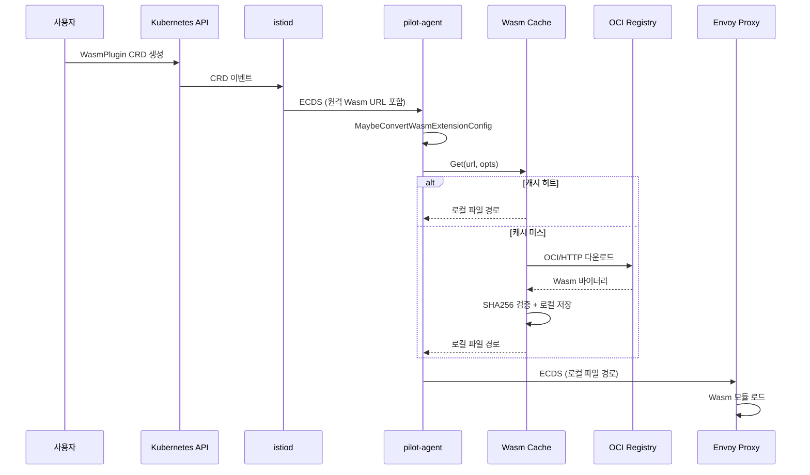

# 19. Wasm 확장과 웹훅 관리 Deep-Dive

> Istio의 WasmPlugin CRD 기반 Envoy 필터 확장 시스템과 MutatingWebhookConfiguration 자동 패칭 메커니즘

---

## 1. 개요

Istio는 두 가지 중요한 확장/관리 서브시스템을 제공한다:

1. **Wasm 확장 (`pkg/wasm/`)**: WasmPlugin CRD를 통해 Envoy 프록시에 사용자 정의 필터를 동적으로 추가하는 메커니즘. OCI 이미지 또는 HTTP URL에서 Wasm 바이너리를 다운로드하고, 로컬 파일 캐시에 저장한 뒤, Envoy 설정의 원격 참조를 로컬 파일 참조로 변환한다.

2. **웹훅 관리 (`pkg/webhooks/`)**: istiod가 관리하는 MutatingWebhookConfiguration의 CA 번들을 자동으로 패칭하여 인증서 로테이션 시에도 사이드카 인젝션이 중단 없이 동작하도록 보장한다.

```
┌─────────────────────────────────────────────────────────────────┐
│                    WasmPlugin CRD 처리 흐름                      │
│                                                                 │
│  WasmPlugin CR ──→ istiod ──→ ECDS Extension Config            │
│                       │                                         │
│                       ▼                                         │
│               pilot-agent (istio-agent)                         │
│                       │                                         │
│              ┌────────┴────────┐                                │
│              │  Wasm Cache     │                                │
│              │  (LocalFile)    │                                │
│              └────────┬────────┘                                │
│                       │                                         │
│         ┌─────────────┼─────────────┐                          │
│         ▼             ▼             ▼                          │
│    OCI Registry   HTTP Server   Local File                    │
│    (oci://...)    (https://...)  (/path/to.wasm)              │
│                                                                 │
│  다운로드 후 ──→ SHA256 검증 ──→ 로컬 저장 ──→ Envoy에 전달     │
└─────────────────────────────────────────────────────────────────┘
```

---

## 2. Wasm 확장 아키텍처

### 2.1 전체 처리 파이프라인

Wasm 확장의 처리는 크게 3단계로 나뉜다:

**1단계: 컨트롤 플레인 (istiod)**
- WasmPlugin CRD를 감시하고 Envoy xDS Extension Config(ECDS)로 변환
- 원격 URL(OCI/HTTP)을 포함한 설정을 pilot-agent에 전달

**2단계: 데이터 플레인 에이전트 (pilot-agent)**
- ECDS 리소스 수신 시 `MaybeConvertWasmExtensionConfig()` 호출
- 원격 참조를 로컬 파일 경로로 변환

**3단계: Envoy 프록시**
- 로컬 파일에서 Wasm 모듈을 로드하여 필터 체인에 삽입

### 2.2 핵심 인터페이스와 구조체

```
// pkg/wasm/cache.go

Cache 인터페이스:
  - Get(url string, opts GetOptions) (string, error)
  - Cleanup()

LocalFileCache 구조체:
  - modules: map[moduleKey]*cacheEntry     // 체크섬 → 캐시 엔트리
  - checksums: map[string]*checksumEntry   // URL → 체크섬
  - httpFetcher: *HTTPFetcher             // HTTP 다운로더
  - dir: string                           // 로컬 저장 디렉토리
  - mux: sync.Mutex                       // 동시성 보호
  - cacheOptions                          // 설정 옵션
```

#### moduleKey와 cacheKey

```
// pkg/wasm/cache.go 라인 82-98

moduleKey:
  - name: string      // URL에서 태그/다이제스트를 제거한 이름
  - checksum: string   // SHA256 체크섬

cacheKey:
  - moduleKey          // 임베드
  - downloadURL: string       // 전체 다운로드 URL
  - resourceName: string      // WasmPlugin 리소스의 정규화된 이름
  - resourceVersion: string   // 리소스 버전 (변경 감지용)
```

#### cacheEntry

```
// pkg/wasm/cache.go 라인 100-108

cacheEntry:
  - modulePath: string           // 다운로드된 Wasm 파일의 로컬 경로
  - last: time.Time              // 마지막 참조 시간 (만료 판단용)
  - referencingURLs: sets.String // 이 엔트리를 참조하는 URL 집합
```

### 2.3 캐시 조회 흐름 (getOrFetch)

`Get()` 메서드가 호출되면 `getOrFetch()`가 핵심 로직을 수행한다:

```
// pkg/wasm/cache.go 라인 199-297

getOrFetch 흐름:
  1. URL 파싱
  2. 캐시 확인 (getEntry) - PullPolicy에 따라 resourceVersion 무시 여부 결정
  3. 캐시 미스 시 → 스킴별 다운로드:
     - http/https: HTTPFetcher로 바이너리 직접 다운로드
     - oci: ImageFetcher로 매니페스트 조회 → 다이제스트 추출
  4. 체크섬 검증:
     - 제공된 체크섬과 다운로드된 바이너리의 SHA256 비교
     - 불일치 시 에러 반환
  5. Wasm 바이너리 유효성 검사 (매직 넘버 확인)
  6. 캐시에 추가 (addEntry)
```

### 2.4 PullPolicy 동작

```
// pkg/wasm/options.go 라인 49-61

PullPolicy:
  Unspecified (0): 기본값 - OCI latest 태그만 Always, 나머지는 IfNotPresent
  IfNotPresent (1): 캐시에 있으면 재사용 (resourceVersion 무시)
  Always (2): resourceVersion 변경 시 항상 다시 풀

shouldIgnoreResourceVersion 로직:
  - Always → false (항상 resourceVersion 비교)
  - IfNotPresent → true (항상 캐시 우선)
  - Unspecified → OCI + latest 태그가 아닌 경우에만 true
```

---

## 3. Wasm 모듈 페칭

### 3.1 HTTP Fetcher

```
// pkg/wasm/httpfetcher.go

HTTPFetcher 구조체:
  - client: *http.Client            // 일반 HTTPS 클라이언트
  - insecureClient: *http.Client    // TLS 검증 생략 클라이언트
  - initialBackoff: time.Duration   // 초기 백오프 (500ms)
  - requestMaxRetry: int            // 최대 재시도 횟수
```

HTTP Fetcher의 핵심 동작:

1. **지수 백오프 재시도**: `backoff.NewExponentialBackOff`를 사용하여 500ms부터 시작하는 지수 백오프로 재시도
2. **크기 제한**: `io.LimitReader`로 256MB 제한
3. **자동 언박싱**: `unboxIfPossible()` 함수가 GZ, TAR 형식을 자동으로 해제

```
unboxIfPossible 로직:
  반복:
    if isValidWasmBinary(b) → 반환
    elif isGZ(b)           → gunzip 후 계속
    elif isPosixTar(b)     → 첫 파일 추출 후 계속
    else                   → 원본 반환
```

### 3.2 OCI Image Fetcher

```
// pkg/wasm/imagefetcher.go

ImageFetcher 구조체:
  - fetchOpts: []remote.Option   // go-containerregistry 옵션

지원하는 OCI 이미지 형식 (3가지):
  1. Docker 이미지: application/vnd.docker.distribution.manifest.v2+json
  2. OCI Standard (compat): application/vnd.oci.image.layer.v1.tar+gzip
  3. OCI Artifact: application/vnd.module.wasm.content.layer.v1+wasm
```

#### SSRF 보호

```
// pkg/wasm/imagefetcher.go 라인 68-154

ssrfProtectionTransport:
  - 401 응답의 WWW-Authenticate 헤더에서 realm URL 검증
  - 차단 대상:
    - 비-HTTP 스킴 (file://, gopher://)
    - 클라우드 메타데이터 서비스 (metadata.google.internal)
    - localhost
    - 사설/루프백/링크-로컬 IP (10.0.0.0/8, 172.16.0.0/12, 127.0.0.0/8, 169.254.0.0/16)
```

#### 인증 (wasmKeyChain)

```
// pkg/wasm/imagefetcher.go 라인 429-468

wasmKeyChain:
  - data: []byte  // dockerconfigjson 바이트

Resolve 흐름:
  1. "null" 데이터 필터링 (docker 라이브러리 크래시 방지)
  2. ConfigFile 로드
  3. 레지스트리별 인증 정보 조회
  4. Anonymous 또는 AuthConfig 반환
```

### 3.3 Wasm 바이너리 유효성 검사

```
// pkg/wasm/cache.go 라인 441-446

wasmMagicNumber = []byte{0x00, 0x61, 0x73, 0x6d}  // "\0asm"

isValidWasmBinary(in []byte) bool:
  - 최소 8바이트 (매직 넘버 4바이트 + 버전 4바이트)
  - 처음 4바이트가 매직 넘버와 일치하는지 확인
```

---

## 4. Wasm 설정 변환 (ECDS → 로컬 파일)

### 4.1 MaybeConvertWasmExtensionConfig

이 함수는 pilot-agent에서 ECDS 리소스를 받을 때 호출되며, 원격 Wasm 참조를 로컬 파일로 변환한다.

```
// pkg/wasm/convert.go 라인 100-182

MaybeConvertWasmExtensionConfig(resources []*anypb.Any, cache Cache):
  1. 모든 리소스를 병렬로 처리 (sync.WaitGroup)
  2. 각 리소스에 대해:
     a. tryUnmarshal로 TypedExtensionConfig → Wasm 설정 추출
     b. HTTP Wasm 필터 또는 Network Wasm 필터 구분
     c. convertHTTP/NetworkWasmConfigFromRemoteToLocal 호출
     d. 실패 시 FailOpen/FailClosed에 따라 RBAC 폴백 필터 생성
```

### 4.2 Fail-Open/Fail-Closed 메커니즘

```
Wasm 다운로드 실패 시:
  FailOpen (FAIL_OPEN):
    → 모든 트래픽 허용하는 RBAC 필터로 대체
    → allowHTTPTypedConfig: RBAC{ RulesStatPrefix: "wasm-default-allow" }

  FailClosed (FAIL_CLOSE 또는 기본값):
    → 모든 트래픽 거부하는 RBAC 필터로 대체
    → denyHTTPTypedConfig: RBAC{ Rules: RBAC{}, RulesStatPrefix: "wasm-default-deny" }
```

### 4.3 VM Config 재작성 (rewriteVMConfig)

```
// pkg/wasm/convert.go 라인 345-425

rewriteVMConfig 흐름:
  1. 환경변수에서 메타데이터 추출:
     - ISTIO_META_WASM_PULL_SECRET → 풀 시크릿
     - ISTIO_META_WASM_PULL_POLICY → 풀 정책
     - ISTIO_META_WASM_RESOURCE_VERSION → 리소스 버전
  2. ISTIO_META_ 접두사 환경변수 제거 (Envoy에 노출 방지)
  3. 캐시에서 Wasm 모듈 조회/다운로드
  4. VmConfig.Code를 원격 → 로컬로 재작성:
     AsyncDataSource_Local{ DataSource_Filename{ Filename: localPath } }
```

---

## 5. 캐시 관리

### 5.1 캐시 저장 구조

```
로컬 파일 시스템 구조:
  {cacheDir}/
    {sha256(moduleName)}/
      {checksum}.wasm

예:
  /var/lib/istio/data/wasm/
    a1b2c3d4e5f6.../
      0123456789abcdef....wasm
```

### 5.2 캐시 퍼지 (만료 정리)

```
// pkg/wasm/cache.go 라인 404-433

purge 고루틴:
  - PurgeInterval(기본 1시간)마다 실행
  - ModuleExpiry(기본 24시간) 이상 참조되지 않은 모듈 삭제
  - 파일 삭제 + checksums 맵 정리 + modules 맵 정리
  - wasmCacheEntries 메트릭 업데이트
```

### 5.3 기본 옵션

```
// pkg/wasm/options.go 라인 23-28

DefaultPurgeInterval         = 1시간
DefaultModuleExpiry          = 24시간
DefaultHTTPRequestTimeout    = 15초
DefaultHTTPRequestMaxRetries = 5
```

---

## 6. 모니터링 메트릭

```
// pkg/wasm/monitoring.go

wasm_cache_entries        (Gauge)  : 캐시에 저장된 Wasm 모듈 수
wasm_cache_lookup_count   (Sum)    : 캐시 조회 횟수 (hit=true/false)
wasm_remote_fetch_count   (Sum)    : 원격 페치 횟수와 결과
  - success, download_failure, manifest_failure, checksum_mismatched
wasm_config_conversion_count (Sum) : 설정 변환 횟수와 결과
  - success, no_remote_load, marshal_failure, unmarshal_failure, fetch_failure
wasm_config_conversion_duration (Distribution) : 변환 소요 시간 (ms)
```

---

## 7. 웹훅 관리 아키텍처

### 7.1 WebhookCertPatcher 구조체

```
// pkg/webhooks/webhookpatch.go 라인 46-58

WebhookCertPatcher:
  - revision: string          // 이 istiod 인스턴스의 리비전
  - webhookName: string       // 패칭할 웹훅 이름 접미사
  - queue: controllers.Queue  // 재시도 큐
  - CABundleWatcher: *keycertbundle.Watcher  // CA 번들 감시
  - webhooks: kclient.Client[*v1.MutatingWebhookConfiguration]
```

### 7.2 동작 흐름

```
┌─────────────────────────────────────────────────────────┐
│                WebhookCertPatcher 동작                    │
│                                                         │
│  [CA 인증서 변경]  ──→  CABundleWatcher ──→ 모든 웹훅 큐잉 │
│                                                         │
│  [웹훅 CR 변경]    ──→  informer       ──→ 해당 웹훅 큐잉  │
│                              ▼                          │
│                        ┌─────────────┐                  │
│                        │  Work Queue │                  │
│                        │  (재시도 포함) │                  │
│                        └──────┬──────┘                  │
│                               ▼                         │
│                    patchMutatingWebhookConfig            │
│                               │                         │
│                    1. 웹훅 CR 조회                        │
│                    2. 리비전 레이블 확인                    │
│                    3. CA 번들 로드                        │
│                    4. webhookName 일치 항목 찾기           │
│                    5. CABundle 비교 & 업데이트             │
└─────────────────────────────────────────────────────────┘
```

### 7.3 패칭 로직 상세

```
// pkg/webhooks/webhookpatch.go 라인 120-168

patchMutatingWebhookConfig 흐름:
  1. webhooks.Get(name, "") 로 MutatingWebhookConfiguration 조회
  2. 리비전 확인:
     - istio.io/rev 레이블이 없으면 Istio 웹훅이 아닌 것으로 간주 → 스킵
     - 레이블 값 ≠ 자신의 리비전 → errWrongRevision 반환 (재시도 불필요)
  3. CA 번들 로드: CABundleWatcher에서 최신 CA 인증서 PEM 가져오기
  4. 모든 Webhook 항목 순회:
     - webhookName 접미사가 일치하는 항목 찾기
     - ClientConfig.CABundle과 비교
     - 다르면 updated=true로 표시
  5. updated=true이면 webhooks.Update(config) 호출
```

### 7.4 재시도 전략

```
// pkg/webhooks/webhookpatch.go 라인 78-87

Rate Limiter: FastSlowRateLimiter
  - Fast: 100ms 간격, 최대 5회 (충돌 빠른 감지)
  - Slow: 1분 간격 (지속적 불일치 상태)
  - MaxAttempts: math.MaxInt (무한 재시도)

재시도 불필요한 에러 (nil 반환):
  - NotFound: 웹훅 CR이 삭제됨
  - errWrongRevision: 다른 리비전의 웹훅
  - errNoWebhookWithName: 대상 웹훅 이름이 없음
  - errNotFound: 내부 조회 실패
```

### 7.5 CA 번들 감시

```
// pkg/webhooks/webhookpatch.go 라인 171-185

startCaBundleWatcher:
  1. CABundleWatcher에 워처 등록
  2. watchCh에서 이벤트 수신
  3. CA 번들 변경 시 모든 MutatingWebhookConfiguration을 큐에 추가
  4. 각 웹훅이 patchMutatingWebhookConfig를 통해 갱신됨
```

---

## 8. 웹훅 검증 (validation)

```
pkg/webhooks/ 디렉토리 구조:
  webhookpatch.go    - CA 번들 패칭 (위에서 분석)
  monitoring.go      - 메트릭 정의
  validation/        - ValidatingWebhookConfiguration 관련
  util/              - CA 번들 로딩 유틸리티
```

---

## 9. 설계 결정과 "왜(Why)"

### 9.1 왜 pilot-agent에서 Wasm을 다운로드하는가?

istiod가 아닌 pilot-agent가 Wasm 모듈을 다운로드하는 이유:
- **확장성**: 수천 개의 사이드카가 있을 때 istiod가 모든 Wasm 바이너리를 전달하면 대역폭 병목
- **보안**: 각 파드의 pilot-agent가 자신의 PullSecret으로 인증하여 최소 권한 원칙 준수
- **효율성**: 동일 Wasm 모듈이 여러 워크로드에서 사용될 때 노드 레벨 캐싱 가능

### 9.2 왜 RBAC 폴백을 사용하는가?

Wasm 다운로드 실패 시 단순히 필터를 제거하는 대신 RBAC 폴백을 사용하는 이유:
- **Fail-Open**: 가용성 우선 → 트래픽이 계속 흐르도록 허용
- **Fail-Closed**: 보안 우선 → Wasm 필터 없이 트래픽을 허용하면 보안 정책 우회 가능
- RBAC 필터는 Envoy의 기본 기능이므로 추가 의존성 없이 안전한 폴백 제공

### 9.3 왜 웹훅 패칭에 Fast/Slow Rate Limiter를 사용하는가?

- **Fast (100ms, 5회)**: 여러 istiod 인스턴스가 동시에 패칭할 때 빠르게 충돌을 감지하고 재시도
- **Slow (1분)**: CA 인증서 불일치 같은 장기적 문제에서 API 서버/etcd 과부하 방지
- **무한 재시도**: 웹훅 패칭 실패는 사이드카 인젝션 전체를 중단시키므로 포기 불가

### 9.4 왜 체크섬 기반 캐시 키를 사용하는가?

```
moduleKey = {name, checksum}

장점:
  - 같은 URL에서 다른 버전의 Wasm 모듈을 캐싱 가능
  - 체크섬이 동일하면 다른 URL이라도 동일 파일 재사용
  - OCI 이미지의 태그 변경을 다이제스트 기반으로 추적 가능
```

---

## 10. Wasm 확장과 ECDS의 관계

```
┌──────────────────────────────────────────────────────────┐
│                    ECDS (Extension Config Discovery)      │
│                                                          │
│  istiod:                                                 │
│    WasmPlugin CRD → WasmPluginWrapper → ECDS Resource    │
│    (pilot/pkg/model/extensions.go)                       │
│                                                          │
│  pilot-agent:                                            │
│    ECDS Resource → MaybeConvertWasmExtensionConfig       │
│    → 원격 URL을 로컬 파일로 변환                           │
│    → 변환된 ECDS Resource를 Envoy에 전달                  │
│                                                          │
│  Envoy:                                                  │
│    ECDS → 로컬 Wasm 파일 로드 → HTTP/Network 필터 삽입    │
└──────────────────────────────────────────────────────────┘
```

---

## 11. 운영 고려사항

### 11.1 Wasm 캐시 디렉토리

```
기본 경로: /var/lib/istio/data/wasm/
환경변수: ISTIO_AGENT_WASM_CACHE_DIR

디스크 사용량 모니터링:
  - wasm_cache_entries 메트릭으로 캐시 항목 수 확인
  - PurgeInterval/ModuleExpiry 조정으로 디스크 관리
```

### 11.2 Insecure Registry 설정

```
InsecureRegistries 설정:
  - 특정 호스트: ["myregistry.local:5000"]
  - 전체 허용: ["*"] (테스트 환경 전용)

allowInsecure(host) 판단:
  allowAllInsecureRegistries || InsecureRegistries.Contains(host)
```

### 11.3 웹훅 패칭 모니터링

```
메트릭:
  - webhook_patch_attempts_total: 패칭 시도 횟수
  - webhook_patch_retries_total: 재시도 횟수
  - webhook_patch_failures_total: 실패 횟수 (reason별)
    - webhook_config_not_found
    - wrong_revision
    - webhook_entry_not_found
    - load_ca_bundle_failure
    - webhook_update_failure
```

---

## 12. 코드 흐름 요약 (Mermaid)



---

## 13. 소스 코드 경로 정리

| 파일 | 역할 |
|------|------|
| `pkg/wasm/cache.go` | LocalFileCache 구현, Get/addEntry/getEntry/purge |
| `pkg/wasm/httpfetcher.go` | HTTP/HTTPS Wasm 모듈 다운로더, unbox 로직 |
| `pkg/wasm/imagefetcher.go` | OCI 이미지 페처, SSRF 보호, Docker/OCI 형식 지원 |
| `pkg/wasm/convert.go` | ECDS 리소스 변환, 원격→로컬 재작성, RBAC 폴백 |
| `pkg/wasm/options.go` | PullPolicy, GetOptions, 기본값 정의 |
| `pkg/wasm/monitoring.go` | Prometheus 메트릭 정의 |
| `pkg/webhooks/webhookpatch.go` | WebhookCertPatcher, CA 번들 자동 패칭 |
| `pkg/webhooks/monitoring.go` | 웹훅 패칭 메트릭 |
| `pkg/webhooks/util/` | CA 번들 로딩 유틸리티 |
| `pkg/webhooks/validation/` | ValidatingWebhook 관련 |

---

## 14. 관련 PoC

- **poc-wasm-cache**: Wasm 모듈 캐시 시스템 시뮬레이션 (체크섬 검증, 만료 퍼지, PullPolicy)
- **poc-webhook-patcher**: 웹훅 CA 번들 자동 패칭 시뮬레이션 (리비전 필터링, Fast/Slow 재시도)
