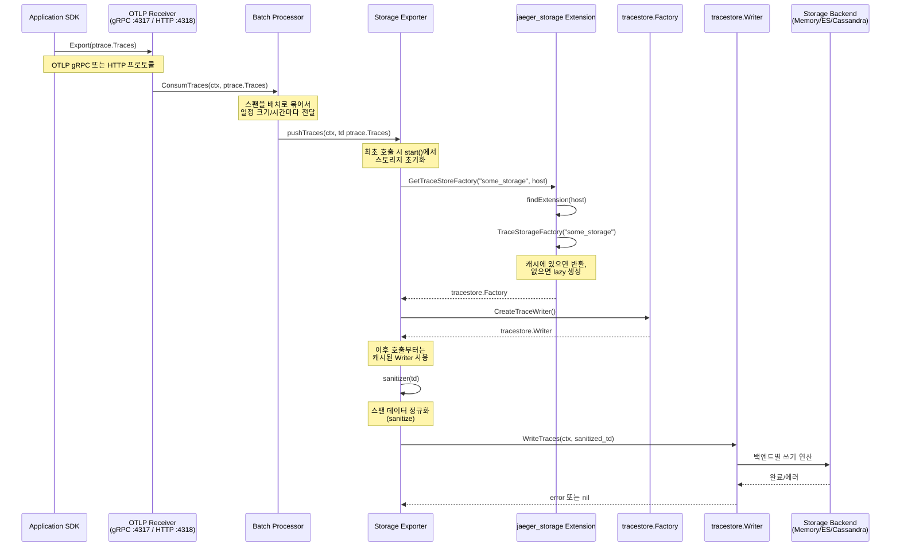
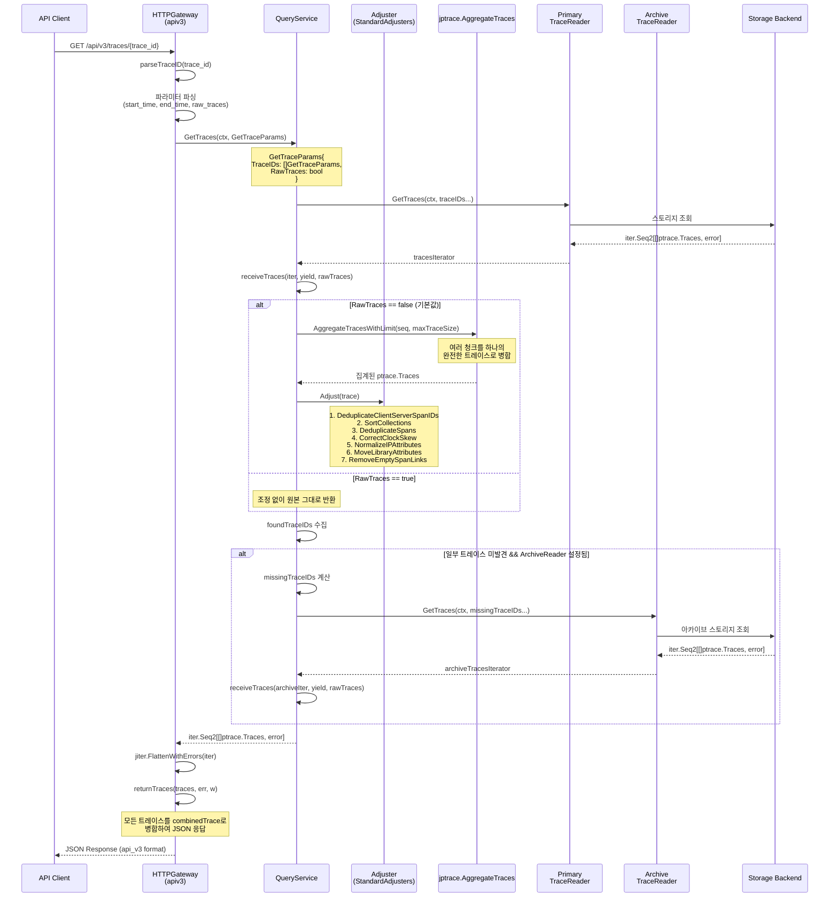
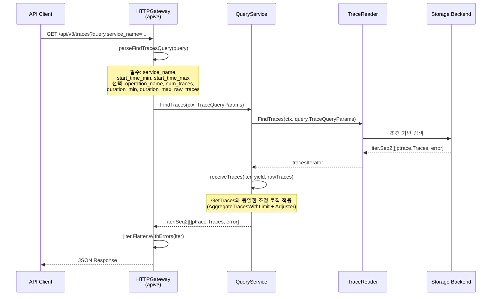
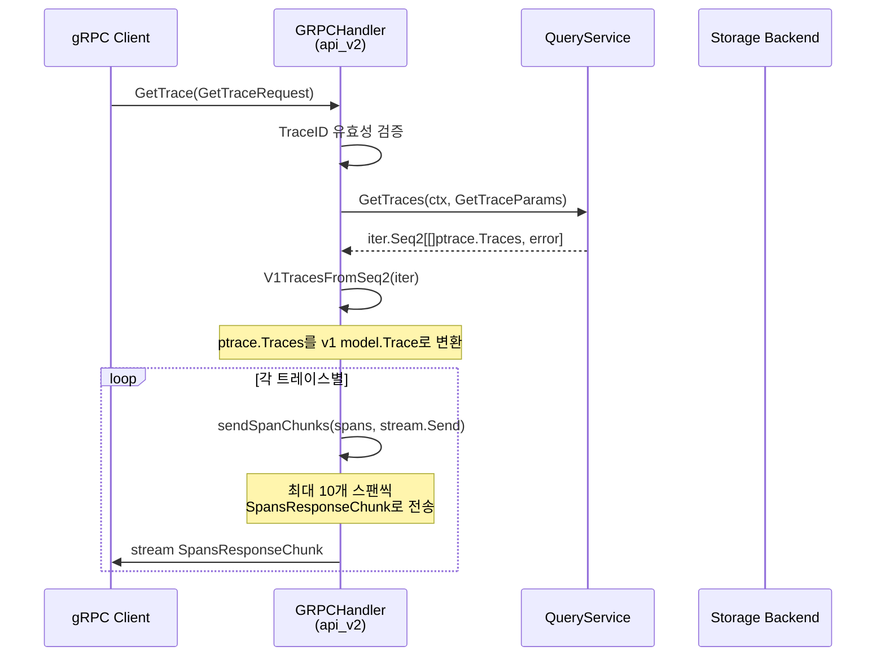
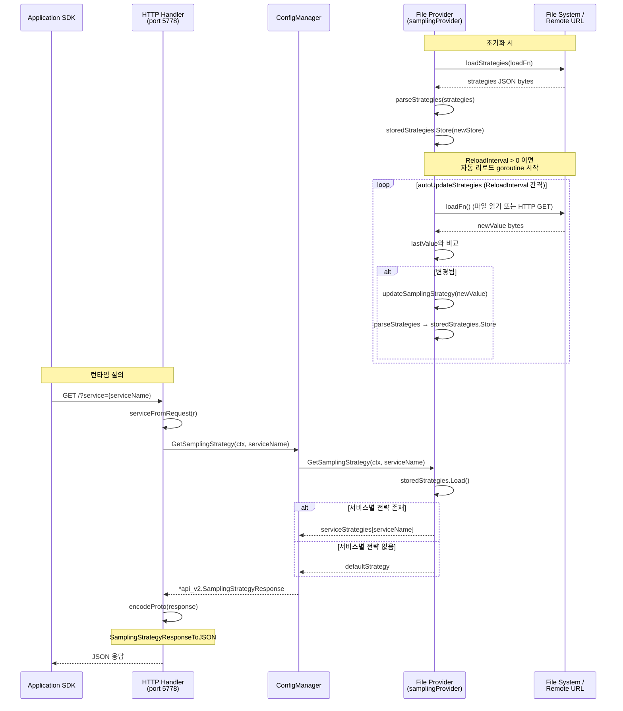
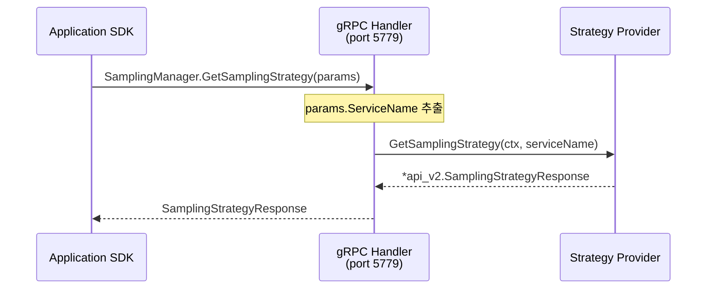
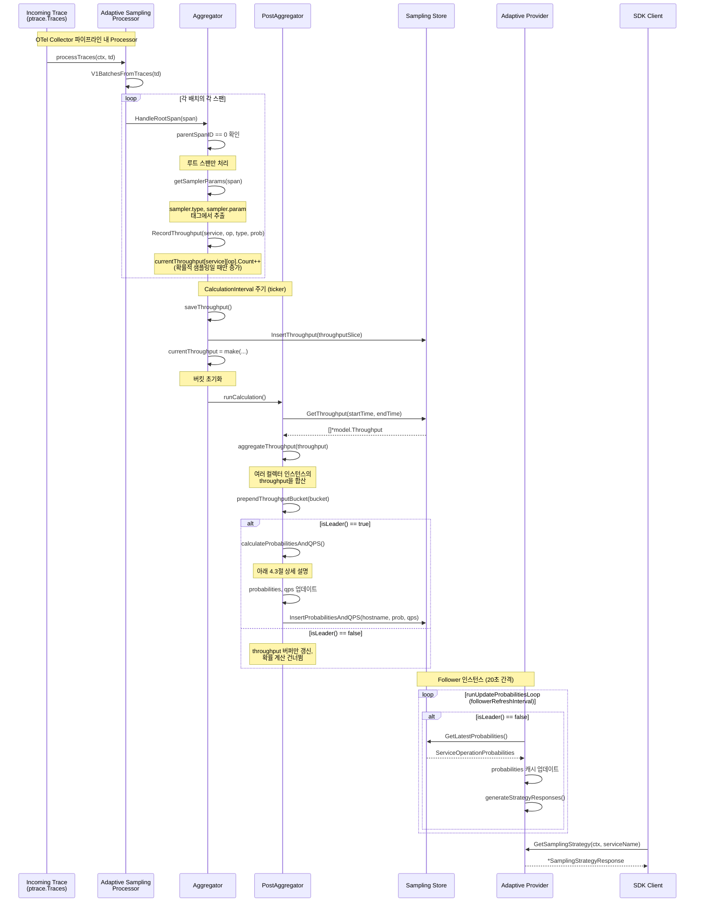
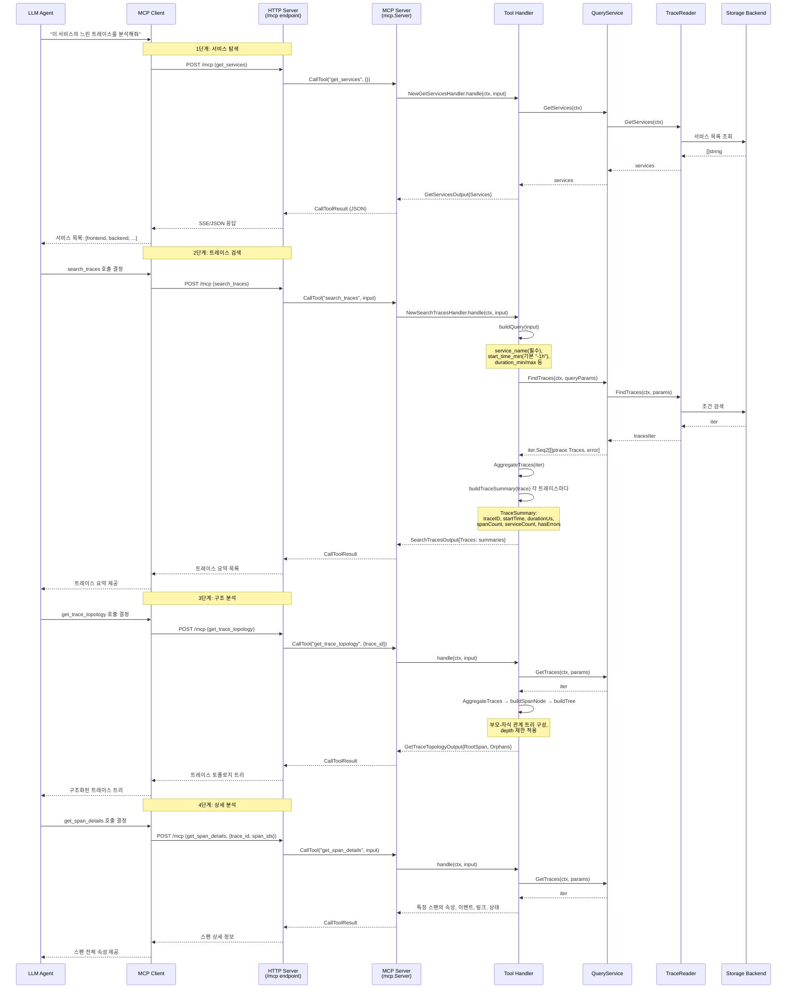
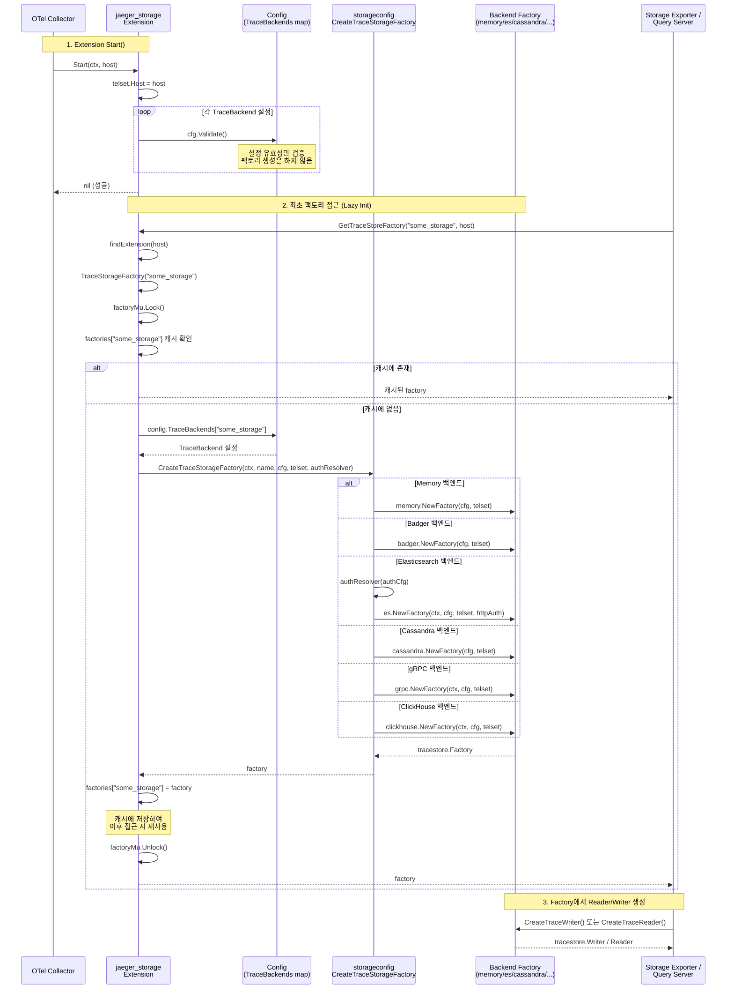

# Jaeger v2 시퀀스 다이어그램

이 문서는 Jaeger v2의 핵심 요청 흐름을 Mermaid 시퀀스 다이어그램과 함께 상세히 설명한다.
Jaeger v2는 OpenTelemetry Collector 기반 아키텍처를 채택하여, 모든 데이터 흐름이
OTel Collector의 파이프라인(receivers -> processors -> exporters) 구조를 따른다.

---

## 1. 트레이스 수집 흐름 (Trace Collection Flow)

### 1.1 파이프라인 설정

`all-in-one.yaml`에서 정의된 기본 파이프라인 구성은 다음과 같다.

```yaml
# cmd/jaeger/internal/all-in-one.yaml
service:
  pipelines:
    traces:
      receivers: [otlp, jaeger, zipkin]
      processors: [batch]
      exporters: [jaeger_storage_exporter]

exporters:
  jaeger_storage_exporter:
    trace_storage: some_storage
```

세 가지 수신기(OTLP, Jaeger, Zipkin)가 트레이스 데이터를 받아들이고, `batch` 프로세서가
스팬을 배치로 묶은 뒤, `jaeger_storage_exporter`가 스토리지에 기록한다.

### 1.2 시퀀스 다이어그램



### 1.3 핵심 코드 경로

**Storage Exporter 시작** (`cmd/jaeger/internal/exporters/storageexporter/exporter.go`):

```go
func (exp *storageExporter) start(_ context.Context, host component.Host) error {
    f, err := jaegerstorage.GetTraceStoreFactory(exp.config.TraceStorage, host)
    if err != nil {
        return fmt.Errorf("cannot find storage factory: %w", err)
    }
    if exp.traceWriter, err = f.CreateTraceWriter(); err != nil {
        return fmt.Errorf("cannot create trace writer: %w", err)
    }
    return nil
}
```

**트레이스 기록** (같은 파일):

```go
func (exp *storageExporter) pushTraces(ctx context.Context, td ptrace.Traces) error {
    return exp.traceWriter.WriteTraces(ctx, exp.sanitizer(td))
}
```

`pushTraces`는 OTel Collector가 `batch` 프로세서를 거친 `ptrace.Traces`를 인자로
호출한다. `sanitizer`로 데이터를 정규화한 후 `WriteTraces`로 스토리지에 기록한다.

### 1.4 수신기별 엔드포인트

| 수신기 | 프로토콜 | 기본 포트 | 비고 |
|--------|----------|-----------|------|
| OTLP gRPC | gRPC | 4317 | 권장 수집 경로 |
| OTLP HTTP | HTTP | 4318 | JSON/Protobuf |
| Jaeger gRPC | gRPC | 14250 | 레거시 호환 |
| Jaeger Thrift HTTP | HTTP | 14268 | 레거시 호환 |
| Jaeger Thrift Binary | UDP | 6832 | 레거시 호환 |
| Jaeger Thrift Compact | UDP | 6831 | 레거시 호환 |
| Zipkin | HTTP | 9411 | Zipkin 호환 |

---

## 2. 트레이스 조회 흐름 (Trace Query Flow)

### 2.1 API 엔드포인트

Jaeger v2의 Query Service는 두 가지 API 계층을 제공한다.

**APIv3 (HTTP REST)**:
- `GET /api/v3/traces/{trace_id}` -- 특정 트레이스 조회
- `GET /api/v3/traces` -- 조건 기반 트레이스 검색
- `GET /api/v3/services` -- 서비스 목록 조회
- `GET /api/v3/operations` -- 오퍼레이션 목록 조회

**APIv2 (gRPC)**:
- `QueryService.GetTrace` -- 트레이스 ID 기반 조회
- `QueryService.FindTraces` -- 조건 기반 검색
- `QueryService.GetServices` -- 서비스 목록
- `QueryService.GetOperations` -- 오퍼레이션 목록

### 2.2 GetTrace 시퀀스 다이어그램



### 2.3 FindTraces 시퀀스 다이어그램



### 2.4 gRPC 핸들러 흐름 (APIv2)



### 2.5 핵심 코드 경로

**QueryService.GetTraces** (`cmd/jaeger/internal/extension/jaegerquery/querysvc/service.go`):

```go
func (qs QueryService) GetTraces(ctx context.Context, params GetTraceParams,
) iter.Seq2[[]ptrace.Traces, error] {
    getTracesIter := qs.traceReader.GetTraces(ctx, params.TraceIDs...)
    return func(yield func([]ptrace.Traces, error) bool) {
        foundTraceIDs, proceed := qs.receiveTraces(getTracesIter, yield, params.RawTraces)
        if proceed && qs.options.ArchiveTraceReader != nil {
            // 미발견 트레이스를 아카이브에서 조회
            var missingTraceIDs []tracestore.GetTraceParams
            for _, id := range params.TraceIDs {
                if _, found := foundTraceIDs[id.TraceID]; !found {
                    missingTraceIDs = append(missingTraceIDs, id)
                }
            }
            if len(missingTraceIDs) > 0 {
                getArchiveTracesIter := qs.options.ArchiveTraceReader.GetTraces(ctx, missingTraceIDs...)
                qs.receiveTraces(getArchiveTracesIter, yield, params.RawTraces)
            }
        }
    }
}
```

**receiveTraces의 조정 분기** (같은 파일):

```go
if rawTraces {
    seq(processTraces)
} else {
    jptrace.AggregateTracesWithLimit(seq, qs.options.MaxTraceSize)(
        func(trace ptrace.Traces, err error) bool {
            return processTraces([]ptrace.Traces{trace}, err)
        })
}
```

핵심 설계 포인트:
- `RawTraces=false`(기본값)이면 `AggregateTracesWithLimit`로 청크를 병합하고 `Adjuster`를 적용한다.
- `RawTraces=true`이면 스토리지에서 받은 데이터를 어떠한 변환 없이 그대로 반환한다.
- Primary에서 찾지 못한 트레이스 ID만 골라서 Archive를 조회하므로, 불필요한 아카이브 접근을 최소화한다.

---

## 3. 샘플링 전략 제공 흐름 (Sampling Strategy Flow)

### 3.1 개요

Jaeger v2의 `remote_sampling` 익스텐션은 SDK 클라이언트에게 샘플링 전략을 제공한다.
두 가지 제공자(Provider) 모드를 지원한다.

| 모드 | 설명 | 설정 키 |
|------|------|---------|
| File | JSON 파일 기반 정적 전략, 자동 리로드 지원 | `file.path` |
| Adaptive | 실시간 트래픽 기반 동적 확률 계산 | `adaptive.sampling_store` |

```yaml
# all-in-one.yaml
extensions:
  remote_sampling:
    file:
      path:
      default_sampling_probability: 1
      reload_interval: 1s
    http:
      endpoint: "localhost:5778"
    grpc:
      endpoint: "localhost:5779"
```

### 3.2 파일 기반 전략 제공 시퀀스



### 3.3 gRPC 샘플링 핸들러



gRPC 핸들러(`internal/sampling/grpc/grpc_handler.go`)는 단순한 위임 구조다:

```go
func (s Handler) GetSamplingStrategy(
    ctx context.Context,
    param *api_v2.SamplingStrategyParameters,
) (*api_v2.SamplingStrategyResponse, error) {
    return s.samplingProvider.GetSamplingStrategy(ctx, param.GetServiceName())
}
```

### 3.4 파일 프로바이더 핵심 설계

파일 프로바이더(`internal/sampling/samplingstrategy/file/provider.go`)는 `atomic.Value`를
사용하여 lock-free 읽기를 구현한다:

```
storedStrategies (atomic.Value)
├── defaultStrategy: *SamplingStrategyResponse
└── serviceStrategies: map[string]*SamplingStrategyResponse
```

- **쓰기**: `parseStrategies()`에서 새 `storedStrategies` 객체를 생성 후 `atomic.Store`
- **읽기**: `GetSamplingStrategy()`에서 `atomic.Load`로 현재 값 반환
- 리로드 중에도 읽기 요청이 블로킹되지 않는다.

---

## 4. 적응형 샘플링 계산 흐름 (Adaptive Sampling Calculation)

### 4.1 전체 아키텍처

적응형 샘플링은 세 개의 핵심 컴포넌트로 구성된다:

```
수신 트레이스
     │
     ▼
┌──────────────────────┐
│  Adaptive Sampling   │  OTel Collector Processor
│  Processor           │  (processTraces → HandleRootSpan)
└──────────┬───────────┘
           │
           ▼
┌──────────────────────┐
│  Aggregator          │  throughput 카운터 관리
│  (RecordThroughput)  │  주기적으로 saveThroughput → Storage
└──────────┬───────────┘
           │ runCalculation() 호출 (CalculationInterval마다)
           ▼
┌──────────────────────┐
│  PostAggregator      │  확률 계산 (리더만 수행)
│  (calculateProb...)  │  InsertProbabilitiesAndQPS → Storage
└──────────────────────┘
           │
           ▼
┌──────────────────────┐
│  Provider            │  GetLatestProbabilities → 캐시
│  (GetSamplingStrat)  │  SDK 클라이언트에게 전략 제공
└──────────────────────┘
```

### 4.2 처리량 수집 및 확률 계산 시퀀스



### 4.3 확률 계산 알고리즘

`PostAggregator.calculateProbability()` 메서드의 핵심 로직
(`internal/sampling/samplingstrategy/adaptive/post_aggregator.go`):

```
1. 이전 확률(oldProbability) 로드
   - 캐시에 없으면 InitialSamplingProbability 사용

2. 적응형 샘플링 사용 여부 판단
   - isUsingAdaptiveSampling()으로 확인
   - 해당 서비스/오퍼레이션이 실제로 적응형 샘플러를 쓰는지 검증

3. 목표 QPS 허용 범위 확인
   - withinTolerance(curQPS, targetQPS): 실제 QPS가 목표의 DeltaTolerance 이내면 변경 없음

4. 새 확률 계산 (PercentageIncreaseCappedCalculator)
   - newProbability = prevProbability * (targetQPS / curQPS)
   - QPS == 0: 확률을 2배로 증가 (최소 1개 스팬 확보)
   - QPS < targetQPS: 증가폭을 50%로 제한 (오버샘플링 방어)
   - QPS > targetQPS: 즉시 새 확률로 감소 (과다 수집 빠른 대응)

5. 경계 클램핑
   - max(MinSamplingProbability, min(1.0, newProbability))
```

**PercentageIncreaseCappedCalculator** (`calculationstrategy/percentage_increase_capped_calculator.go`):

```go
func (c PercentageIncreaseCappedCalculator) Calculate(
    targetQPS, curQPS, prevProbability float64,
) float64 {
    factor := targetQPS / curQPS
    newProbability := prevProbability * factor
    if factor > 1.0 {
        percentIncrease := (newProbability - prevProbability) / prevProbability
        if percentIncrease > c.percentageIncreaseCap {   // cap = 0.5 (50%)
            newProbability = prevProbability + (prevProbability * c.percentageIncreaseCap)
        }
    }
    return newProbability
}
```

**왜 증가만 제한하는가?**
- QPS가 목표보다 낮을 때(undersampling) 확률을 급격히 올리면 다음 주기에 과다 수집이 발생할 수 있다. 따라서 한 번에 최대 50%까지만 증가를 허용한다.
- 반대로 QPS가 목표보다 높을 때(oversampling)는 즉시 낮춰야 비용을 절감할 수 있으므로 제한 없이 직접 감소한다.

### 4.4 가중 QPS 계산

```go
func (p *PostAggregator) calculateWeightedQPS(allQPS []float64) float64 {
    weights := p.weightVectorCache.GetWeights(len(allQPS))
    var qps float64
    for i := range allQPS {
        qps += allQPS[i] * weights[i]
    }
    return qps
}
```

가중치는 최근 버킷에 더 높은 비중을 부여한다. `BucketsForCalculation`개의 과거 버킷을
사용하여 트래픽 변동을 평활화하되, 최근 추세를 더 반영한다.

### 4.5 리더/팔로워 역할 분담

```
┌────────────────────────────────────────────────┐
│           리더 (Leader) 인스턴스                │
│  1. aggregator: throughput 수집 + 저장          │
│  2. postAggregator: 확률 계산 + 저장            │
│  3. provider: 로컬 캐시에서 전략 제공            │
├────────────────────────────────────────────────┤
│         팔로워 (Follower) 인스턴스              │
│  1. aggregator: throughput 수집 + 저장          │
│  2. postAggregator: throughput만 로드 (계산 X)  │
│  3. provider: 20초마다 스토리지에서 확률 fetch   │
└────────────────────────────────────────────────┘
```

- `leaderelection.DistributedElectionParticipant`가 분산 락을 관리한다.
- 리더가 죽으면 `addJitter`를 적용하여 팔로워들이 균등하게 분산된 시점에 락 획득을 시도한다.

---

## 5. MCP 도구 호출 흐름 (MCP Tool Call Flow)

### 5.1 개요

Jaeger v2는 Model Context Protocol(MCP)을 통해 LLM 기반 분석을 지원한다.
`jaeger_mcp` 익스텐션이 MCP 서버를 운영하며, `jaeger_query` 익스텐션의
`QueryService`를 사용하여 트레이스 데이터를 제공한다.

```yaml
# all-in-one.yaml
extensions:
  jaeger_mcp:
    http:
      endpoint: "localhost:16687"
```

등록된 MCP 도구 목록:

| 도구 | 설명 | 의존 |
|------|------|------|
| `get_services` | 서비스 목록 조회 | -- |
| `get_span_names` | 스팬 이름 목록 조회 | get_services |
| `search_traces` | 조건 기반 트레이스 검색 (요약) | get_services |
| `get_trace_topology` | 트레이스 구조 트리 (부모-자식 관계) | search_traces |
| `get_critical_path` | 크리티컬 패스 식별 | search_traces |
| `get_span_details` | 특정 스팬의 전체 상세 정보 | get_trace_topology |
| `get_trace_errors` | 에러 스팬 전체 상세 | search_traces |
| `health` | 서버 상태 확인 | -- |

### 5.2 시퀀스 다이어그램



### 5.3 Progressive Disclosure 패턴

MCP 도구는 점진적 공개(progressive disclosure) 패턴으로 설계되어 있다.
LLM이 한 번에 과도한 데이터를 받지 않도록, 단계별로 필요한 정보만 요청한다.

```
get_services          → 서비스 이름만 반환
     │
     ▼
search_traces         → 트레이스 요약만 반환 (traceID, 기간, 에러 유무)
     │
     ├─────────────────────────────────────┐
     ▼                                     ▼
get_trace_topology    → 구조 트리만 반환     get_trace_errors → 에러 스팬 상세
     │                  (속성/로그 제외)
     ▼
get_span_details      → 특정 스팬의 전체 상세
get_critical_path     → 지연 크리티컬 패스
```

**왜 이 패턴인가?**
- LLM의 컨텍스트 윈도우는 유한하다. 수백 개의 스팬 상세를 한 번에 전달하면 컨텍스트를 낭비한다.
- 트레이스 요약 --> 토폴로지 --> 특정 스팬 상세 순서로 점진적으로 정보를 좁혀가면, LLM이 각 단계에서 다음 호출을 결정할 수 있다.
- `search_traces`는 `TraceSummary`(traceID, spanCount, durationUs, hasErrors 등)만 반환하여 LLM이 관심 있는 트레이스를 선택할 수 있게 한다.

### 5.4 MCP 서버 초기화

`cmd/jaeger/internal/extension/jaegermcp/server.go`의 `Start()`:

```go
func (s *server) Start(ctx context.Context, host component.Host) error {
    // jaegerquery 익스텐션에서 QueryService 획득
    queryExt, err := jaegerquery.GetExtension(host)
    s.queryAPI = queryExt.QueryService()

    // MCP 서버 생성
    s.mcpServer = mcp.NewServer(impl, &mcp.ServerOptions{})
    s.registerTools()   // 모든 MCP 도구 등록

    // HTTP 서버 시작 (/mcp 엔드포인트)
    mcpHandler := mcp.NewStreamableHTTPHandler(...)
    mux.Handle("/mcp", mcpHandler)
    s.httpServer.Serve(listener)
}
```

`Dependencies()`가 `jaegerquery.ID`를 반환하여, MCP 서버는 반드시 Query 익스텐션이
시작된 후에 초기화된다.

---

## 6. 스토리지 팩토리 초기화 흐름 (Storage Factory Initialization)

### 6.1 지연 초기화 설계

Jaeger v2의 스토리지 팩토리는 **지연 초기화(lazy initialization)** 패턴을 사용한다.
`jaeger_storage` 익스텐션의 `Start()` 시점에는 설정 유효성만 검증하고,
실제 스토리지 팩토리는 최초 접근 시에 생성된다.

**왜 지연 초기화인가?**
- 스토리지 초기화는 네트워크 연결(ES, Cassandra 등)을 포함하며 시간이 걸린다.
- 모든 백엔드를 사전에 초기화하면, 사용하지 않는 백엔드(예: 아카이브 스토리지)도 연결을 맺게 된다.
- 지연 초기화로 실제 필요한 백엔드만 초기화하여 시작 시간과 리소스를 절약한다.

### 6.2 시퀀스 다이어그램



### 6.3 핵심 코드 경로

**Extension Start** (`cmd/jaeger/internal/extension/jaegerstorage/extension.go`):

```go
func (s *storageExt) Start(_ context.Context, host component.Host) error {
    s.telset.Host = host
    // 설정 유효성 검증만 수행
    for name, cfg := range s.config.TraceBackends {
        if err := cfg.Validate(); err != nil {
            return fmt.Errorf("invalid configuration for trace storage '%s': %w", name, err)
        }
    }
    return nil  // 팩토리 생성 없이 반환
}
```

**TraceStorageFactory (Lazy Init)** (같은 파일):

```go
func (s *storageExt) TraceStorageFactory(name string) (tracestore.Factory, error) {
    s.factoryMu.Lock()
    defer s.factoryMu.Unlock()

    // 캐시 확인
    if f, ok := s.factories[name]; ok {
        return f, nil
    }

    // 설정 확인
    cfg, ok := s.config.TraceBackends[name]
    if !ok {
        return nil, fmt.Errorf("storage '%s' not declared...", name)
    }

    // 최초 접근 시 팩토리 생성
    factory, err := storageconfig.CreateTraceStorageFactory(
        context.Background(), name, cfg, s.telset, authResolver,
    )
    if err != nil {
        return nil, err
    }

    s.factories[name] = factory  // 캐시에 저장
    return factory, nil
}
```

**CreateTraceStorageFactory 디스패치** (`cmd/internal/storageconfig/factory.go`):

```go
func CreateTraceStorageFactory(...) (tracestore.Factory, error) {
    switch {
    case backend.Memory != nil:
        factory, err = memory.NewFactory(*backend.Memory, telset)
    case backend.Badger != nil:
        factory, err = badger.NewFactory(*backend.Badger, telset)
    case backend.GRPC != nil:
        factory, err = grpc.NewFactory(ctx, *backend.GRPC, telset)
    case backend.Cassandra != nil:
        factory, err = cassandra.NewFactory(*backend.Cassandra, telset)
    case backend.Elasticsearch != nil:
        // ... authResolver 처리 후
        factory, err = es.NewFactory(ctx, *backend.Elasticsearch, telset, httpAuth)
    case backend.Opensearch != nil:
        factory, err = es.NewFactory(ctx, *backend.Opensearch, telset, httpAuth)
    case backend.ClickHouse != nil:
        factory, err = clickhouse.NewFactory(ctx, *backend.ClickHouse, telset)
    }
    return factory, nil
}
```

### 6.4 팩토리 인터페이스 계층

```
tracestore.Factory (interface)
├── CreateTraceReader() → tracestore.Reader
│   ├── GetTraces(ctx, ...GetTraceParams) → iter.Seq2
│   ├── GetServices(ctx) → []string
│   ├── GetOperations(ctx, query) → []Operation
│   └── FindTraces(ctx, query) → iter.Seq2
└── CreateTraceWriter() → tracestore.Writer
    └── WriteTraces(ctx, ptrace.Traces) → error
```

각 백엔드(memory, elasticsearch, cassandra, badger, grpc, clickhouse)가 이 인터페이스를
구현하며, `CreateTraceStorageFactory`가 설정에 따라 적절한 구현체를 생성한다.

### 6.5 종료 처리

`Shutdown()`에서 생성된 모든 팩토리를 순회하며 `Close()`를 호출한다:

```go
func (s *storageExt) Shutdown(context.Context) error {
    var errs []error
    for _, factory := range s.factories {
        if closer, ok := factory.(io.Closer); ok {
            err := closer.Close()
            if err != nil {
                errs = append(errs, err)
            }
        }
    }
    return errors.Join(errs...)
}
```

---

## 요약: 전체 데이터 흐름 맵

```
              ┌─────────────────────────────────────────────────────────┐
              │                   OTel Collector                        │
              │                                                         │
              │  ┌──────────┐   ┌───────────┐   ┌───────────────────┐  │
SDK ─────────►│  │ Receivers │──►│ Processors│──►│ Storage Exporter  │  │
(OTLP/Jaeger/ │  │ (otlp,    │   │ (batch,   │   │ (jaeger_storage_  │  │
 Zipkin)       │  │  jaeger,  │   │  adaptive │   │  exporter)        │  │
              │  │  zipkin)  │   │  sampling)│   │                   │  │
              │  └──────────┘   └───────────┘   └────────┬──────────┘  │
              │                                           │             │
              │  Extensions:                              ▼             │
              │  ┌────────────────┐   ┌─────────────────────────┐      │
              │  │ jaeger_storage │◄──┤ GetTraceStoreFactory()  │      │
              │  │ (팩토리 관리)    │   └─────────────────────────┘      │
              │  └───────┬────────┘                                     │
              │          │                                              │
              │          ▼                                              │
              │  ┌────────────────┐   ┌─────────────────────────┐      │
              │  │ Storage Backend│◄──┤ jaeger_query Extension  │      │
              │  │ (실제 저장소)    │   │ (QueryService)          │◄─── UI/API
              │  └────────────────┘   └──────────┬──────────────┘      │
              │                                   │                     │
              │                       ┌───────────▼──────────────┐     │
              │                       │ jaeger_mcp Extension     │◄─── LLM
              │                       │ (MCP Server)             │     │
              │                       └──────────────────────────┘     │
              │                                                         │
              │  ┌────────────────────────┐                            │
              │  │ remote_sampling        │◄────────────────────── SDK Poll
              │  │ (File/Adaptive Provider)│                           │
              │  └────────────────────────┘                            │
              └─────────────────────────────────────────────────────────┘
```
