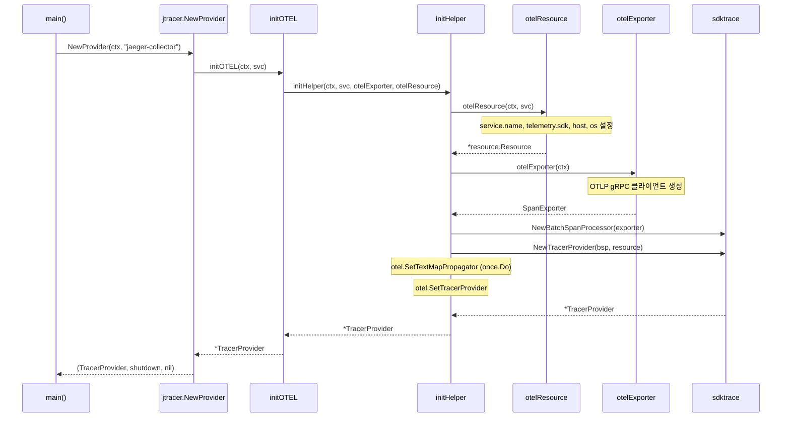

# 19. jtracer (자기 추적) + expvar Extension (내부 계측) Deep-Dive

> Jaeger 소스코드 기반 분석 문서 (P2 심화)
> 분석 대상: `internal/jtracer/`, `cmd/jaeger/internal/extension/expvar/`

---

## 1. 개요

### 1.1 왜 자기 추적(Self-Tracing)이 필요한가?

분산 트레이싱 시스템 자체도 분산 시스템이다. Jaeger는 Collector, Query, Storage 등 여러 컴포넌트로
구성되며, 이 컴포넌트들 사이의 요청 흐름을 추적하지 않으면 Jaeger 자체의 장애를 진단할 수 없다.

```
관측 대상 서비스                    Jaeger 내부
+------------------+              +------------------+
| 마이크로서비스 A  | --spans-->   | Collector        |
| 마이크로서비스 B  | --spans-->   |   +-----------+  |
| 마이크로서비스 C  | --spans-->   |   | Storage   |  |
+------------------+              |   +-----------+  |
                                  |        |         |
                                  |   +-----------+  |
                                  |   | Query     |  |
                                  |   +-----------+  |
                                  +------------------+
                                         |
                                  자기 자신의 스팬도
                                  수집/저장/조회
```

이를 "bootstrap problem"이라 부른다 -- 추적 시스템이 자기 자신을 추적하려면,
추적 시스템이 이미 작동 중이어야 한다.

### 1.2 jtracer와 expvar의 관계

| 컴포넌트 | 역할 | 프로토콜 |
|----------|------|----------|
| jtracer | Jaeger 자체 스팬 생성/전송 | OTLP gRPC |
| expvar Extension | Go runtime 내부 상태 HTTP 노출 | HTTP (expvar) |

두 컴포넌트는 상호 보완적이다:
- **jtracer**: 요청 흐름(traces)을 추적 -- "무엇이 일어났는가"
- **expvar**: 런타임 상태(metrics)를 노출 -- "현재 상태가 어떤가"

---

## 2. jtracer 아키텍처

### 2.1 소스 구조

```
internal/jtracer/
├── jtracer.go          # TracerProvider 생성, OTEL 초기화
└── jtracer_test.go     # 단위 테스트
```

### 2.2 핵심 설계: 함수 분리와 테스트 가능성

`jtracer.go`의 가장 중요한 설계 원칙은 **의존성 주입을 통한 테스트 가능성**이다.

```
internal/jtracer/jtracer.go
```

```go
// 공개 API -- 실제 OTEL 초기화를 수행
func NewProvider(ctx context.Context, serviceName string) (trace.TracerProvider, func(ctx context.Context) error, error) {
    return newProviderHelper(ctx, serviceName, initOTEL)
}

// 내부 헬퍼 -- tracerProvider 생성 함수를 매개변수로 받음
func newProviderHelper(
    ctx context.Context,
    serviceName string,
    tracerProvider func(ctx context.Context, svc string) (*sdktrace.TracerProvider, error),
) (trace.TracerProvider, func(ctx context.Context) error, error) {
    provider, err := tracerProvider(ctx, serviceName)
    if err != nil {
        return nil, nil, err
    }
    return provider, provider.Shutdown, nil
}
```

**왜 이렇게 설계했는가?**

1. `NewProvider`는 실제 OTLP gRPC 연결을 시도하므로 단위 테스트에서 사용하기 어렵다
2. `newProviderHelper`는 `tracerProvider` 함수를 주입받아 모든 에러 경로를 테스트 가능하게 만든다
3. 테스트에서 fake provider를 주입하여 에러 시나리오를 검증한다

### 2.3 초기화 흐름



### 2.4 OTEL Resource 구성

`otelResource` 함수는 Jaeger 프로세스의 신원(identity)을 정의한다:

```go
// internal/jtracer/jtracer.go:84
func otelResource(ctx context.Context, svc string) (*resource.Resource, error) {
    return resource.New(
        ctx,
        resource.WithSchemaURL(otelsemconv.SchemaURL),
        resource.WithAttributes(otelsemconv.ServiceNameAttribute(svc)),
        resource.WithTelemetrySDK(),
        resource.WithHost(),
        resource.WithOSType(),
        resource.WithFromEnv(),
    )
}
```

| Resource 속성 | 설명 | 예시 |
|---------------|------|------|
| `service.name` | Jaeger 컴포넌트 이름 | "jaeger-collector" |
| `telemetry.sdk.*` | OTEL SDK 정보 | "opentelemetry", "go", "1.28.0" |
| `host.name` | 호스트명 | "prod-collector-01" |
| `os.type` | 운영체제 | "linux" |
| `OTEL_RESOURCE_ATTRIBUTES` | 환경변수 오버라이드 | 사용자 지정 |

### 2.5 gRPC 전송 옵션

```go
// internal/jtracer/jtracer.go:96
func defaultGRPCOptions() []otlptracegrpc.Option {
    var options []otlptracegrpc.Option
    if !strings.HasPrefix(os.Getenv("OTEL_EXPORTER_OTLP_ENDPOINT"), "https://") &&
       strings.ToLower(os.Getenv("OTEL_EXPORTER_OTLP_INSECURE")) != "false" {
        options = append(options, otlptracegrpc.WithInsecure())
    }
    return options
}
```

**왜 이런 조건문인가?**

OTEL 사양에서 `OTEL_EXPORTER_OTLP_ENDPOINT`가 `https://`로 시작하면 TLS를 사용해야 한다.
Jaeger는 여기에 추가적으로 `OTEL_EXPORTER_OTLP_INSECURE=false`가 명시적으로 설정된 경우에도
TLS를 강제한다. 그 외의 모든 경우(환경변수 미설정 포함)는 insecure 모드로 동작한다.

```
결정 매트릭스:
+----------------------------+-------------------+----------+
| OTEL_EXPORTER_OTLP_ENDPOINT| ..._INSECURE     | 결과     |
+----------------------------+-------------------+----------+
| https://collector:4317     | (무관)            | TLS      |
| http://collector:4317      | false             | TLS      |
| http://collector:4317      | (미설정/true)     | Insecure |
| (미설정)                    | (미설정)          | Insecure |
+----------------------------+-------------------+----------+
```

### 2.6 sync.Once를 통한 전역 Propagator 설정

```go
var once sync.Once

// initHelper 내부 (jtracer.go:71)
once.Do(func() {
    otel.SetTextMapPropagator(
        propagation.NewCompositeTextMapPropagator(
            propagation.TraceContext{},
            propagation.Baggage{},
        ))
})
```

**왜 `once.Do`를 사용하는가?**

1. Jaeger 프로세스 내에 여러 컴포넌트가 각자 `NewProvider`를 호출할 수 있다
2. Propagator는 전역(global) 설정이므로 한 번만 등록해야 한다
3. `sync.Once`는 동시 호출에도 정확히 한 번만 실행을 보장한다
4. W3C TraceContext + Baggage를 복합 Propagator로 등록하여 분산 컨텍스트 전파를 지원한다

### 2.7 자기 추적 데이터 흐름

```
Jaeger Collector 프로세스
+--------------------------------------------------+
|                                                   |
|  [수신 스팬]                                       |
|     |                                              |
|     v                                              |
|  OTel Receiver                                     |
|     |                                              |
|     | <-- jtracer가 이 단계를 추적하는 스팬 생성    |
|     v                                              |
|  OTel Processor                                    |
|     |                                              |
|     | <-- jtracer가 이 단계를 추적하는 스팬 생성    |
|     v                                              |
|  OTel Exporter                                     |
|     |                                              |
|     v                                              |
|  Storage Backend                                   |
|                                                   |
|  [자기 추적 스팬]                                   |
|     |                                              |
|     v                                              |
|  BatchSpanProcessor                                |
|     |                                              |
|     v                                              |
|  OTLP gRPC Exporter --> 자기 자신 또는 다른 Jaeger  |
|                                                   |
+--------------------------------------------------+
```

---

## 3. expvar Extension 아키텍처

### 3.1 소스 구조

```
cmd/jaeger/internal/extension/expvar/
├── config.go           # 설정 구조체, 검증
├── config_test.go      # 설정 검증 테스트
├── extension.go        # HTTP 서버 생명주기
├── extension_test.go   # 확장 시작/중지 테스트
├── factory.go          # OTel Collector 확장 팩토리
├── factory_test.go     # 팩토리 테스트
├── package_test.go     # 패키지 테스트 유틸리티
└── README.md           # 문서
```

### 3.2 OTel Collector Extension 패턴

expvar는 OTel Collector의 **Extension** 패턴을 따른다. Extension은 파이프라인(Receiver/Processor/Exporter)과
별도로 동작하는 보조 컴포넌트다.

```
OTel Collector 프로세스
+----------------------------------------------+
|                                               |
|  Pipeline                                     |
|  +--------+  +-----------+  +----------+     |
|  |Receiver| →|Processor  | →|Exporter  |     |
|  +--------+  +-----------+  +----------+     |
|                                               |
|  Extensions (파이프라인과 독립)                 |
|  +--------+  +--------+  +--------+          |
|  |expvar  |  |zpages  |  |health  |          |
|  |:27777  |  |:55679  |  |:13133  |          |
|  +--------+  +--------+  +--------+          |
|                                               |
+----------------------------------------------+
```

### 3.3 Factory 패턴

```go
// cmd/jaeger/internal/extension/expvar/factory.go
var componentType = component.MustNewType("expvar")
var ID = component.NewID(componentType)

func NewFactory() extension.Factory {
    return extension.NewFactory(
        componentType,
        createDefaultConfig,
        createExtension,
        component.StabilityLevelBeta,
    )
}
```

**Factory가 제공하는 3가지:**
1. **componentType**: "expvar" -- 설정 파일에서 이 이름으로 참조
2. **createDefaultConfig**: 기본 설정 (포트 27777)
3. **createExtension**: 실제 인스턴스 생성 함수

### 3.4 기본 설정

```go
// cmd/jaeger/internal/extension/expvar/factory.go:31
func createDefaultConfig() component.Config {
    return &Config{
        ServerConfig: confighttp.ServerConfig{
            NetAddr: confignet.AddrConfig{
                Endpoint:  fmt.Sprintf("0.0.0.0:%d", Port),  // Port = 27777
                Transport: confignet.TransportTypeTCP,
            },
        },
    }
}
```

| 설정 | 기본값 | 설명 |
|------|--------|------|
| Endpoint | `0.0.0.0:27777` | 모든 인터페이스에서 수신 |
| Transport | TCP | TCP 소켓 |
| TLS | (없음) | 내부용이므로 TLS 미사용 |

### 3.5 Config 검증

```go
// cmd/jaeger/internal/extension/expvar/config.go
type Config struct {
    confighttp.ServerConfig `mapstructure:",squash"`
}

func (cfg *Config) Validate() error {
    _, err := govalidator.ValidateStruct(cfg)
    return err
}
```

`confighttp.ServerConfig`를 squash 임베딩하여 OTel Collector의 표준 HTTP 서버 설정을
그대로 상속받는다. 이렇게 하면 TLS, CORS, Max Request Body Size 등의 설정을 별도로
구현하지 않아도 된다.

### 3.6 Extension 생명주기

```go
// cmd/jaeger/internal/extension/expvar/extension.go
type expvarExtension struct {
    config *Config
    server *http.Server
    telset component.TelemetrySettings
    shutdownWG sync.WaitGroup
}
```

#### Start

```go
func (c *expvarExtension) Start(ctx context.Context, host component.Host) error {
    // 1. OTel Collector의 표준 HTTP 서버 생성 (TLS, 미들웨어 등 자동 설정)
    server, err := c.config.ToServer(ctx, host.GetExtensions(), c.telset, expvar.Handler())
    if err != nil {
        return err
    }
    c.server = server

    // 2. 리스너 생성
    hln, err := c.config.ToListener(ctx)
    if err != nil {
        return err
    }

    // 3. 비동기 서빙 시작
    c.telset.Logger.Info("Starting expvar server", zap.Stringer("addr", hln.Addr()))
    c.shutdownWG.Go(func() {
        if err := c.server.Serve(hln); err != nil && !errors.Is(err, http.ErrServerClosed) {
            err = fmt.Errorf("error starting expvar server: %w", err)
            componentstatus.ReportStatus(host, componentstatus.NewFatalErrorEvent(err))
        }
    })
    return nil
}
```

**왜 `sync.WaitGroup.Go()`를 사용하는가?**

1. HTTP 서버는 블로킹 호출이므로 고루틴에서 실행해야 한다
2. `shutdownWG`를 통해 Shutdown 시 서버가 완전히 종료될 때까지 대기할 수 있다
3. 서버 에러가 `http.ErrServerClosed`가 아닌 경우 Fatal 상태를 OTel Collector에 보고한다

#### Shutdown

```go
func (c *expvarExtension) Shutdown(ctx context.Context) error {
    if c.server == nil {
        return nil
    }
    err := c.server.Shutdown(ctx)  // 1. graceful shutdown
    c.shutdownWG.Wait()            // 2. 서빙 고루틴 종료 대기
    return err
}
```

### 3.7 expvar가 노출하는 정보

Go의 표준 `expvar` 패키지는 `http.Handler`를 제공하며, 기본적으로 다음 정보를 노출한다:

```
GET http://localhost:27777/debug/vars

{
  "cmdline": ["jaeger", "--config", "/etc/jaeger/config.yaml"],
  "memstats": {
    "Alloc": 12345678,
    "TotalAlloc": 98765432,
    "Sys": 50000000,
    "NumGC": 42,
    "PauseTotalNs": 1234567,
    "GCCPUFraction": 0.001,
    "HeapObjects": 100000,
    "HeapAlloc": 12345678,
    "HeapIdle": 20000000,
    "HeapInuse": 15000000,
    "HeapReleased": 5000000,
    "StackInuse": 1000000,
    "NumGoroutine": 50
  }
}
```

| 카테고리 | 메트릭 | 설명 |
|----------|--------|------|
| cmdline | 프로세스 명령줄 | 실행 인자 확인 |
| memstats.Alloc | 현재 힙 할당 | 메모리 사용량 |
| memstats.NumGC | GC 실행 횟수 | GC 빈도 |
| memstats.PauseTotalNs | GC 일시정지 총 시간 | GC 오버헤드 |
| memstats.NumGoroutine | 고루틴 수 | 동시성 수준 |
| memstats.HeapObjects | 힙 객체 수 | 메모리 단편화 |

### 3.8 expvar의 운영 활용

```
트러블슈팅 시나리오별 expvar 활용:

1. 메모리 누수 의심
   - HeapAlloc이 지속적으로 증가하는지 확인
   - HeapObjects가 증가하면서 GC가 회수하지 못하는 경우

2. 고루틴 누수
   - NumGoroutine이 지속 증가
   - 일반적으로 100-200개 수준, 1000개 이상이면 누수 의심

3. GC 오버헤드
   - GCCPUFraction > 0.05 (5%)이면 GC에 CPU를 과다 사용
   - PauseTotalNs / Uptime으로 평균 GC 일시정지 비율 계산

4. 스택 메모리
   - StackInuse가 비정상적으로 크면 재귀 호출 또는 깊은 콜 스택
```

---

## 4. jtracer와 expvar의 협력 패턴

### 4.1 관측 가능성 레이어 구조

```
+----------------------------------------------------------+
|                    Jaeger 프로세스                         |
|                                                          |
|  Layer 3: 사용자 트레이스 (외부 서비스의 스팬)              |
|  +-----------------------+                                |
|  | OTel Receiver/Storage |                                |
|  +-----------------------+                                |
|                                                          |
|  Layer 2: 자기 추적 (jtracer)                              |
|  +-------------------------------+                        |
|  | internal/jtracer/             |                        |
|  | - 요청 처리 트레이스           |                        |
|  | - 스토리지 I/O 트레이스        |                        |
|  | - gRPC 호출 트레이스           |                        |
|  +-------------------------------+                        |
|                                                          |
|  Layer 1: 런타임 상태 (expvar)                             |
|  +-------------------------------+                        |
|  | cmd/.../extension/expvar/     |                        |
|  | - memstats (GC, 힙, 스택)     |                        |
|  | - goroutine count             |                        |
|  | - cmdline                      |                        |
|  +-------------------------------+                        |
|                                                          |
+----------------------------------------------------------+
```

### 4.2 연동 시나리오

```
문제: "Jaeger Collector가 느려졌다"

Step 1: expvar 확인 (Layer 1)
  GET :27777/debug/vars
  -> HeapAlloc: 2GB (정상보다 높음)
  -> NumGoroutine: 5000 (정상보다 높음)
  -> GCCPUFraction: 0.12 (12%, 과다)

Step 2: jtracer 트레이스 확인 (Layer 2)
  -> Storage Write 스팬의 duration이 평소 10ms에서 500ms로 증가
  -> Batch Processor 스팬에서 queue full 경고 발견

Step 3: 근본 원인 분석
  -> Storage Backend(ES)의 응답 시간 증가
  -> 큐가 가득 차면서 고루틴이 블로킹
  -> 고루틴 누적 → 힙 증가 → GC 과부하 → 전체 느려짐
```

---

## 5. 설정과 배포

### 5.1 jtracer 환경변수

jtracer는 OTEL SDK 표준 환경변수를 사용한다:

| 환경변수 | 설명 | 기본값 |
|----------|------|--------|
| `OTEL_EXPORTER_OTLP_ENDPOINT` | OTLP 수신 엔드포인트 | `localhost:4317` |
| `OTEL_EXPORTER_OTLP_INSECURE` | TLS 비활성화 | `true` (미설정 시) |
| `OTEL_RESOURCE_ATTRIBUTES` | 추가 리소스 속성 | (없음) |
| `OTEL_SERVICE_NAME` | 서비스 이름 오버라이드 | (코드에서 설정) |

### 5.2 expvar 설정 (YAML)

```yaml
extensions:
  expvar:
    endpoint: "0.0.0.0:27777"

service:
  extensions: [expvar]
```

### 5.3 프로덕션 배포 권장사항

```
+--------------------------------------------------+
|              Kubernetes Pod                        |
|                                                   |
|  +--------------------------------------------+  |
|  | jaeger-collector                            |  |
|  |                                             |  |
|  | Ports:                                      |  |
|  |   4317 (OTLP gRPC)       -- 외부 노출      |  |
|  |   4318 (OTLP HTTP)       -- 외부 노출      |  |
|  |   27777 (expvar)         -- 내부만 노출    |  |
|  |                                             |  |
|  | Env:                                        |  |
|  |   OTEL_EXPORTER_OTLP_ENDPOINT=             |  |
|  |     jaeger-collector.monitoring:4317        |  |
|  +--------------------------------------------+  |
|                                                   |
+--------------------------------------------------+
```

---

## 6. 테스트 전략

### 6.1 jtracer 테스트

```go
// internal/jtracer/jtracer_test.go

// 정상 흐름 테스트 -- 실제 OTLP 연결
func TestNewProvider(t *testing.T) {
    p, c, err := NewProvider(t.Context(), "serviceName")
    require.NoError(t, err)
    require.NotNil(t, p)
    require.NotNil(t, c)
    c(t.Context())
}

// 에러 경로 테스트 -- 가짜 provider 주입
func TestNewHelperProviderError(t *testing.T) {
    fakeErr := errors.New("fakeProviderError")
    _, _, err := newProviderHelper(
        t.Context(),
        "svc",
        func(_ context.Context, _ string) (*sdktrace.TracerProvider, error) {
            return nil, fakeErr
        })
    require.Error(t, err)
    require.EqualError(t, err, fakeErr.Error())
}
```

**테스트 설계 원칙:**
1. 실제 연결 테스트 (`TestNewProvider`) -- 통합 테스트 역할
2. 가짜 함수 주입으로 에러 경로 검증 -- exporter 에러, resource 에러 각각 테스트
3. `testutils.VerifyGoLeaks`로 고루틴 누수 방지

### 6.2 expvar 테스트

expvar Extension은 OTel Collector의 Extension 인터페이스를 구현하므로, 표준적인 확장 테스트 패턴을 따른다:

1. Factory 테스트: `NewFactory()` 호출 후 기본 설정 검증
2. Config 테스트: `Validate()` 호출 후 유효성 검증
3. Extension 테스트: `Start()` → HTTP 요청 → `Shutdown()` 시퀀스

---

## 7. 내부 구현 세부사항

### 7.1 BatchSpanProcessor의 역할

```go
// internal/jtracer/jtracer.go:64
bsp := sdktrace.NewBatchSpanProcessor(traceExporter)
```

BatchSpanProcessor는 OTEL SDK의 핵심 컴포넌트로, 다음과 같은 최적화를 제공한다:

```
스팬 생성 → BatchSpanProcessor 큐 → 일괄 전송
    |              |                    |
    |              |  [트리거 조건]      |
    |              |  - 큐 크기 도달     |
    |              |  - 타이머 만료     |
    |              |  - Shutdown 호출   |
    |              +--------------------+
    |
    +-- 비동기 처리로 스팬 생성 시 블로킹 없음
```

| 설정 | 기본값 | 설명 |
|------|--------|------|
| MaxQueueSize | 2048 | 버퍼 큐 최대 크기 |
| BatchTimeout | 5초 | 일괄 전송 주기 |
| MaxExportBatchSize | 512 | 한 번에 전송하는 최대 스팬 수 |
| ExportTimeout | 30초 | 전송 타임아웃 |

### 7.2 CompositeTextMapPropagator

```go
propagation.NewCompositeTextMapPropagator(
    propagation.TraceContext{},  // W3C Trace Context (traceparent, tracestate)
    propagation.Baggage{},       // W3C Baggage (baggage 헤더)
)
```

```
HTTP 요청 헤더 예시:

traceparent: 00-4bf92f3577b34da6a3ce929d0e0e4736-00f067aa0ba902b7-01
             |  |                                |                  |
             v  v                                v                  v
          버전 TraceID (128-bit)           SpanID (64-bit)     Flags(sampled)

tracestate: jaeger=p:00f067aa0ba902b7
            벤더별 추가 정보

baggage: userId=alice,tenantId=acme
         요청 컨텍스트 전파
```

### 7.3 expvar Handler 내부

Go의 `expvar.Handler()`는 `/debug/vars` 경로에 JSON을 반환한다:

```go
// 표준 라이브러리 expvar 패키지 동작 원리
func Handler() http.Handler {
    return http.HandlerFunc(func(w http.ResponseWriter, r *http.Request) {
        w.Header().Set("Content-Type", "application/json; charset=utf-8")
        fmt.Fprintf(w, "{\n")
        first := true
        Do(func(kv KeyValue) {
            if !first {
                fmt.Fprintf(w, ",\n")
            }
            first = false
            fmt.Fprintf(w, "%q: %s", kv.Key, kv.Value)
        })
        fmt.Fprintf(w, "\n}\n")
    })
}
```

**expvar의 확장성:**
Jaeger가 `expvar.Publish("custom_metric", ...)` 를 호출하면
같은 HTTP 엔드포인트에서 커스텀 메트릭도 노출할 수 있다.

---

## 8. 다른 분산 트레이싱 시스템과의 비교

### 8.1 자기 추적 접근법 비교

| 시스템 | 자기 추적 방식 | 특징 |
|--------|---------------|------|
| Jaeger | OTEL SDK (jtracer) | 표준 OTEL 기반, 자기 자신에게 전송 가능 |
| Zipkin | Brave tracer | Java Brave 라이브러리 사용 |
| Tempo | OTEL SDK | Jaeger와 유사한 접근 |
| SigNoz | OTEL SDK | Jaeger 포크, 동일 패턴 |

### 8.2 런타임 검사 접근법 비교

| 시스템 | 런타임 검사 | 특징 |
|--------|------------|------|
| Jaeger | expvar (HTTP/JSON) | Go 표준, 가벼움 |
| Grafana | /metrics (Prometheus) | Prometheus 에코시스템 |
| Envoy | /stats (커스텀 포맷) | 상세하지만 비표준 |

---

## 9. 정리

### 9.1 핵심 설계 원칙

| 원칙 | jtracer | expvar |
|------|---------|--------|
| 관심사 분리 | 요청 흐름 추적 | 런타임 상태 노출 |
| 표준 준수 | OTEL SDK 표준 | Go expvar 표준 |
| 테스트 가능성 | 함수 주입 패턴 | Extension 인터페이스 |
| 최소 의존성 | OTEL SDK만 사용 | Go 표준 라이브러리 |
| 운영 친화성 | 환경변수 설정 | HTTP 접근 가능 |

### 9.2 관련 소스 파일 요약

| 파일 | 줄수 | 핵심 함수/타입 |
|------|------|---------------|
| `internal/jtracer/jtracer.go` | 110줄 | `NewProvider`, `initOTEL`, `otelResource` |
| `cmd/jaeger/internal/extension/expvar/extension.go` | 72줄 | `expvarExtension`, `Start`, `Shutdown` |
| `cmd/jaeger/internal/extension/expvar/config.go` | 19줄 | `Config`, `Validate` |
| `cmd/jaeger/internal/extension/expvar/factory.go` | 49줄 | `NewFactory`, `createDefaultConfig` |

### 9.3 PoC 참조

- `poc-17-jtracer/` -- jtracer의 TracerProvider 초기화와 자기 추적 패턴 시뮬레이션
- `poc-18-expvar/` -- expvar HTTP 서버와 런타임 메트릭 노출 시뮬레이션

---

*본 문서는 Jaeger 소스코드의 `internal/jtracer/jtracer.go` 및 `cmd/jaeger/internal/extension/expvar/` 디렉토리를 직접 분석하여 작성되었다.*
