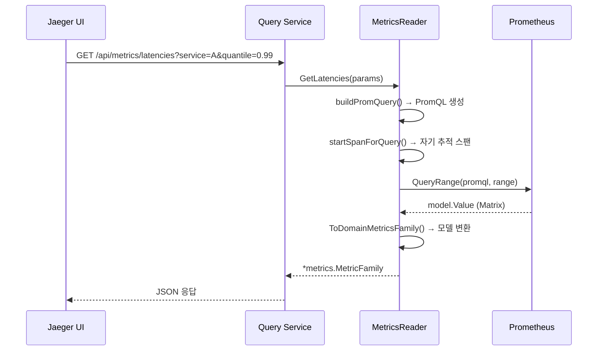
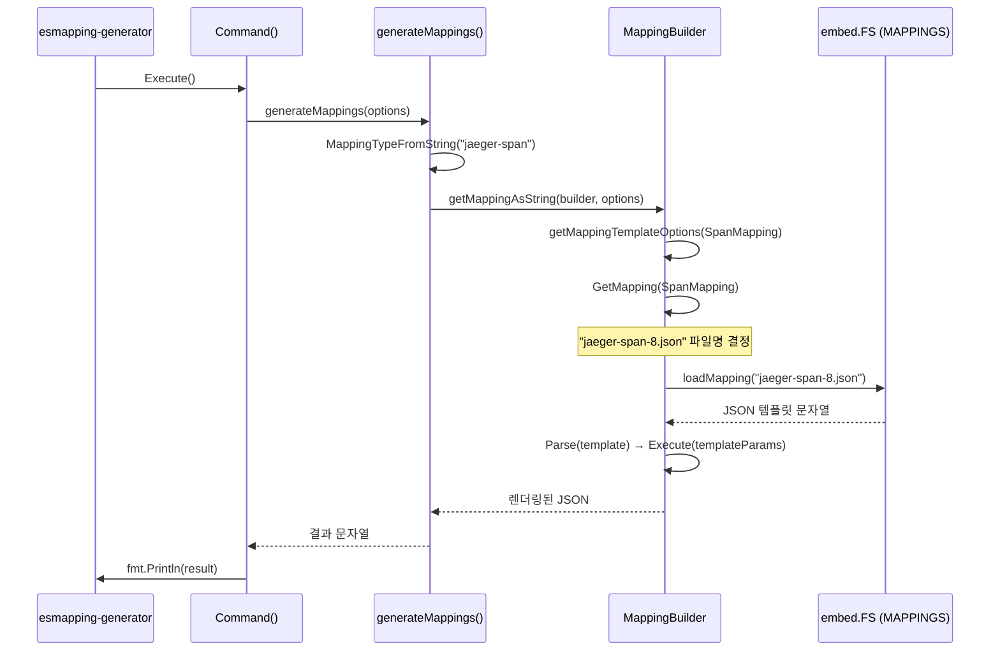

# 21. ES Metric Store (SPM) + ES Mapping Generator Deep-Dive

> Jaeger 소스코드 기반 분석 문서 (P2 심화)
> 분석 대상: `internal/storage/metricstore/`, `cmd/esmapping-generator/`, `internal/storage/v1/elasticsearch/mappings/`

---

## 1. 개요

### 1.1 SPM (Service Performance Monitoring)이란?

SPM은 분산 트레이싱 데이터로부터 파생된 집계 메트릭을 제공하는 기능이다.
개별 트레이스를 조회하는 대신, 서비스 수준의 성능 지표를 시계열로 확인할 수 있다.

```
개별 트레이스 조회 (기존):
  "traceID abc123의 스팬들을 보여줘"
  → 하나의 요청 흐름 상세 분석

SPM 집계 메트릭 (추가):
  "서비스 A의 P99 지연시간 추이를 보여줘"
  "서비스 B의 초당 호출 수를 보여줘"
  "서비스 C의 에러율 변화를 보여줘"
  → 서비스 전체의 건강 상태 파악
```

### 1.2 ES Mapping Generator란?

Elasticsearch를 Jaeger의 스토리지 백엔드로 사용할 때, 인덱스 매핑(스키마)을 올바르게
설정해야 한다. ES Mapping Generator는 다양한 ES 버전(6, 7, 8)과 설정 옵션에 맞는
인덱스 템플릿을 자동 생성하는 CLI 도구이다.

### 1.3 두 시스템의 관계

```
                Jaeger
                  |
    +-------------+-------------+
    |                           |
    v                           v
ES Mapping Generator         Metric Store (SPM)
(인덱스 스키마 생성)         (집계 메트릭 조회)
    |                           |
    v                           v
Elasticsearch               Prometheus
(스팬/서비스 저장)          (메트릭 저장)
```

ES Mapping Generator는 ES에 올바른 스키마를 설정하고,
Metric Store는 스팬 데이터에서 파생된 메트릭을 Prometheus에서 조회한다.

---

## 2. Metric Store 아키텍처

### 2.1 소스 구조

```
internal/storage/metricstore/
├── factory.go                    # AllStorageTypes 정의
├── factory_config.go             # FactoryConfig, 환경변수
├── disabled/
│   ├── factory.go                # 비활성 팩토리
│   └── reader.go                 # 비활성 Reader (에러 반환)
├── prometheus/
│   ├── factory.go                # Prometheus 팩토리
│   ├── options.go                # CLI 플래그, 옵션
│   └── metricstore/
│       ├── reader.go             # Prometheus 쿼리 실행
│       └── dbmodel/
│           └── to_domain.go      # Prometheus → Jaeger 모델 변환

internal/storage/v1/api/metricstore/
├── interface.go                  # Reader 인터페이스
├── empty_test.go
└── metricstoremetrics/
    └── decorator.go              # 메트릭 데코레이터
```

### 2.2 Reader 인터페이스

```go
// internal/storage/v1/api/metricstore/interface.go
type Reader interface {
    GetLatencies(ctx context.Context, params *LatenciesQueryParameters) (*metrics.MetricFamily, error)
    GetCallRates(ctx context.Context, params *CallRateQueryParameters) (*metrics.MetricFamily, error)
    GetErrorRates(ctx context.Context, params *ErrorRateQueryParameters) (*metrics.MetricFamily, error)
    GetMinStepDuration(ctx context.Context, params *MinStepDurationQueryParameters) (time.Duration, error)
}
```

| 메서드 | 메트릭 | PromQL 예시 |
|--------|--------|-------------|
| GetLatencies | P99 지연시간 | `histogram_quantile(0.99, sum(rate(duration_bucket{...}[1m])) by (le))` |
| GetCallRates | 초당 호출 수 | `sum(rate(calls{...}[1m])) by (service_name)` |
| GetErrorRates | 에러율 | `sum(rate(calls{status="ERROR"}[1m])) / sum(rate(calls[1m]))` |
| GetMinStepDuration | 최소 스텝 | 1ms (상수) |

### 2.3 쿼리 매개변수

```go
// internal/storage/v1/api/metricstore/interface.go
type BaseQueryParameters struct {
    ServiceNames     []string       // 대상 서비스 목록
    GroupByOperation bool           // 오퍼레이션별 그룹화
    EndTime          *time.Time     // 쿼리 종료 시각
    Lookback         *time.Duration // 쿼리 범위 (EndTime - Lookback ~ EndTime)
    Step             *time.Duration // 데이터 포인트 간격
    RatePer          *time.Duration // rate() 윈도우
    SpanKinds        []string       // 스팬 종류 필터
}

type LatenciesQueryParameters struct {
    BaseQueryParameters
    Quantile float64  // 분위수 (0.0~1.0)
}
```

---

## 3. Prometheus MetricsReader 구현

### 3.1 MetricsReader 구조체

```go
// internal/storage/metricstore/prometheus/metricstore/reader.go
type MetricsReader struct {
    client promapi.API          // Prometheus API 클라이언트
    logger *zap.Logger
    tracer trace.Tracer          // 자기 추적

    metricsTranslator dbmodel.Translator  // 모델 변환기
    latencyMetricName string              // "traces_span_metrics_duration"
    callsMetricName   string              // "traces_span_metrics_calls"
    operationLabel    string              // "span_name"
}
```

### 3.2 PromQL 쿼리 생성

#### 지연시간 쿼리

```go
// reader.go:131
func (m MetricsReader) GetLatencies(ctx context.Context, requestParams *metricstore.LatenciesQueryParameters) (*metrics.MetricFamily, error) {
    metricsParams := metricsQueryParams{
        BaseQueryParameters: requestParams.BaseQueryParameters,
        groupByHistBucket:   true,
        metricName:          "service_latencies",
        buildPromQuery: func(p promQueryParams) string {
            return fmt.Sprintf(
                `histogram_quantile(%.2f, sum(rate(%s_bucket{service_name =~ %q, %s}[%s])) by (%s))`,
                requestParams.Quantile,
                m.latencyMetricName,
                p.serviceFilter,
                p.spanKindFilter,
                p.rate,
                p.groupBy,
            )
        },
    }
    return m.executeQuery(ctx, metricsParams)
}
```

**생성되는 PromQL 예시:**

```promql
histogram_quantile(0.99,
  sum(
    rate(traces_span_metrics_duration_bucket{
      service_name =~ "serviceA|serviceB",
      span_kind =~ "SPAN_KIND_SERVER"
    }[1m])
  ) by (service_name, le)
)
```

#### 호출률 쿼리

```go
// reader.go:175
buildPromQuery: func(p promQueryParams) string {
    return fmt.Sprintf(
        `sum(rate(%s{service_name =~ %q, %s}[%s])) by (%s)`,
        m.callsMetricName,
        p.serviceFilter,
        p.spanKindFilter,
        p.rate,
        p.groupBy,
    )
},
```

#### 에러율 쿼리 (복합)

```go
// reader.go:210
buildPromQuery: func(p promQueryParams) string {
    return fmt.Sprintf(
        `sum(rate(%s{service_name =~ %q, status_code = "STATUS_CODE_ERROR", %s}[%s])) by (%s)
         / sum(rate(%s{service_name =~ %q, %s}[%s])) by (%s)`,
        m.callsMetricName, p.serviceFilter, p.spanKindFilter, p.rate, p.groupBy,
        m.callsMetricName, p.serviceFilter, p.spanKindFilter, p.rate, p.groupBy,
    )
},
```

**에러율의 특별한 처리:**

```
에러율 = 에러 호출 / 전체 호출

시나리오 1: 에러가 있는 경우
  에러율 쿼리 → 결과 있음 → 그대로 반환

시나리오 2: 에러가 없지만 호출은 있는 경우
  에러율 쿼리 → 결과 없음
  호출률 쿼리 → 결과 있음
  → 모든 메트릭 포인트를 0.0으로 설정하여 반환

시나리오 3: 호출 자체가 없는 경우
  에러율 쿼리 → 결과 없음
  호출률 쿼리 → 결과 없음
  → 빈 결과 반환
```

**왜 이렇게 복잡한가?**

`x / 0`은 Prometheus에서 `NaN`을 반환한다. 호출이 없는 서비스의 에러율을 `NaN`이 아닌
"데이터 없음"으로 표현하기 위해, 먼저 호출 메트릭이 존재하는지 확인한다.

### 3.3 메트릭 이름 구성

```go
// reader.go:153
func buildFullLatencyMetricName(cfg config.Configuration) string {
    metricName := "duration"
    if cfg.MetricNamespace != "" {
        metricName = cfg.MetricNamespace + "_" + metricName
    }
    if !cfg.NormalizeDuration {
        return metricName
    }
    shortToLongName := map[string]string{"ms": "milliseconds", "s": "seconds"}
    lname := shortToLongName[cfg.LatencyUnit]
    return metricName + "_" + lname
}
```

| 설정 | 메트릭 이름 | 설명 |
|------|------------|------|
| 기본 | `traces_span_metrics_duration` | 네임스페이스 + 이름 |
| 정규화(ms) | `traces_span_metrics_duration_milliseconds` | OTEL Prometheus 변환 규칙 |
| 정규화(s) | `traces_span_metrics_duration_seconds` | OTEL Prometheus 변환 규칙 |

### 3.4 쿼리 실행 및 트레이싱

```go
// reader.go:263
func (m MetricsReader) executeQuery(ctx context.Context, p metricsQueryParams) (*metrics.MetricFamily, error) {
    if p.GroupByOperation {
        p.metricName = strings.Replace(p.metricName, "service", "service_operation", 1)
    }
    promQuery := m.buildPromQuery(p)

    // 자기 추적 스팬 생성
    ctx, span := startSpanForQuery(ctx, p.metricName, promQuery, m.tracer)
    defer span.End()

    queryRange := promapi.Range{
        Start: p.EndTime.Add(-1 * *p.Lookback),
        End:   *p.EndTime,
        Step:  *p.Step,
    }

    mv, warnings, err := m.client.QueryRange(ctx, promQuery, queryRange)
    // ...

    return m.metricsTranslator.ToDomainMetricsFamily(p.metricName, p.metricDesc, mv)
}
```



### 3.5 Prometheus → Jaeger 모델 변환

```go
// internal/storage/metricstore/prometheus/metricstore/dbmodel/to_domain.go
type Translator struct {
    labelMap map[string]string  // "span_name" → "operation"
}

func (d Translator) ToDomainMetricsFamily(name, description string, mv model.Value) (*metrics.MetricFamily, error) {
    if mv.Type() != model.ValMatrix {
        return &metrics.MetricFamily{}, fmt.Errorf("unexpected metrics ValueType: %s", mv.Type())
    }
    return &metrics.MetricFamily{
        Name:    name,
        Type:    metrics.MetricType_GAUGE,
        Help:    description,
        Metrics: d.toDomainMetrics(mv.(model.Matrix)),
    }, nil
}
```

**레이블 매핑:**

```
Prometheus 레이블          Jaeger UI 레이블
  span_name        →        operation
  service_name     →        service_name (변경 없음)
```

**왜 `span_name`을 `operation`으로 변환하는가?**

OTEL SpanMetrics Connector는 `span_name` 레이블을 사용하지만,
Jaeger UI는 레거시 호환성을 위해 `operation` 레이블을 기대한다.
Translator가 이 불일치를 중간에서 해결한다.

---

## 4. Disabled MetricsReader

```go
// internal/storage/metricstore/disabled/reader.go
type MetricsReader struct{}

var ErrDisabled = &errMetricsQueryDisabledError{}

func (*errMetricsQueryDisabledError) Error() string {
    return "metrics querying is currently disabled"
}

func (*MetricsReader) GetLatencies(context.Context, *metricstore.LatenciesQueryParameters) (*metrics.MetricFamily, error) {
    return nil, ErrDisabled
}
```

**왜 Disabled Reader가 필요한가?**

1. `METRICS_STORAGE_TYPE` 환경변수가 설정되지 않으면 SPM은 비활성 상태
2. Null Object 패턴: nil 체크 대신 항상 유효한 Reader를 반환
3. UI가 메트릭 API를 호출하면 "비활성" 에러를 받아 메트릭 탭을 숨긴다

```
환경변수에 따른 Reader 선택:
  METRICS_STORAGE_TYPE="" → disabled.MetricsReader (에러 반환)
  METRICS_STORAGE_TYPE="prometheus" → prometheus.MetricsReader (실제 조회)
```

---

## 5. HTTP 인증 및 보안

### 5.1 RoundTripper 체인

```go
// reader.go:349
func getHTTPRoundTripper(c *config.Configuration, httpAuth extensionauth.HTTPClient) (http.RoundTripper, error) {
    // 1. TLS 설정 로드
    ctlsConfig, err := c.TLS.LoadTLSConfig(context.Background())

    // 2. HTTP Transport 생성
    httpTransport := &http.Transport{
        Proxy:               http.ProxyFromEnvironment,
        DialContext:         (&net.Dialer{Timeout: c.ConnectTimeout, KeepAlive: 30 * time.Second}).DialContext,
        TLSHandshakeTimeout: 10 * time.Second,
        TLSClientConfig:     ctlsConfig,
    }

    // 3. Bearer Token 인증 설정
    base := &auth.RoundTripper{
        Transport: httpTransport,
        Auths: []auth.Method{{
            Scheme:  "Bearer",
            TokenFn: tokenFn,      // 파일에서 토큰 로드 (캐싱됨)
            FromCtx: fromCtxFn,    // 요청 컨텍스트에서 토큰 전달
        }},
    }

    // 4. 추가 HTTP 인증 (OTel Collector extension)
    if httpAuth != nil {
        return httpAuth.RoundTripper(base)
    }
    return base, nil
}
```

```
HTTP 요청 흐름:
  MetricsReader
    → auth.RoundTripper (Bearer Token 주입)
      → httpAuth.RoundTripper (OTel Collector 인증)
        → http.Transport (TLS, 프록시, 타임아웃)
          → Prometheus 서버
```

### 5.2 URL 데코레이터

```go
// reader.go:72
type promClient struct {
    api.Client
    extraParams map[string]string
}

func (p promClient) URL(ep string, args map[string]string) *url.URL {
    u := p.Client.URL(ep, args)
    query := u.Query()
    for k, v := range p.extraParams {
        query.Add(k, v)
    }
    u.RawQuery = query.Encode()
    return u
}
```

**왜 URL 데코레이터가 필요한가?**

Prometheus 앞에 프록시(Thanos, Cortex 등)가 있을 때, 추가 쿼리 매개변수가 필요할 수 있다.
예: `?tenant=acme` -- 멀티테넌트 환경에서 테넌트 식별

---

## 6. ES Mapping Generator

### 6.1 소스 구조

```
cmd/esmapping-generator/
└── main.go                              # CLI 진입점

internal/storage/v1/elasticsearch/mappings/
├── mapping.go                           # MappingBuilder, 템플릿 렌더링
├── mapping_test.go
├── command.go                           # cobra 명령어
├── command_test.go
├── flags.go                             # Options, CLI 플래그
├── flags_test.go
├── jaeger-span-6.json                   # ES 6 스팬 템플릿
├── jaeger-span-7.json                   # ES 7 스팬 템플릿
├── jaeger-span-8.json                   # ES 8 스팬 템플릿
├── jaeger-service-6.json                # ES 6 서비스 템플릿
├── jaeger-service-7.json                # ES 7 서비스 템플릿
├── jaeger-service-8.json                # ES 8 서비스 템플릿
├── jaeger-dependencies-6.json           # ES 6 의존성 템플릿
├── jaeger-dependencies-7.json           # ES 7 의존성 템플릿
├── jaeger-dependencies-8.json           # ES 8 의존성 템플릿
├── jaeger-sampling-6.json               # ES 6 샘플링 템플릿
├── jaeger-sampling-7.json               # ES 7 샘플링 템플릿
└── jaeger-sampling-8.json               # ES 8 샘플링 템플릿
```

### 6.2 MappingType 열거형

```go
// internal/storage/v1/elasticsearch/mappings/mapping.go
type MappingType int

const (
    SpanMapping MappingType = iota
    ServiceMapping
    DependenciesMapping
    SamplingMapping
)
```

| 매핑 타입 | 인덱스 패턴 | 저장 데이터 |
|----------|------------|-----------|
| SpanMapping | `jaeger-span-*` | 개별 스팬 |
| ServiceMapping | `jaeger-service-*` | 서비스 메타데이터 |
| DependenciesMapping | `jaeger-dependencies-*` | 서비스 간 의존성 |
| SamplingMapping | `jaeger-sampling-*` | 적응형 샘플링 확률 |

### 6.3 MappingBuilder

```go
// mapping.go:31
type MappingBuilder struct {
    TemplateBuilder es.TemplateBuilder  // Go 텍스트 템플릿 빌더
    Indices         config.Indices      // 인덱스별 설정
    EsVersion       uint                // ES 메이저 버전
    UseILM          bool                // ILM(인덱스 수명 관리) 사용 여부
    ILMPolicyName   string              // ILM 정책 이름
}
```

### 6.4 템플릿 렌더링 흐름



### 6.5 embed.FS를 통한 템플릿 내장

```go
// mapping.go:18
//go:embed *.json
var MAPPINGS embed.FS
```

**왜 `embed.FS`를 사용하는가?**

1. JSON 템플릿 파일을 바이너리에 내장하여 배포가 단일 파일로 가능
2. 런타임에 파일 시스템 접근이 필요 없음
3. `*.json` 패턴으로 모든 JSON 파일을 자동 포함
4. Go 1.16+의 표준 기능으로 외부 의존성 없음

### 6.6 CLI 플래그

```go
// flags.go
type Options struct {
    Mapping       string  // 매핑 타입 (jaeger-span, jaeger-service 등)
    EsVersion     uint    // ES 버전 (6, 7, 8)
    Shards        int64   // 샤드 수 (기본: 5)
    Replicas      *int64  // 레플리카 수 (기본: 1)
    IndexPrefix   string  // 인덱스 접두사
    UseILM        string  // ILM 사용 여부
    ILMPolicyName string  // ILM 정책 이름 (기본: jaeger-ilm-policy)
}
```

**사용 예시:**

```bash
# ES 8용 스팬 매핑 생성 (5 샤드, 1 레플리카)
jaeger-esmapping-generator elasticsearch-mappings \
  --mapping jaeger-span \
  --es-version 8 \
  --shards 5 \
  --replicas 1

# ILM 활성화, 커스텀 접두사
jaeger-esmapping-generator elasticsearch-mappings \
  --mapping jaeger-service \
  --es-version 8 \
  --index-prefix production \
  --use-ilm true \
  --ilm-policy-name jaeger-production-policy
```

### 6.7 버전별 매핑 차이

```
ES 6 → ES 7 주요 변경:
  - mapping types 제거 (_doc 사용)
  - keyword/text 필드 최적화

ES 7 → ES 8 주요 변경:
  - index template v2 API
  - composable index templates
  - data streams 지원

ES 8 → ES 9:
  - ES 8 템플릿 재사용 (mapping.go:115)
  esVersion := min(mb.EsVersion, 8)
```

### 6.8 템플릿 매개변수

```go
// mapping.go:40
type templateParams struct {
    UseILM        bool
    ILMPolicyName string
    IndexPrefix   string
    Shards        int64
    Replicas      int64
    Priority      int64
}
```

**템플릿 내 Go 템플릿 변수 사용:**

```json
{
  "index_patterns": "{{.IndexPrefix}}jaeger-span-*",
  "settings": {
    "index.number_of_shards": {{.Shards}},
    "index.number_of_replicas": {{.Replicas}},
    {{if .UseILM}}
    "index.lifecycle.name": "{{.ILMPolicyName}}",
    "index.lifecycle.rollover_alias": "{{.IndexPrefix}}jaeger-span-write"
    {{end}}
  }
}
```

---

## 7. SPM 데이터 파이프라인

### 7.1 전체 데이터 흐름

```
+---------------+     +------------------+     +------------+
| 마이크로서비스  | --> | OTel Collector   | --> | Prometheus |
| (스팬 생성)    |     | + SpanMetrics    |     | (메트릭 저장)|
+---------------+     | Connector        |     +-----+------+
                       +------------------+           |
                                                      |
                       +------------------+           |
                       | Jaeger Query     | <---------+
                       | MetricsReader    |
                       +------------------+
                               |
                               v
                       +------------------+
                       | Jaeger UI        |
                       | SPM 탭           |
                       +------------------+
```

### 7.2 SpanMetrics Connector

OTel Collector의 SpanMetrics Connector가 스팬에서 메트릭을 파생한다:

```
입력 (스팬):
  service=svcA, operation=GET /api, duration=42ms, status=OK

출력 (메트릭):
  traces_span_metrics_calls{service_name="svcA", span_name="GET /api", status_code="STATUS_CODE_OK"} 1
  traces_span_metrics_duration_bucket{service_name="svcA", span_name="GET /api", le="50"} 1
  traces_span_metrics_duration_bucket{service_name="svcA", span_name="GET /api", le="100"} 1
```

### 7.3 PromQL Duration 포맷팅

```go
// reader.go:323
func promqlDurationString(d *time.Duration) string {
    var b []byte
    for _, c := range d.String() {
        b = append(b, byte(c))
        if unicode.IsLetter(c) {
            break  // 첫 번째 단위 문자에서 중단
        }
    }
    return string(b)
}
```

**왜 이 변환이 필요한가?**

Go의 `time.Duration.String()`은 `"1h5m0s"` 같은 복합 단위를 반환하지만,
PromQL은 `"1h"` 같은 단일 단위만 허용한다.

```
Go Duration → PromQL:
  "1h0m0s" → "1h"
  "30s"    → "30s"
  "5m0s"   → "5m"
  "1h5m"   → "1h" (5m 잘림 -- 의도적 근사)
```

---

## 8. 설정 옵션

### 8.1 Prometheus Metric Store 옵션

```go
// internal/storage/metricstore/prometheus/options.go
const (
    defaultServerURL      = "http://localhost:9090"
    defaultConnectTimeout = 30 * time.Second
    defaultMetricNamespace   = "traces_span_metrics"
    defaultLatencyUnit       = "ms"
    defaultNormalizeCalls    = false
    defaultNormalizeDuration = false
)
```

| 플래그 | 기본값 | 설명 |
|--------|--------|------|
| `--prometheus.server-url` | `http://localhost:9090` | Prometheus 서버 URL |
| `--prometheus.connect-timeout` | 30초 | 연결 타임아웃 |
| `--prometheus.token-file` | (없음) | Bearer 토큰 파일 경로 |
| `--prometheus.query.namespace` | `traces_span_metrics` | 메트릭 네임스페이스 |
| `--prometheus.query.duration-unit` | `ms` | 지연시간 단위 |
| `--prometheus.query.normalize-calls` | false | 호출 메트릭 정규화 |
| `--prometheus.query.normalize-duration` | false | 지연시간 메트릭 정규화 |
| `--prometheus.query.extra-query-params` | (없음) | 추가 쿼리 매개변수 |

### 8.2 정규화 설정

```
정규화 OFF (기본):
  calls metric: "traces_span_metrics_calls"
  duration metric: "traces_span_metrics_duration"

정규화 ON:
  calls metric: "traces_span_metrics_calls_total"
  duration metric: "traces_span_metrics_duration_milliseconds"
```

**왜 정규화 옵션이 필요한가?**

OTEL Collector의 Prometheus Exporter가 메트릭 이름을 자동으로 정규화할 수 있다.
정규화를 사용하면 `_total` 접미사(Counter)와 단위 접미사(`_milliseconds`, `_seconds`)가 추가된다.
Jaeger의 설정은 이 Exporter 설정과 일치해야 한다.

---

## 9. 에러 처리와 관측 가능성

### 9.1 스팬 기반 에러 추적

```go
// reader.go:334
func startSpanForQuery(ctx context.Context, metricName, query string, tp trace.Tracer) (context.Context, trace.Span) {
    ctx, span := tp.Start(ctx, metricName)
    span.SetAttributes(
        attribute.Key(otelsemconv.DBQueryTextKey).String(query),
        attribute.Key(otelsemconv.DBSystemKey).String("prometheus"),
        attribute.Key("component").String("promql"),
    )
    return ctx, span
}

func logErrorToSpan(span trace.Span, err error) {
    span.RecordError(err)
    span.SetStatus(codes.Error, err.Error())
}
```

모든 Prometheus 쿼리가 자기 추적 스팬으로 기록되어,
Jaeger UI에서 메트릭 쿼리의 성능 문제를 분석할 수 있다.

### 9.2 경고 로깅

```go
if len(warnings) > 0 {
    m.logger.Warn("Warnings detected on Prometheus query",
        zap.Any("warnings", warnings),
        zap.String("query", promQuery),
        zap.Any("range", queryRange))
}
```

Prometheus는 쿼리 결과와 함께 경고를 반환할 수 있다 (예: "series limit reached").
이를 로그에 기록하여 운영자가 확인할 수 있게 한다.

---

## 10. 정리

### 10.1 핵심 설계 원칙

| 원칙 | Metric Store | ES Mapping Generator |
|------|-------------|---------------------|
| 표준 준수 | PromQL 생성, OTEL 레이블 | ES 버전별 템플릿 |
| 확장성 | 새 메트릭 타입 추가 가능 | 새 ES 버전 템플릿 추가 |
| 관측 가능성 | 자기 추적 스팬 | N/A (CLI 도구) |
| 호환성 | 정규화 ON/OFF 옵션 | ES 6/7/8/9 지원 |
| 안전성 | Disabled Reader 패턴 | 필수 플래그 검증 |

### 10.2 관련 소스 파일 요약

| 파일 | 줄수 | 핵심 함수/타입 |
|------|------|---------------|
| `metricstore/prometheus/metricstore/reader.go` | 398줄 | `MetricsReader`, `GetLatencies`, `executeQuery` |
| `metricstore/prometheus/metricstore/dbmodel/to_domain.go` | 100줄 | `Translator`, `ToDomainMetricsFamily` |
| `metricstore/prometheus/options.go` | 156줄 | `Options`, `DefaultConfig` |
| `metricstore/prometheus/factory.go` | 66줄 | `Factory`, `CreateMetricsReader` |
| `v1/api/metricstore/interface.go` | 73줄 | `Reader` 인터페이스 |
| `v1/elasticsearch/mappings/mapping.go` | 161줄 | `MappingBuilder`, `GetMapping` |
| `v1/elasticsearch/mappings/command.go` | 80줄 | `Command`, `generateMappings` |
| `v1/elasticsearch/mappings/flags.go` | 74줄 | `Options`, `AddFlags` |

### 10.3 PoC 참조

- `poc-20-es-metrics/` -- Prometheus 기반 SPM 쿼리 생성과 메트릭 변환 시뮬레이션
- `poc-22-es-mapping/` -- ES 인덱스 템플릿 생성과 버전별 매핑 시뮬레이션

---

*본 문서는 Jaeger 소스코드의 `internal/storage/metricstore/`, `cmd/esmapping-generator/`, `internal/storage/v1/elasticsearch/mappings/` 디렉토리를 직접 분석하여 작성되었다.*
