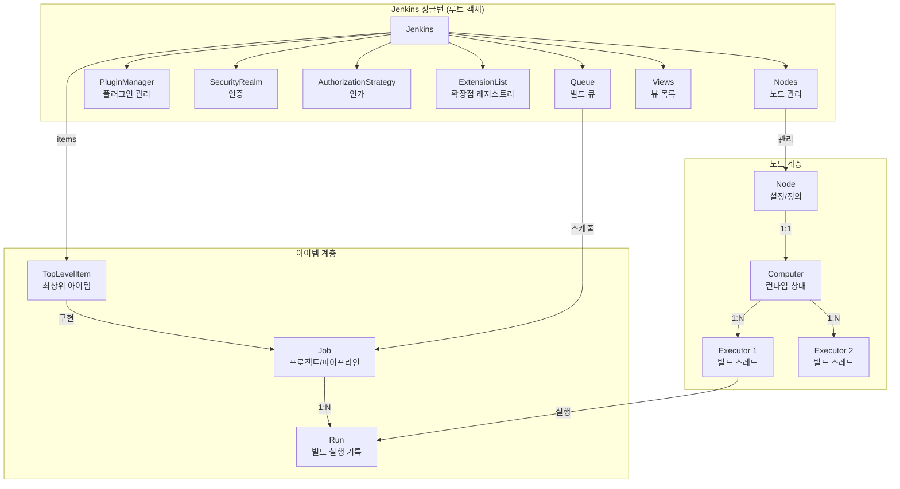
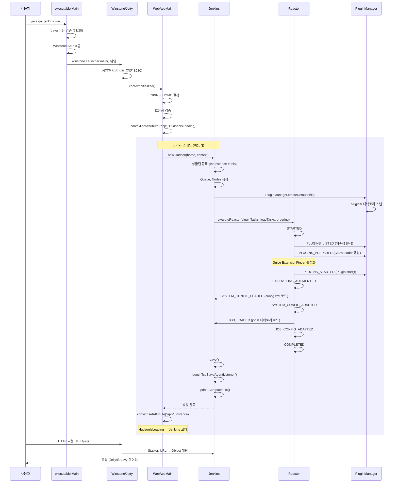

# Jenkins 아키텍처 Deep-Dive

## 목차

1. [개요](#1-개요)
2. [프로젝트 구조: Maven 멀티모듈](#2-프로젝트-구조-maven-멀티모듈)
3. [진입점 흐름: WAR에서 싱글턴까지](#3-진입점-흐름-war에서-싱글턴까지)
4. [InitMilestone 초기화 시퀀스](#4-initmilestone-초기화-시퀀스)
5. [Jenkins 싱글턴: 루트 객체의 구조](#5-jenkins-싱글턴-루트-객체의-구조)
6. [컴포넌트 관계도](#6-컴포넌트-관계도)
7. [실행 모델: Node-Computer-Executor](#7-실행-모델-node-computer-executor)
8. [빌드 큐(Queue) 아키텍처](#8-빌드-큐queue-아키텍처)
9. [Stapler: URL-Object 매핑](#9-stapler-url-object-매핑)
10. [플러그인 아키텍처](#10-플러그인-아키텍처)
11. [보안 아키텍처](#11-보안-아키텍처)
12. [영속성: JENKINS_HOME 파일시스템](#12-영속성-jenkins_home-파일시스템)
13. [핵심 설계 결정: "왜(Why)"](#13-핵심-설계-결정-왜why)
14. [전체 아키텍처 다이어그램](#14-전체-아키텍처-다이어그램)

---

## 1. 개요

Jenkins는 Java 기반의 오픈소스 자동화 서버로, CI/CD 파이프라인의 사실상(de facto) 표준이다.
WAR(Web Application Archive) 형태로 패키징되어 독립 실행(Winstone/Jetty 내장) 또는
외부 서블릿 컨테이너(Tomcat 등) 배포가 가능하다.

### 핵심 특징

| 항목 | 내용 |
|------|------|
| 언어 | Java 21+ (SUPPORTED_JAVA_VERSIONS: 21, 25) |
| 빌드 | Maven 멀티모듈 |
| 패키징 | WAR (독립 실행 + 서블릿 컨테이너 배포) |
| 내장 서버 | Winstone (Jetty 기반) |
| 웹 프레임워크 | Stapler (URL-Object 트리 매핑) |
| 뷰 엔진 | Jelly/Groovy |
| 영속성 | XStream XML 직렬화 (JENKINS_HOME 파일시스템) |
| 플러그인 | HPI/JPI (독립 ClassLoader) |
| 버전 | 2.553-SNAPSHOT (소스 기준) |

### 아키텍처 한 줄 요약

```
java -jar jenkins.war
  → executable.Main (Java 버전 검증 + Winstone 추출)
    → Winstone/Jetty 서블릿 컨테이너 시작
      → WebAppMain.contextInitialized() (ServletContextListener)
        → new Hudson(home, context) (Jenkins 싱글턴 생성)
          → Reactor 기반 초기화 (10단계 마일스톤)
            → 서비스 준비 완료
```

---

## 2. 프로젝트 구조: Maven 멀티모듈

소스: `/Users/ywlee/CNCF/jenkins/pom.xml` (578줄)

```
jenkins-parent (pom.xml)
├── bom/              # BOM(Bill of Materials) - 의존성 버전 관리
├── websocket/
│   ├── spi/          # WebSocket SPI(Service Provider Interface)
│   └── jetty12-ee9/  # Jetty 12 EE9 WebSocket 구현
├── core/             # 핵심 모듈 ★
├── war/              # WAR 패키징 + 진입점
├── test/             # 통합 테스트
├── cli/              # CLI(Command Line Interface) 클라이언트
└── coverage/         # 코드 커버리지 집계
```

### 모듈별 역할

| 모듈 | artifactId | 역할 |
|------|-----------|------|
| `bom` | jenkins-bom | 전체 의존성 버전을 한 곳에서 관리 |
| `core` | jenkins-core | Jenkins의 모든 핵심 로직. `jenkins.model.Jenkins`, `hudson.model.*`, 플러그인 API 등 |
| `war` | jenkins-war | WAR 패키징. `executable.Main` 진입점, Winstone 내장 |
| `cli` | cli | jenkins-cli.jar, 원격 CLI 클라이언트 |
| `test` | test | 통합 테스트, `JenkinsRule` 기반 |
| `websocket/spi` | websocket-spi | WebSocket 추상화 계층 |
| `websocket/jetty12-ee9` | websocket-jetty12-ee9 | Jetty 12 기반 WebSocket 구현 |
| `coverage` | coverage | JaCoCo 커버리지 집계 전용 |

### 핵심 의존성

```xml
<!-- pom.xml에서 발췌 -->
<properties>
    <revision>2.553</revision>
    <remoting.version>3355.v388858a_47b_33</remoting.version>
    <winstone.version>8.1033.v23d2f156e821</winstone.version>
    <node.version>24.14.0</node.version>
</properties>
```

- **Winstone**: Jenkins가 래핑한 Jetty 서블릿 컨테이너
- **Remoting**: Controller-Agent 간 통신 라이브러리
- **Stapler**: URL-Object 매핑 웹 프레임워크 (Kohsuke Kawaguchi 개발)
- **XStream**: XML 직렬화/역직렬화
- **Guice**: 의존성 주입 (확장점 디스커버리)
- **Spring Security**: 인증/인가 프레임워크

---

## 3. 진입점 흐름: WAR에서 싱글턴까지

Jenkins 기동은 3개의 클래스가 순차적으로 책임을 넘기는 구조다.

### 3.1 단계 1: executable.Main

소스: `war/src/main/java/executable/Main.java` (514줄)

```java
// war/src/main/java/executable/Main.java:74
public class Main {
    private static final NavigableSet<Integer> SUPPORTED_JAVA_VERSIONS =
        new TreeSet<>(List.of(21, 25));
    // ...
}
```

`java -jar jenkins.war` 실행 시 이 클래스의 `main()` 메서드가 호출된다.

#### 실행 순서

```
main(args)
│
├─ 1. Java 버전 검증
│     verifyJavaVersion(Runtime.version().feature(), isFutureJavaEnabled(args))
│     - SUPPORTED_JAVA_VERSIONS: {21, 25}
│     - 미지원 버전이면 UnsupportedClassVersionError 발생
│     - --enable-future-java 플래그로 우회 가능
│
├─ 2. 특수 인자 처리
│     --paramsFromStdIn: stdin에서 인자 읽기 (비밀번호 숨기기용)
│     --version: 버전 출력 후 즉시 종료
│     --extractedFilesFolder: 추출 폴더 지정
│     --pluginroot: 플러그인 디렉토리 지정
│
├─ 3. Headless 모드 설정
│     System.setProperty("java.awt.headless", "true")
│
├─ 4. WAR 파일 위치 확인
│     whoAmI(extractedFilesFolder) → File
│     - JarURLConnection으로 현재 JAR 경로 획득
│
├─ 5. Winstone JAR 추출
│     extractFromJar("winstone.jar", "winstone", ".jar", ...)
│     - WAR 내부의 winstone.jar를 임시 파일로 추출
│
├─ 6. Winstone ClassLoader 생성
│     new URLClassLoader("Jenkins Main ClassLoader",
│         new URL[]{tmpJar.toURI().toURL()},
│         ClassLoader.getSystemClassLoader())
│
├─ 7. JSESSIONID 쿠키 커스텀화
│     - 동일 호스트 다중 Jenkins 인스턴스의 세션 충돌 방지
│     - UUID 기반 랜덤 쿠키명: "JSESSIONID.<8자 hex>"
│
└─ 8. Winstone 실행 위임
      launcher = cl.loadClass("winstone.Launcher")
      mainMethod = launcher.getMethod("main", String[].class)
      mainMethod.invoke(null, arguments)
```

핵심 포인트는 **executable.Main은 "매우 얇은 래퍼(very thin wrapper)"** 라는 점이다.
소스코드 주석에서도 이를 명시한다:

```java
// war/src/main/java/executable/Main.java:59-62
// On a high-level architectural note, this class is intended to be
// a very thin wrapper whose primary purpose is to extract Winstone
// and delegate to Winstone's own initialization mechanism.
```

#### JENKINS_HOME 결정 로직

```java
// war/src/main/java/executable/Main.java:487-513
private static File getJenkinsHome() {
    // 1. 시스템 프로퍼티 확인: JENKINS_HOME, HUDSON_HOME
    for (String name : HOME_NAMES) {
        String sysProp = System.getProperty(name);
        if (sysProp != null) return new File(sysProp.trim());
    }
    // 2. 환경 변수 확인: JENKINS_HOME, HUDSON_HOME
    for (String name : HOME_NAMES) {
        String env = System.getenv(name);
        if (env != null) return new File(env.trim());
    }
    // 3. 레거시 경로: ~/.hudson
    File legacyHome = new File(System.getProperty("user.home"), ".hudson");
    if (legacyHome.exists()) return legacyHome;
    // 4. 기본값: ~/.jenkins
    return new File(System.getProperty("user.home"), ".jenkins");
}
```

### 3.2 단계 2: hudson.WebAppMain

소스: `core/src/main/java/hudson/WebAppMain.java` (440줄)

Winstone(Jetty)가 서블릿 컨테이너로서 WAR를 로드한 후, `web.xml`에 등록된
`ServletContextListener`인 `WebAppMain`의 `contextInitialized()` 가 호출된다.

```java
// core/src/main/java/hudson/WebAppMain.java:88
public class WebAppMain implements ServletContextListener {
    // ...
}
```

#### contextInitialized() 실행 순서

```
contextInitialized(event)
│
├─ 1. JenkinsJVM 플래그 설정
│     JenkinsJVMAccess._setJenkinsJVM(true)
│
├─ 2. 로캘 프로바이더 설정
│     LocaleProvider.setProvider(...)
│
├─ 3. 호환성 검증
│     - URLClassLoader 생성 가능 여부 (보안 권한)
│     - SunPKCS11 프로바이더 제거 (Solaris 이슈)
│     - XStream ReflectionProvider 확인
│     - 서블릿 API 버전 확인 (setCharacterEncoding)
│     - Ant 버전 확인 (1.7+)
│     - AWT 동작 확인 (JFreeChart용)
│     - 임시 디렉토리 존재 확인
│
├─ 4. JENKINS_HOME 결정
│     getHomeDir(event) → FileAndDescription
│     - 우선순위: 시스템 프로퍼티 > 환경 변수 > WEB-INF/workspace > ~/.hudson > ~/.jenkins
│
├─ 5. 부트 시도 기록
│     recordBootAttempt(home) → 실패 시 BootFailure 파일에 기록
│
├─ 6. HudsonIsLoading 표시
│     context.setAttribute("app", new HudsonIsLoading())
│     - 로딩 중 화면을 보여주기 위한 임시 객체
│
├─ 7. 세션 추적 모드
│     context.setSessionTrackingModes(EnumSet.of(SessionTrackingMode.COOKIE))
│
└─ 8. 초기화 스레드 시작 ★
      initThread = new Thread("Jenkins initialization thread") {
          public void run() {
              Jenkins instance = new Hudson(_home, context);
              context.setAttribute("app", instance);
              // HudsonIsLoading → Jenkins 인스턴스로 교체
              Jenkins.get().getLifecycle().onReady();
          }
      };
      initThread.start();
```

**왜 별도 스레드에서 초기화하는가?**

서블릿 컨테이너의 `contextInitialized()` 콜백을 오래 블로킹하면 타임아웃이 발생할 수 있다.
Jenkins는 수천 개의 Job과 수백 개의 플러그인을 로드해야 하므로, 별도 스레드에서 초기화하고
그 사이 사용자에게는 `HudsonIsLoading` 페이지를 보여준다. 초기화 완료 후
`context.setAttribute("app", instance)` 호출로 실제 Jenkins 인스턴스로 교체한다.

### 3.3 단계 3: jenkins.model.Jenkins (hudson.model.Hudson)

소스: `core/src/main/java/jenkins/model/Jenkins.java` (5990줄)

```java
// core/src/main/java/jenkins/model/Jenkins.java:355-357
public class Jenkins extends AbstractCIBase
    implements DirectlyModifiableTopLevelItemGroup, StaplerProxy, StaplerFallback,
        ModifiableViewGroup, AccessControlled, DescriptorByNameOwner,
        ModelObjectWithContextMenu, ModelObjectWithChildren, OnMaster, Loadable {
```

`Hudson`은 `Jenkins`의 서브클래스로, 역사적 호환성을 위해 존재한다:

```java
// core/src/main/java/hudson/model/Hudson.java:57
public class Hudson extends Jenkins {
    // 레거시 호환 필드와 메서드만 포함
}
```

`WebAppMain`의 초기화 스레드에서 `new Hudson(_home, context)`가 호출되면,
실제로는 부모 클래스 `Jenkins`의 생성자가 실행된다.

---

## 4. InitMilestone 초기화 시퀀스

소스: `core/src/main/java/hudson/init/InitMilestone.java` (145줄)

Jenkins 초기화는 10단계의 마일스톤으로 구성된 위상정렬(topological sort) 기반
Reactor 패턴을 사용한다.

### 마일스톤 순서

```java
// core/src/main/java/hudson/init/InitMilestone.java:56-121
public enum InitMilestone implements Milestone {
    STARTED("Started initialization"),
    PLUGINS_LISTED("Listed all plugins"),
    PLUGINS_PREPARED("Prepared all plugins"),
    PLUGINS_STARTED("Started all plugins"),
    EXTENSIONS_AUGMENTED("Augmented all extensions"),
    SYSTEM_CONFIG_LOADED("System config loaded"),
    SYSTEM_CONFIG_ADAPTED("System config adapted"),
    JOB_LOADED("Loaded all jobs"),
    JOB_CONFIG_ADAPTED("Configuration for all jobs updated"),
    COMPLETED("Completed initialization");
    // ...
}
```

### 마일스톤 상세

```
+-------------------------------------------------------------------+
|  InitMilestone 시퀀스                                               |
+-------------------------------------------------------------------+
|                                                                    |
|  STARTED                                                           |
|    │  아무것도 하지 않은 초기 상태                                     |
|    ▼                                                               |
|  PLUGINS_LISTED                                                    |
|    │  모든 플러그인 메타데이터 검색, 의존성 파악                        |
|    ▼                                                               |
|  PLUGINS_PREPARED                                                  |
|    │  플러그인 메타데이터 로드, ClassLoader 구성                       |
|    │  ★ Guice 설정 시작 (ExtensionFinder 활성화)                     |
|    ▼                                                               |
|  PLUGINS_STARTED                                                   |
|    │  플러그인 실행 시작, 확장점 로드, Descriptor 인스턴스화            |
|    ▼                                                               |
|  EXTENSIONS_AUGMENTED                                              |
|    │  프로그래밍 방식으로 추가된 확장점 구현체 등록 완료                  |
|    ▼                                                               |
|  SYSTEM_CONFIG_LOADED                                              |
|    │  config.xml에서 시스템 설정 로드                                 |
|    │  노드(에이전트) 목록 로드                                        |
|    ▼                                                               |
|  SYSTEM_CONFIG_ADAPTED                                             |
|    │  설정 파일 업데이트 (예: CasC 플러그인)                           |
|    ▼                                                               |
|  JOB_LOADED                                                        |
|    │  JENKINS_HOME/jobs/ 아래의 모든 Job 설정 파일 로드                |
|    ▼                                                               |
|  JOB_CONFIG_ADAPTED                                                |
|    │  Job 설정 업데이트 (플러그인에 의한 마이그레이션)                   |
|    ▼                                                               |
|  COMPLETED                                                         |
|    │  모든 초기화 완료, GroovyInitScript 포함                         |
|    ▼                                                               |
|  서비스 준비 완료                                                     |
+-------------------------------------------------------------------+
```

### Reactor 기반 위상정렬

```java
// core/src/main/java/hudson/init/InitMilestone.java:132-138
public static TaskBuilder ordering() {
    TaskGraphBuilder b = new TaskGraphBuilder();
    InitMilestone[] v = values();
    for (int i = 0; i < v.length - 1; i++)
        b.add(null, Executable.NOOP).requires(v[i]).attains(v[i + 1]);
    return b;
}
```

이 `ordering()` 메서드는 연속된 마일스톤 사이에 더미 태스크를 삽입하여
순서를 강제한다. 각 마일스톤은 이전 마일스톤이 달성되어야만 시작할 수 있다.

`org.jvnet.hudson.reactor.Reactor`는 태스크 그래프를 위상정렬하여 의존성을
존중하면서 최대한 병렬로 실행한다. Jenkins 생성자에서는 세 가지 TaskBuilder를
합성한다:

```java
// core/src/main/java/jenkins/model/Jenkins.java:985-988
executeReactor(is,
    pluginManager.initTasks(is),    // 플러그인 로드 및 준비
    loadTasks(),                    // Job 로드
    InitMilestone.ordering()        // 마일스톤 간 강제 순서
);
```

### executeReactor 구현

```java
// core/src/main/java/jenkins/model/Jenkins.java:1134-1187
private void executeReactor(final InitStrategy is, TaskBuilder... builders)
        throws IOException, InterruptedException, ReactorException {
    Reactor reactor = new Reactor(builders) {
        @Override
        protected void runTask(Task task) throws Exception {
            if (is != null && is.skipInitTask(task)) return;
            String taskName = InitReactorRunner.getDisplayName(task);
            Thread t = Thread.currentThread();
            String name = t.getName();
            if (taskName != null) t.setName(taskName);
            try (ACLContext ctx = ACL.as2(ACL.SYSTEM2)) {
                long start = System.currentTimeMillis();
                super.runTask(task);
                if (LOG_STARTUP_PERFORMANCE)
                    LOGGER.info(String.format("Took %dms for %s by %s",
                        System.currentTimeMillis() - start, taskName, name));
            } finally {
                t.setName(name);
            }
        }
    };
    new InitReactorRunner() {
        @Override
        protected void onInitMilestoneAttained(InitMilestone milestone) {
            initLevel = milestone;
            if (milestone == PLUGINS_PREPARED) {
                // Guice 주입 활성화
                ExtensionList.lookup(ExtensionFinder.class).getComponents();
            }
        }
    }.run(reactor);
}
```

핵심 설계:
- 각 태스크는 `ACL.SYSTEM2` 권한으로 실행 (전체 시스템 권한)
- `LinkageError`는 경고만 출력하고 계속 진행 (플러그인 의존성 문제 허용)
- `LOG_STARTUP_PERFORMANCE` 플래그로 각 태스크의 소요 시간 측정 가능
- `PLUGINS_PREPARED` 도달 시 Guice 기반 `ExtensionFinder` 활성화

---

## 5. Jenkins 싱글턴: 루트 객체의 구조

### 클래스 계층

```
AbstractModelObject
  └─ Node (abstract)                     설정: 이름, 라벨, executor 수
      └─ AbstractCIBase (abstract)        StaplerProxy, StaplerFallback, ViewGroup
          └─ Jenkins                      루트 싱글턴 ★
              └─ Hudson                   역사적 호환성 서브클래스
```

```java
// core/src/main/java/hudson/model/AbstractCIBase.java:52
public abstract class AbstractCIBase extends Node
    implements ItemGroup<TopLevelItem>, StaplerProxy, StaplerFallback,
        ViewGroup, AccessControlled, DescriptorByNameOwner {
```

### 핵심 필드 (Jenkins.java)

```java
// core/src/main/java/jenkins/model/Jenkins.java

// === 실행 인프라 ===
private final transient Queue queue;                          // 빌드 큐 (358행)
public final transient PluginManager pluginManager;           // 플러그인 관리자 (636행)
protected final transient ConcurrentMap<Node,Computer> computers; // 노드-컴퓨터 매핑 (546행)
private final transient Nodes nodes;                          // 클러스터 노드 관리 (592행)

// === 보안 ===
private volatile AuthorizationStrategy authorizationStrategy; // 인가 전략 (424행)
private volatile SecurityRealm securityRealm;                 // 인증 영역 (441행)

// === 설정 ===
public final transient File root;                             // JENKINS_HOME (479행)
private int numExecutors = 2;                                 // 내장 노드 executor 수 (399행)
private Mode mode = Mode.NORMAL;                              // Job 할당 전략 (404행)
private String workspaceDir;                                  // 워크스페이스 루트 (460행)
private String buildsDir;                                     // 빌드 기록 루트 (467행)

// === 초기화 상태 ===
private transient volatile InitMilestone initLevel;           // 현재 초기화 단계 (484행)
private static Jenkins theInstance;                           // 싱글턴 참조 (494행)

// === 아이템(Job) 관리 ===
final transient Map<String,TopLevelItem> items;               // Job 맵 (489행)
private final CopyOnWriteArrayList<View> views;               // 뷰 목록 (609행)

// === 확장점 ===
private final transient Map<Class,ExtensionList> extensionLists;       // (535행)
private final transient Map<Class,DescriptorExtensionList> descriptorLists; // (541행)

// === 클라우드 ===
public final Hudson.CloudList clouds;                         // 클라우드 목록 (551행)
```

### 싱글턴 패턴

```java
// core/src/main/java/jenkins/model/Jenkins.java:910-912
if (theInstance != null)
    throw new IllegalStateException("second instance");
theInstance = this;
```

Jenkins는 JVM당 단 하나의 인스턴스만 존재한다. `Jenkins.get()` 정적 메서드로
어디서나 접근할 수 있으며, 두 번째 인스턴스 생성 시도 시 즉시 예외를 던진다.

---

## 6. 컴포넌트 관계도

### 전체 컴포넌트 관계



### ASCII 컴포넌트 다이어그램

```
┌─────────────────────────────────────────────────────────────────────┐
│                        Jenkins (싱글턴)                              │
│                                                                     │
│  ┌──────────────┐  ┌───────────────┐  ┌──────────────────────────┐  │
│  │ PluginManager│  │    Queue      │  │   SecurityRealm          │  │
│  │              │  │               │  │   AuthorizationStrategy  │  │
│  │ plugins[]    │  │ waitingList   │  │   CrumbIssuer            │  │
│  │ uberCL      │  │ buildables    │  └──────────────────────────┘  │
│  └──────────────┘  │ pendings     │                                 │
│                    └───────────────┘                                 │
│  ┌──────────────┐  ┌───────────────┐  ┌──────────────────────────┐  │
│  │  Nodes       │  │ ExtensionList │  │   Views                  │  │
│  │              │  │               │  │                          │  │
│  │  nodes[]     │  │ extensionLists│  │   views[]                │  │
│  │  computers{} │  │ descriptorLists│  │   primaryView           │  │
│  └──────┬───────┘  └───────────────┘  └──────────────────────────┘  │
│         │                                                           │
│  ┌──────┴───────────────────────────────────────┐                   │
│  │  items: Map<String, TopLevelItem>            │                   │
│  │  ├── FreeStyleProject                        │                   │
│  │  ├── WorkflowJob (Pipeline)                  │                   │
│  │  ├── Folder                                  │                   │
│  │  └── ...                                     │                   │
│  └──────────────────────────────────────────────┘                   │
└─────────────────────────────────────────────────────────────────────┘
         │                           │
         ▼                           ▼
┌─────────────────┐        ┌─────────────────┐
│  Node (설정)     │        │  Job → Run      │
│  ├─ name        │        │  ├─ build #1    │
│  ├─ label       │        │  ├─ build #2    │
│  ├─ numExecutors│        │  └─ build #N    │
│  └─ launcher    │        └─────────────────┘
│         │       │
│    1:1  ▼       │
│  Computer(런타임)│
│  ├─ channel     │
│  ├─ executors[] │
│  │  ├─ Executor │
│  │  └─ Executor │
│  └─ offlineCause│
└─────────────────┘
```

---

## 7. 실행 모델: Node-Computer-Executor

Jenkins의 빌드 실행 모델은 **설정(Node)**과 **런타임 상태(Computer)**를 명확히 분리한다.

### Node: 설정 정의

소스: `core/src/main/java/hudson/model/Node.java` (682줄)

```java
// core/src/main/java/hudson/model/Node.java:107
public abstract class Node extends AbstractModelObject
    implements ReconfigurableDescribable<Node>, ExtensionPoint,
        AccessControlled, OnMaster, PersistenceRoot {
```

`Node`는 빌드를 실행할 수 있는 머신의 **정적 설정**을 나타낸다:
- 노드 이름, 라벨
- executor 수
- 작업 디렉토리 경로
- 실행 모드 (NORMAL/EXCLUSIVE)

Jenkins 컨트롤러 자체도 Node이며(`Jenkins extends Node`), 원격 에이전트는
`Slave` (Node의 서브클래스)로 표현된다.

### Computer: 런타임 상태

소스: `core/src/main/java/hudson/model/Computer.java` (1801줄)

```java
// core/src/main/java/hudson/model/Computer.java:173
public /*transient*/ abstract class Computer extends Actionable
    implements AccessControlled, IComputer, ExecutorListener,
        DescriptorByNameOwner, StaplerProxy, HasWidgets {
```

`Computer`는 `Node`의 **런타임 대응체(counterpart)**로, 노드의 현재 상태를 추적한다:
- 온라인/오프라인 상태
- 연결 채널 (`Channel`)
- `Executor` 스레드 목록
- 디스크 공간, 시계 차이 등 모니터링 정보

**핵심 설계 이유: 왜 Node와 Computer를 분리하는가?**

`Node`는 영속적 설정(XML로 저장)이고, `Computer`는 일시적 런타임 상태다.
노드 설정을 변경하지 않고도 재연결, 오프라인 전환 등이 가능하다.
또한 `Computer`는 `transient`(직렬화 제외)여서 Jenkins 재시작 시 새로 생성된다.

### Executor: 빌드 실행 스레드

소스: `core/src/main/java/hudson/model/Executor.java` (992줄)

```java
// core/src/main/java/hudson/model/Executor.java:93
@ExportedBean
public class Executor extends Thread implements ModelObject, IExecutor {
    protected final @NonNull Computer owner;
    private final Queue queue;
    private final ReadWriteLock lock = new ReentrantReadWriteLock();
    // ...
}
```

`Executor`는 실제 빌드를 실행하는 **Java Thread**다:
- 각 `Computer`는 `numExecutors`만큼의 `Executor` 스레드를 보유
- 기본적으로 컨트롤러는 2개의 Executor를 가짐 (`numExecutors = 2`)
- Executor는 `Queue`에서 실행할 작업을 가져와 빌드를 수행

### 3-tier 실행 모델 도식

```
┌──────────────────────────────────────────────────────┐
│  Node (설정 계층 - 영속적)                              │
│  "이 머신은 이런 조건에서 빌드를 실행할 수 있다"           │
│                                                       │
│  - name: "agent-linux-01"                             │
│  - label: "linux docker"                              │
│  - numExecutors: 4                                    │
│  - mode: NORMAL                                       │
│  - remoteFS: "/home/jenkins"                          │
└──────────────────────┬───────────────────────────────┘
                       │ 1:1
                       ▼
┌──────────────────────────────────────────────────────┐
│  Computer (런타임 계층 - 일시적)                         │
│  "이 머신이 지금 어떤 상태인가"                           │
│                                                       │
│  - isOnline: true                                     │
│  - channel: Channel(SSH)                              │
│  - connectTime: 2026-03-04T10:00:00                   │
│  - offlineCause: null                                 │
└──────────────────────┬───────────────────────────────┘
                       │ 1:N
                       ▼
┌──────────────────────────────────────────────────────┐
│  Executor (실행 계층 - Thread)                          │
│  "지금 무슨 빌드를 실행하고 있는가"                       │
│                                                       │
│  Executor #0: [idle]                                  │
│  Executor #1: running "my-app #42" (progress: 60%)    │
│  Executor #2: running "deploy-prod #7" (progress: 30%)│
│  Executor #3: [idle]                                  │
└──────────────────────────────────────────────────────┘
```

---

## 8. 빌드 큐(Queue) 아키텍처

소스: `core/src/main/java/hudson/model/Queue.java` (3252줄)

```java
// core/src/main/java/hudson/model/Queue.java:26
package hudson.model;
```

`Queue`는 빌드 요청을 받아 적절한 `Executor`에 할당하는 중앙 스케줄러다.

### 큐 아이템 상태 전이

```
┌──────────┐   대기 시간   ┌──────────┐   노드 할당   ┌──────────┐   실행 시작   ┌──────────┐
│ WaitingItem│──경과────→│ Buildable │──가능────→│  Pending  │──────────→│LeftItem  │
│ (대기 중)   │           │ (실행 가능)│           │(할당 완료) │           │(큐 이탈)  │
└──────────┘           └──────────┘           └──────────┘           └──────────┘
     │                      │                      │
     │ quietPeriod          │ CauseOfBlockage      │ WorkUnit →
     │ (기본 5초)            │ (노드 오프라인,       │  Executor.run()
     │                      │  라벨 불일치 등)       │
     ▼                      ▼                      ▼
   시간 대기             조건 불만족시            실행 위임
                        다시 대기
```

### Queue의 핵심 자료구조

```
Queue
├── waitingList: TreeSet<WaitingItem>     # 조용한 기간(quiet period) 대기 중
├── buildables: LinkedHashSet<BuildableItem>  # 실행 가능, Executor 할당 대기
├── pendings: LinkedHashSet<BuildableItem>    # Executor 할당 완료, 실행 시작 대기
└── leftItems: Cache<Long, LeftItem>     # 최근 큐를 떠난 아이템 (캐시)
```

### 스케줄링 흐름

```
1. Job.scheduleBuild2(0, cause)
   │
2. Queue.schedule2(task, delay, actions)
   │   - 동일 Task의 기존 요청과 병합 (FoldableAction)
   │   - WaitingItem 생성 → waitingList에 추가
   │
3. Queue.maintain() (주기적 실행)
   │   - WaitingItem의 대기 시간 경과 → Buildable로 전환
   │   - QueueSorter로 우선순위 정렬
   │   - QueueTaskDispatcher로 실행 가능 여부 확인
   │
4. LoadBalancer.map(task, worksheet)
   │   - 적절한 Node/Executor 선택
   │   - ConsistentHash 기반 기본 구현
   │
5. Executor.run()
   │   - WorkUnit을 받아 빌드 실행
   └   - Queue에서 LeftItem으로 전환
```

---

## 9. Stapler: URL-Object 매핑

Jenkins의 웹 UI와 REST API는 **Stapler** 프레임워크를 통해 구현된다.
Stapler는 URL 경로를 Java 객체 트리로 직접 매핑하는 독특한 설계를 가진다.

### 매핑 원리

```
URL 경로                         Java 객체 호출
──────────────────────────────   ─────────────────────────────────
/                                Jenkins.get()
/job/my-project                  Jenkins.get().getItem("my-project")
/job/my-project/42               Job.getBuildByNumber(42)
/job/my-project/42/console       Run.doConsole(req, rsp)
/computer/agent-01               Jenkins.get().getComputer("agent-01")
/manage                          Jenkins.get().getManage()
```

### StaplerProxy와 StaplerFallback

```java
// core/src/main/java/jenkins/model/Jenkins.java:5217-5228
public Object getTarget() {
    try {
        checkPermission(READ);
    } catch (AccessDeniedException e) {
        if (!isSubjectToMandatoryReadPermissionCheck(
                Stapler.getCurrentRequest2().getRestOfPath())) {
            return this;
        }
        throw e;
    }
    return this;
}
```

`StaplerProxy.getTarget()`은 URL 접근 시 권한 검사를 수행한다.
READ 권한이 없으면 `AccessDeniedException`을 발생시키되, 로그인 페이지나
에이전트 연결 등 인증 불필요 경로는 예외로 허용한다.

```java
// core/src/main/java/jenkins/model/Jenkins.java:5287-5289
public View getStaplerFallback() {
    return getPrimaryView();
}
```

`StaplerFallback.getStaplerFallback()`은 URL에 매칭되는 getter가 없을 때
기본 뷰로 폴백한다. 즉, `/` 접근 시 primary view가 렌더링된다.

### URL 해석 과정 도식

```
HTTP GET /job/my-pipeline/42/console

Stapler URL 파싱:
┌───────────────────────────────────────────────────────┐
│  / → Jenkins.get()                                    │
│    /job → Jenkins.getItem("my-pipeline")              │
│      /42 → Job.getBuildByNumber(42) → Run 객체        │
│        /console → Run 클래스에서                       │
│          1) getConsole() 메서드 탐색                    │
│          2) doConsole(req, rsp) 메서드 탐색             │
│          3) Jelly/Groovy 뷰 "console.jelly" 탐색      │
│                                                       │
│  → 매칭된 메서드/뷰 실행 → HTTP 응답                    │
└───────────────────────────────────────────────────────┘
```

### Stapler의 메서드 탐색 규칙

| URL 세그먼트 | 탐색 순서 | 예시 |
|-------------|----------|------|
| `/foo` | 1. `getFoo()` getter | `getJob("name")` |
| `/foo` | 2. `doFoo(req, rsp)` 액션 | `doConfigSubmit()` |
| `/foo` | 3. `foo.jelly/groovy` 뷰 | `index.jelly` |
| `/foo` | 4. `getDynamic("foo")` 동적 | 커스텀 라우팅 |

---

## 10. 플러그인 아키텍처

소스: `core/src/main/java/hudson/PluginManager.java` (2697줄)

```java
// core/src/main/java/hudson/PluginManager.java:205
public abstract class PluginManager extends AbstractModelObject
    implements OnMaster, StaplerOverridable, StaplerProxy {
```

### 플러그인 로드 과정

```
JENKINS_HOME/plugins/
├── git.jpi              # 플러그인 아카이브 (HPI/JPI 형식)
├── git/                 # 추출된 플러그인 디렉토리
│   ├── META-INF/
│   │   └── MANIFEST.MF  # 플러그인 메타데이터, 의존성 선언
│   ├── WEB-INF/
│   │   ├── classes/     # 컴파일된 클래스
│   │   └── lib/         # 의존성 JAR
│   └── ...
├── pipeline-model-definition.jpi
└── ...
```

### ClassLoader 계층

```
Bootstrap ClassLoader (JDK)
  └─ System ClassLoader
      └─ Jenkins Main ClassLoader (Winstone)
          └─ Jenkins Core ClassLoader
              └─ UberClassLoader (PluginManager.uberClassLoader)
                  ├─ Plugin A ClassLoader (AntClassLoader2)
                  ├─ Plugin B ClassLoader (AntClassLoader2)
                  │   └─ Plugin A ClassLoader (의존성에 의한 위임)
                  └─ Plugin C ClassLoader (AntClassLoader2)
```

각 플러그인은 독립된 `ClassLoader`를 가지며, `MANIFEST.MF`에 선언된
의존성에 따라 다른 플러그인의 ClassLoader에 클래스 로드를 위임한다.
`UberClassLoader`는 모든 플러그인의 클래스를 통합 검색할 수 있는
가상 ClassLoader다.

### 확장점(Extension Point) 시스템

```java
// ExtensionList 사용 예
// core/src/main/java/hudson/ExtensionList.java:64
public class ExtensionList<T> extends AbstractList<T> implements OnMaster {
```

Jenkins의 플러그인 확장 모델은 다음 컴포넌트로 구성된다:

| 컴포넌트 | 역할 |
|---------|------|
| `@Extension` | 확장점 구현체를 표시하는 어노테이션 |
| `ExtensionPoint` | 확장 가능한 인터페이스/추상클래스의 마커 |
| `ExtensionList<T>` | 특정 타입의 모든 Extension 구현체를 관리하는 리스트 |
| `ExtensionFinder` | Extension 구현체를 발견하는 전략 (Guice 기반) |
| `DescriptorExtensionList` | `Descriptor` 타입 전용 ExtensionList |

```
@Extension 어노테이션 탐색 (빌드 시 인덱스 생성)
       │
       ▼
ExtensionFinder (Guice Injector 사용)
       │
       ▼
ExtensionList<T> (타입별 레지스트리)
       │
       ▼
Jenkins.extensionLists (전역 캐시)
```

### 플러그인 초기화 타이밍

```
STARTED
  │
  ▼
PLUGINS_LISTED      ← PluginManager: 플러그인 디렉토리 스캔
  │                    MANIFEST.MF 파싱, 의존성 그래프 구성
  ▼
PLUGINS_PREPARED    ← PluginManager: ClassLoader 생성
  │                    ★ ExtensionFinder 활성화 (Guice)
  ▼
PLUGINS_STARTED     ← Plugin.start() 호출
  │                    @Extension 스캔 → ExtensionList 채우기
  ▼
EXTENSIONS_AUGMENTED ← 프로그래밍 방식 확장점 추가 완료
```

---

## 11. 보안 아키텍처

### 인증(Authentication)과 인가(Authorization) 분리

```java
// core/src/main/java/jenkins/model/Jenkins.java:424,441
private volatile AuthorizationStrategy authorizationStrategy =
    AuthorizationStrategy.UNSECURED;
private volatile SecurityRealm securityRealm =
    SecurityRealm.NO_AUTHENTICATION;
```

| 컴포넌트 | 책임 | 기본값 |
|---------|------|-------|
| `SecurityRealm` | 사용자가 누구인지 확인 (인증) | `NO_AUTHENTICATION` |
| `AuthorizationStrategy` | 사용자가 무엇을 할 수 있는지 결정 (인가) | `UNSECURED` |
| `CrumbIssuer` | CSRF 토큰 발급 | `GlobalCrumbIssuerConfiguration` |
| `HudsonFilter` | 서블릿 필터 체인에서 인증 처리 | Spring Security 기반 |

### 권한 모델

```
Permission (정적 정의)
├── Jenkins.ADMINISTER
├── Jenkins.READ
├── Item.CREATE
├── Item.DELETE
├── Item.CONFIGURE
├── Item.BUILD
├── Run.DELETE
├── Run.UPDATE
├── Computer.CREATE
├── Computer.DELETE
├── Computer.CONFIGURE
├── Computer.CONNECT
└── ...

ACL (Access Control List)
├── hasPermission(Authentication, Permission) → boolean
└── checkPermission(Permission) → void | AccessDeniedException
```

### 보안 컨텍스트 흐름

```
HTTP 요청
  │
  ▼
HudsonFilter (서블릿 필터)
  │  Spring Security FilterChain
  │  ├─ BasicAuthenticationFilter
  │  ├─ AnonymousAuthenticationFilter
  │  └─ ...
  ▼
SecurityRealm.authenticate(username, password)
  │  - HudsonPrivateSecurityRealm (내장 DB)
  │  - LDAPSecurityRealm (플러그인)
  │  - ...
  ▼
Authentication 객체 → SecurityContext에 저장
  │
  ▼
Stapler 요청 처리
  │
  ▼
StaplerProxy.getTarget()
  │  Jenkins.checkPermission(READ)
  ▼
ACL.hasPermission(authentication, permission)
  │  AuthorizationStrategy.getACL(item)
  ▼
허용 또는 AccessDeniedException
```

---

## 12. 영속성: JENKINS_HOME 파일시스템

Jenkins는 RDB 대신 **파일시스템 기반 영속성**을 사용한다. 모든 설정과 빌드 기록은
`JENKINS_HOME` 디렉토리에 XML 파일로 저장된다.

### JENKINS_HOME 디렉토리 구조

```
JENKINS_HOME/
├── config.xml                    # Jenkins 전역 설정 (SecurityRealm, AuthorizationStrategy 등)
├── secret.key                    # 비밀키 (credential 암호화)
├── secret.key.not-so-secret      # 보안 마이그레이션 마커
├── jenkins.model.JenkinsLocationConfiguration.xml
├── nodeMonitors.xml              # 노드 모니터 설정
│
├── jobs/                         # Job 디렉토리
│   ├── my-project/
│   │   ├── config.xml            # Job 설정 (XStream 직렬화)
│   │   ├── nextBuildNumber       # 다음 빌드 번호
│   │   └── builds/               # 빌드 기록
│   │       ├── 1/
│   │       │   ├── build.xml     # 빌드 메타데이터
│   │       │   ├── log           # 콘솔 로그
│   │       │   └── changelog.xml # SCM 변경 로그
│   │       ├── 2/
│   │       └── ...
│   └── another-job/
│       └── ...
│
├── nodes/                        # 에이전트 노드 설정
│   ├── agent-01/
│   │   └── config.xml
│   └── agent-02/
│       └── config.xml
│
├── plugins/                      # 플러그인
│   ├── git.jpi
│   ├── git/                      # 추출된 플러그인
│   └── ...
│
├── users/                        # 사용자 정보
│   ├── admin_12345/
│   │   └── config.xml
│   └── ...
│
├── secrets/                      # 암호화된 비밀 정보
│   ├── master.key
│   └── ...
│
├── logs/                         # 로그
├── war/                          # 추출된 WAR 파일
├── workspace/                    # 빌드 워크스페이스
└── updates/                      # 업데이트 센터 캐시
```

### XStream 직렬화

Jenkins는 `XStream` 라이브러리를 사용하여 Java 객체를 XML로 직렬화/역직렬화한다.

```xml
<!-- 예: config.xml (Job 설정) -->
<project>
  <description>My CI Pipeline</description>
  <keepDependencies>false</keepDependencies>
  <properties/>
  <scm class="hudson.plugins.git.GitSCM">
    <configVersion>2</configVersion>
    <userRemoteConfigs>
      <hudson.plugins.git.UserRemoteConfig>
        <url>https://github.com/example/repo.git</url>
      </hudson.plugins.git.UserRemoteConfig>
    </userRemoteConfigs>
  </scm>
  <triggers>
    <hudson.triggers.SCMTrigger>
      <spec>H/5 * * * *</spec>
    </hudson.triggers.SCMTrigger>
  </triggers>
  <builders>
    <hudson.tasks.Shell>
      <command>mvn clean install</command>
    </hudson.tasks.Shell>
  </builders>
</project>
```

### loadTasks(): Job 로드 프로세스

```java
// core/src/main/java/jenkins/model/Jenkins.java:3463-3510
private synchronized TaskBuilder loadTasks() throws IOException {
    File projectsDir = new File(root, "jobs");
    // ...
    TaskGraphBuilder g = new TaskGraphBuilder();

    // 1. 전역 설정 로드 (EXTENSIONS_AUGMENTED → SYSTEM_CONFIG_LOADED)
    Handle loadJenkins = g.requires(EXTENSIONS_AUGMENTED)
        .attains(SYSTEM_CONFIG_LOADED)
        .add("Loading global config", session -> {
            load();         // config.xml 로드
            nodes.load();   // nodes/ 디렉토리 로드
        });

    // 2. 각 Job 로드 (SYSTEM_CONFIG_ADAPTED → JOB_LOADED)
    for (final File subdir : subdirs) {
        loadJobs.add(g.requires(loadJenkins)
            .requires(SYSTEM_CONFIG_ADAPTED)
            .attains(JOB_LOADED)
            .notFatal()
            .add("Loading item " + subdir.getName(), session -> {
                TopLevelItem item = (TopLevelItem) Items.load(Jenkins.this, subdir);
                items.put(item.getName(), item);
            }));
    }

    // 3. 최종 정리 (JOB_CONFIG_ADAPTED → COMPLETED)
    g.requires(JOB_CONFIG_ADAPTED).attains(COMPLETED)
        .add("Finalizing set up", session -> {
            rebuildDependencyGraph();
            // 라벨 재계산, 보안 설정 최종화 등
        });

    return g;
}
```

**핵심 설계 포인트:**
- 각 Job은 `notFatal()`로 표시되어, 하나의 Job 로드 실패가 전체 기동을 방해하지 않는다
- Job 로드는 `SYSTEM_CONFIG_ADAPTED` 이후에 시작되므로, CasC 등 설정 플러그인이
  먼저 설정을 업데이트할 수 있다
- 모든 Job 로드가 완료된 후 의존성 그래프를 재구축한다

---

## 13. 핵심 설계 결정: "왜(Why)"

### 왜 WAR인가?

Jenkins는 **WAR(Web Application Archive)** 형태로 패키징된다:

1. **서블릿 컨테이너 표준 준수**: Java EE/Jakarta EE 서블릿 표준을 따르므로,
   Tomcat, Jetty, WildFly 등 모든 표준 컨테이너에 배포 가능
2. **독립 실행 지원**: Winstone(내장 Jetty)을 WAR 내부에 포함하여
   `java -jar jenkins.war`로 별도 설치 없이 즉시 실행 가능
3. **두 가지 배포 모드**: 개발/테스트 환경에서는 독립 실행, 운영 환경에서는
   기존 인프라의 서블릿 컨테이너에 배포 가능

```
┌─────────────────────────────────────────┐
│  jenkins.war                            │
│  ├── executable/Main.class (진입점)      │
│  ├── winstone.jar (내장 Jetty)          │
│  ├── WEB-INF/                           │
│  │   ├── web.xml (WebAppMain 등록)      │
│  │   ├── classes/ (jenkins-core)         │
│  │   └── lib/ (의존 라이브러리)           │
│  └── META-INF/MANIFEST.MF              │
│       Main-Class: Main                  │
└─────────────────────────────────────────┘
```

### 왜 싱글턴인가?

```java
// "second instance" 검사
if (theInstance != null)
    throw new IllegalStateException("second instance");
theInstance = this;
```

1. **Stapler 루트 객체**: Stapler는 URL의 루트(`/`)를 하나의 Java 객체에 매핑한다.
   Jenkins 인스턴스가 그 루트 객체이므로, 반드시 하나만 존재해야 한다
2. **전역 상태의 중심점**: `Queue`, `PluginManager`, `SecurityRealm` 등
   시스템 전체에 하나만 존재해야 하는 컴포넌트들의 소유자
3. **전역 접근**: `Jenkins.get()`으로 코드 어디서든 Jenkins 인스턴스에 접근 가능.
   이는 레거시 설계의 한계이기도 하지만, 플러그인 개발의 편의성을 제공

### 왜 XStream(XML)인가?

Jenkins는 RDB 대신 XStream 기반 XML 직렬화를 영속성 메커니즘으로 사용한다:

1. **외부 의존성 없음**: 데이터베이스 서버 설치가 불필요하다. `java -jar jenkins.war`
   하나로 완전한 CI 서버가 동작한다
2. **사람이 읽을 수 있는 형식**: `config.xml`을 직접 편집하거나 Git으로 버전 관리 가능.
   Configuration-as-Code의 기반이 된다
3. **Java 객체와의 자동 매핑**: XStream은 Java 객체의 필드를 자동으로
   XML 요소로 변환한다. 별도의 스키마 정의나 ORM 매핑이 불필요하다
4. **파일시스템 = 데이터베이스**: `JENKINS_HOME`이 곧 데이터베이스이므로,
   백업은 디렉토리 복사, 마이그레이션은 파일 이동으로 가능

**트레이드오프:**
- 대규모 환경에서 성능 한계 (수만 개 Job)
- 트랜잭션 지원 없음
- 동시성 제어가 Java 코드 레벨에 의존
- 스키마 진화가 Java 클래스 변경에 결합

### hudson.* vs jenkins.* 패키지

Jenkins는 원래 **Hudson**이라는 이름이었다. 2011년 Oracle과의 분쟁 후
프로젝트가 Jenkins로 리네이밍되었으나, 하위 호환성을 위해 핵심 클래스들은
여전히 `hudson.*` 패키지에 존재한다.

| 패키지 | 의미 | 예시 |
|-------|------|------|
| `hudson.model.*` | Hudson 시절 원본 클래스 | `Queue`, `Node`, `Computer`, `Job`, `Run` |
| `hudson.init.*` | 초기화 인프라 | `InitMilestone`, `Initializer` |
| `hudson.security.*` | 보안 프레임워크 | `SecurityRealm`, `AuthorizationStrategy` |
| `hudson.*` | 기타 핵심 유틸리티 | `PluginManager`, `ExtensionList` |
| `jenkins.model.*` | 리네이밍 후 새 코드 | `Jenkins` (루트 싱글턴) |
| `jenkins.security.*` | 새 보안 기능 | `ConfidentialStore`, `ClassFilterImpl` |
| `jenkins.util.*` | 새 유틸리티 | `SystemProperties`, `Timer` |

```java
// 역사적 호환: Hudson은 Jenkins의 서브클래스
// core/src/main/java/hudson/model/Hudson.java:57
public class Hudson extends Jenkins {
    // WebAppMain에서 new Hudson(home, context)로 생성
    // 실제 로직은 부모 Jenkins에 있음
}
```

### 왜 Reactor 기반 초기화인가?

1. **선언적 의존성**: `@Initializer(after = PLUGINS_STARTED, before = EXTENSIONS_AUGMENTED)`
   처럼 어노테이션으로 초기화 순서를 선언
2. **병렬 실행**: 의존성이 없는 태스크들은 자동으로 병렬 실행되어 기동 시간 단축
3. **플러그인 확장성**: 플러그인이 자체 초기화 태스크를 마일스톤 사이에 삽입 가능
4. **내결함성**: `notFatal()` 태스크는 실패해도 전체 기동을 방해하지 않음

---

## 14. 전체 아키텍처 다이어그램

### 기동 시퀀스 다이어그램



### 런타임 요청 처리 흐름

```
┌─────────────────────────────────────────────────────────────────┐
│  HTTP 요청                                                       │
│  GET /job/my-pipeline/42/console                                 │
└──────────────────────────┬──────────────────────────────────────┘
                           │
                           ▼
┌──────────────────────────────────────────────────────────────────┐
│  Winstone/Jetty (서블릿 컨테이너)                                  │
│  ├── HudsonFilter (Spring Security 필터 체인)                     │
│  │   ├── BasicAuthenticationFilter                               │
│  │   ├── CrumbFilter (CSRF 보호)                                 │
│  │   └── SecurityRealm.authenticate()                            │
│  └── Stapler 서블릿                                               │
└──────────────────────────┬──────────────────────────────────────┘
                           │
                           ▼
┌──────────────────────────────────────────────────────────────────┐
│  Stapler URL 해석                                                 │
│                                                                   │
│  1. "/" → Jenkins.get()                                           │
│     └── StaplerProxy.getTarget() → 권한 검사                      │
│                                                                   │
│  2. "/job" → Jenkins.getItem("my-pipeline")                       │
│     └── TopLevelItem (Job)                                        │
│                                                                   │
│  3. "/42" → Job.getBuildByNumber(42)                              │
│     └── Run 객체                                                  │
│                                                                   │
│  4. "/console" → Run의 뷰/메서드 탐색                              │
│     └── console.jelly 렌더링                                      │
└──────────────────────────┬──────────────────────────────────────┘
                           │
                           ▼
┌──────────────────────────────────────────────────────────────────┐
│  HTTP 응답                                                        │
│  200 OK                                                           │
│  Content-Type: text/html                                          │
│  [콘솔 로그 HTML]                                                  │
└──────────────────────────────────────────────────────────────────┘
```

### 빌드 실행 전체 흐름

```
┌──────────┐    ┌──────────┐    ┌──────────┐    ┌──────────┐    ┌──────────┐
│  트리거    │    │   큐     │    │ 스케줄러  │    │ Executor  │    │  결과     │
│          │    │          │    │          │    │          │    │          │
│ SCM Poll │    │Waiting   │    │LoadBal.  │    │Thread    │    │ Run      │
│ Webhook  │──→│Item      │──→│map()     │──→│run()     │──→│ 객체     │
│ Timer    │    │Buildable │    │Node 선택  │    │빌드 실행  │    │ build.xml│
│ Manual   │    │Pending   │    │          │    │          │    │ log      │
│ API      │    │          │    │          │    │          │    │          │
└──────────┘    └──────────┘    └──────────┘    └──────────┘    └──────────┘
                     │                               │
                     │ QueueTaskDispatcher            │ WorkUnit
                     │ CauseOfBlockage                │ SubTask
                     │ QueueSorter                    │
                     ▼                               ▼
              실행 불가 시                      빌드 완료/실패
              대기 유지                         알림 전송
                                               아카이브 저장
```

### 핵심 클래스 참조 테이블

| 클래스 | 파일 경로 | 줄 수 | 역할 |
|-------|----------|------|------|
| `executable.Main` | `war/src/main/java/executable/Main.java` | 514 | WAR 진입점, Java 버전 검증, Winstone 부트스트랩 |
| `hudson.WebAppMain` | `core/src/main/java/hudson/WebAppMain.java` | 440 | ServletContextListener, Jenkins 싱글턴 생성 |
| `jenkins.model.Jenkins` | `core/src/main/java/jenkins/model/Jenkins.java` | 5990 | 루트 싱글턴, 모든 핵심 컴포넌트 소유 |
| `hudson.model.Hudson` | `core/src/main/java/hudson/model/Hudson.java` | ~90 | Jenkins 서브클래스 (레거시 호환) |
| `hudson.init.InitMilestone` | `core/src/main/java/hudson/init/InitMilestone.java` | 145 | 10단계 초기화 마일스톤 열거형 |
| `hudson.model.Queue` | `core/src/main/java/hudson/model/Queue.java` | 3252 | 빌드 큐, 스케줄링 |
| `hudson.model.Node` | `core/src/main/java/hudson/model/Node.java` | 682 | 빌드 노드 설정 (추상) |
| `hudson.model.Computer` | `core/src/main/java/hudson/model/Computer.java` | 1801 | 노드 런타임 상태 (추상) |
| `hudson.model.Executor` | `core/src/main/java/hudson/model/Executor.java` | 992 | 빌드 실행 스레드 |
| `hudson.model.Job` | `core/src/main/java/hudson/model/Job.java` | 1731 | 빌드 프로젝트 (추상) |
| `hudson.model.Run` | `core/src/main/java/hudson/model/Run.java` | 2698 | 빌드 실행 기록 (추상) |
| `hudson.PluginManager` | `core/src/main/java/hudson/PluginManager.java` | 2697 | 플러그인 생명주기 관리 |
| `hudson.ExtensionList` | `core/src/main/java/hudson/ExtensionList.java` | ~500 | 확장점 레지스트리 |

---

## 요약

Jenkins의 아키텍처는 다음 핵심 원칙 위에 구축되어 있다:

1. **WAR 기반 서블릿 애플리케이션**: 표준 Java EE 패키징으로 다양한 배포 옵션 지원
2. **싱글턴 루트 객체**: `Jenkins` 인스턴스가 시스템의 유일한 진입점이자 소유자
3. **Reactor 기반 위상정렬 초기화**: 플러그인과 Job을 의존성 순서대로 안전하게 로드
4. **설정-런타임 분리**: `Node`(설정)와 `Computer`(런타임)의 명확한 책임 분리
5. **파일시스템 영속성**: `JENKINS_HOME`에 XML로 저장, 외부 DB 의존성 없음
6. **Stapler URL-Object 매핑**: REST API와 웹 UI를 하나의 Object 트리로 통합
7. **확장점 기반 플러그인**: `@Extension` + `ExtensionList`로 거의 모든 기능이 교체 가능
8. **hudson/jenkins 이중 패키지**: 역사적 호환성 유지와 점진적 현대화의 공존
