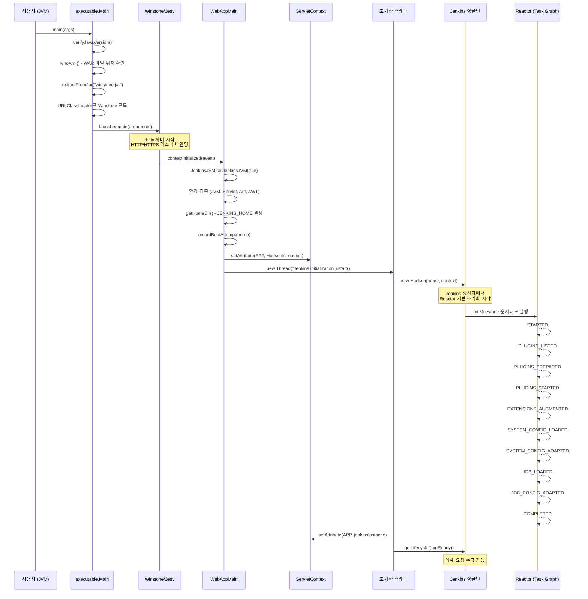
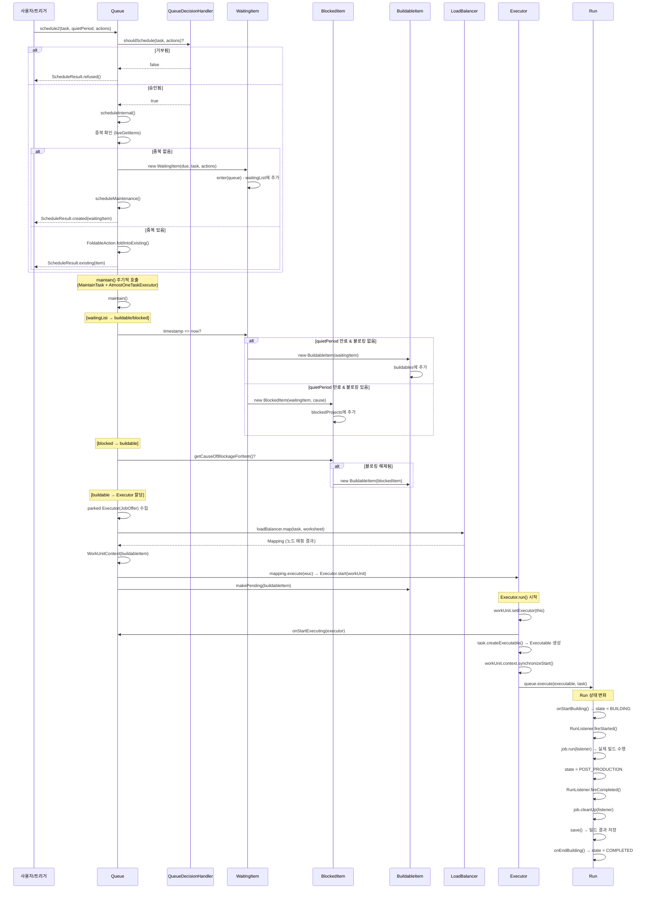
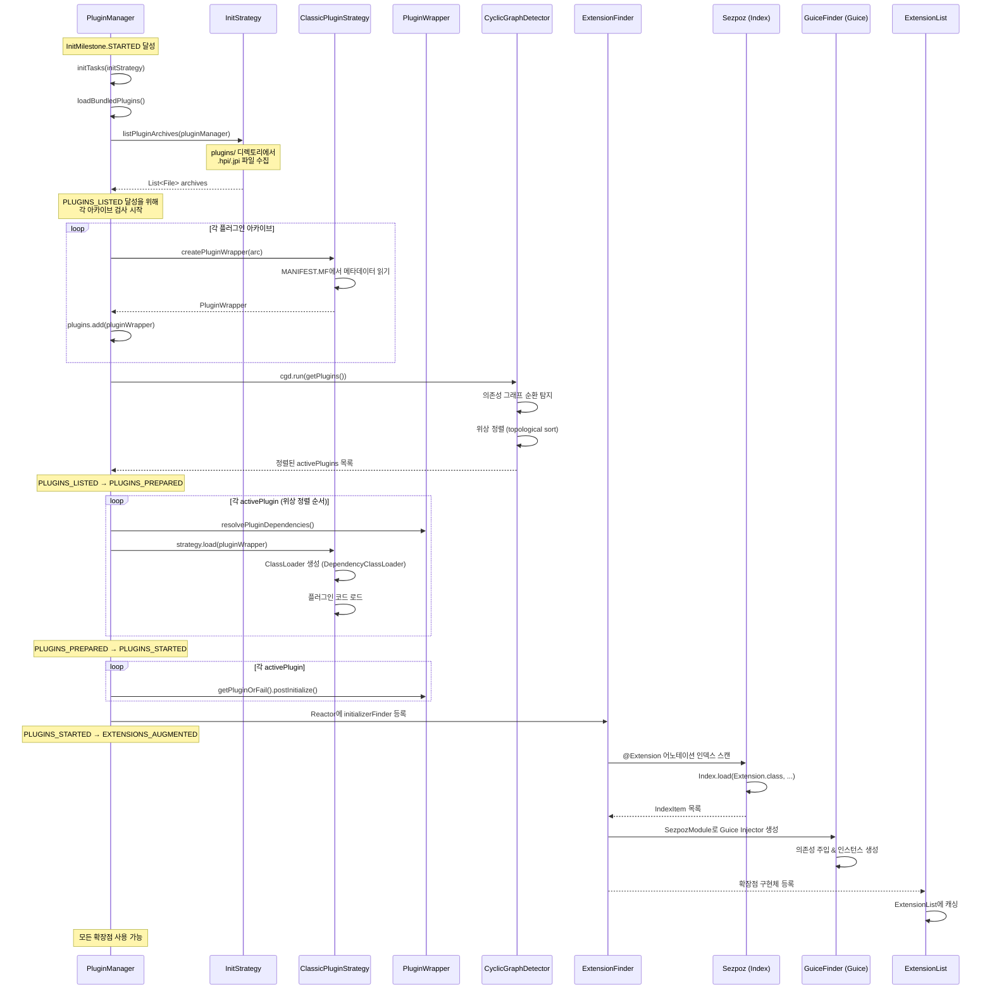
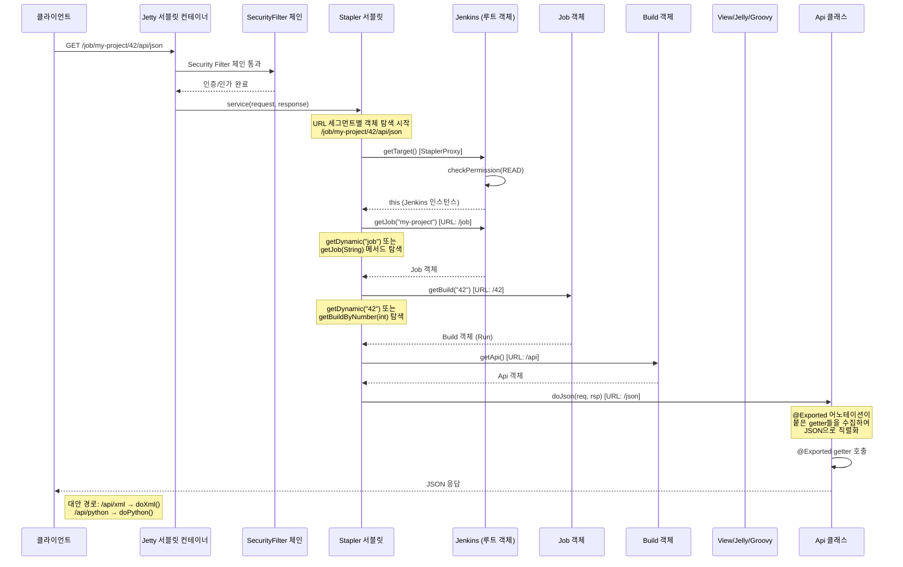
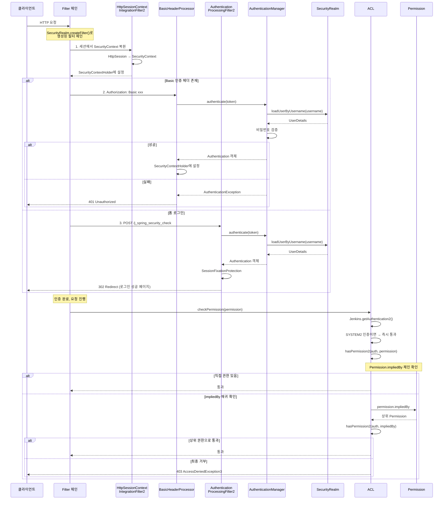
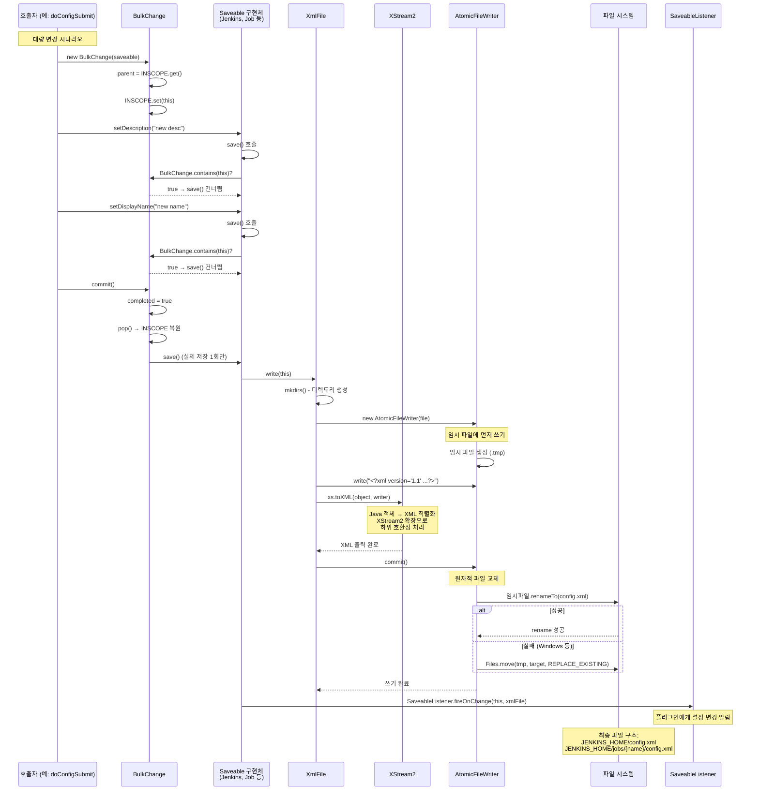

# Jenkins 시퀀스 다이어그램

> Jenkins 핵심 흐름을 Mermaid sequenceDiagram으로 시각화하고, 각 단계를 소스코드 수준에서 상세히 설명한다.
> 모든 소스 경로는 Jenkins 소스 루트(`jenkins/`) 기준이다.

---

## 목차

1. [Jenkins 시작 시퀀스](#1-jenkins-시작-시퀀스)
2. [빌드 실행 흐름](#2-빌드-실행-흐름)
3. [플러그인 로딩 흐름](#3-플러그인-로딩-흐름)
4. [HTTP 요청 처리 (Stapler 라우팅)](#4-http-요청-처리-stapler-라우팅)
5. [인증·인가 흐름](#5-인증인가-흐름)
6. [설정 저장 흐름](#6-설정-저장-흐름)

---

## 1. Jenkins 시작 시퀀스

Jenkins는 `java -jar jenkins.war` 명령으로 시작된다. WAR 파일 내부의 `executable.Main.main()`이 진입점이며, Winstone(Jetty 래퍼) 서블릿 컨테이너를 부트스트랩한 뒤, 서블릿 컨텍스트 초기화 과정에서 `WebAppMain.contextInitialized()`가 호출되어 Jenkins 싱글턴이 생성된다.

### 1.1 시퀀스 다이어그램



### 1.2 단계별 상세 설명

#### (1) executable.Main.main() - WAR 부트스트랩

| 단계 | 설명 | 소스 위치 |
|------|------|-----------|
| Java 버전 검증 | `Runtime.version().feature()`로 현재 JVM 버전을 확인하고 지원 목록(`SUPPORTED_JAVA_VERSIONS = {21, 25}`)과 대조한다. `--enable-future-java` 플래그가 없으면 미지원 버전에서 예외를 던진다. | `war/src/main/java/executable/Main.java:107-152` |
| WAR 위치 확인 | `whoAmI()`에서 `Main.class`의 CodeSource를 통해 jenkins.war 파일의 실제 경로를 찾는다. | `Main.java:387-414` |
| Winstone 추출 | `extractFromJar("winstone.jar", ...)`로 WAR 내부의 Winstone JAR를 임시 디렉토리에 추출한다. | `Main.java:250-251` |
| ClassLoader 생성 | `new URLClassLoader("Jenkins Main ClassLoader", ...)`로 Winstone을 로드할 별도의 클래스로더를 만든다. | `Main.java:269-273` |
| JSESSIONID 커스텀 | 동일 호스트에서 여러 Jenkins 인스턴스 실행 시 세션 충돌 방지를 위해 UUID 기반 고유 쿠키명을 설정한다. | `Main.java:303-327` |
| Winstone 기동 | 리플렉션으로 `winstone.Launcher.main(arguments)`를 호출하여 Jetty 서블릿 컨테이너를 시작한다. | `Main.java:331-346` |

**핵심 코드:**

```java
// Main.java:176
public static void main(String[] args) throws IllegalAccessException {
    verifyJavaVersion(Runtime.version().feature(), isFutureJavaEnabled(args));
    // ...
    File me = whoAmI(extractedFilesFolder);
    // Winstone JAR를 추출하고 ClassLoader로 로드
    ClassLoader cl = new URLClassLoader("Jenkins Main ClassLoader",
        new URL[]{tmpJar.toURI().toURL()}, ClassLoader.getSystemClassLoader());
    Class<?> launcher = cl.loadClass("winstone.Launcher");
    Method mainMethod = launcher.getMethod("main", String[].class);
    // Winstone 실행 → Jetty 서버 시작
    mainMethod.invoke(null, new Object[]{arguments.toArray(new String[0])});
}
```

#### (2) WebAppMain.contextInitialized() - Jenkins 초기화 시작

Winstone/Jetty가 WAR를 배포하면 `web.xml`에 등록된 `WebAppMain`의 `contextInitialized()`가 호출된다.

| 단계 | 설명 | 소스 위치 |
|------|------|-----------|
| JVM 플래그 설정 | `JenkinsJVM.setJenkinsJVM(true)` 호출로 현재 JVM이 Jenkins 전용임을 표시한다. | `WebAppMain.java:158` |
| 보안 검증 | `SecurityException` 발생 여부로 최소 권한을 확인하고, SunPKCS11 프로바이더를 제거한다. | `WebAppMain.java:172-184` |
| 로거 설치 | `RingBufferLogHandler`를 루트 로거에 추가하여 Jenkins가 로그를 인메모리로 버퍼링한다. | `WebAppMain.java:342-345` |
| JENKINS_HOME 결정 | 우선순위: 시스템 프로퍼티 → 환경변수 → `WEB-INF/workspace` → `~/.hudson` → `~/.jenkins` | `WebAppMain.java:368-402` |
| HudsonIsLoading 설정 | `context.setAttribute(APP, new HudsonIsLoading())`으로 로딩 중 표시 페이지를 활성화한다. | `WebAppMain.java:238` |
| 초기화 스레드 시작 | 별도 스레드에서 `new Hudson(home, context)`를 호출하여 Jenkins 인스턴스를 생성한다. 메인 서블릿 스레드를 블로킹하지 않기 위함이다. | `WebAppMain.java:244-297` |

**핵심 코드:**

```java
// WebAppMain.java:244-261
initThread = new Thread("Jenkins initialization thread") {
    @Override
    public void run() {
        boolean success = false;
        try {
            Jenkins instance = new Hudson(_home, context);
            if (Thread.interrupted()) throw new InterruptedException();
            context.setAttribute(APP, instance);
            Files.deleteIfExists(BootFailure.getBootFailureFile(_home).toPath());
            Jenkins.get().getLifecycle().onReady();
            success = true;
        } catch (Error e) {
            new HudsonFailedToLoad(e).publish(context, _home);
            throw e;
        }
    }
};
initThread.start();
```

#### (3) InitMilestone - 초기화 마일스톤 순서

Jenkins 초기화는 `Reactor`(태스크 그래프 실행 엔진)를 통해 진행되며, `InitMilestone` enum이 단계 순서를 정의한다. 각 마일스톤 사이에 NOOP 태스크가 삽입되어 순서를 강제한다.

| 마일스톤 | 설명 | 주요 작업 |
|----------|------|-----------|
| `STARTED` | 초기화 시작 | 아무 작업 없이 달성되는 최초 마일스톤 |
| `PLUGINS_LISTED` | 플러그인 목록 확정 | `plugins/` 디렉토리 스캔, 메타데이터 읽기, 순환 의존성 검사 |
| `PLUGINS_PREPARED` | 플러그인 준비 완료 | ClassLoader 생성, 의존성 해석, 플러그인 코드 로드 |
| `PLUGINS_STARTED` | 플러그인 시작 완료 | `Plugin.start()` 호출, 확장점 로드, 디스크립터 인스턴스화 |
| `EXTENSIONS_AUGMENTED` | 확장점 보강 완료 | 프로그래밍 방식으로 추가된 확장점 등록 완료 |
| `SYSTEM_CONFIG_LOADED` | 시스템 설정 로드 | 파일 시스템에서 시스템 설정 읽기 |
| `SYSTEM_CONFIG_ADAPTED` | 시스템 설정 적용 | CasC 같은 플러그인이 설정 파일 업데이트 |
| `JOB_LOADED` | Job 로드 완료 | 모든 Job과 빌드 기록을 디스크에서 로드 |
| `JOB_CONFIG_ADAPTED` | Job 설정 적용 | 플러그인이 이전 형식의 Job 설정을 마이그레이션 |
| `COMPLETED` | 초기화 완료 | Groovy init script 포함 모든 실행 완료 |

**소스 위치:** `core/src/main/java/hudson/init/InitMilestone.java:56-145`

마일스톤 순서 강제 메커니즘:

```java
// InitMilestone.java:132-138
public static TaskBuilder ordering() {
    TaskGraphBuilder b = new TaskGraphBuilder();
    InitMilestone[] v = values();
    for (int i = 0; i < v.length - 1; i++)
        b.add(null, Executable.NOOP).requires(v[i]).attains(v[i + 1]);
    return b;
}
```

이 코드는 각 마일스톤 사이에 NOOP 태스크를 추가하여, 예를 들어 `PLUGINS_LISTED`가 달성되어야만 `PLUGINS_PREPARED`를 시작할 수 있도록 보장한다.

---

## 2. 빌드 실행 흐름

Jenkins에서 빌드는 Queue에 의해 스케줄링되고, Executor 스레드에 의해 실행된다. Queue 내부에서 아이템은 여러 상태를 거치며, 최종적으로 Executor가 Run을 실행한다.

### 2.1 시퀀스 다이어그램



### 2.2 단계별 상세 설명

#### (1) Queue.schedule2() - 빌드 스케줄링

빌드 요청은 항상 `Queue.schedule2()`를 통해 큐에 진입한다. 이 메서드는 Lock을 획득한 뒤, `QueueDecisionHandler`들에게 스케줄링 승인 여부를 묻고, 내부적으로 `scheduleInternal()`을 호출한다.

**소스 위치:** `core/src/main/java/hudson/model/Queue.java:581-596`

```java
public @NonNull ScheduleResult schedule2(Task p, int quietPeriod, List<Action> actions) {
    actions = new ArrayList<>(actions);
    actions.removeIf(Objects::isNull);
    lock.lock();
    try { try {
        for (QueueDecisionHandler h : QueueDecisionHandler.all())
            if (!h.shouldSchedule(p, actions))
                return ScheduleResult.refused();    // 거부
        return scheduleInternal(p, quietPeriod, actions);
    } finally { updateSnapshot(); } } finally {
        lock.unlock();
    }
}
```

`scheduleInternal()`에서는 `quietPeriod`(대기 시간) 기반의 `due` 시각을 계산하고, 이미 동일 태스크가 큐에 있는지 확인한다.

- **중복 없음:** `WaitingItem`을 생성하여 `waitingList`에 추가하고 `scheduleMaintenance()`를 호출한다.
- **중복 있음:** `FoldableAction.foldIntoExisting()`으로 기존 아이템에 액션을 합치고, 더 이른 `due` 시각으로 갱신한다.

#### (2) Queue 아이템 상태 전이

Queue 내부에서 아이템은 다음과 같은 상태를 거친다. 이 상태 전이는 Queue 클래스 상단의 주석에 ASCII 다이어그램으로 명시되어 있다.

```
(enter) --> waitingList --+--> blockedProjects
                          |        ^
                          |        |
                          |        v
                          +--> buildables ---> pending ---> left
                                   ^              |
                                   |              |
                                   +---(rarely)---+
```

**소스 위치:** `core/src/main/java/hudson/model/Queue.java:155-164`

| 상태 | 클래스 | 설명 |
|------|--------|------|
| waiting | `WaitingItem` (줄 2662) | quietPeriod가 만료되지 않아 아직 실행 불가 |
| blocked | `BlockedItem` (줄 2734) | quietPeriod는 만료되었으나 다른 빌드가 진행 중이거나 리소스 부족 |
| buildable | `BuildableItem` (줄 2787) | 즉시 실행 가능하며 Executor 할당 대기 중 |
| pending | `BuildableItem.isPending=true` | Executor에 할당되었으나 아직 실행 시작 전 |
| left | `LeftItem` (줄 2885) | 큐를 떠남 (실행 시작, 취소, 또는 만료) |

#### (3) Queue.maintain() - 큐 유지보수

`maintain()`은 큐의 핵심 스케줄링 로직이다. `AtmostOneTaskExecutor`를 통해 한 번에 하나의 스레드만 실행되며, 주기적으로 호출된다.

**소스 위치:** `core/src/main/java/hudson/model/Queue.java:1593-1829`

```
maintain() 실행 흐름
===================================

1. parked Executor(유휴 Executor) 수집
   - 모든 Computer의 Executor를 순회
   - isParking() 상태인 Executor를 JobOffer로 래핑

2. lost pending 처리
   - pending 상태인데 Executor가 사라진 아이템 → buildable로 복구

3. blocked → buildable 전환
   - blockedProjects를 QueueSorter 순서로 정렬
   - getCauseOfBlockageForItem(p) == null이면 buildable로 전환

4. waiting → buildable/blocked 전환
   - waitingList에서 timestamp이 현재 시각 이전인 항목을 처리
   - 블로킹 사유 없으면 buildable, 있으면 blocked로 이동

5. buildable → Executor 할당
   - 각 buildable 아이템에 대해:
     a. 후보 Executor(JobOffer) 필터링
     b. MappingWorksheet 생성
     c. LoadBalancer.map(task, worksheet)으로 노드 매핑
     d. mapping.execute(wuc)으로 Executor에 WorkUnit 할당
     e. makePending(buildableItem)으로 pending 상태 전환
```

#### (4) Executor.run() - 빌드 실행

Executor는 `Thread`를 상속한 클래스로, Queue에 의해 `start()`가 호출되면 `run()` 메서드가 실행된다.

**소스 위치:** `core/src/main/java/hudson/model/Executor.java:339-457`

주요 단계:

1. **노드 유효성 확인:** 할당된 노드가 온라인인지 확인하고, 오프라인이면 WorkUnit을 리셋하고 종료한다.
2. **Executable 생성:** `task.createExecutable()`을 호출하여 `Queue.Executable`(보통 `Run` 하위 클래스)을 생성한다.
3. **동기화 시작:** `workUnit.context.synchronizeStart()`로 멀티 워크유닛의 동기화를 처리한다.
4. **액션 복사:** `WorkUnit.context.actions`의 액션들을 Executable에 추가한다.
5. **인증 설정:** `workUnit.context.item.authenticate2()`로 빌드 실행 인증을 설정한다.
6. **빌드 실행:** `queue.execute(executable, task)`를 호출하여 실제 빌드를 수행한다.

```java
// Executor.java:380-396 (간략화)
workUnit.setExecutor(Executor.this);
queue.onStartExecuting(Executor.this);
SubTask _task = workUnit.work;
Executable _executable = _task.createExecutable();
executable = _executable;
workUnit.setExecutable(_executable);
```

#### (5) Run 상태 변화

Run 인스턴스는 4가지 상태를 순서대로 거친다.

**소스 위치:** `core/src/main/java/hudson/model/Run.java:245-268`

```java
private enum State {
    NOT_STARTED,      // 빌드가 생성/큐에 추가되었으나 아직 시작하지 않음
    BUILDING,         // 빌드 진행 중
    POST_PRODUCTION,  // 빌드 완료, 결과 확정. 로그 파일은 아직 갱신 중.
                      // 이 시점에서 Jenkins는 빌드를 완료로 인식 → 후속 빌드 트리거 가능
    COMPLETED         // 빌드 완전 종료, 로그 파일 닫힘
}
```

상태 전이 코드:

```java
// Run.java:1966-1968 - 빌드 시작
protected void onStartBuilding() {
    state = State.BUILDING;
    startTime = System.currentTimeMillis();
    RunListener.fireInitialize(this);
}

// Run.java:1879-1880 - 후처리 단계
state = State.POST_PRODUCTION;
RunListener.fireCompleted(this, listener);
job.cleanUp(listener);

// Run.java:1980-1981 - 빌드 완전 종료
protected void onEndBuilding() {
    state = State.COMPLETED;
}
```

`POST_PRODUCTION` 상태의 존재 이유는 JENKINS-980에서 설명된다. Jenkins가 빌드를 "완료"로 인식해야 후속 빌드 트리거가 가능하지만, 로그 파일 정리나 클린업 작업은 아직 진행 중일 수 있다. 이 중간 상태가 이 두 요구를 모두 만족시킨다.

---

## 3. 플러그인 로딩 흐름

Jenkins의 확장성은 플러그인 시스템에 기반한다. `PluginManager`가 플러그인 라이프사이클 전체를 관리하며, `ExtensionFinder`가 `@Extension` 어노테이션이 붙은 확장점 구현체를 발견한다.

### 3.1 시퀀스 다이어그램



### 3.2 단계별 상세 설명

#### (1) PluginManager.initTasks() - 플러그인 초기화 태스크 구성

`PluginManager.initTasks()`는 `TaskBuilder`를 반환하며, Reactor에 의해 InitMilestone 순서에 맞춰 실행된다.

**소스 위치:** `core/src/main/java/hudson/PluginManager.java:445-632`

태스크 구성 순서:

| 태스크 | 마일스톤 요구 | 달성 마일스톤 | 설명 |
|--------|-------------|-------------|------|
| "Loading bundled plugins" | 없음 | 없음 | WAR에 번들된 플러그인 로드 |
| "Listing up plugins" | 위 태스크 완료 | 없음 | `plugins/` 디렉토리에서 아카이브 목록 생성 |
| "Preparing plugins" | 위 태스크 완료 | `PLUGINS_LISTED` | 각 아카이브 검사, 순환 의존성 검사, 위상 정렬 |
| "Loading plugins" | `PLUGINS_LISTED` | `PLUGINS_PREPARED` | ClassLoader 생성 및 플러그인 코드 로드 |
| "Initializing plugin ..." | `PLUGINS_PREPARED` | `PLUGINS_STARTED` | `Plugin.postInitialize()` 호출 |
| "Discovering plugin initialization tasks" | `PLUGINS_STARTED` | - | 플러그인의 `@Initializer` 메서드 탐색 |

#### (2) 플러그인 아카이브 검사 및 의존성 해석

각 `.hpi`/`.jpi` 파일에 대해 `ClassicPluginStrategy.createPluginWrapper()`가 호출되어 `MANIFEST.MF`에서 메타데이터(이름, 버전, 의존성 등)를 읽는다.

```java
// PluginManager.java:476-504 (간략화)
PluginWrapper p = strategy.createPluginWrapper(arc);
if (isDuplicate(p)) return;
p.isBundled = containsHpiJpi(bundledPlugins, arc.getName());
plugins.add(p);
```

중복 검사에서는 `shortName`을 기준으로 판단한다. `cobertura-1.0.jpi`와 `cobertura-1.1.jpi`가 동시에 존재하면 먼저 처리된 것만 사용한다.

#### (3) 순환 의존성 검사

`CyclicGraphDetector`를 사용하여 플러그인 의존성 그래프에서 순환을 탐지한다. 순환이 발견되면 관련된 모든 플러그인을 비활성화하고 `failedPlugins`에 추가한다.

**소스 위치:** `core/src/main/java/hudson/PluginManager.java:508-557`

```java
// PluginManager.java:515-541 (핵심 로직)
CyclicGraphDetector<PluginWrapper> cgd = new CyclicGraphDetector<>() {
    @Override
    protected List<PluginWrapper> getEdges(PluginWrapper p) {
        List<PluginWrapper> next = new ArrayList<>();
        addTo(p.getDependencies(), next);
        addTo(p.getOptionalDependencies(), next);
        return next;
    }

    @Override
    protected void reactOnCycle(PluginWrapper q, List<PluginWrapper> cycle) {
        LOGGER.log(Level.SEVERE, "found cycle in plugin dependencies: ...");
        for (PluginWrapper pluginWrapper : cycle) {
            pluginWrapper.setHasCycleDependency(true);
            failedPlugins.add(new FailedPlugin(pluginWrapper, new CycleDetectedException(cycle)));
        }
    }
};
cgd.run(getPlugins());
// 위상 정렬 결과로 activePlugins 구성
for (PluginWrapper p : cgd.getSorted()) {
    if (p.isActive()) {
        activePlugins.add(p);
    }
}
```

#### (4) 플러그인 로드 및 초기화

`PLUGINS_LISTED` 이후, 위상 정렬 순서대로 각 플러그인을 로드한다.

```java
// PluginManager.java:586-603 (간략화)
for (final PluginWrapper p : activePlugins.toArray(new PluginWrapper[0])) {
    // PLUGINS_PREPARED 달성을 위해 각 플러그인 로드
    p.resolvePluginDependencies();
    strategy.load(p);  // ClassLoader 생성 + 코드 로드
}

for (final PluginWrapper p : activePlugins.toArray(new PluginWrapper[0])) {
    // PLUGINS_STARTED 달성을 위해 각 플러그인 초기화
    p.getPluginOrFail().postInitialize();
}
```

`MissingDependencyException`이나 `IOException` 발생 시 해당 플러그인을 `failedPlugins`에 추가하고 ClassLoader를 해제한다.

#### (5) @Extension 발견 - ExtensionFinder

`ExtensionFinder`는 `@Extension` 어노테이션이 붙은 확장점 구현체를 발견하는 메커니즘이다. 두 가지 주요 구현체가 있다.

**소스 위치:** `core/src/main/java/hudson/ExtensionFinder.java`

| 구현체 | 줄 번호 | 역할 |
|--------|---------|------|
| `ExtensionFinder.Sezpoz` | 줄 675 | SezPoz 라이브러리를 사용하여 `@Extension` 어노테이션 인덱스(`META-INF/annotations/`)를 스캔한다. 컴파일 시점에 어노테이션 프로세서가 인덱스를 생성하므로 런타임 클래스패스 스캔이 불필요하다. |
| `ExtensionFinder.GuiceFinder` | 줄 238 | Sezpoz가 발견한 확장점을 Google Guice Injector에 등록하고, 의존성 주입을 통해 인스턴스를 생성한다. `SezpozModule`(줄 470)이 Guice `AbstractModule`을 구현하여 바인딩을 정의한다. |

발견된 확장점 구현체들은 `ExtensionList`에 등록되어 타입별로 캐싱된다. 이후 `ExtensionList.lookup(SomeExtensionPoint.class)`으로 사용 가능하다.

**소스 위치:** `core/src/main/java/hudson/ExtensionList.java:64`

---

## 4. HTTP 요청 처리 (Stapler 라우팅)

Jenkins는 Kohsuke Kawaguchi가 개발한 **Stapler** 프레임워크를 사용하여 HTTP 요청을 처리한다. Stapler의 핵심 아이디어는 URL 세그먼트를 Java 객체 트리에 매핑하는 것이다. 별도의 라우터 설정 없이 객체 그래프가 곧 URL 구조가 된다.

### 4.1 시퀀스 다이어그램



### 4.2 Stapler URL 매핑 규칙

Stapler가 URL 세그먼트 `token`에 대해 객체 `obj`에서 다음 객체를 찾는 순서:

```
URL 세그먼트 "token"에 대한 탐색 순서
==========================================

1. obj.doToken(req, rsp)     — "do" 접두사 메서드 (액션)
2. obj.doToken(req)          — 간략 액션
3. obj.getToken()            — getter 메서드
4. obj.getToken(String)      — 파라미터 받는 getter
5. obj.getDynamic(token,...) — 동적 디스패치 (catch-all)
6. obj.jelly/groovy 뷰      — token.jelly 또는 token.groovy 렌더링
```

### 4.3 단계별 상세 설명

#### (1) StaplerProxy - 접근 제어 게이트

`Jenkins` 클래스는 `StaplerProxy` 인터페이스를 구현한다. Stapler가 URL 탐색을 시작하기 전에 `getTarget()`을 호출하여 실제 대상 객체를 반환받는다. 이 시점에서 권한 확인이 수행된다.

**소스 위치:** `core/src/main/java/jenkins/model/Jenkins.java:5217-5228`

```java
@Override
public Object getTarget() {
    try {
        checkPermission(READ);
    } catch (AccessDeniedException e) {
        if (!isSubjectToMandatoryReadPermissionCheck(
                Stapler.getCurrentRequest2().getRestOfPath())) {
            return this;  // 예외 경로는 인증 없이 접근 가능
        }
        throw e;
    }
    return this;
}
```

`isSubjectToMandatoryReadPermissionCheck()`는 `ALWAYS_READABLE_PATHS`(로그인 페이지, CLI 등)와 `UnprotectedRootAction` 목록을 확인하여 인증 없이 접근 가능한 경로를 판별한다.

#### (2) StaplerFallback - 폴백 객체

URL 탐색이 현재 객체에서 더 이상 매핑할 수 없으면 `StaplerFallback` 인터페이스의 `getStaplerFallback()`이 호출된다. Jenkins에서는 루트에서 매핑 실패 시 기본 뷰(Primary View)로 폴백한다.

**소스 위치:** `core/src/main/java/jenkins/model/Jenkins.java:5287-5289`

```java
@Override
public View getStaplerFallback() {
    return getPrimaryView();
}
```

#### (3) getDynamic() - 동적 URL 디스패치

`Jenkins.getDynamic()`은 등록된 `Action`들의 `urlName`과 URL 세그먼트를 대조하여 동적으로 객체를 찾는다.

**소스 위치:** `core/src/main/java/jenkins/model/Jenkins.java:4010-4021`

```java
public Object getDynamic(String token) {
    for (Action a : getActions()) {
        String url = a.getUrlName();
        if (url == null) continue;
        if (url.equals(token) || url.equals('/' + token))
            return a;
    }
    for (Action a : getManagementLinks())
        if (Objects.equals(a.getUrlName(), token))
            return a;
    return null;
}
```

#### (4) API 엔드포인트 - /api/json, /api/xml

대부분의 Jenkins 모델 객체에는 `getApi()` 메서드가 있어 `/api` URL 세그먼트에서 `Api` 객체를 반환한다. `Api` 클래스는 `@Exported` 어노테이션이 붙은 getter 메서드들을 수집하여 JSON/XML로 직렬화한다.

**소스 위치:**
- `core/src/main/java/jenkins/model/Jenkins.java:1368` - `getApi()` 메서드
- `core/src/main/java/hudson/model/Api.java:81` - `Api` 클래스

```java
// Jenkins.java:1368-1377
public Api getApi() {
    final StaplerRequest2 req = Stapler.getCurrentRequest2();
    if (req != null) {
        final Object attribute = req.getAttribute("jakarta.servlet.error.message");
        if (attribute != null) {
            return null;  // 404 에러 페이지에서는 REST API 링크 숨김
        }
    }
    return new Api(this);
}
```

`Api` 객체는 Stapler의 `@ExportedBean` / `@Exported` 어노테이션 메커니즘을 사용한다:

- `@ExportedBean`: 클래스를 API 직렬화 대상으로 표시
- `@Exported`: 개별 getter를 직렬화 필드로 표시

#### (5) URL → 객체 매핑 예제

```
GET /job/my-project/42/console

Jenkins (루트)
  ├── getJob("my-project")     →  Job 객체  [/job/my-project]
  │     └── getBuildByNumber(42) →  Run 객체  [/42]
  │           └── doConsole(req, rsp)          [/console]
  │
  ├── getDynamic("manage")     →  ManageAction  [/manage]
  │     └── ...
  │
  └── getStaplerFallback()     →  Primary View (All 등)
```

---

## 5. 인증·인가 흐름

Jenkins의 보안 아키텍처는 **인증(Authentication)**과 **인가(Authorization)**를 명확히 분리한다. `SecurityRealm`이 인증을, `AuthorizationStrategy`가 인가를 담당하며, Spring Security 필터 체인을 기반으로 동작한다.

### 5.1 시퀀스 다이어그램



### 5.2 단계별 상세 설명

#### (1) SecurityRealm.createFilter() - 필터 체인 구성

`SecurityRealm`은 추상 클래스로, 인증 방식에 따라 다른 구현체를 사용한다 (예: `HudsonPrivateSecurityRealm`, `LDAPSecurityRealm`). `createFilter()` 메서드가 Spring Security 필터 체인을 구성한다.

**소스 위치:** `core/src/main/java/hudson/security/SecurityRealm.java:645-675`

기본 `createFilterImpl()`에서 생성되는 필터 순서:

| 순서 | 필터 | 역할 |
|------|------|------|
| 1 | `HttpSessionContextIntegrationFilter2` | HTTP 세션에서 `SecurityContext`를 복원/저장한다. `allowSessionCreation=false`로 설정되어 세션이 없으면 새로 만들지 않는다. |
| 2 | `BasicHeaderProcessor` | `Authorization: Basic` 헤더를 처리한다. 실패 시 401 응답과 함께 Basic 인증 요청(`WWW-Authenticate: Basic realm="Jenkins"`)을 반환한다. |
| 3 | `AuthenticationProcessingFilter2` | 폼 기반 로그인(`/j_spring_security_check`)을 처리한다. `SessionFixationProtectionStrategy`로 세션 고정 공격을 방지한다. |
| 4 | (RememberMe 서비스) | "로그인 상태 유지" 쿠키를 처리한다. |

```java
// SecurityRealm.java:645-674 (핵심 부분)
private Filter createFilterImpl(FilterConfig filterConfig) {
    SecurityComponents sc = getSecurityComponents();
    List<Filter> filters = new ArrayList<>();

    // 1. 세션 기반 SecurityContext 통합
    HttpSessionSecurityContextRepository repo = new HttpSessionSecurityContextRepository();
    repo.setAllowSessionCreation(false);
    filters.add(new HttpSessionContextIntegrationFilter2(repo));

    // 2. Basic 인증 처리
    BasicHeaderProcessor bhp = new BasicHeaderProcessor();
    BasicAuthenticationEntryPoint entryPoint = new BasicAuthenticationEntryPoint();
    entryPoint.setRealmName("Jenkins");
    bhp.setAuthenticationEntryPoint(entryPoint);
    filters.add(bhp);

    // 3. 폼 로그인 처리
    AuthenticationProcessingFilter2 apf = new AuthenticationProcessingFilter2(...);
    apf.setAuthenticationManager(sc.manager2);
    apf.setSessionAuthenticationStrategy(new SessionFixationProtectionStrategy());
    // ...
}
```

#### (2) SecurityRealm.createSecurityComponents() - 인증 매니저 생성

각 SecurityRealm 구현체는 `createSecurityComponents()`를 오버라이드하여 `AuthenticationManager`를 제공한다. 이 매니저가 실제 사용자 인증(비밀번호 검증, LDAP 바인딩 등)을 수행한다.

**소스 위치:** `core/src/main/java/hudson/security/SecurityRealm.java:173`

```java
public abstract SecurityComponents createSecurityComponents();
```

#### (3) ACL.checkPermission() - 권한 확인

인증이 완료된 후, 각 리소스 접근 시 `ACL.checkPermission()`이 호출된다. `ACL`은 추상 클래스로, 구체적인 권한 판단은 `AuthorizationStrategy`가 제공하는 ACL 구현체에 위임된다.

**소스 위치:** `core/src/main/java/hudson/security/ACL.java:70-81`

```java
public final void checkPermission(@NonNull Permission p) {
    Authentication a = Jenkins.getAuthentication2();
    if (a.equals(SYSTEM2)) {
        return;  // 시스템 인증은 항상 통과
    }
    if (!hasPermission2(a, p)) {
        while (!p.enabled && p.impliedBy != null) {
            p = p.impliedBy;
        }
        throw new AccessDeniedException3(a, p);
    }
}
```

주요 특징:
- `SYSTEM2` 인증(Jenkins 내부 시스템 계정)은 모든 권한을 가진다.
- `hasPermission2()`는 추상 메서드로, `AuthorizationStrategy`의 ACL 구현체가 제공한다.
- 권한이 거부되면 `AccessDeniedException3`을 던진다.

#### (4) Permission 계층 - impliedBy 체인

`Permission` 클래스의 `impliedBy` 필드는 권한 계층 구조를 정의한다. 예를 들어 `Job.READ` 권한은 `Job.CONFIGURE`에 의해 암시(implied)될 수 있다.

**소스 위치:** `core/src/main/java/hudson/security/Permission.java:85-97`

```java
// Permission.java:85-97
/**
 * Bundled Permission that also implies this permission.
 * This allows us to organize permissions in a hierarchy, so that
 * for example we can say "view workspace" permission is implied by
 * the (broader) "read" permission.
 */
public final @CheckForNull Permission impliedBy;
```

권한 확인 시 `impliedBy` 체인을 따라 재귀적으로 상위 권한도 확인한다:

```
Permission 계층 예시
===================================

Jenkins.ADMINISTER
  └── implies → Jenkins.MANAGE
                  └── implies → Jenkins.READ
                                  └── implies → (null, 최상위)

Item.DELETE
  └── implies → Item.CONFIGURE
                  └── implies → Item.READ
```

#### (5) ACL 위임 구조

```
요청에 대한 권한 확인 흐름
===================================

1. AbstractItem.checkPermission(p)
   → ACL acl = getACL()
   → AuthorizationStrategy.getACL(item) 호출

2. AuthorizationStrategy 구현체별 ACL 반환
   - FullControlOnceLoggedInAuthorizationStrategy
   - ProjectMatrixAuthorizationStrategy
   - RoleBasedAuthorizationStrategy (플러그인)

3. ACL.hasPermission2(auth, permission) 호출
   → 구현체가 auth의 Principal/GrantedAuthority와
     permission을 대조하여 true/false 반환
```

---

## 6. 설정 저장 흐름

Jenkins는 모든 설정과 상태를 XML 파일로 `JENKINS_HOME`에 영속화한다. `XmlFile`이 XStream 라이브러리를 통해 Java 객체를 XML로 직렬화/역직렬화하며, `AtomicFileWriter`로 원자적 쓰기를 보장한다. `BulkChange`는 여러 `save()` 호출을 하나로 묶어 I/O를 최적화한다.

### 6.1 시퀀스 다이어그램



### 6.2 단계별 상세 설명

#### (1) BulkChange - 배치 저장 메커니즘

`BulkChange`는 Java의 `try-with-resources` 패턴과 함께 사용되어 여러 설정 변경을 하나의 `save()` 호출로 묶는다. 이는 특히 웹 UI의 "설정 저장" 버튼 클릭 시 수십 개의 속성이 한 번에 변경되는 경우에 효과적이다.

**소스 위치:** `core/src/main/java/hudson/BulkChange.java:71-120`

```java
// BulkChange.java 사용 패턴
try (BulkChange bc = new BulkChange(someObject)) {
    someObject.setA(...);  // 내부에서 save() 호출 → BulkChange가 차단
    someObject.setB(...);  // save() 호출 → BulkChange가 차단
    someObject.setC(...);  // save() 호출 → BulkChange가 차단
    bc.commit();           // 여기서 1회만 실제 save()
}
// close() 호출 → commit() 안 했으면 abort()
```

핵심 원리:

1. **ThreadLocal 스택:** `INSCOPE`라는 `ThreadLocal<BulkChange>`를 사용하여 현재 스레드에서 활성화된 BulkChange를 추적한다.
2. **save() 가로채기:** `Saveable.save()` 구현에서 `BulkChange.contains(this)`를 확인하고, true이면 실제 I/O를 건너뛴다.
3. **commit():** BulkChange 스코프를 벗어난 뒤 `saveable.save()`를 1회 호출한다.
4. **abort():** `commit()` 없이 close되면 save하지 않는다. 단, 객체 상태는 롤백되지 않는다.

```java
// BulkChange.java:78-99
public BulkChange(Saveable saveable) {
    this.parent = current();
    this.saveable = saveable;
    allocator = new Exception();   // 디버깅용: 누가 BulkChange를 생성했는지 추적
    INSCOPE.set(this);             // 현재 스레드에 활성화
}

public void commit() throws IOException {
    if (completed) return;
    completed = true;
    pop();                          // INSCOPE에서 제거
    saveable.save();               // 실제 저장 1회
}
```

실제 사용 예 (`Jenkins.doConfigSubmit()`):

**소스 위치:** `core/src/main/java/jenkins/model/Jenkins.java:4033-4038`

```java
// Jenkins.java:4033-4038
@POST
public synchronized void doConfigSubmit(StaplerRequest2 req, StaplerResponse2 rsp)
        throws IOException, ServletException, FormException {
    try (BulkChange bc = new BulkChange(this)) {
        checkPermission(MANAGE);
        JSONObject json = req.getSubmittedForm();
        systemMessage = Util.nullify(req.getParameter("system_message"));
        // ... 수십 개의 설정 변경 ...
        bc.commit();
    }
}
```

#### (2) XmlFile.write() - XML 직렬화

`XmlFile`은 Jenkins의 XML 데이터 파일을 추상화한다. `write()` 메서드가 Java 객체를 XML로 직렬화하여 파일에 저장한다.

**소스 위치:** `core/src/main/java/hudson/XmlFile.java:203-227`

```java
// XmlFile.java:203-227
public void write(Object o) throws IOException {
    mkdirs();
    AtomicFileWriter w = force
            ? new AtomicFileWriter(file)
            : new AtomicFileWriter(file.toPath(), StandardCharsets.UTF_8, false, false);
    try {
        w.write("<?xml version='1.1' encoding='UTF-8'?>\n");
        beingWritten.put(o, null);    // 직렬화 중인 객체 추적
        writing.set(file);            // 현재 쓰기 중인 파일 추적 (ThreadLocal)
        try {
            xs.toXML(o, w);           // XStream2로 직렬화
        } finally {
            beingWritten.remove(o);
            writing.set(null);
        }
        w.commit();                   // 원자적 파일 교체
    } catch (RuntimeException e) {
        throw new IOException(e);
    } finally {
        w.abort();                    // commit 안 됐으면 임시 파일 삭제
    }
}
```

주요 세부 사항:

| 요소 | 설명 |
|------|------|
| `beingWritten` | `IdentityHashMap`으로, 현재 직렬화 중인 객체를 추적한다. JENKINS-45892에서 중첩 객체의 `writeReplace`에서 최상위 객체 여부를 판단하는 데 사용된다. |
| `writing` | `ThreadLocal<File>`로, 현재 쓰기 중인 파일을 추적한다. |
| XML 버전 | `<?xml version='1.1' ...>`을 사용한다. XML 1.1은 XML 1.0보다 더 넓은 문자 범위를 지원한다. |
| `xs` | `XStream2` 인스턴스로, Jenkins 특화 변환기(Converter)들이 등록되어 하위 호환성을 처리한다. |

#### (3) AtomicFileWriter - 원자적 파일 쓰기

`AtomicFileWriter`는 파일을 원자적으로 교체하여, 쓰기 도중 Jenkins가 죽어도 설정 파일이 깨지지 않도록 보장한다.

동작 원리:

```
원자적 파일 쓰기 흐름
===================================

1. 임시 파일 생성: config.xml.tmp (같은 디렉토리)
2. 임시 파일에 XML 내용 쓰기
3. commit() 호출 시:
   a. writer.flush()
   b. 임시파일 → 원본파일로 rename (원자적 연산)
   c. rename 실패 시 Files.move(..., REPLACE_EXISTING) 시도
4. abort() 호출 시 (또는 commit 실패 시):
   a. 임시 파일 삭제
   b. 원본 파일은 그대로 유지
```

이 메커니즘 덕분에:
- 쓰기 중 비정상 종료 → 원본 config.xml이 그대로 남음
- 디스크 공간 부족 → commit 실패 → 임시 파일만 삭제됨
- 동시 읽기 → 항상 완전한 파일을 읽음 (rename은 원자적)

#### (4) SaveableListener - 변경 알림

`save()` 완료 후 `SaveableListener.fireOnChange(saveable, xmlFile)`이 호출되어 등록된 리스너들에게 설정 변경을 알린다. 이를 통해 플러그인들은 설정 변경 이벤트를 감지하고 추가 작업을 수행할 수 있다 (예: 감사 로깅, 설정 동기화).

#### (5) JENKINS_HOME 파일 구조

```
JENKINS_HOME/
├── config.xml                          # Jenkins 전역 설정
├── credentials.xml                     # 자격 증명 저장소
├── hudson.model.UpdateCenter.xml       # 업데이트 센터 설정
├── jobs/
│   └── my-project/
│       ├── config.xml                  # Job 설정
│       ├── nextBuildNumber             # 다음 빌드 번호
│       └── builds/
│           └── 42/
│               ├── build.xml           # 빌드 기록
│               └── log                 # 콘솔 출력
├── nodes/
│   └── agent-1/
│       └── config.xml                  # Agent 설정
├── plugins/
│   ├── git.jpi                         # 플러그인 아카이브
│   └── git/                            # 플러그인 추출된 디렉토리
└── users/
    └── admin/
        └── config.xml                  # 사용자 설정
```

모든 `config.xml` 파일은 `XmlFile.write()`를 통해 원자적으로 저장되며, `XmlFile.read()`를 통해 로드된다. 이 파일 기반 영속화 방식은 Jenkins의 핵심 설계 결정 중 하나로, 데이터베이스 없이 동작하면서도 Git 등을 통한 설정 버전 관리를 가능하게 한다.

---

## 소스코드 참조 요약

| 흐름 | 핵심 소스 파일 |
|------|---------------|
| 시작 시퀀스 | `war/src/main/java/executable/Main.java`<br/>`core/src/main/java/hudson/WebAppMain.java`<br/>`core/src/main/java/hudson/init/InitMilestone.java` |
| 빌드 실행 | `core/src/main/java/hudson/model/Queue.java`<br/>`core/src/main/java/hudson/model/Executor.java`<br/>`core/src/main/java/hudson/model/Run.java` |
| 플러그인 로딩 | `core/src/main/java/hudson/PluginManager.java`<br/>`core/src/main/java/hudson/ExtensionFinder.java`<br/>`core/src/main/java/hudson/ClassicPluginStrategy.java`<br/>`core/src/main/java/hudson/ExtensionList.java` |
| HTTP 요청 처리 | `core/src/main/java/jenkins/model/Jenkins.java` (getTarget, getDynamic, getApi, getStaplerFallback)<br/>`core/src/main/java/hudson/model/Api.java` |
| 인증·인가 | `core/src/main/java/hudson/security/SecurityRealm.java`<br/>`core/src/main/java/hudson/security/ACL.java`<br/>`core/src/main/java/hudson/security/Permission.java` |
| 설정 저장 | `core/src/main/java/hudson/XmlFile.java`<br/>`core/src/main/java/hudson/BulkChange.java` |
