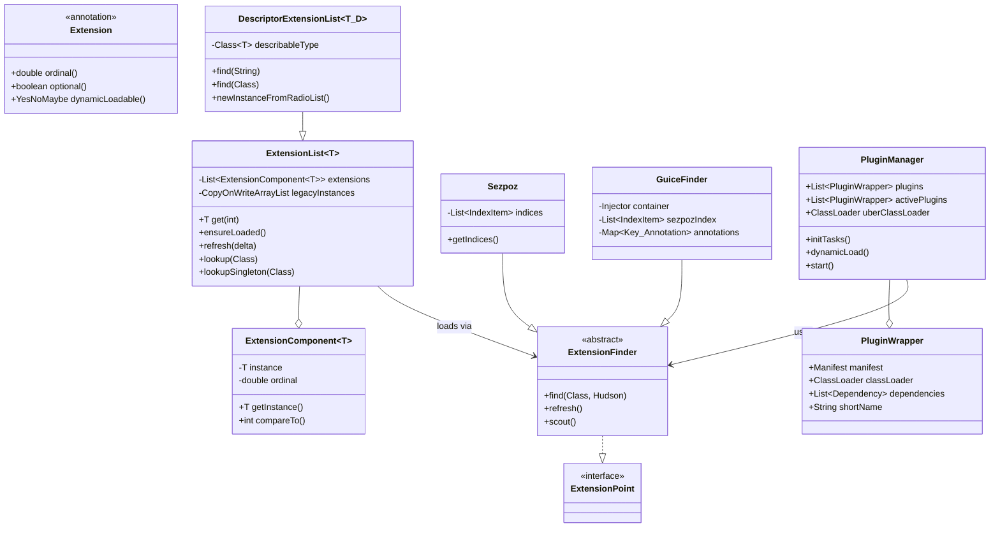

# 10. Jenkins 플러그인 시스템 Deep Dive

## 개요

Jenkins의 플러그인 시스템은 2000개 이상의 플러그인 생태계를 지탱하는 핵심 아키텍처다. 이 문서에서는 `@Extension` 어노테이션 기반의 확장 포인트 발견 메커니즘, SezPoz/Guice 연동, ClassLoader 격리 전략, 그리고 플러그인의 전체 라이프사이클을 소스코드 수준에서 분석한다.

**분석 대상 소스코드:**

| 파일 | 경로 | 줄 수 |
|------|------|-------|
| Extension.java | `core/src/main/java/hudson/Extension.java` | 118 |
| ExtensionPoint.java | `core/src/main/java/hudson/ExtensionPoint.java` | 56 |
| ExtensionList.java | `core/src/main/java/hudson/ExtensionList.java` | 497 |
| ExtensionFinder.java | `core/src/main/java/hudson/ExtensionFinder.java` | 802 |
| ExtensionComponent.java | `core/src/main/java/hudson/ExtensionComponent.java` | 132 |
| DescriptorExtensionList.java | `core/src/main/java/hudson/DescriptorExtensionList.java` | 252 |
| PluginManager.java | `core/src/main/java/hudson/PluginManager.java` | 2697 |
| PluginWrapper.java | `core/src/main/java/hudson/PluginWrapper.java` | 1440 |
| ClassicPluginStrategy.java | `core/src/main/java/hudson/ClassicPluginStrategy.java` | - |
| PluginFirstClassLoader2.java | `core/src/main/java/hudson/PluginFirstClassLoader2.java` | - |

---

## 1. 전체 아키텍처

Jenkins 플러그인 시스템은 크게 세 계층으로 구성된다.

```
+------------------------------------------------------------------+
|                         Jenkins Core                              |
|  +------------------------------------------------------------+  |
|  |                     PluginManager                           |  |
|  |  - plugins/ 디렉토리 스캔                                    |  |
|  |  - MANIFEST.MF 파싱                                         |  |
|  |  - 의존성 DAG 해석 (CyclicGraphDetector)                     |  |
|  |  - ClassLoader 계층 구성                                     |  |
|  |  - 동적 로딩 (dynamicLoad)                                   |  |
|  +------------------------------------------------------------+  |
|                              |                                    |
|  +------------------------------------------------------------+  |
|  |                   Extension Discovery                       |  |
|  |  - @Extension 어노테이션                                     |  |
|  |  - SezPoz 인덱싱 (META-INF/annotations)                     |  |
|  |  - Guice DI 컨테이너                                        |  |
|  |  - ExtensionFinder -> ExtensionList<T>                      |  |
|  +------------------------------------------------------------+  |
|                              |                                    |
|  +------------------------------------------------------------+  |
|  |                   ExtensionPoint 체계                        |  |
|  |  - ExtensionPoint 마커 인터페이스                             |  |
|  |  - ExtensionList<T> 컬렉션                                  |  |
|  |  - DescriptorExtensionList<T,D> (UI 설정 전용)               |  |
|  |  - ExtensionComponent<T> (메타데이터 래퍼)                    |  |
|  +------------------------------------------------------------+  |
+------------------------------------------------------------------+
```

### 핵심 데이터 흐름

```
.jpi/.hpi 파일
    |
    v
PluginManager.initTasks()
    |
    +---> ClassicPluginStrategy.createPluginWrapper()
    |         |
    |         +---> MANIFEST.MF 파싱 (Short-Name, Plugin-Dependencies, Plugin-Version)
    |         +---> 의존성 목록 추출
    |         +---> ClassLoader 생성 (DependencyClassLoader + PluginFirstClassLoader2)
    |         +---> PluginWrapper 생성
    |
    +---> CyclicGraphDetector: 순환 의존성 검사
    |
    +---> 위상 정렬 → activePlugins 리스트 구성
    |
    +---> UberClassLoader: 모든 활성 플러그인의 통합 ClassLoader
    |
    +---> ExtensionFinder (Sezpoz + GuiceFinder)
    |         |
    |         +---> SezPoz: META-INF/annotations 인덱스 스캔
    |         +---> Guice: DI 컨테이너로 인스턴스화
    |
    +---> ExtensionList<T>: 타입별 확장 컬렉션 등록
```

---

## 2. @Extension 어노테이션

### 2.1 어노테이션 정의

`@Extension`은 Jenkins 플러그인 시스템의 핵심 어노테이션이다. 클래스, 필드, 메서드에 붙여서 Jenkins가 자동으로 발견하고 등록할 수 있게 한다.

```java
// core/src/main/java/hudson/Extension.java
@Indexable
@Retention(RUNTIME)
@Target({TYPE, FIELD, METHOD})
@Documented
public @interface Extension {
    double ordinal() default 0;

    @Deprecated
    boolean optional() default false;

    YesNoMaybe dynamicLoadable() default MAYBE;
}
```

**소스 위치:** `core/src/main/java/hudson/Extension.java` (전체 118줄)

### 2.2 어노테이션 속성 상세

#### ordinal (정렬 순서)

```
ordinal 값이 높을수록 → 리스트에서 앞에 위치 (내림차순 정렬)

예시:
  @Extension(ordinal = 100)  → 가장 먼저 선택됨
  @Extension(ordinal = 0)    → 기본 순서 (default)
  @Extension(ordinal = -100) → 가장 나중에 선택됨
```

실제 정렬은 `ExtensionComponent.compareTo()`에서 이루어진다:

```java
// core/src/main/java/hudson/ExtensionComponent.java (89-93줄)
@Override
public int compareTo(ExtensionComponent<T> that) {
    double a = this.ordinal();
    double b = that.ordinal();
    if (Double.compare(a, b) > 0) return -1;  // 높은 ordinal이 먼저
    if (Double.compare(a, b) < 0) return 1;
    // ordinal이 같으면 Descriptor의 displayName으로 비교
    ...
}
```

#### dynamicLoadable (동적 로딩 호환성)

`YesNoMaybe` 열거형으로 정의되며, 플러그인을 재시작 없이 동적으로 로드할 수 있는지를 나타낸다:

```java
// core/src/main/java/jenkins/YesNoMaybe.java
public enum YesNoMaybe {
    YES,    // 동적 로딩 명시적 지원
    NO,     // 동적 로딩 불가 (재시작 필수)
    MAYBE;  // 불확실 (기본값) — 사용자에게 선택 요청
}
```

동적 로딩 판단 로직 (`PluginManager.dynamicLoad()`, 955줄):

```java
if (p.supportsDynamicLoad() == YesNoMaybe.NO)
    throw new RestartRequiredException(
        Messages._PluginManager_PluginDoesntSupportDynamicLoad_RestartRequired(sn));
```

- 플러그인의 **모든** Extension이 `YES`이면 자동 동적 로드
- 하나라도 `NO`이면 재시작 강제
- `MAYBE`가 섞여 있으면 사용자에게 선택 프롬프트

#### optional (선택적 로딩)

```java
@Deprecated
boolean optional() default false;
```

`true`일 때 클래스 로딩 실패 시 경고 로그만 남기고 넘어간다. 현재는 deprecated되어 `variant` 플러그인의 `OptionalExtension`을 사용하도록 권장된다.

### 2.3 SezPoz 기반 어노테이션 인덱싱

`@Extension`에 붙은 `@Indexable` 메타 어노테이션이 핵심이다. SezPoz 라이브러리는 컴파일 타임에 `@Extension`이 붙은 모든 클래스/필드/메서드를 스캔하여 `META-INF/annotations/hudson.Extension` 파일에 인덱스를 생성한다.

```
컴파일 타임 처리:
  javac → SezPoz Annotation Processor → META-INF/annotations/hudson.Extension

런타임 처리:
  Index.load(Extension.class, Object.class, classLoader)
    → 인덱스 파일에서 항목 읽기
    → IndexItem<Extension, Object> 목록 반환
```

**왜 SezPoz인가?**

| 대안 | 문제점 |
|------|--------|
| 클래스패스 스캔 | 2000+ 플러그인에서 수천 개 JAR를 런타임에 스캔하면 시작 시간이 수십 초 이상 |
| ServiceLoader | `META-INF/services`는 타입당 하나의 파일만 지원, 메타데이터(ordinal 등) 불가 |
| SezPoz | 컴파일 타임 인덱싱 + 어노테이션 메타데이터 유지 + 지연 인스턴스화 지원 |

---

## 3. ExtensionPoint 마커 인터페이스

### 3.1 인터페이스 정의

```java
// core/src/main/java/hudson/ExtensionPoint.java (전체 56줄)
public interface ExtensionPoint {
    @Deprecated
    @Target(TYPE)
    @Retention(RUNTIME)
    @interface LegacyInstancesAreScopedToHudson {}
}
```

**소스 위치:** `core/src/main/java/hudson/ExtensionPoint.java`

`ExtensionPoint`는 메서드가 전혀 없는 순수 마커 인터페이스다. 두 가지 역할을 한다:

1. **문서화**: "이 인터페이스/클래스는 플러그인이 확장할 수 있는 지점"임을 명시
2. **자동 문서 생성**: Jenkins 코어의 도구가 `ExtensionPoint`를 구현한 모든 타입을 찾아 확장 가능 포인트 목록을 생성

### 3.2 확장 포인트 사용 패턴

```
확장 포인트 정의 (Jenkins Core):
  public abstract class SCM implements ExtensionPoint { ... }

확장 포인트 구현 (플러그인):
  @Extension
  public class GitSCM extends SCM { ... }

확장 포인트 조회:
  ExtensionList<SCM> scms = ExtensionList.lookup(SCM.class);
```

Jenkins에서 대표적인 `ExtensionPoint` 구현체들:

| ExtensionPoint | 용도 |
|---------------|------|
| `SCM` | 소스 코드 관리 (Git, SVN 등) |
| `Builder` | 빌드 스텝 |
| `Publisher` | 빌드 후 액션 |
| `Trigger` | 빌드 트리거 |
| `Cloud` | 클라우드 에이전트 |
| `AdministrativeMonitor` | 관리자 경고 |
| `RootAction` | 루트 URL 액션 |
| `ExtensionFinder` | 확장 발견 전략 (자기 자신도 ExtensionPoint) |

---

## 4. ExtensionFinder: 확장 발견 전략

### 4.1 클래스 계층 구조

```
ExtensionFinder (추상 클래스, ExtensionPoint 구현)
├── ExtensionFinder.Sezpoz        — SezPoz 직접 인스턴스화 (부트스트랩용)
└── ExtensionFinder.GuiceFinder   — SezPoz 발견 + Guice DI 인스턴스화 (기본)
```

**소스 위치:** `core/src/main/java/hudson/ExtensionFinder.java` (전체 802줄)

### 4.2 무한 재귀 방지

`ExtensionFinder` 자체가 `ExtensionPoint`이므로, "ExtensionFinder를 찾기 위해 ExtensionFinder가 필요하다"는 순환이 발생할 수 있다. 이를 방지하기 위해:

```
Jenkins 부팅 시:
  1. ExtensionFinder.Sezpoz (하드코딩된 부트스트랩)로 ExtensionFinder 구현체 발견
  2. 발견된 ExtensionFinder들(GuiceFinder 등)이 나머지 모든 @Extension 발견
```

소스코드의 Javadoc이 이를 명시한다:

```java
// ExtensionFinder.java (81-82줄)
// ExtensionFinder itself is an extension point, but to avoid infinite recursion,
// Jenkins discovers ExtensionFinders through Sezpoz and that alone.
```

### 4.3 Sezpoz 파인더 (부트스트랩)

```java
// ExtensionFinder.java 내부 (675-787줄)
public static final class Sezpoz extends ExtensionFinder {
    private volatile List<IndexItem<Extension, Object>> indices;

    private List<IndexItem<Extension, Object>> getIndices() {
        // 데드락 방지: synchronized 사용 불가
        // (스레드 X: 인덱스 나열 중 클래스 로드 필요
        //  스레드 Y: 클래스 로드 중 확장 나열 필요 → 데드락)
        if (indices == null) {
            ClassLoader cl = Jenkins.get().getPluginManager().uberClassLoader;
            indices = StreamSupport.stream(
                Index.load(Extension.class, Object.class, cl).spliterator(), false)
                .collect(Collectors.toUnmodifiableList());
        }
        return indices;
    }
```

**Sezpoz의 동작:**

1. `Index.load(Extension.class, Object.class, cl)` 호출
2. `uberClassLoader`를 통해 모든 플러그인의 `META-INF/annotations/hudson.Extension` 파일 읽기
3. `IndexItem<Extension, Object>` 목록 구성
4. `item.instance()`로 직접 인스턴스화 (Guice 없이)

**타입 판별 로직:**

```java
// ExtensionFinder.java (789-798줄)
private static Class<?> getClassFromIndex(IndexItem<Extension, Object> item)
        throws InstantiationException {
    AnnotatedElement e = item.element();
    Class<?> extType = switch (e) {
        case Class aClass -> aClass;           // @Extension이 클래스에 붙은 경우
        case Field field -> field.getType();   // @Extension이 필드에 붙은 경우
        case Method method -> method.getReturnType(); // 팩토리 메서드인 경우
        case null, default -> throw new AssertionError();
    };
    return extType;
}
```

### 4.4 GuiceFinder (기본 파인더)

GuiceFinder는 SezPoz로 발견한 컴포넌트를 Guice DI 컨테이너를 통해 인스턴스화한다.

```java
// ExtensionFinder.java (237-299줄)
@Extension
public static class GuiceFinder extends ExtensionFinder {
    private volatile Injector container;
    private List<IndexItem<?, Object>> sezpozIndex;
    private final Map<Key, Annotation> annotations = new HashMap<>();
    private final Sezpoz moduleFinder = new Sezpoz();

    public GuiceFinder() {
        refreshExtensionAnnotations();

        SezpozModule extensions = new SezpozModule(
            loadSezpozIndices(Jenkins.get().getPluginManager().uberClassLoader));

        List<Module> modules = new ArrayList<>();
        modules.add(new AbstractModule() {
            @Override
            protected void configure() {
                Jenkins j = Jenkins.get();
                bind(Jenkins.class).toInstance(j);
                bind(PluginManager.class).toInstance(j.getPluginManager());
            }
        });
        modules.add(extensions);
        // 플러그인이 제공하는 Guice Module도 추가
        for (ExtensionComponent<Module> ec : moduleFinder.find(Module.class, ...)) {
            modules.add(ec.getInstance());
        }

        try {
            container = Guice.createInjector(modules);
        } catch (Throwable e) {
            // 실패 시 코어 클래스로더만으로 최소 컨테이너 생성
            container = Guice.createInjector(
                new SezpozModule(loadSezpozIndices(Jenkins.class.getClassLoader())));
        }
    }
```

**GuiceFinder의 초기화 흐름:**

```
GuiceFinder 생성자
    |
    v
refreshExtensionAnnotations()
    → Sezpoz로 GuiceExtensionAnnotation 구현체 탐색
    → extensionAnnotations 맵 구성
    |
    v
loadSezpozIndices(uberClassLoader)
    → 모든 어노테이션 타입에 대해 Index.load() 호출
    → IndexItem 목록 수집
    |
    v
SezpozModule 생성
    → Guice Module로 변환
    → 각 IndexItem을 Guice Key로 바인딩
    |
    v
Guice.createInjector(modules)
    → DI 컨테이너 생성
    → @Inject 의존성 자동 주입
    → @PostConstruct 메서드 호출
```

### 4.5 SezpozModule: SezPoz 인덱스를 Guice 바인딩으로 변환

```java
// ExtensionFinder.java (470-644줄)
private class SezpozModule extends AbstractModule implements ProvisionListener {
    private final List<IndexItem<?, Object>> index;

    @Override
    protected void configure() {
        bindListener(Matchers.any(), this);

        for (final IndexItem<?, Object> item : index) {
            boolean optional = isOptional(item.annotation());
            try {
                AnnotatedElement e = item.element();
                Annotation a = item.annotation();
                if (!isActive(a, e)) continue;

                Scope scope = optional
                    ? QUIET_FAULT_TOLERANT_SCOPE
                    : FAULT_TOLERANT_SCOPE;

                if (e instanceof Class) {
                    Key key = Key.get((Class) e);
                    resolve((Class) e);       // 클래스 해석 사전 검증
                    annotations.put(key, a);
                    bind(key).in(scope);      // Guice에 바인딩
                } else {
                    // 필드 또는 메서드: Provider로 래핑
                    Class extType;
                    if (e instanceof Field) {
                        extType = ((Field) e).getType();
                    } else if (e instanceof Method) {
                        extType = ((Method) e).getReturnType();
                    }
                    Key key = Key.get(extType,
                        Names.named(item.className() + "." + item.memberName()));
                    annotations.put(key, a);
                    bind(key).toProvider(() -> instantiate(item)).in(scope);
                }
            } catch (Exception | LinkageError e) {
                LOGGER.log(optional ? Level.FINE : Level.WARNING,
                    "Failed to load " + item.className(), e);
            }
        }
    }
```

### 4.6 장애 격리: FaultTolerantScope

하나의 플러그인 실패가 전체 Jenkins 시작을 막지 않도록, Guice의 커스텀 Scope를 사용한다:

```java
// ExtensionFinder.java (435-461줄)
private static final class FaultTolerantScope implements Scope {
    private final boolean verbose;

    @Override
    public <T> Provider<T> scope(final Key<T> key, final Provider<T> unscoped) {
        final Provider<T> base = Scopes.SINGLETON.scope(key, unscoped);
        return new Provider<T>() {
            @Override
            public T get() {
                try {
                    return base.get();
                } catch (Exception | LinkageError e) {
                    error(key, e);
                    return null;  // 실패해도 null 반환, Jenkins는 계속 실행
                }
            }
        };
    }
}
```

**두 가지 격리 수준:**

| Scope | verbose | 로그 레벨 | 용도 |
|-------|---------|----------|------|
| `FAULT_TOLERANT_SCOPE` | true | WARNING | 일반 확장 |
| `QUIET_FAULT_TOLERANT_SCOPE` | false | FINE | optional=true 확장 |

### 4.7 @PostConstruct 지원

GuiceFinder의 `SezpozModule`은 `ProvisionListener`를 구현하여 인스턴스 생성 후 `@PostConstruct` 메서드를 자동 호출한다:

```java
// ExtensionFinder.java (613-643줄)
@Override
public <T> void onProvision(ProvisionInvocation<T> provision) {
    final T instance = provision.provision();
    if (instance == null) return;
    List<Method> methods = new ArrayList<>();
    Class c = instance.getClass();

    // 부모 클래스의 @PostConstruct를 먼저 호출 (Spring 방식)
    final Set<Class<?>> interfaces = ClassUtils.getAllInterfacesAsSet(instance);
    while (c != Object.class) {
        Arrays.stream(c.getDeclaredMethods())
            .map(m -> getMethodAndInterfaceDeclarations(m, interfaces))
            .flatMap(Collection::stream)
            .filter(m -> m.getAnnotation(PostConstruct.class) != null
                      || m.getAnnotation(javax.annotation.PostConstruct.class) != null)
            .findFirst()
            .ifPresent(methods::addFirst);
        c = c.getSuperclass();
    }

    for (Method postConstruct : methods) {
        postConstruct.setAccessible(true);
        postConstruct.invoke(instance);
    }
}
```

### 4.8 동적 리프레시 (refresh)

GuiceFinder는 런타임에 새 플러그인이 추가될 때 기존 인스턴스를 유지하면서 새 컴포넌트만 추가한다:

```java
// ExtensionFinder.java (332-369줄)
@Override
public synchronized ExtensionComponentSet refresh() throws ExtensionRefreshException {
    refreshExtensionAnnotations();
    // 새로 발견된 SezPoz 컴포넌트
    List<IndexItem<?, Object>> delta = new ArrayList<>();
    for (Class<? extends Annotation> annotationType : extensionAnnotations.keySet()) {
        delta.addAll(Sezpoz.listDelta(annotationType, sezpozIndex));
    }

    SezpozModule deltaExtensions = new SezpozModule(delta);
    List<Module> modules = new ArrayList<>();
    modules.add(deltaExtensions);

    try {
        // Guice는 바인딩 변경 불가 → 자식 컨테이너 생성
        final Injector child = container.createChildInjector(modules);
        container = child;
        // 인덱스 업데이트
        List<IndexItem<?, Object>> l = new ArrayList<>(sezpozIndex);
        l.addAll(deltaExtensions.getLoadedIndex());
        sezpozIndex = l;

        return new ExtensionComponentSet() {
            @Override
            public <T> Collection<ExtensionComponent<T>> find(Class<T> type) {
                List<ExtensionComponent<T>> result = new ArrayList<>();
                _find(type, result, child);  // 새 자식 컨테이너에서만 검색
                return result;
            }
        };
    } catch (Throwable e) {
        throw new ExtensionRefreshException(e);
    }
}
```

**왜 자식 컨테이너인가?**

Guice의 `Injector`는 생성 후 바인딩을 수정할 수 없다. 따라서 새 플러그인의 컴포넌트를 추가하려면 `createChildInjector()`로 자식 컨테이너를 만들어야 한다. `find()` 시에는 컨테이너 체인을 역순으로 순회한다:

```java
// ExtensionFinder.java (394-401줄)
@Override
public <U> Collection<ExtensionComponent<U>> find(Class<U> type, Hudson jenkins) {
    List<ExtensionComponent<U>> result = new ArrayList<>();
    for (Injector i = container; i != null; i = i.getParent()) {
        _find(type, result, i);  // 최신 자식 → 부모 순으로 검색
    }
    return result;
}
```

---

## 5. ExtensionList\<T\>: 확장 컬렉션

### 5.1 클래스 구조

```java
// core/src/main/java/hudson/ExtensionList.java (64줄)
public class ExtensionList<T> extends AbstractList<T> implements OnMaster {
    public final @CheckForNull Jenkins jenkins;
    public final Class<T> extensionType;

    @CopyOnWrite
    private volatile List<ExtensionComponent<T>> extensions;

    private final List<ExtensionListListener> listeners = new CopyOnWriteArrayList<>();
    private final CopyOnWriteArrayList<ExtensionComponent<T>> legacyInstances;
```

**소스 위치:** `core/src/main/java/hudson/ExtensionList.java` (전체 497줄)

### 5.2 지연 로딩: ensureLoaded()

`ExtensionList`는 처음 접근될 때까지 확장을 로드하지 않는다 (Lazy Loading):

```java
// ExtensionList.java (300-314줄)
private List<ExtensionComponent<T>> ensureLoaded() {
    if (extensions != null)
        return extensions; // 이미 로드됨

    if (jenkins == null ||
        jenkins.getInitLevel().compareTo(InitMilestone.PLUGINS_PREPARED) < 0)
        return legacyInstances; // 플러그인 준비 전에는 레거시만 반환

    synchronized (getLoadLock()) {
        if (extensions == null) {
            List<ExtensionComponent<T>> r = load();
            r.addAll(legacyInstances);
            extensions = sort(r);  // ordinal 기준 정렬
        }
        return extensions;
    }
}
```

**지연 로딩이 필요한 이유:**

```
Jenkins 부팅 타임라인:
  PLUGINS_LISTED   → 플러그인 목록 확정
  PLUGINS_PREPARED → ClassLoader 생성 완료, @Extension 스캔 가능
  PLUGINS_STARTED  → 플러그인 초기화 완료
  COMPLETED        → 모든 초기화 완료

ExtensionList.ensureLoaded()는 PLUGINS_PREPARED 이후에만 실제 로드 수행
→ 그 전에 접근하면 legacyInstances(수동 등록 분)만 반환
```

### 5.3 글로벌 로딩 락

중첩 로딩 시 데드락을 방지하기 위해 단일 락 객체를 사용한다:

```java
// ExtensionList.java (319-321줄)
protected Object getLoadLock() {
    return Objects.requireNonNull(jenkins).lookup.setIfNull(Lock.class, new Lock());
}

// ExtensionList.java (377-378줄)
private static final class Lock {}
```

**왜 글로벌 락인가?**

```
시나리오: ExtensionList<A> 로드 중 ExtensionList<B>가 필요
  1. 스레드 X: ExtensionList<A>.ensureLoaded() → lock(A) 획득
  2. 스레드 X: A의 로딩 중 ExtensionList<B> 접근 → lock(B) 필요
  3. 스레드 Y: ExtensionList<B>.ensureLoaded() → lock(B) 획득
  4. 스레드 Y: B의 로딩 중 ExtensionList<A> 접근 → lock(A) 필요
  → 데드락!

해결: 모든 ExtensionList가 같은 Lock 인스턴스를 공유
  → Jenkins.lookup에 Lock.class를 키로 단일 인스턴스 저장
  → 중첩 로딩 시 동일 스레드가 같은 락을 재진입
```

### 5.4 실제 로딩 경로

```java
// ExtensionList.java (383-390줄)
protected List<ExtensionComponent<T>> load() {
    LOGGER.fine(() -> String.format("Loading ExtensionList '%s'", extensionType.getName()));
    return Objects.requireNonNull(jenkins)
        .getPluginManager()
        .getPluginStrategy()
        .findComponents(extensionType, hudson);
}
```

호출 체인:
```
ExtensionList.load()
  → PluginManager.getPluginStrategy()  // ClassicPluginStrategy
  → PluginStrategy.findComponents(extensionType)
  → 내부적으로 ExtensionFinder 목록을 순회하며 find(type, hudson) 호출
```

### 5.5 정적 조회 메서드

```java
// ExtensionList.java (436-486줄)

// 타입별 전체 목록 조회
public static <T> ExtensionList<T> lookup(Class<T> type) {
    Jenkins j = Jenkins.getInstanceOrNull();
    return j == null ? create((Jenkins) null, type) : j.getExtensionList(type);
}

// 싱글톤 조회 (정확히 1개만 있어야 함)
public static <U> U lookupSingleton(Class<U> type) {
    ExtensionList<U> all = lookup(type);
    if (all.size() != 1) {
        throw new IllegalStateException(
            "Expected 1 instance of " + type.getName() + " but got " + all.size());
    }
    return all.getFirst();
}

// 첫 번째(최고 ordinal) 조회
public static <U> U lookupFirst(Class<U> type) {
    var all = lookup(type);
    if (!all.isEmpty()) {
        return all.getFirst();
    }
    throw new IllegalStateException("Found no instances of " + type.getName());
}
```

### 5.6 리프레시 (동적 로딩 지원)

```java
// ExtensionList.java (329-360줄)
@Restricted(NoExternalUse.class)
public boolean refresh(ExtensionComponentSet delta) {
    synchronized (getLoadLock()) {
        if (extensions == null)
            return false;  // 아직 로드 안 됨

        Collection<ExtensionComponent<T>> newComponents = load(delta);
        if (!newComponents.isEmpty()) {
            List<ExtensionComponent<T>> components = new ArrayList<>(extensions);
            // 중복 방지: IdentityHashMap으로 인스턴스 동일성 체크
            Set<T> instances = Collections.newSetFromMap(new IdentityHashMap<>());
            for (ExtensionComponent<T> component : components) {
                instances.add(component.getInstance());
            }
            boolean fireListeners = false;
            for (ExtensionComponent<T> newComponent : newComponents) {
                if (instances.add(newComponent.getInstance())) {
                    fireListeners = true;
                    components.add(newComponent);
                }
            }
            extensions = sort(new ArrayList<>(components));
            return fireListeners;
        }
    }
    return false;
}
```

**중복 방지가 필요한 이유** (소스 주석에서 직접 인용):

> ExtensionList.refresh may be called on a list that already includes the new extensions.
> This can happen when dynamically loading a plugin with an extension A that itself loads
> another extension B from the same plugin in some contexts, such as in A's constructor
> or via a method in A called by an ExtensionListListener.

---

## 6. ExtensionComponent\<T\>: 메타데이터 래퍼

### 6.1 구조

```java
// core/src/main/java/hudson/ExtensionComponent.java (전체 132줄)
public class ExtensionComponent<T> implements Comparable<ExtensionComponent<T>> {
    private final T instance;
    private final double ordinal;

    public ExtensionComponent(T instance, double ordinal) { ... }
    public ExtensionComponent(T instance, Extension annotation) {
        this(instance, annotation.ordinal());
    }
    public ExtensionComponent(T instance) {
        this(instance, 0);
    }
}
```

**역할:**
- 확장 인스턴스 + ordinal 메타데이터를 함께 보관
- `Comparable` 구현으로 정렬 지원
- `ExtensionList`의 내부 저장 단위

### 6.2 정렬 규칙

```
1차: ordinal 내림차순 (높은 값 먼저)
2차: Descriptor이면 displayName 알파벳순
3차: Descriptor가 아니면 클래스명 알파벳순
4차: Descriptor vs 비-Descriptor → Descriptor가 뒤로
```

```java
// ExtensionComponent.java (89-130줄)
@Override
public int compareTo(ExtensionComponent<T> that) {
    double a = this.ordinal();
    double b = that.ordinal();
    if (Double.compare(a, b) > 0) return -1;  // 높은 ordinal 먼저
    if (Double.compare(a, b) < 0) return 1;

    // ordinal 동일: Descriptor의 displayName으로 비교
    boolean thisIsDescriptor = false;
    String thisLabel = this.instance.getClass().getName();
    if (this.instance instanceof Descriptor) {
        thisLabel = Util.fixNull(((Descriptor) this.instance).getDisplayName());
        thisIsDescriptor = true;
    }
    // ... (that도 동일)
    if (thisIsDescriptor) {
        if (thatIsDescriptor) return thisLabel.compareTo(thatLabel);
        else return 1;  // Descriptor는 뒤로
    } else {
        if (thatIsDescriptor) return -1;
    }
    return thisLabel.compareTo(thatLabel);
}
```

---

## 7. DescriptorExtensionList\<T,D\>: UI 설정 전용

### 7.1 개요

`DescriptorExtensionList`는 `ExtensionList`의 특수화 버전으로, `Describable`/`Descriptor` 쌍의 UI 설정 체계를 지원한다.

```java
// core/src/main/java/hudson/DescriptorExtensionList.java (65줄)
public class DescriptorExtensionList<T extends Describable<T>, D extends Descriptor<T>>
    extends ExtensionList<D> {

    private final Class<T> describableType;
```

**소스 위치:** `core/src/main/java/hudson/DescriptorExtensionList.java` (전체 252줄)

### 7.2 로딩 전략: 마스터 리스트에서 필터링

`DescriptorExtensionList`는 직접 `ExtensionFinder`를 호출하지 않고, `ExtensionList<Descriptor>`(마스터 리스트)에서 해당 타입의 Descriptor만 필터링한다:

```java
// DescriptorExtensionList.java (201-228줄)
@Override
protected List<ExtensionComponent<D>> load() {
    if (jenkins == null) {
        return Collections.emptyList();
    }
    return _load(getDescriptorExtensionList().getComponents());
}

private List<ExtensionComponent<D>> _load(Iterable<ExtensionComponent<Descriptor>> set) {
    List<ExtensionComponent<D>> r = new ArrayList<>();
    for (ExtensionComponent<Descriptor> c : set) {
        Descriptor d = c.getInstance();
        try {
            if (d.getT() == describableType)  // 타입 매칭
                r.add((ExtensionComponent) c);
        } catch (IllegalStateException e) {
            LOGGER.log(Level.SEVERE,
                d.getClass() + " doesn't extend Descriptor with a type parameter", e);
        }
    }
    return r;
}

private ExtensionList<Descriptor> getDescriptorExtensionList() {
    return ExtensionList.lookup(Descriptor.class);
}
```

### 7.3 데드락 방지

`DescriptorExtensionList`는 마스터 `Descriptor` 리스트의 락을 공유한다:

```java
// DescriptorExtensionList.java (192-196줄)
@Override
protected Object getLoadLock() {
    // JENKINS-55361 방지
    return getDescriptorExtensionList().getLoadLock();
}
```

### 7.4 라디오 리스트 지원

UI에서 라디오 버튼 그룹으로 Describable을 선택하는 패턴:

```java
// DescriptorExtensionList.java (139-144줄)
@CheckForNull
public T newInstanceFromRadioList(JSONObject config) throws FormException {
    if (config.isNullObject())
        return null;    // none was selected
    int idx = config.getInt("value");
    return get(idx).newInstance(Stapler.getCurrentRequest2(), config);
}
```

---

## 8. PluginManager: 플러그인 관리의 중심

### 8.1 클래스 개요

```java
// core/src/main/java/hudson/PluginManager.java (205줄)
@ExportedBean
public abstract class PluginManager extends AbstractModelObject
    implements OnMaster, StaplerOverridable, StaplerProxy {

    protected final List<PluginWrapper> plugins = new CopyOnWriteArrayList<>();
    protected final List<PluginWrapper> activePlugins = new CopyOnWriteArrayList<>();
    protected final List<FailedPlugin> failedPlugins = new ArrayList<>();
    public final File rootDir;
    public final ClassLoader uberClassLoader = new UberClassLoader(activePlugins);
    private final PluginStrategy strategy;
```

**소스 위치:** `core/src/main/java/hudson/PluginManager.java` (전체 2697줄)

### 8.2 핵심 필드

| 필드 | 타입 | 역할 |
|------|------|------|
| `plugins` | `CopyOnWriteArrayList<PluginWrapper>` | 모든 발견된 플러그인 |
| `activePlugins` | `CopyOnWriteArrayList<PluginWrapper>` | 활성 플러그인 (위상 정렬됨) |
| `failedPlugins` | `ArrayList<FailedPlugin>` | 로딩 실패 플러그인 |
| `rootDir` | `File` | plugins/ 디렉토리 경로 |
| `uberClassLoader` | `ClassLoader` | 통합 ClassLoader |
| `strategy` | `PluginStrategy` | 플러그인 생성/로딩 전략 |

### 8.3 커스텀 PluginManager

시스템 프로퍼티 `hudson.PluginManager.className`으로 커스텀 구현을 지정할 수 있다:

```java
// PluginManager.java (299-320줄)
public static @NonNull PluginManager createDefault(@NonNull Jenkins jenkins) {
    String pmClassName = SystemProperties.getString(CUSTOM_PLUGIN_MANAGER);
    if (pmClassName != null && !pmClassName.isBlank()) {
        try {
            final Class<? extends PluginManager> klass =
                Class.forName(pmClassName).asSubclass(PluginManager.class);
            for (PMConstructor c : PMConstructor.values()) {
                PluginManager pm = c.create(klass, jenkins);
                if (pm != null) return pm;
            }
        } catch (...) { ... }
    }
    return new LocalPluginManager(jenkins);  // 기본값
}
```

생성자 시도 순서:
1. `(Jenkins)`
2. `(ServletContext, File)`
3. `(javax.servlet.ServletContext, File)` (레거시)
4. `(File)`

---

## 9. 플러그인 로딩 라이프사이클

### 9.1 initTasks: 부팅 시 초기화 파이프라인

`PluginManager.initTasks()`는 Jenkins Reactor 프레임워크 위에 구축된 태스크 그래프를 정의한다:

```
Phase 1: PLUGINS_LISTED (플러그인 나열)
  ├── Loading bundled plugins
  │     → loadBundledPlugins(): WAR 내장 플러그인 추출
  │
  ├── Listing up plugins
  │     → initStrategy.listPluginArchives(): *.jpi, *.hpi 파일 스캔
  │
  └── Preparing plugins
        ├── Inspecting plugin {arc}
        │     → strategy.createPluginWrapper(arc): MANIFEST.MF 파싱, PluginWrapper 생성
        │
        └── Checking cyclic dependencies
              → CyclicGraphDetector: DAG 순환 검사
              → 위상 정렬 → activePlugins 구성

Phase 2: PLUGINS_PREPARED (플러그인 준비)
  └── Loading plugins
        ├── Loading plugin {name} v{version}
        │     → p.resolvePluginDependencies(): 의존성 검증
        │     → strategy.load(p): Plugin 인스턴스 생성
        │
        └── Initializing plugin {name}
              → p.getPluginOrFail().postInitialize()

Phase 3: PLUGINS_STARTED (플러그인 시작)
  └── Discovering plugin initialization tasks
        → @Initializer 어노테이션 스캔

Phase 4: COMPLETED (완료)
  └── Resolving Dependent Plugins Graph
        → resolveDependentPlugins(): 역의존성 맵 구성
```

### 9.2 MANIFEST.MF 파싱

`ClassicPluginStrategy.createPluginWrapper()`에서 수행:

```java
// ClassicPluginStrategy.java (149-241줄)
@Override
public PluginWrapper createPluginWrapper(File archive) throws IOException {
    final Manifest manifest;
    // .hpl/.jpl → linked plugin, 그 외 → JAR 내 MANIFEST.MF 읽기
    File expandDir = ...;
    explode(archive, expandDir);  // JAR 압축 해제

    File manifestFile = new File(expandDir, PluginWrapper.MANIFEST_FILENAME);
    try (InputStream fin = Files.newInputStream(manifestFile.toPath())) {
        manifest = new Manifest(fin);
    }

    final Attributes atts = manifest.getMainAttributes();

    // 의존성 파싱
    List<PluginWrapper.Dependency> dependencies = new ArrayList<>();
    List<PluginWrapper.Dependency> optionalDependencies = new ArrayList<>();
    String v = atts.getValue("Plugin-Dependencies");
    if (v != null) {
        for (String s : v.split(",")) {
            PluginWrapper.Dependency d = new PluginWrapper.Dependency(s);
            if (d.optional) optionalDependencies.add(d);
            else dependencies.add(d);
        }
    }
    ...
}
```

**MANIFEST.MF 핵심 속성:**

```
Manifest-Version: 1.0
Short-Name: git
Long-Name: Jenkins Git plugin
Plugin-Version: 5.2.0
Jenkins-Version: 2.387.3
Plugin-Dependencies: credentials:1289.vd1c337fd5354,
    git-client:4.4.0,
    ssh-credentials:305.v8f4381501571;resolution:=optional
Plugin-Class: hudson.plugins.git.GitPlugin
```

| 속성 | 용도 |
|------|------|
| `Short-Name` | 플러그인 식별자 (URL, 의존성 참조에 사용) |
| `Plugin-Version` | 버전 |
| `Jenkins-Version` | 필요한 최소 Jenkins 버전 |
| `Plugin-Dependencies` | 의존성 목록 (`name:version[;resolution:=optional]`) |
| `Plugin-Class` | 플러그인 메인 클래스 |

### 9.3 의존성 파싱

```java
// PluginWrapper.java (454-491줄)
public static final class Dependency {
    @Exported public final String shortName;
    @Exported public final String version;
    @Exported public final boolean optional;

    public Dependency(String s) {
        int idx = s.indexOf(':');
        this.shortName = Util.intern(s.substring(0, idx));
        String version = Util.intern(s.substring(idx + 1));

        boolean isOptional = false;
        String[] osgiProperties = version.split("[;]");
        for (int i = 1; i < osgiProperties.length; i++) {
            String osgiProperty = osgiProperties[i].trim();
            if (osgiProperty.equalsIgnoreCase("resolution:=optional")) {
                isOptional = true;
                break;
            }
        }
        this.optional = isOptional;
        this.version = isOptional ? osgiProperties[0] : version;
    }
}
```

### 9.4 순환 의존성 검사

```java
// PluginManager.java (508-557줄)
CyclicGraphDetector<PluginWrapper> cgd = new CyclicGraphDetector<>() {
    @Override
    protected List<PluginWrapper> getEdges(PluginWrapper p) {
        List<PluginWrapper> next = new ArrayList<>();
        addTo(p.getDependencies(), next);
        addTo(p.getOptionalDependencies(), next);
        return next;
    }

    private void addTo(List<Dependency> dependencies, List<PluginWrapper> r) {
        for (Dependency d : dependencies) {
            PluginWrapper p = getPlugin(d.shortName);
            if (p != null) r.add(p);
        }
    }

    @Override
    protected void reactOnCycle(PluginWrapper q, List<PluginWrapper> cycle) {
        LOGGER.log(Level.SEVERE,
            "found cycle in plugin dependencies: (root=" + q +
            ", deactivating all involved) " + cycle.stream()
                .map(Object::toString).collect(Collectors.joining(" -> ")));
        for (PluginWrapper pluginWrapper : cycle) {
            pluginWrapper.setHasCycleDependency(true);
            failedPlugins.add(new FailedPlugin(pluginWrapper,
                new CycleDetectedException(cycle)));
        }
    }
};
cgd.run(getPlugins());

// 위상 정렬 결과로 activePlugins 구성
for (PluginWrapper p : cgd.getSorted()) {
    if (p.isActive()) {
        activePlugins.add(p);
        ((UberClassLoader) uberClassLoader).clearCacheMisses();
    }
}
```

**위상 정렬이 필요한 이유:**

```
플러그인 A가 플러그인 B에 의존:
  → B의 ClassLoader가 먼저 초기화되어야 A의 클래스를 로드할 수 있음
  → activePlugins 리스트에서 B가 A 앞에 위치해야 함
```

---

## 10. ClassLoader 격리 전략

### 10.1 ClassLoader 계층 구조

```
Servlet Container ClassLoader (Jetty/Tomcat)
    |
    +--- Jenkins Core ClassLoader
    |        |
    |        +--- UberClassLoader (통합, 읽기 전용)
    |        |
    |        +--- Plugin A ClassLoader
    |        |       |
    |        |       +--- DependencyClassLoader (의존 플러그인 참조)
    |        |
    |        +--- Plugin B ClassLoader
    |        |       |
    |        |       +--- DependencyClassLoader
    |        |
    |        +--- Plugin C ClassLoader
    |                |
    |                +--- DependencyClassLoader
```

### 10.2 UberClassLoader: 통합 클래스 로딩

```java
// PluginManager.java (2378-2474줄)
public static final class UberClassLoader extends CachingClassLoader {
    private final List<PluginWrapper> activePlugins;

    public UberClassLoader(List<PluginWrapper> activePlugins) {
        super("UberClassLoader",
            new ExistenceCheckingClassLoader(PluginManager.class.getClassLoader()));
        this.activePlugins = activePlugins;
    }

    @Override
    protected Class<?> findClass(String name) throws ClassNotFoundException {
        for (PluginWrapper p : activePlugins) {
            try {
                if (FAST_LOOKUP) {
                    return ClassLoaderReflectionToolkit.loadClass(p.classLoader, name);
                } else {
                    return p.classLoader.loadClass(name);
                }
            } catch (ClassNotFoundException e) {
                // 다음 플러그인 시도
            }
        }
        throw new ClassNotFoundException(name);
    }

    @Override
    protected URL findResource(String name) {
        for (PluginWrapper p : activePlugins) {
            URL url;
            if (FAST_LOOKUP) {
                url = ClassLoaderReflectionToolkit._findResource(p.classLoader, name);
            } else {
                url = p.classLoader.getResource(name);
            }
            if (url != null) return url;
        }
        return null;
    }
}
```

**UberClassLoader의 역할:**

1. SezPoz 인덱스 로딩: `Index.load(Extension.class, Object.class, uberClassLoader)` - 모든 플러그인의 인덱스를 단일 ClassLoader로 조회
2. XStream 역직렬화: 플러그인 간 교차 참조되는 클래스 로드
3. 일반 클래스 검색: 어디서 로드된 클래스인지 모를 때 폴백

**ExistenceCheckingClassLoader 래핑:**

```
문제: 서블릿 컨테이너의 ClassLoader는 parallel-capable이며 모든 로드 시도
      (실패 포함)에 대해 ClassLoader#getClassLoadingLock 객체를 생성/유지
      → 메모리 누수

해결: ExistenceCheckingClassLoader가 리소스 존재 여부를 먼저 확인
      → 존재하지 않으면 즉시 ClassNotFoundException
      → 서블릿 컨테이너 ClassLoader에 도달하지 않음
```

**FAST_LOOKUP 최적화:**

```java
// PluginManager.java (2477줄)
public static boolean FAST_LOOKUP =
    !SystemProperties.getBoolean(PluginManager.class.getName() + ".noFastLookup");
```

- `FAST_LOOKUP = true` (기본): `ClassLoaderReflectionToolkit`으로 `findClass()`/`findResource()`를 직접 호출 (부모 위임 건너뜀)
- `FAST_LOOKUP = false`: 표준 `loadClass()`/`getResource()` 사용

### 10.3 PluginFirstClassLoader2: 플러그인 우선 로딩

일반적인 Java ClassLoader는 부모 위임 모델(parent-first)을 따르지만, 플러그인 충돌을 방지하기 위해 plugin-first 로딩을 지원한다:

```java
// core/src/main/java/hudson/PluginFirstClassLoader2.java (23-77줄)
@Restricted(NoExternalUse.class)
public class PluginFirstClassLoader2 extends URLClassLoader2 {

    @Override
    protected Class<?> loadClass(String name, boolean resolve) throws ClassNotFoundException {
        synchronized (getClassLoadingLock(name)) {
            Class<?> c = findLoadedClass(name);
            if (c == null) {
                try {
                    c = findClass(name);       // 1. 플러그인 자체에서 먼저 검색
                } catch (ClassNotFoundException e) {
                    // ignore
                }
            }
            if (c == null) {
                c = getParent().loadClass(name); // 2. 부모(코어)에서 검색
            }
            if (resolve) resolveClass(c);
            return c;
        }
    }
}
```

**사용법:** `maven-hpi-plugin`에서 `pluginFirstClassLoader=true` 설정

**왜 Plugin-First가 필요한가?**

```
시나리오: Jenkins 코어에 guava-20.0이 포함, 플러그인에 guava-31.0이 필요

Parent-First (기본):
  플러그인 코드 → 부모 ClassLoader → guava-20.0 로드 → NoSuchMethodError!

Plugin-First:
  플러그인 코드 → 플러그인 ClassLoader → guava-31.0 로드 → 정상 동작
```

### 10.4 DependencyClassLoader

플러그인 간 의존성을 ClassLoader 수준에서 해결한다:

```java
// ClassicPluginStrategy.java
ClassLoader dependencyLoader = new DependencyClassLoader(
    getClass().getClassLoader(),
    archive,
    Util.join(dependencies, optionalDependencies),
    pluginManager);
```

```
Plugin-A ClassLoader
    |
    +--- WEB-INF/lib/*.jar (자체 라이브러리)
    |
    +--- DependencyClassLoader
            |
            +--- Plugin-B ClassLoader (의존성)
            +--- Plugin-C ClassLoader (의존성)
```

---

## 11. 동적 로딩: dynamicLoad()

### 11.1 동적 로딩 흐름

```java
// PluginManager.java (915-990줄)
public void dynamicLoad(File arc, boolean removeExisting,
        @CheckForNull List<PluginWrapper> batch)
        throws IOException, InterruptedException, RestartRequiredException {

    try (ACLContext context = ACL.as2(ACL.SYSTEM2)) {
        // 1. shortName 추출
        String sn = strategy.getShortName(arc);

        // 2. 이미 로드된 플러그인 확인
        PluginWrapper pw = getPlugin(sn);
        if (pw != null) {
            if (removeExisting) {
                // 기존 제거 후 재로드
                plugins.remove(pw);
            } else {
                throw new RestartRequiredException(...);
            }
        }

        // 3. 동적 로딩 지원 확인
        if (!Lifecycle.get().supportsDynamicLoad()) {
            throw new RestartRequiredException(...);
        }

        // 4. PluginWrapper 생성
        PluginWrapper p = strategy.createPluginWrapper(arc);

        // 5. 동적 로딩 호환성 확인
        if (p.supportsDynamicLoad() == YesNoMaybe.NO)
            throw new RestartRequiredException(...);

        // 6. 플러그인 등록
        plugins.add(p);
        if (p.isActive()) {
            activePlugins.add(p);
            ((UberClassLoader) uberClassLoader).clearCacheMisses();
        }

        // 7. 의존성 해석 및 로딩
        p.resolvePluginDependencies();
        strategy.load(p);

        // 8. 배치 모드가 아니면 즉시 시작
        if (batch != null) {
            batch.add(p);
        } else {
            start(List.of(p));
        }
    }
}
```

### 11.2 start(): 확장 리프레시

```java
// PluginManager.java (993-1039줄)
public void start(List<PluginWrapper> plugins) throws Exception {
    try (ACLContext context = ACL.as2(ACL.SYSTEM2)) {
        // 1. 선택적 의존성 재계산
        for (PluginWrapper depender : this.plugins) {
            for (Dependency d : depender.getOptionalDependencies()) {
                PluginWrapper dependee = pluginsByName.get(d.shortName);
                if (dependee != null) {
                    getPluginStrategy().updateDependency(depender, dependee);
                }
            }
        }

        // 2. 역의존성 그래프 재구성
        resolveDependentPlugins();

        // 3. 확장 리프레시 (핵심!)
        try {
            Jenkins.get().refreshExtensions();
        } catch (ExtensionRefreshException e) {
            throw new IOException("Failed to refresh extensions", e);
        }

        // 4. postInitialize 호출
        for (PluginWrapper p : plugins) {
            p.getPluginOrFail().postInitialize();
        }

        // 5. @Initializer 재스캔
        Reactor r = new Reactor(InitMilestone.ordering());
        Set<ClassLoader> loaders = plugins.stream()
            .map(p -> p.classLoader).collect(Collectors.toSet());
        r.addAll(new InitializerFinder(uberClassLoader) {
            @Override
            protected boolean filter(Method e) {
                return !loaders.contains(e.getDeclaringClass().getClassLoader())
                    || super.filter(e);
            }
        }.discoverTasks(r));
        new InitReactorRunner().run(r);
    }
}
```

### 11.3 Jenkins.refreshExtensions(): 전체 리프레시 흐름

```java
// jenkins/model/Jenkins.java (2854-2911줄)
public void refreshExtensions() throws ExtensionRefreshException {
    ExtensionList<ExtensionFinder> finders = getExtensionList(ExtensionFinder.class);

    // 1. 모든 파인더가 리프레시 가능한지 확인
    for (ExtensionFinder ef : finders) {
        if (!ef.isRefreshable())
            throw new ExtensionRefreshException(ef + " doesn't support refresh");
    }

    // 2. 각 파인더에서 새 컴포넌트 수집
    List<ExtensionComponentSet> fragments = new ArrayList<>();
    for (ExtensionFinder ef : finders) {
        fragments.add(ef.refresh());
    }
    ExtensionComponentSet delta = ExtensionComponentSet.union(fragments).filtered();

    // 3. 새 ExtensionFinder가 발견되면 그것도 처리
    List<ExtensionComponent<ExtensionFinder>> newFinders =
        new ArrayList<>(delta.find(ExtensionFinder.class));
    while (!newFinders.isEmpty()) {
        ExtensionFinder f = newFinders.removeLast().getInstance();
        ExtensionComponentSet ecs = ExtensionComponentSet.allOf(f).filtered();
        newFinders.addAll(ecs.find(ExtensionFinder.class));
        delta = ExtensionComponentSet.union(delta, ecs);
    }

    // 4. 한 번 더 스캔 (GuiceExtensionAnnotation 확장 지원)
    for (ExtensionFinder ef : finders) {
        delta = ExtensionComponentSet.union(delta, ef.refresh().filtered());
    }

    // 5. 모든 ExtensionList에 새 컴포넌트 주입
    List<ExtensionList> listsToFireOnChangeListeners = new ArrayList<>();
    for (ExtensionList el : extensionLists.values()) {
        if (el.refresh(delta)) {
            listsToFireOnChangeListeners.add(el);
        }
    }
    for (ExtensionList el : descriptorLists.values()) {
        if (el.refresh(delta)) {
            listsToFireOnChangeListeners.add(el);
        }
    }

    // 6. 리스너 통지 (모든 리스트 리프레시 후 일괄 실행)
    for (var el : listsToFireOnChangeListeners) {
        el.fireOnChangeListeners();
    }
}
```

---

## 12. 역의존성 해석

플러그인 삭제/비활성화 시 영향 범위를 알기 위해 역의존성 맵을 구성한다:

```java
// PluginManager.java (1042-1077줄)
public synchronized void resolveDependentPlugins() {
    for (PluginWrapper plugin : plugins) {
        Set<String> optionalDependents = new HashSet<>();
        Set<String> dependents = new HashSet<>();
        for (PluginWrapper possibleDependent : plugins) {
            if (possibleDependent.getShortName().equals(plugin.getShortName()))
                continue;  // 자기 자신 건너뜀
            if (possibleDependent.isDeleted())
                continue;  // 삭제된 플러그인 건너뜀

            for (Dependency dependency : possibleDependent.getDependencies()) {
                if (dependency.shortName.equals(plugin.getShortName())) {
                    dependents.add(possibleDependent.getShortName());
                    if (dependency.optional) {
                        optionalDependents.add(possibleDependent.getShortName());
                    }
                    break;
                }
            }
        }
        plugin.setDependents(dependents);
        plugin.setOptionalDependents(optionalDependents);
    }
}
```

**PluginWrapper의 의존성 관련 메서드:**

| 메서드 | 반환 | 설명 |
|--------|------|------|
| `getDependencies()` | `List<Dependency>` | 이 플러그인이 의존하는 플러그인 |
| `getOptionalDependencies()` | `List<Dependency>` | 선택적 의존성 |
| `getDependents()` | `Set<String>` | 이 플러그인에 의존하는 플러그인들 |
| `getMandatoryDependents()` | `Set<String>` | 필수 역의존 (optional 제외) |
| `getOptionalDependents()` | `Set<String>` | 선택적 역의존 |
| `hasDependents()` | `boolean` | 역의존이 있는지 |

---

## 13. 플러그인 전체 라이프사이클 요약

```
                     *.jpi 파일 (plugins/ 디렉토리)
                              |
                              v
                 +--- MANIFEST.MF 파싱 ---+
                 |                        |
                 v                        v
           Short-Name,              Plugin-Dependencies
           Plugin-Version           (name:version[;optional])
                 |                        |
                 v                        v
           PluginWrapper 생성     의존성 DAG 구축
                 |                        |
                 v                        v
           ClassLoader 생성       CyclicGraphDetector
           (Plugin-first or        순환 검사
            Parent-first)               |
                 |                      v
                 |               위상 정렬
                 |              (의존 관계 순)
                 v                      |
           activePlugins +--- 위상 정렬 순서로 등록
                 |
                 v
           UberClassLoader 갱신
                 |
                 v
           ExtensionFinder (SezPoz + Guice)
           META-INF/annotations 스캔
                 |
                 v
           @Extension 컴포넌트 발견 & 인스턴스화
                 |
                 v
           ExtensionList<T>에 등록
                 |
                 v
           Plugin.start() → Plugin.postInitialize()
                 |
                 v
           서비스 중 (활성)
                 |
        +--------+--------+
        |                 |
        v                 v
   동적 업데이트       Plugin.stop()
   (dynamicLoad)     ClassLoader 해제
```

---

## 14. 왜(Why) 이런 설계인가?

### 14.1 SezPoz + Guice 조합

| 질문 | 답변 |
|------|------|
| 왜 SezPoz인가? | 컴파일 타임 인덱싱으로 2000+ 플러그인을 런타임 스캔 없이 빠르게 발견 |
| 왜 Guice인가? | `@Inject` 기반 DI로 확장 간 의존성 자동 주입, 싱글톤 관리 |
| 왜 둘 다 쓰는가? | SezPoz는 발견(discovery), Guice는 인스턴스화(instantiation) 담당 |
| 왜 Spring이 아닌가? | Jenkins는 2004년 시작, Guice의 경량성이 플러그인 환경에 적합 |

### 14.2 ClassLoader 격리

| 질문 | 답변 |
|------|------|
| 왜 플러그인별 ClassLoader인가? | 플러그인 A가 guava-20, 플러그인 B가 guava-31을 사용해도 충돌 방지 |
| 왜 UberClassLoader가 필요한가? | XStream 역직렬화, SezPoz 인덱스 로딩 등 플러그인 경계를 넘는 클래스 참조 |
| 왜 Plugin-First를 선택적으로 제공하는가? | 기본(Parent-First)은 코어 API 일관성 보장, Plugin-First는 라이브러리 충돌 해결용 |

### 14.3 장애 격리

| 질문 | 답변 |
|------|------|
| 왜 FaultTolerantScope인가? | 하나의 플러그인 실패로 전체 Jenkins가 시작 불가하면 운영 재앙 |
| 왜 CopyOnWriteArrayList인가? | 확장 목록은 읽기가 압도적으로 많으므로 읽기 락 없는 동시성 보장 |
| 왜 순환 의존성을 감지하는가? | ClassLoader 간 순환 참조 → StackOverflowError, 조기 감지 필수 |

### 14.4 동적 로딩

| 질문 | 답변 |
|------|------|
| 왜 자식 Injector인가? | Guice는 불변 설계, 기존 바인딩 수정 불가 → 자식 컨테이너로 확장 |
| 왜 YesNoMaybe 3-state인가? | 2000+ 플러그인 중 동적 로딩을 검증한 것은 소수, 안전한 기본값(MAYBE) 필요 |
| 왜 일괄 리스너 통지인가? | 리스너가 다른 ExtensionList를 강제 로드하면 중복 등록 가능, 전체 리프레시 후 일괄 통지로 방지 |

### 14.5 이진 호환성

Jenkins의 플러그인 시스템이 20년간 유지된 핵심 이유:

```
1. 마커 인터페이스 (ExtensionPoint)
   → 메서드 시그니처 변경 없이 확장 가능

2. @Extension 어노테이션의 default 값
   → ordinal() default 0, dynamicLoadable() default MAYBE
   → 새 속성 추가해도 기존 플러그인 컴파일 호환

3. 별도 ClassLoader
   → 코어 API 변경이 플러그인 내부 라이브러리와 충돌하지 않음

4. MANIFEST.MF 기반 메타데이터
   → 코드 변경 없이 빌드 도구 수준에서 의존성 선언

5. FaultTolerantScope
   → 호환되지 않는 플러그인이 있어도 Jenkins는 계속 실행
```

---

## 15. 핵심 클래스 관계 다이어그램



---

## 16. 정리

Jenkins 플러그인 시스템은 다음 핵심 원칙 위에 설계되었다:

1. **발견과 인스턴스화의 분리**: SezPoz(발견) + Guice(DI/인스턴스화)
2. **장애 격리**: FaultTolerantScope, 개별 ClassLoader, 순환 의존성 조기 감지
3. **지연 로딩**: ExtensionList.ensureLoaded()로 필요 시점에만 로드
4. **동적 확장**: 자식 Guice Injector + ExtensionComponentSet delta 기반 리프레시
5. **이진 호환성**: MANIFEST.MF 메타데이터, @Extension default 값, 마커 인터페이스

이 설계 덕분에 20년 이상, 2000개 이상의 플러그인 생태계가 하위 호환성을 유지하면서 발전할 수 있었다.
