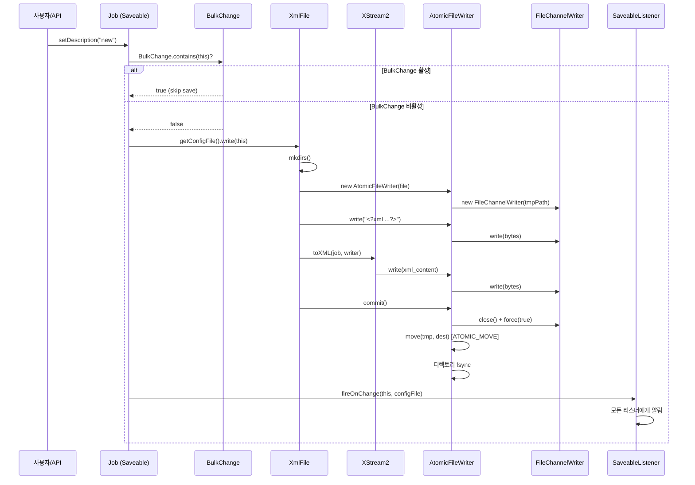
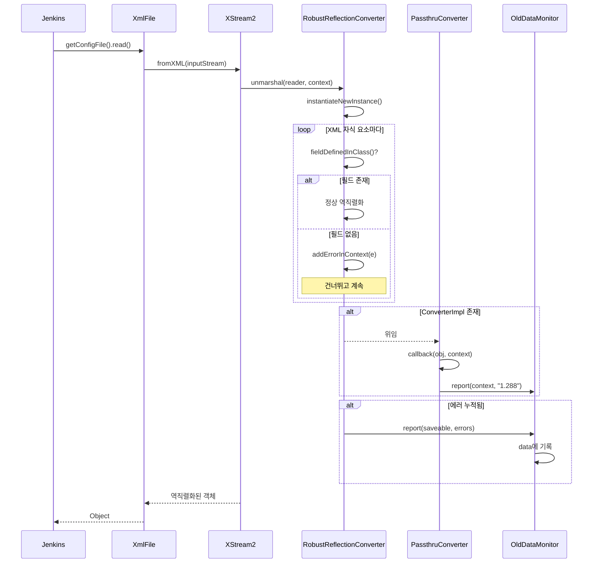

# 14. XML 영속성 시스템 (XML Persistence)

## 목차

1. [개요](#1-개요)
2. [아키텍처 전체 그림](#2-아키텍처-전체-그림)
3. [Saveable 인터페이스](#3-saveable-인터페이스)
4. [XmlFile 클래스](#4-xmlfile-클래스)
5. [AtomicFileWriter: 원자적 파일 쓰기](#5-atomicfilewriter-원자적-파일-쓰기)
6. [FileChannelWriter: 물리 디스크 동기화](#6-filechannelwriter-물리-디스크-동기화)
7. [XStream2: Jenkins 전용 직렬화 엔진](#7-xstream2-jenkins-전용-직렬화-엔진)
8. [RobustReflectionConverter: 강건한 역직렬화](#8-robustreflectionconverter-강건한-역직렬화)
9. [BulkChange: 저장 트랜잭션 패턴](#9-bulkchange-저장-트랜잭션-패턴)
10. [데이터 형식 진화 (Schema Evolution)](#10-데이터-형식-진화-schema-evolution)
11. [OldDataMonitor: 구버전 데이터 감지](#11-olddatamonitor-구버전-데이터-감지)
12. [SaveableListener: 저장 이벤트 알림](#12-saveablelistener-저장-이벤트-알림)
13. [JENKINS_HOME 파일 구조](#13-jenkins_home-파일-구조)
14. [보안 고려사항](#14-보안-고려사항)
15. [전체 시퀀스 다이어그램](#15-전체-시퀀스-다이어그램)
16. [설계 결정의 이유 (Why)](#16-설계-결정의-이유-why)
17. [정리](#17-정리)

---

## 1. 개요

Jenkins의 모든 설정 데이터 -- 전역 설정, Job 정의, 빌드 메타데이터, 플러그인 설정 -- 는 **XML 파일**로 디스크에 저장된다. RDBMS나 NoSQL을 사용하지 않고 파일시스템 기반 XML 영속성을 선택한 것은 Jenkins 초기(Hudson 시절)부터의 핵심 설계 결정이다.

이 시스템을 구성하는 주요 클래스는 다음과 같다.

| 클래스 | 패키지 | 역할 |
|--------|--------|------|
| `Saveable` | `hudson.model` | 영속 가능 객체 인터페이스 |
| `XmlFile` | `hudson` | XML 파일 읽기/쓰기 추상화 |
| `AtomicFileWriter` | `hudson.util` | 원자적 파일 쓰기 (임시 파일 -> rename) |
| `FileChannelWriter` | `hudson.util` | FileChannel 기반 Writer (fsync 지원) |
| `XStream2` | `hudson.util` | XStream 커스텀 확장 (직렬화/역직렬화 엔진) |
| `RobustReflectionConverter` | `hudson.util` | 필드 변경에 강건한 리플렉션 Converter |
| `BulkChange` | `hudson` | 여러 변경을 하나의 save()로 묶는 트랜잭션 |
| `OldDataMonitor` | `hudson.diagnosis` | 구버전 데이터 형식 감지 및 마이그레이션 안내 |
| `SaveableListener` | `hudson.model.listeners` | 저장 이벤트 콜백 |

> 소스 위치: `core/src/main/java/hudson/XmlFile.java`, `core/src/main/java/hudson/BulkChange.java`,
> `core/src/main/java/hudson/util/XStream2.java`, `core/src/main/java/hudson/util/AtomicFileWriter.java`

---

## 2. 아키텍처 전체 그림

```
사용자 요청 (Web UI / REST API)
        |
        v
+------------------+
|  Saveable 구현체  |   (Jenkins, Job, View, Descriptor 등)
|  save() 메서드    |
+--------+---------+
         |
         |  BulkChange.contains(this) 확인
         |  → true이면 즉시 return (지연)
         |  → false이면 실제 저장 진행
         v
+------------------+
|    XmlFile        |   xs: XStream2, file: File, force: boolean
|    write(Object)  |
+--------+---------+
         |
         |  1) mkdirs() - 상위 디렉토리 생성
         |  2) AtomicFileWriter 생성 (임시 파일)
         |  3) XML 선언 헤더 쓰기
         |  4) xs.toXML(o, w) - XStream 직렬화
         |  5) w.commit() - 임시 파일 → 원본 rename
         v
+------------------+        +-------------------+
| AtomicFileWriter  | ───→  | FileChannelWriter  |
| tmpPath, destPath |       | FileChannel.force() |
+--------+---------+       +-------------------+
         |
         |  commit(): close() → move(tmp, dest) → 디렉토리 fsync
         |  abort():  close() → delete(tmp)
         v
+------------------+
| SaveableListener  |   fireOnChange(saveable, xmlFile)
| (확장 포인트)      |
+------------------+
```

---

## 3. Saveable 인터페이스

`Saveable`은 Jenkins에서 XML로 영속 가능한 모든 객체의 최상위 인터페이스다.

> 소스: `core/src/main/java/hudson/model/Saveable.java`

```java
public interface Saveable {
    void save() throws IOException;

    Saveable NOOP = () -> {};
}
```

### 3.1 인터페이스 설계

메서드가 `save()` 단 하나뿐인 극도로 단순한 인터페이스다. 이 단순함이 `BulkChange`와 `SaveableListener`를 가능하게 한다.

- `save()`: 현재 객체의 상태를 XML로 디스크에 기록한다.
- `NOOP`: 아무것도 하지 않는 Saveable 인스턴스. 테스트나 임시 객체에서 사용한다.

### 3.2 Saveable 구현 패턴

Jenkins 코어에서 `Saveable`을 구현하는 대표적인 클래스들과 그 `save()` 패턴은 동일하다.

**Jenkins.save() (전역 설정):**

> 소스: `core/src/main/java/jenkins/model/Jenkins.java` 3561행

```java
public synchronized void save() throws IOException {
    if (!configLoaded) {
        throw new IllegalStateException(
            "An attempt to save the global configuration was made before it was loaded");
    }
    if (BulkChange.contains(this)) {   // (1) BulkChange 확인
        return;
    }
    // ... 버전 설정 등
    getConfigFile().write(this);                         // (2) XmlFile로 쓰기
    SaveableListener.fireOnChange(this, getConfigFile()); // (3) 리스너 알림
}
```

**AbstractItem.save() (Job, Folder 등):**

> 소스: `core/src/main/java/hudson/model/AbstractItem.java` 618행

```java
public synchronized void save() throws IOException {
    if (BulkChange.contains(this)) return;  // (1) BulkChange 확인
    getConfigFile().write(this);            // (2) XmlFile로 쓰기
    SaveableListener.fireOnChange(this, getConfigFile()); // (3) 리스너 알림
}
```

패턴을 정리하면:

1. **BulkChange 확인** -- `BulkChange.contains(this)`가 true이면 즉시 return
2. **XmlFile.write()** -- 실제 XML 직렬화 + 원자적 파일 쓰기
3. **SaveableListener 알림** -- 저장 완료 이벤트 전파

모든 Saveable 구현체가 이 3단계를 동일하게 따른다.

---

## 4. XmlFile 클래스

`XmlFile`은 Jenkins XML 영속성의 핵심 클래스로, XStream을 이용한 직렬화/역직렬화와 원자적 파일 쓰기를 캡슐화한다.

> 소스: `core/src/main/java/hudson/XmlFile.java`

### 4.1 필드 구조

```java
public final class XmlFile {
    private final XStream xs;      // 직렬화 엔진 (보통 XStream2)
    private final File file;       // 대상 XML 파일 경로
    private final boolean force;   // fsync 여부 (기본값 true)

    // 동시성 제어용 static 필드
    private static final Map<Object, Void> beingWritten =
        Collections.synchronizedMap(new IdentityHashMap<>());
    private static final ThreadLocal<File> writing = new ThreadLocal<>();
}
```

| 필드 | 타입 | 설명 |
|------|------|------|
| `xs` | `XStream` | 직렬화/역직렬화에 사용할 XStream 인스턴스 |
| `file` | `File` | 대상 XML 파일의 경로 |
| `force` | `boolean` | `true`이면 fsync로 물리 디스크까지 동기화 (2.304부터) |
| `beingWritten` | `Map<Object, Void>` | 현재 직렬화 진행 중인 객체 추적 (JENKINS-45892 방어) |
| `writing` | `ThreadLocal<File>` | 현재 쓰기 중인 파일 추적 (중첩 직렬화 감지) |

### 4.2 생성자

```java
// 기본 XStream2 사용, fsync 활성화
public XmlFile(File file) {
    this(DEFAULT_XSTREAM, file);
}

// 커스텀 XStream, fsync 활성화
public XmlFile(XStream xs, File file) {
    this(xs, file, true);
}

// 모든 파라미터 지정 (2.304+)
public XmlFile(XStream xs, File file, boolean force) {
    this.xs = xs;
    this.file = file;
    this.force = force;
}
```

`force` 파라미터가 `false`이면 데이터 무결성이 보장되지 않는다. 성능이 중요한 일부 경우(빌드 로그 등)에서만 사용한다.

### 4.3 read(): XML -> Object (역직렬화)

```java
public Object read() throws IOException {
    if (LOGGER.isLoggable(Level.FINE)) {
        LOGGER.fine("Reading " + file);
    }
    try (InputStream in = new BufferedInputStream(Files.newInputStream(file.toPath()))) {
        return xs.fromXML(in);          // XStream이 XML을 파싱하여 Java 객체 생성
    } catch (RuntimeException | Error e) {
        throw new IOException("Unable to read " + file, e);
    }
}
```

동작:
1. `BufferedInputStream`으로 파일을 연다
2. `xs.fromXML(in)`으로 XML을 파싱하여 새로운 Java 객체를 생성한다
3. RuntimeException이나 Error가 발생하면 IOException으로 래핑한다

`read()`는 **새 객체**를 생성한다. 기존 객체에 XML 데이터를 채우려면 `unmarshal()`을 사용한다.

### 4.4 unmarshal(Object): 기존 객체에 XML 채우기

```java
public Object unmarshal(Object o) throws IOException {
    return unmarshal(o, false);
}

public Object unmarshalNullingOut(Object o) throws IOException {
    return unmarshal(o, true);
}

private Object unmarshal(Object o, boolean nullOut) throws IOException {
    try (InputStream in = new BufferedInputStream(Files.newInputStream(file.toPath()))) {
        if (nullOut) {
            return ((XStream2) xs).unmarshal(
                DEFAULT_DRIVER.createReader(in), o, null, true);
        } else {
            return xs.unmarshal(DEFAULT_DRIVER.createReader(in), o);
        }
    } catch (RuntimeException | Error e) {
        throw new IOException("Unable to read " + file, e);
    }
}
```

`read()`와 `unmarshal()`의 차이:

| 메서드 | 동작 | 용도 |
|--------|------|------|
| `read()` | XStream이 새 객체를 생성하고 필드를 채움 | 파일로부터 객체를 최초 로드 |
| `unmarshal(o)` | 기존 객체 `o`에 XML 데이터를 덮어씀 | 이미 생성된 객체를 다시 로드 (reload) |
| `unmarshalNullingOut(o)` | 기존 객체에 채우되, XML에 없는 필드는 기본값으로 리셋 | JENKINS-21017: null 필드 정확한 복원 |

`unmarshalNullingOut`은 2.99부터 도입되었다. XML에 명시되지 않은 필드를 기본값(null 또는 0)으로 리셋하는 모드로, `Descriptor.load()` 같은 경우에 필요하다. 일반 `unmarshal`은 XML에 없는 필드를 기존 값 그대로 유지한다.

### 4.5 write(Object): Object -> XML (직렬화)

```java
public void write(Object o) throws IOException {
    mkdirs();                                              // (1) 디렉토리 확보
    AtomicFileWriter w = force
            ? new AtomicFileWriter(file)                   // (2-a) fsync 활성화
            : new AtomicFileWriter(file.toPath(),          // (2-b) fsync 비활성화
                  StandardCharsets.UTF_8, false, false);
    try {
        w.write("<?xml version='1.1' encoding='UTF-8'?>\n"); // (3) XML 선언
        beingWritten.put(o, null);                         // (4) 쓰기 중 표시
        writing.set(file);
        try {
            xs.toXML(o, w);                                // (5) XStream 직렬화
        } finally {
            beingWritten.remove(o);
            writing.set(null);
        }
        w.commit();                                        // (6) 원자적 커밋
    } catch (RuntimeException e) {
        throw new IOException(e);
    } finally {
        w.abort();                                         // (7) 실패 시 정리
    }
}
```

단계별 상세:

1. **mkdirs()**: 상위 디렉토리가 없으면 생성
2. **AtomicFileWriter 생성**: 임시 파일을 생성하여 쓰기 준비
3. **XML 선언 헤더**: `<?xml version='1.1' encoding='UTF-8'?>` -- XML 1.1을 사용한다
4. **beingWritten 추적**: 현재 직렬화 중인 객체를 등록 (중첩 직렬화 방어용)
5. **xs.toXML()**: XStream이 객체를 XML로 변환하여 Writer에 기록
6. **commit()**: 임시 파일을 원본 파일로 원자적 rename
7. **abort()**: commit() 성공 후에도 안전하게 호출 가능 (이미 삭제된 tmpFile은 무시)

### 4.6 replaceIfNotAtTopLevel: 중첩 직렬화 방어

```java
public static Object replaceIfNotAtTopLevel(Object o, Supplier<Object> replacement) {
    File currentlyWriting = writing.get();
    if (beingWritten.containsKey(o) || currentlyWriting == null) {
        return o;                  // 최상위 객체이면 그대로 직렬화
    } else {
        LOGGER.log(Level.WARNING,
            "JENKINS-45892: reference to " + o + " being saved from unexpected " +
            currentlyWriting, new IllegalStateException());
        return replacement.get();  // 중첩 참조이면 대체 객체 사용
    }
}
```

JENKINS-45892 방어: Jenkins나 Job처럼 최상위로 직렬화되어야 할 객체가 다른 객체 내부에 중첩 참조되어 직렬화될 때, 전체 객체를 재귀적으로 직렬화하는 대신 안전한 대체 객체(보통 이름 참조)를 사용한다.

실제 사용 예 (`AbstractItem.writeReplace()`):

```java
protected Object writeReplace() {
    return XmlFile.replaceIfNotAtTopLevel(this, () -> new Replacer(this));
}
```

### 4.7 sniffEncoding(): XML 인코딩 감지

```java
public String sniffEncoding() throws IOException {
    // SAX 파서로 XML 선언의 encoding 속성을 읽는다
    // Locator2 인터페이스를 통해 인코딩 정보를 획득
    // 감지 실패 시 UTF-8을 기본값으로 사용
}
```

이 메서드는 XML 파일의 선언부에서 인코딩을 감지한다. 오래된 Jenkins 데이터는 시스템 기본 인코딩(Shift-JIS, EUC-KR 등)으로 작성되었을 수 있으므로, 파일을 읽을 때 정확한 인코딩을 판별해야 한다.

---

## 5. AtomicFileWriter: 원자적 파일 쓰기

> 소스: `core/src/main/java/hudson/util/AtomicFileWriter.java`

`AtomicFileWriter`는 파일 쓰기의 원자성을 보장한다. "전부 성공 아니면 원본 유지"라는 원칙을 구현한다.

### 5.1 핵심 원리

```
+---------+         +----------+         +---------+
| 원본파일 |         | 임시파일  |         | 원본파일  |
| config  |   쓰기  | config-  |  rename | config  |
| .xml    | ──────→ | atomic   | ──────→ | .xml    |
| (기존)  |         | 123.tmp  |         | (새로운) |
+---------+         +----------+         +---------+
```

1. 같은 디렉토리에 임시 파일(`config.xml-atomic*.tmp`)을 생성
2. 임시 파일에 모든 데이터를 기록
3. `commit()` 시 임시 파일을 원본 파일로 rename
4. rename은 대부분의 파일시스템에서 원자적 연산

### 5.2 필드 구조

```java
public class AtomicFileWriter extends Writer {
    private final FileChannelWriter core;  // 실제 쓰기 담당
    private final Path tmpPath;            // 임시 파일 경로
    private final Path destPath;           // 최종 대상 경로

    // 시스템 프로퍼티로 제어 가능
    private static boolean DISABLE_FORCED_FLUSH;   // fsync 비활성화 플래그
    private static boolean REQUIRES_DIR_FSYNC;     // 디렉토리 fsync 필요 여부
    private static boolean atomicMoveSupported;    // 원자적 이동 지원 여부
}
```

| 프로퍼티 | 기본값 | 설명 |
|----------|--------|------|
| `DISABLE_FORCED_FLUSH` | `false` | `true`로 설정하면 fsync를 건너뛴다 (데이터 손실 위험) |
| `REQUIRES_DIR_FSYNC` | Linux: `true`, Windows: `false` | 디렉토리 엔트리의 fsync 필요 여부 |

### 5.3 생성자: 임시 파일 생성

```java
public AtomicFileWriter(@NonNull Path destinationPath, @NonNull Charset charset,
                        boolean integrityOnFlush, boolean integrityOnClose) throws IOException {
    this.destPath = destinationPath;
    Path dir = this.destPath.getParent();

    // 디렉토리 존재 확인 및 생성
    if (Files.exists(dir) && !Files.isDirectory(dir)) {
        throw new IOException(dir + " exists and is neither a directory nor a symlink");
    } else {
        if (Files.isSymbolicLink(dir)) {
            LOGGER.log(Level.CONFIG, "{0} is a symlink to a directory", dir);
        } else {
            Files.createDirectories(dir);
        }
    }

    // JENKINS-48407: NIO의 createTempFile은 0600 퍼미션으로 생성하므로 pre-NIO API 사용
    tmpPath = File.createTempFile(
        destPath.getFileName() + "-atomic", "tmp", dir.toFile()).toPath();

    core = new FileChannelWriter(tmpPath, charset,
        integrityOnFlush, integrityOnClose,
        StandardOpenOption.WRITE, StandardOpenOption.CREATE);

    // GC 시 정리 보장 (close하지 않은 경우 대비)
    CLEANER.register(this, new CleanupChecker(core, tmpPath, destPath));
}
```

**왜 `File.createTempFile`을 사용하는가?** (JENKINS-48407)
Java NIO의 `Files.createTempFile()`은 파일을 `0600` 퍼미션으로 생성한다. 이는 기존 `config.xml`의 퍼미션과 달라서 문제를 일으킬 수 있다. 레거시 `File.createTempFile()`은 시스템의 기본 umask를 따르므로 기존 파일과 일관된 퍼미션을 유지한다.

### 5.4 commit(): 원자적 커밋

```java
public void commit() throws IOException {
    close();                                               // (1) 파일 닫기 (fsync 포함)
    try {
        move(tmpPath, destPath);                           // (2) 원자적 rename
    } finally {
        try {
            Files.deleteIfExists(tmpPath);                 // (3) 임시 파일 정리
        } catch (IOException e) {
            LOGGER.log(Level.WARNING, e, ...);
        }
    }

    // (4) 디렉토리 fsync (Linux에서 필요)
    if (!DISABLE_FORCED_FLUSH && REQUIRES_DIR_FSYNC) {
        try (FileChannel parentChannel = FileChannel.open(destPath.getParent())) {
            parentChannel.force(true);
        }
    }
}
```

단계별:

1. **close()**: `FileChannelWriter.close()` 호출. `forceOnClose`가 true이면 `FileChannel.force(true)` 실행
2. **move()**: 먼저 `ATOMIC_MOVE`로 시도, 실패하면 `REPLACE_EXISTING` 폴백
3. **임시 파일 삭제**: 이동 성공 시 이미 없으므로 무해. 실패 시 남아있는 임시 파일 정리
4. **디렉토리 fsync**: Linux의 `fsync(2)` 맨페이지에 따르면, 파일의 fsync만으로는 디렉토리 엔트리까지 디스크에 반영되지 않을 수 있다

### 5.5 move(): 원자적 이동 전략

```java
private static void move(Path source, Path destination) throws IOException {
    if (atomicMoveSupported) {
        try {
            Files.move(source, destination, StandardCopyOption.ATOMIC_MOVE);
            return;
        } catch (AtomicMoveNotSupportedException e) {
            LOGGER.log(Level.WARNING, e, ...);
            atomicMoveSupported = false;         // 이후 시도하지 않음
        } catch (AccessDeniedException e) {
            LOGGER.log(Level.INFO, e, ...);      // 일시적 파일 잠금 → 폴백
        }
    }
    Files.move(source, destination, StandardCopyOption.REPLACE_EXISTING);
}
```

- 우선 `ATOMIC_MOVE` 시도 -- 같은 파일시스템이면 대부분 성공
- `AtomicMoveNotSupportedException` 발생 시 static 플래그를 꺼서 이후 시도를 건너뜀
- `AccessDeniedException`은 Windows에서 파일 잠금으로 발생할 수 있으며, 이 경우만 폴백
- 폴백: `REPLACE_EXISTING`으로 비원자적 이동 (극히 짧은 순간 파일이 없을 수 있음)

### 5.6 abort(): 실패 시 정리

```java
public void abort() throws IOException {
    try {
        close();
    } finally {
        Files.deleteIfExists(tmpPath);   // 임시 파일 삭제
    }
}
```

`abort()`는 `commit()` 후에도 안전하게 호출할 수 있다. `commit()` 후에는 `tmpPath`가 이미 삭제되었으므로 `deleteIfExists`가 아무 동작도 하지 않는다. 이 설계 덕분에 `try/finally` 패턴에서 안전하게 사용할 수 있다.

### 5.7 CleanupChecker: GC 안전망

```java
private static final class CleanupChecker implements Runnable {
    private final FileChannelWriter core;
    private final Path tmpPath;
    private final Path destPath;

    @Override
    public void run() {
        if (core.isOpen()) {
            LOGGER.log(Level.WARNING,
                "AtomicFileWriter for " + destPath + " was not closed before being released");
            try { core.close(); } catch (IOException e) { ... }
        }
        try {
            Files.deleteIfExists(tmpPath);
        } catch (IOException e) { ... }
    }
}
```

`java.lang.ref.Cleaner`를 사용하여 `AtomicFileWriter`가 `close()`/`commit()` 없이 GC될 경우를 방어한다. 파일 핸들 누수와 임시 파일 잔류를 방지한다.

---

## 6. FileChannelWriter: 물리 디스크 동기화

> 소스: `core/src/main/java/hudson/util/FileChannelWriter.java`

`FileChannelWriter`는 `AtomicFileWriter`의 내부 엔진으로, `FileChannel`을 통해 데이터를 물리 디스크까지 동기화(fsync)하는 기능을 제공한다.

### 6.1 왜 FileChannel인가?

JENKINS-34855 문제: 기존 `BufferedWriter`를 사용할 때 정전이나 비정상 종료 시 XML 파일이 0바이트로 손상되는 현상이 발생했다. `FileChannel.force(boolean)`을 사용하면 OS 페이지 캐시를 물리 디스크까지 플러시할 수 있어 이 문제를 해결한다.

### 6.2 필드 구조

```java
public class FileChannelWriter extends Writer implements Channel {
    private final Charset charset;
    private final FileChannel channel;
    private final boolean forceOnFlush;   // flush() 시 force() 호출 여부
    private final boolean forceOnClose;   // close() 시 force() 호출 여부
}
```

### 6.3 flush()와 force()의 관계

```java
@Override
public void flush() throws IOException {
    if (forceOnFlush) {
        LOGGER.finest("Flush is forced");
        channel.force(true);
    } else {
        LOGGER.finest("Force disabled on flush(), no-op");
    }
}

@Override
public void close() throws IOException {
    if (channel.isOpen()) {
        if (forceOnClose) {
            channel.force(true);     // 닫기 전 마지막 fsync
        }
        channel.close();
    }
}
```

**왜 `forceOnFlush`를 분리했는가?**

XStream의 내부 `QuickWriter`가 직렬화 과정에서 `flush()`를 매우 빈번하게 호출한다. 매번 `FileChannel.force()`를 수행하면 극심한 성능 저하가 발생한다(타임아웃 보고됨). 따라서 `forceOnFlush`는 기본 `false`로 설정하고, `forceOnClose`만 `true`로 하여 최종 닫기 시에만 fsync를 수행한다.

```
AtomicFileWriter 기본 설정:
  forceOnFlush = false   (flush 시 fsync 안 함 → 성능 보장)
  forceOnClose = true    (close 시 fsync 수행 → 무결성 보장)
```

---

## 7. XStream2: Jenkins 전용 직렬화 엔진

> 소스: `core/src/main/java/hudson/util/XStream2.java`

`XStream2`는 오픈소스 XStream 라이브러리를 Jenkins에 맞게 커스텀 확장한 클래스다. 플러그인 호환성, 보안, 강건한 역직렬화를 위한 핵심 기능들이 포함되어 있다.

### 7.1 초기화 (init 메서드)

```java
private void init() {
    // (1) DoS 방어: 컬렉션 업데이트 제한 (CVE-2021-43859)
    int updateLimit = SystemProperties.getInteger(
        COLLECTION_UPDATE_LIMIT_PROPERTY_NAME, 5);
    this.setCollectionUpdateLimit(updateLimit);

    // (2) 보안: void/Void 타입 역직렬화 거부
    denyTypes(new Class[] { void.class, Void.class });

    // (3) 강건한 컬렉션/맵 변환기 등록
    registerConverter(new RobustCollectionConverter(...), 10);
    registerConverter(new RobustMapConverter(...), 10);

    // (4) Immutable 컬렉션 변환기 (Guava)
    registerConverter(new ImmutableMapConverter(...), 10);
    registerConverter(new ImmutableSortedSetConverter(...), 10);
    registerConverter(new ImmutableSetConverter(...), 10);
    registerConverter(new ImmutableListConverter(...), 10);

    // (5) Jenkins 전용 변환기
    registerConverter(new CopyOnWriteMap.Tree.ConverterImpl(...), 10);
    registerConverter(new DescribableList.ConverterImpl(...), 10);
    registerConverter(new Label.ConverterImpl(), 10);
    registerConverter(new SafeURLConverter(), 10);     // SECURITY-637 방어

    // (6) 내부 ConverterImpl 자동 탐색
    registerConverter(new AssociatedConverterImpl(this), -10);

    // (7) 블랙리스트 타입 차단 (SECURITY-247)
    registerConverter(new BlacklistedTypesConverter(), PRIORITY_VERY_HIGH);

    // (8) 동적 프록시 역직렬화 차단 (SECURITY-105)
    registerConverter(new DynamicProxyConverter(...) {
        @Override public Object unmarshal(...) {
            throw new ConversionException("<dynamic-proxy> not supported");
        }
    }, PRIORITY_VERY_HIGH);
}
```

### 7.2 Converter 우선순위 체계

| 우선순위 | Converter | 역할 |
|----------|-----------|------|
| `VERY_HIGH` | `BlacklistedTypesConverter` | 위험한 타입 차단 |
| `VERY_HIGH` | `DynamicProxyConverter` | 동적 프록시 차단 |
| `10` | `RobustCollectionConverter` 등 | 컬렉션/맵 안전 변환 |
| `-10` | `AssociatedConverterImpl` | 클래스 내부 ConverterImpl 자동 탐색 |
| `VERY_LOW+1` | `RobustReflectionConverter` | 리플렉션 기반 범용 변환 |

### 7.3 AssociatedConverterImpl: 자동 Converter 탐색

```java
private static final class AssociatedConverterImpl implements Converter {
    @CheckForNull
    private static Class<? extends ConverterMatcher> computeConverterClass(Class<?> t) {
        try {
            String name = t.getName() + "$ConverterImpl";
            // 클래스패스에 ConverterImpl이 있는지 확인
            if (classLoader.getResource(name.replace('.', '/') + ".class") == null) {
                return null;
            }
            return classLoader.loadClass(name).asSubclass(ConverterMatcher.class);
        } catch (ClassNotFoundException e) {
            return null;
        }
    }
}
```

어떤 클래스 `Foo`가 내부에 `Foo.ConverterImpl`을 정의하면, XStream2가 이를 자동으로 발견하여 `Foo`의 직렬화/역직렬화에 사용한다. 이것이 Jenkins의 컨벤션 기반 Converter 등록 메커니즘이다.

### 7.4 PassthruConverter: 역직렬화 후 콜백

```java
public abstract static class PassthruConverter<T> implements Converter {
    private Converter converter;

    protected PassthruConverter(XStream2 xstream) {
        converter = xstream.reflectionConverter;   // RobustReflectionConverter 위임
    }

    @Override
    public void marshal(Object source, HierarchicalStreamWriter writer,
                        MarshallingContext context) {
        converter.marshal(source, writer, context);
    }

    @Override
    public Object unmarshal(HierarchicalStreamReader reader,
                            UnmarshallingContext context) {
        Object obj = converter.unmarshal(reader, context);   // 일단 일반 역직렬화
        callback((T) obj, context);                          // 콜백 실행
        return obj;
    }

    protected abstract void callback(T obj, UnmarshallingContext context);
}
```

`PassthruConverter`는 역직렬화 후 데이터 마이그레이션 콜백을 실행하는 패턴이다. 직렬화는 기본 `RobustReflectionConverter`에 위임하고, 역직렬화 완료 후 `callback()`을 호출한다.

실제 사용 예 (`CauseAction.ConverterImpl`):

> 소스: `core/src/main/java/hudson/model/CauseAction.java` 179행

```java
public static class ConverterImpl extends XStream2.PassthruConverter<CauseAction> {
    public ConverterImpl(XStream2 xstream) { super(xstream); }

    @Override protected void callback(CauseAction ca, UnmarshallingContext context) {
        // 구버전(1.288 이전): cause 필드 사용
        if (ca.cause != null) {
            if (ca.causeBag == null) {
                ca.causeBag = new LinkedHashMap<>();
            }
            ca.addCause(ca.cause);
            OldDataMonitor.report(context, "1.288");   // 마이그레이션 보고
            ca.cause = null;
        }
        // ... 추가 마이그레이션 로직
    }
}
```

### 7.5 CompatibilityMapper: 클래스 이름 호환성

```java
private class CompatibilityMapper extends MapperWrapper {
    @Override
    public Class realClass(String elementName) {
        // (1) 명시적 호환성 별칭 확인
        Class s = compatibilityAliases.get(elementName);
        if (s != null) return s;

        try {
            return super.realClass(elementName);
        } catch (CannotResolveClassException e) {
            // (2) Hudson 1.106 이전 호환: "-" → "$" 변환 시도
            if (elementName.indexOf('-') >= 0) try {
                Class c = super.realClass(elementName.replace('-', '$'));
                oldData.set(Boolean.TRUE);
                return c;
            } catch (CannotResolveClassException e2) { }
            throw e;
        }
    }
}
```

Hudson 1.106 이전에는 XStream 1.1.x를 사용했는데, 이 버전은 내부 클래스의 `$`를 `-`로 인코딩했다. 현재 XStream은 `_-`로 인코딩한다. `CompatibilityMapper`는 이 차이를 투명하게 처리한다.

### 7.6 addCompatibilityAlias: 클래스 이름 변경 대응

```java
public void addCompatibilityAlias(String oldClassName, Class newClass) {
    compatibilityAliases.put(oldClassName, newClass);
}
```

클래스 이름이 리팩토링으로 변경된 경우, 이 메서드로 구 이름을 새 클래스에 매핑한다. `alias()`와 달리 **읽기 전용**이다. 즉, XML을 쓸 때는 새 이름을 사용하고, 읽을 때만 구 이름을 인식한다.

### 7.7 PluginClassOwnership: 플러그인 소유 정보

```java
class PluginClassOwnership implements ClassOwnership {
    @Override public String ownerOf(Class<?> clazz) {
        if (pm == null) {
            Jenkins j = Jenkins.getInstanceOrNull();
            if (j != null) { pm = j.getPluginManager(); }
        }
        if (pm == null) return null;
        PluginWrapper p = pm.whichPlugin(clazz);
        return p != null ? p.getShortName() + '@' + trimVersion(p.getVersion()) : null;
    }
}
```

직렬화 시 각 XML 요소에 `plugin="git@5.2"` 같은 속성을 추가한다. 이를 통해 어떤 플러그인이 해당 데이터를 소유하는지 추적할 수 있으며, 플러그인 제거 시 문제 진단에 도움이 된다.

### 7.8 unmarshal: 플러그인 클래스로더 설정

```java
@Override
public Object unmarshal(HierarchicalStreamReader reader, Object root,
                        DataHolder dataHolder, boolean nullOut) {
    // 플러그인이 로드된 후에는 uberClassLoader를 사용
    Jenkins h = Jenkins.getInstanceOrNull();
    if (h != null && h.pluginManager != null && h.pluginManager.uberClassLoader != null) {
        setClassLoader(h.pluginManager.uberClassLoader);
    }
    // ... 역직렬화 수행
}
```

플러그인이 정의한 클래스를 역직렬화하려면 해당 클래스를 로드할 수 있는 클래스로더가 필요하다. `uberClassLoader`는 모든 플러그인의 클래스를 로드할 수 있는 통합 클래스로더다.

---

## 8. RobustReflectionConverter: 강건한 역직렬화

> 소스: `core/src/main/java/hudson/util/RobustReflectionConverter.java`

`RobustReflectionConverter`는 Jenkins 영속성 시스템의 핵심 Converter로, 표준 XStream의 `ReflectionConverter`를 대체한다. "강건함(Robustness)"이 핵심 설계 목표다.

### 8.1 왜 Robust가 필요한가?

Jenkins는 수백 개의 플러그인이 독립적으로 버전 업되는 환경이다. 플러그인이 업데이트되면서:

- 필드가 추가/삭제/이름변경될 수 있다
- 클래스 이름이 변경될 수 있다
- 의존하던 다른 플러그인이 제거될 수 있다

표준 `ReflectionConverter`는 이런 상황에서 예외를 던지고 전체 로드를 실패시킨다. `RobustReflectionConverter`는 이를 우아하게 처리한다.

### 8.2 강건한 역직렬화 전략

```java
public Object doUnmarshal(final Object result,
        final HierarchicalStreamReader reader,
        final UnmarshallingContext context) {

    // Saveable 추적: OldDataMonitor 보고용
    if (result instanceof Saveable && context.get("Saveable") == null)
        context.put("Saveable", result);

    while (reader.hasMoreChildren()) {
        reader.moveDown();

        boolean critical = false;
        try {
            String fieldName = mapper.realMember(result.getClass(), reader.getNodeName());

            // 크리티컬 필드 여부 확인
            for (Class<?> concrete = result.getClass(); concrete != null;
                 concrete = concrete.getSuperclass()) {
                if (hasCriticalField(concrete, fieldName)) {
                    critical = true;
                    break;
                }
            }

            // 필드 존재 여부 확인
            boolean fieldExistsInClass = fieldDefinedInClass(result, fieldName);

            if (fieldExistsInClass) {
                // 필드가 존재하면 정상 역직렬화
                Field field = reflectionProvider.getField(result.getClass(), fieldName);
                value = unmarshalField(context, result, type, field);
                reflectionProvider.writeField(result, fieldName, value, classDefiningField);
            } else {
                // 필드가 없으면 implicit collection으로 시도
                writeValueToImplicitCollection(...);
            }

        } catch (CriticalXStreamException e) {
            throw e;                    // 크리티컬 예외는 전파
        } catch (XStreamException e) {
            if (critical) {
                throw new CriticalXStreamException(e);  // 크리티컬 필드 에러는 전파
            }
            addErrorInContext(context, e);  // 비크리티컬 에러는 기록만 하고 계속
        } catch (LinkageError e) {
            if (critical) throw e;
            addErrorInContext(context, e);
        }

        reader.moveUp();
    }

    // 에러가 있으면 OldDataMonitor에 보고
    if (context.get("ReadError") != null && context.get("Saveable") == result) {
        OldDataMonitor.report((Saveable) result,
            (ArrayList<Throwable>) context.get("ReadError"));
    }

    return result;
}
```

### 8.3 에러 처리 전략 요약

```
XML 필드 읽기 시도
        |
        +── 성공 → 필드에 값 설정
        |
        +── 실패 (XStreamException / LinkageError)
                |
                +── 크리티컬 필드? → YES → 예외 전파 (로드 실패)
                |
                +── 크리티컬 필드? → NO  → 에러 기록, 해당 필드 건너뛰기
                                           (나머지 필드 계속 로드)
```

### 8.4 크리티컬 필드 (Critical Fields)

```java
void addCriticalField(Class<?> clazz, String field) {
    criticalFieldsLock.writeLock().lock();
    try {
        if (!criticalFields.containsKey(field)) {
            criticalFields.put(field, new HashSet<>());
        }
        criticalFields.get(field).add(clazz.getName());
    } finally {
        criticalFieldsLock.writeLock().unlock();
    }
}
```

특정 필드를 "크리티컬"로 등록하면, 해당 필드의 역직렬화 실패 시 전체 객체의 로드를 중단한다. `XStream2.addCriticalField(Class, String)` 메서드로 등록한다.

`ReadWriteLock`을 사용하는 이유: 크리티컬 필드 등록은 초기화 시 한 번이지만, 조회는 역직렬화 시 매우 빈번하게 일어나므로 읽기/쓰기 잠금을 분리하여 동시성 성능을 확보한다.

### 8.5 fieldDefinedInClass: 필드 존재 확인

```java
private boolean fieldDefinedInClass(Object result, String attrName) {
    return reflectionProvider.getFieldOrNull(result.getClass(), attrName) != null;
}
```

`transient` 필드도 포함하여 확인한다. 주석에서 "during unmarshalling, unmarshal into transient fields like XStream 1.1.3"이라고 명시하고 있다. 이는 데이터 형식 진화에서 구 필드를 `transient`로 표시하고도 XML에서 읽을 수 있게 하기 위함이다.

### 8.6 OwnerContext: 플러그인 소유 정보 기록

```java
private static class OwnerContext extends LinkedList<String> {
    private void startVisiting(HierarchicalStreamWriter writer, String owner) {
        if (owner != null) {
            boolean redundant = false;
            for (String parentOwner : this) {
                if (parentOwner != null) {
                    redundant = parentOwner.equals(owner);
                    break;
                }
            }
            if (!redundant) {
                writer.addAttribute("plugin", owner);
            }
        }
        addFirst(owner);
    }
}
```

직렬화 시 XML 요소에 `plugin="..."` 속성을 추가한다. 부모 요소와 같은 플러그인이면 중복 기록하지 않는다. 이를 통해 XML을 읽을 때 어떤 플러그인이 해당 요소를 "소유"하는지 알 수 있다.

---

## 9. BulkChange: 저장 트랜잭션 패턴

> 소스: `core/src/main/java/hudson/BulkChange.java`

### 9.1 문제: 불필요한 중복 저장

```java
// BulkChange 없이: 3번 save() 호출 → 3번 XML 쓰기
job.setDescription("new description");    // → save() → XML 쓰기
job.setDisabled(false);                   // → save() → XML 쓰기
job.setConcurrentBuild(true);             // → save() → XML 쓰기
```

Jenkins의 Saveable 구현체들은 mutator 메서드에서 자동으로 `save()`를 호출한다. 여러 설정을 한꺼번에 변경하면 불필요한 XML 쓰기가 반복된다.

### 9.2 해결: BulkChange 패턴

```java
try (BulkChange bc = new BulkChange(job)) {
    job.setDescription("new description");    // save() → BulkChange 감지 → skip
    job.setDisabled(false);                   // save() → BulkChange 감지 → skip
    job.setConcurrentBuild(true);             // save() → BulkChange 감지 → skip
    bc.commit();                              // 마지막에 한 번만 save()
}
```

### 9.3 내부 구조

```java
public class BulkChange implements Closeable {
    private final Saveable saveable;           // 대상 Saveable
    public final Exception allocator;          // 생성 위치 추적 (디버깅용)
    private final BulkChange parent;           // 중첩 BulkChange 지원
    private boolean completed;

    private static final ThreadLocal<BulkChange> INSCOPE = new ThreadLocal<>();
}
```

### 9.4 생성자: 스코프 진입

```java
public BulkChange(Saveable saveable) {
    this.parent = current();                   // 현재 활성 BulkChange를 부모로 저장
    this.saveable = saveable;
    allocator = new Exception();               // 생성 위치 기록 (누수 디버깅용)
    INSCOPE.set(this);                         // ThreadLocal에 등록 → 스코프 시작
}
```

`allocator`는 `BulkChange`를 생성했지만 `commit()`/`abort()`를 호출하지 않는 버그를 추적하기 위한 것이다. 스택 트레이스를 기록해 두면 누수 위치를 찾을 수 있다.

### 9.5 commit(): 최종 저장

```java
public void commit() throws IOException {
    if (completed) return;
    completed = true;

    pop();                  // 먼저 스코프에서 나간다
    saveable.save();        // 그 다음 save() 호출
}
```

**왜 `pop()`을 `save()` 전에 하는가?**
`pop()` 없이 `save()`를 호출하면, `save()` 내부에서 `BulkChange.contains(this)`가 `true`를 반환하여 저장이 건너뛰어진다. 반드시 스코프에서 먼저 빠져나와야 `save()`가 실제로 동작한다.

### 9.6 abort(): 저장 없이 종료

```java
public void abort() {
    if (completed) return;
    completed = true;
    pop();                  // 스코프에서만 나감, save() 호출 안 함
}

@Override
public void close() {
    abort();                // Closeable → try-with-resources 지원
}
```

`close()`가 `abort()`를 호출하므로, `commit()`하지 않고 블록을 빠져나오면 자동으로 abort된다. 이는 try-with-resources의 정상적인 동작이다.

### 9.7 contains(): Saveable에서의 협력

```java
public static boolean contains(Saveable s) {
    for (BulkChange b = current(); b != null; b = b.parent)
        if (b.saveable == s || b.saveable == ALL)
            return true;
    return false;
}
```

스택(연결 리스트)을 순회하며 현재 Saveable이 BulkChange 범위 안에 있는지 확인한다. `parent` 체인을 따라가므로 중첩 BulkChange도 지원한다.

### 9.8 BulkChange.ALL: 전체 저장 억제

```java
public static final Saveable ALL = () -> {};
```

`ALL`은 모든 Saveable의 저장을 억제하는 특수 인스턴스다. `contains()` 메서드에서 `b.saveable == ALL`이면 어떤 Saveable이든 `true`를 반환한다.

### 9.9 중첩 BulkChange 시나리오

```
Thread: BulkChange(jobA) → BulkChange(jobB) → ... → commit(jobB) → commit(jobA)

INSCOPE 상태:
  생성 시: null → BulkChange(jobA) → BulkChange(jobB)
  commit(jobB): BulkChange(jobA) ← parent로 복원
  commit(jobA): null ← parent로 복원
```

`parent` 필드를 통한 연결 리스트로 중첩 스코프를 스택처럼 관리한다. `pop()` 시 `parent`를 `INSCOPE`에 설정하여 이전 BulkChange를 복원한다.

---

## 10. 데이터 형식 진화 (Schema Evolution)

Jenkins의 XML 데이터 형식은 코드 변경과 함께 진화한다. `XmlFile` 클래스의 Javadoc에서 상세한 가이드라인을 제시하고 있다.

> 소스: `core/src/main/java/hudson/XmlFile.java` 67~118행 (클래스 Javadoc)

### 10.1 필드 추가 (가장 쉬운 경우)

```java
// 버전 2.0: 새 필드 추가
public class MyConfig extends Saveable {
    private String name;
    private int retryCount;     // 새로 추가된 필드
}
```

```xml
<!-- 구버전 XML (필드 없음) -->
<my-config>
  <name>test</name>
</my-config>

<!-- 새 버전으로 로드 시: retryCount는 int의 기본값 0 -->
```

**동작 원리:**
- `read()` 사용 시: XStream이 새 객체를 생성하므로 VM 기본값(int → 0, String → null)이 적용
- `unmarshal()` 사용 시: 생성자에서 초기화한 값이 유지됨

### 10.2 필드 제거

```java
public class MyConfig extends Saveable {
    private String name;
    private transient int oldField;  // transient 추가, 삭제하지 않음!
}
```

```xml
<!-- 구버전 XML (oldField 포함) -->
<my-config>
  <name>test</name>
  <oldField>42</oldField>
</my-config>

<!-- 읽기: oldField에 42가 설정됨 (transient여도 XStream은 읽음) -->
<!-- 쓰기: oldField는 transient이므로 XML에 포함되지 않음 -->
```

**중요:** 필드를 완전히 삭제하면 안 된다. `transient`로 표시해야 구버전 XML을 읽을 때 에러가 발생하지 않는다. `RobustReflectionConverter`는 `transient` 필드도 역직렬화 대상에 포함한다.

### 10.3 필드 변경 (타입 또는 구조 변경)

```java
public class CauseAction {
    // 구 필드: transient으로 표시 (읽기만, 쓰기 안 함)
    @Deprecated
    private transient Cause cause;          // 1.288 이전
    @Deprecated
    private transient List<Cause> causes;   // 1.288~

    // 새 필드
    private Map<Cause, Integer> causeBag;   // 현재
}
```

변환 로직은 `ConverterImpl` (PassthruConverter)에서 구현한다:

```java
public static class ConverterImpl extends XStream2.PassthruConverter<CauseAction> {
    public ConverterImpl(XStream2 xstream) { super(xstream); }

    @Override protected void callback(CauseAction ca, UnmarshallingContext context) {
        if (ca.cause != null) {                 // 구 형식 감지
            if (ca.causeBag == null) {
                ca.causeBag = new LinkedHashMap<>();
            }
            ca.addCause(ca.cause);              // 구 → 새 변환
            OldDataMonitor.report(context, "1.288");  // 마이그레이션 보고
            ca.cause = null;                    // 구 필드 클리어
        }
    }
}
```

### 10.4 Schema Evolution 패턴 요약

```
+------------------+---------------------------------------------------+
| 변경 유형         | 방법                                               |
+------------------+---------------------------------------------------+
| 필드 추가         | 그냥 추가. 구 XML에서는 기본값 사용                 |
| 필드 제거         | transient 키워드 추가 (삭제하면 안 됨!)             |
| 필드 타입 변경     | 구 필드 transient + 새 필드 추가 + PassthruConverter |
| 클래스 이름 변경   | addCompatibilityAlias(old, new)                   |
| 완전 재설계       | Descriptor.load() 패턴 (루트 객체만 가능)          |
+------------------+---------------------------------------------------+
```

### 10.5 마이그레이션 흐름도

```
구버전 XML 읽기
        |
        v
  XStream2.unmarshal()
        |
        v
  RobustReflectionConverter.doUnmarshal()
        |
        +── 필드 존재? → YES → 정상 역직렬화
        |
        +── 필드 없음? → 무시 (에러 기록)
        |
        v
  PassthruConverter.callback()   ← 마이그레이션 로직 실행
        |
        +── 구 필드 → 새 필드 변환
        +── OldDataMonitor.report()
        |
        v
  다음 save() 시 새 형식으로 저장
```

---

## 11. OldDataMonitor: 구버전 데이터 감지

> 소스: `core/src/main/java/hudson/diagnosis/OldDataMonitor.java`

`OldDataMonitor`는 `AdministrativeMonitor`를 상속한 확장으로, 구버전 데이터 형식을 감지하고 관리자에게 마이그레이션을 안내한다.

### 11.1 데이터 구조

```java
@Extension @Symbol("oldData")
public class OldDataMonitor extends AdministrativeMonitor {
    private ConcurrentMap<SaveableReference, VersionRange> data = new ConcurrentHashMap<>();
}
```

- `SaveableReference`: `Saveable` 객체에 대한 참조 (직접 참조 또는 Run의 경우 ID 기반 약참조)
- `VersionRange`: 감지된 구 데이터의 버전 범위 (min, max, extra 정보)

### 11.2 report(): 구 데이터 보고

두 가지 오버로드가 있다.

**1. Saveable이 알려진 경우:**

```java
public static void report(Saveable obj, String version) {
    OldDataMonitor odm = get(Jenkins.get());
    SaveableReference ref = referTo(obj);
    while (true) {
        VersionRange vr = odm.data.get(ref);
        if (vr != null && odm.data.replace(ref, vr,
                new VersionRange(vr, version, null))) {
            break;
        } else if (odm.data.putIfAbsent(ref,
                new VersionRange(null, version, null)) == null) {
            break;
        }
    }
}
```

CAS(Compare-And-Swap) 루프를 사용하여 스레드 안전하게 버전 정보를 누적한다.

**2. 역직렬화 중 (Saveable이 아직 불명인 경우):**

```java
public static void report(UnmarshallingContext context, String version) {
    RobustReflectionConverter.addErrorInContext(context, new ReportException(version));
}
```

역직렬화 컨텍스트에 에러로 기록하면, `RobustReflectionConverter`가 최상위 `Saveable`을 식별한 후 일괄 보고한다.

### 11.3 SaveableReference: 약참조 전략

```java
private interface SaveableReference {
    @CheckForNull Saveable get();
}

// 일반 객체: 직접 참조
private static final class SimpleSaveableReference implements SaveableReference {
    private final Saveable instance;
    @Override public Saveable get() { return instance; }
}

// Run 객체: ID 기반 참조 (힙 메모리 절약)
private static final class RunSaveableReference implements SaveableReference {
    private final String id;
    @Override public Saveable get() {
        try {
            return Run.fromExternalizableId(id);
        } catch (IllegalArgumentException x) {
            return null;   // 삭제된 빌드
        }
    }
}
```

`Run`(빌드) 객체는 매우 많을 수 있으므로 직접 참조하면 GC를 방해한다. `RunSaveableReference`는 ID 문자열만 보관하고, 필요할 때 다시 조회한다.

### 11.4 자동 정리: SaveableListener 연동

```java
@Extension
public static final SaveableListener changeListener = new SaveableListener() {
    @Override
    public void onChange(Saveable obj, XmlFile file) {
        remove(obj, false);   // 재저장되면 자동으로 데이터에서 제거
    }
};

@Extension
public static final ItemListener itemDeleteListener = new ItemListener() {
    @Override
    public void onDeleted(Item item) {
        remove(item, true);   // Job 삭제 시 관련 빌드 데이터도 제거
    }
};
```

객체가 저장(`save()`)되면 새 형식으로 기록되므로 자동으로 OldDataMonitor에서 제거된다. 삭제된 항목도 정리한다.

### 11.5 관리자 액션: 일괄 마이그레이션

```java
@RequirePOST
public HttpResponse doUpgrade(StaplerRequest2 req, StaplerResponse2 rsp) {
    final String thruVerParam = req.getParameter("thruVer");
    final VersionNumber thruVer = thruVerParam.equals("all") ? null :
        new VersionNumber(thruVerParam);

    saveAndRemoveEntries(entry -> {
        VersionNumber version = entry.getValue().max;
        return version != null && (thruVer == null || !version.isNewerThan(thruVer));
    });
    return HttpResponses.forwardToPreviousPage();
}
```

관리자 UI에서 "지정 버전까지의 구 데이터를 모두 마이그레이션" 버튼을 누르면, 해당 객체들의 `save()`를 호출하여 새 형식으로 일괄 저장한다.

---

## 12. SaveableListener: 저장 이벤트 알림

> 소스: `core/src/main/java/hudson/model/listeners/SaveableListener.java`

### 12.1 인터페이스

```java
public abstract class SaveableListener implements ExtensionPoint {
    // 변경 저장 시 호출
    public void onChange(Saveable o, XmlFile file) {}

    // 삭제 시 호출 (2.480+)
    public void onDeleted(Saveable o, XmlFile file) {}

    // 이벤트 발화 (static)
    public static void fireOnChange(Saveable o, XmlFile file) {
        Listeners.notify(SaveableListener.class, false, l -> l.onChange(o, file));
    }

    public static void fireOnDeleted(Saveable o, XmlFile file) {
        Listeners.notify(SaveableListener.class, false, l -> l.onDeleted(o, file));
    }
}
```

### 12.2 확장 포인트 활용

`SaveableListener`는 `ExtensionPoint`이므로 플러그인에서 `@Extension`으로 등록할 수 있다.

사용 예:
- **OldDataMonitor**: 저장 시 구 데이터 목록에서 제거
- **Configuration as Code 플러그인**: 설정 변경 추적
- **Audit Trail 플러그인**: 설정 변경 로깅

### 12.3 Saveable.save()에서의 호출 패턴

모든 `Saveable` 구현체는 `save()` 메서드 끝에서 `SaveableListener.fireOnChange()`를 호출해야 한다:

```java
public void save() throws IOException {
    if (BulkChange.contains(this)) return;
    getConfigFile().write(this);
    SaveableListener.fireOnChange(this, getConfigFile());  // 필수!
}
```

---

## 13. JENKINS_HOME 파일 구조

Jenkins의 모든 XML 파일은 `JENKINS_HOME` 디렉토리 아래에 계층적으로 저장된다.

### 13.1 디렉토리 트리

```
$JENKINS_HOME/
|
+-- config.xml                  ← Jenkins 전역 설정 (Jenkins 클래스)
+-- *.xml                       ← 기타 전역 설정 (보안, 도구 등)
|
+-- users/
|   +-- {user-id}/
|       +-- config.xml          ← 사용자 설정
|
+-- jobs/
|   +-- {job-name}/
|       +-- config.xml          ← Job 설정 (FreeStyleProject 등)
|       +-- nextBuildNumber     ← 다음 빌드 번호 (텍스트)
|       +-- builds/
|           +-- {build-number}/
|               +-- build.xml   ← 빌드 메타데이터 (Run 클래스)
|               +-- log         ← 빌드 로그 (텍스트)
|               +-- changelog.xml ← 변경 이력
|
+-- nodes/
|   +-- {node-name}/
|       +-- config.xml          ← Agent/Node 설정
|
+-- plugins/
|   +-- {plugin}.jpi            ← 플러그인 바이너리
|   +-- {plugin}/
|       +-- config.xml          ← 플러그인별 설정 (Descriptor)
|
+-- secrets/
    +-- master.key              ← 마스터 암호화 키
    +-- *.xml                   ← 암호화된 시크릿
```

### 13.2 주요 XML 파일과 Java 클래스 매핑

| XML 경로 | Java 클래스 | XStream 인스턴스 |
|----------|------------|-----------------|
| `config.xml` (전역) | `jenkins.model.Jenkins` | `Jenkins.XSTREAM` |
| `jobs/{name}/config.xml` | `hudson.model.FreeStyleProject` 등 | `Items.XSTREAM` |
| `builds/{n}/build.xml` | `hudson.model.FreeStyleBuild` 등 | `Run.XSTREAM2` |
| `users/{id}/config.xml` | `hudson.model.User` | `User.XSTREAM` |
| `plugins/{name}/config.xml` | 각 `Descriptor` 서브클래스 | `Descriptor` 내부 XStream |

각 클래스가 별도의 `XStream2` 인스턴스를 가질 수 있으며, 각자 필요한 Converter와 alias를 등록한다.

### 13.3 getConfigFile() 구현 예

**Jenkins (전역 설정):**

```java
// core/src/main/java/jenkins/model/Jenkins.java 3278행
protected XmlFile getConfigFile() {
    return new XmlFile(XSTREAM, new File(root, "config.xml"));
}
```

**AbstractItem (Job 등):**

```java
// core/src/main/java/hudson/model/AbstractItem.java 624행
public final XmlFile getConfigFile() {
    return Items.getConfigFile(this);
}
```

---

## 14. 보안 고려사항

Jenkins의 XML 영속성 시스템에는 여러 보안 방어 메커니즘이 포함되어 있다.

### 14.1 블랙리스트 타입 차단 (SECURITY-247)

```java
private static class BlacklistedTypesConverter implements Converter {
    @Override
    public boolean canConvert(Class type) {
        if (type == null) return false;
        String name = type.getName();
        return ClassFilter.DEFAULT.isBlacklisted(name) ||
               ClassFilter.DEFAULT.isBlacklisted(type);
    }

    @Override
    public Object unmarshal(HierarchicalStreamReader reader,
                            UnmarshallingContext context) {
        throw new ConversionException(
            "Refusing to unmarshal " + reader.getNodeName() +
            " for security reasons");
    }
}
```

악의적으로 조작된 XML에 위험한 Java 클래스(예: `Runtime`, `ProcessBuilder`)가 포함되어 있으면 역직렬화를 거부한다.

### 14.2 동적 프록시 차단 (SECURITY-105)

```java
registerConverter(new DynamicProxyConverter(...) {
    @Override public Object unmarshal(...) {
        throw new ConversionException("<dynamic-proxy> not supported");
    }
}, PRIORITY_VERY_HIGH);
```

`<dynamic-proxy>` XML 요소를 통한 임의 코드 실행을 방지한다.

### 14.3 안전한 URL 역직렬화 (SECURITY-637)

```java
registerConverter(new SafeURLConverter(), 10);
```

`java.net.URL` 역직렬화 시 보안 검증을 추가한다.

### 14.4 void 타입 차단

```java
denyTypes(new Class[] { void.class, Void.class });
```

### 14.5 DoS 방어 (CVE-2021-43859)

```java
int updateLimit = SystemProperties.getInteger(
    COLLECTION_UPDATE_LIMIT_PROPERTY_NAME, 5);  // 기본 5초
this.setCollectionUpdateLimit(updateLimit);
```

컬렉션에 아이템을 추가할 때 누적 타임아웃을 설정하여, 악의적으로 거대한 컬렉션을 생성하는 DoS 공격을 방어한다.

---

## 15. 전체 시퀀스 다이어그램

### 15.1 저장 흐름 (save)



### 15.2 로드 흐름 (read)



---

## 16. 설계 결정의 이유 (Why)

### 16.1 왜 XML인가? (RDBMS가 아닌 이유)

1. **무설치 운영**: Jenkins는 `java -jar jenkins.war` 한 줄로 실행된다. DB 서버 설치/관리가 불필요하다
2. **사람이 읽고 편집 가능**: 긴급 상황에서 XML을 직접 편집하여 문제를 해결할 수 있다
3. **버전 관리 친화적**: `config.xml`을 Git으로 추적하여 설정 변경 이력을 관리할 수 있다
4. **백업/복원 단순화**: `JENKINS_HOME` 디렉토리를 통째로 복사하면 완전한 백업이 된다
5. **마이그레이션 용이**: XStream의 유연한 역직렬화 덕분에 스키마 변경이 상대적으로 쉽다

### 16.2 왜 XStream인가?

1. **애노테이션 불필요**: JAXB와 달리 클래스에 특별한 애노테이션 없이도 직렬화/역직렬화 가능
2. **리플렉션 기반**: `private` 필드도 직접 접근하므로 getter/setter 불필요
3. **유연한 확장**: Converter, Mapper 등을 통해 세밀한 커스텀 가능

### 16.3 왜 원자적 쓰기인가?

XML 파일이 손상되면 Job 설정, 빌드 기록 전체를 잃을 수 있다. "부분 쓰기"가 가장 위험한 시나리오다:

```
위험한 시나리오:
1. config.xml 열기 (기존 내용 삭제됨)
2. 새 XML 쓰기 시작
3. 정전/크래시 발생
4. → 결과: 불완전한 XML 또는 빈 파일
```

`AtomicFileWriter`는 임시 파일에 완전히 쓴 후 rename하므로 이 문제가 발생하지 않는다.

### 16.4 왜 BulkChange인가?

REST API나 웹 폼으로 여러 설정을 동시에 변경할 때, 각 setter마다 `save()`가 호출되면:

1. **성능**: 매번 XStream 직렬화 + fsync + rename은 비용이 크다
2. **일관성**: 중간 상태가 디스크에 기록될 수 있다 (예: description만 바뀌고 disabled는 아직)
3. **이벤트 노이즈**: `SaveableListener`가 불필요하게 여러 번 호출된다

`BulkChange`는 이 세 가지 문제를 모두 해결한다.

### 16.5 왜 RobustReflectionConverter인가?

Jenkins 생태계의 특성:
- 수백 개의 플러그인이 독립적으로 업데이트
- 플러그인 간 의존성이 복잡
- 사용자가 특정 플러그인만 업그레이드/다운그레이드 가능

이 환경에서 "하나의 필드 로드 실패 = 전체 Job 로드 실패"는 치명적이다. `RobustReflectionConverter`는 문제를 격리하여 나머지 데이터는 정상적으로 로드하고, 문제만 `OldDataMonitor`에 보고한다.

---

## 17. 정리

### 17.1 핵심 클래스 관계도

```
Saveable ─── save() ──→ BulkChange.contains() 확인
   |                           |
   |  (실제 저장)              | (지연)
   v                           v
XmlFile ── write() ──→ AtomicFileWriter ──→ FileChannelWriter
   |                     |                      |
   |  xs.toXML()         |  commit()            |  force(true)
   v                     v                      v
XStream2            move(tmp→dest)        FileChannel.force()
   |
   +── RobustReflectionConverter (강건한 역직렬화)
   +── AssociatedConverterImpl (자동 Converter 탐색)
   +── CompatibilityMapper (클래스 이름 호환)
   +── BlacklistedTypesConverter (보안)
   |
   v
OldDataMonitor ── 구버전 데이터 감지 ── 관리자 UI로 마이그레이션 안내
   ^
   |
SaveableListener ── 저장/삭제 이벤트 수신 ── OldDataMonitor 데이터 자동 정리
```

### 17.2 데이터 무결성 보장 레이어

| 계층 | 클래스 | 보호 대상 |
|------|--------|-----------|
| 1 | `FileChannelWriter` | 페이지 캐시 → 물리 디스크 (fsync) |
| 2 | `AtomicFileWriter` | 부분 쓰기 방지 (임시 파일 → rename) |
| 3 | `AtomicFileWriter.commit()` | 디렉토리 엔트리 동기화 (dir fsync) |
| 4 | `AtomicFileWriter.CleanupChecker` | GC 시 미닫힌 파일/임시 파일 정리 |
| 5 | `BulkChange` | 중간 상태 저장 방지 |
| 6 | `RobustReflectionConverter` | 부분 로드 실패 격리 |
| 7 | `OldDataMonitor` | 구 데이터 추적 및 마이그레이션 |

### 17.3 보안 방어 레이어

| 위협 | 방어 | 클래스/메커니즘 |
|------|------|----------------|
| 임의 클래스 역직렬화 | 블랙리스트 | `BlacklistedTypesConverter` |
| 동적 프록시 실행 | 차단 | `DynamicProxyConverter` 오버라이드 |
| URL 기반 공격 | 안전한 변환 | `SafeURLConverter` |
| DoS (거대 컬렉션) | 타임아웃 | `collectionUpdateLimit` |
| void 타입 악용 | 거부 | `denyTypes` |

Jenkins의 XML 영속성 시스템은 단순한 "파일 읽기/쓰기"가 아니라, 20년간의 실전 경험에서 비롯된 강건성, 호환성, 보안이 녹아든 정교한 시스템이다. XStream 위에 원자적 쓰기, 강건한 역직렬화, 스키마 진화, 트랜잭션 패턴을 계층적으로 쌓아 올린 결과, 수백 개의 플러그인이 독립적으로 진화하면서도 데이터 손실 없이 동작하는 영속성 레이어를 만들어냈다.
