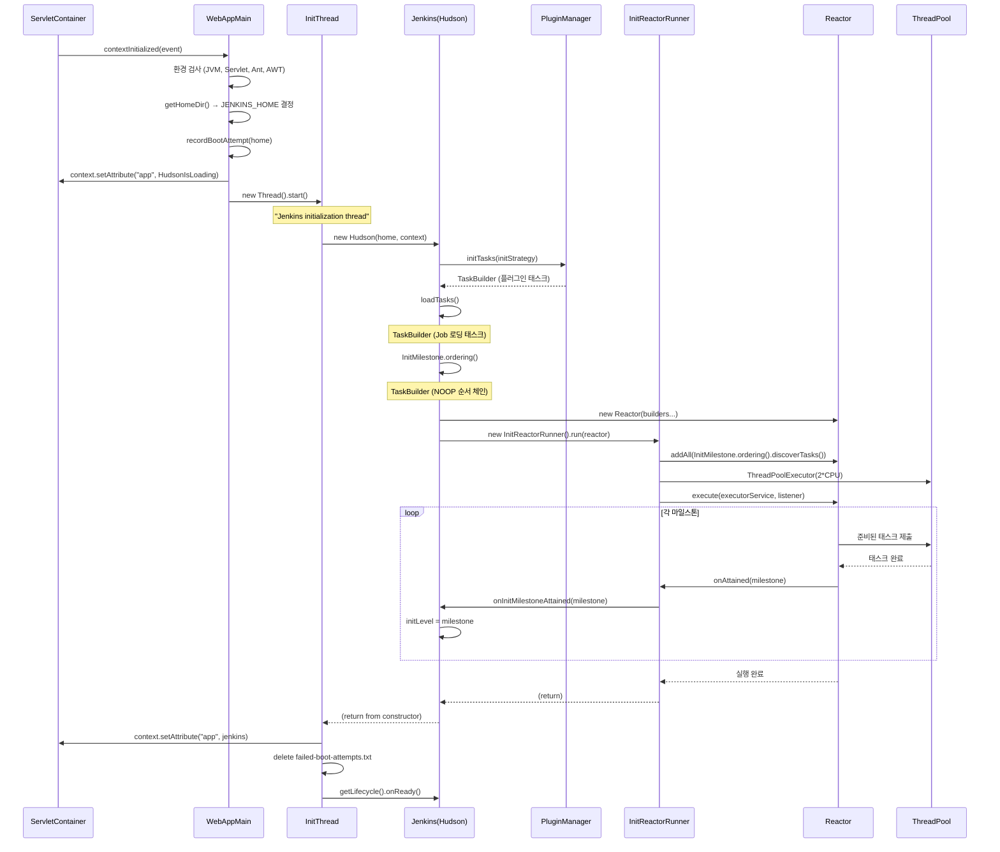

# 15. Jenkins 초기화 시스템 (Init System)

## 개요

Jenkins의 초기화 시스템은 서블릿 컨테이너의 `contextInitialized()` 이벤트를 시작으로, Reactor 라이브러리 기반의 **위상정렬(topological sort) 작업 그래프**를 실행하여 플러그인 로딩, 설정 적재, Job 복원까지 10단계 마일스톤을 순차적으로 달성하는 구조다. 이 시스템은 복잡한 의존성 관계를 가진 수백 개의 초기화 작업을 안전하고 효율적으로 실행하기 위해 설계되었다.

### 핵심 설계 원칙

1. **선언적 의존성**: `@Initializer` 어노테이션으로 실행 순서를 선언
2. **위상정렬 기반 실행**: Reactor 라이브러리가 의존성 그래프를 자동 해석
3. **병렬 실행**: 순서 보장 범위 내에서 독립적인 작업을 동시 실행
4. **플러그인 확장성**: 플러그인이 자체 초기화 작업을 마일스톤 사이에 삽입 가능
5. **장애 격리**: 비치명적 작업 실패가 전체 부팅을 막지 않음

### 관련 소스 파일

| 파일 | 경로 | 역할 |
|------|------|------|
| `InitMilestone.java` | `core/src/main/java/hudson/init/InitMilestone.java` | 10단계 마일스톤 열거형, 순서 강제 |
| `Initializer.java` | `core/src/main/java/hudson/init/Initializer.java` | 초기화 메서드 마킹 어노테이션 |
| `InitReactorRunner.java` | `core/src/main/java/jenkins/InitReactorRunner.java` | Reactor 실행, 스레드풀 관리 |
| `InitStrategy.java` | `core/src/main/java/hudson/init/InitStrategy.java` | 플러그인 목록 결정 전략 |
| `InitializerFinder.java` | `core/src/main/java/hudson/init/InitializerFinder.java` | `@Initializer` 어노테이션 스캔 |
| `TaskMethodFinder.java` | `core/src/main/java/hudson/init/TaskMethodFinder.java` | 어노테이션 기반 Task 생성 |
| `WebAppMain.java` | `core/src/main/java/hudson/WebAppMain.java` | 서블릿 진입점, Jenkins 인스턴스 생성 |
| `Jenkins.java` | `core/src/main/java/jenkins/model/Jenkins.java` | `executeReactor()`, `loadTasks()` |
| `PluginManager.java` | `core/src/main/java/hudson/PluginManager.java` | `initTasks()` 플러그인 초기화 작업 |

---

## InitMilestone 열거형: 10단계 마일스톤

`InitMilestone`은 Jenkins 초기화 과정의 핵심 진행 지점을 정의하는 열거형이다. 모든 마일스톤은 `org.jvnet.hudson.reactor.Milestone` 인터페이스를 구현하여 Reactor 작업 그래프의 동기화 지점(synchronization point)으로 동작한다.

### 소스코드 (InitMilestone.java 전체)

```java
// core/src/main/java/hudson/init/InitMilestone.java
public enum InitMilestone implements Milestone {
    STARTED("Started initialization"),
    PLUGINS_LISTED("Listed all plugins"),
    PLUGINS_PREPARED("Prepared all plugins"),
    PLUGINS_STARTED("Started all plugins"),
    EXTENSIONS_AUGMENTED("Augmented all extensions"),
    SYSTEM_CONFIG_LOADED("System config loaded"),          // @since 2.220
    SYSTEM_CONFIG_ADAPTED("System config adapted"),        // @since 2.220
    JOB_LOADED("Loaded all jobs"),
    JOB_CONFIG_ADAPTED("Configuration for all jobs updated"), // @since 2.220
    COMPLETED("Completed initialization");

    private final String message;

    InitMilestone(String message) {
        this.message = message;
    }

    @Override
    public String toString() {
        return message;
    }
}
```

### 10단계 상세 설명

```
┌────────────────────────────────────────────────────────────────────┐
│                    Jenkins 초기화 마일스톤 흐름                       │
├────────────────────────────────────────────────────────────────────┤
│                                                                    │
│  1. STARTED ─────────────────── 초기화 시작, 아무 작업 없이 달성      │
│       │                                                            │
│  2. PLUGINS_LISTED ─────────── 플러그인 메타데이터 검사, 의존성 파악   │
│       │                                                            │
│  3. PLUGINS_PREPARED ────────── 플러그인 ClassLoader 설정            │
│       │                                                            │
│  4. PLUGINS_STARTED ─────────── 플러그인 실행, 확장점 로드            │
│       │                                                            │
│  5. EXTENSIONS_AUGMENTED ────── 프로그래밍 확장 추가                  │
│       │                                                            │
│  6. SYSTEM_CONFIG_LOADED ────── 시스템 설정 파일 로드 (2.220+)       │
│       │                                                            │
│  7. SYSTEM_CONFIG_ADAPTED ───── 플러그인별 설정 적응 (CasC 등)       │
│       │                                                            │
│  8. JOB_LOADED ──────────────── 모든 Job 디스크에서 로드             │
│       │                                                            │
│  9. JOB_CONFIG_ADAPTED ──────── Job 설정 마이그레이션 (2.220+)       │
│       │                                                            │
│  10. COMPLETED ──────────────── 초기화 완료, GroovyInitScript 포함   │
│                                                                    │
└────────────────────────────────────────────────────────────────────┘
```

### 각 마일스톤 심화

#### 1. STARTED

```java
STARTED("Started initialization"),
```

아무 작업 없이 달성되는 최초 마일스톤이다. `@Initializer(after=...)` 어노테이션에서 기본값으로 사용된다. Java 어노테이션은 `null`을 기본값으로 가질 수 없으므로, `STARTED`가 "아직 아무 제약 없음"을 나타내는 센티넬 값 역할을 한다.

#### 2. PLUGINS_LISTED

```java
PLUGINS_LISTED("Listed all plugins"),
```

`PluginManager.initTasks()` 내에서 `InitStrategy.listPluginArchives()`가 `$JENKINS_HOME/plugins/` 디렉토리의 `.jpi`, `.hpi`, `.jpl`, `.hpl` 파일을 모두 스캔한 후 달성된다. 이 단계에서 순환 의존성 검사(`CyclicGraphDetector`)가 실행되고, 위상정렬된 플러그인 목록이 확정된다.

```java
// PluginManager.java 508행
g.followedBy().attains(PLUGINS_LISTED).add("Checking cyclic dependencies", new Executable() {
    @Override
    public void run(Reactor reactor) throws Exception {
        CyclicGraphDetector<PluginWrapper> cgd = new CyclicGraphDetector<>() {
            @Override
            protected List<PluginWrapper> getEdges(PluginWrapper p) {
                List<PluginWrapper> next = new ArrayList<>();
                addTo(p.getDependencies(), next);
                addTo(p.getOptionalDependencies(), next);
                return next;
            }
            // ...
        };
        cgd.run(getPlugins());
    }
});
```

#### 3. PLUGINS_PREPARED

```java
PLUGINS_PREPARED("Prepared all plugins"),
```

각 플러그인의 ClassLoader가 설정되고, 의존성이 해결되며 클래스가 로드 가능한 상태가 된다. `PLUGINS_LISTED`와 분리된 이유는 — 플러그인의 확장점 탐색에는 **모든 플러그인의 클래스가 로드 가능해야** 하기 때문이다. 소스코드 주석이 이를 명확히 설명한다:

```java
// InitMilestone.java 79-82행
// This is a separate milestone from PLUGINS_PREPARED since the execution
// of a plugin often involves finding extension point implementations, which in turn
// require all the classes from all the plugins to be loadable.
```

이 마일스톤에 도달하면 Jenkins는 Guice를 통한 의존성 주입을 활성화한다:

```java
// Jenkins.java 1180-1184행
if (milestone == PLUGINS_PREPARED) {
    // set up Guice to enable injection as early as possible
    // before this milestone, ExtensionList.ensureLoaded() won't actually try to locate instances
    ExtensionList.lookup(ExtensionFinder.class).getComponents();
}
```

#### 4. PLUGINS_STARTED

```java
PLUGINS_STARTED("Started all plugins"),
```

모든 플러그인이 실행을 시작하고, 확장점이 로드되며, Descriptor가 인스턴스화된다. 이 시점에서 `Plugin.postInitialize()`가 호출된다:

```java
// PluginManager.java 607-622행
for (final PluginWrapper p : activePlugins.toArray(new PluginWrapper[0])) {
    g.followedBy().notFatal().attains(PLUGINS_STARTED).add(
        "Initializing plugin " + p.getShortName(), reactor -> {
            if (!activePlugins.contains(p)) return;
            try {
                p.getPluginOrFail().postInitialize();
            } catch (Exception e) {
                failedPlugins.add(new FailedPlugin(p, e));
                activePlugins.remove(p);
                plugins.remove(p);
                p.releaseClassLoader();
                throw e;
            }
        });
}
```

또한 이 마일스톤 달성 후 플러그인에서 제공하는 `@Initializer` 어노테이션이 재스캔된다:

```java
// PluginManager.java 624-627행
g.followedBy().attains(PLUGINS_STARTED).add("Discovering plugin initialization tasks", reactor -> {
    // rescan to find plugin-contributed @Initializer
    reactor.addAll(initializerFinder.discoverTasks(reactor));
});
```

#### 5. EXTENSIONS_AUGMENTED

```java
EXTENSIONS_AUGMENTED("Augmented all extensions"),
```

프로그래밍 방식으로 생성된 확장점 구현이 모두 추가 완료된 시점이다. 이 단계 이후에는 `ExtensionList`가 완전히 채워져 있어서, 확장점 기반 기능이 안전하게 작동한다.

#### 6. SYSTEM_CONFIG_LOADED (2.220+)

```java
SYSTEM_CONFIG_LOADED("System config loaded"),
```

파일 시스템에서 전역 설정(`config.xml`)이 로드되는 시점이다. `Jenkins.loadTasks()`에서 구체적으로 이 작업이 정의된다:

```java
// Jenkins.java 3475행
Handle loadJenkins = g.requires(EXTENSIONS_AUGMENTED).attains(SYSTEM_CONFIG_LOADED)
    .add("Loading global config", session -> {
        load();
        if (slaves != null && !slaves.isEmpty() && nodes.isLegacy()) {
            nodes.setNodes(slaves);
            slaves = null;
        } else {
            nodes.load();
        }
    });
```

#### 7. SYSTEM_CONFIG_ADAPTED (2.220+)

```java
SYSTEM_CONFIG_ADAPTED("System config adapted"),
```

플러그인이 시스템 설정을 수정/적응할 수 있는 단계이다. 대표적으로 **Configuration as Code (CasC)** 플러그인이 이 단계에서 YAML 설정을 적용하여 기존 설정을 덮어쓴다. 2.220 이전에는 이 단계가 없어서 CasC 같은 플러그인이 설정 적용 타이밍을 정확히 맞추기 어려웠다.

#### 8. JOB_LOADED

```java
JOB_LOADED("Loaded all jobs"),
```

`$JENKINS_HOME/jobs/` 하위의 모든 Job이 디스크에서 로드된다. 각 Job은 별도의 태스크로 **병렬 로드**되며, `notFatal()`로 표시되어 개별 Job 로드 실패가 전체 부팅을 중단시키지 않는다:

```java
// Jenkins.java 3488행
loadJobs.add(g.requires(loadJenkins).requires(SYSTEM_CONFIG_ADAPTED)
    .attains(JOB_LOADED).notFatal()
    .add("Loading item " + subdir.getName(), session -> {
        if (!Items.getConfigFile(subdir).exists()) return;
        TopLevelItem item = (TopLevelItem) Items.load(Jenkins.this, subdir);
        items.put(item.getName(), item);
        loadedNames.add(item.getName());
    }));
```

#### 9. JOB_CONFIG_ADAPTED (2.220+)

```java
JOB_CONFIG_ADAPTED("Configuration for all jobs updated"),
```

Job 설정을 마이그레이션하거나 업데이트할 수 있는 단계이다. 다만 `GroovyInitScript`는 이 단계 이후에 실행되므로, 여기에는 포함되지 않는다.

#### 10. COMPLETED

```java
COMPLETED("Completed initialization"),
```

최종 마일스톤이다. `GroovyInitScript`, `InitialUserContent` 등 모든 후처리 작업이 완료된 후 달성된다. `@Initializer(before=...)` 의 기본값으로 사용되며, "이 작업은 COMPLETED 이전에 완료되어야 한다"를 의미한다.

```java
// Jenkins.java 3512행
g.requires(JOB_CONFIG_ADAPTED).attains(COMPLETED).add("Finalizing set up", session -> {
    rebuildDependencyGraph();
    // recompute label objects ...
});
```

---

## ordering() 메서드: 마일스톤 간 순서 강제

`InitMilestone.ordering()`은 Reactor 작업 그래프에 마일스톤 간 선형 순서를 강제하는 더미 태스크 체인을 생성한다.

### 소스코드

```java
// core/src/main/java/hudson/init/InitMilestone.java 132-138행
public static TaskBuilder ordering() {
    TaskGraphBuilder b = new TaskGraphBuilder();
    InitMilestone[] v = values();
    for (int i = 0; i < v.length - 1; i++)
        b.add(null, Executable.NOOP).requires(v[i]).attains(v[i + 1]);
    return b;
}
```

### 동작 원리

이 메서드는 인접한 마일스톤 쌍마다 **아무 일도 하지 않는 더미 태스크(`Executable.NOOP`)**를 생성한다. 각 더미 태스크는:
- `requires(v[i])`: 현재 마일스톤이 달성된 후에만 실행 가능
- `attains(v[i+1])`: 실행 완료 시 다음 마일스톤에 기여

이 체인이 생성하는 의존성 관계:

```
STARTED ──[NOOP]──> PLUGINS_LISTED ──[NOOP]──> PLUGINS_PREPARED ──[NOOP]──>
PLUGINS_STARTED ──[NOOP]──> EXTENSIONS_AUGMENTED ──[NOOP]──> SYSTEM_CONFIG_LOADED
──[NOOP]──> SYSTEM_CONFIG_ADAPTED ──[NOOP]──> JOB_LOADED ──[NOOP]──>
JOB_CONFIG_ADAPTED ──[NOOP]──> COMPLETED
```

총 9개의 NOOP 태스크가 생성되어 10개 마일스톤의 순서를 보장한다. 이 순서 강제가 없으면, Reactor는 마일스톤 간에 어떤 순서도 보장하지 않으므로 `JOB_LOADED`가 `PLUGINS_STARTED`보다 먼저 달성될 수 있다.

### 왜 이런 설계인가?

Reactor 라이브러리는 **일반적인 DAG(Directed Acyclic Graph) 스케줄러**이다. 마일스톤은 단순히 "이름이 있는 동기화 지점"이지, 그 자체에 순서 의미가 없다. `ordering()`이 명시적 순서 체인을 삽입함으로써:
1. 열거형(`enum`)의 선언 순서가 실제 실행 순서가 된다
2. 새 마일스톤을 추가하려면 열거형에 값을 삽입하기만 하면 된다 (2.220에서 3개 추가)
3. 개별 태스크는 자신의 직접 의존성만 선언하면 되고, 전체 순서를 알 필요가 없다

---

## @Initializer 어노테이션

`@Initializer`는 메서드를 Jenkins 부팅 시 실행할 초기화 작업으로 등록하는 어노테이션이다.

### 소스코드

```java
// core/src/main/java/hudson/init/Initializer.java
@Indexed
@Documented
@Retention(RUNTIME)
@Target(METHOD)
public @interface Initializer {
    InitMilestone after() default STARTED;
    InitMilestone before() default COMPLETED;
    String[] requires() default {};
    String[] attains() default {};
    String displayName() default "";
    boolean fatal() default true;
}
```

### 각 속성 상세

| 속성 | 타입 | 기본값 | 설명 |
|------|------|--------|------|
| `after()` | `InitMilestone` | `STARTED` | 이 마일스톤 달성 후 실행 |
| `before()` | `InitMilestone` | `COMPLETED` | 이 마일스톤 달성 전에 완료 |
| `requires()` | `String[]` | `{}` | 명시적 의존성 (문자열 기반 마일스톤) |
| `attains()` | `String[]` | `{}` | 기여하는 마일스톤 (문자열 기반) |
| `displayName` | `String` | `""` | 진행 상태 UI에 표시할 메시지 |
| `fatal` | `boolean` | `true` | `true`면 실패 시 부팅 중단 |

### after()와 requires()가 분리된 이유

`after()`는 `InitMilestone` 열거형 타입으로, 컴파일 타임 타입 안전성을 보장한다. 반면 `requires()`는 `String[]` 타입으로, 플러그인이 정의하는 커스텀 마일스톤이나 코어에 정의되지 않은 마일스톤을 참조할 수 있다. Java 어노테이션의 제약 때문에 둘을 하나로 합칠 수 없어 분리되었다.

```java
// Initializer.java 66-68행 주석
// This has the identical purpose as requires(), but it's separated to allow
// better type-safety when using InitMilestone as a requirement
// (since enum member definitions need to be constant).
```

### 사용 예시

#### 1. 기본 사용 -- GroovyInitScript

```java
// core/src/main/java/hudson/init/impl/GroovyInitScript.java
public class GroovyInitScript {
    @Initializer(after = JOB_CONFIG_ADAPTED)
    public static void init(Jenkins j) {
        new GroovyHookScript("init", j.getServletContext(),
            j.getRootDir(), j.getPluginManager().uberClassLoader).run();
    }
}
```

이 초기화 작업은:
- `after = JOB_CONFIG_ADAPTED`: 모든 Job 설정 마이그레이션이 완료된 후 실행
- `before` 미지정 = `COMPLETED`(기본값): COMPLETED 마일스톤 달성 전에 완료
- `fatal = true`(기본값): 실패하면 전체 부팅 중단

#### 2. InitialUserContent

```java
// core/src/main/java/hudson/init/impl/InitialUserContent.java
public class InitialUserContent {
    @Initializer(after = JOB_CONFIG_ADAPTED)
    public static void init(Jenkins h) throws IOException {
        Path userContentDir = Util.fileToPath(h.getRootDir()).resolve("userContent");
        if (!Files.isDirectory(userContentDir)) {
            Util.createDirectories(userContentDir);
            Files.writeString(userContentDir.resolve("readme.txt"),
                Messages.Hudson_USER_CONTENT_README() + System.lineSeparator(),
                StandardCharsets.UTF_8);
        }
    }
}
```

### static vs 인스턴스 메서드

`@Initializer`는 `static` 메서드와 인스턴스 메서드 모두 지원한다. 인스턴스 메서드의 경우:
- 해당 클래스에 `@Extension` 어노테이션이 필요
- `after()` 속성이 최소 `PLUGINS_PREPARED` 이상이어야 함 (Guice 주입이 가능해진 이후)
- Guice `Injector`를 통해 인스턴스가 생성됨

```java
// TaskMethodFinder.java 109-110행
e.invoke(
    Modifier.isStatic(e.getModifiers()) ? null : lookUp(e.getDeclaringClass()),
    args);
```

### 파라미터 주입

`@Initializer` 메서드는 파라미터를 가질 수 있다. `Jenkins` 또는 `Hudson` 타입은 직접 주입되고, 그 외 타입은 Guice를 통해 주입된다:

```java
// TaskMethodFinder.java 122-131행
private Object lookUp(Class<?> type) {
    Jenkins j = Jenkins.get();
    if (type == Jenkins.class || type == Hudson.class)
        return j;
    Injector i = j.getInjector();
    if (i != null)
        return i.getInstance(type);
    throw new IllegalArgumentException("Unable to inject " + type);
}
```

### @Indexed 어노테이션과 검색 메커니즘

`@Initializer`는 `@Indexed`로 마킹되어 있다. `org.jvnet.hudson.annotation_indexer` 라이브러리가 컴파일 타임에 어노테이션 인덱스 파일을 생성하여, 런타임에 클래스패스 전체를 스캔하지 않고도 `@Initializer`가 붙은 메서드를 빠르게 찾을 수 있다:

```java
// TaskMethodFinder.java 61행
for (Method e : Index.list(type, cl, Method.class)) {
    if (filter(e)) continue;   // already reported once
    T i = e.getAnnotation(type);
    if (i == null)        continue; // stale index
    result.add(new TaskImpl(i, e));
}
```

---

## Reactor 라이브러리 (org.jvnet.hudson.reactor)

Jenkins 초기화 시스템의 핵심 실행 엔진은 `org.jvnet.hudson.reactor` 라이브러리이다. 이것은 Jenkins 프로젝트와 별도로 관리되는 경량 라이브러리로, **DAG 기반 작업 스케줄링과 병렬 실행**을 제공한다.

### 핵심 인터페이스

```
┌─────────────────────────────────────────────────────────────────┐
│                    Reactor 라이브러리 핵심 구조                    │
├─────────────────────────────────────────────────────────────────┤
│                                                                 │
│  Milestone (인터페이스)                                          │
│    └── InitMilestone (enum, Jenkins 구현)                       │
│                                                                 │
│  Task (인터페이스)                                               │
│    ├── requires() : Collection<Milestone>  -- 선행 조건          │
│    ├── attains()  : Collection<Milestone>  -- 기여 마일스톤      │
│    ├── run(Reactor)                        -- 실행 로직          │
│    └── failureIsFatal() : boolean          -- 치명성 여부        │
│                                                                 │
│  TaskBuilder (추상 클래스)                                       │
│    └── discoverTasks(Reactor) : Collection<Task>                │
│                                                                 │
│  TaskGraphBuilder extends TaskBuilder                           │
│    └── add(name, Executable) : Handle                           │
│        └── Handle                                               │
│            ├── requires(Milestone)                               │
│            ├── attains(Milestone)                                │
│            ├── notFatal()                                        │
│            └── followedBy()                                      │
│                                                                 │
│  Executable (인터페이스)                                         │
│    ├── run(Reactor)                                             │
│    └── NOOP (상수: 아무 일도 안 하는 구현)                        │
│                                                                 │
│  Reactor                                                        │
│    ├── execute(ExecutorService, ReactorListener)                 │
│    ├── addAll(Collection<Task>)                                  │
│    └── 내부적으로 위상정렬 + 병렬 실행                             │
│                                                                 │
│  ReactorListener (인터페이스)                                    │
│    ├── onTaskStarted(Task)                                      │
│    ├── onTaskCompleted(Task)                                    │
│    ├── onTaskFailed(Task, Throwable, boolean)                   │
│    └── onAttained(Milestone)                                    │
│                                                                 │
└─────────────────────────────────────────────────────────────────┘
```

### 위상정렬 기반 실행 원리

Reactor는 모든 Task의 `requires()`와 `attains()` 관계를 분석하여 DAG를 구성한다. 마일스톤은 이 DAG의 "가상 노드"로, 여러 태스크가 같은 마일스톤을 `attains`하면 **모두 완료될 때** 비로소 그 마일스톤이 달성된다 (join 시맨틱).

```
                    ┌──── Task A (attains: M2) ────┐
                    │                               │
  M1 ──────────────┼──── Task B (attains: M2) ────┼──── M2
  (requires)        │                               │    (모두 완료 시
                    └──── Task C (attains: M2) ────┘     달성)
```

독립적인 태스크(서로 의존성이 없는 태스크)는 **병렬로 실행**될 수 있다. 이를 통해 특히 많은 수의 Job을 로드하는 `JOB_LOADED` 단계에서 큰 성능 이점을 얻는다.

### TaskGraphBuilder 사용 패턴

`TaskGraphBuilder`는 fluent API로 작업 그래프를 구성한다. Jenkins 코어에서 실제 사용되는 패턴:

```java
// Jenkins.java loadTasks() 메서드에서
TaskGraphBuilder g = new TaskGraphBuilder();

// 1. 전역 설정 로드
Handle loadJenkins = g.requires(EXTENSIONS_AUGMENTED)
                       .attains(SYSTEM_CONFIG_LOADED)
                       .add("Loading global config", session -> {
                           load();
                           nodes.load();
                       });

// 2. 각 Job 로드 (병렬 가능, notFatal)
for (final File subdir : subdirs) {
    loadJobs.add(g.requires(loadJenkins)
                   .requires(SYSTEM_CONFIG_ADAPTED)
                   .attains(JOB_LOADED)
                   .notFatal()
                   .add("Loading item " + subdir.getName(), session -> {
                       TopLevelItem item = (TopLevelItem) Items.load(Jenkins.this, subdir);
                       items.put(item.getName(), item);
                   }));
}

// 3. 최종화
g.requires(JOB_CONFIG_ADAPTED).attains(COMPLETED)
 .add("Finalizing set up", session -> {
     rebuildDependencyGraph();
 });
```

---

## InitReactorRunner: Reactor 실행기

`InitReactorRunner`는 Reactor를 실제로 실행하는 클래스로, 스레드풀 관리와 이벤트 리스닝을 담당한다.

### 소스코드 (전체)

```java
// core/src/main/java/jenkins/InitReactorRunner.java
public class InitReactorRunner {
    public void run(Reactor reactor) throws InterruptedException, ReactorException, IOException {
        reactor.addAll(InitMilestone.ordering().discoverTasks(reactor));

        ExecutorService es;
        if (Jenkins.PARALLEL_LOAD)
            es = new ThreadPoolExecutor(
                TWICE_CPU_NUM, TWICE_CPU_NUM, 5L, TimeUnit.SECONDS,
                new LinkedBlockingQueue<>(), new DaemonThreadFactory());
        else
            es = Executors.newSingleThreadExecutor(
                new NamingThreadFactory(new DaemonThreadFactory(), "InitReactorRunner"));
        try {
            reactor.execute(new ImpersonatingExecutorService(es, ACL.SYSTEM2),
                           buildReactorListener());
        } finally {
            es.shutdownNow();
        }
    }
    // ...
}
```

### 병렬 로드 (PARALLEL_LOAD)

```java
// Jenkins.java 5746행
public static boolean PARALLEL_LOAD = SystemProperties.getBoolean(
    Jenkins.class.getName() + ".parallelLoad", true);
```

`PARALLEL_LOAD`는 기본값이 `true`이다. 활성화 시 CPU 코어 수의 2배 크기의 스레드풀이 생성된다:

```java
// InitReactorRunner.java 114-116행
private static final int TWICE_CPU_NUM = SystemProperties.getInteger(
    InitReactorRunner.class.getName() + ".concurrency",
    Runtime.getRuntime().availableProcessors() * 2);
```

| 설정 | 스레드풀 | 동작 |
|------|---------|------|
| `PARALLEL_LOAD=true` (기본) | `ThreadPoolExecutor(2*CPU, 2*CPU, ...)` | 독립 태스크 병렬 실행 |
| `PARALLEL_LOAD=false` | `SingleThreadExecutor` | 모든 태스크 순차 실행 |

비활성화하려면: `-Djenkins.model.Jenkins.parallelLoad=false`

동시성 수준 조정: `-Djenkins.InitReactorRunner.concurrency=4`

### ImpersonatingExecutorService

Reactor가 사용하는 `ExecutorService`는 `ImpersonatingExecutorService`로 래핑된다. 이는 모든 초기화 작업이 `ACL.SYSTEM2` (시스템 관리자) 권한으로 실행되도록 보장한다.

### ReactorListener 구성

```java
// InitReactorRunner.java 63-95행
private ReactorListener buildReactorListener() throws IOException {
    List<ReactorListener> r = StreamSupport.stream(
        ServiceLoader.load(InitReactorListener.class,
            Thread.currentThread().getContextClassLoader()).spliterator(), false)
        .collect(Collectors.toList());

    r.add(new ReactorListener() {
        final Level level = Level.parse(SystemProperties.getString(
            Jenkins.class.getName() + ".initLogLevel", "FINE"));

        @Override
        public void onTaskStarted(Task t) {
            LOGGER.log(level, "Started {0}", getDisplayName(t));
        }

        @Override
        public void onTaskCompleted(Task t) {
            LOGGER.log(level, "Completed {0}", getDisplayName(t));
        }

        @Override
        public void onTaskFailed(Task t, Throwable err, boolean fatal) {
            LOGGER.log(SEVERE, "Failed " + getDisplayName(t), err);
        }

        @Override
        public void onAttained(Milestone milestone) {
            Level lv = level;
            String s = "Attained " + milestone.toString();
            if (milestone instanceof InitMilestone) {
                lv = Level.INFO;  // 주요 마일스톤은 INFO 레벨로
                onInitMilestoneAttained((InitMilestone) milestone);
                s = milestone.toString();
            }
            LOGGER.log(lv, s);
        }
    });
    return new ReactorListener.Aggregator(r);
}
```

핵심 포인트:
1. **ServiceLoader 방식**: `InitReactorListener` 구현을 `META-INF/services`에서 로드한다. 이 시점에는 플러그인이 아직 로드되지 않았으므로, `WEB-INF/lib` 안의 JAR만 참여할 수 있다.
2. **로그 레벨 분리**: 개별 태스크는 `FINE` 레벨(기본), InitMilestone 달성은 `INFO` 레벨로 기록한다.
3. **Aggregator 패턴**: 여러 리스너를 하나로 합쳐 이벤트를 브로드캐스트한다.

### onInitMilestoneAttained 콜백

`InitReactorRunner.onInitMilestoneAttained()`는 빈 메서드로, 서브클래스에서 오버라이드한다. `Jenkins.executeReactor()`에서 이 콜백을 통해 `initLevel` 필드를 업데이트한다:

```java
// Jenkins.java 1175-1186행
new InitReactorRunner() {
    @Override
    protected void onInitMilestoneAttained(InitMilestone milestone) {
        initLevel = milestone;
        getLifecycle().onExtendTimeout(EXTEND_TIMEOUT_SECONDS, TimeUnit.SECONDS);
        if (milestone == PLUGINS_PREPARED) {
            ExtensionList.lookup(ExtensionFinder.class).getComponents();
        }
    }
}.run(reactor);
```

---

## InitStrategy: 플러그인 목록 결정 전략

`InitStrategy`는 Jenkins 초기화 중 **플러그인 파일 목록을 결정**하고 **초기화 작업을 선택적으로 건너뛸 수 있는** 전략 패턴 클래스이다.

### 핵심 메서드

#### listPluginArchives()

```java
// core/src/main/java/hudson/init/InitStrategy.java 46-61행
public List<File> listPluginArchives(PluginManager pm) throws IOException {
    List<File> r = new ArrayList<>();
    // 디버깅용 우선순위: jpl > hpl > jpi > hpi
    getBundledPluginsFromProperty(r);
    listPluginFiles(pm, ".jpl", r); // linked plugin (디버깅용)
    listPluginFiles(pm, ".hpl", r); // linked plugin (하위 호환)
    listPluginFiles(pm, ".jpi", r); // 표준 플러그인 JAR
    listPluginFiles(pm, ".hpi", r); // 레거시 플러그인 JAR
    return r;
}
```

파일 확장자별 우선순위가 있다:

| 확장자 | 용도 | 우선순위 |
|--------|------|---------|
| `.jpl` | 연결 플러그인 (개발용, `mvn jpi:run`) | 1 (최고) |
| `.hpl` | 연결 플러그인 (하위 호환) | 2 |
| `.jpi` | 표준 플러그인 아카이브 | 3 |
| `.hpi` | 레거시 플러그인 아카이브 | 4 (최저) |

이 우선순위 덕분에 개발자가 `mvn jpi:run`으로 번들 플러그인을 오버라이드하여 디버깅할 수 있다.

#### skipInitTask()

```java
// InitStrategy.java 114-116행
public boolean skipInitTask(Task task) {
    return false;
}
```

기본 구현은 모든 태스크를 실행한다. 테스트 환경이나 특수 목적에서 서브클래스를 만들어 특정 태스크를 건너뛸 수 있다. `Jenkins.executeReactor()`에서 매 태스크 실행 전에 호출된다:

```java
// Jenkins.java 1141행
if (is != null && is.skipInitTask(task))  return;
```

#### get() -- ServiceLoader 기반 탐색

```java
// InitStrategy.java 122-130행
public static InitStrategy get(ClassLoader cl) throws IOException {
    Iterator<InitStrategy> it = ServiceLoader.load(InitStrategy.class, cl).iterator();
    if (!it.hasNext()) {
        return new InitStrategy(); // 기본 구현
    }
    InitStrategy s = it.next();
    LOGGER.log(Level.FINE, "Using {0} as InitStrategy", s);
    return s;
}
```

플러그인은 이 확장점을 사용할 수 없다 (플러그인 로딩 자체가 InitStrategy를 사용하므로). `WEB-INF/lib`에 JAR를 배치해야 한다.

---

## InitializerFinder와 TaskMethodFinder

### InitializerFinder

`InitializerFinder`는 클래스패스에서 `@Initializer` 어노테이션이 붙은 메서드를 찾아 Reactor `Task`로 변환하는 클래스이다.

```java
// core/src/main/java/hudson/init/InitializerFinder.java
public class InitializerFinder extends TaskMethodFinder<Initializer> {
    public InitializerFinder(ClassLoader cl) {
        super(Initializer.class, InitMilestone.class, cl);
    }
    // ...어노테이션 속성 접근 메서드들
}
```

### TaskMethodFinder: 어노테이션-to-Task 변환기

`TaskMethodFinder`는 제네릭 추상 클래스로, 어노테이션 타입을 파라미터로 받아 해당 어노테이션이 붙은 메서드를 Reactor `Task`로 변환한다.

#### discoverTasks() -- 태스크 검색

```java
// TaskMethodFinder.java 59-69행
@Override
public Collection<Task> discoverTasks(Reactor session) throws IOException {
    List<Task> result = new ArrayList<>();
    for (Method e : Index.list(type, cl, Method.class)) {
        if (filter(e)) continue;   // 이미 발견된 것은 건너뜀
        T i = e.getAnnotation(type);
        if (i == null)        continue; // 오래된 인덱스
        result.add(new TaskImpl(i, e));
    }
    return result;
}
```

`Index.list()`는 컴파일 타임에 생성된 어노테이션 인덱스를 사용하여 O(1)에 가까운 속도로 어노테이션 메서드를 찾는다.

#### TaskImpl -- Task 구현 내부 클래스

```java
// TaskMethodFinder.java 136-205행
public class TaskImpl implements Task {
    final Collection<Milestone> requires;
    final Collection<Milestone> attains;
    private final T i;
    private final Method e;

    private TaskImpl(T i, Method e) {
        this.i = i;
        this.e = e;
        requires = toMilestones(requiresOf(i), afterOf(i));
        attains = toMilestones(attainsOf(i), beforeOf(i));
    }

    @Override
    public void run(Reactor session) {
        invoke(e);
    }

    private Collection<Milestone> toMilestones(String[] tokens, Milestone m) {
        List<Milestone> r = new ArrayList<>();
        for (String s : tokens) {
            try {
                r.add((Milestone) Enum.valueOf(milestoneType, s));
            } catch (IllegalArgumentException x) {
                r.add(new MilestoneImpl(s));
            }
        }
        r.add(m);
        return r;
    }
}
```

`toMilestones()`는 문자열 기반 마일스톤 이름을 먼저 `InitMilestone` 열거형에서 찾고, 없으면 `MilestoneImpl`(커스텀 마일스톤)로 생성한다. 이를 통해 플러그인이 자체 마일스톤을 정의하여 세밀한 의존성 관리가 가능하다.

---

## WebAppMain: 서블릿 진입점

`WebAppMain`은 `ServletContextListener`를 구현하여, 서블릿 컨테이너가 웹 애플리케이션을 시작할 때 Jenkins 인스턴스를 생성하는 진입점이다.

### contextInitialized() 흐름

```java
// core/src/main/java/hudson/WebAppMain.java 141행
@Override
public void contextInitialized(ServletContextEvent event) {
    // ...
}
```

이 메서드의 전체 실행 흐름:

```
contextInitialized(event)
    │
    ├── 1. 로케일 설정 (LocaleProvider)
    ├── 2. 보안 권한 검사 (JVM, URLClassLoader)
    ├── 3. SunPKCS11 프로바이더 제거
    ├── 4. 로거 설치 (RingBufferLogHandler)
    ├── 5. JENKINS_HOME 결정 (getHomeDir)
    ├── 6. 홈 디렉토리 생성
    ├── 7. 부팅 시도 기록 (recordBootAttempt)
    ├── 8. 환경 호환성 검사
    │   ├── XStream 호환성
    │   ├── Servlet 버전 (2.4+)
    │   ├── Ant 버전 (1.7+)
    │   └── AWT 기능
    ├── 9. 임시 디렉토리 접근성 검사
    ├── 10. ExpressionFactory 설치
    ├── 11. context.setAttribute("app", new HudsonIsLoading())
    │       → 초기화 중 UI에 "로딩 중" 메시지 표시
    ├── 12. 세션 추적 모드 설정 (COOKIE 전용)
    │
    └── 13. 초기화 스레드 시작
            │
            └── new Thread("Jenkins initialization thread")
                    │
                    ├── new Hudson(_home, context)
                    │   └── → Jenkins 생성자 → executeReactor() 호출
                    │
                    ├── (성공 시)
                    │   ├── context.setAttribute("app", instance)
                    │   ├── failed-boot-attempts.txt 삭제
                    │   └── Jenkins.get().getLifecycle().onReady()
                    │
                    └── (실패 시)
                        ├── HudsonFailedToLoad → context에 등록
                        └── BootFailure 훅 스크립트 실행
```

### 핵심 코드 분석

#### JENKINS_HOME 결정 순서

```java
// WebAppMain.java 368-402행
public FileAndDescription getHomeDir(ServletContextEvent event) {
    // 1. 시스템 프로퍼티 확인 (JENKINS_HOME, HUDSON_HOME)
    for (String name : HOME_NAMES) {
        String sysProp = SystemProperties.getString(name);
        if (sysProp != null) return new FileAndDescription(new File(sysProp.trim()), ...);
    }

    // 2. 환경 변수 확인
    for (String name : HOME_NAMES) {
        String env = EnvVars.masterEnvVars.get(name);
        if (env != null) return new FileAndDescription(new File(env.trim()), ...);
    }

    // 3. WEB-INF/workspace (레거시)
    String root = event.getServletContext().getRealPath("/WEB-INF/workspace");
    if (root != null) { ... }

    // 4. ~/.hudson (레거시)
    File legacyHome = new File(System.getProperty("user.home"), ".hudson");
    if (legacyHome.exists()) return ...;

    // 5. ~/.jenkins (기본값)
    return new FileAndDescription(new File(System.getProperty("user.home"), ".jenkins"), ...);
}
```

탐색 우선순위: 시스템 프로퍼티 > 환경 변수 > 레거시 경로 > 기본 경로

#### 초기화 스레드

`contextInitialized()`는 초기화를 **별도 스레드**에서 실행한다:

```java
// WebAppMain.java 244-296행
initThread = new Thread("Jenkins initialization thread") {
    @Override
    public void run() {
        boolean success = false;
        try {
            Jenkins instance = new Hudson(_home, context);
            // ...
            context.setAttribute(APP, instance);
            Files.deleteIfExists(BootFailure.getBootFailureFile(_home).toPath());
            Jenkins.get().getLifecycle().onReady();
            success = true;
        } catch (Error e) {
            new HudsonFailedToLoad(e).publish(context, _home);
            throw e;
        } catch (Exception e) {
            // BootFailure 서브클래스 검사 후 적절한 에러 페이지 표시
            // ...
        } finally {
            Jenkins instance = Jenkins.getInstanceOrNull();
            if (!success && instance != null)
                instance.cleanUp();
        }
    }
};
initThread.start();
```

이것이 별도 스레드인 이유:
1. **서블릿 컨테이너 블로킹 방지**: `contextInitialized()`가 장시간 블로킹되면 컨테이너 타임아웃 발생 가능
2. **로딩 중 UI 제공**: `HudsonIsLoading` 객체가 context에 등록되어, 초기화 중에도 HTTP 요청에 "로딩 중" 페이지를 보여줌
3. **인터럽트 지원**: `contextDestroyed()`에서 초기화 스레드를 인터럽트하여 정상 종료 가능

### HudsonIsLoading과 HudsonFailedToLoad

초기화 중 사용자가 Jenkins URL에 접근하면 `HudsonIsLoading` 객체가 요청을 처리한다:

```java
// HudsonIsLoading.java
public class HudsonIsLoading {
    public void doDynamic(StaplerRequest2 req, StaplerResponse2 rsp)
            throws IOException, ServletException, InterruptedException {
        rsp.setStatus(SC_SERVICE_UNAVAILABLE);  // HTTP 503
        req.getView(this, "index.jelly").forward(req, rsp);
    }
}
```

초기화 실패 시 `HudsonFailedToLoad`가 에러 페이지를 표시한다:

```java
// HudsonFailedToLoad.java
public class HudsonFailedToLoad extends BootFailure {
    public final Throwable exception;

    public HudsonFailedToLoad(Throwable exception) {
        super(exception);
        this.exception = exception;
    }
}
```

`BootFailure.publish()`는 실패 정보를 UI에 노출하고, `boot-failure` Groovy 훅 스크립트를 실행한다:

```java
// BootFailure.java 42-56행
public void publish(ServletContext context, @CheckForNull File home) {
    LOGGER.log(Level.SEVERE, "Failed to initialize Jenkins", this);
    WebApp.get(context).setApp(this);
    if (home == null) return;
    new GroovyHookScript("boot-failure", context, home, BootFailure.class.getClassLoader())
            .bind("exception", this)
            .bind("home", home)
            .bind("servletContext", context)
            .bind("attempts", loadAttempts(home))
            .run();
    Jenkins.get().getLifecycle().onBootFailure(this);
}
```

### 부팅 실패 기록과 복구

Jenkins는 매 부팅 시도를 `$JENKINS_HOME/failed-boot-attempts.txt`에 기록한다:

```java
// WebAppMain.java 316-322행
private void recordBootAttempt(File home) {
    try (OutputStream o = Files.newOutputStream(
            BootFailure.getBootFailureFile(home).toPath(),
            StandardOpenOption.CREATE, StandardOpenOption.APPEND)) {
        o.write((new Date() + System.getProperty("line.separator", "\n"))
            .getBytes(Charset.defaultCharset()));
    } catch (IOException | InvalidPathException e) {
        LOGGER.log(WARNING, "Failed to record boot attempts", e);
    }
}
```

성공적으로 부팅하면 이 파일이 삭제된다. 반복적인 부팅 실패 시 이 파일의 타임스탬프 목록을 `boot-failure` 훅에 전달하여, 관리자가 실패 패턴을 분석하거나 자동 복구 스크립트를 실행할 수 있다.

---

## Jenkins.executeReactor(): Reactor 실행의 중심

`Jenkins.executeReactor()`는 초기화 작업 그래프를 구성하고 실행하는 핵심 메서드이다.

### 호출 시점

```java
// Jenkins.java 985-989행 (생성자 내부)
executeReactor(is,
    pluginManager.initTasks(is),    // 플러그인 로딩 태스크
    loadTasks(),                    // Job 로딩 태스크
    InitMilestone.ordering()        // 마일스톤 순서 강제
);
```

세 개의 `TaskBuilder`가 조합된다:

| TaskBuilder | 생성 태스크 | 담당 마일스톤 범위 |
|-------------|-----------|-------------------|
| `pluginManager.initTasks(is)` | 플러그인 검색/로딩/시작 | STARTED ~ PLUGINS_STARTED |
| `loadTasks()` | 설정/Job 로딩 | EXTENSIONS_AUGMENTED ~ COMPLETED |
| `InitMilestone.ordering()` | 마일스톤 순서 체인 (NOOP) | 전 구간 |

### executeReactor() 상세

```java
// Jenkins.java 1134-1187행
private void executeReactor(final InitStrategy is, TaskBuilder... builders)
        throws IOException, InterruptedException, ReactorException {
    Reactor reactor = new Reactor(builders) {
        @Override
        protected void runTask(Task task) throws Exception {
            // 1. 건너뛸 태스크 확인
            if (is != null && is.skipInitTask(task))  return;

            // 2. 스레드 이름을 태스크 이름으로 변경 (진단용)
            String taskName = InitReactorRunner.getDisplayName(task);
            Thread t = Thread.currentThread();
            String name = t.getName();
            if (taskName != null) t.setName(taskName);

            try (ACLContext ctx = ACL.as2(ACL.SYSTEM2)) {
                // 3. 시스템 권한으로 실행
                long start = System.currentTimeMillis();
                super.runTask(task);

                // 4. 성능 로깅 (옵션)
                if (LOG_STARTUP_PERFORMANCE)
                    LOGGER.info(String.format("Took %dms for %s by %s",
                        System.currentTimeMillis() - start, taskName, name));
            } catch (Exception | Error x) {
                // 5. LinkageError는 경고만 하고 계속 (플러그인 호환성)
                if (containsLinkageError(x)) {
                    LOGGER.log(Level.WARNING,
                        taskName + " failed perhaps due to plugin dependency issues", x);
                } else {
                    throw x;
                }
            } finally {
                t.setName(name);
            }
        }
    };

    new InitReactorRunner() {
        @Override
        protected void onInitMilestoneAttained(InitMilestone milestone) {
            initLevel = milestone;
            getLifecycle().onExtendTimeout(EXTEND_TIMEOUT_SECONDS, TimeUnit.SECONDS);
            if (milestone == PLUGINS_PREPARED) {
                ExtensionList.lookup(ExtensionFinder.class).getComponents();
            }
        }
    }.run(reactor);
}
```

주목할 설계 결정:

1. **LinkageError 허용**: `containsLinkageError()`를 통해 `LinkageError`(주로 플러그인 클래스 충돌)는 경고만 기록하고 계속 진행한다. 이는 하나의 호환되지 않는 플러그인이 전체 부팅을 막는 것을 방지한다.

2. **성능 프로파일링**: `-Djenkins.model.Jenkins.logStartupPerformance=true` 설정 시 각 태스크의 실행 시간이 기록된다. 느린 부팅 원인 분석에 유용하다.

3. **스레드 이름 변경**: 각 태스크 실행 중 현재 스레드의 이름이 태스크 이름으로 바뀐다. 스레드 덤프에서 어떤 초기화 작업이 진행 중인지 즉시 파악할 수 있다.

### 초기화 완료 검증

```java
// Jenkins.java 991-999행
if (initLevel != InitMilestone.COMPLETED) {
    LOGGER.log(SEVERE,
        "Jenkins initialization has not reached the COMPLETED initialization milestone " +
        "after the startup. Current state: {0}. " +
        "It may cause undefined incorrect behavior in Jenkins plugin relying on this state. " +
        "It is likely an issue with the Initialization task graph. " +
        "Example: usage of @Initializer(after = InitMilestone.COMPLETED) in a plugin " +
        "(JENKINS-37759). Please create a bug in Jenkins bugtracker.",
        initLevel);
}
```

Reactor 실행이 끝났는데 `COMPLETED` 마일스톤에 도달하지 못한 경우는 **작업 그래프에 논리적 오류**가 있다는 의미다. 대표적 원인: `@Initializer(after = COMPLETED)` 사용 -- 이 어노테이션이 `COMPLETED` 이후에 실행되어야 하므로, COMPLETED에 기여하는 태스크가 영원히 완료되지 않는 교착(deadlock) 상태가 된다.

---

## PluginManager.initTasks(): 플러그인 초기화 작업 그래프

`PluginManager.initTasks()`는 플러그인 초기화의 전 과정을 Reactor 작업으로 구성한다.

### 전체 작업 그래프

```
  STARTED
    │
    ├── "Loading bundled plugins"
    │       └── bundledPlugins = loadBundledPlugins()
    │
    ├── "Listing up plugins"  [requires: loadBundledPlugins]
    │       └── archives = initStrategy.listPluginArchives(this)
    │
    ├── "Preparing plugins"  [requires: listUpPlugins, attains: PLUGINS_LISTED]
    │       │
    │       ├── "Inspecting plugin xxx.jpi" (각 아카이브별, notFatal)
    │       │       └── strategy.createPluginWrapper(arc)
    │       │
    │       └── "Checking cyclic dependencies"
    │               └── CyclicGraphDetector 실행, activePlugins 확정
    │
  PLUGINS_LISTED
    │
    ├── "Loading plugins"  [requires: PLUGINS_LISTED, attains: PLUGINS_PREPARED]
    │       │
    │       ├── "Loading plugin X vN (short)" (각 플러그인별, notFatal)
    │       │       └── p.resolvePluginDependencies(); strategy.load(p)
    │       │
    │       ├── "Initializing plugin X" (각 플러그인별, notFatal)
    │       │       └── p.getPluginOrFail().postInitialize()
    │       │
    │       └── "Discovering plugin initialization tasks"
    │               └── reactor.addAll(initializerFinder.discoverTasks(reactor))
    │
  PLUGINS_PREPARED
    │
  PLUGINS_STARTED
    │
    ├── "Resolving Dependent Plugins Graph"  [requires: PLUGINS_PREPARED, attains: COMPLETED]
    │
    ├── @Initializer 태스크들 (코어 + 플러그인)
    │
  EXTENSIONS_AUGMENTED
    │
    ...
```

### 동적 작업 추가

Reactor의 강력한 기능 중 하나는 **실행 중에 새 태스크를 추가**할 수 있다는 점이다. `PluginManager.initTasks()`는 이를 두 곳에서 활용한다:

1. **플러그인 검사 후**: `session.addAll(g.discoverTasks(session))` -- 각 플러그인 아카이브 검사 태스크를 동적으로 추가
2. **플러그인 시작 후**: `reactor.addAll(initializerFinder.discoverTasks(reactor))` -- 플러그인이 제공하는 `@Initializer` 태스크를 동적으로 추가

이를 통해 **플러그인의 수와 내용을 미리 알 수 없는 상황**에서도 올바른 초기화 순서가 보장된다.

---

## @Terminator: 종료 시스템

초기화 시스템의 대칭적 대응물로 **종료 시스템**이 존재한다.

### TermMilestone

```java
// core/src/main/java/hudson/init/TermMilestone.java
public enum TermMilestone implements Milestone {
    STARTED("Started termination"),
    COMPLETED("Completed termination");
}
```

초기화의 10단계에 비해 종료는 `STARTED`와 `COMPLETED` 두 단계만 있다.

### @Terminator

```java
// core/src/main/java/hudson/init/Terminator.java
@Indexed
@Documented
@Retention(RUNTIME)
@Target(METHOD)
public @interface Terminator {
    TermMilestone after() default STARTED;
    TermMilestone before() default COMPLETED;
    String[] requires() default {};
    String[] attains() default {};
    String displayName() default "";
}
```

`@Initializer`와 거의 동일한 구조이지만, `fatal` 속성이 없다. 종료 중 태스크 실패는 경고만 기록하고 종료를 계속한다.

### contextDestroyed()

```java
// WebAppMain.java 405-429행
@Override
public void contextDestroyed(ServletContextEvent event) {
    try (ACLContext old = ACL.as2(ACL.SYSTEM2)) {
        Jenkins instance = Jenkins.getInstanceOrNull();
        try {
            if (instance != null) {
                instance.cleanUp();
            }
        } catch (Throwable e) {
            LOGGER.log(Level.SEVERE, "Failed to clean up. Restart will continue.", e);
        }

        terminated = true;
        Thread t = initThread;
        if (t != null && t.isAlive()) {
            LOGGER.log(Level.INFO,
                "Shutting down a Jenkins instance that was still starting up",
                new Throwable("reason"));
            t.interrupt();
        }

        Logger.getLogger("").removeHandler(handler);
    } finally {
        JenkinsJVMAccess._setJenkinsJVM(false);
    }
}
```

주목할 점: 초기화 스레드가 아직 실행 중이면 `interrupt()`를 호출한다. `WebAppMain.contextInitialized()`의 초기화 스레드 내부에서 `Thread.interrupted()` 체크가 있어 이를 감지한다.

---

## 왜 Reactor 기반인가?

Jenkins의 초기화 시스템이 단순한 순차 실행이 아닌 Reactor 기반 DAG 스케줄러를 사용하는 이유를 분석한다.

### 문제: 복잡한 초기화 의존성

Jenkins는 수백 개의 플러그인이 각자의 초기화 작업을 가지며, 이들 사이에 복잡한 의존성이 존재한다. 단순한 순차 실행에서는:

1. **순서 결정이 불가능**: 플러그인 A가 "설정 로드 후에 실행"하고 싶고, 플러그인 B가 "A 다음에 실행"하고 싶으면, 이 관계를 하드코딩해야 한다
2. **병렬화 불가**: 독립적인 작업도 순차 실행되어 부팅 시간이 길어진다
3. **확장 불가**: 새 플러그인이 추가될 때마다 초기화 순서를 재계산해야 한다

### 해법: 선언적 의존성 + 자동 위상정렬

```
문제 공간:                          해법:
┌─────────────────┐               ┌─────────────────────────────┐
│ 수백 개의        │               │ 각 태스크가 자신의 선행조건만  │
│ 초기화 작업이     │   ──────>    │ 선언하면, Reactor가 자동으로  │
│ 복잡하게 얽힘     │               │ 순서를 계산하고 병렬 실행     │
└─────────────────┘               └─────────────────────────────┘
```

### Reactor 방식의 장점

| 장점 | 설명 |
|------|------|
| **자동 순서 해석** | 각 태스크가 `requires`/`attains`만 선언하면 Reactor가 위상정렬 |
| **병렬 실행** | 의존성이 없는 태스크는 자동으로 동시 실행 |
| **동적 태스크 추가** | 실행 중에 새 태스크를 추가할 수 있어 플러그인 수에 무관 |
| **장애 격리** | `notFatal()` 태스크의 실패가 전체 부팅을 막지 않음 |
| **투명한 진행 상태** | `ReactorListener`로 모든 태스크의 시작/완료/실패를 모니터링 |
| **마일스톤 기반 동기화** | 플러그인이 자체 마일스톤을 정의하여 세밀한 타이밍 제어 |
| **재사용성** | 같은 Reactor로 `reload()` (설정 재로드)에도 사용 |

### reload()에서의 재활용

```java
// Jenkins.java 4427-4429행
public void reload() throws IOException, InterruptedException, ReactorException {
    queue.save();
    executeReactor(null, loadTasks());
}
```

설정 재로드(`$JENKINS_URL/reload`) 시에도 동일한 `executeReactor()` 메커니즘이 사용된다. 이때는 `InitStrategy`가 `null`이므로 태스크 건너뛰기가 비활성화되고, `loadTasks()`만 실행하여 Job을 다시 로드한다.

---

## 시퀀스 다이어그램: 전체 초기화 흐름



---

## 운영 관련 설정

### 시스템 프로퍼티

| 프로퍼티 | 기본값 | 설명 |
|---------|--------|------|
| `jenkins.model.Jenkins.parallelLoad` | `true` | 병렬 초기화 활성화 |
| `jenkins.InitReactorRunner.concurrency` | CPU*2 | 병렬 스레드 수 |
| `jenkins.model.Jenkins.initLogLevel` | `FINE` | 개별 태스크 로그 레벨 |
| `jenkins.model.Jenkins.logStartupPerformance` | `false` | 태스크별 실행 시간 기록 |
| `jenkins.model.Jenkins.killAfterLoad` | `false` | 로드 후 즉시 종료 (테스트용) |
| `hudson.bundled.plugins` | (없음) | 추가 번들 플러그인 경로 (glob 지원) |

### 부팅 문제 진단

#### 1. 느린 부팅

```bash
# 태스크별 실행 시간 로깅 활성화
java -Djenkins.model.Jenkins.logStartupPerformance=true -jar jenkins.war
```

#### 2. 부팅 교착 상태

스레드 덤프를 확인한다. `executeReactor()`에서 스레드 이름을 태스크 이름으로 바꾸므로:

```
"Loading plugin xyz v1.0" daemon prio=5 ...
    at hudson.PluginManager$...
```

#### 3. 반복 부팅 실패

`$JENKINS_HOME/failed-boot-attempts.txt` 파일의 타임스탬프 목록을 확인한다. `$JENKINS_HOME/boot-failure.groovy` 스크립트를 작성하면 부팅 실패 시 자동으로 실행된다:

```groovy
// $JENKINS_HOME/boot-failure.groovy
if (attempts.size() > 3) {
    // 3회 이상 실패하면 알림 전송
    // ...
}
```

#### 4. 마일스톤 미도달

Jenkins 로그에 다음 메시지가 나타나면:

```
SEVERE: Jenkins initialization has not reached the COMPLETED initialization milestone
```

`@Initializer(after = COMPLETED)` 같은 잘못된 어노테이션이 있는 플러그인을 찾아야 한다.

---

## 초기화 시스템 아키텍처 요약

```
┌────────────────────────────────────────────────────────────────────────────┐
│                         Jenkins 초기화 시스템 아키텍처                       │
├────────────────────────────────────────────────────────────────────────────┤
│                                                                            │
│  ┌──────────────┐    contextInitialized()    ┌───────────────────┐        │
│  │ ServletContainer ├──────────────────────────>│  WebAppMain       │        │
│  └──────────────┘                            │  (진입점)          │        │
│                                              └───────┬───────────┘        │
│                                                      │                    │
│                                              ┌───────▼───────────┐        │
│                                              │  Jenkins 생성자    │        │
│                                              │  (executeReactor)  │        │
│                                              └───────┬───────────┘        │
│                                                      │                    │
│             ┌────────────────────────────────────────┼──────────┐         │
│             │                                        │          │         │
│     ┌───────▼────────┐  ┌────────────▼─────────┐  ┌─▼────────┐│         │
│     │PluginManager   │  │ Jenkins.loadTasks()   │  │ordering()││         │
│     │.initTasks()    │  │ (Job/설정 로딩)       │  │(NOOP체인)││         │
│     │(플러그인 로딩)  │  └──────────────────────┘  └──────────┘│         │
│     └────────────────┘                                         │         │
│             │                                                  │         │
│             │          ┌───────────────────────┐               │         │
│             └────────> │     Reactor           │ <─────────────┘         │
│                        │  (위상정렬 DAG 실행)   │                         │
│                        └───────────┬───────────┘                         │
│                                    │                                      │
│                        ┌───────────▼───────────┐                         │
│                        │  InitReactorRunner     │                         │
│                        │  (스레드풀 + 리스너)    │                         │
│                        └───────────┬───────────┘                         │
│                                    │                                      │
│                        ┌───────────▼───────────┐                         │
│                        │  ThreadPoolExecutor    │                         │
│                        │  (2 * CPU cores)       │                         │
│                        └───────────────────────┘                         │
│                                                                            │
│  ┌─────────────────────────────────────────────────────────────────────┐  │
│  │ 마일스톤 진행                                                        │  │
│  │ STARTED → PLUGINS_LISTED → PLUGINS_PREPARED → PLUGINS_STARTED →    │  │
│  │ EXTENSIONS_AUGMENTED → SYSTEM_CONFIG_LOADED → SYSTEM_CONFIG_ADAPTED│  │
│  │ → JOB_LOADED → JOB_CONFIG_ADAPTED → COMPLETED                     │  │
│  └─────────────────────────────────────────────────────────────────────┘  │
│                                                                            │
│  ┌─────────────────────────────────────────────────────────────────────┐  │
│  │ 확장 메커니즘                                                        │  │
│  │ - @Initializer: 어노테이션으로 초기화 태스크 등록                      │  │
│  │ - InitStrategy: ServiceLoader로 플러그인 목록 전략 교체               │  │
│  │ - InitReactorListener: ServiceLoader로 초기화 이벤트 리스닝          │  │
│  │ - 커스텀 Milestone: requires()/attains()로 세밀한 순서 제어           │  │
│  └─────────────────────────────────────────────────────────────────────┘  │
│                                                                            │
└────────────────────────────────────────────────────────────────────────────┘
```

---

## 정리

Jenkins 초기화 시스템은 **Reactor 라이브러리의 위상정렬 기반 DAG 실행 엔진** 위에 구축된, 선언적이고 확장 가능한 부팅 프레임워크이다.

핵심 설계 결정과 그 이유:

| 설계 결정 | 이유 |
|----------|------|
| Reactor DAG 스케줄러 | 수백 개 플러그인의 복잡한 의존성을 자동 해석 |
| 10단계 InitMilestone | 열거형에 값 추가만으로 새 단계 삽입 가능 (2.220에서 3개 추가) |
| ordering() NOOP 체인 | 마일스톤 간 선형 순서를 강제하면서도 각 태스크는 직접 의존성만 선언 |
| @Initializer 어노테이션 | 분산 정의: 각 클래스가 자기 초기화 시점을 스스로 선언 |
| @Indexed 기반 스캔 | 클래스패스 전체 스캔 대신 컴파일 타임 인덱스로 빠른 검색 |
| 동적 태스크 추가 | 플러그인 수를 미리 알 수 없으므로 런타임에 작업 그래프 확장 |
| 별도 초기화 스레드 | 서블릿 컨테이너 타임아웃 방지 + 로딩 중 UI 제공 |
| HudsonIsLoading | 초기화 중 HTTP 503과 함께 친절한 안내 페이지 표시 |
| BootFailure 훅 | 반복 실패 시 Groovy 스크립트로 자동 복구/알림 |
| PARALLEL_LOAD | 기본 활성화, CPU*2 스레드로 독립 태스크 병렬 실행 |
| LinkageError 허용 | 플러그인 충돌이 전체 부팅을 막지 않도록 격리 |
| notFatal() 태스크 | 개별 Job/플러그인 로드 실패가 다른 작업에 영향 안 줌 |
