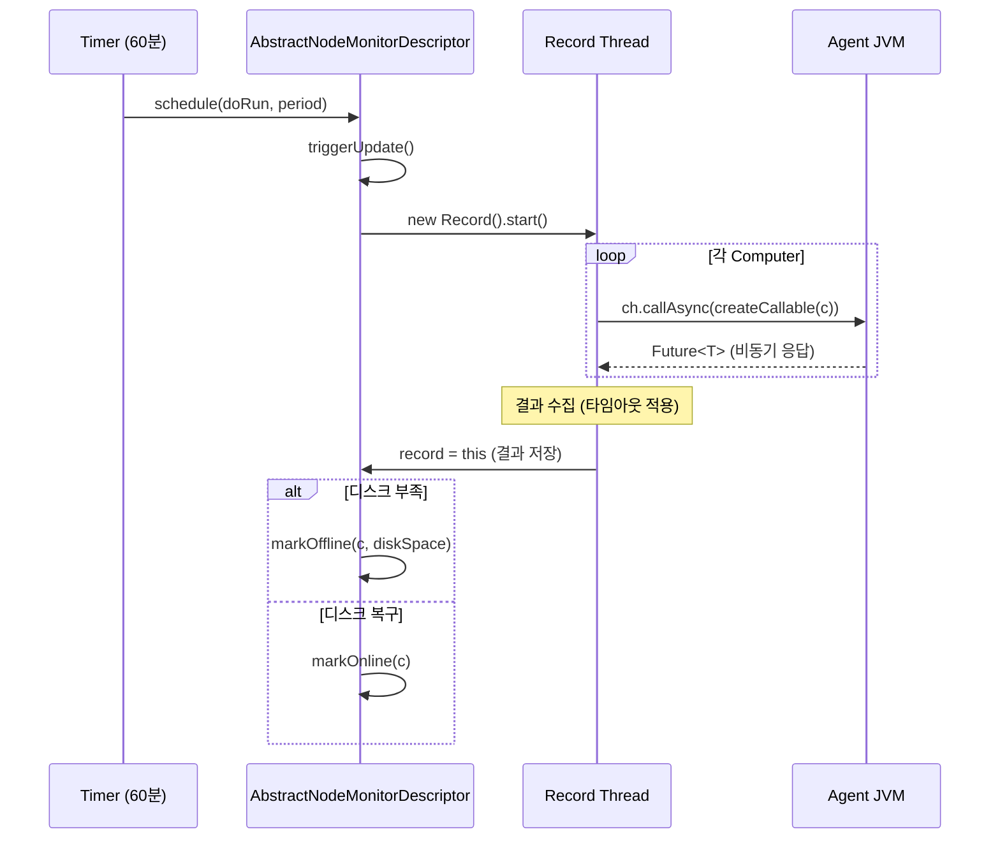

# 20. 노드 모니터링(Node Monitoring) 시스템 Deep-Dive

## 1. 개요

Jenkins의 노드 모니터링 시스템은 마스터에 연결된 **에이전트(슬레이브) 노드들의 건강 상태**를
주기적으로 검사하고, 문제가 감지되면 자동으로 노드를 오프라인으로 전환하는 메커니즘이다.

### 왜(Why) 이 서브시스템이 존재하는가?

분산 빌드 환경에서 에이전트 노드는 다양한 이유로 불안정해질 수 있다:

1. **디스크 공간 부족**: 빌드 아티팩트가 디스크를 가득 채우면 빌드 실패
2. **시계 동기화 오류**: 마스터-에이전트 간 시간 차이는 인증서, 타임스탬프 오류 유발
3. **응답 시간 지연**: 네트워크 문제로 에이전트가 사실상 도달 불가능
4. **메모리/스왑 부족**: 빌드가 OOM으로 실패
5. **임시 공간 부족**: 빌드 중 임시 파일 생성 불가

이런 문제가 있는 노드에 빌드를 배치하면 **빌드 실패 + 디버깅 시간 낭비**로 이어진다.
노드 모니터링은 이를 **선제적으로 감지**하여 문제 노드를 자동 격리한다.

## 2. 핵심 아키텍처

```
┌─────────────────────────────────────────────────────────────┐
│                    Jenkins 마스터                             │
│                                                             │
│  Timer (60분 주기) ──→ NodeMonitorUpdater                    │
│       │                      │                              │
│       │              triggerUpdate()                         │
│       │                      │                              │
│       ▼                      ▼                              │
│  ┌─────────────────────────────────────────┐                │
│  │  AbstractNodeMonitorDescriptor          │                │
│  │       │                                 │                │
│  │       ├─→ Record Thread (모니터링 스레드) │                │
│  │       │       │                         │                │
│  │       │       ├─→ monitor(Computer c)   │                │
│  │       │       │       │                 │                │
│  │       │       │   ┌───▼────────┐        │                │
│  │       │       │   │ Callable   │→ Agent │                │
│  │       │       │   │ (원격 실행) │← 결과  │                │
│  │       │       │   └────────────┘        │                │
│  │       │       │                         │                │
│  │       │       └─→ markOffline/Online()  │                │
│  │       │                                 │                │
│  │       └─→ Map<Computer, T> record      │                │
│  └─────────────────────────────────────────┘                │
│                                                             │
│  ComputerSet 페이지: 각 모니터 값을 컬럼으로 표시             │
└─────────────────────────────────────────────────────────────┘
```

## 3. 핵심 클래스 계층

```
NodeMonitor (ExtensionPoint, Describable)
│   ├── data(Computer c) → Object
│   ├── triggerUpdate() → Thread
│   ├── isIgnored() → boolean
│   └── getColumnCaption() → String
│
├── DiskSpaceMonitor
├── TemporarySpaceMonitor
├── ClockMonitor
├── ResponseTimeMonitor
├── SwapSpaceMonitor
└── ArchitectureMonitor

AbstractNodeMonitorDescriptor<T> (Descriptor)
│   ├── monitor(Computer c) → T           // 단일 노드 모니터링
│   ├── monitor() → Map<Computer, T>      // 전체 노드 모니터링
│   ├── get(Computer c) → T               // 캐시된 결과 조회
│   ├── triggerUpdate() → Thread          // 비동기 업데이트 시작
│   ├── markOffline(Computer, OfflineCause)
│   └── markOnline(Computer)
│
└── AbstractAsyncNodeMonitorDescriptor<T>
        ├── createCallable(Computer c) → Callable<T, IOException>
        ├── monitorDetailed() → Result<T>
        └── monitor() → Map<Computer, T>   // 병렬 실행

DiskSpaceMonitorDescriptor
        ├── markNodeOfflineOrOnline()
        └── GetUsableSpace (MasterToSlaveFileCallable)
```

## 4. 핵심 클래스 분석

### 4.1 NodeMonitor — 확장 포인트

**경로**: `core/src/main/java/hudson/node_monitors/NodeMonitor.java`

```java
@ExportedBean
public abstract class NodeMonitor implements ExtensionPoint, Describable<NodeMonitor> {
    private volatile boolean ignored;

    // ComputerSet 화면의 컬럼 제목
    @Exported
    public @CheckForNull String getColumnCaption() {
        return getDescriptor().getDisplayName();
    }

    // 모니터링 결과 조회
    public Object data(Computer c) {
        return getDescriptor().get(c);
    }

    // 모니터링 업데이트 트리거
    public Thread triggerUpdate() {
        return getDescriptor().triggerUpdate();
    }

    // ignored=true면 자동 오프라인 전환 비활성화
    public boolean isIgnored() {
        return ignored;
    }
}
```

`ignored` 플래그의 설계 철학:
- `Publisher`와 달리, `NodeMonitor`는 **인스턴스가 없으면 비활성**이 아니라
  **기본 활성 + opt-out** 방식
- 관리자가 특정 모니터를 끄려면 `ignored=true`로 설정

### 4.2 AbstractNodeMonitorDescriptor — 모니터링 엔진

**경로**: `core/src/main/java/hudson/node_monitors/AbstractNodeMonitorDescriptor.java`

모든 모니터링의 실제 실행 로직을 담당하는 핵심 클래스.

```java
public abstract class AbstractNodeMonitorDescriptor<T> extends Descriptor<NodeMonitor> {
    // 기본 모니터링 주기: 60분
    private static long PERIOD = TimeUnit.MINUTES.toMillis(
        SystemProperties.getInteger(
            AbstractNodeMonitorDescriptor.class.getName() + ".periodMinutes", 60));

    // 최근 모니터링 결과
    private transient volatile Record record = null;

    // 진행 중인 모니터링
    @GuardedBy("this")
    private transient Record inProgress = null;
```

#### Record — 모니터링 스레드 겸 결과 저장소

```java
private final class Record extends Thread {
    private Map<Computer, T> data = Collections.emptyMap();
    private long timestamp;

    @Override
    public void run() {
        try {
            long startTime = System.currentTimeMillis();
            data = monitor();  // 실제 모니터링 수행
            timestamp = System.currentTimeMillis();
            record = this;     // 결과를 디스크립터에 저장
        } catch (InterruptedException x) {
            // 새 모니터링에 의해 중단됨
        } finally {
            synchronized (AbstractNodeMonitorDescriptor.this) {
                if (inProgress == this) inProgress = null;
            }
        }
    }
}
```

#### triggerUpdate() — 스마트 업데이트

```java
synchronized Thread triggerUpdate() {
    if (inProgress != null) {
        if (!inProgress.isAlive()) {
            inProgress = null;  // 죽은 스레드 정리
        } else if (System.currentTimeMillis() >
                   inProgressStarted + getMonitoringTimeOut() + 1000) {
            inProgress.interrupt();  // 타임아웃 → 인터럽트
            inProgress = null;
        } else {
            return inProgress;  // 이미 진행 중 → 기존 스레드 반환
        }
    }
    final Record t = new Record();
    t.start();
    inProgress = t;
    inProgressStarted = System.currentTimeMillis();
    return inProgress;
}
```

**핵심 설계 결정**:
- 동시에 하나의 모니터링 스레드만 실행
- 이전 스레드가 30초(기본) 초과 시 인터럽트
- 죽은 스레드 자동 감지 및 정리

#### markOffline / markOnline

```java
protected boolean markOffline(Computer c, OfflineCause oc) {
    if (isIgnored() || c.isTemporarilyOffline()) return false;
    c.setTemporaryOfflineCause(oc);

    // 관리자에게 알림
    MonitorMarkedNodeOffline no =
        AdministrativeMonitor.all().get(MonitorMarkedNodeOffline.class);
    if (no != null) no.active = true;
    return true;
}

protected boolean markOnline(Computer c) {
    if (isIgnored() || c.isOnline()) return false;
    c.setTemporaryOfflineCause(null);
    return true;
}
```

### 4.3 AbstractAsyncNodeMonitorDescriptor — 비동기 병렬 모니터링

**경로**: `core/src/main/java/hudson/node_monitors/AbstractAsyncNodeMonitorDescriptor.java`

동기 모니터링의 문제점: 에이전트 N대를 순차 모니터링하면 `N * timeout` 만큼 걸림.
비동기 디스크립터는 **모든 에이전트에 동시에 Callable을 발행**한다.

```java
public abstract class AbstractAsyncNodeMonitorDescriptor<T>
    extends AbstractNodeMonitorDescriptor<T> {

    // 구현자가 제공할 원격 호출 객체
    protected abstract Callable<T, IOException> createCallable(Computer c);

    protected final Result<T> monitorDetailed() throws InterruptedException {
        Map<Computer, Future<T>> futures = new HashMap<>();
        Set<Computer> skipped = new HashSet<>();

        // 1단계: 모든 에이전트에 비동기 호출 발행
        for (Computer c : Jenkins.get().getComputers()) {
            VirtualChannel ch = c.getChannel();
            if (ch != null) {
                Callable<T, ?> cc = createCallable(c);
                if (cc != null)
                    futures.put(c, ch.callAsync(cc));
            }
        }

        // 2단계: 결과 수집 (타임아웃 적용)
        final long end = System.currentTimeMillis() + getMonitoringTimeOut();
        Map<Computer, T> data = new HashMap<>();

        for (Map.Entry<Computer, Future<T>> e : futures.entrySet()) {
            Future<T> f = e.getValue();
            if (f != null) {
                data.put(e.getKey(),
                    f.get(Math.max(0, end - System.currentTimeMillis()), MILLISECONDS));
            }
        }
        return new Result<>(data, skipped);
    }
}
```

## 5. 내장 모니터 상세

### 5.1 DiskSpaceMonitor — 디스크 공간 모니터

**경로**: `core/src/main/java/hudson/node_monitors/DiskSpaceMonitor.java`

에이전트의 **원격 FS 루트** 디스크 공간을 검사한다.

```java
public class DiskSpaceMonitor extends AbstractDiskSpaceMonitor {
    @Override
    public long getThresholdBytes(Computer c) {
        Node node = c.getNode();
        if (node != null) {
            // 노드별 커스텀 임계값 지원
            DiskSpaceMonitorNodeProperty prop =
                node.getNodeProperty(DiskSpaceMonitorNodeProperty.class);
            if (prop != null) {
                return DiskSpace.parse(prop.getFreeDiskSpaceThreshold()).size;
            }
        }
        return getThresholdBytes(); // 전역 기본값
    }
}
```

#### DiskSpaceMonitorDescriptor — 임계값 기반 자동 오프라인

```java
public void markNodeOfflineOrOnline(Computer c, DiskSpace size,
                                     AbstractDiskSpaceMonitor monitor) {
    long threshold = monitor.getThresholdBytes(c);
    size.setThreshold(threshold);

    if (size.size <= threshold) {
        // 디스크 부족 → 오프라인
        markOffline(c, size);
    }
    if (size.size > threshold) {
        // 디스크 복구 → 온라인 (같은 모니터가 오프라인 시켰을 때만)
        if (c.isOffline() && c.getOfflineCause() instanceof DiskSpace) {
            if (monitor.getClass().equals(
                ((DiskSpace) c.getOfflineCause()).getTrigger())) {
                markOnline(c);
            }
        }
    }
}
```

#### DiskSpace.parse() — 사람 읽기 가능한 크기 파싱

```java
public static DiskSpace parse(String size) throws ParseException {
    // "1GB", "0.5m", "500KiB" 등을 바이트로 변환
    size = size.toUpperCase(Locale.ENGLISH).trim();
    if (size.endsWith("B")) size = size.substring(0, size.length() - 1);
    if (size.endsWith("I")) size = size.substring(0, size.length() - 1);

    long multiplier = 1;
    String suffix = "KMGT";
    for (int i = 0; i < suffix.length(); i++) {
        if (size.endsWith(suffix.substring(i, i + 1))) {
            multiplier = 1;
            for (int j = 0; j <= i; j++) multiplier *= 1024;
            size = size.substring(0, size.length() - 1);
        }
    }
    return new DiskSpace("", (long)(Double.parseDouble(size) * multiplier));
}
```

### 5.2 ClockMonitor — 시계 동기화 모니터

**경로**: `core/src/main/java/hudson/node_monitors/ClockMonitor.java`

```java
public class ClockMonitor extends NodeMonitor {
    public static class DescriptorImpl
        extends AbstractAsyncNodeMonitorDescriptor<ClockDifference> {

        @Override
        public boolean canTakeOffline() { return false; } // 정보 제공용

        @Override
        protected Callable<ClockDifference, IOException> createCallable(Computer c) {
            Node n = c.getNode();
            return n.getClockDifferenceCallable();
        }
    }
}
```

**`canTakeOffline() = false`의 의미**: 이 모니터는 시계 차이를 보여줄 뿐,
자동으로 노드를 오프라인으로 전환하지 않는다. 시계 차이는 심각하지만
NTP 설정으로 해결해야 할 문제이지 노드를 끊을 문제는 아니기 때문이다.

### 5.3 ResponseTimeMonitor — 응답 시간 모니터

**경로**: `core/src/main/java/hudson/node_monitors/ResponseTimeMonitor.java`

마스터 ↔ 에이전트 간 **왕복 응답 시간(RTT)**을 측정한다.
독특한 3단계 직렬화 트릭을 사용한다:

```
[마스터] Step1 직렬화 → writeReplace() → Step2 생성 (start 타임스탬프 기록)
[에이전트] Step2 역직렬화 → call() → Step3 생성 (start 전달)
[마스터] Step3 역직렬화 → readResolve() → Data 생성 (end - start = RTT)
```

```java
private static final class Step2 extends MasterToSlaveCallable<Step3, IOException> {
    private final long start = System.currentTimeMillis();

    @Override
    public Step3 call() {
        return new Step3(cur, start);
    }
}

private static final class Step3 implements Serializable {
    private Object readResolve() {
        long end = System.currentTimeMillis();
        return new Data(cur, end - start);  // RTT 계산
    }
}
```

**왜 이렇게 복잡한가?**
- `writeReplace()` 시점에 마스터에서 타임스탬프 기록
- `readResolve()` 시점에 마스터에서 시간 차 계산
- 이렇게 하면 **직렬화/역직렬화 과정 자체가 RTT 측정**이 됨

#### 과거 5회 기록과 타임아웃 감지

```java
public static final class Data extends MonitorOfflineCause {
    private final long[] past5;  // 최근 5회 응답 시간 (-1 = 타임아웃)

    public boolean hasTooManyTimeouts() {
        return failureCount() >= 5;  // 연속 5회 타임아웃 → 연결 끊기
    }
}
```

5회 연속 타임아웃이 발생하면 `markOffline` 대신 **`c.disconnect(d)`** 를 호출한다.
응답 시간 타임아웃은 채널 자체가 죽었다는 의미이므로 임시 오프라인이 아니라
**연결 해제**가 적절하다.

### 5.4 SwapSpaceMonitor

**경로**: `core/src/main/java/hudson/node_monitors/SwapSpaceMonitor.java`

에이전트의 스왑 공간 사용량을 모니터링. `MemoryMonitor` 라이브러리를 사용한다.
`canTakeOffline() = false` — 정보 제공 용도.

### 5.5 TemporarySpaceMonitor

`DiskSpaceMonitor`와 유사하지만 `java.io.tmpdir` 경로의 공간을 검사한다.
빌드 중 임시 파일 생성 실패를 방지한다.

### 5.6 ArchitectureMonitor

에이전트의 OS/아키텍처 정보를 표시. `canTakeOffline() = false`.

## 6. NodeMonitorUpdater — 이벤트 기반 트리거

**경로**: `core/src/main/java/hudson/node_monitors/NodeMonitorUpdater.java`

`ComputerListener`를 구현하여 에이전트가 온라인될 때 모니터링을 트리거한다.

```java
@Extension
public class NodeMonitorUpdater extends ComputerListener {
    private static final Runnable MONITOR_UPDATER = () -> {
        for (NodeMonitor nm : ComputerSet.getMonitors()) {
            nm.triggerUpdate();
        }
    };

    private Future<?> future = Futures.precomputed(null);

    @Override
    public void onOnline(Computer c, TaskListener listener) {
        synchronized (this) {
            future.cancel(false);
            // 5초 딜레이: 여러 에이전트가 동시에 연결될 때 중복 트리거 방지
            future = Timer.get().schedule(MONITOR_UPDATER, 5, TimeUnit.SECONDS);
        }
    }
}
```

**5초 딜레이의 이유**: 클러스터 재시작 시 많은 에이전트가 거의 동시에 연결된다.
각각에 대해 모니터링을 트리거하면 불필요한 중복이 발생한다.
5초 후 한 번만 실행하여 이를 방지한다.

## 7. 모니터링 데이터 흐름



## 8. 설정과 관리

### 8.1 시스템 프로퍼티

| 프로퍼티 | 설명 | 기본값 |
|----------|------|--------|
| `hudson.node_monitors.AbstractNodeMonitorDescriptor.periodMinutes` | 모니터링 주기(분) | `60` |

### 8.2 JCasC 설정 예시

```yaml
jenkins:
  nodeMonitors:
    - diskSpace:
        freeSpaceThreshold: "1GiB"
        freeSpaceWarningThreshold: "2GiB"
    - tmpSpace:
        freeSpaceThreshold: "500MiB"
    - responseTime: {}
    - clock: {}
    - swapSpace: {}
```

### 8.3 노드별 임계값

```yaml
nodes:
  - permanent:
      name: "build-agent-1"
      nodeProperties:
        - diskSpaceMonitor:
            freeDiskSpaceThreshold: "2GiB"
            freeDiskSpaceWarningThreshold: "5GiB"
```

## 9. ComputerSet UI 통합

`NodeMonitor.getColumnCaption()`이 null이 아닌 값을 반환하면
`/computer/` (ComputerSet) 페이지에 컬럼으로 표시된다.

```
┌──────────────┬────────────┬──────────┬──────────┬──────────┐
│ 이름          │ 디스크 공간 │ 임시 공간 │ 응답 시간 │ 시계 차이 │
├──────────────┼────────────┼──────────┼──────────┼──────────┤
│ agent-1      │ 45.2 GiB   │ 12.1 GiB │ 3ms      │ +0.5s    │
│ agent-2 (!)  │ 0.8 GiB ⚠ │ 0.2 GiB  │ 12ms     │ +1.2s    │
│ agent-3 (X)  │ OFFLINE    │ OFFLINE  │ Timeout  │ N/A      │
└──────────────┴────────────┴──────────┴──────────┴──────────┘
```

## 10. MonitorMarkedNodeOffline — 관리자 알림

모니터가 노드를 오프라인으로 전환하면 `MonitorMarkedNodeOffline`
`AdministrativeMonitor`가 활성화되어 Jenkins 관리 페이지에 경고를 표시한다.

```java
// AbstractNodeMonitorDescriptor.markOffline()
MonitorMarkedNodeOffline no =
    AdministrativeMonitor.all().get(MonitorMarkedNodeOffline.class);
if (no != null) no.active = true;
```

## 11. 확장 포인트

| 확장 포인트 | 역할 | 등록 |
|-------------|------|------|
| `NodeMonitor` | 새 모니터 추가 | `@Extension` |
| `AbstractNodeMonitorDescriptor` | 동기 모니터링 로직 | Descriptor |
| `AbstractAsyncNodeMonitorDescriptor` | 비동기 병렬 모니터링 | Descriptor |

커스텀 모니터 예시:

```java
public class GPUMonitor extends NodeMonitor {
    @Extension
    public static class DescriptorImpl
        extends AbstractAsyncNodeMonitorDescriptor<GPUStatus> {

        @Override
        protected Callable<GPUStatus, IOException> createCallable(Computer c) {
            return new GPUStatusCallable();
        }
    }
}
```

## 12. 정리

Jenkins 노드 모니터링 시스템의 핵심 설계 원칙:

1. **확장 가능한 모니터 프레임워크**: `NodeMonitor` + `AbstractAsyncNodeMonitorDescriptor`
   조합으로 새 모니터를 쉽게 추가 가능
2. **비동기 병렬 실행**: 모든 에이전트에 동시에 `Callable`을 보내 병렬 모니터링
3. **자동 복구**: 디스크 공간이 복구되면 자동으로 온라인 전환
4. **opt-out 방식**: 기본 활성화, 관리자가 개별 비활성화 가능
5. **이벤트 트리거**: 에이전트 연결 시 즉시 모니터링 (5초 디바운스)
6. **정보 vs 조치 분리**: `canTakeOffline()`으로 정보만 제공하는 모니터와
   조치를 취하는 모니터를 구분
