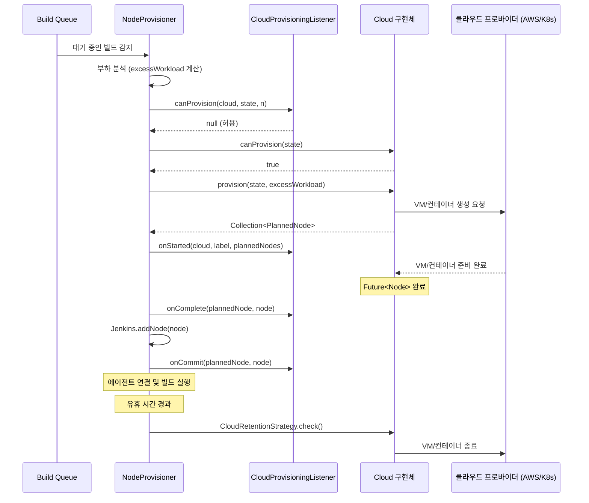

# 21. Cloud / Auto-Provisioning 시스템 Deep-Dive

## 1. 개요

Jenkins의 Cloud/Auto-Provisioning 시스템은 **빌드 부하에 따라 에이전트 노드를
동적으로 생성하고 해제**하는 메커니즘이다. AWS EC2, Kubernetes, Docker 등
다양한 클라우드 프로바이더를 추상화하여 **탄력적 빌드 인프라**를 구현한다.

### 왜(Why) 이 서브시스템이 존재하는가?

전통적인 Jenkins 환경에서는 고정된 수의 에이전트를 수동으로 등록한다.
이 방식의 문제점:

1. **리소스 낭비**: 빌드가 없을 때도 에이전트 VM이 실행 중 → 비용 낭비
2. **용량 한계**: 갑자기 빌드가 몰리면 고정 에이전트로 감당 불가
3. **수동 관리**: 에이전트 추가/제거에 관리자 개입 필요
4. **환경 일관성**: 수동 관리 에이전트는 시간이 지나면 환경이 달라짐

Cloud Auto-Provisioning은 이 모든 문제를 해결한다:
- **필요할 때만** 에이전트 생성 (비용 최적화)
- **자동 스케일링** (부하 기반)
- **일회용 에이전트** (환경 일관성)
- **API 기반 관리** (자동화)

## 2. 핵심 아키텍처

```
┌───────────────────────────────────────────────────────────────┐
│                    Jenkins 마스터                               │
│                                                               │
│  Queue (대기 중인 빌드)                                         │
│       │                                                       │
│       ▼                                                       │
│  NodeProvisioner (Label별)                                     │
│       │                                                       │
│       ├─→ 부하 분석 (Trend Analysis)                           │
│       │       excessWorkload = 수요 - 현재 용량                 │
│       │                                                       │
│       ├─→ CloudProvisioningListener.canProvision() 검사        │
│       │                                                       │
│       ├─→ Cloud.canProvision(CloudState) 확인                  │
│       │                                                       │
│       └─→ Cloud.provision(CloudState, excessWorkload)          │
│               │                                               │
│               ▼                                               │
│       Collection<PlannedNode>                                  │
│               │                                               │
│               ├─→ Future<Node> (비동기 프로비저닝)               │
│               │       │                                       │
│               │       └─→ Jenkins.addNode(node)               │
│               │                                               │
│               └─→ RetentionStrategy (유휴 시 해제)             │
│                       │                                       │
│                       └─→ AbstractCloudSlave.terminate()      │
└───────────────────────────────────────────────────────────────┘

┌───────────────────────────────────────────────────────────────┐
│                    클라우드 프로바이더                           │
│                                                               │
│  ┌──────────┐  ┌──────────┐  ┌──────────┐  ┌──────────┐      │
│  │   AWS    │  │   K8s    │  │  Docker  │  │  Azure   │      │
│  │   EC2    │  │   Pod    │  │Container │  │    VM    │      │
│  └──────────┘  └──────────┘  └──────────┘  └──────────┘      │
└───────────────────────────────────────────────────────────────┘
```

## 3. 핵심 클래스 분석

### 3.1 Cloud — 클라우드 추상화

**경로**: `core/src/main/java/hudson/slaves/Cloud.java`

`Cloud`는 동적 노드 프로비저닝의 **최상위 추상 클래스**이다.

```java
public abstract class Cloud extends Actionable
    implements ExtensionPoint, Describable<Cloud>, AccessControlled {

    // 고유 이름 (URL 토큰으로도 사용)
    public String name;

    // 이 클라우드가 해당 레이블의 노드를 프로비저닝할 수 있는가?
    public boolean canProvision(CloudState state) {
        return canProvision(state.getLabel());
    }

    // 노드 프로비저닝 실행
    public Collection<PlannedNode> provision(CloudState state, int excessWorkload) {
        return provision(state.getLabel(), excessWorkload);
    }
}
```

#### CloudState — 프로비저닝 컨텍스트

```java
public static final class CloudState {
    @CheckForNull
    private final Label label;           // 필요한 레이블
    private final int additionalPlannedCapacity;  // 이전 전략이 이미 계획한 용량
}
```

`additionalPlannedCapacity`가 존재하는 이유: 여러 Cloud가 등록되어 있을 때,
앞선 Cloud가 이미 계획한 노드 수를 알려줘서 중복 프로비저닝을 방지한다.

#### PROVISION 퍼미션

```java
public static final Permission PROVISION = new Permission(
    Computer.PERMISSIONS, "Provision",
    Messages._Cloud_ProvisionPermission_Description(),
    Jenkins.ADMINISTER, PERMISSION_SCOPE);
```

프로비저닝은 인프라 비용에 직결되므로 별도 퍼미션으로 관리한다.

### 3.2 NodeProvisioner — 부하 분석 엔진

**경로**: `core/src/main/java/hudson/slaves/NodeProvisioner.java`

`NodeProvisioner`는 각 `Label`에 대해 하나씩 존재하며,
큐의 부하를 분석하여 Cloud에 프로비저닝을 요청한다.

#### PlannedNode — 비동기 프로비저닝 결과

```java
public static class PlannedNode {
    public final String displayName;
    public final Future<Node> future;
    public final int numExecutors;
}
```

`Future<Node>`가 핵심이다:
- 프로비저닝은 비동기적으로 진행 (VM 시작에 수 분 소요 가능)
- `future.get()` 완료 시 `Jenkins.addNode(node)` 호출
- 실패 시 `CloudProvisioningListener.onFailure()` 호출

### 3.3 CloudProvisioningListener — 프로비저닝 라이프사이클

**경로**: `core/src/main/java/hudson/slaves/CloudProvisioningListener.java`

프로비저닝 과정의 각 단계에 훅을 제공하는 확장 포인트.

```java
public abstract class CloudProvisioningListener implements ExtensionPoint {
    // 프로비저닝 허용/거부 (null = 허용, non-null = 거부 사유)
    public CauseOfBlockage canProvision(Cloud cloud, CloudState state, int numExecutors);

    // 프로비저닝 시작됨 (PlannedNode 생성 직후)
    public void onStarted(Cloud cloud, Label label,
                          Collection<PlannedNode> plannedNodes);

    // 프로비저닝 완료 (Future 성공)
    public void onComplete(PlannedNode plannedNode, Node node);

    // 노드가 Jenkins에 완전히 연결됨
    public void onCommit(PlannedNode plannedNode, Node node);

    // 프로비저닝 실패
    public void onFailure(PlannedNode plannedNode, Throwable t);

    // Jenkins.addNode() 실패 시 롤백
    public void onRollback(PlannedNode plannedNode, Node node, Throwable t);
}
```

#### 라이프사이클 순서

```
canProvision() → [허용]
    → Cloud.provision()
    → onStarted()
    → Future<Node> 실행 중...
    → [성공] onComplete() → Jenkins.addNode() → onCommit()
    → [성공] onComplete() → Jenkins.addNode() 실패 → onRollback()
    → [실패] onFailure()
```

### 3.4 CloudRetentionStrategy — 유휴 에이전트 자동 해제

**경로**: `core/src/main/java/hudson/slaves/CloudRetentionStrategy.java`

클라우드에서 프로비저닝된 에이전트가 일정 시간 유휴 상태면 자동 종료한다.

```java
public class CloudRetentionStrategy extends RetentionStrategy<AbstractCloudComputer> {
    private int idleMinutes;

    @Override
    @GuardedBy("hudson.model.Queue.lock")
    public long check(final AbstractCloudComputer c) {
        final AbstractCloudSlave computerNode = c.getNode();
        if (c.isIdle() && !disabled && computerNode != null) {
            final long idleMilliseconds =
                System.currentTimeMillis() - c.getIdleStartMilliseconds();
            if (idleMilliseconds > MINUTES.toMillis(idleMinutes)) {
                LOGGER.info("Disconnecting " + c.getName());
                computerNode.terminate();  // VM 종료
            }
        }
        return 0;
    }

    @Override
    public void start(AbstractCloudComputer c) {
        c.connect(false);  // ASAP 연결 시도
    }
}
```

**설계 결정**:
- `@GuardedBy("hudson.model.Queue.lock")`: Queue 잠금 하에서 실행되므로
  check 중 새 빌드가 할당되는 것을 방지
- `disabled` 플래그: `SystemProperties`로 비활성화 가능 (디버깅용)
- `return 0`: 다음 check까지 대기 시간 없음 (RetentionStrategy 프레임워크가 관리)

### 3.5 CloudSlaveRetentionStrategy

```java
public class CloudSlaveRetentionStrategy<T extends AbstractCloudComputer>
    extends CloudRetentionStrategy {
    // CloudRetentionStrategy의 제네릭 버전
}
```

## 4. 프로비저닝 흐름 상세



## 5. Cloud 구현 패턴

### 5.1 Cloud 구현 시 필요한 것들

Cloud 플러그인 개발자가 구현해야 할 핵심:

| 컴포넌트 | 역할 |
|----------|------|
| `Cloud` 하위 클래스 | `canProvision()`, `provision()` 구현 |
| `Slave` 하위 클래스 | `createComputer()`, `terminate()` 구현 |
| `Computer` 하위 클래스 | `onRemoved()`에서 리소스 해제 |
| `RetentionStrategy` | `CloudRetentionStrategy` 사용 또는 커스텀 |
| `ComputerLauncher` | 에이전트 연결 방식 (SSH, JNLP 등) |

### 5.2 에이전트 생명주기

```
Cloud.provision()
    │
    ├─→ Future<Node> (비동기)
    │       │
    │       └─→ new MyCloudSlave(instanceId, ...)
    │               │
    │               └─→ Jenkins.addNode(slave)
    │                       │
    │                       ├─→ slave.createComputer()
    │                       │       → new MyCloudComputer(slave)
    │                       │
    │                       └─→ computer.connect(false)
    │                               → ComputerLauncher.launch()
    │
    ├─→ [빌드 실행]
    │
    └─→ RetentionStrategy.check()
            │
            ├─→ [유휴] slave.terminate()
            │       │
            │       ├─→ 클라우드 리소스 해제
            │       └─→ Jenkins.removeNode(slave)
            │               └─→ computer.onRemoved()
            │
            └─→ [사용 중] 대기
```

### 5.3 리소스 해제 설계

**왜 Computer.onRemoved()에서 리소스를 해제하는가?**

Jenkins 소스 코드의 Javadoc에서 이유를 설명한다:

> *Have your Slave subtype remember the necessary handle (such as EC2 instance ID)
> as a field. ... Finally, override Computer.onRemoved() and use the handle to
> talk to the "cloud" and de-allocate the resource.*
>
> *Computer needs to own this handle information because by the time this happens,
> a Slave object is already long gone.*

- `Slave` 객체는 사용자가 재설정(`configure`)할 수 있어 핸들이 유실될 수 있다
- `Computer` 객체는 `Slave`보다 오래 살아남으므로 안전하게 핸들을 유지

## 6. 설정과 관리

### 6.1 Cloud 등록

```
Jenkins 관리 → 노드 관리 → Cloud 설정
```

여러 Cloud를 등록하면 `Jenkins.clouds` 리스트에 순서대로 저장되며,
프로비저닝 시 순서대로 `canProvision()`을 확인한다.

### 6.2 JCasC 설정 예시

```yaml
jenkins:
  clouds:
    - amazonEC2:
        name: "aws-cloud"
        region: "us-east-1"
        templates:
          - ami: "ami-12345678"
            type: "m5.large"
            labels: "linux docker"
            numExecutors: 2
            idleTerminationMinutes: 30
            remoteFS: "/home/jenkins"
```

### 6.3 Cloud 삭제

```java
// Cloud.java
@RequirePOST
public HttpResponse doDoDelete() throws IOException {
    checkPermission(Jenkins.ADMINISTER);
    Jenkins.get().clouds.remove(this);
    return new HttpRedirect("..");
}
```

## 7. Cloud 설정 UI

```
┌─────────────────────────────────────────────┐
│ Cloud: aws-cloud                            │
├─────────────────────────────────────────────┤
│ Name: [aws-cloud        ]                   │
│ Region: [us-east-1  ▼]                      │
│                                             │
│ Templates:                                  │
│ ┌─────────────────────────────────────────┐ │
│ │ AMI: ami-12345678                       │ │
│ │ Type: m5.large                          │ │
│ │ Labels: linux docker                    │ │
│ │ Executors: 2                            │ │
│ │ Idle Timeout: 30 min                    │ │
│ └─────────────────────────────────────────┘ │
│                                             │
│ [Apply] [Save] [Delete Cloud]               │
└─────────────────────────────────────────────┘
```

## 8. 보안

### 8.1 권한 모델

```
Jenkins.ADMINISTER
    └── Cloud.PROVISION
           ├── Cloud 추가/수정/삭제
           └── 수동 프로비저닝 트리거
```

### 8.2 Cloud 설정 변경

```java
// Cloud.doConfigSubmit()
@POST
public HttpResponse doConfigSubmit(StaplerRequest2 req, StaplerResponse2 rsp) {
    checkPermission(Jenkins.ADMINISTER);
    Cloud result = cloud.reconfigure(req, req.getSubmittedForm());
    // 이름 중복 확인
    if (!proposedName.equals(this.name)
        && j.getCloud(proposedName) != null) {
        throw new FormException("Cloud already exists", "name");
    }
    j.clouds.replace(this, result);
    j.save();
}
```

## 9. 확장 포인트 정리

| 확장 포인트 | 역할 | 등록 |
|-------------|------|------|
| `Cloud` | 클라우드 프로바이더 구현 | `@Extension` |
| `CloudProvisioningListener` | 프로비저닝 라이프사이클 훅 | `@Extension` |
| `RetentionStrategy` | 에이전트 유지/해제 전략 | `@Extension` |
| `ComputerLauncher` | 에이전트 연결 방식 | `@Extension` |
| `NodeProvisioner.Strategy` | 프로비저닝 결정 전략 | `@Extension` |

## 10. 기존 Cloud 플러그인

| 플러그인 | 프로바이더 | 에이전트 유형 |
|----------|----------|-------------|
| `ec2` | AWS EC2 | VM (AMI) |
| `kubernetes` | Kubernetes | Pod |
| `docker-plugin` | Docker | Container |
| `azure-vm-agents` | Azure | VM |
| `google-compute-engine` | GCE | VM |

## 11. 정리

Jenkins Cloud/Auto-Provisioning 시스템의 핵심 설계 원칙:

1. **추상화 계층**: `Cloud` 추상 클래스로 모든 클라우드 프로바이더를 통일된 인터페이스로 관리
2. **비동기 프로비저닝**: `Future<Node>`로 VM/컨테이너 생성의 비동기 특성을 자연스럽게 처리
3. **자동 스케일링**: `NodeProvisioner`가 부하를 분석하고 필요한 만큼만 프로비저닝
4. **자동 해제**: `CloudRetentionStrategy`로 유휴 에이전트를 자동 종료하여 비용 최적화
5. **라이프사이클 훅**: `CloudProvisioningListener`로 프로비저닝 과정을 관찰하고 제어
6. **보안**: `Cloud.PROVISION` 퍼미션으로 인프라 비용에 직결되는 작업을 통제

## 12. Cloud.java 소스 코드 상세 분석

### 12.1 canProvision과 provision의 두 가지 시그니처

```java
// Cloud.java — 새로운 시그니처 (CloudState 기반)
public boolean canProvision(CloudState state) {
    return canProvision(state.getLabel());
}

public Collection<PlannedNode> provision(CloudState state, int excessWorkload) {
    return provision(state.getLabel(), excessWorkload);
}

// Cloud.java — 레거시 시그니처 (Label 기반, deprecated)
@Deprecated
public boolean canProvision(Label label) { return false; }

@Deprecated
public Collection<PlannedNode> provision(Label label, int excessWorkload) {
    return Collections.emptyList();
}
```

**왜 두 가지 시그니처를 유지하는가?** 기존 Cloud 플러그인은 `Label` 기반 메서드를 오버라이드한다. 새 `CloudState` 기반 메서드는 `additionalPlannedCapacity` 정보를 추가로 제공하지만, 하위 호환성을 위해 기본 구현이 레거시 메서드로 위임한다. 플러그인 개발자는 둘 중 하나만 오버라이드하면 된다.

### 12.2 additionalPlannedCapacity의 역할

```java
public static final class CloudState {
    @CheckForNull
    private final Label label;
    private final int additionalPlannedCapacity;
}
```

```
여러 Cloud가 등록된 시나리오:

Cloud 목록: [AWS, GKE, Azure]
excessWorkload = 5 (5개 노드 부족)

1. AWS.provision(state(label, planned=0), 5)
   → 2개 노드 계획 (PlannedNode × 2)

2. GKE.provision(state(label, planned=2), 5)
   → planned=2를 고려하여 3개만 필요
   → 3개 노드 계획

3. Azure.provision(state(label, planned=5), 5)
   → planned=5, 이미 충분
   → 0개 계획 (빈 목록 반환)

additionalPlannedCapacity 없으면:
  → 모든 Cloud가 5개씩 계획 → 총 15개 프로비저닝 → 낭비
```

### 12.3 Cloud.doDoDelete — CSRF 보호

```java
@RequirePOST
public HttpResponse doDoDelete() throws IOException {
    checkPermission(Jenkins.ADMINISTER);
    Jenkins.get().clouds.remove(this);
    return new HttpRedirect("..");
}
```

**왜 `@RequirePOST`인가?** Cloud 삭제는 인프라 변경을 수반하는 파괴적 작업이다. GET 요청으로 삭제할 수 있으면 CSRF(Cross-Site Request Forgery) 공격에 취약하다. `@RequirePOST`로 POST 요청만 허용하여 브라우저의 자동 GET 요청으로 인한 우발적 삭제를 방지한다.

### 12.4 Cloud.doConfigSubmit — 이름 중복 방지

```java
@POST
public HttpResponse doConfigSubmit(StaplerRequest2 req, StaplerResponse2 rsp) {
    checkPermission(Jenkins.ADMINISTER);
    Cloud result = cloud.reconfigure(req, req.getSubmittedForm());

    // 이름 변경 시 중복 확인
    String proposedName = result.name;
    if (!proposedName.equals(this.name) && j.getCloud(proposedName) != null) {
        throw new FormException("Cloud already exists", "name");
    }

    j.clouds.replace(this, result);
    j.save();
}
```

**왜 이름 중복을 검사하는가?** Cloud 이름은 URL 토큰으로도 사용된다 (`/cloud/{name}/`). 중복 이름이 있으면 URL 라우팅이 모호해지고, `Jenkins.getCloud(name)` 조회 시 잘못된 Cloud가 반환될 수 있다.

## 13. NodeProvisioner Strategy 패턴

### 13.1 Strategy 확장 포인트

```java
// NodeProvisioner.java
public abstract static class Strategy implements ExtensionPoint {
    public abstract StrategyDecision apply(StrategyState state);
}

public static class StrategyState {
    private final int availableCapacity;
    private final int pendingCapacity;
    private final int queueLength;
    private final Label label;
}
```

**왜 Strategy를 확장 포인트로 설계했는가?** 기본 프로비저닝 전략은 단순한 수요-공급 차이 기반이지만, 조직마다 다른 요구사항이 있다:
- 시간대별 최소 에이전트 수 보장
- 특정 레이블에 대한 우선 프로비저닝
- 비용 제한에 따른 프로비저닝 제한

Strategy를 플러그인으로 분리하면 이런 커스텀 로직을 주입할 수 있다.

### 13.2 기본 전략의 부하 분석

```
기본 NodeProvisioner 동작:

    excessWorkload 계산:
      = 큐에서 대기 중인 빌드 수
      - 현재 유휴 executor 수
      - 이미 계획된 PlannedNode의 executor 합계
      - 곧 온라인될 연결 중 노드의 executor 합계

    excessWorkload > 0이면:
      → Cloud 순회하며 provision() 호출

    excessWorkload <= 0이면:
      → 프로비저닝 불필요
```

## 14. AbstractCloudSlave와 terminate()

```java
public abstract class AbstractCloudSlave extends Slave {
    @Override
    public abstract AbstractCloudComputer createComputer();

    // 에이전트 종료
    protected void terminate() {
        // 서브클래스에서 구현:
        // - AWS: EC2 인스턴스 종료
        // - K8s: Pod 삭제
        // - Docker: 컨테이너 제거
    }

    @Override
    public Node reconfigure(StaplerRequest2 req, JSONObject form) {
        // Cloud 에이전트는 재설정 불가
        // → 기존 노드 삭제 후 새로 프로비저닝
        throw new FormException("...", "...");
    }
}
```

**왜 reconfigure를 금지하는가?** Cloud 에이전트는 일회용(ephemeral)으로 설계되었다. VM이나 컨테이너의 설정을 변경하는 것보다 새로 생성하는 것이 더 안전하고 일관된 환경을 보장한다.

## 15. 에러 처리와 롤백

### 15.1 onRollback 시나리오

```
프로비저닝 롤백 흐름:

1. Cloud.provision() → PlannedNode(Future<Node>)
2. Future<Node> 완료 → node 생성 성공
3. onComplete(plannedNode, node) → 리스너 통지
4. Jenkins.addNode(node) → 실패!
   (예: 동일 이름 노드 존재, 권한 부족)
5. onRollback(plannedNode, node, throwable)
   → 리스너에게 롤백 통지
   → 클라우드 리소스 해제 필요

중요: onRollback이 호출되면 VM/컨테이너가 이미 생성된 상태.
     리스너에서 리소스 해제를 수행하지 않으면 고아 리소스 발생.
```

### 15.2 고아 리소스 방지

```
고아 리소스 시나리오:
  1. VM 생성 성공 → Jenkins 프로세스 크래시
  2. VM은 실행 중이지만 Jenkins가 모름
  3. CloudRetentionStrategy가 관리하지 않는 VM

방지 전략:
  - Cloud 플러그인이 주기적으로 클라우드 리소스 목록 조회
  - Jenkins에 등록되지 않은 리소스 식별
  - 일정 시간 후 자동 종료 (TTL 기반)
```

## 16. 성능 고려사항

### 16.1 프로비저닝 지연

```
일반적인 프로비저닝 시간:

AWS EC2:
  - AMI 기반 시작: 30초~2분
  - 에이전트 연결: 10~30초
  - 총합: ~1~3분

Kubernetes Pod:
  - 이미지 풀: 5~30초 (캐시에 따라)
  - 컨테이너 시작: 1~5초
  - 에이전트 연결: 5~10초
  - 총합: ~10~45초

Docker:
  - 컨테이너 생성: 1~5초
  - 에이전트 연결: 5~10초
  - 총합: ~6~15초
```

### 16.2 Queue 잠금 영향

```java
// CloudRetentionStrategy.check()
@GuardedBy("hudson.model.Queue.lock")
public long check(final AbstractCloudComputer c) {
    // Queue 잠금 하에서 실행
}
```

Queue 잠금은 Jenkins의 핵심 잠금이다. `check()` 내에서 클라우드 API 호출(예: VM 종료)을 수행하면 Queue 잠금이 오래 유지되어 빌드 스케줄링이 지연된다. **따라서 `terminate()`는 비동기적으로 실행해야 한다.**

### 16.3 다중 Cloud 순회 비용

```
Cloud 순회 비용:
  - N개 Cloud, 각 canProvision() 호출
  - canProvision()이 내부적으로 클라우드 API 호출하면 지연

최적화:
  - canProvision()은 로컬 상태만 확인 (API 호출 금지)
  - provision()에서만 클라우드 API 호출
  - Future<Node>로 비동기 처리
```

## 17. 테스트 전략

### 17.1 Cloud Mock

```java
@TestExtension
public static class TestCloud extends Cloud {
    @Override
    public boolean canProvision(CloudState state) {
        return state.getLabel() != null;
    }

    @Override
    public Collection<PlannedNode> provision(CloudState state, int excess) {
        List<PlannedNode> nodes = new ArrayList<>();
        for (int i = 0; i < excess; i++) {
            nodes.add(new PlannedNode("test-" + i,
                CompletableFuture.completedFuture(new DumbSlave(...)),
                1));
        }
        return nodes;
    }
}
```

### 17.2 핵심 테스트 시나리오

```
1. 프로비저닝 흐름
   - 빌드 큐에 작업 추가 → Cloud.provision() 호출 확인
   - PlannedNode의 Future 완료 → Jenkins.addNode() 확인

2. 유휴 에이전트 해제
   - 에이전트 생성 → 유휴 시간 경과 → terminate() 호출 확인

3. 다중 Cloud 우선순위
   - Cloud 순서대로 canProvision() 확인
   - additionalPlannedCapacity 전달 확인

4. 라이프사이클 훅
   - onStarted → onComplete → onCommit 순서 확인
   - Future 실패 시 onFailure 호출 확인
   - addNode 실패 시 onRollback 호출 확인

5. 보안
   - PROVISION 권한 없는 사용자 → 프로비저닝 거부
   - ADMINISTER 권한 없는 사용자 → Cloud 설정 변경 거부
```
