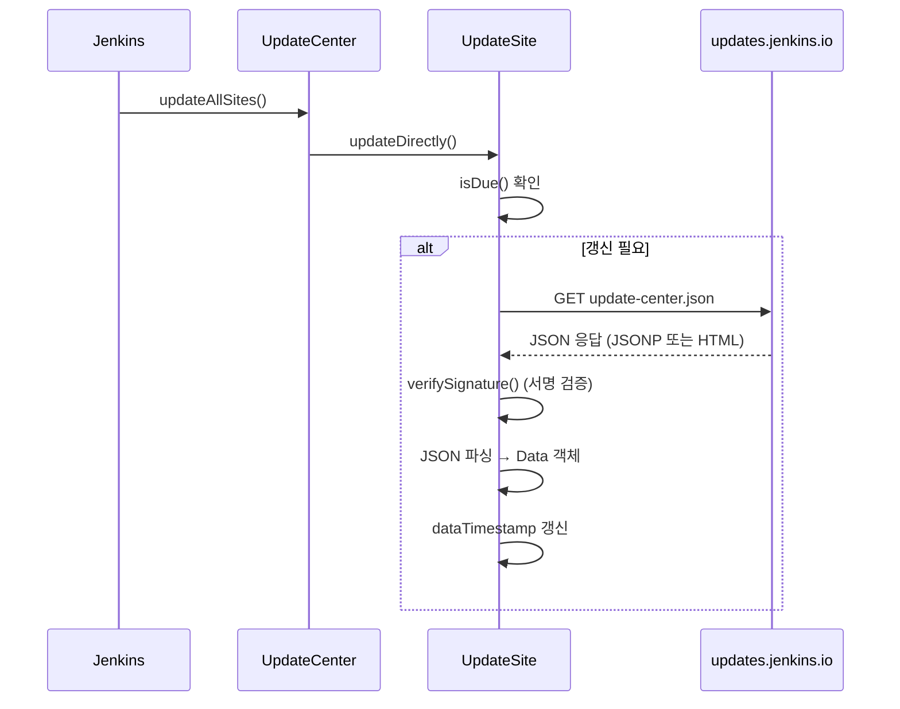
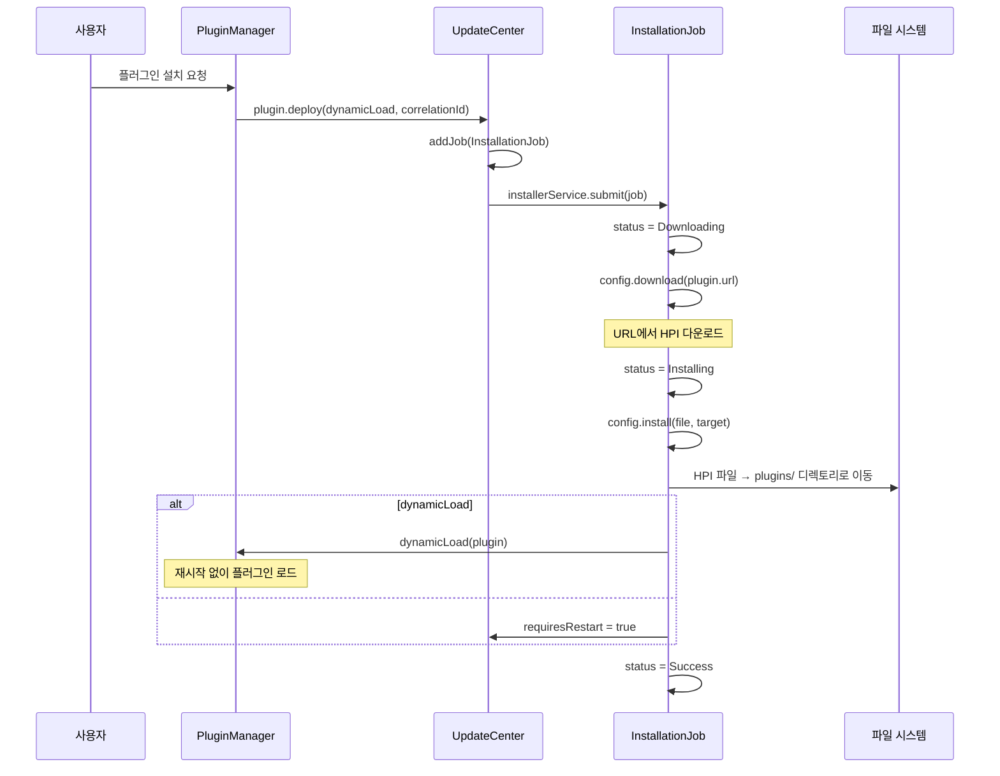

# 23. UpdateCenter 시스템 Deep-Dive

## 1. 개요

Jenkins UpdateCenter는 **플러그인의 검색, 다운로드, 설치, 업데이트, 제거** 및
**Jenkins 코어 업그레이드**를 관리하는 중앙 허브이다.

### 왜(Why) 이 서브시스템이 존재하는가?

Jenkins의 핵심 가치는 **플러그인 생태계**에 있다. 1800개 이상의 플러그인이 존재하며,
이를 효과적으로 관리하려면 다음이 필요하다:

1. **메타데이터 관리**: 사용 가능한 플러그인 목록, 버전, 의존성 정보
2. **다운로드**: 플러그인 JAR/HPI 파일의 안전한 다운로드
3. **설치**: 의존성 해결, 파일 배치, 클래스 로딩
4. **업데이트**: 보안 패치, 새 기능을 위한 업데이트 검사
5. **보안**: 서명 검증으로 변조된 플러그인 설치 방지
6. **진행 상태**: 설치 진행률, 성공/실패 상태 추적

수동으로 플러그인을 다운로드하여 `$JENKINS_HOME/plugins/`에 복사하는 것도 가능하지만,
UpdateCenter는 이 과정을 **자동화, 보안 강화, 의존성 해결**까지 수행한다.

## 2. 핵심 아키텍처

```
┌─────────────────────────────────────────────────────────────┐
│                    Jenkins 마스터                             │
│                                                             │
│  UpdateCenter                                               │
│  ├── sites: PersistedList<UpdateSite>                       │
│  │       │                                                  │
│  │       ├── default (https://updates.jenkins.io/)          │
│  │       └── custom-site (사용자 정의 사이트)                 │
│  │                                                          │
│  ├── jobs: Vector<UpdateCenterJob>                          │
│  │       │                                                  │
│  │       ├── ConnectionCheckJob                             │
│  │       ├── DownloadJob                                    │
│  │       │       ├── InstallationJob (플러그인 설치)          │
│  │       │       └── HudsonUpgradeJob (코어 업그레이드)       │
│  │       └── RestartJenkinsJob                              │
│  │                                                          │
│  ├── installerService (AtmostOneThreadExecutor)             │
│  │       └── 플러그인 설치 실행 (한 번에 하나)                │
│  │                                                          │
│  └── updateService (CachedThreadPool)                       │
│          └── UpdateSite 데이터 갱신 (병렬)                   │
│                                                             │
│  UpdateSite                                                 │
│  ├── id: "default"                                          │
│  ├── url: "https://updates.jenkins.io/update-center.json"   │
│  ├── data: Data (파싱된 메타데이터)                           │
│  │       ├── plugins: Map<String, Plugin>                   │
│  │       ├── core: Entry (Jenkins 코어 정보)                 │
│  │       ├── warnings: List<Warning>                        │
│  │       └── deprecations: Map<String, Deprecation>         │
│  └── dataTimestamp: long                                    │
└─────────────────────────────────────────────────────────────┘

┌─────────────────────────────────────────────────────────────┐
│                  업데이트 서버                                │
│                                                             │
│  https://updates.jenkins.io/                                │
│  ├── update-center.json  (메타데이터 + 서명)                 │
│  ├── download/plugins/   (플러그인 HPI 파일)                 │
│  └── download/war/       (Jenkins WAR 파일)                 │
└─────────────────────────────────────────────────────────────┘
```

## 3. 핵심 클래스 분석

### 3.1 UpdateCenter — 중앙 관리자

**경로**: `core/src/main/java/hudson/model/UpdateCenter.java`

```java
@ExportedBean
public class UpdateCenter extends AbstractModelObject
    implements Loadable, Saveable, OnMaster, StaplerProxy {

    // 기본 업데이트 센터 URL
    // 시스템 프로퍼티로 오버라이드 가능
    private static final String UPDATE_CENTER_URL;  // "https://updates.jenkins.io/"

    // 플러그인 다운로드 읽기 타임아웃 (기본 60초)
    private static final int PLUGIN_DOWNLOAD_READ_TIMEOUT;

    // 기본 사이트 ID
    public static final String ID_DEFAULT;  // "default"

    // 설치 실행기: 한 번에 하나의 설치만 처리
    private final ExecutorService installerService =
        new AtmostOneThreadExecutor(new NamingThreadFactory(
            new DaemonThreadFactory(), "Update center installer thread"));

    // 사이트 데이터 갱신 실행기: 병렬 처리
    protected final ExecutorService updateService =
        Executors.newCachedThreadPool(new NamingThreadFactory(
            new DaemonThreadFactory(), "Update site data downloader"));

    // 작업 목록
    private final Vector<UpdateCenterJob> jobs = new Vector<>();

    // 등록된 UpdateSite 목록
    private final PersistedList<UpdateSite> sites = new PersistedList<>(this);

    // 구성 데이터
    private UpdateCenterConfiguration config;

    // 재시작 필요 여부
    private boolean requiresRestart;
}
```

#### AtmostOneThreadExecutor의 의미

```
설치 요청 1 ──→ ┌───────────────────┐
설치 요청 2 ──→ │ AtmostOneThread   │ ──→ 순차 실행
설치 요청 3 ──→ │ Executor          │
                └───────────────────┘
```

플러그인 설치는 **파일 시스템 작업** (JAR 복사, 압축 해제)이므로
동시에 여러 설치를 실행하면 충돌이 발생할 수 있다.
`AtmostOneThreadExecutor`는 큐에 작업을 넣되 한 번에 하나만 실행한다.

### 3.2 UpdateSite — 업데이트 소스

**경로**: `core/src/main/java/hudson/model/UpdateSite.java`

```java
@ExportedBean
public class UpdateSite {
    private final String id;    // 사이트 식별자
    private final String url;   // update-center.json URL

    private transient volatile long dataTimestamp;  // 데이터 갱신 시각
    private transient volatile long lastAttempt;    // 마지막 갱신 시도
    private transient volatile long retryWindow;    // 재시도 대기 시간
    private transient Data data;                    // 파싱된 메타데이터
}
```

#### Data 클래스 — 파싱된 메타데이터

```java
public final class Data {
    public final long dataTimestamp;
    public final Map<String, Plugin> plugins;  // 플러그인 정보
    public final Entry core;                   // Jenkins 코어 정보
    public final List<Warning> warnings;       // 보안 경고
    public final Map<String, Deprecation> deprecations; // 사용 중단 플러그인
}
```

#### Plugin 클래스 — 플러그인 메타데이터

```java
@ExportedBean
public class Plugin extends Entry {
    @Exported public final String name;
    @Exported public final String version;
    @Exported public final String title;
    @Exported public final String wiki;      // 문서 URL
    @Exported public final String excerpt;   // 설명

    // 의존성
    @Exported public final List<Dependency> dependencies;

    // 호환성 검사
    public boolean isCompatible();
    public boolean isForNewerHudson();
    public boolean isNeededDependenciesForNewerJenkins();

    // 보안 경고
    public boolean fixesSecurityVulnerabilities();

    // 설치 실행
    public Future<UpdateCenterJob> deploy(boolean dynamicLoad, UUID correlationId,
                                          DownloadJob.Completion handler);
}
```

### 3.3 UpdateCenterJob 계층

```
UpdateCenterJob (추상)
│   ├── id: int (고유 ID)
│   ├── type: String
│   ├── site: UpdateSite
│   ├── correlationId: UUID
│   └── run() (실행)
│
├── ConnectionCheckJob
│       └── connectionStates: Map<String, ConnectionStatus>
│
├── DownloadJob (추상)
│   │   ├── status: InstallationStatus
│   │   ├── authentication: Authentication
│   │   └── run() → download → verify → install
│   │
│   ├── InstallationJob
│   │       ├── plugin: Plugin
│   │       ├── dynamicLoad: boolean
│   │       └── run() → 플러그인 설치
│   │
│   └── HudsonUpgradeJob
│           └── run() → Jenkins WAR 업그레이드
│
└── RestartJenkinsJob
        ├── status: RestartJenkinsJobStatus
        └── run() → Jenkins 재시작
```

### 3.4 ConnectionStatus — 연결 상태

```java
enum ConnectionStatus {
    PRECHECK,    // 검사 시작 전
    SKIPPED,     // 검사 건너뜀
    CHECKING,    // 검사 중
    UNCHECKED,   // 미검사
    OK,          // 연결 정상
    FAILED;      // 연결 실패

    static final String INTERNET = "internet";
    static final String UPDATE_SITE = "updatesite";
}
```

## 4. 데이터 흐름

### 4.1 메타데이터 갱신



#### update-center.json 형식

```json
{
  "connectionCheckUrl": "https://www.google.com/",
  "core": {
    "buildDate": "Jan 01, 2024",
    "name": "core",
    "sha1": "...",
    "sha256": "...",
    "url": "https://updates.jenkins.io/download/war/2.462.1/jenkins.war",
    "version": "2.462.1"
  },
  "id": "default",
  "plugins": {
    "git": {
      "dependencies": [
        {"name": "git-client", "optional": false, "version": "4.0.0"}
      ],
      "excerpt": "This plugin integrates Git with Jenkins.",
      "name": "git",
      "title": "Git plugin",
      "url": "https://updates.jenkins.io/download/plugins/git/5.2.0/git.hpi",
      "version": "5.2.0"
    }
  },
  "signature": { ... },
  "updateCenterVersion": "1",
  "warnings": [ ... ]
}
```

### 4.2 플러그인 설치 흐름



### 4.3 다운로드와 검증

```java
// UpdateCenter 내부 DownloadJob.run() 핵심 흐름
public void run() {
    try {
        // 1. 다운로드
        URL src = getURL();
        File dst = download(src);

        // 2. SHA-256 체크섬 검증
        verifyChecksums(dst);

        // 3. 서명 검증
        verifySignature(dst);

        // 4. 설치 (파일 이동)
        install(dst);

        // 5. 상태 업데이트
        status = new Success();
    } catch (Exception e) {
        status = new Failure(e);
    }
}
```

## 5. UpdateCenterConfiguration — 커스텀 설정

```java
public static class UpdateCenterConfiguration {
    // 업데이트 센터 URL
    public String getUpdateCenterUrl() {
        return UPDATE_CENTER_URL;
    }

    // 플러그인 다운로드 URL 변환
    public String getPluginDownloadUrl(String url) {
        return url;  // 기본: 변경 없음
    }

    // 다운로드 실행
    public File download(UpdateCenterJob job, URL src) throws IOException {
        // ProxyConfiguration을 통한 다운로드
        URLConnection con = ProxyConfiguration.open(src);
        con.setReadTimeout(PLUGIN_DOWNLOAD_READ_TIMEOUT);
        // ...
    }

    // 설치 실행
    public void install(File file, File target) {
        // 원자적 파일 이동
        Files.move(file.toPath(), target.toPath(),
            StandardCopyOption.ATOMIC_MOVE);
    }
}
```

## 6. 업데이트 감지와 알림

### 6.1 업데이트 가능한 플러그인 목록

```java
// UpdateCenter.getUpdates()
public List<Plugin> getUpdates() {
    // 모든 사이트에서 설치된 플러그인의 업데이트 확인
    List<Plugin> updates = new ArrayList<>();
    for (UpdateSite site : sites) {
        for (Plugin plugin : site.getUpdates()) {
            updates.add(plugin);
        }
    }
    return updates;
}
```

### 6.2 Badge (알림 배지)

```java
public Badge getBadge() {
    List<Plugin> plugins = getUpdates();
    int size = plugins.size();
    if (size > 0) {
        Badge.Severity severity = Badge.Severity.WARNING;
        int securityFixSize = (int) plugins.stream()
            .filter(Plugin::fixesSecurityVulnerabilities).count();

        if (securityFixSize > 0) {
            severity = Badge.Severity.DANGER;  // 보안 업데이트 → 빨간색
        }
        return new Badge(Integer.toString(size), tooltip, severity);
    }
    return null;
}
```

### 6.3 보안 업데이트 감지

```java
// Plugin.fixesSecurityVulnerabilities()
public boolean fixesSecurityVulnerabilities() {
    // UpdateSite warnings에서 현재 설치된 버전에 해당하는 경고 확인
    // 새 버전이 이 경고를 해결하면 true 반환
}
```

## 7. 코어 업그레이드

### 7.1 HudsonUpgradeJob

```java
// 코어 업그레이드 스케줄
public void doUpgrade(StaplerResponse2 rsp) {
    Jenkins.get().checkPermission(Jenkins.ADMINISTER);
    HudsonUpgradeJob job = new HudsonUpgradeJob(
        getCoreSource(), Jenkins.getAuthentication2());
    if (!Lifecycle.get().canRewriteHudsonWar()) {
        sendError("Jenkins upgrade not supported in this running mode");
        return;
    }
    addJob(job);
}
```

### 7.2 다운그레이드

```java
public boolean isDowngradable() {
    return new File(Lifecycle.get().getHudsonWar() + ".bak").exists();
}
```

업그레이드 시 기존 WAR 파일이 `.bak`으로 백업되므로,
이 파일이 존재하면 다운그레이드가 가능하다.

## 8. 서명 검증

### 8.1 update-center.json 서명

```
┌─────────────────────────────────────────┐
│ update-center.json                      │
│                                         │
│ {                                       │
│   "plugins": { ... },                   │
│   "core": { ... },                      │
│   "signature": {                        │
│     "correct_digest": "sha256:...",     │
│     "correct_digest512": "sha512:...",  │
│     "correct_signature": "...",         │
│     "correct_signature512": "...",      │
│     "certificates": [                   │
│       "-----BEGIN CERTIFICATE-----",    │
│       "..."                             │
│     ]                                   │
│   }                                     │
│ }                                       │
└─────────────────────────────────────────┘
```

`JSONSignatureValidator`가 서명을 검증한다:
1. JSON 데이터의 SHA-256/SHA-512 다이제스트 계산
2. 인증서 체인 검증
3. 서명 검증

### 8.2 플러그인 HPI 체크섬

```
다운로드한 HPI → SHA-256 계산 → update-center.json의 sha256과 비교
```

## 9. 프록시 설정

Jenkins가 프록시 뒤에 있을 때:

```java
// ProxyConfiguration을 통한 연결
URLConnection con = ProxyConfiguration.open(url);
```

프록시 설정은 `$JENKINS_HOME/proxy.xml`에 저장된다.

## 10. 재시작 관리

### 10.1 RestartJenkinsJob

```java
public void doSafeRestart(StaplerRequest2 request, StaplerResponse2 response) {
    Jenkins.get().checkPermission(Jenkins.ADMINISTER);
    synchronized (jobs) {
        if (!isRestartScheduled()) {
            addJob(new RestartJenkinsJob(getCoreSource()));
        }
    }
}

public void doCancelRestart(StaplerResponse2 response) {
    Jenkins.get().checkPermission(Jenkins.ADMINISTER);
    synchronized (jobs) {
        for (UpdateCenterJob job : jobs) {
            if (job instanceof RestartJenkinsJob) {
                ((RestartJenkinsJob) job).cancel();
            }
        }
    }
}
```

### 10.2 재시작 필요 여부

```java
@Exported
public boolean isRestartRequiredForCompletion() {
    return requiresRestart;
}

public boolean isRestartScheduled() {
    for (UpdateCenterJob job : getJobs()) {
        if (job instanceof RestartJenkinsJob rj) {
            if (rj.status instanceof Pending || rj.status instanceof Running) {
                return true;
            }
        }
    }
    return false;
}
```

## 11. 설치 상태 지속성

플러그인 설치 중 Jenkins가 재시작되면 설치를 재개할 수 있도록
상태를 파일에 저장한다.

```java
public synchronized void persistInstallStatus() {
    List<UpdateCenterJob> jobs = getJobs();
    boolean activeInstalls = false;
    for (UpdateCenterJob job : jobs) {
        if (job instanceof InstallationJob ij) {
            if (!ij.status.isSuccess()) {
                activeInstalls = true;
            }
        }
    }
    if (activeInstalls) {
        InstallUtil.persistInstallStatus(jobs);
    } else {
        InstallUtil.clearInstallStatus();
    }
}
```

## 12. 커스텀 UpdateCenter

### 12.1 시스템 프로퍼티로 교체

```
-Dhudson.model.UpdateCenter.className=com.myco.MyUpdateCenter
```

요구사항:
- `UpdateCenter`를 상속
- `UpdateCenter()` 기본 생성자
- `UpdateCenter(UpdateCenterConfiguration)` 생성자

### 12.2 커스텀 UpdateSite 추가

```groovy
// init.groovy.d/add-update-site.groovy
import hudson.model.*

def updateCenter = Jenkins.instance.updateCenter
def site = new UpdateSite("my-site", "https://my-updates.example.com/update-center.json")
updateCenter.sites.add(site)
```

## 13. 설정 옵션 정리

| 시스템 프로퍼티 | 설명 | 기본값 |
|----------------|------|--------|
| `hudson.model.UpdateCenter.updateCenterUrl` | 업데이트 센터 URL | `https://updates.jenkins.io/` |
| `hudson.model.UpdateCenter.defaultUpdateSiteId` | 기본 사이트 ID | `default` |
| `hudson.model.UpdateCenter.className` | 커스텀 UpdateCenter 클래스 | null |
| `hudson.model.UpdateCenter.pluginDownloadReadTimeoutSeconds` | 다운로드 타임아웃(초) | `60` |
| `hudson.model.DownloadService.signatureCheck` | 서명 검증 활성화 | `true` |

## 14. REST API

| 엔드포인트 | 메서드 | 설명 |
|-----------|--------|------|
| `/updateCenter/api/json` | GET | 작업 목록, 사이트 목록 |
| `/updateCenter/connectionStatus` | GET | 연결 상태 확인 |
| `/updateCenter/installStatus` | GET | 설치 진행 상태 |
| `/updateCenter/incompleteInstallStatus` | GET | 미완료 설치 상태 |
| `/updateCenter/upgrade` | POST | Jenkins 코어 업그레이드 |
| `/updateCenter/safeRestart` | POST | 안전 재시작 |
| `/updateCenter/cancelRestart` | POST | 재시작 취소 |
| `/updateCenter/invalidateData` | POST | 캐시 무효화 |

## 15. 데이터 캐시 전략

```
┌──────────────────────────────────────────────────┐
│ $JENKINS_HOME/updates/                           │
│                                                  │
│ ├── default.json       # 기본 사이트 데이터 캐시  │
│ ├── hudson.tasks.Maven.xml  # 도구 업데이트 캐시  │
│ └── ...                                          │
│                                                  │
│ 갱신 주기:                                        │
│ ├── isDue() 확인: 마지막 갱신 + retryWindow       │
│ ├── retryWindow: 실패 시 점진적으로 증가          │
│ └── 수동 갱신: "Check now" 버튼                   │
└──────────────────────────────────────────────────┘
```

## 16. 정리

Jenkins UpdateCenter 시스템의 핵심 설계 원칙:

1. **멀티 사이트**: 여러 `UpdateSite`를 등록하여 다양한 소스에서 플러그인 검색
2. **비동기 작업**: 모든 다운로드/설치가 백그라운드에서 실행
3. **순차 설치**: `AtmostOneThreadExecutor`로 파일 시스템 충돌 방지
4. **서명 검증**: update-center.json과 플러그인 HPI 모두 검증
5. **의존성 해결**: 플러그인 의존성을 자동으로 해결하고 함께 설치
6. **상태 지속성**: 설치 중 재시작되어도 상태를 유지하여 재개 가능
7. **보안 알림**: 보안 업데이트가 있으면 Badge로 즉시 알림
8. **코어 업그레이드**: 플러그인뿐 아니라 Jenkins 자체도 업그레이드 관리
9. **다운그레이드**: WAR 백업으로 문제 발생 시 롤백 지원
