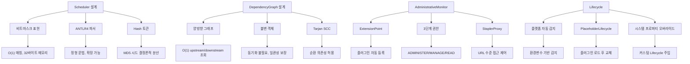

# 27. Scheduler + DependencyGraph + AdministrativeMonitor + Lifecycle 심층 분석

> Jenkins 소스 기준: `hudson/scheduler/`, `hudson/model/DependencyGraph.java`, `hudson/model/AdministrativeMonitor.java`, `hudson/lifecycle/`
> 작성일: 2026-03-08

---

## 목차
1. [개요](#1-개요)
2. [Part A: Scheduler — Cron 파서와 스케줄링](#2-part-a-scheduler--cron-파서와-스케줄링)
3. [CronTab: 비트마스크 기반 스케줄 표현](#3-crontab-비트마스크-기반-스케줄-표현)
4. [Hash: 결정론적 부하 분산](#4-hash-결정론적-부하-분산)
5. [ceil/floor: 다음/이전 실행 시점 계산](#5-ceilfloor-다음이전-실행-시점-계산)
6. [CronTabList: 다중 스케줄 합성](#6-crontablist-다중-스케줄-합성)
7. [Part B: DependencyGraph — 빌드 의존성 그래프](#7-part-b-dependencygraph--빌드-의존성-그래프)
8. [양방향 그래프 구축](#8-양방향-그래프-구축)
9. [Tarjan SCC 기반 위상 정렬](#9-tarjan-scc-기반-위상-정렬)
10. [DependencyGroup: 다중 엣지 관리](#10-dependencygroup-다중-엣지-관리)
11. [Part C: AdministrativeMonitor — 관리자 알림 시스템](#11-part-c-administrativemonitor--관리자-알림-시스템)
12. [Part D: Lifecycle — 플랫폼별 생명주기 관리](#12-part-d-lifecycle--플랫폼별-생명주기-관리)
13. [설계 결정과 교훈](#13-설계-결정과-교훈)

---

## 1. 개요

이 문서는 Jenkins 코어의 **인프라 서브시스템** 네 가지를 분석한다:

- **Scheduler**: 크론탭(Crontab) 파싱 및 스케줄링 엔진. 빌드 트리거의 시간 기반 스케줄링 담당
- **DependencyGraph**: 프로젝트 간 빌드 의존성을 양방향 그래프로 관리. Tarjan SCC 알고리즘으로 위상 정렬
- **AdministrativeMonitor**: 관리자에게 시스템 상태를 알려주는 ExtensionPoint 기반 알림 프레임워크
- **Lifecycle**: 플랫폼별(Windows/Unix/systemd/Solaris SMF) Jenkins 시작/재시작/업그레이드 관리

### 왜 이 네 서브시스템을 함께 분석하는가?

```
┌──────────────────────────────────────────────────────────────┐
│           Jenkins 인프라 서브시스템 관계도                      │
│                                                               │
│  Scheduler (Cron 파서)                                        │
│       │ "매시간 H분에 빌드"                                   │
│       ▼                                                       │
│  빌드 트리거 발동                                             │
│       │                                                       │
│       ▼                                                       │
│  DependencyGraph                                              │
│       │ "A 빌드 완료 → B, C 빌드 트리거"                     │
│       ▼                                                       │
│  빌드 체인 실행                                               │
│       │                                                       │
│       ├── 문제 발생 시                                        │
│       │   ▼                                                   │
│       │   AdministrativeMonitor                               │
│       │   "관리자에게 경고 표시"                               │
│       │                                                       │
│       └── 업그레이드/재시작 필요 시                            │
│           ▼                                                   │
│           Lifecycle                                            │
│           "jenkins.war 교체 → 재시작"                         │
│                                                               │
│  네 시스템은 "빌드 스케줄링 → 실행 → 모니터링 → 유지보수"     │
│  라는 Jenkins 운영 사이클의 핵심 인프라이다                    │
└──────────────────────────────────────────────────────────────┘
```

### 소스 경로

```
core/src/main/java/hudson/scheduler/
├── CronTab.java           # Cron 테이블 (608줄)
├── CronTabList.java       # OR-ed CronTab 리스트 (163줄)
├── Hash.java              # 결정론적 해시 분산 (98줄)
├── CrontabLexer.java      # ANTLR4 렉서 (자동 생성)
├── CrontabParser.java     # ANTLR4 파서 (자동 생성)
├── BaseParser.java        # 바운드 상수
└── RareOrImpossibleDateException.java

core/src/main/java/hudson/model/
├── DependencyGraph.java         # 빌드 의존성 그래프 (465줄)
├── AdministrativeMonitor.java   # 관리자 알림 (268줄)

core/src/main/java/hudson/lifecycle/
├── Lifecycle.java               # 추상 생명주기 (351줄)
├── UnixLifecycle.java           # Unix exec 재시작
├── SystemdLifecycle.java        # systemd 통합
├── SolarisSMFLifecycle.java     # Solaris SMF 통합
├── ExitLifecycle.java           # 종료 전용
└── RestartNotSupportedException.java
```

---

## 2. Part A: Scheduler -- Cron 파서와 스케줄링

### Jenkins의 Cron이 특별한 이유

Jenkins는 표준 Unix crontab 문법을 확장하여 **H(Hash) 토큰**을 추가했다. 이는 "매시간"을 "매시간 분산된 특정 분"으로 변환하여 **동시 빌드 폭주(thundering herd)**를 방지한다.

```
┌──────────────────────────────────────────────────────────────┐
│              표준 cron vs Jenkins H 토큰                       │
│                                                               │
│  표준:  0 * * * *    → 매시간 0분 (모든 잡이 동시 실행!)      │
│                                                               │
│  Jenkins: H * * * *  → 매시간 해시 기반 분산된 분              │
│           - 잡 "build-A": 매시간 17분                         │
│           - 잡 "build-B": 매시간 43분                         │
│           - 잡 "build-C": 매시간 8분                          │
│                                                               │
│  H/15 * * * *  → 0, 15, 30, 45분 중 하나 (해시로 결정)       │
│  H(0-7) * * * *  → 0~7분 범위에서 해시로 결정                │
│                                                               │
│  @daily  → H H * * *  (하루에 한 번, 해시로 분산된 시간)      │
│  @weekly → H H * * H  (주에 한 번, 해시로 분산된 요일/시간)   │
└──────────────────────────────────────────────────────────────┘
```

---

## 3. CronTab: 비트마스크 기반 스케줄 표현

### 핵심 데이터 구조

```java
// 소스: hudson/scheduler/CronTab.java:48-59
public final class CronTab {
    /**
     * bits[0]: minutes     (0-59 → 비트 0-59)
     * bits[1]: hours       (0-23 → 비트 0-23)
     * bits[2]: days        (1-31 → 비트 1-31)
     * bits[3]: months      (1-12 → 비트 1-12)
     *
     * false:not scheduled <-> true scheduled
     */
    final long[] bits = new long[4];

    int dayOfWeek;          // 7비트 (0=일, 1=월, ..., 6=토)
    private String spec;
    private String specTimezone;
}
```

### 왜 비트마스크인가?

| 선택지 | 장단점 |
|--------|--------|
| **비트마스크 (채택)** | O(1) 매칭, 메모리 최소 (long 4개 = 32바이트), 비트 연산으로 빠른 다음 시간 계산 |
| Set<Integer> | 가독성 좋으나 매칭마다 HashSet.contains() 호출, 메모리 낭비 |
| boolean[] 배열 | 단순하지만 비트 연산 불가, 다음 시간 계산에 선형 스캔 필요 |

`long`은 64비트이므로 분(0-59), 시(0-23), 일(1-31), 월(1-12) 모두를 하나의 `long` 값에 표현할 수 있다. 예를 들어 "0,15,30,45분"은:

```
bits[0] = (1L << 0) | (1L << 15) | (1L << 30) | (1L << 45)
        = 0x0000_2000_8000_8001
```

### 비트 체크 메서드

```java
// 소스: hudson/scheduler/CronTab.java:504-506
private boolean checkBits(long bitMask, int n) {
    return (bitMask | (1L << n)) == bitMask;
}
```

이 한 줄이 "n번째 비트가 설정되어 있는가?"를 O(1)에 판단한다. `bitMask | (1L << n) == bitMask`는 n번째 비트가 이미 1이면 OR 연산 후에도 변화가 없으므로 true를 반환한다.

### ANTLR4 파서 기반 구문 분석

```java
// 소스: hudson/scheduler/CronTab.java:127-144
private void set(String format, int line, Hash hash, String timezone) {
    CrontabLexer lexer = new CrontabLexer(CharStreams.fromString(format));
    lexer.removeErrorListeners();
    lexer.addErrorListener(new JenkinsANTLRErrorListener());
    lexer.setLine(line);
    CrontabParser parser = new CrontabParser(new CommonTokenStream(lexer));
    parser.removeErrorListeners();
    parser.addErrorListener(new JenkinsANTLRErrorListener(parser::getErrorMessage));
    parser.setHash(hash);
    spec = format;
    specTimezone = timezone;

    parser.startRule(this);
    // 일요일 비트 7 → 비트 0으로 복사 (cron에서 0과 7 모두 일요일)
    if ((dayOfWeek & (1 << 7)) != 0) {
        dayOfWeek |= 1;           // 비트 7 → 비트 0 복사
        dayOfWeek &= ~(1 << 7);   // 비트 7 제거
    }
}
```

```
┌──────────────────────────────────────────────────────────────┐
│               ANTLR4 파싱 파이프라인                           │
│                                                               │
│  "H/15 * * * 1-5"                                            │
│       │                                                       │
│       ▼                                                       │
│  CrontabLexer (ANTLR4 자동생성)                              │
│       │ 토큰화: H, /, 15, *, *, *, 1, -, 5                   │
│       ▼                                                       │
│  CrontabParser (ANTLR4 자동생성)                             │
│       │ startRule(cronTab)                                    │
│       │                                                       │
│       ├── H/15 → Hash.next(60) = 23 (예시)                  │
│       │   → 23, 38, 53, 8 분이 설정됨                        │
│       │   → bits[0] |= (1L<<23)|(1L<<38)|(1L<<53)|(1L<<8)   │
│       │                                                       │
│       ├── * → bits[1] = 모든 시간 비트 설정                  │
│       ├── * → bits[2] = 모든 일 비트 설정                    │
│       ├── * → bits[3] = 모든 월 비트 설정                    │
│       └── 1-5 → dayOfWeek = 0b0111110 (월~금)               │
│                                                               │
│  결과: CronTab.bits[] + dayOfWeek 설정 완료                  │
└──────────────────────────────────────────────────────────────┘
```

### check(): 현재 시간 매칭

```java
// 소스: hudson/scheduler/CronTab.java:150-172
boolean check(Calendar cal) {
    Calendar checkCal = cal;

    // 타임존 지정 시 변환
    if (specTimezone != null && !specTimezone.isEmpty()) {
        Calendar tzCal = Calendar.getInstance(TimeZone.getTimeZone(specTimezone));
        tzCal.setTime(cal.getTime());
        checkCal = tzCal;
    }

    if (!checkBits(bits[0], checkCal.get(MINUTE)))       return false;
    if (!checkBits(bits[1], checkCal.get(HOUR_OF_DAY)))  return false;
    if (!checkBits(bits[2], checkCal.get(DAY_OF_MONTH))) return false;
    if (!checkBits(bits[3], checkCal.get(MONTH) + 1))    return false;  // Calendar.MONTH는 0-based
    if (!checkBits(dayOfWeek, checkCal.get(Calendar.DAY_OF_WEEK) - 1)) return false;

    return true;
}
```

5개의 비트 체크가 모두 true일 때만 매칭된다. 주목할 점은 `MONTH + 1` (Calendar는 0-based, cron은 1-based)과 `DAY_OF_WEEK - 1` (Calendar는 1=Sunday, cron은 0=Sunday) 변환이다.

---

## 4. Hash: 결정론적 부하 분산

### MD5 시드 기반 난수 생성

```java
// 소스: hudson/scheduler/Hash.java:45-77
public abstract class Hash {
    public abstract int next(int n);

    public static Hash from(String seed) {
        MessageDigest md5 = getMd5();
        md5.update(seed.getBytes(StandardCharsets.UTF_8));
        byte[] digest = md5.digest();

        // 16바이트 다이제스트를 8바이트로 XOR 폴딩
        for (int i = 8; i < digest.length; i++)
            digest[i % 8] ^= digest[i];

        // 8바이트를 long으로 변환
        long l = 0;
        for (int i = 0; i < 8; i++)
            l = (l << 8) + (digest[i] & 0xFF);

        // Random의 시드로 사용
        final Random rnd = new Random(l);
        return new Hash() {
            @Override
            public int next(int n) {
                return rnd.nextInt(n);
            }
        };
    }

    public static Hash zero() {
        return ZERO;  // 항상 0 반환 (테스트용)
    }
}
```

### 왜 MD5를 사용하는가?

```
┌──────────────────────────────────────────────────────────────┐
│              Hash 결정론적 분산 원리                           │
│                                                               │
│  잡 이름 "my-build-project"                                   │
│       │                                                       │
│       ▼ MD5 해시                                              │
│  d41d8cd98f00b204e9800998ecf8427e (예시)                     │
│       │                                                       │
│       ▼ XOR 폴딩 (16B → 8B)                                 │
│  long seed = 0xABCD1234...                                   │
│       │                                                       │
│       ▼ Random(seed)                                          │
│  rnd.nextInt(60) = 23  ← @daily의 분                         │
│  rnd.nextInt(24) = 14  ← @daily의 시                         │
│                                                               │
│  핵심 속성:                                                   │
│  1. 같은 잡 이름 → 항상 같은 시간 (결정론적)                 │
│  2. 다른 잡 이름 → 다른 시간 (분산)                          │
│  3. 잡 설정 변경해도 시간 불변 (안정적)                       │
│                                                               │
│  MD5를 보안이 아닌 분산 용도로 사용.                          │
│  TODO JENKINS-60563: MD5를 다른 해시로 교체 예정              │
└──────────────────────────────────────────────────────────────┘
```

| 속성 | 설명 |
|------|------|
| **결정론적** | 동일 잡 이름이면 재시작 후에도 같은 시간에 실행 |
| **균일 분산** | MD5 + Random으로 잡들이 60분에 걸쳐 균일하게 분산 |
| **안정적** | 잡 설정 변경(빌드 스크립트 수정 등)해도 스케줄 시간 불변 |
| **비보안** | MD5의 암호학적 약점은 무관. 부하 분산 목적만 충족하면 됨 |

---

## 5. ceil/floor: 다음/이전 실행 시점 계산

### CalendarField 계층 구조

```java
// 소스: hudson/scheduler/CronTab.java:174-342
private abstract static class CalendarField {
    final int field;                        // Calendar 필드 ID
    final CalendarField lowerField;          // 하위 필드 (초기화 대상)
    final int offset;                        // cron ↔ Calendar 오프셋
    final int min;                           // 리셋 시 최소값
    final boolean redoAdjustmentIfModified;  // 수정 시 재조정 필요?

    abstract long bits(CronTab c);
    abstract void rollUp(Calendar cal, int i);
}
```

```
┌──────────────────────────────────────────────────────────┐
│          CalendarField 계층 구조                           │
│                                                           │
│  MONTH (bits[3])                                          │
│    │ rollUp → cal.add(YEAR, 1)                           │
│    ▼                                                      │
│  DAY_OF_MONTH (bits[2])         DAY_OF_WEEK (dayOfWeek)  │
│    │ rollUp → cal.add(MONTH, 1) │ rollUp → +7일         │
│    ▼                              ▼                       │
│  HOUR (bits[1])                                           │
│    │ rollUp → cal.add(DAY, 1)                            │
│    ▼                                                      │
│  MINUTE (bits[0])                                         │
│    │ rollUp → cal.add(HOUR, 1)                           │
│    ▼                                                      │
│  (없음)                                                   │
│                                                           │
│  ADJUST_ORDER = [MONTH, DAY_OF_MONTH, DAY_OF_WEEK,      │
│                  HOUR, MINUTE]                             │
│                                                           │
│  상위 필드부터 조정하여 하위 필드를 초기화하는 전략       │
└──────────────────────────────────────────────────────────┘
```

### ceil(): 다음 실행 시점 계산 알고리즘

```java
// 소스: hudson/scheduler/CronTab.java:373-418
public Calendar ceil(Calendar cal) {
    if (cal.get(Calendar.SECOND) > 0 || cal.get(Calendar.MILLISECOND) > 0) {
        cal.set(Calendar.SECOND, 0);
        cal.set(Calendar.MILLISECOND, 0);
        cal.add(Calendar.MINUTE, 1);
    }
    Calendar twoYearsFuture = (Calendar) cal.clone();
    twoYearsFuture.add(Calendar.YEAR, 2);

    OUTER:
    while (true) {
        if (cal.compareTo(twoYearsFuture) > 0) {
            throw new RareOrImpossibleDateException();  // 2년 내 매칭 없음
        }
        for (CalendarField f : CalendarField.ADJUST_ORDER) {
            int cur = f.valueOf(cal);
            int next = f.ceil(this, cur);
            if (cur == next) continue;   // 이 필드는 OK, 다음으로

            // 하위 필드 모두 초기화
            for (CalendarField l = f.lowerField; l != null; l = l.lowerField)
                l.clear(cal);

            if (next < 0) {
                // 이 필드에서 매칭 없음 → 상위 필드 롤업
                f.rollUp(cal, 1);
                f.setTo(cal, f.first(this));
                continue OUTER;  // 처음부터 다시
            } else {
                f.setTo(cal, next);
                if (f.valueOf(cal) != next) {
                    // 설정한 값과 다름 (예: 2월 31일 → 3월 3일)
                    f.rollUp(cal, 1);
                    f.setTo(cal, f.first(this));
                    continue OUTER;
                }
                if (f.redoAdjustmentIfModified)
                    continue OUTER;  // DAY_OF_MONTH/WEEK 수정 시 재조정
            }
        }
        return cal;  // 모든 필드 조정 완료
    }
}
```

### ceil 알고리즘 동작 예시

```
┌──────────────────────────────────────────────────────────┐
│  예시: "30 14 1 * *" (매월 1일 14:30)                     │
│  현재: 2026-03-08 15:00                                   │
│                                                           │
│  반복 1:                                                  │
│  MONTH: cur=3, next=3 (3월 비트 있음) → OK                │
│  DAY:   cur=8, next=-1 (1일만 설정, 8>1이므로 없음)      │
│         → rollUp(MONTH, 1) → 4월                         │
│         → setTo(DAY, first=1) → 4월 1일                  │
│         → continue OUTER                                  │
│                                                           │
│  반복 2:                                                  │
│  MONTH: cur=4, next=4 → OK                               │
│  DAY:   cur=1, next=1 → OK                               │
│  HOUR:  cur=0, next=14 → setTo(14), clear(MINUTE→0)      │
│  MINUTE: cur=0, next=30 → setTo(30)                      │
│                                                           │
│  결과: 2026-04-01 14:30                                   │
└──────────────────────────────────────────────────────────┘
```

### 왜 2년 제한인가?

`RareOrImpossibleDateException`은 2년 내에 매칭 날짜가 없으면 발생한다. 예를 들어 "31 * 31 2 *" (2월 31일)은 절대 발생하지 않는 날짜이다. 무한 루프를 방지하면서도 합리적인 범위(윤년 포함)를 허용한다.

---

## 6. CronTabList: 다중 스케줄 합성

### OR 결합 로직

```java
// 소스: hudson/scheduler/CronTabList.java:44-60
public final class CronTabList {
    private final Vector<CronTab> tabs;

    public synchronized boolean check(Calendar cal) {
        for (CronTab tab : tabs) {
            if (tab.check(cal))
                return true;    // 하나라도 매칭되면 true (OR)
        }
        return false;
    }
}
```

### TZ= 타임존 지원

```java
// 소스: hudson/scheduler/CronTabList.java:106-136
public static CronTabList create(String format, Hash hash) {
    Vector<CronTab> r = new Vector<>();
    int lineNumber = 0;
    String timezone = null;

    for (String line : format.split("\\r?\\n")) {
        lineNumber++;
        line = line.trim();

        // 첫 줄이 TZ= 으로 시작하면 타임존 설정
        if (lineNumber == 1 && line.startsWith("TZ=")) {
            final String timezoneString = line.replace("TZ=", "");
            timezone = getValidTimezone(timezoneString);
            if (timezone != null) {
                LOGGER.log(Level.CONFIG, "CRON with timezone {0}", timezone);
            } else {
                throw new ANTLRException("Invalid timezone '" + timezoneString + "'");
            }
            continue;
        }

        if (line.isEmpty() || line.startsWith("#"))
            continue;   // 빈 줄, 주석 무시

        r.add(new CronTab(line, lineNumber, hash, timezone));
    }
    return new CronTabList(r);
}
```

```
┌──────────────────────────────────────────────────────────┐
│           CronTabList 파싱 예시                            │
│                                                           │
│  입력:                                                    │
│  TZ=Asia/Seoul                                           │
│  # 평일 빌드                                              │
│  H/30 8-18 * * 1-5                                       │
│  # 야간 전체 빌드                                         │
│  H 2 * * *                                               │
│                                                           │
│  파싱 결과:                                               │
│  timezone = "Asia/Seoul"                                  │
│  tabs[0] = CronTab("H/30 8-18 * * 1-5", timezone)       │
│  tabs[1] = CronTab("H 2 * * *", timezone)               │
│                                                           │
│  check(cal):                                              │
│  tabs[0].check(cal) || tabs[1].check(cal)                │
└──────────────────────────────────────────────────────────┘
```

### checkSanity(): 구문은 맞지만 의미가 이상한 경우 경고

```java
// 소스: hudson/scheduler/CronTab.java:531-562
public String checkSanity() {
    OUTER: for (int i = 0; i < 5; i++) {
        long bitMask = i < 4 ? bits[i] : (long) dayOfWeek;
        for (int j = BaseParser.LOWER_BOUNDS[i]; j <= BaseParser.UPPER_BOUNDS[i]; j++) {
            if (!checkBits(bitMask, j)) {
                // 이 랭크에 빈 비트가 있음 (= 특정 값만 설정)
                if (i > 0)
                    return "Do you really mean every minute? Use 'H " + ...;
                break OUTER;
            }
        }
    }
    // ...
    String hashified = hashify(spec);
    if (hashified != null) {
        return "Spread load by using '" + hashified + "' rather than '" + spec + "'";
    }
    return null;
}
```

예를 들어 `* 0 * * *` (매일 0시 **매분**)은 구문상 정확하지만, 사용자가 원한 것은 `H 0 * * *` (매일 0시 특정 분 한 번)일 가능성이 높다. `checkSanity()`가 이를 감지하여 경고한다.

### hashify(): H 토큰 제안

```java
// 소스: hudson/scheduler/CronTab.java:570-594
public static String hashify(String spec) {
    if (spec.contains("H")) {
        return null;     // 이미 H 사용 중이면 경고 불필요
    } else if (spec.startsWith("*/")) {
        return "H" + spec.substring(1);    // "*/15" → "H/15"
    } else if (spec.matches("\\d+ .+")) {
        return "H " + spec.substring(spec.indexOf(' ') + 1);  // "0 ..." → "H ..."
    } else {
        // "0,15,30,45 ..." → "H/15 ..."
        Matcher m = Pattern.compile("0,(\\d+)(,\\d+)*( .+)").matcher(spec);
        if (m.matches()) {
            int period = Integer.parseInt(m.group(1));
            // ... 주기 검증
            return "H/" + period + m.group(3);
        }
        return null;
    }
}
```

---

## 7. Part B: DependencyGraph -- 빌드 의존성 그래프

### DependencyGraph란?

Jenkins에서 프로젝트 A의 빌드 완료 후 프로젝트 B가 자동으로 트리거되는 관계를 관리한다. 이 관계를 **양방향 그래프**로 구축하여 효율적인 탐색을 지원한다.

```java
// 소스: hudson/model/DependencyGraph.java:67-77
public class DependencyGraph implements Comparator<AbstractProject> {
    private Map<AbstractProject, List<DependencyGroup>> forward = new HashMap<>();
    private Map<AbstractProject, List<DependencyGroup>> backward = new HashMap<>();

    private transient Map<Class<?>, Object> computationalData;
    private boolean built;

    private Comparator<AbstractProject<?, ?>> topologicalOrder;
    private List<AbstractProject<?, ?>> topologicallySorted;
}
```

### 왜 양방향인가?

```
┌──────────────────────────────────────────────────────────────┐
│             양방향 그래프의 필요성                              │
│                                                               │
│  forward (downstream 방향):                                   │
│  A → [B, C]                                                   │
│  B → [D]                                                      │
│                                                               │
│  backward (upstream 방향):                                    │
│  B → [A]                                                      │
│  C → [A]                                                      │
│  D → [B]                                                      │
│                                                               │
│  용도:                                                        │
│  - forward: "A 빌드 완료 → B, C 트리거" (빌드 체인)          │
│  - backward: "D의 의존성은?" (UI에서 upstream 표시)           │
│                                                               │
│  단방향만 있으면 backward 계산에 O(전체 프로젝트) 필요        │
│  양방향이면 O(1) 조회                                         │
└──────────────────────────────────────────────────────────────┘
```

---

## 8. 양방향 그래프 구축

### build(): 그래프 구축 과정

```java
// 소스: hudson/model/DependencyGraph.java:85-98
public void build() {
    // SYSTEM2 권한으로 실행 (모든 프로젝트 접근 보장)
    try (ACLContext ctx = ACL.as2(ACL.SYSTEM2)) {
        this.computationalData = new HashMap<>();

        // 모든 AbstractProject를 순회하며 의존성 수집
        for (AbstractProject p : Jenkins.get().allItems(AbstractProject.class))
            p.buildDependencyGraph(this);

        forward = finalize(forward);     // 정렬 + 불변화
        backward = finalize(backward);
        topologicalDagSort();             // Tarjan SCC로 위상 정렬
        this.computationalData = null;    // 임시 데이터 해제
        built = true;
    }
}
```

```
┌──────────────────────────────────────────────────────────────┐
│              그래프 구축 시퀀스                                 │
│                                                               │
│  Jenkins.getDependencyGraph()                                 │
│       │                                                       │
│       ▼                                                       │
│  new DependencyGraph()                                        │
│       │                                                       │
│       ▼                                                       │
│  build()                                                      │
│       │                                                       │
│       ├── 1. ACL.SYSTEM2 권한 획득                            │
│       │   └── 현재 사용자 권한에 관계없이                     │
│       │       모든 프로젝트를 볼 수 있도록                    │
│       │                                                       │
│       ├── 2. allItems(AbstractProject.class)                  │
│       │   └── Jenkins 인스턴스의 모든 프로젝트 순회           │
│       │                                                       │
│       ├── 3. p.buildDependencyGraph(this)                     │
│       │   └── 각 프로젝트가 자신의 downstream 선언           │
│       │       → addDependency(upstream, downstream)          │
│       │       → forward/backward 맵에 양방향 추가            │
│       │                                                       │
│       ├── 4. finalize()                                       │
│       │   └── 이름순 정렬 + Collections.unmodifiable 래핑     │
│       │                                                       │
│       └── 5. topologicalDagSort()                             │
│           └── Tarjan SCC 알고리즘으로 위상 정렬               │
│                                                               │
│  결과: 불변(immutable) 그래프 객체                            │
└──────────────────────────────────────────────────────────────┘
```

### 왜 ACL.SYSTEM2 권한이 필요한가?

의존성 그래프는 **전체 시스템**의 프로젝트 관계를 표현한다. 현재 사용자가 일부 프로젝트에 대한 읽기 권한이 없더라도, 그래프에서 누락되면 빌드 체인이 끊긴다. 따라서 시스템 권한으로 모든 프로젝트를 순회한다.

### addDependency: 양방향 엣지 추가

```java
// 소스: hudson/model/DependencyGraph.java:231-236
public void addDependency(Dependency dep) {
    if (built)
        throw new IllegalStateException();  // 불변성 보장
    add(forward, dep.getUpstreamProject(), dep);
    add(backward, dep.getDownstreamProject(), dep);
}
```

```java
// 소스: hudson/model/DependencyGraph.java:323-334
private void add(Map<AbstractProject, List<DependencyGroup>> map,
                 AbstractProject key, Dependency dep) {
    List<DependencyGroup> set = map.computeIfAbsent(key, k -> new ArrayList<>());
    for (DependencyGroup d : set) {
        // 동일한 두 프로젝트 간 기존 엣지가 있으면 그룹에 추가
        if (d.getUpstreamProject() == dep.getUpstreamProject()
            && d.getDownstreamProject() == dep.getDownstreamProject()) {
            d.add(dep);
            return;
        }
    }
    // 새 엣지이면 새 DependencyGroup 생성
    set.add(new DependencyGroup(dep));
}
```

---

## 9. Tarjan SCC 기반 위상 정렬

### topologicalDagSort() 구현

```java
// 소스: hudson/model/DependencyGraph.java:105-136
private void topologicalDagSort() {
    DirectedGraph<AbstractProject> g = new DirectedGraph<>() {
        @Override
        protected Collection<AbstractProject> nodes() {
            final Set<AbstractProject> nodes = new HashSet<>();
            nodes.addAll(forward.keySet());
            nodes.addAll(backward.keySet());
            return nodes;
        }

        @Override
        protected Collection<AbstractProject> forward(AbstractProject node) {
            return getDownstream(node);
        }
    };

    List<SCC<AbstractProject>> sccs = g.getStronglyConnectedComponents();

    final Map<AbstractProject, Integer> topoOrder = new HashMap<>();
    topologicallySorted = new ArrayList<>();
    int idx = 0;
    for (SCC<AbstractProject> scc : sccs) {
        for (AbstractProject n : scc) {
            topoOrder.put(n, idx++);
            topologicallySorted.add(n);
        }
    }

    topologicalOrder = Comparator.comparingInt(topoOrder::get);
    topologicallySorted = Collections.unmodifiableList(topologicallySorted);
}
```

### 왜 Tarjan SCC인가?

```
┌──────────────────────────────────────────────────────────────┐
│          Tarjan SCC 알고리즘을 사용하는 이유                   │
│                                                               │
│  빌드 의존성 그래프에 순환이 있을 수 있다:                    │
│                                                               │
│  A → B → C → A  (순환!)                                      │
│                                                               │
│  일반 위상 정렬은 DAG만 처리할 수 있다.                       │
│  Tarjan SCC는:                                                │
│  1. 강하게 연결된 컴포넌트 (순환 그룹)를 식별                 │
│  2. SCC를 하나의 노드로 축약                                  │
│  3. 축약된 DAG에서 위상 정렬                                  │
│                                                               │
│  예시:                                                        │
│  SCC1 = {A, B, C}  (순환 그룹)                                │
│  SCC2 = {D}                                                   │
│  SCC3 = {E}                                                   │
│                                                               │
│  축약 DAG: SCC1 → SCC2 → SCC3                                │
│                                                               │
│  위상 순서: A, B, C, D, E                                     │
│  (SCC 내부 순서는 임의, SCC 간 순서는 의존성 기반)            │
└──────────────────────────────────────────────────────────────┘
```

### 전이적 의존성 탐색

```java
// 소스: hudson/model/DependencyGraph.java:305-321
private Set<AbstractProject> getTransitive(
        Map<AbstractProject, List<DependencyGroup>> direction,
        AbstractProject src, boolean up) {
    Set<AbstractProject> visited = new HashSet<>();
    Stack<AbstractProject> queue = new Stack<>();
    queue.add(src);

    while (!queue.isEmpty()) {
        AbstractProject p = queue.pop();
        for (AbstractProject child : get(direction, p, up)) {
            if (visited.add(child))
                queue.add(child);
        }
    }
    return visited;
}
```

DFS를 사용한 전이적 의존성 탐색이다. `visited` Set으로 순환에 의한 무한 루프를 방지한다.

### 간접 의존성 검사

```java
// 소스: hudson/model/DependencyGraph.java:273-289
public boolean hasIndirectDependencies(AbstractProject src, AbstractProject dst) {
    Set<AbstractProject> visited = new HashSet<>();
    Stack<AbstractProject> queue = new Stack<>();

    queue.addAll(getDownstream(src));
    queue.remove(dst);  // 직접 의존성은 제외

    while (!queue.isEmpty()) {
        AbstractProject p = queue.pop();
        if (p == dst)
            return true;  // 간접 경로로 도달 가능
        if (visited.add(p))
            queue.addAll(getDownstream(p));
    }
    return false;
}
```

**왜 간접 의존성을 검사하는가?** A→B와 A→C→B 두 경로가 있을 때, A 빌드 완료 시 B를 두 번 트리거하면 안 된다. 간접 의존성이 있으면 직접 트리거를 생략할 수 있다.

---

## 10. DependencyGroup: 다중 엣지 관리

### DependencyGroup이 필요한 이유

```java
// 소스: hudson/model/DependencyGraph.java:438-463
private static class DependencyGroup {
    private Set<Dependency> group = new LinkedHashSet<>();
    private AbstractProject upstream, downstream;

    DependencyGroup(Dependency first) {
        this.upstream = first.getUpstreamProject();
        this.downstream = first.getDownstreamProject();
        group.add(first);
    }

    private void add(Dependency next) {
        group.add(next);
    }
}
```

```
┌──────────────────────────────────────────────────────────────┐
│          DependencyGroup의 역할                                │
│                                                               │
│  프로젝트 A → 프로젝트 B 사이에 여러 의존성이 있을 수 있다:  │
│                                                               │
│  Dependency1: A→B (Fingerprint Trigger)                       │
│  Dependency2: A→B (BuildTrigger 플러그인)                     │
│  Dependency3: A→B (Parameterized Trigger 플러그인)            │
│                                                               │
│  이들을 하나의 DependencyGroup으로 묶어:                      │
│  1. 그래프 순회 시 A→B를 한 번만 방문                         │
│  2. 빌드 트리거 시 모든 Dependency의 shouldTriggerBuild()     │
│     을 각각 확인하여 최종 결정                                │
│                                                               │
│  LinkedHashSet: 삽입 순서 보존 + 중복 방지                    │
└──────────────────────────────────────────────────────────────┘
```

### Dependency 클래스

```java
// 소스: hudson/model/DependencyGraph.java:372-433
public static class Dependency {
    private AbstractProject upstream, downstream;

    // 서브클래스가 오버라이드하여 빌드 트리거 조건 제어
    public boolean shouldTriggerBuild(AbstractBuild build,
                                       TaskListener listener,
                                       List<Action> actions) {
        return true;  // 기본: 항상 트리거
    }

    public boolean pointsItself() {
        return upstream == downstream;  // 자기 참조 감지
    }
}
```

### 불변 그래프의 의미

```java
// 소스: hudson/model/DependencyGraph.java:336-342
private Map<AbstractProject, List<DependencyGroup>> finalize(
        Map<AbstractProject, List<DependencyGroup>> m) {
    for (Map.Entry<AbstractProject, List<DependencyGroup>> e : m.entrySet()) {
        e.getValue().sort(NAME_COMPARATOR);
        e.setValue(Collections.unmodifiableList(e.getValue()));
    }
    return Collections.unmodifiableMap(m);
}
```

그래프는 구축 완료 후 **완전 불변**이 된다. 변경이 필요하면 새 그래프를 만든다. 이는:
- **동기화 불필요**: 여러 스레드가 안전하게 동시 읽기
- **일관성 보장**: 읽는 도중 그래프가 변하지 않음
- **드문 변경에 최적화**: 프로젝트 설정 변경은 드물지만, 그래프 조회는 빈번

---

## 11. Part C: AdministrativeMonitor -- 관리자 알림 시스템

### AdministrativeMonitor 설계

```java
// 소스: hudson/model/AdministrativeMonitor.java:90-98
public abstract class AdministrativeMonitor
        extends AbstractModelObject
        implements ExtensionPoint, StaplerProxy {

    public final String id;

    protected AdministrativeMonitor(String id) {
        this.id = id;
    }

    protected AdministrativeMonitor() {
        this.id = this.getClass().getName();  // FQCN을 ID로 사용
    }
}
```

### 핵심 인터페이스

```
┌──────────────────────────────────────────────────────────────┐
│          AdministrativeMonitor 핵심 메서드                      │
│                                                               │
│  isActivated()  ← 추상: 경고 표시 여부 (모니터가 판단)       │
│       │                                                       │
│       ▼                                                       │
│  isEnabled()    ← "관리자가 무시하지 않았는가?"               │
│       │         Jenkins.disabledAdministrativeMonitors에      │
│       │         이 모니터의 id가 없으면 true                  │
│       ▼                                                       │
│  isSecurity()   ← 보안 관련 경고인가?                         │
│       │         true이면 UI에서 보안 아이콘 표시              │
│       ▼                                                       │
│  getRequiredPermission() ← 표시 권한                          │
│       ├── ADMINISTER (기본)                                   │
│       ├── SYSTEM_READ (읽기 전용 표시)                        │
│       └── MANAGE (관리 권한)                                  │
│                                                               │
│  message.jelly  ← 경고 메시지 렌더링 뷰                      │
│       └── <div class='alert alert-danger'>...</div>           │
└──────────────────────────────────────────────────────────────┘
```

### 활성화/비활성화 영속성

```java
// 소스: hudson/model/AdministrativeMonitor.java:128-138
public void disable(boolean value) throws IOException {
    AbstractCIBase jenkins = Jenkins.get();
    Set<String> set = jenkins.getDisabledAdministrativeMonitors();
    if (value) {
        set.add(id);     // 비활성화 목록에 추가
    } else {
        set.remove(id);  // 비활성화 목록에서 제거
    }
    jenkins.setDisabledAdministrativeMonitors(set);
    jenkins.save();      // 디스크에 영속화
}
```

### StaplerProxy: URL 보안

```java
// 소스: hudson/model/AdministrativeMonitor.java:256-260
@Override
public Object getTarget() {
    checkRequiredPermission();  // 권한 검사
    return this;
}
```

`StaplerProxy`를 구현하여, 이 모니터에 대한 **모든 HTTP 요청**이 권한 검사를 거친다. `getTarget()`이 권한이 없으면 예외를 던져 접근을 차단한다.

### 3단계 권한 모델

```
┌──────────────────────────────────────────────────────────────┐
│          AdministrativeMonitor 권한 모델                       │
│                                                               │
│  ADMINISTER (기본)                                            │
│  └── 모든 모니터 표시, 비활성화(dismiss) 가능                 │
│                                                               │
│  SYSTEM_READ                                                  │
│  └── 읽기 전용 모니터만 표시                                  │
│      (getRequiredPermission() 오버라이드 필요)                │
│      비활성화 불가 (doDisable은 항상 ADMINISTER 요구)         │
│                                                               │
│  MANAGE                                                       │
│  └── 관리 수준 모니터 표시                                    │
│                                                               │
│  hasPermissionToDisplay()                                     │
│  └── SYSTEM_READ || MANAGE 중 하나라도 있으면 true            │
│      → 네비게이션 바에 모니터 카운터 표시 여부 결정           │
│                                                               │
│  보안 모니터 (isSecurity() = true):                           │
│  └── 별도 아이콘으로 표시 (빨간 방패)                        │
│      일반 모니터와 구분하여 긴급성 강조                       │
└──────────────────────────────────────────────────────────────┘
```

### ExtensionPoint 패턴

```java
// 소스: hudson/model/AdministrativeMonitor.java:265-267
public static ExtensionList<AdministrativeMonitor> all() {
    return ExtensionList.lookup(AdministrativeMonitor.class);
}
```

플러그인은 `@Extension`을 붙인 `AdministrativeMonitor` 서브클래스를 만들기만 하면 자동으로 Jenkins 관리 페이지에 등록된다:

```java
@Extension
public class SecurityUpdateMonitor extends AdministrativeMonitor {
    @Override
    public boolean isActivated() {
        return hasSecurityUpdates();
    }

    @Override
    public boolean isSecurity() {
        return true;  // 보안 알림
    }
}
```

---

## 12. Part D: Lifecycle -- 플랫폼별 생명주기 관리

### Lifecycle 싱글톤 패턴

```java
// 소스: hudson/lifecycle/Lifecycle.java:64-140
public abstract class Lifecycle {
    private static Lifecycle INSTANCE = null;

    public static synchronized Lifecycle get() {
        if (INSTANCE == null) {
            Lifecycle instance;
            String p = SystemProperties.getString("hudson.lifecycle");

            if (p != null) {
                // 시스템 프로퍼티로 지정된 클래스 로드
                ClassLoader cl = Jenkins.get().getPluginManager().uberClassLoader;
                instance = (Lifecycle) cl.loadClass(p).getDeclaredConstructor().newInstance();
            } else {
                // 플랫폼 자동 감지
                if (Functions.isWindows()) {
                    instance = new Lifecycle() { /* 재시작 불가 */ };
                } else if (System.getenv("SMF_FMRI") != null) {
                    instance = new SolarisSMFLifecycle();
                } else if (System.getenv("NOTIFY_SOCKET") != null) {
                    instance = new SystemdLifecycle();
                } else {
                    instance = new UnixLifecycle();
                }
            }
            INSTANCE = instance;
        }
        return INSTANCE;
    }
}
```

### 플랫폼 감지 결정 트리

```
┌──────────────────────────────────────────────────────────────┐
│           Lifecycle 플랫폼 감지 결정 트리                      │
│                                                               │
│  hudson.lifecycle 시스템 프로퍼티 설정됨?                      │
│       │                                                       │
│       ├── YES → 해당 클래스 로드 (플러그인 정의 가능)         │
│       │    └── ClassNotFoundException → PlaceholderLifecycle  │
│       │        (플러그인 로드 후 재시도)                      │
│       │                                                       │
│       └── NO → 자동 감지                                     │
│            │                                                  │
│            ├── Windows?                                       │
│            │   └── 재시작 미지원 익명 Lifecycle               │
│            │                                                  │
│            ├── SMF_FMRI && SMF_RESTARTER 환경변수?            │
│            │   └── SolarisSMFLifecycle                        │
│            │       └── svcadm restart 사용                    │
│            │                                                  │
│            ├── NOTIFY_SOCKET 환경변수?                        │
│            │   └── SystemdLifecycle                           │
│            │       └── Type=notify + sd_notify 사용           │
│            │                                                  │
│            └── 기타 (Unix 계열)                               │
│                └── UnixLifecycle                              │
│                    └── exec 시스템콜로 프로세스 교체           │
└──────────────────────────────────────────────────────────────┘
```

### 왜 플랫폼별 Lifecycle이 필요한가?

| 플랫폼 | 재시작 방법 | 이유 |
|--------|-------------|------|
| **Unix** | exec() 시스템콜 | 프로세스 교체 (PID 유지) |
| **Windows** | 미지원 (기본) | 파일 잠금으로 WAR 교체 어려움 |
| **systemd** | sd_notify → restart | 서비스 매니저가 재시작 관리 |
| **Solaris SMF** | svcadm restart | 서비스 프레임워크 통합 |
| **플러그인** | 커스텀 | Docker, Kubernetes 등 특수 환경 |

### PlaceholderLifecycle: 지연 로딩

```java
// 소스: hudson/lifecycle/Lifecycle.java:332-347
public static final class PlaceholderLifecycle extends ExitLifecycle {

    @Initializer(after = InitMilestone.PLUGINS_STARTED,
                 before = InitMilestone.EXTENSIONS_AUGMENTED)
    public static synchronized void replacePlaceholder() {
        if (get() instanceof PlaceholderLifecycle) {
            String p = SystemProperties.getString("hudson.lifecycle");
            try {
                INSTANCE = (Lifecycle) Jenkins.get().getPluginManager()
                    .uberClassLoader.loadClass(p).getConstructor().newInstance();
            } catch (Exception | LinkageError x) {
                LOGGER.log(Level.WARNING, "Failed to load " + p);
            }
        }
    }
}
```

`hudson.lifecycle` 프로퍼티가 플러그인에서 정의한 클래스를 가리킬 때, 플러그인 로드 전에는 `ClassNotFoundException`이 발생한다. `PlaceholderLifecycle`은 이 시점에서 임시로 사용되며, `PLUGINS_STARTED` 이후 실제 Lifecycle으로 교체된다.

### 생명주기 콜백

```java
// 소스: hudson/lifecycle/Lifecycle.java:250-311
public void onReady() {
    LOGGER.log(Level.INFO, "Jenkins is fully up and running");
}

public void onReload(String user, String remoteAddr) {
    LOGGER.log(Level.INFO, "Reloading Jenkins as requested by {0} from {1}",
        new Object[] {user, remoteAddr});
}

public void onStop(String user, String remoteAddr) {
    LOGGER.log(Level.INFO, "Stopping Jenkins as requested by {0} from {1}",
        new Object[] {user, remoteAddr});
}

public void onExtendTimeout(long timeout, TimeUnit unit) {}

public void onStatusUpdate(String status) {
    LOGGER.log(Level.INFO, status);
}

public void onBootFailure(BootFailure problem) {}
```

```
┌──────────────────────────────────────────────────────────────┐
│              Lifecycle 콜백 시퀀스                              │
│                                                               │
│  Jenkins 시작                                                  │
│       │                                                       │
│       ├── onStatusUpdate("Loading plugins...")                │
│       ├── onExtendTimeout(60, SECONDS)                        │
│       ├── onStatusUpdate("Starting extensions...")            │
│       └── onReady()                                           │
│           └── "Jenkins is fully up and running"               │
│                                                               │
│  설정 리로드 (Manage Jenkins → Reload)                        │
│       │                                                       │
│       ├── onReload("admin", "192.168.1.1")                   │
│       ├── ... 설정 재로드 ...                                 │
│       └── onReady()                                           │
│                                                               │
│  Jenkins 종료                                                  │
│       │                                                       │
│       └── onStop("admin", "192.168.1.1")                     │
│                                                               │
│  부트 실패                                                     │
│       │                                                       │
│       └── onBootFailure(problem)                              │
│           └── systemd: sd_notify ERRNO 전송                   │
│                                                               │
│  재시작                                                        │
│       │                                                       │
│       ├── verifyRestartable()                                 │
│       ├── rewriteHudsonWar(newWar) → WAR 교체                │
│       └── restart()                                           │
│           ├── Unix: exec(java, -jar, jenkins.war)             │
│           ├── systemd: sd_notify + exit → 자동 재시작         │
│           └── Solaris: svcadm restart $SMF_FMRI               │
└──────────────────────────────────────────────────────────────┘
```

### WAR 업그레이드

```java
// 소스: hudson/lifecycle/Lifecycle.java:165-183
public void rewriteHudsonWar(File by) throws IOException {
    File dest = getHudsonWar();
    if (dest == null)
        throw new IOException("jenkins.war location is not known.");

    // 업그레이드 전 백업
    File bak = new File(dest.getPath() + ".bak");
    if (!by.equals(bak))
        FileUtils.copyFile(dest, bak);

    // 새 WAR로 교체
    FileUtils.copyFile(by, dest);

    // 다운그레이드 시 백업 삭제
    if (by.equals(bak)) {
        Files.deleteIfExists(Util.fileToPath(bak));
    }
}
```

---

## 13. 설계 결정과 교훈

### 아키텍처 결정 요약



### 핵심 설계 교훈

| 교훈 | 서브시스템 | 구현 |
|------|-----------|------|
| **비트마스크는 스케줄링에 이상적** | Scheduler | `long[4]`로 60분, 24시, 31일, 12월 표현. O(1) 매칭 |
| **결정론적 분산이 무작위보다 낫다** | Hash | 같은 잡은 항상 같은 시간, 잡들은 서로 분산 |
| **불변 그래프는 동시성 문제를 제거한다** | DependencyGraph | 변경 시 새 객체 생성. 동기화 비용 0 |
| **양방향 인덱스는 O(n) 역방향 탐색을 O(1)로** | DependencyGraph | forward + backward 맵 유지 |
| **ExtensionPoint + @Extension = 자동 등록** | AdministrativeMonitor | 플러그인이 서브클래스 구현만 하면 등록 |
| **StaplerProxy로 URL 보안 일괄 적용** | AdministrativeMonitor | getTarget()에서 권한 검사 |
| **플랫폼 감지는 환경변수가 가장 확실** | Lifecycle | SMF_FMRI, NOTIFY_SOCKET 확인 |
| **PlaceholderLifecycle로 순환 의존 해결** | Lifecycle | 플러그인 로드 전 임시 인스턴스, 로드 후 교체 |

### Scheduler의 checkSanity()가 보여주는 사용자 경험

Jenkins 스케줄러는 단순히 구문을 파싱하는 것을 넘어, **사용자의 의도를 추측하고 더 나은 대안을 제안**한다:

| 사용자 입력 | 제안 | 이유 |
|-------------|------|------|
| `0 * * * *` | `H * * * *` | 모든 잡이 0분에 집중 |
| `*/15 * * * *` | `H/15 * * * *` | 0,15,30,45분에 집중 |
| `* 0 * * *` | `H 0 * * *` | 매일 0시 매분 실행? |

이는 "도구가 사용자의 실수를 방지해야 한다"는 설계 철학이다.

---

## 요약

Jenkins의 네 가지 인프라 서브시스템은 각각 고유한 설계 도전을 해결한다:

1. **Scheduler**: 비트마스크와 ANTLR4로 효율적인 cron 파싱을 구현하고, Hash 토큰으로 빌드 폭주를 방지한다. `ceil()/floor()` 알고리즘은 CalendarField 계층 구조를 통해 상위→하위 필드 순서로 조정하는 우아한 접근을 취한다

2. **DependencyGraph**: 불변 양방향 그래프와 Tarjan SCC 위상 정렬로 순환을 허용하면서도 빌드 순서를 결정한다. ACL.SYSTEM2로 권한에 관계없이 완전한 그래프를 구축한다

3. **AdministrativeMonitor**: ExtensionPoint + StaplerProxy로 플러그인이 관리자 알림을 쉽게 추가할 수 있게 하면서도 세분화된 권한 제어를 제공한다

4. **Lifecycle**: 플랫폼별 재시작 메커니즘을 추상화하고, PlaceholderLifecycle으로 플러그인 로딩 순서 문제를 해결한다
