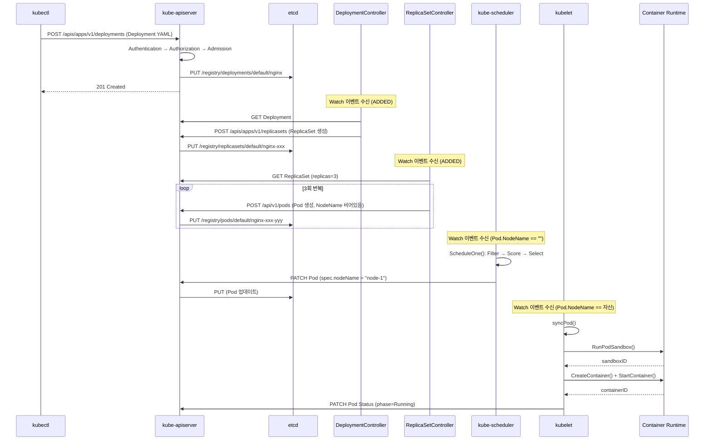
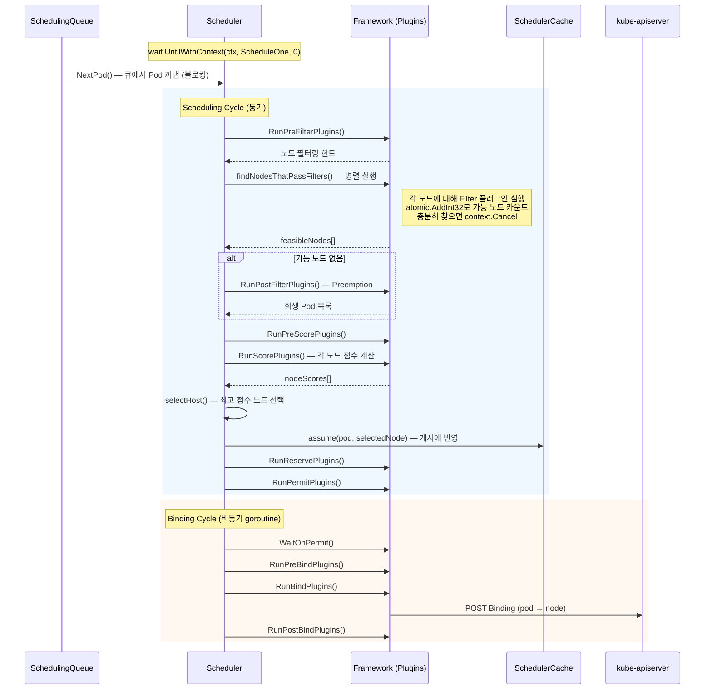
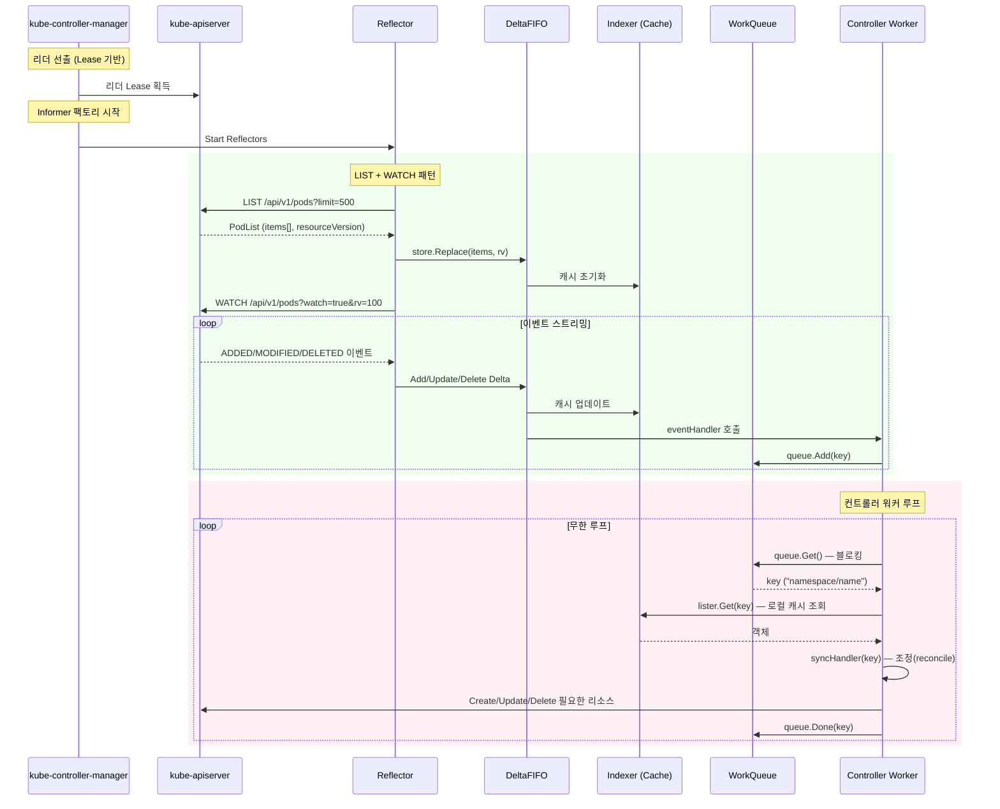
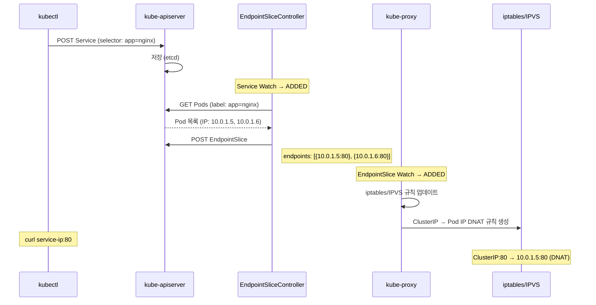

# 03. Kubernetes 시퀀스 다이어그램

## 개요

Kubernetes의 핵심 동작 흐름을 시퀀스 다이어그램으로 설명한다.
모든 흐름은 실제 소스코드에서 추적한 것이다.

## 1. Pod 생성 전체 흐름 (Deployment → Pod)



## 2. API Server 요청 처리 흐름

소스: `cmd/kube-apiserver/app/server.go`, `staging/src/k8s.io/apiserver/pkg/endpoints/handlers/create.go`

```
HTTP 요청 (POST /api/v1/namespaces/default/pods)
    │
    ▼
┌───────────────────────────────────────────┐
│ FullHandlerChain (필터 체인)               │
│                                           │
│ 1. Panic Recovery                         │
│ 2. Request Info 파싱                      │
│    → API Group, Version, Resource, Verb   │
│ 3. Priority & Fairness (Rate Limiting)    │
│ 4. Authentication (인증)                  │
│    → Bearer Token / Client Certificate    │
│    → user.Info를 context에 저장           │
│ 5. Audit Logging (감사 로깅)              │
│ 6. Impersonation (위장 처리)              │
│ 7. Authorization (인가)                   │
│    → RBAC: Role/ClusterRole 검사          │
│    → Allow / Deny / NoOpinion             │
└────────────────────┬──────────────────────┘
                     │
                     ▼
┌───────────────────────────────────────────┐
│ Director (라우팅)                          │
│                                           │
│ GoRestfulContainer에 등록된 경로?          │
│   YES → gorestful WebService 디스패치     │
│   NO  → NonGoRestfulMux (delegation)      │
└────────────────────┬──────────────────────┘
                     │
                     ▼
┌───────────────────────────────────────────┐
│ REST Handler (createHandler)              │
│ handlers/create.go:53                     │
│                                           │
│ 1. Content-Type 협상 (JSON/Protobuf)      │
│ 2. 요청 바디 디코딩 → Go 객체             │
│ 3. admission.Attributes 생성              │
│ 4. Mutating Admission 호출                │
│    → MutatingWebhook 실행                 │
│    → 객체 수정 가능                       │
│ 5. Store.Create() 호출                    │
└────────────────────┬──────────────────────┘
                     │
                     ▼
┌───────────────────────────────────────────┐
│ Store.Create()                            │
│ registry/generic/registry/store.go:446    │
│                                           │
│ 1. BeginCreate hook                       │
│ 2. rest.BeforeCreate() — 전략 검증        │
│ 3. Validating Admission 호출              │
│    → ValidatingWebhook 실행               │
│ 4. etcd key 생성                          │
│    → /registry/pods/default/{name}        │
│ 5. e.Storage.Create() — etcd 저장         │
│ 6. AfterCreate hook                       │
└────────────────────┬──────────────────────┘
                     │
                     ▼
┌───────────────────────────────────────────┐
│ etcd3.store.Create()                      │
│ storage/etcd3/store.go:274                │
│                                           │
│ 1. 객체 직렬화 (Protobuf/JSON)            │
│ 2. 암호화 변환 (TransformToStorage)       │
│ 3. OptimisticPut (조건부 쓰기)            │
│    → 키가 없을 때만 쓰기 성공             │
│    → 이미 존재하면 AlreadyExists 에러     │
│ 4. ResourceVersion 할당 (etcd revision)   │
└────────────────────┬──────────────────────┘
                     │
                     ▼
              HTTP 201 Created
```

## 3. 스케줄러 동작 흐름

소스: `pkg/scheduler/scheduler.go`, `pkg/scheduler/schedule_one.go`



### 스케줄링 확장 포인트 순서

```
Queue
  │
  ▼
PreEnqueue ─→ QueueSort ─→ [큐에서 꺼냄]
  │
  ▼ Scheduling Cycle (동기)
PreFilter ─→ Filter ─→ PostFilter(실패 시) ─→ PreScore ─→ Score
  │
  ▼
Reserve ─→ Permit
  │
  ▼ Binding Cycle (비동기)
WaitOnPermit ─→ PreBind ─→ Bind ─→ PostBind
```

## 4. 컨트롤러 매니저 동작 흐름

소스: `cmd/kube-controller-manager/app/controllermanager.go`



## 5. Deployment → ReplicaSet → Pod 생성 흐름

소스: `pkg/controller/deployment/deployment_controller.go`, `pkg/controller/replicaset/replica_set.go`

```
사용자: kubectl apply -f deployment.yaml (replicas: 3)
  │
  ▼
DeploymentController.syncDeployment()  (line 589)
  │
  ├─ 기존 ReplicaSet 조회 (lister로 캐시 검색)
  ├─ 새 ReplicaSet 필요? → API로 생성
  │   POST /apis/apps/v1/namespaces/default/replicasets
  │   ReplicaSet.spec.replicas = 3
  │   ReplicaSet.ownerReferences = [{Deployment UID}]
  └─ 롤링 업데이트 전략 처리
      ├─ 새 RS scale up
      └─ 이전 RS scale down
  │
  ▼
ReplicaSetController.syncReplicaSet()  (line 755)
  │
  ├─ 현재 Pod 수 확인 (lister 검색, label selector)
  ├─ diff = spec.replicas - len(activePods)
  ├─ diff > 0 → manageReplicas(): Pod 생성  (line 649)
  │   ├─ Batch 생성 (SlowStartBatch)
  │   │   1차: 1개 생성
  │   │   2차: 2개 생성
  │   │   3차: 4개 생성 ... (지수 증가)
  │   └─ 각 Pod.ownerReferences = [{ReplicaSet UID}]
  └─ diff < 0 → Pod 삭제 (비용 기반 정렬 후 삭제)
```

## 6. Kubelet Sync Loop

소스: `pkg/kubelet/kubelet.go`

```
kubelet.Run()
  │
  ├─ pleg.Start()              // PLEG 시작 (line 1884)
  ├─ statusManager.Start()     // 상태 동기화
  ├─ volumeManager.Run()       // 볼륨 관리
  └─ syncLoop()                // 메인 루프 (line 1895)
      │
      ▼
syncLoopIteration()            (line 2580)
  │
  ├─ configCh ──────→ Pod 설정 변경 이벤트
  │   ├─ ADD    → HandlePodAdditions()
  │   ├─ UPDATE → HandlePodUpdates()
  │   ├─ REMOVE → HandlePodRemoves()
  │   └─ DELETE → HandlePodUpdates() (graceful)
  │
  ├─ plegCh ───────→ PLEG 이벤트 (컨테이너 상태 변경)
  │   └─ ContainerStarted/Died → HandlePodSyncs()
  │
  ├─ syncCh (1초) ──→ 주기적 동기화
  │   └─ getPodsToSync() → HandlePodSyncs()
  │
  ├─ livenessUpdate ─→ Probe 상태 변경
  │   └─ HandlePodSyncs()
  │
  └─ housekeepingCh (30초) → 정리 작업
      └─ HandlePodCleanups()
```

### PLEG (Pod Lifecycle Event Generator) Relist

소스: `pkg/kubelet/pleg/generic.go:234`

```
PLEG.Relist()  (주기적 실행)
  │
  ├─ 1. runtime.GetPods(ctx, true)    // CRI로 모든 Pod 조회
  │
  ├─ 2. 이전 상태 vs 현재 상태 비교
  │     oldState := podRecord.old
  │     newState := podRecord.current
  │
  ├─ 3. 상태 변화 감지
  │     Non-existent → Running : ContainerStarted
  │     Running → Exited       : ContainerDied
  │     상태 변경 없음          : 이벤트 없음
  │
  ├─ 4. 캐시 업데이트
  │     updateCache() → Pod 상태 캐시 갱신
  │
  └─ 5. 이벤트 전송
        eventChannel <- PodLifecycleEvent
        → syncLoop에서 plegCh로 수신
```

## 7. Service → Endpoint 흐름



## 8. 인증·인가·어드미션 체인

소스: `staging/src/k8s.io/apiserver/pkg/server/config.go:1028-1110`

```
HTTP 요청
  │
  ▼
┌─ Authentication (인증) ─────────────────────────┐
│                                                  │
│  unionAuthRequestHandler.AuthenticateRequest()   │
│                                                  │
│  1. Client Certificate (x509)                    │
│  2. Bearer Token                                 │
│     - Static Token                               │
│     - Service Account Token                      │
│     - OIDC Token                                 │
│     - Webhook Token                              │
│  3. Bootstrap Token                              │
│  4. Anonymous (최후 수단)                         │
│                                                  │
│  → 첫 번째 성공한 인증기가 user.Info 반환         │
│  → 모두 실패: 401 Unauthorized                   │
└──────────────────────────────────────────────────┘
  │
  ▼
┌─ Authorization (인가) ──────────────────────────┐
│                                                  │
│  unionAuthzHandler.Authorize()                   │
│                                                  │
│  1. Node Authorizer — kubelet 자기 노드 접근     │
│  2. RBAC Authorizer — Role/ClusterRole 검사      │
│     ├─ ClusterRoleBindings 검색                  │
│     ├─ RoleBindings 검색 (해당 네임스페이스)      │
│     └─ RuleAllows(): verb + apiGroup +           │
│        resource + resourceName 매칭              │
│  3. Webhook Authorizer (옵션)                    │
│                                                  │
│  → Allow: 다음 단계                              │
│  → Deny: 403 Forbidden                           │
│  → NoOpinion: 다음 인가기                        │
└──────────────────────────────────────────────────┘
  │
  ▼
┌─ Admission (어드미션) ──────────────────────────┐
│                                                  │
│  Phase 1: Mutating (수정 가능)                   │
│  ├─ ServiceAccount — 기본 SA 주입                │
│  ├─ LimitRanger — 기본 리소스 제한 설정          │
│  ├─ DefaultTolerationSeconds — 기본 톨러레이션   │
│  ├─ MutatingWebhook — 외부 웹훅 호출             │
│  └─ (각 플러그인이 객체를 수정 가능)              │
│                                                  │
│  Phase 2: Validating (검증만, 수정 불가)          │
│  ├─ ResourceQuota — 리소스 쿼타 검사             │
│  ├─ PodSecurity — Pod 보안 정책                  │
│  ├─ NodeRestriction — kubelet 접근 제한           │
│  ├─ ValidatingWebhook — 외부 웹훅 호출           │
│  └─ (하나라도 실패하면 요청 거부)                 │
│                                                  │
│  → 모두 통과: Storage 저장 진행                   │
│  → 실패: 403 Forbidden                           │
└──────────────────────────────────────────────────┘
```

## 9. Watch 이벤트 전파 흐름

```
etcd
  │ Watch (revision 기반)
  ▼
kube-apiserver (cacher)
  │ Watch 이벤트 변환
  │ BookmarkEvent (주기적 rv 알림)
  ▼
┌────────────┬───────────┬────────────┐
│ Reflector  │ Reflector │ Reflector  │
│ (kubelet)  │ (sched)   │ (ctrl-mgr) │
└─────┬──────┘     │     └─────┬──────┘
      │            │           │
      ▼            ▼           ▼
   DeltaFIFO   DeltaFIFO   DeltaFIFO
      │            │           │
      ▼            ▼           ▼
   Indexer      Indexer     Indexer
   (로컬캐시)  (로컬캐시)  (로컬캐시)
```

**핵심**: etcd → API Server → 각 컴포넌트의 Reflector → DeltaFIFO → Indexer 순서로 이벤트 전파.
각 컴포넌트는 로컬 캐시(Indexer)를 기반으로 동작하며, API Server에 직접 읽기 요청을 최소화한다.
