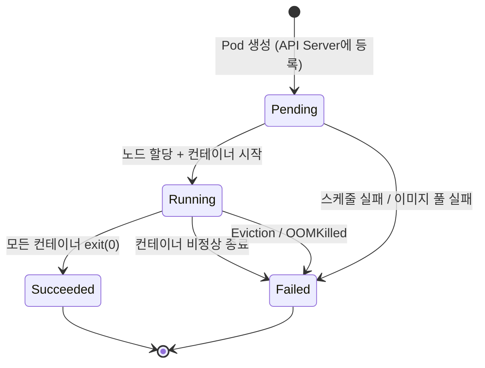
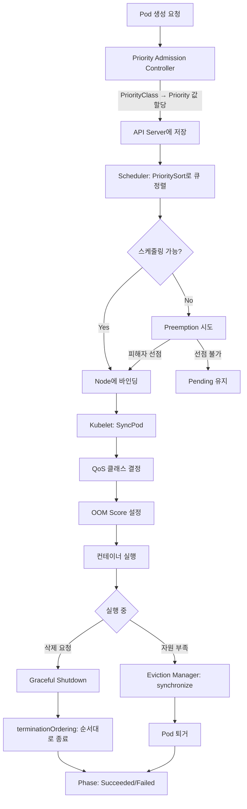

# Pod Lifecycle 심화

## 1. 개요

Pod는 Kubernetes에서 가장 기본적인 실행 단위이다. 하나의 Pod가 생성되어 종료되기까지의 생명주기(Lifecycle)에는 **Phase 전이**, **Condition 평가**, **QoS 분류**, **OOM 점수 조정**, **Eviction**, **Preemption**, **우선순위 정렬**, **Graceful Shutdown** 등 다양한 메커니즘이 맞물려 동작한다.

이 문서는 "왜(Why) 이런 설계를 했는가"를 중심으로, 실제 소스코드를 참조하며 각 메커니즘의 동작 원리를 상세히 분석한다.

### 왜 Pod Lifecycle을 깊이 이해해야 하는가

1. **장애 진단** -- Pod가 왜 Pending인지, 왜 Evict되었는지, 왜 OOMKilled되었는지를 소스코드 수준에서 이해해야 근본 원인을 찾을 수 있다
2. **자원 최적화** -- QoS 클래스와 OOM Score의 관계를 이해하면, requests/limits 설정을 통해 Pod 생존 순서를 의도적으로 제어할 수 있다
3. **운영 안정성** -- Eviction, Preemption, Graceful Shutdown의 동작 순서를 알아야 롤링 업데이트나 스케일 다운 시 서비스 중단을 최소화할 수 있다

### 핵심 컴포넌트 관계도

```
+------------------+     스케줄링      +------------------+
|   API Server     | ───────────────> |    Scheduler     |
|  (Pod 저장/관리)   |                  | (배치/선점 결정)   |
+------------------+                  +------------------+
        │                                     │
        │ watch                               │ bind
        ▼                                     ▼
+------------------+                  +------------------+
|     Kubelet      | <─── 노드 할당 ── |   Node (배치)     |
|  (실행/관리/종료)  |                  +------------------+
+------------------+
  │          │           │
  ▼          ▼           ▼
SyncPod   Eviction    Termination
(실행)    Manager     Ordering
          (퇴거)      (종료 순서)
```

---

## 2. Pod Phase 상태 머신

### Phase 정의

Pod Phase는 Pod의 전체적인 상태를 요약하는 고수준(high-level) 필드이다. `pkg/apis/core/types.go` 라인 3102-3124에 정의되어 있다:

```go
// pkg/apis/core/types.go:3102-3124
type PodPhase string

const (
    PodPending   PodPhase = "Pending"
    PodRunning   PodPhase = "Running"
    PodSucceeded PodPhase = "Succeeded"
    PodFailed    PodPhase = "Failed"
    PodUnknown   PodPhase = "Unknown"  // Deprecated since 2015
)
```

### 왜 Phase는 5개뿐인가

Phase는 의도적으로 "대략적인" 상태만 표현한다. 세부적인 상태 정보는 Condition, ContainerStatus 등으로 분리했다. 이유:

1. **단순성** -- 클라이언트가 간단한 분기 로직으로 Pod 상태를 판단할 수 있다
2. **안정성** -- Phase 값이 자주 바뀌지 않으므로 API 호환성이 유지된다
3. **확장성** -- 새로운 상태 정보는 Condition을 추가하면 된다 (Phase를 건드리지 않음)

### 상태 전이 다이어그램



### Phase별 상세 의미

| Phase | 의미 | Kubelet SyncPod 판단 기준 |
|-------|------|---------------------------|
| **Pending** | API Server에 등록됨, 아직 실행되지 않음 | 노드 미할당, 이미지 풀링 중, Init Container 실행 중 |
| **Running** | 노드에 바인딩됨, 최소 1개 컨테이너가 실행 중 | 메인 컨테이너 중 하나라도 Running 상태 |
| **Succeeded** | 모든 컨테이너가 exit code 0으로 종료 | `apiPodStatus.Phase == v1.PodSucceeded` |
| **Failed** | 모든 컨테이너 종료, 최소 1개가 비정상 종료 | `apiPodStatus.Phase == v1.PodFailed` |
| **Unknown** | 통신 장애로 상태 확인 불가 | **Deprecated** -- 2015년 이후 설정되지 않음 |

### Kubelet의 Phase 판단 흐름

`pkg/kubelet/kubelet.go` 라인 1947-2018의 `SyncPod()`에서 Phase를 결정하는 핵심 로직:

```go
// pkg/kubelet/kubelet.go:2001-2018
// Generate final API pod status with pod and status manager status
apiPodStatus := kl.generateAPIPodStatus(ctx, pod, podStatus, false)

// If the pod is terminal, we don't need to continue to setup the pod
if apiPodStatus.Phase == v1.PodSucceeded || apiPodStatus.Phase == v1.PodFailed {
    kl.statusManager.SetPodStatus(logger, pod, apiPodStatus)
    isTerminal = true
    return isTerminal, nil
}
```

**왜 terminal Phase를 조기에 체크하는가?**

Terminal 상태(Succeeded/Failed)인 Pod에 대해 더 이상 컨테이너를 시작하거나 볼륨을 마운트할 필요가 없다. 불필요한 작업을 스킵하여 kubelet의 CPU/메모리 부하를 줄인다.

---

## 3. Pod Condition 체계

### Condition 정의

Phase가 "대략적인 상태"라면, Condition은 "구체적인 상태 조건"이다. `pkg/apis/core/types.go` 라인 3126-3156에 정의:

```go
// pkg/apis/core/types.go:3127-3156
type PodConditionType string

const (
    PodScheduled           PodConditionType = "PodScheduled"
    PodReady               PodConditionType = "Ready"
    PodInitialized         PodConditionType = "Initialized"
    ContainersReady        PodConditionType = "ContainersReady"
    DisruptionTarget       PodConditionType = "DisruptionTarget"
    PodResizePending       PodConditionType = "PodResizePending"
    PodResizeInProgress    PodConditionType = "PodResizeInProgress"
    AllContainersRestarting PodConditionType = "AllContainersRestarting"
)
```

### Condition 구조체

```go
// pkg/apis/core/types.go:3158-3172
type PodCondition struct {
    Type               PodConditionType
    ObservedGeneration int64
    Status             ConditionStatus     // True, False, Unknown
    LastProbeTime      metav1.Time
    LastTransitionTime metav1.Time
    Reason             string
    Message            string
}
```

### Kubelet이 소유하는 Condition

`pkg/kubelet/types/pod_status.go` 라인 26-33에서 kubelet이 직접 관리하는 Condition 목록을 정의한다:

```go
// pkg/kubelet/types/pod_status.go:26-33
var PodConditionsByKubelet = []v1.PodConditionType{
    v1.PodScheduled,
    v1.PodReady,
    v1.PodInitialized,
    v1.ContainersReady,
    v1.PodResizeInProgress,
    v1.PodResizePending,
}
```

### 왜 Condition을 Kubelet이 소유하는가

Kubernetes는 "분산된 소유권(distributed ownership)" 원칙을 따른다. Condition의 소유권이 명확해야 하는 이유:

1. **충돌 방지** -- 여러 컴포넌트가 같은 Condition을 동시에 업데이트하면 경합(race condition)이 발생한다
2. **신뢰성** -- 노드에서 실행 중인 kubelet만이 컨테이너의 실제 상태를 알 수 있으므로, 실행 관련 Condition은 kubelet이 관리한다
3. **디버깅** -- 어떤 컴포넌트가 Condition을 설정했는지 추적할 수 있다

### Condition 전이 순서

Pod가 정상적으로 시작될 때의 Condition 전이:

```
시간 ──────────────────────────────────────────────────>

1. PodScheduled:    False ──> True     (Scheduler가 노드 할당)
2. Initialized:     False ──> True     (Init Container 모두 완료)
3. ContainersReady: False ──> True     (모든 컨테이너 Ready)
4. Ready:           False ──> True     (Readiness Gate + ContainersReady)
```

### DisruptionTarget Condition

특히 주목할 것은 `DisruptionTarget`이다. 이 Condition은 Eviction이나 Preemption으로 Pod가 곧 종료될 것임을 알려준다:

```go
// pkg/kubelet/eviction/eviction_manager.go:432-438
condition := &v1.PodCondition{
    Type:               v1.DisruptionTarget,
    ObservedGeneration: pod.Generation,
    Status:             v1.ConditionTrue,
    Reason:             v1.PodReasonTerminationByKubelet,
    Message:            message,
}
```

**왜 DisruptionTarget을 별도 Condition으로 만들었는가?**

- 워크로드 컨트롤러(Deployment, StatefulSet)가 Pod 종료 원인을 구분할 수 있다
- "자발적 종료 vs 비자발적 종료"를 PDB(PodDisruptionBudget)와 연계하여 추적한다
- 모니터링 시스템이 Eviction/Preemption 이벤트를 정확히 감지할 수 있다

### Condition과 Service 연동

| Condition | Service 라우팅 영향 |
|-----------|---------------------|
| `ContainersReady=True` | 컨테이너 수준에서 트래픽 수신 가능 |
| `Ready=True` | Service의 Endpoint에 등록됨 (실제 트래픽 수신) |
| `Ready=False` | Endpoint에서 제거됨 (트래픽 차단) |
| `DisruptionTarget=True` | 곧 종료 예정 -- 새 트래픽 라우팅 중단 |

---

## 4. QoS 클래스

### QoS 분류의 목적

QoS(Quality of Service) 클래스는 **자원 부족 시 어떤 Pod를 먼저 종료할지** 결정하는 기준이다. Linux 커널의 OOM Killer에게 "이 프로세스의 중요도"를 전달하기 위해 존재한다.

### 세 가지 QoS 클래스

| QoS 클래스 | 조건 | OOM 종료 우선순위 |
|------------|------|-------------------|
| **Guaranteed** | 모든 컨테이너에 CPU/Memory requests == limits | 가장 마지막 (보호됨) |
| **Burstable** | 최소 1개 컨테이너에 requests 또는 limits 설정 | 중간 |
| **BestEffort** | 어떤 컨테이너에도 requests/limits 없음 | 가장 먼저 종료 |

### ComputePodQOS() 알고리즘

`pkg/apis/core/v1/helper/qos/qos.go` 라인 87-169에 정의된 핵심 알고리즘:

```go
// pkg/apis/core/v1/helper/qos/qos.go:87-169
func ComputePodQOS(pod *v1.Pod) v1.PodQOSClass {
    requests := v1.ResourceList{}
    limits := v1.ResourceList{}
    isGuaranteed := true

    // Pod-level resources 지원 (PodLevelResources feature gate)
    if utilfeature.DefaultFeatureGate.Enabled(features.PodLevelResources) &&
        pod.Spec.Resources != nil {
        // pod-level requests/limits로 QoS 결정
        // ...
    } else {
        // 컨테이너별 requests/limits 집계
        allContainers := []v1.Container{}
        allContainers = append(allContainers, pod.Spec.Containers...)
        allContainers = append(allContainers, pod.Spec.InitContainers...)

        for _, container := range allContainers {
            // requests 집계
            for name, quantity := range container.Resources.Requests {
                if !isSupportedQoSComputeResource(name) {
                    continue
                }
                // ...
            }
            // limits 집계
            qosLimitsFound := sets.NewString()
            for name, quantity := range container.Resources.Limits {
                // ...
                qosLimitsFound.Insert(string(name))
            }
            // CPU와 Memory limits가 모두 있어야 Guaranteed 후보
            if !qosLimitsFound.HasAll(string(v1.ResourceMemory), string(v1.ResourceCPU)) {
                isGuaranteed = false
            }
        }
    }

    // 판정 로직
    if len(requests) == 0 && len(limits) == 0 {
        return v1.PodQOSBestEffort    // (1) 아무것도 없으면 BestEffort
    }
    if isGuaranteed {
        for name, req := range requests {
            if lim, exists := limits[name]; !exists || lim.Cmp(req) != 0 {
                isGuaranteed = false   // (2) requests != limits면 Guaranteed 아님
                break
            }
        }
    }
    if isGuaranteed && len(requests) == len(limits) {
        return v1.PodQOSGuaranteed    // (3) 모두 일치하면 Guaranteed
    }
    return v1.PodQOSBurstable         // (4) 나머지는 Burstable
}
```

### 알고리즘 플로우차트

```
ComputePodQOS(pod) 시작
         │
         ▼
  ┌──────────────────────┐
  │ requests=0 & limits=0│──── Yes ──> BestEffort
  └──────────────────────┘
         │ No
         ▼
  ┌──────────────────────────────┐
  │ 모든 컨테이너에                │
  │ CPU+Memory limits 존재?       │──── No ──> Burstable
  └──────────────────────────────┘
         │ Yes
         ▼
  ┌──────────────────────────────┐
  │ 모든 리소스에서                │
  │ requests == limits?           │──── No ──> Burstable
  └──────────────────────────────┘
         │ Yes
         ▼
     Guaranteed
```

### 왜 Init Container도 QoS 계산에 포함하는가

```go
allContainers = append(allContainers, pod.Spec.Containers...)
allContainers = append(allContainers, pod.Spec.InitContainers...)
```

Init Container가 메인 컨테이너보다 더 많은 자원을 요청할 수 있다. QoS 계산에서 Init Container를 제외하면, Init Container의 자원 요청이 QoS 분류에 반영되지 않아 부정확한 결과가 나올 수 있다.

### 주의: Ephemeral Container는 제외

소스코드 주석에 명시되어 있듯이, Ephemeral Container(`kubectl debug`로 생성)는 QoS 계산에 포함되지 않는다. 디버깅 목적의 임시 컨테이너가 Pod의 QoS를 변경하면 안 되기 때문이다.

### QoS 클래스 결정 예시

| 시나리오 | CPU req | CPU lim | Mem req | Mem lim | QoS |
|---------|---------|---------|---------|---------|-----|
| 아무것도 설정 안 함 | - | - | - | - | BestEffort |
| Memory requests만 | - | - | 256Mi | - | Burstable |
| 모두 동일 | 500m | 500m | 256Mi | 256Mi | Guaranteed |
| requests < limits | 250m | 500m | 128Mi | 256Mi | Burstable |
| limits만 설정 | - | 500m | - | 256Mi | Burstable* |

> *limits만 설정하면 Kubernetes가 자동으로 requests = limits로 설정하므로, 실제로는 Guaranteed가 될 수 있다. 이는 admission controller 수준에서 처리된다.

---

## 5. OOM Score 조정

### OOM Killer란

Linux 커널은 메모리가 부족하면 OOM(Out-Of-Memory) Killer를 발동하여 프로세스를 강제 종료한다. 각 프로세스에 `oom_score_adj` 값(-1000~1000)을 설정하면, 이 값이 높을수록 먼저 종료된다.

### 핵심 상수

`pkg/kubelet/qos/policy.go` 라인 28-34에 정의된 상수:

```go
// pkg/kubelet/qos/policy.go:28-34
const (
    KubeletOOMScoreAdj    int = -999   // Kubelet 자신 (거의 죽지 않음)
    KubeProxyOOMScoreAdj  int = -999   // kube-proxy (거의 죽지 않음)
    guaranteedOOMScoreAdj int = -997   // Guaranteed Pod (보호됨)
    besteffortOOMScoreAdj int = 1000   // BestEffort Pod (가장 먼저 죽음)
)
```

### OOM Score 범위 시각화

```
oom_score_adj 값:
-1000                 0                  +1000
  │                   │                    │
  ├─ -999 Kubelet     │                    │
  ├─ -999 kube-proxy  │                    │
  ├─ -997 Guaranteed  │                    │
  │                   │                    │
  │       ┌───────────┴────────────────┐   │
  │       │   Burstable 범위 (3~999)    │   │
  │       │   메모리 요청량에 비례       │   │
  │       └────────────────────────────┘   │
  │                                    ├─ 999  Burstable (최소 메모리)
  │                                    └─ 1000 BestEffort
  │
  절대 죽지 않음 ◄─────────────────────────► 가장 먼저 죽음
```

### GetContainerOOMScoreAdjust() 상세 분석

`pkg/kubelet/qos/policy.go` 라인 45-120의 핵심 알고리즘:

```go
// pkg/kubelet/qos/policy.go:45-120
func GetContainerOOMScoreAdjust(pod *v1.Pod, container *v1.Container, memoryCapacity int64) int {
    // (1) Node Critical Pod는 항상 -997
    if types.IsNodeCriticalPod(pod) {
        return guaranteedOOMScoreAdj
    }

    // (2) QoS별 분기
    switch v1qos.GetPodQOS(pod) {
    case v1.PodQOSGuaranteed:
        return guaranteedOOMScoreAdj     // -997
    case v1.PodQOSBestEffort:
        return besteffortOOMScoreAdj     // 1000
    }

    // (3) Burstable: 메모리 요청 비율로 계산
    containerMemReq := container.Resources.Requests.Memory().Value()
    oomScoreAdjust := 1000 - (1000 * containerMemReq) / memoryCapacity

    // (4) Sidecar Container 보정
    if isSidecarContainer(pod, container) {
        minMemoryRequest := minRegularContainerMemory(*pod)
        minMemoryOomScoreAdjust := 1000 - (1000 * minMemoryRequest) / memoryCapacity
        if oomScoreAdjust > minMemoryOomScoreAdjust {
            oomScoreAdjust = minMemoryOomScoreAdjust
        }
    }

    // (5) 경계값 보정
    if int(oomScoreAdjust) < (1000 + guaranteedOOMScoreAdj) {  // < 3
        return (1000 + guaranteedOOMScoreAdj)                   // 3 (Guaranteed와 구분)
    }
    if int(oomScoreAdjust) == besteffortOOMScoreAdj {           // == 1000
        return int(oomScoreAdjust - 1)                           // 999 (BestEffort와 구분)
    }
    return int(oomScoreAdjust)
}
```

### Burstable OOM Score 계산 공식

```
oom_score_adj = 1000 - (1000 * container_memory_request / node_memory_capacity)
```

**예시**: 노드 메모리 = 16GiB, 컨테이너 메모리 요청 = 1GiB

```
oom_score_adj = 1000 - (1000 * 1GiB / 16GiB)
             = 1000 - 62.5
             = 937
```

이 컨테이너는 OOM Score 937을 받는다. 메모리 요청이 큰 컨테이너일수록 낮은 점수(= 더 보호됨)를 받는다.

### 왜 경계값 보정이 필요한가

```go
// Guaranteed와 Burstable 사이에 간격을 둠
if int(oomScoreAdjust) < (1000 + guaranteedOOMScoreAdj) {  // < 3
    return 3
}
// BestEffort와 Burstable 사이에 간격을 둠
if int(oomScoreAdjust) == besteffortOOMScoreAdj {  // == 1000
    return 999
}
```

Burstable Pod의 OOM Score가 Guaranteed(-997)나 BestEffort(1000)와 겹치지 않도록 보장한다. 이렇게 해야 QoS 클래스 간의 종료 순서가 명확히 구분된다:

```
종료 순서 (높은 값부터 먼저):
1. BestEffort:  1000         -- 가장 먼저 죽음
2. Burstable:   3 ~ 999     -- 메모리 요청 비율에 따라 차등
3. Guaranteed:  -997         -- 거의 마지막
4. Kubelet:     -999         -- 시스템 보호
```

### Sidecar Container 보정의 이유

```go
if isSidecarContainer(pod, container) {
    minMemoryRequest := minRegularContainerMemory(*pod)
    minMemoryOomScoreAdjust := 1000 - (1000 * minMemoryRequest) / memoryCapacity
    if oomScoreAdjust > minMemoryOomScoreAdjust {
        oomScoreAdjust = minMemoryOomScoreAdjust
    }
}
```

Sidecar 컨테이너(예: Envoy proxy, 로그 수집기)는 메인 컨테이너보다 메모리 요청이 적은 경우가 많다. 하지만 Sidecar가 메인 컨테이너보다 먼저 OOM Kill되면 Pod 전체가 제대로 동작하지 않는다. 따라서 Sidecar의 OOM Score를 "메인 컨테이너 중 가장 적은 메모리를 요청한 것"의 수준으로 낮춰서, 메인 컨테이너와 비슷한 보호를 받도록 한다.

---

## 6. Eviction Manager

### Eviction이란

Eviction(퇴거)은 **kubelet이 노드의 자원 부족을 감지했을 때** Pod를 강제로 종료하는 메커니즘이다. Scheduler의 Preemption과 달리, Eviction은 노드 수준에서 발생한다.

### 왜 Eviction이 필요한가

1. **노드 안정성** -- 메모리/디스크가 완전히 고갈되면 노드 전체가 불안정해진다
2. **커널 OOM Killer 방지** -- OOM Killer는 kubelet이나 시스템 프로세스도 죽일 수 있다. Eviction Manager가 먼저 Pod를 정리하면 이를 방지한다
3. **예측 가능한 종료** -- OOM Killer는 갑작스럽지만, Eviction은 graceful termination을 시도한다

### Manager 인터페이스

`pkg/kubelet/eviction/types.go` 라인 60-73에 정의:

```go
// pkg/kubelet/eviction/types.go:60-73
type Manager interface {
    // Start starts the control loop to monitor eviction thresholds
    Start(ctx context.Context, diskInfoProvider DiskInfoProvider,
          podFunc ActivePodsFunc, podCleanedUpFunc PodCleanedUpFunc,
          monitoringInterval time.Duration)

    // IsUnderMemoryPressure returns true if the node is under memory pressure.
    IsUnderMemoryPressure() bool
    // IsUnderDiskPressure returns true if the node is under disk pressure.
    IsUnderDiskPressure() bool
    // IsUnderPIDPressure returns true if the node is under PID pressure.
    IsUnderPIDPressure() bool
}
```

### managerImpl 구조체

`pkg/kubelet/eviction/eviction_manager.go` 라인 66-109에 구현:

```go
// pkg/kubelet/eviction/eviction_manager.go:66-109
type managerImpl struct {
    clock                         clock.WithTicker
    config                        Config
    killPodFunc                   KillPodFunc
    imageGC                       ImageGC         // 이미지 GC
    containerGC                   ContainerGC     // 컨테이너 GC
    sync.RWMutex
    nodeConditions                []v1.NodeConditionType
    nodeConditionsLastObservedAt  nodeConditionsObservedAt
    nodeRef                       *v1.ObjectReference
    recorder                      record.EventRecorder
    summaryProvider               stats.SummaryProvider
    thresholdsFirstObservedAt     thresholdsObservedAt
    thresholdsMet                 []evictionapi.Threshold
    signalToRankFunc              map[evictionapi.Signal]rankFunc
    signalToNodeReclaimFuncs      map[evictionapi.Signal]nodeReclaimFuncs
    lastObservations              signalObservations
    dedicatedImageFs              *bool
    splitContainerImageFs         *bool
    thresholdNotifiers            []ThresholdNotifier
    thresholdsLastUpdated         time.Time
    localStorageCapacityIsolation bool
}
```

### Signal에서 Node Condition으로의 매핑

`pkg/kubelet/eviction/helpers.go` 라인 84-108에서 Signal과 NodeCondition의 매핑을 정의한다:

```go
// pkg/kubelet/eviction/helpers.go:84-95
func init() {
    signalToNodeCondition = map[evictionapi.Signal]v1.NodeConditionType{}
    signalToNodeCondition[evictionapi.SignalMemoryAvailable]            = v1.NodeMemoryPressure
    signalToNodeCondition[evictionapi.SignalAllocatableMemoryAvailable] = v1.NodeMemoryPressure
    signalToNodeCondition[evictionapi.SignalImageFsAvailable]           = v1.NodeDiskPressure
    signalToNodeCondition[evictionapi.SignalContainerFsAvailable]       = v1.NodeDiskPressure
    signalToNodeCondition[evictionapi.SignalNodeFsAvailable]            = v1.NodeDiskPressure
    signalToNodeCondition[evictionapi.SignalImageFsInodesFree]          = v1.NodeDiskPressure
    signalToNodeCondition[evictionapi.SignalNodeFsInodesFree]           = v1.NodeDiskPressure
    signalToNodeCondition[evictionapi.SignalContainerFsInodesFree]      = v1.NodeDiskPressure
    signalToNodeCondition[evictionapi.SignalPIDAvailable]               = v1.NodePIDPressure
}
```

### Signal-Resource 매핑 테이블

| Signal | Resource | Node Condition |
|--------|----------|---------------|
| `memory.available` | Memory | MemoryPressure |
| `allocatableMemory.available` | Memory | MemoryPressure |
| `imagefs.available` | EphemeralStorage | DiskPressure |
| `containerfs.available` | EphemeralStorage | DiskPressure |
| `nodefs.available` | EphemeralStorage | DiskPressure |
| `imagefs.inodesFree` | Inodes | DiskPressure |
| `nodefs.inodesFree` | Inodes | DiskPressure |
| `pid.available` | PIDs | PIDPressure |

### synchronize() 루프 상세 분석

`pkg/kubelet/eviction/eviction_manager.go` 라인 248-446의 `synchronize()`는 Eviction Manager의 핵심 제어 루프이다:

```
synchronize() 흐름도
=====================

1. 임계값 설정 확인
   │
   ▼
2. 디스크 파일시스템 감지 (ImageFs, ContainerFs 분리 여부)
   │
   ▼
3. 활성 Pod 목록 가져오기: activePods := podFunc()
   │
   ▼
4. 통계 수집: summary, err := m.summaryProvider.Get(ctx, updateStats)
   │
   ▼
5. 관측값 생성: observations, statsFunc := makeSignalObservations(summary)
   │
   ▼
6. 임계값 초과 여부 판단 (grace period 무시)
   │   thresholds = thresholdsMet(thresholds, observations, false)
   │
   ▼
7. 이전에 초과한 임계값 중 아직 해결 안 된 것 병합
   │   thresholds = mergeThresholds(thresholds, thresholdsNotYetResolved)
   │
   ▼
8. 최초 관측 시각 기록
   │   thresholdsFirstObservedAt(thresholds, m.thresholdsFirstObservedAt, now)
   │
   ▼
9. Node Condition 설정
   │   nodeConditions := nodeConditions(thresholds)
   │
   ▼
10. Grace Period 충족 여부 확인
    │   thresholds = thresholdsMetGracePeriod(thresholdsFirstObservedAt, now)
    │
    ▼
11. 로컬 스토리지 위반 Pod 퇴거 (있으면 여기서 리턴)
    │   if evictedPods := m.localStorageEviction(...); len(evictedPods) > 0
    │
    ▼
12. 임계값 우선순위 정렬
    │   sort.Sort(byEvictionPriority(thresholds))
    │
    ▼
13. 노드 수준 자원 회수 시도 (이미지 GC, 컨테이너 GC)
    │   m.reclaimNodeLevelResources(...)
    │   성공하면 Pod 퇴거 없이 리턴
    │
    ▼
14. Pod 순위 매기기 (signalToRankFunc)
    │   rank(activePods, statsFunc)
    │
    ▼
15. 최대 1개 Pod 퇴거
    │   for i := range activePods {
    │       m.evictPod(pod, gracePeriodOverride, ...)
    │       break  // 1개만
    │   }
    ▼
    종료
```

### Hard vs Soft Eviction Threshold

```go
// pkg/kubelet/eviction/eviction_manager.go:420-429
for i := range activePods {
    pod := activePods[i]
    gracePeriodOverride := int64(immediateEvictionGracePeriodSeconds)  // 1초
    if !isHardEvictionThreshold(thresholdToReclaim) {
        // Soft threshold: 설정된 gracePeriod 사용
        gracePeriodOverride = m.config.MaxPodGracePeriodSeconds
        if pod.Spec.TerminationGracePeriodSeconds != nil {
            gracePeriodOverride = min(m.config.MaxPodGracePeriodSeconds,
                                     *pod.Spec.TerminationGracePeriodSeconds)
        }
    }
}
```

| 구분 | Hard Threshold | Soft Threshold |
|------|---------------|----------------|
| Grace Period | 1초 (`immediateEvictionGracePeriodSeconds`) | `MaxPodGracePeriodSeconds` 또는 Pod의 `terminationGracePeriodSeconds` 중 작은 값 |
| 동작 시점 | 임계값 초과 즉시 | Grace Period 경과 후 |
| 사용 예 | `memory.available < 100Mi` | `memory.available < 500Mi` (evictionSoft) |
| 목적 | 긴급 자원 회수 | 여유 있는 자원 회수 |

### 왜 한 번에 1개 Pod만 퇴거하는가

```go
// we kill at most a single pod during each eviction interval
for i := range activePods {
    // ...
    if m.evictPod(logger, pod, gracePeriodOverride, message, annotations, condition) {
        return []*v1.Pod{pod}, nil  // 1개만 퇴거하고 리턴
    }
}
```

1. **자원 회수 확인** -- 1개 Pod를 퇴거한 뒤, 다음 synchronize 사이클에서 자원이 회복되었는지 확인한다
2. **과잉 퇴거 방지** -- 한꺼번에 여러 Pod를 퇴거하면 필요 이상으로 Pod가 종료될 수 있다
3. **안정성** -- 점진적으로 퇴거하면 워크로드가 다른 노드로 재스케줄링될 시간을 벌 수 있다

### Eviction 우선순위 (Pod 정렬)

Eviction Manager는 `signalToRankFunc`을 사용하여 어떤 Pod를 먼저 퇴거할지 결정한다. 일반적인 정렬 기준:

```
퇴거 우선순위 (높은 순):
1. BestEffort Pod (requests 없음)
2. Burstable Pod 중 자원 사용량이 요청을 초과한 것
3. Burstable Pod 중 자원 사용량이 요청 이내인 것
4. Guaranteed Pod (가장 마지막)
```

---

## 7. Preemption (선점)

### Preemption이란

Preemption(선점)은 **높은 우선순위 Pod가 스케줄링되지 못할 때, 낮은 우선순위 Pod를 퇴거하여 자리를 만드는** 메커니즘이다. Eviction이 "노드 자원 부족"에 의해 발생하는 것과 달리, Preemption은 "스케줄링 실패"에 의해 Scheduler가 주도한다.

### Eviction vs Preemption

| 구분 | Eviction | Preemption |
|------|----------|------------|
| 트리거 | 노드 자원 부족 (메모리, 디스크, PID) | 스케줄링 실패 (자원 부족 또는 제약 불충족) |
| 주체 | Kubelet (Eviction Manager) | Scheduler (DefaultPreemption 플러그인) |
| 대상 선정 | 자원 사용량 + QoS 기반 랭킹 | Priority 값 기반 (낮은 우선순위부터) |
| DisruptionTarget | 설정됨 | 설정됨 |

### Evaluator 구조체

`pkg/scheduler/framework/preemption/preemption.go` 라인 63-73에 정의:

```go
// pkg/scheduler/framework/preemption/preemption.go:63-73
type Evaluator struct {
    PluginName string
    Handler    fwk.Handle
    PodLister  corelisters.PodLister
    PdbLister  policylisters.PodDisruptionBudgetLister

    enableAsyncPreemption bool

    *Executor
    Interface
}
```

### Preempt() 알고리즘 (5단계)

`pkg/scheduler/framework/preemption/preemption.go` 라인 103-174의 `Preempt()` 함수:

```
Preempt() 5단계 흐름
======================

Step 0: Pod 최신 버전 가져오기
    │   pod, err := ev.PodLister.Pods(pod.Namespace).Get(pod.Name)
    ▼
Step 1: 선점 자격 확인
    │   ev.PodEligibleToPreemptOthers(ctx, pod, nominatedNodeStatus)
    │   - preemptionPolicy == Never이면 → 불가
    │   - 이미 선점 진행 중이면 → 불가
    ▼
Step 2: 후보 노드 찾기
    │   candidates, nodeToStatusMap, err := ev.findCandidates(...)
    │   - Unschedulable 노드 중 Pod를 제거하면 스케줄 가능한 노드 탐색
    ▼
Step 3: Extender 필터링
    │   candidates, status := ev.callExtenders(logger, pod, candidates)
    │   - 외부 확장 포인트에서 후보 필터링
    ▼
Step 4: 최적 후보 선택
    │   bestCandidate := ev.SelectCandidate(ctx, candidates)
    │   - 여러 후보 중 최적의 노드 선택
    ▼
Step 5: 선점 실행
    │   ev.prepareCandidate(ctx, bestCandidate, pod, ev.PluginName)
    │   또는 ev.prepareCandidateAsync(bestCandidate, pod, ev.PluginName)
    ▼
    결과: PostFilterResult(bestCandidate.Name(), victims)
```

### SelectVictimsOnNode() 상세

`pkg/scheduler/framework/plugins/defaultpreemption/default_preemption.go` 라인 207-309에 구현된 이 함수가 Preemption의 핵심이다:

```go
// default_preemption.go:207-309 요약
func (pl *DefaultPreemption) SelectVictimsOnNode(...) ([]*v1.Pod, int, *fwk.Status) {
    // Step 1: 선점 가능한 Pod 목록 수집
    for _, pi := range nodeInfo.GetPods() {
        if pl.isPreemptionAllowed(nodeInfo, pi, pod) {
            potentialVictims = append(potentialVictims, pi)
        }
    }

    // Step 2: 모든 잠재적 피해자를 제거
    for _, pi := range potentialVictims {
        removePod(pi)
    }

    // Step 3: 제거 후에도 스케줄링 불가하면 이 노드는 부적합
    if status := pl.fh.RunFilterPluginsWithNominatedPods(...); !status.IsSuccess() {
        return nil, 0, status
    }

    // Step 4: 중요도 내림차순 정렬 (높은 중요도부터)
    sort.Slice(potentialVictims, func(i, j int) bool {
        return pl.MoreImportantPod(potentialVictims[i].GetPod(), potentialVictims[j].GetPod())
    })

    // Step 5: PDB 위반 피해자 → 비위반 피해자 순서로 "감면(reprieve)" 시도
    violatingVictims, nonViolatingVictims := filterPodsWithPDBViolation(potentialVictims, pdbs)

    // 중요도 높은 Pod부터 다시 추가해보기 (감면)
    for _, p := range violatingVictims {
        reprievePod(p)   // 추가해도 스케줄 가능하면 감면, 불가하면 피해자 확정
    }
    for _, p := range nonViolatingVictims {
        reprievePod(p)
    }

    return victimPods, numViolatingVictim, Success
}
```

### "감면(Reprieve)" 로직의 핵심

```go
reprievePod := func(pi fwk.PodInfo) (bool, error) {
    if err := addPod(pi); err != nil {
        return false, err
    }
    status := pl.fh.RunFilterPluginsWithNominatedPods(ctx, state, pod, nodeInfo)
    fits := status.IsSuccess()
    if !fits {
        if err := removePod(pi); err != nil {
            return false, err
        }
        victims = append(victims, pi)  // 스케줄 불가 → 피해자 확정
    }
    return fits, nil   // 스케줄 가능 → 감면
}
```

**왜 "제거 후 다시 추가"하는 방식을 사용하는가?**

1. **최소 피해 원칙** -- 가능한 한 적은 수의 Pod만 퇴거한다
2. **높은 우선순위 보호** -- 중요도 높은 Pod부터 감면을 시도하므로, 낮은 우선순위 Pod가 먼저 희생된다
3. **PDB 존중** -- PDB를 위반하는 퇴거를 최소화한다

### PodEligibleToPreemptOthers()

`pkg/scheduler/framework/plugins/defaultpreemption/default_preemption.go` 라인 319-343에 정의:

```go
// default_preemption.go:319-343
func (pl *DefaultPreemption) PodEligibleToPreemptOthers(_ context.Context, pod *v1.Pod,
    nominatedNodeStatus *fwk.Status) (bool, string) {

    // (1) PreemptionPolicy == Never이면 선점 불가
    if pod.Spec.PreemptionPolicy != nil && *pod.Spec.PreemptionPolicy == v1.PreemptNever {
        return false, "not eligible due to preemptionPolicy=Never."
    }

    // (2) 이미 지명된 노드에서 퇴거 진행 중이면 추가 선점 불가
    nomNodeName := pod.Status.NominatedNodeName
    if len(nomNodeName) > 0 {
        if nominatedNodeStatus.Code() == fwk.UnschedulableAndUnresolvable {
            return true, ""  // 지명 노드가 완전 불가하면 재선점 허용
        }
        if nodeInfo, _ := nodeInfos.Get(nomNodeName); nodeInfo != nil {
            for _, p := range nodeInfo.GetPods() {
                if pl.isPreemptionAllowed(nodeInfo, p, pod) && podTerminatingByPreemption(p.GetPod()) {
                    return false, "not eligible due to a terminating pod on the nominated node."
                }
            }
        }
    }
    return true, ""
}
```

### isPreemptionAllowed() -- 핵심 조건

```go
// default_preemption.go:351-354
func (pl *DefaultPreemption) isPreemptionAllowed(nodeInfo fwk.NodeInfo,
    victim fwk.PodInfo, preemptor *v1.Pod) bool {
    // 피해자의 우선순위가 선점자보다 낮아야 한다
    return corev1helpers.PodPriority(victim.GetPod()) < corev1helpers.PodPriority(preemptor) &&
           pl.IsEligiblePod(nodeInfo, victim, preemptor)
}
```

**핵심 원칙**: 같은 우선순위의 Pod는 서로 선점할 수 없다. 반드시 "더 낮은" 우선순위만 선점 가능하다.

---

## 8. Priority Class

### 우선순위 체계

`pkg/apis/scheduling/types.go` 라인 24-42에 Kubernetes의 우선순위 체계가 정의되어 있다:

```go
// pkg/apis/scheduling/types.go:24-42
const (
    DefaultPriorityWhenNoDefaultClassExists = 0
    HighestUserDefinablePriority = int32(1000000000)       // 10억
    SystemCriticalPriority       = 2 * HighestUserDefinablePriority // 20억
    SystemPriorityClassPrefix    = "system-"
    SystemClusterCritical        = "system-cluster-critical"
    SystemNodeCritical           = "system-node-critical"
)
```

### 우선순위 범위 시각화

```
Priority 값:

0                           1,000,000,000        2,000,000,000
│                                  │                     │
├──── 사용자 정의 영역 ──────────────┤                     │
│     (0 ~ 999,999,999)            │                     │
│                                  │                     │
│  기본값: 0                        ├── 시스템 영역 ───────┤
│  (PriorityClass 미지정 시)        │  (10억 ~ 20억)      │
│                                  │                     │
│                                  │  system-cluster-    │
│                                  │  critical: 20억     │
│                                  │                     │
│                                  │  system-node-       │
│                                  │  critical: 20억     │
│                                  │                     │
└──────────────────────────────────┴─────────────────────┘
낮은 우선순위                              높은 우선순위
(먼저 선점됨)                              (보호됨)
```

### PriorityClass 구조체

```go
// pkg/apis/scheduling/types.go:48-76
type PriorityClass struct {
    metav1.TypeMeta
    metav1.ObjectMeta

    // 실제 우선순위 정수값
    Value int32

    // 이 클래스가 기본값인지 여부
    GlobalDefault bool

    // 설명
    Description string

    // 선점 정책: Never 또는 PreemptLowerPriority
    PreemptionPolicy *core.PreemptionPolicy
}
```

### Priority Admission Controller

`plugin/pkg/admission/priority/admission.go` 라인 137-203의 `admitPod()` 함수가 Pod 생성 시 우선순위를 할당한다:

```go
// admission.go:137-203 요약
func (p *Plugin) admitPod(a admission.Attributes) error {
    // Update 시: 기존 Priority 보존
    if operation == admission.Update {
        if pod.Spec.Priority == nil && oldPod.Spec.Priority != nil {
            pod.Spec.Priority = oldPod.Spec.Priority
        }
        return nil
    }

    // Create 시: PriorityClassName으로 Priority 값 결정
    if operation == admission.Create {
        if len(pod.Spec.PriorityClassName) == 0 {
            // PriorityClassName 미지정 → 기본 PriorityClass 사용
            pcName, priority, preemptionPolicy, err = p.getDefaultPriority()
            pod.Spec.PriorityClassName = pcName
        } else {
            // PriorityClassName 지정 → 해당 PriorityClass에서 값 가져오기
            pc, err := p.lister.Get(pod.Spec.PriorityClassName)
            priority = pc.Value
            preemptionPolicy = pc.PreemptionPolicy
        }

        // Pod가 직접 Priority 값을 지정했다면 거부
        if pod.Spec.Priority != nil && *pod.Spec.Priority != priority {
            return Forbidden("priority value must not be provided in pod spec")
        }
        pod.Spec.Priority = &priority
    }
}
```

### 왜 Pod에 Priority 값을 직접 설정할 수 없는가

```go
if pod.Spec.Priority != nil && *pod.Spec.Priority != priority {
    return admission.NewForbidden(a, fmt.Errorf(
        "the integer value of priority (%d) must not be provided in pod spec; "+
        "priority admission controller computed %d from the given PriorityClass name",
        *pod.Spec.Priority, priority))
}
```

1. **일관성** -- PriorityClass 이름과 실제 Priority 값이 불일치하는 것을 방지한다
2. **보안** -- 사용자가 임의로 높은 Priority 값을 주입하는 것을 차단한다
3. **관리 편의** -- PriorityClass를 수정하면 이후 생성되는 모든 Pod에 자동 반영된다

### PrioritySort 플러그인

`pkg/scheduler/framework/plugins/queuesort/priority_sort.go` 라인 44-48에서 스케줄링 큐의 정렬 로직을 정의한다:

```go
// priority_sort.go:44-48
func (pl *PrioritySort) Less(pInfo1, pInfo2 fwk.QueuedPodInfo) bool {
    p1 := corev1helpers.PodPriority(pInfo1.GetPodInfo().GetPod())
    p2 := corev1helpers.PodPriority(pInfo2.GetPodInfo().GetPod())
    return (p1 > p2) || (p1 == p2 && pInfo1.GetTimestamp().Before(pInfo2.GetTimestamp()))
}
```

**정렬 규칙**:
1. **높은 Priority 먼저** -- Priority 값이 큰 Pod가 큐의 앞에 온다
2. **동일 Priority면 FIFO** -- 같은 Priority라면 먼저 들어온 Pod가 앞에 온다

### 왜 이 정렬이 중요한가

스케줄러의 activeQ(활성 큐)는 min-heap으로 구현되어 있다. `Less()` 함수가 높은 Priority를 "작다"고 판단하므로, heap의 root에 가장 높은 Priority Pod가 위치한다. 이렇게 해야:

1. **시스템 Pod 우선** -- `system-node-critical`(20억) Pod가 항상 먼저 스케줄링된다
2. **공정성** -- 같은 Priority 내에서는 도착 순서를 존중한다
3. **기아 방지** -- 낮은 Priority Pod도 결국 순서가 온다 (높은 Priority Pod가 모두 스케줄링되면)

---

## 9. Graceful Shutdown

### 종료 순서 개요

Pod가 종료될 때, 컨테이너들이 무작위로 죽으면 안 된다. 특히 Sidecar Container가 메인 컨테이너보다 먼저 종료되면 로그 손실, 네트워크 단절 등의 문제가 발생한다.

### 종료 시그널 전달 과정

```
1. API Server: Pod.DeletionTimestamp 설정
   │
   ▼
2. Kubelet: Pod 삭제 감지
   │
   ▼
3. Endpoint Controller: Service Endpoint에서 Pod 제거
   │   (새 트래픽 차단)
   │
   ▼
4. Kubelet: Pod에 SIGTERM 전송
   │   terminationGracePeriodSeconds 카운트다운 시작
   │
   ▼
5. 컨테이너: PreStop hook 실행
   │
   ▼
6. 컨테이너: SIGTERM 수신, graceful shutdown
   │
   ▼
7. (GracePeriod 초과 시) Kubelet: SIGKILL 전송
   │
   ▼
8. Kubelet: Pod 상태를 Failed/Succeeded로 업데이트
```

### terminationOrdering 구조체

`pkg/kubelet/kuberuntime/kuberuntime_termination_order.go` 라인 31-40에 정의:

```go
// kuberuntime_termination_order.go:31-40
type terminationOrdering struct {
    // terminated: 컨테이너 이름 → 채널 (닫히면 해당 컨테이너가 종료됨을 의미)
    terminated map[string]chan struct{}
    // prereqs: 컨테이너 이름 → 대기해야 할 채널 목록
    prereqs    map[string][]chan struct{}
    lock       sync.Mutex
}
```

### newTerminationOrdering() 알고리즘

`pkg/kubelet/kuberuntime/kuberuntime_termination_order.go` 라인 43-95에 구현된 종료 순서 결정 알고리즘:

```go
// kuberuntime_termination_order.go:43-95
func newTerminationOrdering(pod *v1.Pod, runningContainerNames []string) *terminationOrdering {
    to := &terminationOrdering{
        prereqs:    map[string][]chan struct{}{},
        terminated: map[string]chan struct{}{},
    }

    // 실행 중인 컨테이너 맵 구성
    runningContainers := map[string]struct{}{}
    for _, name := range runningContainerNames {
        runningContainers[name] = struct{}{}
    }

    // [Phase 1] 메인 컨테이너 채널 생성
    var mainContainerChannels []chan struct{}
    for _, c := range pod.Spec.Containers {
        channel := make(chan struct{})
        to.terminated[c.Name] = channel
        mainContainerChannels = append(mainContainerChannels, channel)

        // 이미 종료된 컨테이너는 채널을 미리 닫기
        if _, isRunning := runningContainers[c.Name]; !isRunning {
            close(channel)
        }
    }

    // [Phase 2] Sidecar(Init Container with RestartPolicy=Always) 역순 처리
    var previousSidecarName string
    for i := range pod.Spec.InitContainers {
        // 역순으로 처리 (마지막 init container부터)
        ic := pod.Spec.InitContainers[len(pod.Spec.InitContainers)-i-1]

        channel := make(chan struct{})
        to.terminated[ic.Name] = channel

        if _, isRunning := runningContainers[ic.Name]; !isRunning {
            close(channel)
        }

        if podutil.IsRestartableInitContainer(&ic) {
            // Sidecar는 모든 메인 컨테이너가 종료될 때까지 대기
            to.prereqs[ic.Name] = append(to.prereqs[ic.Name], mainContainerChannels...)

            // 이전(나중에 시작된) Sidecar가 먼저 종료될 때까지 대기
            if previousSidecarName != "" {
                to.prereqs[ic.Name] = append(to.prereqs[ic.Name], to.terminated[previousSidecarName])
            }
            previousSidecarName = ic.Name
        }
    }
    return to
}
```

### 종료 순서 시각화

Pod 정의:
```yaml
spec:
  initContainers:
  - name: init-db        # 일반 init container (이미 종료됨)
  - name: sidecar-log    # Sidecar (restartPolicy: Always)
  - name: sidecar-proxy  # Sidecar (restartPolicy: Always)
  containers:
  - name: app
  - name: worker
```

종료 순서:
```
시간 ──────────────────────────────────────────────────────>

Phase 1: 메인 컨테이너 종료
  app    ──── SIGTERM ──── 종료 ──┐
  worker ──── SIGTERM ──── 종료 ──┤
                                  │
Phase 2: 나중에 선언된 Sidecar 먼저 종료
                                  ├── sidecar-proxy 종료 시작 ──── 종료 ──┐
                                  │   (모든 메인 컨테이너 종료 대기)       │
                                  │                                      │
Phase 3: 먼저 선언된 Sidecar 나중에 종료
                                  └── sidecar-log 종료 시작 ──── 종료    │
                                      (메인 컨테이너 + sidecar-proxy     │
                                       종료 대기)                        │

init-db: 이미 종료됨 (채널 미리 닫힘)
```

### waitForTurn() 메커니즘

```go
// kuberuntime_termination_order.go:99-118
func (o *terminationOrdering) waitForTurn(name string, gracePeriod int64) float64 {
    if gracePeriod <= 0 {
        return 0   // grace period 없으면 즉시 종료
    }

    start := time.Now()
    remainingGrace := time.NewTimer(time.Duration(gracePeriod) * time.Second)

    for _, c := range o.prereqs[name] {
        select {
        case <-c:                      // 선행 컨테이너 종료 완료
        case <-remainingGrace.C:       // grace period 만료
            return time.Since(start).Seconds()
        }
    }
    return time.Since(start).Seconds()
}
```

**핵심 설계 원칙**:

1. **채널 기반 동기화** -- Go의 채널을 사용하여 컨테이너 간 종료 순서를 동기화한다
2. **Grace Period 공유** -- 모든 컨테이너가 하나의 `terminationGracePeriodSeconds`를 공유한다. Sidecar의 대기 시간도 이 grace period에서 차감된다
3. **안전 장치** -- Grace period가 만료되면 대기를 중단하고 즉시 종료를 진행한다 (SIGKILL)

### 왜 Sidecar를 역순으로 종료하는가

```go
for i := range pod.Spec.InitContainers {
    ic := pod.Spec.InitContainers[len(pod.Spec.InitContainers)-i-1]  // 역순
```

Init Container는 선언 순서대로 시작되므로, 나중에 선언된 Sidecar가 먼저 시작된 Sidecar에 의존할 수 있다. 종료 시에는 이를 역순으로 해야 한다:

```
시작 순서:  sidecar-log → sidecar-proxy → app, worker
종료 순서:  app, worker → sidecar-proxy → sidecar-log (역순)
```

이는 **스택(LIFO)** 원칙과 같다. 나중에 시작된 것이 먼저 종료되어야 의존성이 깨지지 않는다.

### Graceful Shutdown과 Pod Priority

Kubelet의 노드 Graceful Shutdown 시에는 Priority에 따라 종료 순서가 결정된다:

```
노드 Graceful Shutdown 순서:
1. BestEffort Pod (Priority 낮은 순)     ← 먼저 종료
2. Burstable Pod (Priority 낮은 순)
3. Guaranteed Pod (Priority 낮은 순)
4. System Critical Pod                    ← 마지막 종료
```

각 Priority 그룹에 할당된 `shutdownGracePeriodByPodPriority`에 따라 종료 시간이 배분된다.

---

## 10. 소스코드 맵

### 파일별 역할 정리

| 파일 경로 | 핵심 함수/구조체 | 역할 |
|-----------|-----------------|------|
| `pkg/apis/core/types.go:3102-3156` | PodPhase, PodConditionType | Phase와 Condition 타입 정의 |
| `pkg/apis/core/v1/helper/qos/qos.go:87-169` | ComputePodQOS() | QoS 클래스 결정 알고리즘 |
| `pkg/kubelet/qos/policy.go:45-120` | GetContainerOOMScoreAdjust() | OOM Score 계산 |
| `pkg/kubelet/types/pod_status.go:26-33` | PodConditionsByKubelet | Kubelet이 소유하는 Condition 목록 |
| `pkg/kubelet/eviction/types.go:60-73` | Manager interface | Eviction Manager 인터페이스 |
| `pkg/kubelet/eviction/eviction_manager.go:66-109` | managerImpl | Eviction Manager 구현체 |
| `pkg/kubelet/eviction/eviction_manager.go:248-446` | synchronize() | 핵심 제어 루프 |
| `pkg/kubelet/eviction/helpers.go:84-108` | signalToNodeCondition | Signal-Condition 매핑 |
| `pkg/scheduler/framework/preemption/preemption.go:63-73` | Evaluator | Preemption 평가기 |
| `pkg/scheduler/framework/preemption/preemption.go:103-174` | Preempt() | Preemption 5단계 알고리즘 |
| `pkg/scheduler/framework/plugins/defaultpreemption/default_preemption.go:207-309` | SelectVictimsOnNode() | 피해자 선정 알고리즘 |
| `pkg/scheduler/framework/plugins/defaultpreemption/default_preemption.go:319-343` | PodEligibleToPreemptOthers() | 선점 자격 확인 |
| `pkg/apis/scheduling/types.go:24-76` | PriorityClass, SystemCriticalPriority | 우선순위 체계 |
| `plugin/pkg/admission/priority/admission.go:137-203` | admitPod() | Priority Admission Controller |
| `pkg/scheduler/framework/plugins/queuesort/priority_sort.go:44-48` | Less() | 스케줄링 큐 정렬 |
| `pkg/kubelet/kubelet.go:1947-2018` | SyncPod() | Pod 동기화 진입점 |
| `pkg/kubelet/kuberuntime/kuberuntime_termination_order.go:43-95` | newTerminationOrdering() | 종료 순서 결정 |
| `pkg/kubelet/kuberuntime/kuberuntime_termination_order.go:99-118` | waitForTurn() | 종료 순서 대기 |

### 핵심 상수 정리

| 상수 | 값 | 파일 | 의미 |
|------|-----|------|------|
| `KubeletOOMScoreAdj` | -999 | qos/policy.go:30 | Kubelet의 OOM 보호 |
| `guaranteedOOMScoreAdj` | -997 | qos/policy.go:33 | Guaranteed Pod OOM 보호 |
| `besteffortOOMScoreAdj` | 1000 | qos/policy.go:34 | BestEffort Pod 최우선 종료 |
| `immediateEvictionGracePeriodSeconds` | 1 | eviction_manager.go:62 | Hard Eviction 즉시 종료 |
| `HighestUserDefinablePriority` | 1,000,000,000 | scheduling/types.go:30 | 사용자 Priority 상한 |
| `SystemCriticalPriority` | 2,000,000,000 | scheduling/types.go:32 | 시스템 Priority 시작점 |
| `DefaultPriorityWhenNoDefaultClassExists` | 0 | scheduling/types.go:28 | PriorityClass 미지정 시 기본값 |

---

## 11. 핵심 정리

### Pod Lifecycle 전체 흐름



### 설계 철학 요약

| 원칙 | 구현 |
|------|------|
| **예측 가능한 종료 순서** | QoS → OOM Score → Eviction 순위가 일관됨 |
| **최소 영향** | Preemption은 최소 피해자만 선정, Eviction은 1개씩 퇴거 |
| **계층적 보호** | System > Guaranteed > Burstable > BestEffort |
| **분산된 소유권** | Condition 소유권이 컴포넌트별로 분리됨 |
| **Graceful > Forceful** | SIGTERM → 대기 → SIGKILL 순서를 항상 준수 |
| **채널 기반 동기화** | terminationOrdering이 Go 채널로 종료 순서를 보장 |

### 운영 체크리스트

| 항목 | 권장 설정 |
|------|----------|
| **모든 프로덕션 Pod에 requests/limits 설정** | QoS를 Guaranteed 또는 Burstable로 명시적 지정 |
| **PriorityClass 정의** | 워크로드 유형별 Priority 계층 구성 |
| **terminationGracePeriodSeconds** | 애플리케이션 종료 시간에 맞춰 설정 (기본 30초) |
| **PDB 설정** | Preemption/Eviction 시 최소 가용성 보장 |
| **Eviction Threshold 튜닝** | Soft threshold로 여유 있는 자원 관리 |
| **Sidecar Container 선언 순서** | 의존성 순서대로 Init Container 정의 |
| **PreemptionPolicy** | 선점이 불필요한 배치 작업에는 `Never` 설정 |

### 자주 발생하는 문제와 원인

| 증상 | 가능한 원인 | 확인 방법 |
|------|------------|----------|
| Pod가 Pending에서 멈춤 | 자원 부족 + 선점 불가 | `kubectl describe pod` → Events |
| Pod가 갑자기 종료됨 | OOMKilled (BestEffort/Burstable) | `kubectl get pod -o yaml` → `status.containerStatuses[].state.terminated.reason` |
| Node에 MemoryPressure | Eviction threshold 초과 | `kubectl describe node` → Conditions |
| Sidecar가 먼저 죽음 | terminationGracePeriodSeconds 부족 | Grace period 내에 모든 컨테이너가 종료되는지 확인 |
| 높은 Priority Pod도 Evict됨 | 노드 수준 Eviction은 Priority 무관 (QoS 기반) | Eviction Manager는 QoS 기반, Preemption만 Priority 기반 |
