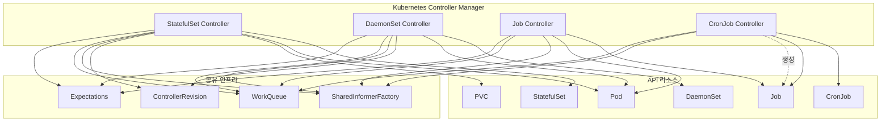

# Workload Controllers 심화

## 1. 개요 - 왜 워크로드별로 다른 컨트롤러가 필요한가

Kubernetes에서 Pod는 가장 작은 배포 단위이지만, 사용자가 직접 Pod를 관리하는 일은 드물다.
대부분의 워크로드는 **컨트롤러**를 통해 선언적으로 관리되며, 워크로드의 특성에 따라 서로 다른 컨트롤러가 필요하다.

```
+------------------------------------------------------------------+
|                    워크로드 유형별 컨트롤러                          |
+------------------------------------------------------------------+
|                                                                   |
|   상태 유지 (Stateful)          상태 비유지 (Stateless)             |
|   +-------------------+       +-------------------+               |
|   | StatefulSet       |       | Deployment        |               |
|   | - 순서 보장        |       |  └─ ReplicaSet    |               |
|   | - 안정적 네트워크  |       |     - 무상태 복제  |               |
|   | - PVC 바인딩       |       |     - 롤링 업데이트|               |
|   +-------------------+       +-------------------+               |
|                                                                   |
|   노드당 하나 (Per-Node)       일회성 작업 (Batch)                  |
|   +-------------------+       +-------------------+               |
|   | DaemonSet         |       | Job               |               |
|   | - 로그 수집        |       | - 완료 보장        |               |
|   | - 네트워크 플러그인|       | - 병렬 처리        |               |
|   | - 모니터링 에이전트|       | - 재시도 정책      |               |
|   +-------------------+       +-------------------+               |
|                                                                   |
|                               예약 작업 (Scheduled)                |
|                               +-------------------+               |
|                               | CronJob           |               |
|                               | - 주기적 실행      |               |
|                               | - 동시성 정책      |               |
|                               | - 히스토리 관리    |               |
|                               +-------------------+               |
+------------------------------------------------------------------+
```

### 왜 하나의 컨트롤러로 통합하지 않는가?

| 워크로드 특성 | ReplicaSet | StatefulSet | DaemonSet | Job |
|-------------|-----------|-------------|-----------|-----|
| Pod 교체 가능 | O | X (ID 고정) | X (노드 고정) | X (완료 추적) |
| 스케일링 | 수평 확장 | 순서 기반 | 노드 수 연동 | Completions |
| 스토리지 | 공유/없음 | Pod별 PVC | 노드 스토리지 | 임시 |
| 종료 조건 | 없음 | 없음 | 없음 | 완료/실패 |
| 네트워크 ID | 없음 | Headless DNS | 노드 IP | 없음 |

각 컨트롤러는 고유한 불변식(invariant)을 갖고, 이를 위한 전용 로직이 필요하다.
하나의 범용 컨트롤러는 복잡도가 기하급수적으로 증가하며, 각 워크로드의 의미론(semantics)을 정확히 구현하기 어렵다.

### 공통 패턴: Reconciliation Loop

모든 워크로드 컨트롤러는 동일한 기본 패턴을 따른다:

```
                     +-----------+
                     | Informer  |
                     +-----+-----+
                           |  이벤트 (Add/Update/Delete)
                           v
                     +-----+-----+
                     |   Queue   |
                     +-----+-----+
                           |  key (namespace/name)
                           v
                   +-------+-------+
                   | syncHandler() |
                   +-------+-------+
                           |
              +------------+------------+
              |                         |
     +--------v--------+      +--------v--------+
     | 현재 상태 조회    |      | 기대 상태 계산    |
     | (List Pods)      |      | (Spec 분석)      |
     +---------+--------+      +--------+--------+
              |                         |
              +------------+------------+
                           |
                    +------v------+
                    |  상태 비교   |
                    | (Diff 계산) |
                    +------+------+
                           |
              +------------+------------+
              |            |            |
        +-----v----+ +----v-----+ +----v-----+
        | Pod 생성  | | Pod 삭제  | | 상태 갱신 |
        +----------+ +----------+ +----------+
```

소스코드 위치:
- `pkg/controller/statefulset/` - StatefulSet 컨트롤러
- `pkg/controller/daemon/` - DaemonSet 컨트롤러
- `pkg/controller/job/` - Job 컨트롤러
- `pkg/controller/cronjob/` - CronJob 컨트롤러

---

## 2. StatefulSet Controller

### 2.1 순서 보장 (Monotonic vs Burst)

StatefulSet의 가장 핵심적인 특징은 **Pod에 순서(ordinal)를 부여하고, 생성/삭제/업데이트 시 이 순서를 존중한다**는 것이다.

#### 컨트롤러 구조체

`pkg/controller/statefulset/stateful_set.go` (줄 66-95):

```go
type StatefulSetController struct {
    kubeClient      clientset.Interface
    control         StatefulSetControlInterface  // 실제 동기화 로직
    podControl      controller.PodControlInterface
    podIndexer      cache.Indexer
    podLister       corelisters.PodLister
    podListerSynced cache.InformerSynced
    setLister       appslisters.StatefulSetLister
    setListerSynced cache.InformerSynced
    pvcListerSynced cache.InformerSynced
    revListerSynced cache.InformerSynced
    queue           workqueue.TypedRateLimitingInterface[string]
    // ...
}
```

핵심은 `control` 필드의 `StatefulSetControlInterface`이다. 이 인터페이스가 실제 Pod/PVC 관리 로직을 캡슐화한다.

#### sync 흐름

`pkg/controller/statefulset/stateful_set.go` (줄 524-609):

```
sync(key)
  |
  +-- setLister.Get(name)           # StatefulSet 조회
  +-- adoptOrphanRevisions()        # 고아 리비전 입양
  +-- getPodsForStatefulSet()       # Pod 목록 조회
  |
  +-- syncStatefulSet(set, pods)
        |
        +-- control.UpdateStatefulSet(set, pods, now)
              |
              +-- performUpdate()
                    |
                    +-- getStatefulSetRevisions()  # 리비전 결정
                    +-- updateStatefulSet()         # 핵심 동기화
```

#### Monotonic vs Burst 모드

`pkg/controller/statefulset/stateful_set_control.go` (줄 649):

```go
monotonic := !allowsBurst(set)
```

두 모드의 차이는 다음과 같다:

```
Monotonic (OrderedReady, 기본값):
  Pod-0 [Ready] → Pod-1 [Ready] → Pod-2 [Creating...]
  - 하나씩 순서대로 생성
  - 이전 Pod가 Ready가 아니면 다음 Pod 생성 중단
  - 삭제는 역순 (Pod-2 → Pod-1 → Pod-0)

Burst (Parallel):
  Pod-0 [Creating...] Pod-1 [Creating...] Pod-2 [Creating...]
  - 동시에 여러 Pod 생성/삭제 가능
  - 순서 보장 없음
  - 고속 스케일링이 필요한 경우 사용
```

#### updateStatefulSet 핵심 로직

`pkg/controller/statefulset/stateful_set_control.go` (줄 560-614)에서 Pod를 두 그룹으로 분류한다:

```go
// replicas: ordinal 범위 내의 Pod (유지해야 할 Pod)
replicas := make([]*v1.Pod, replicaCount)
// condemned: ordinal 범위 밖의 Pod (삭제해야 할 Pod)
condemned := make([]*v1.Pod, 0, len(pods))

for _, pod := range pods {
    if podInOrdinalRange(pod, set) {
        replicas[getOrdinal(pod)-getStartOrdinal(set)] = pod
    } else if getOrdinal(pod) >= 0 {
        condemned = append(condemned, pod)
    }
}
```

빈 슬롯에는 새 Pod 객체를 생성한다:

```go
for ord := start; ord <= end; ord++ {
    replicaIdx := ord - start
    if replicas[replicaIdx] == nil {
        replicas[replicaIdx] = newVersionedStatefulSetPod(
            currentSet, updateSet,
            currentRevision.Name, updateRevision.Name, ord)
    }
}
```

#### 비가용(Unavailable) 추적

`pkg/controller/statefulset/stateful_set_control.go` (줄 620-641):

```go
for i := range replicas {
    if isUnavailable(replicas[i], set.Spec.MinReadySeconds, now) {
        unavailable++
        if firstUnavailablePod == nil {
            firstUnavailablePod = replicas[i]
        }
    }
}
```

Monotonic 모드에서 unavailable Pod가 있으면 이후 Pod의 생성/삭제가 중단된다.
이는 분산 시스템(예: etcd, ZooKeeper)에서 쿼럼을 유지하기 위해 필수적이다.

**왜 이런 설계인가?**
- 분산 DB나 메시지 큐는 멤버 추가/제거 시 클러스터 합의가 필요하다
- 동시에 여러 노드가 변경되면 쿼럼이 깨질 수 있다
- Monotonic 모드는 이를 방지하여 안전한 롤링 업데이트를 보장한다

### 2.2 PVC 관리 및 Retention Policy

StatefulSet은 Pod마다 전용 PersistentVolumeClaim(PVC)을 생성하고 관리한다.

#### PVC 생성 흐름

`pkg/controller/statefulset/stateful_pod_control.go` (줄 154-172):

```go
func (spc *StatefulPodControl) CreateStatefulPod(ctx context.Context,
    set *apps.StatefulSet, pod *v1.Pod) error {
    // 1. Pod의 PVC를 먼저 생성
    if err := spc.createPersistentVolumeClaims(set, pod); err != nil {
        spc.recordPodEvent("create", set, pod, err)
        return err
    }
    // 2. PVC 생성 성공 후 Pod 생성
    err := spc.objectMgr.CreatePod(ctx, pod, set)
    // 3. PVC Retention Policy 설정
    if err := spc.UpdatePodClaimForRetentionPolicy(ctx, set, pod); err != nil {
        spc.recordPodEvent("update", set, pod, err)
        return err
    }
    return err
}
```

**왜 PVC를 먼저 생성하는가?**
- Pod가 스케줄링되기 전에 스토리지가 준비되어야 한다
- PVC 생성이 실패하면 Pod를 만들 필요가 없다
- Pod 삭제 시 PVC는 유지되어 데이터를 보존한다

#### PVC 이름 규칙

```
{volumeClaimTemplate.Name}-{statefulset.Name}-{ordinal}

예시:
  data-mysql-0
  data-mysql-1
  data-mysql-2
```

#### Retention Policy

StatefulSet은 두 가지 시점에서 PVC 삭제 정책을 설정할 수 있다:

| 필드 | 기본값 | 설명 |
|------|--------|------|
| `whenDeleted` | Retain | StatefulSet 삭제 시 PVC 처리 |
| `whenScaled` | Retain | 스케일 다운 시 PVC 처리 |

```
whenDeleted: Retain   + whenScaled: Retain   → PVC 항상 보존 (기본)
whenDeleted: Delete   + whenScaled: Retain   → SS 삭제 시만 PVC 삭제
whenDeleted: Retain   + whenScaled: Delete   → 스케일 다운 시 PVC 삭제
whenDeleted: Delete   + whenScaled: Delete   → 모두 삭제
```

`UpdateStatefulPod` (줄 175-206)에서는 Pod 업데이트 시 스토리지 일관성도 확인한다:

```go
if !storageMatches(set, pod) {
    updateStorage(set, pod)
    consistent = false
    if err := spc.createPersistentVolumeClaims(set, pod); err != nil {
        return err
    }
}
```

### 2.3 Revision History

StatefulSet은 ControllerRevision을 사용하여 업데이트 이력을 관리한다.

#### Revision 결정 로직

`pkg/controller/statefulset/stateful_set_control.go` (줄 266-328):

```go
func (ssc *defaultStatefulSetControl) getStatefulSetRevisions(
    set *apps.StatefulSet,
    revisions []*apps.ControllerRevision,
) (*apps.ControllerRevision, *apps.ControllerRevision, int32, error) {
    // 1. 현재 스펙으로 새 리비전 생성
    updateRevision, err := newRevision(set, nextRevision(revisions), &collisionCount)

    // 2. 동일한 리비전이 있는지 검색
    equalRevisions := history.FindEqualRevisions(revisions, updateRevision)

    if equalCount > 0 && ... {
        // 가장 최근 리비전과 동일 → 변경 없음
        updateRevision = revisions[revisionCount-1]
    } else if equalCount > 0 {
        // 과거 리비전으로 롤백 → 해당 리비전의 번호를 증가
        updateRevision, err = ssc.controllerHistory.UpdateControllerRevision(...)
    } else {
        // 새로운 리비전 → 생성
        updateRevision, err = ssc.controllerHistory.CreateControllerRevision(...)
    }

    // 3. 현재 리비전 결정 (Status.CurrentRevision과 일치하는 리비전)
    for i := range revisions {
        if revisions[i].Name == set.Status.CurrentRevision {
            currentRevision = revisions[i]
            break
        }
    }
    return currentRevision, updateRevision, collisionCount, nil
}
```

#### Revision과 Pod의 관계

```
StatefulSet spec 변경 시:

   currentRevision (rev-1)          updateRevision (rev-2)
   +-----------+-----------+       +---------------------------+
   | Pod-0     | Pod-1     |  →→→  | Pod-2 (새 스펙으로 생성)   |
   | rev: rev-1| rev: rev-1|       | rev: rev-2                |
   +-----------+-----------+       +---------------------------+

   업데이트 완료 후:
   currentRevision = updateRevision = rev-2
```

**왜 Revision을 사용하는가?**
- 롤백(Rollback)을 안전하게 구현하기 위해서이다
- 각 Pod가 어떤 스펙으로 생성되었는지 추적할 수 있다
- Revision 히스토리를 통해 이전 상태로 복원할 수 있다

### 2.4 Update Strategy (RollingUpdate, OnDelete)

#### OnDelete Strategy

`pkg/controller/statefulset/stateful_set_control.go` (줄 692-695):

```go
if set.Spec.UpdateStrategy.Type == apps.OnDeleteStatefulSetStrategyType {
    return &status, nil
}
```

OnDelete는 가장 단순하다. 컨트롤러가 자동으로 Pod를 업데이트하지 않는다.
사용자가 수동으로 Pod를 삭제하면, 새 리비전으로 재생성된다.

**왜 OnDelete가 필요한가?**
- 데이터베이스처럼 업데이트 순서를 DBA가 직접 통제해야 하는 경우
- 자동 롤링 업데이트가 위험한 워크로드 (예: 마스터-슬레이브 구조)

#### RollingUpdate Strategy

`pkg/controller/statefulset/stateful_set_control.go` (줄 708-734):

```go
// Partition 이상의 ordinal만 업데이트 대상
updateMin := 0
if set.Spec.UpdateStrategy.RollingUpdate != nil {
    updateMin = int(*set.Spec.UpdateStrategy.RollingUpdate.Partition)
}

// 가장 큰 ordinal부터 역순으로 업데이트
for target := len(replicas) - 1; target >= updateMin; target-- {
    // 업데이트 리비전이 아니고 종료 중이 아닌 Pod → 삭제
    if getPodRevision(replicas[target]) != updateRevision.Name &&
       !isTerminating(replicas[target]) {
        if err := ssc.podControl.DeleteStatefulPod(set, replicas[target]); err != nil {
            return &status, err
        }
        status.CurrentReplicas--
        return &status, err  // 한 번에 하나만 삭제
    }
    // 비가용 Pod가 있으면 대기
    if isUnavailable(replicas[target], set.Spec.MinReadySeconds, now) {
        return &status, nil
    }
}
```

```
RollingUpdate with Partition=1:

   업데이트 대상 아님     업데이트 대상 (높은 ordinal부터)
   +----------+          +----------+----------+
   | Pod-0    |          | Pod-1    | Pod-2    |
   | rev: v1  |          | rev: v1→v2| rev: v1→v2|
   +----------+          +----------+----------+
        ^                      ^
   Partition                역순 업데이트
```

**왜 Partition이 있는가?**
- 카나리(Canary) 배포를 위해서이다
- Partition을 높은 값으로 설정하면 일부 Pod만 새 버전으로 업데이트
- 검증 후 Partition을 0으로 낮추면 전체 롤링 업데이트 진행

#### MaxUnavailable (Feature Gate)

`pkg/controller/statefulset/stateful_set_control.go` (줄 697-706):

```go
if utilfeature.DefaultFeatureGate.Enabled(features.MaxUnavailableStatefulSet) {
    return updateStatefulSetAfterInvariantEstablished(ctx,
        ssc, set, replicas, updateRevision, status, now)
}
```

`MaxUnavailableStatefulSet` 피처 게이트가 활성화되면, 한 번에 여러 Pod를 동시에 업데이트할 수 있다.
이는 대규모 StatefulSet에서 업데이트 속도를 높이기 위한 기능이다.

---

## 3. DaemonSet Controller

### 3.1 노드당 하나 보장

DaemonSet의 핵심 불변식: **각 노드에 정확히 하나의 Pod가 실행된다.**

#### 컨트롤러 구조체

`pkg/controller/daemon/daemon_controller.go` (줄 103-155):

```go
type DaemonSetsController struct {
    kubeClient       clientset.Interface
    eventBroadcaster record.EventBroadcaster
    eventRecorder    record.EventRecorder
    podControl       controller.PodControlInterface
    crControl        controller.ControllerRevisionControlInterface

    // 한 번에 생성/삭제할 수 있는 최대 Pod 수
    burstReplicas    int  // 기본값: 250

    syncHandler      func(ctx context.Context, dsKey string) error
    expectations     controller.ControllerExpectationsInterface

    dsLister         appslisters.DaemonSetLister
    podLister        corelisters.PodLister
    podIndexer       cache.Indexer
    nodeLister       corelisters.NodeLister

    queue            workqueue.TypedRateLimitingInterface[string]
    nodeUpdateQueue  workqueue.TypedRateLimitingInterface[string]

    failedPodsBackoff *flowcontrol.Backoff
}
```

주목할 점:
- `burstReplicas`(250): API 서버 과부하를 방지하기 위해 한 번에 처리하는 Pod 수를 제한
- `nodeUpdateQueue`: 노드 변경 이벤트를 별도 큐로 처리
- `failedPodsBackoff`: 실패한 Pod의 재생성을 지수 백오프로 제한

#### manage 함수

`pkg/controller/daemon/daemon_controller.go` (줄 998-1027):

```go
func (dsc *DaemonSetsController) manage(ctx context.Context,
    ds *apps.DaemonSet, nodeList []*v1.Node, hash string) error {

    // 1. 노드별 DaemonSet Pod 매핑 조회
    nodeToDaemonPods, err := dsc.getNodesToDaemonPods(ctx, ds, false)

    // 2. 각 노드에 대해 생성/삭제 판단
    var nodesNeedingDaemonPods, podsToDelete []string
    for _, node := range nodeList {
        nodesNeedingDaemonPodsOnNode, podsToDeleteOnNode :=
            dsc.podsShouldBeOnNode(logger, node, nodeToDaemonPods, ds, hash)
        nodesNeedingDaemonPods = append(nodesNeedingDaemonPods, ...)
        podsToDelete = append(podsToDelete, ...)
    }

    // 3. 스케줄되지 않은 고아 Pod 정리
    podsToDelete = append(podsToDelete,
        getUnscheduledPodsWithoutNode(nodeList, nodeToDaemonPods)...)

    // 4. 동기화 실행
    return dsc.syncNodes(ctx, ds, podsToDelete, nodesNeedingDaemonPods, hash)
}
```

#### podsShouldBeOnNode 판단 로직

`pkg/controller/daemon/daemon_controller.go` (줄 846-965):

```go
func (dsc *DaemonSetsController) podsShouldBeOnNode(
    logger klog.Logger, node *v1.Node,
    nodeToDaemonPods map[string][]*v1.Pod,
    ds *apps.DaemonSet, hash string,
) (nodesNeedingDaemonPods, podsToDelete []string) {

    shouldRun, shouldContinueRunning := NodeShouldRunDaemonPod(logger, node, ds)
    daemonPods, exists := nodeToDaemonPods[node.Name]

    switch {
    case shouldRun && !exists:
        // Pod가 있어야 하는데 없음 → 생성 목록에 추가
        nodesNeedingDaemonPods = append(nodesNeedingDaemonPods, node.Name)

    case shouldContinueRunning:
        // Pod가 계속 실행되어야 함 → 실패/완료/중복 Pod 처리
        // ...

    case !shouldContinueRunning && exists:
        // Pod가 있으면 안 됨 → 삭제 목록에 추가
        for _, pod := range daemonPods {
            podsToDelete = append(podsToDelete, pod.Name)
        }
    }
}
```

```
podsShouldBeOnNode 결정 매트릭스:

                     shouldRun=true        shouldRun=false
                  +-------------------+-------------------+
  Pod 없음        | 생성 필요          | 아무것도 안 함     |
                  +-------------------+-------------------+
  Pod 있음(실행중) | 중복 검사          | 삭제 필요          |
                  +-------------------+-------------------+
  Pod 있음(실패)   | 삭제 후 재생성     | 삭제 필요          |
                  +-------------------+-------------------+
```

#### 실패 Pod 백오프

실패한 Pod 삭제 시 지수 백오프를 적용한다 (줄 870-884):

```go
if pod.Status.Phase == v1.PodFailed {
    backoffKey := failedPodsBackoffKey(ds, node.Name)
    now := dsc.failedPodsBackoff.Clock.Now()
    inBackoff := dsc.failedPodsBackoff.IsInBackOffSinceUpdate(backoffKey, now)
    if inBackoff {
        delay := dsc.failedPodsBackoff.Get(backoffKey)
        dsc.enqueueDaemonSetAfter(ds, delay)
        continue  // 백오프 중이면 스킵
    }
    dsc.failedPodsBackoff.Next(backoffKey, now)
    podsToDelete = append(podsToDelete, pod.Name)
}
```

**왜 백오프가 필요한가?**
- kubelet이 Pod를 거부하는 경우 (리소스 부족 등) 무한 루프 방지
- API 서버에 대한 DoS 공격 방지
- 일시적 노드 문제가 해결될 시간 확보

### 3.2 Toleration 및 스케줄링

DaemonSet Pod의 스케줄링은 `NodeShouldRunDaemonPod` 함수에서 결정된다.
이 함수는 노드의 Taint와 DaemonSet의 Toleration을 비교한다.

```
노드 스케줄링 판단 흐름:

  NodeShouldRunDaemonPod(node, ds)
    |
    +-- nodeSelector 일치 확인
    +-- nodeAffinity 일치 확인
    +-- taint/toleration 확인
    |     |
    |     +-- NoSchedule taint 존재 → toleration 있으면 통과
    |     +-- NoExecute taint 존재  → shouldContinueRunning = false
    |
    +-- shouldRun, shouldContinueRunning 반환
```

DaemonSet은 시스템 구성요소(로그 수집기, CNI 플러그인 등)이기 때문에
기본적으로 여러 시스템 taint를 용인(tolerate)할 수 있도록 자동으로 toleration이 추가된다:

| 자동 추가되는 Toleration | 효과 |
|--------------------------|------|
| `node.kubernetes.io/not-ready` | 노드가 Ready가 아니어도 실행 |
| `node.kubernetes.io/unreachable` | 노드가 Unreachable이어도 실행 |
| `node.kubernetes.io/disk-pressure` | 디스크 압박 상태에서도 실행 |
| `node.kubernetes.io/memory-pressure` | 메모리 압박 상태에서도 실행 |
| `node.kubernetes.io/unschedulable` | Cordon된 노드에서도 실행 |

#### NodeAffinity를 통한 노드 바인딩

DaemonSet 컨트롤러는 Pod를 특정 노드에 스케줄링하기 위해 NodeAffinity를 사용한다.
`syncNodes` (줄 1083-1084)에서 Pod 템플릿에 NodeAffinity를 주입한다:

```go
podTemplate.Spec.Affinity = util.ReplaceDaemonSetPodNodeNameNodeAffinity(
    podTemplate.Spec.Affinity, nodesNeedingDaemonPods[ix])
```

### 3.3 Rolling Update (maxSurge/maxUnavailable)

DaemonSet의 롤링 업데이트는 두 가지 전략으로 나뉜다.

#### Strategy 선택

`pkg/controller/daemon/daemon_controller.go` (줄 975-984):

```go
switch ds.Spec.UpdateStrategy.Type {
case apps.OnDeleteDaemonSetStrategyType:
    // 아무것도 하지 않음 - 수동 삭제 시 업데이트
case apps.RollingUpdateDaemonSetStrategyType:
    err = dsc.rollingUpdate(ctx, ds, nodeList, hash)
}
```

#### maxSurge=0 (기본값): 삭제 후 생성

`pkg/controller/daemon/update.go` (줄 69-128):

```
maxSurge=0, maxUnavailable=1 (기본):

  시점 1: Node-A [old-v1]  Node-B [old-v1]  Node-C [old-v1]
                  ↓ 삭제
  시점 2: Node-A [없음]    Node-B [old-v1]  Node-C [old-v1]
                  ↓ 생성 (manage loop)
  시점 3: Node-A [new-v2]  Node-B [old-v1]  Node-C [old-v1]
                             ↓ 삭제 (Ready 확인 후)
  시점 4: Node-A [new-v2]  Node-B [없음]    Node-C [old-v1]
  ...
```

핵심 로직:

```go
if maxSurge == 0 {
    for nodeName, pods := range nodeToDaemonPods {
        newPod, oldPod, ok := findUpdatedPodsOnNode(ds, pods, hash)
        switch {
        case oldPod == nil && newPod == nil, oldPod != nil && newPod != nil:
            numUnavailable++
        case newPod != nil:
            if !podutil.IsPodAvailable(newPod, ds.Spec.MinReadySeconds, ...) {
                numUnavailable++
            }
        default: // oldPod만 있음
            if !podutil.IsPodAvailable(oldPod, ...) {
                // 비가용 old Pod → 즉시 교체 대상
                allowedReplacementPods = append(allowedReplacementPods, oldPod.Name)
                numUnavailable++
            } else if numUnavailable < maxUnavailable {
                // 가용 old Pod → 삭제 후보
                candidatePodsToDelete = append(candidatePodsToDelete, oldPod.Name)
            }
        }
    }
    // maxUnavailable 한도 내에서 삭제
    remainingUnavailable := maxUnavailable - numUnavailable
    oldPodsToDelete := append(allowedReplacementPods,
        candidatePodsToDelete[:remainingUnavailable]...)
    return dsc.syncNodes(ctx, ds, oldPodsToDelete, nil, hash)
}
```

#### maxSurge>0: 생성 후 삭제

`pkg/controller/daemon/update.go` (줄 132-228):

```
maxSurge=1, maxUnavailable=0:

  시점 1: Node-A [old-v1]  Node-B [old-v1]  Node-C [old-v1]
                  ↓ 새 Pod 추가 (surge)
  시점 2: Node-A [old-v1 + new-v2]  Node-B [old-v1]  Node-C [old-v1]
                  ↓ new-v2 Ready 후 old-v1 삭제
  시점 3: Node-A [new-v2]  Node-B [old-v1]  Node-C [old-v1]
                             ↓ 새 Pod 추가
  ...
```

```go
// maxSurge > 0: 새 Pod를 먼저 생성하고, 가용해지면 old Pod 삭제
for nodeName, pods := range nodeToDaemonPods {
    newPod, oldPod, ok := findUpdatedPodsOnNode(ds, pods, hash)
    switch {
    case oldPod == nil:
        // manage loop이 처리
    case newPod == nil:
        if !podutil.IsPodAvailable(oldPod, ...) {
            // old Pod 비가용 → 즉시 새 Pod 생성 허용
            allowedNewNodes = append(allowedNewNodes, nodeName)
        } else if numSurge < maxSurge {
            // surge 여유 있음 → 새 Pod 생성 후보
            candidateNewNodes = append(candidateNewNodes, nodeName)
        }
    default: // oldPod와 newPod 둘 다 있음
        if podutil.IsPodAvailable(newPod, ...) {
            // 새 Pod 가용 → old Pod 삭제
            oldPodsToDelete = append(oldPodsToDelete, oldPod.Name)
        } else {
            numSurge++  // 아직 가용하지 않음, surge 카운트
        }
    }
}
```

**왜 두 가지 전략이 있는가?**

| 전략 | 장점 | 단점 | 적합한 케이스 |
|------|------|------|-------------|
| maxSurge=0 | 추가 리소스 불필요 | 잠시 서비스 중단 | 리소스가 빡빡한 환경 |
| maxSurge>0 | 무중단 업데이트 | 노드에 2개 Pod 동시 실행 | 고가용성 필수 워크로드 |

#### updatedDesiredNodeCounts

`pkg/controller/daemon/update.go` (줄 600-618)에서 maxSurge, maxUnavailable을 계산한다:

```go
maxUnavailable, err := util.UnavailableCount(ds, desiredNumberScheduled)
maxSurge, err := util.SurgeCount(ds, desiredNumberScheduled)

// 둘 다 0이면 기본값으로 maxUnavailable=1 설정
if desiredNumberScheduled > 0 && maxUnavailable == 0 && maxSurge == 0 {
    maxUnavailable = 1
}
```

### 3.4 Slow Start Batch

DaemonSet은 대량의 Pod를 한 번에 생성할 때 **Slow Start** 패턴을 사용한다.

`pkg/controller/daemon/daemon_controller.go` (줄 1064-1077):

```go
// Batch the pod creates. Batch sizes start at SlowStartInitialBatchSize
// and double with each successful iteration in a kind of "slow start".
batchSize := min(createDiff, controller.SlowStartInitialBatchSize)
for pos := 0; createDiff > pos;
    batchSize, pos = min(2*batchSize, createDiff-(pos+batchSize)), pos+batchSize {

    errorCount := len(errCh)
    createWait.Add(batchSize)
    for i := pos; i < pos+batchSize; i++ {
        go func(ix int) {
            defer createWait.Done()
            // NodeAffinity 주입 후 Pod 생성
            podTemplate.Spec.Affinity = util.ReplaceDaemonSetPodNodeNameNodeAffinity(...)
            err := dsc.podControl.CreatePods(ctx, ...)
        }(i)
    }
    createWait.Wait()
    // 에러 발생 시 남은 생성 건수 조정
    skippedPods := createDiff - (batchSize + pos)
    if errorCount < len(errCh) && skippedPods > 0 {
        dsc.expectations.LowerExpectations(...)
    }
}
```

```
Slow Start 동작 예시 (1000개 노드 클러스터):

  배치 1:   1개 Pod 생성  →  성공
  배치 2:   2개 Pod 생성  →  성공
  배치 3:   4개 Pod 생성  →  성공
  배치 4:   8개 Pod 생성  →  성공
  배치 5:  16개 Pod 생성  →  1개 실패 → 중단, 나머지는 다음 sync에서
  ...
```

**왜 Slow Start가 필요한가?**
- 1000개 노드 클러스터에 DaemonSet 배포 시, 1000개 Pod를 한꺼번에 생성하면:
  - API 서버에 DoS 수준의 부하 발생
  - 쿼터(Quota) 초과 시 대량의 실패 이벤트 발생
  - 컨테이너 레지스트리에 대한 동시 pull 요청 폭주
- Slow Start는 TCP의 Slow Start 알고리즘에서 영감을 받았다
- 성공적인 배치마다 크기를 2배로 늘려 빠르게 최대 속도에 도달하면서도 장애를 조기에 감지한다

StatefulSet도 동일한 패턴을 사용한다.
`pkg/controller/statefulset/stateful_set_control.go` (줄 330-350)에서 `slowStartBatch` 함수가 정의되어 있다:

```go
func slowStartBatch(initialBatchSize int, remaining int,
    fn func(int) (bool, error)) (int, error) {
    successes := 0
    for batchSize := min(remaining, initialBatchSize);
        batchSize > 0;
        batchSize = min(min(2*batchSize, remaining), MaxBatchSize) {
        // 배치 크기만큼 goroutine 실행
        // ...
    }
    return successes, nil
}
```

---

## 4. Job Controller

### 4.1 Completions 및 Parallelism

Job은 "완료"라는 개념이 있는 유일한 워크로드 컨트롤러이다.

#### 컨트롤러 구조체

`pkg/controller/job/job_controller.go` (줄 87-139):

```go
type Controller struct {
    kubeClient       clientset.Interface
    podControl       controller.PodControlInterface
    expectations     controller.ControllerExpectationsInterface
    finalizerExpectations *uidTrackingExpectations
    jobLister        batchv1listers.JobLister
    podStore         corelisters.PodLister
    podIndexer       cache.Indexer
    queue            workqueue.TypedRateLimitingInterface[string]
    orphanQueue      workqueue.TypedRateLimitingInterface[orphanPodKey]
    clock            clock.WithTicker
    podBackoffStore  *backoffStore
}
```

#### Completions 모드

| 모드 | Completions | Parallelism | 동작 |
|------|------------|-------------|------|
| Non-Indexed | N | M | M개의 Pod를 동시 실행, N번 성공하면 완료 |
| Indexed | N | M | M개의 Pod를 동시 실행, 각 인덱스 0~N-1에 대해 한 번씩 성공 |
| 미지정 (1개) | nil (=1) | nil (=1) | 1개 Pod가 성공하면 완료 |
| 작업큐 | nil | M | M개의 Pod가 동시 실행, 하나라도 성공하면 완료 |

#### syncJob 핵심 흐름

`pkg/controller/job/job_controller.go` (줄 869-968):

```go
func (jm *Controller) syncJob(ctx context.Context, key string) (rErr error) {
    // 1. Job 조회
    sharedJob, err := jm.jobLister.Jobs(ns).Get(name)
    job := *sharedJob.DeepCopy()

    // 2. 이미 완료된 Job이면 스킵
    if util.IsJobFinished(&job) {
        jm.podBackoffStore.removeBackoffRecord(key)
        return nil
    }

    // 3. Expectations 확인
    satisfiedExpectations := jm.expectations.SatisfiedExpectations(logger, key)

    // 4. Pod 목록 조회 및 분류
    pods, err := jm.getPodsForJob(ctx, &job)
    activePods := controller.FilterActivePods(logger, pods)
    active := int32(len(activePods))

    // 5. 성공/실패 Pod 집계
    newSucceededPods, newFailedPods := getNewFinishedPods(jobCtx)
    jobCtx.succeeded = job.Status.Succeeded + int32(len(newSucceededPods)) + ...
    jobCtx.failed = job.Status.Failed + int32(nonIgnoredFailedPodsCount(...)) + ...

    // 6. 종료 조건 평가 (순서 중요!)
    //    6.1 기존 SuccessCriteriaMet / FailureTarget 확인
    //    6.2 BackoffLimit 초과 확인
    //    6.3 ActiveDeadlineSeconds 초과 확인
    //    6.4 Indexed Job의 SuccessPolicy 확인
    exceedsBackoffLimit := jobCtx.failed > *job.Spec.BackoffLimit
}
```

```
syncJob 평가 순서 (매우 중요):

  1. 기존 SuccessCriteriaMet 확인  ←  이전 sync에서 이미 성공 판정
  2. 기존 FailureTarget 확인       ←  이전 sync에서 이미 실패 판정
  3. PodFailurePolicy 평가         ←  특정 Pod 실패 패턴 매칭
  4. BackoffLimit 초과             ←  총 실패 횟수 한도
  5. ActiveDeadlineSeconds 초과    ←  시간 제한
  6. BackoffLimitPerIndex 초과     ←  인덱스별 실패 한도
  7. SuccessPolicy 매칭            ←  특정 인덱스 성공 패턴
  8. 전체 Completions 달성          ←  모든 인덱스 성공
```

### 4.2 BackoffLimit 및 지수 백오프

#### BackoffLimit

`pkg/controller/job/job_controller.go` (줄 1013):

```go
exceedsBackoffLimit := jobCtx.failed > *job.Spec.BackoffLimit
```

BackoffLimit은 Job의 총 실패 횟수 한도이다. 기본값은 6이다.

```
BackoffLimit=3 동작 예시:

  Pod-a 실패 (failed=1) → 재시도
  Pod-b 실패 (failed=2) → 재시도
  Pod-c 실패 (failed=3) → 재시도
  Pod-d 실패 (failed=4) → BackoffLimit 초과!
                          → Job 상태: Failed
                          → 남은 active Pod 삭제
```

#### 지수 백오프 저장소

`pkg/controller/job/backoff_utils.go` (줄 35-39):

```go
type backoffRecord struct {
    key                      string
    failuresAfterLastSuccess int32
    lastFailureTime          *time.Time
}
```

백오프 레코드는 **마지막 성공 이후의 실패 횟수**와 **마지막 실패 시간**을 추적한다.

`newBackoffRecord` (줄 95-152)에서 새 레코드를 계산한다:

```go
func (s *backoffStore) newBackoffRecord(key string,
    newSucceededPods []*v1.Pod, newFailedPods []*v1.Pod) backoffRecord {

    // 성공 Pod도 실패 Pod도 없으면 → 기존 레코드 유지
    if len(newSucceededPods) == 0 && len(newFailedPods) == 0 {
        return *backoff
    }

    // 성공 Pod 없고 실패 Pod만 있으면 → 실패 횟수 누적
    if len(newSucceededPods) == 0 {
        backoff.failuresAfterLastSuccess += int32(len(newFailedPods))
        backoff.lastFailureTime = &lastFailureTime
        return *backoff
    }

    // 성공 Pod 있고 실패 Pod 없으면 → 카운터 리셋
    if len(newFailedPods) == 0 {
        backoff.failuresAfterLastSuccess = 0
        backoff.lastFailureTime = nil
        return *backoff
    }

    // 둘 다 있으면 → 마지막 성공 이후의 실패만 카운트
    lastSuccessTime := getFinishedTime(newSucceededPods[last])
    for i := len(newFailedPods) - 1; i >= 0; i-- {
        failedTime := getFinishedTime(newFailedPods[i])
        if !failedTime.After(lastSuccessTime) {
            break
        }
        backoff.failuresAfterLastSuccess += 1
    }
}
```

```
지수 백오프 계산:

  실패 횟수   대기 시간 (기본값)
  1           10초   (DefaultJobPodFailureBackOff)
  2           20초   (10 * 2^1)
  3           40초   (10 * 2^2)
  4           80초   (10 * 2^3)
  5          160초   (10 * 2^4)
  6          320초   (10 * 2^5)
  ...        최대 10분 (MaxJobPodFailureBackOff)
```

**왜 마지막 성공 이후의 실패만 카운트하는가?**
- 장시간 실행되는 Job에서 간헐적 실패는 정상적이다
- 성공이 있었다면 시스템이 정상이라는 증거이다
- 연속 실패만 추적해야 실제 문제를 정확히 감지할 수 있다

### 4.3 Pod Failure Policy

Pod Failure Policy는 실패한 Pod의 종료 코드나 조건에 따라 다른 액션을 취할 수 있게 한다.

`pkg/controller/job/pod_failure_policy.go` (줄 35-81):

```go
func matchPodFailurePolicy(podFailurePolicy *batch.PodFailurePolicy,
    failedPod *v1.Pod) (*string, bool, *batch.PodFailurePolicyAction) {

    for index, rule := range podFailurePolicy.Rules {
        // 종료 코드 기반 매칭
        if rule.OnExitCodes != nil {
            if containerStatus := matchOnExitCodes(&failedPod.Status,
                rule.OnExitCodes); containerStatus != nil {
                switch rule.Action {
                case batch.PodFailurePolicyActionIgnore:
                    return nil, false, &ignore    // 실패 카운트 안 함
                case batch.PodFailurePolicyActionFailIndex:
                    return nil, true, &failIndex  // 해당 인덱스만 실패
                case batch.PodFailurePolicyActionCount:
                    return nil, true, &count      // 일반 실패로 카운트
                case batch.PodFailurePolicyActionFailJob:
                    return &msg, true, &failJob   // Job 즉시 실패
                }
            }
        // Pod 조건 기반 매칭
        } else if rule.OnPodConditions != nil {
            if podCondition := matchOnPodConditions(&failedPod.Status,
                rule.OnPodConditions); podCondition != nil {
                // 동일한 액션 분기
            }
        }
    }
    return nil, true, nil  // 매칭 없음 → 기본 동작 (카운트)
}
```

#### 4가지 액션

```
Pod Failure Policy 액션:

  +----------+     Exit Code 137 (OOM)     +---------+
  | Pod 실패  | ──────────────────────────→ | Ignore  |  실패 카운트 안 함
  |          |                             +---------+  (재시도)
  |          |     Exit Code 42 (버그)     +----------+
  |          | ──────────────────────────→ | FailJob  |  Job 즉시 종료
  |          |                             +----------+
  |          |     DisruptionTarget 조건   +---------+
  |          | ──────────────────────────→ | Count   |  일반 실패로 카운트
  |          |                             +---------+
  |          |     Exit Code 1 (에러)      +-----------+
  |          | ──────────────────────────→ | FailIndex |  해당 인덱스만 실패
  +----------+                             +-----------+
```

실제 사용 예시:

```yaml
apiVersion: batch/v1
kind: Job
spec:
  podFailurePolicy:
    rules:
    - action: Ignore
      onExitCodes:
        containerName: worker
        operator: In
        values: [137]  # OOMKilled → 재시도 (실패 카운트 안 함)
    - action: FailJob
      onExitCodes:
        operator: In
        values: [42]   # 알려진 복구 불가능한 에러 → 즉시 종료
    - action: Ignore
      onPodConditions:
      - type: DisruptionTarget
        status: "True"  # Preemption/Eviction → 재시도
```

**왜 Pod Failure Policy가 필요한가?**
- OOMKilled(137)는 일시적 문제일 수 있어 BackoffLimit에 카운트하면 안 된다
- 복구 불가능한 에러(잘못된 설정, 데이터 오류)는 재시도해도 소용없다
- Preemption이나 Eviction에 의한 실패는 애플리케이션 버그가 아니다
- 이런 구분 없이는 BackoffLimit을 적절히 설정하기 어렵다

### 4.4 Indexed Job

Indexed Job은 각 Pod에 고유한 인덱스를 부여하여 병렬 데이터 처리에 활용한다.

`pkg/controller/job/indexed_job_utils.go` (줄 36-43):

```go
const (
    completionIndexEnvName = "JOB_COMPLETION_INDEX"
    unknownCompletionIndex = -1
)

func isIndexedJob(job *batch.Job) bool {
    return job.Spec.CompletionMode != nil &&
           *job.Spec.CompletionMode == batch.IndexedCompletion
}
```

각 Pod는 `JOB_COMPLETION_INDEX` 환경변수로 자신의 인덱스를 알 수 있다.

#### 성공 인덱스 계산

`calculateSucceededIndexes` (줄 61-75):

```go
func calculateSucceededIndexes(logger klog.Logger, job *batch.Job,
    pods []*v1.Pod) (orderedIntervals, orderedIntervals) {
    // 기존 완료 인덱스를 파싱
    prevIntervals := parseIndexesFromString(logger,
        job.Status.CompletedIndexes, int(*job.Spec.Completions))
    // 새로 성공한 인덱스 수집
    newSucceeded := sets.New[int]()
    for _, p := range pods {
        ix := getCompletionIndex(p.Annotations)
        if p.Status.Phase == v1.PodSucceeded &&
           ix != unknownCompletionIndex &&
           ix < int(*job.Spec.Completions) &&
           hasJobTrackingFinalizer(p) {
            newSucceeded.Insert(ix)
        }
    }
    result := prevIntervals.withOrderedIndexes(sets.List(newSucceeded))
    return prevIntervals, result
}
```

성공한 인덱스는 **압축된 인터벌 형식**으로 저장된다:

```
Completions=10 일 때:

  성공: 0,1,2,3,5,6,8
  저장: "0-3,5-6,8"   (orderedIntervals)

  실패: 4,7
  대기: 9
```

```
Indexed Job (completions=5, parallelism=2):

  +--------+--------+--------+--------+--------+
  | idx=0  | idx=1  | idx=2  | idx=3  | idx=4  |
  +--------+--------+--------+--------+--------+
       |        |        |        |        |
       v        v        |        |        |
  [Pod-0]  [Pod-1]      |        |        |   ← 동시에 2개 실행
       |        |        |        |        |
  성공 ✓    성공 ✓       v        v        |
                    [Pod-2]  [Pod-3]      |   ← 다음 배치
                         |        |        |
                    성공 ✓    실패 ✗       v
                              ↓       [Pod-4]  ← idx=4 실행
                         [Pod-3']         |     idx=3 재시도
                              |      성공 ✓
                         성공 ✓

  완료: "0-4"
```

#### BackoffLimitPerIndex

Indexed Job에서는 전체 Job의 BackoffLimit 외에 인덱스별 실패 한도를 설정할 수 있다:

```go
if hasBackoffLimitPerIndex(&job) {
    jobCtx.failedIndexes = calculateFailedIndexes(logger, &job, pods)
    if jobCtx.failedIndexes.total() > int(*job.Spec.MaxFailedIndexes) {
        // 전체 실패한 인덱스 수가 한도 초과 → Job 실패
        jobCtx.finishedCondition = jm.newFailureCondition(
            batch.JobReasonMaxFailedIndexesExceeded, ...)
    }
}
```

### 4.5 deleteActivePods

`pkg/controller/job/job_controller.go` (줄 1190-1211):

```go
func (jm *Controller) deleteActivePods(ctx context.Context,
    job *batch.Job, pods []*v1.Pod) (int32, int32, error) {
    errCh := make(chan error, len(pods))
    successfulDeletes := int32(len(pods))
    var deletedReady int32 = 0
    wg := sync.WaitGroup{}
    wg.Add(len(pods))
    for i := range pods {
        go func(pod *v1.Pod) {
            defer wg.Done()
            if err := jm.podControl.DeletePod(ctx, ...); err != nil {
                atomic.AddInt32(&successfulDeletes, -1)
                errCh <- err
            }
            if podutil.IsPodReady(pod) {
                atomic.AddInt32(&deletedReady, 1)
            }
        }(pods[i])
    }
    wg.Wait()
    return deletedReady, successfulDeletes, errorFromChannel(errCh)
}
```

모든 active Pod를 **병렬로** 삭제한다. 이는 Job이 실패로 판정되거나
SuccessCriteriaMet으로 완료되었을 때 남은 Pod를 빠르게 정리하기 위해서이다.

#### trackJobStatusAndRemoveFinalizers

`pkg/controller/job/job_controller.go` (줄 1268-1277):

```
trackJobStatusAndRemoveFinalizers 동작:

  1. 완료된 Pod를 .status.uncountedTerminatedPods에 추가
  2. Finalizer 제거 (Pod 실제 삭제 허용)
  3. 카운터 증가 (succeeded/failed)
  4. 완료 조건 설정

  왜 Finalizer를 사용하는가?
  → Pod가 삭제되기 전에 반드시 카운트되어야 하기 때문
  → Finalizer 없이는 Pod 삭제와 상태 업데이트 사이에 경쟁 조건 발생
```

---

## 5. CronJob Controller

### 5.1 스케줄 파싱 및 TimeZone

#### 컨트롤러 구조체

`pkg/controller/cronjob/cronjob_controllerv2.go` (줄 63-81):

```go
type ControllerV2 struct {
    queue        workqueue.TypedRateLimitingInterface[string]
    kubeClient   clientset.Interface
    recorder     record.EventRecorder
    broadcaster  record.EventBroadcaster
    jobControl   jobControlInterface
    cronJobControl cjControlInterface
    jobLister    batchv1listers.JobLister
    cronJobLister batchv1listers.CronJobLister
    now          func() time.Time  // 테스트 용이성을 위한 시간 주입
}
```

`now func() time.Time` 필드는 테스트에서 시간을 조작할 수 있게 해주는 설계 패턴이다.

#### sync 흐름

`pkg/controller/cronjob/cronjob_controllerv2.go` (줄 188-235):

```go
func (jm *ControllerV2) sync(ctx context.Context, cronJobKey string) (*time.Duration, error) {
    // 1. CronJob 조회
    cronJob, err := jm.cronJobLister.CronJobs(ns).Get(name)

    // 2. 관련 Job 목록 조회
    jobsToBeReconciled, err := jm.getJobsToBeReconciled(cronJob)

    // 3. 완료된 Job 정리
    updateStatusAfterCleanup := jm.cleanupFinishedJobs(ctx, cronJobCopy, jobsToBeReconciled)

    // 4. 스케줄 동기화 (Job 생성/삭제)
    requeueAfter, updateStatusAfterSync, syncErr :=
        jm.syncCronJob(ctx, cronJobCopy, jobsToBeReconciled)

    // 5. 상태 업데이트
    if updateStatusAfterCleanup || updateStatusAfterSync {
        jm.cronJobControl.UpdateStatus(ctx, cronJobCopy)
    }

    return requeueAfter, syncErr
}
```

#### TimeZone 지원

`syncCronJob` (줄 505-512):

```go
if cronJob.Spec.TimeZone != nil {
    timeZone := ptr.Deref(cronJob.Spec.TimeZone, "")
    if _, err := time.LoadLocation(timeZone); err != nil {
        jm.recorder.Eventf(cronJob, corev1.EventTypeWarning,
            "UnknownTimeZone", "invalid timeZone: %q: %s", timeZone, err)
        return nil, updateStatus, nil
    }
}
```

### 5.2 ConcurrencyPolicy

`syncCronJob` (줄 573-601)에서 세 가지 동시성 정책을 처리한다:

```go
// Allow: 제한 없이 새 Job 생성 (기본값)
// → 아무 검사 없이 진행

// Forbid: 이전 Job이 실행 중이면 새 Job 생성하지 않음
if cronJob.Spec.ConcurrencyPolicy == batchv1.ForbidConcurrent &&
   len(cronJob.Status.Active) > 0 {
    logger.V(4).Info("Not starting job because prior execution is still running")
    jm.recorder.Eventf(cronJob, corev1.EventTypeNormal,
        "JobAlreadyActive", "Not starting job because prior execution is running")
    t := nextScheduleTimeDuration(cronJob, now, sched)
    return t, updateStatus, nil
}

// Replace: 실행 중인 Job을 삭제하고 새 Job 생성
if cronJob.Spec.ConcurrencyPolicy == batchv1.ReplaceConcurrent {
    for _, j := range cronJob.Status.Active {
        job, err := jm.jobControl.GetJob(j.Namespace, j.Name)
        if !deleteJob(logger, cronJob, job, jm.jobControl, jm.recorder) {
            return nil, updateStatus, fmt.Errorf("could not replace job")
        }
        updateStatus = true
    }
}
```

```
ConcurrencyPolicy 비교:

  시간축 →→→→→→→→→→→→→→→→→→→→→→→→→→→→→→→→→→

  Allow:
  t=0    [Job-1 시작]
  t=5    [Job-1 실행중] [Job-2 시작]
  t=10   [Job-1 실행중] [Job-2 실행중] [Job-3 시작]

  Forbid:
  t=0    [Job-1 시작]
  t=5    [Job-1 실행중] (스킵)
  t=10   [Job-1 완료]  [Job-2 시작]

  Replace:
  t=0    [Job-1 시작]
  t=5    [Job-1 삭제] → [Job-2 시작]
  t=10   [Job-2 삭제] → [Job-3 시작]
```

**왜 세 가지 정책이 필요한가?**

| 정책 | 적합한 케이스 | 주의사항 |
|------|-------------|---------|
| Allow | 독립적인 작업 (알림 발송 등) | 리소스 사용량 증가 가능 |
| Forbid | 상호 배타적 작업 (DB 백업 등) | 실행 누락 가능 |
| Replace | 최신 데이터만 중요한 경우 (캐시 갱신 등) | 이전 작업 데이터 손실 |

### 5.3 Missed Schedule 보충

CronJob 컨트롤러는 스케줄을 놓친 경우를 감지하고 처리한다.

`syncCronJob` (줄 528-563):

```go
// 다음 스케줄 시간 계산
scheduledTime, err := nextScheduleTime(logger, cronJob, now, sched, jm.recorder)
if scheduledTime == nil {
    // 놓친 스케줄 없음
    t := nextScheduleTimeDuration(cronJob, now, sched)
    return t, updateStatus, nil
}

// StartingDeadlineSeconds 확인
tooLate := false
if cronJob.Spec.StartingDeadlineSeconds != nil {
    tooLate = scheduledTime.Add(
        time.Second * time.Duration(*cronJob.Spec.StartingDeadlineSeconds),
    ).Before(now)
}
if tooLate {
    // 데드라인 초과 → 실행하지 않고 이벤트 기록
    jm.recorder.Eventf(cronJob, corev1.EventTypeWarning,
        "MissSchedule", "Missed scheduled time to start a job: %s",
        scheduledTime.UTC().Format(time.RFC1123Z))
    t := nextScheduleTimeDuration(cronJob, now, sched)
    return t, updateStatus, nil
}
```

```
Missed Schedule 시나리오:

  컨트롤러 다운타임 동안 스케줄이 지남:

  |-----|-----|-----|-----|-----|-----|
  t=0  t=5  t=10 t=15 t=20 t=25 t=30
       ↑                        ↑
  컨트롤러 다운              컨트롤러 복구

  StartingDeadlineSeconds=60:
    → t=5 스케줄 실행 (30초 지남, 60초 이내)

  StartingDeadlineSeconds=10:
    → t=5 스케줄 스킵 (30초 지남, 10초 초과)
    → MissSchedule 이벤트 기록
```

#### 중복 실행 방지

이미 처리된 스케줄인지 확인한다 (줄 564-572):

```go
if inActiveListByName(cronJob, &batchv1.Job{
    ObjectMeta: metav1.ObjectMeta{
        Name:      getJobName(cronJob, *scheduledTime),
        Namespace: cronJob.Namespace,
    },
}) || cronJob.Status.LastScheduleTime.Equal(&metav1.Time{Time: *scheduledTime}) {
    // 이미 처리된 스케줄 → 스킵
    t := nextScheduleTimeDuration(cronJob, now, sched)
    return t, updateStatus, nil
}
```

Job 이름 생성 방식 (줄 676-678):

```go
func getJobName(cj *batchv1.CronJob, scheduledTime time.Time) string {
    return fmt.Sprintf("%s-%d", cj.Name, getTimeHashInMinutes(scheduledTime))
}
```

Job 이름에 스케줄 시간의 해시를 포함시켜서 **멱등성(idempotency)**을 보장한다.
같은 스케줄 시간에 대해 항상 같은 이름의 Job이 생성되므로, AlreadyExists 에러로 중복을 감지할 수 있다.

### 5.4 히스토리 관리

`cleanupFinishedJobs` (줄 682-716):

```go
func (jm *ControllerV2) cleanupFinishedJobs(ctx context.Context,
    cj *batchv1.CronJob, js []*batchv1.Job) bool {
    // 히스토리 제한이 설정되지 않으면 정리하지 않음
    if cj.Spec.FailedJobsHistoryLimit == nil &&
       cj.Spec.SuccessfulJobsHistoryLimit == nil {
        return false
    }

    // Job을 성공/실패로 분류
    failedJobs := []*batchv1.Job{}
    successfulJobs := []*batchv1.Job{}
    for _, job := range js {
        isFinished, finishedStatus := jm.getFinishedStatus(job)
        if isFinished && finishedStatus == batchv1.JobComplete {
            successfulJobs = append(successfulJobs, job)
        } else if isFinished && finishedStatus == batchv1.JobFailed {
            failedJobs = append(failedJobs, job)
        }
    }

    // 한도 초과분 제거
    if cj.Spec.SuccessfulJobsHistoryLimit != nil {
        jm.removeOldestJobs(ctx, cj, successfulJobs,
            *cj.Spec.SuccessfulJobsHistoryLimit)
    }
    if cj.Spec.FailedJobsHistoryLimit != nil {
        jm.removeOldestJobs(ctx, cj, failedJobs,
            *cj.Spec.FailedJobsHistoryLimit)
    }
}
```

```
히스토리 관리 예시:

  SuccessfulJobsHistoryLimit: 3
  FailedJobsHistoryLimit: 1

  현재 상태:
  +------------------+--------+
  | Job              | 상태    |
  +------------------+--------+
  | backup-1709100   | 성공 ✓  |  ← 삭제 (3개 한도 초과)
  | backup-1709160   | 성공 ✓  |  ← 유지
  | backup-1709220   | 실패 ✗  |  ← 삭제 (1개 한도 초과)
  | backup-1709280   | 성공 ✓  |  ← 유지
  | backup-1709340   | 실패 ✗  |  ← 유지
  | backup-1709400   | 성공 ✓  |  ← 유지
  +------------------+--------+
```

---

## 6. ReplicaSet과의 비교

ReplicaSet은 가장 단순한 Pod 복제 컨트롤러로, 다른 컨트롤러와의 비교 기준이 된다.

```
+-------------------------------------------------------------------+
|                    컨트롤러 기능 비교표                               |
+-------------------------------------------------------------------+

| 기능              | ReplicaSet | StatefulSet | DaemonSet | Job    |
|-------------------|-----------|-------------|-----------|--------|
| Pod 수 보장       | ✓ (N개)   | ✓ (N개)     | 노드 수   | 완료까지|
| 순서 보장         | ✗         | ✓           | ✗         | 인덱스 |
| 안정적 네트워크 ID | ✗         | ✓           | ✗         | ✗      |
| 전용 PVC         | ✗         | ✓           | ✗         | ✗      |
| 롤링 업데이트     | Deployment| ✓           | ✓         | ✗      |
| 완료 조건         | 없음      | 없음        | 없음      | ✓      |
| 실패 정책         | ✗         | ✗           | ✗         | ✓      |
| 노드 바인딩       | ✗         | ✗           | ✓         | ✗      |
| Revision History | ✗         | ✓           | ✓         | ✗      |
| Pod 이름 예측 가능 | ✗ (hash) | ✓ (ordinal) | ✗ (hash) | ✗     |
```

### 각 컨트롤러의 핵심 불변식(Invariant)

```
ReplicaSet:
  "실행 중인 Pod 수 == spec.replicas"

StatefulSet:
  "실행 중인 Pod 수 == spec.replicas"
  AND "Pod-i가 Ready가 아니면 Pod-(i+1) 생성 안 함" (Monotonic)
  AND "Pod-i의 이름은 {name}-{i}"
  AND "Pod-i의 PVC는 {claimName}-{name}-{i}"

DaemonSet:
  "각 적격 노드에 정확히 1개의 Pod 실행"

Job:
  "성공한 Pod 수 >= spec.completions → 완료"
  AND "실패한 Pod 수 > spec.backoffLimit → 실패"

CronJob:
  "스케줄에 따라 Job을 생성하고 히스토리를 관리"
```

### Expectations 패턴

ReplicaSet, DaemonSet, Job은 모두 **Expectations** 패턴을 공유한다:

```
Expectations 패턴:

  1. 컨트롤러가 Pod 생성/삭제를 API 서버에 요청
  2. 요청한 수만큼의 이벤트를 "기대(expect)"
  3. Informer를 통해 실제 이벤트를 관찰
  4. 기대가 충족되기 전에는 다음 sync를 하지 않음

  왜?
  → Informer의 cache가 아직 업데이트되지 않은 상태에서
    sync를 하면, 이미 요청한 생성/삭제를 다시 요청할 수 있다
  → Expectations가 이 경쟁 조건을 방지한다

  +--------+     Create 3 Pods     +--------+
  | 컨트롤러| ──────────────────→ | API 서버|
  |        |  expect: 3 creates   |        |
  +--------+                      +--------+
       |                               |
       |  ← Pod Created 이벤트 (1/3)   |
       |  ← Pod Created 이벤트 (2/3)   |
       |  ← Pod Created 이벤트 (3/3)   |
       |                               |
       |  Expectations 충족 → 다음 sync 가능
```

---

## 7. 소스코드 맵

```
pkg/controller/
├── statefulset/
│   ├── stateful_set.go              # StatefulSetController 구조체 (줄 66-95)
│   │                                  sync() (줄 524-579)
│   │                                  syncStatefulSet() (줄 582-609)
│   ├── stateful_set_control.go      # UpdateStatefulSet (줄 86-107)
│   │                                  getStatefulSetRevisions (줄 266-328)
│   │                                  slowStartBatch (줄 330+)
│   │                                  updateStatefulSet (줄 560-614)
│   │                                  비가용 추적 (줄 620-641)
│   │                                  Update Strategy (줄 649-734)
│   ├── stateful_pod_control.go      # PVC 관리 인터페이스 (줄 42-50)
│   │                                  CreateStatefulPod (줄 154-172)
│   │                                  UpdateStatefulPod (줄 175+)
│   └── stateful_set_utils.go        # 유틸리티 함수들
│
├── daemon/
│   ├── daemon_controller.go         # DaemonSetsController 구조체 (줄 103-155)
│   │                                  podsShouldBeOnNode (줄 846-965)
│   │                                  manage (줄 998-1027)
│   │                                  syncNodes (줄 1031+)
│   │                                  Slow Start (줄 1064-1077)
│   ├── update.go                    # rollingUpdate (줄 44+)
│   │                                  maxSurge=0 로직 (줄 69-128)
│   │                                  maxSurge>0 로직 (줄 132-228)
│   │                                  updatedDesiredNodeCounts (줄 600-618)
│   └── util/
│       └── daemonset_util.go        # 헬퍼 함수들
│
├── job/
│   ├── job_controller.go            # Controller 구조체 (줄 87-139)
│   │                                  syncJob (줄 869-968)
│   │                                  deleteActivePods (줄 1190-1211)
│   │                                  trackJobStatusAndRemoveFinalizers (줄 1277+)
│   ├── backoff_utils.go             # backoffRecord (줄 35-39)
│   │                                  newBackoffRecord (줄 95-152)
│   ├── pod_failure_policy.go        # matchPodFailurePolicy (줄 35-81)
│   ├── success_policy.go            # matchSuccessPolicy (줄 29-50)
│   └── indexed_job_utils.go         # calculateSucceededIndexes (줄 61-75)
│                                      calculateFailedIndexes (줄 80+)
│
└── cronjob/
    └── cronjob_controllerv2.go      # ControllerV2 구조체 (줄 63-81)
                                       sync (줄 188-235)
                                       syncCronJob (줄 426-674)
                                       cleanupFinishedJobs (줄 682-716)
                                       getJobName (줄 676-678)
```

---

## 8. 핵심 정리

### 각 컨트롤러의 설계 철학

```
+------------------------------------------------------------------+
| 컨트롤러       | 설계 철학                                         |
+------------------------------------------------------------------+
| StatefulSet   | "순서와 정체성이 중요한 워크로드를 안전하게"          |
|               | → 순서 보장, 안정적 ID, PVC 바인딩                  |
+------------------------------------------------------------------+
| DaemonSet     | "모든 노드에 정확히 하나씩, 시스템 서비스처럼"        |
|               | → 노드 연동, 자동 toleration, slow start           |
+------------------------------------------------------------------+
| Job           | "완료를 보장하되, 실패를 지능적으로 처리"             |
|               | → 완료 추적, 지수 백오프, 실패 정책                  |
+------------------------------------------------------------------+
| CronJob       | "스케줄에 따라 정확하게, 히스토리를 깔끔하게"          |
|               | → 스케줄 파싱, 동시성 제어, 히스토리 관리            |
+------------------------------------------------------------------+
```

### 공통 패턴 요약

| 패턴 | 사용 컨트롤러 | 목적 |
|------|-------------|------|
| Expectations | RS, DS, Job | Informer 캐시 불일치 방지 |
| Slow Start | SS, DS | API 서버 과부하 방지 |
| Controller Revision | SS, DS | 롤백 지원 |
| Finalizer | Job | Pod 카운팅 정확성 보장 |
| 지수 백오프 | DS (Pod), Job (Pod) | 실패 시 hot loop 방지 |
| ConsistencyStore | SS, Job | Write 후 Read 일관성 |

### 컨트롤러 선택 가이드

```
워크로드 특성 → 컨트롤러 선택:

  Q1: 작업이 완료되면 Pod가 종료되어야 하는가?
    ├─ Yes → Q2: 주기적으로 실행해야 하는가?
    │         ├─ Yes → CronJob
    │         └─ No  → Job
    └─ No  → Q3: 모든 노드에 1개씩 실행해야 하는가?
              ├─ Yes → DaemonSet
              └─ No  → Q4: Pod마다 고유 ID와 스토리지가 필요한가?
                        ├─ Yes → StatefulSet
                        └─ No  → Deployment (ReplicaSet)
```

### Mermaid: 워크로드 컨트롤러 관계도


