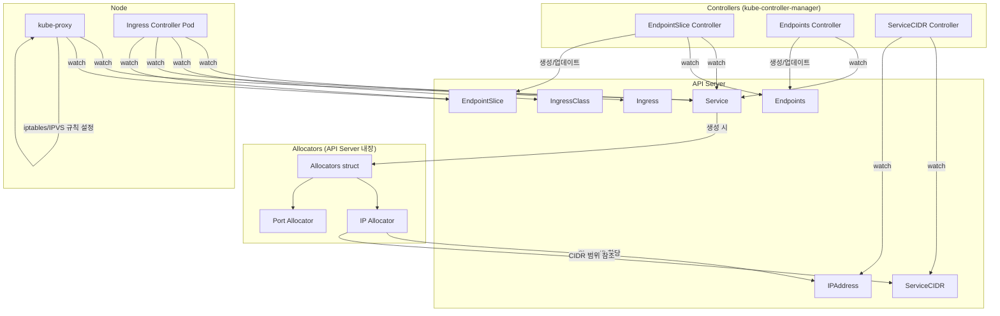
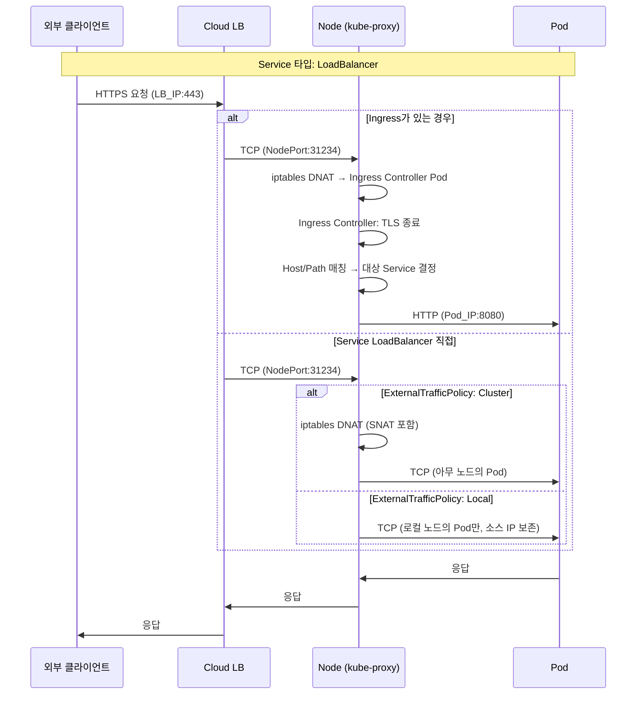
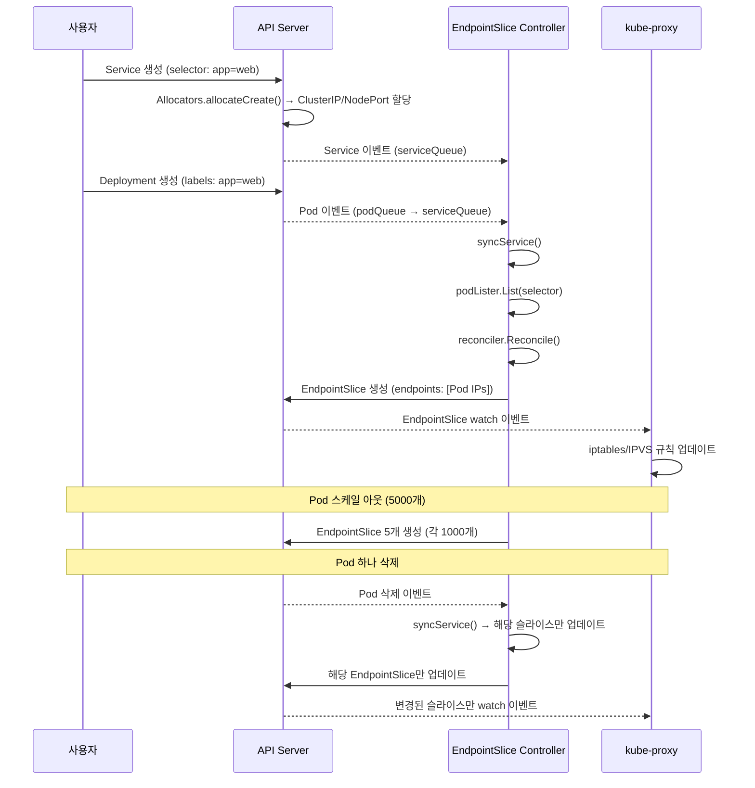

# Service & Ingress 심화

## 1. 개요 — Kubernetes 서비스 네트워킹

Kubernetes에서 Pod는 일시적(ephemeral)이다. ReplicaSet이 Pod를 교체하면 IP가 바뀌고,
스케줄러가 Pod를 다른 노드로 이동시키면 네트워크 경로가 달라진다.
**Service**는 이 불안정한 Pod 집합 위에 **안정적인 네트워크 엔드포인트**를 제공하는 추상화 계층이다.

```
┌─────────────────────────────────────────────────────────────────┐
│                        클라이언트                                  │
│  (브라우저, 다른 Pod, 외부 시스템)                                    │
└───────────────────────────┬─────────────────────────────────────┘
                            │
                  ┌─────────▼─────────┐
                  │     Ingress       │  ← L7 라우팅 (호스트/경로 기반)
                  └─────────┬─────────┘
                            │
                  ┌─────────▼─────────┐
                  │     Service       │  ← 안정적 VIP + 로드밸런싱
                  │  (ClusterIP)      │
                  └─────────┬─────────┘
                            │
              ┌─────────────┼─────────────┐
              │             │             │
        ┌─────▼────┐ ┌─────▼────┐ ┌─────▼────┐
        │  Pod A   │ │  Pod B   │ │  Pod C   │
        │ 10.0.1.5 │ │ 10.0.2.3 │ │ 10.0.3.7 │
        └──────────┘ └──────────┘ └──────────┘
```

**왜 Service가 필요한가?**

1. **서비스 디스커버리**: Pod IP는 수시로 변하지만, Service의 ClusterIP와 DNS 이름은 불변
2. **로드밸런싱**: kube-proxy가 iptables/IPVS 규칙으로 트래픽을 Pod에 분배
3. **네트워크 추상화**: 클라이언트는 백엔드 Pod 수나 위치를 알 필요 없음
4. **외부 노출**: NodePort, LoadBalancer로 클러스터 외부 접근 제공

이 문서에서는 Service의 5가지 타입, IP/Port 할당 메커니즘, EndpointSlice 시스템,
Traffic Policy, Ingress 라우팅, 그리고 ServiceCIDR 관리까지를 소스코드 수준에서 분석한다.

---

## 2. Service 타입

Kubernetes Service는 `spec.type` 필드로 네트워크 노출 방식을 결정한다.

> **소스코드**: `pkg/apis/core/types.go` (줄 4885~4905)

```go
type ServiceType string

const (
    ServiceTypeClusterIP    ServiceType = "ClusterIP"
    ServiceTypeNodePort     ServiceType = "NodePort"
    ServiceTypeLoadBalancer ServiceType = "LoadBalancer"
    ServiceTypeExternalName ServiceType = "ExternalName"
)
```

### 2.1 ClusterIP (기본)

**동작 방식**: 클러스터 내부에서만 접근 가능한 가상 IP(VIP)를 할당한다.

```
┌─────────────────── 클러스터 내부 ───────────────────┐
│                                                     │
│  Pod(client)  ──▶  ClusterIP:Port  ──▶  Pod(backend)│
│  10.0.1.2         10.96.0.100:80       10.0.2.5     │
│                                                     │
│  kube-proxy가 iptables/IPVS 규칙을 설정하여           │
│  VIP → 실제 Pod IP로 DNAT 수행                       │
└─────────────────────────────────────────────────────┘
```

**왜 기본값인가?**

- 대부분의 마이크로서비스 통신은 클러스터 내부에서 발생
- 외부 노출이 필요 없는 백엔드 서비스(DB, 캐시, 내부 API)에 적합
- 불필요한 외부 노출을 방지하여 보안 향상

**핵심 필드** (소스: `pkg/apis/core/types.go`, ServiceSpec 줄 5050~5100):

| 필드 | 타입 | 설명 |
|------|------|------|
| `ClusterIP` | `string` | 할당된 VIP. `"None"`이면 Headless |
| `ClusterIPs` | `[]string` | 듀얼 스택 시 최대 2개 IP |
| `IPFamilies` | `[]IPFamily` | `IPv4`, `IPv6` 중 할당할 패밀리 |
| `IPFamilyPolicy` | `*IPFamilyPolicy` | `SingleStack`, `PreferDualStack`, `RequireDualStack` |

### 2.2 NodePort

**동작 방식**: ClusterIP에 추가로, 모든 노드의 특정 포트(30000~32767)를 통해 외부 접근을 허용한다.

```
┌─────────────── 외부 ───────────────┐
│                                     │
│  Client ──▶ NodeIP:NodePort(31234) │
│                                     │
└──────────────┬──────────────────────┘
               │
  ┌────────────▼────────────────────────────────┐
  │  Node (kube-proxy)                          │
  │                                              │
  │  NodePort(31234) ──▶ ClusterIP ──▶ Pod      │
  │  iptables DNAT       10.96.0.100   10.0.2.5 │
  └──────────────────────────────────────────────┘
```

**왜 30000~32767 범위인가?**

- 1~1023: 잘 알려진(Well-known) 포트로, 대부분의 OS에서 root 권한 필요
- 1024~29999: 기존 애플리케이션이 사용하는 에피메럴(ephemeral) 포트와 충돌 가능
- 30000~32767: 충돌 가능성이 매우 낮은 안전한 범위
- `--service-node-port-range` 플래그로 커스터마이징 가능

**소스코드 참고** (줄 5059~5060의 ServiceSpec 주석):

> "NodePort" builds on ClusterIP and allocates a port on every node which routes to the clusterIP.

### 2.3 LoadBalancer

**동작 방식**: NodePort에 추가로, 클라우드 프로바이더의 외부 로드밸런서를 자동 프로비저닝한다.

```
┌──────────────── 외부 ────────────────┐
│  Client ──▶ LB IP:Port              │
│             (34.120.xxx.xxx:80)      │
└──────────────┬───────────────────────┘
               │
  ┌────────────▼────────────────────────────┐
  │  Cloud Load Balancer                    │
  │  (GCP LB / AWS NLB / Azure LB)         │
  └────────────┬────────────────────────────┘
               │
  ┌────────────▼────────────────────────────┐
  │  NodePort(31234) ──▶ ClusterIP ──▶ Pod  │
  └─────────────────────────────────────────┘
```

**핵심 필드** (소스: `pkg/apis/core/types.go`, ServiceSpec):

| 필드 | 설명 |
|------|------|
| `LoadBalancerIP` | (Deprecated) 원하는 외부 IP 지정 |
| `LoadBalancerSourceRanges` | 접근 허용 CIDR 목록 |
| `LoadBalancerClass` | LB 구현체 선택 (줄 5202~5213) |
| `AllocateLoadBalancerNodePorts` | NodePort 자동 할당 여부 (줄 5192~5200) |

**LoadBalancerStatus** (줄 4979~5013):

```go
type LoadBalancerStatus struct {
    Ingress []LoadBalancerIngress  // 할당된 진입점 목록
}

type LoadBalancerIngress struct {
    IP       string               // IP 기반 (GCE, OpenStack)
    Hostname string               // DNS 기반 (AWS)
    IPMode   *LoadBalancerIPMode  // "VIP" 또는 "Proxy"
    Ports    []PortStatus
}
```

**왜 `AllocateLoadBalancerNodePorts`가 도입되었나?**

- 일부 클라우드 LB(예: MetalLB)는 NodePort 없이 직접 Pod로 트래픽 전달 가능
- NodePort를 할당하면 30000~32767 범위의 포트가 소모됨
- `false`로 설정하면 NodePort 할당을 건너뛰어 포트 자원 절약

### 2.4 ExternalName

**동작 방식**: ClusterIP나 프록시 없이, DNS CNAME 레코드만 반환한다.

```
Pod ──DNS 조회──▶ my-svc.ns.svc.cluster.local
                          │
                    CNAME 응답
                          │
                          ▼
              my-database.example.com
```

**왜 ExternalName을 사용하는가?**

- 외부 서비스(AWS RDS, 외부 API)를 클러스터 내부 DNS 이름으로 접근
- 마이그레이션 시 백엔드를 외부 → 내부로 전환해도 클라이언트 코드 변경 불필요
- kube-proxy가 관여하지 않으므로 성능 오버헤드 없음

**주의사항**:
- Selector를 지정하지 않음 (EndpointSlice가 생성되지 않음)
- ClusterIP 할당이 스킵됨 (`allocClusterIPs`에서 `ServiceTypeExternalName` 검사, 줄 342)
- HTTP Host 헤더가 ExternalName으로 설정되지 않아 일부 서비스에서 문제 발생 가능

### 2.5 Headless Service

**동작 방식**: `ClusterIP: "None"`으로 설정하면 가상 IP 없이, DNS가 직접 Pod IP 목록을 반환한다.

```
Pod ──DNS 조회──▶ my-headless-svc.ns.svc.cluster.local
                          │
                    A 레코드 목록 (Pod IP들 직접 반환)
                          │
                  ┌───────┼───────┐
                  │       │       │
              10.0.1.5  10.0.2.3  10.0.3.7
```

**왜 Headless가 필요한가?**

1. **StatefulSet**: 각 Pod에 고유한 DNS 이름 필요 (`pod-0.svc.ns.svc.cluster.local`)
2. **클라이언트 사이드 로드밸런싱**: gRPC 등에서 클라이언트가 직접 연결 관리
3. **서비스 디스커버리**: 모든 백엔드 주소를 직접 알아야 하는 경우

**소스코드 확인** — `allocClusterIPs` (줄 346~349):

```go
// headless don't get ClusterIPs
if len(service.Spec.ClusterIPs) > 0 && service.Spec.ClusterIPs[0] == api.ClusterIPNone {
    return nil, nil
}
```

Headless + Selectorless 특수 케이스 (줄 235~258): selector가 없는 headless 서비스는
기본적으로 `RequireDualStack` 정책이 적용되며, 사용자가 직접 Endpoints를 관리한다.

---

## 3. IP 할당

### 3.1 ClusterIP Allocator

Service가 생성될 때, API 서버는 `Allocators` 구조체를 통해 ClusterIP를 할당한다.

> **소스코드**: `pkg/registry/core/service/storage/alloc.go` (줄 40~44)

```go
type Allocators struct {
    serviceIPAllocatorsByFamily map[api.IPFamily]ipallocator.Interface
    defaultServiceIPFamily      api.IPFamily
    serviceNodePorts            portallocator.Interface
}
```

**할당 흐름**:

```
Service 생성 요청
       │
       ▼
  allocateCreate()  (줄 65)
       │
       ├──▶ initIPFamilyFields()   ← IP 패밀리 초기화/검증
       │         (줄 104~303)
       │
       ├──▶ txnAllocClusterIPs()   ← ClusterIP 할당 (트랜잭션)
       │         (줄 305~337)
       │         │
       │         ├──▶ allocClusterIPs()  (줄 340~393)
       │         │         │
       │         │         └──▶ allocIPs()  (줄 395~450)
       │         │                  │
       │         │              ip==""이면 AllocateNext()
       │         │              ip!=""이면 Allocate(parsedIP)
       │         │
       │         └──▶ revert 시: releaseIPs()  (줄 452~479)
       │
       └──▶ txnAllocNodePorts()    ← NodePort 할당 (트랜잭션)
                 (줄 481~515)
```

**왜 트랜잭션 패턴을 사용하는가?**

- ClusterIP 할당 후 NodePort 할당이 실패하면 ClusterIP를 반환해야 함
- `callbackTransaction`의 `revert`/`commit` 콜백으로 원자적 할당 보장
- DryRun 모드에서는 실제 할당하지 않고 검증만 수행

### 3.2 IP Allocator 구현체

> **소스코드**: `pkg/registry/core/service/ipallocator/ipallocator.go` (줄 49~72)

```go
type Allocator struct {
    cidr          *net.IPNet
    prefix        netip.Prefix
    firstAddress  netip.Addr   // 범위 내 첫 번째 IP
    offsetAddress netip.Addr   // 동적/정적 할당 경계
    lastAddress   netip.Addr   // 범위 내 마지막 IP
    family        api.IPFamily
    rangeOffset   int          // 상위/하위 서브레인지 구분 오프셋
    size          uint64       // 사용 가능한 총 IP 수
    client        networkingv1client.NetworkingV1Interface
    ipAddressLister networkingv1listers.IPAddressLister
    ready         atomic.Bool  // ServiceCIDR 준비 여부에 의존
    rand          *rand.Rand
}
```

**KEP-3070: 동적/정적 IP 할당 범위 분리**

```
   Service CIDR: 10.96.0.0/16 (65534 개 주소)

   ┌──────────────────────────────────────────────────────────────┐
   │  10.96.0.1        offsetAddress         10.96.255.254       │
   │      │                 │                      │             │
   │      ▼                 ▼                      ▼             │
   │  ├─── 정적 할당 ─────┤─── 동적 할당 ──────────────────────┤  │
   │  │  (사용자 지정 IP)  │  (AllocateNext()로 자동 할당)     │  │
   │  │  하위 ~16% 범위   │  상위 ~84% 범위                    │  │
   └──────────────────────────────────────────────────────────────┘
```

**왜 범위를 분리하는가?**

- 사용자가 특정 IP를 지정(`spec.clusterIP: 10.96.0.10`)하면 정적 할당
- 자동 할당은 `AllocateNext()`로 상위 범위에서 랜덤 선택
- 두 범위를 겹치면 정적 할당과 동적 할당이 충돌하여 IP 고갈 가속화
- `calculateRangeOffset(cidr)`로 오프셋 계산 (줄 117)

**IPAddress API 객체**: 할당된 각 IP는 `IPAddress` 리소스로 추적된다.

```go
func (a *Allocator) createIPAddress(name string, svc *api.Service, scope string) error {
    ipAddress := networkingv1.IPAddress{
        ObjectMeta: metav1.ObjectMeta{
            Name: name,  // IP 주소 자체가 이름 (예: "10.96.0.100")
            Labels: map[string]string{
                networkingv1.LabelIPAddressFamily: string(a.IPFamily()),
                networkingv1.LabelManagedBy:       ControllerName,
            },
        },
        Spec: networkingv1.IPAddressSpec{
            ParentRef: serviceToRef(svc),  // 어떤 Service가 이 IP를 소유하는지
        },
    }
    _, err := a.client.IPAddresses().Create(context.Background(), &ipAddress, metav1.CreateOptions{})
    // ...
}
```

### 3.3 ServiceCIDR

> **소스코드**: `pkg/apis/networking/types.go` (줄 652~695)

```go
type ServiceCIDR struct {
    metav1.TypeMeta
    metav1.ObjectMeta
    Spec   ServiceCIDRSpec
    Status ServiceCIDRStatus
}

type ServiceCIDRSpec struct {
    // 최대 2개 CIDR (듀얼 스택), 불변(immutable)
    CIDRs []string  // 예: ["10.96.0.0/16", "fd00::/108"]
}

type ServiceCIDRStatus struct {
    Conditions []metav1.Condition
}
```

**ServiceCIDR의 역할**:

1. Service ClusterIP 할당에 사용할 CIDR 범위 정의
2. 듀얼 스택 시 IPv4와 IPv6 CIDR을 각각 지정
3. 여러 ServiceCIDR 리소스로 IP 풀 확장 가능 (MultiCIDRServiceAllocator 피처 게이트)

### 3.4 듀얼 스택

듀얼 스택 Service는 IPv4와 IPv6 ClusterIP를 동시에 가진다.

> **소스코드**: `pkg/apis/core/types.go`, ServiceSpec 줄 5101~5119

```go
// IPFamilies: 최대 2개 (dual-stack)
IPFamilies []IPFamily  // [IPv4, IPv6] 또는 [IPv6, IPv4]

// IPFamilyPolicy: 듀얼 스택 요구 수준
IPFamilyPolicy *IPFamilyPolicy
// SingleStack: 하나의 IP 패밀리만
// PreferDualStack: 듀얼 스택 가능하면 사용, 아니면 싱글
// RequireDualStack: 반드시 듀얼 스택 (불가하면 에러)
```

**initIPFamilyFields 핵심 로직** (줄 104~303):

```
IPFamilyPolicy가 nil이면:
  ├─ 업데이트(PUT) → 이전 정책 유지
  ├─ Headless + Selectorless → RequireDualStack
  └─ 그 외(생성) → SingleStack

IPFamilies가 비어있으면:
  └─ 클러스터 기본 패밀리(defaultServiceIPFamily) 사용

RequireDualStack 또는 PreferDualStack이면:
  ├─ IPFamilies가 1개 + 클러스터에 2개 패밀리 구성됨
  └─ → 보조 패밀리 자동 추가
```

**왜 PreferDualStack 서비스는 자동 업/다운그레이드하지 않는가?** (줄 112~122)

클러스터가 싱글 스택에서 듀얼 스택으로 전환되었을 때, 기존 PreferDualStack 서비스를
자동으로 업그레이드하면 예상치 못한 IP 변경이 발생할 수 있다.
사용자가 명시적으로 IPFamilyPolicy를 변경해야만 전환된다.

---

## 4. NodePort 할당

### 4.1 Port Allocator

> **소스코드**: `pkg/registry/core/service/portallocator/allocator.go` (줄 55~62)

```go
type PortAllocator struct {
    portRange net.PortRange       // 기본: 30000-32767
    alloc     allocator.Interface // 비트맵 기반 할당자
    metrics   metricsRecorderInterface
}
```

인터페이스 정의 (줄 31~39):

```go
type Interface interface {
    Allocate(int) error      // 특정 포트 할당
    AllocateNext() (int, error) // 다음 가용 포트 할당
    Release(int) error       // 포트 반환
    ForEach(func(int))       // 할당된 포트 순회
    Has(int) bool            // 포트 할당 여부 확인
    Destroy()
    EnableMetrics()
}
```

### 4.2 NodePort 할당 흐름

> **소스코드**: `pkg/registry/core/service/storage/alloc.go` (줄 481~568)

```
txnAllocNodePorts(service, dryRun)
       │
       ├─ ServiceType이 NodePort 또는 LoadBalancer인가?
       │      │
       │      └─ YES ──▶ initNodePorts(service, nodePortOp)
       │                      │
       │                      ├─ 각 ServicePort에 대해:
       │                      │    │
       │                      │    ├─ NodePort 지정됨 → Allocate(np)
       │                      │    │  (이미 할당된 포트면 에러)
       │                      │    │
       │                      │    └─ NodePort 미지정 → AllocateNext()
       │                      │       (범위에서 자동 할당)
       │                      │
       │                      └─ 같은 service port에 대한 중복 방지
       │                         (svcPortToNodePort 맵 활용)
       │
       └─ ExternalTrafficPolicy=Local이면?
              │
              └─ YES ──▶ allocHealthCheckNodePort()
                              │
                              ├─ 지정됨 → Allocate(healthCheckNodePort)
                              └─ 미지정 → AllocateNext()
```

**AllocateLoadBalancerNodePorts 필드** (줄 5192~5200):

```go
// AllocateLoadBalancerNodePorts: LoadBalancer 타입에서 NodePort 자동 할당 여부
// Default: true
// false 설정 시: NodePort를 할당하지 않음 (사용자가 명시적으로 지정한 경우는 존중)
AllocateLoadBalancerNodePorts *bool
```

**shouldAllocateNodePorts** 함수가 이 필드를 확인하여 (줄 521~523):

```go
if servicePort.NodePort == 0 && !shouldAllocateNodePorts(service) {
    continue  // 자동 할당하지 않되, 명시적 요청은 존중
}
```

### 4.3 HealthCheck NodePort

`ExternalTrafficPolicy: Local` + `LoadBalancer` 타입일 때, 로드밸런서가
각 노드의 로컬 엔드포인트 유무를 확인하기 위한 헬스체크 포트가 필요하다.

> **소스코드**: `alloc.go` 줄 570~589

```go
func (al *Allocators) allocHealthCheckNodePort(service *api.Service, nodePortOp ...) error {
    healthCheckNodePort := service.Spec.HealthCheckNodePort
    if healthCheckNodePort != 0 {
        err := nodePortOp.Allocate(int(healthCheckNodePort))  // 사용자 지정
    } else {
        healthCheckNodePort, err := nodePortOp.AllocateNext()  // 자동 할당
        service.Spec.HealthCheckNodePort = int32(healthCheckNodePort)
    }
    return nil
}
```

**왜 별도의 HealthCheck 포트가 필요한가?**

```
  Cloud LB ──▶ Node A (HealthCheck: /healthz on port 30100)
     │               ├─ 로컬 Pod 있음 → 200 OK → 트래픽 전달
     │
     └──▶ Node B (HealthCheck: /healthz on port 30100)
                  ├─ 로컬 Pod 없음 → 503 → 트래픽 차단
```

`ExternalTrafficPolicy: Local`은 클라이언트 소스 IP를 보존하기 위해
해당 노드의 로컬 Pod에만 트래픽을 전달한다.
로드밸런서는 HealthCheck 포트로 각 노드에 로컬 엔드포인트가 있는지 확인하고,
없는 노드로는 트래픽을 보내지 않는다.

---

## 5. EndpointSlice

### 5.1 구조

EndpointSlice는 Service의 백엔드 엔드포인트를 표현하는 API 리소스이다.
기존 Endpoints 리소스의 확장성 문제를 해결하기 위해 도입되었다.

> **소스코드**: `pkg/apis/discovery/types.go` (줄 29~107)

```go
type EndpointSlice struct {
    metav1.TypeMeta
    metav1.ObjectMeta
    AddressType AddressType    // IPv4, IPv6, FQDN
    Endpoints   []Endpoint     // 최대 1000개
    Ports       []EndpointPort // 최대 100개
}
```

**AddressType** (줄 59~66):

| 타입 | 값 | 설명 |
|------|------|------|
| `AddressTypeIPv4` | `"IPv4"` | IPv4 주소 |
| `AddressTypeIPv6` | `"IPv6"` | IPv6 주소 |
| `AddressTypeFQDN` | `"FQDN"` | 도메인 이름 (Deprecated) |

**Endpoint 구조체** (줄 69~107):

```go
type Endpoint struct {
    Addresses  []string           // 최소 1개, 최대 100개
    Conditions EndpointConditions // ready, serving, terminating
    Hostname   *string            // DNS에서 Pod 구분용
    TargetRef  *api.ObjectReference // 참조 Pod/노드
    NodeName   *string            // 호스팅 노드 이름
    Zone       *string            // Zone 정보 (topology 활용)
    Hints      *EndpointHints     // 토폴로지 힌트
}
```

**왜 Endpoints 대신 EndpointSlice인가?**

| 기준 | Endpoints (레거시) | EndpointSlice |
|------|-------------------|---------------|
| 엔드포인트 수 | 하나의 객체에 모두 | 슬라이스당 최대 1000개 |
| 업데이트 크기 | 전체 객체 교체 | 변경된 슬라이스만 업데이트 |
| 듀얼 스택 | 미지원 | AddressType별 별도 슬라이스 |
| 토폴로지 | 미지원 | Zone, Hints 필드 내장 |
| etcd 부하 | Pod 변경 시 전체 재전송 | 해당 슬라이스만 재전송 |

**대규모 Service 예시**:

```
Service에 5000개 Pod가 있을 때:

[Endpoints 방식]
  1개 Endpoints 객체 (5000개 주소)
  → Pod 1개 변경 시 5000개 주소 전체 재전송
  → watch 이벤트 크기: ~수 MB

[EndpointSlice 방식]
  5개 EndpointSlice (각 1000개)
  → Pod 1개 변경 시 해당 슬라이스만 재전송
  → watch 이벤트 크기: ~수십 KB
```

### 5.2 EndpointSlice Controller

> **소스코드**: `pkg/controller/endpointslice/endpointslice_controller.go`

**상수 정의** (줄 54~82):

```go
const (
    maxRetries                      = 15
    endpointSliceChangeMinSyncDelay = 1 * time.Second
    defaultSyncBackOff              = 1 * time.Second
    maxSyncBackOff                  = 1000 * time.Second
    ControllerName                  = "endpointslice-controller.k8s.io"
    topologyQueueItemKey            = "topologyQueueItemKey"
)
```

**Controller 구조체** (줄 193~268):

```go
type Controller struct {
    client           clientset.Interface
    eventBroadcaster record.EventBroadcaster
    eventRecorder    record.EventRecorder

    // Informer 기반 캐시
    serviceLister        corelisters.ServiceLister
    podLister            corelisters.PodLister
    endpointSliceLister  discoverylisters.EndpointSliceLister
    nodeLister           corelisters.NodeLister

    // 트래커
    endpointSliceTracker *endpointsliceutil.EndpointSliceTracker

    // 큐: 3개의 독립적인 워크큐
    serviceQueue  workqueue.TypedRateLimitingInterface[string]
    podQueue      workqueue.TypedRateLimitingInterface[*endpointsliceutil.PodProjectionKey]
    topologyQueue workqueue.TypedRateLimitingInterface[string]

    maxEndpointsPerSlice int32  // 슬라이스당 최대 엔드포인트 수
    reconciler           *endpointslicerec.Reconciler
    topologyCache        *topologycache.TopologyCache
}
```

**왜 3개의 워크큐를 사용하는가?**

```
┌───────────────────────────────────────────────────────────┐
│                EndpointSlice Controller                    │
│                                                           │
│  ┌──────────────┐  ┌──────────────┐  ┌─────────────────┐ │
│  │ serviceQueue │  │  podQueue    │  │ topologyQueue   │ │
│  │              │  │              │  │                 │ │
│  │ Service 변경 │  │ Pod 변경     │  │ Node 변경       │ │
│  │ → 직접 sync │  │ → Pod→Svc   │  │ → 토폴로지 재계산│ │
│  │              │  │   매핑 계산  │  │                 │ │
│  └──────┬───────┘  └──────┬───────┘  └────────┬────────┘ │
│         │                 │                    │          │
│         ▼                 ▼                    ▼          │
│   serviceQueueWorker  podQueueWorker   topologyQueueWorker│
│         │                 │                    │          │
│         └────────┬────────┘                    │          │
│                  ▼                             │          │
│            syncService()                 checkNodeTopology│
│                  │                        Distribution()  │
│                  ▼                                        │
│          reconciler.Reconcile()                           │
└───────────────────────────────────────────────────────────┘
```

1. **serviceQueue**: Service CRUD 이벤트 처리. 지수 백오프(1s~1000s)로 재시도
2. **podQueue**: Pod 변경 시 해당 Pod가 속한 Service를 찾아 serviceQueue에 추가.
   네임스페이스에 서비스가 많으면 레이블 셀렉터 평가 비용이 크므로 별도 큐로 분리
3. **topologyQueue**: Node 추가/삭제 시 토폴로지 캐시 갱신

### 5.3 syncService 흐름

> **소스코드**: 줄 368~447

```
syncService(key)
    │
    ├─ cache.SplitMetaNamespaceKey(key)
    │
    ├─ Service 조회 (serviceLister)
    │    │
    │    ├─ NotFound → 트래커/리콘사일러에서 삭제, return nil
    │    ├─ ExternalName → return nil (EndpointSlice 불필요)
    │    └─ Selector 없음 → return nil (사용자가 직접 관리)
    │
    ├─ Pod 목록 조회 (podLister, selector 기반)
    │
    ├─ 기존 EndpointSlice 목록 조회
    │    │
    │    ├─ 삭제 대기 중인 슬라이스 제외
    │    └─ 캐시가 stale이면 StaleInformerCache 에러 반환
    │
    ├─ ComputeEndpointLastChangeTriggerTime() ← 변경 타임스탬프 계산
    │
    └─ reconciler.Reconcile(service, pods, endpointSlices, ...)
         │
         └─ EndpointSlice 생성/업데이트/삭제
```

### 5.4 Topology 기반 분배

EndpointSlice Controller는 `TopologyAwareHints`(또는 `TrafficDistribution`)를 통해
트래픽을 가까운 Zone의 엔드포인트로 우선 라우팅할 수 있다.

**Endpoint의 Zone 및 Hints 필드** (줄 99~106):

```go
// zone is the name of the Zone this endpoint exists in.
Zone *string

// hints contains information associated with how an endpoint should be consumed.
Hints *EndpointHints
```

**topologyCache** (컨트롤러 줄 176):

```go
c.topologyCache = topologycache.NewTopologyCache()
```

Node 추가/변경/삭제 이벤트가 발생하면 `topologyQueue`에 항목이 추가되고,
`topologyQueueWorker`가 `checkNodeTopologyDistribution()`을 호출하여
Zone별 노드/엔드포인트 분포를 재계산한다.

**왜 Topology 기반 라우팅이 중요한가?**

```
┌────────────────────────────────────────────────┐
│              Multi-Zone Cluster                 │
│                                                 │
│  Zone A          Zone B          Zone C         │
│  ┌──────┐       ┌──────┐       ┌──────┐        │
│  │Node 1│       │Node 3│       │Node 5│        │
│  │Pod A │       │Pod C │       │Pod E │        │
│  │Pod B │       │Pod D │       │Pod F │        │
│  └──────┘       └──────┘       └──────┘        │
│                                                 │
│  Zone A의 클라이언트 Pod가 요청하면:              │
│  ├─ Topology 미사용: A, B, C Zone 랜덤 분배     │
│  │   → 크로스 Zone 트래픽 비용 발생              │
│  └─ Topology 사용: Zone A의 Pod A, B에 우선 라우팅│
│     → 지연 시간 감소 + 비용 절약                 │
└────────────────────────────────────────────────┘
```

---

## 6. Traffic Policy

### 6.1 ExternalTrafficPolicy

> **소스코드**: `pkg/apis/core/types.go` (줄 4922~4935)

```go
type ServiceExternalTrafficPolicy string

const (
    ServiceExternalTrafficPolicyCluster ServiceExternalTrafficPolicy = "Cluster"
    ServiceExternalTrafficPolicyLocal   ServiceExternalTrafficPolicy = "Local"
)
```

ServiceSpec의 주석 (줄 5157~5171):

> externalTrafficPolicy describes how nodes distribute service traffic they receive on one of the
> Service's "externally-facing" addresses (NodePorts, ExternalIPs, and LoadBalancer IPs).

| 정책 | 동작 | 소스 IP | 로드밸런싱 |
|------|------|---------|-----------|
| **Cluster** (기본) | 모든 노드의 모든 엔드포인트로 분배 | SNAT으로 마스커레이딩 | 균등 분배 |
| **Local** | 트래픽 수신 노드의 로컬 엔드포인트만 | 원본 보존 | 불균등 가능 |

**Cluster 모드 상세**:

```
외부 클라이언트 (203.0.113.50)
       │
       ▼
  Node A (NodePort 31234)
       │
       ├──SNAT──▶ Pod on Node A (확률 33%)
       │          src: NodeA_IP
       │
       ├──SNAT──▶ Pod on Node B (확률 33%)
       │          src: NodeA_IP  ← 원본 IP 손실!
       │
       └──SNAT──▶ Pod on Node C (확률 33%)
                  src: NodeA_IP  ← 원본 IP 손실!
```

**Local 모드 상세**:

```
외부 클라이언트 (203.0.113.50)
       │
       ▼
  Node A (NodePort 31234, 로컬 Pod 있음)
       │
       └──DNAT──▶ Pod on Node A만
                  src: 203.0.113.50  ← 원본 IP 보존!

  Node B (NodePort 31234, 로컬 Pod 없음)
       │
       └── DROP  ← 트래픽 드롭!
            (HealthCheck로 LB가 이 노드를 제외)
```

**왜 Local 모드에서 불균등 분배가 발생하는가?**

```
  Node A: Pod 3개    Node B: Pod 1개    Node C: Pod 0개

  LB 기준: Node A, B에 50%씩 분배

  결과:
    Node A Pod 1: 트래픽 ~17%  (50% / 3)
    Node A Pod 2: 트래픽 ~17%
    Node A Pod 3: 트래픽 ~17%
    Node B Pod 1: 트래픽 ~50%  ← 과부하!
    Node C: 트래픽 0% (HealthCheck 실패로 제외)
```

### 6.2 InternalTrafficPolicy

> **소스코드**: `pkg/apis/core/types.go` (줄 4908~4920)

```go
type ServiceInternalTrafficPolicy string

const (
    ServiceInternalTrafficPolicyCluster ServiceInternalTrafficPolicy = "Cluster"
    ServiceInternalTrafficPolicyLocal   ServiceInternalTrafficPolicy = "Local"
)
```

ServiceSpec의 주석 (줄 5215~5222):

> InternalTrafficPolicy describes how nodes distribute service traffic they receive on the ClusterIP.
> If set to "Local", the proxy will assume that pods only want to talk to endpoints of the service
> on the same node as the pod, dropping the traffic if there are no local endpoints.

| 정책 | 적용 대상 | 효과 |
|------|----------|------|
| **Cluster** (기본) | ClusterIP 트래픽 | 모든 엔드포인트로 분배 |
| **Local** | ClusterIP 트래픽 | 같은 노드의 엔드포인트만 (없으면 드롭) |

**왜 InternalTrafficPolicy: Local을 사용하는가?**

1. **DaemonSet 패턴**: 각 노드에 에이전트 Pod가 하나씩 배포되어 있을 때,
   같은 노드의 에이전트만 호출하고 싶은 경우 (예: 로깅, 모니터링 에이전트)
2. **지연 시간 최소화**: 네트워크 홉을 줄여 로컬 통신
3. **토폴로지 인식**: 노드 로컬 데이터에 접근하는 서비스

### 6.3 TrafficDistribution

> **소스코드**: `pkg/apis/core/types.go` (줄 4937~4958)

```go
const (
    ServiceTrafficDistributionPreferSameZone = "PreferSameZone"
    ServiceTrafficDistributionPreferSameNode = "PreferSameNode"
    ServiceTrafficDistributionPreferClose    = "PreferClose"  // Deprecated
)
```

ServiceSpec 필드 (줄 5224~5231):

```go
// TrafficDistribution offers a way to express preferences for how traffic
// is distributed to Service endpoints. Implementations can use this field
// as a hint, but are not required to guarantee strict adherence.
TrafficDistribution *string
```

| 값 | 의미 |
|------|------|
| `PreferSameZone` | 같은 Zone의 엔드포인트 우선 |
| `PreferSameNode` | 같은 Node의 엔드포인트 우선 |
| `PreferClose` | (Deprecated) PreferSameZone과 동일 |

**TrafficDistribution vs TrafficPolicy**:

| 기준 | TrafficPolicy | TrafficDistribution |
|------|--------------|-------------------|
| 강제성 | 강제 (Local이면 로컬 없을 시 드롭) | 힌트 (best-effort) |
| 적용 범위 | External/Internal 분리 | 전체 트래픽 |
| 폴백 | 없음 (드롭) | 가까운 곳 없으면 원격으로 폴백 |

---

## 7. Ingress

### 7.1 개요

Ingress는 클러스터 외부에서 내부 Service로의 HTTP/HTTPS 접근을 관리하는 API 리소스이다.
L7(애플리케이션 계층) 라우팅, TLS 종료, 이름 기반 가상 호스팅 등을 제공한다.

> **소스코드**: `pkg/apis/networking/types.go` (줄 217~234)

```go
type Ingress struct {
    metav1.TypeMeta
    metav1.ObjectMeta
    Spec   IngressSpec
    Status IngressStatus
}
```

**Ingress vs Service LoadBalancer**:

| 기준 | Ingress | Service LoadBalancer |
|------|---------|---------------------|
| 계층 | L7 (HTTP/HTTPS) | L4 (TCP/UDP) |
| 라우팅 | 호스트/경로 기반 | IP:포트 기반 |
| LB 수 | 하나의 LB로 여러 Service | Service당 하나의 LB |
| TLS | Ingress 레벨에서 종료 | 개별 설정 필요 |
| 비용 | LB 1개 비용 | Service 수만큼 LB 비용 |

```
┌─────────────────────────────────────────────────────────┐
│                     단일 Load Balancer                    │
│                     (Ingress Controller)                  │
└───────────────────────────┬─────────────────────────────┘
                            │
     ┌──────────────────────┼──────────────────────┐
     │                      │                      │
     ▼                      ▼                      ▼
 api.example.com     web.example.com     shop.example.com
     │                      │                      │
     ├─ /v1 → api-svc:80   ├─ / → web-svc:80     ├─ / → shop-svc:80
     └─ /v2 → api-v2:80    └─ /blog → blog:80    └─ /cart → cart:80
```

### 7.2 IngressClass

> **소스코드**: `pkg/apis/networking/types.go` (줄 296~358)

```go
type IngressClass struct {
    metav1.TypeMeta
    metav1.ObjectMeta
    Spec IngressClassSpec
}

type IngressClassSpec struct {
    Controller string                           // "k8s.io/ingress-nginx"
    Parameters *IngressClassParametersReference // 추가 설정 참조
}
```

**IngressClassParametersReference** (줄 335~358):

```go
type IngressClassParametersReference struct {
    APIGroup  *string  // 리소스 그룹
    Kind      string   // 리소스 타입
    Name      string   // 리소스 이름
    Scope     *string  // "Cluster" 또는 "Namespace"
    Namespace *string  // Namespace 스코프일 때만
}
```

**왜 IngressClass가 필요한가?**

- 하나의 클러스터에 여러 Ingress Controller 운영 가능 (nginx, traefik, envoy 등)
- 각 Ingress 리소스가 어떤 Controller로 처리될지 명시
- `ingressclass.kubernetes.io/is-default-class: "true"` 어노테이션으로 기본 클래스 지정
- IngressClassName이 없는 Ingress는 기본 클래스가 처리

```yaml
# IngressClass 예시
apiVersion: networking.k8s.io/v1
kind: IngressClass
metadata:
  name: nginx
  annotations:
    ingressclass.kubernetes.io/is-default-class: "true"
spec:
  controller: k8s.io/ingress-nginx
  parameters:
    apiGroup: k8s.example.com
    kind: IngressParameters
    name: external-lb
    scope: Cluster
```

### 7.3 IngressSpec

> **소스코드**: `pkg/apis/networking/types.go` (줄 252~287)

```go
type IngressSpec struct {
    IngressClassName *string        // 사용할 IngressClass 이름
    DefaultBackend   *IngressBackend // 규칙에 매칭되지 않는 요청의 기본 백엔드
    TLS              []IngressTLS    // TLS 설정
    Rules            []IngressRule   // 호스트/경로 라우팅 규칙
}
```

### 7.4 라우팅 규칙

**IngressRule** (줄 443~477):

```go
type IngressRule struct {
    Host string  // 정확한 도메인 또는 와일드카드 (*.example.com)
    IngressRuleValue
}

type IngressRuleValue struct {
    HTTP *HTTPIngressRuleValue
}

type HTTPIngressRuleValue struct {
    Paths []HTTPIngressPath
}
```

**호스트 매칭 규칙**:

| 패턴 | 매칭 | 비매칭 |
|------|------|--------|
| `foo.bar.com` | `foo.bar.com` | `baz.bar.com`, `*.bar.com` |
| `*.foo.com` | `bar.foo.com`, `baz.foo.com` | `foo.com`, `a.b.foo.com` |
| (빈 값) | 모든 호스트 | - |

**와일드카드 규칙** (줄 459~462의 주석):

> The wildcard character `*` must appear by itself as the first DNS label
> and matches only a single label. You cannot have a wildcard label by itself (e.g. Host == "*").

**HTTPIngressPath** (줄 539~556):

```go
type HTTPIngressPath struct {
    Path     string          // URL 경로 (예: "/api")
    PathType *PathType       // Exact, Prefix, ImplementationSpecific
    Backend  IngressBackend  // 라우팅 대상
}
```

**IngressBackend** (줄 559~571):

```go
type IngressBackend struct {
    Service  *IngressServiceBackend          // Service 참조
    Resource *api.TypedLocalObjectReference  // 커스텀 리소스 참조 (상호 배타적)
}

type IngressServiceBackend struct {
    Name string           // Service 이름
    Port ServiceBackendPort
}

type ServiceBackendPort struct {
    Name   string  // 포트 이름 (IANA_SVC_NAME)
    Number int32   // 포트 번호
}
```

### 7.5 PathType

> **소스코드**: `pkg/apis/networking/types.go` (줄 510~535)

```go
const (
    PathTypeExact                  = PathType("Exact")
    PathTypePrefix                 = PathType("Prefix")
    PathTypeImplementationSpecific = PathType("ImplementationSpecific")
)
```

**PathType별 매칭 동작**:

| PathType | Path | 매칭되는 요청 | 매칭 안 되는 요청 |
|----------|------|-------------|-----------------|
| `Exact` | `/foo` | `/foo` | `/foo/`, `/foobar`, `/foo/bar` |
| `Prefix` | `/foo` | `/foo`, `/foo/`, `/foo/bar` | `/foobar`, `/bar` |
| `Prefix` | `/foo/` | `/foo/`, `/foo/bar` | `/foo`, `/foobar` |
| `Prefix` | `/` | 모든 경로 | - |

**Prefix PathType 핵심 규칙** (줄 514~529의 주석):

> Matching is case sensitive and done on a path element by element basis.
> A path element refers to the list of labels in the path split by the '/' separator.
> A request is a match for path p if every p is an element-wise prefix of p of the request path.

```
경로 매칭 예시:

요청: /foo/bar/baz

Rule 1: Prefix /foo       ← 매칭 (foo는 요청 경로의 prefix)
Rule 2: Prefix /foo/bar   ← 매칭 (foo/bar는 요청 경로의 prefix)
Rule 3: Prefix /foo/bar/  ← 매칭 (foo/bar/는 요청 경로의 prefix)
Rule 4: Prefix /foo/baz   ← 비매칭 (baz != bar)

우선순위: 가장 긴 매칭 경로 → Rule 3 선택
```

**ImplementationSpecific**: Ingress Controller 구현에 따라 다르게 동작.
nginx-ingress, traefik 등이 각자의 방식으로 매칭을 처리한다.

### 7.6 TLS

> **소스코드**: `pkg/apis/networking/types.go` (줄 374~392)

```go
type IngressTLS struct {
    Hosts      []string  // TLS 인증서가 적용되는 호스트 목록
    SecretName string    // TLS 인증서가 저장된 Secret 이름
}
```

```yaml
# Ingress TLS 설정 예시
spec:
  tls:
  - hosts:
    - api.example.com
    - web.example.com
    secretName: example-tls-secret  # tls.crt, tls.key 포함
  rules:
  - host: api.example.com
    http:
      paths:
      - path: /
        pathType: Prefix
        backend:
          service:
            name: api-service
            port:
              number: 80
```

**TLS 동작 흐름**:

```
클라이언트
   │
   │ HTTPS (api.example.com)
   ▼
Ingress Controller
   │
   ├─ SNI 호스트 확인: api.example.com
   ├─ Secret(example-tls-secret)에서 인증서 로드
   ├─ TLS 핸드셰이크 수행 (TLS 종료)
   │
   │ HTTP (평문, 클러스터 내부)
   ▼
Service → Pod
```

**주의사항** (줄 385~392의 주석):

> If the SNI host in a listener conflicts with the "Host" header field used by an IngressRule,
> the SNI host is used for termination and value of the "Host" header is used for routing.

즉 TLS SNI 호스트와 HTTP Host 헤더가 다를 수 있으며:
- **TLS 종료**: SNI 호스트 기준으로 인증서 선택
- **라우팅**: HTTP Host 헤더 기준으로 IngressRule 매칭

### 7.7 IngressStatus

> **소스코드**: `pkg/apis/networking/types.go` (줄 394~437)

```go
type IngressStatus struct {
    LoadBalancer IngressLoadBalancerStatus
}

type IngressLoadBalancerStatus struct {
    Ingress []IngressLoadBalancerIngress
}

type IngressLoadBalancerIngress struct {
    IP       string              // IP 기반 진입점
    Hostname string              // DNS 기반 진입점
    Ports    []IngressPortStatus // 포트별 상태
}
```

Ingress Controller가 외부 로드밸런서를 프로비저닝한 후,
할당된 IP/호스트네임을 `status.loadBalancer.ingress`에 기록한다.

---

## 8. Legacy Endpoints

### 8.1 개요

Endpoints는 EndpointSlice 이전의 레거시 API로, 하나의 객체에 Service의 모든 엔드포인트를 담는다.
현재도 하위 호환성을 위해 유지되지만, EndpointSlice가 권장된다.

> **소스코드**: `pkg/controller/endpoint/endpoints_controller.go` (줄 60~180)

```go
const (
    maxRetries  = 15
    maxCapacity = 1000  // 최대 주소 수
    truncated   = "truncated"
    LabelManagedBy = "endpoints.kubernetes.io/managed-by"
    ControllerName = "endpoint-controller"
)
```

### 8.2 Controller 구조

```go
type Controller struct {
    client           clientset.Interface
    eventBroadcaster record.EventBroadcaster
    eventRecorder    record.EventRecorder

    serviceLister  corelisters.ServiceLister
    podLister      corelisters.PodLister
    endpointsLister corelisters.EndpointsLister

    staleEndpointsTracker *staleEndpointsTracker

    queue    workqueue.TypedRateLimitingInterface[string]
    podQueue workqueue.TypedRateLimitingInterface[*endpointsliceutil.PodProjectionKey]

    triggerTimeTracker *endpointsliceutil.TriggerTimeTracker
}
```

### 8.3 maxCapacity 제한

```go
const maxCapacity = 1000
```

Endpoints 객체의 주소가 1000개를 초과하면:
- `endpoints.kubernetes.io/over-capacity: truncated` 어노테이션이 설정됨
- 초과 분의 주소는 잘림(truncation)
- 이것이 바로 EndpointSlice가 도입된 핵심 이유

**EndpointSlice vs Endpoints 비교**:

```
5000 Pod Service:

[Endpoints]
  1개 Endpoints 객체 → maxCapacity(1000) 초과 → 잘림!
  → 4000개 Pod가 트래픽을 받지 못함

[EndpointSlice]
  5개 EndpointSlice (각 1000개)
  → 모든 Pod가 트래픽 수신 가능
```

### 8.4 Informer 설정 비교

| 이벤트 소스 | Endpoints Controller | EndpointSlice Controller |
|------------|---------------------|-------------------------|
| Service | Add, Update, Delete | Add, Update, Delete |
| Pod | Add, Update, Delete | Add, Update, Delete |
| Endpoints/Slice | Delete만 | Add, Update, Delete |
| Node | - | Add, Update, Delete |

Endpoints Controller는 Node 이벤트를 감시하지 않는다.
이는 토폴로지 인식 기능이 없다는 것을 의미하며, EndpointSlice의 중요한 차별점이다.

---

## 9. ServiceCIDR Controller

### 9.1 개요

ServiceCIDR Controller는 ServiceCIDR 리소스의 생명주기를 관리한다.
IP 할당자(IPAllocator)가 사용하는 CIDR 범위의 일관성을 보장하고,
사용 중인 ServiceCIDR의 삭제를 방지하는 Finalizer를 관리한다.

> **소스코드**: `pkg/controller/servicecidrs/servicecidrs_controller.go` (줄 52~125)

```go
const (
    maxRetries     = 15
    controllerName = "service-cidr-controller"
    ServiceCIDRProtectionFinalizer = "networking.k8s.io/service-cidr-finalizer"
    deletionGracePeriod = 10 * time.Second
)
```

### 9.2 Controller 구조

```go
type Controller struct {
    client           clientset.Interface
    eventBroadcaster record.EventBroadcaster
    eventRecorder    record.EventRecorder

    serviceCIDRLister  networkinglisters.ServiceCIDRLister
    serviceCIDRsSynced cache.InformerSynced

    ipAddressLister networkinglisters.IPAddressLister
    ipAddressSynced cache.InformerSynced

    queue            workqueue.TypedRateLimitingInterface[string]
    workerLoopPeriod time.Duration
}
```

### 9.3 삭제 보호 메커니즘

```
ServiceCIDR 삭제 요청
       │
       ▼
  Finalizer 확인: "networking.k8s.io/service-cidr-finalizer"
       │
       ├─ Finalizer 있음
       │    │
       │    ▼
       │  해당 CIDR 범위에 할당된 IPAddress가 있는가?
       │    │
       │    ├─ YES → Finalizer 유지 (삭제 대기)
       │    │         사용 중인 IP가 모두 해제될 때까지
       │    │
       │    └─ NO → deletionGracePeriod(10초) 대기 후 Finalizer 제거
       │              → 최종 삭제 완료
       │
       └─ Finalizer 없음 → 즉시 삭제
```

**왜 deletionGracePeriod가 필요한가?**

ServiceCIDR 삭제 정보가 API 서버의 IP 할당자에게 전파되기까지 시간이 필요하다.
삭제 직전에 새로운 IP가 할당되는 경쟁 조건(race condition)을 방지하기 위해
10초의 유예 기간을 둔다.

### 9.4 Informer 이벤트 핸들링

```go
serviceCIDRInformer.Informer().AddEventHandler(cache.ResourceEventHandlerFuncs{
    AddFunc:    c.addServiceCIDR,
    UpdateFunc: c.updateServiceCIDR,
    DeleteFunc: c.deleteServiceCIDR,
})

ipAddressInformer.Informer().AddEventHandler(cache.ResourceEventHandlerFuncs{
    AddFunc:    c.addIPAddress,    // 새 IP 할당 시
    DeleteFunc: c.deleteIPAddress, // IP 해제 시 → ServiceCIDR 삭제 재시도 가능
})
```

IPAddress의 Add/Delete 이벤트도 감시한다.
ServiceCIDR 삭제 대기 중에 마지막 IPAddress가 해제되면,
해당 ServiceCIDR의 Finalizer를 제거하여 삭제를 완료할 수 있다.

---

## 10. 전체 아키텍처 — Mermaid 다이어그램



---

## 11. 소스코드 맵

### 11.1 타입 정의

| 리소스 | 파일 | 줄 번호 |
|--------|------|---------|
| `Service` | `pkg/apis/core/types.go` | 5284 |
| `ServiceSpec` | `pkg/apis/core/types.go` | 5050~5232 |
| `ServiceType` 상수 | `pkg/apis/core/types.go` | 4885~4905 |
| `ServicePort` | `pkg/apis/core/types.go` | 5235~5277 |
| `LoadBalancerStatus` | `pkg/apis/core/types.go` | 4979~5013 |
| `ServiceExternalTrafficPolicy` | `pkg/apis/core/types.go` | 4922~4935 |
| `ServiceInternalTrafficPolicy` | `pkg/apis/core/types.go` | 4908~4920 |
| `TrafficDistribution` 상수 | `pkg/apis/core/types.go` | 4937~4958 |
| `EndpointSlice` | `pkg/apis/discovery/types.go` | 29~54 |
| `Endpoint` | `pkg/apis/discovery/types.go` | 69~107 |
| `AddressType` | `pkg/apis/discovery/types.go` | 59~66 |
| `Ingress` | `pkg/apis/networking/types.go` | 217~234 |
| `IngressSpec` | `pkg/apis/networking/types.go` | 252~287 |
| `IngressRule` | `pkg/apis/networking/types.go` | 443~477 |
| `HTTPIngressPath` | `pkg/apis/networking/types.go` | 539~556 |
| `IngressBackend` | `pkg/apis/networking/types.go` | 559~571 |
| `PathType` 상수 | `pkg/apis/networking/types.go` | 510~535 |
| `IngressClass` | `pkg/apis/networking/types.go` | 296~305 |
| `IngressTLS` | `pkg/apis/networking/types.go` | 374~392 |
| `ServiceCIDR` | `pkg/apis/networking/types.go` | 653~695 |
| `IPAddress` | `pkg/apis/networking/types.go` | 609~615 |

### 11.2 할당자(Allocator)

| 컴포넌트 | 파일 | 줄 번호 |
|----------|------|---------|
| `Allocators` 구조체 | `pkg/registry/core/service/storage/alloc.go` | 40~44 |
| `allocateCreate` | `pkg/registry/core/service/storage/alloc.go` | 65~100 |
| `initIPFamilyFields` | `pkg/registry/core/service/storage/alloc.go` | 104~303 |
| `txnAllocClusterIPs` | `pkg/registry/core/service/storage/alloc.go` | 305~337 |
| `allocClusterIPs` | `pkg/registry/core/service/storage/alloc.go` | 340~393 |
| `allocIPs` | `pkg/registry/core/service/storage/alloc.go` | 395~450 |
| `releaseIPs` | `pkg/registry/core/service/storage/alloc.go` | 452~479 |
| `txnAllocNodePorts` | `pkg/registry/core/service/storage/alloc.go` | 481~515 |
| `initNodePorts` | `pkg/registry/core/service/storage/alloc.go` | 517~568 |
| `allocHealthCheckNodePort` | `pkg/registry/core/service/storage/alloc.go` | 570~589 |
| IP Allocator 구조체 | `pkg/registry/core/service/ipallocator/ipallocator.go` | 49~72 |
| `NewIPAllocator` | `pkg/registry/core/service/ipallocator/ipallocator.go` | 76~100 |
| Port Allocator 인터페이스 | `pkg/registry/core/service/portallocator/allocator.go` | 31~39 |
| `PortAllocator` 구조체 | `pkg/registry/core/service/portallocator/allocator.go` | 55~62 |

### 11.3 컨트롤러

| 컨트롤러 | 파일 | 줄 번호 |
|----------|------|---------|
| EndpointSlice Controller | `pkg/controller/endpointslice/endpointslice_controller.go` | 193~268 |
| `NewController` (ES) | `pkg/controller/endpointslice/endpointslice_controller.go` | 85~190 |
| `syncService` (ES) | `pkg/controller/endpointslice/endpointslice_controller.go` | 368~447 |
| ES 상수 | `pkg/controller/endpointslice/endpointslice_controller.go` | 54~82 |
| Endpoints Controller | `pkg/controller/endpoint/endpoints_controller.go` | 132~180 |
| `NewEndpointController` | `pkg/controller/endpoint/endpoints_controller.go` | 80~129 |
| EP maxCapacity | `pkg/controller/endpoint/endpoints_controller.go` | 65 |
| ServiceCIDR Controller | `pkg/controller/servicecidrs/servicecidrs_controller.go` | 110~125 |
| `NewController` (SCIDR) | `pkg/controller/servicecidrs/servicecidrs_controller.go` | 70~107 |
| SCIDR Finalizer | `pkg/controller/servicecidrs/servicecidrs_controller.go` | 61 |

---

## 12. 핵심 정리

### 12.1 설계 결정 요약

| 설계 결정 | 이유(Why) |
|-----------|----------|
| Service 타입을 4가지로 분리 | 각 네트워크 노출 수준에 맞는 최소 권한 원칙 |
| 트랜잭션 패턴으로 IP/Port 할당 | ClusterIP 할당 후 NodePort 실패 시 원자적 롤백 보장 |
| 동적/정적 IP 범위 분리 (KEP-3070) | 사용자 지정 IP와 자동 할당 IP의 충돌 방지 |
| IPAddress API 객체로 IP 추적 | etcd에 영구 저장하여 API 서버 재시작 시에도 할당 상태 유지 |
| EndpointSlice (1000개/슬라이스) | 대규모 Service에서 watch 이벤트 크기를 제한하여 API 서버 부하 감소 |
| 3개의 독립적 워크큐 | Pod→Service 매핑의 높은 비용을 분리하고, 토폴로지 업데이트를 독립적으로 처리 |
| ExternalTrafficPolicy: Local | 소스 IP 보존이 필요한 워크로드 지원 |
| InternalTrafficPolicy: Local | DaemonSet 패턴에서 노드 로컬 통신 최적화 |
| ServiceCIDR Finalizer | 사용 중인 IP 범위가 실수로 삭제되는 것을 방지 |
| deletionGracePeriod 10초 | CIDR 삭제 정보 전파 지연으로 인한 경쟁 조건 방지 |
| Ingress L7 라우팅 | 하나의 LB로 여러 Service 노출하여 비용/관리 효율성 |
| PathType 세분화 | Exact/Prefix로 예측 가능한 매칭, ImplementationSpecific으로 확장성 |

### 12.2 Service 타입 선택 가이드

```
서비스 노출이 필요한가?
│
├─ 클러스터 내부만
│   │
│   ├─ VIP 필요 → ClusterIP (기본)
│   └─ 직접 Pod IP 필요 → Headless (ClusterIP: None)
│
├─ 외부 노출 필요
│   │
│   ├─ L4 (TCP/UDP)
│   │   │
│   │   ├─ 클라우드 LB 사용 가능 → LoadBalancer
│   │   └─ 베어메탈/개발환경 → NodePort
│   │
│   └─ L7 (HTTP/HTTPS)
│       │
│       └─ Ingress + ClusterIP Service
│
└─ 외부 DNS만 참조 → ExternalName
```

### 12.3 트래픽 흐름 전체 시퀀스



### 12.4 EndpointSlice 라이프사이클



### 12.5 주의사항 및 운영 팁

**Service 관련**:

1. ClusterIP는 불변(immutable) -- 생성 후 변경 불가, 변경하려면 삭제 후 재생성
2. NodePort 범위(30000~32767)는 클러스터 전체에서 공유 -- 대규모 클러스터에서 고갈 주의
3. `LoadBalancerSourceRanges`로 외부 접근 IP 제한 가능 -- 보안 강화
4. Headless Service는 kube-proxy가 개입하지 않으므로 iptables 규칙이 생성되지 않음

**EndpointSlice 관련**:

5. `maxEndpointsPerSlice` 기본값은 100 (컨트롤러 시작 시 설정 가능, 최대 1000)
6. Pod가 Ready가 아니어도 `publishNotReadyAddresses: true`이면 엔드포인트에 포함됨
7. Endpoints API는 1000개 제한이 있으므로, 대규모 서비스는 반드시 EndpointSlice 사용

**Traffic Policy 관련**:

8. `ExternalTrafficPolicy: Local`은 Pod가 없는 노드에서 트래픽이 드롭됨
9. `InternalTrafficPolicy: Local`은 로컬 엔드포인트가 없으면 클러스터 내부 트래픽도 드롭
10. `TrafficDistribution: PreferSameZone`은 힌트일 뿐, 보장되지 않음

**Ingress 관련**:

11. IngressClass가 설정되지 않은 Ingress는 기본 IngressClass가 처리
12. 동일 호스트+경로에 대해 여러 Ingress가 있으면 가장 긴 경로가 우선
13. TLS Secret이 없거나 잘못되면 Ingress Controller가 기본 인증서를 사용하거나 에러 발생
