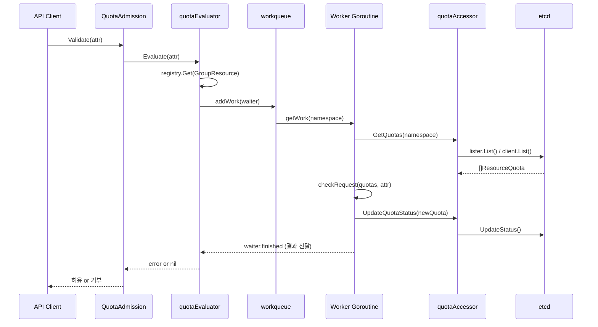

# Resource Management 심화

## 1. 개요 -- 왜 리소스 관리가 필요한가

Kubernetes 클러스터는 유한한 컴퓨팅 자원(CPU, 메모리, 스토리지)을 여러 팀/애플리케이션이 공유한다.
아무런 제한 없이 워크로드를 배포하면 다음 문제가 발생한다.

| 문제 | 설명 |
|------|------|
| **Noisy Neighbor** | 하나의 Pod가 노드의 모든 CPU/메모리를 독점하여 같은 노드의 다른 Pod 성능 저하 |
| **네임스페이스 고갈** | 특정 팀이 클러스터 전체 리소스를 소진하여 다른 팀이 Pod를 배포 불가 |
| **OOM Kill** | 메모리 제한 없는 Pod가 노드 메모리를 고갈시켜 커널 OOM Killer 발동 |
| **스케줄링 불능** | requests 없는 Pod가 난립하면 스케줄러가 정확한 빈 패킹(bin-packing) 불가 |
| **QoS 불확실** | requests/limits 설정 없으면 QoS 클래스가 BestEffort로 분류되어 OOM 시 가장 먼저 kill |

Kubernetes는 이 문제를 **세 가지 계층**으로 해결한다.

```
+-------------------------------------------------------------+
|                    클러스터 관리자 설정                         |
|                                                             |
|  +-----------------------+   +---------------------------+  |
|  |    ResourceQuota      |   |       LimitRange          |  |
|  |  (네임스페이스 총량)    |   |  (개별 컨테이너 기본값/제한) |  |
|  +-----------+-----------+   +-------------+-------------+  |
|              |                             |                |
|              v                             v                |
|  +-----------------------------------------------------+   |
|  |            Pod spec: requests / limits                |   |
|  |         (개발자가 명시하거나 LimitRange가 주입)         |   |
|  +-----------------------------------------------------+   |
+-------------------------------------------------------------+
```

**설계 철학**: Kubernetes는 "리소스 관리를 Admission Control 단계에서 강제"한다.
Pod가 API 서버에 제출되는 시점에 LimitRange가 기본값을 주입(Mutating)하고,
ResourceQuota가 네임스페이스 총량을 검사(Validating)한다.
이 방식은 스케줄러에 도달하기 전에 부적절한 요청을 차단하여 클러스터 안정성을 보장한다.


---

## 2. Resource requests/limits 체계

### 2.1 ResourceRequirements 타입

모든 컨테이너의 리소스 요구사항은 `ResourceRequirements` 구조체로 표현된다.

> 소스: `staging/src/k8s.io/api/core/v1/types.go` 줄 2831-2855

```go
// ResourceRequirements describes the compute resource requirements.
type ResourceRequirements struct {
    Limits   ResourceList `json:"limits,omitempty"`
    Requests ResourceList `json:"requests,omitempty"`
    Claims   []ResourceClaim `json:"claims,omitempty"`
}
```

| 필드 | 의미 | 스케줄러 사용 | cgroups 적용 |
|------|------|:---:|:---:|
| `Requests` | 최소 보장량 -- 스케줄러가 노드 선택 시 사용 | O | X (CPU는 CFS shares로 간접 반영) |
| `Limits` | 최대 허용량 -- 초과 시 throttle(CPU) 또는 OOM kill(Memory) | X | O |
| `Claims` | DRA(Dynamic Resource Allocation) 리소스 클레임 참조 | - | - |

### 2.2 ResourceName 상수

> 소스: `staging/src/k8s.io/api/core/v1/types.go` 줄 6950-6967

```go
const (
    ResourceCPU              ResourceName = "cpu"
    ResourceMemory           ResourceName = "memory"
    ResourceStorage          ResourceName = "storage"
    ResourceEphemeralStorage ResourceName = "ephemeral-storage"
)
```

할당량에서 사용하는 확장 리소스 이름:

> 소스: `staging/src/k8s.io/api/core/v1/types.go` 줄 7727-7739

```go
const (
    ResourceRequestsCPU              ResourceName = "requests.cpu"
    ResourceRequestsMemory           ResourceName = "requests.memory"
    ResourceRequestsEphemeralStorage ResourceName = "requests.ephemeral-storage"
    ResourceLimitsCPU                ResourceName = "limits.cpu"
    ResourceLimitsMemory             ResourceName = "limits.memory"
    ResourceLimitsEphemeralStorage   ResourceName = "limits.ephemeral-storage"
)
```

**왜 `requests.cpu`와 `cpu`가 별도로 존재하는가?**
`cpu`는 `requests.cpu`의 별칭(alias)이다. 역사적으로 `cpu`가 먼저 존재했고,
나중에 requests/limits를 명확히 구분하기 위해 `requests.cpu`, `limits.cpu`가 추가되었다.
할당량 계산 시 `podComputeUsageHelper`가 둘 다 기록한다.

### 2.3 QoS 클래스와의 관계

requests/limits 설정 방식에 따라 Pod의 QoS 클래스가 결정된다.

```
+----------------------------------------------+
|              QoS 클래스 결정 규칙               |
+----------------------------------------------+
|                                              |
|  모든 컨테이너에 requests == limits 설정      |
|  +--> Guaranteed                             |
|                                              |
|  requests/limits 전혀 미설정                  |
|  +--> BestEffort                             |
|                                              |
|  그 외 (일부만 설정, requests < limits 등)     |
|  +--> Burstable                              |
+----------------------------------------------+
```

QoS 클래스는 ResourceQuota Scope 필터링에도 직접 활용된다 (4.1절 참조).


---

## 3. LimitRange

LimitRange는 **네임스페이스 내 개별 리소스 단위(컨테이너, Pod, PVC)의 기본값과 제약**을 설정한다.
ResourceQuota가 "네임스페이스 총량"을 제한한다면, LimitRange는 "개별 단위의 크기"를 제한한다.

### 3.1 타입 정의

> 소스: `staging/src/k8s.io/api/core/v1/types.go` 줄 7633-7663

```go
type LimitType string

const (
    LimitTypePod                  LimitType = "Pod"
    LimitTypeContainer            LimitType = "Container"
    LimitTypePersistentVolumeClaim LimitType = "PersistentVolumeClaim"
)

type LimitRangeItem struct {
    Type                 LimitType    `json:"type"`
    Max                  ResourceList `json:"max,omitempty"`
    Min                  ResourceList `json:"min,omitempty"`
    Default              ResourceList `json:"default,omitempty"`
    DefaultRequest       ResourceList `json:"defaultRequest,omitempty"`
    MaxLimitRequestRatio ResourceList `json:"maxLimitRequestRatio,omitempty"`
}
```

| 필드 | 적용 대상 | 설명 |
|------|----------|------|
| `Max` | Container, Pod, PVC | 해당 리소스의 최대 허용값 |
| `Min` | Container, Pod, PVC | 해당 리소스의 최소 요구값 |
| `Default` | Container만 | limits 미지정 시 주입되는 기본 limits |
| `DefaultRequest` | Container만 | requests 미지정 시 주입되는 기본 requests |
| `MaxLimitRequestRatio` | Container, Pod | limits/requests 비율의 최대 허용값 |

**왜 Default/DefaultRequest는 Container 타입에만 있는가?**
Pod 레벨 리소스는 개별 컨테이너의 합산이므로 컨테이너별로 기본값을 주입해야 의미가 있다.
PVC는 스토리지 크기가 필수 필드이므로 기본값 주입이 불필요하다.

### 3.2 Admission Plugin 구조

> 소스: `plugin/pkg/admission/limitranger/admission.go` 줄 62-74

```go
type LimitRanger struct {
    *admission.Handler
    client          kubernetes.Interface
    actions         LimitRangerActions
    lister          corev1listers.LimitRangeLister
    liveLookupCache *lru.Cache
    group           singleflight.Group
    liveTTL         time.Duration
}
```

> 소스: `plugin/pkg/admission/limitranger/interfaces.go` 줄 26-37

```go
type LimitRangerActions interface {
    MutateLimit(limitRange *corev1.LimitRange, kind string, obj runtime.Object) error
    ValidateLimit(limitRange *corev1.LimitRange, kind string, obj runtime.Object) error
    SupportsAttributes(attr admission.Attributes) bool
    SupportsLimit(limitRange *corev1.LimitRange) bool
}
```

LimitRanger는 `MutationInterface`와 `ValidationInterface`를 모두 구현한다.
즉, Admission 파이프라인에서 **Mutating 단계와 Validating 단계 모두** 개입한다.

```
API 요청 (Pod 생성)
    |
    v
+---+---+
| Admit |  <-- Mutating: 기본값 주입 (LimitRange Default/DefaultRequest)
+---+---+
    |
    v
+---+------+
| Validate |  <-- Validating: Min/Max/Ratio 검증
+---+------+
    |
    v
  etcd 저장
```

> 소스: `plugin/pkg/admission/limitranger/admission.go` 줄 111-118

```go
func (l *LimitRanger) Admit(ctx context.Context, a admission.Attributes, o admission.ObjectInterfaces) (err error) {
    return l.runLimitFunc(a, l.actions.MutateLimit)
}

func (l *LimitRanger) Validate(ctx context.Context, a admission.Attributes, o admission.ObjectInterfaces) (err error) {
    return l.runLimitFunc(a, l.actions.ValidateLimit)
}
```

### 3.3 Defaulting (Mutation) 메커니즘

LimitRange의 Mutation 핵심은 두 함수에 있다.

#### 3.3.1 defaultContainerResourceRequirements

> 소스: `plugin/pkg/admission/limitranger/admission.go` 줄 216-233

```go
func defaultContainerResourceRequirements(limitRange *corev1.LimitRange) api.ResourceRequirements {
    requirements := api.ResourceRequirements{}
    requirements.Requests = api.ResourceList{}
    requirements.Limits = api.ResourceList{}

    for i := range limitRange.Spec.Limits {
        limit := limitRange.Spec.Limits[i]
        if limit.Type == corev1.LimitTypeContainer {
            for k, v := range limit.DefaultRequest {
                requirements.Requests[api.ResourceName(k)] = v.DeepCopy()
            }
            for k, v := range limit.Default {
                requirements.Limits[api.ResourceName(k)] = v.DeepCopy()
            }
        }
    }
    return requirements
}
```

이 함수는 LimitRange에서 `Container` 타입의 `DefaultRequest`와 `Default` 값을 추출하여
`ResourceRequirements` 구조체로 반환한다.

#### 3.3.2 mergeContainerResources

> 소스: `plugin/pkg/admission/limitranger/admission.go` 줄 236-270

```go
func mergeContainerResources(container *api.Container, defaultRequirements *api.ResourceRequirements,
    annotationPrefix string, annotations []string) []string {
    // ...
    for k, v := range defaultRequirements.Limits {
        _, found := container.Resources.Limits[k]
        if !found {
            container.Resources.Limits[k] = v.DeepCopy()
            setLimits = append(setLimits, string(k))
        }
    }
    for k, v := range defaultRequirements.Requests {
        _, found := container.Resources.Requests[k]
        if !found {
            container.Resources.Requests[k] = v.DeepCopy()
            setRequests = append(setRequests, string(k))
        }
    }
    // ... annotation 기록
}
```

**핵심 로직**: 컨테이너에 해당 리소스가 **아직 설정되어 있지 않은 경우에만** 기본값을 주입한다.
이미 개발자가 명시한 값은 절대 덮어쓰지 않는다.

#### 3.3.3 Defaulting 전체 흐름

```
PodMutateLimitFunc(limitRange, pod)
    |
    +--> defaultContainerResourceRequirements(limitRange)
    |       LimitRange에서 Container 타입의 Default/DefaultRequest 추출
    |
    +--> mergePodResourceRequirements(pod, &defaultResources)
            |
            +--> 각 pod.Spec.Containers에 대해 mergeContainerResources()
            |       Limits/Requests 미설정 항목에 기본값 주입
            |
            +--> 각 pod.Spec.InitContainers에 대해 mergeContainerResources()
            |       초기화 컨테이너에도 동일하게 적용
            |
            +--> Pod annotation에 "LimitRanger plugin set: ..." 기록
```

> 소스: `plugin/pkg/admission/limitranger/admission.go` 줄 478-482

```go
func PodMutateLimitFunc(limitRange *corev1.LimitRange, pod *api.Pod) error {
    defaultResources := defaultContainerResourceRequirements(limitRange)
    mergePodResourceRequirements(pod, &defaultResources)
    return nil
}
```

**왜 annotation에 기록하는가?**
`kubernetes.io/limit-ranger` annotation을 통해 관리자와 개발자가
"이 컨테이너의 리소스가 LimitRange에 의해 자동 설정되었다"는 사실을 확인할 수 있다.
디버깅 시 "내가 설정한 건지, 시스템이 넣은 건지" 구분하는 데 매우 유용하다.

### 3.4 Validation (검증)

#### 3.4.1 제약 검증 함수들

> 소스: `plugin/pkg/admission/limitranger/admission.go` 줄 309-385

세 가지 핵심 검증 함수가 있다.

**minConstraint (줄 309-324)**

```go
func minConstraint(limitType string, resourceName string, enforced resource.Quantity,
    request api.ResourceList, limit api.ResourceList) error {
    req, reqExists := request[api.ResourceName(resourceName)]
    lim, limExists := limit[api.ResourceName(resourceName)]
    observedReqValue, observedLimValue, enforcedValue := requestLimitEnforcedValues(req, lim, enforced)

    if !reqExists {
        return fmt.Errorf("minimum %s usage per %s is %s. No request is specified", ...)
    }
    if observedReqValue < enforcedValue {
        return fmt.Errorf("minimum %s usage per %s is %s, but request is %s", ...)
    }
    if limExists && (observedLimValue < enforcedValue) {
        return fmt.Errorf("minimum %s usage per %s is %s, but limit is %s", ...)
    }
    return nil
}
```

**maxConstraint (줄 342-357)**

```go
func maxConstraint(limitType string, resourceName string, enforced resource.Quantity,
    request api.ResourceList, limit api.ResourceList) error {
    // ... limit이 존재하지 않으면 에러
    // limit > enforced 이면 에러
    // request > enforced 이면 에러
}
```

**limitRequestRatioConstraint (줄 360-385)**

```go
func limitRequestRatioConstraint(limitType string, resourceName string, enforced resource.Quantity,
    request api.ResourceList, limit api.ResourceList) error {
    // limits / requests 비율 계산
    observedRatio := float64(observedLimValue) / float64(observedReqValue)
    // 비율이 enforced 값보다 크면 에러
}
```

#### 3.4.2 PodValidateLimitFunc -- Container + Pod 레벨 검증

> 소스: `plugin/pkg/admission/limitranger/admission.go` 줄 486-557

```go
func PodValidateLimitFunc(limitRange *corev1.LimitRange, pod *api.Pod) error {
    var errs []error
    for i := range limitRange.Spec.Limits {
        limit := limitRange.Spec.Limits[i]
        limitType := limit.Type

        // (1) Container 타입: 각 컨테이너 개별 검증
        if limitType == corev1.LimitTypeContainer {
            for j := range pod.Spec.Containers {
                container := &pod.Spec.Containers[j]
                // Min, Max, MaxLimitRequestRatio 각각 검증
            }
            for j := range pod.Spec.InitContainers {
                // InitContainer도 동일하게 검증
            }
        }

        // (2) Pod 타입: 전체 Pod의 합산 리소스 검증
        if limitType == corev1.LimitTypePod {
            podRequests := podRequests(pod, opts)
            podLimits := podLimits(pod, opts)
            // Pod 전체 합산에 대해 Min, Max, MaxLimitRequestRatio 검증
        }
    }
    return utilerrors.NewAggregate(errs)
}
```

검증 흐름을 다이어그램으로 표현하면:

```
PodValidateLimitFunc
    |
    +-- LimitType == Container?
    |       |
    |       +-- 각 Container에 대해:
    |       |     +-- minConstraint(min, request, limit)
    |       |     +-- maxConstraint(max, request, limit)
    |       |     +-- limitRequestRatioConstraint(ratio, request, limit)
    |       |
    |       +-- 각 InitContainer에 대해:
    |             +-- (동일한 3가지 검증)
    |
    +-- LimitType == Pod?
            |
            +-- podRequests() 로 Pod 전체 requests 합산
            +-- podLimits() 로 Pod 전체 limits 합산
            +-- minConstraint(min, podRequests, podLimits)
            +-- maxConstraint(max, podRequests, podLimits)
            +-- limitRequestRatioConstraint(ratio, podRequests, podLimits)
```

### 3.5 Pod 리소스 합산 로직

#### 3.5.1 podRequests

> 소스: `plugin/pkg/admission/limitranger/admission.go` 줄 574-621

```go
func podRequests(pod *api.Pod, opts podResourcesOptions) api.ResourceList {
    reqs := api.ResourceList{}

    // (1) 일반 컨테이너 requests 합산
    for _, container := range pod.Spec.Containers {
        addResourceList(reqs, container.Resources.Requests)
    }

    // (2) 초기화 컨테이너 처리
    restartableInitContainerReqs := api.ResourceList{}
    initContainerReqs := api.ResourceList{}
    for _, container := range pod.Spec.InitContainers {
        containerReqs := container.Resources.Requests

        if container.RestartPolicy != nil && *container.RestartPolicy == api.ContainerRestartPolicyAlways {
            // 사이드카 컨테이너: 일반 컨테이너처럼 누적 합산
            addResourceList(reqs, containerReqs)
            addResourceList(restartableInitContainerReqs, containerReqs)
            containerReqs = restartableInitContainerReqs
        } else {
            // 일반 초기화 컨테이너: 순차 실행이므로 max 취함
            tmp := api.ResourceList{}
            addResourceList(tmp, containerReqs)
            addResourceList(tmp, restartableInitContainerReqs)
            containerReqs = tmp
        }
        maxResourceList(initContainerReqs, containerReqs)
    }

    // (3) 일반 컨테이너 합산 vs 초기화 컨테이너 최대값 중 큰 쪽
    maxResourceList(reqs, initContainerReqs)

    return reqs
}
```

**왜 초기화 컨테이너는 합산이 아니라 max인가?**
초기화 컨테이너는 순차적으로 실행되므로, 동시에 리소스를 사용하지 않는다.
따라서 "가장 큰 초기화 컨테이너의 요구량"이 실제 필요한 최대량이다.

단, `RestartPolicy: Always`인 사이드카 컨테이너는 일반 컨테이너와 동시에 실행되므로
누적 합산에 포함된다.

```
예시: containers=[A(100m), B(200m)], initContainers=[C(150m), D(sidecar,50m)]

일반 컨테이너 합산:     100m + 200m = 300m
사이드카 합산:          50m  (D는 Always이므로 일반 합산에 추가)
일반 + 사이드카:        300m + 50m = 350m

초기화 컨테이너 max:
  C: 150m (일반) + 50m (사이드카 누적) = 200m
  D: 50m (사이드카 -- 누적에 이미 포함)
  max(initContainerReqs) = 200m

최종 requests = max(350m, 200m) = 350m
```

#### 3.5.2 podLimits

> 소스: `plugin/pkg/admission/limitranger/admission.go` 줄 632-675

`podLimits`는 `podRequests`와 동일한 구조이나, `Limits` 필드를 합산한다.
로직은 완전히 대칭적이다.


---

## 4. ResourceQuota

ResourceQuota는 **네임스페이스 전체의 리소스 총량**을 제한한다.
개별 Pod/컨테이너가 아닌, 네임스페이스에 존재하는 모든 오브젝트의 합산 사용량을 추적한다.

### 4.1 타입 정의 및 Scope

> 소스: `staging/src/k8s.io/api/core/v1/types.go` 줄 7778-7793, 7835-7843

```go
type ResourceQuotaSpec struct {
    Hard          ResourceList           `json:"hard,omitempty"`
    Scopes        []ResourceQuotaScope   `json:"scopes,omitempty"`
    ScopeSelector *ScopeSelector         `json:"scopeSelector,omitempty"`
}

type ResourceQuotaStatus struct {
    Hard ResourceList `json:"hard,omitempty"`
    Used ResourceList `json:"used,omitempty"`
}
```

`Hard`는 관리자가 설정한 한도, `Used`는 컨트롤러가 계산한 현재 사용량이다.

#### ResourceQuotaScope

> 소스: `staging/src/k8s.io/api/core/v1/types.go` 줄 7757-7775

```go
const (
    ResourceQuotaScopeTerminating               ResourceQuotaScope = "Terminating"
    ResourceQuotaScopeNotTerminating            ResourceQuotaScope = "NotTerminating"
    ResourceQuotaScopeBestEffort                ResourceQuotaScope = "BestEffort"
    ResourceQuotaScopeNotBestEffort             ResourceQuotaScope = "NotBestEffort"
    ResourceQuotaScopePriorityClass             ResourceQuotaScope = "PriorityClass"
    ResourceQuotaScopeCrossNamespacePodAffinity ResourceQuotaScope = "CrossNamespacePodAffinity"
    ResourceQuotaScopeVolumeAttributesClass     ResourceQuotaScope = "VolumeAttributesClass"
)
```

| Scope | 매칭 조건 | 용도 |
|-------|----------|------|
| `Terminating` | `spec.activeDeadlineSeconds >= 0` | 배치 Job 등 종료 예정 Pod 제한 |
| `NotTerminating` | `spec.activeDeadlineSeconds == nil` | 장기 실행 서비스 Pod 제한 |
| `BestEffort` | QoS == BestEffort | requests/limits 미설정 Pod 제한 |
| `NotBestEffort` | QoS != BestEffort | Guaranteed/Burstable Pod만 제한 |
| `PriorityClass` | `spec.priorityClassName` 존재 | 우선순위별 할당량 분리 |
| `CrossNamespacePodAffinity` | cross-namespace affinity 사용 | 교차 네임스페이스 affinity 제한 |

**왜 Scope가 필요한가?**
단일 네임스페이스에서 워크로드 종류에 따라 다른 할당량을 적용하기 위해서이다.
예를 들어, "BestEffort Pod는 최대 10개, NotBestEffort Pod의 CPU requests는 최대 100코어"
같은 세밀한 정책을 구현할 수 있다.

#### Scope 매칭 로직

> 소스: `pkg/quota/v1/evaluator/core/pods.go` 줄 350-375

```go
func podMatchesScopeFunc(selector corev1.ScopedResourceSelectorRequirement,
    object runtime.Object) (bool, error) {
    pod, err := toExternalPodOrError(object)
    // ...
    switch selector.ScopeName {
    case corev1.ResourceQuotaScopeTerminating:
        return IsTerminating(pod), nil
    case corev1.ResourceQuotaScopeNotTerminating:
        return !IsTerminating(pod), nil
    case corev1.ResourceQuotaScopeBestEffort:
        return isBestEffort(pod), nil
    case corev1.ResourceQuotaScopeNotBestEffort:
        return !isBestEffort(pod), nil
    case corev1.ResourceQuotaScopePriorityClass:
        // Exists 연산자면 단순히 priorityClassName 존재 여부만 확인
        // In/NotIn 연산자면 셀렉터 매칭
        // ...
    case corev1.ResourceQuotaScopeCrossNamespacePodAffinity:
        return usesCrossNamespacePodAffinity(pod), nil
    }
    return false, nil
}
```

```go
// IsTerminating: activeDeadlineSeconds >= 0 이면 Terminating
func IsTerminating(pod *corev1.Pod) bool {
    if pod.Spec.ActiveDeadlineSeconds != nil && *pod.Spec.ActiveDeadlineSeconds >= int64(0) {
        return true
    }
    return false
}

// isBestEffort: QoS 클래스가 BestEffort이면 true
func isBestEffort(pod *corev1.Pod) bool {
    return qos.GetPodQOS(pod) == corev1.PodQOSBestEffort
}
```

### 4.2 Admission Plugin

#### 4.2.1 QuotaAdmission 구조체

> 소스: `staging/src/k8s.io/apiserver/pkg/admission/plugin/resourcequota/admission.go` 줄 64-73

```go
type QuotaAdmission struct {
    *admission.Handler
    config             *resourcequotaapi.Configuration
    stopCh             <-chan struct{}
    quotaConfiguration quota.Configuration
    numEvaluators      int
    quotaAccessor      *quotaAccessor
    evaluator          Evaluator
    initializationErr  error
}
```

| 필드 | 역할 |
|------|------|
| `config` | AdmissionConfiguration에서 로드한 ResourceQuota 플러그인 설정 |
| `quotaConfiguration` | 평가자(Evaluator) 목록과 무시할 리소스 정보 |
| `numEvaluators` | 동시에 할당량 평가를 수행하는 워커 수 (기본 5) |
| `quotaAccessor` | ResourceQuota 오브젝트를 조회/갱신하는 접근자 |
| `evaluator` | 실제 할당량 평가를 수행하는 quotaEvaluator |

**왜 ValidationInterface만 구현하는가?**
QuotaAdmission은 Mutating이 아니라 Validating Admission Plugin이다.
리소스를 수정하는 것이 아니라, "이 요청이 할당량을 초과하는지" 검사만 한다.

```go
var _ admission.ValidationInterface = &QuotaAdmission{}
```

#### 4.2.2 Validate 메서드

> 소스: `staging/src/k8s.io/apiserver/pkg/admission/plugin/resourcequota/admission.go` 줄 160-167

```go
func (a *QuotaAdmission) Validate(ctx context.Context, attr admission.Attributes,
    o admission.ObjectInterfaces) (err error) {
    // 네임스페이스 없는 리소스 또는 네임스페이스 자체 생성은 무시
    if attr.GetNamespace() == "" || isNamespaceCreation(attr) {
        return nil
    }
    return a.evaluator.Evaluate(attr)
}
```

**왜 네임스페이스 생성을 무시하는가?**
ResourceQuota는 네임스페이스 범위(scoped) 리소스이다. 네임스페이스 자체가 생성되는 시점에는
아직 할당량이 존재하지 않으므로 검사할 대상이 없다.

### 4.3 할당량 접근자 (QuotaAccessor)

> 소스: `staging/src/k8s.io/apiserver/pkg/admission/plugin/resourcequota/resource_access.go` 줄 36-64

```go
type QuotaAccessor interface {
    UpdateQuotaStatus(newQuota *corev1.ResourceQuota) error
    GetQuotas(namespace string) ([]corev1.ResourceQuota, error)
}

type quotaAccessor struct {
    client          kubernetes.Interface
    lister          corev1listers.ResourceQuotaLister
    hasSynced       func() bool
    liveLookupCache *lru.Cache
    group           singleflight.Group
    liveTTL         time.Duration
    updatedQuotas   *lru.Cache
}
```

`quotaAccessor`는 세 가지 캐시 계층을 활용한다:

```
+---------------------------------------------------+
|            quotaAccessor 캐시 계층                   |
|                                                   |
|  1. SharedInformer 캐시 (lister)                   |
|     - 기본적으로 여기서 조회                          |
|                                                   |
|  2. liveLookupCache (LRU, TTL 30초)                |
|     - Informer 미동기화 시 API 서버 직접 조회 결과 캐시 |
|     - singleflight.Group으로 중복 요청 방지          |
|                                                   |
|  3. updatedQuotas (LRU)                            |
|     - 방금 갱신한 할당량의 최신 버전 캐시              |
|     - etcd resourceVersion 비교로 최신 여부 판단     |
+---------------------------------------------------+
```

**왜 updatedQuotas 캐시가 필요한가?**
연속적인 Pod 생성 요청이 들어오면, Informer 캐시가 아직 갱신되지 않은 상태에서
다음 요청의 할당량을 평가해야 한다. updatedQuotas에 "방금 갱신한 할당량"을 보관하면
etcd에서 최신 값을 다시 읽지 않아도 된다.
주석에 따르면 이 캐시 도입 전에는 22번 업데이트에 12번 충돌(conflict)이 발생했지만,
도입 후 15번 업데이트에 0번 충돌로 감소했다.

### 4.4 할당량 평가자 (quotaEvaluator)

#### 4.4.1 구조체

> 소스: `staging/src/k8s.io/apiserver/pkg/admission/plugin/resourcequota/controller.go` 줄 50-77

```go
type quotaEvaluator struct {
    quotaAccessor       QuotaAccessor
    lockAcquisitionFunc func([]corev1.ResourceQuota) func()
    ignoredResources    map[schema.GroupResource]struct{}
    registry            quota.Registry

    // 네임스페이스별 배치 처리를 위한 큐 시스템
    queue      *workqueue.Typed[string]
    workLock   sync.Mutex
    work       map[string][]*admissionWaiter
    dirtyWork  map[string][]*admissionWaiter
    inProgress sets.Set[string]

    workers int
    stopCh  <-chan struct{}
    init    sync.Once
    config  *resourcequotaapi.Configuration
}
```

**왜 workqueue를 사용하는가?**
동일 네임스페이스에 대한 Admission 요청을 배치(batch)로 처리하기 위해서이다.
각 요청마다 독립적으로 할당량을 읽고-계산하고-갱신하면,
etcd 쓰기 충돌(optimistic concurrency conflict)이 빈번하게 발생한다.
네임스페이스별로 묶어서 처리하면 한 번의 읽기-갱신으로 여러 요청을 처리할 수 있다.

#### 4.4.2 Evaluate 흐름

> 소스: `staging/src/k8s.io/apiserver/pkg/admission/plugin/resourcequota/controller.go` 줄 650-686

```go
func (e *quotaEvaluator) Evaluate(a admission.Attributes) error {
    e.init.Do(e.start)   // 최초 호출 시 워커 시작

    // (1) 무시 대상 리소스 확인
    gvr := a.GetResource()
    gr := gvr.GroupResource()
    if _, ok := e.ignoredResources[gr]; ok {
        return nil
    }

    // (2) 레지스트리에서 평가자 조회 (없으면 objectCount 평가자 자동 생성)
    evaluator := e.registry.Get(gr)
    if evaluator == nil {
        evaluator = generic.NewObjectCountEvaluator(gr, nil, "")
        e.registry.Add(evaluator)
    }

    // (3) 이 평가자가 해당 작업을 처리하는지 확인
    if !evaluator.Handles(a) {
        return nil
    }

    // (4) admissionWaiter 생성 후 큐에 추가
    waiter := newAdmissionWaiter(a)
    e.addWork(waiter)

    // (5) 완료 또는 10초 타임아웃 대기
    select {
    case <-waiter.finished:
    case <-time.After(10 * time.Second):
        return apierrors.NewInternalError(
            fmt.Errorf("resource quota evaluation timed out"))
    }

    return waiter.result
}
```



### 4.5 CheckRequest -- 할당량 초과 검사의 핵심

> 소스: `staging/src/k8s.io/apiserver/pkg/admission/plugin/resourcequota/controller.go` 줄 411-635

이 함수는 ResourceQuota Admission의 가장 핵심적인 로직이다.
단계별로 분석한다.

#### 단계 1: 평가자 확인 및 LimitedResources 매칭

```go
func CheckRequest(quotas []corev1.ResourceQuota, a admission.Attributes,
    evaluator quota.Evaluator, limited []resourcequotaapi.LimitedResource) ([]corev1.ResourceQuota, error) {

    if !evaluator.Handles(a) {
        return quotas, nil
    }

    inputObject := a.GetObject()
    limitedScopes, err := getMatchedLimitedScopes(evaluator, inputObject, limited)
    // ...
    limitedResourceNames := limitedByDefault(deltaUsage, limitedResources)
```

`LimitedResources`는 AdmissionConfiguration에서 설정할 수 있는 "반드시 할당량이 있어야 하는 리소스" 목록이다.
예를 들어, "cpu를 사용하는 모든 Pod는 반드시 ResourceQuota가 있는 네임스페이스에서만 생성 가능"
같은 정책을 강제할 수 있다.

#### 단계 2: 관련 할당량 필터링

```go
interestingQuotaIndexes := []int{}
restrictedResourcesSet := sets.String{}

for i := range quotas {
    resourceQuota := quotas[i]
    // Scope 매칭
    match, err := evaluator.Matches(&resourceQuota, inputObject)
    if !match { continue }

    // 제약 조건 검증 (예: CPU/Memory를 quota가 추적하면 Pod에 반드시 명시해야 함)
    hardResources := quota.ResourceNames(resourceQuota.Status.Hard)
    restrictedResources := evaluator.MatchingResources(hardResources)
    if err := evaluator.Constraints(restrictedResources, inputObject); err != nil {
        return nil, admission.NewForbidden(a, ...)
    }

    // 사용량 통계가 아직 없으면 거부 (컨트롤러가 아직 계산하지 않은 상태)
    if !hasUsageStats(&resourceQuota, restrictedResources) {
        return nil, admission.NewForbidden(a, fmt.Errorf("status unknown for quota: %s", ...))
    }

    interestingQuotaIndexes = append(interestingQuotaIndexes, i)
}
```

#### 단계 3: 사용량 계산 (Create vs Update)

```go
// 입력 오브젝트의 리소스 사용량 계산
inputUsage, err := evaluator.Usage(inputObject)

// Update의 경우 이전 사용량과의 차이(delta)만 계산
if admission.Update == a.GetOperation() {
    prevItem := a.GetOldObject()
    prevUsage, _ := evaluator.Usage(prevItem)
    deltaUsage := quota.SubtractWithNonNegativeResult(inputUsage, prevUsage)
    // ...
}
```

**왜 Update에서 delta를 계산하는가?**
Pod 업데이트 시 리소스가 변경될 수 있다 (예: in-place resize).
이 때 "새 사용량 - 이전 사용량"만큼만 할당량에 추가로 청구해야 한다.
전체 사용량으로 비교하면 이미 청구된 기존 리소스를 이중 계산하게 된다.

#### 단계 4: 커버링 할당량 검사

```go
// LimitedResources에 해당하는 리소스가 어떤 할당량에도 커버되지 않으면 거부
hasNoCoveringQuota := limitedResourceNamesSet.Difference(restrictedResourcesSet)
if len(hasNoCoveringQuota) > 0 {
    return quotas, admission.NewForbidden(a,
        fmt.Errorf("insufficient quota to consume: %v", ...))
}

// Scope 레벨에서도 동일한 검사
scopesHasNoCoveringQuota, err := evaluator.UncoveredQuotaScopes(limitedScopes, restrictedScopes)
if len(scopesHasNoCoveringQuota) > 0 {
    return quotas, fmt.Errorf("insufficient quota to match these scopes: %v", ...)
}
```

#### 단계 5: 할당량 초과 여부 판정

```go
for _, index := range interestingQuotaIndexes {
    resourceQuota := outQuotas[index]
    deltaUsage := deltaUsageIndexMap[index]

    hardResources := quota.ResourceNames(resourceQuota.Status.Hard)
    requestedUsage := quota.Mask(deltaUsage, hardResources)
    newUsage := quota.Add(resourceQuota.Status.Used, requestedUsage)

    if a.GetSubresource() != "status" {
        maskedNewUsage := quota.Mask(newUsage, quota.ResourceNames(requestedUsage))

        if allowed, exceeded := quota.LessThanOrEqual(maskedNewUsage, resourceQuota.Status.Hard); !allowed {
            failedRequestedUsage := quota.Mask(requestedUsage, exceeded)
            failedUsed := quota.Mask(resourceQuota.Status.Used, exceeded)
            failedHard := quota.Mask(resourceQuota.Status.Hard, exceeded)
            return nil, admission.NewForbidden(a,
                fmt.Errorf("exceeded quota: %s, requested: %s, used: %s, limited: %s",
                    resourceQuota.Name,
                    prettyPrint(failedRequestedUsage),
                    prettyPrint(failedUsed),
                    prettyPrint(failedHard)))
        }
    }

    // 성공 시 새 사용량 기록 (아직 etcd에 쓰지 않음, 반환 후 호출자가 갱신)
    outQuotas[index].Status.Used = newUsage
}
```

**왜 `status` 서브리소스는 건너뛰는가?**
ResourceQuota 자체의 status 업데이트 시에는 할당량 검사를 하면 안 된다.
그렇지 않으면 할당량 컨트롤러가 사용량을 갱신할 때 자기 자신의 할당량에 의해 차단된다.

전체 CheckRequest 흐름을 요약하면:

```
CheckRequest(quotas, attr, evaluator, limited)
    |
    +-- (1) evaluator.Handles(attr)?        -- 이 리소스를 처리하는가
    +-- (2) LimitedResources 매칭            -- 반드시 할당량이 필요한 리소스인가
    +-- (3) 각 quota에 대해:
    |       +-- evaluator.Matches(quota, obj)   -- Scope/Selector 매칭
    |       +-- evaluator.Constraints(...)      -- 필수 리소스 명시 여부
    |       +-- hasUsageStats(...)              -- 사용량 통계 존재 여부
    |
    +-- (4) evaluator.Usage(inputObject)     -- 새 오브젝트의 리소스 사용량
    +-- (5) Update면 delta 계산              -- 이전 사용량 차감
    +-- (6) 커버링 할당량 검사                 -- LimitedResources 커버 확인
    +-- (7) newUsage = Used + delta
    |       LessThanOrEqual(newUsage, Hard)?
    |       +-- 초과: Forbidden 에러 반환
    |       +-- 통과: outQuotas에 새 Used 기록
    |
    +-- return outQuotas, nil
```

### 4.6 ResourceQuota 컨트롤러

Admission Plugin이 실시간 검사를 담당한다면,
ResourceQuota 컨트롤러는 **비동기적으로 사용량을 재계산**하는 역할을 한다.

> 소스: `pkg/controller/resourcequota/resource_quota_controller.go` 줄 56-77

```go
type ControllerOptions struct {
    QuotaClient             corev1client.ResourceQuotasGetter
    ResourceQuotaInformer   coreinformers.ResourceQuotaInformer
    ResyncPeriod            controller.ResyncPeriodFunc
    Registry                quota.Registry
    DiscoveryFunc           NamespacedResourcesFunc
    IgnoredResourcesFunc    func() map[schema.GroupResource]struct{}
    InformersStarted        <-chan struct{}
    InformerFactory         informerfactory.InformerFactory
    ReplenishmentResyncPeriod controller.ResyncPeriodFunc
    UpdateFilter            UpdateFilter
}
```

컨트롤러는 다음과 같은 상황에서 사용량을 재계산한다.

```
+----------------------------------+
|   ResourceQuota 컨트롤러 동작     |
+----------------------------------+
|                                  |
|  (1) ResourceQuota 생성/변경     |
|      --> 해당 할당량의 Used 재계산 |
|                                  |
|  (2) 리소스 replenishment 신호    |
|      (Pod 삭제 등)               |
|      --> 관련 할당량 재계산        |
|                                  |
|  (3) 주기적 resync               |
|      --> 모든 할당량 재계산        |
+----------------------------------+
```

**왜 Admission Plugin과 컨트롤러가 분리되어 있는가?**

- **Admission Plugin**: 동기적(synchronous) -- API 요청 처리 중 실시간 검사.
  새 Pod 생성 시 즉시 할당량 초과를 차단한다.
- **컨트롤러**: 비동기적(asynchronous) -- 백그라운드에서 주기적으로 정확한 사용량 재계산.
  Pod 삭제, 비정상 종료 등으로 인한 사용량 변화를 반영한다.

Admission Plugin만으로는 "Pod가 삭제되어 사용량이 줄어든 경우"를 감지할 수 없다.
컨트롤러가 주기적으로 실제 사용량을 재계산하여 `Status.Used`를 갱신해야
Admission Plugin이 정확한 판단을 할 수 있다.


---

## 5. 리소스 평가자 (Evaluator) 체계

### 5.1 Evaluator 인터페이스

> 소스: `staging/src/k8s.io/apiserver/pkg/quota/v1/interfaces.go` 줄 44-65

```go
type Evaluator interface {
    Constraints(required []corev1.ResourceName, item runtime.Object) error
    GroupResource() schema.GroupResource
    Handles(operation admission.Attributes) bool
    Matches(resourceQuota *corev1.ResourceQuota, item runtime.Object) (bool, error)
    MatchingScopes(item runtime.Object, scopes []corev1.ScopedResourceSelectorRequirement) ([]corev1.ScopedResourceSelectorRequirement, error)
    UncoveredQuotaScopes(limitedScopes []corev1.ScopedResourceSelectorRequirement, matchedQuotaScopes []corev1.ScopedResourceSelectorRequirement) ([]corev1.ScopedResourceSelectorRequirement, error)
    MatchingResources(input []corev1.ResourceName) []corev1.ResourceName
    Usage(item runtime.Object) (corev1.ResourceList, error)
    UsageStats(options UsageStatsOptions) (UsageStats, error)
}
```

| 메서드 | 역할 |
|--------|------|
| `Constraints` | 필수 리소스가 오브젝트에 명시되어 있는지 검증 |
| `GroupResource` | 이 평가자가 담당하는 GR (예: pods, services) |
| `Handles` | 이 Admission 요청을 처리해야 하는지 판단 |
| `Matches` | 특정 ResourceQuota가 이 오브젝트에 적용되는지 확인 |
| `MatchingScopes` | 오브젝트가 매칭되는 Scope 목록 반환 |
| `MatchingResources` | Hard 리소스 목록 중 이 평가자가 관리하는 것만 필터링 |
| `Usage` | 오브젝트의 리소스 사용량 계산 |
| `UsageStats` | 네임스페이스 전체의 집계 사용량 계산 |

### 5.2 Registry 인터페이스

> 소스: `staging/src/k8s.io/apiserver/pkg/quota/v1/interfaces.go` 줄 75-85

```go
type Registry interface {
    Add(e Evaluator)
    Remove(e Evaluator)
    Get(gr schema.GroupResource) Evaluator
    List() []Evaluator
}
```

Registry는 GroupResource를 키로 Evaluator를 관리하는 저장소이다.

### 5.3 평가자 레지스트리 초기화

> 소스: `pkg/quota/v1/evaluator/core/registry.go` 줄 46-88

```go
func NewEvaluators(f quota.ListerForResourceFunc, i informers.SharedInformerFactory,
    isEnabled func(schema.GroupVersionResource) bool) ([]quota.Evaluator, error) {

    result := []quota.Evaluator{}

    // 특수 로직이 필요한 평가자
    if isEnabled(corev1.SchemeGroupVersion.WithResource("pods")) {
        result = append(result, NewPodEvaluator(f, clock.RealClock{}))
    }
    if isEnabled(corev1.SchemeGroupVersion.WithResource("services")) {
        result = append(result, NewServiceEvaluator(f))
    }
    if isEnabled(corev1.SchemeGroupVersion.WithResource("persistentvolumeclaims")) {
        result = append(result, NewPersistentVolumeClaimEvaluator(f))
    }
    // DRA ResourceClaim 평가자 (feature gate 조건부)
    if isEnabled(resourcev1.SchemeGroupVersion.WithResource("resourceclaims")) &&
        utilfeature.DefaultFeatureGate.Enabled(features.DynamicResourceAllocation) {
        result = append(result, NewResourceClaimEvaluator(...))
    }

    // 단순 오브젝트 카운팅 평가자 (레거시 호환)
    for gvr, alias := range legacyObjectCountAliases {
        result = append(result,
            generic.NewObjectCountEvaluator(gvr.GroupResource(),
                generic.ListResourceUsingListerFunc(f, gvr), alias))
    }
    return result, nil
}
```

등록되는 평가자 목록:

| 평가자 | GroupResource | 추적 리소스 | 특수 로직 |
|--------|-------------|-----------|----------|
| `podEvaluator` | pods | cpu, memory, ephemeral-storage, pods, requests.*, limits.* | QoS Scope, 종료 판단 |
| `serviceEvaluator` | services | services, services.nodeports, services.loadbalancers | 서비스 타입별 카운팅 |
| `pvcEvaluator` | persistentvolumeclaims | persistentvolumeclaims, requests.storage | 스토리지 클래스별 |
| `resourceClaimEvaluator` | resourceclaims | DRA 디바이스 클래스별 | Feature gate 조건부 |
| `objectCountEvaluator` | configmaps, secrets 등 | 단순 개수 | 레거시 별칭 매핑 |

```go
// 레거시 별칭 매핑
var legacyObjectCountAliases = map[schema.GroupVersionResource]corev1.ResourceName{
    corev1.SchemeGroupVersion.WithResource("configmaps"):             corev1.ResourceConfigMaps,
    corev1.SchemeGroupVersion.WithResource("resourcequotas"):         corev1.ResourceQuotas,
    corev1.SchemeGroupVersion.WithResource("replicationcontrollers"): corev1.ResourceReplicationControllers,
    corev1.SchemeGroupVersion.WithResource("secrets"):                corev1.ResourceSecrets,
}
```

### 5.4 Pod 평가자 상세

#### 5.4.1 podEvaluator 구조체

> 소스: `pkg/quota/v1/evaluator/core/pods.go` 줄 120-125

```go
type podEvaluator struct {
    listFuncByNamespace generic.ListFuncByNamespace
    clock               clock.Clock
}
```

#### 5.4.2 Usage 메서드

> 소스: `pkg/quota/v1/evaluator/core/pods.go` 줄 260-263

```go
func (p *podEvaluator) Usage(item runtime.Object) (corev1.ResourceList, error) {
    return PodUsageFunc(item, p.clock)
}
```

#### 5.4.3 PodUsageFunc

> 소스: `pkg/quota/v1/evaluator/core/pods.go` 줄 381-411

```go
func PodUsageFunc(obj runtime.Object, clock clock.Clock) (corev1.ResourceList, error) {
    pod, err := toExternalPodOrError(obj)
    // ...

    // (1) 오브젝트 카운트는 항상 기록 (종료 상태 Pod도)
    result := corev1.ResourceList{
        podObjectCountName: *(resource.NewQuantity(1, resource.DecimalSI)),
    }

    // (2) 종료 상태 Pod는 컴퓨팅 리소스 미청구
    if !QuotaV1Pod(pod, clock) {
        return result, nil
    }

    // (3) requests/limits 합산
    requests := resourcehelper.PodRequests(pod, opts)
    limits := resourcehelper.PodLimits(pod, opts)
    result = quota.Add(result, podComputeUsageHelper(requests, limits))

    return result, nil
}
```

#### 5.4.4 QuotaV1Pod -- 할당량 대상 Pod 판정

> 소스: `pkg/quota/v1/evaluator/core/pods.go` 줄 491-508

```go
func QuotaV1Pod(pod *corev1.Pod, clock clock.Clock) bool {
    // (1) 종료 상태(Failed/Succeeded)면 제외
    if corev1.PodFailed == pod.Status.Phase || corev1.PodSucceeded == pod.Status.Phase {
        return false
    }
    // (2) 삭제 마크 + 유예 기간 만료면 제외
    if pod.DeletionTimestamp != nil && pod.DeletionGracePeriodSeconds != nil {
        now := clock.Now()
        deletionTime := pod.DeletionTimestamp.Time
        gracePeriod := time.Duration(*pod.DeletionGracePeriodSeconds) * time.Second
        if now.After(deletionTime.Add(gracePeriod)) {
            return false
        }
    }
    return true
}
```

**왜 삭제 유예 기간이 만료된 Pod를 제외하는가?**
노드가 장애 상태일 때 Pod가 "Terminating" 상태에 머물 수 있다.
이런 Pod를 계속 할당량에 청구하면, 사용자가 새 Pod를 만들 수 없게 된다.
유예 기간이 만료된 시점부터는 실제로 리소스를 소비하지 않으므로 할당량에서 제외한다.

#### 5.4.5 podComputeUsageHelper

> 소스: `pkg/quota/v1/evaluator/core/pods.go` 줄 294-332

```go
func podComputeUsageHelper(requests corev1.ResourceList, limits corev1.ResourceList) corev1.ResourceList {
    result := corev1.ResourceList{}
    result[corev1.ResourcePods] = resource.MustParse("1")

    // CPU requests -> ResourceCPU + ResourceRequestsCPU 모두 기록
    if request, found := requests[corev1.ResourceCPU]; found {
        result[corev1.ResourceCPU] = request
        result[corev1.ResourceRequestsCPU] = request
    }
    // CPU limits -> ResourceLimitsCPU만 기록
    if limit, found := limits[corev1.ResourceCPU]; found {
        result[corev1.ResourceLimitsCPU] = limit
    }
    // Memory, EphemeralStorage도 동일 패턴
    // ...

    // HugePages, 확장 리소스는 requests만 기록 (overcommit 미지원)
    for resource, request := range requests {
        if quota.ContainsPrefix(requestedResourcePrefixes, resource) {
            result[resource] = request
            result[maskResourceWithPrefix(resource, corev1.DefaultResourceRequestsPrefix)] = request
        }
    }

    return result
}
```

이 함수가 생성하는 리소스 매핑:

```
입력 requests: {cpu: "500m", memory: "1Gi"}
입력 limits:   {cpu: "1",    memory: "2Gi"}

출력:
  pods:                       1
  cpu:                        500m   (= requests.cpu의 별칭)
  requests.cpu:               500m
  limits.cpu:                 1
  memory:                     1Gi    (= requests.memory의 별칭)
  requests.memory:            1Gi
  limits.memory:              2Gi
```

### 5.5 objectCountEvaluator

> 소스: `staging/src/k8s.io/apiserver/pkg/quota/v1/generic/evaluator.go` 줄 234-243

```go
type objectCountEvaluator struct {
    groupResource schema.GroupResource
    listFuncByNamespace ListFuncByNamespace
    resourceNames []corev1.ResourceName
}
```

등록된 평가자가 없는 리소스에 대해서는 `quotaEvaluator.Evaluate()`가
자동으로 `objectCountEvaluator`를 생성한다.
이 평가자는 단순히 오브젝트 개수만 추적하며, Create 연산만 처리한다.


---

## 6. LimitRange + ResourceQuota 통합 흐름

두 Admission Plugin이 어떻게 협력하는지 전체 흐름을 살펴본다.

```
kubectl apply -f pod.yaml (namespace: team-a)
    |
    v
+--------------------+
| API Server 수신     |
+--------------------+
    |
    v
+--------------------+
| Authentication     |  사용자 인증
+--------------------+
    |
    v
+--------------------+
| Authorization      |  RBAC 인가
+--------------------+
    |
    v
+-----------------------------------------------+
|            Mutating Admission                  |
|                                               |
|  +-- LimitRanger.Admit()                      |
|  |     네임스페이스의 LimitRange 조회            |
|  |     Container에 Default/DefaultRequest 주입  |
|  |     annotation 기록                         |
|  |                                             |
|  +-- (다른 Mutating Webhook들)                  |
+-----------------------------------------------+
    |
    v
+--------------------+
| Object Schema      |  스키마 검증
| Validation         |
+--------------------+
    |
    v
+-----------------------------------------------+
|           Validating Admission                 |
|                                               |
|  +-- LimitRanger.Validate()                   |
|  |     Container별 Min/Max/Ratio 검증           |
|  |     Pod 전체 합산 Min/Max/Ratio 검증          |
|  |                                             |
|  +-- ResourceQuota.Validate()                  |
|  |     네임스페이스의 ResourceQuota 목록 조회     |
|  |     Scope 매칭                               |
|  |     사용량 계산 (Usage)                       |
|  |     Hard 한도 초과 검사                       |
|  |     통과 시 Used 갱신                         |
|  |                                             |
|  +-- (다른 Validating Webhook들)                |
+-----------------------------------------------+
    |
    v
+--------------------+
| etcd 저장           |
+--------------------+
```

**순서가 중요한 이유:**

1. **LimitRange Mutation이 먼저** -- 기본값이 주입된 후에 ResourceQuota가 사용량을 정확히 계산할 수 있다.
   기본값 주입 전에 할당량을 검사하면 requests/limits가 0으로 계산되어 할당량을 통과할 수 있다.

2. **LimitRange Validation이 ResourceQuota 전에** -- 개별 컨테이너의 제약을 먼저 검사하여
   "유효하지 않은 리소스 설정"으로 인한 불필요한 할당량 계산을 방지한다.

### 6.1 실제 시나리오 예시

```yaml
# LimitRange 설정
apiVersion: v1
kind: LimitRange
metadata:
  name: default-limits
  namespace: team-a
spec:
  limits:
  - type: Container
    default:                    # limits 기본값
      cpu: "500m"
      memory: "512Mi"
    defaultRequest:             # requests 기본값
      cpu: "200m"
      memory: "256Mi"
    min:
      cpu: "100m"
      memory: "128Mi"
    max:
      cpu: "2"
      memory: "4Gi"
  - type: Pod
    max:
      cpu: "4"
      memory: "8Gi"
---
# ResourceQuota 설정
apiVersion: v1
kind: ResourceQuota
metadata:
  name: team-a-quota
  namespace: team-a
spec:
  hard:
    requests.cpu: "10"
    requests.memory: "20Gi"
    limits.cpu: "20"
    limits.memory: "40Gi"
    pods: "50"
```

```yaml
# 개발자가 제출한 Pod (resources 미지정)
apiVersion: v1
kind: Pod
metadata:
  name: my-app
  namespace: team-a
spec:
  containers:
  - name: app
    image: my-app:v1
    # resources 미지정!
```

처리 과정:

```
(1) LimitRanger.Admit()
    Container "app"에 resources 미설정 발견
    --> requests: {cpu: "200m", memory: "256Mi"} 주입
    --> limits: {cpu: "500m", memory: "512Mi"} 주입
    --> annotation: "LimitRanger plugin set: cpu, memory request for container app;
                     cpu, memory limit for container app"

(2) LimitRanger.Validate()
    Container "app": requests.cpu=200m >= min.cpu=100m   --> OK
    Container "app": limits.cpu=500m <= max.cpu=2         --> OK
    Container "app": requests.memory=256Mi >= min.memory=128Mi --> OK
    Container "app": limits.memory=512Mi <= max.memory=4Gi     --> OK
    Pod total: requests.cpu=200m <= max.cpu=4             --> OK
    Pod total: limits.memory=512Mi <= max.memory=8Gi      --> OK

(3) ResourceQuota.Validate()
    현재 사용량: requests.cpu=8.5, pods=45
    새 Pod 요청: requests.cpu=200m, requests.memory=256Mi, pods=1
    검사: 8.5 + 0.2 = 8.7 <= 10 (hard)                   --> OK
    검사: 45 + 1 = 46 <= 50 (hard)                        --> OK
    Status.Used 갱신: requests.cpu=8.7, pods=46

(4) etcd 저장 완료
```


---

## 7. 소스코드 맵

| 컴포넌트 | 소스 경로 | 핵심 줄 |
|----------|----------|---------|
| ResourceQuota Admission Plugin | `staging/src/k8s.io/apiserver/pkg/admission/plugin/resourcequota/admission.go` | QuotaAdmission: 64-73, Validate: 160-167 |
| ResourceQuota 평가 엔진 | `staging/src/k8s.io/apiserver/pkg/admission/plugin/resourcequota/controller.go` | quotaEvaluator: 50-77, Evaluate: 650-686, CheckRequest: 411-635 |
| 할당량 접근자 | `staging/src/k8s.io/apiserver/pkg/admission/plugin/resourcequota/resource_access.go` | QuotaAccessor: 36-43, quotaAccessor: 45-64 |
| LimitRange Admission Plugin | `plugin/pkg/admission/limitranger/admission.go` | LimitRanger: 62-74, Admit: 111-113, Validate: 116-118 |
| LimitRange Defaulting | `plugin/pkg/admission/limitranger/admission.go` | defaultContainerResourceRequirements: 216-233, mergeContainerResources: 236-270 |
| LimitRange Mutation | `plugin/pkg/admission/limitranger/admission.go` | PodMutateLimitFunc: 478-482 |
| LimitRange Validation | `plugin/pkg/admission/limitranger/admission.go` | PodValidateLimitFunc: 486-557 |
| 제약 검증 함수 | `plugin/pkg/admission/limitranger/admission.go` | minConstraint: 309-324, maxConstraint: 342-357, limitRequestRatioConstraint: 360-385 |
| Pod 리소스 합산 | `plugin/pkg/admission/limitranger/admission.go` | podRequests: 574-621, podLimits: 632-675 |
| LimitRangerActions 인터페이스 | `plugin/pkg/admission/limitranger/interfaces.go` | LimitRangerActions: 26-37 |
| ResourceQuota 타입 | `staging/src/k8s.io/api/core/v1/types.go` | ResourceQuotaScope: 7757-7775, ResourceQuotaSpec: 7778-7793, ResourceQuotaStatus: 7835-7843 |
| LimitRange 타입 | `staging/src/k8s.io/api/core/v1/types.go` | LimitType: 7633-7642, LimitRangeItem: 7645-7663 |
| ResourceRequirements 타입 | `staging/src/k8s.io/api/core/v1/types.go` | 2831-2855 |
| ResourceName 상수 | `staging/src/k8s.io/api/core/v1/types.go` | 6950-6967, 7706-7754 |
| Pod 평가자 | `pkg/quota/v1/evaluator/core/pods.go` | podEvaluator: 120-125, Usage: 260-263, PodUsageFunc: 381-411, podComputeUsageHelper: 294-332, QuotaV1Pod: 491-508 |
| 평가자 레지스트리 | `pkg/quota/v1/evaluator/core/registry.go` | NewEvaluators: 46-88 |
| Evaluator 인터페이스 | `staging/src/k8s.io/apiserver/pkg/quota/v1/interfaces.go` | Evaluator: 44-65, Registry: 75-85 |
| objectCountEvaluator | `staging/src/k8s.io/apiserver/pkg/quota/v1/generic/evaluator.go` | 234-243 |
| ResourceQuota 컨트롤러 | `pkg/controller/resourcequota/resource_quota_controller.go` | ControllerOptions: 56-77 |


---

## 8. 핵심 정리

### 8.1 세 계층 리소스 관리 비교

| 구분 | Resource requests/limits | LimitRange | ResourceQuota |
|------|------------------------|------------|---------------|
| **적용 범위** | 개별 컨테이너 | 컨테이너/Pod/PVC (네임스페이스 내) | 네임스페이스 전체 |
| **설정 주체** | 개발자 | 클러스터 관리자 | 클러스터 관리자 |
| **역할** | 스케줄링 기준 + cgroups 제한 | 기본값 주입 + 개별 제약 | 총량 제한 |
| **Admission 단계** | - | Mutating + Validating | Validating |
| **동작 방식** | kubelet이 cgroups 설정 | Admission Plugin이 주입/검증 | Admission Plugin + 컨트롤러 |

### 8.2 설계 핵심 원칙

1. **Admission 시점 강제**: 리소스 제한은 오브젝트가 etcd에 저장되기 전에 검사한다.
   이미 저장된 후에 "할당량 초과"를 발견해도 롤백할 수 없기 때문이다.

2. **Mutation 후 Validation**: LimitRange가 기본값을 주입한 후에 ResourceQuota가 검사한다.
   이 순서가 바뀌면 기본값 주입 전의 (불완전한) 리소스로 할당량을 판단하게 된다.

3. **네임스페이스별 배치 처리**: quotaEvaluator는 같은 네임스페이스의 요청을 큐에 모아서
   한 번에 처리한다. 이는 etcd 쓰기 충돌을 최소화하고 성능을 향상시킨다.

4. **캐시 계층화**: quotaAccessor는 3단계 캐시(Informer, liveLookup, updatedQuotas)를 사용한다.
   할당량 조회는 매우 빈번하므로 캐시 없이는 API 서버 성능이 크게 저하된다.

5. **종료 Pod 제외**: 할당량 청구에서 종료 상태 Pod를 제외하여 "좀비 Pod가 할당량을 잡아먹는" 문제를 방지한다.
   특히 노드 장애 시 Terminating 상태에 머무는 Pod 처리가 중요하다.

6. **오브젝트 카운트 자동 추적**: 등록된 평가자가 없는 리소스도 자동으로 objectCountEvaluator가
   생성되어 개수를 추적한다. 이는 `count/deployments.apps` 같은 할당량을 지원한다.

### 8.3 흔한 문제와 원인

| 증상 | 원인 | 해결 |
|------|------|------|
| Pod 생성 시 "exceeded quota" 에러 | 네임스페이스 ResourceQuota 한도 초과 | `kubectl describe quota`로 현재 사용량 확인, 불필요한 리소스 정리 또는 한도 증가 |
| Pod 생성 시 "minimum cpu usage per Container is ..." | LimitRange min보다 작은 requests 지정 | requests를 LimitRange min 이상으로 설정 |
| Pod에 resources를 안 넣었는데 자동으로 채워짐 | LimitRange Default/DefaultRequest 적용 | 의도된 동작. annotation에서 확인 가능 |
| "status unknown for quota" 에러 | ResourceQuota 컨트롤러가 아직 Used를 계산하지 않음 | 잠시 후 재시도. 컨트롤러 로그 확인 |
| Pod 삭제 후에도 할당량이 안 줄어듦 | 컨트롤러 resync 지연 | 컨트롤러가 다음 sync에서 갱신. 기본 5분 resync |
| "insufficient quota to consume" 에러 | LimitedResources 설정에 의해 할당량이 필수인데 없음 | 해당 네임스페이스에 ResourceQuota 생성 |
