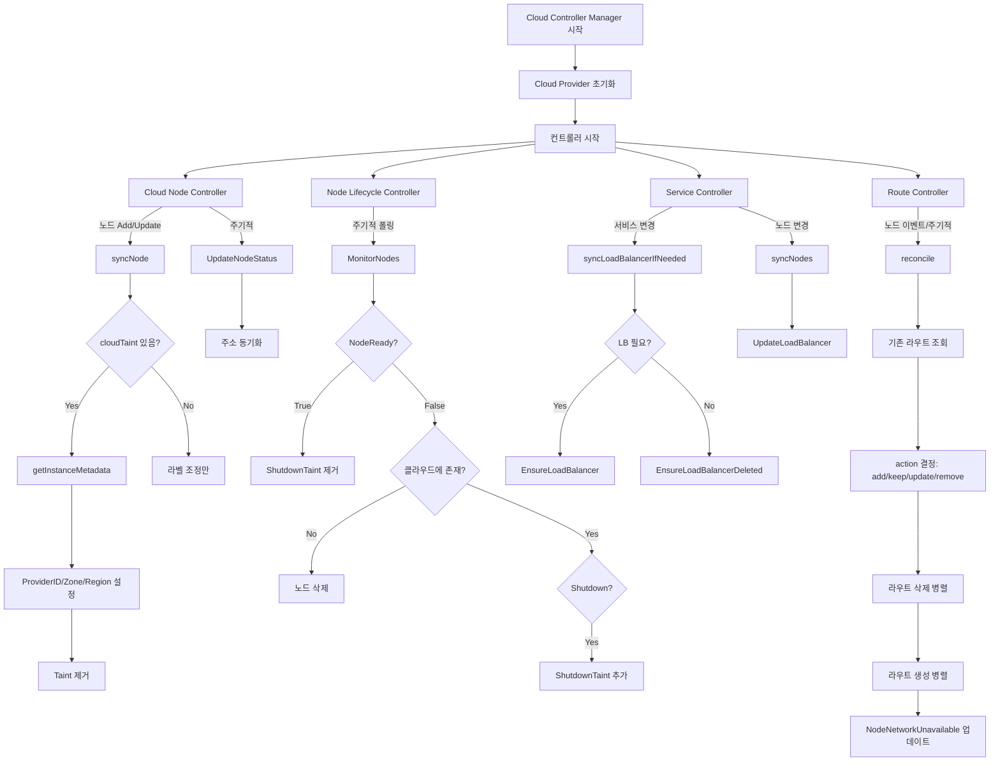

# Cloud Provider 심화

## 1. 개요 -- CCM 분리 배경

### 1.1 왜 Cloud Controller Manager를 분리했는가

Kubernetes 초기에는 모든 클라우드 프로바이더 로직이 `kube-controller-manager` 안에 내장(in-tree)되어 있었다.
이 설계에는 근본적인 문제가 있었다.

| 문제 | 설명 |
|------|------|
| 릴리스 커플링 | AWS/GCP/Azure 코드가 k8s 코어와 같은 릴리스 사이클 -- 클라우드 벤더가 버그를 고치려면 k8s 전체 릴리스를 기다려야 함 |
| 바이너리 비대화 | 모든 클라우드 SDK가 kube-controller-manager에 링크 -- 사용하지 않는 클라우드 코드까지 포함 |
| 보안 경계 침해 | 클라우드 자격증명이 컨트롤 플레인 핵심 컴포넌트에 주입 |
| 확장성 한계 | 새 클라우드 프로바이더 추가 시 k8s 코어 리포에 PR 필요 |

이 문제를 해결하기 위해 **Cloud Controller Manager(CCM)**를 별도 바이너리로 분리했다.

```
분리 전 (monolithic):
+------------------------------------------+
| kube-controller-manager                  |
|   - Deployment Controller                |
|   - ReplicaSet Controller                |
|   - Node Controller (+ cloud logic)      |
|   - Service Controller (+ LB logic)      |
|   - Route Controller (+ cloud logic)     |
|   - Volume Controller (+ cloud logic)    |
|   - ... 모든 컨트롤러                     |
+------------------------------------------+

분리 후 (decoupled):
+---------------------------+    +----------------------------+
| kube-controller-manager   |    | cloud-controller-manager   |
|   - Deployment Controller |    |   - Cloud Node Controller  |
|   - ReplicaSet Controller |    |   - Node Lifecycle Ctrl    |
|   - StatefulSet Controller|    |   - Service Controller(LB) |
|   - ... (클라우드 무관)    |    |   - Route Controller       |
+---------------------------+    +----------------------------+
         |                                |
         | k8s API                        | Cloud API
         v                                v
   +-----------+                  +--------------+
   | API Server|                  | AWS/GCP/Azure|
   +-----------+                  +--------------+
```

### 1.2 분리의 핵심 원칙

1. **인터페이스 추상화**: `cloudprovider.Interface`를 통해 모든 클라우드 API를 추상화
2. **외부 플러그인**: 클라우드 프로바이더가 자체 릴리스 사이클로 CCM 바이너리를 배포
3. **Taint 기반 지연 초기화**: 노드가 등록될 때 `node.cloudprovider.kubernetes.io/uninitialized` taint를 부여하여, CCM이 초기화를 완료할 때까지 Pod 스케줄링을 차단

---

## 2. 아키텍처

### 2.1 전체 구조

```
+-------------------------------------------------------------------+
|                  Cloud Controller Manager (CCM)                    |
|                                                                   |
|  +------------------+   +---------------------+                   |
|  | Cloud Provider   |   | Controller Manager  |                   |
|  | Plugin Registry  |   | Framework           |                   |
|  |                  |   |                     |                   |
|  | RegisterCloud    |   | NewCloudController  |                   |
|  | Provider()       |   | ManagerCommand()    |                   |
|  | InitCloudProvider|   |                     |                   |
|  +--------+---------+   +----------+----------+                   |
|           |                        |                              |
|           v                        v                              |
|  +------------------+   +---------------------+                   |
|  | cloudprovider.   |   | Controller Init     |                   |
|  | Interface        |   | Func Constructors   |                   |
|  |                  |   |                     |                   |
|  | - LoadBalancer() |   | - cloud-node        |                   |
|  | - InstancesV2()  |   | - cloud-node-lifecycle                 |
|  | - Routes()       |   | - service-lb-controller                |
|  | - Zones()        |   | - route             |                   |
|  +--------+---------+   +-----+---+---+-------+                   |
|           |                   |   |   |                           |
|           +-------------------+   |   +--------+                  |
|           |                       |            |                  |
|           v                       v            v                  |
|  +----------------+  +------------------+  +-----------+          |
|  | Cloud Node     |  | Service          |  | Route     |          |
|  | Controller     |  | Controller (LB)  |  | Controller|          |
|  +-------+--------+  +--------+---------+  +-----+-----+         |
|          |                    |                   |               |
+-------------------------------------------------------------------+
           |                    |                   |
           v                    v                   v
  +------------------+ +------------------+ +------------------+
  | Cloud Provider   | | Cloud Provider   | | Cloud Provider   |
  | Instances API    | | LoadBalancer API | | Routes API       |
  | (InstancesV2)    | | (EnsureLB, etc.) | | (CreateRoute)    |
  +------------------+ +------------------+ +------------------+
```

### 2.2 컨트롤러 목록

CCM은 4개의 내장 컨트롤러를 기본 제공한다.

| 컨트롤러 | 역할 | 사용하는 인터페이스 |
|----------|------|-------------------|
| Cloud Node Controller | 노드 초기화 (ProviderID, 라벨, Zone/Region 설정) | InstancesV2 (또는 Instances + Zones) |
| Cloud Node Lifecycle Controller | 삭제/종료된 노드 정리 | InstancesV2 (또는 Instances) |
| Service Controller | LoadBalancer 타입 Service의 LB 프로비저닝 | LoadBalancer |
| Route Controller | Pod CIDR에 대한 클라우드 라우트 관리 | Routes |

### 2.3 CCM 진입점

CCM의 `main()` 함수는 다음과 같은 흐름으로 동작한다.

소스: `cmd/cloud-controller-manager/main.go` (라인 46-79)

```go
func main() {
    ccmOptions, err := options.NewCloudControllerManagerOptions()
    // ...
    controllerInitializers := app.DefaultInitFuncConstructors
    controllerAliases := names.CCMControllerAliases()
    // 예: 불필요한 컨트롤러 제거
    // delete(controllerInitializers, "cloud-node-lifecycle")

    // 예: 추가 컨트롤러 (NodeIpamController) 등록
    nodeIpamController := nodeIPAMController{}
    controllerInitializers[kcmnames.NodeIpamController] = app.ControllerInitFuncConstructor{
        InitContext: app.ControllerInitContext{
            ClientName: "node-controller",
        },
        Constructor: nodeIpamController.StartNodeIpamControllerWrapper,
    }

    command := app.NewCloudControllerManagerCommand(
        ccmOptions, cloudInitializer,
        controllerInitializers, controllerAliases,
        fss, wait.NeverStop,
    )
    code := cli.Run(command)
    os.Exit(code)
}
```

**왜 이렇게 설계했는가?**

- `DefaultInitFuncConstructors`: 기본 컨트롤러 세트를 제공하되, 프로바이더가 삭제/추가 가능
- `cloudInitializer`: 프로바이더별 초기화 로직을 콜백으로 전달
- `controllerAliases`: 컨트롤러 이름의 호환성 유지 (예: `nodeipam` -> `NodeIpamController`)

### 2.4 Cloud 초기화 콜백

소스: `cmd/cloud-controller-manager/main.go` (라인 82-102)

```go
func cloudInitializer(config *cloudcontrollerconfig.CompletedConfig) cloudprovider.Interface {
    cloudConfig := config.ComponentConfig.KubeCloudShared.CloudProvider
    cloud, err := cloudprovider.InitCloudProvider(
        cloudConfig.Name, cloudConfig.CloudConfigFile,
    )
    if err != nil {
        klog.Fatalf("Cloud provider could not be initialized: %v", err)
    }
    if !cloud.HasClusterID() {
        if config.ComponentConfig.KubeCloudShared.AllowUntaggedCloud {
            klog.Warning("detected a cluster without a ClusterID...")
        } else {
            klog.Fatalf("no ClusterID found...")
        }
    }
    return cloud
}
```

이 패턴에서 `InitCloudProvider`는 플러그인 레지스트리에서 이름으로 팩토리를 찾아 인스턴스를 생성한다.
ClusterID 검증은 다중 클러스터 환경에서 리소스 충돌을 방지하기 위한 안전장치이다.

---

## 3. Cloud Provider Interface

### 3.1 최상위 인터페이스

소스: `staging/src/k8s.io/cloud-provider/cloud.go` (라인 42-69)

```go
type Interface interface {
    Initialize(clientBuilder ControllerClientBuilder, stop <-chan struct{})
    LoadBalancer() (LoadBalancer, bool)
    Instances() (Instances, bool)
    InstancesV2() (InstancesV2, bool)
    Zones() (Zones, bool)
    Clusters() (Clusters, bool)
    Routes() (Routes, bool)
    ProviderName() string
    HasClusterID() bool
}
```

**왜 메서드가 `(구현체, bool)` 튜플을 반환하는가?**

모든 클라우드 프로바이더가 모든 기능을 지원하는 것은 아니다.
예를 들어, 베어메탈 프로바이더는 LoadBalancer를 지원하지 않을 수 있다.
`bool` 값으로 기능 지원 여부를 런타임에 체크할 수 있어, 컴파일 타임에 강제하지 않고도
선택적 기능 구현이 가능하다.

```
Interface 메서드 관계도:

cloudprovider.Interface
    |
    +-- Initialize()              -- 초기화, 커스텀 고루틴 시작
    |
    +-- LoadBalancer() ---------> LoadBalancer 인터페이스
    |                                |-- GetLoadBalancer()
    |                                |-- GetLoadBalancerName()
    |                                |-- EnsureLoadBalancer()
    |                                |-- UpdateLoadBalancer()
    |                                +-- EnsureLoadBalancerDeleted()
    |
    +-- Instances() ------------> Instances 인터페이스 (레거시)
    |                                |-- NodeAddresses()
    |                                |-- InstanceID()
    |                                |-- InstanceType()
    |                                +-- InstanceExistsByProviderID()
    |
    +-- InstancesV2() ----------> InstancesV2 인터페이스 (권장)
    |                                |-- InstanceExists()
    |                                |-- InstanceShutdown()
    |                                +-- InstanceMetadata()
    |
    +-- Zones() ----------------> Zones 인터페이스 (DEPRECATED)
    |
    +-- Routes() ---------------> Routes 인터페이스
    |                                |-- ListRoutes()
    |                                |-- CreateRoute()
    |                                +-- DeleteRoute()
    |
    +-- ProviderName()           -- 프로바이더 식별자 문자열
    +-- HasClusterID()           -- 클러스터 태깅 여부
```

### 3.2 LoadBalancer 인터페이스

소스: `staging/src/k8s.io/cloud-provider/cloud.go` (라인 138-173)

```go
type LoadBalancer interface {
    GetLoadBalancer(ctx context.Context, clusterName string,
        service *v1.Service) (status *v1.LoadBalancerStatus, exists bool, err error)
    GetLoadBalancerName(ctx context.Context, clusterName string,
        service *v1.Service) string
    EnsureLoadBalancer(ctx context.Context, clusterName string,
        service *v1.Service, nodes []*v1.Node) (*v1.LoadBalancerStatus, error)
    UpdateLoadBalancer(ctx context.Context, clusterName string,
        service *v1.Service, nodes []*v1.Node) error
    EnsureLoadBalancerDeleted(ctx context.Context, clusterName string,
        service *v1.Service) error
}
```

**왜 `Ensure` 패턴을 사용하는가?**

`EnsureLoadBalancer`는 멱등(idempotent) 동작을 보장한다.
"없으면 생성, 있으면 업데이트" 시맨틱으로, 컨트롤러가 재시작되거나 여러 번 호출되어도
안전하다. `Create`/`Update`를 따로 두면 호출자가 상태를 먼저 확인해야 하지만,
`Ensure`는 이를 구현체에 위임하여 로직을 단순화한다.

**`ImplementedElsewhere` 에러의 의미**

클라우드 프로바이더가 LoadBalancer 로직을 ServiceController가 아닌 별도 컨트롤러에서
처리하는 경우, `EnsureLoadBalancer`와 `UpdateLoadBalancer`가 이 에러를 반환하여
ServiceController에게 "나는 이 작업을 하지 않겠다"고 알린다.
단, `EnsureLoadBalancerDeleted`에서는 이 에러를 반환하면 안 된다.
ServiceController가 생성한 리소스를 정리하지 못하게 되기 때문이다.

### 3.3 Instances 인터페이스 (레거시)

소스: `staging/src/k8s.io/cloud-provider/cloud.go` (라인 175-205)

```go
type Instances interface {
    NodeAddresses(ctx context.Context, name types.NodeName) ([]v1.NodeAddress, error)
    NodeAddressesByProviderID(ctx context.Context, providerID string) ([]v1.NodeAddress, error)
    InstanceID(ctx context.Context, nodeName types.NodeName) (string, error)
    InstanceType(ctx context.Context, name types.NodeName) (string, error)
    InstanceTypeByProviderID(ctx context.Context, providerID string) (string, error)
    AddSSHKeyToAllInstances(ctx context.Context, user string, keyData []byte) error
    CurrentNodeName(ctx context.Context, hostname string) (types.NodeName, error)
    InstanceExistsByProviderID(ctx context.Context, providerID string) (bool, error)
    InstanceShutdownByProviderID(ctx context.Context, providerID string) (bool, error)
}
```

**왜 `ByProviderID` 변형이 별도로 있는가?**

노드 이름과 클라우드 인스턴스 ID는 다를 수 있다. kubelet이 노드를 등록할 때
`hostname`을 사용하지만, 클라우드 API에서는 `providerID` (예: `aws:///us-east-1a/i-12345`)로
인스턴스를 식별한다. 두 가지 조회 경로를 제공하여 fallback 패턴을 지원한다.

### 3.4 InstancesV2 인터페이스 (권장)

소스: `staging/src/k8s.io/cloud-provider/cloud.go` (라인 207-223)

```go
type InstancesV2 interface {
    InstanceExists(ctx context.Context, node *v1.Node) (bool, error)
    InstanceShutdown(ctx context.Context, node *v1.Node) (bool, error)
    InstanceMetadata(ctx context.Context, node *v1.Node) (*InstanceMetadata, error)
}
```

**왜 V2를 만들었는가?**

Instances 인터페이스는 하나의 정보(주소, ID, 타입, 존)를 얻기 위해 개별 API 호출이 필요했다.
노드 100개 클러스터에서 주기적 동기화가 발생하면 수백 번의 클라우드 API 호출이 발생한다.

InstancesV2는 `InstanceMetadata()` 한 번의 호출로 모든 정보를 가져온다.

| 항목 | Instances (V1) | InstancesV2 |
|------|---------------|-------------|
| API 호출 횟수 (노드당) | 4-5회 (주소, ID, 타입, 존 각각) | 1회 (InstanceMetadata) |
| 입력 파라미터 | NodeName 또는 ProviderID (문자열) | *v1.Node (전체 노드 객체) |
| Zone 정보 | 별도 Zones 인터페이스 필요 | InstanceMetadata에 포함 |
| 설계 대상 | in-tree 프로바이더 | 외부 클라우드 프로바이더 전용 |

### 3.5 InstanceMetadata 구조체

소스: `staging/src/k8s.io/cloud-provider/cloud.go` (라인 298-335)

```go
type InstanceMetadata struct {
    ProviderID       string               // spec.providerID에 설정
    InstanceType     string               // node.kubernetes.io/instance-type 라벨
    NodeAddresses    []v1.NodeAddress     // status.addresses에 설정
    Zone             string               // topology.kubernetes.io/zone 라벨
    Region           string               // topology.kubernetes.io/region 라벨
    AdditionalLabels map[string]string    // 클라우드 프로바이더 추가 라벨
}
```

이 구조체는 노드 객체의 여러 필드에 매핑된다.

```
InstanceMetadata                    Node 객체
+------------------+               +-------------------------------------+
| ProviderID       | ------------> | spec.providerID                     |
| InstanceType     | ------------> | labels["node.kubernetes.io/         |
|                  |               |         instance-type"]              |
| NodeAddresses    | ------------> | status.addresses                    |
| Zone             | ------------> | labels["topology.kubernetes.io/     |
|                  |               |         zone"]                       |
| Region           | ------------> | labels["topology.kubernetes.io/     |
|                  |               |         region"]                     |
| AdditionalLabels | ------------> | labels[<cloud-specific-keys>]       |
+------------------+               +-------------------------------------+
```

### 3.6 Routes 인터페이스

소스: `staging/src/k8s.io/cloud-provider/cloud.go` (라인 245-256)

```go
type Routes interface {
    ListRoutes(ctx context.Context, clusterName string) ([]*Route, error)
    CreateRoute(ctx context.Context, clusterName string,
        nameHint string, route *Route) error
    DeleteRoute(ctx context.Context, clusterName string,
        route *Route) error
}
```

Route 구조체 (라인 226-243):
```go
type Route struct {
    Name                string
    TargetNode          types.NodeName
    EnableNodeAddresses bool
    TargetNodeAddresses []v1.NodeAddress
    DestinationCIDR     string
    Blackhole           bool
}
```

**Blackhole 라우트란?**

Pod CIDR가 할당되었으나 해당 노드가 더 이상 존재하지 않는 경우,
클라우드 프로바이더에 "블랙홀" 라우트가 남아 있을 수 있다.
Route Controller는 이런 블랙홀 라우트를 감지하여 삭제한다.

### 3.7 에러 상수

소스: `staging/src/k8s.io/cloud-provider/cloud.go` (라인 258-263)

```go
var (
    DiskNotFound         = errors.New("disk is not found")
    ImplementedElsewhere = errors.New("implemented by alternate to cloud provider")
    InstanceNotFound     = errors.New("instance not found")
    NotImplemented       = errors.New("unimplemented")
)
```

| 에러 | 용도 |
|------|------|
| `InstanceNotFound` | 인스턴스가 클라우드에서 사라짐 -- 노드 삭제 트리거 |
| `ImplementedElsewhere` | 다른 컨트롤러가 처리 -- ServiceController가 무시 |
| `NotImplemented` | 특정 메서드 미구현 -- 호출자가 fallback |

---

## 4. Cloud Node Controller

### 4.1 역할

Cloud Node Controller는 새로 등록된 노드를 클라우드 프로바이더 정보로 초기화하는 컨트롤러이다.
kubelet이 `--cloud-provider=external`로 시작하면, 노드에 `node.cloudprovider.kubernetes.io/uninitialized` taint가 추가된다. Cloud Node Controller가 이 taint를 감지하고, 클라우드에서 메타데이터를 가져와 노드를 완성한 뒤 taint를 제거한다.

### 4.2 구조체

소스: `staging/src/k8s.io/cloud-provider/controllers/node/node_controller.go` (라인 97-114)

```go
type CloudNodeController struct {
    nodeInformer coreinformers.NodeInformer
    kubeClient   clientset.Interface
    broadcaster  record.EventBroadcaster
    recorder     record.EventRecorder
    cloud        cloudprovider.Interface
    nodeStatusUpdateFrequency time.Duration
    workerCount               int32
    statusUpdateWorkerCount   int32
    nodesLister corelisters.NodeLister
    nodesSynced cache.InformerSynced
    workqueue   workqueue.TypedRateLimitingInterface[string]
}
```

**왜 워크큐를 사용하는가?**

노드 이벤트(Add, Update)가 발생할 때 즉시 처리하지 않고 워크큐에 넣어서
rate limiting과 재시도를 자동으로 처리한다. 클라우드 API 호출이 일시적으로
실패해도 `AddRateLimited`로 재큐잉되어 지수 백오프로 재시도한다.

### 4.3 초기화 흐름 (syncNode)

소스: `staging/src/k8s.io/cloud-provider/controllers/node/node_controller.go` (라인 414-487)

```
syncNode 흐름:

  [노드 이벤트 (Add/Update)]
           |
           v
  [workqueue에 enqueue]
           |
           v
  [processNextWorkItem]
           |
           v
  [syncNode(nodeName)]
           |
           +-- cloudTaint 확인
           |   taint 없음? --> reconcileNodeLabels()만 수행 후 반환
           |
           +-- getInstanceMetadata(node)
           |   |
           |   +-- InstancesV2가 있으면?
           |   |   --> instancesV2.InstanceMetadata(ctx, node)
           |   |
           |   +-- 없으면 Instances 사용 (레거시)
           |       --> GetInstanceProviderID()
           |       --> getNodeAddressesByProviderIDOrName()
           |       --> getInstanceTypeByProviderIDOrName()
           |       --> getZoneByProviderIDOrName()
           |
           +-- getNodeModifiersFromCloudProvider()
           |   |
           |   +-- ProviderID 설정 (node.Spec.ProviderID)
           |   +-- InstanceType 라벨 설정
           |   +-- Zone/Region 라벨 설정
           |   +-- AdditionalLabels 설정 (k8s 네임스페이스 필터링)
           |
           +-- taint 제거 modifier 추가
           |
           +-- RetryOnConflict로 노드 업데이트
           |   |
           |   +-- 모든 modifier 적용
           |   +-- kubeClient.CoreV1().Nodes().Update()
           |   +-- updateNodeAddress() -- IP 주소 설정
           |
           +-- 이벤트 기록 ("Synced", "Node synced successfully")
```

핵심 코드:

```go
func (cnc *CloudNodeController) syncNode(ctx context.Context, nodeName string) error {
    curNode, err := cnc.nodeInformer.Lister().Get(nodeName)
    // ...
    cloudTaint := getCloudTaint(curNode.Spec.Taints)
    if cloudTaint == nil {
        return cnc.reconcileNodeLabels(nodeName)
    }

    copyNode := curNode.DeepCopy()
    instanceMetadata, err := cnc.getInstanceMetadata(ctx, copyNode)
    // ...
    nodeModifiers, err := cnc.getNodeModifiersFromCloudProvider(ctx, copyNode, instanceMetadata)
    // ...
    // taint 제거를 modifier 목록 마지막에 추가
    nodeModifiers = append(nodeModifiers, func(n *v1.Node) {
        n.Spec.Taints = excludeCloudTaint(n.Spec.Taints)
    })

    err = clientretry.RetryOnConflict(UpdateNodeSpecBackoff, func() error {
        // ... modifier 적용 후 Update
    })
    // ...
}
```

### 4.4 getNodeModifiersFromCloudProvider

소스: `staging/src/k8s.io/cloud-provider/controllers/node/node_controller.go` (라인 489-574)

이 함수는 노드에 적용할 수정사항을 `nodeModifier` 함수 슬라이스로 반환한다.
**왜 함수 슬라이스 패턴을 사용하는가?**

`RetryOnConflict` 루프에서 매번 최신 노드를 가져와 modifier를 재적용하기 때문이다.
modifier가 멱등(idempotent)해야 하며, 여러 번 호출되어도 동일한 결과를 보장한다.

적용되는 수정사항:

| 수정 항목 | 조건 | 대상 필드 |
|-----------|------|-----------|
| ProviderID | node.Spec.ProviderID가 비어있을 때 | `spec.providerID` |
| InstanceType | InstanceType이 있을 때 | `labels[node.kubernetes.io/instance-type]`, `labels[beta.kubernetes.io/instance-type]` |
| Zone | Zone이 있을 때 | `labels[topology.kubernetes.io/zone]`, `labels[failure-domain.beta.kubernetes.io/zone]` |
| Region | Region이 있을 때 | `labels[topology.kubernetes.io/region]`, `labels[failure-domain.beta.kubernetes.io/region]` |
| AdditionalLabels | 추가 라벨이 있을 때 | `labels[<key>]` (k8s 네임스페이스 키는 필터링) |

**AdditionalLabels의 보안 필터링**:
```go
k8sNamespaceRegex := regexp.MustCompile(`(^|\.)(kubernetes|k8s)\.io/`)
for k, v := range instanceMeta.AdditionalLabels {
    if isK8sNamespace := k8sNamespaceRegex.MatchString(k); isK8sNamespace {
        klog.Warningf("Discarding node label %s with kubernetes namespace", k)
        continue
    }
    // ...
}
```

클라우드 프로바이더가 `kubernetes.io/` 또는 `k8s.io/` 네임스페이스 라벨을 임의로 설정하는 것을
방지한다. 이는 보안 경계를 유지하기 위한 설계이다.

### 4.5 UpdateNodeStatus (주기적 동기화)

소스: `staging/src/k8s.io/cloud-provider/controllers/node/node_controller.go` (라인 265-297)

초기화된 노드들의 주소(IP)를 주기적으로 클라우드와 동기화한다.

```go
func (cnc *CloudNodeController) UpdateNodeStatus(ctx context.Context) error {
    nodes, err := cnc.nodesLister.List(labels.Everything())
    // ...
    updateNodeFunc := func(piece int) {
        node := nodes[piece].DeepCopy()
        cloudTaint := getCloudTaint(node.Spec.Taints)
        if cloudTaint != nil {
            return  // 아직 초기화 안 된 노드는 건너뜀
        }
        instanceMetadata, err := cnc.getInstanceNodeAddresses(ctx, node)
        cnc.updateNodeAddress(ctx, node, instanceMetadata)
    }
    workqueue.ParallelizeUntil(ctx, int(cnc.statusUpdateWorkerCount), len(nodes), updateNodeFunc)
    return nil
}
```

`ParallelizeUntil`로 여러 노드의 주소 업데이트를 병렬로 수행하여
대규모 클러스터에서도 빠르게 동기화한다.

### 4.6 라벨 조정 (reconcileNodeLabels)

소스: `staging/src/k8s.io/cloud-provider/controllers/node/node_controller.go` (라인 60-89, 312-359)

beta 라벨과 GA 라벨의 일관성을 유지한다.

```go
var labelReconcileInfo = []struct {
    primaryKey            string
    secondaryKey          string
    ensureSecondaryExists bool
}{
    {
        primaryKey:   v1.LabelFailureDomainBetaZone,     // beta
        secondaryKey: v1.LabelTopologyZone,               // GA
        ensureSecondaryExists: true,
    },
    {
        primaryKey:   v1.LabelFailureDomainBetaRegion,
        secondaryKey: v1.LabelTopologyRegion,
        ensureSecondaryExists: true,
    },
    {
        primaryKey:   v1.LabelInstanceType,               // beta
        secondaryKey: v1.LabelInstanceTypeStable,          // GA
        ensureSecondaryExists: true,
    },
}
```

**왜 beta/GA 라벨을 모두 유지하는가?**

하위 호환성 때문이다. 기존 워크로드가 beta 라벨(예: `failure-domain.beta.kubernetes.io/zone`)을
사용하고 있을 수 있으므로, 새로운 GA 라벨과 함께 양쪽 모두를 유지한다.

---

## 5. Node Lifecycle Controller

### 5.1 역할

Cloud Node Lifecycle Controller는 클라우드에서 삭제되거나 종료(shutdown)된 노드를
감지하여 Kubernetes 클러스터에서 정리하는 컨트롤러이다.

### 5.2 구조체

소스: `staging/src/k8s.io/cloud-provider/controllers/nodelifecycle/node_lifecycle_controller.go` (라인 54-69)

```go
type CloudNodeLifecycleController struct {
    kubeClient clientset.Interface
    nodeLister v1lister.NodeLister
    broadcaster record.EventBroadcaster
    recorder    record.EventRecorder
    cloud       cloudprovider.Interface
    nodeMonitorPeriod time.Duration
}
```

Cloud Node Controller와 달리 워크큐를 사용하지 않고, 주기적 폴링(`nodeMonitorPeriod` 간격)으로 동작한다.

**왜 워크큐 없이 폴링하는가?**

이 컨트롤러는 "노드가 클라우드에서 사라졌는지"를 확인한다. 이 상태 변화는
Kubernetes 내부 이벤트가 아니라 클라우드 측 이벤트이므로, Kubernetes informer로는
감지할 수 없다. 따라서 주기적으로 전체 노드를 스캔하는 폴링 방식이 적절하다.

### 5.3 MonitorNodes 흐름

소스: `staging/src/k8s.io/cloud-provider/controllers/nodelifecycle/node_lifecycle_controller.go` (라인 129-199)

```
MonitorNodes 흐름 (주기적 실행):

  [모든 노드 리스트 조회]
         |
         v
  for each node:
         |
         +-- NodeReady == ConditionTrue?
         |   |
         |   Yes --> ShutdownTaint 제거 (있으면)
         |   |       continue (다음 노드)
         |   |
         |   No (NotReady/Unknown)
         |          |
         |          v
         +-- ensureNodeExistsByProviderID(node)
             |
             +-- 노드가 클라우드에 없음 (exists == false)
             |   |
             |   v
             |   [이벤트: "Deleting node because it does not exist"]
             |   [kubeClient.CoreV1().Nodes().Delete(node)]
             |
             +-- 노드가 클라우드에 있음 (exists == true)
                 |
                 v
                 [shutdownInCloudProvider(node) 확인]
                 |
                 +-- shutdown == true
                 |   --> AddOrUpdateTaintOnNode(ShutdownTaint)
                 |       taint: node.kubernetes.io/shutdown
                 |       effect: NoSchedule
                 |
                 +-- shutdown == false
                     --> 아무것도 하지 않음
```

핵심 코드:

```go
func (c *CloudNodeLifecycleController) MonitorNodes(ctx context.Context) {
    nodes, err := c.nodeLister.List(labels.Everything())
    // ...
    for _, node := range nodes {
        status := v1.ConditionUnknown
        if _, c := nodeutil.GetNodeCondition(&node.Status, v1.NodeReady); c != nil {
            status = c.Status
        }

        if status == v1.ConditionTrue {
            // Ready 노드: ShutdownTaint 제거
            err = cloudnodeutil.RemoveTaintOffNode(c.kubeClient, node.Name, node, ShutdownTaint)
            continue
        }

        // NotReady 노드: 클라우드 존재 확인
        exists, err := c.ensureNodeExistsByProviderID(ctx, node)
        if !exists {
            // 클라우드에서 삭제됨 -> k8s에서도 삭제
            c.kubeClient.CoreV1().Nodes().Delete(ctx, node.Name, metav1.DeleteOptions{})
        } else {
            // 클라우드에 있지만 shutdown 상태 확인
            shutdown, _ := c.shutdownInCloudProvider(ctx, node)
            if shutdown {
                cloudnodeutil.AddOrUpdateTaintOnNode(c.kubeClient, node.Name, ShutdownTaint)
            }
        }
    }
}
```

### 5.4 Shutdown Taint

```go
var ShutdownTaint = &v1.Taint{
    Key:    cloudproviderapi.TaintNodeShutdown,  // "node.kubernetes.io/shutdown"
    Effect: v1.TaintEffectNoSchedule,
}
```

**왜 삭제하지 않고 taint를 추가하는가?**

종료(shutdown)된 인스턴스는 다시 시작될 수 있다 (예: AWS spot 인스턴스 재시작).
즉시 삭제하면 재시작 시 불필요한 노드 재등록 절차가 필요하다.
taint를 추가하여 새 Pod 스케줄링만 차단하고, 노드가 다시 Ready가 되면
taint를 제거하는 것이 더 효율적이다.

### 5.5 InstancesV2 우선 사용 패턴

`ensureNodeExistsByProviderID`와 `shutdownInCloudProvider` 모두 동일한 패턴을 따른다.

```go
func (c *CloudNodeLifecycleController) ensureNodeExistsByProviderID(ctx context.Context, node *v1.Node) (bool, error) {
    if instanceV2, ok := c.cloud.InstancesV2(); ok {
        return instanceV2.InstanceExists(ctx, node)
    }
    // fallback: Instances (v1)
    instances, ok := c.cloud.Instances()
    // ... ProviderID 조회 후 InstanceExistsByProviderID 호출
}
```

**왜 항상 InstancesV2를 먼저 확인하는가?**

InstancesV2가 활성화되면 API 호출을 크게 줄일 수 있고,
`*v1.Node` 전체 객체를 전달하므로 프로바이더가 더 효율적으로
인스턴스를 조회할 수 있기 때문이다.

---

## 6. Route Controller

### 6.1 역할

Route Controller는 각 노드의 Pod CIDR에 대한 네트워크 라우트를 클라우드 프로바이더에
생성/관리한다. 이를 통해 다른 노드의 Pod가 해당 노드의 Pod CIDR로 패킷을 보낼 수 있다.

### 6.2 구조체

소스: `staging/src/k8s.io/cloud-provider/controllers/route/route_controller.go` (라인 70-81)

```go
type RouteController struct {
    routes           cloudprovider.Routes
    kubeClient       clientset.Interface
    clusterName      string
    clusterCIDRs     []*net.IPNet
    nodeInformer     coreinformers.NodeInformer
    nodeLister       corelisters.NodeLister
    nodeListerSynced cache.InformerSynced
    broadcaster      record.EventBroadcaster
    recorder         record.EventRecorder
    workqueue        workqueue.TypedRateLimitingInterface[string]
}
```

### 6.3 동작 모드

Route Controller는 두 가지 동작 모드를 지원한다.

| 모드 | Feature Gate | 동작 방식 |
|------|-------------|----------|
| 폴링 모드 (레거시) | 비활성 | `syncPeriod` 간격으로 주기적 reconcile |
| 이벤트 기반 모드 | `CloudControllerManagerWatchBasedRoutesReconciliation` | 노드 이벤트 워치 + 워크큐 |

이벤트 기반 모드에서는 `BucketRateLimiter`로 최소 10초 간격을 유지한다 (라인 111-115).
이는 노드 이벤트가 폭주해도 클라우드 API 호출을 과도하게 하지 않기 위함이다.

### 6.4 reconcile 알고리즘

소스: `staging/src/k8s.io/cloud-provider/controllers/route/route_controller.go` (라인 281-499)

이 함수가 Route Controller의 핵심이다. 4단계로 동작한다.

```
reconcile 알고리즘:

단계 1: routeMap 구성
  - 기존 라우트를 TargetNode별로 그룹화
  - 각 노드의 PodCIDR에 대해 action 결정

단계 2: action 결정 (getRouteAction)
  +------------------------------------+
  | 라우트 존재? | 주소 일치? | action |
  |-------------|-----------|--------|
  | No          | -         | add    |
  | Yes         | Yes       | keep   |
  | Yes         | No        | update |
  +------------------------------------+

단계 3: 라우트 삭제 (병렬)
  - action이 remove 또는 update인 라우트 삭제
  - Blackhole 라우트 삭제
  - rateLimiter로 최대 200개 동시 API 호출 제한

단계 4: 라우트 생성 (병렬)
  - action이 add 또는 update인 라우트 생성
  - RetryOnConflict로 재시도

단계 5: 노드 상태 업데이트
  - 모든 라우트 생성 완료: NodeNetworkUnavailable = False
  - 라우트 생성 실패: NodeNetworkUnavailable = True
```

핵심 코드 (요약):

```go
func (rc *RouteController) reconcile(ctx context.Context, nodes []*v1.Node, routes []*cloudprovider.Route) error {
    routeMap := make(map[types.NodeName]routeNode)

    // 1) 기존 라우트를 routeMap에 넣기
    for _, route := range routes {
        // ...
    }

    // 2) 각 노드의 PodCIDR에 대해 action 결정
    for _, node := range nodes {
        for _, podCIDR := range node.Spec.PodCIDRs {
            action := getRouteAction(rn.routes, podCIDR, nodeName, node.Status.Addresses)
            (*routeMap[nodeName].cidrWithActions)[podCIDR] = action
        }
    }

    // 3) 삭제할 라우트 처리 (병렬)
    for _, route := range routes {
        if route.Blackhole || shouldDeleteRoute(route.TargetNode, route.DestinationCIDR) {
            go func(route *cloudprovider.Route) {
                rateLimiter <- struct{}{} // 최대 200개 동시
                rc.routes.DeleteRoute(ctx, rc.clusterName, route)
                <-rateLimiter
            }(route)
        }
    }

    // 4) 생성할 라우트 처리 (병렬)
    for _, node := range nodes {
        for _, podCIDR := range node.Spec.PodCIDRs {
            if action == keep || action == remove { continue }
            go func() {
                clientretry.RetryOnConflict(updateNetworkConditionBackoff, func() error {
                    rateLimiter <- struct{}{}
                    rc.routes.CreateRoute(ctx, rc.clusterName, nameHint, route)
                    <-rateLimiter
                })
            }()
        }
    }

    // 5) NodeNetworkUnavailable 상태 업데이트
    for _, node := range nodes {
        rc.updateNetworkingCondition(node, allRoutesCreated)
    }
}
```

### 6.5 동시성 제어

```go
const maxConcurrentRouteOperations int = 200
rateLimiter := make(chan struct{}, maxConcurrentRouteOperations)
```

**왜 채널 기반 세마포어를 사용하는가?**

대규모 클러스터(수천 노드)에서 reconcile이 실행되면 수천 개의 라우트를
동시에 생성/삭제해야 할 수 있다. 클라우드 API에는 rate limit이 있으므로,
버퍼 채널을 세마포어로 사용하여 최대 200개의 동시 API 호출로 제한한다.

### 6.6 NodeNetworkUnavailable 조건

라우트 생성 완료 여부에 따라 노드의 `NodeNetworkUnavailable` 컨디션을 업데이트한다.

```go
func (rc *RouteController) updateNetworkingCondition(node *v1.Node, routesCreated bool) error {
    if routesCreated {
        nodeutil.SetNodeCondition(rc.kubeClient, types.NodeName(node.Name), v1.NodeCondition{
            Type:    v1.NodeNetworkUnavailable,
            Status:  v1.ConditionFalse,
            Reason:  "RouteCreated",
            Message: "RouteController created a route",
        })
    } else {
        nodeutil.SetNodeCondition(rc.kubeClient, types.NodeName(node.Name), v1.NodeCondition{
            Type:    v1.NodeNetworkUnavailable,
            Status:  v1.ConditionTrue,
            Reason:  "NoRouteCreated",
            Message: "RouteController failed to create a route",
        })
    }
}
```

이 컨디션은 CNI 플러그인과 kubelet이 네트워크 준비 상태를 판단하는 데 사용된다.

---

## 7. Service Controller (LoadBalancer)

### 7.1 역할

Service Controller는 `type: LoadBalancer` 서비스에 대해 클라우드 프로바이더의
로드밸런서를 프로비저닝하고, 노드 변경 시 로드밸런서 백엔드를 업데이트한다.

### 7.2 구조체

소스: `staging/src/k8s.io/cloud-provider/controllers/service/controller.go` (라인 76-99)

```go
type Controller struct {
    cloud       cloudprovider.Interface
    kubeClient  clientset.Interface
    clusterName string
    balancer    cloudprovider.LoadBalancer
    cache               *serviceCache
    serviceLister       corelisters.ServiceLister
    serviceListerSynced cache.InformerSynced
    eventBroadcaster    record.EventBroadcaster
    eventRecorder       record.EventRecorder
    nodeLister          corelisters.NodeLister
    nodeListerSynced    cache.InformerSynced
    serviceQueue workqueue.TypedRateLimitingInterface[string]
    nodeQueue    workqueue.TypedRateLimitingInterface[string]
    lastSyncedNodes     map[string][]*v1.Node
    lastSyncedNodesLock sync.Mutex
}
```

**왜 두 개의 워크큐 (serviceQueue, nodeQueue)를 사용하는가?**

- `serviceQueue`: 서비스 변경 이벤트 처리 (LB 생성/수정/삭제)
- `nodeQueue`: 노드 변경 이벤트 처리 (LB 백엔드 업데이트)

두 종류의 이벤트가 독립적으로 발생하므로 별도 큐에서 처리한다.
노드 변경 시에는 모든 LB 서비스의 백엔드를 업데이트해야 하므로,
nodeQueue 처리 결과 실패한 서비스를 serviceQueue에 다시 넣는다.

### 7.3 syncLoadBalancerIfNeeded

소스: `staging/src/k8s.io/cloud-provider/controllers/service/controller.go` (라인 364-438)

```
syncLoadBalancerIfNeeded 흐름:

  [Service 변경 감지]
         |
         v
  [wantsLoadBalancer(service) 확인]
         |
  +------+-------+
  |              |
  No             Yes
  |              |
  v              v
  [deleteLoadBalancer]     [ensureLoadBalancer]
  |                        |
  +-- GetLoadBalancer()    +-- addFinalizer()  -- LB보다 먼저 finalizer
  |   (존재 확인)          |
  +-- EnsureLoadBalancer   +-- listWithPredicates()
  |   Deleted()            |   (적격 노드 필터링)
  +-- removeFinalizer()    +-- balancer.EnsureLoadBalancer(
  +-- 이벤트: "Deleted     |     clusterName, service, nodes)
      LoadBalancer"        +-- patchStatus(newStatus)
                           +-- 이벤트: "Ensured LoadBalancer"
```

핵심 코드:

```go
func (c *Controller) syncLoadBalancerIfNeeded(ctx context.Context, service *v1.Service, key string) (loadBalancerOperation, error) {
    previousStatus := service.Status.LoadBalancer.DeepCopy()

    if !wantsLoadBalancer(service) || needsCleanup(service) {
        // 삭제 경로
        op = deleteLoadBalancer
        _, exists, _ := c.balancer.GetLoadBalancer(ctx, c.clusterName, service)
        if exists {
            c.balancer.EnsureLoadBalancerDeleted(ctx, c.clusterName, service)
        }
        c.removeFinalizer(service)
    } else {
        // 생성/업데이트 경로
        op = ensureLoadBalancer
        c.addFinalizer(service)       // LB 생성 전에 finalizer 추가
        newStatus, err = c.ensureLoadBalancer(ctx, service)
    }

    c.patchStatus(service, previousStatus, newStatus)
    return op, nil
}
```

### 7.4 ensureLoadBalancer

소스: `staging/src/k8s.io/cloud-provider/controllers/service/controller.go` (라인 441-457)

```go
func (c *Controller) ensureLoadBalancer(ctx context.Context, service *v1.Service) (*v1.LoadBalancerStatus, error) {
    nodes, err := listWithPredicates(c.nodeLister, stableNodeSetPredicates...)
    if len(nodes) == 0 {
        c.eventRecorder.Event(service, v1.EventTypeWarning, "UnAvailableLoadBalancer",
            "There are no available nodes for LoadBalancer")
    }
    c.storeLastSyncedNodes(service, nodes)
    status, err := c.balancer.EnsureLoadBalancer(ctx, c.clusterName, service, nodes)
    return status, nil
}
```

### 7.5 노드 필터링 Predicate

LB 백엔드에 포함될 노드를 결정하는 predicate 체인:

```go
var stableNodeSetPredicates []NodeConditionPredicate = []NodeConditionPredicate{
    nodeNotDeletedPredicate,     // DeletionTimestamp가 없는 노드
    nodeIncludedPredicate,       // node.alpha.kubernetes.io/exclude-balancer 라벨 없는 노드
    nodeUnTaintedPredicate,      // ToBeDeletedByClusterAutoscaler taint 없는 노드
}
```

| Predicate | 역할 | 왜 필요한가 |
|-----------|------|------------|
| `nodeNotDeletedPredicate` | 삭제 진행 중인 노드 제외 | 삭제될 노드로 트래픽을 보내면 안 됨 |
| `nodeIncludedPredicate` | `node.alpha.kubernetes.io/exclude-balancer` 라벨 확인 | 관리자가 특정 노드를 LB에서 수동 제외 가능 |
| `nodeUnTaintedPredicate` | Cluster Autoscaler 삭제 예정 taint 확인 | 축소 예정 노드로 트래픽을 보내면 안 됨 |

### 7.6 Finalizer 패턴

```go
func (c *Controller) addFinalizer(service *v1.Service) error {
    if servicehelper.HasLBFinalizer(service) { return nil }
    updated := service.DeepCopy()
    updated.ObjectMeta.Finalizers = append(updated.ObjectMeta.Finalizers,
        servicehelper.LoadBalancerCleanupFinalizer)
    servicehelper.PatchService(c.kubeClient.CoreV1(), service, updated)
}
```

**왜 Finalizer가 필요한가?**

LoadBalancer 타입 서비스가 삭제될 때, 클라우드의 로드밸런서 리소스도 함께 삭제해야 한다.
Finalizer가 없으면 Kubernetes가 Service 객체를 즉시 삭제하여,
Service Controller가 클라우드 리소스를 정리할 기회를 놓치게 된다.
Finalizer를 추가하면 삭제 요청 시 `DeletionTimestamp`만 설정되고,
Service Controller가 클라우드 리소스를 정리한 뒤 finalizer를 제거하면
그제야 실제 삭제가 이루어진다.

```
Finalizer 생명주기:

1. Service 생성 (type: LoadBalancer)
   --> addFinalizer()
   --> EnsureLoadBalancer()

2. Service 삭제 요청
   --> DeletionTimestamp 설정 (아직 삭제 안 됨)
   --> needsCleanup() == true
   --> EnsureLoadBalancerDeleted()
   --> removeFinalizer()
   --> 실제 삭제 완료
```

### 7.7 wantsLoadBalancer 함수

```go
func wantsLoadBalancer(service *v1.Service) bool {
    return service.Spec.Type == v1.ServiceTypeLoadBalancer &&
           service.Spec.LoadBalancerClass == nil
}
```

`LoadBalancerClass`가 설정된 경우, 기본 클라우드 프로바이더의 LB가 아닌
다른 LB 구현체(예: MetalLB, 서드파티 LB)를 사용하겠다는 의미이므로
Service Controller가 처리하지 않는다.

---

## 8. Plugin 등록 시스템

### 8.1 개요

클라우드 프로바이더 플러그인은 전역 레지스트리에 팩토리 함수를 등록하고,
CCM 시작 시 이름으로 조회하여 인스턴스를 생성하는 패턴이다.

### 8.2 팩토리 패턴

소스: `staging/src/k8s.io/cloud-provider/plugins.go`

```go
// Factory는 설정 파일을 받아 cloudprovider.Interface를 반환하는 함수 타입
type Factory func(config io.Reader) (Interface, error)

// 전역 레지스트리
var (
    providersMutex sync.Mutex
    providers      = make(map[string]Factory)
)
```

### 8.3 RegisterCloudProvider

소스: `staging/src/k8s.io/cloud-provider/plugins.go` (라인 44-52)

```go
func RegisterCloudProvider(name string, cloud Factory) {
    providersMutex.Lock()
    defer providersMutex.Unlock()
    if _, found := providers[name]; found {
        klog.Fatalf("Cloud provider %q was registered twice", name)
    }
    klog.V(1).Infof("Registered cloud provider %q", name)
    providers[name] = cloud
}
```

**왜 중복 등록을 Fatal로 처리하는가?**

같은 이름의 프로바이더가 두 번 등록되면, 어떤 구현체가 사용될지 결정할 수 없다.
이는 설정 오류이므로 조기에 실패시키는 것이 올바르다.

### 8.4 InitCloudProvider

소스: `staging/src/k8s.io/cloud-provider/plugins.go` (라인 99-136)

```go
func InitCloudProvider(name string, configFilePath string) (Interface, error) {
    if name == "" {
        return nil, nil
    }
    if IsExternal(name) {          // name == "external"
        return nil, nil
    }

    if configFilePath != "" {
        config, err := os.Open(configFilePath)
        defer config.Close()
        cloud, err = GetCloudProvider(name, config)
    } else {
        cloud, err = GetCloudProvider(name, nil)
    }
    // ...
    return cloud, nil
}
```

**`"external"` 이름의 특별한 의미**

```go
const externalCloudProvider = "external"

func IsExternal(name string) bool {
    return name == externalCloudProvider
}
```

`--cloud-provider=external`은 "외부 CCM이 별도로 실행 중"이라는 의미이다.
kube-controller-manager에서 이 값을 설정하면, 내장 클라우드 로직을 비활성화하고
외부 CCM에 위임한다.

### 8.5 등록 흐름 전체

```
프로바이더 등록 및 초기화 흐름:

1. import 시 init() 함수에서 등록
   +-------------------------------------------+
   | import _ "k8s.io/legacy-cloud-providers/aws"|
   |                                            |
   | func init() {                              |
   |   cloudprovider.RegisterCloudProvider(     |
   |     "aws", newAWSCloud)                    |
   | }                                          |
   +-------------------------------------------+
                    |
                    v
   providers["aws"] = newAWSCloud  (전역 map)

2. CCM 시작 시 초기화
   +-------------------------------------------+
   | cloudInitializer(config) {                 |
   |   cloud := cloudprovider.InitCloudProvider(|
   |     "aws", "/etc/aws/cloud.conf")          |
   | }                                          |
   +-------------------------------------------+
                    |
                    v
   +-------------------------------------------+
   | InitCloudProvider("aws", "/etc/aws/...")    |
   |   |                                        |
   |   +-- os.Open("/etc/aws/cloud.conf")       |
   |   +-- GetCloudProvider("aws", configReader) |
   |       |                                     |
   |       +-- providers["aws"](configReader)    |
   |           --> newAWSCloud(configReader)      |
   |               --> &awsCloud{...}            |
   +-------------------------------------------+
                    |
                    v
   cloudprovider.Interface 인스턴스 반환
```

---

## 9. 외부 Cloud Provider 연동

### 9.1 외부 클라우드 프로바이더란

Kubernetes v1.27부터 in-tree 클라우드 프로바이더는 제거되었고,
모든 클라우드 프로바이더는 "외부(external)" 방식으로 동작한다.

외부 클라우드 프로바이더의 핵심 요소:

| 요소 | 설명 |
|------|------|
| 별도 바이너리 | 클라우드 벤더가 자체 릴리스하는 CCM 바이너리 |
| `--cloud-provider=external` | kubelet과 kube-controller-manager에 설정 |
| Taint 기반 초기화 | 노드 등록 시 자동으로 uninitialized taint 부여 |
| cloud-provider 라이브러리 | `k8s.io/cloud-provider` 패키지를 의존성으로 사용 |

### 9.2 외부 CCM 구현 방법

외부 클라우드 프로바이더가 CCM을 구현하는 최소 코드:

```go
package main

import (
    "os"
    "k8s.io/cloud-provider/app"
    "k8s.io/cloud-provider/app/config"
    "k8s.io/cloud-provider/options"
    cloudprovider "k8s.io/cloud-provider"
    "k8s.io/component-base/cli"
)

// 1. Interface 구현체
type myCloud struct{}

func (c *myCloud) Initialize(clientBuilder cloudprovider.ControllerClientBuilder, stop <-chan struct{}) {}
func (c *myCloud) LoadBalancer() (cloudprovider.LoadBalancer, bool) { return c, true }
func (c *myCloud) InstancesV2() (cloudprovider.InstancesV2, bool) { return c, true }
// ... 나머지 인터페이스 메서드 구현

// 2. Factory 함수
func newMyCloud(config io.Reader) (cloudprovider.Interface, error) {
    return &myCloud{}, nil
}

// 3. init()에서 등록
func init() {
    cloudprovider.RegisterCloudProvider("mycloud", newMyCloud)
}

// 4. main()
func main() {
    opts, _ := options.NewCloudControllerManagerOptions()
    command := app.NewCloudControllerManagerCommand(
        opts,
        func(cfg *config.CompletedConfig) cloudprovider.Interface {
            cloud, _ := cloudprovider.InitCloudProvider("mycloud", cfg.ComponentConfig.KubeCloudShared.CloudProvider.CloudConfigFile)
            return cloud
        },
        app.DefaultInitFuncConstructors,
        names.CCMControllerAliases(),
        cliflag.NamedFlagSets{},
        wait.NeverStop,
    )
    os.Exit(cli.Run(command))
}
```

### 9.3 배포 아키텍처

```
+-----------------------------------------------------+
|                  Kubernetes Cluster                   |
|                                                      |
|  kube-apiserver  kube-controller-manager             |
|       |              (--cloud-provider=external)     |
|       |                                              |
|  +----+----+   +-------------------------------+     |
|  |         |   | cloud-controller-manager      |     |
|  |  etcd   |   | (별도 Pod/DaemonSet)           |     |
|  |         |   |                               |     |
|  +---------+   | - CloudNodeController         |     |
|                | - NodeLifecycleController     |     |
|                | - ServiceController           |     |
|                | - RouteController             |     |
|                +------+------------------------+     |
|                       |                              |
|  kubelet (각 노드)     |                              |
|  --cloud-provider=    | Cloud API                    |
|    external           |                              |
+-----------------------------------------------------+
                        |
                        v
               +------------------+
               | Cloud Provider   |
               | (AWS/GCP/Azure)  |
               +------------------+
```

### 9.4 kubelet과의 상호작용

`--cloud-provider=external`로 설정된 kubelet은:

1. 노드 등록 시 `node.cloudprovider.kubernetes.io/uninitialized` taint 추가
2. ProviderID를 설정하지 않음 (CCM이 설정)
3. Zone/Region 라벨을 설정하지 않음 (CCM이 설정)
4. CCM이 taint를 제거할 때까지 일반 Pod가 스케줄링되지 않음

```
노드 등록 ~ 초기화 타임라인:

t=0   kubelet 시작, 노드 등록
      Node: {
        spec.taints: [{key: "node.cloudprovider.kubernetes.io/uninitialized",
                       effect: NoSchedule}]
        spec.providerID: ""
        labels: {} (Zone/Region 없음)
      }

t=1   CloudNodeController가 노드 감지 (informer Watch)
      --> getInstanceMetadata(node) -- 클라우드 API 호출
      --> ProviderID, InstanceType, Zone, Region 가져옴

t=2   CloudNodeController가 노드 업데이트
      Node: {
        spec.taints: []  (taint 제거됨!)
        spec.providerID: "aws:///us-east-1a/i-12345"
        labels: {
          "topology.kubernetes.io/zone": "us-east-1a",
          "topology.kubernetes.io/region": "us-east-1",
          "node.kubernetes.io/instance-type": "m5.xlarge"
        }
      }

t=3   스케줄러가 이 노드에 Pod 스케줄링 가능
```

---

## 10. CommandBuilder 패턴

### 10.1 개요

소스: `staging/src/k8s.io/cloud-provider/app/builder.go`

CommandBuilder는 외부 클라우드 프로바이더가 CCM 바이너리를 구성하는
빌더 패턴 구현이다. `NewCloudControllerManagerCommand` 함수보다
더 유연한 설정을 제공한다.

### 10.2 구조체

```go
type CommandBuilder struct {
    webhookConfigs                 map[string]WebhookConfig
    controllerInitFuncConstructors map[string]ControllerInitFuncConstructor
    controllerAliases              map[string]string
    additionalFlags                cliflag.NamedFlagSets
    options                        *options.CloudControllerManagerOptions
    cloudInitializer               InitCloudFunc
    stopCh                         <-chan struct{}
    cmdName                        string
    long                           string
    defaults                       *options.ProviderDefaults
}
```

### 10.3 빌더 API

```go
cb := app.NewBuilder()                              // 빈 빌더 생성
cb.SetCloudInitializer(myCloudInitializer)          // 클라우드 초기화 함수
cb.RegisterDefaultControllers()                      // 기본 4개 컨트롤러 등록
cb.RegisterController("my-ctrl", myInitFunc, aliases) // 커스텀 컨트롤러 추가
cb.RegisterWebhook("my-webhook", webhookConfig)      // 웹훅 등록
cb.SetProviderDefaults(options.ProviderDefaults{...}) // 기본값 오버라이드
cb.SetCmdName("my-cloud-controller-manager")         // 바이너리 이름
cmd := cb.BuildCommand()                             // cobra.Command 생성
```

### 10.4 BuildCommand 동작

```go
func (cb *CommandBuilder) BuildCommand() *cobra.Command {
    cb.setdefaults()  // 미설정 필드에 기본값 적용
    cmd := &cobra.Command{
        Use:  cb.cmdName,
        Long: cb.long,
        RunE: func(cmd *cobra.Command, args []string) error {
            config, err := cb.options.Config(...)
            completedConfig := config.Complete()
            cloud := cb.cloudInitializer(completedConfig)
            controllerInitializers := ConstructControllerInitializers(
                cb.controllerInitFuncConstructors, completedConfig, cloud,
            )
            webhooks := NewWebhookHandlers(cb.webhookConfigs, completedConfig, cloud)
            return Run(completedConfig, cloud, controllerInitializers, webhooks, cb.stopCh)
        },
    }
    // ... 플래그 설정
    return cmd
}
```

**왜 빌더 패턴인가?**

`NewCloudControllerManagerCommand`는 모든 매개변수를 한 번에 전달해야 한다.
빌더 패턴은 필요한 부분만 설정하고 나머지는 기본값을 사용할 수 있어,
외부 프로바이더 개발자의 진입 장벽을 낮춘다.

| 방식 | 장점 | 단점 |
|------|------|------|
| `NewCloudControllerManagerCommand` | 간결, 한 줄로 완성 | 모든 매개변수 필요, 유연성 부족 |
| `CommandBuilder` | 선택적 설정, 기본값 자동 적용 | 코드가 약간 길어짐 |

### 10.5 컨트롤러 시작 함수들

소스: `staging/src/k8s.io/cloud-provider/app/core.go`

각 기본 컨트롤러의 시작 함수:

```go
// Cloud Node Controller (라인 42-61)
func startCloudNodeController(ctx context.Context, ..., cloud cloudprovider.Interface) (...) {
    nodeController, err := cloudnodecontroller.NewCloudNodeController(
        completedConfig.SharedInformers.Core().V1().Nodes(),
        completedConfig.ClientBuilder.ClientOrDie(initContext.ClientName),
        cloud,
        completedConfig.ComponentConfig.NodeStatusUpdateFrequency.Duration,
        completedConfig.ComponentConfig.NodeController.ConcurrentNodeSyncs,
        completedConfig.ComponentConfig.NodeController.ConcurrentNodeStatusUpdates,
    )
    go nodeController.Run(ctx.Done(), controlexContext.ControllerManagerMetrics)
    return nil, true, nil
}

// Service Controller (라인 82-101)
func startServiceController(ctx context.Context, ..., cloud cloudprovider.Interface) (...) {
    serviceController, err := servicecontroller.New(
        cloud,
        completedConfig.ClientBuilder.ClientOrDie(initContext.ClientName),
        completedConfig.SharedInformers.Core().V1().Services(),
        completedConfig.SharedInformers.Core().V1().Nodes(),
        completedConfig.ComponentConfig.KubeCloudShared.ClusterName,
        utilfeature.DefaultFeatureGate,
    )
    go serviceController.Run(ctx, int(completedConfig.ComponentConfig.ServiceController.ConcurrentServiceSyncs), ...)
    return nil, true, nil
}

// Route Controller (라인 103-145)
func startRouteController(ctx context.Context, ..., cloud cloudprovider.Interface) (...) {
    if !completedConfig.ComponentConfig.KubeCloudShared.ConfigureCloudRoutes {
        return nil, false, nil  // 라우트 설정 비활성화 시 시작하지 않음
    }
    routes, ok := cloud.Routes()
    if !ok {
        return nil, false, nil  // 프로바이더가 Routes 미지원 시 건너뜀
    }
    clusterCIDRs, dualStack, err := processCIDRs(...)
    routeController, err := routecontroller.New(routes, kubeClient, nodeInformer, clusterName, clusterCIDRs)
    go routeController.Run(ctx, reconciliationPeriod, ...)
    return nil, true, nil
}
```

---

## 11. Fake Cloud Provider

### 11.1 역할

소스: `staging/src/k8s.io/cloud-provider/fake/fake.go`

`fake.Cloud`는 모든 Cloud Provider 인터페이스를 구현하는 테스트 더블이다.
단위 테스트에서 실제 클라우드 API를 호출하지 않고 컨트롤러 로직을 검증할 수 있다.

### 11.2 인터페이스 검증

```go
var _ cloudprovider.Interface    = (*Cloud)(nil)
var _ cloudprovider.Instances    = (*Cloud)(nil)
var _ cloudprovider.LoadBalancer = (*Cloud)(nil)
var _ cloudprovider.Routes       = (*Cloud)(nil)
var _ cloudprovider.Zones        = (*Cloud)(nil)
var _ cloudprovider.PVLabeler    = (*Cloud)(nil)
var _ cloudprovider.Clusters     = (*Cloud)(nil)
var _ cloudprovider.InstancesV2  = (*Cloud)(nil)
```

컴파일 타임에 `Cloud` 구조체가 모든 인터페이스를 만족하는지 검증한다.

### 11.3 Disable 플래그

소스: `staging/src/k8s.io/cloud-provider/fake/fake.go` (라인 59-107)

```go
type Cloud struct {
    DisableInstances     bool   // Instances() 비활성화
    DisableRoutes        bool   // Routes() 비활성화
    DisableLoadBalancers bool   // LoadBalancer() 비활성화
    DisableZones         bool   // Zones() 비활성화
    DisableClusters      bool   // Clusters() 비활성화
    EnableInstancesV2    bool   // InstancesV2() 활성화 (기본 비활성)
    // ...
}
```

테스트에서 특정 인터페이스를 비활성화하여, "이 클라우드 프로바이더는 LoadBalancer를
지원하지 않는다" 같은 시나리오를 검증할 수 있다.

```go
func (f *Cloud) LoadBalancer() (cloudprovider.LoadBalancer, bool) {
    return f, !f.DisableLoadBalancers
}

func (f *Cloud) InstancesV2() (cloudprovider.InstancesV2, bool) {
    if f.EnableInstancesV2 {
        return f, true
    }
    return nil, false
}
```

---

## 12. 소스코드 맵

| 파일 | 역할 |
|------|------|
| `staging/src/k8s.io/cloud-provider/cloud.go` | Cloud Provider 최상위 인터페이스 (Interface, LoadBalancer, Instances, InstancesV2, Routes) |
| `staging/src/k8s.io/cloud-provider/plugins.go` | 플러그인 레지스트리 (RegisterCloudProvider, InitCloudProvider) |
| `cmd/cloud-controller-manager/main.go` | CCM 진입점, cloudInitializer, 컨트롤러 등록 |
| `staging/src/k8s.io/cloud-provider/app/controllermanager.go` | NewCloudControllerManagerCommand, Run 함수 |
| `staging/src/k8s.io/cloud-provider/app/builder.go` | CommandBuilder 빌더 패턴 |
| `staging/src/k8s.io/cloud-provider/app/core.go` | 기본 컨트롤러 시작 함수 (startCloudNodeController 등) |
| `staging/src/k8s.io/cloud-provider/controllers/node/node_controller.go` | CloudNodeController (노드 초기화) |
| `staging/src/k8s.io/cloud-provider/controllers/nodelifecycle/node_lifecycle_controller.go` | CloudNodeLifecycleController (노드 정리) |
| `staging/src/k8s.io/cloud-provider/controllers/service/controller.go` | Service Controller (LoadBalancer 프로비저닝) |
| `staging/src/k8s.io/cloud-provider/controllers/route/route_controller.go` | Route Controller (Pod CIDR 라우트 관리) |
| `staging/src/k8s.io/cloud-provider/fake/fake.go` | Fake Cloud Provider (테스트용) |

---

## 13. 핵심 정리

### 13.1 설계 원칙 요약

| 원칙 | 구현 |
|------|------|
| **인터페이스 추상화** | `cloudprovider.Interface`와 하위 인터페이스로 클라우드 API 추상화 |
| **선택적 기능** | `(구현체, bool)` 반환 패턴으로 기능 지원 여부를 런타임에 확인 |
| **멱등 동작** | `Ensure*` 패턴으로 재시도 안전성 보장 |
| **점진적 진화** | Instances -> InstancesV2 마이그레이션, beta -> GA 라벨 조정 |
| **분리된 릴리스** | 외부 CCM 바이너리로 클라우드 벤더 독립적 릴리스 |
| **빌더 패턴** | CommandBuilder로 유연한 CCM 구성 |
| **Taint 기반 동기화** | 노드 초기화 완료 전 Pod 스케줄링 차단 |
| **Finalizer 기반 정리** | LB 리소스 누수 방지 |

### 13.2 자주 묻는 "왜" 질문

**Q: 왜 in-tree 클라우드 프로바이더를 완전히 제거했는가?**

A: 릴리스 커플링, 바이너리 비대화, 보안 경계 침해 문제를 근본적으로 해결하기 위함이다.
외부 CCM으로 전환하면 클라우드 벤더가 자체 릴리스 사이클로 버그를 수정하고
기능을 추가할 수 있다.

**Q: 왜 InstancesV2가 `*v1.Node` 전체를 받는가?**

A: 노드 이름, ProviderID, 라벨, 어노테이션 등 다양한 정보를 활용하여
프로바이더가 가장 효율적인 방법으로 인스턴스를 조회할 수 있도록 하기 위함이다.
V1에서는 NodeName과 ProviderID에 대해 각각 별도 메서드가 있어 API 호출이 중복되었다.

**Q: 왜 Route Controller에서 reconcile을 전체 클러스터 단위로 하는가?**

A: 라우트는 클러스터 전체 네트워크 토폴로지를 구성하므로, 개별 노드 단위 처리보다
전체 상태를 한 번에 조정(reconcile)하는 것이 일관성을 보장한다.
개별 처리 시 삭제와 생성이 동시에 발생하여 라우트 충돌이 생길 수 있다.

**Q: 왜 Service Controller에서 nodeQueue와 serviceQueue를 분리하는가?**

A: 노드 변경은 모든 LB 서비스에 영향을 미치고(O(services)), 서비스 변경은
해당 서비스만 영향을 받는다(O(1)). 두 이벤트의 처리 특성이 다르므로
큐를 분리하여 독립적으로 처리한다.

### 13.3 Mermaid: CCM 컨트롤러 루프


