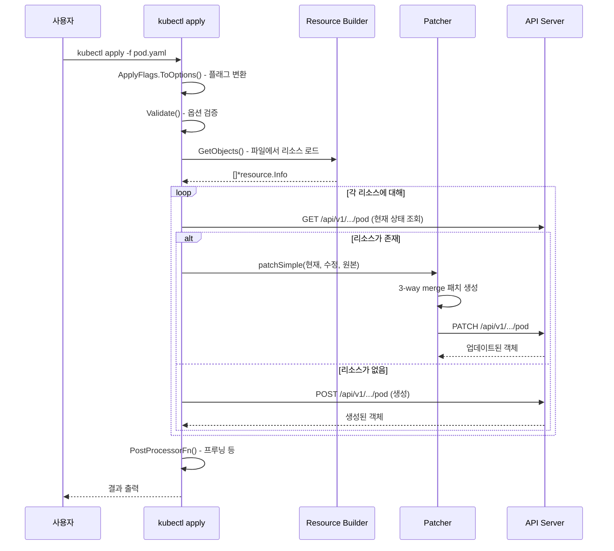
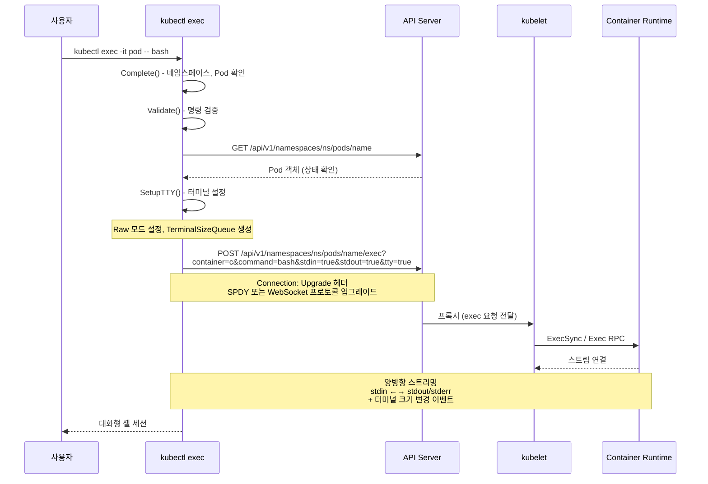

# kubectl 내부 구조 심화

## 1. 개요

kubectl은 Kubernetes 클러스터를 제어하는 공식 CLI 도구다. 단순한 "HTTP 클라이언트 래퍼"가 아니라,
리소스 추상화, 3-way merge 패치, 스트리밍 프로토콜(SPDY/WebSocket), 플러그인 시스템 등
상당히 복잡한 내부 구조를 가지고 있다.

### 왜 kubectl의 내부 구조를 알아야 하는가

1. **디버깅**: `kubectl apply`가 예상과 다르게 동작할 때 3-way merge 로직을 이해해야 원인을 파악할 수 있다
2. **확장**: kubectl 플러그인을 작성하거나, kubectl을 라이브러리로 사용할 때 Factory/Builder 패턴을 이해해야 한다
3. **성능**: `--chunk-size`, `--server-print` 같은 옵션의 동작 원리를 알면 대규모 클러스터에서 효율적으로 사용할 수 있다
4. **보안**: `kubectl diff`의 민감값 마스킹, `kubectl exec`의 프로토콜 폴백 등 보안 관련 동작을 이해할 수 있다

### 핵심 소스코드 위치

| 구성요소 | 소스 경로 |
|---------|----------|
| 진입점(main) | `cmd/kubectl/kubectl.go` |
| Cobra 명령 트리 | `staging/src/k8s.io/kubectl/pkg/cmd/cmd.go` |
| Factory 인터페이스 | `staging/src/k8s.io/kubectl/pkg/cmd/util/factory.go` |
| Factory 구현체 | `staging/src/k8s.io/kubectl/pkg/cmd/util/factory_client_access.go` |
| apply 명령 | `staging/src/k8s.io/kubectl/pkg/cmd/apply/apply.go` |
| get 명령 | `staging/src/k8s.io/kubectl/pkg/cmd/get/get.go` |
| exec 명령 | `staging/src/k8s.io/kubectl/pkg/cmd/exec/exec.go` |
| logs 명령 | `staging/src/k8s.io/kubectl/pkg/cmd/logs/logs.go` |
| diff 명령 | `staging/src/k8s.io/kubectl/pkg/cmd/diff/diff.go` |
| 플러그인 핸들러 | `staging/src/k8s.io/kubectl/pkg/cmd/plugin.go` |
| 플러그인 명령 | `staging/src/k8s.io/kubectl/pkg/cmd/plugin/plugin.go` |
| config 명령 | `staging/src/k8s.io/kubectl/pkg/cmd/config/config.go` |

---

## 2. 아키텍처

### 2.1 전체 구조 개관

```
+------------------------------------------------------------------+
|                         kubectl 진입점                             |
|  cmd/kubectl/kubectl.go                                           |
|    main() -> NewDefaultKubectlCommand() -> cli.RunNoErrOutput()   |
+------------------------------------------------------------------+
        |
        v
+------------------------------------------------------------------+
|                      Cobra 명령 트리                                |
|  kubectl/pkg/cmd/cmd.go                                           |
|    KubectlOptions -> NewKubectlCommand()                          |
|      +-- Basic (create, expose, run, set)                         |
|      +-- Intermediate (explain, get, edit, delete)                |
|      +-- Deploy (rollout, scale, autoscale)                       |
|      +-- Cluster (certificates, cluster-info, top, drain, taint)  |
|      +-- Troubleshoot (describe, logs, exec, port-forward, debug) |
|      +-- Advanced (diff, apply, patch, replace, wait, kustomize)  |
|      +-- Settings (label, annotate, completion)                   |
|      +-- Plugin Commands (동적 발견)                                |
+------------------------------------------------------------------+
        |
        v
+------------------------------------------------------------------+
|                     Factory 패턴                                   |
|  kubectl/pkg/cmd/util/factory.go                                  |
|    Factory interface                                              |
|      -> ToRESTConfig()     : kubeconfig -> REST 설정               |
|      -> NewBuilder()       : Resource Builder 생성                 |
|      -> DynamicClient()    : dynamic.Interface                    |
|      -> KubernetesClientSet(): typed client                       |
|      -> Validator()        : 스키마 검증                            |
+------------------------------------------------------------------+
        |
        v
+------------------------------------------------------------------+
|               client-go / apimachinery                            |
|  REST Config -> HTTP Client -> API Server                         |
+------------------------------------------------------------------+
```

### 2.2 진입점 분석

kubectl의 진입점은 `cmd/kubectl/kubectl.go`의 `main()` 함수다 (줄 31).

```go
// cmd/kubectl/kubectl.go:31
func main() {
    logs.GlogSetter(cmd.GetLogVerbosity(os.Args))
    command := cmd.NewDefaultKubectlCommand()
    if err := cli.RunNoErrOutput(command); err != nil {
        util.CheckErr(err)
    }
}
```

**왜 이렇게 단순한가**: kubectl은 모든 로직을 `k8s.io/kubectl` 패키지로 분리했다.
이는 kubectl을 라이브러리로도 사용할 수 있게 하려는 의도적 설계다. 실제로 다른 프로젝트에서
kubectl 패키지를 임포트하여 자체 CLI를 만들 수 있다.

`NewDefaultKubectlCommand()`는 `cmd.go`의 줄 96에 정의되어 있다:

```go
// kubectl/pkg/cmd/cmd.go:96
func NewDefaultKubectlCommand() *cobra.Command {
    ioStreams := genericiooptions.IOStreams{In: os.Stdin, Out: os.Stdout, ErrOut: os.Stderr}
    return NewDefaultKubectlCommandWithArgs(KubectlOptions{
        PluginHandler: NewDefaultPluginHandler(plugin.ValidPluginFilenamePrefixes),
        Arguments:     os.Args,
        ConfigFlags:   defaultConfigFlags().WithWarningPrinter(ioStreams),
        IOStreams:      ioStreams,
    })
}
```

### 2.3 Cobra 명령 구조

kubectl은 [spf13/cobra](https://github.com/spf13/cobra) 프레임워크를 사용하여 명령 트리를 구성한다.
`NewKubectlCommand()` (cmd.go 줄 165)에서 모든 서브커맨드가 그룹별로 등록된다.

```
kubectl (루트)
├── PersistentPreRunE: warning handler, profiling 초기화
├── PersistentPostRunE: profiling 완료, warning-as-errors 검사
│
├── [Basic Beginner]
│   ├── create    -> create.NewCmdCreate(f, streams)
│   ├── expose    -> expose.NewCmdExposeService(f, streams)
│   ├── run       -> run.NewCmdRun(f, streams)
│   └── set       -> set.NewCmdSet(f, streams)
│
├── [Basic Intermediate]
│   ├── explain   -> explain.NewCmdExplain("kubectl", f, streams)
│   ├── get       -> get.NewCmdGet("kubectl", f, streams)
│   ├── edit      -> edit.NewCmdEdit(f, streams)
│   └── delete    -> delete.NewCmdDelete(f, streams)
│
├── [Deploy]
│   ├── rollout   -> rollout.NewCmdRollout(f, streams)
│   ├── scale     -> scale.NewCmdScale(f, streams)
│   └── autoscale -> autoscale.NewCmdAutoscale(f, streams)
│
├── [Cluster Management]
│   ├── certificate -> certificates.NewCmdCertificate(f, streams)
│   ├── cluster-info -> clusterinfo.NewCmdClusterInfo(f, streams)
│   ├── top       -> top.NewCmdTop(f, streams)
│   ├── cordon    -> drain.NewCmdCordon(f, streams)
│   ├── uncordon  -> drain.NewCmdUncordon(f, streams)
│   ├── drain     -> drain.NewCmdDrain(f, streams)
│   └── taint     -> taint.NewCmdTaint(f, streams)
│
├── [Troubleshooting]
│   ├── describe  -> describe.NewCmdDescribe("kubectl", f, streams)
│   ├── logs      -> logs.NewCmdLogs(f, streams)
│   ├── attach    -> attach.NewCmdAttach(f, streams)
│   ├── exec      -> cmdexec.NewCmdExec(f, streams)
│   ├── port-forward -> portforward.NewCmdPortForward(f, streams)
│   ├── proxy     -> proxy.NewCmdProxy(f, streams)
│   ├── cp        -> cp.NewCmdCp(f, streams)
│   ├── auth      -> auth.NewCmdAuth(f, streams)
│   ├── debug     -> debug.NewCmdDebug(f, streams)
│   └── events    -> events.NewCmdEvents(f, streams)
│
├── [Advanced]
│   ├── diff      -> diff.NewCmdDiff(f, streams)
│   ├── apply     -> apply.NewCmdApply("kubectl", f, streams)
│   ├── patch     -> patch.NewCmdPatch(f, streams)
│   ├── replace   -> replace.NewCmdReplace(f, streams)
│   ├── wait      -> wait.NewCmdWait(f, streams)
│   └── kustomize -> kustomize.NewCmdKustomize(streams)
│
├── [Settings]
│   ├── label     -> label.NewCmdLabel(f, streams)
│   ├── annotate  -> annotate.NewCmdAnnotate("kubectl", f, streams)
│   └── completion -> completion.NewCmdCompletion(streams.Out, "")
│
├── config        -> cmdconfig.NewCmdConfig(f, pathOptions, streams)
├── plugin        -> plugin.NewCmdPlugin(streams)
├── version       -> version.NewCmdVersion(f, streams)
├── api-versions  -> apiresources.NewCmdAPIVersions(f, streams)
├── api-resources -> apiresources.NewCmdAPIResources(f, streams)
└── options       -> options.NewCmdOptions(streams.Out)
```

**왜 그룹으로 나누는가**: 단순히 `--help` 출력을 보기 좋게 만드는 것이 아니라,
각 그룹이 사용자의 숙련도와 용도에 맞춰 설계되었다. Beginner/Intermediate 분류는
학습 곡선을 고려한 것이고, Advanced 그룹은 GitOps 워크플로우에 필수적인 명령들을 모은 것이다.

### 2.4 명령 실행 패턴: Flags -> Options -> Complete -> Validate -> Run

kubectl의 거의 모든 서브커맨드는 동일한 패턴을 따른다:

```
+------------+     +----------+     +----------+     +----------+     +-----+
|   Flags    | --> | Options  | --> | Complete | --> | Validate | --> | Run |
| (CLI 입력)  |     | (런타임)  |     | (환경보완) |     | (검증)    |     | (실행)|
+------------+     +----------+     +----------+     +----------+     +-----+
```

예를 들어 `kubectl apply`의 경우 (apply.go 줄 198-213):

```go
// kubectl/pkg/cmd/apply/apply.go:198
func NewCmdApply(baseName string, f cmdutil.Factory, ioStreams genericiooptions.IOStreams) *cobra.Command {
    flags := NewApplyFlags(ioStreams)
    cmd := &cobra.Command{
        Use: "apply (-f FILENAME | -k DIRECTORY)",
        Run: func(cmd *cobra.Command, args []string) {
            o, err := flags.ToOptions(f, cmd, baseName, args)  // Flags -> Options
            cmdutil.CheckErr(err)
            cmdutil.CheckErr(o.Validate())                      // Validate
            cmdutil.CheckErr(o.Run())                           // Run
        },
    }
    flags.AddFlags(cmd)
    return cmd
}
```

**왜 Flags와 Options를 분리하는가**:

| 구분 | Flags (ApplyFlags) | Options (ApplyOptions) |
|------|-------------------|----------------------|
| 역할 | CLI 입력을 직접 반영 | 런타임에 필요한 모든 의존성 포함 |
| 생성 시점 | 명령 등록 시 | Run 직전 (ToOptions) |
| 테스트 | CLI 플래그 파싱 테스트 | 비즈니스 로직 단위 테스트 |
| 예시 | `FieldManager string` | `Builder *resource.Builder`, `DynamicClient dynamic.Interface` |

이 분리 덕분에 단위 테스트에서 CLI 파싱 없이 `ApplyOptions`를 직접 구성하여
`Validate()`와 `Run()`을 테스트할 수 있다.

### 2.5 Factory 패턴

Factory는 kubectl의 의존성 주입 메커니즘이다. `factory.go` (줄 41)에 인터페이스가 정의되어 있다:

```go
// kubectl/pkg/cmd/util/factory.go:41
type Factory interface {
    genericclioptions.RESTClientGetter

    DynamicClient() (dynamic.Interface, error)
    KubernetesClientSet() (*kubernetes.Clientset, error)
    RESTClient() (*restclient.RESTClient, error)
    NewBuilder() *resource.Builder
    ClientForMapping(mapping *meta.RESTMapping) (resource.RESTClient, error)
    UnstructuredClientForMapping(mapping *meta.RESTMapping) (resource.RESTClient, error)
    Validator(validationDirective string) (validation.Schema, error)
    openapi.OpenAPIResourcesGetter
    OpenAPIV3Client() (openapiclient.Client, error)
}
```

구현체는 `factory_client_access.go`의 `factoryImpl` (줄 41):

```go
// kubectl/pkg/cmd/util/factory_client_access.go:41
type factoryImpl struct {
    clientGetter genericclioptions.RESTClientGetter
    openAPIParser *openapi.CachedOpenAPIParser
    oapi          *openapi.CachedOpenAPIGetter
    parser        sync.Once
    getter        sync.Once
}
```

**왜 Factory를 사용하는가**: 소스코드 주석에서 이유를 설명하고 있다 (factory.go 줄 32-40):

> "The rings are here for a reason. In order for composers to be able to provide
> alternative factory implementations they need to provide low level pieces of
> *certain* functions..."

1. **의존성 역전**: 각 명령이 구체적인 클라이언트 생성 방식을 몰라도 된다
2. **테스트 용이성**: 테스트에서 Mock Factory를 주입할 수 있다
3. **확장성**: 다른 프로젝트가 kubectl을 임베딩할 때 Factory만 교체하면 된다
4. **지연 초기화**: OpenAPI 스키마 같은 비용이 큰 리소스를 `sync.Once`로 필요할 때만 초기화한다

Factory 생성 흐름:

```
main()
  -> NewDefaultKubectlCommand()
    -> NewKubectlCommand(o)
      -> kubeConfigFlags = o.ConfigFlags                    // ConfigFlags
      -> matchVersionKubeConfigFlags = NewMatchVersionFlags  // 버전 매칭 래퍼
      -> f = cmdutil.NewFactory(matchVersionKubeConfigFlags) // Factory 생성
      -> 모든 서브커맨드에 f 전달
```

### 2.6 Resource Builder

Resource Builder는 kubectl에서 가장 핵심적인 추상화 중 하나다. 다양한 소스(파일, stdin,
API 서버, URL)에서 Kubernetes 리소스를 로드하는 일관된 인터페이스를 제공한다.

```
Builder
  .WithScheme(scheme)         // 어떤 스키마로 디코딩할지
  .NamespaceParam(ns)         // 네임스페이스 설정
  .DefaultNamespace()         // 기본 네임스페이스 사용
  .FilenameParam(enforce, &opts) // 파일에서 로드
  .ResourceNames("pods", name)   // 리소스 이름 지정
  .LabelSelectorParam(selector)  // 라벨 셀렉터
  .Do()                       // 실행 -> Result
    .Infos()                  // []resource.Info 반환
    .Object()                 // 단일 객체 반환
```

`resource.Info` 구조체는 리소스에 대한 모든 메타데이터를 담는다:

```
resource.Info {
    Client    RESTClient      // API 서버 클라이언트
    Mapping   *RESTMapping    // GVK -> GVR 매핑
    Namespace string          // 네임스페이스
    Name      string          // 리소스 이름
    Object    runtime.Object  // 실제 객체
    Source    string          // 소스 (파일명 등)
}
```

---

## 3. kubeconfig 로딩

### 3.1 로딩 우선순위

kubeconfig 로딩 순서는 `kubectl config` 명령의 help 텍스트에서 명시하고 있다
(config.go 줄 47-51):

```
1. --kubeconfig 플래그 지정 시 해당 파일만 로드 (머지 없음)
2. $KUBECONFIG 환경변수 설정 시 경로 목록으로 사용 (머지됨)
3. 위 두 조건 모두 없으면 ~/.kube/config 사용 (머지 없음)
```

```
+---------------------+
| --kubeconfig 플래그   | ← 최우선, 단일 파일만
+---------------------+
         |
    (설정 안 됨)
         |
         v
+---------------------+
| $KUBECONFIG 환경변수  | ← 경로 목록, 머지됨
+---------------------+
         |
    (설정 안 됨)
         |
         v
+---------------------+
| ~/.kube/config      | ← 기본값
+---------------------+
```

### 3.2 ConfigFlags에서 REST Config까지

```
ConfigFlags (CLI 플래그)
    |
    v
clientcmd.ClientConfig (kubeconfig 로더)
    |
    v
rest.Config {
    Host:       "https://api.cluster.example.com:6443"
    TLSConfig:  { CertFile, KeyFile, CAFile }
    BearerToken: "..."
    QPS:         50.0      // defaultConfigFlags()에서 설정
    Burst:       300       // WithDiscoveryBurst(300)
    WrapTransport: [...]   // CommandHeaderRoundTripper 등
}
    |
    v
http.Client -> API Server 호출
```

`cmd.go` 줄 92에서 기본 ConfigFlags 생성:

```go
func defaultConfigFlags() *genericclioptions.ConfigFlags {
    return genericclioptions.NewConfigFlags(true).
        WithDeprecatedPasswordFlag().
        WithDiscoveryBurst(300).
        WithDiscoveryQPS(50.0)
}
```

### 3.3 CommandHeader RoundTripper

kubectl은 모든 API 요청에 X-Header를 추가하여 서버 측에서 어떤 kubectl 명령이
호출되었는지 추적할 수 있게 한다 (SIG CLI KEP 859).

```go
// cmd.go:396-421
func addCmdHeaderHooks(cmds *cobra.Command, kubeConfigFlags *genericclioptions.ConfigFlags, isProxyCmd *atomic.Bool) {
    crt := &genericclioptions.CommandHeaderRoundTripper{}
    existingPreRunE := cmds.PersistentPreRunE
    cmds.PersistentPreRunE = func(cmd *cobra.Command, args []string) error {
        crt.ParseCommandHeaders(cmd, args)
        return existingPreRunE(cmd, args)
    }
    kubeConfigFlags.WithWrapConfigFn(func(c *rest.Config) *rest.Config {
        c.Wrap(func(rt http.RoundTripper) http.RoundTripper {
            return &genericclioptions.CommandHeaderRoundTripper{
                Delegate:    rt,
                Headers:     crt.Headers,
                SkipHeaders: isProxyCmd,
            }
        })
        return c
    })
}
```

**왜 proxy 명령은 헤더를 건너뛰는가**: `kubectl proxy`는 사용자의 HTTP 요청을 그대로
전달하는 프록시이므로, kubectl이 임의로 헤더를 추가하면 원래 요청이 변조된다.

---

## 4. kubectl apply

`kubectl apply`는 kubectl에서 가장 복잡한 명령 중 하나다. 선언적 리소스 관리의 핵심이며,
Client-Side Apply(CSA)와 Server-Side Apply(SSA) 두 가지 모드를 지원한다.

### 4.1 ApplyFlags와 ApplyOptions

`ApplyFlags` (apply.go 줄 60)는 CLI 플래그를 직접 반영하고,
`ApplyOptions` (apply.go 줄 82)는 런타임에 필요한 모든 것을 포함한다.

```go
// apply.go:60
type ApplyFlags struct {
    RecordFlags    *genericclioptions.RecordFlags
    PrintFlags     *genericclioptions.PrintFlags
    DeleteFlags    *cmddelete.DeleteFlags
    FieldManager   string
    Selector       string
    Prune          bool
    PruneResources []prune.Resource
    ApplySetRef    string
    All            bool
    Overwrite      bool
    OpenAPIPatch   bool
    Subresource    string
    PruneAllowlist []string
    genericiooptions.IOStreams
}

// apply.go:82
type ApplyOptions struct {
    ServerSideApply bool
    ForceConflicts  bool
    FieldManager    string
    DryRunStrategy  cmdutil.DryRunStrategy
    Prune           bool
    Builder         *resource.Builder
    Mapper          meta.RESTMapper
    DynamicClient   dynamic.Interface
    OpenAPIGetter   openapi.OpenAPIResourcesGetter
    OpenAPIV3Root   openapi3.Root
    objects         []*resource.Info
    objectsCached   bool
    VisitedUids     sets.Set[types.UID]
    VisitedNamespaces sets.Set[string]
    PreProcessorFn  func() error
    PostProcessorFn func() error
    ApplySet        *ApplySet
    // ...
}
```

### 4.2 Client-Side Apply와 3-way Merge

Client-Side Apply는 `last-applied-configuration` 어노테이션을 사용하는
3-way merge 전략이다. 이것은 kubectl apply의 기본 동작이다.

```
3-way merge의 세 가지 소스:
+------------------+     +------------------+     +------------------+
|    Original      |     |    Modified      |     |    Current       |
| (last-applied    |     | (로컬 YAML/JSON  |     | (API 서버의      |
|  annotation)     |     |  파일)           |     |  현재 상태)       |
+------------------+     +------------------+     +------------------+
         \                      |                      /
          \                     |                     /
           +--------------------+--------------------+
                                |
                                v
                    +------------------------+
                    |   Strategic Merge Patch |
                    |   또는 JSON Merge Patch  |
                    +------------------------+
                                |
                                v
                    +------------------------+
                    | PATCH 요청 -> API Server|
                    +------------------------+
```

**왜 3-way merge가 필요한가**: 2-way merge(로컬과 서버만 비교)로는 "사용자가 의도적으로
필드를 삭제한 것"과 "처음부터 없었던 필드"를 구분할 수 없다. Original(마지막으로 apply한 상태)을
함께 비교하면:

| Original | Modified | Current | 동작 |
|----------|----------|---------|------|
| A=1 | A=2 | A=1 | A를 2로 변경 (사용자가 변경) |
| A=1 | (없음) | A=1 | A를 삭제 (사용자가 제거) |
| (없음) | (없음) | A=1 | A 유지 (다른 누군가가 추가, 건드리지 않음) |
| A=1 | A=1 | A=3 | A=3 유지 (서버에서 변경, 사용자는 안 건드림) |
| A=1 | A=2 | A=3 | 충돌! (양쪽 모두 변경) |

### 4.3 Patcher 구조

Patcher는 `patcher.go` (줄 66)에 정의되어 있다:

```go
// patcher.go:66
type Patcher struct {
    Mapping           *meta.RESTMapping
    Helper            *resource.Helper
    Overwrite         bool
    BackOff           clockwork.Clock
    Force             bool
    CascadingStrategy metav1.DeletionPropagation
    Timeout           time.Duration
    GracePeriod       int
    ResourceVersion   *string
    Retries           int       // maxPatchRetry = 5
    OpenAPIGetter     openapi.OpenAPIResourcesGetter
    OpenAPIV3Root     openapi3.Root
}
```

패치 타입 결정 우선순위 (patchSimple 메서드, patcher.go 줄 118):

```
1. OpenAPI V3로 Strategic Merge Patch 시도
   -> gvkSupportsPatchOpenAPIV3() 확인
   -> buildStrategicMergePatchFromOpenAPIV3()
   |
   (실패 시)
   v
2. OpenAPI V2로 Strategic Merge Patch 시도
   -> OpenAPIGetter.OpenAPISchema()
   -> getPatchTypeFromOpenAPI()
   -> buildStrategicMergeFromOpenAPI()
   |
   (실패 시)
   v
3. 빌트인 타입으로 Strategic Merge Patch 시도
   -> scheme.Scheme.New(GVK)
   -> buildStrategicMergeFromBuiltins()
   |
   (NotRegisteredError 시)
   v
4. JSON Merge Patch (CRD 등 커스텀 리소스)
   -> buildMergePatch()
```

**왜 이렇게 복잡한 폴백 체인인가**:

- **OpenAPI V3 우선**: 최신 스펙으로 가장 정확한 패치를 생성한다
- **OpenAPI V2 폴백**: V3를 지원하지 않는 구버전 API 서버와의 호환성
- **빌트인 타입 폴백**: OpenAPI 스키마가 없어도 코어 타입은 Go 구조체 태그로 패치 가능
- **JSON Merge Patch**: CRD는 Strategic Merge Patch를 지원하지 않으므로 표준 JSON Merge Patch 사용

#### 충돌 재시도 로직

```go
// patcher.go:50-51
const maxPatchRetry = 5
const triesBeforeBackOff = 1

// patcher.go:61
var patchRetryBackOffPeriod = 1 * time.Second
```

패치 충돌(409 Conflict) 발생 시 최대 5번까지 재시도한다.
첫 시도 이후에는 1초 백오프를 적용한다.

```
시도 1: 패치 전송
  -> 409 Conflict
시도 2: 즉시 재시도 (triesBeforeBackOff = 1)
  -> 409 Conflict
시도 3: 1초 대기 후 재시도
  -> 409 Conflict
시도 4: 1초 대기 후 재시도
  -> 409 Conflict
시도 5: 1초 대기 후 재시도
  -> 실패 시 에러 반환
```

### 4.4 Server-Side Apply (SSA)

Server-Side Apply는 3-way merge를 API 서버 측에서 수행한다.
클라이언트는 단순히 원하는 상태를 전송하고, 서버가 필드 소유권(field ownership)을 관리한다.

```
Client-Side Apply (CSA)              Server-Side Apply (SSA)
+---------------------------+        +---------------------------+
| kubectl이 3-way merge 수행  |        | kubectl은 원하는 상태만 전송  |
| last-applied annotation 관리|        | API Server가 merge 수행    |
| Strategic Merge Patch 전송  |        | Apply Patch Type 전송     |
+---------------------------+        +---------------------------+
         |                                     |
         v                                     v
  PATCH /api/v1/pods/foo              PATCH /api/v1/pods/foo
  Content-Type:                       Content-Type:
   application/strategic-              application/apply-patch+yaml
   merge-patch+json                   ?fieldManager=kubectl-client-side-apply
                                      &force=true/false
```

SSA의 장점:
- `last-applied-configuration` 어노테이션이 불필요 (대규모 객체에서 어노테이션 크기 제한 문제 해결)
- 필드별 소유권 추적으로 멀티 컨트롤러 환경에서 충돌 방지
- 서버에서 merge 하므로 클라이언트-서버 간 OpenAPI 스키마 불일치 문제 없음

```go
// apply.go:389-397 - Validate에서 CSA/SSA 검증
func (o *ApplyOptions) Validate() error {
    if o.ForceConflicts && !o.ServerSideApply {
        return fmt.Errorf("--force-conflicts only works with --server-side")
    }
    if o.DryRunStrategy == cmdutil.DryRunClient && o.ServerSideApply {
        return fmt.Errorf("--dry-run=client doesn't work with --server-side (did you mean --dry-run=server instead?)")
    }
    // ...
}
```

### 4.5 Apply 실행 흐름 전체



---

## 5. kubectl get

### 5.1 GetOptions 구조

`get.go` (줄 55)에 정의된 `GetOptions`:

```go
// get.go:55
type GetOptions struct {
    PrintFlags             *PrintFlags
    ToPrinter              func(*meta.RESTMapping, *bool, bool, bool) (printers.ResourcePrinterFunc, error)
    IsHumanReadablePrinter bool

    CmdParent string
    resource.FilenameOptions

    Raw       string
    Watch     bool
    WatchOnly bool
    ChunkSize int64       // 기본값 500 (DefaultChunkSize)

    OutputWatchEvents bool
    LabelSelector     string
    FieldSelector     string
    AllNamespaces     bool
    Namespace         string
    Subresource       string
    SortBy            string
    ServerPrint       bool  // 기본값 true

    NoHeaders      bool
    IgnoreNotFound bool

    genericiooptions.IOStreams
}
```

### 5.2 출력 형식 체계

kubectl get은 다양한 출력 형식을 지원한다:

```
kubectl get pods -o <형식>

+-------------------+----------------------------------+-------------------------------+
| 형식               | 설명                              | 구현                           |
+-------------------+----------------------------------+-------------------------------+
| (기본/wide)        | 사람이 읽기 쉬운 테이블              | Server-side Table Printer     |
| json              | JSON 전체 출력                     | JSONPrinter                   |
| yaml              | YAML 전체 출력                     | YAMLPrinter                   |
| name              | 리소스 이름만 (type/name)           | NamePrinter                   |
| custom-columns    | 사용자 정의 컬럼                    | CustomColumnsPrinter          |
| custom-columns-file| 파일에서 컬럼 정의 로드             | CustomColumnsPrinter          |
| jsonpath          | JSONPath 표현식                   | JSONPathPrinter               |
| jsonpath-file     | 파일에서 JSONPath 로드             | JSONPathPrinter               |
| go-template       | Go 템플릿                         | GoTemplatePrinter             |
| go-template-file  | 파일에서 Go 템플릿 로드             | GoTemplatePrinter             |
+-------------------+----------------------------------+-------------------------------+
```

### 5.3 Server-Side Table Printing

**왜 Server-side printing을 기본으로 사용하는가**: kubectl이 모든 리소스 타입의
테이블 형식을 알 필요가 없다. CRD의 경우 서버가 `additionalPrinterColumns`를 통해
어떤 컬럼을 보여줄지 정의하므로, 서버에서 Table 형식으로 변환하는 것이 합리적이다.

```
요청:
  GET /api/v1/namespaces/default/pods
  Accept: application/json;as=Table;v=v1;g=meta.k8s.io

응답:
  {
    "kind": "Table",
    "apiVersion": "meta.k8s.io/v1",
    "columnDefinitions": [
      {"name": "NAME", "type": "string"},
      {"name": "READY", "type": "string"},
      {"name": "STATUS", "type": "string"},
      {"name": "RESTARTS", "type": "integer"},
      {"name": "AGE", "type": "string"}
    ],
    "rows": [
      {"cells": ["nginx", "1/1", "Running", 0, "3d"], "object": {...}}
    ]
  }
```

`get.go` 줄 222-225에서 Server-side print 비활성화 조건:

```go
// custom-columns, yaml, json 출력 시에는 서버 테이블을 사용하지 않음
outputOption := cmd.Flags().Lookup("output").Value.String()
if strings.Contains(outputOption, "custom-columns") || outputOption == "yaml" || strings.Contains(outputOption, "json") {
    o.ServerPrint = false
}
```

### 5.4 TablePrinter

`table_printer.go` (줄 34)의 `TablePrinter`는 서버에서 받은 Table 객체를
디코딩하여 위임 프린터에 전달하는 래퍼다:

```go
// table_printer.go:34
type TablePrinter struct {
    Delegate printers.ResourcePrinter
}

func (t *TablePrinter) PrintObj(obj runtime.Object, writer io.Writer) error {
    table, err := decodeIntoTable(obj)
    if err == nil {
        return t.Delegate.PrintObj(table, writer)
    }
    // Table 디코딩 실패 시 하드코딩된 타입으로 폴백
    klog.V(2).Infof("Unable to decode server response into a Table. Falling back to hardcoded types: %v", err)
    return t.Delegate.PrintObj(obj, writer)
}
```

`decodeIntoTable()` 함수는 `metav1.Table`과 `metav1beta1.Table` 두 버전을 모두 인식한다:

```go
// table_printer.go:49-52
var recognizedTableVersions = map[schema.GroupVersionKind]bool{
    metav1beta1.SchemeGroupVersion.WithKind("Table"): true,
    metav1.SchemeGroupVersion.WithKind("Table"):      true,
}
```

### 5.5 Custom Columns Printer

Custom Columns Printer는 `customcolumn.go`에 구현되어 있다. 두 가지 방식으로 컬럼을
지정할 수 있다:

**인라인 방식** (NewCustomColumnsPrinterFromSpec, customcolumn.go 줄 75):

```bash
kubectl get pods -o custom-columns=NAME:.metadata.name,IMAGE:.spec.containers[0].image
```

```go
// customcolumn.go:75
func NewCustomColumnsPrinterFromSpec(spec string, decoder runtime.Decoder, noHeaders bool) (*CustomColumnsPrinter, error) {
    parts := strings.Split(spec, ",")
    columns := make([]Column, len(parts))
    for ix := range parts {
        colSpec := strings.SplitN(parts[ix], ":", 2)
        // "HEADER:jsonpath" 형식
        spec, err := RelaxedJSONPathExpression(colSpec[1])
        columns[ix] = Column{Header: colSpec[0], FieldSpec: spec}
    }
    return &CustomColumnsPrinter{Columns: columns, Decoder: decoder, NoHeaders: noHeaders}, nil
}
```

**파일 방식** (NewCustomColumnsPrinterFromTemplate, customcolumn.go 줄 110):

```
# columns.txt
NAME               IMAGE
{metadata.name}    {spec.containers[0].image}
```

```bash
kubectl get pods -o custom-columns-file=columns.txt
```

Column 구조 (customcolumn.go 줄 141-147):

```go
type Column struct {
    Header    string  // 헤더 텍스트 (예: "NAME")
    FieldSpec string  // JSONPath 표현식 (예: "{.metadata.name}")
}
```

**JSONPath 유연성**: `RelaxedJSONPathExpression()` (customcolumn.go 줄 50)은 여러 형식의
JSONPath를 받아 표준 형식으로 변환한다:

```
입력 허용 형식                 변환 결과
metadata.name            ->  {.metadata.name}
{metadata.name}          ->  {.metadata.name}
.metadata.name           ->  {.metadata.name}
{.metadata.name}         ->  {.metadata.name}  (이미 표준)
```

### 5.6 Chunked Listing

대규모 클러스터에서 모든 리소스를 한 번에 가져오면 API 서버와 etcd에 부담이 된다.
kubectl은 `--chunk-size` 플래그(기본 500)를 통해 페이지네이션을 지원한다:

```
GET /api/v1/pods?limit=500
  -> 500개 + continue 토큰 반환

GET /api/v1/pods?limit=500&continue=<token>
  -> 다음 500개 + continue 토큰

GET /api/v1/pods?limit=500&continue=<token>
  -> 나머지 + continue="" (완료)
```

---

## 6. kubectl exec

`kubectl exec`는 실행 중인 컨테이너에서 명령을 실행하는 기능을 제공한다.
HTTP 프로토콜을 업그레이드하여 양방향 스트리밍을 구현한다는 점에서 일반적인 REST 호출과
근본적으로 다르다.

### 6.1 핵심 구조체

```go
// exec.go:116
type RemoteExecutor interface {
    Execute(url *url.URL, config *restclient.Config,
        stdin io.Reader, stdout, stderr io.Writer, tty bool,
        terminalSizeQueue remotecommand.TerminalSizeQueue) error
    ExecuteWithContext(ctx context.Context, ...) error
}

// exec.go:125
type DefaultRemoteExecutor struct{}

// exec.go:187
type ExecOptions struct {
    StreamOptions
    resource.FilenameOptions
    ResourceName     string
    Command          []string
    EnforceNamespace bool
    Builder          func() *resource.Builder
    ExecutablePodFn  polymorphichelpers.AttachablePodForObjectFunc
    restClientGetter genericclioptions.RESTClientGetter
    Pod              *corev1.Pod
    Executor         RemoteExecutor
    PodClient        coreclient.PodsGetter
    GetPodTimeout    time.Duration
    Config           *restclient.Config
}
```

### 6.2 SPDY와 WebSocket 프로토콜

kubectl exec는 두 가지 스트리밍 프로토콜을 지원한다. `createExecutor()` 함수
(exec.go 줄 146)에서 프로토콜 선택 로직을 볼 수 있다:

```go
// exec.go:146
func createExecutor(url *url.URL, config *restclient.Config) (remotecommand.Executor, error) {
    // 1. SPDY Executor 생성 (기본)
    exec, err := remotecommand.NewSPDYExecutor(config, "POST", url)
    if err != nil {
        return nil, err
    }
    // 2. WebSocket이 비활성화되지 않았으면 Fallback Executor 구성
    if !cmdutil.RemoteCommandWebsockets.IsDisabled() {
        // WebSocket은 RFC 6455 규격에 따라 GET 메서드 사용
        websocketExec, err := remotecommand.NewWebSocketExecutor(config, "GET", url.String())
        if err != nil {
            return nil, err
        }
        // WebSocket 우선 시도, 실패 시 SPDY로 폴백
        exec, err = remotecommand.NewFallbackExecutor(websocketExec, exec, func(err error) bool {
            return httpstream.IsUpgradeFailure(err) || httpstream.IsHTTPSProxyError(err)
        })
        if err != nil {
            return nil, err
        }
    }
    return exec, nil
}
```

```
프로토콜 선택 흐름:

+-------------------+
| WebSocket 시도     |  <-- GET 메서드 (RFC 6455)
| (우선)             |
+-------------------+
         |
    성공? ──Yes──> WebSocket 사용
         |
        No (UpgradeFailure 또는 HTTPSProxyError)
         |
         v
+-------------------+
| SPDY 폴백         |  <-- POST 메서드
| (레거시)           |
+-------------------+
```

**왜 WebSocket을 우선하는가**:

| 비교 항목 | SPDY | WebSocket |
|----------|------|-----------|
| 표준 | Google 독자 프로토콜 (deprecated) | RFC 6455 (표준) |
| 프록시 지원 | HTTPS 프록시에서 문제 | 대부분의 프록시가 지원 |
| 멀티플렉싱 | 네이티브 지원 | 서브프로토콜로 구현 |
| 브라우저 지원 | 없음 | 있음 |
| 미래 | 점진적 제거 예정 | 장기 지원 |

### 6.3 실행 흐름



### 6.4 TTY 처리

`SetupTTY()` (exec.go 줄 261)는 터미널 설정을 담당한다:

```go
// exec.go:261
func (o *StreamOptions) SetupTTY() term.TTY {
    t := term.TTY{
        Parent: o.InterruptParent,
        Out:    o.Out,
    }
    if !o.Stdin {
        o.In = nil
        o.TTY = false
        return t
    }
    t.In = o.In
    if !o.TTY {
        return t
    }
    // 실제 터미널인지 확인
    if !o.isTerminalIn(t) {
        o.TTY = false
        if !o.Quiet && o.ErrOut != nil {
            fmt.Fprintln(o.ErrOut, "Unable to use a TTY - input is not a terminal...")
        }
        return t
    }
    // Raw 모드: Ctrl+C 등의 시그널을 그대로 컨테이너에 전달
    t.Raw = true
    // Windows 호환: dockerterm.StdStreams() 사용
    stdin, stdout, _ := o.overrideStreams()
    o.In = stdin
    t.In = stdin
    if o.Out != nil {
        o.Out = stdout
        t.Out = stdout
    }
    return t
}
```

**왜 Raw 모드를 사용하는가**: 일반 모드에서는 Ctrl+C가 kubectl 프로세스를 종료한다.
Raw 모드에서는 Ctrl+C가 컨테이너 내의 프로세스에 SIGINT로 전달된다. 이것이
대화형 셸 세션에서 기대하는 동작이다.

### 6.5 Pod 상태 검증

exec 실행 전 Pod 상태를 확인한다 (exec.go 줄 350-351):

```go
if pod.Status.Phase == corev1.PodSucceeded || pod.Status.Phase == corev1.PodFailed {
    return fmt.Errorf("cannot exec into a container in a completed pod; current phase is %s", pod.Status.Phase)
}
```

Completed 상태의 Pod에는 exec를 실행할 수 없다. 컨테이너 프로세스가 이미 종료된 상태이기 때문이다.

---

## 7. kubectl logs

### 7.1 LogsOptions 구조

`logs.go` (줄 121)에 정의된 `LogsOptions`:

```go
// logs.go:121
type LogsOptions struct {
    Namespace     string
    ResourceArg   string
    AllContainers bool
    AllPods       bool
    Options       runtime.Object    // *corev1.PodLogOptions

    ConsumeRequestFn func(context.Context, rest.ResponseWrapper, io.Writer) error

    // PodLogOptions 필드들
    SinceTime                    string
    SinceSeconds                 time.Duration
    Follow                       bool
    Previous                     bool
    Timestamps                   bool
    IgnoreLogErrors              bool
    LimitBytes                   int64
    Tail                         int64
    Container                    string
    InsecureSkipTLSVerifyBackend bool

    ContainerNameSpecified bool
    Selector               string
    MaxFollowConcurrency   int  // 기본값 5
    Prefix                 bool

    Object              runtime.Object
    GetPodTimeout       time.Duration
    RESTClientGetter    genericclioptions.RESTClientGetter
    LogsForObject       polymorphichelpers.LogsForObjectFunc
    AllPodLogsForObject polymorphichelpers.AllPodLogsForObjectFunc

    genericiooptions.IOStreams
    TailSpecified bool
    containerNameFromRefSpecRegexp *regexp.Regexp
}
```

### 7.2 로그 소비 전략: 순차 vs 병렬

`RunLogsContext()` (logs.go 줄 368)에서 로그 소비 전략을 결정한다:

```go
// logs.go:368
func (o LogsOptions) RunLogsContext(ctx context.Context) error {
    ctx, cancel := context.WithCancel(context.Background())
    defer cancel()
    intr := interrupt.New(nil, cancel)
    return intr.Run(func() error {
        var requests map[corev1.ObjectReference]rest.ResponseWrapper
        if o.AllPods {
            requests, err = o.AllPodLogsForObject(...)
        } else {
            requests, err = o.LogsForObject(...)
        }
        // Follow 모드이고 여러 Pod가 있으면 병렬 처리
        if o.Follow && len(requests) > 1 {
            if len(requests) > o.MaxFollowConcurrency {
                return fmt.Errorf("you are attempting to follow %d log streams, but maximum allowed concurrency is %d",
                    len(requests), o.MaxFollowConcurrency)
            }
            return o.parallelConsumeRequest(ctx, requests)
        }
        return o.sequentialConsumeRequest(ctx, requests)
    })
}
```

```
+---------------------------------------+
|        kubectl logs 실행               |
+---------------------------------------+
        |
        v
+---------------------------------------+
| LogsForObject / AllPodLogsForObject   |
| -> map[ObjectReference]ResponseWrapper |
+---------------------------------------+
        |
        v
  Follow && len > 1?
    /          \
  Yes          No
   |            |
   v            v
+----------+ +------------+
| 병렬 처리  | | 순차 처리    |
| (goroutine | | (for loop) |
|  + Pipe)   | |            |
+----------+ +------------+
```

### 7.3 병렬 로그 스트리밍

```go
// logs.go:400
func (o LogsOptions) parallelConsumeRequest(ctx context.Context, requests map[corev1.ObjectReference]rest.ResponseWrapper) error {
    reader, writer := io.Pipe()
    wg := &sync.WaitGroup{}
    wg.Add(len(requests))
    for objRef, request := range requests {
        go func(objRef corev1.ObjectReference, request rest.ResponseWrapper) {
            defer wg.Done()
            out := o.addPrefixIfNeeded(objRef, writer)
            if err := o.consumeWithRetry(ctx, request, out, writer); err != nil {
                writer.CloseWithError(err)
                return
            }
        }(objRef, request)
    }
    go func() {
        wg.Wait()
        writer.Close()
    }()
    _, err := io.Copy(o.Out, reader)
    return err
}
```

**왜 Pipe를 사용하는가**: 여러 goroutine이 동시에 stdout에 쓰면 출력이 섞인다.
`io.Pipe()`를 사용하면 Pipe의 Write가 원자적이므로 라인 단위 출력이 섞이지 않는다.
또한 하나의 goroutine이 에러로 Pipe를 닫으면 다른 goroutine들도 자연스럽게 종료된다.

### 7.4 라벨 셀렉터와 기본 Tail

라벨 셀렉터로 여러 Pod의 로그를 조회할 때, 기본 tail이 달라진다:

```go
// logs.go:113
var selectorTail int64 = 10

// logs.go:241-245
if len(o.Selector) > 0 && o.Tail == -1 && !o.TailSpecified {
    logOptions.TailLines = &selectorTail  // 셀렉터 사용 시 기본 10줄
} else if o.Tail != -1 {
    logOptions.TailLines = &o.Tail
}
```

**왜 셀렉터 사용 시 기본 tail을 제한하는가**: `-l app=nginx`로 100개의 Pod를 선택하면,
각 Pod의 전체 로그를 출력하는 것은 사용자가 원하는 동작이 아닐 가능성이 높다.
기본 10줄로 제한하여 화면이 넘치는 것을 방지한다.

### 7.5 로그 스트리밍 재시도

```go
// logs.go:436
func (o LogsOptions) consumeWithRetry(ctx context.Context, request rest.ResponseWrapper, out io.Writer, internalErrOut io.Writer) error {
    if !o.Follow {
        err := o.ConsumeRequestFn(ctx, request, out)
        if err != nil && o.IgnoreLogErrors {
            _, _ = fmt.Fprint(internalErrOut, "error: "+err.Error()+"\n")
            return nil
        }
        return err
    }
    // Follow 모드: 1초 간격으로 재시도
    return wait.PollUntilContextTimeout(ctx, 1*time.Second, o.GetPodTimeout, true, func(_ context.Context) (bool, error) {
        err := o.ConsumeRequestFn(ctx, request, out)
        if err == nil {
            return true, nil
        }
        // ...
    })
}
```

Follow 모드에서 연결이 끊기면 자동으로 재시도한다. `--ignore-errors` 플래그를 설정하면
비치명적 에러를 무시하고 계속 스트리밍한다.

---

## 8. kubectl diff

`kubectl diff`는 로컬 구성과 서버의 현재 상태를 비교하여 `kubectl apply` 실행 시
어떤 변경이 일어날지 미리 보여준다.

### 8.1 DiffOptions 구조

```go
// diff.go:103
type DiffOptions struct {
    FilenameOptions   resource.FilenameOptions
    ServerSideApply   bool
    FieldManager      string
    ForceConflicts    bool
    ShowManagedFields bool
    ShowSecrets       bool
    Concurrency       int        // 기본값 1
    Selector          string
    OpenAPIGetter     openapi.OpenAPIResourcesGetter
    OpenAPIV3Root     openapi3.Root
    DynamicClient     dynamic.Interface
    CmdNamespace      string
    EnforceNamespace  bool
    Builder           *resource.Builder
    Diff              *DiffProgram
    pruner            *pruner
    tracker           *tracker
}
```

### 8.2 Dry-run Server 활용

diff는 내부적으로 "dry-run" 모드로 apply를 시뮬레이션한다.
`InfoObject.Merged()` (diff.go 줄 348)에서 서버에 dry-run 요청을 보낸다:

```go
// diff.go:348
func (obj InfoObject) Merged() (runtime.Object, error) {
    helper := resource.NewHelper(obj.Info.Client, obj.Info.Mapping).
        DryRun(true).                    // <-- dry-run 활성화
        WithFieldManager(obj.FieldManager)
    if obj.ServerSideApply {
        // SSA: Apply patch를 dry-run으로 전송
        return helper.Patch(
            obj.Info.Namespace, obj.Info.Name,
            types.ApplyPatchType, data, &options,
        )
    }
    if obj.Live() == nil {
        // 새 리소스: dry-run create
        return helper.CreateWithOptions(...)
    }
    // 기존 리소스: Patcher로 dry-run patch
    patcher := &apply.Patcher{
        Mapping:  obj.Info.Mapping,
        Helper:   helper,     // DryRun(true) 설정된 helper
        Overwrite: true,
        // ...
    }
    _, result, err := patcher.Patch(...)
    return result, err
}
```

```
diff 동작 흐름:

로컬 파일 (YAML)
      |
      v
  Resource Builder로 파싱
      |
      v
+-----+-----+
|     |     |
v     |     v
LIVE  |  MERGED
(GET) |  (dry-run apply)
      |
      v
  diff LIVE MERGED
  (외부 diff 프로그램)
```

### 8.3 민감값 마스킹

`kubectl diff`는 기본적으로 Secret의 data 값을 마스킹한다.
이 동작은 diff.go 줄 87-92에 정의된 상수와 `Masker` 구조체로 구현된다:

```go
// diff.go:87-92
const (
    sensitiveMaskDefault = "***"
    sensitiveMaskBefore  = "*** (before)"
    sensitiveMaskAfter   = "*** (after)"
)
```

`Masker` (diff.go 줄 446)는 두 객체의 `data` 필드를 비교하여 마스킹한다:

```go
// diff.go:446
type Masker struct {
    from *unstructured.Unstructured
    to   *unstructured.Unstructured
}
```

마스킹 로직 (diff.go 줄 489):

```go
// diff.go:489
func (m *Masker) run() error {
    from, _ := m.dataFromUnstructured(m.from)
    to, _ := m.dataFromUnstructured(m.to)

    for k := range from {
        if _, ok := to[k]; ok {
            if from[k] != to[k] {
                // 값이 다르면 before/after로 구분
                from[k] = sensitiveMaskBefore   // "*** (before)"
                to[k] = sensitiveMaskAfter      // "*** (after)"
                continue
            }
            to[k] = sensitiveMaskDefault        // "***"
        }
        from[k] = sensitiveMaskDefault          // "***"
    }
    for k := range to {
        if _, ok := from[k]; !ok {
            to[k] = sensitiveMaskDefault        // "***"
        }
    }
    // 마스킹된 data를 객체에 다시 설정
}
```

마스킹 결과 예시:

```yaml
# Secret의 data 필드가 변경된 경우:
# LIVE (before)                  # MERGED (after)
data:                            data:
  password: "*** (before)"         password: "*** (after)"    # 변경됨
  username: "***"                  username: "***"            # 동일
                                   newkey: "***"              # 추가됨
```

**왜 이렇게 마스킹하는가**: diff 출력에 Secret 값이 평문으로 노출되면 보안 위험이다.
하지만 값이 변경되었는지 여부는 알 수 있어야 한다. `"*** (before)"`와 `"*** (after)"`로
구분하면 실제 값을 노출하지 않으면서도 변경 여부를 확인할 수 있다.

`--show-secrets` 플래그로 마스킹을 비활성화할 수 있다:

```bash
kubectl diff -f secret.yaml --show-secrets
```

### 8.4 외부 Diff 프로그램

`DiffProgram` (diff.go 줄 186)은 `KUBECTL_EXTERNAL_DIFF` 환경변수를 통해
외부 diff 프로그램을 사용할 수 있다:

```go
// diff.go:191
func (d *DiffProgram) getCommand(args ...string) (string, exec.Cmd) {
    diff := ""
    if envDiff := os.Getenv("KUBECTL_EXTERNAL_DIFF"); envDiff != "" {
        diffCommand := strings.Split(envDiff, " ")
        diff = diffCommand[0]
        // 추가 인자 파싱 (영문자, 숫자, 대시, 등호만 허용)
        isValidChar := regexp.MustCompile(`^[a-zA-Z0-9-=]+$`).MatchString
        for i := 1; i < len(diffCommand); i++ {
            if isValidChar(diffCommand[i]) {
                args = append(args, diffCommand[i])
            }
        }
    } else {
        diff = "diff"
        args = append([]string{"-u", "-N"}, args...)  // 기본: unified diff, treat absent as empty
    }
    cmd := d.Exec.Command(diff, args...)
    return diff, cmd
}
```

**왜 인자 검증에 정규식을 사용하는가**: 명령어 인젝션을 방지하기 위해
`^[a-zA-Z0-9-=]+$` 패턴만 허용한다. 세미콜론, 파이프 등 셸 메타문자를 차단한다.

종료 코드 의미:

```
0: 차이 없음
1: 차이 있음 (정상)
>1: 오류 발생
```

### 8.5 Concurrency 지원

`--concurrency` 플래그로 여러 객체를 병렬로 diff할 수 있다:

```bash
kubectl diff -f deployment/ --concurrency 4
```

---

## 9. kubectl plugin 메커니즘

### 9.1 플러그인 아키텍처

kubectl 플러그인은 PATH 기반의 단순한 실행 파일 발견 메커니즘을 사용한다.
Git의 플러그인 시스템과 동일한 패턴이다.

```
PATH 검색:
/usr/local/bin/kubectl-myplugin  ->  kubectl myplugin
/usr/local/bin/kubectl-ns        ->  kubectl ns
/usr/local/bin/kubectl-ctx       ->  kubectl ctx
```

### 9.2 PluginHandler 인터페이스

`plugin.go` (줄 32-42)에 정의된 인터페이스:

```go
// plugin.go:32
type PluginHandler interface {
    Lookup(filename string) (string, bool)
    Execute(executablePath string, cmdArgs, environment []string) error
}

// plugin.go:45
type DefaultPluginHandler struct {
    ValidPrefixes []string  // ["kubectl"]
}
```

### 9.3 플러그인 발견: Lookup

```go
// plugin.go:58
func (h *DefaultPluginHandler) Lookup(filename string) (string, bool) {
    for _, prefix := range h.ValidPrefixes {
        // "kubectl-<filename>" 형태로 PATH에서 검색
        path, err := exec.LookPath(fmt.Sprintf("%s-%s", prefix, filename))
        if shouldSkipOnLookPathErr(err) || len(path) == 0 {
            continue
        }
        return path, true
    }
    return "", false
}
```

### 9.4 플러그인 이름 매칭: HandlePluginCommand

`HandlePluginCommand()` (plugin.go 줄 109)는 가장 긴 이름부터 매칭을 시도한다:

```go
// plugin.go:109
func HandlePluginCommand(pluginHandler PluginHandler, cmdArgs []string, minArgs int) error {
    var remainingArgs []string
    for _, arg := range cmdArgs {
        if strings.HasPrefix(arg, "-") {
            break
        }
        // 하이픈을 언더스코어로 변환
        remainingArgs = append(remainingArgs, strings.Replace(arg, "-", "_", -1))
    }

    foundBinaryPath := ""
    // 가장 긴 이름부터 시도
    for len(remainingArgs) > 0 {
        path, found := pluginHandler.Lookup(strings.Join(remainingArgs, "-"))
        if !found {
            remainingArgs = remainingArgs[:len(remainingArgs)-1]
            if len(remainingArgs) < minArgs {
                break
            }
            continue
        }
        foundBinaryPath = path
        break
    }

    if len(foundBinaryPath) == 0 {
        return nil
    }
    // 나머지 인자를 플러그인에 전달
    return pluginHandler.Execute(foundBinaryPath, cmdArgs[len(remainingArgs):], os.Environ())
}
```

매칭 예시:

```
kubectl foo bar baz --flag value

시도 순서:
1. kubectl-foo_bar_baz  (PATH에서 찾기)  -> 없음
2. kubectl-foo_bar      (PATH에서 찾기)  -> 찾음!
   -> Execute("kubectl-foo_bar", ["baz", "--flag", "value"], env)

또는:
1. kubectl-foo_bar_baz  -> 없음
2. kubectl-foo_bar      -> 없음
3. kubectl-foo          -> 찾음!
   -> Execute("kubectl-foo", ["bar", "baz", "--flag", "value"], env)
```

**왜 하이픈을 언더스코어로 변환하는가**: 파일명에 하이픈이 여러 개 있으면
서브커맨드 경계를 구분할 수 없다. 예를 들어 `kubectl-my-plugin`이
`kubectl my plugin`인지 `kubectl my-plugin`인지 모호하다.
하이픈 -> 언더스코어 변환으로 이 모호성을 해결한다:

```
kubectl my-plugin  ->  kubectl-my_plugin (찾기)
kubectl my plugin  ->  kubectl-my-plugin (찾기, 하이픈은 경계)
```

### 9.5 플러그인 실행: Execute

```go
// plugin.go:70
func (h *DefaultPluginHandler) Execute(executablePath string, cmdArgs, environment []string) error {
    // Windows는 exec syscall을 지원하지 않음
    if runtime.GOOS == "windows" {
        cmd := command(executablePath, cmdArgs...)
        cmd.Stdout = os.Stdout
        cmd.Stderr = os.Stderr
        cmd.Stdin = os.Stdin
        cmd.Env = environment
        err := cmd.Run()
        if err == nil {
            os.Exit(0)
        }
        return err
    }
    // Unix: syscall.Exec로 프로세스 교체 (PID 유지)
    return syscall.Exec(executablePath, append([]string{executablePath}, cmdArgs...), environment)
}
```

**왜 Unix에서 `syscall.Exec`를 사용하는가**: `os/exec`의 `Cmd.Run()`은 새 프로세스를
포크하고 kubectl 프로세스가 종료를 기다린다. 반면 `syscall.Exec`는 현재 프로세스를
플러그인으로 완전히 교체한다(PID가 동일). 이렇게 하면:

- 불필요한 프로세스가 남지 않음
- 시그널이 플러그인에 직접 전달됨
- 메모리 사용량 감소

### 9.6 서브커맨드 플러그인

빌트인 명령의 서브커맨드로 플러그인을 허용하는 경우도 있다.
현재는 `create`만 허용된다 (plugin.go 줄 158):

```go
// plugin.go:158
func IsSubcommandPluginAllowed(foundCmd string) bool {
    allowedCmds := map[string]struct{}{"create": {}}
    _, ok := allowedCmds[foundCmd]
    return ok
}
```

```
kubectl create networkpolicy
  1. "create" 명령은 존재 -> foundCmd = "create"
  2. IsSubcommandPluginAllowed("create") -> true
  3. "networkpolicy" 서브커맨드가 빌트인에 없음
  4. kubectl-create_networkpolicy 플러그인 검색
  5. 찾으면 실행
```

### 9.7 ValidPluginFilenamePrefixes

```go
// plugin/plugin.go:63
var ValidPluginFilenamePrefixes = []string{"kubectl"}
```

플러그인 파일명은 반드시 `kubectl-` 접두사를 가져야 한다. 이는 `plugin list` 명령에서
PATH를 순회할 때도 사용된다.

---

## 10. Resource Printer 체계

kubectl은 다양한 출력 형식을 지원하기 위해 Printer 체계를 사용한다.

### 10.1 Printer 인터페이스 계층

```
printers.ResourcePrinter (인터페이스)
    |
    +-- printers.JSONPrinter         : JSON 출력
    +-- printers.YAMLPrinter         : YAML 출력
    +-- printers.NamePrinter         : "type/name" 출력
    +-- printers.HumanReadablePrinter : 테이블 형식
    +-- printers.JSONPathPrinter     : JSONPath 기반 필터링
    +-- printers.GoTemplatePrinter   : Go 템플릿
    +-- get.CustomColumnsPrinter     : 사용자 정의 컬럼
    +-- get.TablePrinter             : 서버 응답 Table 디코딩 래퍼
```

### 10.2 PrintFlags와 Printer 선택

```
PrintFlags
  |
  +-- OutputFormat 확인
  |     |
  |     +-- ""/"wide"     -> HumanReadablePrinter (ServerPrint = true)
  |     +-- "json"        -> JSONPrinter
  |     +-- "yaml"        -> YAMLPrinter
  |     +-- "name"        -> NamePrinter
  |     +-- "custom-columns=..." -> CustomColumnsPrinter
  |     +-- "jsonpath=..."       -> JSONPathPrinter
  |     +-- "go-template=..."    -> GoTemplatePrinter
  |
  +-- ToPrinter() -> printers.ResourcePrinter
```

### 10.3 출력 형식별 특성 비교

| 형식 | 서버 테이블 사용 | 전체 객체 필요 | 용도 |
|------|---------------|-------------|------|
| 기본/wide | O (Server-Print) | X | 인간 가독성 |
| json | X | O | 프로그래밍/디버깅 |
| yaml | X | O | 선언적 관리/편집 |
| name | X | X | 스크립트 파이프라인 |
| custom-columns | X | O | 특정 필드 추출 |
| jsonpath | X | O | 특정 값 추출 |

### 10.4 wide 출력의 추가 컬럼

`-o wide`를 사용하면 서버가 `includeObject=Object` 헤더와 함께 추가 컬럼을 반환한다:

```
기본 출력:
NAME    READY   STATUS    RESTARTS   AGE

wide 출력:
NAME    READY   STATUS    RESTARTS   AGE   IP          NODE           NOMINATED NODE   READINESS GATES
```

---

## 11. 소스코드 맵

### 11.1 디렉토리 구조

```
staging/src/k8s.io/kubectl/
├── pkg/
│   ├── cmd/                        # 모든 서브커맨드
│   │   ├── cmd.go                  # 루트 명령, KubectlOptions, 명령 그룹
│   │   ├── plugin.go               # PluginHandler (Lookup/Execute)
│   │   ├── apply/
│   │   │   ├── apply.go            # ApplyFlags, ApplyOptions, NewCmdApply
│   │   │   ├── patcher.go          # Patcher, 3-way merge, 패치 타입 결정
│   │   │   └── applyset.go         # ApplySet (KEP 3659)
│   │   ├── get/
│   │   │   ├── get.go              # GetOptions, NewCmdGet
│   │   │   ├── table_printer.go    # TablePrinter, decodeIntoTable
│   │   │   ├── customcolumn.go     # CustomColumnsPrinter, Column
│   │   │   └── sorter.go           # 결과 정렬
│   │   ├── exec/
│   │   │   └── exec.go             # ExecOptions, RemoteExecutor, SPDY/WS
│   │   ├── logs/
│   │   │   └── logs.go             # LogsOptions, 병렬/순차 소비
│   │   ├── diff/
│   │   │   └── diff.go             # DiffOptions, Masker, DiffProgram
│   │   ├── config/
│   │   │   ├── config.go           # NewCmdConfig, 서브커맨드 등록
│   │   │   ├── view.go             # config view
│   │   │   ├── set_context.go      # config set-context
│   │   │   └── use_context.go      # config use-context
│   │   ├── describe/
│   │   │   └── describe.go         # DescribeFlags, DescribeOptions
│   │   ├── plugin/
│   │   │   └── plugin.go           # NewCmdPlugin, PluginListOptions
│   │   └── util/
│   │       ├── factory.go          # Factory 인터페이스
│   │       └── factory_client_access.go  # factoryImpl
│   ├── describe/                    # Describer 구현체들
│   ├── polymorphichelpers/          # 리소스 타입별 헬퍼 (로그, Attach 등)
│   ├── scheme/                      # kubectl 전용 스키마
│   ├── util/                        # 유틸리티
│   │   ├── completion/              # 셸 자동완성
│   │   ├── i18n/                    # 국제화
│   │   ├── interrupt/               # 시그널 처리
│   │   ├── openapi/                 # OpenAPI 스키마 캐시
│   │   ├── prune/                   # 프루닝 로직
│   │   └── templates/               # 도움말 템플릿
│   └── validation/                  # 스키마 검증
│
cmd/kubectl/
└── kubectl.go                       # main() 진입점
```

### 11.2 핵심 파일별 책임

| 파일 | 줄 수 참조 | 핵심 책임 |
|------|-----------|----------|
| cmd.go:83 | KubectlOptions | CLI 입력 + 플러그인 핸들러 + IO |
| cmd.go:96 | NewDefaultKubectlCommand | 기본 설정으로 루트 명령 생성 |
| cmd.go:165 | NewKubectlCommand | 모든 서브커맨드 등록, Factory 생성 |
| cmd.go:256-329 | 명령 그룹 | 7개 그룹으로 서브커맨드 분류 |
| factory.go:41 | Factory interface | 클라이언트/빌더/검증기 추상화 |
| factory_client_access.go:41 | factoryImpl | Factory 구현, OpenAPI 캐싱 |
| apply.go:60 | ApplyFlags | CLI 플래그 -> 런타임 옵션 분리 |
| apply.go:82 | ApplyOptions | 전체 런타임 상태 |
| patcher.go:51 | maxPatchRetry | 충돌 시 최대 5회 재시도 |
| patcher.go:66 | Patcher | 3-way merge + 패치 전송 |
| get.go:55 | GetOptions | 출력 형식, 필터, 페이지네이션 |
| table_printer.go:34 | TablePrinter | 서버 Table 디코딩 래퍼 |
| customcolumn.go:75 | NewCustomColumnsPrinterFromSpec | 인라인 커스텀 컬럼 파서 |
| exec.go:116 | RemoteExecutor | 원격 실행 추상화 |
| exec.go:125 | DefaultRemoteExecutor | SPDY/WS 실행 구현 |
| exec.go:147 | createExecutor | WS -> SPDY 폴백 체인 |
| exec.go:187 | ExecOptions | 전체 exec 실행 상태 |
| logs.go:121 | LogsOptions | 로그 조회 옵션 |
| logs.go:368 | RunLogsContext | 병렬/순차 로그 소비 결정 |
| diff.go:87-92 | sensitiveMask* | 민감값 마스킹 상수 |
| diff.go:446 | Masker | Secret data 마스킹 로직 |
| plugin.go:32 | PluginHandler | 플러그인 발견/실행 인터페이스 |
| plugin.go:109 | HandlePluginCommand | 가장 긴 이름부터 매칭 |

---

## 12. 핵심 정리

### 12.1 설계 원칙

| 원칙 | 구현 |
|------|------|
| 관심사 분리 | Flags(CLI) / Options(런타임) / Factory(의존성) 3층 분리 |
| 의존성 역전 | Factory 인터페이스로 클라이언트 생성 추상화 |
| 점진적 폴백 | OpenAPI V3 -> V2 -> 빌트인 -> JSON Merge Patch |
| 프로토콜 진화 | WebSocket -> SPDY 폴백 (exec/attach) |
| 보안 기본값 | diff의 Secret 마스킹, 플러그인 인자 검증 |
| 대규모 지원 | Chunked listing, 병렬 diff, 로그 동시성 제한 |

### 12.2 주요 상수/기본값

| 상수 | 값 | 위치 | 의미 |
|------|---|------|------|
| maxPatchRetry | 5 | patcher.go:51 | 패치 충돌 최대 재시도 횟수 |
| triesBeforeBackOff | 1 | patcher.go:53 | 백오프 전 즉시 재시도 횟수 |
| patchRetryBackOffPeriod | 1s | patcher.go:61 | 패치 재시도 백오프 주기 |
| DefaultChunkSize | 500 | (cmdutil) | 리스트 페이지네이션 크기 |
| selectorTail | 10 | logs.go:113 | 셀렉터 사용 시 기본 tail 줄 수 |
| MaxFollowConcurrency | 5 | logs.go:166 | 병렬 로그 스트리밍 기본 최대 수 |
| defaultPodExecTimeout | 60s | exec.go:78 | exec Pod 타임아웃 |
| defaultPodLogsTimeout | 20s | logs.go:118 | logs Pod 타임아웃 |
| maxRetries (diff) | 4 | diff.go:85 | diff 최대 재시도 횟수 |
| DiscoveryBurst | 300 | cmd.go:92 | Discovery API 버스트 |
| DiscoveryQPS | 50.0 | cmd.go:92 | Discovery API QPS |

### 12.3 자주 혼동되는 개념 정리

**Client-Side Apply vs Server-Side Apply**

```
CSA:  kubectl이 3-way merge 수행 -> Strategic Merge Patch 전송
SSA:  kubectl이 원하는 상태 전송 -> API Server가 merge 수행

CSA 사용 시: kubectl apply -f pod.yaml
SSA 사용 시: kubectl apply -f pod.yaml --server-side
```

**Strategic Merge Patch vs JSON Merge Patch**

```
Strategic Merge Patch:
  - Kubernetes 전용 (코어 타입만)
  - 리스트 항목을 키로 merge (예: containers[].name)
  - 리스트 항목 삭제 가능 ($patch: delete)

JSON Merge Patch (RFC 7396):
  - 표준 JSON 패치
  - 리스트는 전체 교체 (개별 항목 merge 불가)
  - CRD에 사용
```

**SPDY vs WebSocket (exec/attach)**

```
SPDY:     Google 독자 프로토콜, POST, deprecated
WebSocket: RFC 6455 표준, GET, 현재 기본값
폴백:      WebSocket 실패 시 SPDY로 자동 전환
```

### 12.4 핵심 흐름 요약

```
kubectl apply -f pod.yaml
  1. main() -> NewDefaultKubectlCommand()
  2. Cobra 라우팅 -> apply.NewCmdApply()
  3. ApplyFlags.ToOptions() -> Factory에서 Builder, DynamicClient 등 생성
  4. Validate() -> CSA/SSA 호환성 검사
  5. Run() -> Builder로 파일 파싱 -> 각 리소스에 대해:
     a. GET 현재 상태
     b. Patcher.patchSimple() -> 3-way merge
        i.  OpenAPI V3 Strategic Merge Patch 시도
        ii. OpenAPI V2 폴백
        iii.빌트인 타입 폴백
        iv. JSON Merge Patch 폴백 (CRD)
     c. PATCH 요청 (충돌 시 최대 5회 재시도)
  6. PostProcessorFn() -> 프루닝, 결과 출력

kubectl get pods
  1. Cobra 라우팅 -> get.NewCmdGet()
  2. Complete() -> 네임스페이스, 출력 형식 결정
  3. Run() -> Builder로 API 호출 (Accept: Table)
  4. TablePrinter -> decodeIntoTable() -> HumanReadablePrinter

kubectl exec -it pod -- bash
  1. Cobra 라우팅 -> exec.NewCmdExec()
  2. Complete() -> Pod 조회, REST Config 획득
  3. Run() -> createExecutor() -> WebSocket/SPDY Fallback
  4. POST /pods/name/exec (Connection: Upgrade)
  5. 양방향 스트리밍 (Raw TTY 모드)

kubectl diff -f deployment.yaml
  1. Builder로 리소스 파싱
  2. GET LIVE 상태 / dry-run apply로 MERGED 상태 계산
  3. Secret이면 Masker로 data 마스킹
  4. 임시 디렉토리에 YAML 파일 생성
  5. 외부 diff 프로그램 실행 (KUBECTL_EXTERNAL_DIFF 또는 diff -u -N)
```
