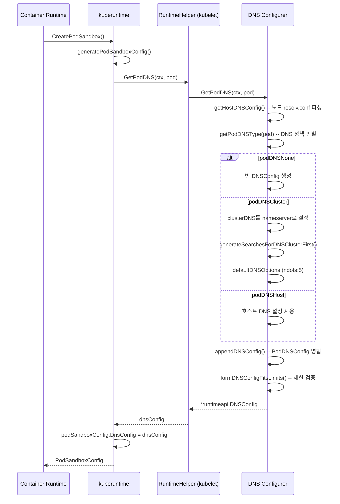
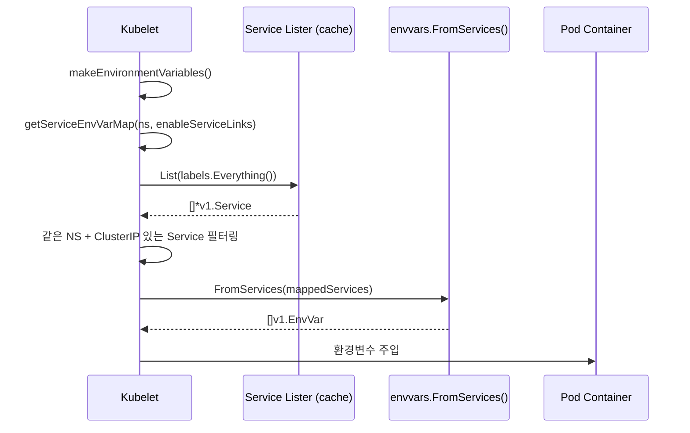

# DNS & Service Discovery 심화

## 1. 개요 -- 왜 DNS 기반 서비스 디스커버리인가

Kubernetes 클러스터 내부에서 Pod들은 끊임없이 생성되고 삭제된다. 각 Pod에는 고유 IP가
할당되지만, 이 IP는 Pod의 수명과 함께 사라진다. Service는 이 문제를 해결하기 위한
추상화 계층이다. 그런데 Service 자체를 어떻게 찾을 것인가?

Kubernetes는 두 가지 서비스 디스커버리 메커니즘을 제공한다:

```
+-----------------------------+     +-----------------------------+
|  환경변수 기반 SD            |     |  DNS 기반 SD                |
|  (Environment Variable)     |     |  (DNS-based)                |
+-----------------------------+     +-----------------------------+
| - Pod 생성 시점에 주입       |     | - 실시간 조회 가능           |
| - 이후 변경 반영 불가        |     | - Service 추가/삭제 즉시 반영|
| - 순서 의존성 존재           |     | - 표준 DNS 프로토콜 사용     |
| - Docker Link 호환          |     | - 유연한 이름 해석           |
+-----------------------------+     +-----------------------------+
        레거시, 제한적                    권장, 표준 방식
```

**왜 DNS인가?**

1. **탈결합(Decoupling)**: Service가 Pod보다 나중에 생성되어도 DNS로 찾을 수 있다.
   환경변수 방식은 Pod 생성 시점에 Service가 존재해야 한다.
2. **표준 프로토콜**: 모든 언어, 프레임워크가 DNS를 지원한다. 별도 SDK 불필요.
3. **동적 업데이트**: EndpointSlice가 변경되면 DNS 레코드가 자동 갱신된다.
4. **네임스페이스 격리**: `<svc>.<ns>.svc.cluster.local` 형식으로 네임스페이스별 격리.

---

## 2. 아키텍처

### 2.1 전체 DNS 흐름

```
+------------------+    DNS Query     +------------------+    Watch     +------------------+
|                  | ───────────────> |                  | <────────── |                  |
|   Pod Container  |                  |     CoreDNS      |             |   kube-apiserver |
|   (resolv.conf)  | <─────────────── |   (kube-system)  | ──────────> |                  |
|                  |    DNS Response  |                  |    List     |  EndpointSlice   |
+------------------+                  +------------------+             |  Service         |
        |                                     |                        +------------------+
        |                                     |
   resolv.conf                          Corefile 설정
   생성: kubelet                        - kubernetes 플러그인
   DNS Configurer                       - forward . /etc/resolv.conf
```

### 2.2 CoreDNS

CoreDNS는 Kubernetes의 기본 클러스터 DNS 서버다. kubeadm은 CoreDNS를 kube-system
네임스페이스에 Deployment로 배포하며, 기본 레플리카 수는 **2개**이다.

```go
// cmd/kubeadm/app/phases/addons/dns/dns.go (줄 51)
const (
    coreDNSReplicas = 2
)
```

kubeadm의 `EnsureDNSAddon` 함수가 CoreDNS 배포를 담당한다:

```go
// cmd/kubeadm/app/phases/addons/dns/dns.go (줄 89-100)
func EnsureDNSAddon(cfg *kubeadmapi.ClusterConfiguration, client clientset.Interface,
    patchesDir string, out io.Writer, printManifest bool) error {
    var replicas *int32
    var err error
    if !printManifest {
        replicas, err = deployedDNSReplicas(client, coreDNSReplicas)
        if err != nil {
            return err
        }
    } else {
        var defaultReplicas int32 = coreDNSReplicas
        replicas = &defaultReplicas
    }
    return coreDNSAddon(cfg, client, replicas, patchesDir, out, printManifest)
}
```

CoreDNS의 핵심 Corefile 구조:

```
.:53 {
    errors
    health {
        lameduck 5s
    }
    ready
    kubernetes cluster.local in-addr.arpa ip6.arpa {
        pods insecure
        fallthrough in-addr.arpa ip6.arpa
        ttl 30
    }
    prometheus :9153
    forward . /etc/resolv.conf {
        max_concurrent 1000
    }
    cache 30
    loop
    reload
    loadbalance
}
```

| Corefile 지시자 | 역할 |
|----------------|------|
| `kubernetes` | API 서버를 감시하여 Service/EndpointSlice → DNS 레코드 변환 |
| `forward` | 클러스터 외부 도메인을 노드의 /etc/resolv.conf에 위임 |
| `cache 30` | DNS 응답을 30초간 캐시하여 API 서버 부하 감소 |
| `loop` | 순환 참조(DNS loop) 감지 후 CoreDNS 중단 |
| `loadbalance` | A/AAAA 레코드 응답 순서를 라운드로빈으로 셔플 |
| `health` | :8080/health 엔드포인트 제공 (liveness probe) |
| `ready` | :8181/ready 엔드포인트 제공 (readiness probe) |
| `prometheus` | :9153에서 메트릭 노출 |

**왜 CoreDNS인가?** (kube-dns 대비)

- 플러그인 체인 아키텍처로 기능 조합이 유연하다.
- 단일 바이너리/프로세스로 운영 단순화 (kube-dns는 3개 컨테이너).
- Corefile 기반 선언적 설정.
- Go로 작성되어 Kubernetes 생태계와 동일한 언어.

### 2.3 kubelet DNS Configurer

kubelet은 Pod를 생성할 때 DNS 설정을 결정하는 `Configurer` 구조체를 사용한다.
이 구조체가 각 Pod의 /etc/resolv.conf 내용을 생성한다.

```go
// pkg/kubelet/network/dns/dns.go (줄 60-74)
type Configurer struct {
    recorder         record.EventRecorderLogger
    getHostDNSConfig func(klog.Logger, string) (*runtimeapi.DNSConfig, error)
    nodeRef          *v1.ObjectReference
    nodeIPs          []net.IP

    // If non-nil, use this for container DNS server.
    clusterDNS []net.IP
    // If non-empty, use this for container DNS search.
    ClusterDomain string
    // The path to the DNS resolver configuration file used as the base to generate
    // the container's DNS resolver configuration file.
    ResolverConfig string
}
```

`NewConfigurer`로 초기화한다:

```go
// pkg/kubelet/network/dns/dns.go (줄 77-87)
func NewConfigurer(recorder record.EventRecorderLogger, nodeRef *v1.ObjectReference,
    nodeIPs []net.IP, clusterDNS []net.IP, clusterDomain, resolverConfig string) *Configurer {
    return &Configurer{
        recorder:         recorder,
        getHostDNSConfig: getHostDNSConfig,
        nodeRef:          nodeRef,
        nodeIPs:          nodeIPs,
        clusterDNS:       clusterDNS,
        ClusterDomain:    clusterDomain,
        ResolverConfig:   resolverConfig,
    }
}
```

**핵심 필드 설명:**

| 필드 | kubelet 플래그 | 설명 |
|------|---------------|------|
| `clusterDNS` | `--cluster-dns` | CoreDNS Service의 ClusterIP (보통 10.96.0.10) |
| `ClusterDomain` | `--cluster-domain` | 클러스터 도메인 (기본 cluster.local) |
| `ResolverConfig` | `--resolv-conf` | 호스트 resolv.conf 경로 (기본 /etc/resolv.conf) |

### 2.4 RuntimeHelper 인터페이스

kubelet의 컨테이너 런타임은 `RuntimeHelper` 인터페이스를 통해 DNS 설정을 가져온다:

```go
// pkg/kubelet/container/helpers.go (줄 49-58)
type RuntimeHelper interface {
    GenerateRunContainerOptions(ctx context.Context, pod *v1.Pod, container *v1.Container,
        podIP string, podIPs []string, imageVolumes ImageVolumes) (
        contOpts *RunContainerOptions, cleanupAction func(), err error)
    GetPodDNS(ctx context.Context, pod *v1.Pod) (dnsConfig *runtimeapi.DNSConfig, err error)
    GetPodCgroupParent(pod *v1.Pod) string
    GetPodDir(podUID types.UID) string
    GeneratePodHostNameAndDomain(logger klog.Logger, pod *v1.Pod) (
        hostname string, hostDomain string, err error)
    // ... 기타 메서드
}
```

Pod 샌드박스 생성 시 이 인터페이스가 호출된다:

```go
// pkg/kubelet/kuberuntime/kuberuntime_sandbox.go (줄 95-112)
dnsConfig, err := m.runtimeHelper.GetPodDNS(ctx, pod)
if err != nil {
    return nil, err
}
podSandboxConfig.DnsConfig = dnsConfig

if !kubecontainer.IsHostNetworkPod(pod) {
    podHostname, podDomain, err := m.runtimeHelper.GeneratePodHostNameAndDomain(logger, pod)
    if err != nil {
        return nil, err
    }
    podHostname, err = util.GetNodenameForKernel(podHostname, podDomain, pod.Spec.SetHostnameAsFQDN)
    if err != nil {
        return nil, err
    }
    podSandboxConfig.Hostname = podHostname
}
```

---

## 3. DNS Policy

Kubernetes는 Pod의 DNS 동작을 제어하는 네 가지 정책을 제공한다.

### 3.1 타입 정의

```go
// pkg/apis/core/types.go (줄 3314-3335)
type DNSPolicy string

const (
    // DNSClusterFirstWithHostNet: 호스트 네트워크 사용 시에도 클러스터 DNS 우선
    DNSClusterFirstWithHostNet DNSPolicy = "ClusterFirstWithHostNet"

    // DNSClusterFirst: 클러스터 DNS 우선 (기본값)
    // hostNetwork=true이면 DNSDefault로 폴백
    DNSClusterFirst DNSPolicy = "ClusterFirst"

    // DNSDefault: 노드의 DNS 설정을 그대로 사용
    DNSDefault DNSPolicy = "Default"

    // DNSNone: Kubernetes가 DNS 설정을 건드리지 않음
    // PodDNSConfig로 직접 지정해야 함
    DNSNone DNSPolicy = "None"
)
```

### 3.2 DNS 타입 결정 로직

kubelet은 `getPodDNSType` 함수에서 Pod의 DNS 정책을 내부 타입으로 변환한다.
이 함수의 분기 로직이 DNS 동작의 핵심이다:

```go
// pkg/kubelet/network/dns/dns.go (줄 304-323)
func getPodDNSType(pod *v1.Pod) (podDNSType, error) {
    dnsPolicy := pod.Spec.DNSPolicy
    switch dnsPolicy {
    case v1.DNSNone:
        return podDNSNone, nil
    case v1.DNSClusterFirstWithHostNet:
        return podDNSCluster, nil
    case v1.DNSClusterFirst:
        if !kubecontainer.IsHostNetworkPod(pod) {
            return podDNSCluster, nil
        }
        // Fallback to DNSDefault for pod on hostnetwork.
        fallthrough
    case v1.DNSDefault:
        return podDNSHost, nil
    }
    return podDNSCluster, fmt.Errorf("invalid DNSPolicy=%v", dnsPolicy)
}
```

**왜 `ClusterFirst`가 hostNetwork에서 `Default`로 폴백하는가?**

hostNetwork Pod는 노드의 네트워크 네임스페이스를 공유한다. 만약 이 Pod가
클러스터 DNS(예: 10.96.0.10)를 사용하면, 노드의 라우팅 테이블이 클러스터 IP 대역을
처리하지 못할 수 있다. 따라서 안전하게 노드의 DNS 설정으로 폴백한다.
명시적으로 `ClusterFirstWithHostNet`을 지정하면 이 폴백을 우회할 수 있다.

### 3.3 정책별 비교

```
DNS Policy 결정 흐름도:

                       +-------------------+
                       |  pod.Spec.DNSPolicy|
                       +--------+----------+
                                |
              +---------+-------+-------+---------+
              |         |               |         |
              v         v               v         v
          DNSNone   ClusterFirst    Default   ClusterFirst
                        |                    WithHostNet
                        |
                   +----+-----+
                   | hostNet? |
                   +----+-----+
                   |         |
                  Yes       No
                   |         |
                   v         v
              podDNSHost  podDNSCluster
              (= Default)
```

| 정책 | nameserver | search domain | 사용 사례 |
|------|-----------|---------------|----------|
| `ClusterFirst` (기본) | CoreDNS IP | `<ns>.svc.<domain>`, `svc.<domain>`, `<domain>` + 호스트 | 대부분의 일반 Pod |
| `Default` | 노드의 /etc/resolv.conf | 노드의 search domain | 클러스터 외부 DNS만 필요할 때 |
| `None` | PodDNSConfig에서 지정 | PodDNSConfig에서 지정 | 완전 커스텀 DNS 설정 |
| `ClusterFirstWithHostNet` | CoreDNS IP | `<ns>.svc.<domain>` + 호스트 | hostNetwork=true이면서 클러스터 DNS 필요 |

### 3.4 ClusterFirst (기본)

가장 일반적인 정책이다. Pod의 resolv.conf가 다음과 같이 생성된다:

```
nameserver 10.96.0.10
search default.svc.cluster.local svc.cluster.local cluster.local
options ndots:5
```

이 설정의 의미:
1. 모든 DNS 쿼리를 CoreDNS(10.96.0.10)로 보낸다.
2. 짧은 이름에 search domain을 순서대로 붙여본다.
3. 이름에 점이 5개 미만이면 search domain을 먼저 시도한다.

### 3.5 Default

노드의 /etc/resolv.conf를 그대로 상속한다. 클러스터 내부 Service를 DNS로 찾을 수 없다.

```
# 노드의 /etc/resolv.conf가 그대로 복사됨
nameserver 8.8.8.8
nameserver 8.8.4.4
search example.com
```

### 3.6 None

Kubernetes가 DNS 설정을 전혀 주입하지 않는다. `PodDNSConfig`로 직접 지정해야 한다.

```yaml
apiVersion: v1
kind: Pod
metadata:
  name: custom-dns
spec:
  dnsPolicy: "None"
  dnsConfig:
    nameservers:
      - 1.1.1.1
      - 8.8.8.8
    searches:
      - my.custom.domain
    options:
      - name: ndots
        value: "2"
```

### 3.7 ClusterFirstWithHostNet

hostNetwork: true인 Pod에서 클러스터 DNS를 사용하고 싶을 때 명시적으로 지정한다.

```yaml
apiVersion: v1
kind: Pod
metadata:
  name: host-net-pod
spec:
  hostNetwork: true
  dnsPolicy: "ClusterFirstWithHostNet"
```

---

## 4. DNS 설정 생성

### 4.1 GetPodDNS -- 핵심 설정 생성 함수

`GetPodDNS`는 kubelet이 Pod 샌드박스를 생성할 때 호출하는 핵심 함수다.
이 함수가 Pod의 최종 DNS 설정(resolv.conf 내용)을 결정한다.

```go
// pkg/kubelet/network/dns/dns.go (줄 386-450)
func (c *Configurer) GetPodDNS(ctx context.Context, pod *v1.Pod) (*runtimeapi.DNSConfig, error) {
    logger := klog.FromContext(ctx)
    dnsConfig, err := c.getHostDNSConfig(logger, c.ResolverConfig)
    if err != nil {
        return nil, err
    }

    dnsType, err := getPodDNSType(pod)
    if err != nil {
        logger.Error(err, "Failed to get DNS type for pod. Falling back to DNSClusterFirst policy.",
            "pod", klog.KObj(pod))
        dnsType = podDNSCluster
    }
    switch dnsType {
    case podDNSNone:
        // DNSNone: 빈 DNS 설정으로 시작
        dnsConfig = &runtimeapi.DNSConfig{}
    case podDNSCluster:
        if len(c.clusterDNS) != 0 {
            // ClusterFirst: CoreDNS를 유일한 nameserver로 설정
            dnsConfig.Servers = []string{}
            for _, ip := range c.clusterDNS {
                dnsConfig.Servers = append(dnsConfig.Servers, ip.String())
            }
            dnsConfig.Searches = c.generateSearchesForDNSClusterFirst(dnsConfig.Searches, pod)
            dnsConfig.Options = defaultDNSOptions  // ["ndots:5"]
            break
        }
        // clusterDNS 미설정 시 Default로 폴백
        nodeErrorMsg := fmt.Sprintf(
            "kubelet does not have ClusterDNS IP configured and cannot create Pod using %q policy. "+
            "Falling back to %q policy.", v1.DNSClusterFirst, v1.DNSDefault)
        c.recorder.WithLogger(logger).Eventf(c.nodeRef, v1.EventTypeWarning, "MissingClusterDNS", nodeErrorMsg)
        fallthrough
    case podDNSHost:
        // Default: 호스트 DNS 사용
        if c.ResolverConfig == "" {
            for _, nodeIP := range c.nodeIPs {
                if utilnet.IsIPv6(nodeIP) {
                    dnsConfig.Servers = append(dnsConfig.Servers, "::1")
                } else {
                    dnsConfig.Servers = append(dnsConfig.Servers, "127.0.0.1")
                }
            }
            if len(dnsConfig.Servers) == 0 {
                dnsConfig.Servers = append(dnsConfig.Servers, "127.0.0.1")
            }
            dnsConfig.Searches = []string{"."}
        }
    }

    // PodDNSConfig가 있으면 위 설정에 병합
    if pod.Spec.DNSConfig != nil {
        dnsConfig = appendDNSConfig(dnsConfig, pod.Spec.DNSConfig)
    }
    return c.formDNSConfigFitsLimits(logger, dnsConfig, pod), nil
}
```

**핵심 흐름을 시퀀스 다이어그램으로 정리:**



### 4.2 resolv.conf 파싱

kubelet은 노드의 resolv.conf를 파싱하여 기본 DNS 설정을 구성한다.
`parseResolvConf` 함수가 이 작업을 수행한다:

```go
// pkg/kubelet/network/dns/dns.go (줄 226-275)
func parseResolvConf(reader io.Reader) (nameservers []string, searches []string,
    options []string, err error) {
    file, err := utilio.ReadAtMost(reader, maxResolvConfLength)  // 최대 10MB
    if err != nil {
        return nil, nil, nil, err
    }

    nameservers = []string{}  // "nameserver" 행은 누적
    searches = []string{}     // "search" 행은 마지막 것만 유효
    options = []string{}      // "options" 행은 마지막 것만 유효

    lines := strings.Split(string(file), "\n")
    for l := range lines {
        trimmed := strings.TrimSpace(lines[l])
        if strings.HasPrefix(trimmed, "#") {
            continue
        }
        fields := strings.Fields(trimmed)
        if len(fields) == 0 {
            continue
        }
        if fields[0] == "nameserver" {
            if len(fields) >= 2 {
                nameservers = append(nameservers, fields[1])
            }
        }
        if fields[0] == "search" {
            searches = []string{}
            for _, s := range fields[1:] {
                if s != "." {
                    searches = append(searches, strings.TrimSuffix(s, "."))
                }
            }
        }
        if fields[0] == "options" {
            options = appendOptions(options, fields[1:]...)
        }
    }
    return nameservers, searches, options, utilerrors.NewAggregate(allErrors)
}
```

**파싱 규칙 정리:**

| resolv.conf 지시자 | 파싱 동작 | 이유 |
|-------------------|----------|------|
| `nameserver` | 누적(append) | RFC 규격상 여러 nameserver 지원 |
| `search` | 마지막만 유효(overwrite) | RFC 규격: 마지막 search 행이 이전 것을 덮어씀 |
| `options` | 마지막만 유효(overwrite) | 동일 옵션은 덮어쓰기, 신규 옵션은 추가 |
| `#` 주석 | 무시 | 표준 주석 처리 |

**왜 trailing dot을 제거하는가?** `strings.TrimSuffix(s, ".")` -- DNS에서 trailing dot은
FQDN을 의미하지만, search domain으로 사용할 때는 상대 이름으로 취급해야 하므로
정규화(normalization)를 위해 제거한다. 이렇게 하면 같은 도메인이 dot 유무에 따라
중복 카운트되는 것을 방지할 수 있다.

### 4.3 Search Domain 생성

ClusterFirst 정책일 때 search domain을 생성하는 로직이다:

```go
// pkg/kubelet/network/dns/dns.go (줄 165-175)
func (c *Configurer) generateSearchesForDNSClusterFirst(hostSearch []string, pod *v1.Pod) []string {
    if c.ClusterDomain == "" {
        return hostSearch
    }

    nsSvcDomain := fmt.Sprintf("%s.svc.%s", pod.Namespace, c.ClusterDomain)
    svcDomain := fmt.Sprintf("svc.%s", c.ClusterDomain)
    clusterSearch := []string{nsSvcDomain, svcDomain, c.ClusterDomain}

    return omitDuplicates(append(clusterSearch, hostSearch...))
}
```

**생성되는 search domain 순서 (default 네임스페이스, cluster.local 도메인 기준):**

```
search default.svc.cluster.local svc.cluster.local cluster.local [호스트 search...]
       ─────────┬───────────────  ────────┬────────  ──────┬─────
                │                         │                │
    같은 네임스페이스 내       모든 네임스페이스   클러스터 내
    Service 이름 해석        Service 해석      임의 이름 해석
```

**왜 이 순서인가?**

1. `default.svc.cluster.local` -- 가장 빈번한 케이스. 같은 네임스페이스의 Service를
   짧은 이름(`my-svc`)으로 찾을 수 있다.
2. `svc.cluster.local` -- 다른 네임스페이스의 Service를 `my-svc.other-ns`로 찾을 수 있다.
3. `cluster.local` -- 클러스터 수준의 이름 해석.
4. 호스트 search domain -- 클러스터 외부 이름 해석을 위한 폴백.

**실제 DNS 질의 과정 예시 (`my-svc`를 조회할 때):**

```
Query 1: my-svc.default.svc.cluster.local    → 성공 시 반환
Query 2: my-svc.svc.cluster.local             → (Query 1 실패 시)
Query 3: my-svc.cluster.local                 → (Query 2 실패 시)
Query 4: my-svc.ec2.internal                  → (호스트 search, Query 3 실패 시)
Query 5: my-svc.                              → FQDN으로 최종 시도
```

### 4.4 ndots:5

```go
// pkg/kubelet/network/dns/dns.go (줄 44)
var (
    defaultDNSOptions = []string{"ndots:5"}
)
```

**ndots란?** DNS resolver가 이름을 "절대(FQDN)"로 판단하는 기준이다.
이름에 포함된 dot(.)의 수가 ndots 값 이상이면 FQDN으로 간주하여 search domain을
붙이지 않고 바로 질의한다.

**왜 5인가?**

Kubernetes의 FQDN 형식은 `<svc>.<ns>.svc.<domain>.`으로 최대 4개의 dot이 있다.
ndots:5로 설정하면 4개 이하의 dot을 가진 이름은 모두 상대 이름으로 취급되어
search domain이 먼저 시도된다.

```
이름                                    dot 수  ndots:5 동작
──────────────────────────────────────  ──────  ──────────────────
my-svc                                   0      search domain 먼저
my-svc.default                           1      search domain 먼저
my-svc.default.svc                       2      search domain 먼저
my-svc.default.svc.cluster               3      search domain 먼저
my-svc.default.svc.cluster.local         4      search domain 먼저
my-svc.default.svc.cluster.local.        5      FQDN (trailing dot)
www.example.com                          2      search domain 먼저 (!)
api.v2.example.com.au                    3      search domain 먼저 (!)
a.b.c.d.example.com                      4      search domain 먼저 (!)
a.b.c.d.e.example.com                    5      FQDN으로 바로 질의
```

**ndots:5의 부작용:**

외부 도메인(예: `www.google.com`)을 조회할 때도 search domain을 먼저 시도한다.
이로 인해 불필요한 DNS 쿼리가 발생한다:

```
"www.google.com" 조회 시 (ndots:5, dot 수 = 2):
  1. www.google.com.default.svc.cluster.local  → NXDOMAIN
  2. www.google.com.svc.cluster.local          → NXDOMAIN
  3. www.google.com.cluster.local              → NXDOMAIN
  4. www.google.com.ec2.internal               → NXDOMAIN (호스트 search)
  5. www.google.com.                           → 성공!
```

4번의 불필요한 쿼리가 발생한다. 대량의 외부 DNS 조회가 필요한 애플리케이션에서는
PodDNSConfig로 ndots를 낮추는 것을 고려할 수 있다:

```yaml
spec:
  dnsConfig:
    options:
      - name: ndots
        value: "2"
```

또는 외부 도메인을 FQDN(trailing dot)으로 지정하면 search domain을 건너뛸 수 있다:
`www.google.com.` (trailing dot 포함)

### 4.5 PodDNSConfig

PodDNSConfig는 DNS 정책에 의해 생성된 기본 설정에 추가/병합되는 커스텀 설정이다.

```go
// pkg/apis/core/types.go (줄 4358-4383)
type PodDNSConfig struct {
    // DNS name server IP 주소 목록
    // DNSPolicy에서 생성된 nameserver에 추가됨
    Nameservers []string
    // DNS search domain 목록
    // DNSPolicy에서 생성된 search에 추가됨
    Searches []string
    // DNS resolver 옵션 목록
    // DNSPolicy에서 생성된 options에 병합됨 (동일 키는 덮어쓰기)
    Options []PodDNSConfigOption
}

type PodDNSConfigOption struct {
    Name  string
    Value *string  // nil이면 값 없는 옵션 (예: single-request)
}
```

PodDNSConfig 병합 로직:

```go
// pkg/kubelet/network/dns/dns.go (줄 378-383)
func appendDNSConfig(existingDNSConfig *runtimeapi.DNSConfig,
    dnsConfig *v1.PodDNSConfig) *runtimeapi.DNSConfig {
    existingDNSConfig.Servers = omitDuplicates(
        append(existingDNSConfig.Servers, dnsConfig.Nameservers...))
    existingDNSConfig.Searches = omitDuplicates(
        append(existingDNSConfig.Searches, dnsConfig.Searches...))
    existingDNSConfig.Options = mergeDNSOptions(
        existingDNSConfig.Options, dnsConfig.Options)
    return existingDNSConfig
}
```

Options 병합은 `mergeDNSOptions`에서 수행한다:

```go
// pkg/kubelet/network/dns/dns.go (줄 327-353)
func mergeDNSOptions(existingDNSConfigOptions []string,
    dnsConfigOptions []v1.PodDNSConfigOption) []string {
    optionsMap := make(map[string]string)
    // 기존 옵션을 맵에 추가
    for _, op := range existingDNSConfigOptions {
        if index := strings.Index(op, ":"); index != -1 {
            optionsMap[op[:index]] = op[index+1:]
        } else {
            optionsMap[op] = ""
        }
    }
    // PodDNSConfig 옵션이 기존 것을 덮어씀
    for _, op := range dnsConfigOptions {
        if op.Value != nil {
            optionsMap[op.Name] = *op.Value
        } else {
            optionsMap[op.Name] = ""
        }
    }
    // 맵을 다시 문자열 배열로 변환
    options := []string{}
    for opName, opValue := range optionsMap {
        op := opName
        if opValue != "" {
            op = op + ":" + opValue
        }
        options = append(options, op)
    }
    return options
}
```

**병합 규칙 정리:**

| 항목 | 병합 방식 | 중복 처리 |
|------|----------|----------|
| Nameservers | append + 중복 제거 | 동일 IP는 한 번만 |
| Searches | append + 중복 제거 | 동일 도메인은 한 번만 |
| Options | 키 기반 병합 | PodDNSConfig 값이 기존 값을 덮어씀 |

---

## 5. Service DNS 레코드

CoreDNS의 kubernetes 플러그인이 API 서버를 감시하여 Service/EndpointSlice를
DNS 레코드로 변환한다. 레코드 형식은 Service 타입에 따라 달라진다.

### 5.1 ClusterIP Service (A/AAAA 레코드)

가장 기본적인 Service 타입이다. 할당된 ClusterIP에 대한 A(또는 AAAA) 레코드를 생성한다.

```
DNS 레코드 형식:
  <service-name>.<namespace>.svc.<cluster-domain>  →  ClusterIP

예시:
  my-svc.default.svc.cluster.local  →  10.96.100.5
```

**질의 가능한 이름 형태들 (ClusterFirst 정책, default 네임스페이스에서):**

```
+------------------------------------+----------------------------------------+
| 질의 이름                          | 해석 결과                               |
+------------------------------------+----------------------------------------+
| my-svc                             | my-svc.default.svc.cluster.local       |
| my-svc.default                     | my-svc.default.svc.cluster.local       |
| my-svc.default.svc                 | my-svc.default.svc.cluster.local       |
| my-svc.default.svc.cluster.local   | my-svc.default.svc.cluster.local       |
| my-svc.other-ns                    | my-svc.other-ns.svc.cluster.local      |
+------------------------------------+----------------------------------------+
```

**Dual-Stack Service:**

IPv4와 IPv6 모두 할당된 Service는 A와 AAAA 레코드를 모두 생성한다.

```
my-svc.default.svc.cluster.local  →  A     10.96.100.5
my-svc.default.svc.cluster.local  →  AAAA  fd00::1:5
```

### 5.2 Headless Service (clusterIP: None)

ClusterIP가 없는 Headless Service는 개별 Pod의 IP를 직접 반환한다.
EndpointSlice에 포함된 모든 Ready 상태의 Pod IP가 A 레코드로 생성된다.

```
Headless Service DNS 동작:

                   +-------------------+
                   |  Headless Service |
                   |  clusterIP: None  |
                   +--------+----------+
                            |
            DNS Query: my-svc.default.svc.cluster.local
                            |
              +-------------+-------------+
              |             |             |
              v             v             v
         10.244.1.5    10.244.2.8    10.244.3.2
          (Pod A)       (Pod B)       (Pod C)
```

**일반 Service vs Headless Service DNS 응답:**

```
# 일반 Service (ClusterIP)
$ dig my-svc.default.svc.cluster.local
ANSWER:
  my-svc.default.svc.cluster.local.  30  IN  A  10.96.100.5   ← ClusterIP 하나

# Headless Service (clusterIP: None)
$ dig my-headless.default.svc.cluster.local
ANSWER:
  my-headless.default.svc.cluster.local.  30  IN  A  10.244.1.5  ← Pod A
  my-headless.default.svc.cluster.local.  30  IN  A  10.244.2.8  ← Pod B
  my-headless.default.svc.cluster.local.  30  IN  A  10.244.3.2  ← Pod C
```

**Pod별 개별 A 레코드 (StatefulSet 연동):**

StatefulSet과 결합하면 각 Pod에 고유한 DNS 이름이 부여된다:

```
<pod-name>.<service-name>.<namespace>.svc.<cluster-domain>

예시 (StatefulSet "web", Headless Service "web-svc"):
  web-0.web-svc.default.svc.cluster.local  →  10.244.1.5
  web-1.web-svc.default.svc.cluster.local  →  10.244.2.8
  web-2.web-svc.default.svc.cluster.local  →  10.244.3.2
```

**왜 Headless Service가 필요한가?**

1. **StatefulSet**: 각 Pod에 안정적인 네트워크 ID 부여 (데이터베이스 클러스터링).
2. **클라이언트 측 로드밸런싱**: 애플리케이션이 직접 Pod를 선택할 수 있다.
3. **피어 디스커버리**: Pod들이 서로를 찾아 클러스터를 구성할 수 있다.

### 5.3 ExternalName Service (CNAME 레코드)

```go
// pkg/apis/core/types.go (줄 5121-5125)
// ExternalName is the external reference that kubedns or equivalent will
// return as a CNAME record for this service. No proxying will be involved.
// Must be a valid RFC-1123 hostname
ExternalName string
```

ExternalName Service는 CNAME 레코드를 반환한다. 클러스터 내부에서 외부 서비스를
접근할 때 추상화 계층을 제공한다.

```yaml
apiVersion: v1
kind: Service
metadata:
  name: my-db
  namespace: default
spec:
  type: ExternalName
  externalName: db.example.com
```

```
DNS 질의:
  my-db.default.svc.cluster.local  →  CNAME  db.example.com
                                      →  A    93.184.216.34  (외부 DNS에서 해석)
```

**왜 ExternalName을 사용하는가?**

- 환경별(dev/staging/prod) 외부 서비스 엔드포인트를 Service 이름 뒤에 숨길 수 있다.
- 마이그레이션 시 외부 → 내부 전환을 Service 재생성 없이 할 수 있다.
- 프록시(kube-proxy) 없이 DNS 수준에서 동작하므로 오버헤드가 없다.

### 5.4 SRV 레코드

SRV 레코드는 Service의 named port에 대해 생성된다. 포트 번호와 프로토콜 정보를
DNS로 조회할 수 있게 한다.

```go
// pkg/apis/core/types.go (줄 5234-5240)
type ServicePort struct {
    // Name of this port within the service. Must be a DNS_LABEL.
    // All ports within a ServiceSpec must have unique names.
    Name string
    // ...
}
```

**SRV 레코드 형식:**

```
_<port-name>._<protocol>.<service-name>.<namespace>.svc.<cluster-domain>

예시:
  _http._tcp.my-svc.default.svc.cluster.local
    →  SRV  0 100 80 my-svc.default.svc.cluster.local.
            ─  ───  ──
            │   │    └── 포트 번호
            │   └── 가중치
            └── 우선순위
```

**Headless Service의 SRV 레코드:**

Headless Service에서는 SRV 레코드가 각 Pod를 가리킨다:

```
_http._tcp.my-headless.default.svc.cluster.local
  →  SRV  0 33 80 web-0.my-headless.default.svc.cluster.local.
  →  SRV  0 33 80 web-1.my-headless.default.svc.cluster.local.
  →  SRV  0 33 80 web-2.my-headless.default.svc.cluster.local.
```

**publishNotReadyAddresses:**

StatefulSet의 피어 디스커버리를 위해 Ready가 아닌 Pod도 DNS에 포함시키고 싶을 때
사용한다:

```go
// pkg/apis/core/types.go (줄 5181-5190)
// publishNotReadyAddresses indicates that any agent which deals with
// endpoints for this Service should disregard any indications of
// ready/not-ready. The primary use case for setting this field is for
// a StatefulSet's Headless Service to propagate SRV DNS records for
// its Pods for the purpose of peer discovery.
PublishNotReadyAddresses bool
```

### 5.5 Service DNS 레코드 요약

| Service 타입 | 레코드 타입 | 응답 값 | 사용 사례 |
|-------------|-----------|---------|----------|
| ClusterIP | A/AAAA | ClusterIP | 일반적인 내부 서비스 접근 |
| Headless (clusterIP: None) | A/AAAA | Pod IP 목록 | StatefulSet, 피어 디스커버리 |
| ExternalName | CNAME | 외부 도메인 이름 | 외부 서비스 추상화 |
| Named Port | SRV | 포트 번호 + 호스트명 | 포트 번호 동적 검색 |

---

## 6. Pod DNS

### 6.1 Hostname과 Subdomain

Pod의 hostname과 domain은 PodSpec의 `Hostname`과 `Subdomain` 필드로 제어한다:

```go
// pkg/apis/core/types.go (줄 3751-3764)
// Specifies the hostname of the Pod.
// If not specified, the pod's hostname will be set to a system-defined value.
Hostname string

// If specified, the fully qualified Pod hostname will be
// "<hostname>.<subdomain>.<pod namespace>.svc.<cluster domain>".
Subdomain string

// If true the pod's hostname will be configured as the pod's FQDN,
// rather than the leaf name (the default).
SetHostnameAsFQDN *bool
```

### 6.2 GeneratePodHostNameAndDomain

kubelet이 Pod의 hostname과 domain을 생성하는 로직:

```go
// pkg/kubelet/kubelet_pods.go (줄 580-617)
func (kl *Kubelet) GeneratePodHostNameAndDomain(logger klog.Logger, pod *v1.Pod) (
    string, string, error) {
    clusterDomain := kl.dnsConfigurer.ClusterDomain

    // HostnameOverride 피처 게이트 (생략)

    hostname := pod.Name  // 기본값: Pod 이름
    if len(pod.Spec.Hostname) > 0 {
        // Hostname 필드가 지정되면 DNS label 검증 후 사용
        if msgs := utilvalidation.IsDNS1123Label(pod.Spec.Hostname); len(msgs) != 0 {
            return "", "", fmt.Errorf("pod Hostname %q is not a valid DNS label: %s",
                pod.Spec.Hostname, strings.Join(msgs, ";"))
        }
        hostname = pod.Spec.Hostname
    }

    hostname, err := truncatePodHostnameIfNeeded(logger, pod.Name, hostname)
    if err != nil {
        return "", "", err
    }

    hostDomain := ""
    if len(pod.Spec.Subdomain) > 0 {
        // Subdomain이 있으면 FQDN 도메인 부분 생성
        if msgs := utilvalidation.IsDNS1123Label(pod.Spec.Subdomain); len(msgs) != 0 {
            return "", "", fmt.Errorf("pod Subdomain %q is not a valid DNS label: %s",
                pod.Spec.Subdomain, strings.Join(msgs, ";"))
        }
        hostDomain = fmt.Sprintf("%s.%s.svc.%s",
            pod.Spec.Subdomain, pod.Namespace, clusterDomain)
    }

    return hostname, hostDomain, nil
}
```

**hostname/domain 결정 규칙:**

```
+------------------+------------------+---------------------------------+
| Hostname 필드    | Subdomain 필드   | 결과                            |
+------------------+------------------+---------------------------------+
| 미지정           | 미지정           | hostname = pod.Name             |
|                  |                  | domain = ""                     |
+------------------+------------------+---------------------------------+
| "my-host"        | 미지정           | hostname = "my-host"            |
|                  |                  | domain = ""                     |
+------------------+------------------+---------------------------------+
| 미지정           | "my-sub"         | hostname = pod.Name             |
|                  |                  | domain = "my-sub.default.svc.   |
|                  |                  |          cluster.local"         |
+------------------+------------------+---------------------------------+
| "my-host"        | "my-sub"         | hostname = "my-host"            |
|                  |                  | domain = "my-sub.default.svc.   |
|                  |                  |          cluster.local"         |
|                  |                  | FQDN = my-host.my-sub.default.  |
|                  |                  |        svc.cluster.local        |
+------------------+------------------+---------------------------------+
```

### 6.3 Headless Service와 연동한 Pod DNS

Subdomain이 Headless Service 이름과 일치하면 CoreDNS가 해당 Pod에 대한 A 레코드를 생성한다.
이것이 StatefulSet의 개별 Pod DNS 이름이 동작하는 원리이다.

```yaml
# Headless Service
apiVersion: v1
kind: Service
metadata:
  name: my-app
spec:
  clusterIP: None
  selector:
    app: my-app
  ports:
    - port: 80
---
# Pod (또는 StatefulSet의 Pod)
apiVersion: v1
kind: Pod
metadata:
  name: pod-a
  labels:
    app: my-app
spec:
  hostname: pod-a
  subdomain: my-app    # Headless Service 이름과 일치
  containers:
    - name: app
      image: nginx
```

이 설정에서 다음 DNS 레코드가 생성된다:

```
pod-a.my-app.default.svc.cluster.local  →  A  10.244.1.5  (Pod IP)
my-app.default.svc.cluster.local        →  A  10.244.1.5  (Headless Service 레코드)
```

### 6.4 SetHostnameAsFQDN

`SetHostnameAsFQDN: true`를 설정하면 Pod 내부에서 `hostname` 명령이 짧은 이름 대신
FQDN을 반환한다.

```
SetHostnameAsFQDN: false (기본)
  $ hostname           → pod-a
  $ hostname -f        → pod-a.my-app.default.svc.cluster.local

SetHostnameAsFQDN: true
  $ hostname           → pod-a.my-app.default.svc.cluster.local
  $ hostname -f        → pod-a.my-app.default.svc.cluster.local
```

**왜 이 기능이 필요한가?**

일부 레거시 애플리케이션(특히 Java 애플리케이션)은 `hostname` 명령의 출력을 FQDN으로
기대한다. `SetHostnameAsFQDN`은 이러한 호환성 요구를 해결한다.

---

## 7. Environment Variable 기반 Service Discovery

DNS 이전의 레거시 방식이다. kubelet은 Pod 생성 시 같은 네임스페이스의 Service 정보를
환경변수로 주입한다.

### 7.1 환경변수 생성 과정



### 7.2 getServiceEnvVarMap

kubelet이 Service 환경변수를 수집하는 함수:

```go
// pkg/kubelet/kubelet_pods.go (줄 683-731)
func (kl *Kubelet) getServiceEnvVarMap(ns string, enableServiceLinks bool) (
    map[string]string, error) {
    var (
        serviceMap = make(map[string]*v1.Service)
        m          = make(map[string]string)
    )

    services, err := kl.serviceLister.List(labels.Everything())
    if err != nil {
        return m, fmt.Errorf("failed to list services when setting up env vars")
    }

    for i := range services {
        service := services[i]
        // ClusterIP가 "None"이거나 비어있는 Service는 무시
        if !v1helper.IsServiceIPSet(service) {
            continue
        }
        serviceName := service.Name

        // 항상 포함: default 네임스페이스의 "kubernetes" Service
        // enableServiceLinks=true일 때만: 같은 네임스페이스의 다른 Service
        if service.Namespace == metav1.NamespaceDefault && masterServices.Has(serviceName) {
            if _, exists := serviceMap[serviceName]; !exists {
                serviceMap[serviceName] = service
            }
        } else if service.Namespace == ns && enableServiceLinks {
            serviceMap[serviceName] = service
        }
    }

    mappedServices := []*v1.Service{}
    for key := range serviceMap {
        mappedServices = append(mappedServices, serviceMap[key])
    }

    for _, e := range envvars.FromServices(mappedServices) {
        m[e.Name] = e.Value
    }
    return m, nil
}
```

**핵심 포인트:**

- `masterServices`는 `{"kubernetes"}`만 포함. `KUBERNETES_SERVICE_HOST`와
  `KUBERNETES_SERVICE_PORT`는 항상 모든 Pod에 주입된다.
- `enableServiceLinks`가 false이면 kubernetes Service만 환경변수로 주입된다.

### 7.3 FromServices -- 환경변수 생성

```go
// pkg/kubelet/envvars/envvars.go (줄 32-62)
func FromServices(services []*v1.Service) []v1.EnvVar {
    var result []v1.EnvVar
    for i := range services {
        service := services[i]
        if !v1helper.IsServiceIPSet(service) {
            continue
        }

        // {SVC}_SERVICE_HOST
        name := makeEnvVariableName(service.Name) + "_SERVICE_HOST"
        result = append(result, v1.EnvVar{Name: name, Value: service.Spec.ClusterIP})

        // {SVC}_SERVICE_PORT
        name = makeEnvVariableName(service.Name) + "_SERVICE_PORT"
        result = append(result, v1.EnvVar{Name: name,
            Value: strconv.Itoa(int(service.Spec.Ports[0].Port))})

        // Named port: {SVC}_SERVICE_PORT_{PORT_NAME}
        for i := range service.Spec.Ports {
            sp := &service.Spec.Ports[i]
            if sp.Name != "" {
                pn := name + "_" + makeEnvVariableName(sp.Name)
                result = append(result, v1.EnvVar{Name: pn,
                    Value: strconv.Itoa(int(sp.Port))})
            }
        }

        // Docker 호환 변수
        result = append(result, makeLinkVariables(service)...)
    }
    return result
}
```

이름 변환 규칙:

```go
// pkg/kubelet/envvars/envvars.go (줄 64-70)
func makeEnvVariableName(str string) string {
    return strings.ToUpper(strings.Replace(str, "-", "_", -1))
}
```

### 7.4 Docker 호환 Link 변수

```go
// pkg/kubelet/envvars/envvars.go (줄 72-113)
func makeLinkVariables(service *v1.Service) []v1.EnvVar {
    prefix := makeEnvVariableName(service.Name)
    all := []v1.EnvVar{}
    for i := range service.Spec.Ports {
        sp := &service.Spec.Ports[i]
        protocol := string(v1.ProtocolTCP)
        if sp.Protocol != "" {
            protocol = string(sp.Protocol)
        }
        hostPort := net.JoinHostPort(service.Spec.ClusterIP, strconv.Itoa(int(sp.Port)))

        if i == 0 {
            // 첫 번째 포트에 대한 Docker 특수 변수
            all = append(all, v1.EnvVar{
                Name:  prefix + "_PORT",
                Value: fmt.Sprintf("%s://%s", strings.ToLower(protocol), hostPort),
            })
        }
        portPrefix := fmt.Sprintf("%s_PORT_%d_%s", prefix, sp.Port, strings.ToUpper(protocol))
        all = append(all, []v1.EnvVar{
            {Name: portPrefix, Value: fmt.Sprintf("%s://%s",
                strings.ToLower(protocol), hostPort)},
            {Name: portPrefix + "_PROTO", Value: strings.ToLower(protocol)},
            {Name: portPrefix + "_PORT", Value: strconv.Itoa(int(sp.Port))},
            {Name: portPrefix + "_ADDR", Value: service.Spec.ClusterIP},
        }...)
    }
    return all
}
```

### 7.5 생성되는 환경변수 전체 예시

Service `my-db` (ClusterIP: 10.96.50.3, port 5432/TCP, port name "postgres"):

```
MY_DB_SERVICE_HOST=10.96.50.3
MY_DB_SERVICE_PORT=5432
MY_DB_SERVICE_PORT_POSTGRES=5432
MY_DB_PORT=tcp://10.96.50.3:5432
MY_DB_PORT_5432_TCP=tcp://10.96.50.3:5432
MY_DB_PORT_5432_TCP_PROTO=tcp
MY_DB_PORT_5432_TCP_PORT=5432
MY_DB_PORT_5432_TCP_ADDR=10.96.50.3
```

### 7.6 환경변수 방식의 한계

| 한계 | 설명 |
|------|------|
| 순서 의존성 | Service가 Pod보다 먼저 생성되어야 환경변수에 포함됨 |
| 정적 스냅샷 | Pod 생성 시점의 값이 고정됨. Service IP 변경 시 Pod 재시작 필요 |
| 네임스페이스 제한 | 같은 네임스페이스의 Service만 포함 |
| 이름 충돌 | Service 이름이 환경변수 이름과 충돌할 수 있음 |
| 확장성 | Service 수가 많으면 환경변수 수가 폭발적으로 증가 |

**소스코드의 경고 주석:**

```go
// pkg/kubelet/kubelet_pods.go (줄 757-761)
// Note that there is a race between Kubelet seeing the pod and kubelet seeing
// the service. To avoid this users can: (1) wait between starting a service
// and starting; or (2) detect missing service env var and exit and be restarted;
// or (3) use DNS instead of env vars and keep trying to resolve the DNS name
// of the service (recommended).
```

**권장 사항: DNS 기반 서비스 디스커버리를 사용하라.** 환경변수 방식은 하위 호환성을 위해
유지되고 있다. `enableServiceLinks: false`로 설정하면 환경변수 주입을 비활성화할 수 있다.

---

## 8. EndpointSlice와 DNS의 관계

EndpointSlice는 Service 뒤에 있는 실제 Pod 엔드포인트를 나타내는 API 리소스다.
CoreDNS는 EndpointSlice를 감시하여 Headless Service의 DNS 레코드를 생성한다.

### 8.1 EndpointSlice 구조

```go
// pkg/apis/discovery/types.go (줄 29-54)
type EndpointSlice struct {
    metav1.TypeMeta
    metav1.ObjectMeta
    // 주소 타입: IPv4, IPv6, FQDN
    AddressType AddressType
    // 엔드포인트 목록 (최대 1000개)
    Endpoints []Endpoint
    // 포트 목록 (최대 100개)
    Ports []EndpointPort
}
```

```go
// pkg/apis/discovery/types.go (줄 68-107)
type Endpoint struct {
    // 주소 목록 (최소 1, 최대 100)
    Addresses []string
    // 엔드포인트 상태 (Ready, Serving, Terminating)
    Conditions EndpointConditions
    // DNS에서 사용하는 호스트명
    Hostname *string
    // 대상 오브젝트 참조 (Pod 등)
    TargetRef *api.ObjectReference
    // 노드 이름
    NodeName *string
    // 존 이름
    Zone *string
    // 토폴로지 힌트
    Hints *EndpointHints
}
```

### 8.2 EndpointSlice → DNS 레코드 매핑

```
EndpointSlice 변경 감시 흐름:

kube-apiserver                CoreDNS                    Pod
     │                           │                        │
     │  Watch EndpointSlice      │                        │
     │ ────────────────────────> │                        │
     │                           │                        │
     │  EndpointSlice Update     │                        │
     │  (Pod Ready/NotReady)     │                        │
     │ ────────────────────────> │                        │
     │                           │  DNS 레코드 갱신        │
     │                           │ ──────────────────────> │
     │                           │  (A 레코드 추가/제거)    │
```

| EndpointSlice 필드 | DNS에서의 역할 |
|-------------------|--------------|
| `Addresses` | A/AAAA 레코드의 값 |
| `Hostname` | Pod별 DNS 이름 (`<hostname>.<svc>.<ns>.svc.<domain>`) |
| `Conditions.Ready` | true일 때만 DNS 레코드에 포함 (publishNotReadyAddresses 제외) |
| `Ports` | SRV 레코드 생성에 사용 |
| `AddressType` | IPv4 → A 레코드, IPv6 → AAAA 레코드 |

### 8.3 AddressType

```go
// pkg/apis/discovery/types.go (줄 59-66)
const (
    AddressTypeIPv4 = AddressType(api.IPv4Protocol)
    AddressTypeIPv6 = AddressType(api.IPv6Protocol)
    AddressTypeFQDN = AddressType("FQDN")  // [DEPRECATED]
)
```

**왜 FQDN AddressType이 deprecated인가?**

FQDN 타입은 외부 서비스를 EndpointSlice로 표현하기 위해 도입되었으나,
ExternalName Service가 이 역할을 더 잘 수행하므로 사용이 권장되지 않는다.

---

## 9. DNS 제한 및 검증

### 9.1 제한 상수

```go
// pkg/apis/core/validation/validation.go (줄 4127-4131)
MaxDNSNameservers    = 3
MaxDNSSearchPaths    = 32
MaxDNSSearchListChars = 2048
```

| 제한 항목 | 값 | 근거 |
|----------|-----|------|
| nameserver 최대 수 | 3 | resolv.conf 표준 제한 (glibc) |
| search path 최대 수 | 32 | Kubernetes 확장 (glibc 기본 6개보다 넓음) |
| search list 최대 문자 수 | 2048 | 과도한 search list로 인한 성능 저하 방지 |
| 단일 search path 최대 길이 | 253 | DNS1123Subdomain 최대 길이 |

### 9.2 제한 적용 로직

kubelet은 DNS 설정을 생성한 후 제한을 적용한다:

```go
// pkg/kubelet/network/dns/dns.go (줄 159-163)
func (c *Configurer) formDNSConfigFitsLimits(logger klog.Logger,
    dnsConfig *runtimeapi.DNSConfig, pod *v1.Pod) *runtimeapi.DNSConfig {
    dnsConfig.Servers = c.formDNSNameserversFitsLimits(logger, dnsConfig.Servers, pod)
    dnsConfig.Searches = c.formDNSSearchFitsLimits(logger, dnsConfig.Searches, pod)
    return dnsConfig
}
```

nameserver 제한 (3개 초과 시 절삭):

```go
// pkg/kubelet/network/dns/dns.go (줄 149-157)
func (c *Configurer) formDNSNameserversFitsLimits(logger klog.Logger,
    nameservers []string, pod *v1.Pod) []string {
    if len(nameservers) > validation.MaxDNSNameservers {
        nameservers = nameservers[0:validation.MaxDNSNameservers]
        err := fmt.Errorf("Nameserver limits were exceeded, some nameservers have been omitted, "+
            "the applied nameserver line is: %s", strings.Join(nameservers, " "))
        c.recorder.WithLogger(logger).Event(pod, v1.EventTypeWarning, "DNSConfigForming", err.Error())
    }
    return nameservers
}
```

search domain 제한 (수, 길이, 총 문자 수):

```go
// pkg/kubelet/network/dns/dns.go (줄 102-147)
func (c *Configurer) formDNSSearchFitsLimits(logger klog.Logger,
    composedSearch []string, pod *v1.Pod) []string {
    limitsExceeded := false
    maxDNSSearchPaths, maxDNSSearchListChars :=
        validation.MaxDNSSearchPaths, validation.MaxDNSSearchListChars

    // 1. search path 수 제한 (32개)
    if len(composedSearch) > maxDNSSearchPaths {
        composedSearch = composedSearch[:maxDNSSearchPaths]
        limitsExceeded = true
    }

    // 2. 개별 search path 길이 제한 (253자)
    // glibc 2.28에서 255자 초과 시 abort() 발생 방지
    l := 0
    for _, search := range composedSearch {
        if len(search) > utilvalidation.DNS1123SubdomainMaxLength {
            limitsExceeded = true
            continue
        }
        composedSearch[l] = search
        l++
    }
    composedSearch = composedSearch[:l]

    // 3. 전체 search list 길이 제한 (2048자)
    if resolvSearchLineStrLen := len(strings.Join(composedSearch, " "));
        resolvSearchLineStrLen > maxDNSSearchListChars {
        // 뒤에서부터 도메인을 제거하여 제한 내로 맞춤
        cutDomainsNum := 0
        cutDomainsLen := 0
        for i := len(composedSearch) - 1; i >= 0; i-- {
            cutDomainsLen += len(composedSearch[i]) + 1
            cutDomainsNum++
            if (resolvSearchLineStrLen - cutDomainsLen) <= maxDNSSearchListChars {
                break
            }
        }
        composedSearch = composedSearch[:(len(composedSearch) - cutDomainsNum)]
        limitsExceeded = true
    }

    if limitsExceeded {
        // Warning 이벤트 발생
        err := fmt.Errorf("Search Line limits were exceeded, some search paths have been omitted, "+
            "the applied search line is: %s", strings.Join(composedSearch, " "))
        c.recorder.WithLogger(logger).Event(pod, v1.EventTypeWarning, "DNSConfigForming", err.Error())
    }
    return composedSearch
}
```

**왜 개별 search path를 253자로 제한하는가?**

코드 주석에 명시되어 있다:

```
// In some DNS resolvers(e.g. glibc 2.28), DNS resolving causes abort()
// if there is a search path exceeding 255 characters.
```

glibc 2.28의 버그로 인해 255자를 초과하는 search path가 있으면 프로세스가 abort()로
비정상 종료된다. 이 버그를 회피하기 위해 253자(DNS1123SubdomainMaxLength)로 제한한다.

### 9.3 CheckLimitsForResolvConf

kubelet 시작 시 호스트의 resolv.conf가 제한을 초과하는지 미리 확인한다:

```go
// pkg/kubelet/network/dns/dns.go (줄 178-222)
func (c *Configurer) CheckLimitsForResolvConf(logger klog.Logger) {
    f, err := os.Open(c.ResolverConfig)
    // ...
    _, hostSearch, _, err := parseResolvConf(f)
    // ...
    domainCountLimit, maxDNSSearchListChars :=
        validation.MaxDNSSearchPaths, validation.MaxDNSSearchListChars

    if c.ClusterDomain != "" {
        domainCountLimit -= 3  // 클러스터 search domain 3개를 위한 여유
    }

    if len(hostSearch) > domainCountLimit {
        // Warning 이벤트: 호스트 search domain이 너무 많음
    }
    // ...
}
```

**왜 `domainCountLimit -= 3`인가?**

ClusterFirst 정책에서 3개의 클러스터 search domain(`<ns>.svc.<domain>`,
`svc.<domain>`, `<domain>`)이 추가된다. 호스트의 search domain과 합치면
32개(MaxDNSSearchPaths)를 초과할 수 있으므로, 호스트 search domain은
32 - 3 = 29개로 제한한다.

---

## 10. 소스코드 맵

```
DNS & Service Discovery 관련 소스 맵:

pkg/kubelet/network/dns/dns.go
├── Configurer (줄 60-74)             -- DNS 설정 생성기 구조체
├── NewConfigurer (줄 77-87)          -- 생성자
├── defaultDNSOptions (줄 44)         -- ["ndots:5"]
├── getPodDNSType (줄 304-323)        -- DNS 정책 → 내부 타입 변환
├── GetPodDNS (줄 386-450)            -- Pod DNS 설정 생성 (핵심 함수)
├── generateSearchesForDNSClusterFirst (줄 165-175)  -- search domain 생성
├── parseResolvConf (줄 226-275)      -- resolv.conf 파싱
├── appendDNSConfig (줄 378-383)      -- PodDNSConfig 병합
├── mergeDNSOptions (줄 327-353)      -- DNS options 키-값 병합
├── formDNSConfigFitsLimits (줄 159-163)  -- 제한 적용
├── formDNSSearchFitsLimits (줄 102-147)  -- search domain 제한
└── formDNSNameserversFitsLimits (줄 149-157)  -- nameserver 제한

pkg/apis/core/types.go
├── DNSPolicy (줄 3315)               -- DNS 정책 타입 정의
├── DNSClusterFirstWithHostNet (줄 3321)
├── DNSClusterFirst (줄 3326)
├── DNSDefault (줄 3330)
├── DNSNone (줄 3335)
├── PodSpec.DNSPolicy (줄 3724)       -- Pod DNS 정책 필드
├── PodSpec.DNSConfig (줄 3803)       -- Pod DNS 커스텀 설정
├── PodSpec.Hostname (줄 3754)        -- Pod 호스트명
├── PodSpec.Subdomain (줄 3758)       -- Pod 서브도메인
├── PodDNSConfig (줄 4358-4375)       -- DNS 커스텀 설정 구조체
├── PodDNSConfigOption (줄 4378-4383) -- DNS 옵션 구조체
├── ServiceSpec.ExternalName (줄 5125)  -- ExternalName Service
└── ServicePort.Name (줄 5240)        -- 포트 이름 (SRV 레코드)

pkg/kubelet/envvars/envvars.go
├── FromServices (줄 32-62)           -- Service → 환경변수 변환
├── makeEnvVariableName (줄 64-70)    -- 이름 정규화 (대문자, -→_)
└── makeLinkVariables (줄 72-113)     -- Docker Link 호환 변수

pkg/kubelet/kubelet_pods.go
├── GeneratePodHostNameAndDomain (줄 580-617)  -- hostname/domain 생성
├── getServiceEnvVarMap (줄 683-731)  -- Service 환경변수 맵 생성
└── makeEnvironmentVariables (줄 734+) -- 전체 환경변수 생성

pkg/kubelet/container/helpers.go
└── RuntimeHelper (줄 51)             -- 런타임 헬퍼 인터페이스
    ├── GetPodDNS (줄 53)
    └── GeneratePodHostNameAndDomain (줄 58)

pkg/kubelet/kuberuntime/kuberuntime_sandbox.go
└── generatePodSandboxConfig (줄 95-112)  -- 샌드박스 DNS 설정

pkg/apis/discovery/types.go
├── EndpointSlice (줄 29-54)          -- EndpointSlice 리소스
└── Endpoint (줄 69-107)              -- 개별 엔드포인트

cmd/kubeadm/app/phases/addons/dns/dns.go
├── coreDNSReplicas (줄 51)           -- CoreDNS 기본 레플리카 수 (2)
└── EnsureDNSAddon (줄 89-100)        -- CoreDNS 배포
```

---

## 11. 핵심 정리

### DNS 설정 생성 전체 흐름

```
kubelet 시작
    │
    ├── NewConfigurer(clusterDNS, clusterDomain, resolverConfig)
    │
    └── Pod 생성 요청
         │
         ├── GetPodDNS(pod)
         │    │
         │    ├── getHostDNSConfig()  ← 노드 /etc/resolv.conf 파싱
         │    │
         │    ├── getPodDNSType(pod)  ← DNS 정책 판별
         │    │    ├── DNSNone     → 빈 설정
         │    │    ├── Cluster     → CoreDNS + search domains + ndots:5
         │    │    └── Host        → 노드 DNS 설정
         │    │
         │    ├── appendDNSConfig()   ← PodDNSConfig 병합
         │    │
         │    └── formDNSConfigFitsLimits()  ← 제한 검증
         │
         ├── GeneratePodHostNameAndDomain(pod)
         │    ├── hostname = pod.Spec.Hostname || pod.Name
         │    └── domain = subdomain.ns.svc.clusterDomain
         │
         └── getServiceEnvVarMap() → makeEnvironmentVariables()
              └── FromServices() → 환경변수 주입
```

### 핵심 설계 결정과 그 이유

| 설계 결정 | 이유 (Why) |
|----------|-----------|
| ndots:5 기본값 | 클러스터 내부 FQDN의 최대 dot 수(4)를 커버하여 짧은 이름으로 Service 접근 가능 |
| ClusterFirst가 hostNetwork에서 Default로 폴백 | hostNetwork Pod는 노드의 라우팅을 사용하므로 ClusterIP 접근이 불가할 수 있음 |
| search domain 순서 (ns.svc > svc > domain) | 가장 빈번한 같은 NS 내 조회를 최우선으로 처리 |
| 환경변수 SD에 enableServiceLinks 도입 | Service 수 증가에 따른 환경변수 폭발 문제 완화 |
| PodDNSConfig의 merge 방식 (append + 덮어쓰기) | 기본 정책을 유지하면서 커스텀 설정 추가 가능 |
| CoreDNS 기본 레플리카 2 | 가용성(HA) 확보, 단일 장애점 방지 |
| resolv.conf 파싱 시 trailing dot 제거 | 같은 도메인의 중복 카운트 방지 (search path 제한 내 활용 최적화) |
| search list 2048자 제한 | DNS resolver 성능 저하 및 glibc 버그 회피 |
| Headless Service + Subdomain 조합 | StatefulSet Pod에 안정적인 개별 DNS 이름 부여 |
| ExternalName Service | DNS CNAME으로 외부 서비스를 추상화, 프록시 오버헤드 없음 |

### DNS vs 환경변수 비교 최종 정리

```
+─────────────────────+──────────────────────+──────────────────────+
│ 항목                │ DNS                  │ 환경변수             │
+─────────────────────+──────────────────────+──────────────────────+
│ 실시간 업데이트     │ O (TTL 후 갱신)      │ X (Pod 재시작 필요)  │
│ 순서 의존성         │ X                    │ O (Service 먼저)     │
│ 크로스 네임스페이스 │ O                    │ X                    │
│ Headless Service    │ O (Pod별 A 레코드)   │ X (ClusterIP 없음)  │
│ ExternalName        │ O (CNAME)            │ X                    │
│ SRV 레코드          │ O                    │ X                    │
│ 외부 의존성         │ CoreDNS 필요         │ 없음                 │
│ 디버깅 용이성       │ dig/nslookup 사용    │ env 명령으로 확인    │
│ 성능 (첫 조회)      │ DNS 왕복 시간        │ 즉시 (메모리 참조)   │
│ 권장 여부           │ 권장                 │ 레거시               │
+─────────────────────+──────────────────────+──────────────────────+
```
