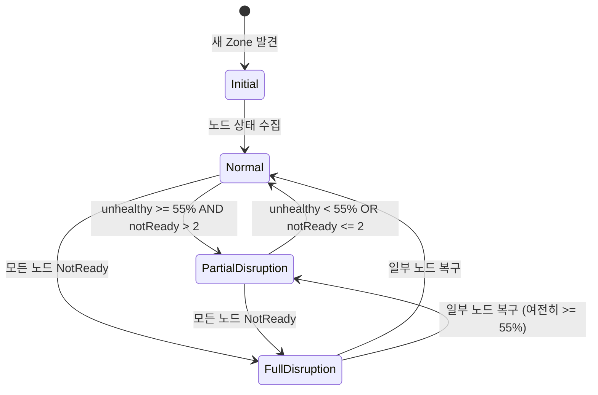
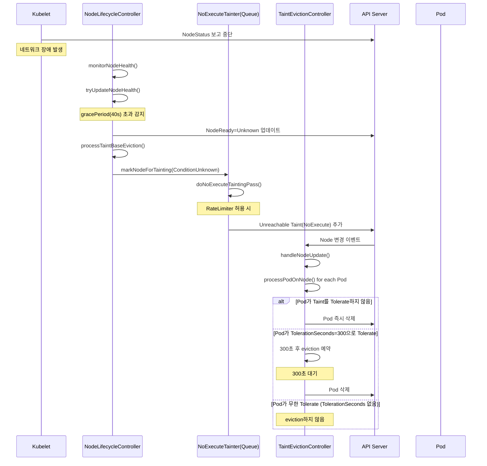

# 27. Node Lifecycle Controller 및 Taint/Toleration 심화

## 목차

1. [개요](#1-개요)
2. [Node Lifecycle Controller 구조체](#2-node-lifecycle-controller-구조체)
3. [노드 상태 모니터링 (tryUpdateNodeHealth)](#3-노드-상태-모니터링-tryupdatenodehealth)
4. [Zone-Aware Eviction Rate Control](#4-zone-aware-eviction-rate-control)
5. [Taint/Toleration 메커니즘](#5-tainttoleration-메커니즘)
6. [Taint-Based Eviction 흐름](#6-taint-based-eviction-흐름)
7. [NoSchedule vs NoExecute 비교](#7-noschedule-vs-noexecute-비교)
8. [스케줄러 TaintToleration 플러그인](#8-스케줄러-tainttoleration-플러그인)
9. [Well-Known Taints](#9-well-known-taints)
10. [왜 이런 설계인가](#10-왜-이런-설계인가)
11. [정리](#11-정리)

---

## 1. 개요

### Node Lifecycle Controller란?

Node Lifecycle Controller는 Kubernetes Control Plane에서 **노드의 건강 상태를 지속적으로 모니터링**하고,
비정상 노드에 Taint를 부여하여 Pod 스케줄링을 차단하거나 기존 Pod를 퇴거(eviction)시키는 핵심 컨트롤러다.

```
소스 위치: pkg/controller/nodelifecycle/node_lifecycle_controller.go
```

### 전체 시스템 아키텍처

```
+-------------------------------------------------------------------+
|                    Control Plane                                   |
|                                                                    |
|  +-----------------------+     +-----------------------------+     |
|  | Node Lifecycle        |     | Taint Eviction              |     |
|  | Controller            |     | Controller                  |     |
|  |                       |     |                             |     |
|  | monitorNodeHealth()   |     | processPodOnNode()          |     |
|  |   |                   |     |   |                         |     |
|  |   +-> tryUpdateNode   |     |   +-> getMinTolerationTime  |     |
|  |   |   Health()        |     |   |                         |     |
|  |   |                   |     |   +-> taintEvictionQueue    |     |
|  |   +-> processTaint    |     |       .AddWork()            |     |
|  |   |   BaseEviction()  |     |                             |     |
|  |   |                   |     +-----------------------------+     |
|  |   +-> handleDisrupt   |                                         |
|  |       ion()           |     +-----------------------------+     |
|  |                       |     | Scheduler                   |     |
|  | doNoExecuteTainting   |     | TaintToleration Plugin      |     |
|  |   Pass()              |     |                             |     |
|  | doNoScheduleTainting  |     |  Filter(): NoSchedule 체크  |     |
|  |   Pass()              |     |  Score(): PreferNoSchedule  |     |
|  +-----------------------+     +-----------------------------+     |
|                                                                    |
+-------------------------------------------------------------------+
        |                                           |
        | NodeStatus 수신                           | 스케줄링 결정
        v                                           v
+----------------+                          +----------------+
|   Kubelet      |                          |   Pod          |
| (노드 에이전트) |                          | (워크로드)     |
+----------------+                          +----------------+
```

### 핵심 역할 요약

| 역할 | 설명 | 소스 위치 |
|------|------|-----------|
| 노드 건강 모니터링 | kubelet의 NodeStatus/NodeLease를 주기적 확인 | `monitorNodeHealth()` (line 653) |
| NoSchedule Taint 관리 | 노드 조건에 따라 NoSchedule Taint 자동 부여/제거 | `doNoScheduleTaintingPass()` (line 523) |
| NoExecute Taint 관리 | NotReady/Unreachable 노드에 NoExecute Taint 부여 | `doNoExecuteTaintingPass()` (line 578) |
| Zone 장애 감지 | 가용영역 단위 대규모 장애 감지 및 eviction 속도 제어 | `handleDisruption()` (line 979) |
| Pod Eviction 조율 | TaintEvictionController와 협력한 Pod 퇴거 | `processTaintBaseEviction()` (line 764) |

**왜 이 컨트롤러가 필요한가?**

분산 시스템에서 노드 장애는 일상적 사건이다. 하드웨어 고장, 네트워크 단절, kubelet 크래시 등
다양한 원인으로 노드가 비정상 상태에 빠질 수 있다. 이때 수동 개입 없이 자동으로 워크로드를
안전한 노드로 이동시키는 메커니즘이 필수적이다. 동시에, 데이터센터 전체 장애(전원 이상 등)시
모든 Pod를 한꺼번에 퇴거시키면 오히려 가용성이 악화되므로, **Zone 단위 지능형 속도 제어**가
함께 필요하다.

---

## 2. Node Lifecycle Controller 구조체

```
소스: pkg/controller/nodelifecycle/node_lifecycle_controller.go (line 218-303)
```

### Controller 구조체 전체 분석

```go
// Controller is the controller that manages node's life cycle.
type Controller struct {
    taintManager *tainteviction.Controller   // NoExecute Taint 기반 Pod 퇴거 담당

    podLister         corelisters.PodLister
    podInformerSynced cache.InformerSynced
    kubeClient        clientset.Interface

    // 시간 스큐(clock skew) 방지를 위해 로컬 시간 함수 사용
    now func() metav1.Time

    // Zone 장애 시 eviction 속도 조절 함수
    enterPartialDisruptionFunc func(nodeNum int) float32
    enterFullDisruptionFunc    func(nodeNum int) float32
    computeZoneStateFunc       func(nodeConditions []*v1.NodeCondition) (int, ZoneState)

    knownNodeSet  map[string]*v1.Node     // 알려진 노드 집합
    nodeHealthMap *nodeHealthMap          // 노드별 건강 데이터 캐시

    // Zone별 NoExecute Taint 큐 (rate limited)
    evictorLock          sync.Mutex
    zoneNoExecuteTainter map[string]*scheduler.RateLimitedTimedQueue

    nodesToRetry sync.Map                 // 재시도 대상 노드
    zoneStates   map[string]ZoneState     // Zone별 장애 상태

    // Grace Period 설정
    nodeMonitorPeriod      time.Duration  // 노드 상태 체크 주기 (기본 5s)
    nodeStartupGracePeriod time.Duration  // 노드 시작 유예 기간 (기본 60s)
    nodeMonitorGracePeriod time.Duration  // 노드 모니터링 유예 기간 (기본 40s)

    // Rate Limiting 설정
    evictionLimiterQPS          float32   // 정상 상태 eviction QPS (기본 0.1)
    secondaryEvictionLimiterQPS float32   // 부분 장애 시 eviction QPS (기본 0.01)
    largeClusterThreshold       int32     // 큰 클러스터 기준 (기본 50)
    unhealthyZoneThreshold      float32   // Zone 장애 임계값 (기본 0.55)

    // 작업 큐
    nodeUpdateQueue workqueue.TypedInterface[string]
    podUpdateQueue  workqueue.TypedRateLimitingInterface[podUpdateItem]
}
```

### nodeHealthData - 노드 건강 데이터

```
소스: pkg/controller/nodelifecycle/node_lifecycle_controller.go (line 168-173)
```

```go
type nodeHealthData struct {
    probeTimestamp           metav1.Time      // 마지막 건강 상태 확인 시각
    readyTransitionTimestamp metav1.Time      // Ready 상태 마지막 전환 시각
    status                  *v1.NodeStatus   // 마지막으로 관찰한 노드 상태
    lease                   *coordv1.Lease   // 마지막으로 관찰한 NodeLease
}
```

**왜 probeTimestamp를 별도로 관리하는가?**

클러스터 내 노드 간 시간 동기화(NTP)가 완벽하지 않을 수 있다. kubelet이 보고하는
`LastHeartbeatTime`은 해당 노드의 로컬 시간이므로, 컨트롤러가 직접 관찰한 시각
(`probeTimestamp`)을 별도로 기록하여 **시간 스큐(clock skew) 문제를 회피**한다.

### ZoneState 타입 정의

```
소스: pkg/controller/nodelifecycle/node_lifecycle_controller.go (line 116-124)
```

```go
type ZoneState string

const (
    stateInitial           = ZoneState("Initial")
    stateNormal            = ZoneState("Normal")
    stateFullDisruption    = ZoneState("FullDisruption")
    statePartialDisruption = ZoneState("PartialDisruption")
)
```

### 노드 조건-Taint 매핑 테이블

```
소스: pkg/controller/nodelifecycle/node_lifecycle_controller.go (line 87-104)
```

```go
var nodeConditionToTaintKeyStatusMap = map[v1.NodeConditionType]map[v1.ConditionStatus]string{
    v1.NodeReady: {
        v1.ConditionFalse:   v1.TaintNodeNotReady,      // NotReady
        v1.ConditionUnknown: v1.TaintNodeUnreachable,    // Unreachable
    },
    v1.NodeMemoryPressure: {
        v1.ConditionTrue: v1.TaintNodeMemoryPressure,
    },
    v1.NodeDiskPressure: {
        v1.ConditionTrue: v1.TaintNodeDiskPressure,
    },
    v1.NodeNetworkUnavailable: {
        v1.ConditionTrue: v1.TaintNodeNetworkUnavailable,
    },
    v1.NodePIDPressure: {
        v1.ConditionTrue: v1.TaintNodePIDPressure,
    },
}
```

이 매핑은 doNoScheduleTaintingPass()에서 사용되어, 노드의 Condition 변화를
자동으로 NoSchedule Taint에 반영한다.

```
NodeCondition          ConditionStatus    생성되는 Taint Key
-----------------      ---------------    ----------------------------------
NodeReady              False              node.kubernetes.io/not-ready
NodeReady              Unknown            node.kubernetes.io/unreachable
NodeMemoryPressure     True               node.kubernetes.io/memory-pressure
NodeDiskPressure       True               node.kubernetes.io/disk-pressure
NodeNetworkUnavailable True               node.kubernetes.io/network-unavailable
NodePIDPressure        True               node.kubernetes.io/pid-pressure
```

### Controller 초기화 흐름

```
소스: pkg/controller/nodelifecycle/node_lifecycle_controller.go (line 306-427)
```

```
NewNodeLifecycleController()
    |
    +-> Controller 구조체 생성
    |     - evictionLimiterQPS, unhealthyZoneThreshold 등 설정
    |     - nodeHealthMap 초기화
    |     - zoneNoExecuteTainter 빈 맵 초기화
    |
    +-> enterPartialDisruptionFunc = nc.ReducedQPSFunc 설정
    +-> enterFullDisruptionFunc    = nc.HealthyQPSFunc 설정
    +-> computeZoneStateFunc       = nc.ComputeZoneState 설정
    |
    +-> Pod Informer 이벤트 핸들러 등록
    |     - Add/Update -> podUpdated()
    |
    +-> TaintEvictionController 초기화 (SeparateTaintEvictionController 비활성 시)
    |     - tainteviction.New() 호출
    |
    +-> Node Informer 이벤트 핸들러 등록
    |     - Add/Update -> nodeUpdateQueue.Add()
    |     - Delete -> nodesToRetry.Delete()
    |
    +-> Lease/DaemonSet Informer 설정
```

---

## 3. 노드 상태 모니터링 (tryUpdateNodeHealth)

```
소스: pkg/controller/nodelifecycle/node_lifecycle_controller.go (line 813-978)
```

### tryUpdateNodeHealth 전체 흐름

이 함수는 개별 노드의 건강 상태를 판단하는 핵심 로직이다.

```
tryUpdateNodeHealth(node)
    |
    +-> nodeHealthMap에서 기존 건강 데이터 조회 (getDeepCopy)
    |
    +-> currentReadyCondition 확인
    |   |
    |   +-> nil인 경우: kubelet이 아직 상태를 보고하지 않음
    |   |   - 가짜 Ready Condition 생성 (ConditionUnknown)
    |   |   - gracePeriod = nodeStartupGracePeriod (60s)
    |   |
    |   +-> 존재하는 경우:
    |       - gracePeriod = nodeMonitorGracePeriod (40s)
    |
    +-> 저장된 상태(savedCondition)와 현재 상태 비교
    |   |
    |   +-> 케이스 1: 둘 다 nil -> 그대로 유지
    |   +-> 케이스 2: saved nil, current 존재 -> Controller 재시작 (타임스탬프 초기화)
    |   +-> 케이스 3: saved 존재, current nil -> 에러 (타임스탬프 초기화)
    |   +-> 케이스 4: LastHeartbeatTime 변경됨
    |   |   - LastTransitionTime도 변경? -> readyTransitionTimestamp 갱신
    |   |   - probeTimestamp = now()
    |   |
    |   +-> 케이스 5: 변경 없음 -> 아무것도 안 함
    |
    +-> NodeLease 갱신 확인
    |   - observedLease의 RenewTime > savedLease의 RenewTime?
    |   - 그렇다면 probeTimestamp = now() (kubelet이 아직 살아있음)
    |
    +-> Grace Period 초과 여부 판단
        |
        +-> now > probeTimestamp + gracePeriod ?
            |
            +-> YES: 노드 응답 없음
            |   - NodeReady, MemoryPressure, DiskPressure, PIDPressure
            |     조건을 ConditionUnknown으로 변경
            |   - Reason: "NodeStatusUnknown"
            |   - Message: "Kubelet stopped posting node status."
            |   - API Server에 NodeStatus 업데이트
            |
            +-> NO: 아직 유예 기간 내
                - 변경 없음
```

### 왜 NodeLease와 NodeStatus를 모두 확인하는가?

```
+------------------------------------------------------------------+
|                 Heartbeat 이중화 설계                               |
+------------------------------------------------------------------+
|                                                                    |
|   NodeStatus 업데이트                NodeLease 갱신                 |
|   +-------------------+             +-------------------+          |
|   | 주기: 10s (기본)   |             | 주기: 10s (기본)   |          |
|   | 크기: 수 KB        |             | 크기: 수십 Byte    |          |
|   | etcd 부하: 높음    |             | etcd 부하: 매우 낮음|          |
|   | 정보: 상세 상태    |             | 정보: 갱신 시각만   |          |
|   +-------------------+             +-------------------+          |
|                                                                    |
|   두 시그널 중 하나라도 갱신되면 probeTimestamp를 now()로 갱신      |
|                                                                    |
+------------------------------------------------------------------+
```

NodeLease는 Kubernetes 1.14에서 도입된 경량 heartbeat 메커니즘이다. NodeStatus 업데이트는
전체 노드 상태(CPU/메모리/조건 등)를 포함하여 크기가 크고 etcd 부하가 높다. NodeLease는
갱신 시각만 담고 있어 etcd 부하가 극히 낮다. 두 시그널을 모두 활용함으로써 **정확성과
확장성을 동시에 확보**한다.

### Grace Period 체계

```
+----------------------------------------------------------------------+
|                                                                      |
|  노드 시작 직후:                                                     |
|  |<--- nodeStartupGracePeriod (60s) --->|                            |
|  ^                                       ^                            |
|  노드 등록                               이 시점까지 kubelet이        |
|                                          상태를 보고하지 않으면       |
|                                          ConditionUnknown으로 변경    |
|                                                                      |
|  정상 운영 중:                                                       |
|  |<--- nodeMonitorGracePeriod (40s) --->|                            |
|  ^                                       ^                            |
|  마지막 heartbeat                        이 시점까지 갱신이 없으면   |
|  (NodeStatus 또는 Lease)                ConditionUnknown으로 변경    |
|                                                                      |
+----------------------------------------------------------------------+
```

**왜 40초인가?**

kubelet의 기본 heartbeat 주기는 10초이다. 네트워크 지연, API Server 부하 등을 고려하면
한두 번의 heartbeat 누락은 정상 범위다. 40초는 약 4번의 heartbeat 기회를 허용하므로,
**일시적 네트워크 지터에 의한 오탐(false positive)을 방지**하면서도 실제 장애를
합리적 시간 내에 감지할 수 있다.

---

## 4. Zone-Aware Eviction Rate Control

### Zone 상태 계산

```
소스: pkg/controller/nodelifecycle/node_lifecycle_controller.go (line 1264-1282)
```

```go
func (nc *Controller) ComputeZoneState(nodeReadyConditions []*v1.NodeCondition) (int, ZoneState) {
    readyNodes := 0
    notReadyNodes := 0
    for i := range nodeReadyConditions {
        if nodeReadyConditions[i] != nil && nodeReadyConditions[i].Status == v1.ConditionTrue {
            readyNodes++
        } else {
            notReadyNodes++
        }
    }
    switch {
    case readyNodes == 0 && notReadyNodes > 0:
        return notReadyNodes, stateFullDisruption
    case notReadyNodes > 2 && float32(notReadyNodes)/float32(notReadyNodes+readyNodes) >= nc.unhealthyZoneThreshold:
        return notReadyNodes, statePartialDisruption
    default:
        return notReadyNodes, stateNormal
    }
}
```

### Zone 상태 전이 다이어그램



### Zone 상태별 Eviction Rate 제어

| Zone 상태 | 조건 | Eviction Rate | 이유 |
|-----------|------|---------------|------|
| Normal | unhealthy < 55% 또는 notReady <= 2 | evictionLimiterQPS (0.1 QPS) | 정상 속도로 eviction |
| PartialDisruption (대규모 클러스터) | unhealthy >= 55%, 노드 > 50 | secondaryEvictionLimiterQPS (0.01) | 대규모 장애 시 속도 감소 |
| PartialDisruption (소규모 클러스터) | unhealthy >= 55%, 노드 <= 50 | 0 (중단) | 소규모에선 eviction 완전 중단 |
| FullDisruption (단일 Zone) | 모든 노드 NotReady (다른 Zone 정상) | evictionLimiterQPS (0.1) | 해당 Zone만 정상 속도 eviction |
| FullDisruption (전체) | 모든 Zone이 FullDisruption | 0 (전체 중단) | 마스터 장애로 판단, eviction 중단 |

### ReducedQPSFunc - 부분 장애 시 속도 결정

```
소스: pkg/controller/nodelifecycle/node_lifecycle_controller.go (line 1197-1204)
```

```go
func (nc *Controller) ReducedQPSFunc(nodeNum int) float32 {
    if int32(nodeNum) > nc.largeClusterThreshold {
        return nc.secondaryEvictionLimiterQPS   // 대규모: 0.01 QPS
    }
    return 0                                     // 소규모: 완전 중단
}
```

### handleDisruption 흐름

```
소스: pkg/controller/nodelifecycle/node_lifecycle_controller.go (line 979-1068)
```

```
handleDisruption(zoneToNodeConditions, nodes)
    |
    +-> 각 Zone의 새 상태 계산 (computeZoneStateFunc)
    |
    +-> allAreFullyDisrupted 확인 (모든 Zone이 FullDisruption?)
    |
    +-> 분기 처리:
        |
        +-> 모든 Zone FullDisruption (새로 진입)
        |   - "Controller detected that all Nodes are not-Ready"
        |   - 모든 노드에서 Taint 제거 (markNodeAsReachable)
        |   - 모든 Zone의 limiter를 0으로 설정 (eviction 완전 중단)
        |   - 이유: 마스터/네트워크 장애로 판단
        |
        +-> 모든 Zone FullDisruption에서 복구
        |   - "Controller detected that some Nodes are Ready"
        |   - 모든 노드의 probeTimestamp 리셋
        |   - 각 Zone의 limiter를 새 상태에 맞게 재설정
        |
        +-> 일반 Zone 상태 전환
            - 각 Zone별로 상태 변경 감지
            - setLimiterInZone()으로 Rate Limiter 갱신
```

**왜 전체 Zone이 다운되면 eviction을 중단하는가?**

```
+------------------------------------------------------------------+
| 시나리오: 마스터 네트워크 장애                                     |
|                                                                    |
|  Control Plane                    Data Plane                       |
|  +----------------+              +------------------+              |
|  | API Server     |   X 단절 X   | Node-1 (정상)    |              |
|  | Node Controller|<----/--/---->| Node-2 (정상)    |              |
|  |                |              | Node-3 (정상)    |              |
|  +----------------+              +------------------+              |
|                                                                    |
|  Controller 관점: 모든 노드가 Unreachable                          |
|  실제 상태: 모든 노드 정상, 문제는 네트워크                         |
|                                                                    |
|  만약 eviction을 계속하면?                                         |
|  -> 모든 Pod가 삭제 스케줄링됨                                     |
|  -> 네트워크 복구 후 대규모 재스케줄링 폭풍                          |
|  -> 서비스 전면 중단                                                |
|                                                                    |
|  따라서: 전체 Zone FullDisruption = eviction 중단                  |
+------------------------------------------------------------------+
```

이 설계는 **"모든 것이 동시에 장애인 것처럼 보이면, 실제로는 관찰자(Controller)에게
문제가 있을 가능성이 높다"**는 원칙에 기반한다.

### RateLimitedTimedQueue 구조

```
소스: pkg/controller/nodelifecycle/scheduler/rate_limited_queue.go (line 198-214)
```

```go
type RateLimitedTimedQueue struct {
    queue       UniqueQueue              // 중복 방지 우선순위 큐
    limiterLock sync.Mutex
    limiter     flowcontrol.RateLimiter  // Token Bucket Rate Limiter
}
```

이 큐는 두 가지 제어 메커니즘을 결합한다:

```
+------------------------------------------------------------------+
|              RateLimitedTimedQueue 동작 원리                       |
+------------------------------------------------------------------+
|                                                                    |
|  1. 시간 기반 제어 (TimedQueue)                                    |
|     - ProcessAt 시각 이전에는 처리하지 않음                         |
|     - 힙(heap) 자료구조로 최소 시각 항목을 O(1)에 조회              |
|                                                                    |
|  2. 속도 기반 제어 (RateLimiter)                                   |
|     - Token Bucket 알고리즘                                        |
|     - QPS에 따라 토큰 발급 속도 제한                                |
|     - 토큰이 없으면 처리 중단                                       |
|                                                                    |
|  3. 중복 방지 (UniqueQueue)                                        |
|     - 동일 노드가 두 번 큐에 들어가지 않도록 Set으로 관리           |
|     - Remove()로 명시적 제거 전까지 재추가 불가                     |
|                                                                    |
+------------------------------------------------------------------+
```

### Try() 메서드 - 큐 처리 루프

```
소스: pkg/controller/nodelifecycle/scheduler/rate_limited_queue.go (line 231-256)
```

```go
func (q *RateLimitedTimedQueue) Try(logger klog.Logger, fn ActionFunc) {
    val, ok := q.queue.Head()
    q.limiterLock.Lock()
    defer q.limiterLock.Unlock()
    for ok {
        // Rate Limiter가 토큰을 승인하지 않으면 중단
        if !q.limiter.TryAccept() {
            break
        }
        now := now()
        // 아직 처리 시간이 안 되었으면 중단
        if now.Before(val.ProcessAt) {
            break
        }
        // 액션 실행
        if ok, wait := fn(val); !ok {
            // 실패: wait 후 재시도
            val.ProcessAt = now.Add(wait + 1)
            q.queue.Replace(val)
        } else {
            // 성공: 큐에서 제거 (Set에는 유지 -> 재추가 방지)
            q.queue.RemoveFromQueue(val.Value)
        }
        val, ok = q.queue.Head()
    }
}
```

---

## 5. Taint/Toleration 메커니즘

### Taint 구조체

```
소스: staging/src/k8s.io/api/core/v1/types.go (line 4031-4044)
```

```go
type Taint struct {
    Key       string      // Taint 키 (예: "node.kubernetes.io/not-ready")
    Value     string      // Taint 값 (선택사항)
    Effect    TaintEffect // NoSchedule, PreferNoSchedule, NoExecute
    TimeAdded *metav1.Time // Taint 추가 시각
}
```

### Toleration 구조체

```
소스: staging/src/k8s.io/api/core/v1/types.go (line 4072-4098)
```

```go
type Toleration struct {
    Key               string             // 매칭할 Taint 키
    Operator          TolerationOperator  // Equal, Exists, Lt, Gt
    Value             string             // 매칭할 Taint 값
    Effect            TaintEffect        // 매칭할 Effect (빈 값 = 모든 Effect)
    TolerationSeconds *int64             // NoExecute 전용: 견딜 수 있는 시간(초)
}
```

### TaintEffect 종류

```
소스: staging/src/k8s.io/api/core/v1/types.go (line 4047-4068)
```

| Effect | 스케줄링 시 | 런타임 시 | 설명 |
|--------|-----------|----------|------|
| `NoSchedule` | 차단 (강제) | 영향 없음 | 새 Pod만 차단, 기존 Pod 유지 |
| `PreferNoSchedule` | 회피 (소프트) | 영향 없음 | 가능하면 다른 노드 선호 |
| `NoExecute` | 차단 (강제) | 퇴거 (강제) | 기존 Pod도 퇴거 대상 |

### TolerationOperator

```
소스: staging/src/k8s.io/api/core/v1/types.go (line 4102-4109)
```

| Operator | 매칭 조건 | 사용 예시 |
|----------|----------|----------|
| `Equal` (기본값) | Key, Value, Effect 모두 일치 | `key="gpu", value="nvidia"` |
| `Exists` | Key만 존재하면 매칭 | `key="gpu"` -> 모든 gpu Taint 허용 |
| `Lt` | Taint 값 < Toleration 값 (숫자) | 리소스 임계값 비교 |
| `Gt` | Taint 값 > Toleration 값 (숫자) | 리소스 임계값 비교 |

### Toleration 매칭 알고리즘

```
Taint:       key="node.kubernetes.io/not-ready", effect=NoExecute
Toleration:  key="node.kubernetes.io/not-ready", operator=Exists,
             effect=NoExecute, tolerationSeconds=300

매칭 조건:
  1. Effect 비교
     - Toleration.Effect가 비어있으면 -> 모든 Effect 매칭
     - 그렇지 않으면 -> Taint.Effect == Toleration.Effect 여야 함

  2. Key 비교
     - Toleration.Key가 비어있고 Operator가 Exists -> 모든 Key 매칭
     - 그렇지 않으면 -> Taint.Key == Toleration.Key 여야 함

  3. Value 비교 (Operator에 따라)
     - Exists: Value 무시 (Key만 존재하면 OK)
     - Equal: Taint.Value == Toleration.Value
     - Lt: Taint.Value(숫자) < Toleration.Value(숫자)
     - Gt: Taint.Value(숫자) > Toleration.Value(숫자)
```

### 매칭 흐름도

```
Pod의 모든 Toleration vs Node의 모든 Taint

for each Taint in Node.Spec.Taints:
    matched = false
    for each Toleration in Pod.Spec.Tolerations:
        if matchTaint(Toleration, Taint):
            matched = true
            break
    if not matched:
        -> 이 Taint에 대한 Toleration이 없음
        -> Effect에 따라 처리:
           NoSchedule     -> 스케줄링 거부
           PreferNoSchedule -> 점수 감점
           NoExecute      -> Pod 퇴거 예약
```

---

## 6. Taint-Based Eviction 흐름

### TaintEviction Controller 구조체

```
소스: pkg/controller/tainteviction/taint_eviction.go (line 83-105)
```

```go
type Controller struct {
    name   string
    client clientset.Interface

    broadcaster record.EventBroadcaster
    recorder    record.EventRecorder

    podLister             corelisters.PodLister
    podListerSynced       cache.InformerSynced
    nodeLister            corelisters.NodeLister
    nodeListerSynced      cache.InformerSynced
    getPodsAssignedToNode GetPodsByNodeNameFunc

    taintEvictionQueue *TimedWorkerQueue
    // 노드별 NoExecute Taint 목록 캐시
    taintedNodesLock sync.Mutex
    taintedNodes     map[string][]v1.Taint

    nodeUpdateChannels []chan nodeUpdateItem
    podUpdateChannels  []chan podUpdateItem

    nodeUpdateQueue workqueue.TypedInterface[nodeUpdateItem]
    podUpdateQueue  workqueue.TypedInterface[podUpdateItem]
}
```

### processTaintBaseEviction - Node Lifecycle Controller 측

```
소스: pkg/controller/nodelifecycle/node_lifecycle_controller.go (line 764-798)
```

```go
func (nc *Controller) processTaintBaseEviction(ctx context.Context, node *v1.Node,
    currentReadyCondition *v1.NodeCondition) {
    switch currentReadyCondition.Status {
    case v1.ConditionFalse:
        // 이미 UnreachableTaint가 있으면 -> NotReadyTaint로 교체
        if taintutils.TaintExists(node.Spec.Taints, UnreachableTaintTemplate) {
            SwapNodeControllerTaint(... NotReadyTaint, UnreachableTaint ...)
        } else if nc.markNodeForTainting(node, v1.ConditionFalse) {
            // Taint 큐에 추가
        }
    case v1.ConditionUnknown:
        // 이미 NotReadyTaint가 있으면 -> UnreachableTaint로 교체
        if taintutils.TaintExists(node.Spec.Taints, NotReadyTaintTemplate) {
            SwapNodeControllerTaint(... UnreachableTaint, NotReadyTaint ...)
        } else if nc.markNodeForTainting(node, v1.ConditionUnknown) {
            // Taint 큐에 추가
        }
    case v1.ConditionTrue:
        // 정상 복구: 모든 Taint 제거
        nc.markNodeAsReachable(ctx, node)
    }
}
```

**왜 NotReady와 Unreachable Taint를 상호 배타적으로 관리하는가?**

```
+--------------------------------------------------------------------+
| NotReady vs Unreachable 구분                                        |
+--------------------------------------------------------------------+
|                                                                      |
|  NotReady (ConditionFalse):                                          |
|  - kubelet이 "나는 Ready 아니다"라고 적극적으로 보고                   |
|  - kubelet 자체는 응답 중 (API 호출 가능)                             |
|  - 원인: 컨테이너 런타임 오류, 디스크 가득 참 등                      |
|                                                                      |
|  Unreachable (ConditionUnknown):                                     |
|  - kubelet이 아무 응답도 없음                                        |
|  - Controller가 grace period 초과로 판단                              |
|  - 원인: 노드 다운, 네트워크 단절, kubelet 크래시                     |
|                                                                      |
|  두 상태의 운영 의미가 다르므로 Taint도 구분:                         |
|  - NotReady: Pod 데이터가 노드에 아직 존재할 가능성 높음               |
|  - Unreachable: Pod 데이터 접근 불가, Detach 등 추가 조치 필요         |
+--------------------------------------------------------------------+
```

### processPodOnNode - Taint Eviction Controller 측

```
소스: pkg/controller/tainteviction/taint_eviction.go (line 451-490)
```

```go
func (tc *Controller) processPodOnNode(ctx context.Context,
    podNamespacedName types.NamespacedName,
    nodeName string,
    tolerations []v1.Toleration,
    taints []v1.Taint,
    now time.Time) {

    // 1. Taint가 없으면 -> 예약된 eviction 취소
    if len(taints) == 0 {
        tc.cancelWorkWithEvent(logger, podNamespacedName)
    }

    // 2. 모든 Taint가 Tolerate 되는지 확인
    allTolerated, usedTolerations := v1helper.GetMatchingTolerations(...)

    if !allTolerated {
        // 3a. Tolerate 안 되는 Taint 존재 -> 즉시 eviction 예약
        tc.cancelWorkWithEvent(logger, podNamespacedName)
        tc.taintEvictionQueue.AddWork(ctx, args, now, now)  // 즉시 실행
        return
    }

    // 3b. 모든 Taint가 Tolerate 됨
    minTolerationTime := getMinTolerationTime(usedTolerations)

    if minTolerationTime < 0 {
        // 무한 허용 -> eviction 취소
        tc.cancelWorkWithEvent(logger, podNamespacedName)
        return
    }

    // TolerationSeconds 후에 eviction 예약
    triggerTime := startTime.Add(minTolerationTime)
    tc.taintEvictionQueue.AddWork(ctx, args, startTime, triggerTime)
}
```

### getMinTolerationTime - 최소 허용 시간 계산

```
소스: pkg/controller/tainteviction/taint_eviction.go (line 160-182)
```

```go
func getMinTolerationTime(tolerations []v1.Toleration) time.Duration {
    minTolerationTime := int64(math.MaxInt64)
    if len(tolerations) == 0 {
        return 0    // Toleration이 없으면 즉시 eviction
    }
    for i := range tolerations {
        if tolerations[i].TolerationSeconds != nil {
            tolerationSeconds := *(tolerations[i].TolerationSeconds)
            if tolerationSeconds <= 0 {
                return 0    // 0 이하는 즉시 eviction
            } else if tolerationSeconds < minTolerationTime {
                minTolerationTime = tolerationSeconds
            }
        }
    }
    if minTolerationTime == int64(math.MaxInt64) {
        return -1   // 모두 무한 허용 (TolerationSeconds 미설정)
    }
    return time.Duration(minTolerationTime) * time.Second
}
```

### Taint-Based Eviction 전체 시퀀스 다이어그램



### Worker 우선순위 패턴

```
소스: pkg/controller/tainteviction/taint_eviction.go (line 357-386)
```

TaintEvictionController의 worker는 Node 업데이트를 Pod 업데이트보다 우선 처리한다:

```go
func (tc *Controller) worker(ctx context.Context, worker int) {
    for {
        select {
        case nodeUpdate := <-tc.nodeUpdateChannels[worker]:
            tc.handleNodeUpdate(ctx, nodeUpdate)
        case podUpdate := <-tc.podUpdateChannels[worker]:
            // Pod 처리 전 Node 큐를 먼저 비움
        priority:
            for {
                select {
                case nodeUpdate := <-tc.nodeUpdateChannels[worker]:
                    tc.handleNodeUpdate(ctx, nodeUpdate)
                default:
                    break priority
                }
            }
            tc.handlePodUpdate(ctx, podUpdate)
        }
    }
}
```

**왜 Node 업데이트에 우선순위를 주는가?**

Node Taint 변경은 해당 노드의 모든 Pod에 영향을 미친다. Node 업데이트를 먼저 처리해야
`taintedNodes` 맵이 최신 상태로 유지되고, 이후 Pod 업데이트에서 정확한 eviction 결정이
가능하다. Node 처리가 지연되면 이미 Taint가 제거된 노드에서 불필요한 Pod 삭제가 발생할
수 있다.

---

## 7. NoSchedule vs NoExecute 비교

### doNoScheduleTaintingPass

```
소스: pkg/controller/nodelifecycle/node_lifecycle_controller.go (line 523-576)
```

```go
func (nc *Controller) doNoScheduleTaintingPass(ctx context.Context, nodeName string) error {
    node, err := nc.nodeLister.Get(nodeName)
    // ...

    // 1. 노드 Condition을 NoSchedule Taint로 변환
    var taints []v1.Taint
    for _, condition := range node.Status.Conditions {
        if taintMap, found := nodeConditionToTaintKeyStatusMap[condition.Type]; found {
            if taintKey, found := taintMap[condition.Status]; found {
                taints = append(taints, v1.Taint{
                    Key:    taintKey,
                    Effect: v1.TaintEffectNoSchedule,
                })
            }
        }
    }
    // Unschedulable 필드도 Taint로 변환
    if node.Spec.Unschedulable {
        taints = append(taints, v1.Taint{
            Key:    v1.TaintNodeUnschedulable,
            Effect: v1.TaintEffectNoSchedule,
        })
    }

    // 2. 기존 NoSchedule Taint와 비교하여 차이 계산
    nodeTaints := taintutils.TaintSetFilter(node.Spec.Taints, filterFunc)
    taintsToAdd, taintsToDel := taintutils.TaintSetDiff(taints, nodeTaints)

    // 3. 변경 사항이 있으면 Swap
    if len(taintsToAdd) > 0 || len(taintsToDel) > 0 {
        controllerutil.SwapNodeControllerTaint(ctx, nc.kubeClient, taintsToAdd, taintsToDel, node)
    }
}
```

### doNoExecuteTaintingPass

```
소스: pkg/controller/nodelifecycle/node_lifecycle_controller.go (line 578-645)
```

```go
func (nc *Controller) doNoExecuteTaintingPass(ctx context.Context) {
    // 각 Zone의 NoExecute Taint 큐를 순회
    for _, k := range zoneNoExecuteTainterKeys {
        zoneNoExecuteTainterWorker := nc.zoneNoExecuteTainter[k]

        zoneNoExecuteTainterWorker.Try(logger, func(value scheduler.TimedValue) (bool, time.Duration) {
            node, err := nc.nodeLister.Get(value.Value)
            // ...
            _, condition := controllerutil.GetNodeCondition(&node.Status, v1.NodeReady)

            // NotReady와 Unreachable Taint를 상호 배타적으로 적용
            switch condition.Status {
            case v1.ConditionFalse:
                taintToAdd = *NotReadyTaintTemplate     // NoExecute
                oppositeTaint = *UnreachableTaintTemplate
            case v1.ConditionUnknown:
                taintToAdd = *UnreachableTaintTemplate   // NoExecute
                oppositeTaint = *NotReadyTaintTemplate
            default:
                // 노드가 다시 Ready -> 무시
                return true, 0
            }
            // Swap: 새 Taint 추가 + 반대 Taint 제거
            result := controllerutil.SwapNodeControllerTaint(ctx, ...)
            return result, 0
        })
    }
}
```

### NoSchedule vs NoExecute 처리 비교

```
+----------------------------------------------------------------------+
|          NoSchedule Taint                NoExecute Taint              |
+----------------------------------------------------------------------+
|                                                                      |
|  처리 방식:                             처리 방식:                    |
|  - 동기식 (nodeUpdateQueue에서)         - 비동기식 (Rate Limited Queue)|
|  - 즉시 적용                           - Zone Rate Limiter에 의해 제어|
|  - 100ms 주기 이벤트 루프 없음          - 100ms 주기 처리             |
|                                                                      |
|  대상 Condition:                        대상 Condition:               |
|  - NotReady                            - NotReady                     |
|  - Unreachable                         - Unreachable                  |
|  - MemoryPressure                      (두 가지만)                    |
|  - DiskPressure                                                      |
|  - NetworkUnavailable                                                |
|  - PIDPressure                                                       |
|  - Unschedulable (spec 필드)                                         |
|                                                                      |
|  영향:                                  영향:                         |
|  - 새 Pod 스케줄링만 차단              - 기존 Pod도 퇴거 대상         |
|  - 기존 Pod에 영향 없음                - TolerationSeconds 지원       |
|                                                                      |
+----------------------------------------------------------------------+
```

**왜 NoSchedule은 즉시, NoExecute는 Rate Limited인가?**

NoSchedule은 새 Pod의 배치만 차단하므로 즉시 적용해도 기존 서비스에 영향이 없다.
반면 NoExecute는 실행 중인 Pod를 퇴거시키므로, 대규모 장애 시 한꺼번에 적용하면
전체 클러스터의 가용성이 위협받는다. Rate Limiting으로 eviction 속도를 제어하여
**점진적이고 안전한 워크로드 이동**을 보장한다.

---

## 8. 스케줄러 TaintToleration 플러그인

```
소스: pkg/scheduler/framework/plugins/tainttoleration/taint_toleration.go
```

### 플러그인 구조체

```go
type TaintToleration struct {
    handle                                   fwk.Handle
    enableSchedulingQueueHint                bool
    enableTaintTolerationComparisonOperators bool
}

// 구현하는 인터페이스들
var _ fwk.FilterPlugin = &TaintToleration{}
var _ fwk.PreScorePlugin = &TaintToleration{}
var _ fwk.ScorePlugin = &TaintToleration{}
var _ fwk.EnqueueExtensions = &TaintToleration{}
```

### Filter() - NoSchedule 차단

```
소스: pkg/scheduler/framework/plugins/tainttoleration/taint_toleration.go (line 119-132)
```

```go
func (pl *TaintToleration) Filter(ctx context.Context, state fwk.CycleState,
    pod *v1.Pod, nodeInfo fwk.NodeInfo) *fwk.Status {

    node := nodeInfo.Node()

    // Node의 NoSchedule Taint 중 Pod가 Tolerate하지 못하는 것 찾기
    taint, isUntolerated := v1helper.FindMatchingUntoleratedTaint(
        logger,
        node.Spec.Taints,
        pod.Spec.Tolerations,
        helper.DoNotScheduleTaintsFilterFunc(),  // NoSchedule, NoExecute만 필터
        pl.enableTaintTolerationComparisonOperators,
    )

    if !isUntolerated {
        return nil  // 모든 Taint를 Tolerate -> 스케줄링 허용
    }

    return fwk.NewStatus(fwk.UnschedulableAndUnresolvable,
        "node(s) had untolerated taint(s)")
}
```

### Score() - PreferNoSchedule 점수 감점

```
소스: pkg/scheduler/framework/plugins/tainttoleration/taint_toleration.go (line 195-207)
```

```go
func (pl *TaintToleration) Score(ctx context.Context, state fwk.CycleState,
    pod *v1.Pod, nodeInfo fwk.NodeInfo) (int64, *fwk.Status) {

    node := nodeInfo.Node()
    s, err := getPreScoreState(state)

    // PreferNoSchedule Taint 중 Tolerate하지 못하는 개수를 점수로 반환
    score := int64(pl.countIntolerableTaintsPreferNoSchedule(
        logger,
        node.Spec.Taints,
        s.tolerationsPreferNoSchedule,
    ))
    return score, nil
}
```

점수가 높을수록 Tolerate하지 못하는 Taint가 많다는 의미이므로, `NormalizeScore`에서
역전(inverse)되어 **Tolerate하지 못하는 Taint가 많은 노드일수록 점수가 낮아진다**.

### 스케줄러 TaintToleration 플러그인 흐름

```
Pod 스케줄링 요청
    |
    +-> Filter Phase (각 노드에 대해)
    |   |
    |   +-> FindMatchingUntoleratedTaint()
    |   |   - Node.Spec.Taints에서 NoSchedule/NoExecute 필터
    |   |   - Pod.Spec.Tolerations로 매칭 시도
    |   |   - 매칭 안 되는 Taint 발견 시 -> UnschedulableAndUnresolvable
    |   |
    |   +-> 결과: 후보 노드 목록 축소
    |
    +-> PreScore Phase
    |   - Pod의 PreferNoSchedule Toleration 목록 사전 계산
    |   - CycleState에 저장 (반복 계산 방지)
    |
    +-> Score Phase (각 후보 노드에 대해)
    |   |
    |   +-> countIntolerableTaintsPreferNoSchedule()
    |   |   - PreferNoSchedule Taint 중 Tolerate 못하는 개수 계산
    |   |
    |   +-> NormalizeScore()
    |       - 점수 역전: 많이 못 견디는 노드 = 낮은 점수
    |
    +-> 최종 노드 선택
```

### QueueingHint - 재스케줄링 최적화

```
소스: pkg/scheduler/framework/plugins/tainttoleration/taint_toleration.go (line 96-116)
```

```go
func (pl *TaintToleration) isSchedulableAfterNodeChange(logger klog.Logger,
    pod *v1.Pod, oldObj, newObj interface{}) (fwk.QueueingHint, error) {

    // 이전에 Tolerate 못했는가?
    _, wasUntolerated := v1helper.FindMatchingUntoleratedTaint(...)
    // 현재도 Tolerate 못하는가?
    _, isUntolerated := v1helper.FindMatchingUntoleratedTaint(...)

    if wasUntolerated && !isUntolerated {
        // 이전에는 못 견뎠지만 이제 Taint가 제거/변경됨 -> 재스케줄링 시도
        return fwk.Queue, nil
    }
    // 변화 없음 -> 재스케줄링 불필요
    return fwk.QueueSkip, nil
}
```

**왜 QueueingHint가 필요한가?**

노드의 Taint가 변경될 때마다 모든 대기 Pod를 재스케줄링 시도하면 불필요한 API 부하가
발생한다. QueueingHint는 "이 노드 변경이 특정 Pod의 스케줄링 가능성을 변화시키는가?"를
사전 판단하여, **관련 없는 Pod의 불필요한 재시도를 방지**한다.

---

## 9. Well-Known Taints

### 시스템이 자동 관리하는 Taint

```
소스: pkg/controller/nodelifecycle/node_lifecycle_controller.go (line 69-113)
```

| Taint Key | Effect | 설정 주체 | 조건 |
|-----------|--------|-----------|------|
| `node.kubernetes.io/not-ready` | NoSchedule + NoExecute | NodeLifecycleController | NodeReady=False |
| `node.kubernetes.io/unreachable` | NoSchedule + NoExecute | NodeLifecycleController | NodeReady=Unknown |
| `node.kubernetes.io/memory-pressure` | NoSchedule | NodeLifecycleController | MemoryPressure=True |
| `node.kubernetes.io/disk-pressure` | NoSchedule | NodeLifecycleController | DiskPressure=True |
| `node.kubernetes.io/network-unavailable` | NoSchedule | NodeLifecycleController | NetworkUnavailable=True |
| `node.kubernetes.io/pid-pressure` | NoSchedule | NodeLifecycleController | PIDPressure=True |
| `node.kubernetes.io/unschedulable` | NoSchedule | NodeLifecycleController | Spec.Unschedulable=True |

### 기본 Taint 템플릿

```go
// NoExecute Taint 템플릿 (핵심 2개)
var UnreachableTaintTemplate = &v1.Taint{
    Key:    v1.TaintNodeUnreachable,       // "node.kubernetes.io/unreachable"
    Effect: v1.TaintEffectNoExecute,
}

var NotReadyTaintTemplate = &v1.Taint{
    Key:    v1.TaintNodeNotReady,          // "node.kubernetes.io/not-ready"
    Effect: v1.TaintEffectNoExecute,
}
```

### 기본 Toleration (DefaultTolerationSeconds Admission Plugin)

Kubernetes는 모든 Pod에 기본적으로 다음 Toleration을 자동 추가한다:

```yaml
tolerations:
  - key: "node.kubernetes.io/not-ready"
    operator: "Exists"
    effect: "NoExecute"
    tolerationSeconds: 300     # 5분
  - key: "node.kubernetes.io/unreachable"
    operator: "Exists"
    effect: "NoExecute"
    tolerationSeconds: 300     # 5분
```

**왜 기본 300초인가?**

- 너무 짧으면: 일시적 네트워크 지터로 불필요한 Pod 이동 발생
- 너무 길면: 실제 노드 장애 시 서비스 복구가 지연됨
- 300초(5분)는 **대부분의 일시적 장애가 자연 복구되는 시간**이면서, **사용자가 인지하고
  수동 대응할 수 있는 시간**의 절충점

### 사용자 정의 Taint 예시

```yaml
# GPU 노드 전용화
spec:
  taints:
    - key: "nvidia.com/gpu"
      value: "true"
      effect: "NoSchedule"

# 특정 팀 전용 노드
spec:
  taints:
    - key: "team"
      value: "ml-platform"
      effect: "NoSchedule"

# 유지보수 예정 노드
spec:
  taints:
    - key: "maintenance"
      value: "scheduled"
      effect: "PreferNoSchedule"
```

---

## 10. 왜 이런 설계인가

### 설계 결정 1: Taint/Toleration vs NodeSelector/NodeAffinity

```
+----------------------------------------------------------------------+
|                    스케줄링 제약 메커니즘 비교                         |
+----------------------------------------------------------------------+
|                                                                      |
|  NodeSelector/NodeAffinity:                                          |
|  - Pod 관점: "나는 이런 노드에서 실행되고 싶다"                       |
|  - Pod가 노드를 선택하는 Pull 모델                                    |
|  - 스케줄링 시점에만 작동                                             |
|                                                                      |
|  Taint/Toleration:                                                   |
|  - Node 관점: "나는 이런 Pod를 거부한다"                              |
|  - 노드가 Pod를 거부하는 Push 모델                                    |
|  - NoExecute를 통해 런타임에도 작동                                   |
|                                                                      |
|  왜 둘 다 필요한가?                                                   |
|  - NodeSelector: "GPU Pod는 GPU 노드로" (Pod -> Node 요구)           |
|  - Taint: "GPU 노드에는 GPU Pod만" (Node -> Pod 거부)                |
|  - 두 메커니즘이 상호 보완적으로 작동                                 |
|                                                                      |
+----------------------------------------------------------------------+
```

### 설계 결정 2: Zone-Aware Rate Limiting

**문제**: 단일 eviction rate로는 다양한 장애 시나리오에 적절히 대응할 수 없다.

```
시나리오 1: 단일 노드 장애 (Normal)
+-------+-------+-------+-------+-------+
| Node1 | Node2 | Node3 | Node4 | Node5 |
|  [X]  |  OK   |  OK   |  OK   |  OK   |
+-------+-------+-------+-------+-------+
-> 0.1 QPS로 즉시 eviction (10초에 1개 Pod)
-> 영향 범위 제한적, 빠른 복구 필요

시나리오 2: Zone 부분 장애 (PartialDisruption)
+-------+-------+-------+-------+-------+
| Node1 | Node2 | Node3 | Node4 | Node5 |
|  [X]  |  [X]  |  [X]  |  OK   |  OK   |
+-------+-------+-------+-------+-------+
-> 대규모 클러스터: 0.01 QPS (100초에 1개 Pod)
-> 소규모 클러스터: 0 QPS (eviction 중단)
-> 대규모 장애는 네트워크 이슈일 가능성, 신중하게 처리

시나리오 3: 전체 Zone 장애 + 다른 Zone 정상 (FullDisruption)
Zone-A: 모든 노드 [X]  |  Zone-B: 모든 노드 OK
-> Zone-A만 0.1 QPS로 eviction
-> Zone-A의 Pod가 Zone-B로 이동

시나리오 4: 모든 Zone 장애 (Master Disruption)
Zone-A: 모든 노드 [X]  |  Zone-B: 모든 노드 [X]
-> 0 QPS (전체 eviction 중단)
-> 마스터 네트워크 문제로 판단
```

### 설계 결정 3: 이중 Taint (NoSchedule + NoExecute) 분리

```
시간선:
t=0    kubelet heartbeat 중단
t=40s  Controller: NodeReady=Unknown 감지
       |
       +-> 즉시: NoSchedule Taint 추가
       |   (새 Pod 스케줄링 즉시 차단)
       |
       +-> Rate Limited Queue에 추가
           (NoExecute Taint는 Rate Limiter 통과 후 추가)
       |
t=40s+ NoExecute Taint 추가 (Rate Limiter 허용 시)
       |
       +-> TaintEvictionController가 Pod별 Toleration 확인
       |
t=~5m  기본 TolerationSeconds(300s) 경과 후 Pod 퇴거
```

이 분리를 통해:
1. **새 Pod 배치는 즉시 차단** (NoSchedule, 서비스 악화 방지)
2. **기존 Pod 퇴거는 점진적** (NoExecute + Rate Limiting, 안정성 확보)

### 설계 결정 4: TaintEvictionController 분리

```
소스: pkg/controller/nodelifecycle/node_lifecycle_controller.go (line 393-400)
```

Kubernetes는 `SeparateTaintEvictionController` 기능 게이트를 통해
TaintEvictionController를 NodeLifecycleController에서 분리하는 방향으로 진행 중이다.

```go
if !utilfeature.DefaultFeatureGate.Enabled(features.SeparateTaintEvictionController) {
    logger.Info("Running TaintEvictionController as part of NodeLifecyleController")
    tm, err := tainteviction.New(ctx, kubeClient, podInformer, nodeInformer, taintEvictionController)
    nc.taintManager = tm
}
```

**왜 분리하는가?**

- 단일 책임 원칙: 노드 상태 관리와 Pod eviction은 별개 관심사
- 독립 스케일링: 각 컨트롤러를 독립적으로 튜닝 가능
- 장애 격리: 한 컨트롤러 장애가 다른 기능에 영향을 미치지 않음
- 테스트 용이성: 각 컨트롤러를 독립적으로 테스트 가능

### 설계 결정 5: 전체 Zone 장애 시 Taint 제거

```
소스: pkg/controller/nodelifecycle/node_lifecycle_controller.go (line 1020-1036)
```

```go
if allAreFullyDisrupted {
    // 모든 노드에서 Taint 제거
    for i := range nodes {
        nc.markNodeAsReachable(ctx, nodes[i])
    }
    // 모든 Zone의 limiter를 0으로 설정
    for k := range nc.zoneStates {
        nc.zoneNoExecuteTainter[k].SwapLimiter(0)
    }
}
```

단순히 eviction을 중단하는 것에 더해 **이미 부여된 Taint까지 제거**한다. 이는:
- 네트워크 복구 후 스케줄러가 즉시 정상 작동하도록 보장
- 불필요한 Pod 재스케줄링 트리거 방지
- "마스터 장애 = 실제 노드 장애 아님" 가정에 부합

---

## 11. 정리

### 전체 시스템 통합 다이어그램

```
+====================================================================+
||                  Node Lifecycle & Taint System                    ||
+====================================================================+

kubelet ----[Heartbeat]----> API Server
  |                              |
  | NodeStatus (10s 주기)        | NodeLease (10s 주기)
  |                              |
  +----------+-------------------+
             |
             v
    +--------+---------+
    | monitorNodeHealth |<--- nodeMonitorPeriod (5s)
    +--------+---------+
             |
             v
    +--------+---------+
    | tryUpdateNodeHealth|
    +--------+---------+
             |
    +--------+---------+
    |  gracePeriod 초과? |
    |  (40s / 60s)      |
    +--------+---------+
        |YES       |NO
        v          v
   NodeReady     변경 없음
   =Unknown
        |
        v
    +--------+---------+
    |processTaintBase   |
    |Eviction           |
    +--------+---------+
        |
   +----+----+
   |         |
   v         v
즉시 Swap  markNodeForTainting
(기존 Taint (Rate Limited Queue)
 있는 경우)      |
                 |
                 v
         +-------+--------+
         |doNoExecute      |<--- 100ms 주기
         |TaintingPass     |
         +-------+--------+
                 |
                 v (Rate Limiter 허용 시)
         +-------+--------+
         |SwapNodeController|
         |Taint (NoExecute) |
         +-------+--------+
                 |
                 v
         +-------+---------+
         |TaintEviction     |
         |Controller        |
         +-------+---------+
                 |
                 v
         +-------+---------+
         |processPodOnNode  |
         +-------+---------+
            |    |    |
            v    v    v
         즉시  지연   무한
         삭제  삭제   허용
    (unmatched) (TolerationSeconds)  (no seconds)

동시에:
    +--------+---------+
    |doNoSchedule       |<--- nodeUpdateQueue 이벤트 기반
    |TaintingPass       |
    +--------+---------+
        |
        v
    조건 -> NoSchedule Taint 즉시 적용

    +--------+---------+
    |handleDisruption   |<--- monitorNodeHealth 완료 후
    +--------+---------+
        |
        v
    Zone 상태 계산 -> Rate Limiter 조정
```

### 핵심 숫자 정리

| 매개변수 | 기본값 | 의미 |
|---------|--------|------|
| nodeMonitorPeriod | 5s | 노드 상태 체크 주기 |
| nodeMonitorGracePeriod | 40s | heartbeat 없으면 Unknown 판정 |
| nodeStartupGracePeriod | 60s | 신규 노드 첫 heartbeat 유예 |
| evictionLimiterQPS | 0.1 | 정상 시 eviction 속도 (10초/Pod) |
| secondaryEvictionLimiterQPS | 0.01 | 부분 장애 시 (100초/Pod) |
| largeClusterThreshold | 50 | 대규모 클러스터 기준 노드 수 |
| unhealthyZoneThreshold | 0.55 | Zone 장애 판정 비율 (55%) |
| defaultTolerationSeconds | 300 | 기본 Pod NoExecute 허용 시간 |
| NodeEvictionPeriod | 100ms | NoExecute Taint 처리 주기 |

### 운영 가이드

| 상황 | 권장 대응 |
|------|----------|
| 노드 장애 빈번 | `nodeMonitorGracePeriod` 늘리기 (오탐 방지) |
| 빠른 장애 감지 필요 | `nodeMonitorGracePeriod` 줄이기 + kubelet heartbeat 주기 줄이기 |
| 대규모 클러스터 | `largeClusterThreshold` 조정, `secondaryEvictionLimiterQPS` 검토 |
| 특정 Pod 보호 | `tolerationSeconds` 늘리기 또는 제거 (무한 허용) |
| 노드 유지보수 | `kubectl cordon` + `kubectl drain` (Unschedulable Taint + eviction) |
| GPU 노드 전용화 | 노드에 Taint 추가 + GPU Pod에 Toleration 추가 |
| StatefulSet 보호 | NotReady/Unreachable Toleration에 긴 tolerationSeconds 설정 |

### 소스 코드 빠른 참조

| 컴포넌트 | 파일 | 주요 라인 |
|----------|------|----------|
| Controller 구조체 | `pkg/controller/nodelifecycle/node_lifecycle_controller.go` | 218-303 |
| 초기화 | 위와 동일 | 306-427 |
| doNoScheduleTaintingPass | 위와 동일 | 523-576 |
| doNoExecuteTaintingPass | 위와 동일 | 578-645 |
| processTaintBaseEviction | 위와 동일 | 764-798 |
| tryUpdateNodeHealth | 위와 동일 | 813-978 |
| handleDisruption | 위와 동일 | 979-1068 |
| ComputeZoneState | 위와 동일 | 1264-1282 |
| TaintEviction Controller | `pkg/controller/tainteviction/taint_eviction.go` | 83-105 |
| processPodOnNode | 위와 동일 | 451-490 |
| getMinTolerationTime | 위와 동일 | 160-182 |
| RateLimitedTimedQueue | `pkg/controller/nodelifecycle/scheduler/rate_limited_queue.go` | 198-214 |
| Try() | 위와 동일 | 231-256 |
| TaintToleration Plugin | `pkg/scheduler/framework/plugins/tainttoleration/taint_toleration.go` | 전체 |
| Filter() | 위와 동일 | 119-132 |
| Score() | 위와 동일 | 195-207 |
| Taint/Toleration 타입 | `staging/src/k8s.io/api/core/v1/types.go` | 4031-4098 |
