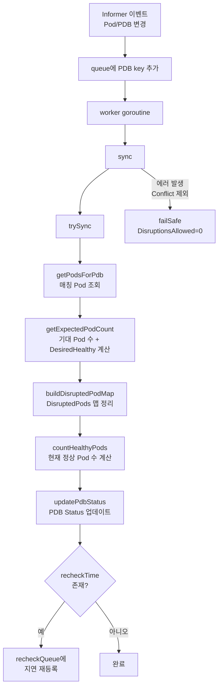
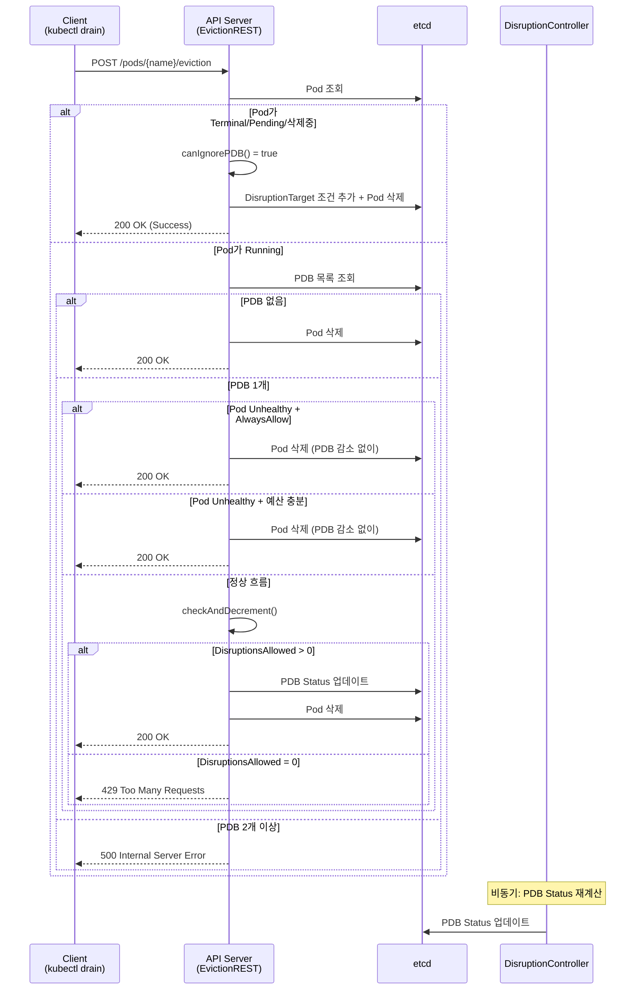

# 28. Pod Disruption Budget (PDB) 및 Eviction API 심화

## 목차

1. [개요](#1-개요)
2. [PodDisruptionBudget 타입 정의](#2-poddisruptionbudget-타입-정의)
3. [DisruptionController 구조체](#3-disruptioncontroller-구조체)
4. [DisruptionsAllowed 계산 알고리즘](#4-disruptionsallowed-계산-알고리즘)
5. [Healthy Pod 판별](#5-healthy-pod-판별)
6. [Eviction API 흐름](#6-eviction-api-흐름)
7. [checkAndDecrement 메커니즘](#7-checkanddecrement-메커니즘)
8. [DisruptedPods 맵과 2Phase Commit](#8-disruptedpods-맵과-2phase-commit)
9. [Unhealthy Pod Eviction Policy](#9-unhealthy-pod-eviction-policy)
10. [Fail-Safe 메커니즘](#10-fail-safe-메커니즘)
11. [왜 이런 설계인가](#11-왜-이런-설계인가)
12. [정리](#12-정리)

---

## 1. 개요

### PDB란 무엇인가

PodDisruptionBudget(PDB)은 Kubernetes에서 **자발적 중단(voluntary disruption)**으로부터 애플리케이션의 가용성을 보호하는 정책 객체이다. 노드 드레인, 롤링 업데이트, 클러스터 오토스케일러에 의한 노드 축소 등 운영자가 의도적으로 수행하는 작업에서 동시에 중단될 수 있는 Pod의 수를 제한한다.

### 핵심 개념

```
자발적 중단 (Voluntary Disruption)
├── kubectl drain
├── Cluster Autoscaler의 노드 축소
├── Rolling Update (Deployment)
└── 직접적인 Eviction API 호출

비자발적 중단 (Involuntary Disruption)
├── 하드웨어 장애
├── 커널 패닉
├── OOM Kill
└── 네트워크 파티션 ← PDB가 보호하지 않음
```

### 아키텍처 위치

PDB 시스템은 두 개의 독립된 컴포넌트가 협력하는 구조이다. kube-controller-manager 안에서 주기적으로 PDB 상태를 계산하는 DisruptionController와, 퇴거 요청을 처리하는 kube-apiserver 내부의 Eviction API 핸들러가 etcd를 통해 데이터를 교환한다.

```
┌─────────────────────────────────────────────────────────┐
│                    API Server                           │
│  ┌──────────────────┐  ┌─────────────────────────────┐  │
│  │  Eviction API    │  │  PDB Status (etcd)          │  │
│  │  (EvictionREST)  │──│  - DisruptionsAllowed       │  │
│  │                  │  │  - CurrentHealthy            │  │
│  └──────┬───────────┘  │  - DesiredHealthy            │  │
│         │              │  - DisruptedPods              │  │
│         │              └──────────┬────────────────────┘  │
└─────────┼─────────────────────────┼──────────────────────┘
          │                         │
          │ checkAndDecrement()     │ updatePdbStatus()
          │                         │
          ▼                         ▼
┌─────────────────┐       ┌───────────────────────┐
│  kubectl drain  │       │ DisruptionController  │
│  Autoscaler     │       │ (kube-controller-     │
│  등의 클라이언트   │       │  manager 내부)          │
└─────────────────┘       └───────────────────────┘
```

| 컴포넌트 | 위치 | 역할 |
|---------|------|------|
| **DisruptionController** | kube-controller-manager | PDB 상태를 주기적으로 계산하여 업데이트 |
| **Eviction API (EvictionREST)** | kube-apiserver | 퇴거 요청 시 PDB를 확인하고 DisruptionsAllowed를 감소 |

> **소스코드 위치**
> - DisruptionController: `pkg/controller/disruption/disruption.go`
> - API 타입 정의: `staging/src/k8s.io/api/policy/v1/types.go`
> - Eviction 핸들러: `pkg/registry/core/pod/storage/eviction.go`

---

## 2. PodDisruptionBudget 타입 정의

### PodDisruptionBudget 구조체

`staging/src/k8s.io/api/policy/v1/types.go` 177-189번 라인에 정의된 최상위 타입이다:

```go
// PodDisruptionBudget is an object to define the max disruption
// that can be caused to a collection of pods
type PodDisruptionBudget struct {
    metav1.TypeMeta   `json:",inline"`
    metav1.ObjectMeta `json:"metadata,omitempty"`
    Spec   PodDisruptionBudgetSpec   `json:"spec,omitempty"`
    Status PodDisruptionBudgetStatus `json:"status,omitempty"`
}
```

### PodDisruptionBudgetSpec

`staging/src/k8s.io/api/policy/v1/types.go` 28-75번 라인. Spec은 사용자가 선언하는 부분이다:

```go
type PodDisruptionBudgetSpec struct {
    // 퇴거 후에도 최소 이 수만큼의 Pod가 가용해야 함
    // "100%"로 설정하면 모든 자발적 퇴거를 차단
    MinAvailable *intstr.IntOrString

    // PDB가 적용될 Pod를 선택하는 라벨 셀렉터
    // null이면 매칭 Pod 없음, 빈 셀렉터({})면 네임스페이스 내 모든 Pod
    Selector *metav1.LabelSelector

    // 퇴거 후 최대 이 수만큼의 Pod가 불가용할 수 있음
    // MinAvailable과 상호 배타적
    MaxUnavailable *intstr.IntOrString

    // 비정상 Pod의 퇴거 정책
    // IfHealthyBudget(기본값) 또는 AlwaysAllow
    UnhealthyPodEvictionPolicy *UnhealthyPodEvictionPolicyType
}
```

#### MinAvailable vs MaxUnavailable 비교

| 필드 | 의미 | 예시 (5 replicas) |
|------|------|-------------------|
| `minAvailable: 3` | 항상 3개 이상의 정상 Pod 유지 | 최대 2개 동시 중단 가능 |
| `minAvailable: "60%"` | 전체의 60% 이상 정상 유지 | 3개 이상 유지, 최대 2개 중단 |
| `maxUnavailable: 1` | 최대 1개까지 불가용 허용 | 최소 4개 유지 |
| `maxUnavailable: "20%"` | 전체의 20%까지 불가용 허용 | 1개까지 불가용, 최소 4개 유지 |

두 필드는 **상호 배타적(mutually exclusive)**이다. 둘 다 설정하면 유효성 검증에서 거부된다. `intstr.IntOrString` 타입을 사용하므로 정수값(절대값)과 문자열(백분율) 모두 지정할 수 있다.

### PodDisruptionBudgetStatus

`staging/src/k8s.io/api/policy/v1/types.go` 99-154번 라인. DisruptionController가 계산하여 채우는 상태 부분이다:

```go
type PodDisruptionBudgetStatus struct {
    // PDB 상태 업데이트 시 관찰된 가장 최근 세대
    ObservedGeneration int64

    // API 서버가 퇴거를 승인했지만 컨트롤러가 아직 관찰하지 못한 Pod들
    // key: Pod 이름, value: API 서버가 퇴거를 처리한 시각
    DisruptedPods map[string]metav1.Time

    // 현재 허용되는 Pod 중단 수
    DisruptionsAllowed int32

    // 현재 정상(healthy) Pod 수
    CurrentHealthy int32

    // 최소 유지해야 할 정상 Pod 수
    DesiredHealthy int32

    // PDB가 카운트한 전체 Pod 수
    ExpectedPods int32

    // PDB 조건 (DisruptionAllowed 등)
    Conditions []metav1.Condition
}
```

### Status 필드 간의 관계

```
┌───────────────────────────────────────────────────────┐
│              PDB Status 계산 관계도                      │
│                                                       │
│  ExpectedPods = 컨트롤러(Deployment 등)의 replicas 합계   │
│                                                       │
│  DesiredHealthy = MinAvailable                        │
│              또는 ExpectedPods - MaxUnavailable         │
│                                                       │
│  CurrentHealthy = Ready && !Deleted &&                │
│                   !DisruptedPods에 있는 Pod 수            │
│                                                       │
│  DisruptionsAllowed = max(0, CurrentHealthy           │
│                              - DesiredHealthy)        │
│                       (단, ExpectedPods > 0일 때)       │
│                                                       │
│  ┌─────────────────────────────────────────────┐      │
│  │  예: replicas=5, minAvailable=3             │      │
│  │  ExpectedPods=5, DesiredHealthy=3           │      │
│  │  5개 모두 Ready → CurrentHealthy=5           │      │
│  │  DisruptionsAllowed = 5 - 3 = 2             │      │
│  └─────────────────────────────────────────────┘      │
└───────────────────────────────────────────────────────┘
```

### Eviction 타입

`staging/src/k8s.io/api/policy/v1/types.go` 214-224번 라인:

```go
// Eviction evicts a pod from its node subject to certain policies
// and safety constraints. This is a subresource of Pod.
// POST .../pods/<pod name>/evictions
type Eviction struct {
    metav1.TypeMeta   `json:",inline"`
    metav1.ObjectMeta `json:"metadata,omitempty"`
    DeleteOptions *metav1.DeleteOptions `json:"deleteOptions,omitempty"`
}
```

Eviction은 Pod의 **서브리소스(subresource)**이다. `DELETE /api/v1/pods/{name}` 엔드포인트는 PDB 확인 없이 Pod를 직접 삭제하지만, `POST /api/v1/namespaces/{ns}/pods/{name}/eviction` 엔드포인트는 PDB 확인 절차를 반드시 거친다.

### Conditions 상수

```go
const (
    DisruptionAllowedCondition = "DisruptionAllowed"
    SyncFailedReason           = "SyncFailed"
    SufficientPodsReason       = "SufficientPods"
    InsufficientPodsReason     = "InsufficientPods"
)
```

---

## 3. DisruptionController 구조체

### 구조체 정의

`pkg/controller/disruption/disruption.go` 81-120번 라인에 정의된다:

```go
type DisruptionController struct {
    kubeClient      clientset.Interface
    mapper          apimeta.RESTMapper
    scaleNamespacer scaleclient.ScalesGetter
    discoveryClient discovery.DiscoveryInterface

    // PDB 관련 Informer/Lister
    pdbLister       policylisters.PodDisruptionBudgetLister
    pdbListerSynced cache.InformerSynced

    // Pod 관련
    podLister       corelisters.PodLister
    podListerSynced cache.InformerSynced

    // 워크로드 컨트롤러 관련 (Scale 계산용)
    rcLister       corelisters.ReplicationControllerLister
    rcListerSynced cache.InformerSynced
    rsLister       appsv1listers.ReplicaSetLister
    rsListerSynced cache.InformerSynced
    dLister        appsv1listers.DeploymentLister
    dListerSynced  cache.InformerSynced
    ssLister       appsv1listers.StatefulSetLister
    ssListerSynced cache.InformerSynced

    // 작업 큐
    queue        workqueue.TypedRateLimitingInterface[string]    // PDB 동기화
    recheckQueue workqueue.TypedDelayingInterface[string]        // 지연 재확인

    // 오래된 DisruptionTarget 조건 정리용
    stalePodDisruptionQueue   workqueue.TypedRateLimitingInterface[string]
    stalePodDisruptionTimeout time.Duration

    broadcaster record.EventBroadcaster
    recorder    record.EventRecorder
    getUpdater  func() updater
    clock       clock.Clock
}
```

### 핵심 상수

```go
const (
    // DisruptedPods에 추가된 Pod가 실제로 삭제되기까지 기다리는 최대 시간
    // 이 시간 내에 삭제되지 않으면 DisruptedPods에서 제거
    DeletionTimeout = 2 * time.Minute

    // DisruptionTarget 조건이 유효한 최대 시간
    stalePodDisruptionTimeout = 2 * time.Minute
)
```

### 다중 워크로드 Lister의 역할

DisruptionController는 여러 종류의 워크로드 컨트롤러를 모두 추적한다. PDB의 대상 Pod들이 어떤 컨트롤러에 의해 관리되는지를 파악하여 `expectedCount`(기대 Pod 수)를 정확히 계산하기 위해서다.

```
Pod의 ownerReference 추적 경로:

Pod ──► ReplicaSet (rsLister)
Pod ──► ReplicationController (rcLister)
Pod ──► StatefulSet (ssLister)
Pod ──► Deployment (dLister) ──► ReplicaSet
```

각 워크로드의 `spec.replicas`(또는 Scale subresource)를 합산하여 `expectedCount`를 계산한다.

### 컨트롤러 워크플로우 개요



### queue vs recheckQueue vs stalePodDisruptionQueue

| 큐 | 타입 | 용도 | 트리거 |
|----|------|------|--------|
| `queue` | RateLimiting | 즉시 PDB 재계산 | Pod/PDB 변경 Informer 이벤트 |
| `recheckQueue` | Delaying | 지연된 재계산 | DisruptedPods의 DeletionTimeout 만료 시점 |
| `stalePodDisruptionQueue` | RateLimiting | 오래된 DisruptionTarget 조건 정리 | Pod의 DisruptionTarget 조건이 2분 이상 유지 |

`recheckQueue`는 `buildDisruptedPodMap`에서 아직 타임아웃되지 않은 DisruptedPods 항목이 있을 때 해당 항목의 예상 만료 시점에 PDB를 다시 확인하도록 스케줄링한다. 이를 통해 불필요한 폴링 없이 정확한 시점에 DisruptedPods를 정리할 수 있다.

---

## 4. DisruptionsAllowed 계산 알고리즘

### 전체 계산 흐름

PDB의 핵심 산출물인 `DisruptionsAllowed`는 `trySync()` 메서드(701-772번 라인)에서 계산된다. 이 흐름을 단계별로 분석한다.

### 4.1 getExpectedPodCount (818-858번 라인)

이 함수는 `expectedCount`(기대 전체 Pod 수)와 `desiredHealthy`(최소 유지해야 할 정상 Pod 수)를 계산한다.

```go
func (dc *DisruptionController) getExpectedPodCount(
    ctx context.Context,
    pdb *policy.PodDisruptionBudget,
    pods []*v1.Pod,
) (expectedCount, desiredHealthy int32, unmanagedPods []string, err error) {

    if pdb.Spec.MaxUnavailable != nil {
        // MaxUnavailable 모드: 컨트롤러 scale에서 expectedCount 결정
        expectedCount, unmanagedPods, err = dc.getExpectedScale(ctx, pods)
        maxUnavailable, _ := intstr.GetScaledValueFromIntOrPercent(
            pdb.Spec.MaxUnavailable, int(expectedCount), true)
        desiredHealthy = expectedCount - int32(maxUnavailable)
        if desiredHealthy < 0 {
            desiredHealthy = 0
        }
    } else if pdb.Spec.MinAvailable != nil {
        if pdb.Spec.MinAvailable.Type == intstr.Int {
            // MinAvailable 절대값 모드: Pod 수를 직접 사용
            desiredHealthy = pdb.Spec.MinAvailable.IntVal
            expectedCount = int32(len(pods))
        } else if pdb.Spec.MinAvailable.Type == intstr.String {
            // MinAvailable 백분율 모드: 컨트롤러 scale 기반
            expectedCount, unmanagedPods, err = dc.getExpectedScale(ctx, pods)
            minAvailable, _ := intstr.GetScaledValueFromIntOrPercent(
                pdb.Spec.MinAvailable, int(expectedCount), true)
            desiredHealthy = int32(minAvailable)
        }
    }
    return
}
```

#### expectedCount 결정 방식의 차이

이 차이는 매우 중요하다. MinAvailable이 절대값일 때만 실제 매칭된 Pod 수를 사용하고, 나머지 모든 경우에는 컨트롤러의 `spec.replicas`를 사용한다.

```
┌──────────────────────────┬───────────────────────────────────┐
│  MinAvailable (절대값)     │  expectedCount = len(pods)        │
│                          │  매칭된 실제 Pod 수 사용               │
├──────────────────────────┼───────────────────────────────────┤
│  MinAvailable (백분율)     │  expectedCount = getExpectedScale │
│  MaxUnavailable (둘 다)   │  컨트롤러의 replicas 합계 사용         │
│                          │  → 실제 Pod 수와 다를 수 있음           │
└──────────────────────────┴───────────────────────────────────┘
```

**왜 이렇게 다른가?** 절대값 MinAvailable은 "최소 N개가 있어야 한다"는 의미로, 실제 Pod 수와 무관하게 작동한다. 반면 백분율이나 MaxUnavailable은 "전체 대비 비율"이므로 "전체"가 무엇인지 알아야 한다. 스케일업/다운 과정에서 실제 Pod 수와 의도된 replicas가 다를 수 있으므로, 의도된 규모(spec.replicas)를 기준으로 삼는다.

#### getExpectedScale의 동작 (860-921번 라인)

`getExpectedScale`은 Pod들의 `ownerReference`를 추적하여 해당 컨트롤러의 scale을 합산한다:

```go
func (dc *DisruptionController) getExpectedScale(ctx context.Context, pods []*v1.Pod) (
    expectedCount int32, unmanagedPods []string, err error) {

    controllerScale := map[types.UID]int32{}

    for _, pod := range pods {
        controllerRef := metav1.GetControllerOf(pod)
        if controllerRef == nil {
            unmanagedPods = append(unmanagedPods, pod.Name)
            continue
        }
        if _, found := controllerScale[controllerRef.UID]; found {
            continue  // 이미 확인한 컨트롤러
        }
        // finders를 순회하며 컨트롤러의 scale 조회
        for _, finder := range dc.finders() {
            controllerNScale, err := finder(ctx, controllerRef, pod.Namespace)
            if controllerNScale != nil {
                controllerScale[controllerNScale.UID] = controllerNScale.scale
                break
            }
        }
    }

    // 모든 컨트롤러의 scale 합산
    expectedCount = 0
    for _, count := range controllerScale {
        expectedCount += count
    }
    return
}
```

`finders()`는 ReplicationController, ReplicaSet, Deployment, StatefulSet에 대한 scale 조회 함수들을 반환한다. 각 finder는 `ownerReference`의 API group/kind를 확인하고, 해당 리소스의 `spec.replicas`를 반환한다.

**unmanagedPods**: `ownerReference`가 없는(컨트롤러가 관리하지 않는) Pod는 별도로 수집되어 경고 이벤트로 기록된다. 이런 Pod가 있으면 PDB의 `spec.minAvailable`을 절대값으로 설정해야 정확한 보호가 가능하다.

### 4.2 DisruptionsAllowed 최종 계산

`updatePdbStatus()` 함수(1001-1037번 라인)에서 최종 값이 결정된다:

```go
func (dc *DisruptionController) updatePdbStatus(ctx context.Context,
    pdb *policy.PodDisruptionBudget,
    currentHealthy, desiredHealthy, expectedCount int32,
    disruptedPods map[string]metav1.Time) error {

    // 핵심 계산
    disruptionsAllowed := currentHealthy - desiredHealthy
    if expectedCount <= 0 || disruptionsAllowed <= 0 {
        disruptionsAllowed = 0
    }

    // 변경이 없으면 업데이트 생략 (불필요한 etcd 쓰기 방지)
    if pdb.Status.CurrentHealthy == currentHealthy &&
        pdb.Status.DesiredHealthy == desiredHealthy &&
        pdb.Status.ExpectedPods == expectedCount &&
        pdb.Status.DisruptionsAllowed == disruptionsAllowed &&
        apiequality.Semantic.DeepEqual(pdb.Status.DisruptedPods, disruptedPods) &&
        pdb.Status.ObservedGeneration == pdb.Generation &&
        pdbhelper.ConditionsAreUpToDate(pdb) {
        return nil  // 변경 없음, 쓰기 생략
    }

    newPdb := pdb.DeepCopy()
    newPdb.Status = policy.PodDisruptionBudgetStatus{
        CurrentHealthy:     currentHealthy,
        DesiredHealthy:     desiredHealthy,
        ExpectedPods:       expectedCount,
        DisruptionsAllowed: disruptionsAllowed,
        DisruptedPods:      disruptedPods,
        ObservedGeneration: pdb.Generation,
        Conditions:         newPdb.Status.Conditions,
    }

    pdbhelper.UpdateDisruptionAllowedCondition(newPdb)
    return dc.getUpdater()(ctx, newPdb)
}
```

**중요한 최적화**: `apiequality.Semantic.DeepEqual`을 사용하여 상태가 변경되지 않았으면 etcd 쓰기를 건너뛴다. PDB가 많은 클러스터에서 불필요한 쓰기를 방지하기 위한 핵심 최적화이다.

### 계산 시나리오 테이블

| 시나리오 | replicas | Spec | expectedCount | desiredHealthy | currentHealthy | DisruptionsAllowed |
|---------|----------|------|---------------|----------------|----------------|--------------------|
| 기본 | 5 | minAvailable: 3 | 5 | 3 | 5 | **2** |
| 일부 미준비 | 5 | minAvailable: 3 | 5 | 3 | 4 | **1** |
| 예산 소진 | 5 | minAvailable: 3 | 5 | 3 | 3 | **0** |
| 초과 미준비 | 5 | minAvailable: 3 | 5 | 3 | 2 | **0** (음수 clamped) |
| maxUnavail | 5 | maxUnavailable: 2 | 5 | 3 | 5 | **2** |
| 백분율 | 10 | minAvailable: "80%" | 10 | 8 | 10 | **2** |
| 스케일업 중 | 5->10 | maxUnavailable: 1 | 10 | 9 | 5 | **0** (!) |
| Pod 0개 | 0 | minAvailable: 1 | 0 | 1 | 0 | **0** |
| 완전 차단 | 5 | minAvailable: "100%" | 5 | 5 | 5 | **0** |

> **주의**: `expectedCount <= 0`이면 무조건 `DisruptionsAllowed = 0`이다. 이는 아직 Pod가 생성되지 않은 PDB가 처음 적용될 때 안전한 상태를 유지하기 위한 의도적 설계이다.

### 4.3 trySync 전체 흐름

```go
func (dc *DisruptionController) trySync(ctx context.Context,
    pdb *policy.PodDisruptionBudget) error {

    // 1단계: PDB 셀렉터에 매칭되는 Pod 목록 조회
    pods, err := dc.getPodsForPdb(pdb)

    // 2단계: 기대 Pod 수, 최소 정상 Pod 수 계산
    expectedCount, desiredHealthy, unmanagedPods, err :=
        dc.getExpectedPodCount(ctx, pdb, pods)

    // 3단계: DisruptedPods 맵 정리 (타임아웃된 항목 제거)
    currentTime := dc.clock.Now()
    disruptedPods, recheckTime :=
        dc.buildDisruptedPodMap(logger, pods, pdb, currentTime)

    // 4단계: 현재 정상 Pod 수 계산
    currentHealthy := countHealthyPods(pods, disruptedPods, currentTime)

    // 5단계: PDB Status 업데이트 (DisruptionsAllowed 계산 포함)
    err = dc.updatePdbStatus(ctx, pdb, currentHealthy,
        desiredHealthy, expectedCount, disruptedPods)

    // 6단계: 필요 시 재확인 스케줄링
    if err == nil && recheckTime != nil {
        dc.enqueuePdbForRecheck(logger, pdb, recheckTime.Sub(currentTime))
    }
    return err
}
```

---

## 5. Healthy Pod 판별

### countHealthyPods 함수 (924-940번 라인)

이 함수는 PDB가 보호하는 Pod 중 "현재 정상"인 Pod의 수를 계산한다. 3가지 제외 조건을 순서대로 적용한다.

```go
func countHealthyPods(
    pods []*v1.Pod,
    disruptedPods map[string]metav1.Time,
    currentTime time.Time,
) (currentHealthy int32) {
    for _, pod := range pods {
        // 조건 1: 삭제 중인 Pod는 제외
        if pod.DeletionTimestamp != nil {
            continue
        }
        // 조건 2: DisruptedPods에 있고 DeletionTimeout 내인 Pod는 제외
        if disruptionTime, found := disruptedPods[pod.Name]; found &&
            disruptionTime.Time.Add(DeletionTimeout).After(currentTime) {
            continue
        }
        // 조건 3: Ready 조건이 True인 Pod만 카운트
        if apipod.IsPodReady(pod) {
            currentHealthy++
        }
    }
    return
}
```

### Healthy Pod 판별 흐름도

```
매칭된 각 Pod에 대해:
┌───────────────────────────┐
│    pod.DeletionTimestamp   │
│    != nil ?               │
└───────────┬───────────────┘
            │
     ┌──────┴──────┐
     │ Yes         │ No
     ▼             ▼
  [스킵]    ┌──────────────────────────┐
            │ DisruptedPods에 존재하고   │
            │ DeletionTimeout 이내?     │
            └───────────┬──────────────┘
                        │
                 ┌──────┴──────┐
                 │ Yes         │ No
                 ▼             ▼
              [스킵]    ┌────────────────┐
                        │ IsPodReady()?  │
                        └───────┬────────┘
                                │
                         ┌──────┴──────┐
                         │ True        │ False
                         ▼             ▼
                    [healthy++]     [스킵]
```

### Pod 상태별 분류

```
┌─────────────────────────────────────────────────────────────┐
│                    전체 매칭 Pod                               │
├─────────────────┬───────────────────────────────────────────┤
│                 │                                           │
│  삭제 중          │  존재하는 Pod                                │
│  (DeletionTS    │  ├── DisruptedPods에 등록 + 타임아웃 이내      │
│   != nil)       │  │   → "곧 삭제될 예정"으로 간주               │
│                 │  ├── Ready=True                            │
│  → 불건강         │  │   → Healthy (CurrentHealthy에 카운트)     │
│                 │  └── Ready=False (+ 위 조건 해당 없음)        │
│                 │      → Unhealthy (카운트 안 됨)               │
└─────────────────┴───────────────────────────────────────────┘
```

### IsPodReady의 정의

Pod가 "정상(Healthy)"이라 함은 `status.conditions`에서 `type=Ready`, `status=True`인 조건이 존재함을 의미한다. 이는 Pod의 모든 컨테이너가 준비 상태이고, readinessProbe를 통과했음을 뜻한다.

```yaml
# Healthy Pod 예시
status:
  conditions:
  - type: Ready
    status: "True"     # ← 이것이 있어야 healthy
    lastTransitionTime: "2024-01-15T10:30:00Z"
  phase: Running
```

**조건 2의 의미**: DisruptedPods에 등록된 Pod는 API 서버가 퇴거를 승인했지만 아직 실제 삭제가 완료되지 않은 Pod이다. 이 Pod를 healthy로 카운트하면 DisruptionsAllowed가 비정상적으로 높아져 추가 퇴거가 허용될 수 있다. 따라서 "이미 퇴거가 예정된 Pod"는 healthy 카운트에서 제외한다.

---

## 6. Eviction API 흐름

### EvictionREST 구조체

`pkg/registry/core/pod/storage/eviction.go` 70-74번 라인:

```go
// EvictionREST implements the REST endpoint for evicting pods from nodes
type EvictionREST struct {
    store                     rest.StandardStorage        // Pod 저장소
    podDisruptionBudgetClient policyclient.PodDisruptionBudgetsGetter  // PDB 클라이언트
}
```

EvictionREST는 두 가지 의존성만 가진다: Pod를 읽고 삭제하기 위한 `store`, PDB를 조회하고 업데이트하기 위한 `podDisruptionBudgetClient`.

### Create 메서드 전체 흐름 (129번 라인~)

Eviction 요청은 `Create` 메서드를 통해 처리된다. `POST /api/v1/namespaces/{ns}/pods/{name}/eviction` 엔드포인트가 이 메서드로 라우팅된다.



### canIgnorePDB (389-397번 라인)

PDB 확인을 건너뛸 수 있는 Pod 상태:

```go
func canIgnorePDB(pod *api.Pod) bool {
    if pod.Status.Phase == api.PodSucceeded ||
       pod.Status.Phase == api.PodFailed ||
       pod.Status.Phase == api.PodPending ||
       !pod.ObjectMeta.DeletionTimestamp.IsZero() {
        return true
    }
    return false
}
```

| Phase | PDB 확인 | 이유 |
|-------|---------|------|
| Succeeded | 건너뜀 | 이미 정상 완료된 Pod |
| Failed | 건너뜀 | 이미 실패한 Pod |
| Pending | 건너뜀 | 아직 스케줄되지 않은 Pod |
| (삭제 중) | 건너뜀 | DeletionTimestamp가 이미 설정됨 |
| **Running** | **확인** | 실제 서비스 중인 Pod |

> `Pending` Pod를 PDB 없이 삭제하는 이유: 아직 실행되지 않은 Pod는 서비스에 기여하지 않으므로 가용성에 영향을 주지 않는다. 이 Pod를 PDB로 보호하면 오히려 노드 드레인 등의 운영이 불필요하게 차단될 수 있다.

### Eviction 재시도 설정 (59-64번 라인)

```go
var EvictionsRetry = wait.Backoff{
    Steps:    20,                    // 최대 20회 재시도
    Duration: 500 * time.Millisecond, // 초기 대기 시간
    Factor:   1.0,                   // 지수 배수 (증가 없음)
    Jitter:   0.1,                   // 10% 지터
}
```

`Factor: 1.0`이므로 지수 증가 없이 매번 동일한 간격(~500ms)으로 재시도한다. 최대 20회이므로 약 10초간 재시도한다. 이는 API 서버 내부의 재시도이며, 클라이언트 측의 재시도와는 별개이다.

### DisruptionTarget 조건 추가 (317-371번 라인)

Eviction API는 Pod를 삭제하기 전에 `DisruptionTarget` 조건을 추가한다. 이는 Pod가 자발적 중단에 의해 종료되고 있음을 다른 컴포넌트(예: Job 컨트롤러, Scheduler)에 알리는 역할을 한다.

```go
conditionAppender := func(_ context.Context, newObj, _ runtime.Object) (
    runtime.Object, error) {
    podObj := newObj.(*api.Pod)
    podutil.UpdatePodCondition(&podObj.Status, &api.PodCondition{
        Type:    api.DisruptionTarget,
        Status:  api.ConditionTrue,
        Reason:  "EvictionByEvictionAPI",
        Message: "Eviction API: evicting",
    })
    return podObj, nil
}
```

이 조건 추가와 Pod 삭제는 두 단계로 수행된다:
1. `store.Update()`: Pod에 DisruptionTarget 조건 추가 (조건부 업데이트)
2. `store.Delete()`: Pod 삭제

`getLatestPod` 함수를 통해 etcd에서 최신 Pod를 읽어와 조건을 추가하므로, 다른 업데이트와의 충돌을 방지한다.

### 다중 PDB 거부

```go
if len(pdbs) > 1 {
    rtStatus = &metav1.Status{
        Status:  metav1.StatusFailure,
        Message: "This pod has more than one PodDisruptionBudget, " +
                 "which the eviction subresource does not support.",
        Code:    500,
    }
    return nil
}
```

하나의 Pod에 여러 PDB가 매칭되면 HTTP 500 에러를 반환한다. 이는 두 PDB의 예산을 동시에 원자적으로 감소시킬 수 없기 때문이다.

---

## 7. checkAndDecrement 메커니즘

### 함수 분석 (424-484번 라인)

`checkAndDecrement`는 Eviction API의 핵심으로, PDB의 `DisruptionsAllowed`를 원자적으로 확인하고 감소시킨다.

```go
func (r *EvictionREST) checkAndDecrement(
    namespace string,
    podName string,
    pdb policyv1.PodDisruptionBudget,
    dryRun bool,
) error {
    // 1. ObservedGeneration 검증
    if pdb.Status.ObservedGeneration < pdb.Generation {
        return createTooManyRequestsError(pdb.Name)  // 429
    }

    // 2. DisruptionsAllowed 음수 검증
    if pdb.Status.DisruptionsAllowed < 0 {
        return errors.NewForbidden(...)  // 403
    }

    // 3. DisruptedPods 맵 크기 검증
    if len(pdb.Status.DisruptedPods) > MaxDisruptedPodSize {
        return errors.NewForbidden(...)  // 403
    }

    // 4. DisruptionsAllowed == 0이면 퇴거 거부
    if pdb.Status.DisruptionsAllowed == 0 {
        err := errors.NewTooManyRequests(...)  // 429
        // 조건 기반 상세 메시지 첨부
        condition := meta.FindStatusCondition(
            pdb.Status.Conditions, policyv1.DisruptionAllowedCondition)
        switch {
        case condition != nil && condition.Reason == policyv1.SyncFailedReason:
            msg = "...failed sync: " + condition.Message
        case pdb.Status.CurrentHealthy <= pdb.Status.DesiredHealthy:
            msg = fmt.Sprintf("needs %d healthy pods and has %d currently",
                pdb.Status.DesiredHealthy, pdb.Status.CurrentHealthy)
        }
        return err
    }

    // 5. 예산 감소
    pdb.Status.DisruptionsAllowed--
    if pdb.Status.DisruptionsAllowed == 0 {
        pdbhelper.UpdateDisruptionAllowedCondition(&pdb)
    }

    // 6. Dry-run이면 여기서 종료
    if dryRun {
        return nil
    }

    // 7. DisruptedPods에 Pod 등록
    if pdb.Status.DisruptedPods == nil {
        pdb.Status.DisruptedPods = make(map[string]metav1.Time)
    }
    pdb.Status.DisruptedPods[podName] = metav1.Time{Time: time.Now()}

    // 8. PDB Status를 etcd에 업데이트
    _, err := r.podDisruptionBudgetClient.
        PodDisruptionBudgets(namespace).
        UpdateStatus(context.TODO(), &pdb, metav1.UpdateOptions{})
    return err
}
```

### 검증 단계 다이어그램

```
checkAndDecrement 진입
         |
         v
+------------------------+
| ObservedGeneration     |  429 TooManyRequests
| < Generation ?         |-----------------------------> (컨트롤러 동기화 대기)
+--------+---------------+
         | No
         v
+------------------------+
| DisruptionsAllowed     |  403 Forbidden
| < 0 ?                  |-----------------------------> (비정상 상태)
+--------+---------------+
         | No
         v
+------------------------+
| len(DisruptedPods)     |  403 Forbidden
| > 2000 ?               |-----------------------------> (퇴거 확인 누적 과다)
+--------+---------------+
         | No
         v
+------------------------+
| DisruptionsAllowed     |  429 TooManyRequests
| == 0 ?                 |-----------------------------> (예산 소진)
+--------+---------------+
         | No (> 0)
         v
+------------------------+
| DisruptionsAllowed--   |
| DisruptedPods에 등록    |
| PDB Status 업데이트      |
+------------------------+
         |
         v
       성공 (nil)
```

### 동시성 제어: Optimistic Concurrency

`checkAndDecrement`는 PDB Status의 `resourceVersion`을 기반으로 한 **낙관적 동시성 제어(Optimistic Concurrency Control)**를 사용한다. etcd의 MVCC를 활용하여 두 클라이언트가 동시에 같은 PDB를 수정하려 할 때 충돌을 감지한다.

```
시간 ───────────────────────────────────────────────────────────────►

클라이언트 A:
  PDB 읽기 (rv=100) ───► DisruptionsAllowed-- ───► UpdateStatus(rv=100) → 성공! (rv→101)

클라이언트 B:
  PDB 읽기 (rv=100) ────────────────────────────► UpdateStatus(rv=100) → 충돌!
                                                   └── RetryOnConflict
                                                       └── PDB 읽기 (rv=101) → UpdateStatus(rv=101) → 성공! (rv→102)
```

호출 측(`Create` 메서드)에서 `retry.RetryOnConflict`로 감싸서 충돌 시 자동 재시도한다:

```go
err = retry.RetryOnConflict(EvictionsRetry, func() error {
    if refresh {
        pdb, err = r.podDisruptionBudgetClient.
            PodDisruptionBudgets(pod.Namespace).
            Get(context.TODO(), pdbName, metav1.GetOptions{})
    }
    if err = r.checkAndDecrement(
        pod.Namespace, pod.Name, *pdb,
        dryrun.IsDryRun(originalDeleteOptions.DryRun)); err != nil {
        refresh = true
        return err
    }
    return nil
})
```

`refresh` 플래그가 핵심이다. 첫 번째 시도에서는 이미 조회한 PDB를 사용하지만, 충돌로 재시도할 때는 `refresh = true`가 되어 최신 PDB를 다시 조회한다.

### 에러 응답 분류

| HTTP 코드 | 원인 | 클라이언트 대응 |
|-----------|------|---------------|
| 429 TooManyRequests | DisruptionsAllowed == 0 | `Retry-After` 헤더 참고 후 재시도 |
| 429 TooManyRequests | ObservedGeneration 불일치 | 컨트롤러 동기화 대기 (~수 초) |
| 403 Forbidden | DisruptionsAllowed < 0 | 관리자에게 PDB 상태 확인 요청 |
| 403 Forbidden | DisruptedPods > 2000 | 컨트롤러 상태 확인, 대기 |
| 409 Conflict | resourceVersion 충돌 | 자동 재시도 (API 서버 내부) |
| 500 Internal | PDB 2개 이상 매칭 | PDB 라벨 셀렉터 수정 |

### createTooManyRequestsError (413-421번 라인)

```go
func createTooManyRequestsError(name string) error {
    err := errors.NewTooManyRequests(
        "Cannot evict pod as it would violate the pod's disruption budget.", 10)
    err.ErrStatus.Details.Causes = append(
        err.ErrStatus.Details.Causes,
        metav1.StatusCause{
            Type:    policyv1.DisruptionBudgetCause,
            Message: fmt.Sprintf(
                "The disruption budget %s is still being processed by the server.",
                name),
        })
    return err
}
```

`Retry-After: 10` 헤더를 포함하여 클라이언트에게 10초 후 재시도를 권장한다. `kubectl drain`은 이 헤더를 존중하여 자동으로 재시도한다.

---

## 8. DisruptedPods 맵과 2Phase Commit

### 2Phase Commit 패턴

PDB 시스템의 핵심 설계는 API 서버와 컨트롤러 간의 **2단계 커밋(2-Phase Commit)** 패턴이다. 두 컴포넌트가 서로 다른 프로세스(심지어 다른 노드)에서 실행되므로, 데이터 일관성을 보장하기 위한 메커니즘이 필요하다.

```
Phase 1: API 서버 (checkAndDecrement)
┌──────────────────────────────────────────────────────┐
│ 1. DisruptionsAllowed 확인 및 감소                      │
│ 2. DisruptedPods[podName] = now() 등록                 │
│ 3. PDB Status 업데이트 (etcd에 기록)                     │
│ 4. Pod 삭제 요청 발행                                   │
│                                                      │
│ 이 시점에서 Pod는 "곧 삭제될 예정"으로 표시됨                 │
└──────────────────────────────────────────────────────┘
                         |
                         | 비동기 (Informer watch 이벤트)
                         v
Phase 2: DisruptionController (trySync)
┌──────────────────────────────────────────────────────┐
│ 1. buildDisruptedPodMap으로 DisruptedPods 맵 정리        │
│    - 이미 삭제된 Pod: 맵에서 제거                          │
│    - DeletionTimeout(2분) 초과: 맵에서 제거               │
│    - 아직 유효한 항목: 유지                               │
│ 2. countHealthyPods에서 DisruptedPods 내 Pod 제외        │
│ 3. DisruptionsAllowed 재계산                            │
│ 4. PDB Status 업데이트                                  │
└──────────────────────────────────────────────────────┘
```

### buildDisruptedPodMap (944-976번 라인)

이 함수는 기존 `DisruptedPods`를 정리하여 새로운 맵을 구성한다. 세 가지 경우를 처리한다:

```go
func (dc *DisruptionController) buildDisruptedPodMap(
    logger klog.Logger,
    pods []*v1.Pod,
    pdb *policy.PodDisruptionBudget,
    currentTime time.Time,
) (map[string]metav1.Time, *time.Time) {
    disruptedPods := pdb.Status.DisruptedPods
    result := make(map[string]metav1.Time)
    var recheckTime *time.Time

    if disruptedPods == nil {
        return result, recheckTime
    }

    for _, pod := range pods {
        // 경우 1: 이미 삭제 중 (DeletionTimestamp 설정됨)
        // → 정상 흐름, 맵에서 자연스럽게 제거
        if pod.DeletionTimestamp != nil {
            continue
        }

        disruptionTime, found := disruptedPods[pod.Name]
        if !found {
            continue
        }

        expectedDeletion := disruptionTime.Time.Add(DeletionTimeout)
        if expectedDeletion.Before(currentTime) {
            // 경우 2: DeletionTimeout(2분) 초과
            // → 삭제가 실패했거나 취소됨, 맵에서 제거
            logger.V(1).Info(
                "pod was expected to be deleted but it wasn't",
                "pod", klog.KObj(pod))
            dc.recorder.Eventf(pod, v1.EventTypeWarning, "NotDeleted",
                "Pod was expected by PDB %s/%s to be deleted but it wasn't",
                pdb.Namespace, pdb.Name)
        } else {
            // 경우 3: 아직 타임아웃 이내
            // → 맵에 유지, recheckTime 업데이트
            if recheckTime == nil || expectedDeletion.Before(*recheckTime) {
                recheckTime = &expectedDeletion
            }
            result[pod.Name] = disruptionTime
        }
    }
    return result, recheckTime
}
```

### DisruptedPods 생명주기

```
시간 ──────────────────────────────────────────────────────────────►

T0: Eviction 요청 수신
    | checkAndDecrement() 호출
    | DisruptedPods["pod-a"] = T0
    | DisruptionsAllowed: 2 → 1
    | Pod 삭제 요청 발행
    v
T0+~1s: DisruptionController가 watch 이벤트 수신
    | trySync() 호출
    | buildDisruptedPodMap: "pod-a" 유지 (T0 + 2min > 현재)
    | countHealthyPods: "pod-a" 제외 (DisruptedPods에 있으므로)
    | DisruptionsAllowed 재계산
    v
T0+~2s: Pod가 실제로 삭제됨 (kubelet이 종료 처리 완료)
    | DisruptionController가 Pod 삭제 이벤트 수신
    | buildDisruptedPodMap: "pod-a" → DeletionTimestamp != nil → 결과에서 제거
    | DisruptedPods 맵이 비워짐
    v
T0+2min: DeletionTimeout 만료 (만약 Pod가 삭제되지 않았다면)
    | recheckQueue에서 PDB가 꺼내져 trySync 실행
    | buildDisruptedPodMap: expectedDeletion.Before(currentTime) → true
    | "pod-a" 맵에서 제거 → 다시 Healthy로 카운트됨
    | DisruptionsAllowed 재계산 (증가할 수 있음)
    | NotDeleted 이벤트 기록
    v
```

### recheckTime의 역할

`buildDisruptedPodMap`은 아직 타임아웃되지 않은 DisruptedPods 항목 중 가장 빠른 만료 시점을 `recheckTime`으로 반환한다. `trySync`에서 이 시점에 PDB를 다시 확인하도록 `recheckQueue`에 등록한다.

```go
// trySync 내부
if err == nil && recheckTime != nil {
    dc.enqueuePdbForRecheck(logger, pdb, recheckTime.Sub(currentTime))
}
```

이를 통해 폴링 없이 정확한 시점에 DisruptedPods를 정리할 수 있다. 예를 들어 DisruptedPods에 3개의 항목이 있고 만료 시점이 T+30s, T+60s, T+90s라면, 가장 빠른 T+30s에 재확인이 스케줄링된다.

### MaxDisruptedPodSize 보호

```go
const MaxDisruptedPodSize = 2000
```

`checkAndDecrement`에서 `len(pdb.Status.DisruptedPods) > MaxDisruptedPodSize`이면 추가 퇴거를 거부한다(403 Forbidden). 이는 비정상적으로 많은 퇴거가 승인되었지만 컨트롤러가 처리하지 못한 상황에 대한 안전장치이다.

정상적인 운영에서 DisruptedPods는 대부분 비어있어야 한다. Pod가 삭제되면 즉시(또는 수 초 이내에) 맵에서 제거되기 때문이다. 맵이 크다면 컨트롤러 지연, Pod 삭제 실패, 또는 과도한 퇴거 요청을 의심해야 한다.

---

## 9. Unhealthy Pod Eviction Policy

### 정책 타입 정의

`staging/src/k8s.io/api/policy/v1/types.go` 77-95번 라인:

```go
type UnhealthyPodEvictionPolicyType string

const (
    // 앱이 정상(healthy budget 충분)일 때만 unhealthy pod 퇴거 허용
    IfHealthyBudget UnhealthyPodEvictionPolicyType = "IfHealthyBudget"

    // Running이지만 unhealthy인 pod는 항상 퇴거 허용
    AlwaysAllow UnhealthyPodEvictionPolicyType = "AlwaysAllow"
)
```

### 정책별 동작 비교

| 정책 | Pod 상태 | 조건 | 퇴거 허용 | PDB 감소 |
|------|---------|------|----------|----------|
| **IfHealthyBudget** (기본) | Ready=True | - | PDB 예산에 따름 | 예 |
| **IfHealthyBudget** | Ready=False | CurrentHealthy >= DesiredHealthy | 허용 | **아니오** |
| **IfHealthyBudget** | Ready=False | CurrentHealthy < DesiredHealthy | checkAndDecrement | 예산에 따름 |
| **AlwaysAllow** | Ready=True | - | PDB 예산에 따름 | 예 |
| **AlwaysAllow** | Ready=False | - | **항상 허용** | **아니오** |

### Eviction 핸들러에서의 구현

`pkg/registry/core/pod/storage/eviction.go`의 `Create` 메서드에서 PDB를 찾은 후의 분기:

```go
// Pod가 Ready가 아닌 경우 (Unhealthy)
if !podutil.IsPodReady(pod) {
    if pdb.Spec.UnhealthyPodEvictionPolicy != nil &&
       *pdb.Spec.UnhealthyPodEvictionPolicy == policyv1.AlwaysAllow {
        // AlwaysAllow: 바로 삭제 허용, PDB 감소 없음
        updateDeletionOptions = true
        return nil
    }
    // IfHealthyBudget (기본값):
    // 애플리케이션이 현재 정상이면(충분한 healthy pod) unhealthy pod 삭제 허용
    if pdb.Status.CurrentHealthy >= pdb.Status.DesiredHealthy &&
       pdb.Status.DesiredHealthy > 0 {
        updateDeletionOptions = true
        return nil
    }
    // 그렇지 않으면 checkAndDecrement로 진행
    // → DisruptionsAllowed == 0이면 429 거부
}
```

### 핵심 설계 이유: "PDB 감소 없이 삭제"

Unhealthy pod는 `countHealthyPods`에서 이미 healthy로 카운트되지 않는다. 따라서 이 Pod를 삭제해도 `CurrentHealthy`는 변하지 않는다. `DisruptionsAllowed`를 감소시키면 오히려 예산이 불필요하게 줄어들어, 정작 healthy pod의 정상적인 퇴거가 차단될 수 있다.

```
예: 5 replicas, minAvailable=3
    Ready Pod: 4개, Unready Pod: 1개
    CurrentHealthy = 4, DesiredHealthy = 3
    DisruptionsAllowed = 1

    Unready pod 퇴거 시:
    - PDB 감소 O: DisruptionsAllowed = 0 → healthy pod 퇴거 불가 (문제!)
    - PDB 감소 X: DisruptionsAllowed = 1 유지 → healthy pod 1개 추가 퇴거 가능 (정확!)
```

### ResourceVersion 경쟁 방지

Unhealthy pod를 PDB 감소 없이 삭제할 때, `updateDeletionOptions = true`로 설정하면 Pod의 현재 `ResourceVersion`을 삭제 전제조건으로 사용한다:

```go
if updateDeletionOptions {
    deleteOptions = deleteOptions.DeepCopy()
    setPreconditionsResourceVersion(deleteOptions, &pod.ResourceVersion)
}
```

이것이 필요한 이유는 다음과 같은 **경쟁 조건(race condition)**을 방지하기 위해서다:

```
시간 ──────────────────────────────────────────────────►

T0: Eviction API가 Pod 조회 → Ready=False (unhealthy)
    PDB 감소 없이 삭제 결정

T0+100ms: kubelet이 readinessProbe 성공 보고
          Pod의 Ready 조건이 True로 변경
          ResourceVersion 변경 (rv=100 → rv=101)

T0+200ms: Eviction API가 Pod 삭제 시도 (rv=100 전제조건)
          → 충돌! rv가 101로 변경됨
          → 429 TooManyRequests 반환
          → 클라이언트가 재시도 → 이번에는 Pod가 healthy이므로 checkAndDecrement 경로로 진행

이 보호가 없다면?
          Pod가 healthy로 전환된 후 PDB 감소 없이 삭제됨
          → CurrentHealthy가 예상보다 낮아짐
          → PDB 위반!
```

### 정책 선택 가이드

```
┌──────────────────────────────────────────────────────────────┐
│           Unhealthy Pod Eviction Policy 선택 기준               │
├───────────────────────────┬──────────────────────────────────┤
│  IfHealthyBudget (기본값)   │  AlwaysAllow                    │
├───────────────────────────┼──────────────────────────────────┤
│  보수적 접근                │  적극적 접근                       │
│  앱이 disrupted 상태이면     │  unhealthy pod는 항상 퇴거 허용     │
│  unhealthy pod도 보호      │  빠른 재스케줄링 우선                │
│                           │                                  │
│  적합한 경우:               │  적합한 경우:                       │
│  - 데이터 처리 중인 Pod      │  - StatefulSet의 stuck pod       │
│  - 종료 시 데이터 손실 위험   │  - CrashLoopBackOff 상태          │
│  - graceful shutdown 필요  │  - Pod가 healthy로 전환될          │
│  - Unready가 일시적인 경우   │    가능성이 낮은 경우                │
└───────────────────────────┴──────────────────────────────────┘
```

---

## 10. Fail-Safe 메커니즘

### failSafe 함수 (983-999번 라인)

`trySync`에서 에러가 발생했을 때(Conflict 제외) 호출되는 안전장치이다:

```go
func (dc *DisruptionController) failSafe(
    ctx context.Context,
    pdb *policy.PodDisruptionBudget,
    err error,
) error {
    newPdb := pdb.DeepCopy()
    // 핵심: DisruptionsAllowed를 0으로 설정
    newPdb.Status.DisruptionsAllowed = 0

    if newPdb.Status.Conditions == nil {
        newPdb.Status.Conditions = make([]metav1.Condition, 0)
    }
    apimeta.SetStatusCondition(&newPdb.Status.Conditions, metav1.Condition{
        Type:               policy.DisruptionAllowedCondition,
        Status:             metav1.ConditionFalse,
        Reason:             policy.SyncFailedReason,
        Message:            err.Error(),
        ObservedGeneration: newPdb.Status.ObservedGeneration,
    })

    return dc.getUpdater()(ctx, newPdb)
}
```

### sync에서의 failSafe 호출 흐름 (701-733번 라인)

```go
func (dc *DisruptionController) sync(ctx context.Context, key string) error {
    pdb, err := dc.pdbLister.PodDisruptionBudgets(namespace).Get(name)
    if errors.IsNotFound(err) {
        return nil  // PDB 삭제됨, 아무것도 하지 않음
    }

    err = dc.trySync(ctx, pdb)

    // Conflict 에러는 재시도 허용 (failSafe 호출 안 함)
    if errors.IsConflict(err) {
        return err  // 재큐잉되어 다시 시도됨
    }

    if err != nil {
        logger.Error(err, "Failed to sync PDB")
        // trySync 실패 시 failSafe 호출
        return dc.failSafe(ctx, pdb, err)
    }

    return nil
}
```

Conflict 에러를 특별 취급하는 이유: Conflict는 다른 컴포넌트(예: Eviction API)가 동시에 PDB를 수정했을 때 발생하는 정상적인 상황이다. 이 경우 단순히 재시도하면 해결되므로 failSafe로 예산을 0으로 떨어뜨릴 필요가 없다.

### Fail-Safe의 설계 철학: "Fail Closed"

```
┌──────────────────────────────────────────────────────────┐
│                    Fail-Safe 설계 원칙                      │
│                                                          │
│  문제 상황:                                                │
│    DisruptionController가 PDB를 정확히 계산할 수 없는 경우     │
│    (예: Scale API 접근 실패, Pod 목록 조회 실패 등)            │
│                                                          │
│  두 가지 선택지:                                            │
│    1. Fail Open: "모름 → 퇴거 허용"                         │
│       위험: DisruptionsAllowed가 부정확한 상태로 유지            │
│             실제로는 예산이 없는데 퇴거가 승인될 수 있음            │
│                                                          │
│    2. Fail Closed: "모름 → 퇴거 차단" ← Kubernetes의 선택     │
│       안전: 가용성 보호 우선                                  │
│       단점: 일시적으로 노드 드레인 등이 차단될 수 있음             │
│                                                          │
│  구현:                                                    │
│    DisruptionsAllowed = 0 으로 설정하여                      │
│    Eviction API가 모든 퇴거 요청을 거부하도록 함                 │
│                                                          │
│  복구:                                                    │
│    다음 sync 주기에서 trySync가 성공하면                       │
│    DisruptionsAllowed가 정상 값으로 자동 복원됨                 │
└──────────────────────────────────────────────────────────┘
```

### Conditions을 통한 상태 전달

PDB Status의 `Conditions` 필드는 PDB의 상태를 세분화하여 전달한다:

| Reason | Condition Status | 의미 |
|--------|-----------------|------|
| `SufficientPods` | True | 충분한 Pod가 있어 disruption 허용 가능 |
| `InsufficientPods` | False | Pod 수가 부족하여 disruption 불가 |
| `SyncFailed` | False | 컨트롤러 동기화 실패, disruption 차단 |

`checkAndDecrement`에서는 이 조건을 확인하여 더 구체적인 에러 메시지를 클라이언트에게 전달한다:

```go
// SyncFailed가 가장 먼저 확인된다
case condition != nil &&
     condition.Status == metav1.ConditionFalse &&
     condition.Reason == policyv1.SyncFailedReason:
    msg = fmt.Sprintf(
        "The disruption budget %s does not allow evicting pods "+
        "currently because it failed sync: %s",
        pdb.Name, condition.Message)

// 그 다음 Pod 부족 확인
case pdb.Status.CurrentHealthy <= pdb.Status.DesiredHealthy:
    msg = fmt.Sprintf(
        "The disruption budget %s needs %d healthy pods "+
        "and has %d currently",
        pdb.Name, pdb.Status.DesiredHealthy, pdb.Status.CurrentHealthy)
```

SyncFailed를 먼저 확인하는 이유: sync가 실패하면 `CurrentHealthy`, `DesiredHealthy` 값이 신뢰할 수 없다. 따라서 이 값들을 기반으로 한 메시지보다 sync 실패 메시지가 더 정확한 원인 설명이 된다.

### stalePodDisruptionTimeout (774-816번 라인)

DisruptionTarget 조건이 True인데 Pod가 실제로 삭제되지 않는 경우를 처리하는 별도 메커니즘이다:

```go
func (dc *DisruptionController) syncStalePodDisruption(
    ctx context.Context, key string) error {
    pod, err := dc.podLister.Pods(namespace).Get(name)
    // ...
    hasCond, cleanAfter := dc.nonTerminatingPodHasStaleDisruptionCondition(pod)
    if !hasCond {
        return nil
    }
    if cleanAfter > 0 {
        // 아직 타임아웃 전, 나중에 다시 확인
        dc.enqueueStalePodDisruptionCleanup(logger, pod, cleanAfter)
        return nil
    }

    // 타임아웃 초과: DisruptionTarget 조건을 False로 리셋
    newPod := pod.DeepCopy()
    updated := apipod.UpdatePodCondition(&newPod.Status, &v1.PodCondition{
        Type:   v1.DisruptionTarget,
        Status: v1.ConditionFalse,
    })
    if updated {
        dc.kubeClient.CoreV1().Pods(pod.Namespace).
            UpdateStatus(ctx, newPod, metav1.UpdateOptions{})
    }
}
```

이는 Finalizer가 Pod 삭제를 차단하거나, API 서버가 삭제를 처리하지 못한 경우를 대비한 자기 치유 메커니즘이다.

---

## 11. 왜 이런 설계인가

### Q1: 왜 DisruptionsAllowed를 API 서버와 컨트롤러가 분리해서 관리하는가?

```
┌──────────────────────────────────────────────────────────────┐
│  문제: 단일 컴포넌트가 모든 것을 처리하면?                         │
│                                                              │
│  방안 A: API 서버가 직접 계산                                    │
│  - API 서버가 Pod 목록, 컨트롤러 스케일 등을 직접 조회해야 함        │
│  - API 서버에 과도한 부하 → 요청 레이턴시 증가                      │
│  - API 서버 수평 확장(HA) 시 각 인스턴스가 독립적으로 계산            │
│    → 일관성 보장 어려움                                          │
│                                                              │
│  방안 B: 컨트롤러가 퇴거 결정까지 담당                              │
│  - 퇴거 요청마다 컨트롤러를 거쳐야 함 → 추가 레이턴시                 │
│  - 컨트롤러 장애 시 모든 퇴거가 불가                               │
│  - 컨트롤러가 단일 실패점(SPOF)이 됨                              │
│                                                              │
│  현재 설계: 역할 분리                                            │
│  - 컨트롤러: "예산을 얼마로 설정할지" 계산 (비동기, 주기적)            │
│  - API 서버: "이 퇴거를 허용할지" 결정 (동기, 원자적 감소)            │
│  → 각 컴포넌트의 강점을 활용                                      │
│  → 컨트롤러 일시 장애 시에도 마지막으로 계산된 예산으로 운영 가능        │
└──────────────────────────────────────────────────────────────┘
```

### Q2: 왜 DisruptedPods 맵이 필요한가?

DisruptedPods 맵 없이는 다음과 같은 **이중 카운팅(double-counting)** 문제가 발생한다:

```
시나리오: 5 replicas, minAvailable=3, DisruptionsAllowed=2

T0: Eviction 요청 → DisruptionsAllowed: 2 → 1
    Pod 삭제 요청 발행 (비동기)

T0+100ms: 컨트롤러 sync 발생
    Pod는 아직 존재 (kubelet이 아직 종료하지 않음)
    countHealthyPods → 5 (아직 모두 Ready!)
    DisruptionsAllowed = 5 - 3 = 2 (다시 2로 복원됨!)

    → 문제: API 서버가 1로 줄였는데 컨트롤러가 2로 복원
    → 추가 퇴거가 허용되어 예산 위반 발생
```

DisruptedPods 맵은 이 시간차를 보상한다:

```
T0: Eviction → DisruptedPods["pod-a"] = T0, DisruptionsAllowed: 1

T0+100ms: 컨트롤러 sync
    countHealthyPods에서 DisruptedPods 내 "pod-a" 제외
    currentHealthy = 4 (5 - 1)
    DisruptionsAllowed = 4 - 3 = 1 (정확한 값 유지!)
```

### Q3: 왜 DeletionTimeout이 2분인가?

```
일반적인 Pod 삭제 시간:

1. API 서버 → etcd: PDB Status 업데이트           ~수 ms
2. etcd → Informer: watch 이벤트 전파             ~100ms ~ 수 초
3. Informer → 컨트롤러 큐: 이벤트 처리              ~수 초
4. kubelet: Pod gracefulTermination              ~30초 (기본값)
5. kubelet → API 서버: Pod 상태 업데이트             ~수 초
6. API 서버 → etcd → Informer: 삭제 이벤트 전파     ~수 초

합계: 일반적으로 30-60초

DeletionTimeout = 2분은:
- 정상 경로의 약 2-4배 마진
- 네트워크 지연, 컨트롤러 재시작 등 예외 상황에도 충분
- 너무 길면: DisruptedPods가 오래 유지되어 불필요한 퇴거 차단
- 너무 짧으면: 타임아웃 전에 삭제가 반영되지 않아 이중 카운팅

주의: NTP 동기화가 중요
  컨트롤러와 API 서버가 다른 노드에서 실행될 때
  시계 차이가 DeletionTimeout의 정확성에 직접 영향
```

### Q4: 왜 PDB가 2개 이상이면 에러를 반환하는가?

여러 PDB가 하나의 Pod에 적용되면:

1. **어떤 PDB를 감소시킬지 결정할 수 없다**: 두 PDB의 예산이 서로 다를 수 있고, 어느 쪽이 "올바른" PDB인지 판단할 기준이 없다.

2. **원자적 업데이트가 불가능하다**: etcd는 단일 키(리소스)에 대한 원자적 업데이트만 지원한다. 두 PDB를 동시에 원자적으로 감소시키려면 분산 트랜잭션이 필요한데, Kubernetes API는 이를 지원하지 않는다.

3. **일관성 보장이 불가능하다**: 한 PDB만 감소시키면 다른 PDB의 예산은 그대로이므로, 둘 중 하나의 PDB 관점에서 정책이 위반될 수 있다.

### Q5: 왜 ObservedGeneration을 확인하는가?

```
예: minAvailable: 3 → minAvailable: 5 로 변경 시

변경 직후:
  Generation = 2, ObservedGeneration = 1  (컨트롤러 미동기화)
  DisruptionsAllowed = 2 (이전 계산 기준, minAvailable=3)

  이때 퇴거를 허용하면?
  새 정책(minAvailable=5)에서는 DisruptionsAllowed=0이어야 하는데
  이전 계산(=2)을 기반으로 2개까지 퇴거가 허용됨
  → 정책 위반!

  → ObservedGeneration < Generation → 429 거부 → 안전
  → 컨트롤러가 sync 완료 후 ObservedGeneration = 2가 되면 정상 처리
```

이 검증은 Spec 변경과 Status 계산 사이의 시간차에서 발생할 수 있는 정책 위반을 방지하는 핵심 메커니즘이다.

### Q6: 왜 Eviction은 DELETE가 아니라 POST인가?

Eviction은 `DELETE /pods/{name}`이 아니라 `POST /pods/{name}/eviction`으로 구현된다. 이유:

1. **Eviction은 "삭제"가 아니라 "요청"이다**: 삭제는 항상 성공하지만, 퇴거는 PDB에 의해 거부될 수 있다. REST 의미론에서 `DELETE`는 "리소스를 제거하라"이지만, `POST`는 "작업을 수행하라(거부될 수 있음)"이다.

2. **서브리소스 패턴**: Kubernetes API에서 리소스에 대한 부가 작업은 서브리소스로 모델링한다(예: `pods/status`, `pods/binding`, `pods/eviction`). 이를 통해 RBAC에서 eviction 권한을 별도로 관리할 수 있다.

3. **추가 매개변수 전달**: Eviction 객체에는 `DeleteOptions`가 포함될 수 있어, `DryRun`, `GracePeriodSeconds` 등의 옵션을 전달할 수 있다.

---

## 12. 정리

### PDB 시스템 전체 아키텍처 요약

```
+--------------------------------------------------------------------+
|                        PDB 시스템 전체 흐름                            |
|                                                                    |
|  +--------------+      +--------------------------------------+    |
|  |  PDB Spec    |      |  DisruptionController               |    |
|  |  (사용자 선언)  |      |  (kube-controller-manager)           |    |
|  |              |      |                                      |    |
|  | MinAvailable |      |  1. Pod/PDB 변경 감지 (Informer)       |    |
|  |     또는       |      |  2. getExpectedPodCount()             |    |
|  | MaxUnavail   |      |  3. buildDisruptedPodMap()            |    |
|  |              |------+  4. countHealthyPods()                |    |
|  | Selector     |      |  5. updatePdbStatus()                 |    |
|  |              |      |     DisruptionsAllowed 계산            |    |
|  | Unhealthy    |      |  6. failSafe() (에러 시 → 0으로)        |    |
|  | EvictPolicy  |      |                                      |    |
|  +--------------+      +----------------+---------------------+    |
|                                          |                         |
|                              PDB Status 업데이트 (etcd)              |
|                                          |                         |
|                                          v                         |
|                         +-----------------------------+            |
|                         |         etcd                |            |
|                         |  PDB Status:                |            |
|                         |  - DisruptionsAllowed       |            |
|                         |  - CurrentHealthy           |            |
|                         |  - DesiredHealthy           |            |
|                         |  - ExpectedPods             |            |
|                         |  - DisruptedPods            |            |
|                         |  - Conditions               |            |
|                         +-------------+---------------+            |
|                                       |                            |
|                           PDB Status 읽기                           |
|                                       |                            |
|                                       v                            |
|  +---------------+      +------------------------------+          |
|  |  Client       |      |  Eviction API (EvictionREST) |          |
|  |  kubectl      |------+                              |          |
|  |  drain        | POST |  1. canIgnorePDB() 확인        |          |
|  |               |      |  2. PDB 조회                   |          |
|  |  Autoscaler   |      |  3. Unhealthy 정책 확인         |          |
|  |               |      |  4. checkAndDecrement()       |          |
|  |  등            |      |     - 예산 확인 + 감소           |          |
|  |               |<-----+     - DisruptedPods 등록       |          |
|  |        429/200|      |  5. Pod 삭제                   |          |
|  +---------------+      +------------------------------+          |
+--------------------------------------------------------------------+
```

### 핵심 설계 원칙 요약

| 원칙 | 구현 | 이유 |
|------|------|------|
| **Fail Closed** | failSafe()에서 DisruptionsAllowed=0 | 불확실할 때 가용성 보호 우선 |
| **2-Phase Commit** | DisruptedPods 맵 | API 서버-컨트롤러 간 비동기 시간차 보상 |
| **Optimistic Concurrency** | resourceVersion 기반 충돌 감지 | 분산 환경에서 원자성 보장 |
| **역할 분리** | 컨트롤러(계산) + API 서버(결정) | 각 컴포넌트의 강점 활용 |
| **자기 치유** | DeletionTimeout, stalePodDisruptionTimeout | 비정상 상태 자동 복구 |
| **방어적 검증** | ObservedGeneration, MaxDisruptedPodSize | 경쟁 조건과 비정상 상태 방지 |
| **변경 최소화** | DeepEqual로 상태 비교 후 쓰기 | 불필요한 etcd 쓰기 방지 |

### 핵심 수식 정리

```
DisruptionsAllowed 계산:

  MinAvailable 모드:
    DesiredHealthy = MinAvailable (절대값) 또는 ceil(MinAvailable% * expectedCount)
    expectedCount  = len(pods) (절대값) 또는 sum(controller.replicas) (백분율)

  MaxUnavailable 모드:
    DesiredHealthy = expectedCount - MaxUnavailable
    expectedCount  = sum(controller.replicas)

  공통:
    CurrentHealthy     = count(Ready && !Deleted && !DisruptedPods)
    DisruptionsAllowed = max(0, CurrentHealthy - DesiredHealthy)
                         (단, expectedCount > 0일 때)
```

### 소스코드 참조 정리

| 파일 | 주요 내용 | 라인 |
|------|----------|------|
| `staging/src/k8s.io/api/policy/v1/types.go` | PodDisruptionBudgetSpec | 28-75 |
| 위 파일 | PodDisruptionBudgetStatus | 99-154 |
| 위 파일 | PodDisruptionBudget | 177-189 |
| 위 파일 | Eviction | 214-224 |
| 위 파일 | UnhealthyPodEvictionPolicyType | 77-95 |
| `pkg/controller/disruption/disruption.go` | DeletionTimeout 상수 | 59-77 |
| 위 파일 | DisruptionController 구조체 | 81-120 |
| 위 파일 | sync | 701-733 |
| 위 파일 | trySync | 735-772 |
| 위 파일 | getExpectedPodCount | 818-858 |
| 위 파일 | getExpectedScale | 860-921 |
| 위 파일 | countHealthyPods | 924-940 |
| 위 파일 | buildDisruptedPodMap | 944-976 |
| 위 파일 | failSafe | 983-999 |
| 위 파일 | updatePdbStatus | 1001-1037 |
| `pkg/registry/core/pod/storage/eviction.go` | MaxDisruptedPodSize | 54 |
| 위 파일 | EvictionsRetry | 59-64 |
| 위 파일 | EvictionREST 구조체 | 70-74 |
| 위 파일 | Create (Eviction 처리) | 129-315 |
| 위 파일 | addConditionAndDeletePod | 317-372 |
| 위 파일 | canIgnorePDB | 389-397 |
| 위 파일 | createTooManyRequestsError | 413-421 |
| 위 파일 | checkAndDecrement | 424-484 |

---

> **다음 문서**: [29-pod-security.md](./29-pod-security.md) - Pod Security Standards 심화
