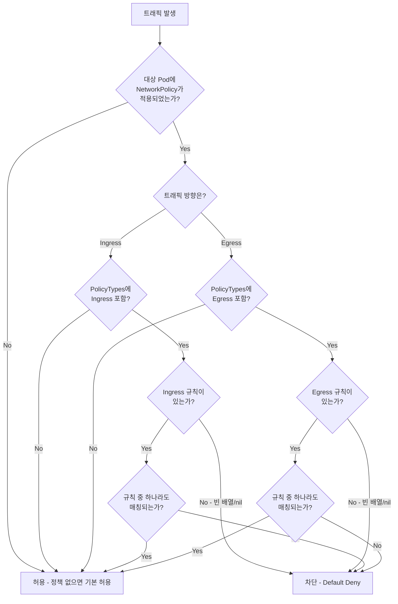
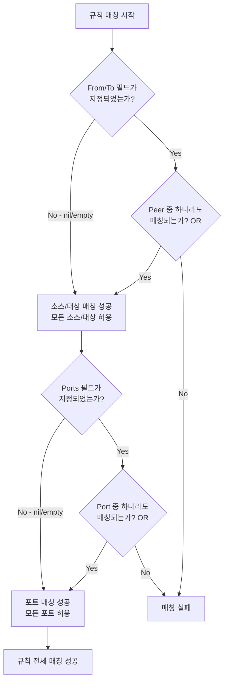

# 31. NetworkPolicy 심화

## 목차

1. [개요](#1-개요)
2. [NetworkPolicy 타입 정의](#2-networkpolicy-타입-정의)
3. [NetworkPolicySpec 상세](#3-networkpolicyspec-상세)
4. [Ingress/Egress 규칙](#4-ingressegress-규칙)
5. [NetworkPolicyPeer (PodSelector, NamespaceSelector, IPBlock)](#5-networkpolicypeer-podselector-namespaceselector-ipblock)
6. [NetworkPolicyPort와 포트 범위](#6-networkpolicyport와-포트-범위)
7. [PolicyTypes (Ingress vs Egress)](#7-policytypes-ingress-vs-egress)
8. [검증 로직 (Validation)](#8-검증-로직-validation)
9. [CNI 레벨 구현 이유](#9-cni-레벨-구현-이유)
10. [트래픽 매칭 규칙](#10-트래픽-매칭-규칙)
11. [왜 이런 설계인가](#11-왜-이런-설계인가)
12. [정리](#12-정리)

---

## 1. 개요

Kubernetes 클러스터에서 **기본적으로 모든 Pod는 서로 제한 없이 통신할 수 있다.** 이것은
Kubernetes가 의도적으로 선택한 설계이다. 개발 편의성과 "네트워킹은 투명해야 한다"는 원칙에
따른 것이지만, 프로덕션 환경에서는 심각한 보안 위험이 된다. 하나의 Pod가 침해(compromise)되면,
같은 클러스터 내의 모든 Pod로 lateral movement가 가능해진다.

**NetworkPolicy**는 Pod 수준의 방화벽 규칙을 선언적으로 정의하여, 어떤 트래픽이 허용되고
어떤 트래픽이 차단되는지를 제어하는 Kubernetes API 리소스이다.

```
+--------------------------------------------------------------------+
|                     Kubernetes 클러스터                               |
|                                                                    |
|  +--------------------------------------------------------------+  |
|  |                    Namespace: production                      |  |
|  |                                                               |  |
|  |  +-------------+    NetworkPolicy     +-------------+         |  |
|  |  |  frontend   | ---- 허용 ---------> |  backend    |         |  |
|  |  |  Pod        |                      |  Pod        |         |  |
|  |  |  app=web    |                      |  app=api    |         |  |
|  |  +-------------+                      +------+------+         |  |
|  |                                              |                |  |
|  |                                        NetworkPolicy          |  |
|  |                                          허용 |                |  |
|  |                                              v                |  |
|  |                                       +------+------+         |  |
|  |                                       |  database   |         |  |
|  |  +-------------+    NetworkPolicy     |  Pod        |         |  |
|  |  |  attacker   | ---- 차단 ----X--->  |  app=db     |         |  |
|  |  |  Pod        |                      +-------------+         |  |
|  |  +-------------+                                              |  |
|  +--------------------------------------------------------------+  |
+--------------------------------------------------------------------+
```

### NetworkPolicy가 필요한 이유

| 이유 | 설명 |
|------|------|
| 최소 권한 원칙 | Pod는 자신의 역할에 필요한 통신만 허용받아야 한다 |
| 다중 테넌시 | 네임스페이스 간 격리 없이는 한 테넌트가 다른 테넌트의 서비스에 접근 가능 |
| 침해 범위 제한 | 하나의 Pod가 침해되더라도 NetworkPolicy로 lateral movement를 차단 |
| 규정 준수 | PCI-DSS, HIPAA 등 보안 규정은 네트워크 세그멘테이션을 요구 |

### 핵심 설계 원칙

| 원칙 | 설명 |
|------|------|
| 선언적(Declarative) | 원하는 상태를 YAML로 선언, 실제 적용은 CNI 플러그인 담당 |
| 부가적(Additive) | 여러 정책이 같은 Pod를 선택하면 규칙이 **합집합(OR)** 으로 적용 |
| Whitelist 기반 | 정책이 적용되면 명시적으로 허용하지 않은 트래픽은 모두 차단 |
| Namespace-scoped | NetworkPolicy는 네임스페이스 리소스, 해당 NS 내 Pod에만 적용 |
| API/구현 분리 | API Server는 정의만 저장, 실제 패킷 필터링은 CNI가 담당 |

---

## 2. NetworkPolicy 타입 정의

> **소스코드**: `staging/src/k8s.io/api/networking/v1/types.go` (lines 29-46)

### 2.1 최상위 구조체: NetworkPolicy

```go
// NetworkPolicy describes what network traffic is allowed for a set of Pods
type NetworkPolicy struct {
    metav1.TypeMeta   `json:",inline"`
    metav1.ObjectMeta `json:"metadata,omitempty" protobuf:"bytes,1,opt,name=metadata"`

    // spec represents the specification of the desired behavior for this NetworkPolicy.
    Spec NetworkPolicySpec `json:"spec,omitempty" protobuf:"bytes,2,opt,name=spec"`

    // Status is tombstoned to show why 3 is a reserved protobuf tag.
    // This commented field should remain, so in the future if we decide to reimplement
    // NetworkPolicyStatus a different protobuf name and tag SHOULD be used!
    // Status NetworkPolicyStatus `json:"status,omitempty" protobuf:"bytes,3,opt,name=status"`
}
```

**핵심 포인트**:

1. **Status 필드가 주석 처리(tombstoned)** 되어 있다. NetworkPolicy는 순수하게 선언적이다.
   API Server는 "이 정책이 실제로 적용되었는가"를 추적하지 않는다. 실제 적용 여부는
   CNI 플러그인의 책임이다.

2. **protobuf 태그 3번은 예약**되어 있다. 향후 Status를 재구현할 경우 다른 태그를 사용해야 한다.
   이는 Kubernetes API의 하위 호환성 관리 방식을 보여준다.

3. **TypeMeta + ObjectMeta 패턴**: 모든 Kubernetes 리소스의 공통 패턴. `apiVersion`,
   `kind`, `metadata` (name, namespace, labels, annotations 등)를 포함한다.

### 2.2 PolicyType 상수

```go
// PolicyType string describes the NetworkPolicy type
type PolicyType string

const (
    PolicyTypeIngress PolicyType = "Ingress"
    PolicyTypeEgress  PolicyType = "Egress"
)
```

두 가지 방향만 존재한다. Ingress(인바운드)와 Egress(아웃바운드). 이 단순함이 설계의 핵심이다.
양방향 규칙 같은 것은 없다. 각 방향을 명시적으로 별도 지정해야 한다.

### 2.3 타입 계층 관계

```
NetworkPolicy
 +-- TypeMeta (apiVersion, kind)
 +-- ObjectMeta (name, namespace, labels, ...)
 +-- NetworkPolicySpec
      +-- PodSelector (metav1.LabelSelector)
      +-- Ingress []NetworkPolicyIngressRule
      |    +-- Ports []NetworkPolicyPort
      |    |    +-- Protocol (*v1.Protocol)
      |    |    +-- Port (*intstr.IntOrString)
      |    |    +-- EndPort (*int32)
      |    +-- From []NetworkPolicyPeer
      |         +-- PodSelector (*metav1.LabelSelector)
      |         +-- NamespaceSelector (*metav1.LabelSelector)
      |         +-- IPBlock (*IPBlock)
      |              +-- CIDR (string)
      |              +-- Except []string
      +-- Egress []NetworkPolicyEgressRule
      |    +-- Ports []NetworkPolicyPort
      |    +-- To []NetworkPolicyPeer
      +-- PolicyTypes []PolicyType
```

이 계층 구조를 이해하는 것이 NetworkPolicy 전체를 이해하는 시작점이다.

---

## 3. NetworkPolicySpec 상세

> **소스코드**: `staging/src/k8s.io/api/networking/v1/types.go` (lines 61-108)

### 3.1 구조체 정의

```go
type NetworkPolicySpec struct {
    // 이 정책이 적용될 Pod를 선택하는 라벨 셀렉터
    // 빈 셀렉터({})는 네임스페이스의 모든 Pod를 선택
    PodSelector metav1.LabelSelector `json:"podSelector" protobuf:"bytes,1,opt,name=podSelector"`

    // 인바운드 트래픽 규칙 목록
    Ingress []NetworkPolicyIngressRule `json:"ingress,omitempty" protobuf:"bytes,2,rep,name=ingress"`

    // 아웃바운드 트래픽 규칙 목록
    Egress []NetworkPolicyEgressRule `json:"egress,omitempty" protobuf:"bytes,3,rep,name=egress"`

    // 이 정책이 제어하는 트래픽 방향
    PolicyTypes []PolicyType `json:"policyTypes,omitempty" protobuf:"bytes,4,rep,name=policyTypes,casttype=PolicyType"`
}
```

### 3.2 PodSelector의 의미론

PodSelector는 "이 NetworkPolicy가 어떤 Pod에 적용되는가"를 결정한다. 이것은
NetworkPolicyPeer의 PodSelector(누구로부터/누구에게)와는 완전히 다른 의미이다.

| PodSelector 값 | 의미 |
|----------------|------|
| `{}` (빈 셀렉터) | 해당 네임스페이스의 **모든 Pod**를 선택 |
| `{matchLabels: {app: api}}` | `app=api` 라벨을 가진 Pod만 선택 |
| `{matchExpressions: [...]}` | 표현식 기반의 복잡한 셀렉터 |

**중요한 구분**: PodSelector는 `metav1.LabelSelector` 타입이지만, Spec 수준의 PodSelector는
**값 타입**(non-pointer)이고, NetworkPolicyPeer 내의 PodSelector는 **포인터 타입**(`*metav1.LabelSelector`)이다. 값 타입이므로 항상 존재하며, 명시하지 않으면 zero-value인
빈 셀렉터 `{}`가 되어 모든 Pod를 선택한다.

### 3.3 Ingress/Egress 필드의 nil vs empty 의미론

이 부분이 NetworkPolicy에서 가장 혼동되기 쉬운 부분이다.

**Ingress 필드**:

| 값 | 의미 |
|----|------|
| `nil` (미지정) | PolicyTypes에 Ingress 포함 시 모든 인바운드 차단 |
| `[]` (빈 배열) | 모든 인바운드 차단 (Default Deny) |
| `[{...}]` (규칙 있음) | 규칙에 매칭되는 트래픽만 허용 |
| `[{}]` (빈 규칙 하나) | 모든 인바운드 허용 (빈 From + 빈 Ports = 모든 소스, 모든 포트) |

**Egress 필드**:

| 값 | 의미 |
|----|------|
| `nil` (미지정) | PolicyTypes에 Egress 미포함 시 Egress 규칙 없음 |
| `[]` (빈 배열) | 모든 아웃바운드 차단 |
| `[{...}]` (규칙 있음) | 규칙에 매칭되는 트래픽만 허용 |
| `[{}]` (빈 규칙 하나) | 모든 아웃바운드 허용 |

소스코드 주석에서 이 의미론을 명시적으로 설명한다:

> "If this field is empty then this NetworkPolicy does not allow any traffic
> (and serves solely to ensure that the pods it selects are isolated by default)"

### 3.4 Default Deny 패턴

NetworkPolicy를 활용하는 가장 기본적인 패턴은 Default Deny이다.

```yaml
# 네임스페이스의 모든 Pod에 대한 인바운드 Default Deny
apiVersion: networking.k8s.io/v1
kind: NetworkPolicy
metadata:
  name: default-deny-ingress
  namespace: production
spec:
  podSelector: {}      # 모든 Pod 선택
  policyTypes:
  - Ingress            # Ingress 정책을 선언
  # ingress 필드 미지정 = 모든 인바운드 차단
```

```yaml
# 모든 방향 Default Deny
apiVersion: networking.k8s.io/v1
kind: NetworkPolicy
metadata:
  name: default-deny-all
  namespace: production
spec:
  podSelector: {}
  policyTypes:
  - Ingress
  - Egress
  # ingress, egress 모두 미지정 = 양방향 차단
```

---

## 4. Ingress/Egress 규칙

> **소스코드**: `staging/src/k8s.io/api/networking/v1/types.go` (lines 112-155)

### 4.1 NetworkPolicyIngressRule

```go
type NetworkPolicyIngressRule struct {
    // 허용할 포트 목록 (각 항목은 OR로 결합)
    // 빈 배열/미지정 = 모든 포트 허용
    Ports []NetworkPolicyPort `json:"ports,omitempty" protobuf:"bytes,1,rep,name=ports"`

    // 허용할 소스 목록 (각 항목은 OR로 결합)
    // 빈 배열/미지정 = 모든 소스 허용
    From []NetworkPolicyPeer `json:"from,omitempty" protobuf:"bytes,2,rep,name=from"`
}
```

### 4.2 NetworkPolicyEgressRule

```go
type NetworkPolicyEgressRule struct {
    // 허용할 대상 포트 목록
    Ports []NetworkPolicyPort `json:"ports,omitempty" protobuf:"bytes,1,rep,name=ports"`

    // 허용할 대상 목록
    To []NetworkPolicyPeer `json:"to,omitempty" protobuf:"bytes,2,rep,name=to"`
}
```

### 4.3 규칙 내부의 AND vs OR 관계

이것이 가장 중요한 개념이다. 하나의 규칙(rule) 안에서:

- **Ports 배열 내부**: OR 관계 (포트 80 **또는** 포트 443)
- **From/To 배열 내부**: OR 관계 (소스A **또는** 소스B)
- **Ports와 From/To 사이**: **AND 관계** (소스가 매칭 **그리고** 포트가 매칭)

```
하나의 IngressRule:
  Ports: [80, 443]       -- 포트 80 OR 포트 443
  From:  [PeerA, PeerB]  -- PeerA OR PeerB

  매칭 조건: (PeerA OR PeerB) AND (포트 80 OR 포트 443)
```

```
+--------------------------------------------+
|             하나의 Ingress Rule              |
|                                            |
|  +-- From (OR) -----+  AND  +-- Ports (OR) ---+
|  |  PodSelector A   |       |  Port 80/TCP    |
|  |  OR              |       |  OR              |
|  |  PodSelector B   |       |  Port 443/TCP   |
|  |  OR              |       |  OR              |
|  |  IPBlock C       |       |  Port 8080/TCP  |
|  +------------------+       +-----------------+
|                                            |
+--------------------------------------------+
```

### 4.4 여러 규칙(Rules) 간의 관계

Ingress 배열에 여러 규칙이 있을 때는 **OR** 관계이다.

```
spec:
  ingress:
  - from: [PeerA]     # Rule 1
    ports: [80]
  - from: [PeerB]     # Rule 2
    ports: [443]

매칭 조건: (PeerA AND 포트80) OR (PeerB AND 포트443)
```

이 설계는 iptables의 규칙 체인과 유사하다. 각 규칙은 독립적인 ALLOW 체인이고,
어느 하나라도 매칭되면 트래픽이 허용된다.

### 4.5 빈 From/To와 빈 Ports의 의미

| From/To 상태 | Ports 상태 | 결과 |
|-------------|-----------|------|
| 빈 배열/nil | 빈 배열/nil | 모든 소스, 모든 포트 허용 |
| 빈 배열/nil | 값 있음 | 모든 소스, 지정 포트만 허용 |
| 값 있음 | 빈 배열/nil | 지정 소스, 모든 포트 허용 |
| 값 있음 | 값 있음 | 지정 소스, 지정 포트만 허용 |

소스코드 주석을 직접 인용한다:

> "If this field is empty or missing, this rule matches all ports (traffic not restricted by port)."

> "If this field is empty or missing, this rule matches all sources (traffic not restricted by source)."

---

## 5. NetworkPolicyPeer (PodSelector, NamespaceSelector, IPBlock)

> **소스코드**: `staging/src/k8s.io/api/networking/v1/types.go` (lines 199-223)

### 5.1 구조체 정의

```go
type NetworkPolicyPeer struct {
    // 특정 라벨의 Pod를 선택
    // present but empty -> 모든 Pod 선택
    PodSelector *metav1.LabelSelector `json:"podSelector,omitempty"`

    // 특정 라벨의 Namespace를 선택
    // present but empty -> 모든 Namespace 선택
    NamespaceSelector *metav1.LabelSelector `json:"namespaceSelector,omitempty"`

    // 특정 IP 대역을 선택 -- 이 필드가 설정되면 다른 필드 사용 불가
    IPBlock *IPBlock `json:"ipBlock,omitempty"`
}
```

### 5.2 세 가지 Peer 타입

```
NetworkPolicyPeer
 |
 +-- PodSelector만 ---> 같은 네임스페이스 내 특정 Pod
 |
 +-- NamespaceSelector만 ---> 특정 네임스페이스의 모든 Pod
 |
 +-- PodSelector + NamespaceSelector ---> 특정 네임스페이스의 특정 Pod
 |
 +-- IPBlock만 ---> 특정 IP/CIDR 대역 (Pod가 아닌 외부 엔티티)
```

### 5.3 PodSelector만 지정

PodSelector만 지정하면 **같은 네임스페이스** 내의 Pod를 선택한다. 소스코드 주석을 인용한다:

> "If namespaceSelector is also set, then the NetworkPolicyPeer as a whole selects
> the pods matching podSelector in the Namespaces selected by NamespaceSelector.
> Otherwise it selects the pods matching podSelector in the policy's own namespace."

```yaml
# 같은 네임스페이스의 app=frontend Pod에서 오는 트래픽 허용
from:
- podSelector:
    matchLabels:
      app: frontend
```

### 5.4 NamespaceSelector만 지정

NamespaceSelector만 지정하면 **해당 네임스페이스의 모든 Pod**를 선택한다:

> "Otherwise it selects all pods in the namespaces selected by namespaceSelector."

```yaml
# env=staging 네임스페이스의 모든 Pod에서 오는 트래픽 허용
from:
- namespaceSelector:
    matchLabels:
      env: staging
```

### 5.5 PodSelector + NamespaceSelector 동시 지정

하나의 Peer 항목 안에서 둘을 동시에 지정하면 **AND** 관계이다.

```yaml
# monitoring 네임스페이스의 prometheus Pod만 허용
from:
- podSelector:
    matchLabels:
      app: prometheus
  namespaceSelector:
    matchLabels:
      name: monitoring
```

**주의**: 다음 두 가지는 완전히 다른 의미이다.

```yaml
# 1) AND: monitoring NS의 prometheus Pod만 (하나의 peer 항목)
from:
- podSelector:
    matchLabels:
      app: prometheus
  namespaceSelector:
    matchLabels:
      name: monitoring

# 2) OR: 같은 NS의 prometheus Pod 또는 monitoring NS의 모든 Pod (두 개의 peer 항목)
from:
- podSelector:
    matchLabels:
      app: prometheus
- namespaceSelector:
    matchLabels:
      name: monitoring
```

YAML 들여쓰기 하나의 차이로 보안 정책이 완전히 달라진다.

### 5.6 빈 셀렉터의 의미

| 셀렉터 | 값 | 의미 |
|--------|-----|------|
| PodSelector | `{}` | 해당 네임스페이스의 **모든** Pod |
| PodSelector | `nil` (미지정) | 사용하지 않음 |
| NamespaceSelector | `{}` | 클러스터 내 **모든** Namespace |
| NamespaceSelector | `nil` (미지정) | 정책이 속한 네임스페이스만 |
| PodSelector `{}` + NamespaceSelector `{}` | 둘 다 빈 값 | 클러스터의 **모든** Pod |

### 5.7 IPBlock

> **소스코드**: `staging/src/k8s.io/api/networking/v1/types.go` (lines 182-195)

```go
type IPBlock struct {
    // 허용할 IP 대역 (예: "192.168.1.0/24", "2001:db8::/64")
    CIDR string `json:"cidr" protobuf:"bytes,1,name=cidr"`

    // 제외할 IP 대역 -- 반드시 CIDR의 부분집합이어야 함
    Except []string `json:"except,omitempty" protobuf:"bytes,2,rep,name=except"`
}
```

**IPBlock의 제약 조건** (검증 로직에서 강제):

1. IPBlock이 설정되면 PodSelector/NamespaceSelector를 동시에 사용할 수 **없다**
2. Except의 각 CIDR은 CIDR 필드의 **엄격한 부분집합(strict subset)** 이어야 한다
3. Except의 마스크 길이는 CIDR의 마스크 길이보다 **커야** 한다 (더 좁은 범위)

```yaml
# 10.0.0.0/8 대역 허용하되, 10.0.0.0/24 대역은 제외
ipBlock:
  cidr: 10.0.0.0/8
  except:
  - 10.0.0.0/24
```

```
CIDR: 10.0.0.0/8
+-------------------------------------------------------+
| 10.0.0.0 ~ 10.255.255.255                             |
|                                                       |
|  Except: 10.0.0.0/24                                  |
|  +-------------+                                      |
|  | 10.0.0.0 ~  |  <-- 이 범위는 제외됨                  |
|  | 10.0.0.255  |                                      |
|  +-------------+                                      |
|                                                       |
|  나머지 10.0.1.0 ~ 10.255.255.255 범위는 허용            |
+-------------------------------------------------------+
```

### 5.8 Peer 조합 요약 테이블

| PodSelector | NamespaceSelector | IPBlock | 의미 |
|-------------|-------------------|---------|------|
| O | X | X | 같은 NS의 특정 Pod |
| X | O | X | 특정 NS의 모든 Pod |
| O | O | X | 특정 NS의 특정 Pod (AND) |
| X | X | O | 특정 CIDR 대역 |
| O | X | O | **검증 오류** -- IPBlock은 단독 사용 |
| X | O | O | **검증 오류** -- IPBlock은 단독 사용 |
| O | O | O | **검증 오류** -- IPBlock은 단독 사용 |
| X | X | X | **검증 오류** -- 최소 하나의 peer 필요 |

---

## 6. NetworkPolicyPort와 포트 범위

> **소스코드**: `staging/src/k8s.io/api/networking/v1/types.go` (lines 158-177)

### 6.1 구조체 정의

```go
type NetworkPolicyPort struct {
    // 프로토콜: TCP, UDP, SCTP. 미지정 시 TCP가 기본값
    Protocol *v1.Protocol `json:"protocol,omitempty"`

    // 포트 번호(숫자) 또는 이름(문자열). 미지정 시 모든 포트 매칭
    Port *intstr.IntOrString `json:"port,omitempty"`

    // 포트 범위의 끝 (port ~ endPort까지 허용)
    // port가 숫자일 때만 사용 가능, port 이상이어야 함
    EndPort *int32 `json:"endPort,omitempty"`
}
```

### 6.2 Protocol 필드

지원되는 프로토콜 값:

| 값 | 설명 |
|----|------|
| `TCP` | 기본값. 미지정 시 TCP로 간주 |
| `UDP` | UDP 트래픽 매칭 |
| `SCTP` | SCTP 트래픽 매칭 |

Protocol이 포인터인 이유: `nil`일 때 기본값 TCP를 적용하기 위해서이다. 값 타입이면
zero-value(`""`)와 "미지정"을 구분할 수 없다.

### 6.3 Port 필드: IntOrString

`intstr.IntOrString`은 Kubernetes API에서 자주 사용되는 특수 타입이다. 정수(포트 번호)
또는 문자열(포트 이름)을 모두 받을 수 있다.

```yaml
# 숫자 포트
ports:
- port: 80
  protocol: TCP

# 이름 포트 (Pod의 containerPort name과 매칭)
ports:
- port: http
  protocol: TCP
```

이름 포트의 장점: Pod가 실제 사용하는 포트 번호가 변경되더라도 NetworkPolicy를 수정할
필요가 없다. Pod의 containerPort 정의에서 이름과 번호의 매핑이 관리된다.

### 6.4 EndPort: 포트 범위 지정

```yaml
# 포트 8000~9000 범위 허용
ports:
- port: 8000
  endPort: 9000
  protocol: TCP
```

**EndPort의 제약 조건** (검증 로직에서 강제):

| 조건 | 결과 |
|------|------|
| Port가 숫자이고 EndPort >= Port | 유효 |
| Port가 문자열(이름)이고 EndPort 지정 | **검증 오류** |
| Port 미지정이고 EndPort 지정 | **검증 오류** |
| EndPort < Port | **검증 오류** |

소스코드 주석:

> "The endPort must be equal or greater than port."
> "This field cannot be defined if the port field is not defined or if the port field is defined as a named (string) port."

### 6.5 포트 미지정 시 동작

Port가 `nil`이면 "모든 포트"를 의미한다. Protocol만 지정하면 해당 프로토콜의 모든 포트가 매칭된다.

```yaml
# TCP 모든 포트 허용
ports:
- protocol: TCP

# 모든 프로토콜의 모든 포트 허용 (ports 필드 자체를 생략)
# ports: (생략)
```

---

## 7. PolicyTypes (Ingress vs Egress)

> **소스코드**: `staging/src/k8s.io/api/networking/v1/types.go` (lines 95-107)

### 7.1 PolicyTypes 필드의 역할

PolicyTypes는 "이 NetworkPolicy가 Ingress 정책인가, Egress 정책인가, 아니면 둘 다인가"를
명시한다. 소스코드 주석을 인용한다:

> "If this field is not specified, it will default based on the existence of ingress or egress rules;
> policies that contain an egress section are assumed to affect egress, and all policies
> (whether or not they contain an ingress section) are assumed to affect ingress."

### 7.2 기본값 추론 규칙

PolicyTypes를 생략하면 다음 규칙으로 기본값이 결정된다:

| Ingress 규칙 | Egress 규칙 | 추론된 PolicyTypes |
|-------------|-----------|-------------------|
| 있음 | 없음 | `[Ingress]` |
| 없음 | 없음 | `[Ingress]` |
| 있음 | 있음 | `[Ingress, Egress]` |
| 없음 | 있음 | `[Ingress, Egress]` |

**핵심**: PolicyTypes를 생략하면 **항상 Ingress가 포함**된다. Egress만 제어하는 정책을
만들려면 반드시 `policyTypes: ["Egress"]`를 명시해야 한다.

### 7.3 PolicyTypes가 중요한 이유: Egress-only 정책

```yaml
# 잘못된 예: Egress만 제어하고 싶은데 PolicyTypes 생략
apiVersion: networking.k8s.io/v1
kind: NetworkPolicy
metadata:
  name: restrict-egress
spec:
  podSelector:
    matchLabels:
      app: api
  egress:
  - to:
    - ipBlock:
        cidr: 10.0.0.0/8
  # policyTypes 미지정 -> [Ingress, Egress]로 추론됨
  # 의도치 않게 Ingress도 차단됨!
```

```yaml
# 올바른 예: Egress만 제어
apiVersion: networking.k8s.io/v1
kind: NetworkPolicy
metadata:
  name: restrict-egress
spec:
  podSelector:
    matchLabels:
      app: api
  policyTypes:
  - Egress       # 명시적으로 Egress만 지정
  egress:
  - to:
    - ipBlock:
        cidr: 10.0.0.0/8
  # Ingress는 이 정책의 영향을 받지 않음
```

### 7.4 PolicyTypes의 영향 범위

```
PolicyTypes: [Ingress]
 -> Ingress 규칙이 적용됨 (없으면 모든 인바운드 차단)
 -> Egress는 이 정책에 의해 영향받지 않음

PolicyTypes: [Egress]
 -> Egress 규칙이 적용됨 (없으면 모든 아웃바운드 차단)
 -> Ingress는 이 정책에 의해 영향받지 않음

PolicyTypes: [Ingress, Egress]
 -> Ingress와 Egress 모두 적용됨
 -> 규칙이 없는 방향은 모두 차단됨
```

### 7.5 검증: 유효한 PolicyTypes

```go
// pkg/apis/networking/validation/validation.go (lines 172-183)
allowed := sets.NewString(string(networking.PolicyTypeIngress), string(networking.PolicyTypeEgress))
if len(spec.PolicyTypes) > len(allowed) {
    allErrs = append(allErrs, field.Invalid(fldPath.Child("policyTypes"),
        &spec.PolicyTypes, "may not specify more than two policyTypes"))
    return allErrs
}
for i, pType := range spec.PolicyTypes {
    policyPath := fldPath.Child("policyTypes").Index(i)
    if !allowed.Has(string(pType)) {
        allErrs = append(allErrs, field.NotSupported(policyPath, pType,
            []string{string(networking.PolicyTypeIngress), string(networking.PolicyTypeEgress)}))
    }
}
```

- 최대 2개까지 지정 가능 (`Ingress`, `Egress`)
- `Ingress`, `Egress` 이외의 값은 거부됨
- 중복도 기술적으로는 허용되지만, 의미론적으로 동일한 결과

---

## 8. 검증 로직 (Validation)

> **소스코드**: `pkg/apis/networking/validation/validation.go`

Kubernetes API Server는 NetworkPolicy를 etcd에 저장하기 전에 반드시 검증을 수행한다.
검증 로직은 `validation.go` 파일에 집중되어 있다.

### 8.1 최상위 검증: ValidateNetworkPolicy

```go
// validation.go lines 188-192
func ValidateNetworkPolicy(np *networking.NetworkPolicy, opts NetworkPolicyValidationOptions) field.ErrorList {
    allErrs := apivalidation.ValidateObjectMeta(&np.ObjectMeta, true, ValidateNetworkPolicyName, field.NewPath("metadata"))
    allErrs = append(allErrs, ValidateNetworkPolicySpec(&np.Spec, opts, field.NewPath("spec"))...)
    return allErrs
}
```

두 가지를 검증한다:
1. **ObjectMeta 검증**: 이름이 DNS subdomain 규칙을 따르는지, 네임스페이스가 있는지
2. **Spec 검증**: 아래에서 상세히 다루는 `ValidateNetworkPolicySpec`

### 8.2 Spec 검증: ValidateNetworkPolicySpec

```go
// validation.go lines 137-185
func ValidateNetworkPolicySpec(spec *networking.NetworkPolicySpec, opts NetworkPolicyValidationOptions,
    fldPath *field.Path) field.ErrorList {
    allErrs := field.ErrorList{}

    // PodSelector 검증
    allErrs = append(allErrs, unversionedvalidation.ValidateLabelSelector(
        &spec.PodSelector, labelSelectorValidationOpts, fldPath.Child("podSelector"))...)

    // Ingress 규칙 검증
    for i, ingress := range spec.Ingress {
        ingressPath := fldPath.Child("ingress").Index(i)
        for i, port := range ingress.Ports {
            portPath := ingressPath.Child("ports").Index(i)
            allErrs = append(allErrs, ValidateNetworkPolicyPort(&port, portPath)...)
        }
        for i, from := range ingress.From {
            fromPath := ingressPath.Child("from").Index(i)
            allErrs = append(allErrs, ValidateNetworkPolicyPeer(&from, opts, fromPath)...)
        }
    }

    // Egress 규칙 검증 (Ingress와 동일한 패턴)
    for i, egress := range spec.Egress {
        egressPath := fldPath.Child("egress").Index(i)
        for i, port := range egress.Ports {
            allErrs = append(allErrs, ValidateNetworkPolicyPort(&port, portPath)...)
        }
        for i, to := range egress.To {
            allErrs = append(allErrs, ValidateNetworkPolicyPeer(&to, opts, toPath)...)
        }
    }

    // PolicyTypes 검증
    allowed := sets.NewString("Ingress", "Egress")
    if len(spec.PolicyTypes) > len(allowed) {
        allErrs = append(allErrs, field.Invalid(...))
    }
    // 각 PolicyType 값이 유효한지 확인

    return allErrs
}
```

검증 순서: PodSelector -> Ingress 규칙 (Port + Peer) -> Egress 규칙 (Port + Peer) -> PolicyTypes.
이 순서는 YAML에서의 필드 순서와 동일하다.

### 8.3 Port 검증: ValidateNetworkPolicyPort

```go
// validation.go lines 71-104
func ValidateNetworkPolicyPort(port *networking.NetworkPolicyPort, portPath *field.Path) field.ErrorList {
    allErrs := field.ErrorList{}

    // Protocol 검증: TCP, UDP, SCTP만 허용
    if port.Protocol != nil && *port.Protocol != api.ProtocolTCP &&
       *port.Protocol != api.ProtocolUDP && *port.Protocol != api.ProtocolSCTP {
        allErrs = append(allErrs, field.NotSupported(...))
    }

    if port.Port != nil {
        if port.Port.Type == intstr.Int {
            // 숫자 포트: 유효 범위(1-65535) 확인
            for _, msg := range validation.IsValidPortNum(int(port.Port.IntVal)) {
                allErrs = append(allErrs, field.Invalid(...))
            }
            // EndPort 검증
            if port.EndPort != nil {
                if *port.EndPort < port.Port.IntVal {
                    allErrs = append(allErrs, field.Invalid(..., "must be greater than or equal to `port`"))
                }
                // EndPort도 유효 범위 확인
            }
        } else {
            // 이름 포트: EndPort 사용 불가
            if port.EndPort != nil {
                allErrs = append(allErrs, field.Invalid(..., "may not be specified when `port` is non-numeric"))
            }
            // 이름 포트 유효성 확인
        }
    } else {
        // Port 미지정: EndPort 사용 불가
        if port.EndPort != nil {
            allErrs = append(allErrs, field.Invalid(..., "may not be specified when `port` is not specified"))
        }
    }
    return allErrs
}
```

검증 규칙 요약:

| 조건 | 검증 결과 |
|------|----------|
| Protocol이 TCP/UDP/SCTP가 아닌 값 | 거부 |
| 숫자 Port가 1~65535 범위 밖 | 거부 |
| EndPort < Port | 거부 |
| 이름 Port + EndPort | 거부 |
| Port 미지정 + EndPort | 거부 |
| EndPort가 1~65535 범위 밖 | 거부 |

### 8.4 Peer 검증: ValidateNetworkPolicyPeer

```go
// validation.go lines 107-134
func ValidateNetworkPolicyPeer(peer *networking.NetworkPolicyPeer, opts NetworkPolicyValidationOptions,
    peerPath *field.Path) field.ErrorList {
    allErrs := field.ErrorList{}
    numPeers := 0

    if peer.PodSelector != nil {
        numPeers++
        allErrs = append(allErrs, ValidateLabelSelector(peer.PodSelector, ...)...)
    }
    if peer.NamespaceSelector != nil {
        numPeers++
        allErrs = append(allErrs, ValidateLabelSelector(peer.NamespaceSelector, ...)...)
    }
    if peer.IPBlock != nil {
        numPeers++
        allErrs = append(allErrs, ValidateIPBlock(peer.IPBlock, ...)...)
    }

    if numPeers == 0 {
        allErrs = append(allErrs, field.Required(peerPath, "must specify a peer"))
    } else if numPeers > 1 && peer.IPBlock != nil {
        allErrs = append(allErrs, field.Forbidden(peerPath, "may not specify both ipBlock and another peer"))
    }

    return allErrs
}
```

**핵심 규칙**: `numPeers > 1 && peer.IPBlock != nil` -- IPBlock이 설정된 경우, 다른 peer
(PodSelector 또는 NamespaceSelector)와 함께 사용하면 검증 오류이다. 하지만
PodSelector + NamespaceSelector는 함께 사용 가능하다 (AND 셀렉터가 된다).

### 8.5 IPBlock 검증: ValidateIPBlock

```go
// validation.go lines 246-275
func ValidateIPBlock(ipb *networking.IPBlock, fldPath *field.Path, opts NetworkPolicyValidationOptions) field.ErrorList {
    allErrs := field.ErrorList{}

    if ipb.CIDR == "" {
        allErrs = append(allErrs, field.Required(fldPath.Child("cidr"), ""))
        return allErrs
    }

    // CIDR 형식 검증
    allErrs = append(allErrs, apivalidation.IsValidCIDRForLegacyField(fldPath.Child("cidr"), ipb.CIDR, ...)...)
    _, cidrIPNet, err := netutils.ParseCIDRSloppy(ipb.CIDR)
    if err != nil {
        return allErrs
    }

    // Except 검증
    for i, exceptCIDRStr := range ipb.Except {
        // Except CIDR 형식 검증
        _, exceptCIDR, err := netutils.ParseCIDRSloppy(exceptCIDRStr)
        if err != nil {
            continue
        }

        cidrMaskLen, _ := cidrIPNet.Mask.Size()
        exceptMaskLen, _ := exceptCIDR.Mask.Size()
        // except는 cidr의 엄격한 부분집합이어야 함
        if !cidrIPNet.Contains(exceptCIDR.IP) || cidrMaskLen >= exceptMaskLen {
            allErrs = append(allErrs, field.Invalid(exceptPath, exceptCIDRStr,
                "must be a strict subset of `cidr`"))
        }
    }
    return allErrs
}
```

**엄격한 부분집합(strict subset) 검증**:

1. `cidrIPNet.Contains(exceptCIDR.IP)`: except의 시작 IP가 cidr 범위 안에 있어야 함
2. `cidrMaskLen >= exceptMaskLen`: except의 마스크가 cidr보다 길어야 함 (더 좁은 범위)

예를 들어:
- `cidr: 10.0.0.0/8` (마스크 8) + `except: 10.0.0.0/24` (마스크 24) -> 유효 (8 < 24)
- `cidr: 10.0.0.0/24` + `except: 10.0.0.0/24` -> 거부 (같은 범위는 strict subset 아님)
- `cidr: 10.0.0.0/24` + `except: 192.168.0.0/24` -> 거부 (범위 밖)

### 8.6 Strategy: 레지스트리 수준의 검증 호출

> **소스코드**: `pkg/registry/networking/networkpolicy/strategy.go` (lines 34-136)

```go
// strategy.go lines 34-41
type networkPolicyStrategy struct {
    runtime.ObjectTyper
    names.NameGenerator
}

var Strategy = networkPolicyStrategy{legacyscheme.Scheme, names.SimpleNameGenerator}

// NamespaceScoped returns true -- NetworkPolicy는 반드시 네임스페이스 내 리소스
func (networkPolicyStrategy) NamespaceScoped() bool {
    return true
}
```

Strategy 패턴은 Kubernetes API Server의 핵심이다. 각 리소스 타입마다 Strategy를 구현하여:
- `PrepareForCreate`: 생성 전 전처리 (Generation 초기화)
- `PrepareForUpdate`: 업데이트 전 전처리 (Spec 변경 시 Generation 증가)
- `Validate`: 생성 시 검증
- `ValidateUpdate`: 업데이트 시 검증 (기존 CIDR을 허용하는 하위 호환성 포함)

```go
// strategy.go lines 55-65
func (networkPolicyStrategy) PrepareForUpdate(ctx context.Context, obj, old runtime.Object) {
    newNetworkPolicy := obj.(*networking.NetworkPolicy)
    oldNetworkPolicy := old.(*networking.NetworkPolicy)
    if !reflect.DeepEqual(oldNetworkPolicy.Spec, newNetworkPolicy.Spec) {
        newNetworkPolicy.Generation = oldNetworkPolicy.Generation + 1
    }
}
```

Spec이 변경될 때만 Generation을 증가시킨다. Labels나 Annotations 변경은 Generation에
영향을 주지 않는다. 이는 CNI 플러그인이 Generation을 관찰하여 "실제 정책 변경이 발생했는가"를
효율적으로 판단할 수 있게 한다.

### 8.7 경고(Warnings) 생성

```go
// strategy.go lines 106-135
func networkPolicyWarnings(networkPolicy *networking.NetworkPolicy) []string {
    var warnings []string
    for i := range networkPolicy.Spec.Ingress {
        for j := range networkPolicy.Spec.Ingress[i].From {
            ipBlock := networkPolicy.Spec.Ingress[i].From[j].IPBlock
            if ipBlock == nil { continue }
            fldPath := field.NewPath("spec").Child("ingress").Index(i)...
            warnings = append(warnings, utilvalidation.GetWarningsForCIDR(fldPath.Child("cidr"), ipBlock.CIDR)...)
            for k, except := range ipBlock.Except {
                warnings = append(warnings, utilvalidation.GetWarningsForCIDR(...)...)
            }
        }
    }
    // Egress도 동일하게 처리
    return warnings
}
```

경고는 검증 오류와 달리 요청을 거부하지 않는다. CIDR 표기에서 비표준적이지만 기술적으로
유효한 값(예: 호스트 비트가 설정된 CIDR)이 사용될 때 사용자에게 알려주는 역할이다.

---

## 9. CNI 레벨 구현 이유

### 9.1 API와 구현의 분리

Kubernetes NetworkPolicy의 가장 특이한 설계는 **API Server가 직접 정책을 적용하지 않는다는 것**이다.
kube-proxy도 NetworkPolicy를 처리하지 않는다. 정책의 실제 적용은 **CNI 플러그인**의 책임이다.

```
+----------------------------------------------------------+
|                    Control Plane                          |
|                                                          |
|  +---------------+       +---------+                     |
|  | API Server    |------>| etcd    |                     |
|  | NetworkPolicy |       | 저장소   |                     |
|  | 검증 + 저장   |       +---------+                     |
|  +---------------+                                       |
|         |                                                |
|         | Watch (NetworkPolicy 변경 감지)                  |
|         v                                                |
+----------------------------------------------------------+
|                    Data Plane (각 노드)                    |
|                                                          |
|  +---------------------------------------------------+   |
|  | CNI Plugin (Calico, Cilium, Antrea 등)              |   |
|  |                                                   |   |
|  |  NetworkPolicy 감시 -> iptables/eBPF/OVS 규칙 생성   |  |
|  |                                                   |   |
|  |  +-------+  iptables/eBPF  +-------+              |   |
|  |  | Pod A | ------------->  | Pod B |              |   |
|  |  +-------+    필터링        +-------+              |   |
|  +---------------------------------------------------+   |
+----------------------------------------------------------+
```

### 9.2 왜 kube-proxy가 아닌 CNI인가

kube-proxy는 Service의 로드밸런싱(ClusterIP -> Pod IP 변환)을 담당한다. 하지만
NetworkPolicy는 근본적으로 다른 수준의 기능이다.

| 항목 | kube-proxy | CNI Plugin |
|------|-----------|------------|
| 역할 | Service VIP -> Pod IP 변환 | Pod 네트워크 연결 + 정책 적용 |
| 처리 계층 | L3/L4 NAT | L2/L3/L4 필터링 |
| 동작 위치 | iptables PREROUTING/OUTPUT | iptables FORWARD/INPUT 또는 eBPF |
| Pod 인지 | Service 단위 | Pod 단위 (라벨, 네임스페이스 인지) |

**핵심 이유**: NetworkPolicy는 Pod의 라벨과 네임스페이스를 기반으로 동작한다. CNI 플러그인은
Pod가 생성/삭제될 때 직접 관여하므로, Pod와 네트워크 규칙의 라이프사이클을 일관되게 관리할 수 있다.
kube-proxy에 이 기능을 추가하면 관심사의 분리(separation of concerns)가 깨진다.

### 9.3 CNI별 구현 방식 비교

| CNI Plugin | 구현 방식 | 장점 |
|-----------|----------|------|
| Calico | iptables 체인 | 성숙하고 안정적 |
| Cilium | eBPF 프로그램 | 고성능, L7 지원 |
| Antrea | OVS(Open vSwitch) 플로우 | 풍부한 네트워크 기능 |
| Weave Net | iptables | 설치 간편 |

**NetworkPolicy를 지원하지 않는 CNI**: Flannel, kubenet 등 기본 CNI는 NetworkPolicy를
구현하지 않는다. 이 경우 NetworkPolicy 리소스를 생성해도 **아무 효과 없이 조용히 무시된다.**
이것은 자주 발생하는 보안 실수이다.

### 9.4 API Server의 역할 한계

API Server는 다음만 담당한다:
1. NetworkPolicy 리소스의 **검증**(validation)
2. **etcd에 저장**
3. **Watch 이벤트** 전파 (CNI 플러그인이 변경을 감지할 수 있도록)

API Server는 "이 정책이 실제로 적용되었는가"를 알지 못한다. Status 필드가 tombstoned인
이유도 이 때문이다. 정책 적용 상태를 추적하려면 CNI 플러그인이 별도의 메커니즘(CRD, 메트릭 등)을
제공해야 한다.

---

## 10. 트래픽 매칭 규칙

### 10.1 전체 매칭 흐름



### 10.2 규칙 매칭 상세

하나의 규칙이 매칭되려면 **From/To**와 **Ports** 모두가 매칭되어야 한다(AND).



### 10.3 여러 정책의 조합 (Additive)

같은 Pod를 선택하는 여러 NetworkPolicy가 있을 때, 규칙은 **합집합(Union, OR)** 으로 적용된다.
어떤 정책에서든 허용된 트래픽은 허용된다. 어떤 정책도 다른 정책의 허용을 "취소"할 수 없다.

```
Pod "app=api"를 선택하는 정책이 3개:

Policy A: 포트 80에서 frontend 허용
Policy B: 포트 443에서 모든 소스 허용
Policy C: 포트 8080에서 monitoring NS 허용

최종 적용 결과:
  허용: frontend -> 80 (Policy A)
  허용: 누구든 -> 443 (Policy B)
  허용: monitoring NS -> 8080 (Policy C)
  차단: 그 외 모든 트래픽
```

```
+-------------------------------------------+
|    Pod: app=api                            |
|                                           |
|  Policy A    Policy B    Policy C          |
|  +------+   +-------+   +--------+        |
|  |port80|   |port443|   |port8080|        |
|  |from: |   |from:  |   |from:   |        |
|  |front |   |all    |   |monit.  |        |
|  +------+   +-------+   +--------+        |
|     |           |           |              |
|     +-----+-----+-----+-----+             |
|           |                                |
|     Union (OR)                             |
|           |                                |
|     v                                      |
|  최종: front->80 OR all->443 OR monit->8080|
+-------------------------------------------+
```

### 10.4 Default Deny의 작동 원리

Default Deny 정책은 빈 규칙 배열을 사용하여 작동한다:

```yaml
spec:
  podSelector: {}          # 모든 Pod 선택
  policyTypes: [Ingress]   # Ingress 정책 선언
  # ingress: 미지정 (nil)   # 규칙 없음 = 모든 인바운드 차단
```

이 정책이 적용되면:
1. 네임스페이스의 모든 Pod가 "정책이 적용된 상태"가 됨
2. 어떤 Ingress 규칙도 없으므로, 모든 인바운드 트래픽이 차단됨
3. 다른 정책에서 명시적으로 허용한 트래픽만 통과 가능 (Additive)

### 10.5 Peer 매칭 상세

```
Peer 매칭 로직:

1. IPBlock인 경우:
   - 소스/대상 IP가 CIDR에 포함되는가?
   - Except CIDR에 포함되지 않는가?
   => 둘 다 만족하면 매칭

2. PodSelector만인 경우:
   - 소스/대상 Pod가 같은 네임스페이스인가?
   - 해당 Pod의 라벨이 셀렉터에 매칭되는가?
   => 둘 다 만족하면 매칭

3. NamespaceSelector만인 경우:
   - 소스/대상 Pod의 네임스페이스 라벨이 셀렉터에 매칭되는가?
   => 매칭되면 해당 NS의 모든 Pod가 매칭

4. PodSelector + NamespaceSelector인 경우:
   - 소스/대상 Pod의 네임스페이스 라벨이 NS 셀렉터에 매칭되는가? (AND)
   - 해당 Pod의 라벨이 Pod 셀렉터에 매칭되는가?
   => 둘 다 만족하면 매칭
```

### 10.6 포트 매칭 상세

```
포트 매칭 로직:

1. Port + EndPort (포트 범위):
   - 트래픽의 대상 포트가 [Port, EndPort] 범위 안인가?
   - Protocol이 매칭되는가?
   => 둘 다 만족하면 매칭

2. Port만 (단일 포트):
   - Port가 숫자: 트래픽 포트 == Port?
   - Port가 이름: Pod의 containerPort 이름과 매칭?
   - Protocol이 매칭되는가?
   => 만족하면 매칭

3. Port 미지정:
   - 해당 Protocol의 모든 포트가 매칭됨

4. Protocol 미지정:
   - TCP가 기본값으로 사용됨
```

---

## 11. 왜 이런 설계인가

### 11.1 왜 Status가 없는가 (Tombstoned)

NetworkPolicy의 Status 필드는 주석 처리(tombstoned)되어 있다. 그 이유:

1. **구현의 다양성**: CNI 플러그인마다 정책 적용 방식이 다르다. Calico는 iptables,
   Cilium은 eBPF, Antrea는 OVS를 사용한다. "적용됨"의 의미가 구현마다 다르다.

2. **분산 시스템의 한계**: 정책은 모든 노드에 동시에 적용되지 않는다. 어떤 노드는 적용되고
   어떤 노드는 아직 미적용인 상태가 존재한다. 이 partial state를 Status로 어떻게
   표현할 것인가?

3. **Kubernetes의 설계 원칙**: 컨트롤 플레인은 "선언"만 담당하고, 실제 "구현"은
   데이터 플레인에 위임한다. Status는 구현 레벨의 정보이다.

### 11.2 왜 Additive(합산적) 모델인가

"최소 권한 원칙"을 따르면서도 운영 가능한 모델이기 때문이다.

**만약 Subtractive(차감적) 모델이었다면**:
- Policy A가 허용한 것을 Policy B가 거부 -> 우선순위 필요
- 정책 간 충돌 해결 규칙 필요 -> 복잡성 폭발
- "어떤 정책이 이 트래픽을 차단하고 있는가?" 디버깅이 극도로 어려움

**Additive 모델의 장점**:
- 정책 추가는 항상 "더 많은 트래픽을 허용"하는 방향
- 정책 제거는 항상 "더 적은 트래픽을 허용"하는 방향
- 예측 가능하고 디버깅이 상대적으로 쉬움
- 팀 간 독립적인 정책 관리 가능

### 11.3 왜 IPBlock과 PodSelector/NamespaceSelector를 동시에 사용할 수 없는가

검증 코드에서 이를 강제하는 이유:

```go
if numPeers > 1 && peer.IPBlock != nil {
    allErrs = append(allErrs, field.Forbidden(peerPath, "may not specify both ipBlock and another peer"))
}
```

1. **의미론적 혼란 방지**: IPBlock은 "클러스터 외부 엔티티"를 나타내고, PodSelector는
   "클러스터 내부 Pod"를 나타낸다. 둘을 AND로 결합하면 "외부 IP이면서 동시에 내부 Pod인
   엔티티"라는 모순된 조건이 된다.

2. **별도의 From/To 항목으로 OR 결합 가능**: 동시 사용이 필요하다면 배열의 별도 항목으로
   분리하면 된다 (OR 관계).

```yaml
# 올바른 방법: 별도 항목으로 분리
from:
- podSelector:           # 내부 Pod (OR 관계)
    matchLabels:
      app: frontend
- ipBlock:               # 외부 IP 대역 (OR 관계)
    cidr: 203.0.113.0/24
```

### 11.4 왜 EndPort는 숫자 Port에서만 사용 가능한가

이름 포트(Named Port)는 Pod의 containerPort에서 이름과 번호의 매핑을 정의한다.
같은 이름이 다른 Pod에서 다른 번호일 수 있다. "http"부터 "metrics"까지의 범위라는 개념이
성립하지 않는다.

```yaml
# Pod A: http -> 80
# Pod B: http -> 8080
# "http ~ metrics"의 범위는 Pod마다 다르므로 의미 없음
```

### 11.5 왜 Namespace-scoped인가

NetworkPolicy가 cluster-scoped가 아닌 namespace-scoped인 이유:

1. **RBAC과의 일관성**: 네임스페이스 관리자가 자신의 네임스페이스 내 네트워크 정책을
   독립적으로 관리할 수 있다.

2. **보안 격리**: 한 네임스페이스의 관리자가 다른 네임스페이스의 정책을 수정할 수 없다.

3. **PodSelector의 범위**: PodSelector는 네임스페이스 내에서만 동작한다.
   cluster-scoped이면 모든 네임스페이스의 Pod를 대상으로 해야 하는데, 이는 관리 복잡성을
   크게 증가시킨다.

### 11.6 왜 PolicyTypes 기본값이 "항상 Ingress 포함"인가

역사적 이유이다. NetworkPolicy는 처음에 Ingress만 지원했다 (Kubernetes 1.3에서 도입).
Egress는 1.8에서 beta로 추가되었다. 하위 호환성을 위해, PolicyTypes를 명시하지 않으면
기존 동작(Ingress만)이 유지되도록 설계되었다.

```
Kubernetes 1.3: NetworkPolicy 도입 (Ingress만)
Kubernetes 1.8: Egress 추가 (beta)
  -> 기존 정책 중 PolicyTypes를 지정하지 않은 것들이 갑자기
     Egress 차단으로 동작하면 안 됨
  -> 기본값: "항상 Ingress 포함, Egress는 egress 필드가 있을 때만 포함"
```

---

## 12. 정리

### 12.1 핵심 타입 요약

| 타입 | 소스 위치 | 역할 |
|------|----------|------|
| `NetworkPolicy` | types.go:29-46 | 최상위 리소스, Spec만 포함 (Status 없음) |
| `NetworkPolicySpec` | types.go:61-108 | PodSelector + 규칙 + PolicyTypes |
| `NetworkPolicyIngressRule` | types.go:112-131 | 인바운드 규칙 (Ports AND From) |
| `NetworkPolicyEgressRule` | types.go:136-155 | 아웃바운드 규칙 (Ports AND To) |
| `NetworkPolicyPort` | types.go:158-177 | 프로토콜 + 포트/포트범위 |
| `NetworkPolicyPeer` | types.go:199-223 | Pod/Namespace/IP 기반 peer |
| `IPBlock` | types.go:182-195 | CIDR + Except |
| `PolicyType` | types.go:48-58 | Ingress / Egress 상수 |

### 12.2 검증 함수 요약

| 함수 | 소스 위치 | 검증 대상 |
|------|----------|----------|
| `ValidateNetworkPolicy` | validation.go:188-192 | 메타데이터 + Spec 전체 |
| `ValidateNetworkPolicySpec` | validation.go:137-185 | PodSelector + 규칙 + PolicyTypes |
| `ValidateNetworkPolicyPort` | validation.go:71-104 | Protocol, Port, EndPort 조합 |
| `ValidateNetworkPolicyPeer` | validation.go:107-134 | IPBlock 배타성, peer 필수 |
| `ValidateIPBlock` | validation.go:246-275 | CIDR 형식, Except 부분집합 |

### 12.3 흔한 실수와 해결

| 실수 | 증상 | 해결 |
|------|------|------|
| CNI가 NetworkPolicy 미지원 | 정책 생성되지만 효과 없음 | Calico, Cilium 등 지원 CNI 사용 |
| PodSelector/NamespaceSelector AND/OR 혼동 | 의도와 다른 트래픽 허용/차단 | YAML 들여쓰기 주의 (같은 항목 = AND, 별도 항목 = OR) |
| PolicyTypes 미지정으로 Ingress 차단 | Egress만 제어하고 싶은데 Ingress도 차단됨 | `policyTypes: [Egress]` 명시 |
| 빈 규칙 배열의 의미 오해 | `ingress: []`가 Default Deny임을 모름 | nil과 빈 배열의 차이 이해 |
| IPBlock + PodSelector 동시 사용 | 검증 오류 | 별도의 From/To 항목으로 분리 |
| Named Port + EndPort 동시 사용 | 검증 오류 | 숫자 Port로 변경 |

### 12.4 설계 철학 요약

```
+----------------------------------------------------+
|             NetworkPolicy 설계 철학                   |
|                                                    |
|  1. 선언적 API -- 구현은 CNI에 위임                    |
|     API Server: 검증 + 저장                          |
|     CNI Plugin: 실제 패킷 필터링                      |
|                                                    |
|  2. Additive 모델 -- 정책은 OR로 합산                 |
|     충돌 없음, 우선순위 없음                           |
|     예측 가능한 동작                                  |
|                                                    |
|  3. Whitelist 기반 -- 허용만 선언                     |
|     정책 적용 = 기본 차단 활성화                       |
|     명시적 허용만 통과                                |
|                                                    |
|  4. Namespace-scoped -- 관리 권한 위임                 |
|     RBAC과 일관된 관리 모델                            |
|     팀 간 독립적 운영                                 |
+----------------------------------------------------+
```

### 12.5 참조 소스코드 경로

| 파일 | 역할 |
|------|------|
| `staging/src/k8s.io/api/networking/v1/types.go` | API 타입 정의 (lines 29-223) |
| `pkg/apis/networking/validation/validation.go` | 검증 로직 (lines 71-275) |
| `pkg/registry/networking/networkpolicy/strategy.go` | 레지스트리 전략 (lines 34-136) |
